# 第三章 创建热力图和面状图

在前两章中，你学习了如何制作地图并添加点、线、多边形，甚至是 GeoJSON。现在，你将使用这些技能来创建两种类型的专题地图：热力图和面状图。这些地图使用两种不同的表示风格来展示点的集中或统计变量的分布。

在本章中，我们将涵盖以下主题：

+   什么是热力图？

+   我该如何创建一个热力图？

+   什么是面状图？

+   我该如何创建一个面状图？

# 什么是热力图？

热力图是在地图上添加的一个彩色网格。颜色通常从冷色调，如蓝色，到暖色调，如黄色、橙色和红色。热力图以两种方式之一表示点数据：密度或强度。在密度图中，当多个点彼此靠近时，网格被着色为红色，而当点分散时，则被着色为蓝色。高密度的点产生热量。在强度图中，点被分配一个值或强度分数。分数或强度越高，点所在位置的网格颜色越热；相反，分数越低，点所在位置的网格颜色越冷。

### 注意

热力图是通过在地图上放置一个网格并通过对一个区域内的点进行多变量核密度估计的过程来创建的。对于详细解释和使用的确切公式，你可以访问[`en.wikipedia.org/wiki/Multivariate_kernel_density_estimation`](http://en.wikipedia.org/wiki/Multivariate_kernel_density_estimation)。

# 使用 Leaflet.heat 创建热力图

你将要制作的第一个热力图将是一个密度热力图，使用 `Leaflet.heat` 插件。你可以从 [`github.com/Leaflet/Leaflet.heat`](https://github.com/Leaflet/Leaflet.heat) 下载 JavaScript 插件。以下步骤将指导你创建你的第一个热力图：

1.  使用 `LeafletEssentials.html`，通过以下代码添加对 `Leaflet.heat.js` 的引用，无论是远程副本的 URL 还是本地副本的路径：

    ```js
    <script src="img/Leaflet-heat.js"></script> or,
    <script src="img/Leaflet-heat.js"></script>
    ```

1.  添加一个点数组。你的点可以包含其他信息，但必须包含纬度和经度作为前两个元素。以下代码显示了代码中的三个点。完整的代码包含更多点，这将允许你创建热力图：

    ```js
    var points = [
    [35.1555 , -106.591838 , ""],
    [35.0931 , -106.664177 , ""],
    [35.1143 , -106.577991 , ""]];
    ```

1.  最后，创建热层并将其添加到地图中：

    ```js
    var heat = L.heatLayer(points).addTo(map);
    ```

你的地图应该看起来像以下截图所示：

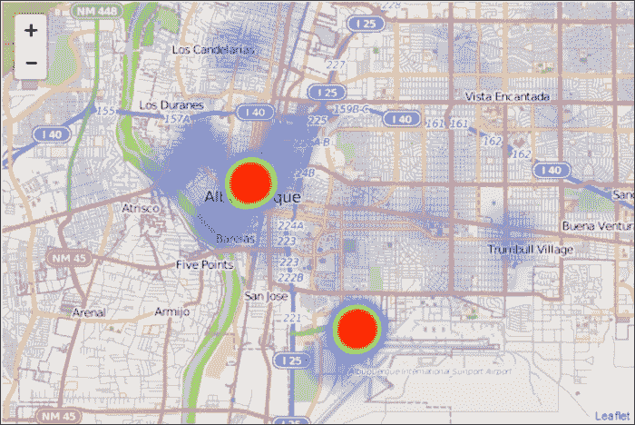

上述截图是默认的热力图；它并不十分时尚。

## 使用选项来设置地图样式

`Leaflet.heat` 允许你向构造函数传递选项。选项如下：

+   `最大缩放级别`

+   `最大值`

+   `半径`

+   `模糊度`

+   `渐变`

最重要的选项是 `blur`、`maxZoom` 和 `radius`。

### 改变模糊值

模糊将点合并在一起，或者不合并。低模糊值将创建单独的点，而高数值将使点相互合并并看起来更流畅。模糊过度会导致点变得模糊。以下截图显示了不同的模糊值。

以下截图显示了模糊值设置为 `1`：

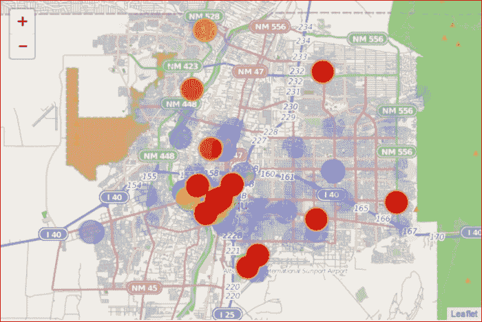

以下截图显示了模糊值设置为 `40`：

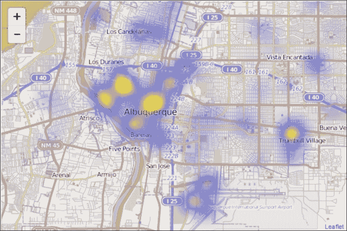

以下截图显示了模糊值设置为 `80`：

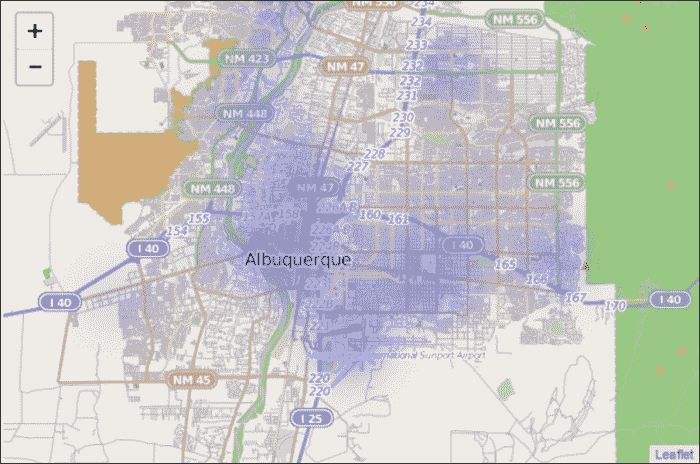

注意在 `80` 时，模糊消除了地图上的任何热点；它变得模糊。找到完美值需要一些时间。从默认值 `15` 开始是一个好主意。

### 更改最大缩放值

`maxZoom` 选项将点设置为指定缩放的最大强度。如果您设置了地图的 `maxZoom` 选项，则可以忽略此设置。您应该将其设置为地图看起来最好的缩放级别。如果您设置得太远，当您放大时，点会失去其热度，如果您设置得太紧，用户可能无法一次性看到地图上的所有点。

### 更改半径值

此选项应该是显而易见的。它调整点的半径。数字小则点小，数字大则点大。数据点的数量会影响点的适当半径。点越多，每个点可以越小，同时仍然可以读出地图。将半径设置得太大会创建一个难以解释的大值块。

### 设置渐变选项

`gradient` 选项允许您指定不同级别的颜色。默认设置为 `{.4:"blue",.6:"cyan",.7:"lime",.8:"yellow",1:"red"}`。您可以从 `0` 到 `1` 指定范围。最外层的颜色是 `0`，中心是 `1`。默认设置通常是大多数人都理解的常见颜色范围。保留默认设置是最佳选择，但如果出于某种原因需要更改颜色，您也可以更改。

### 注意

要创建一个视觉上令人愉悦的颜色组合，您可以使用像 Color Brewer 2 这样的工具。它可在 [`colorbrewer2.org/`](http://colorbrewer2.org/) 获取。

## Leaflet.heat 方法

除了样式化热图选项外，`Leaflet.heat` 还提供了以下四种方法：

+   `setOptions(options)`

+   `addLatLng(latlng)`

+   `setLatLngs(latlngs)`

+   `redraw()`

您可以重置样式、添加新数据、加载所有新数据并重新绘制地图。您将使用最多的方法是 `addLatLng()` 方法。此方法允许您将数据追加到地图中。在先前的示例中，您可以将以下代码作为最后一行添加：

```js
heat.addLatLng([35,-106]);
```

前面的代码使用`addLatLng()`方法将点（`35,-106`）添加到地图上。在[`Leaflet.github.io/Leaflet.heat/demo/draw.html`](http://Leaflet.github.io/Leaflet.heat/demo/draw.html)有一个使用`addLatLng()`与事件结合的出色示例。当你移动鼠标时，点会实时添加到地图上。

### 小贴士

`redraw()`方法由`setOptions()`、`addLatLng()`和`setLatLngs()`调用，这样你就不需要在执行这些方法之后调用它。

如果你想在单个地图上显示多个数据集，你可以编写一个自定义函数来添加另一个集。以下代码添加了一个数据集。你需要用你的其他数据集填充`newPoints`变量：

```js
function add(){
heat.setLatLngs(newPoints);
}
heat.setLatLngs(newPoints);
```

在前面的代码中，添加了一个名为`newPoints`的数据集到地图，并移除了旧的数据集 points。在你的 HTML 中，创建一个按钮来执行该函数：

```js
<button onclick="addNewPoints()">Addonclick="add ()">Add New Points</button>
```

前面的代码是当点击时调用`addNewPoints()`函数的 HTML。

## 将标记添加到热力图

你需要一系列点来创建热力图，为什么不利用它们将弹出层附加到热层。在数据中，有一个纬度、经度和一个包含图像 URL 的第三个字段。以下代码展示了如何将数据转换为带有弹出层的标记：

```js
for(var i=0;i<points.length;i++)
{
L.marker([parseFloat(points[i][0]),parseFloat(points[i][1])],{opacity:0}).bindPopup(points[i][2],{keepInView:true}).addTo(map);
}
```

上述代码是一个以`0`开始的循环标准，直到你迭代完所有点——`points.length`。通过传递每个点的纬度和经度，`points[i][0]`和`points[i][1]`，并将它们转换为浮点值来创建一个标记。接下来，将`opacity`选项设置为`0`。这使得点变得不可见。这些点位于地图上，可以点击，但你看不见它们。这给人一种包含弹出层的热点层的外观。最后，将`bindPopup()`方法传递给图像的 URL，`bindPopup(points[i][2])`，并将其添加到地图上。以下截图显示了带有不可见标记和热层的弹出层：

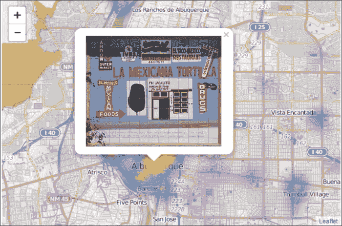

# 使用 heatmap.js 创建热力图

使用`heatmap.js`在 Leaflet 中创建使用强度的热力图是可行的。你可以在[`www.patrick-wied.at/static/heatmapjs/index.html`](http://www.patrick-wied.at/static/heatmapjs/index.html)获取`heatmap.js`。这包括`leaflet.js`和其他地图包的插件。创建热力图的过程与前面的例子类似。以下步骤将指导你创建热力图：

1.  使用`LeafletEssentials.html`，通过以下代码将`heatmap.js`和`heatmap-Leaflet`的引用添加到其中，无论是远程副本的 URL 还是本地副本的路径：

    ```js
    <script type="text/javascript" src="img/heatmap.js"></script>
    <script type="text/javascript" src="img/heatmap-Leaflet"></script>
    ```

1.  添加一个具有强度`max`值的 JavaScript 对象和一个数据数组：

    ```js
    Var myData={max: 46,
    data: [{lat: 33.5363, lon:-117.044, value: 1},{lat: 33.5608, lon:-117.24, value: 1}]};
    ```

1.  创建热层并设置选项：

    ```js
    Var heatmapLayer = L.TileLayer.heatMap({
    radius: 20,
    opacity: 0.8,
    gradient: {
                            0.45: "rgb(0,0,255)",
                            0.55: "rgb(0,255,255)",
                            0.65: "rgb(0,255,0)",
                            0.95: "rgb(255,255,0)",
                            1.0: "rgb(255,0,0)"
                        }
                    });
    ```

1.  将数据添加到地图中。因为数据在一个对象中，您使用点符号，将其引用为 `objectname.data`；在这种情况下，`myData.data`。您也可以使用 `myData['data']`：

    ```js
    heatmapLayer.addData(myData.data);
    ```

1.  最后，修改您的 `map` 对象以添加图层：

    ```js
    var map = new L.Map('map', {
    center: new L.LatLng(35,-106),
    zoom: 12,
    layers: [baseLayer, heatmapLayer]
                    });
    ```

### 注意

请注意，目前您可能需要参考 Leaflet 的旧版本。这将在插件的未来版本中更新。

您的地图应该看起来像以下截图所示：

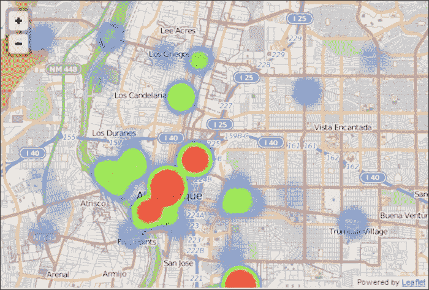

## 修改热图选项

热图允许您修改三个设置：`radius`、`opacity` 和 `gradient`。与上一个示例一样，`gradient` 控制地图中每个点的大小。`opacity` 选项允许您指定介于 `0` 和 `1` 之间的值。`0` 表示完全透明，热图层将不会显示在地图上。值 `1` 将使热图层变为实心，您将无法看到每个点下面的内容。介于 `.70` 和 `.80` 之间的值似乎查看热层和下面的基础层是完美的透明度。最后，梯度，虽然最好保持不变，但可以通过设置值从 `0` 到 `1` 并分配颜色来修改。梯度中的颜色可以是 RGB 值，或者您可以使用颜色名称：红色、黄色、蓝色或青色。

## 向地图添加更多数据

在地图绘制完成后，您最终可能需要向地图添加更多数据。为此，您需要向对象中追加值，然后再次添加该对象。首先，要向 JavaScript 对象中添加数据，您可以使用以下代码：

```js
myData. push({lat:35,lon:-106,value:46});
```

`myData` 对象有一个键 `data`，它是一个数组。您可以通过使用 `myData.data[index]` 来引用它。您可能不知道数组中有多少项，因此使用数组的长度作为索引，您将始终获得下一个可用的索引。这是因为长度是项目数，但索引从 `0` 开始。所以，对于有三个项目的数组，长度是三，但最后一个索引是二。使用长度为您提供下一个空索引。然后，只需将值分配给索引，它将被追加到对象中。最后，再次将数据添加到地图中：

```js
heatmapLayer.addData(myData.data);
```

### 注意

如果您不使用索引，您将用要添加的一个项目覆盖数据。

# 创建交互式热图

热图是点图的一种替代可视化方式。点图经常因为大标记而变得杂乱，难以找到热点。在强度热图中，单个点可能是一个热点。热图中值的颜色编码使得查看数据中的模式变得容易。热图还可以用于可视化其他空间数据，例如跟踪鼠标在网页上的移动或人们在屏幕上阅读时眼睛的移动。在这个例子中，您将学习如何创建一个对用户在地图上点击鼠标做出响应的热图：

1.  首先，包含对 `Leaflet.heat.js` 的引用：

    ```js
    <script src="img/Leaflet-heat.js"></script>
    ```

1.  接下来，在地图上禁用`doubleClickZoom`选项。由于用户将点击地图来创建热力图，你需要这样做，以便当用户点击得太快时（他们会的），地图不会缩放：

    ```js
    var map = L.map("map",{doubleClickZoom:false}).setView([35.10418, -106.62987], 10);
    ```

1.  创建一个空白的数据集，可以添加到地图中。这允许用户在新的画布上绘制：

    ```js
    var points=[];
    ```

1.  将数据添加到地图中：

    ```js
    var heat = L.heatLayer(points,{maxZoom:10}).addTo(map);
    ```

1.  创建一个处理用户点击的函数。这个函数将通过捕捉鼠标点击的纬度和经度来向图层添加点。`e`参数是一个事件对象，它在地图点击时自动发送。该对象包含有关事件的信息，在这个例子中，你取纬度和经度，如下面的代码所示：

    ```js
    Function addpoint(e){
    heat.addLatLng(e.latlng);
    }
    ```

1.  将函数连接到事件，在这种情况下，是`click`事件：

    ```js
    map.on('click',addpoint);
    ```

你的地图在点击几次后，应该看起来像以下截图所示：

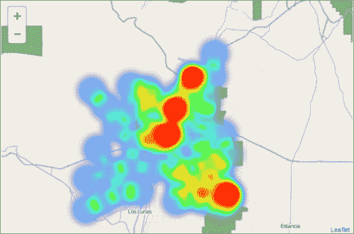

# 动画热力图

到目前为止，你已经创建了一个显示当前点密度和强度的热力图，但如果你想要显示随时间变化的热力图呢？在这个最后一个例子中，你将学习如何创建热力图动画。

动画热力图并不像听起来那么复杂。动画不过是向地图添加和删除数据，你已经在本章的早期掌握了这些技能。这个例子中的技巧在于数据的组织和利用 JavaScript 中的时间事件。以下步骤将指导你制作一个动画热力图：

1.  引用热力图插件：

    ```js
    <script src="img/Leaflet-heat.js"></script>
    ```

1.  接下来，将你的数据按时间周期分别放入一个数组中。用相同的名字命名你的数据，然后根据时间周期增加一个数字。以下代码可以用于此目的：

    ```js
    var points1=[[35,-106],[35,-106]];
    var points2=[[35.10418, -106.62987],[32,-104]];
    var points4=[[33, -104.],[35,-107]];
    ```

1.  将起始数据集添加到地图中：

    ```js
    var heat = L.heatLayer(points1,{maxZoom:10}).addTo(map);
    ```

1.  接下来，创建一个将遍历数据集的变量和一个包含数据集名称的字符串。请注意，迭代器从`2`开始。这是因为你在循环之前加载了`points1`：

    ```js
    x=2;
    var name="";
    ```

1.  创建一个区间，并传递一个函数以及以毫秒为单位的时间（1,000 毫秒等于一秒）：

    ```js
    var interval = setInterval(function(){run()},1000);
    ```

1.  创建一个执行动画的函数。以下代码创建了一个`name`字符串，即数据名称与迭代数字的连接。当前图层从地图中移除，下一个图层被添加。你不能使用字符串作为名称来调用变量，所以我们使用`window[name]`。最后，代码增加`x`迭代器：

    ```js
    function run(){
    name="points"+x.toString();
    map.removeLayer(heat);
    heat = L.heatLayer(window[name],{maxZoom:10}).addTo(map);
    var x++;
    }
    ```

当你加载地图时，你应该看到第一个数据集：

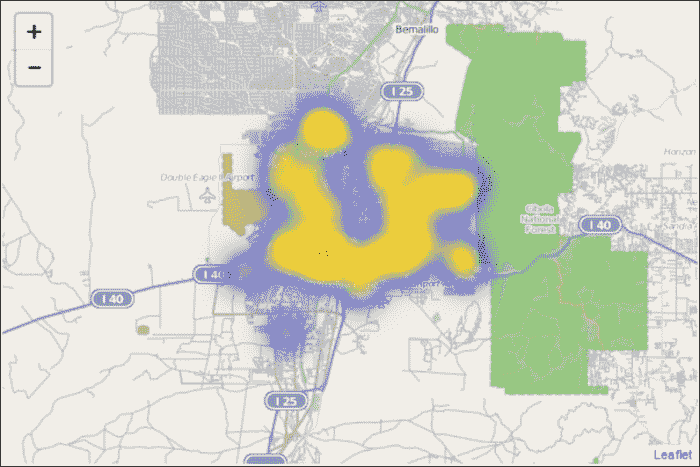

然后，数据将每秒更新一次。以下截图显示了经过几秒后地图将看起来像什么：

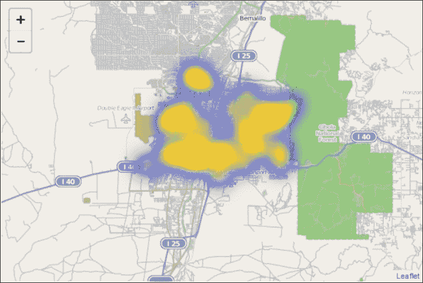

# 使用 Leaflet 创建分级热力图

在前面的例子中，您使用了热图来根据点的密度或强度对地图进行着色编码。等值线图也测量统计变量的强度或密度，但是在多边形内。一个流行的等值线图是按县划分的人口密度。等值线图不需要任何插件，就像热图示例中那样。等值线图通常是通过根据属性对 GeoJSON 进行样式化来创建的。

## GeoJSON 数据

当将大量 GeoJSON 数据添加到地图中时，将代码放在单独的 JavaScript 文件中会更简单。这将清除您的 HTML 文件中的数百行代码，这使得很难专注于构建地图。当您将 GeoJSON 代码放在 JavaScript 文件中时，您将声明它为一个变量，如下面的代码所示：

```js
var ct = {"type": "FeatureCollection", "features": [{"geometry": {"type": "Polygon", "coordinates": [[[-106.501132, 35.093911], [-106.501231, 35.09385], [-106.501481, 35.09376], [-106.50201, 35.09371], [-106.50344, 35.093728], [-106.50424, 35.093709], [-106.50574, 35.093706], [-106.50634, 35.093748], [-106.50748, 35.09368], [-106.508548, 35.0937], [-106.50984, 35.093646], [-106.51071, 35.093618], [-106.51177, 35.093641], [-106.51295, 35.093613], [-106.513934, 35.09361], [-106.51528, 35.093581], [-106.51533, 35.09648], [-106.51534, 35.096889], [-106.515398, 35.09966], [-106.515437, 35.101462], [-106.51419, 35.101452], [-106.51366, 35.10143], [-106.51334, 35.10141], [-106.51308, 35.1014], [-106.51198, 35.101329], [-106.5109, 35.1013], [-106.50975, 35.10123], [-106.50872, 35.10119], [-106.50641, 35.101106], [-106.50643, 35.101358], [-106.50441, 35.101237], [-106.50362, 35.10119], [-106.50289, 35.101146], [-106.50187, 35.101085], [-106.50083, 35.10101], [-106.50058, 35.100989], [-106.50021, 35.10096], [-106.49947, 35.100954], [-106.499153, 35.100933], [-106.49887, 35.100905], [-106.49849, 35.100892], [-106.497853, 35.100895], [-106.49745, 35.10086], [-106.497415, 35.10086], [-106.49766, 35.094788], [-106.49881, 35.09483], [-106.49947, 35.09487], [-106.49977, 35.09498], [-106.50022, 35.095099], [-106.5007, 35.094291], [-106.50093, 35.094034], [-106.501132, 35.093911]]]}, "type": "Feature", "properties": {"NAME10": "1.26", "AWATER10": 0.0, "TRACTCE10": "000126", "ALAND10": 1315885.0, "INTPTLAT10": "+35.0975423", "FUNCSTAT10": "S", "observed": "", "NAMELSAD10": "Census Tract 1.26", "COUNTYFP10": "001", "STATEFP10": "35", "MTFCC10": "G5020", "GEOID10": "35001000126", "id": 6059554, "INTPTLON10": "-106.5067917"}}]};
```

之前的代码是针对单个要素的。完整的文件包含 153 个要素。这将向您的 HTML 文件中添加超过五十页 8.5" x 11"的页面。请注意，该文件不是 GeoJSON，而是 JavaScript。它是一个变量声明。当您在 HTML 中引用此文件时，您可以在脚本中调用`ct`变量。一旦您在 JavaScript 文件中将数据作为变量，就在`LeafletEssentials.html`中链接到它：

```js
<script src="img/censustracts.js"></script>
```

之前的代码显示了您如何引用任何包含的 JavaScript 文件。

## 使用函数设置颜色

制作等值线图的下一步是为每个要素根据您要映射的统计变量分配颜色。定义一个函数来处理值的范围，如下面的代码所示：

```js
function color(x) {
return x > 200000 ? '#990000' :
x> 100000  ? '#d7301f' :
x> 30000  ? '#ef6548' :
x> 20000  ? '#fc8d59' :
x> 10000   ? '#fdbb84' :
x> 5000   ? '#fdd49e' :
x> 0   ? '#fee8c8' :'#fff7ec';
              }
```

之前的代码接受一个参数并测量一个值，返回颜色。对于更高的值，返回更深的颜色。始终最好坚持标准的着色进度。使用从浅到深的单色进度——单一颜色——应该会对你大有裨益。使用 Color Brewer 这样的工具将帮助你确保使用一个好的配色方案。您可以在[`colorbrewer2.org/`](http://colorbrewer2.org/)找到它。这将为您提供 RGB、CMYK 和 HEX 格式的颜色值。

## 样式化 GeoJSON 数据

接下来，您需要创建一个函数来样式化 GeoJSON 数据。使用函数允许您根据属性样式化每个单独的要素。以下代码将样式化要素：

```js
Function myStyle(feature) {
return {
fillColor: color(feature.properties.AWATER10),
weight: 1,
opacity: 1,
      color: 'white',
      fillOpacity: 0.85
   	 };
}
```

该函数接受要素作为参数，并使用一些选项对其进行样式化。重要的选项是`fillColor`选项。这是您调用`color()`函数并传递每个要素的`AWATER10`值的地方。最后，将`GeoJSONLayer`变量添加到地图中，并使用样式函数作为参数，如下面的代码所示：

```js
var GeoJSONLayer = L.GeoJSON(ct, {style: myStyle}).addTo(map);
```

之前的代码使用样式函数将图层添加到地图中。结果将类似于以下截图所示：

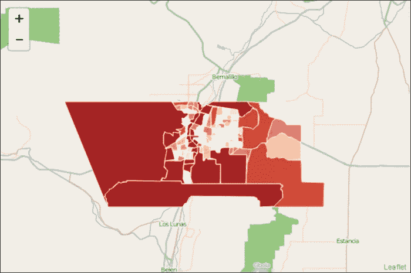

使用总值，例如人口普查区的水域面积，可以通过使用土地面积来标准化你的数据来改进。这一点很重要，因为没有标准化，值可能会偏斜。例如，假设有两个地点，土地面积分别为 100 英亩和 50 英亩。如果它们都有一片 10 英亩的湖，并且你使用标准化进行着色，它们将呈现相同的颜色。当你进行标准化时，值将是`.1`和`.2`。第二个地点是 20%的水，而第一个地点只有 10%。没有标准化，这个事实就会丢失。在下一个例子中，你将构建一个显示总值和标准化值的地图。

# 创建标准化的面状图

在这个例子中，你将创建一个面状图，显示总面积和总面积除以总面积的值。以下步骤将指导你完成这个过程：

1.  使用前一个示例中的代码，添加另一个具有新范围值的颜色函数。它们的值将比总值的要小得多：

    ```js
    function densitycolor(x) {
    return x > 0.15 ? '#990000' :
    x> 0.12  ? '#d7301f' :
    x> 0.06  ? '#ef6548' :
    x> 0.03  ? '#fc8d59' :
    x> 0.01  ? '#fdbb84' :
    x> 0.005   ? '#fdd49e' :
    x> 0   ? '#fee8c8' :'#fff7ec';                      
    }
    ```

1.  接下来，定义另一个样式函数。这个函数的关键区别在于传递给颜色函数的值将是`水`/`土地`：

    ```js
    function densityStyle(feature) {
    return {
    fillColor: densitycolor(feature.properties.AWATER10/feature.properties.ALAND10),
    weight: 1,
    opacity: 1,
          color: 'white',
          fillOpacity: 1
        };
    }
    ```

1.  在地图底部创建两个按钮以选择要显示的哪一种面状图。将这些按钮连接到一个函数：

    ```js
    <button onclick="total()">Total</button>
    <button onclick="density()">Water/Land</button>
    ```

1.  最后，编写显示图层的函数。在显示正确的图层后，移除其他图层：

    ```js
    function total(){
    var GeoJSONLayer = L.GeoJSON(ct, {style: myStyle}).addTo(map);
    removeLayer(densitylayer);
    }
    function density(){
    var densitylayer=L.GeoJSON(ct,GeoJSON {style: densityStyle}).addTo(map);
    removeLayer(GeoJSONLayer);
    }
    ```

你的地图现在应该是空的。你没有在地图上加载任何图层。你现在可以通过点击地图底部的按钮之一来选择你想要查看的图层。尝试点击另一个按钮。点击标有**水/土地**的按钮。你的地图应该看起来像以下截图所示：

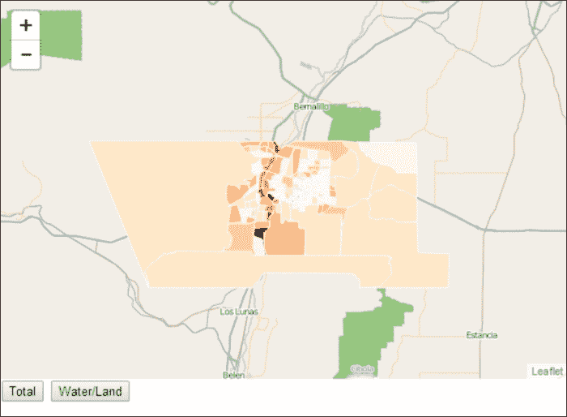

注意，一旦你将土地面积标准化，拥有最多水的区域——最深红色区域——是靠近**里奥格兰德**地区的小块土地。这些大面积的土地有水，但这只占总面积的一小部分。

# 摘要

在本章中，你已经将你的制图技能从点、线、多边形和 GeoJSON 扩展到创建地图可视化——热力图和面状图。你已经学习了如何使用两个不同的插件来制作热力图以及如何为最大视觉效果进行样式化。你还学习了如何使热力图交互式，并创建动画来显示时间序列数据。面状图不需要插件。你学习了如何样式化 GeoJSON 数据以创建面状图。最后，你学习了总数据与标准化数据之间的区别。

在下一章中，你将学习如何创建自己的标记。你还将了解几个插件，这些插件可以动画化和增强地图上的标记。
