# 第四章。创建自定义标记

在第三章中，您学习了如何通过修改默认标记来进一步自定义地图样式，以创建热图和面状图。Leaflet 允许您通过创建自定义标记图标来进一步自定义地图样式。您还将了解可用于样式和效果的可用标记插件。

# 创建自定义标记

在 Leaflet 中，标记由两个图像组成：一个表示标记的图像和一个作为阴影以创建深度的第二个图像。当您下载 Leaflet 时，有一个`images`文件夹。这个文件夹包含默认标记：您在地图上看到的蓝色图钉以及一个小阴影图像。这些图像被命名为`marker-icon.png`和`marker-shadow.png`。默认标记和阴影在以下屏幕截图中显示：

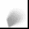

## 在 GIMP 中准备您的作图空间

要创建您自己的自定义标记，您需要在绘画应用程序中绘制一个图像。在这个例子中，您将使用免费的**GNU 图像处理程序**（**GIMP**）。GIMP 是一个功能强大的图像处理程序，类似于 Adobe Photoshop，可以在大多数操作系统上运行，并且完全免费。要下载 GIMP，请访问[`www.gimp.org/downloads/`](http://www.gimp.org/downloads/)并点击**下载 GIMP 2.8.10**。

### 注意

您不需要选择 32 位或 64 位版本。GIMP 包括两者，安装程序运行时会确定适当的版本。

安装 GIMP 后，启动应用程序。应用程序包含三个窗口：屏幕左侧和右侧的两个面板以及中心的主窗口。您可以通过导航到**窗口** | **单窗口模式**将三个窗口合并为一个标准的单窗口应用程序。要创建一个新的图像文件，请导航到**文件** | **新建...**。您将看到一个新图像对话框。输入图标图像的宽度和高度。如果高级选项未展开，请点击菜单以展开窗口。您可以输入分辨率或接受默认值。**填充**选项是最重要的。您必须从下拉菜单中选择**透明度**。如果您不选择**透明度**，则您的图标将是一个带有背景颜色的正方形或矩形。这不会在您的地图上看起来很吸引人。对话框现在应该看起来像以下截图：

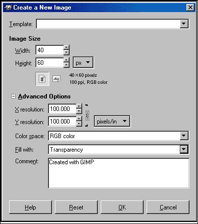

## 绘制并保存您的图像

现在画布已经设置好了，您可以绘制您的图像。我们如何绘制图像超出了本书的范围。

### 注意

如果您想了解 GIMP，可以查看*Gimp 2.6 烹饪书*，作者*胡安·曼努埃尔·费雷拉*，*Packt 出版公司*，可在[`www.packtpub.com/gimp-2-6-cookbook/book`](http://www.packtpub.com/gimp-2-6-cookbook/book)找到。

如果您在 GIMP 中绘制感到舒适，创建一个可以用作图标的图片。一旦创建图片，导航到**文件** | **导出为...**。如果您尝试使用**保存**或**另存为…**选项，您将不会得到 PNG 格式的选项。**导出图片**对话框允许您选择文件名和您希望保存文件的位置。在对话框的左下角，展开标有**选择文件类型（按扩展名）**的菜单。向下滚动到**PNG 图片**并点击**导出**。您将看到一个**导出图片为 PNG**的对话框。您必须勾选**保存透明像素的颜色值**选项。选项表单应类似于以下截图所示：

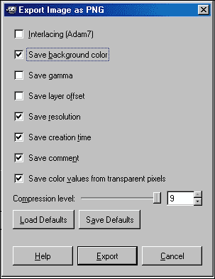

点击**导出**按钮保存图片。以下截图是完成后的图标：


## 绘制标记阴影

在 GIMP 中创建另一个新的图片，但选择更大的宽度和较小的长度：60 x 40。阴影需要从标记尖端开始，并向右大约 45 度延伸。在 GIMP 中，您可以将光标移到图片上，并看到光标的像素坐标。阴影图片在 20 像素处水平绘制。以下截图显示了图标尖端的光标和窗口左下角的坐标：

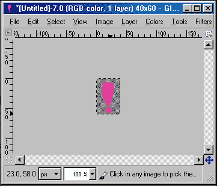

在阴影图片上，从像素 20 开始向图片右上角进行着色。完成后的阴影图片将类似于以下截图所示：

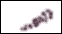

## 使用图片作为图标

您也可以使用图片作为图标。图片不一定是 PNG 格式或具有透明背景。您可以在 GIMP 中纠正所有这些问题。在 GIMP 中，导航到**文件** | **打开**并选择您的图片。本例中的图片是带有白色背景的 JPG 格式。

在**图层**面板中，您应该看到一个包含您图片的单个图层。右键点击图层并选择**添加 Alpha 通道**。

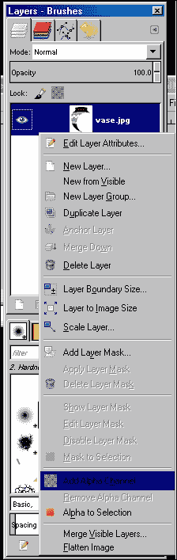

现在您可以选择橡皮擦工具或魔术棒来移除背景颜色。按照上一节中的说明导出图片。您仍然需要为您的标记图标绘制阴影。按照前一个示例中的阴影步骤进行，并保存图片。

现在您已经有了两个图片——图标和阴影——是时候在您的 Leaflet 地图中使用它们了。

# 在 Leaflet 中使用自定义标记

要在 Leaflet 中创建标记图标，你需要创建`L.icon`类的实例。`L.icon`类接受 10 个选项，如下所示：

+   `iconUrl`

+   `iconRetinaUrl`

+   `iconSize`

+   `iconAnchor`

+   `shadowUrl`

+   `shadowRetinaUrl`

+   `shadowSize`

+   `shadowAnchor`

+   `popupAnchor`

+   `className`

唯一必需的选项是`iconUrl`。在这个例子中，你将忽略视网膜图像和类名。打开`LeafletEssentials.html`并添加以下代码：

```js
var myIcon = L.icon({
    iconUrl: 'mymarker.png',
    shadowUrl: 'shadow.png',
    iconSize:     [40, 60], 
    shadowSize:   [60, 40], 
    iconAnchor:   [20, 60], 
    shadowAnchor: [20, 40],  
    popupAnchor:  [0, -53] 
});
```

前面的代码设置了选项。`iconUrl`选项将 URL 指向图标图像，而`shadowUrl`选项将 URL 指向阴影图像。`iconSize`和`shadowSize`选项需要以宽度乘以高度格式的图像尺寸。

`iconAnchor`选项设置标记和图标接触地图的点以及弹出窗口接触图标的位置。标记在水平像素 20 处有一个点，因此这将是以锚点加上图像的像素高度。阴影是在标记的点处绘制的，因此其锚点将是 20，其高度将是 40 像素。你希望弹出窗口在标记的顶部中心绘制，因此你必须相应地设置其锚点。

`popupAnchor`选项相对于`iconAnchor`选项设置。图标点水平居中，因此弹出窗口锚点将是 0 像素，使其锚定在 20 像素处。要将锚点放置在标记的顶部，你减去像素。选择-53 作为弹出窗口锚点将弹出窗口正好放在图标上方。

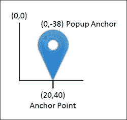

接下来，你需要创建一个标记并告诉它使用你创建的新图标。以下代码将做到这一点：

```js
var marker = L.marker([35.10418, -106.62987],{icon: myIcon}).addTo(map).bindPopup("I am a custom marker.");
```

在第一章 *使用 Leaflet 创建地图* 中，你使用几个选项创建标记——其中一个选项是`draggable:true`。标记类也接受一个图标作为选项。在前面的代码中，`icon`选项接受一个`L.Icon`对象的名称。

保存`LeafletEssentials.html`并在浏览器中打开它。你应该看到一个与以下截图类似的地图：

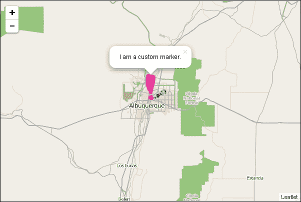

## 定义 L.Icon 类

你也可以扩展`L.Icon`类来创建你自己的标记类。这允许你创建各种颜色的标记，并且只需指定一次大小和锚点选项。这个例子将非常类似于上一个例子。将以下代码添加到你的`LeafletEssentials.html`文件中：

```js
var MyIcon = L.Icon.extend({
    options:{
    shadowUrl: 'shadow.png',
    iconSize:     [40, 60], 
    shadowSize:   [60, 40], 
    iconAnchor:   [20, 60], 
    shadowAnchor: [20, 40],  
    popupAnchor:  [0, -53] }
});
```

前面的代码看起来几乎与上一个示例中的代码相同，除了以下差异：

+   第一行，它不是创建一个新的`L.icon`类，而是扩展它

+   选项在第二行被包裹在一个对象中

+   没有提供`iconUrl`选项

通过将选项包裹在一个对象中，你可以在创建标记时传递额外的选项。将以下代码添加到`LeafletEssentials.html`文件中：

```js
var redIcon= new myIcon({iconUrl: 'mymarker.png'});
var blueIcon=new myIcon({iconUrl: 'mybluemarker.png'});
```

上一段代码为每个新的 `icon` 对象设置了 `iconUrl` 选项。现在，在一行代码中，您就拥有了一个红色和蓝色的图标。您现在可以将图标分配给标记，如下面的代码所示：

```js
var marker = L.marker([35.10418, -106.62987],{icon: redIcon}).addTo(map).bindPopup("I am a custom marker.");
var marker = L.marker([35, -106],{icon: blueIcon}).addTo(map).bindPopup("I am a custom marker.");
```

在上一段代码中，每个标记被分配了不同颜色的图标。结果如下面的截图所示：

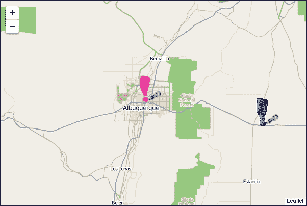

# 使用插件预定义标记

在前三个章节中，您使用了默认的 Leaflet 标记。在本章中，您刚刚学习了如何绘制自己的或使用现有的图像。自己绘制并不总是实用的，尤其是如果您不擅长绘画。在本节中，您将了解两个插件，它们提供了您可以自定义并用于 Leaflet 地图的时尚标记：Maki 标记和 Bootstrap/Awesome 标记。

## 使用 Mapbox Maki 标记

Mapbox 是一家提供地图平台和工具的公司。其图标已通过 `Leaflet.MakiMarkers` 插件提供。您可以在 [`github.com/jseppi/Leaflet.MakiMarkers`](https://github.com/jseppi/Leaflet.MakiMarkers) 下载此插件。

### 注意

您可以通过访问他们的网站 [`mapbox.com`](http://mapbox.com) 了解 Mapbox。

Maki 标记是一个拥有超过 100 个可用标记的开源图标库。您可以在 `Leaflet.MakiMarkers.js` 文件中找到它们的完整名称列表，或访问网站 [`www.mapbox.com/maki/`](https://www.mapbox.com/maki/)。以下截图显示了所有图标：

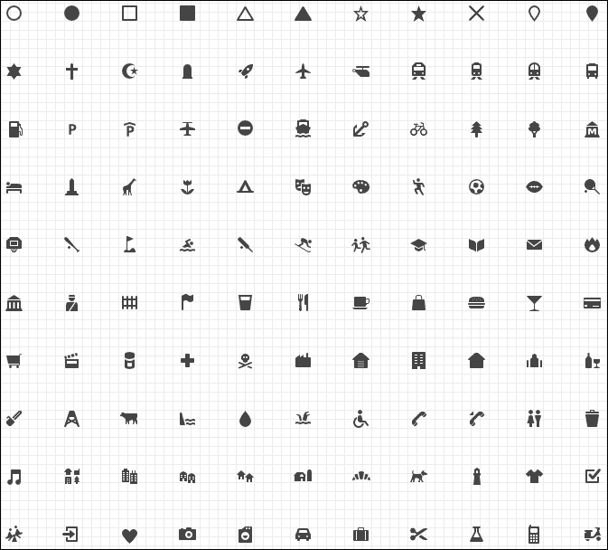

上一张截图中的图标放置在彩色标记符号上。在您的地图中使用标记只需要两行代码和三个选项。以下步骤将帮助您创建 Maki 标记并将其放置在您的地图上：

1.  添加对 JavaScript 文件的引用。此插件不需要 CSS 文件：

    ```js
    <script src="img/Leaflet.MakiMarkers.js"></script>
    ```

1.  创建一个图标。您必须选择三个选项：您想要使用的图标图像、标记的十六进制颜色值以及大小（`s`、`m`、`l`）：

    ```js
    var icon = L.MakiMarkers.icon({icon: "rocket", color: "#0a0", size: "l"});
    ```

1.  将图标添加到标记中，并将标记添加到地图中：

    ```js
    L.marker([35.10418, -106.62987], {icon: icon}).addTo(map);
    ```

当您选择一种颜色时，将会有相同颜色的浅色轮廓。以下截图显示了上一段代码的结果：

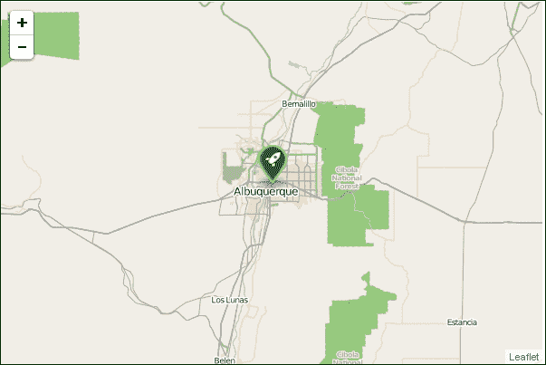

## 使用 Bootstrap 和 Font Awesome 标记

另一个允许您使用预定义标记的 Leaflet 插件是 `Leaflet.awesome.markers`。此插件允许您选择 Twitter Bootstrap 标记或 Font Awesome 标记。如果您无法选择，您始终可以使用两者。不同的库为您的标记提供不同的图标和略微不同的功能。您使用哪个是个人偏好。您可以在 [`github.com/lvoogdt/Leaflet.awesome-markers`](https://github.com/lvoogdt/Leaflet.awesome-markers) 下载此插件。

使用 `Leaflet.awesome.markers` 的过程几乎与您在 Maki 标记示例中使用的相同。您可以执行以下步骤：

1.  添加对 Twitter Bootstrap 或 Font Awesome 或两者的引用。还要添加对`Leaflet.awesome.markers`的 CSS 和 JavaScript 的引用：

    ```js
    <link rel="stylesheet" href="http://netdna.bootstrapcdn.com/bootstrap/3.2.0/css/bootstrap.min.css">
    <link rel="stylesheet" href="http://netdna.bootstrapcdn.com/bootstrap/3.2.0/css/bootstrap-theme.min.css">
    <link href="http://maxcdn.bootstrapcdn.com/font-awesome/4.1.0/css/font-awesome.min.css" rel="stylesheet">
    <link rel="stylesheet" href="Leaflet.awesome-markers.css">
    <script src="img/bootstrap.min.js"></script>
    <script src="img/Leaflet.awesome-markers.js"></script>
    ```

1.  创建一个 Twitter Bootstrap 标记并将其添加到地图中。Bootstrap 标记是默认的。你只需要设置图标图像和颜色选项。创建标记并将其添加到地图中：

    ```js
    var redMarker = L.AwesomeMarkers.icon({
        icon: 'tint',
        markerColor: 'red'
      });
      L.marker([35.10418, -106.62987], {icon: redMarker}).addTo(map);
    ```

1.  创建一个 Font Awesome 标记并将其添加到地图中。由于 Bootstrap 是默认的，你需要使用`prefix`选项并设置值为`fa`来使用 Font Awesome。此示例还使用了`spin:true`选项来创建一个旋转的动画标记。创建标记并将其添加到地图中：

    ```js
    var blueMarker = L.AwesomeMarkers.icon({
        prefix:'fa',
        spin:true,
        icon: 'spinner',
        markerColor: 'blue'
      });
      L.marker([35, -106], {icon: blueMarker}).addTo(map);
    ```

以下代码将生成以下截图所示的地图：

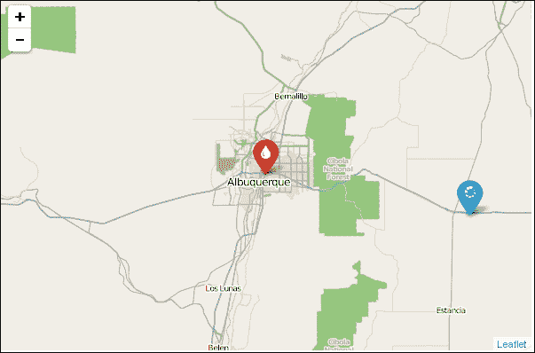

你可能没有足够的时间来创建自己的标记，并且当你有使用 Mapbox、Twitter 或 Font Awesome 图标的选择时，为什么还要重新发明轮子呢？利用已经完成的工作，并且做得非常好。

# 使用 Leaflet.markercluster 进行标记簇

随着你创建更多的地图，你最终会遇到包含数千个点的数据集。在地图上显示 10,000 个点会导致加载时间慢，缩放和平移时动画滞后，并且使得用户难以选择单个标记或理解数据。簇功能允许你将标记分组到簇中——随着缩放级别的增加而展开的单个点。这样，你可以获得数据规模的感觉，而不会因为点的数量众多而感到视觉上被淹没。如果你需要查看单个点，你可以放大到感兴趣的区域或点。`Leaflet.markercluster`是一个快速且功能强大的簇实现，同时也具有视觉吸引力。

### 注意

你可以从[`github.com/Leaflet/Leaflet.markercluster`](https://github.com/Leaflet/Leaflet.markercluster)下载此插件。

## 编写你的第一个簇地图

标记簇只是 Leaflet 中层的另一个例子。因此，创建一个标记簇应该对你来说非常熟悉。你需要执行以下步骤：

1.  使用`LeafletEssentials.html`，添加对`Leaflet.markercluster` CSS 文件和 JS 文件的引用，如下面的代码所示：

    ```js
    <link rel="stylesheet" href="MarkerCluster.Default.css" />
    <script src="img/Leaflet.markercluster.js"></script>
    ```

1.  你可以将一系列标记添加到层中，但由于你将加载 723 个点，你将使用包含数据的 JS 文件。数据可以具有额外的属性。在这个例子中，有一个指向图像文件的链接。添加对包含数据的 JS 文件的引用：

    ```js
    <script src="img/art.js"></script>
    ```

1.  由于你现在知道如何创建自定义标记图标，以下代码创建了一个图标类和一个在簇展开时可以使用的图标：

    ```js
    var abqIcon = L.Icon.extend({
            options: {
                shadowUrl: 'vase-shadow.png',
                iconSize:     [50, 64],
                shadowSize:   [50, 64],
                iconAnchor:   [25, 64],
                shadowAnchor: [0, 64],
                popupAnchor:  [-3, -64]
            }
        });

    var vase = new abqIcon({iconUrl: 'vase.png'});
    ```

1.  现在，通过创建`MarkerClusterGroup`类的实例来创建一个`markercluster`层。将`showCoverageOnHover`选项设置为`false`：

    ```js
    var markers = new L.MarkerClusterGroup({showCoverageOnHover:false});
    ```

1.  要将标记添加到组中，您需要一个函数，该函数使用数据文件中的数组来遍历每个数据点，并将纬度、经度和您想在弹出窗口中使用的任何其他属性添加到标记中。循环创建一个标记，绑定一个弹出窗口，并将标记作为图层添加到`markercluster`组中。然后，调用该函数以开始加载数据：

    ```js
    function populate() {
      for (var i = 0; i < artPoints.length; i++) {
          var a = artPoints[i];
          var title = a[2];
    var marker = new L.Marker(new L.LatLng(a[0], a[1]), { icon: vase , title: title });
          marker.bindPopup(title);
          markers.addLayer(marker);

              }
          }

    populate();
    ```

1.  最后，使用以下代码将`markercluster`组图层添加到地图中：

    ```js
    map.addLayer(markers);
    ```

您的地图应该看起来像以下截图：

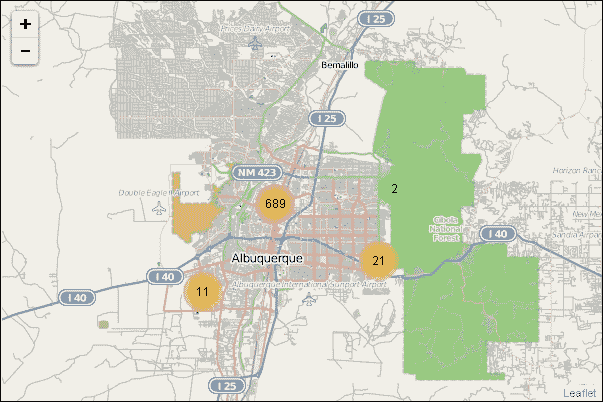

当您将地图缩小时，簇应该展开，分组变得较小。然后，它们将展开以显示单个标记，如下面的截图所示：

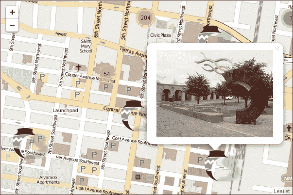

## 标记簇图层可用的方法和事件

`markercluster`图层有几个选项和方法，可以用来创建和交互您的图层。

### 默认为 true 的选项

有四个默认选项，都设置为`true`，如下所示：

+   `showCoverageOnHover`

+   `zoomToBoundsOnClick`

+   `spiderfyOnMaxZoom`

+   `removeOutsideVisibleBounds`

第一个选项显示一个多边形，代表簇中标记的覆盖区域。这可能会令人困惑，因为一个彩色多边形会出现在地图上。在先前的示例中，您将此选项设置为`false`。

当您点击一个簇时，第二个选项会缩放到您点击的簇的覆盖区域多边形。当您将地图缩放到最大或使用定义的`maxZoom`选项时，簇将展开以显示其内的标记。

最后一个选项通过不显示当前地图视图附近不紧密的簇来提高性能。如果您正在查看洛杉矶，则不需要看到纽约的簇。

### 其他选项和事件

您可能还想设置的选项是`animateAddingMarkers`和`maxClusterRadius`。动画标记可以创建一个视觉上有趣的地图，但如果您正在使用大量数据点，可能会降低您地图的性能。这是一种应该谨慎使用并在正确条件下使用的效果。调整簇的半径可以创建更大或更小的簇。默认值为 80 像素。如果您正在显示紧密分组的数据，则需要较小的数字，如果您正在显示分散的数据，可能需要更大的半径。在先前的示例中，如果半径设置为`5`，则标记会覆盖整个地图，因为它们由于半径太小而没有被聚类。以下截图显示了半径设置为`5`时的地图：

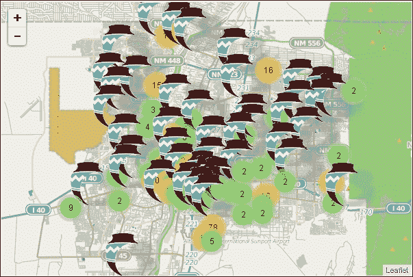

上述截图中标记众多，几乎使地图无法阅读。`markercluster` 层有您可以订阅的事件。通常，您使用 `map.on(click, function)` 在地图上订阅一个事件。对于 `markercluster` 层，您将一个簇添加到可用的层事件中，以便它们应用于 `markercluster` 层，例如 `markers.on(clusterclick,function)`。

# 使用插件动画标记

在接下来的两个部分中，您将学习如何使用 `Leaflet.BounceMarker` 和 `Leaflet.AnimatedMarker` 插件来动画化标记。动画可以为您的地图增添吸引力，但如果过度使用，可能会使地图看起来不够专业。

## 弹跳您的标记

`Leaflet.BounceMarker` 插件没有很多选项来自定义标记或其行为，但它提供了一个简单的动画，当您在地图上添加标记或在悬停事件时非常有用。您可以在 [`github.com/maximeh/leaflet.bouncemarker`](https://github.com/maximeh/leaflet.bouncemarker) 下载并了解更多关于该插件的信息。

以下步骤将向您展示如何将弹跳标记添加到您的地图中：

1.  添加对 JavaScript 文件的引用。此插件不需要 CSS 文件：

    ```js
    <script src="img/bouncemarker.js"></script>	
    ```

1.  创建弹跳标记与创建标准 Leaflet 标记完全相同；插件向 `L.Marker` 类添加了一个额外的选项。因此，弹跳标记有一个 `bounceOnAdd` 选项，默认为 `false`。您创建的每个标记都会弹跳，除非您指定了其他设置。将此选项设置为 `true` 以使任何您希望弹跳的标记弹跳。将标记添加到地图中。

    ```js
    marker = new L.Marker([35.10418, -106.62987], {bounceOnAdd: true,}).addTo(map);
    ```

您可以在弹跳标记上指定的唯一其他选项是高度、持续时间和完成时的回调函数。您按照以下代码设置它们：

```js
marker.bounce({duration: 1000, height: 200}, function(){alert("Finished")});
```

高度以像素为单位，持续时间以毫秒为单位。动画运行需要资源，所以请确保您不会创建运行速度过快的动画，否则您会发现标记消失了，只能看到阴影。此外，如果您打算在移动设备上使用地图，性能可能比在桌面电脑上慢。

`bounce()` 方法与悬停事件配合得很好。当有多个标记并且它们紧密分组时，使您悬停的标记弹跳可以帮助确保您点击的是正确的标记。

要在悬停事件上使标记弹跳，订阅该事件并在鼠标悬停在标记上时调用一个函数：

```js
marker.on('mouseover',function(){marker.bounce({duration: 500, height: 100});});
```

上述代码订阅了 `mouseover` 事件，并在鼠标悬停在标记上时执行一个匿名函数。匿名函数调用 `bounce()` 方法，使标记在您将鼠标移至其上时进行弹跳。

### 注意

`Leaflet.BounceMarker` 插件是一个优秀的插件；然而，您可能会在动画过程中遇到一些小问题。这并不是插件的问题，而是动画的本质和它们所需的大量资源所导致的。

## 制作你的标记移动

使用`Leaflet.AnimatedMarker`插件，您可以使标记沿着多边形移动。当您想要绘制路线的注意力时，这非常有用。沿着路线移动的标记比地图上的线更能吸引人的注意。有关更多信息以及下载插件，请访问[`github.com/openplans/Leaflet.AnimatedMarker`](https://github.com/openplans/Leaflet.AnimatedMarker)。

### 注意

一个需要注意的问题是，如果用户在动画运行时放大地图，标记将从其路径移动并尝试返回。在动画完成之前禁用地图缩放可能是一个好主意。

要动画化您的标记，请执行以下步骤：

1.  添加对 JavaScript 文件的引用。此插件不需要 CSS 文件：

    ```js
    <script src="img/AnimatedMarker.js"></script>
    ```

1.  创建一个多边形来表示标记将动画化的路径：

    ```js
    var line = L.polyline([[35.10306, -106.58695],[35.1046, -106.60137],[35.10727, -106.61734],[35.1046, -106.63794],[35.10601, -106.69287]]);
    ```

1.  创建一个`animatedMarker`变量。标记接受纬度和经度数组。要获取它，使用您创建的线的`getLatLngs()`方法：

    ```js
    var animatedMarker = L.animatedMarker(line.getLatLngs());
    ```

1.  将动画标记层添加到地图中。在这个例子中，您还将添加线路，以便您可以将其作为参考：

    ```js
    map.addLayer(line);
    map.addLayer(animatedMarker);
    ```

当您打开地图时，它应该看起来像以下截图：

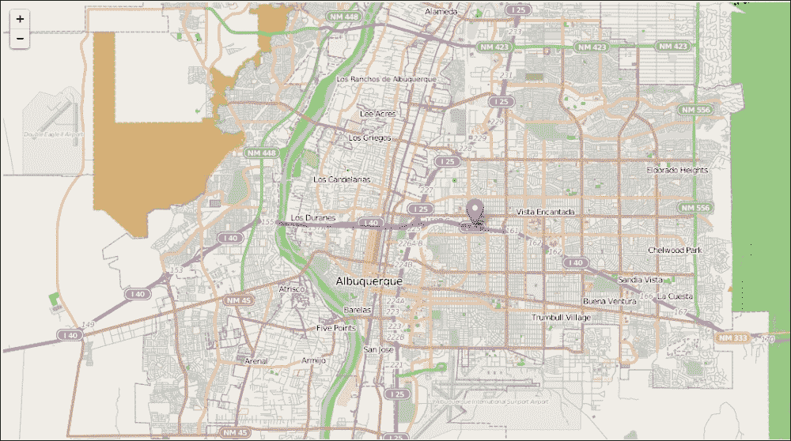

由于您没有向标记传递任何选项，它需要一分钟才能开始移动，并且将以相当慢的速度穿过蓝色线。该插件有以下选项：

+   `距离`

+   `间隔`

+   `autoStart`

+   `onEnd`

`距离`和`间隔`选项设置标记沿线移动的速度。距离以米为单位测量，间隔以毫秒为单位。由于这是一个速度，选项`{distance:100, interval:1000}`会比选项`{distance:300, interval:1000}`慢。在第一种设置中，标记在一秒内覆盖 100 米，而在第二种设置中，它会在相同的时间内覆盖三倍的距离。

`autoStart`选项默认设置为`true`。如果您将其设置为`false`，您可以在准备就绪时在标记上调用`start()`方法。在以下步骤中使用的代码中，您将创建一个带有两个按钮的地图：**开始**和**停止**。使用`autoStart:false`，您将允许用户确定何时开始标记以及何时在路径上停止它：

1.  在使用相同线路和标记的先前示例的基础上，向标记添加`distance`和`interval`选项，并将`autoStart`设置为`false`：

    ```js
    var line = L.polyline([[35.10306, -106.58695],[35.1046, -106.60137],[35.10727, -106.61734],[35.1046, -106.63794],[35.10601, -106.69287]]);
    var animatedMarker = L.animatedMarker(line.getLatLngs(),{autoStart: false, distance: 600, interval: 900});
    ```

1.  编写一个`start()`和`stop()`函数来控制动画。在相应的函数中调用标记的`start()`和`stop()`方法：

    ```js
    function start(){animatedMarker.start();}
    function stop(){animatedMarker.stop();}
    ```

1.  在 HTML 中，在`</body>`标签之前添加两个按钮，并将它们的`onClick`事件设置为相应的函数：

    ```js
    <button onclick="start()">Start</button>
    <button onclick="stop()">Stop</button>
    ```

您的地图应该看起来像以下截图：

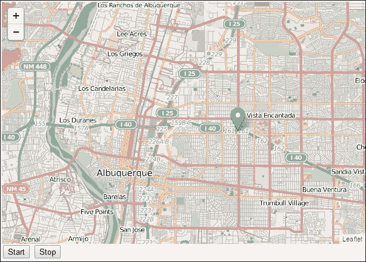

标记器将在用户点击**开始**按钮之前不会移动。当用户点击**停止**按钮时，标记器不会立即停止。动画在每个线段的每个部分发生。当标记器到达线段的终点时，它将停止，并且不会重新开始，直到用户再次点击**开始**。

最后一个设置是`onEnd`。此选项允许您指定一个回调函数，当标记到达线的末端时将运行。在以下步骤中的代码中，您将使用本章前面学到的弹跳标记插件来使标记弹跳，并在完成时消失。按照以下步骤创建您的地图：

1.  在上一个示例的基础上，添加对弹跳标记插件的引用：

    ```js
    <script src="img/bouncemarker.js"></script>	
    ```

1.  在线的最后一点创建弹跳标记：

    ```js
    b = new L.Marker([35.10601, -106.69287], {bounceOnAdd: true});
    ```

1.  编辑动画标记以包含`onEnd`选项和匿名函数。匿名函数将添加弹跳标记到地图上，使其弹跳，删除动画标记，然后等待 900 毫秒并调用一个`bye()`函数，该函数将删除弹跳标记。等待将允许标记在弹跳完成后消失。这将减慢过程，使动画不会如此突然。您也可以使用弹跳标记可用的回调函数而不是`bye()`函数：

    ```js
    var animatedMarker = L.animatedMarker(line.getLatLngs(),{autoStart: false, distance: 600, interval: 900, onEnd: function() {b.addTo(map);b.bounce({duration: 100, height: 50});map.removeLayer(animatedMarker);setTimeout('bye()',900);}});50});map.removeLayer(animatedMarker);setTimeout('bye()',900);}});
    ```

您的地图将看起来与上一个示例完全相同。当标记到达线的末端时，它将看起来弹跳并从地图上消失。一个有趣的项目是使用自定义和动画标记来重现波士顿马拉松，为每个完成者设置一个自定义标记，并设置其实际比赛速度。当您点击**开始**按钮时，您可以重新播放比赛。

# 使用标记进行数据可视化

您已经了解了几种不同的标记类型，它们仍然看起来像您典型的标记。在本节中，您将学习如何添加创建饼图和柱状图的标记——这并不完全符合标准标记。

## 使用 Leaflet 数据可视化框架插件

Leaflet 数据可视化框架插件允许您创建仅是形状的标记：一个带有形状切割的标准大头针样式标记、星形标记和多边形标记。它还允许您向地图添加饼图和柱状图标记。

### 注意

Leaflet 数据可视化框架插件还具有径向柱状图、科克斯组合图、堆叠和径向仪表标记的标记，以及数据层、渐变层和图例控件。这是一个值得探索的插件。您可以在[`humangeo.github.io/leaflet-dvf/`](http://humangeo.github.io/leaflet-dvf/)下载它。

### 创建基本标记

创建基本标记很简单。以下步骤中使用的代码将指导您制作标记、多边形标记和星形标记：

1.  首先，创建对 CSS 和两个 JavaScript 文件的引用：

    ```js
    <link rel="stylesheet" href="dvf.css" />
    <script src="img/Leaflet-dvf.js"></script>
    <script src="img/Leaflet-dvf.markers.js"></script>
    ```

1.  接下来，创建标记。真正使这个插件与标准标记区分开来的是，你可以使用`L.Path`类中的任何选项。这允许你完全自定义你的标记。创建标记需要你选择标记类型——`MapMarker`、`RegularPolygonMarker`或`StarMarker`——然后选择选项：

    ```js
    var marker = new L.MapMarker([35.10418, -106.62987], {
        radius: 30,
    fillOpacity:0.5,
    fillColor:'orange',
    color:'purple',
    innerRadius:7,
    numberOfSides:4,
    rotation:10
        });
    map.addLayer(marker);

    var polygonmarker = new L.RegularPolygonMarker([35,-106], {
        numberOfSides: 3,
        rotation: 10,
        radius: 10,
    fillColor:'green',
    fillOpacity:1,
    opacity:1,
    weight:1,
    radius:30
    });
    map.addLayer(polygonmarker);
    var star = new L.StarMarker([35,-107], {numberOfPoints:8, opacity:1, weight:2, fillOpacity:0,radius:30});
    map.addLayer(star); 
    ```

当你打开你的地图时，它将看起来像以下截图：

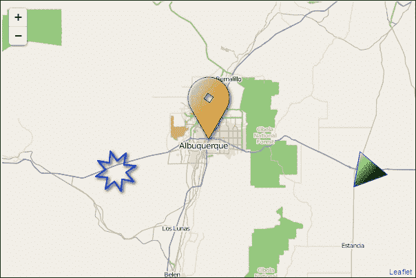

选项太多，无法在此列出，但要看它们，请访问插件文档[`github.com/humangeo/Leaflet-dvf/wiki/6.-Markers`](https://github.com/humangeo/Leaflet-dvf/wiki/6.-Markers)和 Leaflet `path`类的文档[`Leafletjs.com/reference.html#path`](http://Leafletjs.com/reference.html#path)。以下章节将解释你将为每个标记最常使用的插件选项。

#### 地图标记选项

使用的`MapMarker`选项如下：

+   `numberOfSides`: 内孔的大小由边的数量决定：三角形为三边，正方形为四边。边的数量越多，形状越接近圆形。如果你留空这个选项，它将默认为圆形。

+   `rotation`: 这有助于你旋转中间的孔。当然，这仅适用于非圆形形状。

+   `radius`: 这是标记的大小。

+   `innerRadius`: 这是中间孔的大小。

#### RegularPolygonMarker 选项

使用的`RegularPolygonMarker`选项如下：

+   `numberOfSides`: 这是标记的形状。

+   `rotation`: 这是标记的方向。如果你创建一个四边形并且留空这个选项，它将是一个正方形。如果你添加旋转，你可以使角落指向任何方向。

+   `radius`: 这是标记的大小。

+   `innerRadius`: 这是中间孔的大小。

#### 星形标记选项

使用的`StarMarker`选项如下：

+   `numberOfPoints`: 这定义了起始点应该有多少个

+   `rotation`: 这是标记的方向

+   `radius`: 这是标记的大小

+   `innerRadius`: 这是中间孔的大小

## 条形图和饼图标记

将图表标记添加到你的地图中允许你显示单个点或多边形的多份数据。例如，你可以将你州的所有人口普查区绘制在地图上，并使用每个区的中心点放置一个显示年龄分布的图表。这允许你快速直观地展示大量数据。

使用 Leaflet 数据可视化框架插件制作条形图或饼图只需要你创建一个`options`对象并将其传递给标记。以下步骤将展示如何进行这两步：

1.  创建一个包含数据和图表选项的`options`对象。数据需要数据类别的名称和值。在图表选项对象中，你传递所有选项来设置你的图表样式。三个重要的选项是`minValue`、`maxValue`和`maxHeight`。在大多数情况下，这些应该对所有类别相同。如果你允许一个类别的`maxHeight`比其他类别高，它可以显示为一个比具有更高值的类别更大的条形。把这想象成在 Excel 中设置*x*轴和*y*轴的比例。所有数据都应该在最低值和最高值相同的比例范围内。更改`maxHeight`选项也会使你的图表变大或变小。图表选项之外的是用于图表的描边或轮廓的选项。

    当创建饼图时，`radius`选项允许你调整标记的大小：

    ```js
    var options = {
        data: {
            'data1': 20,
            'data2': 50,
            'data3': 10,
            'data4': 20
        },
        chartOptions: {
            'data1': {
                fillColor: 'blue',
                minValue: 0,
                maxValue: 50,
                maxHeight: 30,
                   },
            'data2': {
                fillColor: 'red',
                minValue: 0,
                maxValue: 50,
                maxHeight: 30,
                 },
            'data3': {
                fillColor: 'green',
                minValue: 0,
                maxValue: 50,
                maxHeight: 30,
                      },
            'data4': {
                fillColor: 'yellow',
                minValue: 0,
                maxValue: 50,
                maxHeight: 30,
                 }
        },
        weight: 1,
        color: '#000000',
    radius:30,
    fillOpacity:1
    };
    ```

1.  接下来，创建标记，传递选项，并将它们添加到地图中：

    ```js
    var bar = new L.BarChartMarker([35.10418, -106.62987], options);
    map.addLayer(bar);

    var pie= new L.PieChartMarker([35,-107],options);
    map.addLayer(pie);
    ```

当你打开你的地图时，它应该看起来像下面的截图。当你悬停在某个数据类别上时，你会看到颜色、类别名称和值。

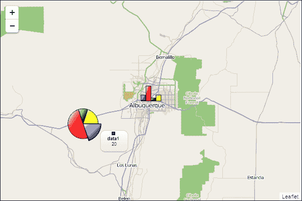

# 摘要

在本章中，你学习了如何向你的 Leaflet 地图添加自定义标记。你现在可以绘制自己的标记或使用现有的图像。你也可以使用插件从 Twitter、Font Awesome 和 Mapbox 加载标记。最后，你现在知道如何创建条形图和饼图标记，以标记的形式可视化数据。到目前为止，你已经掌握了足够的 Leaflet 知识，可以构建你所能想到的几乎任何风格的地图。

在下一章中，你将学习如何在你的 Leaflet 地图中使用**经济与社会研究学院**（**ESRI**）的数据。作为最广泛使用的 GIS 平台，你很可能会遇到其数据格式。
