# 第六章。Leaflet 在 Node.js、Python 和 C# 中

在前五章中，你学习了 Leaflet.js 的基础知识。你现在知道如何从多个来源和多种不同格式中添加各种底图。你可以绘制简单的几何图形，以及从服务器、GeoJSON 和 ESRI 文件格式中显示数据。在第三章中，*创建热力图和面状图*，介绍了如何从你的数据中创建可视化。你现在还知道如何自定义标记的外观和感觉，以及如何利用插件来为你的地图添加额外功能。

在最后一章中，你将学习如何使用三个流行的编程框架构建 Leaflet.js 应用程序：Node.js、Python 和 C#。在 Node.js 和 Python 中，你将构建一个服务器来渲染你的网页，并允许 AJAX 调用来显示更多数据。在最后一个示例中，使用 C#，你将构建一个桌面 Windows 应用程序，该应用程序将网页嵌入到表单中，连接到 MongoDB，并使用通用搜索和空间搜索检索数据。

虽然你不需要掌握这三个框架中的任何一个，Node.js 是一个 JavaScript 框架，示例应该很容易理解。Python 和 C# 的示例可能与你习惯的不同；然而，主要思想应该很容易掌握，它们将给你一个如何在大规模应用程序中使用 Leaflet 的想法。此外，开始思考 Leaflet 如何与服务器端交互，将扩展你构思新和令人兴奋应用程序的能力，利用来自多个框架的库和资源。

第一个示例将从最熟悉的框架 Node.js 开始。

# 使用 Node.js 构建 Leaflet 应用程序

Node.js 是一个基于 JavaScript 的平台，用于构建非阻塞应用程序。非阻塞特性使 Node.js 非常受欢迎。想想你是如何编码的。你按步骤完成任务。你可能会在代码中跳来跳去，调用函数并响应事件，但在开始下一个动作之前，你会等待一个动作完成。在 Node.js 中，你分配回调并继续下一个任务或处理下一个请求。以数据库搜索为例。在下面的伪代码中，你以传统方式检索记录并对其进行处理：

```js
var result = SELECT * from MyTable;
document.getElementById['results'].innerHTML= result;
```

在示例中，你等待数据库发送回结果，然后继续显示它们。在 Node.js 中，你会做类似的事情，但会分配一个回调函数，如下面的示例所示：

```js
function showResults(){document.getElementById['results'].innerHTML= result;};
var result = query(SELECT * from MyTable, showResults);
doWhateverElseYouNeed();
```

上述代码将查询数据库，并继续执行 `doWhateverElseYouNeed` 函数，直到查询完成，此时将执行 `showResult` 回调函数。这可能会非常令人困惑，并使你的代码难以阅读，但它非常强大，在服务器端，它允许大量连接。

现在您已经了解了 Node.js 能做什么，您可以在[`nodejs.org/`](http://nodejs.org/)下载它。根据您的操作系统遵循说明安装 Node.js。安装完成后，您将在 Windows 上有一个命令行界面和一个 Node.js 窗口。使用命令行，您可以启动应用程序并安装额外的包，您将在后面的例子中学习如何做。

## 基于 Leaflet 的基本 Node.js 服务器

在这个第一个例子中，您将创建一个简单的 Node.js 服务器并服务`LeafletEssentials.html`。您可以在任何文本编辑器中编写代码，并将其保存为`.js`文件。

创建一个文件夹来存储您的文件，并将`LeafletEssentials.html`的副本放入文件夹中。这是我们打算用 Node.js 服务的文件。接下来，您将创建服务器，如下面的代码所示：

```js
require('http').createServer(function (req, res) {
   if ('/' == req.url){
         res.writeHead(200, { 'Content-Type': 'text/html' });
   require('fs').createReadStream('leafletessentials.html') .pipe(res);
        } 
}).listen(3000);
```

上一段代码使用了两个模块：`http`和`fs`。您可以使用`require(module)`导入这些模块。这两个模块都是 Node.js 的标准模块，不需要任何额外的下载。上一段代码导入了`http`模块，然后调用了`createServer()`方法。它使用了一个匿名函数，该函数接受一个请求和一个响应——分别是`req`和`res`。`if`块检查请求是否指向服务器的根目录；在这个例子中，浏览器是否指向`http://localhost:3000`。代码的最后一行是在端口 3000 上监听。如果请求是根目录，则代码会写入一个头部。本书的范围不包括 HTTP 协议和头部。然而，要知道，当发送响应时，如果成功则状态为 200，如果不成功则状态为 404，响应的内容类型为`text/html`。最后，代码导入了`fs`模块，并使用`pipe()`读取并写入`LeafletEssentials.html`的内容。管道是发送文件的推荐方法；然而，您也可以使用`res.end('the HTML')`手动将 HTML 作为字符串写入。管道允许您做一些很酷的事情，例如读取和写入视频文件，以便用户在从服务器接收数据的同时播放它。将 HTML 作为字符串写入会使您的代码变得冗长且复杂；更不用说尝试逃避大多数 HTML 中所需的引号了。在最后一个例子中，您将了解一个模板库，您可以在其中存储您的 HTML。

使用命令行工具，导航到包含您的`server.js`代码的目录，通过输入`node server.js`来运行它。将浏览器指向`http://localhost:3000`。您应该看到如图所示的加载地图：

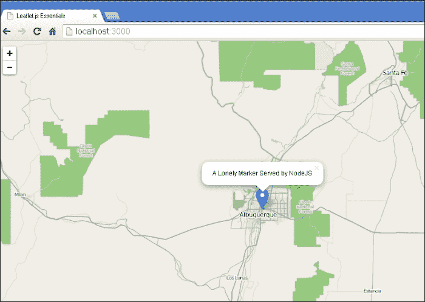

上一段示例只是简单地服务单个文件，如果用户将浏览器指向任何其他 URL，例如`http://localhost:3000/about.html`，他们将看不到任何内容，甚至没有错误消息。下一个例子将解决这个问题。

## Node.js、AJAX 和 Leaflet

现在您已经有一个 Node.js 服务器正在运行并托管 Leaflet 网页，您可以使用同一个服务器来发出**异步 JavaScript 和 XML**（**AJAX**）调用。您正在用 JavaScript 编程，尽管 AJAX 中有 XML，但您应该使用 JSON；它在 JavaScript 中处理起来比 XML 容易得多。在第一个示例的基础上，以下代码添加了另一个页面，并在不良请求时发送错误消息：

```js
 require('http').createServer(function (req, res) {
   if ('/' == req.url){
         res.writeHead(200, { 'Content-Type': 'text/html' });
   require('fs').createReadStream('leafletessentialsAjax.html') .pipe(res);
        } else if ('/getpoints'==req.url){
         res.writeHead(200, { 'Content-Type': 'application/json' });
         res.end(JSON.stringify([{"lat":35,"long":-106}]));
   } else {
         res.writeHead(404);
         res.end('The page you requested '+req.url+' was not found');
   }
}).listen(3000);
```

上述代码对第一个示例进行了两项更改；它添加了两个新的路由。第一个`if`语句与之前相同，返回`LeafletEssentials.html`。`else if`语句检查浏览器是否指向`http://localhost:3000/getpoints`。如果是，则服务器返回一个 JSON 字符串，`[{"lat":35,"long":-106}]`。最后，如果用户请求一个不存在的页面，服务器将返回一个 404 错误消息，说明页面未找到，并将返回他们所查找的页面的值——`req.url`。

上述服务器需要更改您的`LeafletEssentials.html`文件。您需要一个`click`事件的订阅者，并在事件发生时进行 AJAX 调用。在 AJAX 之前，您需要提交一个表单或向服务器发出请求，然后被重定向到一个新页面，该页面将显示结果。AJAX 允许您向服务器发出请求，获取结果，并在不重新加载整个页面的情况下显示它们。在这个例子中，您将向`getpoints` URL 发出 AJAX 调用。您将收到一个点的 JSON 表示。然后，您将添加一个标记来表示返回的点——所有这些都不需要刷新网页：

```js
map.on('click',function(){
var xhReq = new XMLHttpRequest();
xhReq.open("GET", "getpoints", true); 
xhReq.send(); 
var serverResponse = xhReq.responseText;
var d=JSON.parse(serverResponse);
L.marker([d[0].lat,d[0].long]).addTo(map).bindPopup("Added via AJAX call to Node.js").openPopup();
});
```

不深入 AJAX 的细节，上述代码创建了一个`XMLHttpRequest`实例并打开了`getpoints.html`网页。

### 注意

要了解关于`XMLHttpRequest`的快速课程，请访问 W3Schools 网站[`www.w3schools.com/xml/xml_http.asp`](http://www.w3schools.com/xml/xml_http.asp)。

然后，它接收响应，解析出由逗号分隔的点，并将它们作为标记添加到地图上。您只接收一个点，因此`d`变量只有一个值，它由`d[0]`表示。在 JavaScript 中，通过调用对象然后是字段的值来使用 JavaScript 对象，在这种情况下，`d[0].lat`和`d[0].long`。

您的地图将看起来与第一个示例完全一样。当您点击地图时，您将看到另一个点，您的地图将看起来如下截图所示：

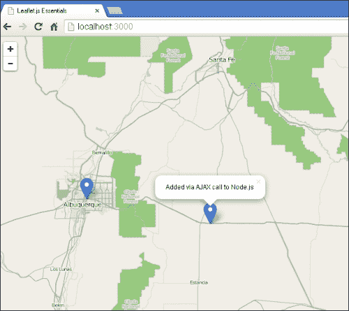

此示例在用户点击地图时返回相同的点。此示例可以通过每次用户点击地图时返回不同的点来改进。要做到这一点，只需使用随机数生成器来返回新的纬度和经度。关键是设置最大和最小值，以便点接近我们的当前位置。以下代码使用`Math.random()`来返回不同的值。为此，只需将服务器代码中的`res.end(JSON.stringify([{"lat":35,"long":-106}]));`行替换为以下代码：

```js
var lat=Math.random()*(36-35)+35;
var lon=Math.random()*(-107+106)-106;
res.end(JSON.stringify([{"lat":lat,"long":lon}]));
```

现在，当用户点击地图时，点将随机出现。点击几次后，您的地图应该看起来像这样：

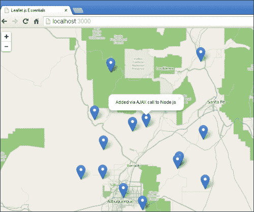

## Node.js, Connect, and Leaflet

在前面的例子中，您必须为每个可能的 URL 编写路径。用户可以在您的域名中输入该路径。您允许两种可能性，并对其他所有可能性发送错误。如果您有一个包含许多页面的网站，您不希望为每个 URL 编写一个`if`语句。Connect 是一个模块，它为常见任务提供了中间件代码。中间件允许您通过您的工作量最小化来完成这些常见任务；您只需要使用`use()`函数。

### 注意

您可以在[`www.senchalabs.org/connect/`](http://www.senchalabs.org/connect/)了解 Connect。

要安装 Connect，打开 Node.js 的命令行工具，并输入以下命令：

```js
npm install –g connect

```

npm 是 Node.js 的包管理器。前面的命令启动了包管理器，并要求它安装 Connect。`–g`选项是为了全局安装它，以便在机器的任何地方都可以使用。当 Connect 安装完成后，您的命令提示符将看起来像这样：

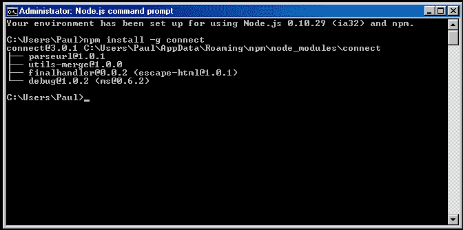

### 注意

注意版本号，因为您将在后续步骤中需要它。

一旦您安装了 Connect，您就可以开始示例。此示例将创建一个简单的服务器，它将只提供静态文件。按照以下步骤创建服务器：

1.  创建一个`project`文件夹，并在其中放置另一个名为`www`的文件夹。

1.  在目录中放置几个 HTML 文件，特别是`LeafletEssentials.html`和`getpoints.json`。您可以使用书中包含的示例，或者创建自己的示例。一个最小的`getpoints.json`文件将包含以下内容：

    ```js
    [{"lat":35,"long":-106}]

    ```

    文件的内容是一个用 JSON 表示的单个点。您可以添加尽可能多的点。您甚至可以编写一个脚本来在设定的时间间隔更新文件的内容。

1.  接下来，在主项目文件夹中，创建一个包含以下内容的文件，并将其命名为`package.json`。请注意，此示例使用的是 Connect 3.0 之前的版本：

    ```js
    {
    "name": "leafletessentials",
    "version": "0.0.1",
    "dependencies": {"connect": "2.21.1"}
    }
    ```

    此文件用于构建项目。在命令行中，导航到您的`project`目录，并输入`npm install`。包管理器将读取`package.json`文件，并在您的`project`文件夹中创建一个名为`Node_modules`的新子文件夹。

1.  打开文件夹，您将看到另一个包含 Connect 模块所有文件的文件夹。在编写服务器之前，您需要在`LeafletEssentialsAjax.html`中进行更改。AJAX 调用的代码需要指向`getpoints.json`文件。现在您已准备好编写服务器。

首件事是使用`require()`导入 Connect 模块并将其分配给一个变量。通过调用`connect()`创建一个服务器。最后，调用中间件`static()`并要求它处理`www`目录中的所有文件。`_dirname`变量获取当前目录并将其与`/www`目录连接，从而得到文件的路径，如下面的代码所示。监听任何可用的端口：

```js
var connect = require('connect')
var server = connect();
server.use(connect.static(__dirname+ '/www'));
server.listen(3000);
```

代码比前面的例子要短得多。没有`if ('/' == req.url)`语句。中间件知道目录中的所有文件，如果请求的 URL 与文件名匹配，它将被发送。如果不存在，中间件将发送错误页面。如果您添加新的 HTML 文件，它将在放入文件夹并请求后立即被提供。现在，当您连接并获取地图时，您可以点击它，`getpoints.json`的内容将被返回并在地图上显示。

## Node.js、Express、Jade 和 Leaflet

在前两个例子中，您必须为服务器创建一个静态 HTML 文件以供客户端使用。在这个例子中，您将使用一个模板，允许您在加载 HTML 时传递变量。这将允许您创建动态的数据驱动网站。

对于这个例子，您需要为 Node.js 安装 Jade 模块。为此，打开命令行工具并输入以下命令。这与前面的例子相同。

```js
echo '{}' > package.json
npm install jade –save

```

现在，您已全局安装了 Jade 模块。您还需要安装 Express。Express 是 Node.js 中最流行的 Web 框架之一。它与 Connect 类似，但在这个例子中，它是允许我们使用视图引擎 Jade 的工具。再次，输入以下命令，并确保您注意已安装的版本：

```js
echo '{}' > package.json
npm install express –save

```

### 注意

如需了解更多关于 Express 和 Jade 的信息，您可以访问 Express 网站[`expressjs.com/`](http://expressjs.com/)和 Jade 网站[`jade-lang.com/`](http://jade-lang.com/)。

现在您已安装了这两个模块，为您的应用程序创建一个文件夹。在文件夹中，您需要创建`package.json`文件。在这个例子中，您有两个依赖项，所以您的文件应该看起来像以下代码：

```js
{
"name": "leafletessentials",
"version": "0.0.1",
"dependencies": {
   "express": "4.4.5",
   "jade": "1.3.1"
 }
}
```

使用命令行工具，导航到应用程序目录，并使用 npm 通过以下命令添加依赖项：

```js
npm install

```

您现在将有一个 `Node.js_modules` 文件夹，其中包含 `Jade` 和 `Express` 子文件夹。您需要一个目录来保存或查看模板文件。这个文件夹需要命名为 `views`，因为 Express 会在这里查找。创建该目录，然后打开文本编辑器来创建您的视图。为了快速了解 Jade，您可以阅读在 [`jade-lang.com/tutorial/`](http://jade-lang.com/tutorial/) 的教程。需要注意的是，Jade 对空白字符敏感，因此缩进必须精确。这可能会在最初非常令人沮丧。以下模板是您在之前的示例中使用的修改后的 `LeafletEssentials.html` 文件。一个关键的区别是第四行：`title = title`。这一行将 HTML 文档的标题设置为服务器代码中变量 `title` 的值：

```js
doctype html
html(lang="en")
   head
          title= title
link(rel='stylesheet', href='http://cdn.leafletjs.com/leaflet- 0.7.2/leaflet.css')
script(src="img/leaflet.js")
   body
   #map(style='width:'+900+'px;'+'height:'+800+'px')
   script(type='text/javascript').
var map = L.map('map', {center: [35.10418, -106.62987],	zoom: 9});
var base = L.tileLayer('http://{s}.tile.osm.org/{z}/{x}/{y}.png').addTo(map);
L.marker([35.10418, -106.62987]).addTo(map).bindPopup("A Lonely Marker").openPopup();
map.on('click',function(){var xhReq = new XMLHttpRequest();xhReq.open("GET", "getpoints", false);xhReq.send(null);var serverResponse = xhReq.responseText;var d=JSON.parse(serverResponse);L.marker ([d[0].lat,d[0].long]).addTo(map).bindPopup ("Added via AJAX call to Node.js").openPopup();});
```

将前面的代码保存到您视图文件夹中名为 `LeafletEssentials.jade` 的文件中。现在，您已经准备好编写服务器了。

### 注意

Jade 是一个流行且强大的模板模块；然而，还有其他的选择。最初可能更容易学习的两个是 HAML，在 [`haml.info/`](http://haml.info/)，以及 EJS，在 [`embeddedjs.com/`](http://embeddedjs.com/)。

服务器的代码如下：

```js
var express=require('express')
var app = express();
app.set('view engine', 'jade');
app.get('/', function(req,res){
   res.render('LeafletEssentials',{title:"Leaflet Essentials"});
   	});
app.get('/getpoints', function(req,res){
   res.send([{'lat':35,'long':-106])
});
var server = app.listen(3000);
```

前面的代码导入 Express 模块并将其分配给一个变量。然后使用 Express 创建一个应用。默认视图引擎是 Jade，但如果您想使用另一个，您需要第三行来设置适当的引擎。接下来的几行使用 `app.get()` 来指定我们的应用程序将返回的两个 URL。第一个将返回我们的视图，第二个用于 AJAX 调用并返回一个 JSON 格的点。在第一个 AJAX 示例中，当您返回点时需要指定 `JSON.stringify()`。使用框架的一个原因就是它为您处理了许多常见任务。在这种情况下，Express 会知道您返回的是什么，并相应地设置值。在这个例子中，您返回一个 JSON 字符串，Express 会自动为您将其 JSON 化。

您的地图将看起来就像之前的示例中的那样，当用户点击时，会添加一个点。接下来的示例将使用 Python 来提供 Leaflet 应用程序。

# 使用 Python 和 CherryPy 创建 Leaflet

Python 编程语言非常强大，拥有大量的标准库和其他第三方库。它对于简单任务来说也相当容易上手。关于该语言的文档非常丰富，有大量的书籍和不同的库可供选择。您可以从 Python 网站下载 Python，网址为 [`www.python.org/downloads/`](https://www.python.org/downloads/)。版本 3 是最新的；然而，版本 2.7 仍在使用中。可能最好从版本 3 开始学习，但如果您有 v2.7，它将适用于这些示例。

在这个例子中，你将使用 CherryPy 库。你可以在 [`www.cherrypy.org/`](http://www.cherrypy.org/) 下载这个库。

### 注意

想要了解更多关于 CherryPy 和 Python 网络开发的书籍，请访问 [`www.packtpub.com/CherryPy/book`](http://www.packtpub.com/CherryPy/book) 或 [`www.packtpub.com/python-3-web-development-beginners-guide/book`](http://www.packtpub.com/python-3-web-development-beginners-guide/book)。

CherryPy 相比 Django 或 Pyramid（前身为 Pylons）是一个更小的网络框架。在这个例子中，它将允许你快速启动而无需太多开销。要手动安装第三方 Python 库，将其提取到一个文件夹中，并运行以下命令：

```js
python setup.py install

```

运行命令后，你将能够在你的 Python 代码中导入这个库。在这个例子中，你将连接到一个 NoSQL 数据库：MongoDB。MongoDB 是一个文档数据库。它将所有内容存储为 JSON 风格的文档，而不是关系型表格。虽然它的空间功能不如 PostgreSQL 的扩展 PostGIS 强大，但它有一些空间功能，使其成为 Leaflet 后端的一个优秀选择。你可以在 [`www.mongodb.org/`](http://www.mongodb.org/) 下载 MongoDB。

要使用 Python 与 MongoDB 一起使用，你还需要下载并安装 PyMongo。你可以在 [`pypi.python.org/pypi/pymongo/`](https://pypi.python.org/pypi/pymongo/) 下载这个库。一旦你的环境设置完成，你可以通过运行应用程序 mongod 来启动 MongoDB。

### 注意

如果你收到一个关于缺失路径的错误，你需要添加 `C:\data\db` 目录。只需创建文件夹，然后重新运行 mongod。在 Linux 和 OS X 上，执行 `mkdir -p /data/db` 以添加数据目录。

你的数据库是空的。这些书籍网站上可用的 `pa.py` Python 文件将创建一个数据库，并用本书早期章节中使用的公共艺术数据填充它。文件看起来像以下代码：

```js
from pymongo import Connection
from pymongo import GEO2D
db=Connection().albuquerque
db.publicart.create_index([("loc",GEO2D)])
db.publicart.insert({"loc":[35.1555,-106.591838],"name":"Almond Blossom/Astronomy","popup":http://farm8.staticflickr.com/7153/6831137393_fa38634fd7_m.jpg })
  db.publicart.insert({"loc":[35.0931,-106.664177], "name":"Formas Esperando Palabra de Otros Mundos","popup": "http://farm3.staticflickr.com/2167/2479129916_0d861b2600.jpg"})
print " Completed…"
```

上述代码从 PyMongo 库中导入了两个模块：Connection 和 GEO2D。第一个处理我们与数据库的连接，第二个允许我们启用空间功能。下一行创建了一个名为 `albuquerque` 的数据库的连接。接下来，为名为 `publicart` 的集合创建了一个空间启用索引，并对其 `loc` 字段进行了索引。接下来的两行是插入到集合中的公共艺术点。它们各自包含一个位置、名称和一个包含该作品图片 URL 的弹出字段。

通过输入 `python pa.py` 来执行文件。现在你的 MongoDB 将有一个数据库、集合以及足够的数据，允许你尝试一些示例。

### 注意

如果你曾经删除、损坏或只是想要刷新你的数据库，你可以再次运行这个文件来开始一个新的。

现在你已经运行并填充了数据库，并且安装了 CherryPy 和 PyMongo 的 Python，你现在可以开始编写你的第一个服务器了：

1.  第一步是按照以下方式导入 Python 库：

    ```js
    import cherrypy
    from pymongo import Connection,GEO2D
    ```

1.  接下来，你创建一个类和一个函数，该函数将代表你的应用程序的 URL。在这个例子中，它将是`index`函数：

    ```js
    class mongocherry(object):    
        def index(self):
    ```

1.  函数首先会创建一个数组来存储 HTML 文件的内容。你可以将`LeafletEssentials.html`的内容追加到添加瓦片图层底图之前：

    ```js
    output =[]

    output.append("<HTML><HEAD><TITLE>QUERY MONGODB</TITLE></HEAD><BODY><h1>Query MongoDB</h1><link rel='stylesheet' href='http://cdn.leafletjs.com/leaflet- 0.7.2/leaflet.css' /><style> html, body, #map {padding: 0;margin: 0;height: 100%;}</style></head><body><script src='http://cdn.leafletjs.com/leaflet- 0.7.2/leaflet.js'></script><div id='map'></div><script>var map = L.map('map',{center: [35.10418, -106.62987],zoom: 9});L.tileLayer ('http://{s}.tile.osm.org/{z}/{x}/{y}.png').addTo(map);")
    ```

1.  现在，创建数据库连接并搜索名为`publicart`的集合中的所有文档。`find()`函数将返回大量记录。在每条记录上，你将追加一个 HTML 字符串，使用记录创建一个标记。位置字段创建标记，名称和弹出字段添加到标记的弹出窗口中：

    ```js
    db=Connection().albuquerque
    for x in db.publicart.find():
    output.append("L.marker(["+str(x["loc"][0])+","+str(x["loc" ][1])+"]).addTo(map).bindPopup(\""+x["name"]+"\");")
    ```

1.  一旦所有文档都添加完毕，你可以将关闭 HTML 标签追加到数组中。然后，将数组转换为字符串，以便在用户请求应用程序的索引时返回，如下所示：

    ```js
    output.append('</SCRIPT></BODY></HTML>')
    i=0
    html=""
    while i<len(output):
       html+=str(output[i])
       i+=1
    return html
    ```

1.  最后，你需要公开`index`函数，设置应用程序将使用的地址和端口，然后通过调用类名来启动服务器：

    ```js
    index.exposed = True
    cherrypy.config.update({'server.socket_host': '127.0.0.1',
    'server.socket_port': 8000,
    }) 
    cherrypy.quickstart(mongocherry())
    ```

完成后，通过打开命令行并输入以下命令来运行程序：

```js
python mongocherry.py

```

打开浏览器并将它指向`http://127.0.0.1:8000`。你应该会看到一个像以下这样的地图：

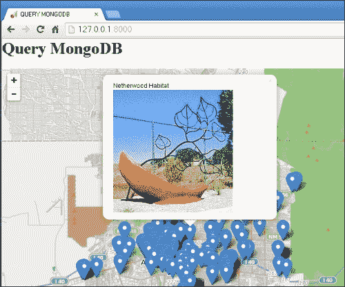

应用程序返回了你的 MongoDB 内容，并在 Leaflet 地图中显示它们。现在你已知道如何在应用程序中创建 URL 路由，让我们扩展这个例子以添加一个用于空间搜索的 AJAX 调用。

## 使用 Python、MongoDB 和 Leaflet 进行空间查询

MongoDB 允许你访问空间查询。你可以搜索靠近单个点的结果，通过设置最大距离来搜索靠近一个点，在边界矩形内或在一个圆内。在这个例子中，你将查询靠近一个点的结果。

导入所需的库。在以下代码中，你将导入来自`cherrypy`库的`json`模块和两个新模块工具：

```js
import cherrypy
from pymongo import Connection,GEO2D
from cherrypy import tools
import json
```

在导入库之后，执行以下步骤：

1.  创建类。使用工具，你将通过`@`符号公开函数。连接到数据库并写出 HTML 代码。在这个例子中，HTML 代码是不同的。你将添加一个监听`click`事件的监听器。这个代码块的代码将向`getdata`页面发起 AJAX 调用，并传递`click`事件的`(x,y)`坐标。返回的数据将只包含三个对象，因此你可以直接编写 HTML 而不是运行`for`循环，如下所示：

    ```js
    class mongocherry(object):
        @cherrypy.expose
        def index(self):
             db=Connection().albuquerque
             output =[]
        output.append("<HTML><HEAD><TITLE>QUERY MONGODB</TITLE></HEAD><BODY><h1>Query MongoDB</h1><link rel='stylesheet' href='http://cdn.leafletjs.com/leaflet-0.7.2/leaflet.css' /><style> html, body, #map {padding: 0;margin: 0;height: 100%;}</style></head><body><script src='http://cdn.leafletjs.com/leaflet- 0.7.2/leaflet.js'></script><div id='map'></div><script>var lat; var lon; var map = L.map('map',{center: [35.10418, - 106.62987],zoom: 9});L.tileLayer('http://{s}.tile.osm.org/{z}/{x}/{y}.png') .addTo(map);map.on('click',function(e){var a=String(e.latlng).split(\",\");lat=a[0].split(\"(\");lon=a [1].split(\")\");var xhReq = new XMLHttpRequest();var s=\"getdata?x=\";var s2=String(lat[1]);var s3=\"&y=\";var s4=String(lon[0]);var url=s.concat(s2,s3,s4); xhReq.open(\"GET\", url, false); xhReq.send(null); var serverResponse = xhReq.responseText; var d=JSON.parse(serverResponse);L.marker([d[0].lat,d[0].long]) .addTo(map);L.marker([d[1].lat,d[1].long]).addTo(map);L.mar ker([d[2].lat,d[2].long]).addTo(map);});")
    ```

1.  接下来，关闭 HTML 标签，将它们转换为字符串，并在调用`page`函数时返回它们：

    ```js
       output.append("</SCRIPT></BODY></HTML>")
       i=0
       html=""
       while i<len(output):
             html+=str(output[i])
             i+=1

      return html 
    ```

1.  现在，您将定义并公开另一个 URL 函数。这个函数将被命名为 `getdata`，它将处理用户点击的 AJAX 调用。此函数接收 `x` 和 `y` 变量。这些将是用户点击的坐标。在此示例中，查询与前面的示例不同。请注意，您使用了 `find()`，但添加了 `$near` 并传递了用户点击的坐标。搜索设置为仅返回三个结果。最后，您使用 `@tools.json_out()` 将结果作为 JSON 返回，如下所示：

    ```js
        @cherrypy.expose
        @tools.json_out()
        def getdata(self,x,y):
       db=Connection().albuquerque
       data=[]
       lat=float(x)
       long=float(y)
       for doc in db.publicart.find({"loc": {"$near": [lat, long]}}).limit(3): 
        data.append({'lat':str(doc["loc"][0]),'long':str(doc["loc"][1])})
      return data
    ```

1.  最后，设置服务器的 IP 地址和端口号。然后运行它：

    ```js
    cherrypy.config.update({'server.socket_host': '127.0.0.1',
                             'server.socket_port': 8000,
                            }) 
    cherrypy.quickstart(mongocherry())
    ```

现在，您可以运行文件，并将浏览器指向 `http://127.0.0.1:8000`。您将看到一个空白地图。点击地图上的任何位置，您将看到三个点出现。这些是您点击位置最近的点。点击一次后，您的地图将看起来如下截图所示：

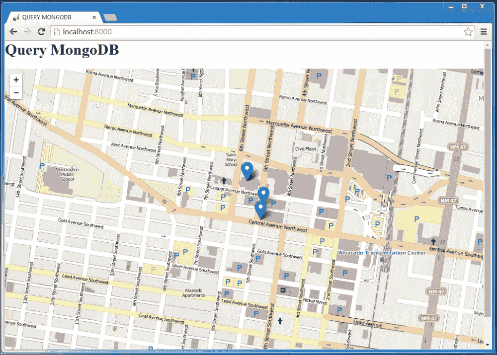

使用 Python 连接到您的 MongoDB 允许您不仅查询数据库以显示结果，而且通过编写更多代码，您还可以使用它来保存地图的结果。您可以允许用户在地图上点击他们想要添加点的地方，然后使用 `(x,y)` 坐标并执行 `insert()` 方法而不是 `find()` 函数。前面提供的示例简要概述了如何使用 Python 提供 Leaflet 地图并处理 AJAX 查询。接下来的示例将转向使用 C# 制作带有 Leaflet 的桌面应用程序。

# 使用 Leaflet 的 C# 桌面应用程序

Leaflet 用于网页中；然而，使用 C#，您可以在 Windows 表单中嵌入网页浏览器，创建看起来像是桌面应用程序的东西。本节中的示例将向您展示如何将地图添加到 C# 应用程序中，如何通过从 C# 调用 JavaScript 函数来添加一个点，以及如何使用 C# 连接到 MongoDB 并在地图上显示结果。

## 将地图添加到 C# 应用程序

要在 C# 中构建应用程序，您需要安装 Microsoft Visual Studio Express。您至少需要 Visual Studio C# 2010。您可以在 [`www.visualstudio.com/downloads/download-visual-studio-vs`](http://www.visualstudio.com/downloads/download-visual-studio-vs) 下载它。此程序是商业 Visual Studio 的精简版。它允许您快速构建 **Windows 表单应用程序**并将您的代码编译成易于分发的 Windows 可执行文件。

启动应用程序，并从对话框中创建一个新的 **Windows 表单应用程序**，如图下所示：

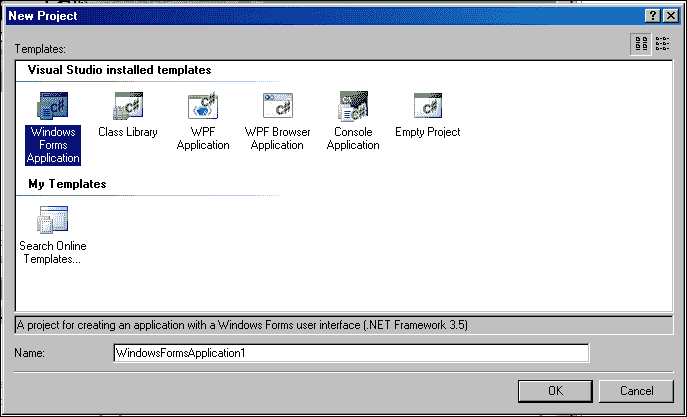

您的应用程序将是一个空白表单。选择窗口左上角的工具箱，并将网页浏览器拖到表单上，如图下所示：

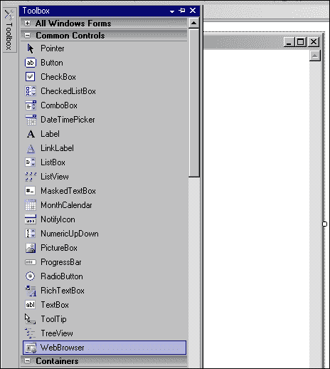

点击你拖到表单中的网页浏览器，并修改`URL`属性，使其指向运行在你网络服务器上的`LeafletEssentials.html`实例。保存应用程序。点击**调试**菜单，然后开始调试。你的应用程序将启动，你将看到你的 Leaflet 地图在 Windows 表单中加载，如下面的截图所示：

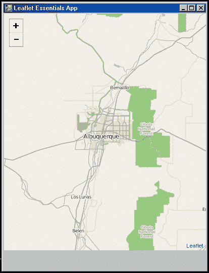

现在你已经在一个 C#应用程序中拥有了一张地图，而且没有任何代码。接下来的示例将给你的应用程序添加一些功能。

## 在 C#中添加标记

在这个示例中，你将通过添加一个标记来构建上一个示例。你需要做的第一件事是使用工具箱将一个按钮拖到表单的底部。在按钮的属性中，将`text`属性从`button1`更改为`Add Marker`。然后，双击按钮。

你现在看到的是当你创建应用程序时 Visual Studio 为你创建的代码，并且它已经添加了一个处理按钮点击的功能。当你点击按钮时，它会编写这个函数。在你编写按钮代码之前，你需要添加对`MSHTML.dll`的引用。这个文件将允许你使用你需要的网络和 HTML 对象来使你的地图工作。在你的代码顶部，你会看到一些以`using`开头的行。这就是你将所需的库导入到应用程序中的地方。最常见的已经添加了。在列表的末尾，输入代码`using MSHTML;`。它会被下划线标记，并且不会找到。现在你需要右键点击**解决方案资源管理器**窗口中的项目，并选择**添加引用**。添加一个 COM 引用到微软 HTML 对象库，如以下截图所示：

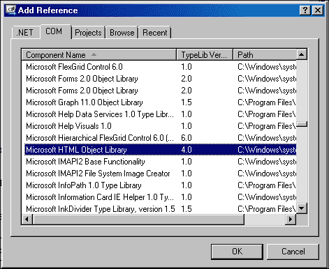

现在你已经添加了引用，下划线将消失，你可以开始编写`button1_Click()`函数。将以下代码添加到函数中：

```js
HtmlElement head = webBrowser1.Document.GetElementsByTagName("head")[0];
HtmlElement scriptEl = webBrowser1.Document.CreateElement("script");
IHTMLScriptElement element = (IHTMLScriptElement)scriptEl.DomElement;
element.text = "var mymarker; function addPoints() { mymarker = new L.marker([36.104743, -106.629925]); map.addLayer(mymarker); mymarker.bindPopup('HELLO <br>Added By C#.'); }";
head.AppendChild(scriptEl);
webBrowser1.Document.InvokeScript("addPoints");
```

之前的代码抓取了通过网页浏览器属性加载的`LeafletEssentials.html`文件的`<head>`标签。然后创建一个`<script>`元素，以便你可以在 HTML 中添加 JavaScript 并执行它。然后创建脚本元素，并传递一个`text`字符串。这个字符串是用于在地图上添加点的 JavaScript 函数。

你必须将你的代码包裹在一个函数中，因为这是 C#调用和执行它的方式。然后，将`<script>`标签追加到文档的`<head>`标签中，并告诉网页浏览器调用`addPoints()`函数。所以现在，当用户点击按钮时，JavaScript 函数将被添加到`LeafletEssentials.html`中，并执行。保存并调试项目。当应用程序启动时，点击按钮，你的应用程序应该看起来像这样：

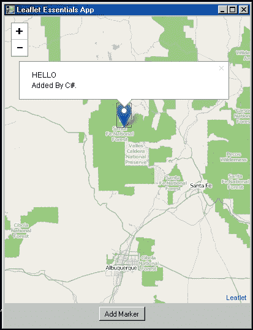

要允许 C# 应用程序修改 Leaflet 应用程序，将一个 JavaScript 函数插入到基础 HTML 文件中，然后通过事件（如按钮点击）执行它。下一个示例将连接到 MongoDB。

## 使用 C# 和 Leaflet 的 MongoDB

就像 Python 示例一样，要在 C# 中使用 MongoDB，将需要驱动程序。你可以在 [`github.com/mongodb/mongo-csharp-driver/releases`](https://github.com/mongodb/%E2%80%A8mongo-csharp-driver/releases) 下载 C# 驱动程序。此示例使用 `.zip` 文件。在你的项目中添加另一个引用，但这次不是选择 COM，而是浏览到你从 `.zip` 文件中提取驱动程序的位置。文件夹应包含 `MongoDB.Bson.dll` 和 `MongoDB.Driver.dll`。添加引用后，你必须使用以下代码导入所需的库：

```js
using MongoDB.Bson;
using MongoDB.Driver;
using MongoDB.Driver.Linq;
using MongoDB.Driver.Builders;
```

导入库后，你可以修改你的按钮以连接到 MongoDB 并加载点。以下说明将指导你通过代码连接到 MongoDB：

1.  首先，你需要一个字符串来保存将要添加点的 JavaScript 函数。在 C# 中，你会使用 `StringBuilder()` 来能够向字符串中追加内容。你可以从追加函数名和第一个大括号开始：

    ```js
    StringBuilder myString = new StringBuilder();
    myString.Append("function addPoints() {");
    ```

1.  接下来，你设置连接到 MongoDB。连接到 IP 和端口——默认是 localhost 的 27017 端口。获取服务器和名为 `albuquerque` 的数据库。最后，连接到 `publicart` 集合：

    ```js
    var client = new MongoClient("mongodb://localhost:27017");
    var server = client.GetServer();
    var database = server.GetDatabase("albuquerque");
    var collection = database.GetCollection("publicart");
    ```

1.  现在，你可以执行查询。查询将找到所有文档并返回每一个。代码追加一个字符串，通过连接每个文档的位置、名称和弹出信息来创建标记：

    ```js
                foreach (var document in collection.FindAll())
                {
                    myString.Append("L.marker([" + document["loc"][0] + "," + document["loc"][1] + "]).addTo(map).bindPopup(\"" + document["name"] + "<br>\");" + "\r\n");
                }
    ```

1.  使用最后一个大括号关闭字符串：

    ```js
                myString.Append("}");
    ```

1.  最后一个代码块与上一个示例相同。创建 HTML 元素，并通过将 `StringBuilder.toString()` 转换为字符串来插入字符串：

    ```js
    HtmlElement head = webBrowser1.Document.GetElementsByTagName("body")[0];
    HtmlElement scriptElement = webBrowser1.Document.CreateElement("script");
    IHTMLScriptElement addPointsElement = (IHTMLScriptElement)scriptElement.DomElement;
    addPointsElement.text = myString.ToString();
    head.AppendChild(scriptElement);
    webBrowser1.Document.InvokeScript("addPoints");
    ```

保存并调试项目。当应用程序启动时，点击按钮，你的应用程序应该看起来像以下截图：

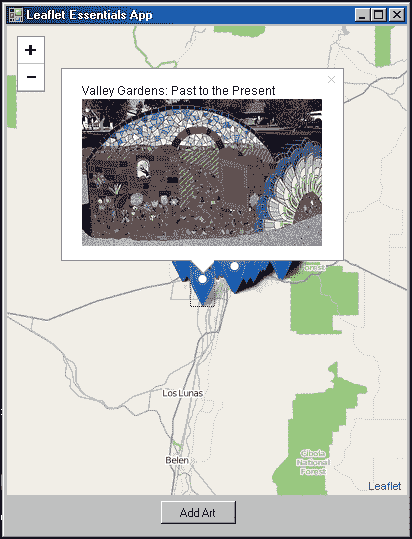

最后一步是选择 `debug` 菜单，而不是调试，选择 `build solution`。如果你浏览到 `project` 文件夹，你将有一个名为 `bin` 的目录。在该目录中，你现在有一个 `.exe` 文件。

现在，你有一个用 C# 编写并编译为 `.exe` 的 MongoDB 集合 Leaflet 地图。为了让它在另一台机器上运行，你只需要让你的 MongoDB 部署在真实的 IP 地址上，并允许从你的网络外部访问。

最后一个示例将允许用户点击地图并返回最近的点。

## 使用 C#、Leaflet 和 MongoDB 进行查询

你已经学会了如何通过编写 JavaScript 函数、将其注入到 HTML 文件中并执行它，将数据从 C# 传递到 Leaflet。从 JavaScript 返回 C# 的方法略有不同。你可以传递数据的一种方式是让 JavaScript 将内容写入 `<div>`，然后 C# 可以读取它。关键是要将 `<div>` 标签设置为不可见。以下步骤将指导你完成最后一个示例：

1.  首先，通过添加一个新的 `<div>` 并设置样式，将 `LeafletEssentials.html` 修改为将显示设置为 `none`。如果你将其设置为 `hidden`，它将在文档中占用空间，并在你的地图下方留下空白区域：

    ```js
    <style>
      html, body, #map {
          padding: 0;
          margin: 0;
          height: 100%;
        }
    #points.hidden {
     display: none;
    }
    </style>
    <body>
    <div id="map"></div>
    <div id="points"></div>

    ```

1.  接下来，创建一个 `click` 事件的监听器，并编写一个函数来创建一个标记，显示 `click` 事件的地点，清理返回的纬度和经度文本，并将结果写入 `<div>`：

    ```js
    map.on('click',function(e){L.marker(e.latlng).addTo(map).bi 
    ndPopup("SEARCH LOCATION").openPopup();
    var a=String(e.latlng).split(",");
    var lat=a[0].split("(");
    var lon=a[1].split(")");
    document.getElementById("points").innerHTML = lat[1]+","+lon[0];
    });
    ```

1.  HTML 文件准备就绪后，你现在可以修改 C#。第一步是从 `<div>` 标签中读取点，然后解析它们，以便每个点都在自己的变量中，如下所示：

    ```js
    string hiddenHTML = webBrowser1.Document.GetElementById("points").InnerHtml;
    string[] thePoints = hiddenHTML.Split(',');
    ```

1.  设置与 MongoDB 的连接。连接到 IP 和端口。获取服务器，然后是名为 `albuquerque` 的数据库。最后，连接到 `publicart` 集合：

    ```js
    var client = new MongoClient("mongodb://localhost:27017");
    var server = client.GetServer();
    var database = server.GetDatabase("albuquerque");
    var collection = database.GetCollection("publicart");
    ```

1.  创建一个查询的文本字符串，并初始化你的 `StringBuilder()` 函数以保存函数和结果：

    ```js
    var query = Query.Near("loc", double.Parse(thePoints[0]), double.Parse(thePoints[1]));
    StringBuilder myLocString = new StringBuilder();
    myLocString.Append("function addLocPoints() {");
    ```

1.  使用 `near()` 函数在循环中执行查询。将结果传递到字符串中，构建 JavaScript 函数：

    ```js
                foreach (BsonDocument item in collection.Find(query).SetLimit(5))
                {
                    BsonElement loc = item.GetElement("loc");
                    string g = loc.Value.ToString();
                    string x = g.Trim(new Char[] { '[', ']' });
                    String[] a = x.Split(',');

                    myLocString.Append("L.marker([" + a[0] + "," + a[1] + "]).addTo(map).bindPopup(\"" + item["name"] + "<br>\");" + "\r\n");
                }
    ```

1.  最后一个代码块与前面的两个示例相同。创建 HTML 元素，并通过将 `StringBuilder.toString()` 转换为字符串来插入字符串：

    ```js
    myLocString.Append("}");
    HtmlElement head = webBrowser1.Document.GetElementsByTagName("body")[0];
    HtmlElement scriptElement = webBrowser1.Document.CreateElement("script");
    IHTMLScriptElement addPointsElement = (IHTMLScriptElement)scriptElement.DomElement;
    addPointsElement.text = myLocString.ToString();
    head.AppendChild(scriptElement);
    webBrowser1.Document.InvokeScript("addLocPoints");
    ```

1.  保存并调试项目。当应用程序启动时，点击按钮，你的应用程序应该看起来像以下截图：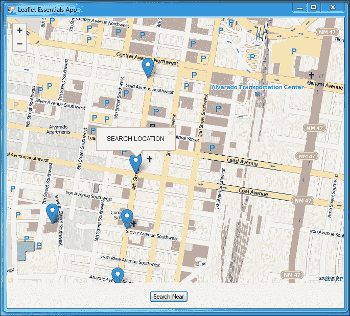

# 摘要

在最后一章中，你学习了如何在其他编程语言和框架中使用 `Leaflet.js`。从 Node.js 开始，你学习了如何在前端和后端使用 JavaScript。你创建了一个 Node.js 服务器，返回一个 Leaflet 网页。然后你修改了代码，允许 AJAX 调用返回到服务器以更新地图而不重新加载页面。

你还学习了如何使用 Python 和 CherryPy 创建服务器并允许 AJAX 请求。Python 示例介绍了 NoSQL 数据库，特别是 MongoDB。你学习了如何编写查询以返回数据库集合中的所有文档，以及如何使用 AJAX 仅查询用户点击点附近的点。

最后——对于完全不同的事情——你学习了如何将网页浏览器嵌入到 Windows 表单中，并使用 Leaflet 运行桌面应用程序。这些应用程序在表单上使用按钮来执行注入到 `LeafletEssentials.html` 文件中的 JavaScript 函数。然后你从 JavaScript 方向传递数据回到 C#——捕捉地图上的鼠标点击并使用它们来查询 MongoDB 并返回结果。你构建的 C# 应用程序可以随后编译成 .exe 文件并分发给任何可以连接到你的 MongoDB 和 `LeafletEssentials.html` 文件的人。
