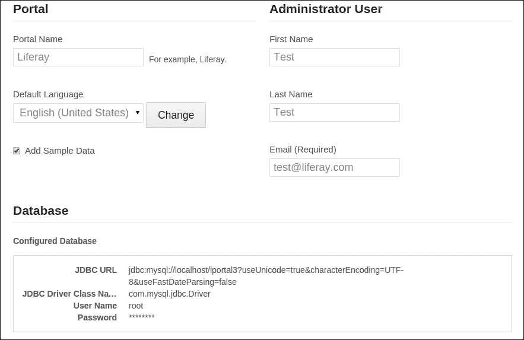

# 第一章 安装和基本配置

在本章中，我们将涵盖以下主题：

+   在 Tomcat 捆绑包上快速运行 Liferay

+   Liferay 设置向导和首次登录

+   设置开发者环境

+   创建自定义 portlet

# 简介

Liferay 是市场上领先的开源门户解决方案提供商。它提供了一个稳固的平台来服务于所有客户。很难说 Liferay 是什么。一方面，Liferay 是一个优秀的内容管理系统，另一方面，它为用户之间的协作和通信提供了许多工具。它也可以是一个具有许多功能的社会平台，如墙、论坛、聊天等。此外，它还是一个符合 JSR-168 和 JSR-286 规范的 portlet 容器。**Java 规范请求**（**JSRs**）描述了 Java 平台的最终规范。portlet 是一个小的 Web 应用程序，它生成 HTML 代码片段，这些片段被聚合到门户中。JSR-168 和 JSR-286 规范标准化了 portlet 与 portlet 容器之间的交互方式。这些规范还描述了 Java portlet 开发的标准化应用程序编程接口。换句话说，Liferay 只负责聚合在任何特定页面上要显示的 portlet 集合。这种方法为用户提供了一个强大的工具来组织和定制 portlet，以构建整个门户、社交平台或内联网。在 Liferay 中，一个门户由多个 portlet 组成，这些是按照特定标准编写的自包含的交互元素。许多出版物描述了 Liferay 的优势。在这本书中，我们将尝试深入了解 Liferay 的架构和其功能。

本章的主要目的是让您了解 Liferay 的安装和管理，包括基本配置。我们意识到有许多方法可以下载、编译、安装和运行 Liferay Portal。我们的主要目的是提供一些清晰和基本的信息，关于我们将依赖和工作的起始包。本章解释了在每次编译操作或每次启动操作上执行的主要过程。

Liferay Portal 以两种不同的版本发行：

+   **Liferay Portal 社区版 (CE)**: 这是一个免费的开放源代码版本的 Liferay

+   **Liferay Portal 企业版 (EE)**: 这是一个包含 Liferay 工程师、支持和服务的商业产品

本书基于最新的 Liferay Portal 社区版 (CE) 版本，版本号为 6.2。

要开始使用 Liferay 的旅程，有几个起点包含大量有用的信息，如下所示：

| URL | 描述 |
| --- | --- |
| [`www.liferay.com/`](http://www.liferay.com/) | 官方 Liferay 网站 |
| [`www.liferay.com/downloads/liferay-portal/available-releases`](http://www.liferay.com/downloads/liferay-portal/available-releases) | 可用版本放置处 |
| [`www.liferay.com/documentation/liferay-portal/6.2/user-guide`](http://www.liferay.com/documentation/liferay-portal/6.2/user-guide) 和 [`dev.liferay.com/`](https://dev.liferay.com/) | 用户指南和文档 |

| [`svn.liferay.com/repos/public/portal`](http://svn.liferay.com/repos/public/portal) | Liferay 代码的旧式仓库。

+   **登录**：在此字段输入 guest

+   **密码**：此字段应留空

|

| [`github.com/liferay/liferay-portal/tree/6.2.x`](https://github.com/liferay/liferay-portal/tree/6.2.x) | [推荐] GitHub 仓库 |
| --- | --- |

### 提示

Liferay 推出了 7.0 版本，该版本将于 2015 年 9 月发布。不要从主干分支检出 Liferay 源代码。6.2 版本和主干版本之间有很多变化。在 7.0 版本中，Liferay 将提供 OSGi 集成和许多新功能。这些新功能帮助用户和开发者实现一系列开箱即用的功能（例如，基于 Lucene 框架的 Elasticsearch 作为搜索服务器）。

# 快速在 Tomcat 捆绑包上运行 Liferay

运行 Liferay 最简单的方法是从 Liferay 官方网站下载一个特定的捆绑包。Liferay 捆绑包只是一个包含托管 Liferay Portal 所需所有内容的压缩归档文件。捆绑包由一个基于 Java 的应用服务器和部署的 Liferay Portal 核心应用程序组成。Liferay 提供了不同应用程序服务器（即 Tomcat、JBoss、Geronimo 等）的捆绑运行时，以便您可以根据自己的选择使用任何一个。此方法推荐给只想运行 Liferay Portal、查看其功能并使用 GUI 配置网站的人。在本菜谱中，您将学习在 Tomcat 和 MySQL 数据库引擎上设置 Liferay 的技巧。

## 准备工作

首先，确保已正确安装 JRE 或 JDK。输入以下命令行：

```js
$ java -version

```

结果应该类似于以下内容：

```js
$ java -version
java version "1.7.0_45"
Java(TM) SE Runtime Environment (build 1.7.0_45-b18)
Java HotSpot(TM) 64-Bit Server VM (build 24.45-b08, mixed mode).

```

还要检查 Java SDK 版本。Liferay 推荐 Java 7 或更高版本。

此外，确定 MySQL 服务器安装是否完成：

```js
$ mysql --version

```

因此，实际安装的版本应显示出来。以下是一个示例：

```js
mysql  Ver 14.14 Distrib 5.5.34, for debian-linux-gnu (x86_64)

```

还要检查 MySQL 版本。我们推荐 5.5 版本或更高版本。

## 如何操作...

要在 Tomcat 捆绑包上运行 Liferay，请按照以下步骤操作：

1.  创建一个名为`lportal`的数据库：

    ```js
    CREATE DATABASE lportal CHARACTER SET utf8 COLLATE utf8_general_ci;
    grant all privileges on lportal.* to '{USERNAME}'@'%' identified by 'PASSWORD';
    ```

    确保 MySQL 用户有创建表的权限。

1.  从[`www.liferay.com/downloads/liferay-portal/available-releases`](http://www.liferay.com/downloads/liferay-portal/available-releases)下载适用于 Tomcat 捆绑包的正确 Liferay 版本。

1.  解压下载的归档文件。

1.  进入提取的文件夹`liferay-portal-6.2-ce-ga2`。此路径将被称作`${liferay.home}`文件夹。

1.  前往`${liferay.home}`文件夹，创建一个名为`portal-ext.properties`的文件。

1.  编辑`portal-ext.properties`并设置数据库属性：

    ```js
    jdbc.default.driverClassName=com.mysql.jdbc.Driver
    jdbc.default.url=jdbc:mysql://localhost/lportal?useUnicode=true&characterEncoding=UTF-8&useFastDateParsing=false
    jdbc.default.username={USERNAME}
    jdbc.default.password={PASSWORD}
    ```

1.  找到 Tomcat 文件夹并转到`tomcat-7.0.42/bin/`位置。

1.  运行`./startup.sh`脚本（Windows 操作系统为`startup.bat`）并查看`tomcat-7.0.42/logs/catalina.out`日志。

1.  在浏览器中，输入`http://localhost:8080`位置。默认情况下，Tomcat 监听 8080 端口。它应该默认渲染 Liferay 设置向导。这个向导将要求提供基本信息，例如，门户名称、默认语言和管理员用户详情。

## 它是如何工作的...

从准备好的 bundle 中运行 Liferay Portal 是一项相当容易完成的任务。然而，了解当 Tomcat 启动时到底发生了什么是有价值的。简要查看`catalina.out`日志并尝试逐行检查它。

### 加载配置描述符

第一件事是部署`ROOT.xml`。在我们的`catalina.out`文件中，有一行显示如下：

```js
INFO: Deploying configuration descriptor /home/piotr/liferay-portal-6.2-ce-ga2/tomcat-7.0.42/conf/Catalina/localhost/ROOT.xml
```

这意味着配置文件在 Tomcat 7 中打开了`crossContext`属性。这个设置是必需的，因为 Liferay 是一个 portlet 容器。因此，它是一个应该能够访问其他称为 portlets 的应用程序的应用程序。Apache Tomcat 文档说：

> *"设置为 true，如果在这个应用程序内部调用 ServletContext.getContext()需要成功返回一个请求分发器，以便访问在这个虚拟主机上运行的其他 Web 应用程序。"*

### 加载系统属性和门户属性

日志文件中的下一行显示了从特定位置加载的门户属性和系统属性：

```js
Loading jar:file:/home/piotr/liferay-portal-6.2-ce-ga2/tomcat-7.0.42/webapps/ROOT/WEB-INF/lib/portal-impl.jar!/system.properties
Loading jar:file:/home/piotr/liferay-portal-6.2-ce-ga2/tomcat-7.0.42/webapps/ROOT/WEB-INF/lib/portal-impl.jar!/system.properties
Loading jar:file:/home/piotr/liferay-portal-6.2-ce-ga2/tomcat-7.0.42/webapps/ROOT/WEB-INF/lib/portal-impl.jar!/portal.properties
Loading file:/home/piotr/liferay-portal-6.2-ce-ga2/portal-ext.properties
```

Liferay Portal 的主要配置文件是`portal.properties`，其中包含关于它定义的属性的详细说明。至少有三种可能的方法可以覆盖`portal.properties`。有一个功能可以将`portal-ext.properties`放在`ext`插件中，在`${liferay.home}`目录中，或者放在`portal-setup-wizard.properties`中。但哪个文件最重要？答案在`portal.properties`文件中。默认的读取顺序是`portal.properties`，`portal-bundle.properties`，`portal-ext.properties`，然后是`portal-setup-wizard.properties`：

```js
    include-and-override=portal-bundle.properties
    include-and-override=${liferay.home}/portal-bundle.properties
    include-and-override=portal-ext.properties
    include-and-override=${liferay.home}/portal-ext.properties
    include-and-override=portal-setup-wizard.properties
    include-and-override=${liferay.home}/portal-setup-wizard.properties
```

### 检测数据库和数据库方言

下一步是识别数据库的方言：

```js
12:35:47,469 INFO  [localhost-startStop-1][DialectDetector:71] Determine dialect for MySQL 5
12:35:47,504 INFO  [localhost-startStop-1][DialectDetector:136] Found dialect org.hibernate.dialect.MySQLDialect
```

Liferay 支持许多数据库引擎，如 DB2、Derby、Hypersonic、Ingres、MySQL、Oracle、P6Spy、PostgreSQL 和 Sybase。默认数据库是 Hypersonic，它将所有数据存储在`${liferay.home}/data/hsql/lportal`目录中。这对于想要运行 JUnit 测试的开发者来说是一个好选择，这些测试通过测试持久层或业务流程来修改数据。

在每次重启时，Liferay 都会尝试从`Release_`表获取构建号（Liferay 版本）。如果这个表不存在，它将调用`ReleaseLocalService.createTablesAndPopulate()`。

如果无法获取构建号，Liferay 会记录以下信息：

```js
WARN  [localhost-startStop-1][ReleaseLocalServiceImpl:171] Table 'lportal.Release_' doesn't exist
```

`createTablesAndPopulate` 方法运行以下脚本：

+   `liferay-portal/sql/portal-tables.sql`：这创建了所需的表

+   `liferay-portal/sql/portal-data-common.sql`：这添加了默认数据

+   `liferay-portal/sql/portal-data-counter.sql`：这初始化了唯一键生成器

+   `liferay-portal/sql/portal-data-release.sql`：这设置了发布日期

+   `liferay-portal/sql/indexes.sql`：这添加了数据库索引

+   `liferay-portal/sql/sequences.sql`：默认情况下，此文件为空。

除了创建表和填充数据外，Liferay 还会触发 `VerifyProcess` 机制。此过程将在每次启动时运行，以验证和修复数据库中发现的任何完整性问题。这是开发者添加自定义代码以检查特定案例完整性的完美位置。

### 启动 autodeploy 扫描器和部署插件

最后一步是初始化 autodeploy 和 hotdeploy 监听器。通常，这些机制将所有插件安装到 Tomcat 容器中，并将它们注册为 portlets、hooks、themes 等。特别是，至少有三种部署方法：sandbox 部署、autodeploy 和 hotdeploy。

### 注意

默认情况下，Liferay 使用 autodeploy 和 hotdeploy 监听器。实际上，sandbox 目前只能部署 themes 和 portlets。

autodeploy 机制负责监听特定目录以即时安装新插件并将它们复制到 Tomcat hotdeploy 过程中。该目录的定义放置在 `portal.properties` 中，默认情况下位于 `deploy` 文件夹：

```js
auto.deploy.deploy.dir=${liferay.home}/deploy
```

每种类型的插件都有自己的 autodeploy 机制。这个机制运行所有必要的步骤，以确保它在 Liferay 容器中正确安装。简单来说，autodeploy 机制生成 `web.xml` 文件，并将所需的库添加到特定的插件中。这些类的定义放置在带有 `auto.deploy.*` 前缀的 `portal.properties` 文件中。每个类都扩展 `BaseAutoDeployListener`。

第二个过程，hotdeploy，负责在 Liferay 中注册插件。这包括许多步骤，例如创建数据库表、设置首选项、注册 Spring 应用程序上下文等。当然，每个步骤都取决于插件的类型。在 `portal.properties` 中，为每种类型的类都有定义：

```js
hot.deploy.listeners=
com.liferay.portal.deploy.hot.PluginPackageHotDeployListener,
com.liferay.portal.deploy.hot.SpringHotDeployListener,
com.liferay.portal.deploy.hot.ServletContextListenerHotDeployListener,
com.liferay.portal.deploy.hot.ExtHotDeployListener,
com.liferay.portal.deploy.hot.HookHotDeployListener,
com.liferay.portal.deploy.hot.JSONWebServiceHotDeployListener,
com.liferay.portal.deploy.hot.LayoutTemplateHotDeployListener,
com.liferay.portal.deploy.hot.PortletHotDeployListener,
com.liferay.portal.deploy.hot.SocialHotDeployListener,
com.liferay.portal.deploy.hot.ThemeHotDeployListener,
com.liferay.portal.deploy.hot.ThemeLoaderHotDeployListener,
com.liferay.portal.deploy.hot.MessagingHotDeployListener
```

### 小贴士

在部署过程中，Liferay 部署器修改 `web.xml` 文件，添加特定的依赖项，并将其重新打包。请确保您不要直接将 `WAR` 文件复制到 Tomcat 的 `webapps` 文件夹中。如果您这样做，插件将无法工作。

## 还有更多...

通常，企业已经建立了一个 Java EE 基础设施，他们希望在之上安装 Liferay。你还必须考虑企业的安全策略。这些策略有时会阻止将 Tomcat 捆绑包下载并安装到您选择的位置。在这种情况下，捆绑包就不够了，您必须手动将 Liferay 从其 WAR 存档安装到已存在的 Apache Tomcat 应用程序服务器中。

实现此目标有六个步骤。它们如下：

1.  将特定的 JAR 文件及其依赖项复制到 Tomcat 全局`lib`文件夹，`$TOMCAT_HOME/lib/ext`。

1.  通过将`ROOT.xml`文件添加到`$TOMCAT_HOME/conf/Catalina/localhost`文件夹中启用`crossContext`。

1.  在`$TOMCAT_HOME/bin/setenv.sh`文件中设置自定义`$JAVA_OPTS`参数：

    ```js
    JAVA_OPTS="$JAVA_OPTS -Dfile.encoding=UTF8 -Dorg.apache.catalina.loader.WebappClassLoader.ENABLE_CLEAR_REFERENCES=false -Duser.timezone=GMT -Xmx1024m -XX:MaxPermSize=256m"
    ```

1.  使用以下代码行更新位于`$TOMCAT_HOME/conf/catalina.properties`中的`common.loader`属性：

    ```js
    common.loader=${catalina.base}/lib,${catalina.base}/lib/*.jar,${catalina.home}/lib,${catalina.home}/lib/*.jar,${catalina.home}/lib/ext,${catalina.home}/lib/ext/*.jar
    ```

1.  在`$TOMCAT_HOME/conf/server.xml`中将 URI 编码指定为 UTF-8，如下所示：

    ```js
    <Connector port="8080" protocol="HTTP/1.1"
      connectionTimeout="20000"
      redirectPort="8443" URIEncoding="UTF-8" />
    ```

1.  使用 Tomcat 管理器部署 Liferay Portal 或将 WAR 存档手动放入`$TOMCAT_HOME/webapps`文件夹中。WAR 文件可在[`www.liferay.com/downloads/liferay-portal/available-releases#additional-versions`](http://www.liferay.com/downloads/liferay-portal/available-releases#additional-versions)找到。

### 注意

如何在 Tomcat 服务器上安装 Liferay 的更详细说明可在官方 Liferay 文档中找到，请参阅[`www.liferay.com/documentation/liferay-portal/6.2/user-guide/-/ai/installing-liferay-on-tomcat-3`](https://www.liferay.com/documentation/liferay-portal/6.2/user-guide/-/ai/installing-liferay-on-tomcat-3)。

## 参见

有关在集群环境中运行 Liferay 的信息，请参阅第十一章中的*Clustering Liferay Portal*配方，*快速技巧和高级知识*，以及第十二章中的*Scalable infrastructure*配方，*基本性能调整*。有关设置开发者环境的信息，请参阅下一配方。

# Liferay 设置向导和首次登录

在 Apache Tomcat 服务器上成功运行 Liferay 后，系统会要求用户填写一些必要的信息以完成设置向导。这只是一个包含基本字段的单个屏幕，例如管理员名称或门户名称。

## 如何操作…

首次运行 Liferay 后，Liferay 平台会显示基本配置表单，其外观如下：



要完成安装，必须按照以下方式填写前面的表单：

1.  提供有关**门户**的详细信息：

    +   **门户名称**：这是网站名称，例如，企业内部网

    +   **默认语言**：这有助于选择门户的默认语言

    +   **添加示例日期**：这决定了是否用默认数据填充门户

1.  提供有关**管理员用户**的详细信息：

    +   **名字**和**姓氏**

    +   **电子邮件**地址

1.  选择数据库引擎（可选）。在先前的菜谱中，我们设置了 MySql 连接的属性。

1.  确认表单。

1.  点击**转到我的门户**按钮。

1.  点击**使用条款**屏幕上的**我同意**按钮。

1.  填写**密码提示**表单并确认表单。

    确认**密码提示**表单后，您将能够查看和使用主要的 Liferay 导航工具。

按以下步骤导航到**控制面板**：

1.  点击侧边栏菜单上的**管理员**按钮。

1.  点击**控制面板**链接。

## 它是如何工作的...

运行 Liferay 第一次后，Liferay 需要关于门户、数据库和管理员的基本信息。数据库连接已在`portal-ext.properties`中设置，并在前面的菜谱中进行了描述。

在门户向导中提供的所有数据都存储在`${liferay.home}/portal-setup-wizard.properties`文件中。以下表格描述了最重要的设置：

| 属性名称 | 描述 |
| --- | --- |
| `admin.email.from.name` | 这描述了管理员的名称。 |
| `admin.email.from.address` | 这是管理员的电子邮件地址。 |
| `liferay.home` | 这是`${liferay.home}`目录的路径。这个属性非常重要，必须设置。 |
| `setup.wizard.enabled` | 此标志禁用设置向导。 |

登录后，用户能够看到仅授权用户可用的导航工具。以下是导航工具：

+   侧边栏菜单位于屏幕顶部边缘下方。侧边栏由以下三个按钮组成：

    +   允许我们导航到**站点管理**和**控制面板**部分的**管理员**按钮

    +   **我的站点**按钮，列出用户是成员的站点的链接

    +   带有**用户名**和**姓氏**的按钮，允许我们导航到用户的个人资料（**我的个人资料**）、用户仪表板（**我的仪表板**）、用户账户（**我的账户**），并允许用户注销

+   快速编辑菜单位于屏幕左侧边缘附近。菜单由以下图标组成：

    +   允许我们向页面添加新页面、新应用程序或新内容的**添加**图标

    +   允许我们编辑当前查看页面设置的**编辑**图标

    +   允许我们以不同分辨率和设备查看当前查看页面的**预览**图标

    +   允许我们隐藏或显示小部件控制的**编辑控件**图标

## 还有更多...

在内部项目，如内联网中，用户账户通常在外部系统中创建和管理，例如 LDAP。因此，允许用户管理他们的身份验证数据（例如，设置密码提示查询）或直接在 Liferay 中要求他们同意使用条款是不必要的（有时甚至是不被接受的）。在 Liferay 中，有许多属性可以帮助自定义首次登录操作，其中一些如下：

| 属性名称 | 描述 |
| --- | --- |
| `terms.of.use.required=false` | 这将关闭使用条款查询功能 |
| `terms.of.use.journal.article.group.id` 和 `terms.of.use.journal.article.id` | 这指定了将显示为使用条款的组 ID 和文章 ID |
| `users.reminder.queries.enabled=false` | 这将禁用提醒查询功能 |

## 参见

+   关于添加新用户和定义角色和权限的信息，请参考第三章中的*添加新用户*配方，*使用 Liferay 用户/用户组/组织*

+   *创建和配置角色*和*分配用户角色*配方在第五章中，*角色和权限*

+   关于默认登录页面的信息，请参考第二章中的*使用管理员定义的页面覆盖默认登录页面*配方，*身份验证和注册过程*

# 设置开发环境

许多开发者希望定制 Liferay Portal 以满足客户的需求。此外，本书中还将提供许多代码示例，因此设置环境是开始的重要步骤。Liferay 提到有两种类型的发展和两种获取源代码的方式：

+   **GitHub**：对于贡献者

+   **sourceforge.net**：对于非贡献者

对于本书的目的，仅使用非贡献者版本就足够了。

## 准备工作

使用 Liferay Portal 的最小要求是**Java 开发工具包**（**JDK**），Apache Ant 1.7 版本或更高版本，以及 Eclipse IDE Indigo 或更高版本。通过输入以下代码行来确保安装成功：

```js
$ ant -version
Apache Ant(TM) version 1.8.2 compiled on May 18 2012

$ java -version
java version "1.7.0_45"
Java(TM) SE Runtime Environment (build 1.7.0_45-b18)
Java HotSpot(TM) 64-Bit Server VM (build 24.45-b08, mixed mode)

```

## 如何操作...

本配方分为三个部分。第一部分包含描述准备活动，如下载 Liferay 源代码或解压缩它们。第二部分提供了关于所需配置的描述。最后一部分专注于编译所有 Liferay 源代码并将它们部署到 Apache Tomcat 服务器。

### 将源代码导入到 Eclipse IDE

第一步是将 Liferay 源代码作为项目导入到我们的 IDE 中。以下步骤基于 Eclipse IDE。为了实现这一点，请按照以下步骤操作：

1.  在`${liferay.home}`中创建一个`workspace`文件夹。

1.  访问 [`sourceforge.net/projects/lportal/files/Liferay%20Portal/`](http://sourceforge.net/projects/lportal/files/Liferay%20Portal/) 并选择最新的 6.x 版本的文件夹。接下来，找到以 `liferay-portal-src-*` 为前缀的文件并下载它。

1.  将此文件解压到 `workspace` 文件夹。

1.  通过访问 **文件** | **导入** | **通用** | **现有** **项目到工作空间** 并点击 **下一步** 按钮，将此项目导入 Eclipse IDE。在下一屏幕上，选择 **选择根目录** 并指向包含 Liferay 源代码的文件夹，即 `${liferay.home}/workspace/liferay-portal-src-${VERSION}`。要完成此任务，请点击 **完成** 按钮。

1.  在这一步之后，需要在项目中创建一个名为 `/portal-web/test/functional` 的文件夹。这个操作可以解决 Eclipse IDE 中的以下警告：**构建路径条目缺失：Liferay-portal-src.6.2-ce-ga2/portal-web/test/functional**。

### 覆盖 app.server.properties

为了与放置在 `${liferay.home}/tomcat-7.0.42` 文件夹中的现有 Tomcat 兼容，需要更改 `app.server.parent.dir` 属性。为此，请按照以下步骤操作：

1.  在项目的根目录中创建 `app.server.${username}.properties`，即 `${liferay.home}/workspace/liferay-portal-src-${VERSION}`。

1.  覆盖 `服务器目录` 属性并设置新值：

    ```js
    app.server.parent.dir=${project.dir}/../../
    ```

    这也可以是 Tomcat 父文件夹的绝对路径。

    `${liferay.home}` 文件夹应该具有以下层次结构：

    ```js
      .
      |-data
      |---document_library
      |---hsql
      |---lucene
      |-deploy
      |-license
      |-logs
      |-tomcat-7.0.42
      |---bin
      |---conf
      |---lib
      |---logs
      |---temp
      |---webapps
      |-workspace
      |---liferay-portal-src-6.2-ce-ga2
    ```

### 编译和部署

访问 `{$liferay.home}/workspace/liferay-portal-src-${VERSION}` 并使用命令行中的 `ant all` 目标编译所有 Liferay 源代码。

### 注意

在这本书中，我们将使用控制台方法来编译、部署等。Liferay 为 Eclipse 提供了 Liferay IDE。为了更好地理解，我们将使用命令行作为主要工具。

## 它是如何工作的

这可能成为对 Liferay 使用 Apache Ant 而不是 Maven、Gradle 或其他构建自动化工具的批评来源。实际上，Apache Ant 工具足以管理和编译 Liferay 核心。如果有人想使用 Maven，他们可以在自定义插件中使用它。Liferay 提供了许多原型，以帮助创建多个插件的 Maven 项目。

让我们更详细地看看 Eclipse IDE 中的项目。有许多包含大量包的文件夹。让我们检查与 Liferay 架构最相关的最重要文件夹：

| 文件夹名称 | 描述 |
| --- | --- |
| `定义` | 这包含 `dtd` 和 `xsd` 定义，例如，`portlet.xml` 定义或 `service.xml` 定义。 |
| `portal-impl` | 这是门户的核心。它实现了在全局 `lib` 中暴露的所有接口，并且包含模型定义。永远不要将 `portal-impl` 放置在它来源之外的地方。 |
| `portal-service` | 这提供了接口定义，可用于自定义实现，例如钩子、端口、主题等。 |
| `util-bridges` | 这包含桥梁和实用工具，有助于实现自定义端口，例如 AlloyPortlet、BSFPortlet、MVCPortlet 等。 |
| `portal-web` | 这包含 Web 应用程序根目录，其中包含所有配置文件和视图层。 |

让我们回到编译命令`ant all`。这里到底发生了什么？门户有其自己的运行时结构。它提供了带有 Tomcat、JBoss 或其他应用程序服务器的即用型包。它提供了一个可以构建运行时包的工具。在主要的`build.xml`Ant 文件中，有一个 Ant 目标定义[`ant.apache.org/manual/targets.html`](https://ant.apache.org/manual/targets.html)：

```js
<target name="all">
  <antcall target="clean" />
  <antcall target="start" />
  <antcall target="deploy" />
</target>
```

构建过程由三个部分组成：清理、启动和部署。

### 清理过程

`ant clean`命令执行以下步骤：

+   它清理以下文件夹下的 Java 类：`classes`、`portal-service`、`util-bridges`、`util-java`、`util-slf4j`、`util-taglib`、`portal-impl`、`portal-pacl`、`osgi/bootrstap`、`portal-web`和`sql`

+   它删除了具有掩码`*.ear`、`*.jar`、`*.war`和`*.zip`的文件

+   它清理了`work`、`temp`和`logs`Tomcat 文件夹，并从`/conf/Catalina/localhost`目录中删除了`*-hook.xml`和`*-portlet.xml`文件

根据应用程序服务器，还有一些额外的步骤，用于清理或删除许多配置文件。为了理解本书中使用的流程，不需要了解每个步骤和深度清理过程。

### 启动过程

`ant start`目标调用以下任务：

+   它运行编译目标，编译`portal-service`、`util-bridges`、`util-java`、`util-slf4j`、`util-taglib`、`portal-impl`、`portal-pacl`和`osgi/bootstrap`文件夹下的源代码

+   它构建数据库并重新构建 Hypersonic 数据库

+   它在`portal-impl`文件夹下构建主题

+   它调用生成 Liferay 核心 JAR 和 WAR 的`jar`目标

### 部署过程

此目标严格依赖于应用程序服务器。通常，此构建将应用程序部署到特定的 Servlet 容器或应用程序服务器。此外，此构建在`${liferay.home}`下创建所需的文件夹或文件。此构建创建的文件夹如下：

+   热部署过程的`deploy`文件夹

+   包含二进制数据（如文档库、Jackrabbit、HSQLDB 或 Lucene）的`data`文件夹

+   `${app.server.dir}/conf/Catalina/localhost/`中的`ROOT.xml`上下文配置文件以及许多其他依赖于应用程序服务器的任务

## 还有更多...

如前所述，可以创建一个完整的包，而无需手动下载 Tomcat 或其他应用程序服务器。为了实现这一目标，只需两个步骤：

+   调用`ant -buildfile build-dist.xml unzip-tomcat`任务

+   调用`ant all`命令

在不同的应用程序服务器上部署 Liferay 是可能的。有一系列命令可以完成这个任务：

```js
ant -buildfile build-dist.xml build-dist-geronimo
ant -buildfile build-dist.xml build-dist-glassfish
ant -buildfile build-dist.xml build-dist-jboss
ant -buildfile build-dist.xml build-dist-jboss-eap
ant -buildfile build-dist.xml build-dist-jetty
ant -buildfile build-dist.xml build-dist-jonas
ant -buildfile build-dist.xml build-dist-resin
ant -buildfile build-dist.xml build-dist-tcat
ant -buildfile build-dist.xml build-dist-tomcat

```

# 创建一个自定义组件

这个菜谱非常具体，因为它展示了如何生成一个新的组件，将其安装在 Liferay 上，并将其导入到 Eclipse IDE 中。本书中的许多菜谱都假设用户知道如何生成一个新的插件，例如组件、钩子或 Web。我们将向您展示如何使用 Apache Maven 架构生成一个新的组件。整本书都假设您使用 Apache Maven 编译和部署新的组件。

## 准备工作

为了正确生成一个新的组件，您需要以下软件栈：

+   Java SDK 1.7 或更高版本

+   Apache Maven，我们使用 3.0.5 版本

+   Eclipse IDE（Kepler 或更高版本）

我们还假设您已经正确设置了开发环境，这在之前的菜谱中已经描述过。

## 如何操作…

实现我们的目标有三个阶段：生成一个新的组件，编译它，并将其部署和导入到 Eclipse IDE。

### 生成一个新的组件

我们需要做的第一件事是创建一个 Maven 项目。为了生成它，请按照以下步骤操作：

1.  进入 `${liferay.home}/workspace` 文件夹。

1.  执行 `mvn archetype:generate -Dfilter=liferay-portlet-archetype`。

1.  为 `com.liferay.maven.archetypes:liferay-portlet-archetype` 选择一个数字。在我们的列表中，它是编号 `1`：

    ```js
    Choose a number or apply filter (format: [groupId:]artifactId, case sensitive contains): : 1
    ```

1.  选择正确的 Liferay 版本。在我们的例子中，它将是 6.2.2，编号为 `24`。

1.  按照以下方式提供所有所需的 Maven 项目信息：

    ```js
    Define value for property 'groupId': : com.packtpub.portlet
    Define value for property 'artifactId': : first-portlet
    Define value for property 'version':  1.0-SNAPSHOT: : 
    Define value for property 'package':  com.packtpub.portlet: : 
    Confirm properties configuration:
    groupId: com.packtpub.portlet
    artifactId: first-portlet
    version: 1.0-SNAPSHOT
    package: com.packtpub.portlet
    Y: : y
    ```

1.  在我们的 `workspace` 文件夹中，应该生成一个名为 `first-portlet` 的组件。

### 编译组件并部署它

使用 Apache Maven，编译和部署一个组件非常容易。在调用 Maven 命令之前，用户必须在 `pom.xml` 文件中设置特定的属性。

1.  进入 `${liferay.home}/workspace/first-portlet` 文件夹并编辑 `pom.xml` 文件。

1.  在 `<build>` 部分，添加以下属性定义：

    ```js
    <properties>
      <liferay.version>6.2.2</liferay.version>
      <liferay.maven.plugin.version>6.2.2</liferay.maven.plugin.version>
      <liferay.auto.deploy.dir>${liferay.home}/deploy</liferay.auto.deploy.dir>
      <liferay.app.server.deploy.dir>${liferay.home}/tomcat-7.0.42/webapps</liferay.app.server.deploy.dir>
      <liferay.app.server.lib.global.dir>${liferay.home}/tomcat-7.0.42/lib/ext</liferay.app.server.lib.global.dir>
      <liferay.app.server.portal.dir>${liferay.home}/tomcat-7.0.42/webapps/ROOT</liferay.app.server.portal.dir>
    </properties>
    ```

    ### 小贴士

    将 `${liferay.home}` 替换为你的文件夹的实际路径。

1.  保存 `pom.xml` 文件。

1.  通过执行以下命令构建一个新的项目：

    ```js
    mvn clean install

    ```

1.  确保您的 Apache Tomcat 正在运行 Liferay。

1.  调用 `mvn liferay:deploy` 命令并跟踪 `catalina.out` 日志文件。您应该看到类似的消息：

    ```js
    [PortletHotDeployListener:343] Registering portlets for first-portlet
    [PortletHotDeployListener:490] 1 portlet for first-portlet is available for use

    ```

### 将组件导入到 Eclipse IDE

通过 Maven 架构插件成功生成源代码后，我们的组件源代码可以导入到我们的 Eclipse IDE 中。要导入它们，请按照以下步骤操作：

1.  确保您位于 `${liferay.home}/workspace/first-portlet` 文件夹中。

1.  运行 `mvn eclipse:clean eclipse:eclipse` 命令。

1.  打开您的 IDE，通过访问 **文件** | **导入** | **通用** | **将现有项目导入到工作空间** 来将 `first-portlet` 作为项目导入。

## 它是如何工作的…

从 `com.liferay.maven.archetypes:liferay-portlet-archetype` 创建的端口项目具有现成的端口实现。实际上，它非常基础，但整个文件夹结构和配置文件都创建得正确。每个端口都有四个配置文件：`portlet.xml`、`liferay-portlet.xml`、`liferay-display.xml` 和 `liferay-plugin-package.properties`。所有这些文件都放置在 `first-portlet/src/main/webapp/WEB-INF` 文件夹中。

`portlet.xml` 文件是端口描述符。它包含端口定义，例如名称、端口类等。

`liferay-portlet.xml` 文件是 `portlet.xml` 的一种扩展。它只被 Liferay Portal 所理解。它提供了额外的信息，例如端口的图标、`css` 和 `js` 文件路径等。

`liferay-display.xml` 文件告诉我们我们的端口将在哪个部分可用。我们将在本书的后续部分对其进行描述。

`liferay-plugin-package.properties` 文件是我们端口的度量标准。这是一个指定版本、标签、页面 URL、作者和许可证的好地方。

关于端口的详细信息可在 JSR-168 和 JSR-286 规范中找到。有许多关于如何使用端口、如何建立端口之间的通信或端口请求生命周期的示例。

## 参见

关于端口的更多信息，请参阅以下菜谱：

+   在第五章 *角色和权限* 的 *创建基于角色的端口* 菜谱中，第五章

+   在第五章 *角色和权限* 的 *在自定义端口中检查权限* 菜谱中，第五章

+   在第十一章 *快速技巧和高级知识* 的 *语言属性钩子* 菜谱中，第十一章

+   在第十一章 *快速技巧和高级知识* 的 *使用 Liferay 服务总线进行端口间通信* 菜谱中，第十一章
