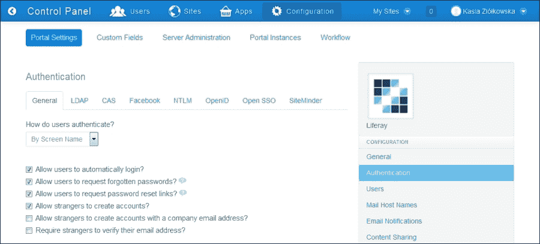
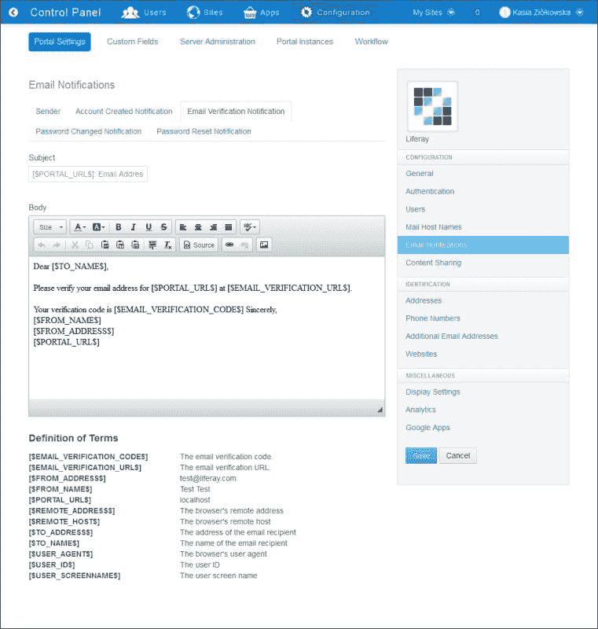
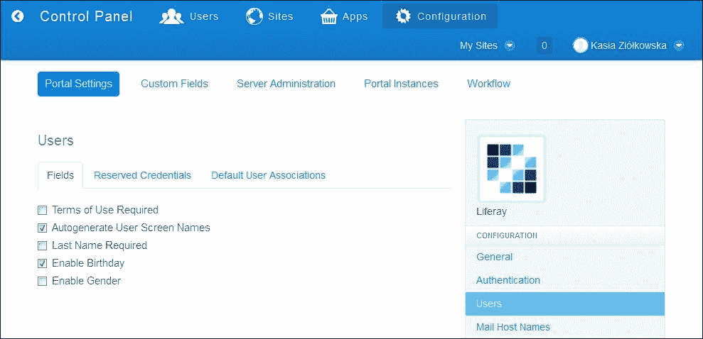
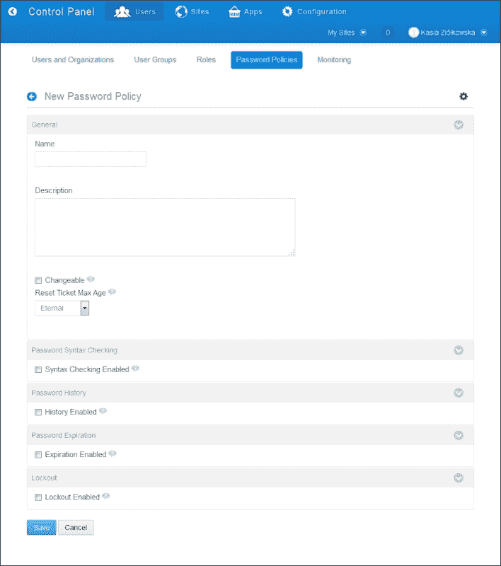
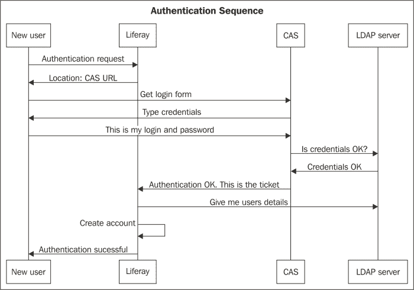

# 第二章. 认证和注册流程

在本章中，我们将涵盖以下主题：

+   修改默认认证设置

+   设置电子邮件通知

+   自定义注册表单

+   用管理员定义的页面覆盖默认登录页面

+   设置密码策略

+   与 CAS SSO 集成

+   CAS 和 Liferay 用户数据库

+   Liferay 和 LDAP 集成

+   神奇的三重奏：Liferay、CAS 和 LDAP

# 简介

认证和注册流程对于构建内部网络系统非常重要。在这种类型的软件中，必须保护数据免受未经授权的用户访问。我们决定描述在许多项目中常用的典型解决方案。这将帮助您配置 Liferay 的即用型认证系统并定义密码策略。您还将了解与最流行的单点登录机制（SSO）的集成。SSO 的目的是允许用户一次提供凭证即可访问多个应用程序。**中央认证服务**（**CAS**）是 Web 的单点登录协议。它也是一个实现此协议的软件包。

# 修改默认认证设置

Liferay 提供了一个内置的认证机制，默认情况下允许用户使用他们的电子邮件地址登录。此外，还有一些功能，如自动登录或忘记密码功能，这些功能可以帮助用户并帮助他们完成认证过程。然而，在某些情况下，必须修改标准的认证行为。

## 准备工作

使用管理员凭证登录 Liferay。默认情况下，凭证如下：

+   **电子邮件**：test@liferay.com

+   **密码**：test

## 如何操作…

为了修改默认认证设置，请执行以下步骤：

1.  以管理员身份登录，然后转到**管理** | **控制面板** | **配置** | **门户设置** | **认证部分**：

1.  确保您在**常规**选项卡上。

1.  从**认证类型**下拉列表中选择您喜欢的选项。

1.  启用/禁用**允许用户自动登录？**选项。

1.  启用/禁用**允许用户请求忘记密码？**选项。

1.  启用/禁用**允许用户请求密码重置链接？**选项。

1.  启用/禁用**允许陌生人创建账户？**选项。

1.  启用/禁用**允许陌生人使用公司电子邮件地址创建账户？**选项。

1.  启用/禁用**要求陌生人验证他们的电子邮件地址？**选项。

1.  点击**保存**按钮。

为了仅设置**登录**小部件特定实例的认证类型，您不需要在**控制面板**范围内执行额外的步骤。在这种情况下，只需更改登录小部件的配置即可。执行以下步骤：

1.  前往放置**登录**小部件的公共页面。

1.  点击**添加**按钮。

1.  点击**应用程序**按钮。

1.  使用搜索选项或通过浏览可用小部件列表找到**登录**小部件。

1.  点击小部件名称旁边的**添加**链接。带有基本配置的**登录**小部件将被添加到页面上。

1.  前往**登录**小部件配置。

1.  从**身份验证类型**列表中选择您喜欢的选项。

1.  点击**保存**按钮。

## 它是如何工作的…

在 Liferay 门户中，用户可以通过电子邮件地址、屏幕名称或数字序列，或自动生成的用户 ID 进行身份验证。有两个地方允许您设置首选的身份验证方法：门户设置部分和登录小部件的配置屏幕。控制面板设置允许您定义默认的身份验证类型。此设置也可以通过`portal-ext.properties`中的属性进行修改：

```js
company.security.auth.type=emailAddress
company.security.auth.type=screenName
company.security.auth.type=userId
```

### 小贴士

请记住，比`portal-ext.properties`更重要的是来自 GUI（控制面板）的配置。

然而，登录小部件配置选项允许您决定特定登录小部件将使用哪种身份验证方式。在小部件内部，可以选择**默认**选项或之前描述的三个可用选项之一。默认选项与`company.security.auth.type`属性相同。

除了选择**身份验证**类型外，Liferay 还允许您设置影响授权和身份验证过程的其他参数。默认情况下，除了**要求陌生人验证他们的电子邮件地址？**选项外，所有选项都启用。

**允许用户自动登录？**选项允许您决定网站是否应该记住用户的登录信息，并在**登录**表单中显示**记住我**复选框。此选项可以通过设置以下属性来启用（true）或禁用（false）：

```js
company.security.auto.login=true
```

**允许用户请求忘记的密码？**选项负责启用或禁用忘记密码功能。此功能使得用户可以请求将新密码发送到他们的电子邮件地址。默认情况下，此选项在以下属性中启用：

```js
company.security.send.password=true
```

**允许用户请求密码重置链接？**选项负责启用或禁用重置密码功能。此功能允许用户请求将密码重置链接发送到他们的电子邮件地址。此选项由以下属性表示：

```js
company.security.send.password.reset.link=true
```

**允许陌生人创建账户？**选项负责创建账户链接的可用性。此选项让您决定网站访客是否可以自行创建账户。默认情况下，它如下启用：

```js
company.security.strangers=true
```

**允许陌生人使用公司电子邮件地址创建账户**？选项允许您决定是否可以使用门户设置中“常规”部分提供的域中的电子邮件地址创建新账户：

```js
company.security.strangers.with.mx=true
```

**是否要求陌生人验证他们的电子邮件地址**？选项启用电子邮件验证功能。此功能也可以通过在`portal-ext.properties`中设置以下属性来启用：

```js
company.security.strangers.verify=false
```

尽管**身份验证**部分包含多个标签页，提供了一系列额外的身份验证方法，但**身份验证**标签页的**常规**选项卡上收集的所有设置仅影响 Liferay 功能。它们对剩余标签页上分组集成的选项没有影响。

在某些情况下，前面的配置可能不够。例如，许多公司有自己的隐私政策，要求`HTTPS`连接。Liferay 在`portal.properties`中提供了几个设置，这些设置可以在`portal-ext.properties`中覆盖，具体如下：

| 属性 | 描述 |
| --- | --- |
| `company.security.auth.requires.https=false` | 将此设置为`true`以确保用户使用 HTTPS 登录 |
| `company.security.auto.login.max.age=31536000` | 指定启用*记住我*功能的浏览器 cookie 的最大有效期（以秒为单位） |
| `company.security.login.form.autocomple=true` | 允许用户根据之前输入的值自动完成登录表单 |

### 小贴士

需要修改`portal-ext.properties`文件以重启服务器。

## 还有更多...

与登录和注销机制严格相关的还有两个选项。第一个选项是**默认登录页面**字段，位于**门户设置**网页上。此字段允许您指定用户在完成授权和认证后将被重定向到的页面。第二个选项是**默认注销页面**字段，位于**门户设置**中，允许您定义用户在注销后将被重定向到的页面。

为了设置这些字段的自定义值，请按照以下步骤操作：

1.  前往**管理** | **控制面板** | **配置** | **门户设置** | **常规**。

1.  将**默认登录页面**设置为用户登录后希望访问的页面地址，例如，`/web/guest/login`。

1.  将**默认注销页面**设置为用户注销后希望访问的页面地址，例如，`/web/guest/logout`。

1.  点击**保存**按钮。

这些设置也可以通过以下名称由`portal-ext.properties`覆盖：

```js
default.landing.page.path={PATH}
default.logout.page.path={PATH}
```

## 参见

关于覆盖默认登录页面的信息，请参阅*使用管理员定义的页面覆盖默认登录页面*配方。

# 设置电子邮件通知

在 Liferay 中，有四种自动发送的电子邮件通知。具体如下：

+   **账户创建通知**，在用户成功创建新账户时发送

+   **电子邮件验证通知**，提供电子邮件验证链接和代码

+   **密码更改通知**，通知用户其密码已被更改

+   **密码重置通知**，允许用户通过提供密码重置 URL 来重置当前密码

本食谱提供有关如何自定义这些默认通知的信息。

## 准备工作

确保 Java 邮件会话已正确配置。为了检查其是否工作，请查看`portal-ext.properties`并查找和/或配置以下设置：

```js
mail.session.mail.pop3.host=localhost
mail.session.mail.pop3.password=
mail.session.mail.pop3.port=110
mail.session.mail.pop3.user=
mail.session.mail.smtp.auth=false
mail.session.mail.smtp.host=localhost
mail.session.mail.smtp.password=
mail.session.mail.smtp.port=25
mail.session.mail.smtp.user=
mail.session.mail.store.protocol=pop3
mail.session.mail.transport.protocol=smtp
```

## 如何操作…

为了更改发件人的姓名和电子邮件地址，请按照以下步骤操作：

1.  以管理员身份登录并前往**管理员** | **控制面板** | **配置** | **门户设置** | **电子邮件通知**。

1.  确保您处于**发件人**选项卡。

1.  提供发件人的姓名和电子邮件地址。

1.  点击**保存**按钮。

为了设置**账户创建通知**，请执行以下步骤：

1.  前往**管理员** | **控制面板** | **配置** | **门户设置** | **电子邮件通知**。

1.  前往**账户创建通知**选项卡。

1.  设置**启用**选项。

1.  提供**主题**。

1.  提供带有**密码**的**正文**消息文本。

1.  提供不带**密码**的**正文**消息文本。

1.  点击**保存**按钮。

以下截图捕捉了前面的步骤



除了**账户创建通知**之外，Liferay 还提供了三个选项卡以进行自定义。具体如下：

+   **电子邮件验证通知**

+   **密码更改通知**

+   **密码重置通知**

为了设置**电子邮件验证通知**、**密码更改通知**或**密码重置通知**，请执行以下步骤：

1.  前往**管理员** | **控制面板** | **配置** | **门户设置** | **电子邮件通知**。

1.  前往**电子邮件验证通知**、**密码更改通知**或**密码重置通知**选项卡。

1.  提供消息的主题和正文。

1.  点击**保存**按钮。

## 工作原理…

每封电子邮件通知都由消息的主题和正文组成。消息的主题和正文都可以使用一组称为术语的可用变量（每个通知不同）和自定义文本来编写。消息正文的文本也可以提供简单的文本样式。

值得注意的是，**账户创建通知**选项卡提供了一个额外的**启用**选项，允许您决定是否发送此特定通知。

默认情况下，`portal.properties`包含基本的电子邮件通知设置（默认发件人姓名、默认发件人电子邮件、主题、正文等）。当然，所有这些设置都可以根据特定要求进行自定义：

```js
admin.email.from.name=Joe Bloggs
admin.email.from.address=test@liferay.com
admin.email.user.added.enabled=true
admin.email.user.added.subject=com/liferay/portlet/admin/dependencies/email_user_added_subject.tmpl

admin.email.user.added.body=com/liferay/portlet/admin/dependencies/email_user_added_body.tmpl

admin.email.user.added.no.password.body=com/liferay/portlet/admin/dependencies/email_user_added_no_password_body.tmpl

admin.email.password.reset.subject=com/liferay/portlet/admin/dependencies/email_password_reset_subject.tmpl

admin.email.password.reset.body=com/liferay/portlet/admin/dependencies/email_password_reset_body.tmpl

admin.email.password.sent.subject=com/liferay/portlet/admin/dependencies/email_password_sent_subject.tmpl

admin.email.password.sent.body=com/liferay/portlet/admin/dependencies/email_password_sent_body.tmpl

admin.email.verification.subject=com/liferay/portlet/admin/dependencies/email_verification_subject.tmpl

admin.email.verification.body=com/liferay/portlet/admin/dependencies/email_verification_body.tmpl
```

上述配置定义了每种类型通知的默认设置。例如，`admin.email.password.reset.body`属性定义了密码重置操作的 HTML 模板，该模板位于`com/liferay/portlet/admin/dependencies/email_password_reset_body.tmpl`文件中。

## 参见

关于如何配置 SMTP 服务器的信息，请参阅第十一章中“配置 Liferay 与 SMTP 服务器”食谱，*快速技巧和高级知识*。

# 自定义注册表单

注册过程完成后，注册表单的内容和系统的行为可能会根据系统的功能和非功能需求而有所不同。默认的注册表单配置允许您收集创建账户所需的数据。配置还提供了一些额外的字段，如出生日期或性别，这些字段可能并不总是需要的。本食谱描述了如何更改默认的注册表单字段集，并在注册和授权过程中修改它们的基本首选项和系统行为。

## 如何操作…

为了自定义注册表单，请执行以下步骤：

1.  以管理员身份登录并转到**管理** | **控制面板** | **配置** | **门户设置** | **用户**：

1.  确保您处于**字段**选项卡。

1.  启用/禁用**使用条款必填**选项。

1.  启用/禁用**自动生成用户屏幕名称**选项。

1.  启用/禁用**姓氏必填**选项。

1.  启用/禁用**启用生日**选项。

1.  启用/禁用**启用性别**选项。

1.  点击**保存**按钮。

## 工作原理…

有三个选项卡将注册表单设置分组：**字段**选项卡、**预留凭据**选项卡和**默认用户关联**选项卡。

**字段**选项卡包含负责注册表单内容和用户首次登录时系统行为的选项列表。这些选项中的每一个在`portal.properties`中都有自己的表示，可以被`portal-ext.properties`覆盖。请记住，最高优先级的设置来自**控制面板**。以下是一些选项：

+   **使用条款必填**选项启用和禁用使用条款屏幕，该屏幕在用户首次授权后显示。默认情况下，它被启用：

    ```js
    terms.of.use.required=true
    ```

+   **自动生成用户屏幕名称**选项禁用注册表单中的屏幕名称字段，并设置 Liferay 自动从电子邮件地址创建屏幕名称。如果此选项启用，屏幕名称将根据用户的电子邮件地址（电子邮件地址的本地部分）生成。默认情况下，它被禁用：

    ```js
    users.screen.name.always.autogenerate=false
    ```

+   **姓氏必填**选项将姓氏设置为必填字段。默认情况下，它被禁用：

    ```js
    users.last.name.required=false
    ```

+   **启用生日**选项允许您决定是否应在注册表中提供生日字段。默认情况下，它是启用的：

    ```js
    field.enable.com.liferay.portal.model.Contact.birthday=true
    ```

+   **启用性别**选项允许您决定是否应在注册表中提供性别字段。默认情况下，它是启用的：

    ```js
    field.enable.com.liferay.portal.model.Contact.male=true
    ```

**保留凭据**选项卡允许您定义保留的屏幕名称和电子邮件地址，这些地址不能被用户和管理员用于创建用户账户。它也可以在以下属性中重写：

```js
admin.reserved.screen.names
admin.reserved.email.addresses
```

**默认用户关联**选项卡提供了一组字段，允许您将站点、组织站点、角色和用户组分配给每个新创建的用户。

此外，还可以使用**应用于现有用户**选项扩展现有用户的功能。但是，更改将在用户登录时生效。

## 更多内容…

可以更改登录表单中创建账户链接的默认行为，并使用自定义创建账户小部件页面而不是默认的（登录小部件）页面。为了做到这一点，定义自定义注册小部件放置的 URL，并在`portal-ext.properties`文件中设置以下属性：

```js
company.security.strangers.url=/create-account
```

## 参见

关于添加用户的更多信息，请参阅第三章中的*添加新用户*食谱，*与 Liferay 用户/用户组/组织一起工作*。

# 用管理员定义的页面覆盖默认登录页面

Liferay 提供了使用或替换默认对话框登录功能与自定义登录页面的可能性。自定义页面可以用来展示一些附加信息，例如说明、利益描述等。本食谱提供了如何在内部网络中设置此类页面的指南。

## 如何操作…

为了在登录过程中设置自定义页面，请按照以下步骤操作：

1.  以管理员身份登录并转到**管理** | **站点管理** | **页面**。

1.  确保您处于**公共页面**选项卡。

1.  点击**添加页面**按钮。

1.  为页面提供一个名称（例如，登录）。

1.  启用**隐藏于导航菜单**选项。

1.  点击**添加页面**按钮。新页面将被创建。

1.  通过单击树中创建的页面来查看页面详情并复制**友好 URL**值。

1.  通过在浏览器的地址栏中输入（或粘贴）其地址来转到创建的页面。

1.  点击添加按钮（这是左侧的**+**符号）。

1.  点击**应用程序**选项卡。

1.  使用搜索功能或通过浏览可用小部件列表来查找登录小部件，

1.  点击小部件名称旁边的**添加**链接。带有基本配置的登录小部件将被添加到页面中。

1.  通过在`portal-ext.properties`文件中定义`auth.login.site.url=/login`属性来将此站点的 URL 设置为`portal-ext.properties`文件。

### 注意

如果有自定义登录端口和自定义登录页面，则需要通过设置 `login.dialog.disabled=true` 属性来禁用对话框登录功能。

## 它是如何工作的…

如前所述，第一步是创建一个包含登录端口的新的标准页面。此页面将用作新的登录页面。第二步是覆盖默认的 Liferay 配置，并设置在用户导航网站且需要身份验证时使用此新创建的登录页面。为了做到这一点，您需要在 `auth.login.site.url` 属性中设置新链接。同样重要的是要记住，当将 *登录* 链接重定向到自定义页面时，需要禁用标准登录弹出对话框。这可以通过将 `login.dialog.disabled` 属性设置为 `true` 来实现。

## 参见

如果您想了解创建页面或定义页面模板，请参考以下来自 第四章，*Liferay 网站配置* 的食谱：

+   *为网站创建和自定义私有和公共页面*

+   *使用页面模板和网站模板快速创建网站和页面*

# 设置密码策略

Liferay 密码策略创建器允许您设置密码生命周期和其使用规则。您可以决定是否需要更改密码。您还可以指定密码语法、过期规则、锁定选项和密码历史。

Liferay 默认提供的密码策略非常简单。它允许您更改用户的密码，并指定重置密码链接应有效期为一天。本食谱详细说明了如何创建一个新、更严格的密码策略。

本例中的密码策略将要求用户提供八位字符的密码，这些密码在字典中找不到。用户必须在密码中包含数字和大写字母，并且每六十天必须更改一次密码（不应可能设置最后十次使用过的密码）。此外，系统将计算失败登录尝试次数，在三次不成功尝试后，将账户锁定 10 分钟。

## 如何操作…

为了设置所描述的密码策略，请按照以下步骤操作：

1.  以管理员身份登录并转到 **Admin** | **控制面板** | **用户** | **密码策略**。

1.  点击 **添加** 按钮。

1.  为新密码策略提供一个名称。

1.  提供新密码策略的描述。

1.  启用 **可更改** 选项。

1.  将 **重置票据最大年龄** 选项设置为 **1 天**。

1.  启用 **语法检查启用** 选项。

1.  禁用 **允许字典单词** 选项。

1.  将 **最小长度** 设置为 **8**。

1.  将 **最小大写字母** 设置为 **1**。

1.  将 **最小数字** 设置为 **1**。

1.  启用 **历史启用** 选项。

1.  将 **历史计数** 选项设置为 **10**。

1.  启用 **过期启用** 选项。

1.  将**最大年龄**设置为**8 周**。

1.  将**警告时间**设置为**6 天**。

1.  设置**锁定启用**选项。

1.  将**最大失败次数**设置为**3**。

1.  将**锁定持续时间**设置为**10 分钟**。

1.  点击**保存**按钮。

## 它是如何工作的…

新密码策略表单中有五组选项：**通用**、**密码语法检查**、**密码历史**、**密码过期**和**锁定部分**。

**通用**部分包括以下选项：

+   **可更改**选项允许您决定用户是否可以更改他们的密码

+   **更改要求**选项确定用户是否需要在首次登录时更改密码

+   **最小年龄**选项指定用户在允许更改密码之前必须等待的时间

+   **重置票据最大年龄**选项确定密码重置链接的有效时长

**密码语法检查**部分包括以下选项：

+   **语法检查启用**选项确定是否应该检查密码语法

+   **允许字典**选项确定是否允许在密码中使用常用单词

+   **最小字母数字**选项允许您设置密码中所需的最小字母数字数量

+   **最小长度**选项确定密码所需的最小长度

+   **最小小写字母**选项确定密码中所需的最小小写字母数量

+   **最小数字**选项确定密码中所需的最小数字数量

+   **最小符号**选项确定密码中所需的最小符号数量

+   **最小大写字母**选项确定密码中的最小大写字母数量

+   **正则表达式**选项确定用户密码的验证模式

**密码历史**部分包括以下选项：

+   **历史启用**选项允许您决定门户是否应该保留用户之前密码的历史记录，以防止他们重用旧密码

+   **历史计数**选项确定在历史记录中保留的旧密码数量，在设置新密码时不能使用

**密码过期**部分包括以下选项：

+   **过期启用**选项允许您决定是否强制用户定期更改密码

+   **最大年龄**选项确定密码的有效时长

+   **警告时间**指定密码过期前的时长；在此日期后将会发送通知

+   **宽限期**指定用户密码过期后可以登录的次数

**锁定**部分包括以下选项：

+   **锁定启用**选项让您统计失败的登录尝试并启用账户锁定机制

+   **最大失败**选项指定了最大失败登录尝试次数

+   **重置失败计数**选项指定了保留失败登录信息的时间

+   **锁定持续时间**选项表示用户账户被锁定且无法使用的时长

# 与 CAS SSO 集成

CAS 是一个单点登录协议。官方规范如下介绍它：

> *"中央认证服务 (CAS) 是一个用于网络的单点登录/单点登出协议。它允许用户在只向中央 CAS 服务器应用程序提供一次凭据（如用户名和密码）的情况下访问多个应用程序。"*

Liferay 提供了基于 JASIG CAS (CAS 于 2004 年 12 月成为 **Java in Administration Special Interest Group** (**JASIG**) 项目，现在也被称为 JASIG CAS) 的现成功能。在许多项目中，尤其是内部项目（例如，企业内部网），提供单点登录是必要的。CAS 与以下认证机制集成：

+   Active Directory

+   通用

+   JAAS

+   JDBC

+   LDAP

+   旧版

+   RADIUS

+   SPNEGO

+   受信任

+   X.509 证书

这个配方涵盖了安装 CAS 服务器并将其与 Liferay 集成的基本步骤。

## 如何操作...

为了安装和运行与 Liferay 兼容的 CAS 服务器，有四个主要步骤：

1.  在 Tomcat 服务器上安装 CAS 系统。

1.  配置 HTTPS 连接。

1.  设置 CAS 服务器。

1.  配置 Liferay 门户。

### 安装 CAS 系统

第一步是在 Apache Tomcat 服务器上安装 CAS 系统。CAS 可以与 Liferay 部署在同一实例中，但在实际示例中，它是一个专用应用程序服务器。我们假设第一种方法。第二个重要假设是我们依赖于 Tomcat 的热部署存档。因此，请确保将 `autoDeploy` 选项设置为 `true`。这是一个默认设置。要安装 CAS，请按照以下步骤操作：

1.  从 [`downloads.jasig.org/cas/`](http://downloads.jasig.org/cas/) 下载 CAS 的最新版本并解压存档。目前，4.0 是最新版本。

1.  将 `cas-server-4.0.0/modules/cas-server-webapp-4.0.0.war` 部署到 Tomcat 服务器，通过将 `cas-server-webapp-4.0.0.war` 应用程序复制到 `${TOMCAT_HOME}/webapps` 文件夹或使用 Tomcat 管理器（如果可用）。在 `catalina.out` 日志文件中，你应该看到类似的信息：

    ```js
    INFO: Deploying web application archive /home/user/apps/liferay/liferay-portal-6.2-ce-ga2/tomcat-7.0.42/webapps/cas-server-webapp-4.0.0.war
    ```

### 配置 HTTPS 连接

下一个重要步骤是在 Liferay 和 CAS 之间建立 HTTPS 连接。默认情况下，CAS 仅在安全连接上发送单点登录 cookie（CASTGC）。在我们的情况下，我们将使用 Java *keytool*生成 SSL 证书。Java keytool 是一个密钥和证书管理工具。它允许用户管理自己的公钥/私钥对和证书。基本上，此工具将密钥和证书存储在*keystore*中。这是一个作为文件实现的存储库，并放置在本地硬盘上。我们的目标是生成一个证书，将其导出为文件，并将其放置在信任库中（`$JAVA_HOME/jre/lib/security/cacerts`）。以下说明设置了 Tomcat 的 keystore 文件，并使用自签名证书（自签名证书**绝不应**用于开发环境之外的任何用途）：

1.  在任何目录中，输入生成新密钥并将其放入名为`keystore.jks`的本地密钥库中的命令：

    ```js
    keytool -genkey -alias tomcat -keypass changeit -keyalg RSA -keystore keystore.jks
    ```

    ### 注意

    确保您提供了`$JAVA_HOME/jre/lib/security/cacerts`密钥库密码。两个密码必须相同。

    以下列表显示了密钥生成过程：

    ```js
    Enter keystore password: 
    Re-enter new password:
    What is your first and last name?
      [Unknown]:  $REPLACE_WITH_FULL_MACHINE_NAME
    What is the name of your organizational unit?
      [Unknown]:  IT
    What is the name of your organization?
      [Unknown]:  Liferay
    What is the name of your City or Locality?
      [Unknown]:  Warsaw
    What is the name of your State or Province?
      [Unknown]:  
    What is the two-letter country code for this unit?
      [Unknown]:  PL
    Is CN=$FULL_MACHINE_NAME, OU=IT, O=Liferay, L=Warsaw, ST=, C=PL correct?
      [no]:  yes
    ```

    ### 注意

    之前提到的`first and last name`字段值必须设置为完全限定域名。在 Windows 上，完全限定的机器名显示为完整的计算机名。在 Linux 上，这是主机名。

1.  将密钥导出到名为`tomcat.cert`的文件中：

    ```js
    keytool -export -alias tomcat -keypass changeit -file tomcat.cert -keystore keystore.jks
    ```

1.  将密钥导入到`$JAVA_HOME/jre/lib/security/cacerts`信任库中：

    ```js
    keytool -import -alias tomcat -file tomcat.cert -keypass changeit -keystore $JAVA_HOME/jre/lib/security/cacerts
    ```

1.  检查您的证书是否成功导入到 Java 信任库中：

    ```js
    keytool -list -v -alias tomcat -keystore $JAVA_HOME/jre/lib/security/cacerts
    ```

1.  编辑`${TOMCAT_HOME}/conf`文件夹中的`server.xml`文件，取消注释 SSL 部分以打开端口 8443：

    ```js
    <Connector port="8443" protocol="HTTP/1.1" SSLEnabled="true" maxThreads="150" scheme="https" secure="true" clientAuth="false" sslProtocol="TLS" />
    ```

### 设置 CAS 服务器

在此步骤中，我们将定义一个映射，其中包含可以在我们的 Liferay 系统中进行身份验证的用户。为了实现这一点，请转到`${TOMCAT_HOME}/webapps/cas-server-webapp-4.0.0/WEB-INF`文件夹，编辑`deployerConfigContext.xml`，并修改 bean 定义。

通过将用户添加到`users`属性中来设置用户列表。以下是一个示例：

```js
<bean id="primaryAuthenticationHandler" class="org.jasig.cas.authentication.AcceptUsersAuthenticationHandler">
  <property name="users">
    <map>
      <entry key="casuser" value="Mellon"/>
      <entry key="joebloggs" value="test" />
    </map>
  </property>
</bean>
```

### 小贴士

记住必须在 Liferay Portal 中创建用户。

### 配置 Liferay Portal

最后一步是 Liferay 配置。我们的目标是更改身份验证类型，该类型应基于`screenName`（登录），并启用 CAS 身份验证方法。为此，请按照以下步骤操作：

1.  在 Liferay 中，根据`screenName`（登录）设置身份验证类型。门户可以根据用户的电子邮件地址、`screenName`或`userId`对用户进行身份验证。更改默认选项，并在`${liferay.home}/portal-ext.properties`中设置新的身份验证类型值：

    ```js
    company.security.auth.type=screenName
    ```

1.  通过在`${liferay.home}/portal-ext.properties`中设置特定属性来启用 CAS 身份验证：

    ```js
    cas.auth.enabled=true
    cas.import.from.ldap=false
    cas.login.url=https://localhost:8443/cas-server-webapp-4.0.0/login
    cas.logout.url=https://localhost:8443/cas-server-webapp-4.0.0/logout
    cas.server.name=localhost:8443
    cas.server.url=https://localhost:8443/cas-server-webapp-4.0.0
    cas.no.such.user.redirect.url=https://localhost:8443
    cas.logout.on.session.expiration=false
    ```

1.  启动 CAS 服务器和 Liferay。当主页加载时，单击登录链接。系统应将用户重定向到使用 HTTPS 协议的 CAS 登录页面。

1.  使用以下凭据尝试进行身份验证：

    ```js
    Login: joebloggs
    Password: test
    ```

## 它是如何工作的…

**中央认证服务**（**CAS**）为应用程序提供单一登录。SSO 的主要目的是只提供一次用户凭据，并允许他们访问所有支持 SSO 协议的客户端应用程序。因此，CAS 分为两部分：CAS 客户端和 CAS 服务器。为了清晰起见，这意味着 CAS 客户端组件（jar）放置在 Liferay 库中，而 CAS 服务器是一个独立的应用程序。CAS 服务器负责认证用户。CAS 客户端获取并保护授予用户的身份。客户端和服务器之间的通信可以通过四种协议实现：

+   CAS 3.0（默认启用）

+   SAML 1.1

+   OpenID

+   OAuth（1.0，2.0）

让我们逐步分析登录过程：

1.  用户在 Liferay 网站上点击**登录**按钮。系统将用户重定向到`https://localhost:8443/cas-server-webapp-4.0.0/login?service=https://localhost:8443/c/portal/login`的 CAS 应用程序。

1.  用户输入正确的登录名和密码并调用提交操作。CAS 服务器认证用户并设置 CASTGCcookie（例如，`CASTGC=TGT-4-HASH-cas01.example.org`）。然后，认证后的用户带着服务票据（ST）参数返回到 Liferay：`https://localhost:8443/c/portal/login?ticket=ST-6-HASH-cas01.example.org`。

1.  下一步是调用验证。这是一个后台过程，通过后端通道通信发送 GET 请求，并获取包含用户详细信息的 XML 响应：`https://localhost:8443/cas-server-webapp-4.0.0/proxyValidate?{PARAMETERS}`。

1.  用户成功登录到 Liferay 系统。

在 Liferay 中，有两个类实现了 CAS 认证：

+   `com.liferay.portal.servlet.filters.sso.cas.CASFilter`

+   `com.liferay.portal.security.auth.CASAutoLogin`

`CASFilter`负责 CAS 认证过程，特别是登录操作。最重要的代码片段调用验证：

```js
TicketValidator ticketValidator = getTicketValidator(companyId);
Assertion assertion = ticketValidator.validate(ticket, serviceUrl);
if (assertion != null) {
  AttributePrincipal attributePrincipal = assertion.getPrincipal();
  login = attributePrincipal.getName();
  session.setAttribute(WebKeys.CAS_LOGIN, login);
}
```

过滤器验证票据并将登录设置为会话属性。

`CASAutoLogin`读取会话`CAS_LOGIN`属性并尝试在数据库中找到用户。如果用户存在于数据库中，`AutoLogin`过程将返回用户的凭据并成功将其登录到 Liferay 门户。

没有任何外部认证处理器的 CAS 服务器是无用的。因此，以下菜谱将展示如何集成 CAS 服务器和 Liferay 用户数据库或 LDAP 服务器。

## 参见

更多关于 CAS 和 LDAP 配置的信息，请参考以下菜谱：

+   *CAS 与 Liferay 用户数据库*

+   *Liferay 与 LDAP 集成*

+   *神奇的三元组：Liferay、CAS 和 LDAP*

# CAS 与 Liferay 用户数据库

以下配方展示了一个如何使用 Liferay 用户功能以便由 CAS 服务器进行认证的想法。这个想法可以用作 LDAP 或 Active Directory 系统的替代。在小公司中，如果 Liferay 将成为包含所有用户详情的主要系统，那么以下方式实现 SSO 将是一个很好的概念：

+   Liferay 向 CAS 服务器提供用户详情，如登录名和密码

+   当用户尝试登录 Liferay 门户时，CAS 服务器会向 Liferay 数据库查询并检查用户数据的正确性

## 准备工作

此配方是前一个配方的延续。为了准备就绪，请检查 CAS 服务器是否正确安装并且正在与 Liferay（CAS 客户端）通信。要检查它，请尝试通过调用`https://localhost:8443/cas-server-webapp-4.0.0/login`以默认 Liferay 用户身份通过 CAS 进行身份验证。

## 如何操作…

从 6.2 版本开始，Liferay 使用 PBKDF2WithHmacSHA1/160/128000 算法进行密码加密。为了配置 CAS 服务器而不进行任何自定义，必须更改密码加密（例如，SHA 算法）。

### 注意

警告！更改加密对现有账户是危险的。数据库中存储的所有密码都将丢失。如果发生这种情况，必须为每个用户设置新密码。

为了配置 CAS 服务器与 Liferay 数据库一起工作，请按照以下步骤操作：

1.  将以下库添加到`${TOMCAT_HOME}/webapps/cas-server-webapp-4.0.0/WEB-INF/lib`目录下：

    +   `c3p0`（例如，`c3p0-0.9.1.2.jar`）：从[`github.com/swaldman/c3p0`](https://github.com/swaldman/c3p0)下载

    +   `cas-server-support-jdbc-4.0.0.jar`：从`cas-server-4.0.0/modules/`复制

1.  通过在`${liferay.home}/portal-ext.properties`中设置新密码来更改密码加密：

    ```js
    passwords.encryption.algorithm=SHA
    passwords.digest.encoding=hex
    ```

1.  在 CAS 服务器中设置`passwordEncoder` bean。打开`${TOMCAT_HOME}/webapps/cas-server-webapp-4.0.0/WEB-INF/deployerConfigContext.xml`并定义 bean：

    ```js
    <bean id="passwordEncoder" class="org.jasig.cas.authentication.handler.DefaultPasswordEncoder"
    c:encodingAlgorithm="SHA1"
    p:characterEncoding="UTF-8" />
    ```

1.  最后，需要在`deployerConfigContext.xml`中设置`dataSource`并更改`primaryAuthenticationHandler`。

    +   设置一个新的 bean，其`id="dataSource"`：

        ```js
        <bean id="dataSource"
        class="com.mchange.v2.c3p0.ComboPooledDataSource"
        p:driverClass="org.mysql.jdbc.driver"
        p:jdbcUrl="jdbc:mysql://HOST:3306/lportal?useUnicode=true&amp;characterEncoding=UTF-8"
        p:user="USERNAME"
        p:password="PASSWORD"
        p:initialPoolSize="6"
        p:minPoolSize="6"
        p:maxPoolSize="18"
        p:maxIdleTimeExcessConnections="120"
        p:checkoutTimeout="10000"
        p:acquireIncrement="6"
        p:acquireRetryAttempts="5"
        p:acquireRetryDelay="2000"
        p:idleConnectionTestPeriod="30"
        p:preferredTestQuery="1" />
        ```

    +   查找并更改具有`id="primaryAuthenticationHandler"`的 bean：

        ```js
        <bean id="primaryAuthenticationHandler" class="org.jasig.cas.adaptors.jdbc.QueryDatabaseAuthenticationHandler"
        p:dataSource-ref="dataSource"
        p:passwordEncoder-ref="passwordEncoder"
        p:sql="select password_ from User_ where screenName=? and status=0" />

        ```

## 它是如何工作的…

CAS 服务器支持许多常见的认证系统，如数据库、LDAP、OpenID、OAuth、Radius、Windows（NTLM）等。在这个配方中，我们已经展示了一个示例配置，其中 Liferay 数据库向 CAS 服务器提供用户详情。这种处理器称为`QueryDatabaseAuthenticationHandler`。CAS 还提供了两个其他数据库处理器，称为`SearchModeSearchDatabaseAuthenticationHandler`和`BindModeSearchDatabaseAuthenticationHandler`。有关这些处理器的信息，请参阅[`github.com/Jasig/cas/wiki/Configuring-Authentication-Components`](https://github.com/Jasig/cas/wiki/Configuring-Authentication-Components)。

如开头所述，Liferay 和 CAS 必须使用相同的密码加密算法（SHA1）。必须相同，因为 CAS 服务器通过比较（散列的）用户的密码与数据库中存储的密码来验证用户。为了定义数据库连接，有必要创建一个名为`dataSource`的新 bean。

最后也是最重要的一步是使用以下查询定义处理程序：

```js
select password_ from User_ where screenName=? and status=0
```

此查询返回由 Liferay 用户数据库通过 SHA1 算法加密的密码。正确比较编码的密码并验证用户就足够了。

## 还有更多…

许多系统通过电子邮件地址而不是`screenName`（登录名）提供认证。默认情况下，Liferay 实现了这种认证。所以，让我们更改之前的食谱并部署电子邮件认证。为了实现它，有两个步骤：

1.  在`${liferay.home}/portal-ext.properties`中更改认证类型：

    ```js
    company.security.auth.type=emailAddress.
    ```

1.  在 CAS 的`deployerConfigContext.xml`文件中修改`primaryAuthenticationHandler`：

    ```js
    <bean id="primaryAuthenticationHandler" class="org.jasig.cas.adaptors.jdbc.SearchModeSearchDatabaseAuthenticationHandler">
      <property name="tableUsers">
        <value>User_</value>
      </property>
      <property name="fieldUser">
        <value>emailAddress</value>
      </property>
      <property name="fieldPassword">
        <value>password_</value>
      </property>
      <property name="passwordEncoder" ref="passwordEncoder" />
      <property name="dataSource" ref="dataSource"></property>
    </bean>
    ```

在这个时候，我们决定使用一个名为`SearchModeSearchDatabaseAuthenticationHandler`的不同`authenticationHandler`来展示多种实现数据库通信的可能方式。

第二个非常重要的事实是，出于安全考虑，不使用 SALT 的 SHA1 或 MD5 算法不是一个好主意。此外，Liferay 开发者决定使用非常强大的加密：

> *"PBKDF2（基于密码的密钥派生函数 2）是 RSA 的 PKCS（公钥加密标准）系列的一部分：PKCS #5，版本 2.0。它也在 IETF 的 RFC 2898 中描述。PBKDF2WithHmacSHA1/160/128000 算法使用基于密钥的哈希消息认证码，使用 SHA-1 生成 160 位哈希，并使用 128,000 轮。"*

如果有人想在 CAS 服务器中使用相同的算法，则必须实现新的`passwordEncoder`并在 CAS 的`deployerConfigContext.xml`中定义它：

```js
<bean id="passwordEncoder" class="com.example.LiferayPasswordEncoder"
  c:encodingAlgorithm="PBKDF2WithHmacSHA1/160/128000"
  p:characterEncoding="UTF-8" />
```

`LiferayPasswordEncoder`必须实现`org.jasig.cas.authentication.handler.PasswordEncoder`接口。

## 参见

关于 CAS 和 LDAP 的信息，请参考*Liferay 和 LDAP 集成*和*神奇三重奏：Liferay、CAS 和 LDAP*食谱。

# Liferay 和 LDAP 集成

在许多公司中，LDAP（OpenLDAP、Active Directory 或其他 LDAP 实现）是保存用户详细信息（尤其是登录、密码、电子邮件地址、姓名和姓氏）的系统。将 Liferay 与 LDAP 集成是一个好主意。幸运的是，Liferay 开发者已经考虑到了这一点。Liferay 提供开箱即用的功能，可以读取和从 LDAP 导入用户。

## 准备工作

要开始配置，您需要正确安装 LDAP 服务器，如 OpenLDAP 或 Active Directory，或 ApacheDS。作为一个集成示例，它将作为在线的 LDAP 测试服务器使用：

+   服务器：`ldap.forumsys.com`

+   端口：`389`

+   绑定 DN：`cn=read-only-admin,dc=example,dc=com`

+   绑定密码：`password`

+   所有用户密码都是：`password`。

## 如何操作…

有两种配置方式：通过 GUI 或通过门户属性。在这种情况下，我们将通过**控制面板**展示配置。

1.  以超级管理员身份登录您的 Liferay 实例（默认为`joebloggs/test`）。

1.  前往 **管理** | **控制面板** | **配置** | **门户设置** | **身份验证**。

1.  选择**LDAP**标签。

1.  选择**启用**选项。

1.  在 LDAP 服务器部分点击**添加**按钮。

1.  使用以下数据填写表单：

    +   **服务器名称**：`<YOUR_SERVER_NAME>`（例如，`ldap.forumsys.com`）。

    +   **默认值**：`<CHOOSE ONE OF THEM>`（例如，其他目录服务器）。

    +   **连接部分**：这些设置包含到 LDAP 的基本连接。

    +   **基础提供者 URL**：`<ldap://host:port>`（例如，`ldap://ldap.forumsys.com:389`）。

    +   **基础 DN**：`<区分名称>`（例如，`dc=example,dc=com`）。

    +   **主体**：`<LDAP 管理员 ID>`（例如，`cn=read-only-admin,dc=example,dc=com`）。

    +   **凭据**：`<LDAP 管理员密码>`（在我们的例子中是`password`）。

    +   检查配置并点击**测试 LDAP 连接**按钮。它应该显示以下消息：

        **Liferay 已成功连接到 LDAP 服务器**。

    +   **用户部分**：这些设置涵盖搜索过滤器和用户映射功能。

        ### 注意

        此表单中的值严格依赖于 LDAP 目录模式。管理员应知道哪些 LDAP 字段可以映射为 Liferay 值。

    +   **身份验证搜索过滤器**：`<用户登录搜索条件>`（例如，（`uid=@screen_name@`））。

    +   **导入搜索过滤器**：`<识别用户的方式>`（例如，（`objectClass=inetOrgPerson`））。

    +   **用户映射部分**（将 LDAP 属性映射为 Liferay 值）：

        **屏幕名称** = `uid`

        **电子邮件地址** = `mail`

        **密码** = `userPassword`

        **姓名** = `cn`

        **姓氏** = `sn`

    配置完成后，尝试通过点击**测试 LDAP 用户**来检查正确性。系统应列出 LDAP 目录中的用户。

    +   **组部分**：这些设置将 LDAP 用户组映射到 Liferay 用户组。不需要填写此表单。如果管理员想要配置它，步骤与之前显示的示例非常相似。可能存在**导入搜索过滤器**字段的问题。通常有`(objectClass=groupOfNames)`或`(objectClass=groupOfUniqueNames)`值。

1.  保存**LDAP 服务器**和**门户设置**表单。

1.  注销并尝试以 LDAP 用户身份登录，例如`newton`/`password`。

### 注意

在 GUI 中不可用的参数有几个。如果配置出现问题，请检查键前缀为`ldap.*`下的`portal.properties`文件。LDAP 配置是一个庞大的主题，可能难以理解和正确配置。

## 它是如何工作的…

Liferay 提供了一个身份验证管道机制，允许您定义多种身份验证类型。默认情况下，有一个启用的`LdapAuth`身份验证器，如下所示：

```js
 auth.pipeline.pre=com.liferay.portal.security.auth.LDAPAuth
```

通常，每个登录过程，而不是默认认证，都会尝试调用在 `auth.pipeline.pre` 中定义的认证器列表。如果任何认证器返回成功，则表示用户已正确登录到 Liferay 门户。

`LDAPAuth` 类实现了 `com.liferay.portal.security.auth.Authenticator` 接口，该接口提供了以下方法：

+   `authenticateByEmailAddress`

+   `authenticateByScreenName`

+   `authenticateByUserId`

为了与 LDAP 服务器通信，Liferay 使用 `javax.naming.ldap` 包中的类。它提供了对 LDAPv3 扩展操作和控制的支持。

# 魔法三人组：Liferay、CAS 和 LDAP

下一挑战是连接 Liferay、CAS 和 LDAP 认证。在这个组合中，CAS 系统提供单点登录机制，LDAP 系统存储用户的凭证，Liferay 使用这两个系统来认证来自 LDAP 的用户。这种配置在许多部署中使用。此外，我们敢说，当人们在公司内思考内部网时，它应该被视为一个标准解决方案。

## 准备工作

研究之前解释的 *与 CAS SSO 集成* 和 *Liferay 与 LDAP 集成* 菜单。根据这些菜单设置系统。检查 Liferay 到 LDAP 服务器的连接，并验证 CAS 认证是否已启用。

## 如何操作…

要将 Liferay 与 CAS 服务器集成，其中 LDAP 是认证提供者，请按照以下步骤操作：

1.  找到从 [`downloads.jasig.org/cas/`](http://downloads.jasig.org/cas/) 下载的 CAS 服务器存档。将 `cas-server-4.0.0/modules/cas-server-support-ldap-4.0.0.jar` 复制到 `${TOMCAT_HOME}/webapps/cas-server-webapp-4.0.0/WEB-INF/lib` 目录中。

1.  默认情况下，CAS 使用 `ldaptive` 库与 LDAP 进行通信。下载 `ldaptive.jar` ([`central.maven.org/maven2/org/ldaptive/ldaptive/1.0.3/ldaptive-1.0.3.jar`](http://central.maven.org/maven2/org/ldaptive/ldaptive/1.0.3/ldaptive-1.0.3.jar)) 并将此存档放置在 `${TOMCAT_HOME} /webapps/cas-server-webapp-4.0.0/WEB-INF/lib` 目录中。

1.  打开 `${TOMCAT_HOME}/webapps/cas-server-webapp-4.0.0/WEB-INF/deployerConfigContext.xml` 文件并指定以下 Bean：

    首先，定义将作为主要认证处理器的 Bean，并将其设置为 LDAP 认证。

    ### 注意

    确保您没有使用先前配置的数据库认证处理器。

    主要认证处理器包含 LDAP 和 CAS 之间的映射字段。键是 LDAP 属性名称，值是 CAS 属性名称。此定义引用了将在下一节中描述的认证器 Bean：

    ```js
    <bean id="primaryAuthenticationHandler"
          class="org.jasig.cas.authentication.LdapAuthenticationHandler"
          p:principalIdAttribute="uid"
          c:authenticator-ref="authenticator">
        <property name="principalAttributeMap">
          <map>
            <entry key="uid" value="username" />
            <entry key="givenname" value="first_name" />
            <entry key="sn" value="last_name" />
            <entry key="mail" value="email" />
          </map>
        </property>
    </bean>
    ```

    认证器 Bean 定义了认证方法。它包含对 DN（区分名称）解析器和认证处理器的引用，该处理器负责建立连接。它应包含在我们的 `deployerConfigContext.xml` 文件中：

    ```js
    <bean id="authenticator" class="org.ldaptive.auth.Authenticator"
          c:resolver-ref="dnResolver"
          c:handler-ref="authHandler" />
    ```

    被区分名称解析器定义了解析实现。在这种情况下，使用`FormatDnResolver`：

    ```js
    <bean id="dnResolver"
          class="org.ldaptive.auth.FormatDnResolver"
          c:format="uid=%s,${ldap.authn.baseDn}" />
    ```

    接下来，bean 定义负责与 LDAP 建立连接。有许多设置，这些设置在`ldaptive`库文档中有描述：

    ```js
    <bean id="authHandler" class="org.ldaptive.auth.PooledBindAuthenticationHandler"
      p:connectionFactory-ref="pooledLdapConnectionFactory" />

    <bean id="pooledLdapConnectionFactory"
      class="org.ldaptive.pool.PooledConnectionFactory"
      p:connectionPool-ref="connectionPool" />

    <bean id="connectionPool"
      class="org.ldaptive.pool.BlockingConnectionPool"
      init-method="initialize"
      p:poolConfig-ref="ldapPoolConfig"
      p:blockWaitTime="${ldap.pool.blockWaitTime}"
      p:validator-ref="searchValidator"
      p:pruneStrategy-ref="pruneStrategy"
      p:connectionFactory-ref="connectionFactory" />

    <bean id="ldapPoolConfig"   class="org.ldaptive.pool.PoolConfig"
    p:minPoolSize="${ldap.pool.minSize}"
    p:maxPoolSize="${ldap.pool.maxSize}"
    p:validateOnCheckOut="${ldap.pool.validateOnCheckout}"           p:validatePeriodically="${ldap.pool.validatePeriodically}"
    p:validatePeriod="${ldap.pool.validatePeriod}" />

    <bean id="connectionFactory" class="org.ldaptive.DefaultConnectionFactory"
      p:connectionConfig-ref="connectionConfig" />

    <bean id="connectionConfig" class="org.ldaptive.ConnectionConfig"
      p:ldapUrl="${ldap.url}"
      p:connectTimeout="${ldap.connectTimeout}"
      />

    <bean id="pruneStrategy" class="org.ldaptive.pool.IdlePruneStrategy"
      p:prunePeriod="${ldap.pool.prunePeriod}"
      p:idleTime="${ldap.pool.idleTime}" />

    <bean id="searchValidator" class="org.ldaptive.pool.SearchValidator" />
    ```

1.  将以下属性添加到`${TOMCAT_HOME}/webapps/cas-server-webapp-4.0.0/WEB-INF/cas.properties`文件中：

    ```js
    #========================================
    # General properties
    #========================================
    ldap.url=ldap://ldap.forumsys.com

    # LDAP connection timeout in milliseconds
    ldap.connectTimeout=3000

    # Whether to use StartTLS (probably needed if not SSL connection)
    ldap.useStartTLS=false

    #========================================
    # LDAP connection pool configuration
    #========================================
    ldap.pool.minSize=3
    ldap.pool.maxSize=10
    ldap.pool.validateOnCheckout=false
    ldap.pool.validatePeriodically=true

    # Amount of time in milliseconds to block on pool  
    # exhausted condition before giving up.
    ldap.pool.blockWaitTime=3000

    # Frequency of connection validation in seconds
    # Only applies if validatePeriodically=true
    ldap.pool.validatePeriod=300

    # Attempt to prune connections every N seconds
    ldap.pool.prunePeriod=300

    # Maximum amount of time an idle connection is allowed to #be in pool before it is liable to be removed/destroyed
    ldap.pool.idleTime=600

    #========================================
    # Authentication
    #========================================

    # Base DN of users to be authenticated
    ldap.authn.baseDn=dc=example,dc=com

    # Manager DN for authenticated searches
    ldap.authn.managerDN=cn=read-only-admin,dc=example,dc=com

    # Manager password for authenticated searches
    ldap.authn.managerPassword=password

    # Search filter used for configurations that require searching for DNs
    ldap.authn.searchFilter=(uid={user})

    # Search filter used for configurations that require searching for DNs
    ldap.authn.format=uid=%s,dc=example,dc=com

    ```

1.  在`portal-ext.properties`文件中检查是否启用了 CAS 认证：

    ```js
    cas.auth.enabled=true
    ```

1.  重新启动 Tomcat 服务器。

完成之前描述的配置后，应该可以通过 CAS 服务器和 LDAP 用户凭证（登录名和密码）如`newton`/`password`来认证 Liferay。

## 如何工作…

在许多情况下，LDAP 架构的配置是不同的。无法提供灵活的正确配置。在之前提到的配置中，高亮显示的短语是敏感的，应该适应特定的 LDAP 架构。

这个解决方案的最大优点是，只有一个地方存储用户的凭证（LDAP 服务器）和确切的一个地方提供认证机制（CAS SSO）。Liferay 只是这些服务的客户端。



让我们跟随这个流程：

1.  新用户想要登录到 Liferay 系统。Liferay 没有关于此用户的信息。

1.  Liferay 检查 CAS SSO 是否启用，并将用户重定向到 CAS 认证提供者。

1.  CAS 认证提供者渲染登录表单。

1.  用户输入 LDAP 登录名和 LDAP 密码，并将请求发送到 CAS 服务器。

1.  CAS 服务器请求 LDAP 服务器凭证并检查 LDAP 的答案。

1.  如果答案是 OK，CAS 服务器将发送成功消息到 Liferay 认证票据。

1.  Liferay 检查其数据库中是否有该用户。如果没有，它将询问 LDAP 服务器有关用户详情，如登录名、姓名、姓氏、电子邮件地址等。

1.  Liferay 在其数据库中创建账户并成功登录新用户。

## 参见

+   关于如何导出 Liferay 用户的信息，请参考第三章中的*导出用户*配方，*与 Liferay 用户/用户组/组织一起工作*。

+   关于如何构建可伸缩基础设施的信息，请参考第十二章中的*可伸缩基础设施*配方，*基本性能调整*。
