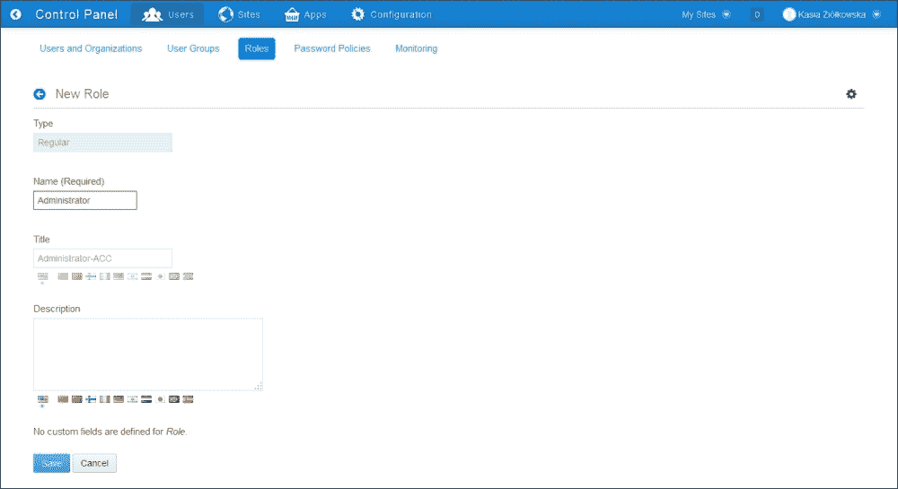
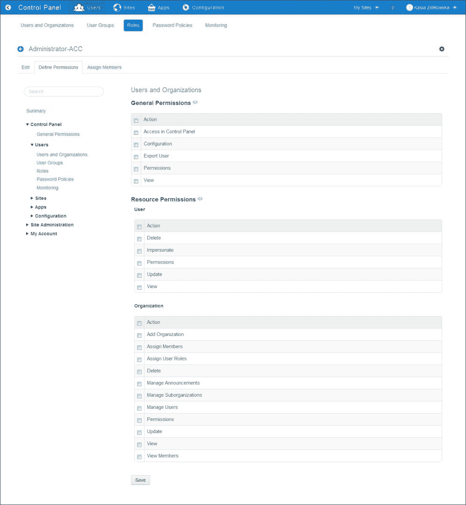
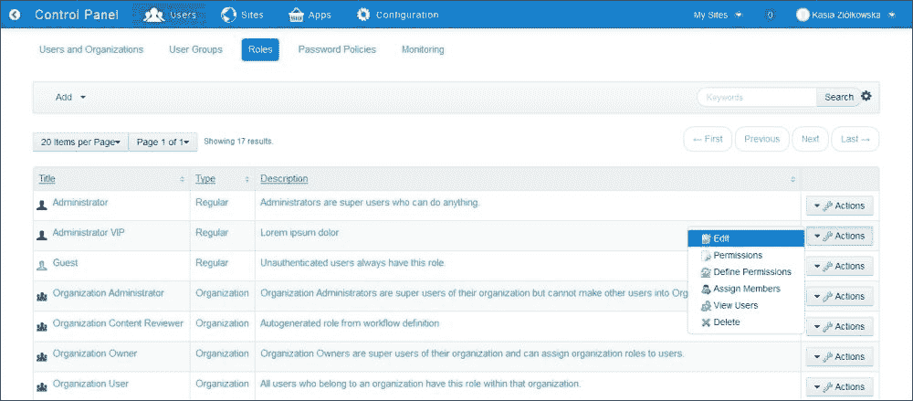
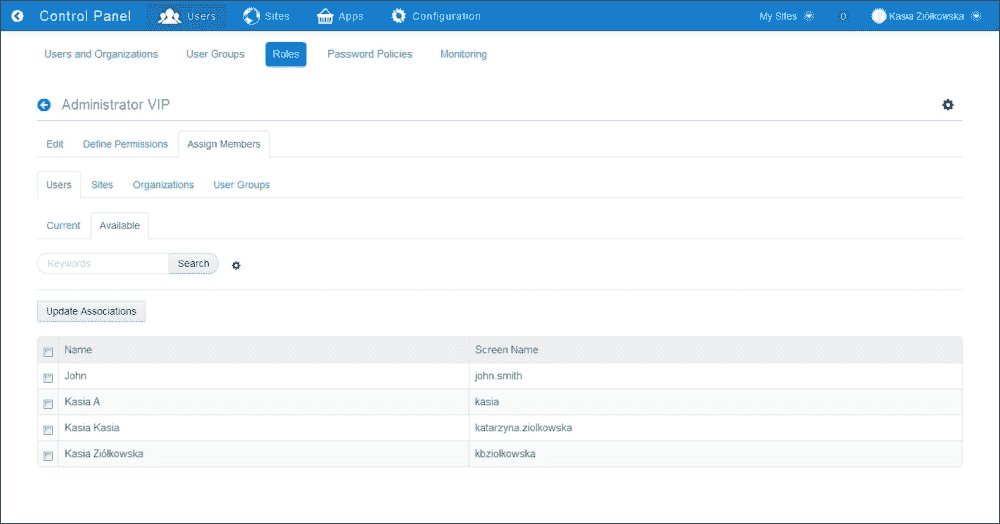
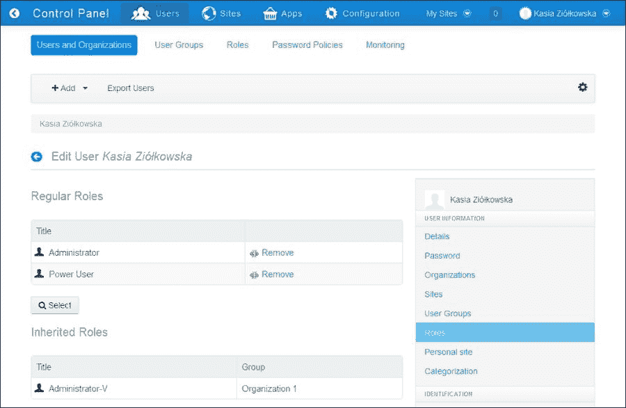

# 第五章。角色和权限

在本章中，我们将涵盖以下主题：

+   创建和配置角色

+   分配用户角色

+   创建基于角色的端口

+   在自定义小部件中检查权限

# 简介

就像现实世界中的公司员工一样，系统中的用户可以执行不同的任务。其中一些人可能负责整个内联网的管理——创建新的组织、位置、用户组和站点；分配用户；以及设置权限。其他人可能负责特定站点及其页面的配置和管理小部件。也可能有一组用户负责创建和发布内容。更重要的是，同一个用户也可能同时是某个站点的管理员，但同时又无法执行除查看另一个站点内容之外的操作。为了能够管理这样一个复杂的权限网络，Liferay 引入了角色功能，允许我们定义在定义的位置哪些用户可以执行哪些操作。

角色是一组用户可以执行的动作集合。在 Liferay 门户级别定义了三种类型的角色可供使用：常规角色、站点角色和组织角色。常规角色定义了可以在其定义中指定的系统区域（范围）中执行的动作列表。使用常规角色允许我们在一个特定的范围内执行操作。站点角色包括在站点内执行的动作。组织角色将可以在组织内执行的动作分组（有关组织和个人站点的更多信息，请参阅第三章，*与 Liferay 用户/用户组/组织一起工作*和第四章，*Liferay 站点配置*）。

# 创建和配置角色

无论我们处理的是哪种类型的角色，创建新角色的过程都包括两个步骤——创建一个新的空角色和为该角色定义一组权限。

## 如何操作…

在本食谱中，我们将向您展示如何创建新的常规站点和组织角色以及如何为它们定义一组权限。

为了创建一个新的常规角色，请执行以下步骤：

1.  前往**管理** | **控制面板** | **角色**。

1.  点击**添加**按钮。

1.  选择**常规角色**、**站点角色**或**组织角色**选项。

1.  为角色提供**名称（必需）**、**标题**和**描述**。

1.  点击**保存**按钮，您将返回包含所有定义角色的列表。

1.  点击新创建的角色旁边的**操作**按钮。

1.  选择**编辑**操作。

1.  点击**定义权限**选项卡。

1.  使用左侧列导航菜单，选择您想要定义权限的类别（例如**网站管理** | **页面** | **网站页面**）。

1.  对于每个选定的类别，勾选您想要添加角色的权限旁边的复选框。

    ### 注意

    如果您已经知道您正在寻找哪些类别，那么您可以使用**搜索**文本字段相应地过滤功能。

    

    ### 注意

    当为**网站管理**组内的类别设置普通角色权限时，您还需要选择此角色将能够执行操作的网站列表。

1.  点击**保存**按钮。

## 它是如何工作的…

在菜谱的第一部分，我们向您展示了如何创建一个新的空角色。在第二部分，我们描述了如何为此新创建的角色定义权限。

### 角色参数

每个角色都有一个名称、标题和描述。描述标识系统中的角色，并包含权限。这些权限定义了分配给此角色的用户可以执行哪些操作。普通角色还有分配给它们的用户列表。

普通角色可能包含对**控制面板**、**网站管理**和**我的账户**功能的权限。组织角色包括**用户和组织**以及**网站管理**权限。网站角色只能定义**网站管理**权限。

### 控制面板、网站管理和我的账户权限

大多数**控制面板**类别权限分为两组：**常规权限**和**资源权限**。例如，当配置**用户和组织**功能的权限时，我们可以定义该组中所有应用程序可以执行哪些操作——它们是否可以查看、在**控制面板**中访问、配置，以及分配给角色的用户是否可以执行用户导出操作或为**用户和组织**功能设置权限等。所有这些都是常规权限。此外，对于**用户和组织**功能，还可以设置**资源权限**。这定义了具有此角色的用户可以对用户和组织执行哪些操作，例如，他们是否可以删除、模拟、更新或查看用户；添加组织；分配成员；使用**用户和组织**部分管理子组织等。

**网站管理**权限，在大多数情况下，也分为**常规权限**和**资源权限**。然而，在定义**网站管理**权限时，我们还可以决定具有此角色的用户可以在哪些网站上执行操作。例如，可以设置允许用户仅管理所选网站页面或添加内容的普通角色。

**我的账户**权限仅与应用程序操作相关。

## 更多内容…

还可以通过 **角色** 动作菜单中的操作来管理角色。

在一个角色上可以执行几个可能的行为：

+   **编辑** 操作允许我们更改角色的 **名称**、**标题** 和 **描述**，定义权限并为角色分配成员。

+   **权限** 操作允许我们为此角色上可以执行的操作设置权限。

+   **定义** 权限操作允许我们为角色定义权限。

+   **分配成员** 操作允许我们为用户分配角色。此操作仅适用于常规角色。

+   **查看用户** 操作打开具有此特定角色的所有用户的列表。此操作仅适用于常规角色。

+   **删除** 操作允许我们删除角色。默认的 Liferay 角色无法删除。

为了执行上述操作之一，请按照以下步骤操作：

1.  前往 **控制面板** | **角色**。

1.  点击想要修改的角色的名称附近的位置的 **操作** 按钮：

1.  点击所选操作的名称。

## 参见

有关组织和站点的更多信息，请参阅以下配方：

+   *管理组织结构* 的配方在 第三章，*与 Liferay 用户/用户组/组织协作*

+   *创建组织和独立站点* 在 第四章，*Liferay 站点配置*

# 分配用户角色

为了定义用户可以执行的操作，您需要为他们分配角色。每个用户可以有多个角色，包括常规、站点和组织角色。分配给用户的每个角色都可在用户账户的角色部分中找到。

## 如何操作...

在本配方中，我们将向您展示如何为常规角色分配成员。

为了为常规角色分配成员，请按照以下步骤操作：

1.  前往 **管理员** | **控制面板** | **角色**。

1.  点击想要分配用户的角色的名称附近的位置的 **操作** 按钮。

1.  点击 **分配成员** 操作，您将看到该角色的当前成员列表。

1.  点击 **可用** 选项卡：

1.  选择 **用户**、**站点**、**组织** 或 **用户组** 选项卡。

1.  标记您想要分配角色的用户、站点、组织或用户组。

1.  点击 **更新关联** 按钮。

## 它是如何工作的...

常规角色可以分配给用户或用户集合，例如 **组织**、**站点** 和 **用户组**。如果角色分配给用户，则该用户将获得为此角色定义的所有权限。您可以通过访问编辑用户表单中的 **角色** | **常规角色** 来查看角色（要进入编辑用户表单，请转到 **用户和组织** | **所有用户** 并点击您想查看账户的用户名称）。如果角色分配给用户集合，则该站点、组织或用户组的每个成员都将继承此角色。您可以通过在编辑用户表单中导航到 **角色** | **继承角色** 来查看此信息。



**控制面板** 中的 **角色** 部分允许我们仅将用户或用户集合分配给 **常规角色**。**组织角色** 可以通过 **组织** 动作菜单中可用的 **分配组织角色** 动作进行分配。**站点角色** 可以在 **站点管理** 的 **站点成员资格** 部分进行分配。重要的是要记住，无法将组织角色和站点角色分配给用户集合。

## 参见

有关分配组织角色和站点角色的更多信息，请参阅以下食谱：

+   *管理组织结构* 在 第三章，*与 Liferay 用户 / 用户组 / 组织一起工作*

+   *创建组织和独立站点* 在 第四章，*Liferay 站点配置*

# 创建基于角色的端口

Liferay 提供了两种检查权限的方法。第一种机制实现了 **Java 端口规范 2.0** （**JSR 286**）并提供了一个 XML 定义来映射 Liferay 角色和端口角色。第二种机制使用 Liferay 权限检查器来验证用户及其执行的操作。在本食谱中，我们将向您展示 Java 端口规范和 Liferay 如何协同工作。

## 准备工作…

使用 Maven 架构生成器生成或创建一个空的端口。我们已在 第一章 中描述了它，*安装和基本配置*。使用哪个 `PortletBridge` 并不重要。我们将决定使用一个简单的名为 `MVCPortlet` 的端口。

假设我们的目标是编写一个问候端口，它可以识别当前用户是否以用户或访客的身份登录。在任何情况下，我们的端口都应该显示问候语，**欢迎访客！** 或 **欢迎用户**。

## 如何操作…

我们的概念基于以下方法：每种问候都将位于不同的 `JSP` 文件中，并且我们的控制器将决定应该使用哪个 `JSP` 文件。请按照以下步骤操作：

1.  打开位于 `src/main/webapp/WEB-INF` 文件夹中的 `portlet.xml`，并向其中添加 `init` 参数：

    ```js
    <init-param>
      <name>view-user-template</name>
      <value>/html/user.jsp</value>
    </init-param>
    <init-param>
      <name>view-guest-template</name>
      <value>/html/guest.jsp</value>
    </init-param>
    ```

1.  创建`src/main/webapp/html`文件夹并添加两个文件，`user.jsp`和`guest.jsp`。在每个文件中定义问候语。在`guest.jsp`文件中添加以下内容：

    ```js
    <h1>Welcome Guest!</h1>
    ```

    在`user.jsp`文件中添加以下行：

    ```js
      <h1>Welcome User!</h1>
    ```

1.  在`portlet.xml`中的`<security-role-ref>`标签中定义角色：

    ```js
    <security-role-ref>
      <role-name>logged-user</role-name>
    </security-role-ref>
    <security-role-ref>
      <role-name>guest-user</role-name>
    </security-role-ref>
    ```

    ### 注意

    我们故意更改了默认的角色名称，以便向您展示之前的角色与 Liferay 中的角色不同。

1.  打开`liferay-portlet.xml`并将端口角色映射到 Liferay 角色如下：

    ```js
    <role-mapper>
      <role-name>guest-user</role-name>
      <role-link>Guest</role-link>
    </role-mapper>
    <role-mapper>
      <role-name>logged-user</role-name>
      <role-link>User</role-link>
    </role-mapper>
    ```

1.  按如下方式定义端口的渲染方法：

    ```js
    public void render(RenderRequest request, RenderResponse response) throws PortletException, IOException {
      String renderPagePath = getInitParameter("view-guest-template");
      if (request.isUserInRole("logged-user")) {
        renderPagePath = getInitParameter("view-user-template");
      }

      include(renderPagePath, request, response);
      super.render(request, response);
    }
    ```

1.  编译并部署端口。

1.  将我们的端口放在欢迎页面上并测试它。我们的问候语应取决于用户是否已认证。

## 它是如何工作的…

端口规范 JSR-286 定义了`PortletRequest`接口的一组方法。这些方法允许我们检查用户的主体名称或角色：

+   `getUserPrincipal`

+   `getRemoteUser`

+   `isUserInRole`

`getUserPrincipal`方法返回当前认证用户的主体名称，并返回`java.security.Principal`对象。同样，`getRemoteUser`返回已登录用户的名称。实际上，这两个方法在 Liferay 实现中返回相同的值，即`userId`。如果用户未认证，这两个方法都返回 null。第三个方法期望一个字符串参数，该参数是`portlet.xml`中定义的角色名称。它检查当前用户角色并返回一个`boolean`值。

JSR-286 规范确定每个`security-role-ref`定义都应该映射到端口容器实现内部系统角色。这种映射可以在`web.xml`中以`role-name`和`role-link`标签对的形式指定。以下是一个示例：

```js
<role-mapper>
  <role-name>logged-user</role-name>
  <role-link>User</role-link>
</role-mapper>
```

Liferay 在`liferay-portlet.xml`中指定了这些映射。

然而，这种方法有一个限制。JSR-286 文档包含以下句子：

> *"开发者必须意识到使用此默认机制可能会限制在无需重新编译调用端口的端口的情况下更改应用程序中角色名称的灵活性。"*

## 参见

如果您想了解如何创建新的端口或钩子，请参考以下食谱：

+   *在第一章中创建自定义端口*，*安装和基本配置*

+   *在第十一章中的语言属性钩子*，*快速技巧和高级知识*

+   *在第十一章中*使用 Liferay 服务总线进行端口之间的通信，*快速技巧和高级知识*

# 在自定义端口中检查权限

Liferay 的权限非常灵活，但理解起来非常复杂。在这个菜谱中，我们将向您展示权限的基本用法，但我们希望这个教程将是实现更复杂权限的起点。让我们假设我们的目标是扩展之前的端口，只为具有特定权限的用户显示秘密消息。这个权限应该在端口权限中可配置。

## 准备工作...

我们假设您已经有一个由 Maven 原型生成的可用的 Maven 端口。在第一章中，*安装和基本配置*，我们描述了如何实现这一点。

## 如何做到这一点...

为了实现我们的目标，我们必须定义并添加一个特定的权限到我们之前的端口。接下来，我们应该注册我们的权限列表。最后，我们将使用这些权限在我们的端口中显示秘密区域。执行以下步骤：

1.  创建`src/main/resources/resource-actions`文件夹。

1.  在`resource-actions`文件夹中创建一个名为`roles.xml`的文件，内容如下：

    ```js
    <?xml version="1.0"?>
    <!DOCTYPE resource-action-mapping PUBLIC "-//Liferay//DTD Resource Action Mapping 6.2.0//EN" "http://www.liferay.com/dtd/liferay-resource-action-mapping_6_2_0.dtd">

    <resource-action-mapping>
      <portlet-resource>
        <portlet-name>roles-portlet</portlet-name>
        <permissions>
          <supports>
            <action-key>ADD_SECTION</action-key>
            <action-key>CONFIGURATION</action-key>
            <action-key>VIEW</action-key>
            <action-key>ACCESS_IN_CONTROL_PANEL</action-key>
          </supports>
          <site-member-defaults>
            <action-key>VIEW</action-key>
          </site-member-defaults>
          <guest-defaults>
            <action-key>VIEW</action-key>
          </guest-defaults>
          <guest-unsupported>
            <action-key>ACCESS_IN_CONTROL_PANEL</action-key>
            <action-key>CONFIGURATION</action-key>
          </guest-unsupported>
        </permissions>
      </portlet-resource>
    </resource-action-mapping>
    ```

1.  在`resource-actions`文件夹中创建名为`default.xml`的文件，内容如下：

    ```js
    <?xml version="1.0"?>
    <!DOCTYPE resource-action-mapping PUBLIC "-//Liferay//DTD Resource Action Mapping 6.2.0//EN" "http://www.liferay.com/dtd/liferay-resource-action-mapping_6_2_0.dtd">

    <resource-action-mapping>
      <resource file="resource-actions/roles.xml" />
    </resource-action-mapping>
    ```

1.  在`src/main/resources`文件夹中创建名为`portlet.properties`的文件（如果尚不存在），并设置以下属性：

    ```js
    resource.actions.configs=resource-actions/default.xml
    ```

1.  编辑`liferay-portlet.xml`并在`<portlet>`部分添加以下标签：

    ```js
    <add-default-resource>true</add-default-resource>
    ```

1.  编译并部署端口。

1.  将端口放置在布局中，然后转到**选项** | **配置菜单**。

1.  为**Power User**设置`action.ADD_SECTION`权限。

1.  返回到 Eclipse IDE。在端口渲染方法中，添加以下代码：

    ```js
    ThemeDisplay themeDisplay = (ThemeDisplay) request.getAttribute(WebKeys.THEME_DISPLAY);
    boolean secretSection = true;
    try {
      PermissionChecker permissionChecker = themeDisplay.getPermissionChecker();
      String portletId = themeDisplay.getPortletDisplay().getId();
      PortletPermissionUtil.check(permissionChecker, portletId, "ADD_SECTION");
    } catch (PrincipalException pe) {
      secretSection = false;
    } catch (SystemException | PortalException e) {}
    request.setAttribute("secretSection", secretSection);
    ```

    ### 小贴士

    在我们的例子中，渲染方法位于`com.packtpub.portlet.RolesPortlet`类中。

1.  在`src/main/webapp/html`文件夹中创建名为`secret.jspf`的文件，内容如下：

    ```js
    <c:if test="${requestScope.secretSection}">
      <h2>Secret section</h2>
    </c:if>
    ```

1.  将此文件包含在`guest.jsp`和`user.jsp`中：

    ```js
    <%@ include file="/html/secret.jspf" %>
    ```

1.  编译、部署并运行您的端口。

    ### 注意

    您还必须在 JSP 文件和`liferay-plugin-package.properties`文件中定义`c.tld`。本书中包含一个可用的端口。

## 它是如何工作的...

通常，Liferay 将权限分为`portlet-resources`和`model-resources`。端口资源与端口及其本身可能进行的操作（例如，查看、配置）相关联。模型资源描述了特定模型上的可能权限（例如，创建、更新和删除）。在这个例子中，我们只展示了`portlet-resources`定义，但`model-resources`类似。

端口资源和模型资源应在 XML 文件中定义，并放在类路径中。在这个菜谱中，我们创建了两个文件：`default.xml` 和 `roles.xml`。这是 Liferay 在核心实现中应用的典型表示法。第一个文件列出了所有定义了权限的资源。第二个文件定义了实际的权限。可能只有一个文件包含 `roles.xml` 的内容。典型的资源动作映射包括：

+   端口名称，其定义应该与 `portlet.xml` 文件中的定义相同

+   `portlet-resource` 部分，它指定了我们端口中支持的权限、特定角色的默认权限以及特定角色的不支持权限

+   `model-resource` 部分，在这个菜谱中没有使用

一个非常有用的选项是 `<add-default-resource>true</add-default-resource>`，我们在 `liferay-portlet.xml` 中添加了它。Liferay DTD 定义解释了这个标签如下：

> *"如果将 add-default-resource 的值设置为 false，并且端口不属于页面但已被动态添加，则用户将没有权限查看端口。如果将 add-default-resource 的值设置为 true，则默认端口资源和权限将被添加到页面，然后用户可以查看端口。这对于需要动态添加到页面的端口来说是有用（且必要）的。然而，为了防止安全漏洞，默认值是 false。"*

最后一件事情是检查权限。Liferay 给我们提供了一个名为 `PermissionChecker` 的类，它在每个端口中都是启用的。`ThemeDisplay` 聚合了这个实现。为了检查权限，Liferay 提供了一个实现 `PermissionChecker` 接口的方法：

```js
permissionChecker.hasPermission(groupId, name, primKey, actionId);
```

此方法参数如下：

+   `groupId`：这是包含资源的组的主键

+   `name`：这是资源的名称，可以是类名或端口 ID

+   `primKey`：这是资源的主键

+   `actionId`：这是动作 ID

可以直接使用这种检查方式，或者从 `PortletPermissionUtil` 中调用权限检查器。第二种方式由 Liferay 推荐使用。这个实用工具类至少有九个名为 `check` 的静态方法，根据具体情况，参数有很多变体。`check` 方法不返回任何值。如果没有权限，该方法会抛出 `PrincipalException` 异常。

第二个静态方法是 `contain`，如果特定权限被启用则返回 `true`，如果权限被禁用则返回 `false`。

实际上，这个菜谱只涉及了 Liferay 中权限的基本知识。在互联网上，有很多关于如何使用 Liferay 权限以及如何实现新功能的教程。如果我们使用基于 Liferay 模型的 *服务构建器* 机制，实现正确的权限相当简单。Liferay 默认添加了很多功能。

## 参见

如果你想学习如何创建新的端口或钩子，请参考以下食谱：

+   在第一章的*创建自定义端口*，*安装和基本配置*

+   在第十一章的*语言属性钩子*和*使用 Liferay 服务总线进行端口间的通信*，*快速技巧和高级知识*
