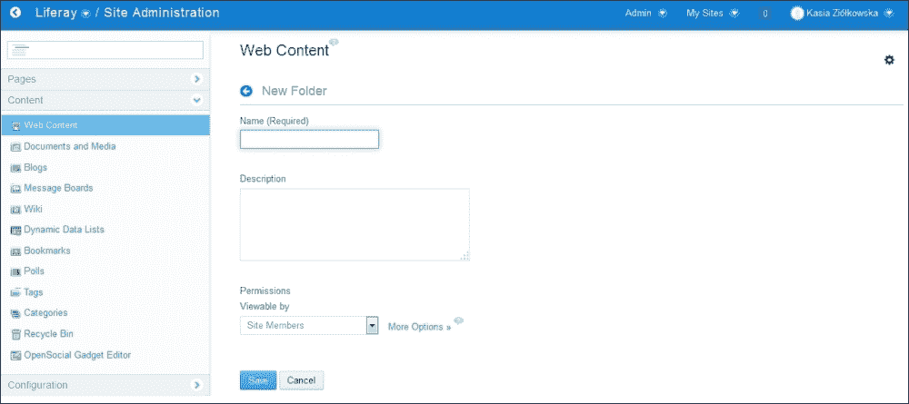
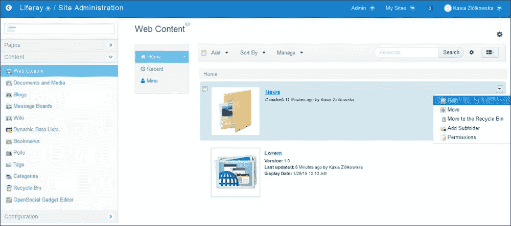
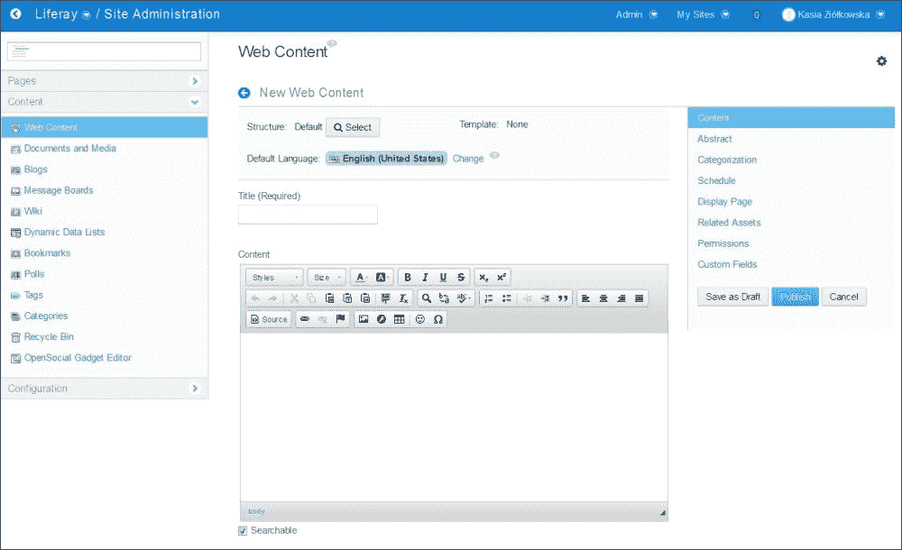
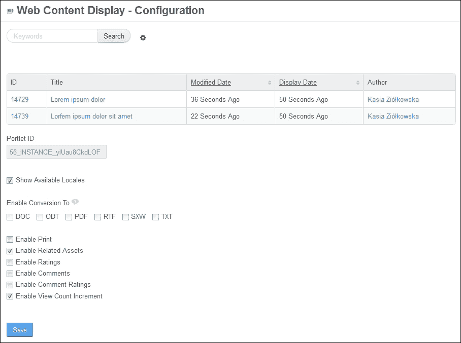
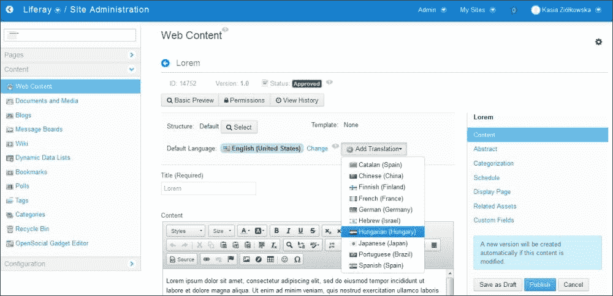
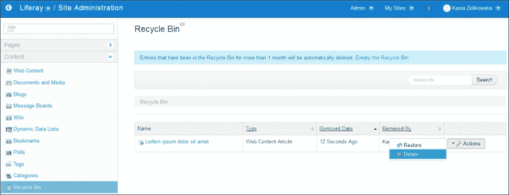
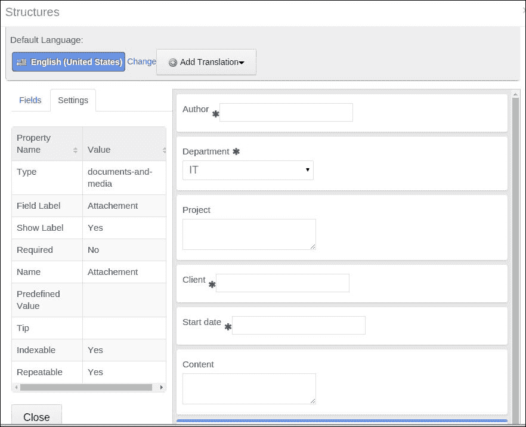
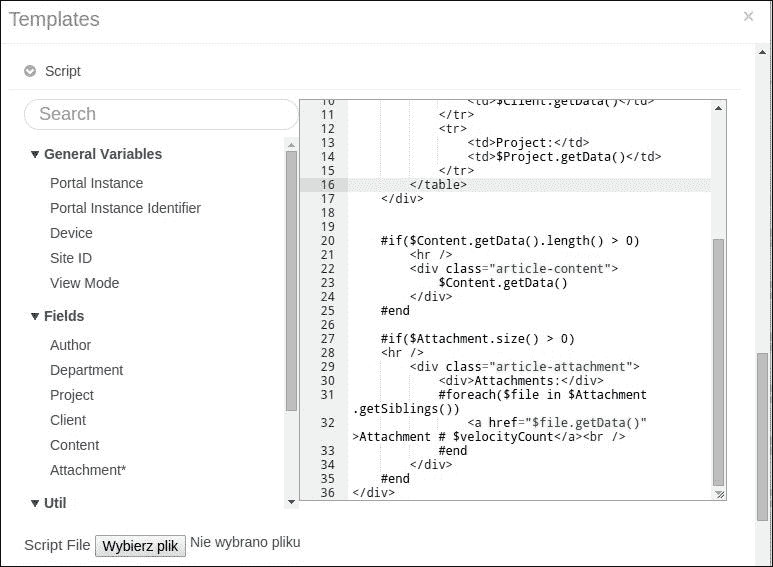

# 第七章. 与内容协作

在本章中，我们将涵盖以下主题：

+   管理和显示网页内容

+   创建新结构

+   创建新模板

# 简介

如前一章所述，Liferay 提供了一套完整的工具，使我们能够管理存储公司员工之间交换数据的文件。然而，在许多情况下，对于最终用户来说，在文件中操作存储的信息并不太方便。例如，在阅读新闻或浏览企业知识库时，在网页上直接导航内容比在文件中更容易。新闻、项目描述、程序等信息可以使用网页内容提供。可以使用一些特定的端口，如网页内容显示端口或资产发布端口，在页面上显示网页内容。

# 管理和显示网页内容

Liferay 中的每个站点都有自己的独立网页内容集，可以通过访问**管理** | **站点管理** | **内容** | **网页内容**来访问。所有存储在**网页内容**部分的内容都可以组织成树状文件夹结构。网页内容可以包含文本、图形、表格、列表以及指向其他网页内容、文档或页面的链接。此外，每个网页内容都可以被标记和分类，或者提供与其相关的资产列表。此列表将在网页内容的主要内容下的相关资产部分列出。还可以定义权限，指定不同角色的用户可以对网页内容执行哪些操作。

## 如何操作…

本菜谱将涵盖所有基本操作，以便在站点内管理网页内容。

### 创建新文件夹

要添加一个新文件夹，请执行以下步骤：

1.  以管理员身份登录并转到**管理 | 站点管理 | 内容 | 网页内容**。

1.  点击**添加**按钮。

1.  选择**文件夹**选项（如果您在已创建的文件夹内添加文件夹，则将可用**子文件夹**选项）。

1.  输入文件夹的**名称（必填**）。

1.  输入文件夹的**描述**。

1.  通过设置特定角色可能执行的所有操作来确定文件夹的**权限**（您可以在点击**更多选项**链接后找到更多权限）。

1.  点击**保存**按钮。

    ### 小贴士

    **下载示例代码**

    您可以从您在[`www.packtpub.com`](http://www.packtpub.com)的账户下载示例代码文件，以获取您购买的所有 Packt Publishing 书籍。如果您在其他地方购买了这本书，您可以访问[`www.packtpub.com/support`](http://www.packtpub.com/support)并注册，以便将文件直接通过电子邮件发送给您。

### 编辑文件夹

要编辑一个文件夹，请按照以下步骤操作：

1.  以管理员身份登录并转到**管理** | **站点管理** | **内容** | **网页内容**。

1.  找到你想要编辑的文件夹。

1.  点击其操作图标（当悬停在文件夹缩略图上时可见的向下箭头图标）。

1.  点击**编辑**按钮。

1.  为文件夹提供新的**名称（必填）**。

1.  输入文件夹的新**描述**。

1.  通过设置特定角色可能执行的所有操作来确定文件夹的新**权限**。

1.  保持**与父文件夹合并**选项未选中。

1.  点击**保存**按钮。

### 创建新的网页内容

要创建新的基本网页内容，请执行以下操作：

1.  以管理员身份登录并转到**管理** | **站点管理** | **内容** | **网页内容**。

1.  点击**添加**按钮。

1.  选择**基本网页内容**选项。

1.  提供必要的**标题（必填）**和**内容**。

1.  转到**摘要**标签页。

1.  提供一个**摘要**。

1.  通过提供 URL 或从你的电脑驱动器上传它来设置小图像。然后，选择**使用小图像**选项。

1.  转到**分类**标签页。

1.  从类型下拉列表中选择**类型**，例如，**新闻**。

1.  通过点击字典旁边的按钮并标记分类来从可用的分类字典（由名称和相关**选择**按钮表示）中选择**分类**。

    ### 小贴士

    如果没有可见的分类可以分配给文档，这意味着要么特定站点的分类尚未创建，要么正在工作的账户用户没有访问现有分类字典的权限。

1.  通过添加新标签来提供**标签**。你可以从现有标签列表中选择它们或使用建议功能。

1.  转到**计划**标签页。

1.  设置**显示日期**、**审核日期**和**过期日期**功能（或启用**永不过期**和**永不审核**功能）。

1.  转到**显示页面**标签页。

1.  选择你想要完整显示网页内容的页面。

    ### 注意

    如果至少有一个包含启用**将此页面设置为默认资产发布者**选项的资产发布器小部件的页面，则显示页面将可用。没有资产发布器小部件的页面名称以灰色显示而不是黑色。有关更多信息，请参阅第八章中关于*资产发布器作为基于搜索的内容展示工具*的配方，*搜索和内容展示工具*。

1.  转到**相关资产**标签页。

1.  选择**相关资产**，它应该列在你的网页内容的全文下方。

1.  点击**发布**按钮。

    ### 小贴士

    在发布之前，可以使用基本预览选项预览网页内容。此选项在保存网页内容的第一稿后可用。然而，基本预览功能不允许我们在主题上下文中预览网页内容。相反，它以默认视图呈现。

### 在网页内容显示组件中显示网页内容

为了在网页内容显示组件中显示网页内容，请执行以下步骤：

1.  前往您想要显示网页内容的页面。

1.  点击添加图标（这是左侧的**+**号）。

1.  点击**应用程序**标签。

1.  使用搜索功能或浏览可用组件列表来查找**网页内容显示**组件。

1.  点击它旁边的**添加**链接或将其拖放到您想要的页面上。在网页内容显示组件中显示网页内容

1.  点击添加的组件选项图标（这将在组件右上角显示为一个齿轮图标）。

1.  选择**配置**选项。

1.  从列表中选择您想要在组件中显示的网页内容（通过点击其名称）。

1.  选择应在组件中可用的附加功能列表（例如，**启用打印**或**启用评论**选项）。

1.  点击**保存**按钮。

### 编辑网页内容

为了修改现有网页内容，请按照以下步骤操作：

1.  以管理员身份登录并转到**管理** | **站点管理** | **内容** | **网页内容**。

1.  从可用网页内容列表中选择您想要修改的网页内容。

1.  点击所选网页内容的名称，或从其**操作**菜单中选择**编辑**操作。编辑网页内容

1.  当表单打开时，编辑您想要更改的字段。

1.  点击**发布**按钮。

### 向现有网页内容添加翻译

要向现有网页内容添加翻译，请执行以下步骤：

1.  以管理员身份登录并转到**管理** | **站点管理** | **内容** | **网页内容**。

1.  从可用网页内容列表中选择您想要定义翻译的网页内容。

1.  点击所选网页内容的名称或从其操作菜单中选择**编辑**操作。

1.  点击**添加翻译**按钮。

1.  选择您想要为其创建翻译的语言（如果您愿意，可以通过参考第十一章中的*语言属性钩子*配方，*快速技巧和高级知识*来更改可用语言）。

1.  为此语言提供**标题**、**内容**和**摘要**。

1.  点击**保存**按钮。

    ### 注意

    所有可用的翻译都列在编辑内容页面中**添加翻译**按钮之后放置的可用翻译部分。您可以通过在此部分点击翻译名称后访问的表单来管理（包括删除）翻译。

1.  点击**发布**按钮。

### 过期网页内容

有两种使网页内容过期的方法。第一种方法，如前所述，是在添加或编辑网页内容时设置过期日期。第二种选项是使用**网页内容**操作菜单中可用的过期操作。按照以下步骤执行此过期网页内容的选项：

1.  以管理员身份登录并转到**管理** | **站点管理** | **内容** | **网页内容**。

1.  从可用的网页内容列表中选择您想要修改的内容。

1.  点击所选网页内容的**操作**菜单。

    ### 小贴士

    选择**过期**操作。为了使过期的网页内容对用户可用，您需要再次编辑和发布它。

### 删除文件夹和网页内容

每个文件夹和网页内容都可以临时或永久删除。临时和永久删除都通过**回收站**机制完成。

要临时删除文件夹或网页内容，请按照以下步骤操作：

1.  前往需要删除的文件夹或网页内容。

1.  点击其操作图标。

1.  点击**移动到回收站**操作。

    ### 注意

    您可以通过点击将网页内容移动到回收站后出现的**撤销**按钮来撤销此操作。

要永久删除文件夹或网页内容，请按照以下步骤操作：

1.  以管理员身份登录并转到**管理** | **站点管理** | **内容** | **回收站**。

1.  点击位于您要删除的网页内容或文件夹名称附近的**操作**按钮：

1.  点击**删除**操作，并通过点击**确定**来确认您的选择。

    ### 注意

    注意，当您删除文件夹时，其全部内容也会被删除。默认情况下，回收站已启用，并保留删除的项目 30 天。可以通过转到**管理** | **站点管理** | **配置** | **站点设置** | **回收站**来更改特定站点的回收站可用性和回收站条目的最大年龄。

您还可以使用**操作**菜单中可用的**恢复**操作来恢复网页内容或网页内容文件夹。

## 它是如何工作的...

**网页内容**部分允许我们创建树状文件夹结构来组织存储在站点内的网页内容。可以创建或移动网页内容到默认文件夹（“首页”）或用户定义的文件夹之一。还可以将一个文件夹（及其内容）与另一个文件夹合并。在创建或编辑网页内容时，用户可以选择将其保存为草稿或发布。只有授权用户可以通过访问**管理** | **站点管理** | **内容** | **网页内容**来访问网页内容的草稿版本。已发布的版本可供最终用户查看。每次发布网页内容时，其版本号都会增加。所有版本都可在网页内容历史记录中查看，这可以通过网页内容编辑表单访问。

如果需要隐藏之前发布的网页内容以供最终用户查看，但保留在系统中，应使用过期操作。如前所述，可以安排网页内容的发布和过期时间。

每个网页内容都有一个唯一的 ID、标题、状态和版本号。有三种可用的状态：

+   **已批准**: 这是为了已发布的网页内容，可以放置在页面上的端口中，并对最终用户可用

+   **草稿**: 这些是为尚未发布的最新版本内容保留的网页内容

+   **过期**: 这标记了所有已过期的网页内容，对最终用户不可用

### 权限

每个文件夹和网页内容都有自己的权限设置，这定义了分配给不同角色的用户可以对其执行的操作列表。例如，可以设置这样的权限，使得具有特定角色的用户可以对某个特定的网页内容提供评论，但不会允许他们对其他网页内容执行相同的操作。

#### 分类

在网页内容添加和编辑表单中的**分类**选项卡允许我们定义网页内容的类型、类别和标签。类别和标签提供了一种额外的机制来标记、列出和搜索网页内容，并允许通过专门的端口（如分类导航、资产发布者或标签云）进行后续选择。类别可以创建树状结构。每个类别都位于字典中，可以具有子类别。标签则相反，不存储在字典中，创建平面结构。可以将网页内容分配给一个或多个类别和标签。类型用于在**网页内容**部分内搜索网页内容。

#### 相关资产

在 Liferay 中，资产是指可以显示在页面上的内容片段，例如文档、网页内容、博客条目等。每个网页内容都可以连接到另一个网页内容、文档或不同类型的资产，例如评论、博客条目等。这些网页内容将由资产发布者等端口列出。

#### 在页面上放置网页内容

如前所述，Web 内容部分允许我们以文件夹结构组织 Web 内容，帮助我们管理网站内的 Web 内容。然而，这种结构对网站的信息架构没有任何影响。为了将 Web 内容放置在页面上，您需要使用专用的小部件，例如 Web 内容显示或资产发布器小部件。Web 内容显示小部件允许我们一次显示一个 Web 内容的全部内容。资产发布器小部件（在第以下章节中描述）要复杂得多，并允许我们创建不同的内容列表。它还允许我们以全文视图显示 Web 内容。

#### 显示页面

显示页面参数允许我们决定在资产发布器小部件中哪个页面将以全文视图显示特定的 Web 内容。

## 参见

+   关于如何在页面上展示 Web 内容的更多信息，请参阅第八章的“标记和分类内容”和“资产发布器作为基于搜索的内容展示工具”食谱，*搜索和内容展示工具*

+   关于权限的更多信息，请参阅以下食谱：

    +   *创建和配置角色* 来自 第五章，*角色和权限*

    +   *Kaleo Web 安装* 和 *用户创建过程的单一审批者工作流* 来自 第九章，*Liferay 工作流能力*

+   关于 Web 内容的更多信息，请参阅本章的“创建新结构”和“创建新模板”食谱。

# 创建新结构

Liferay 为用户提供有趣的功能：结构和模板。结构提供有关我们内容中可能字段的详细信息，而模板负责将这些字段作为前端（例如，在资产发布器或 Web 内容显示小部件）中的文章进行渲染。

假设我们的目标是定义一个名为 *内部发布* 的新结构和模板。此结构包含以下字段：

| 名称 | 类型 | 必需 | 可重复 |
| --- | --- | --- | --- |
| 作者 | 文本 | 是 | 否 |
| 部门 | 选择 | 是 | 否 |
| 项目 | 文本框 | 否 | 否 |
| 客户 | 文本 | 是 | 否 |
| 内容 | HTML | 否 | 否 |
| 附件 | 文档和媒体 | 否 | 是 |

## 如何操作...

为了定义一个新的结构，您需要在**Web 内容**部分的**添加结构**权限的用户身份登录。为了实现这一目标，请按照以下步骤操作：

1.  以管理员身份登录。

1.  前往**管理** | **站点管理** | **内容** | **Web 内容**。

1.  点击**管理**选项并选择**结构**。

1.  点击**添加**按钮。

1.  输入结构的名称，该名称为`内部发布`。

1.  可以选择默认语言并添加一些描述。我们将保持默认设置。

1.  前往具有拖放功能以定义字段的区域。

1.  选择**文本**字段，并将其拖放到灰色区域。

1.  点击添加的元素，转到**设置**选项卡，并设置以下属性：

    +   **字段**标签作为**作者**

    +   **必填**作为**是**

    +   **可索引**作为**可索引 - 关键字**

    +   **不可重复**作为**否**

1.  点击**关闭**按钮以保存信息并返回到**字段**选项卡。

1.  重复步骤 8 和 9 以定义所有必要的字段，这些字段已在我们的假设中描述。结果应如下所示：

1.  点击**保存**按钮。

1.  要查看新创建的结构，请转到**网页内容** | **添加** | **内部发布**。

## 它是如何工作的…

结构是网页内容表单的 XML 定义。它为用户提供以下十三种预定义类型：

+   **布尔值**：在结构中添加一个带有真/假值的复选框

+   **日期**：添加一个带有日历（日期选择器）的输入文本

+   **小数**：添加一个只接受数字和小数点的输入

+   **文档和媒体**：将现有上传的文档附加到结构

+   **HTML**：添加一个所见即所得编辑器

+   **图像**：添加一个浏览图像应用程序

+   **整数**：添加一个只接受数字的输入

+   **链接到页面**：添加一个选择列表以选择链接到另一个页面

+   **数字**：类似于整数，只允许数字

+   **单选按钮**：添加单选按钮

+   **选择**：添加一个带有选项的选择列表

+   **文本**：添加一个输入文本

+   **文本框**：添加一个文本区域组件

在后台，每个定义都存储为一个名为 `<dynamic-element>` 的 XML 节点。可以通过点击结构编辑模式中的**源**选项卡来查看定义是如何构建的。以下是我们 `Author` 定义的示例：

```js
<dynamic-element dataType="string" indexType="keyword" name="Author" readOnly="false" repeatable="false" required="true" showLabel="true" type="text" width="small">
  <meta-data locale="en_US">
    <entry name="label">
      <![CDATA[Author]]>
    </entry>
    <entry name="predefinedValue">
      <![CDATA[]]>
    </entry>
    <entry name="tip">
      <![CDATA[]]>
    </entry>
  </meta-data>
</dynamic-element>
```

这个定义描述了我们设置的所有字段，例如 `dataType: string`、`indexType: keyword`、`name: Author` 等等。

每一行都有许多属性，例如 `predefinedValue`、`tip`、`required` 等。以下表格显示了最重要的属性：

| 属性名称 | 值 | 描述 |
| --- | --- | --- |
| 类型 | 预定义字段类型 | 字段定义的类型 |
| 字段标签 | 字符串 | 字段的标签 |
| 显示标签 | 是/否 | 决定标签的可见性 |
| 必填 | 是/否 | 将字段设置为必填字段 |
| 名称 | 字符串 | 字段的名称，通常与标签相同 |
| 预定义值 | 字符串 | 设置默认值 |
| 提示 | 字符串 | 字段的提示（描述） |
| 可索引 | 不可索引 / 可索引—关键字 / 可索引—文本 | 定义索引器类型并指示将使用哪种类型的搜索索引器 |
| 可重复 | 是/否 | 允许我们将字段设置为可重复字段 |
| 宽度 | 小/中/大 | 允许我们定义字段的宽度 |

## 还有更多…

期刊结构提供了设置从该结构创建的文章默认值的有趣功能。其中一种可能性是在编辑结构屏幕上设置预定义值。然而，Liferay 也提供了一个名为 **编辑默认值** 的选项。当我们的需求是每个从这个结构生成的文章都应该有一个预定义的特定类别、标签、显示页面等时，这个设置非常有意思。在后台，这是一篇在数据库中有特定设置的文章，以防止它被资产发布者、网页内容显示或甚至搜索选中或找到。

要设置默认值，请遵循以下步骤：

1.  以管理员身份登录。

1.  前往 **管理** | **站点管理** | **内容**。

1.  点击 **管理** 选项并选择 **结构**。

1.  在所选结构中，例如 **内部发布**，转到 **操作** | **编辑默认值**。

1.  填写默认值并点击 **保存** 按钮。

# 创建新模板

此配方需要基本的编程技能。一般来说，模板是一个从具有特定结构的文章中渲染值的模式。根据这一事实，模板相对于结构，因此结构和模板是一对定义，不能单独存在。结构定义了表单的外观；模板确定期刊文章的渲染和排列方式。

## 准备工作…

准备一个名为 **内部发布** 的结构。要了解如何实现，请参考之前的配方。

假设我们的模板分为四个部分：

+   包含 *作者* 和 *部门* 的元数据定义

+   带有 *客户端* 和 *项目* 信息的度量定义

+   带有 *内容* 的描述部分

+   *附件* 部分

## 如何操作…

Liferay 为用户提供了三种语言来编写模板：Velocity (.vm)，FreeMarker (.ftl) 和可扩展样式表语言 (.xsl)。无论语言定义如何，创建新模板的过程都遵循相同的规则。为了创建一个新模板，请按照以下步骤操作：

1.  以管理员身份登录。

1.  前往 **管理** | **站点管理** | **内容** | **网页内容**。

1.  点击 **管理** 选项并选择 **模板**。

1.  点击 **添加** 按钮。

1.  使用以下值填写表格：

    +   **名称**: 输入 `内部发布`

    +   **结构**: 选择 **内部发布**

    +   **语言**: 选择 **Velocity (.vm**)

1.  编写一个脚本，将我们的假设渲染如下：

    ```js
      <div class="article-container">
        <div class="article-metadata">
          <span>Create Date: $dateTool.format( 'medium_date', $dateTool.toDate( "EEE, dd MMM yyyy hh:mm:ss Z" , $reserved-article-display-date.getData(), $localeUtil.getDefault()) , $locale), Author: $Author.getData(), Department: $Department.getData()</span>
        </div>
        <hr />
        <div class="article-metric">
          <table>
            <tr>
              <td>Client:</td>
              <td>$Client.getData()</td>
            </tr>
            <tr>
              <td>Project:</td>
              <td>$Project.getData()</td>
            </tr>
          </table>
        </div>

      #if($Content.getData().length() > 0)
        <hr />
          <div class="article-content">  
            $Content.getData()
          </div>
        #end

        #if($Attachment.size() > 0) 
        <hr />
          <div class="article-attachment">
            <div>Attachments:</div>
            #foreach($file in $Attachment.getSiblings())
            <a href="$file.getData()">Attachment # $velocityCount</a><br />
            #end
            </div>
          #end
          </div>
    ```

1.  点击 **保存** 按钮。

## 它是如何工作的…

正如我们一开始提到的，Liferay 为用户提供了三种（语言）编写文章模板的方式：Velocity (.vm)、FreeMarker (.ftl) 和可扩展样式表语言 (.xls)。在这个菜谱中，我们选择了 Velocity 宏，这允许我们将逻辑（宏）与 HTML 和 CSS 混合。如果我们打开一个编辑器，我们可以看到左侧有一个菜单，包括**通用变量**、**字段**和**工具**，如下面的截图所示：



### 变量

**通用变量**部分包含可以在脚本中使用的变量。实际上，这些定义很少使用，并且仅在复杂的 VM 或 FTL 脚本中使用。以下变量可用：

| 名称 | 变量 | Liferay 类 | 描述 |
| --- | --- | --- | --- |
| 门户实例 | `$company` | 公司 | 代表当前门户实例的对象 |
| 门户实例标识符 | `$companyId` | Long | 当前门户实例的标识符 |
| 设备 | `$device` | 设备 | 代表当前用于访问站点的设备的对象 |
| 站点 ID | `$groupId` | Long | 当前站点的标识符 |
| 视图模式 | `$viewMode` | String | 内容期望的视图模式；打印模式下的值将是 `print` |

### 字段

这些对象可以在我们的脚本中使用。例如，`$Content.getData()` 调用会从结构的 `Content` 字段打印一个值。正如前面的代码所示，我们使用了此调用以下字段：

```js
$Author.getData() 
$Department.getData()
$Client.getData()
$Project.getData()
$Content.getData()
$file.getData()
```

下一个有用的调用是 `$Attachment.getSiblings()`。当我们的字段是可重复的并且包含多个值时，使用此方法。在我们的例子中，`Attachment` 字段有两个兄弟。

要遍历兄弟节点，我们使用了 `foreach` 宏，这与 Java 语言中著名的 `foreach` 构造非常相似。

考虑到前面的代码，字段还有其他方法，例如以下这些：

+   `$field.getName()`: 这将打印字段的名称

+   `$field.getType()`: 这将返回字段类型，该类型在结构中定义

+   `$field.getChildren()`: 当字段有嵌套字段时使用

### 工具

在脚本中可用的最强大的工具是 utils。实际上，这里有一些基于 Java 的真实类，提供了广泛的功能。在我们的例子中，我们使用了一个来打印文章的显示日期：

```js
$dateTool.format( 'medium_date', $dateTool.toDate( "EEE, dd MMM yyyy hh:mm:ss Z" , $reserved-article-display-date.getData(), $localeUtil.getDefault())

```

可用服务的完整列表放在以下 Java 类中：

+   `com.liferay.portal.template.TemplateContextHelper`

+   `com.liferay.portal.velocity.VelocityTemplateContextHelper`（用于 Velocity）

+   `com.liferay.portal.freemarker.FreeMarkerTemplateContextHelper`（用于 FreeMarker）

### 保留变量

上述代码有一个特殊的调用：`$reserved-article-display-date.getData()`。这是一个全局可用的保留变量，在每一个模板中都可以访问。在我们的例子中，它显示文章的`display date`。Liferay 提供了许多保留变量，例如`reserved-article-title`、`reserved-article-type`、`reserved-article-version`等等。

这些变量的完整列表定义在`com.liferay.portlet.journal.model.JournalStructureConstants`类中。
