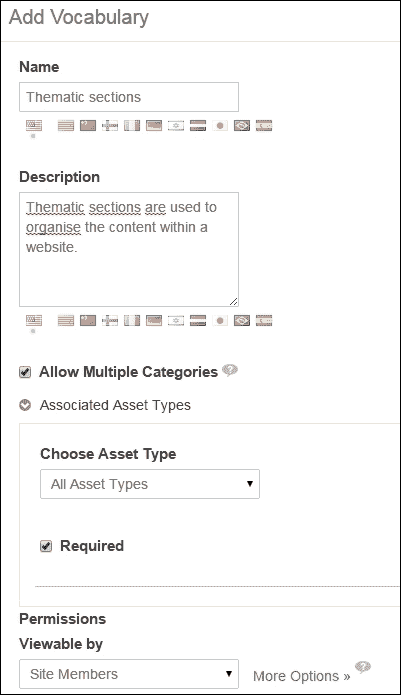
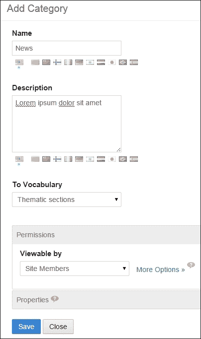
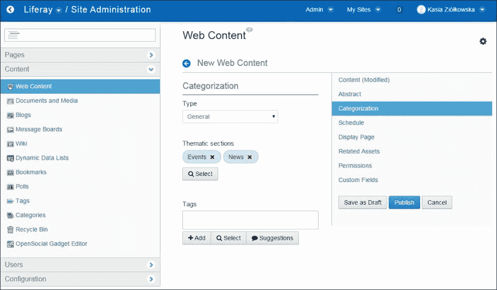
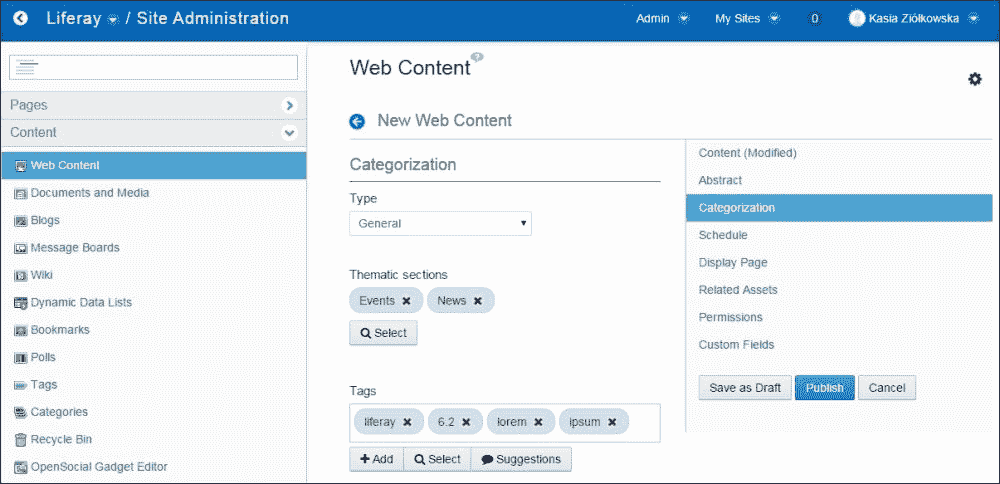
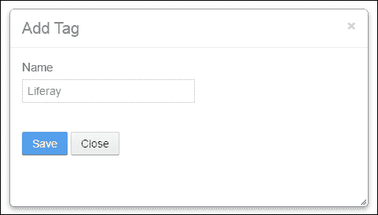
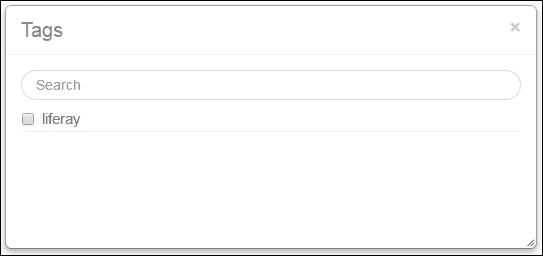
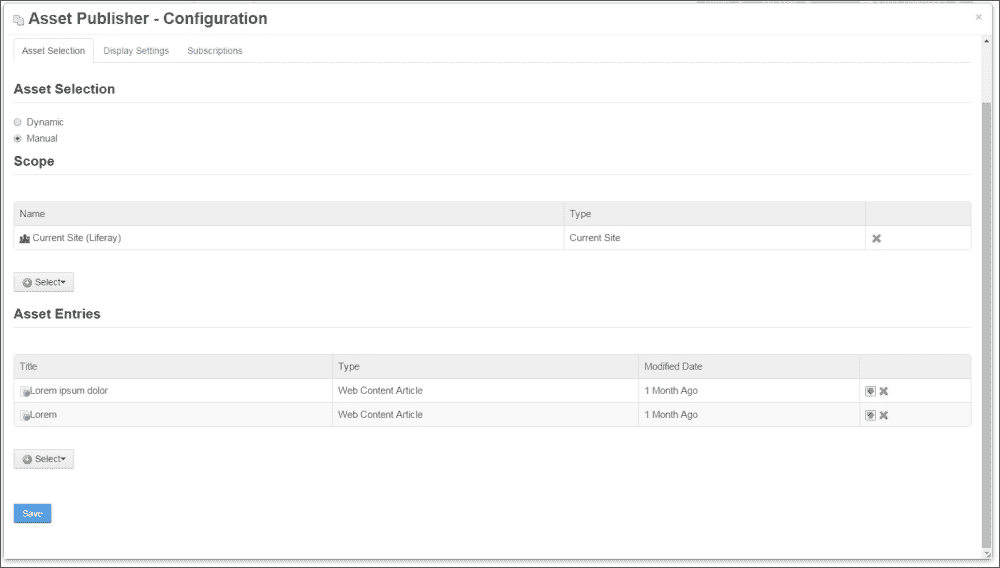
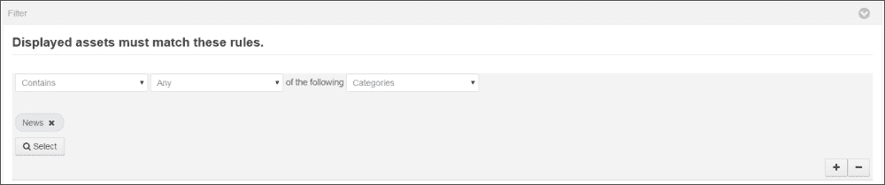
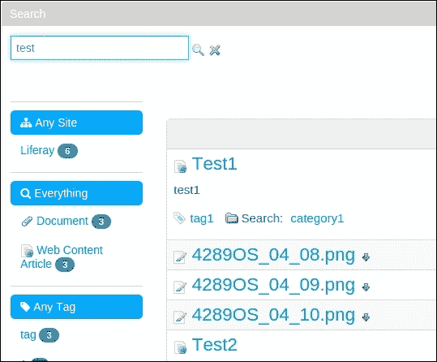

# 第八章。搜索和内容展示工具

在本章中，我们将涵盖以下主题：

+   标记和分类内容

+   资产发布者作为基于搜索的内容展示工具

+   为资产发布者定义应用显示模板

+   搜索端口的基本配置

+   Solr 的安装和配置

# 简介

Liferay 提供了一个强大的内置工具，允许我们搜索内容。这是 Liferay 最重要的功能之一。为什么？答案很简单：搜索无处不在是必需的。没有好的搜索引擎，在内容混乱中无法找到或定位文章、维基或文档。Liferay 架构提供了一个有用的工具来索引、搜索和显示此类文档作为分面结果。分面意味着按特定的主题类别分组，按特定的实体类型分组，或其他此类标准。

实际上，Liferay 中有一系列搜索功能。可以使用 SQL 查询以及使用称为 Apache Lucene 的专用搜索引擎来查找实体（[`lucene.apache.org`](http://lucene.apache.org)）。在许多地方（尤其是在配置或控制面板中），Liferay 使用 SQL 查询查找实体。另一方面，门户提供了一个称为搜索端口的专用端口，允许我们使用 Lucene 引擎进行搜索。

# 标记和分类内容

类别和标签提供了一种强大的机制来标记、列出和搜索不同的资产，并允许通过专门的端口如类别导航、资产发布者或标签云等来帮助后续选择。该机制非常简单：标签和类别被分配给网络内容、文档或其他类型的资产。然后，可以设置端口来仅显示具有特定类别和/或标签的资产。可以为资产分配一个或多个类别和/或标签。

## 如何做到这一点...

在添加或编辑此资产时，可以为任何资产分配类别和标签。例如，如前几章所示（第六章，*Liferay 中的文档和媒体*和第七章，*内容处理*），新的（和编辑过的）网络内容或新的（和编辑过的）文档表单提供了一个分类部分。此部分允许我们选择类别集并定义在提交表单后将分配给文档或网络内容的标签列表。然而，重要的是要知道，分配类别和标签的过程是不同的。标签可以直接在内容添加表单中定义，而类别必须在站点管理中创建，以便可供分配。

类别存储在词汇表中。为了创建类别，您必须首先使用以下步骤创建一个词汇表：

1.  以管理员身份登录并转到**管理** | **网站管理** | **内容** | **类别**。

1.  点击**添加词汇**按钮。

1.  为新词汇提供**名称**和**描述**。

1.  启用**允许多个类别**选项。

1.  在**选择资产类型**下拉列表中设置**所有资产类型**。

1.  启用**必需**选项。

1.  通过设置特定角色可能执行的所有操作来确定词汇的**权限**（点击**更多选项**链接后可以找到更多权限）。

1.  点击**保存**按钮。

当**词汇**准备就绪时，可以填充**类别**。要添加类别，请按照以下步骤操作：

1.  以管理员身份登录并转到**管理** | **网站管理** | **内容** | **类别**。

1.  点击**添加类别**按钮。

1.  为新类别提供**名称**和**描述**。

1.  从**到词汇**下拉列表中选择您想要创建类别的词汇。

1.  通过设置特定角色可能执行的所有操作来确定该类别的**权限**（点击**更多选项**链接后可以找到更多权限）。

1.  点击**保存**按钮。

创建类别后，可以将其分配给资产。以下是如何使用以下步骤将之前创建的类别分配给现有网页内容的步骤：

1.  以管理员身份登录并转到**管理** | **网站管理** | **内容** | **网页内容**。

1.  点击一个已存在的网页内容的名称。

1.  导航到**分类**选项卡。

1.  点击位于您想要分配类别的词汇名称附近的位置的**选择**按钮。

1.  标记您想要选择的类别或类别，然后关闭窗口。

1.  点击**发布**按钮以保存网页内容的更改。

与类别不同，标签不需要在进入添加/编辑资产表单的**分类**部分之前创建。您可以使用以下步骤在单个任务中创建一个标签并将其分配：

1.  以管理员身份登录并转到**管理** | **网站管理** | **内容** | **网页内容**。

1.  点击一个已存在的网页内容的名称。

1.  导航到**分类**选项卡。

1.  在**标签**字段中输入标签。

1.  点击**+添加**按钮或按*Enter*键。

    ### 备注

    您可以在**标签**字段中输入所有标签的完整列表，并通过逗号分隔它们来添加多个标签。

    

1.  点击**发布**按钮以保存网页内容的更改。

还可以在**网站管理**部分定义标签列表，以便供创建网页内容、文档和其他类型资产的用户稍后使用。要定义标签，请按照以下步骤操作：

1.  以管理员身份登录并转到**管理** | **网站管理** | **内容** | **标签**。

1.  点击**添加标签**按钮。

1.  为标签提供一个**名称**。

1.  点击**保存**按钮。

要分配一个已存在的标签，请按照以下步骤操作：

1.  以管理员身份登录并转到**管理** | **网站管理** | **内容** | **网页内容**。

1.  点击一个已存在的网页内容的名称。

1.  导航到**分类**选项卡。

1.  点击**标签**字段下方的**选择**按钮。

1.  标记您想要选择的标签或标签。

    ### 注意

    您也可以通过输入其名称（自动完成功能将帮助找到现有标签）并按*Enter*按钮来选择一个现有的标签。

1.  点击**发布**按钮以保存网页内容的更改。

## 它是如何工作的…

类别和标签都使用**网站管理**部分中提供的工具进行管理，并通过资产添加/编辑表单（新的网页内容表单、编辑网页内容表单、新的文档表单、编辑文档表单等）分配给资产。当提供了类别和/或标签时，每个资产都可以通过特定的组件（如资产发布者）进行选择并在页面上显示。

### 类别

类别存储在词汇表中，并形成一个树状结构——每个类别可以有子类别。可以通过访问**管理** | **网站管理** | **内容** | **类别**来管理网站内所有可用的类别。此部分允许我们创建、编辑和删除词汇和类别。

每个词汇都通过其名称来识别，并且可以提供描述。词汇可以设置为与所有或仅与一个特定资产一起工作（选择**资产类型**选项）。例如，可以创建一个只能将类别分配给网页内容的词汇。这样的词汇将不会在其他资产的添加和编辑表单中可用。

在创建词汇时，我们可以决定在分配类别给资产时，用户是否必须至少分配其一个类别（**必需**选项）或者他们是否可以使用此特定词汇中的多个类别（**允许多个类别**选项）。

类别通过其名称来识别，并且可以提供描述。还可以为词汇和类别设置权限。

### 标签

相反，标签不存储在词汇表中，但它们构建了一个平面结构。可以通过访问**管理** | **网站管理** | **内容** | **标签**来访问网站内分配给资产的标签。**标签**部分允许我们添加、编辑、删除或合并标签。与类别不同，标签在分配给资产时可以创建。

## 参见

有关管理网页内容和文件的信息，请参阅以下食谱：

+   在第六章的*使用文档和媒体组件管理 Liferay 中的文件*食谱中，*Liferay 中的文档和媒体*

+   在第七章的*管理和显示网络内容*配方中，*与内容一起工作*

# 资产发布者作为基于搜索的内容展示工具

资产发布者是一个非常复杂且高度可配置的组件，它允许我们在页面上展示网络内容文件夹、网络内容、文档文件夹、文档、留言板消息、书签文件夹、书签条目、博客条目、日历事件和维基页面。由特定资产发布者展示的资产可以是授权用户手动选择，也可以根据配置的规则自动选择。

在本配方中，我们将向您展示如何配置资产发布者，以使用手动和动态资产选择变体展示网络内容。

## 准备工作

要逐步完成此配方，您需要添加包含新闻类别的词汇表并创建网络内容。

## 如何操作…

假设我们每周都需要在我们的内网主页上发布由负责新闻发布的员工选择的前五条最重要的新闻条目。这些新闻可以通过配置为列出手动选择的网络内容文章的资产发布者组件来显示。要配置此类资产发布者组件，请按照以下步骤操作：

1.  以管理员身份登录并前往您想要配置新**资产发布者**的页面。

1.  点击添加图标（这是左侧的**+**符号）。

1.  点击**应用程序**标签。

1.  使用搜索功能或通过浏览可用组件列表查找**资产发布者**组件。

1.  点击位于资产发布者旁边的**添加**链接（当您将鼠标悬停在组件名称上时，该链接会出现）。

1.  点击新添加组件的选项图标（这将是组件右上角的齿轮图标）。

1.  选择**配置**选项。

1.  从**资产选择**部分选择**手动**选项。

1.  点击**资产条目**部分的**选择**按钮。

1.  选择**网络内容文章**选项。

1.  点击您想要选择的网络内容旁边的**选择**按钮。

    ### 备注

    根据需要重复步骤 9-11，以创建所需的新闻列表。

    

1.  点击**保存**按钮。

1.  通过点击**x**按钮关闭弹出窗口。您刚刚配置的资产发布者组件将仅展示所选网络内容的列表。

还可以将资产发布者设置为根据指定的类别自动选择新闻文章（在我们的示例中，我们将使用**新闻**类别）。

为了将资产发布者配置为仅展示具有**新闻**类别的网络内容文章，请按照以下步骤操作：

1.  点击之前添加组件的选项图标。

1.  选择**配置**选项。

1.  从**资产选择**部分选择**动态**选项。

1.  从**资产类型**列表中选择**网络内容文章**选项。

1.  在**过滤器**部分设置**包含以下任一类别**规则。

1.  点击**选择**按钮。

1.  标记**新闻**类别并关闭窗口。

1.  将**按字段排序**设置为**发布日期**和**降序**。

1.  点击**保存**按钮。通过点击**x**按钮关闭弹出窗口。您刚刚配置的资产发布器小部件将仅显示包含**新闻**类别的网络内容列表。

## 它是如何工作的…

用户可以通过手动选择（**手动资产选择**）或根据一组规则自动选择（**动态资产选择**）来选择小部件显示的资产。正如配方的第一部分所示，**手动资产选择**允许我们在**资产类型**字段中设置的类型以及资产发布器工作范围内的可用范围内选择任何资产（在**范围**字段中定义）。

范围是一个非常重要的参数，因为它定义了资产发布器显示的资产的原产地。资产发布器可以展示在**当前站点**、**全局**范围或从**其他站点**列表中选择的任何其他站点内创建的资产。

配方的第二部分提供了一个**动态资产选择**的示例，其中资产发布器从定义的**范围**中选择所有符合定义的**资产类型**并且分配到**过滤器**部分中指定的类别或标签的资产。可以指定资产发布器应仅列出具有分配（或未分配）的类别、一组类别、一个标签或一组标签的资产。此外，**过滤器**部分允许我们指定资产是否必须分配到集合中的所有类别（**所有**选项）或者是否只需至少分配集合中的一个类别即可（**任何**选项）。例如，如果我们希望资产发布器小部件仅展示同时具有新闻和体育类别的资产，我们必须设置**包含所有类别**规则并从列表中选择新闻和体育类别。如果我们希望列出所有资产，除了那些分配了新闻类别的资产，我们必须使用**不包含任何类别**规则并从列表中选择新闻类别。

资产发布器小部件提供了许多配置选项，允许我们自定义其外观和可用功能。可以通过访问**资产发布器** | **配置** | **设置** | **显示设置**来访问配置选项。以下是最重要的选项的描述：

+   **显示模板**选项允许我们选择资产应该如何显示（如标题列表、完整内容、摘要等）。

+   **摘要长度**允许定义将显示为摘要的文本字符数。

+   **资产链接行为**定义了在点击列表中显示的标题后，是否应显示完整内容。

+   **显示项目数量**选项定义了资产发布器小部件将显示多少资产。

+   **分页类型**允许我们选择是否以及显示何种类型的分页来组织长列表的资产。

+   **将此页面设置为默认资产发布器**选项允许我们将此特定的资产发布器设置为用于展示与此页面相关的内容。将资产发布器设置为默认的页面将在添加新网页内容时可供选择作为显示页面。

+   **启用打印**选项启用网页内容的打印版本。

+   **启用标志**选项启用标志功能，该功能提供了一种通知任何不规则性的联系表单。

+   **启用相关资产**选项启用相关资产功能，该功能列出了在添加/编辑资产表单中定义为相关的所有资产。

+   **启用评分**选项启用允许我们评分资产发布器显示的内容的功能。

+   **启用评论**选项允许我们对资产发布器显示的资产进行评论。

+   **启用社交书签**选项显示 Google+、Facebook 和 Twitter 分享按钮。

+   **选择元数据**选项允许我们选择资产发布器小部件显示的每个资产的元数据信息。

## 参见

关于管理网页内容和文件的信息，请参阅以下配方：

+   在第六章的*使用文档和媒体小部件管理 Liferay 中的文件*配方中，*Liferay 中的文档和媒体*

+   在第七章的*管理和显示网页内容*配方中，*与内容一起工作*

# 定义资产发布器的应用程序显示模板

由于 Liferay 版本 6.2 是可用的选项，它允许我们为资产发布器设置一个新的显示模板。在实际应用中，这是一个非常有用且强大的工具，有助于定义资产的自定义显示模板，例如期刊文章、博客条目、论坛等。例如，您可能只想显示资产描述或添加选定的分类和标签。

假设我们有一个用例，该用例描述了资产发布器视图需求如下：

+   显示标题

+   显示描述

+   显示选定的标签和分类

+   显示资产链接

+   显示“阅读更多”链接

## 如何做…

为了定义一个新的显示模板，以管理员身份登录并按照以下步骤操作：

1.  以管理员身份登录。转到**管理** | **配置**并从左侧菜单中选择**应用程序显示模板**。

1.  点击**添加**按钮并选择**资产发布器模板**。

1.  在表单中输入**名称**为**内网模板**的值，并选择**Velocity (.vm**)语言。

1.  在脚本区域，编写以下代码：

    ```js
    #if (!$entries.isEmpty())
      #foreach ($curEntry in $entries)
        <div>$curEntry.getTitle($locale)</div>
        <div>$curEntry.getDescription($locale)</div>
        <div>
          $taglibLiferay.assetTagsSummary(
            $curEntry.getClassName(), $curEntry.getClassPK(), 
            null, null, $renderResponse.createRenderURL()
            )
        </div>
        <div>
          $taglibLiferay.assetCategoriesSummary(
            $curEntry.getClassName(), 
            $curEntry.getClassPK(), null, $renderResponse.createRenderURL()
          )
        </div>
        <div>
          $taglibLiferay.assetLinks(
            $curEntry.getEntryId(), 
            $curEntry.getClassName(), $curEntry.getClassPK()
          )
        </div>

        <div>
          <a href="$assetPublisherHelper.getAssetViewURL(
            $renderRequest, $renderResponse, $curEntry)">
          Read more</a>
        </div>
        <hr />
        #end
    #end
    ```

1.  点击**保存**按钮。

1.  创建一个新页面，并放置资产发布者组件（参见本章的*将资产发布者作为基于搜索的内容展示工具*配方）。

1.  前往资产发布者配置，并选择**显示设置**选项卡。

1.  在**显示模板**字段中，选择**内网**模板，然后点击**保存**按钮。

1.  关闭配置弹出窗口。在资产发布者视图中，你应该看到新的模板。

## 它是如何工作的…

在之前的 Liferay 版本中，无法从控制面板中为资产发布者添加新的显示模板。唯一的方法是在钩子插件中添加新的 Java 服务器页面文件。在 Liferay 6.2 中，可以在控制面板下定义视图为 Velocity 或 Freemarker 脚本。Liferay 开发者实现了一个强大的编辑器，有助于创建新模板。编辑器指定可能的字段，显示提示，并提供出色的自动完成选项。

让我们尝试理解我们的脚本。第一行检查条目集合中是否有任何元素。`$entries`对象是一个资产条目元素的集合，这些元素是根据组件配置中的特定标准选择的。

下一行遍历条目集合，并将元素分配给`$curEntry`变量。

下一个部分显示标题和描述。接下来的三个部分显示标签、类别和相关的资产。最后一个部分显示**阅读更多**选项。

在这个过程中最困难的事情是理解每个助手和工具的工作方式，哪些参数是必需的，哪些不是必需的。不幸的是，没有简单的方法来理解它。唯一的方法是在 Liferay 源代码或示例中搜索帮助。

## 参见

为了了解更多关于模板的信息，请参阅第七章中的*创建新模板*配方，*处理内容*。

# 搜索组件 – 基本配置

假设我们的内网只包含分布在多个文件夹中的文章和文件。我们的目标是配置搜索组件，以便只查找这些内容。然而，我们的搜索结果应显示以下方面：

+   资产类型方面

+   资产标签和资产类别方面

+   用户方面

+   时间方面

## 准备工作…

为了开始我们的搜索之旅，我们的 Liferay 实例应该有一些内容，例如期刊文章、文件和文件夹、用户等。

## 如何操作…

为了使用基本配置正确配置搜索组件，请按照以下步骤操作：

1.  以管理员身份登录。

1.  使用单列模板创建搜索页面。

1.  前往**搜索**页面。

1.  点击左侧的**应用程序**选项卡。

1.  通过滚动或输入文本搜索字段来查找**搜索**组件。

1.  点击**添加**按钮或将端口件拖放到布局的正确位置。

1.  进入端口件的**配置**模式。

1.  确保选择以下选项：

    +   **基本显示设置**

    +   **显示资产类型方面**

    +   **显示资产标签方面**

    +   **显示资产类别方面**

    +   **显示文件夹方面**

    +   **其他设置**部分中的**在上下文中查看**

1.  将**拼写检查**设置保留为默认配置。

1.  点击**保存**按钮并关闭弹出窗口。

1.  在搜索表单中输入您的关键词并按*Enter*键。Liferay 应该显示以下结果：

## 它是如何工作的…

Liferay 提供了一个基于 Lucene 的内置搜索系统。Liferay 中的每个实体（例如，网页内容、文档库文件条目、博客、论坛等）都有自己的`Indexer`类。这个类负责解析内容并将它们放入搜索索引。当用户使用搜索端口并输入特定的关键词时，搜索引擎会在索引中查找结果。

Lucene 引擎有自己的查询语法来查询其索引。相应地，Lucene 索引看起来像带有键和值的映射。如果用户询问特定的关键词，后台会生成一个查询。要浏览 Lucene 索引，有一个名为 Luke 的工具([`code.google.com/p/luke`](https://code.google.com/p/luke))。

## 还有更多…

当我们分析搜索端口显示的结果时，我们注意到有许多不必要的条目，例如用户、论坛等。我们的假设是只展示网页内容和文档库实体。此外，我们还想禁用未使用的方面，如文件夹方面。要实现这一结果，需要更改分面配置。按照以下步骤修改分面搜索：

1.  进入搜索端口件的配置模式。

1.  在**显示设置**部分的**高级**选项上勾选。

1.  修改 JSON 搜索配置。使用以下行更改值节点：

    ```js
    "data": {
      "values": [
      "com.liferay.portlet.documentlibrary.model.DLFileEntry",
        "com.liferay.portlet.journal.model.JournalArticle"
        ],
      "frequencyThreshold": 1
    }
    ```

1.  删除任何不必要的方面：

    ```js
    {
      "displayStyle": "folders",
      "weight": 1.2,
      "static": false,
      "order": "OrderHitsDesc",
      "data": {
        "maxTerms": 10,
        "frequencyThreshold": 1,
        "showAssetCount": true
      },
      "label": "folder",
      "className": "com.liferay.portal.kernel.search.facet.MultiValueFacet",
      "fieldName": "folderId"
    }
    ```

1.  点击**保存**按钮。

1.  关闭弹出窗口，执行之前所做的相同搜索，并注意差异。

## 参见

关于管理网页内容和文件的信息，请参考以下菜谱：

+   第六章中的*使用文档和媒体端口件管理 Liferay 中的文件*菜谱，*Liferay 中的文档和媒体*

+   第七章中的*管理和显示网页内容*菜谱，*处理内容*

关于标记和分类的信息，请参阅本章中的*标记和分类内容*菜谱

# Solr 安装和配置

Apache Solr ([`lucene.apache.org/solr`](http://lucene.apache.org/solr)) 是建立在 Apache Lucene 之上的功能强大的搜索引擎。实际上，Apache Solr 是一个具有 REST API 的独立企业级搜索引擎。此解决方案的主要优势是它可以轻松地作为云服务安装。Apache Solr 有许多其他优势，例如高流量优化、管理界面、易于监控、高可扩展性和容错性，等等。有关这些功能的更多信息，请参阅官方站点 [`lucene.apache.org/solr/features.html`](http://lucene.apache.org/solr/features.html)。

Apache Solr 支持模式模式和无模式模式。模式是一个构建索引并定义由其组成的字段的地方。无模式模式允许用户通过简单地索引样本数据来快速构建一个有效的模式，而无需手动编辑模式。名为 `solr4-web` 的 Liferay 插件提供模式和 Solr 配置。因此，我们将使用此配置在定义的模式模式下运行 Solr。

## 如何做到这一点…

在这个菜谱中，我们将向您展示安装和运行带有 Liferay 的 Solr 服务器的最简单方法。

首先，我们需要安装 Apache Solr 4。最新的 Solr 4 版本是 4.10.4。按照以下步骤使用 Liferay 模式和配置运行 Solr：

1.  从官方站点 [`archive.apache.org/dist/lucene/solr/`](http://archive.apache.org/dist/lucene/solr/) 下载捆绑了 Jetty 的 Apache Solr 4 版本（4.10.4）。

1.  在您的本地机器上解压缩 `solr-4.10.4.tgz`：

    ```js
    tar -xzvf solr-4.10.4.tgz

    ```

1.  从官方 Liferay 仓库 [`github.com/liferay/liferay-plugins/tree/6.2.x/webs/solr4-web/docroot/WEB-INF/conf`](https://github.com/liferay/liferay-plugins/tree/6.2.x/webs/solr4-web/docroot/WEB-INF/conf) 下载 `solrconfig.xml` 和 `schema.xml`。

1.  将 `solrconfig.xml` 和 `schema xml` 复制到 `solr-4.10.3/example/solr/collection1/conf`。

1.  运行 Apache Solr：

    ```js
    solr-4.10.3/bin/solr start

    ```

    Solr 应该打印以下消息：

    `等待看到 Solr 在端口 8983 上监听 [/]`

    `在端口 8983 上启动 Solr 服务器（pid=2821）。祝您搜索愉快！`

1.  在 Liferay 实例中，从市场安装 `solr4-web` 插件。

1.  编辑 `tomcat-7.0.42/webapps/solr4-web/WEB-INF/classes/META-INF/solr-spring.xml` 文件，并更改 `com.liferay.portal.search.solr.server.BasicAuthSolrServer` 实例中的 `url` 属性：

    ```js
    <property name="url" value="http://localhost:8983/solr" />
    ```

1.  重启 Liferay 实例。

1.  以管理员身份登录到 Liferay 门户。

1.  前往 **管理** | **控制面板** | **服务器管理**，然后在 **重新索引所有搜索索引** 部分的 **执行** 按钮上单击。

1.  在前端，添加带有 **搜索** 小部件的 **搜索** 页面。

1.  在 **搜索** 小部件中输入关键词以查找您的数据。

## 它是如何工作的…

Apache Solr 是一个功能强大的搜索引擎，拥有许多配置文件。为了运行 Apache Solr 和 Liferay，我们需要覆盖两个文件：`schema.xml` 和 `solrconfig.xml`。

第一个文件定义了 Liferay 中可用的字段和字段类型。`schema.xml` 文件有两个部分：`types` 和 `fields`。

`The Types` 部分定义了所有可能的字段类型，例如布尔值、整数、浮点数、双精度浮点数等。最重要的字段是文本，其定义如下：

```js
<fieldType class="solr.TextField" name="text" positionIncrementGap="100">
  <analyzer type="index">
    <tokenizer class="solr.WhitespaceTokenizerFactory" />
    <filter class="solr.LowerCaseFilterFactory" />
    <filter class="solr.RemoveDuplicatesTokenFilterFactory" />
    <filter class="solr.StopFilterFactory" enablePositionIncrements="true" ignoreCase="true" words="stopwords.txt" />
    <filter catenateAll="0" catenateNumbers="1" catenateWords="1" class="solr.WordDelimiterFilterFactory" generateNumberParts="1" generateWordParts="1" />
  </analyzer>
  <analyzer type="query">
    <tokenizer class="solr.WhitespaceTokenizerFactory" />
    <filter class="solr.LowerCaseFilterFactory" />
    <filter class="solr.RemoveDuplicatesTokenFilterFactory" />
    <filter class="solr.StopFilterFactory" enablePositionIncrements="true" ignoreCase="true" words="stopwords.txt" />
    <filter class="solr.SynonymFilterFactory" expand="true" ignoreCase="true" synonyms="synonyms.txt" />
    <filter catenateAll="0" catenateNumbers="0" catenateWords="0" class="solr.WordDelimiterFilterFactory" generateNumberParts="1" generateWordParts="1" />
  </analyzer>
</fieldType>
```

让我们尝试分析这个定义：

+   这一定义的第一行包含了一个名为 `text` 的字段类型名称，以及实现该类型的 `solr.TextField` 类。在这个例子中，`solr.` 前缀代表 `org.apache.solr.schema`。`PositionIncrementGap` 属性指定了多个值之间的距离，这可以防止虚假的短语匹配。

+   接下来的几行是 `index analyzer` 和 `query analyzer` 的定义。`index` 类型表示数据在添加到索引时进行分析。`query` 类型指定了查询时间（搜索）中的分析器。

现在，让我们尝试查看代码中使用的其他术语：

+   `solr.WhitespaceTokenizerFactory`：这会在空白处分割文本流。以下是一个示例：

    输入：`This is an example`

    输出：`"This", "is", "an", "example"`

+   `solr.LowerCaseFilterFactory`：这会将标记中的任何大写字母转换为等效的小写字母。以下是一个示例：

    输入：`"This", "is", "an", "example"`

    输出：`"this", "is", "an", "example"`

+   `solr.RemoveDuplicatesTokenFilterFactory`：这会从流中移除重复的标记。以下是一个示例：

    输入：`"one", "two", "two", "three"`

    输出：`"one", "two", "three"`

+   `solr.StopFilterFactory`：这会移除给定停用词列表中的标记。

    +   `stopwords.txt` 包含诸如 `hate`、`love` 等单词。以下是一个示例：

    输入：`"I", "hate", "my", "job"`

    输出：`"I", "my", "job"`

+   `solr.WordDelimiterFilterFactory`：这会根据特定规则分割标记。请参阅官方 Solr 文档[`wiki.apache.org/solr/AnalyzersTokenizersTokenFilters#solr.WordDelimiterFilterFactory`](https://wiki.apache.org/solr/AnalyzersTokenizersTokenFilters#solr.WordDelimiterFilterFactory)，了解可能的配置。

+   `schema.xml` 的下一部分是字段部分。它包含所有字段定义。通常，Apache Solr 提供三种类型的字段：

    +   `defining fields`：这是一个典型的声明性字段定义。每个定义都有以下属性：

        ```js
        <field indexed="true" name="content" stored="true" termPositions="true" termVectors="true" type="text" />
        ```

    +   `copying fields`：这是制作具有不同分析器或过滤器的字段副本的机制。在我们的 `schema.xml` 文件中未使用。

    +   `dynamic fields`：这允许我们定义没有明确定义的字段。在我们的 `schema.xml` 中，它用于多语言字段：

        ```js
        <dynamicField indexed="true" multiValued="true" name="*_en" stored="true" termPositions="true" termOffsets="true" termVectors="true" type="text_en" />
        ```

每个字段定义都可以包含以下属性：

+   `name`：字段的名称

+   `type`：一个引用，指向在 `<types>` 部分中定义的字段类型

+   `default`：一个默认值，将自动添加到任何没有值的文档中

其他属性是可选的。官方 Apache Solr 文档中提供了可选属性的完整列表，请参阅[`cwiki.apache.org/confluence/display/solr/Defining+Fields`](https://cwiki.apache.org/confluence/display/solr/Defining+Fields)。

下一个文件名为`solrconfig.xml`的是 Solr 搜索引擎中最重要的配置文件。

在`solrconfig.xml`中更常用的元素包括：

+   使用`<datadir>`参数指定索引数据目录的位置

+   在`<query>`标签的子元素中配置的查询和缓存设置

+   处理发送到 Solr 的请求的`<requestHandle>`部分

+   `<searchComponent>`部分定义了`SearchHandler`用于执行用户查询的逻辑

所有文档均可在官方 Apache Solr 网站上找到：[`cwiki.apache.org/confluence/display/solr/Configuring+solrconfig.xml`](https://cwiki.apache.org/confluence/display/solr/Configuring+solrconfig.xml)。
