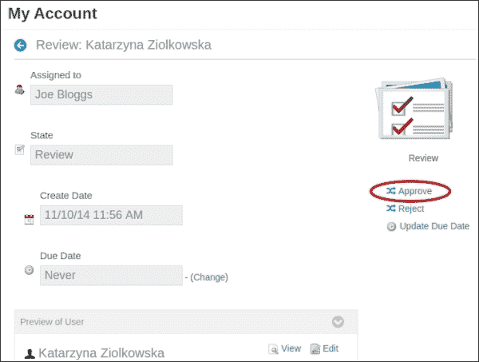
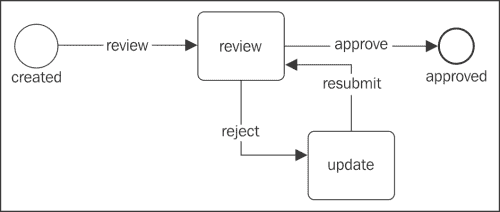
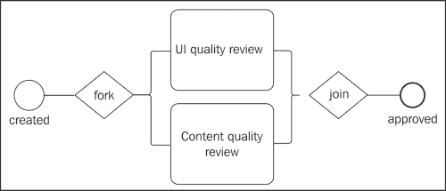
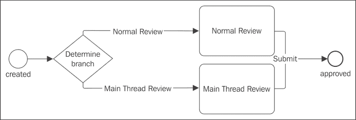

# 第九章：Liferay 工作流功能

在本章中，我们将涵盖以下主题：

+   Kaleo 网页安装

+   用户创建过程中的单一审批者工作流

+   网页内容创建和分叉-合并工作流程

+   消息板示例中的 Kaleo 条件

+   Kaleo 定时器

# 简介

工作流是一系列完成任务的必要活动。换句话说，工作流由一系列通过转换连接的状态组成。每个状态在其之前都有一个特定的步骤，在其之后也有一个特定的步骤。一般来说，它是一个线性定义的过程，描述了状态之间的流程。术语工作流表明人们如何工作以及他们如何处理信息。为了理解工作流定义，让我们定义其特定的词汇：

+   **状态**：这个术语描述了一个唯一的状态，将在工作项上执行特定的动作（或多个动作）。例如，新创建、批准、提交、完成、删除等。

+   **任务**：这定义了在状态之间对工作项执行的活动。

+   **转换**：这定义了从一种状态到另一种状态的转换规则。这意味着转换描述了一个任务列表，这些任务必须完成以将项目从一种状态转换到另一种状态。

Liferay Portal 包含一个名为 Kaleo 的工作流引擎。此引擎提供定义和部署工作流定义的功能。Kaleo 是一个外部网页插件，需要像其他插件一样进行部署。当前版本的 Kaleo 可在 Liferay 市场中找到。

# Kaleo 网页安装

Kaleo 工作流引擎被定义为网页插件。简而言之，网页插件是一个普通的网页应用程序，它还提供了使用基于 Service Builder 和其他 Liferay 插件（如钩子、插件等）构建的 Liferay 服务层的功能。一般来说，它是一个典型 servlet 应用程序和 Liferay 特定插件的混合体。

## 准备工作

为了正确安装 Liferay 插件，需要在官方 Liferay 网站上创建一个账户。此账户允许你在市场上下载插件，在论坛上讨论，创建博客等。

## 如何操作...

在 Liferay 6.1.1 GA2 版本中，Liferay 提供了一个市场插件来安装所有可用的插件。在 Liferay 6.2 中，市场插件已经安装，因此 Kaleo 插件的安装非常简单。为了安装 Kaleo 工作流，请按照以下步骤进行：

1.  在内联网上以管理员身份登录。

1.  导航到 **Admin** | **Control Panel**。

1.  在 **Apps** 部分中选择 **Store** 选项。

1.  通过输入 Liferay 登录名和密码进行身份验证。

    ### 备注

    如果 Liferay 提供了一个新的市场插件，将会有一个向导来更新插件并下载最新版本。

1.  在市场搜索表单中，输入 `Kaleo Workflow CE` 并选择正确的结果。

1.  点击 **Free** 按钮。

1.  选择或创建一个新的项目进行购买；阅读并接受使用条款。填写**法人实体名称**并点击**购买**按钮。

1.  系统应显示以下消息：

    **谢谢！**

    **您的收据 ID 号码是<RECEIPT_ID>**

    **此订单的确认邮件已发送至您的收件箱**。

    **点击“查看已购买”以在线查看和管理您的购买，或者您可以通过 Liferay 门户实例进入市场并从那里管理您的购买**。

1.  导航至**已购买的应用**并点击**安装**按钮。

1.  确认**控制面板** | **配置**部分中有一个**工作流**标签。

## 它是如何工作的…

Liferay 使用其自己的产品进行工作流实现。所有 Kaleo 实体都是由服务构建器机制生成的。

这意味着`service.xml`定义了一组实体：Kaleo Action、Kaleo Condition、Kaleo Definition、Kaleo Instance、Kaleo Instance Token、Kaleo Log、Kaleo Node、Kaleo Notification、Kaleo Notification Recipient、Kaleo Task、Kaleo Task Assignment、KaleoTask Assignment Instance、Kaleo Task Instance Token、Kaleo Timer、Kaleo Timer Instance Token、Kaleo Transition。不需要了解所有这些实体及其关系的含义。

安装成功后，Liferay 环境中将出现几个新选项：

+   **控制面板** | **配置**部分中的**工作流**选项：这是一个全局工作流配置，允许您定义新的工作流定义并管理资产之间的默认工作流（例如，网页内容文章、用户、博客等）。

+   **管理员** | **站点管理** | **配置**中的**工作流配置**：这定义了当前站点的工作流。

+   **我的工作流任务**标签在**{USERNAME}** | **我的账户**部分：此功能列出分配给特定用户的所有挂起和完成的工作流任务。

+   **我的提交**在**{USERNAME}** | **我的账户**部分：这提供了提交审查流程的资产列表。

此外，Kaleo 添加了特定的角色，这些角色可用于工作流定义：

+   组织内容审查员

+   门户内容审查员

+   网站内容审查员

## 参见

有关如何管理文件或网页内容的更多信息，请参阅

+   在第六章的*在 Liferay 中使用文档和媒体组件管理文件*配方中，*Liferay 中的文档和媒体*。

+   在第七章的*使用内容管理网页内容*配方中，*使用内容*，*在 Liferay 中使用文档和媒体组件管理文件*配方在第六章中，*Liferay 中的文档和媒体*。

# 用户创建过程的单个审批者工作流

默认情况下，Kaleo 工作流提供单个审批者定义。此工作流在发布任何资产之前需要经过一个审批状态。

我们将向您展示如何使用此工作流进行用户创建过程。

## 如何做到这一点…

启用单个审批者定义是一个简单的过程。为了激活用户创建的工作流，请执行以下步骤：

1.  导航到**管理员** | **控制面板** | **配置** | **工作流**标签页。

1.  选择**默认配置**标签页

1.  找到**用户**资源并选择**单个审批者（版本 1）**定义。

1.  点击**保存**按钮。

    ### 小贴士

    要检查单个审批者如何工作，请尝试在登录端口创建一个新账户。

1.  打开登录端口页面。默认情况下，它位于主页上。

1.  选择**创建账户**选项并填写表格。

1.  提交表单后，系统应显示以下消息：

    **感谢您创建账户。您的账户被批准后，将通过电子邮件通知您，电子邮件地址为 your-mail@example.com。**

这个过程的最后一步是批准一个新用户。为了实现这一点，请按照以下步骤操作：

1.  以管理员身份登录。

1.  导航到**我的账户** | **我的工作流**任务。

1.  查找一个处于审查状态的任务，并通过点击表格中的超链接来编辑它。

1.  在**分配给**字段旁边选择**分配给我**选项。

1.  **批准**用户（在对话框中，可以写评论）。

1.  前往**完成**标签页并检查结果。批准的用户应该在该列表中。

    ### 注意

    只有分配了任务的用户才能将其转移到下一个任务或状态。

## 如何工作…

为了理解这个过程，让我们检查单个审批者定义（位于`webapps/kaleo-web/WEB-INF/classes/META-INF/definitions`的`single-approver-definition.xml`）。这个定义可以表示如下：



### 状态

此流程的起点是一个名为`created`的状态。该状态的定义位于`single-approver-definition.xml`文件的开始部分：

```js
<state>
  <name>created</name>
  [..]
  <initial>true</initial>
  <transitions>
    <transition>
      <name>review</name>
      <target>review</target>
    </transition>
  </transitions>
</state>
```

状态节点包含：

+   `name`：这是状态的名字

+   `initial`：这是一个表示初始状态的标志

+   `transitions`列表：在这个例子中，只有一个名为`review`的转换

转换节点可以定义：

+   `name`：这是转换的名字

+   `target`：这是目标状态或任务的名字

+   `default`：这是一个标记转换为默认的标志

### 任务

我们流程的下一步是一个名为`review`的`review`任务，它由一个名为`review`的转换定义。任务是在工作流定义中最复杂的结构。任务审查是用户可以决定是否批准或拒绝资产的地方。此任务的定义如下：

```js
<task>
  <name>review</name>
  <actions>
    <notification>
      <name>Review Notification</name>
      <template>${userName} sent you a ${entryType} for review in the workflow.</template>
      <template-language>freemarker</template-language>
      <notification-type>email</notification-type>
      <notification-type>user-notification</notification-type>
      <execution-type>onAssignment</execution-type>
    </notification>
     [...]
  </actions>
  <assignments>
    <roles>
      [...]
    </roles>
  </assignments>
  <transitions>
     [...]
  </transitions>
</task>
```

任务的主要属性包括：

+   `name`：这是任务的名字，例如，review。

+   `actions`：这指定了动作元素或通知元素的列表。在这个例子中，动作只包含电子邮件通知。

+   `assignments`：这指定了分配给特定任务的角色的列表或用户列表。

+   `transitions`: 这指定了转换元素列表，描述了改变状态或任务的所有可能方式。在这个例子中，是批准或拒绝。

### 通知

让我们更深入地了解动作定义。正如我们之前提到的，动作可以包含通知元素和/或动作元素：

```js
<notification>
  <name>Review Notification</name>
  <template>${userName} sent you a ${entryType} for review in the workflow.</template>
  <template-language>freemarker</template-language>
  <notification-type>email</notification-type>
  <notification-type>user-notification</notification-type>
  <execution-type>onAssignment</execution-type>
</notification>
```

通知节点有以下选项：

+   `name`: 这是通知的名称

+   `template`: 这定义了通知的消息

+   `template-language`: 这是三个选项之一：freemarker、velocity 和 text

+   `notification-type`: 这指定了电子邮件、IM、私信或用户通知

+   `execution-type`: 这指定了三个选项之一：`onAssignment`（当特定用户被分配到特定资产时发送通知），`onExit`（当特定资产离开状态或任务时发送通知），以及`onEntry`（当特定资产进入状态时发送通知）

    ### 注意

    IM 类型和私信类型目前是占位符。这意味着 Kaleo Web 不支持这些类型。

### 动作

第二种可能性是定义一个动作，如下面的代码所示：

```js
<action>
  <name>approve</name>
  <script>
    <![CDATA[ {script here} ]]>
  </script>
  <script-language>groovy</script-language>
  <execution-type>onEntry</execution-type>
</action>
```

动作元素具有简单的结构，但它是一个强大的工具，可以调用 Liferay 中的每一块代码。动作包含：

+   `name`: 这指定了动作的名称。

+   `script`: 这指定了脚本定义。在本节中，可以编写将在定义执行类型时调用的代码。

+   `script-language`: 这定义了脚本中将使用的语言，例如 Groovy、BeanShell、DRL、JavaScript、Python、Ruby。最常用的是 BeanShell。

+   `execution-type`: 这指定了三个选项之一：`onAssignment`（当特定用户被分配到特定资产时发送通知），`onExit`（当特定资产离开状态或任务时发送通知），以及`onEntry`（当特定资产进入某个状态时发送通知）。

# 网页内容创建和分支-合并工作流程

假设我们的目标是创建一个 Kaleo 定义，以便根据以下要求发布文章。每个人都可以撰写文章并将其提交给审稿人。审查阶段有两个独立的（并行）步骤：

+   UI 质量审查

+   内容质量审查

只有在这些步骤之后，才有可能发布文章。在这个菜谱中，我们将展示如何使用分支和合并功能来创建 Kaleo 定义。分支和合并用于并行处理目的。因此，它们将是解决我们问题的良好方案。

## 如何做到这一点…

首先，让我们可视化工作流程并定义状态、任务和转换。此图将帮助我们理解整个过程：



如前图所示，在我们的工作流程中有以下组件：

+   **创建**和**批准**状态

+   **UI 质量审查**和**内容质量审查**任务

+   Fork 和 join 功能。

第二步是编写一个原型，它定义了之前列出的状态、任务和转换：

### 注意

这只是一个真实定义的草稿。你将在本章的代码文件以及这本书中找到工作定义。

```js
<?xml version="1.0"?>
<workflow-definition>
  <name>Fork-Join Example</name>
  <state>
    <name>created</name>
    <transitions>
      <transition>
        <name>review-process</name>
        <target>review-process</target>
      </transition>
    </transitions>
  </state>
  <fork>
    <name>review-process</name>
    <transitions>
      <transition>
        <name>UI Quality Review</name>
      </transition>
      <transition>
        <name>Content Quality Review</name>
      </transition>
    </transitions>
  </fork>
  <task>
    <name>UI Quality Review</name>
    <transitions>
      <transition>
        <name>Submit</name>
        <target>join-tasks</target>
      </transition>
    </transitions>
  </task>
  <task>
    <name>Content Quality Review</name>
    <transitions>
      <transition>
        <name>Submit</name>
        <target>join-tasks</target>
      </transition>
    </transitions>
  </task>
  <join>
    <name>join-tasks</name>
    <transitions>
      <transition><name>approved</name></transition>
    </transitions>
</join>
  <state><name>approved</name></state>
</workflow-definition>
```

第三步是通过指定每个节点来完成前面的定义。这可以通过从单个审批者定义中复制部分内容来完成。

下一步是将这个定义上传到 Kaleo 工作流配置中，该配置位于 **管理员** | **控制面板** | **配置** | **工作流** 部分。上传 Kaleo 定义后，应该会显示成功消息。现在，新的定义将在 **定义** 选项卡中可见。

最后一步是为网络内容文章启用新的工作流定义。这一步在之前的配方中已有描述。

## 它是如何工作的...

这个定义使用了网络内容文章的 fork 和 join 功能。一般来说，当作者添加新的网络内容并将其提交以供发布时，Kaleo 工作流会创建两个任务：UI 质量审查和内容质量审查。只有在这两个任务被接受后，文章状态才会变为批准。当审查过程正在进行时，文章具有挂起状态。

让我们深入探讨 `fork` 和 `join` 的定义。

### Fork 元素

Fork 的结构与状态元素类似。fork 的主要功能是以并行方式创建任务列表。主要元素包括：

+   `name`：这指定了在转换定义中使用的 fork 名称

+   `transitions`：这指定了要创建的转换（任务或状态）列表

Fork 元素具有许多其他功能和元素，例如脚本、定时器、操作等。它可以具有非常复杂的结构，具有大量功能。在本配方中，我们只描述了该元素的基本功能。

### Join 元素

Join 是 fork 的永恒伴侣。这对总是在一起。这个元素的主要责任是等待，除非所有并行任务都执行并被接受。join 元素具有以下结构：

+   `name`：这指定了 join 的名称，该名称用于转换定义

+   `transitions`：这指定了转换列表。通常只有一个转换，它描述了连接过程后的状态或任务。

Join 的结构完全与 fork 相同。它可以具有非常复杂的结构，具有众多功能。

## 还有更多...

除了 `join` 元素外，还可以使用 `join-xor` 元素。`join` 和 `join-xor` 之间的主要区别在于，`join` 等待所有并行任务完成，而 `join-xor` 只等待第一个完成的任务。

### Join-xor 元素

`join-xor` 元素与 `join` 的定义相同：

+   `name`：这指定了在转换定义中使用的 join 名称。

+   `transitions`: 这指定了转换列表。通常只有一个转换，它描述了连接过程后的状态或任务。

## 参见

有关管理网络内容的更多信息，请参阅第七章中的*管理和显示网络内容*配方，*与内容一起工作*。

# 消息板示例中的 Kaleo 条件

Kaleo 工作流程包含条件。可以使用条件来分支工作流程并执行不同的任务。让我们假设我们是消息板管理员。在我们的公司中，有一个用户必须接受新线程，许多用户接受线程中的回复。可以使用 Kaleo 工作流程条件实现这种允许消息板这样工作的功能。

## 如何做…

此定义类似于分支和合并工作流程，但存在很大差异。没有并行工作流程任务。相反，有一个条件，它将实体移动到不同的状态。显然，工作流程是相同的：用户创建一个新的实体，管理员接受它。在定义特定任务的角色之间几乎没有差异。

如前一个示例所示，让我们可视化工作流程并定义状态、任务和转换。以下图表将帮助您更好地理解整个过程：



上述图表包含以下组件：

+   **创建**和**批准**状态

+   **正常审查**和**主线程审查**任务

+   条件语句。

让我们定义这些定义：

```js
<?xml version="1.0"?>
<workflow-definition>
  <name>Condition Example</name>
  <state>
    <name>created</name>
    <transitions>
      <transition>
        <name>determine-branch</name>
        <target>determine-branch</target>
      </transition>
    </transitions>
  </state>
  <condition>
    <name>determine-branch</name>
    <script>
      <![CDATA[SCRIPT DEFINITION]]>
    </script>
    <script-language>groovy</script-language>
    <transitions>
      <transition>
        <name>Normal Review</name>
        <target>Normal Review</target>
        <default>false</default>
      </transition>
      <transition>
        <name>Main Thread Review</name>
        <target>Main Thread Review</target>
        <default>false</default>
      </transition>
    </transitions>
  </condition>

  <task>
    <name>Normal Review</name>
    <transitions>
      <transition>
        <name>Submit</name>
        <target>approved</target>
      </transition>
    </transitions>
  </task>
  <task>
    <name>Main Thread Review</name>
    <transitions>
      <transition>
        <name>Submit</name>
        <target>approved</target>
      </transition>
    </transitions>
  </task>

  <state><name>approved</name></state>
</workflow-definition>
```

在定义 Kaleo 之后，让我们编写一个表示我们的 Kaleo 条件的条件脚本。在这个例子中，我们将使用 Groovy 脚本，它将被放置在`<condition>`定义中的`<script>`标签内。所以，让我们定义它：

```js
import com.liferay.portal.kernel.util.GetterUtil;
import com.liferay.portal.kernel.workflow.WorkflowConstants;
import com.liferay.portlet.messageboards.service.MBMessageLocalServiceUtil;
import com.liferay.portlet.messageboards.model.MBMessage;

String className = (String)workflowContext.get(
WorkflowConstants.CONTEXT_ENTRY_CLASS_NAME);
boolean isMBMessage = false;
if (className.equals(MBMessage.class.getName())) {
  isMBMessage = true;
}
returnValue = "Answers Review";
long classPK = GetterUtil.getLong(
(String)workflowContext.get(WorkflowConstants.CONTEXT_ENTRY_CLASS_PK));
if (isMBMessage) {
  MBMessage mbMessage = MBMessageLocalServiceUtil.getMBMessage(classPK);
  if (mbMessage.isRoot()) {
 returnValue = "Main Thread Review";
  }
}
```

## 它是如何工作的…

在前一个示例中，我们解释了工作流程定义，它可以应用于所有类型的资产（例如，用户、网络内容文章、消息板等）。在每种类型中，都有一个典型的流程：**已创建** | **正常审查任务** | **批准**。然而，如果我们将此工作流程应用于消息板实体，它将有一个不同的流程：**已创建** | **主线程审查** | **批准**。

为什么会发生这种情况？Groovy 脚本定义了一个条件并确定了完整的流程。

第一行获取`className`定义。接下来，if 语句检查这是否是`MBMessage`实体。

接下来的几行获取特定的`mbMessage`对象并检查此对象是否是`MBMessage`的根。值得注意的是，有一些预定义的值：

+   `returnValue`: 这包含转换的目标

+   `workflowContext`: 此对象实现了`WorflowContext`接口

### 条件语句

`<condition>`标签具有以下结构：

+   `name`: 这是条件的名称。

+   `script`: 这定义了一个条件。

+   `script-language`: 这定义了在脚本中将使用的语言，例如：Groovy、BeanShell、DRL、JavaScript、Python、Ruby。最常见的是 BeanShell。

+   `transitions`: 这指定了转换列表。

# Kaleo 计时器

最后一个配方涉及计时器。此功能允许用户定义在特定时间后应执行的具体操作。让我们通过条件示例稍微修改一下之前的配方，并添加一个计时器定义。我们的假设是，名为 Main Thread Review 的任务不应等待超过一小时才分配给任何用户。一小时后，此任务应分配给具有`test@liferay.com`电子邮件地址的用户。

## 如何操作...

首先，打开之前的定义并找到 Main Thread Review 任务。在 assignments 标签和 transitions 标签之间，输入以下代码：

```js
<?xml version="1.0" encoding="UTF-8"?>
<task-timers>
  <task-timer>
    <name>default-assignment</name>
    <delay>
      <duration>1</duration>
      <scale>hour</scale>
    </delay>
    <blocking>true</blocking>
    <timer-actions>
      <timer-notification>
        <name />
        <template />
        <template-language>text</template-language>
        <notification-type>im</notification-type>
      </timer-notification>
      <reassignments>
        <user>
          <email-address>test@liferay.com</email-address>
        </user>
      </reassignments>
    </timer-actions>
  </task-timer>
</task-timers>
```

## 它是如何工作的...

Kaleo 网络插件使用户能够在特定时间后对用户的行为做出反应。它允许您将任务分配给特定用户，发送通知等等。

`<task-timers>`标签具有以下结构：

+   `task-timer`: 这指定了具有计时器定义的复杂类型。

+   `name`: 这指定了计时器的名称。

+   `delay`: 这指定了延迟定义并定义了计时器在执行其操作之前将等待多长时间。例如，1 小时、5 分钟等等。

+   `recurrence`（在此示例中未使用）：根据指定的参数触发操作多次。例如，每 1 小时，定义调用特定操作。 

+   `blocking`: 如果这是 true，则停止工作流引擎执行，直到计时器执行。

+   `timer actions`: 这指定了在延迟定义之后要执行的操作列表。
