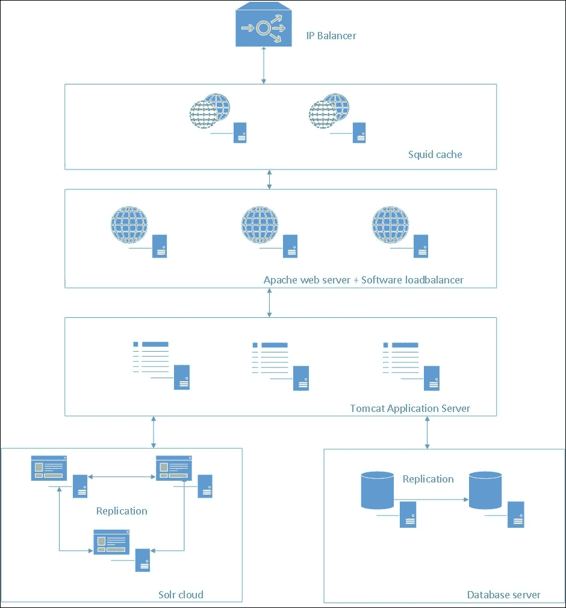

# 第十二章. 基本性能调优

在本章中，我们将涵盖以下主题：

+   可扩展基础设施

+   设置主/从配置的数据库访问

+   启用 JS 和 CSS 压缩

+   启用 CDN 主机

+   禁用未使用的 Liferay 功能

+   JVM 调优

# 简介

成功项目实现最重要的方面之一是系统性能。众所周知，当下载网页时，Web 用户经常会遇到长时间的等待。网页下载的容忍等待时间是多长？在我们看来，舒适的响应时间应该少于 2 秒。如果用户不得不等待超过 4 秒，他们通常会离开。性能问题是大数据门户或内部网中最难的主题。系统架构影响性能。拥有大量图像、电影和音频的门户网站与内部网相比应该有不同的架构，因为这些门户网站有大量用户同时登录。

幸运的是，有一些通用规则可以帮助提高 Liferay 的性能：

+   具有 HTTP 缓存代理的可扩展基础设施

+   快速数据库

+   适当的 Java 设置，例如垃圾收集器引擎或内存设置

+   包含的最小文件数量，如 JS、CSS、图像等

+   **内容分发** **网络** (**CDN**) 用于静态资源

+   Liferay 门户调优，例如禁用未使用的过滤器、更改属性等

# 可扩展基础设施

定义架构是成功安装最重要的部分。一个好的架构应该是容错性的，并且具有高可用性。为了实现这一点，有必要将所有可能的节点，如 Tomcat 节点、搜索节点等，进行集群。第二重要的是构建一个可扩展的基础设施，使我们能够添加新的节点。

## 如何做到这一点…

在这个菜谱中，我们将尝试定义参考基础设施，这可以在生产部署中使用。这种类型的基础设施在我们的项目中使用，并且运行得非常好。我们环境的主要部分包括：squid 缓存、带有`mod_jk`模块的 Apache 服务器和软件负载均衡器、Apache Tomcat 应用服务器、Solr 云和数据库服务器。以下图像显示了最重要的部分：



### Squid 缓存

我们架构的第一层是 Squid 缓存([`www.squid-cache.org/`](http://www.squid-cache.org/))。它是一个 Web 缓存代理。它支持 HTTP、HTTPS 和其他协议。它减少了发送到另一层的请求数量，尤其是发送到 Liferay 实例的请求数量。Squid 缓存读取 HTTP 头信息，并决定是否可以将特定请求缓存以及可以缓存多长时间。此选项可用于不经常更改的内容，如图像、CSS、JS 等。这种解决方案对我们的应用程序提供了明显的提升。

### Apache Web 服务器和软件负载均衡器

下一层是带有负载均衡器软件的 Apache 网络服务器实例。每个 Apache 服务器实例都与所有 Liferay 节点连接。这种连接是通过`mod_jk Tomcat-Apache`插件([`tomcat.apache.org/tomcat-3.3-doc/mod_jk-howto.html`](https://tomcat.apache.org/tomcat-3.3-doc/mod_jk-howto.html))建立的。此插件通过 AJP 协议处理 Tomcat 和 Apache 之间的通信。每个 Apache 服务器实例都有一个负载均衡器配置。最常见的负载均衡器配置使用`mod_jk`插件。配置放在`$APACHE_HOME/conf`目录下的`workers.properties`文件中。以下列表显示了`mod_jk`和负载均衡器配置的示例：

```js
worker.list=node1,node2,loadbalancer
worker.template.port=8009
worker.template.type=ajp13
worker.template.ping_mode=A
worker.template.reply_timeout=60000
worker.template.socket_connect_timeout=10000

worker.node1.reference=worker.template
worker.node1.host=<IP_ADDRESS>

worker.node2.reference=worker.template
worker.node2.host=<IP_ADDRESS>

worker.loadbalancer.type=lb
worker.loadbalancer.balance_workers=node1, node2
worker.loadbalancer.sticky_session=True
worker.loadbalancer.retries=1

```

第一行指定了一个工作者列表。在我们的例子中，有三个工作者：`node1`、`node2`和`loadbalancer`。名为`node1`和`node2`的工作者描述了与 Liferay 的连接（主机、端口和超时定义）。

粗体定义描述了负载均衡器配置。它包含一个工作者列表（`worker.loadbalancer.balance_workers`属性），并指定了请求失败时的粘性会话策略和重试次数。负载均衡器可以通过以下两种模式进行配置：

+   **粘性会话**：这会将特定会话的所有请求分配给特定的 Liferay Portal 服务器节点。

+   **会话复制**：这提供了一种会话复制的机制。从业务角度来看，这是一个非常棒的功能，因为它不受故障影响。如果一个节点失败，负载均衡器会决定将请求发送到另一个节点。用户不会看到任何区别。

从性能调优的角度来看，最佳选项是粘性会话，因为它与会话复制相比消除了许多请求。换句话说，粘性会话减少了流量并节省了资源。

### Apache Tomcat 应用服务器

这一层是应用程序的核心，因为在这一层，放置了带有我们的 Liferay Portal 实例的 Tomcat 容器。在集群环境中，正确配置 Liferay Portal 很重要，因为所有组件都必须有专门的配置，例如共享文档和媒体文件、配置对数据库的相同访问权限，以及配置缓存和搜索索引复制。

如果我们使用 Apache 的`mod_jk`模块，在每一个 Apache Tomcat 实例中设置`jvmRoute`标识符是很重要的。为此，将以下配置放在`${TOMCAT_HOME}/conf/server.xml`中：

```js
<Engine name="Catalina" defaultHost="localhost" jvmRoute="node{X}">
```

要共享文档和媒体文件，我们建议您使用 glusterFS 系统([`www.gluster.org/`](http://www.gluster.org/))，该系统在节点之间共享文档和文件。在集群环境中，配置文档和媒体文件有不同方式，我们已在上一章中描述。我们将在接下来的食谱中描述其他配置。

### 数据库服务器

数据库服务器层负责在数据库系统中存储数据。在一个大型系统中，数据库通常是主要的瓶颈之一，数据库管理员经常在性能上遇到很多问题。在我们的项目中，我们通常使用具有主/从配置的 MySQL 数据库。主数据库负责写入，而从数据库负责读取。Liferay 提供了开箱即用的机制，允许我们进行配置。我们将在接下来的菜谱中描述它们。

### Solr 搜索引擎服务器

最后一层是一个 Apache Solr 搜索引擎服务器（[`lucene.apache.org/solr/`](http://lucene.apache.org/solr/)）。Solr 具有高度可靠性、可扩展性和容错性，提供分布式索引、复制和负载均衡查询、自动故障转移和恢复、集中式配置等功能。如果我们一起安装 Apache Zookeeper ([`zookeeper.apache.org/`](https://zookeeper.apache.org/)) 和 Apache Solr，这些功能都是可以配置的。Zookeeper 是一个集中式服务，负责维护配置信息、命名并提供分布式同步和群组服务，例如 Apache Solr。因此，Apache Zookeeper 可以作为一个云解决方案安装，以消除单点故障。Zookeeper 服务器选择一个 Solr 节点，即主节点，并分配一个令牌。

## 参见

关于集群和配置环境的更多信息，请参考以下菜谱：

+   来自第六章（part0050.xhtml#aid-1FLS41 "第六章. Liferay 中的文档和媒体"）的 *与 Amazon S3 云集成* 菜单，*Liferay 中的文档和媒体*

+   来自第八章（part0059.xhtml#aid-1O8H61 "第八章. 搜索和内容展示工具"）的 *Solr 安装和配置* 菜单，*搜索和内容展示工具*

+   来自第十一章（part0080.xhtml#aid-2C9D01 "第十一章. 快速技巧和高级知识"）的 *集群 Liferay 门户和配置 Liferay 与 SMTP 服务器* 菜单

+   本章的 *设置主/从配置的数据库访问* 菜单

# 设置主/从配置的数据库访问

Liferay 允许我们配置两个不同的数据源：一个用于写入，另一个用于读取。这种配置以简单的方式允许用户分离写入和读取请求。这种类型的配置使我们能够构建可扩展和高性能的基础设施。

## 准备工作…

正如我们一开始提到的，我们专注于 Liferay 配置方面。我们的假设是您已经准备好使用具有主/从复制的数据库服务器。MySQL 官方文档在 [`dev.mysql.com/doc/refman/5.1/en/replication-configuration.html`](https://dev.mysql.com/doc/refman/5.1/en/replication-configuration.html) 中描述了如何配置复制。

## 如何操作…

为了实现我们的目标，打开 `portal-ext.properties` 并配置以下设置：

```js
jdbc.write.driverClassName=com.mysql.jdbc.Driver
jdbc.write.url=jdbc:mysql://<DB_WRITE_ADDRESS>/lportal?useUnicode=true&characterEncoding=UTF-8&useFastDateParsing=false
jdbc.write.username=<USERNAME>
jdbc.write.password=<PASSWORD>

jdbc.read.driverClassName=com.mysql.jdbc.Driver
jdbc.read.url=jdbc:mysql://<DB_READ_ADDRESS>/lportal?useUnicode=true&characterEncoding=UTF-8&useFastDateParsing=false
jdbc.read.username=<USERNAME>
jdbc.read.password=<PASSWORD>
```

下一步是启用 Spring 配置，其中包含读取/写入数据源的设置。将以下属性添加到 `portal-ext.properties` 文件中：

```js
spring.configs=\
META-INF/base-spring.xml,\
META-INF/hibernate-spring.xml,\
META-INF/infrastructure-spring.xml,\
META-INF/management-spring.xml,\
META-INF/util-spring.xml,\
META-INF/editor-spring.xml,\
META-INF/jcr-spring.xml,\
META-INF/messaging-spring.xml,\
META-INF/scheduler-spring.xml,\
META-INF/search-spring.xml,\
META-INF/counter-spring.xml,\
META-INF/document-library-spring.xml,\
META-INF/lock-spring.xml,\
META-INF/mail-spring.xml,\
META-INF/portal-spring.xml,\
META-INF/portlet-container-spring.xml,\
META-INF/wsrp-spring.xml,\
META-INF/mirage-spring.xml,\
META-INF/dynamic-data-source-spring.xml,\
#META-INF/shard-data-source-spring.xml,\
META-INF/ext-spring.xml
```

最后，重新启动您的应用程序服务器。确保数据库复制工作正常。

## 它是如何工作的...

在我们的配置中，所有写入事务都将针对 `jdbc.write.*` 数据源，而读取事务将使用 `jdbc.read.*` 数据源。为了验证此配置，请按照以下步骤操作：

1.  关闭主数据库实例 (`jdbc.write`)。

1.  运行您的 Liferay 实例。

1.  尝试浏览 Liferay Portal 并上传新内容，例如文章或文件。

1.  在 `catalina.out` 日志文件中，应该有适当的错误消息。

从技术角度来看，Liferay 扩展了 `org.springframework.aop.TargetSource` Spring 类，该类可以识别方法是否包含读取或写入操作。规则非常简单：如果服务层上的方法有 `@Transactional` 注解，则所有查询都转到写入数据源。在其他情况下，查询转到读取数据源。

## 还有更多...

一些项目使用 Liferay 与许多 Portal 实例。在这种情况下，术语“Portal 实例”意味着 Liferay 允许管理员在单个服务器上运行多个 Portal 实例。每个 Portal 实例的数据可以与其他每个 Portal 实例分开保存。这种分离可以在数据库层组织。每个数据库节点可以存储不同类型的数据，具体取决于 Portal 实例。这种分离称为数据库分片。

Portal 实例配置允许我们选择数据将存储在哪个分片。数据库分片是数据库中数据的水平分区。每个分片都存储在单独的数据库服务器实例上，以分散负载。要在 Liferay 中配置分片，请遵循以下说明：

1.  在 `portal-ext.properties` 文件中，指定一个算法，用于在创建 Portal 实例时选择新的分片。使用 `ManualShardSelector` 通过 Web 界面进行分片选择，或在其他情况下使用轮询。轮询算法在分片之间均匀分配数据。手动选择器让我们可以将每个 Liferay 实例分配到特定的分片：

    ```js
    shard.selector=com.liferay.portal.dao.shard.RoundRobinShardSelector
    #shard.selector=com.liferay.portal.dao.shard.ManualShardSelector
    ```

1.  接下来，设置您的分片数据源：

    ```js
    jdbc.default.driverClassName=com.mysql.jdbc.Driver
    jdbc.default.url=jdbc:mysql://<SERVER1>/lportal?useUnicode=true&characterEncoding=UTF-8&useFastDateParsing=false
    jdbc.default.username=<USERNAME>
    jdbc.default.password=<PASSWORD>

    jdbc.shard1.driverClassName=com.mysql.jdbc.Driver
    jdbc.shard1.url=jdbc:mysql://<SERVER2>/lportal1?useUnicode=true&characterEncoding=UTF-8&useFastDateParsing=false
    jdbc.shard1.username=<USERNAME>
    jdbc.shard1.password=<PASSWORD>

    jdbc.shard2.driverClassName=com.mysql.jdbc.Driver
    jdbc.shard2.url=jdbc:mysql://<SERVER3>/lportal2?useUnicode=true&characterEncoding=UTF-8&useFastDateParsing=false
    jdbc.shard2.username=<USERNAME>
    jdbc.shard2.password=<PASSWORD>

    shard.available.names=default,shard1,shard2
    ```

1.  最后一个是 `spring.configs` 配置，其外观应如下所示：

    ```js
    spring.configs=<DEFAULT_CONFIGURATION>,\
      META-INF/shard-data-source-spring.xml
    ```

    `<DEFAULT_CONFIGURATION>` 占位符保留所有原始的 `spring.configs` 配置，这些配置在 `portal.porperties` 文件中定义。

# 启用 JS 和 CSS 压缩

当您的网页在浏览器中加载时，浏览器会向 Web 服务器发送一个 HTTP 请求以获取 URL 中的页面。然后，随着 HTML 的传递，浏览器解析它并查找对图像、脚本、CSS 等的附加请求。每次它看到对新元素的新请求时，都会向服务器发送另一个 HTTP 请求。为了减少附加请求的数量，Liferay 有以下现成的机制：

+   允许您压缩和精简 JavaScript 和 CSS 文件的 Minifier（压缩器）

+   使用 `barebone.jsp` 和 `everything.jsp` 合并 JavaScript 文件以减少 HTTP 请求

+   合并 CSS 文件和图像以加快加载

+   启用 Gzip 压缩

## 如何操作...

要设置 Liferay 的快速加载机制，请在 `portal-ext.properties` 文件中设置以下属性：

```js
minifier.enabled=true
javascript.fast.load=true
theme.css.fast.load=true
theme.images.fast.load=true
layout.template.cache.enabled=true
```

此外，如果您使用自定义脚本，请将它们添加到 `portal-ext.properties` 文件中的 `javascript.barebone.files` 和 `javascript.everything.files` 属性。最后一步是启用 Gzip 压缩。可以通过开启以下属性来实现：

```js
com.liferay.portal.servlet.filters.gzip.GZipFilter=true
```

一个更好的选择是将此责任委托给 Apache 服务器，因为它减少了 Apache Tomcat 服务器中的请求数量。要在 Apache 服务器上启用 Gzip 压缩，打开 `${APACHE_HOME}/conf/httpd.conf` 并添加以下配置：

```js
SetOutputFilter DEFLATE
SetEnvIfNoCase Request_URI \.(?:exe|t?gz|zip|bz2|sit|rar)$ no-gzip dont-vary
SetEnvIfNoCase Request_URI \.(?:gif|jpe?g|png)$ no-gzip dont-vary
```

确保已启用 `deflate` 模块。查找以下行：

```js
LoadModule deflate_module modules/mod_deflate.so
```

## 它是如何工作的...

在这个菜谱中，我们专注于减少请求数量和减小响应大小。Liferay 将 JS 文件合并成一个文件，并存储在应用服务器的 `temp` 目录中。对于未认证用户，该文件在页面上的链接如下所示：

```js
<script src="img/barebone.jsp?browserId=other&amp;themeId=classic&amp;colorSchemeId=01&amp;minifierType=js&amp;minifierBundleId=javascript.barebone.files&amp;languageId=en_US&amp;b=6201&amp;t=1414241572000" type="text/javascript"></script>
```

对于认证用户，非常相似。而不是 `barebone.jsp`，有 `everything.jsp` 文件。

如果我们深入查看生成的 HTML 源代码，会发现带有 `minifierType=css` 参数的 CSS 文件链接。此参数启用文件精简，从而减小文件大小。

最后一个神奇的配置是 Gzip 压缩。如果我们的浏览器发送带有 `Accept-Encoding: gzip,deflate` 头部的请求，我们的系统将返回 Gzipped 内容。要测试它，从您的命令行调用以下命令：

```js
curl -I -H "Accept-Encoding: gzip,deflate" http://localhost:8080

```

在响应中，应该有 `Content-Encoding: gzip` 头部。

# 打开 CDN 主机

在之前的菜谱中，您学习了如何连接到压缩 CSS 和 JS 文件并减少对 Liferay 门户的请求数量。我们配置的下一步是减少 Liferay 所在的应用服务器的请求数量。想法是某些静态资源可以由 Apache 服务器或更好的 Squid 缓存提供。通过 Apache 服务器或 Squid 缓存而不是应用服务器提供静态资源可以提高响应时间。

Liferay 支持 CDN。维基百科将此术语定义为如下：

> *"内容分发网络（CDN）或内容分发网络（CDN）是在互联网上多个数据中心部署的大型分布式服务器系统。CDN 的目标是以高可用性和高性能向最终用户提供内容。"*

## 准备工作…

我们的构想是使用 CDN 域名来提供静态资源并将它们缓存在 Squid 缓存中。最难的部分是 Squid 配置，它缓存来自 CDN 主机的所有静态文件。在这个菜谱中，我们将假设这个配置已经完成，并且我们有一个用于资源的静态域名，例如，[`static.mysite.com`](http://static.mysite.com)

## 如何操作...

在 Liferay 中，CDN 配置非常简单。只有两个属性需要在`portal-ext.properties`中设置。这些属性如下：

```js
cdn.host.http=http://static.mysite.com
cdn.host.https=https://static.mysite.com
```

## 它是如何工作的...

CDN 配置成功后，所有静态资源都从外部域名提供。当我们查看 HTML 源代码时，我们会看到所有静态资源，如 CSS 文件、JavaScript 文件和图像，都来自在`cdn.host.http`属性中定义的不同域名。

在这个菜谱中，我们构建了我们的小型 CDN，其中我们的 Squid 缓存提供静态资源。

在庞大的系统中，当目标用户遍布全球时，使用真实的 CDN 主机是必要的，这些主机是部署在世界各地的服务器的大型网络。有几家公司提供此类服务，例如 Amazon、CloudFlare、Bootstrap CDN、CacheFly、OVH 等等。

# 禁用未使用的 Liferay 功能

每个人都知道 Liferay 是一个具有许多功能的庞大系统。这个门户的主要思想是：我们为您提供所有功能，您可以根据自己的需求进行适配。这个主题可以分为三个部分：禁用未使用的 servlet 过滤器、禁用未使用的自动登录钩子和禁用未使用的功能。

## 如何操作...

禁用未使用的过滤器可以提高性能，但您必须知道哪些过滤器可以禁用。这对初学者来说是一个难题。不幸的是，我们无法给您一个涵盖您需求的黄金法则。我们只能尝试提供一些关于可以在`portal-ext.properties`文件中关闭的过滤器的建议和信息：

+   如果您不使用 CAS 身份验证，请禁用`com.liferay.portal.servlet.filters.sso.cas.CASFilter=false`过滤器

+   如果您在 Apache 服务器上使用 Gzip 压缩，请禁用`com.liferay.portal.servlet.filters.gzip.GZipFilter=false`过滤器

+   如果您不使用 NTLM 身份验证，请禁用以下过滤器：`com.liferay.portal.servlet.filters.sso.ntlm.NtlmFilter=false` 和 `com.liferay.portal.servlet.filters.sso.ntlm.NtlmPostFilter=false`

+   如果您不使用 OpenSSO 身份验证，请禁用`com.liferay.portal.servlet.filters.sso.opensso.OpenSSOFilter=false`过滤器

+   如果您不使用 SharePoint，请禁用`com.liferay.portal.sharepoint.SharepointFilter=false`过滤器

+   如果你使用 Tomcat 服务器从输出内容中删除空白行和空格，请禁用`com.liferay.portal.servlet.filters.strip.StripFilter=false`过滤器

下一个配置是连接到身份验证系统。Liferay 支持许多单点登录系统，默认情况下已启用。从以下属性中删除未使用的`AutoLogin`钩子：

```js
auto.login.hooks=com.liferay.portal.security.auth.CASAutoLogin,\
com.liferay.portal.security.auth.FacebookAutoLogin,\
com.liferay.portal.security.auth.NtlmAutoLogin,\
com.liferay.portal.security.auth.OpenIdAutoLogin,\
com.liferay.portal.security.auth.OpenSSOAutoLogin,\
com.liferay.portal.security.auth.RememberMeAutoLogin,\
com.liferay.portal.security.auth.SiteMinderAutoLogin
```

### 小贴士

如果你禁用了`auto.login.hooks`定义，请确保在具有`com.liferay.portal.servlet.filters.sso`前缀的属性下也禁用了每个自动登录定义。例如，如果你禁用了`com.liferay.portal.security.auth.NtlmAutoLogin`，请检查`com.liferay.portal.servlet.filters.sso.ntlm.NtlmFilter`是否设置为`false`。

最后一个配置禁用了一些影响性能的功能：

+   如果你没有使用用户会话跟踪器或此功能不是必需的，请禁用：`session.tracker.memory.enabled=false`属性

+   如果你没有使用文档库文件的阅读计数，请禁用`dl.file.entry.read.count.enabled=false`属性

+   如果你没有使用文档库文件的文件排名，请禁用`dl.file.rank.enabled=false`属性

+   如果你没有使用资产视图计数器，请禁用`asset.entry.increment.view.counter.enabled=false`属性

+   如果你没有使用 pingback 和 trackback，请禁用它们：

    ```js
    blogs.pingback.enabled=false
    blogs.trackback.enabled=false
    message.boards.pingback.enabled=false
    ```

## 它是如何工作的…

Liferay 提供了一个名为`portal.properties`的文件，该文件可以被`portal-ext.properties`配置文件覆盖。`portal.properties`文件位于`portal-impl/src/`文件夹中。这是自定义 Liferay 门户和禁用不必要的选项的主要工具。每个管理员和开发人员都应该研究这个文件，并尝试使门户符合项目的需求。这是一项艰巨的工作，因为配置文件有超过 10,000 行。好消息是每个属性都有注释。

# JVM 调优

JVM 调优是一项应该在性能测试之后或在生产期间进行的操作。JVM 配置会影响 Java 应用程序的性能。有两个必要的配置：

+   内存设置（如堆配置）

+   垃圾收集器设置

关于 JVM 调优有很多出版物。因此，在这个菜谱中，我们只将提及主要方面。

## 如何操作…

每个 JVM 设置都可以在`JAVA_OPTS`（Java 环境选项）中设置。一个很好的地方是在`${TOMCAT_HOME}/bin/setenv.sh`文件中设置。

首先，让我们设置一个合适的垃圾收集器。对于门户系统来说，最佳选项是**并发收集器**或**G1**（在 Java 8 中）。这些垃圾收集器大部分工作都是并发执行的，只有很短的停顿时间。这些垃圾收集器提供了最佳的性能。典型的设置如下：

```js
JAVA_OPTS = "$JAVA_OPTS -XX:+UseParNewGC -XX:+UseConcMarkSweepGC 
-XX+CMSParallelRemarkEnabled -XX:ParallelGCThreads=8 
-XX:+CMSScavengeBeforeRemark
-XX:+CMSConcurrentMTEnabled -XX:ParallelCMSThreads=2"
```

以下设置与内存分配相关。正确配置的估计非常困难。我们的经验表明，当每个节点有 8 GB RAM 或更多时，性能最佳。我们的设置如下所示：

```js
JAVA_OPTS = "$JAVA_OPTS -server -d64 -XX:NewSize=1024m 
-XX:MaxNewSize=1024m -Xms6144m -Xmx6144m -XX:PermSize=512m 
-XX:MaxPermSize=512m -XX:SurvivorRatio=10"
```

### 小贴士

每个项目都有不同的内存特性。给定的 JVM 设置形成初始配置，应由您的 Java 工程团队进行验证。

## 它是如何工作的…

我们提到，对于门户解决方案来说，最好的垃圾回收器是并发收集器或 G1。让我们分析一下我们的`JAVA_OPTS`变量中的每个设置：

+   `+UseParNewGC`: 这将开启并行年轻代收集器。

+   `+UseConcMarkSweepGC`: 这将开启旧代的并发标记清除收集。

+   `+CMSParallelRemarkEnabled`: 这使垃圾回收器能够在 CMS remark 阶段使用多个线程。这减少了这一阶段的暂停时间。

+   `ParallelGCThreads`: 垃圾回收器并行阶段使用的线程数。它不应超过服务器上的核心（处理器）数量。

+   `+CMSScavengeBeforeRemark`: 这将强制在 CMS remark 之前进行年轻空间收集。

+   `+CMSConcurrentMTEnabled`: 这允许 CMS 在并发阶段使用多个核心。

+   `ParallelCMSThreads`: 这控制用于 CMS（并发标记清除）垃圾回收器的线程数。
