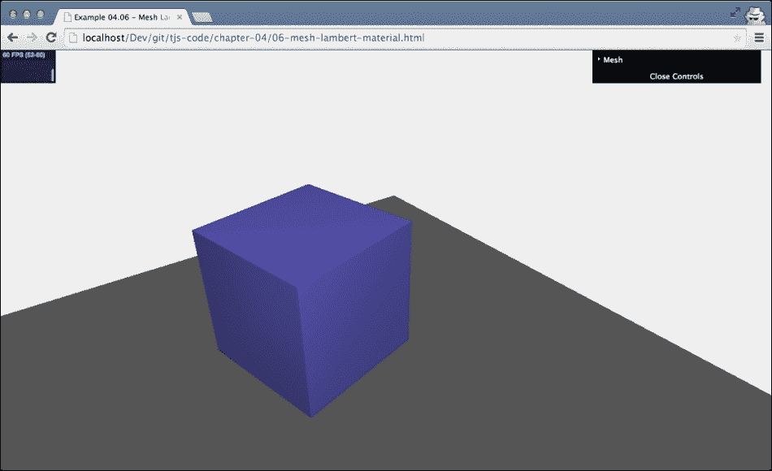

# 第四章。使用 Three.js 材质

在前面的章节中，我们简要地讨论了材质。你了解到，材质与 `THREE.Geometry` 一起构成 `THREE.Mesh`。材质就像物体的皮肤，定义了几何体的外观。例如，皮肤定义了几何体是否看起来像金属、透明，或者以线框形式显示。然后，生成的 `THREE.Mesh` 对象可以被添加到场景中，由 Three.js 进行渲染。到目前为止，我们还没有真正详细地查看材质。在本章中，我们将深入了解 Three.js 提供的所有材质，并学习如何使用这些材质创建外观良好的 3D 对象。本章我们将探讨的材质如下表所示：

| 名称 | 描述 |
| --- | --- |
| `MeshBasicMaterial` | 这是一种基本材质，你可以用它为你的几何体赋予简单的颜色或显示几何体的线框。 |
| `MeshDepthMaterial` | 这是一种使用与相机之间的距离来确定如何着色网格的材质。 |
| `MeshNormalMaterial` | 这是一种简单的材质，它根据面的法向量来决定面的颜色。 |
| `MeshFacematerial` | 这是一个容器，允许你为几何体的每个面指定一个独特的材质。 |
| `MeshLambertMaterial` | 这是一种考虑光照的材质，用于创建 *暗淡* 的非闪亮物体。 |
| `MeshPhongMaterial` | 这是一种也考虑光照的材质，可以用来创建闪亮的物体。 |
| `ShaderMaterial` | 这种材质允许你指定自己的着色器程序，以直接控制顶点的位置和像素的着色。 |
| `LineBasicMaterial` | 这是一种可以用于 `THREE.Line` 几何体以创建彩色线条的材质。 |
| `LineDashMaterial` | 这与 `LineBasicMaterial` 相同，但此材质还允许你创建虚线效果。 |

如果你浏览了 Three.js 的源代码，你可能会遇到 `THREE.RawShaderMaterial`。这是一种只能与 `THREE.BufferedGeometry` 一起使用的专用材质。这种几何体是一种优化了静态几何体（例如，顶点和面不会改变）的专用形式。我们不会在本章中探讨这种材质，但当我们谈到创建自定义着色器时，我们将在 第十一章，*自定义着色器和渲染后处理* 中使用它。在代码中，你还可以找到 `THREE.SpriteCanvasMaterial`、`THREE.SpriteMaterial` 和 `THREE.PointCloudMaterial`。这些是在样式化单个点时使用的材质。我们不会在本章中讨论这些，但将在 第七章，*粒子、精灵和点云* 中探讨它们。

材质有许多常见属性，所以在我们查看第一个材质，`MeshBasicMaterial` 之前，我们将查看所有材质共享的属性。

# 理解常见材质属性

你可以快速地看到所有材料之间共享哪些属性。Three.js 提供了一个材质基类，`THREE.Material`，其中列出了所有常见属性。我们将这些常见材质属性分为以下三个类别：

+   **基本属性**：这些是你最常使用的属性。使用这些属性，例如，你可以控制对象的透明度、是否可见以及如何引用（通过 ID 或自定义名称）。

+   **混合属性**：每个对象都有一组混合属性。这些属性定义了对象如何与其背景结合。

+   **高级属性**：有一些高级属性控制了低级 WebGL 上下文如何渲染对象。在大多数情况下，你不需要与这些属性打交道。

注意，在本章中，我们跳过了任何与纹理和贴图相关的属性。大多数材质允许你使用图像作为纹理（例如，类似木材或石头的纹理）。在第十章，*加载和使用纹理*中，我们将深入了解可用的各种纹理和贴图选项。一些材质还具有与动画相关的特定属性（蒙皮和 `morphTargets`）；我们也将跳过这些属性。这些将在第九章，*动画和移动相机*中讨论。

我们从列表中的第一个开始：基本属性。

## 基本属性

`THREE.Material` 对象的基本属性列在以下表格中（你可以在 `THREE.BasicMeshMaterial` 部分看到这些属性的实际应用）：

| 属性 | 描述 |
| --- | --- |
| `id` | 这用于识别材质，并在创建材质时分配。第一个材质从 `0` 开始，并为每个额外创建的材质增加 `1`。 |
| `uuid` | 这是一个唯一生成的 ID，并在内部使用。 |
| `name` | 你可以使用此属性给材质分配一个名称。这可以用于调试目的。 |
| `opacity` | 这定义了对象的透明度。请与 `transparent` 属性一起使用。此属性的取值范围从 `0` 到 `1`。 |
| `transparent` | 如果设置为 `true`，Three.js 将使用设置的透明度渲染此对象。如果设置为 `false`，对象将不会透明——只是颜色更浅。如果你使用了一个使用 alpha（透明度）通道的纹理，此属性也应设置为 `true`。 |
| `overdraw` | 当你使用 `THREE.CanvasRenderer` 时，多边形将被渲染得略大一些。当你使用此渲染器看到间隙时，请将此设置为 `true`。 |
| `visible` | 这定义了此材料是否可见。如果你将其设置为`false`，你将不会在场景中看到该对象。 |
| `Side` | 使用此属性，你可以定义材料应用于几何形状的哪一侧。默认是`THREE.Frontside`，它将材料应用于对象的正面（外部）。你也可以将其设置为`THREE.BackSide`，将其应用于背面（内部），或`THREE.DoubleSide`，将其应用于两侧。 |
| `needsUpdate` | 对于材料的某些更新，你需要告诉 Three.js 该材料已更改。如果此属性设置为`true`，Three.js 将使用新的材料属性更新其缓存。 |

对于每种材料，你还可以设置多个混合属性。

## 混合属性

材料有几个通用的与混合相关的属性。混合决定了我们渲染的颜色如何与它们后面的颜色交互。当我们讨论组合材料时，我们会稍微涉及这个主题。混合属性列在以下表格中：

| 名称 | 描述 |
| --- | --- |
| `blending` | 这确定此对象上的材料如何与背景混合。正常模式是`THREE.NormalBlending`，它只显示顶层。 |
| `blendsrc` | 除了使用标准混合模式外，你还可以通过设置`blendsrc`、`blenddst`和`blendequation`来创建自定义混合模式。此属性定义了如何将此对象（源）混合到背景（目标）。默认的`THREE.SrcAlphaFactor`设置使用 alpha（透明度）通道进行混合。 |
| `blenddst` | 此属性定义了在混合中如何使用背景（目标），默认为`THREE.OneMinusSrcAlphaFactor`，这意味着此属性也使用源 alpha 通道进行混合，但使用`1`（源的 alpha 通道）作为值。 |
| `blendequation` | 这定义了如何使用`blendsrc`和`blenddst`值。默认是相加（`AddEquation`）。通过这三个属性，你可以创建自己的自定义混合模式。 |

最后一批属性主要用于内部，并控制 WebGL 渲染场景的具体细节。

## 高级属性

我们不会深入探讨这些属性的细节。这些属性与 WebGL 内部工作方式有关。如果你确实想了解更多关于这些属性的信息，OpenGL 规范是一个好的起点。你可以在此规范中找到[`www.khronos.org/registry/gles/specs/2.0/es_full_spec_2.0.25.pdf`](http://www.khronos.org/registry/gles/specs/2.0/es_full_spec_2.0.25.pdf)。以下表格提供了这些高级属性的简要描述：

| 名称 | 描述 |
| --- | --- |
| `depthTest` | 这是一个高级 WebGL 属性。使用此属性，您可以选择启用或禁用 `GL_DEPTH_TEST` 参数。此参数控制是否使用像素的 *深度* 来确定新像素的值。通常，您不需要更改此参数。更多信息可以在我们之前提到的 OpenGL 规范中找到。 |
| `depthWrite` | 这是另一个内部属性。此属性可以用来确定此材质是否影响 WebGL 深度缓冲区。如果您使用一个对象作为 2D 浮层（例如，一个中心点），您应该将此属性设置为 `false`。不过，通常您不需要更改此属性。 |
| `polygonOffset`、`polygonOffsetFactor` 和 `polygonOffsetUnits` | 使用这些属性，您可以控制 `POLYGON_OFFSET_FILL` WebGL 功能。这些属性通常不需要。有关它们详细功能的解释，您可以查看 OpenGL 规范。 |
| `alphatest` | 此值可以设置为特定值（`0` 到 `1`）。每当一个像素的 alpha 值小于此值时，它将不会被绘制。您可以使用此属性来移除一些与透明度相关的伪影。 |

现在，让我们查看所有可用的材质，以便您可以看到这些属性对渲染输出的影响。

# 从一个简单的网格开始

在本节中，我们将探讨一些简单的材质：`MeshBasicMaterial`、`MeshDepthMaterial`、`MeshNormalMaterial` 和 `MeshFaceMaterial`。我们首先从 `MeshBasicMaterial` 开始。

在我们查看这些材质的属性之前，这里有一个关于如何传递属性以配置材质的快速说明。有两种选项：

+   您可以将参数对象作为构造函数的参数传递，如下所示：

    ```js
    var material = new THREE.MeshBasicMaterial(
    {
      color: 0xff0000, name: 'material-1', opacity: 0.5, transparency: true, ...
    });
    ```

+   或者，您也可以创建一个实例并单独设置属性，如下所示：

    ```js
    var material = new THREE.MeshBasicMaterial();
    material.color = new THREE.Color(0xff0000);
    material.name = 'material-1';
    material.opacity = 0.5;
    material.transparency = true;
    ```

通常，如果我们知道创建材质时所有属性的值，使用构造函数是最好的方式。这两种风格中使用的参数格式相同。唯一的例外是 `color` 属性。在第一种风格中，我们可以直接传递十六进制值，Three.js 将自己创建一个 `THREE.Color` 对象。在第二种风格中，我们必须显式创建一个 `THREE.Color` 对象。在本书中，我们将使用这两种风格。

## THREE.MeshBasicMaterial

`MeshBasicMaterial` 是一个非常简单的材质，它不考虑场景中可用的灯光。使用此材质的网格将被渲染为简单的、平面的多边形，并且您还可以选择显示几何体的线框。除了我们在本材料早期部分看到的常见属性外，我们还可以设置以下属性：

| 名称 | 描述 |
| --- | --- |
| `color` | 此属性允许您设置材质的颜色。 |
| `wireframe` | 这允许您将材质渲染为线框。这对于调试目的非常有用。 |
| `Wireframelinewidth` | 如果您启用了线框，此属性定义线框中线的宽度。 |
| `Wireframelinecap` | 此属性定义在线框模式中线条的末端看起来如何。可能的值有 `butt`、`round` 和 `square`。默认值是 `round`。在实际应用中，更改此属性的结果很难看到。此属性在 `WebGLRenderer` 上不受支持。 |
| `wireframeLinejoin` | 这定义了如何可视化线条接合处。可能的值有 `round`、`bevel` 和 `miter`。默认值是 `round`。如果您非常仔细地看，您可以在使用低 `opacity` 和非常大的 `wireframeLinewidth` 值的示例中看到这一点。此属性在 `WebGLRenderer` 上不受支持。 |
| `Shading` | 这定义了如何应用阴影。可能的值有 `THREE.SmoothShading`、`THREE.NoShading` 和 `THREE.FlatShading`。默认值是 `THREE.SmoothShading`，这会导致一个平滑的对象，您不会看到单个面。此属性在此材质的示例中未启用。例如，请参阅 `MeshNormalMaterial` 的部分。 |
| `vertexColors` | 您可以使用此属性为每个顶点定义单独的颜色。默认值是 `THREE.NoColors`。如果您将此值设置为 `THREE.VertexColors`，渲染器将考虑 `THREE.Geometry` 的颜色属性上设置的颜色。此属性在 `CanvasRenderer` 上不起作用，但在 `WebGLRenderer` 上起作用。查看 `LineBasicMaterial` 示例，我们使用此属性为线条的各个部分着色。您还可以使用此属性为此材质类型创建渐变效果。 |
| `fog` | 此属性确定此材质是否受全局雾设置的影响。此效果在动作中未显示，但如果将其设置为 `false`，我们在第二章中看到的全局雾*构成 Three.js 场景的基本组件*不会影响此对象的渲染。 |

在前面的章节中，我们看到了如何创建材质并将它们分配给对象。对于 `THREE.MeshBasicMaterial`，我们这样做：

```js
var meshMaterial = new THREE.MeshBasicMaterial({color: 0x7777ff});
```

这将创建一个新的 `THREE.MeshBasicMaterial` 并将 `color` 属性初始化为 `0x7777ff`（这是紫色）。

我添加了一个示例，您可以使用它来尝试 `THREE.MeshBasicMaterial` 的属性和我们在上一节中讨论的基本属性。如果您打开 `chapter-04` 文件夹中的 `01-basic-mesh-material.html` 示例，您将看到一个旋转的立方体，就像以下截图所示：


这是一个非常简单的对象。通过右上角的菜单，你可以玩转其属性并选择不同的网格（你还可以更改渲染器）。例如，一个具有`opacity`为`0.2`、`transparent`设置为`true`、`wireframe`设置为`true`、`wireframeLinewidth`为`9`，并使用`CanvasRenderer`渲染出来的效果如下：


在这个例子中，你可以设置的属性之一是`side`属性。使用这个属性，你定义材质应用于`THREE.Geometry`的哪一侧。当你选择平面网格时，你可以测试这个属性的工作方式。由于通常材质只应用于材质的前面，旋转的平面将有一半的时间是不可见的（当你看到它的背面时）。如果你将`side`属性设置为`double`，则平面将始终可见，因为材质应用于几何体的两侧。不过，请注意，当`side`属性设置为`double`时，渲染器需要做更多的工作，这可能会影响场景的性能。

## THREE.MeshDepthMaterial

列表中的下一个材质是`THREE.MeshDepthMaterial`。使用这种材质，对象的视觉效果不是由灯光或特定的材质属性定义的；它是由对象到摄像机的距离定义的。你可以结合其他材质，轻松创建渐变效果。这种材质只有以下两个相关属性，用于控制是否显示线框：

| 名称 | 描述 |
| --- | --- |
| `wireframe` | 这决定了是否显示线框。 |
| `wireframeLineWidth` | 这决定了线框的宽度。 |

为了演示这一点，我们修改了第二章，*构成 Three.js 场景的基本组件*（`chapter-04`文件夹中的`02-depth-material`）中的立方体示例。记住，你必须点击**addCube**按钮来填充场景。以下截图显示了修改后的示例：


尽管这种材质没有很多额外的属性来控制对象的渲染方式，我们仍然可以控制对象颜色淡出的速度。在这个例子中，我们暴露了摄像机的`near`和`far`属性。你可能还记得第二章，*构成 Three.js 场景的基本组件*，通过这两个属性，我们设置了摄像机的可见区域。任何比`near`属性更靠近摄像机的对象都不会显示，任何比`far`属性更远的对象也超出了摄像机的可见区域。

照相机 `near` 和 `far` 属性之间的距离定义了亮度以及物体淡出的速率。如果距离非常大，物体在远离照相机时只会稍微淡出。如果距离很小，淡出将会更加明显（如下面的截图所示）：


创建 `THREE.MeshDepthMaterial` 非常简单，该对象不需要任何参数。在这个例子中，我们使用了 `scene.overrideMaterial` 属性来确保场景中的所有对象都使用这种材料，而无需为每个 `THREE.Mesh` 对象显式指定它：

```js
var scene = new THREE.Scene();
scene.overrideMaterial = new THREE.MeshDepthMaterial();
```

本章的下一部分并不是真的关于某种特定的材料，而是展示了你可以将多个材料组合在一起的方法。

## 材料组合

如果你回顾一下 `THREE.MeshDepthMaterial` 的属性，你可以看到没有选项可以设置立方体的颜色。所有的事情都是由材料的默认属性为你决定的。然而，Three.js 提供了将材料组合在一起以创建新效果的选择（这也是混合模式发挥作用的地方）。以下代码显示了如何将材料组合在一起：

```js
var cubeMaterial = new THREE.MeshDepthMaterial();
var colorMaterial = new THREE.MeshBasicMaterial({color: 0x00ff00, transparent: true, blending: THREE.MultiplyBlending})
var cube = new THREE.SceneUtils.createMultiMaterialObject(cubeGeometry, [colorMaterial, cubeMaterial]);
cube.children[1].scale.set(0.99, 0.99, 0.99);
```

我们得到了以下使用 `THREE.MeshDepthMaterial` 的亮度和 `THREE.MeshBasicMaterial` 的颜色的绿色立方体（打开 `03-combined-material.html` 以查看此示例）。以下截图显示了示例：


让我们看看你需要采取哪些步骤来获得这个具体的结果。

首先，我们需要创建我们的两种材料。对于 `THREE.MeshDepthMaterial`，我们不做任何特殊处理；然而，对于 `THREE.MeshBasicMaterial`，我们设置 `transparent` 为 `true` 并定义一个 `blending` 模式。如果我们不将 `transparent` 属性设置为 `true`，那么我们只会得到实心的绿色物体，因为 Three.js 不会知道要考虑已经渲染的颜色。当 `transparent` 设置为 `true` 时，Three.js 将检查 `blending` 属性以查看绿色 `THREE.MeshBasicMaterial` 对象应该如何与背景交互。在这个例子中，背景是使用 `THREE.MeshDepthMaterial` 渲染的立方体。在 第九章，*动画和移动相机* 中，我们将更详细地讨论可用的各种混合模式。

尽管如此，在这个例子中，我们使用了 `THREE.MultiplyBlending`。这种混合模式将前景色与背景色相乘，从而得到所需的效果。这段代码片段中的最后一行也是很重要的一行。当我们使用 `THREE.SceneUtils.createMultiMaterialObject()` 函数创建网格时会发生什么，几何体被复制，并返回两个完全相同的网格组。如果我们不使用最后一行渲染这些网格，你应该会看到一个闪烁的效果。这种情况有时会在一个物体渲染在另一个物体之上，并且其中一个物体是透明的时候发生。通过缩小使用 `THREE.MeshDepthMaterial` 创建的网格，我们可以避免这种情况。要做到这一点，请使用以下代码：

```js
cube.children[1].scale.set(0.99, 0.99, 0.99);
```

下一个材质也是我们不会对渲染中使用的颜色产生任何影响的一种材质。

## THREE.MeshNormalMaterial

理解这种材质如何渲染的最简单方法是通过先查看一个示例。打开 `chapter-04` 文件夹中的 `04-mesh-normal-material.html` 示例。如果你选择球体作为网格，你会看到如下内容：


如您所见，网格的每个面都以略不同的颜色渲染，即使球体旋转，颜色也基本保持在同一位置。这是因为每个面的颜色基于从面指向外的 *法线*。这个法线是与面垂直的向量。法线向量在 Three.js 的许多不同部分中使用。它用于确定光反射，帮助将纹理映射到 3D 模型，并提供了有关如何在表面上光照、阴影和着色的信息。幸运的是，尽管如此，Three.js 处理这些向量的计算并在内部使用它们，所以你不必自己计算它们。以下截图显示了 `THREE.SphereGeometry` 的所有法线向量：


这个法线指向的方向决定了当你使用 `THREE.MeshNormalMaterial` 时，面得到的颜色。由于球体上所有面的法线指向不同的方向，所以我们得到了在示例中可以看到的多彩球体。作为一个快速的小贴士，要添加这些法线箭头，你可以像这样使用 `THREE.ArrowHelper`：

```js
for (var f = 0, fl = sphere.geometry.faces.length; f < fl; f++) {
  var face = sphere.geometry.faces[ f ];
  var centroid = new THREE.Vector3(0, 0, 0);
  centroid.add(sphere.geometry.vertices[face.a]);
  centroid.add(sphere.geometry.vertices[face.b]);
  centroid.add(sphere.geometry.vertices[face.c]);
  centroid.divideScalar(3);

  var arrow = new THREE.ArrowHelper(face.normal, centroid, 2, 0x3333FF, 0.5, 0.5);
  sphere.add(arrow);
}
```

在这个代码片段中，我们遍历 `THREE.SphereGeometry` 的所有面。对于这些 `THREE.Face3` 对象中的每一个，我们通过将构成这个面的顶点相加并除以 3 来计算中心（质心）。我们使用这个质心，以及面的法线向量，来绘制箭头。`THREE.ArrowHelper` 接受以下参数：`direction`、`origin`、`length`、`color`、`headLength` 和 `headWidth`。

你还可以在 `THREE.MeshNormalMaterial` 上设置一些其他属性：

| 名称 | 描述 |
| --- | --- |
| `wireframe` | 这确定是否显示线框。 |
| `wireframeLineWidth` | 这决定了线框的宽度。 |
| `shading` | 这配置了以 `THREE.FlatShading` 的平面着色和 `THREE.SmoothShading` 的平滑着色形式进行的着色。 |

我们已经看到了 `wireframe` 和 `wireframeLinewidth`，但在我们的 `THREE.MeshBasicMaterial` 示例中跳过了 `shading` 属性。使用 `shading` 属性，我们可以告诉 Three.js 如何渲染我们的对象。如果你使用 `THREE.FlatShading`，每个面将按原样渲染（如前几个截图所示），或者你可以使用 `THREE.SmoothShading`，这将平滑我们的对象的面。例如，如果我们使用 `THREE.SmoothShading` 渲染球体，结果看起来就像这样：


我们几乎完成了简单的材料。最后一个材料是 `THREE.MeshFaceMaterial`。

## THREE.MeshFaceMaterial

基本材料中的最后一个实际上并不是一种材料，而更多的是其他材料的容器。`THREE.MeshFaceMaterial` 允许你为你的几何形状的每个面分配不同的材料。例如，如果你有一个立方体，它有 12 个面（记住，Three.js 只与三角形一起工作），你可以使用这种材料为立方体的每个侧面分配不同的材料（例如，使用不同的颜色）。使用这种材料非常简单，正如你从下面的代码片段中可以看到：

```js
var matArray = [];
matArray.push(new THREE.MeshBasicMaterial( { color: 0x009e60 }));
matArray.push(new THREE.MeshBasicMaterial( { color: 0x009e60 }));
matArray.push(new THREE.MeshBasicMaterial( { color: 0x0051ba }));
matArray.push(new THREE.MeshBasicMaterial( { color: 0x0051ba }));
matArray.push(new THREE.MeshBasicMaterial( { color: 0xffd500 }));
matArray.push(new THREE.MeshBasicMaterial( { color: 0xffd500 }));
matArray.push(new THREE.MeshBasicMaterial( { color: 0xff5800 }));
matArray.push(new THREE.MeshBasicMaterial( { color: 0xff5800 }));
matArray.push(new THREE.MeshBasicMaterial( { color: 0xC41E3A }));
matArray.push(new THREE.MeshBasicMaterial( { color: 0xC41E3A }));
matArray.push(new THREE.MeshBasicMaterial( { color: 0xffffff }));
matArray.push(new THREE.MeshBasicMaterial( { color: 0xffffff }));

var faceMaterial = new THREE.MeshFaceMaterial(matArray);

var cubeGeom = new THREE.BoxGeometry(3,3,3);
var cube = new THREE.Mesh(cubeGeom, faceMaterial);
```

我们首先创建一个名为 `matArray` 的数组来存储所有材料。接下来，我们创建一个新的材料，在这个例子中是 `THREE.MeshBasicMaterial`，并为每个面分配不同的颜色。使用这个数组，我们实例化 `THREE.MeshFaceMaterial` 并与立方体几何形状一起使用，以创建网格。让我们更深入地看看代码，看看你需要做什么来重新创建以下示例：一个简单的 3D 魔方。你可以在 `05-mesh-face-material.html` 中找到这个示例。以下截图显示了此示例：


这个魔方由许多小立方体组成：沿着 *x* 轴有三个立方体，沿着 *y* 轴有三个，沿着 *z* 轴也有三个。以下是它是如何实现的：

```js
var group = new THREE.Mesh();
// add all the rubik cube elements
var mats = [];
mats.push(new THREE.MeshBasicMaterial({ color: 0x009e60 }));
mats.push(new THREE.MeshBasicMaterial({ color: 0x009e60 }));
mats.push(new THREE.MeshBasicMaterial({ color: 0x0051ba }));
mats.push(new THREE.MeshBasicMaterial({ color: 0x0051ba }));
mats.push(new THREE.MeshBasicMaterial({ color: 0xffd500 }));
mats.push(new THREE.MeshBasicMaterial({ color: 0xffd500 }));
mats.push(new THREE.MeshBasicMaterial({ color: 0xff5800 }));
mats.push(new THREE.MeshBasicMaterial({ color: 0xff5800 }));
mats.push(new THREE.MeshBasicMaterial({ color: 0xC41E3A }));
mats.push(new THREE.MeshBasicMaterial({ color: 0xC41E3A }));
mats.push(new THREE.MeshBasicMaterial({ color: 0xffffff }));
mats.push(new THREE.MeshBasicMaterial({ color: 0xffffff }));

var faceMaterial = new THREE.MeshFaceMaterial(mats);

for (var x = 0; x < 3; x++) {
  for (var y = 0; y < 3; y++) {
    for (var z = 0; z < 3; z++) {
      var cubeGeom = new THREE.BoxGeometry(2.9, 2.9, 2.9);
      var cube = new THREE.Mesh(cubeGeom, faceMaterial);
      cube.position.set(x * 3 - 3, y * 3, z * 3 - 3);

      group.add(cube);
    }
  }
}
```

在这段代码中，我们首先创建 `THREE.Mesh`，它将包含所有单个立方体（`group`）；接下来，我们为每个面创建材质并将它们推送到 `mats` 数组。记住，立方体的每个侧面由两个面组成，因此我们需要 12 种材质。从这些材质中，我们创建 `THREE.MeshFaceMaterial`。然后，我们创建三个循环以确保创建正确数量的立方体。在这个循环中，我们创建每个单个立方体，分配材质，定位它们，并将它们添加到组中。你应该记住的是，立方体的位置相对于这个组的位置。如果我们移动或旋转组，所有立方体都会随着它移动和旋转。有关如何使用组的更多信息，请参阅第八章，*创建和加载高级网格和几何体*。

如果你已经在浏览器中打开了示例，你可以看到整个魔方旋转，而不是单个立方体。这是因为我们在渲染循环中使用以下内容：

```js
group.rotation.y=step+=0.01;
```

这会导致整个组围绕其中心（0,0,0）旋转。当我们定位单个立方体时，我们确保它们围绕这个中心点定位。这就是为什么你会在前述代码的 `cube.position.set(x * 3 - 3, y * 3, z * 3 - 3);` 行中看到 -3 偏移。

### 小贴士

如果你查看这段代码，可能会想知道 Three.js 是如何确定用于特定面的材质的。为此，Three.js 使用 `materialIndex` 属性，你可以在 `geometry.faces` 数组的每个单独的面上设置该属性。该属性指向我们在 `THREE.FaceMaterial` 对象的构造函数中添加的材质的数组索引。当你使用标准 Three.js 几何体创建几何体时，Three.js 提供了合理的默认值。如果你想有其他行为，你只需为每个面设置 `materialIndex` 属性，使其指向提供的材质之一。

`THREE.MeshFaceMaterial` 是我们基本材质中的最后一个。在下一节中，我们将探讨 Three.js 中一些更高级的材质。

# 高级材质

在本节中，我们将探讨 Three.js 提供的更高级的材质。我们首先将探讨 `THREE.MeshPhongMaterial` 和 `THREE.MeshLambertMaterial`。这两种材质对光源做出反应，可以分别用于创建闪亮的和看起来暗淡的材质。在本节中，我们还将探讨一种最通用但最难使用的材质：`THREE.ShaderMaterial`。使用 `THREE.ShaderMaterial`，你可以创建自己的着色器程序，以定义材质和对象应该如何显示。

## THREE.MeshLambertMaterial

这种材料可以用来创建看起来平淡无光、不反光的表面。这是一种非常易于使用的材料，能够对场景中的光源做出反应。这种材料可以配置我们之前见过的多种属性：`颜色`、`不透明度`、`阴影`、`混合`、`深度测试`、`深度写入`、`线框`、`线框线宽`、`线框线帽`、`线框线连接`、`顶点颜色`和`雾效`。我们不会深入探讨这些属性的细节，但会专注于与这种材料相关的特定属性。这仅剩下以下四个属性：

| 名称 | 描述 |
| --- | --- |
| `ambient` | 这是材料的*环境色*。这与我们在上一章中看到的环境光一起工作。此颜色与提供的环境光颜色相乘。默认为白色。 |
| `emissive` | 这是这种材料发出的颜色。它并不真正作为光源，但这是一个不受其他光照影响的实色。默认为黑色。 |
| `wrapAround` | 如果此属性设置为`true`，则启用半朗伯光照技术。在半朗伯光照中，光的衰减更为微妙。如果你有一个具有刺眼、黑暗区域的网格，启用此属性将使阴影变柔和，并更均匀地分布光线。 |
| `wrapRGB` | 当`wrapAround`设置为 true 时，你可以使用`THREE.Vector3`来控制光衰减的速度。 |

这种材料就像所有其他材料一样创建。下面是如何做到的：

```js
var meshMaterial = new THREE.MeshLambertMaterial({color: 0x7777ff});
```

以下是一个这种材料的示例，请查看`06-mesh-lambert-material.html`。以下屏幕截图显示了此示例：



如您在前面的屏幕截图中所见，这种材料看起来相当平淡。我们还可以使用另一种材料来创建具有光泽的表面。

## THREE.MeshPhongMaterial

使用`THREE.MeshPhongMaterial`，我们可以创建一个具有光泽的材料。你可以使用的属性基本上与非光泽的`THREE.MeshLambertMaterial`对象相同。我们再次跳过基本属性和已经讨论过的属性：`颜色`、`不透明度`、`阴影`、`混合`、`深度测试`、`深度写入`、`线框`、`线框线宽`、`线框线帽`、`线框线连接`和`顶点颜色`。

这种材料的有趣属性如下表所示：

| 名称 | 描述 |
| --- | --- |
| `ambient` | 这是材料的*环境色*。这与我们在上一章中看到的环境光一起工作。此颜色与提供的环境光颜色相乘。默认为白色。 |
| `emissive` | 这是这种材料发出的颜色。它并不真正作为光源，但这是一个不受其他光照影响的实色。默认为黑色。 |
| `specular` | 这个属性定义了材质的光泽度和它以什么颜色发光。如果这个设置与 `color` 属性的颜色相同，你会得到一个看起来更金属的材质。如果设置为灰色，则结果是一个看起来更像塑料的材质。 |
| `shininess` | 这个属性定义了镜面高光的光泽度。光泽度的默认值是 `30`。 |
| `metal` | 当这个属性设置为 `true` 时，Three.js 会使用一种稍微不同的方式来计算像素的颜色，使对象看起来更像金属。请注意，这种效果非常微弱。 |
| `wrapAround` | 如果这个属性设置为 `true`，你将启用半朗伯光照技术。使用半朗伯光照，光线的衰减更加微妙。如果你有一个具有刺眼、暗淡区域的网格，启用此属性将使阴影变柔和，并更均匀地分布光线。 |
| `wrapRGB` | 当 `wrapAround` 设置为 `true` 时，你可以使用 `THREE.Vector3` 来控制光线衰减的速度。 |

初始化 `THREE.MeshPhongMaterial` 对象的方式与我们之前看到的所有其他材质相同，如下代码所示：

```js
var meshMaterial = new THREE.MeshPhongMaterial({color: 0x7777ff});
```

为了提供最佳的对比，我们为这种材质创建了一个与 `THREE.MeshLambertMaterial` 相同的例子。你可以使用控制 GUI 来玩转这种材质。例如，以下设置创建了一个看起来像塑料的材质。你可以在 `07-mesh-phong-material.html` 中找到这个例子。以下截图显示了此示例：


我们将要探索的最后一个高级材质是 `THREE.ShaderMaterial`。

## 使用 THREE.ShaderMaterial 创建自己的着色器

`THREE.ShaderMaterial` 是 Three.js 中最灵活和复杂的材质之一。使用这种材质，你可以传递自己的自定义着色器，这些着色器将在 WebGL 上下文中直接运行。着色器将 Three.js 的 JavaScript 网格转换为屏幕上的像素。使用这些自定义着色器，你可以精确地定义你的对象应该如何渲染，以及如何覆盖或修改 Three.js 的默认设置。在本节中，我们不会深入介绍如何编写自定义着色器的细节。有关更多信息，请参阅第十一章，*自定义着色器和渲染后处理*。现在，我们只看一个非常基础的例子，展示如何配置这种材质。

`THREE.ShaderMaterial` 有许多你可以设置的属性，我们之前已经见过。使用 `THREE.ShaderMaterial`，Three.js 会传递所有关于这些属性的信息，但你仍然需要在你的着色器程序中处理这些信息。以下是我们已经见过的 `THREE.ShaderMaterial` 的属性：

| 名称 | 描述 |
| --- | --- |
| `wireframe` | 这会将材质渲染为线框。这对于调试目的非常有用。 |
| `Wireframelinewidth` | 如果你启用了线框，这个属性定义了线框线的宽度。 |
| `linewidth` | 这定义了要绘制的线的宽度。 |
| `Shading` | 这定义了着色是如何应用的。可能的值是`THREE.SmoothShading`和`THREE.FlatShading`。这个属性在这个材质的示例中未启用。例如，看看`MeshNormalMaterial`部分。 |
| `vertexColors` | 你可以使用这个属性为每个顶点定义单独的颜色。这个属性在`CanvasRenderer`上不起作用，但在`WebGLRenderer`上起作用。看看`LineBasicMaterial`示例，我们使用这个属性来为线的各个部分着色。 |
| `fog` | 这决定了这个材质是否受全局雾设置的影响。这没有在动作中显示。如果设置为 `false`，我们在第二章中看到的全局雾*构成 Three.js 场景的基本组件*不会影响这个对象的渲染。 |

除了传递给着色器的这些属性之外，`THREE.ShaderMaterial`还提供了一些特定的属性，你可以使用它们将额外的信息传递到你的自定义着色器中（它们目前可能看起来有点晦涩；更多详情请见第十一章，*自定义着色器和渲染后处理*），如下所示：

| 名称 | 描述 |
| --- | --- |
| `fragmentShader` | 这个着色器定义了传入的每个像素的颜色。在这里，你需要传入你的片段着色器程序的字符串值。 |
| `vertexShader` | 这个着色器允许你改变传入的每个顶点的位置。在这里，你需要传入你的顶点着色器程序的字符串值。 |
| `uniforms` | 这允许你将信息发送到你的着色器。相同的信息被发送到每个顶点和片段。 |
| `defines` | 转换为`#define`代码片段。使用这些片段，你可以在着色器程序中设置一些额外的全局变量。 |
| `attributes` | 这些可以在每个顶点和片段之间改变。它们通常用于传递位置和法线相关的数据。如果你想使用这个，你需要为几何体的所有顶点提供信息。 |
| `lights` | 这决定了是否应该将光数据传递到着色器中。默认为`false`。 |

在我们查看示例之前，我们将简要解释`ShaderMaterial`最重要的部分。要使用这个材质，我们必须传入两个不同的着色器：

+   `vertexShader`：这个着色器在几何体的每个顶点上运行。你可以使用这个着色器通过移动顶点的位置来变换几何体。

+   `fragmentShader`：这个着色器在几何体的每个片段上运行。在`vertexShader`中，我们返回应该显示在这个特定片段上的颜色。

对于本章中我们讨论的所有材料，Three.js 提供了 `fragmentShader` 和 `vertexShader`，所以你不必担心这些。

对于本节，我们将查看一个简单的示例，该示例使用一个非常简单的 `vertexShader` 程序来改变立方体的顶点 *x*、*y* 和 *z* 坐标，以及一个使用来自 [`glslsandbox.com/`](http://glslsandbox.com/) 的着色器创建动画材料的 `fragmentShader` 程序。

接下来，你可以看到我们将使用的 `vertexShader` 的完整代码。请注意，编写着色器不是在 JavaScript 中完成的。你使用一种类似于 C 的语言编写着色器，称为 **GLSL**（WebGL 支持 OpenGL ES 着色语言 1.0——有关 GLSL 的更多信息，请参阅 [`www.khronos.org/webgl/`](https://www.khronos.org/webgl/)），如下所示：

```js
<script id="vertex-shader" type="x-shader/x-vertex">
  uniform float time;

  void main()
  {
    vec3 posChanged = position;
    posChanged.x = posChanged.x*(abs(sin(time*1.0)));
    posChanged.y = posChanged.y*(abs(cos(time*1.0)));
    posChanged.z = posChanged.z*(abs(sin(time*1.0)));

    gl_Position = projectionMatrix * modelViewMatrix * vec4(posChanged,1.0);
  }
</script>
```

我们在这里不会过多地深入细节，只是关注这段代码中最重要的一部分。要与着色器从 JavaScript 进行通信，我们使用一种称为 uniforms 的东西。在本例中，我们使用 `uniform float time;` 语句传入一个外部值。基于这个值，我们改变传入的顶点（作为位置变量传入）的 *x*、*y* 和 *z* 坐标：

```js
vec3 posChanged = position;
posChanged.x = posChanged.x*(abs(sin(time*1.0)));
posChanged.y = posChanged.y*(abs(cos(time*1.0)));
posChanged.z = posChanged.z*(abs(sin(time*1.0)));
```

`posChanged` 向量现在包含基于传入的时间变量的这个顶点的新的坐标。我们需要执行的最后一个步骤是将这个新位置返回到 Three.js，这通常是这样做的：

```js
gl_Position = projectionMatrix * modelViewMatrix * vec4(posChanged,1.0);
```

`gl_Position` 变量是一个特殊变量，用于返回最终位置。接下来，我们需要创建 `shaderMaterial` 并传入 `vertexShader`。为此，我们创建了一个简单的辅助函数，其用法如下：`var meshMaterial1 = createMaterial("vertex-shader","fragment-shader-1");` 在以下代码中：

```js
function createMaterial(vertexShader, fragmentShader) {
  var vertShader = document.getElementById(vertexShader).innerHTML;
  var fragShader = document.getElementById(fragmentShader).innerHTML;

  var attributes = {};
  var uniforms = {
    time: {type: 'f', value: 0.2},
    scale: {type: 'f', value: 0.2},
    alpha: {type: 'f', value: 0.6},
    resolution: { type: "v2", value: new THREE.Vector2() }
  };

  uniforms.resolution.value.x = window.innerWidth;
  uniforms.resolution.value.y = window.innerHeight;

  var meshMaterial = new THREE.ShaderMaterial({
    uniforms: uniforms,
    attributes: attributes,
    vertexShader: vertShader,
    fragmentShader: fragShader,
    transparent: true

  });
  return meshMaterial;
}
```

参数指向 HTML 页面中 `script` 元素的 ID。在这里，你还可以看到我们设置了 uniforms 变量。这个变量用于将信息从我们的渲染器传递到我们的着色器。本例的完整渲染循环如下代码片段所示：

```js
function render() {
  stats.update();

  cube.rotation.y = step += 0.01;
  cube.rotation.x = step;
  cube.rotation.z = step;

  cube.material.materials.forEach(function (e) {
    e.uniforms.time.value += 0.01;
  });

  // render using requestAnimationFrame
  requestAnimationFrame(render);
  renderer.render(scene, camera);
}
```

你可以看到，每次渲染循环运行时，我们都会将时间变量增加 0.01。这个信息被传递到 `vertexShader` 中，用于计算我们立方体顶点的新位置。现在打开 `08-shader-material.html` 示例，你会看到立方体围绕其轴收缩和膨胀。以下截图给出了这个示例的静态图像：


在这个示例中，你可以看到立方体的每个面都有一个动画图案。分配给立方体每个面的片段着色器创建了这些图案。正如你可能猜到的，我们使用了 `THREE.MeshFaceMaterial`（以及我们之前解释的 `createMaterial` 函数）来完成这个任务：

```js
var cubeGeometry = new THREE.CubeGeometry(20, 20, 20);

var meshMaterial1 = createMaterial("vertex-shader", "fragment-shader-1");
var meshMaterial2 = createMaterial("vertex-shader", "fragment-shader-2");
var meshMaterial3 = createMaterial("vertex-shader", "fragment-shader-3");
var meshMaterial4 = createMaterial("vertex-shader", "fragment-shader-4");
var meshMaterial5 = createMaterial("vertex-shader", "fragment-shader-5");
var meshMaterial6 = createMaterial("vertex-shader", "fragment-shader-6");

var material = new THREE.MeshFaceMaterial([meshMaterial1, meshMaterial2, meshMaterial3, meshMaterial4, meshMaterial5, meshMaterial6]);

var cube = new THREE.Mesh(cubeGeometry, material);
```

我们尚未解释的部分是关于`fragmentShader`。在这个例子中，所有的`fragmentShader`对象都是从[`glslsandbox.com/`](http://glslsandbox.com/)复制的。该网站提供了一个实验性的游乐场，你可以在这里编写和分享`fragmentShader`对象。我不会在这里详细介绍，但这个例子中使用的`fragment-shader-6`看起来是这样的：

```js
<script id="fragment-shader-6" type="x-shader/x-fragment">
  #ifdef GL_ES
  precision mediump float;
  #endif

  uniform float time;
  uniform vec2 resolution;

  void main( void )
  {

    vec2 uPos = ( gl_FragCoord.xy / resolution.xy );

    uPos.x -= 1.0;
    uPos.y -= 0.5;

    vec3 color = vec3(0.0);
    float vertColor = 2.0;
    for( float i = 0.0; i < 15.0; ++i ) {
      float t = time * (0.9);

      uPos.y += sin( uPos.x*i + t+i/2.0 ) * 0.1;
      float fTemp = abs(1.0 / uPos.y / 100.0);
      vertColor += fTemp;
      color += vec3( fTemp*(10.0-i)/10.0, fTemp*i/10.0, pow(fTemp,1.5)*1.5 );
    }

    vec4 color_final = vec4(color, 1.0);
    gl_FragColor = color_final;
  }
</script>
```

最终传递给 Three.js 的颜色是使用`gl_FragColor = color_final`设置的。要更好地理解`fragmentShader`，一个不错的方法是探索[`glslsandbox.com/`](http://glslsandbox.com/)上可用的内容，并使用该代码为你的对象编写代码。在我们转向下一组材料之前，这里有一个使用自定义`vertexShader`程序（[`www.shadertoy.com/view/4dXGR4`](https://www.shadertoy.com/view/4dXGR4)）的例子：


关于片段和顶点着色器的更多内容可以在第十一章 *自定义着色器和渲染后处理*中找到。

# 可用于线几何形状的材料

我们将要查看的最后几种材料只能用于一个特定的几何形状：`THREE.Line`。正如其名所示，这仅仅是一条由顶点组成而没有面的线。Three.js 提供了两种可以在线上使用的不同材料，如下所示：

+   `THREE.LineBasicMaterial`：线的基材允许你设置`colors`、`linewidth`、`linecap`和`linejoin`属性

+   `THREE.LineDashedMaterial`：这与`THREE.LineBasicMaterial`具有相同的属性，但允许你通过指定划线和间距大小来创建*划线*效果

我们将从基本变体开始，然后查看划线变体。

## THREE.LineBasicMaterial

可用于`THREE.Line`几何形状的材料非常简单。以下表格显示了此材料可用的属性：

| 名称 | 描述 |
| --- | --- |
| `color` | 这决定了线的颜色。如果你指定了`vertexColors`，则忽略此属性。 |
| `linewidth` | 这决定了线的宽度。 |
| `linecap` | 此属性定义了在线框模式下线的末端看起来如何。可能的值是`butt`、`round`和`square`。默认值是`round`。实际上，改变此属性的结果很难看到。此属性在`WebGLRenderer`上不受支持。 |
| `linejoin` | 定义如何可视化线接头。可能的值是`round`、`bevel`和`miter`。默认值是`round`。如果你非常仔细地看，你可以在使用低`opacity`和非常大的`wireframeLinewidth`的示例中看到这一点。此属性在`WebGLRenderer`上不受支持。 |
| `vertexColors` | 你可以通过将此属性设置为`THREE.VertexColors`值来为每个顶点提供特定的颜色。 |
| `fog` | 这决定了此对象是否受全局雾属性的影响。 |

在我们查看 `LineBasicMaterial` 的示例之前，让我们先快速看一下如何从一组顶点创建一个 `THREE.Line` 网格，并将其与 `LineMaterial` 结合起来创建网格，如下面的代码所示：

```js
var points = gosper(4, 60);
var lines = new THREE.Geometry();
var colors = [];
var i = 0;
points.forEach(function (e) {
  lines.vertices.push(new THREE.Vector3(e.x, e.z, e.y));
  colors[ i ] = new THREE.Color(0xffffff);
  colors[ i ].setHSL(e.x / 100 + 0.5, (  e.y * 20 ) / 300, 0.8);
  i++;
});

lines.colors = colors;
var material = new THREE.LineBasicMaterial({
  opacity: 1.0,
  linewidth: 1,
  vertexColors: THREE.VertexColors });

var line = new THREE.Line(lines, material);
```

此代码片段的第一部分，`var points = gosper(4, 60);`，用作示例以获取一组 *x* 和 *y* 坐标。此函数返回一个 Gosper 曲线（更多信息，请参阅 [`en.wikipedia.org/wiki/Gosper_curve`](http://en.wikipedia.org/wiki/Gosper_curve)），这是一个简单的算法，用于填充 2D 空间。我们接下来要做的是创建一个 `THREE.Geometry` 实例，并为每个坐标创建一个新的顶点，然后将它推入此实例的线条属性中。对于每个坐标，我们还计算一个颜色值，我们使用它来设置 `colors` 属性。

### 小贴士

在此示例中，我们使用 `setHSL()` 方法设置了颜色。与提供红色、绿色和蓝色的值不同，使用 HSL，我们提供色调、饱和度和亮度。使用 HSL 比使用 RGB 更直观，并且更容易创建匹配的颜色集。CSS 规范中可以找到关于 HSL 的非常好的解释：[`www.w3.org/TR/2003/CR-css3-color-20030514/#hsl-color`](http://www.w3.org/TR/2003/CR-css3-color-20030514/#hsl-color)。

现在我们有了我们的几何形状，我们可以创建 `THREE.LineBasicMaterial` 并与几何形状一起使用来创建一个 `THREE.Line` 网格。您可以在 `09-line-material.html` 示例中看到结果。以下截图显示了此示例：


在本章中我们将讨论的下一个和最后一个材料与 `THREE.LineBasicMaterial` 只略有不同。使用 `THREE.LineDashedMaterial`，我们不仅可以着色线条，还可以添加 *虚线* 效果。

## THREE.LineDashedMaterial

此材料具有与 `THREE.LineBasicMaterial` 相同的属性，以及两个您可以用来定义虚线宽度和虚线之间间隙宽度的附加属性，如下所示：

| 名称 | 描述 |
| --- | --- |
| `scale` | 这会缩放 `dashSize` 和 `gapSize`。如果缩放小于 `1`，则 `dashSize` 和 `gapSize` 增加，如果缩放大于 `1`，则 `dashSize` 和 `gapSize` 减少。 |
| `dashSize` | 这是虚线的尺寸。 |
| `gapSize` | 这是间隙的尺寸。 |

此材料几乎与 `THREE.LineBasicMaterial` 完全相同。以下是它的工作方式：

```js
lines.computeLineDistances();
var material = new THREE.LineDashedMaterial({ vertexColors: true, color: 0xffffff, dashSize: 10, gapSize: 1, scale: 0.1 });
```

唯一的区别是您必须调用 `computeLineDistances()`（用于确定构成线的顶点之间的距离）。如果您不这样做，间隙将不会正确显示。此材料的示例可以在 `10-line-material-dashed.html` 中找到，如下面的截图所示：


# 摘要

Three.js 提供了许多你可以用来为几何形状添加材质的资源。这些材质从非常简单的 `(THREE.MeshBasicMaterial)` 到复杂的 `(THREE.ShaderMaterial)`，其中你可以提供自己的 `vertexShader` 和 `fragmentShader` 程序。材质共享许多基本属性。如果你知道如何使用一种材质，你很可能也知道如何使用其他材质。请注意，并非所有材质都会对场景中的灯光做出反应。如果你想使用考虑光照效果的材质，请使用 `THREE.MeshPhongMaterial` 或 `THREE.MeshLamberMaterial`。仅从代码中确定某些材质属性的效果是非常困难的。通常，一个好的方法是使用 dat.GUI 方法来实验这些属性。

此外，请记住，大多数材质的属性都可以在运行时修改。但有些属性（例如，`side`）则不能在运行时修改。如果你更改这样的值，你需要将 `needsUpdate` 属性设置为 `true`。有关可以在运行时更改和不能更改的完整概述，请参阅以下页面：[`github.com/mrdoob/three.js/wiki/Updates`](https://github.com/mrdoob/three.js/wiki/Updates)。

在本章和上一章中，我们讨论了几何形状。我们在示例中使用了这些形状，并探索了其中的一些。在下一章，你将了解有关几何形状的所有知识以及如何与它们一起工作。
