# 第五章。学习使用几何体

在前面的章节中，你学习了如何使用 Three.js。你知道如何创建基本场景、添加光照以及配置网格的材料。在第二章中，*构成 Three.js 场景的基本组件*，我们提到了，但并没有深入探讨 Three.js 提供的可用几何体以及你可以用来创建 3D 对象的几何体。在本章和下一章中，我们将带你了解 Three.js 提供的所有几何体（除了我们在上一章讨论的 `THREE.Line`），我们将详细介绍这些几何体。在本章中，我们将查看以下几何体：

+   `THREE.CircleGeometry`

+   `THREE.RingGeometry`

+   `THREE.PlaneGeometry`

+   `THREE.ShapeGeometry`

+   `THREE.BoxGeometry`

+   `THREE.SphereGeometry`

+   `THREE.CylinderGeometry`

+   `THREE.TorusGeometry`

+   `THREE.TorusKnotGeometry`

+   `THREE.PolyhedronGeometry`

+   `THREE.IcosahedronGeometry`

+   `THREE.OctahedronGeometry`

+   `THREE.TetraHedronGeometry`

+   `THREE.DodecahedronGeometry`

在下一章中，我们将探讨以下复杂几何体：

+   `THREE.ConvexGeometry`

+   `THREE.LatheGeometry`

+   `THREE.ExtrudeGeometry`

+   `THREE.TubeGeometry`

+   `THREE.ParametricGeometry`

+   `THREE.TextGeometry`

因此，让我们看看 Three.js 提供的所有基本几何体。

# Three.js 提供的基本几何体

在 Three.js 中，我们有一些几何体可以生成二维网格，还有更多几何体可以创建三维网格。在本节中，我们将首先查看二维几何体：`THREE.CircleGeometry`、`THREE.RingGeometry`、`THREE.PlaneGeometry` 和 `THREE.ShapeGeometry`。之后，我们将探索所有可用的基本三维几何体。

## 二维几何体

二维对象看起来像平面对象，正如其名所示，只有两个维度。列表中的第一个二维几何体是 `THREE.PlaneGeometry`。

### THREE.PlaneGeometry

可以使用 `PlaneGeometry` 对象创建一个非常简单的二维矩形。关于这个几何体的例子，请查看本章源代码中的 `01-basic-2d-geometries-plane.html`。使用 `PlaneGeometry` 创建的矩形如下截图所示：

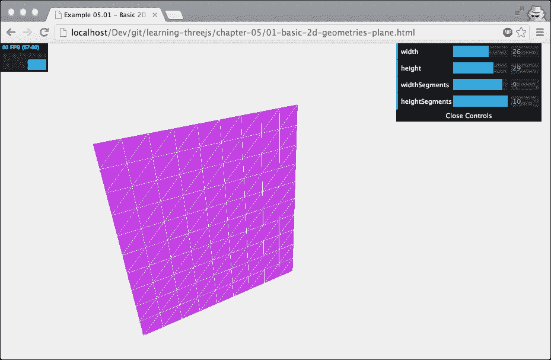

创建这种几何体非常简单，如下所示：

```js
new THREE.PlaneGeometry(width, height,widthSegments,heightSegments);
```

在这个 `THREE.PlaneGeometry` 的例子中，你可以更改这些属性，并直接看到它对生成的 3D 对象产生的影响。以下表格展示了这些属性的说明：

| 属性 | 必需 | 描述 |
| --- | --- | --- |
| `width` | 是 | 这是矩形的宽度。 |
| `height` | 是 | 这是矩形的长度。 |
| `widthSegments` | 否 | 这是宽度应该分割成多少段。默认为 `1`。 |
| `heightSegments` | 否 | 这是高度应该分割成多少段。默认值是 `1`。 |

如你所见，这并不是一个非常复杂的几何体。你只需指定大小，就完成了。如果你想创建更多面（例如，当你想创建棋盘图案时），你可以使用 `widthSegments` 和 `heightSegments` 属性将几何体分割成更小的面。

在我们继续下一个几何体之前，这里有一个关于本例中使用的材质的快速说明，以及我们在本章其他大多数示例中也使用的材质。我们使用以下方法根据几何体创建网格：

```js
function createMesh(geometry) {

  // assign two materials
  var meshMaterial = new THREE.MeshNormalMaterial();
  meshMaterial.side = THREE.DoubleSide;
  var wireframeMaterial = new THREE.MeshBasicMaterial();
  wireFrameMaterial.wireframe = true;

  // create a multimaterial
  var mesh = THREE.SceneUtils.createMultiMaterialObject(geometry,[meshMaterial,wireframeMaterial]);
  return mesh;
}
```

在这个函数中，我们根据提供的网格创建一个多材质网格。第一个使用的材质是 `THREE.MeshNormalMaterial`。正如你在上一章中学到的，`THREE.MeshNormalMaterial` 根据其法向量（面的方向）创建彩色面。我们还设置了这种材质为双面（`THREE.DoubleSide`）。如果我们不这样做，当这个对象的背面朝向相机时，我们就看不到这个对象。除了 `THREE.MeshNormalMaterial` 之外，我们还添加了 `THREE.MeshBasicMaterial`，并启用了线框属性。这样，我们就可以很好地看到对象的 3D 形状和为特定几何体创建的面。

### 小贴士

如果你想在创建几何体之后访问其属性，你不能只是说 `plane.width`。要访问几何体的属性，你必须使用对象的 `parameters` 属性。因此，要获取本节中创建的 `plane` 对象的 `width` 属性，你必须使用 `plane.parameters.width`。

### THREE.CircleGeometry

你可能已经能猜到 `THREE.CircleGeometry` 会创建什么了。使用这种几何体，你可以创建一个非常简单的二维圆（或部分圆）。让我们首先看看这个几何体的示例，`02-basic-2d-geometries-circle.html`。在下面的屏幕截图中，你可以找到一个示例，其中我们使用 `THREE.CircleGeometry` 并将 `thetaLength` 值设置为小于 `2 * PI`：

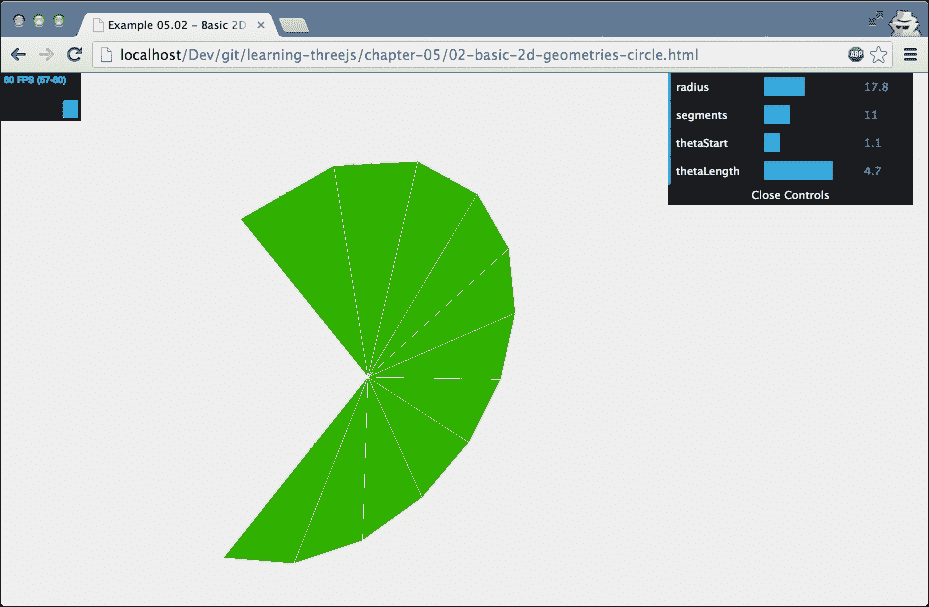

注意，`2 * PI` 代表一个完整的圆，以弧度为单位。如果你更愿意用度而不是弧度来工作，它们之间的转换非常简单。以下两个函数可以帮助你将弧度和度之间进行转换，如下所示：

```js
function deg2rad(degrees) {
  return degrees * Math.PI / 180;
}

function rad2deg(radians) {
  return radians * 180 / Math.PI;
}
```

在这个示例中，你可以看到并控制使用 `THREE.CircleGeometry` 创建的网格。当你创建 `THREE.CircleGeometry` 时，你可以指定一些属性来定义圆的外观，如下所示：

| 属性 | 必需 | 描述 |
| --- | --- | --- |
| `radius` | 否 | 圆的半径定义了它的大小。半径是从圆心到其边缘的距离。默认值是 `50`。 |
| `segments` | 否 | 此属性定义了用于创建圆的面数。最小值为 `3`，如果未指定，则默认为 `8`。值越大，圆越平滑。 |
| `thetaStart` | 否 | 此属性定义从哪个位置开始绘制圆。此值范围从 `0` 到 `2 * PI`，默认值为 `0`。 |
| `thetaLength` | 否 | 此属性定义圆完成到什么程度。未指定时默认为 `2 * PI`（一个完整的圆）。例如，如果您为此值指定 `0.5 * PI`，则将得到四分之一的圆。使用此属性与 `thetaStart` 属性一起定义圆的形状。 |

您可以使用以下代码片段创建一个完整的圆：

```js
new THREE.CircleGeometry(3, 12);
```

如果您想从该几何体创建半个圆，您可以使用类似以下的内容：

```js
new THREE.CircleGeometry(3, 12, 0, Math.PI);
```

在继续下一个几何体之前，简要说明 Three.js 在创建这些二维形状（`THREE.PlaneGeometry`、`THREE.CircleGeometry` 和 `THREE.ShapeGeometry`）时使用的方向：Three.js 将这些对象创建为“站立”状态，因此它们沿 *x*-*y* 平面排列。这对于二维形状来说是非常合理的。然而，通常，特别是使用 `THREE.PlaneGeometry` 时，您可能希望网格在地面（`x`-`z` 平面）上水平放置——一种可以放置其他物体的地面区域。要创建一个水平而不是垂直的二维对象，最简单的方法是将网格绕其 *x* 轴旋转四分之一圈（`-PI/2`），如下所示：

```js
mesh.rotation.x =- Math.PI/2;
```

关于 `THREE.CircleGeometry` 的介绍就到这里。下一个几何体，`THREE.RingGeometry`，看起来与 `THREE.CircleGeometry` 非常相似。

### THREE.RingGeometry

使用 `THREE.RingGeometry`，您可以创建一个二维对象，它不仅与 `THREE.CircleGeometry` 非常相似，而且还允许您定义中心孔（见 `03-basic-3d-geometries-ring.html`）：

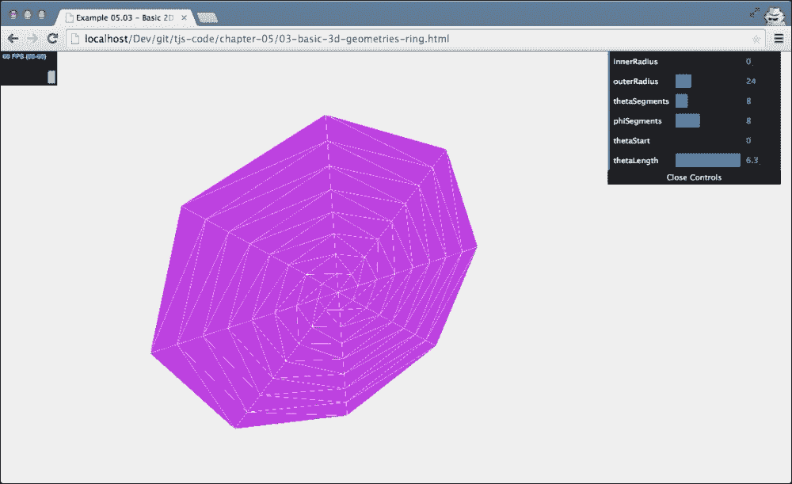

`THREE.RingGeometry` 没有任何必需的属性（请参阅下表中的默认值），因此要创建此几何体，您只需指定以下内容：

```js
Var ring = new THREE.RingGeometry();
```

您可以通过将以下参数传递给构造函数来进一步自定义环状几何体的外观：

| 属性 | 必选 | 描述 |
| --- | --- | --- |
| `innerRadius` | 否 | 圆的内半径定义了中心孔的大小。如果此属性设置为 `0`，则不会显示孔。默认值为 `0`。 |
| `outerRadius` | 否 | 圆的外半径定义了其大小。半径是从圆心到其边缘的距离。默认值为 `50`。 |
| `thetaSegments` | 否 | 这是指用于创建圆的斜边段数。值越大，圆环越平滑。默认值为 `8`。 |
| `phiSegments` | 否 | 这是指定用于环长度的段落数量。默认值是 `8`。这实际上并不影响圆的平滑度，但会增加面的数量。 |
| `thetaStart` | 否 | 这定义了开始绘制圆的位置。这个值可以从 `0` 到 `2 * PI`，默认值是 `0`。 |
| `thetaLength` | 否 | 这定义了圆完成的范围。如果没有指定，默认值为 `2 * PI`（一个完整的圆）。例如，如果你为这个值指定 `0.5 * PI`，你将得到一个四分之一的圆。使用这个属性与 `thetaStart` 属性一起定义圆的形状。 |

在下一节中，我们将查看二维形状中的最后一个：`THREE.ShapeGeometry`。

### THREE.ShapeGeometry

`THREE.PlaneGeometry` 和 `THREE.CircleGeometry` 在自定义外观方面有限。如果你想创建自定义的二维形状，你可以使用 `THREE.ShapeGeometry`。使用 `THREE.ShapeGeometry`，你可以调用一些函数来创建自己的形状。你可以将这个功能与也适用于 HTML canvas 元素和 SVG 的 `<path>` 元素功能进行比较。让我们从一个例子开始，然后我们将向你展示如何使用各种函数来绘制你自己的形状。`04-basic-2d-geometries-shape.html` 示例可以在本章的源代码中找到。以下截图显示了此示例：

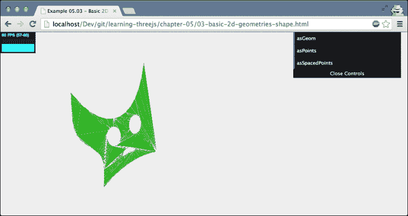

在这个例子中，你可以看到一个自定义创建的二维形状。在进入属性描述之前，首先让我们看看创建这个形状所使用的代码。在我们创建 `THREE.ShapeGeometry` 之前，我们首先必须创建 `THREE.Shape`。你可以通过查看之前的截图来追踪这些步骤，我们从右下角开始。以下是创建 `THREE.Shape` 的方法：

```js
function drawShape() {
  // create a basic shape
  var shape = new THREE.Shape();

  // startpoint
  shape.moveTo(10, 10);

  // straight line upwards
  shape.lineTo(10, 40);

  // the top of the figure, curve to the right
  shape.bezierCurveTo(15, 25, 25, 25, 30, 40);

  // spline back down
  shape.splineThru(
    [new THREE.Vector2(32, 30),
      new THREE.Vector2(28, 20),
      new THREE.Vector2(30, 10),
    ])

  // curve at the bottom
  shape.quadraticCurveTo(20, 15, 10, 10);

  // add 'eye' hole one
  var hole1 = new THREE.Path();
  hole1.absellipse(16, 24, 2, 3, 0, Math.PI * 2, true);
  shape.holes.push(hole1);

  // add 'eye hole 2'
  var hole2 = new THREE.Path();
  hole2.absellipse(23, 24, 2, 3, 0, Math.PI * 2, true);
  shape.holes.push(hole2);

  // add 'mouth'
  var hole3 = new THREE.Path();
  hole3.absarc(20, 16, 2, 0, Math.PI, true);
  shape.holes.push(hole3);

  // return the shape
  return shape;
}
```

在这段代码中，你可以看到我们使用线条、曲线和样条曲线创建了这个形状的轮廓。之后，我们使用 `THREE.Shape` 的 `holes` 属性在这个形状上打了许多孔。然而，在本节中，我们讨论的是 `THREE.ShapeGeometry` 而不是 `THREE.Shape`。要从 `THREE.Shape` 创建一个几何体，我们需要将 `THREE.Shape`（在我们的例子中由 `drawShape()` 函数返回）作为参数传递给 `THREE.ShapeGeometry`，如下所示：

```js
new THREE.ShapeGeometry(drawShape());
```

这个函数的结果是一个可以用来创建网格的几何体。当你已经有一个形状时，还有另一种创建 `THREE.ShapeGeometry` 的方法。你可以调用 `shape.makeGeometry(options)`，这将返回一个 `THREE.ShapeGeometry` 实例（有关选项的解释，请参阅下一表）。

让我们先看看你可以传递给 `THREE.ShapeGeometry` 的参数：

| 属性 | 必需 | 描述 |
| --- | --- | --- |
| `shapes` | Yes | 这些是用于创建 `THREE.Geometry` 的一或多个 `THREE.Shape` 对象。您可以传入单个 `THREE.Shape` 对象或 `THREE.Shape` 对象的数组。 |

| `options` | No | 您也可以传递一些应用于所有通过 `shapes` 参数传入的形状的 `options`。这些选项的解释如下：

+   `curveSegments`：此属性确定从形状创建的曲线的平滑度。默认值为 `12`。

+   `material`：这是用于为指定的形状创建的面的 `materialIndex` 属性。当您与该几何体一起使用 `THREE.MeshFaceMaterial` 时，`materialIndex` 属性确定传入的材料中哪一个用于传入的形状的面。

+   `UVGenerator`：当您使用材质与纹理一起使用时，UV 映射确定用于特定面的纹理的哪个部分。使用 `UVGenerator` 属性，您可以传递自己的对象，该对象将为为传入的形状创建的面的 UV 设置。有关 UV 设置的更多信息，请参阅第十章 Chapter 10，*加载和使用纹理*。如果没有指定，则使用 `THREE.ExtrudeGeometry.WorldUVGenerator`。

|

`THREE.ShapeGeometry` 最重要的部分是 `THREE.Shape`，您使用它来创建形状，因此让我们看看您可以使用哪些绘图函数来创建 `THREE.Shape`（请注意，这些实际上是 `THREE.Path` 对象的函数，`THREE.Shape` 是从它扩展出来的）：

| 名称 | 描述 |
| --- | --- |
| `moveTo(x,y)` | 将绘图位置移动到指定的 *x* 和 *y* 坐标。 |
| `lineTo(x,y)` | 从当前位置（例如，由 `moveTo` 函数设置）绘制到提供的 *x* 和 *y* 坐标。 |
| `quadraticCurveTo(aCPx, aCPy, x, y)` | 您可以使用两种不同的方式来指定曲线。您可以使用这个 `quadraticCurveTo` 函数，或者使用 `bezierCurveTo` 函数（见下表下一行）。这两个函数之间的区别在于您如何指定曲线的曲率。以下图解释了这两种选项的区别：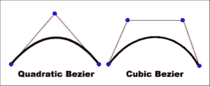对于二次曲线，我们需要指定一个额外的点（使用 `aCPx` 和 `aCPy` 参数），曲线完全基于这一点，当然还有指定的终点（来自 *x* 和 *y* 参数）。对于三次曲线（由 `bezierCurveTo` 函数使用），您指定两个额外的点来定义曲线。起点是路径的当前位置。 |
| `bezierCurveTo(aCPx1, aCPy1, aCPx2, aCPy2, x, y)` | 此函数根据提供的参数绘制曲线。有关解释，请参阅之前的表条目。曲线是根据定义曲线的两个坐标（`aCPx1`、`aCPy1`、`aCPx2` 和 `aCPy2`）以及终点坐标（*x* 和 *y*）绘制的。起点是路径的当前位置。 |
| `splineThru(pts)` | 此函数通过提供的坐标集（`pts`）绘制一条流畅的线。此参数应是一个 `THREE.Vector2` 对象的数组。起点是路径的当前位置。 |
| `arc(aX, aY, aRadius, aStartAngle, aEndAngle, aClockwise)` | 这绘制一个圆（或圆的一部分）。圆从路径的当前位置开始。在这里，`aX` 和 `aY` 被用作当前位置的偏移量。请注意，`aRadius` 设置圆的大小，而 `aStartAngle` 和 `aEndAngle` 定义绘制圆的哪一部分。布尔属性 `aClockwise` 决定圆是顺时针绘制还是逆时针绘制。 |
| `absArc(aX, aY, aRadius, aStartAngle, aEndAngle, AClockwise)` | 请参阅 `arc` 的描述。位置是绝对的，而不是相对于当前位置。 |
| `ellipse(aX, aY, xRadius, yRadius, aStartAngle, aEndAngle, aClockwise)` | 请参阅 `arc` 的描述。作为补充，使用 `ellipse` 函数，我们可以分别设置 *x* 半径和 *y* 半径。 |
| `absEllipse(aX, aY, xRadius, yRadius, aStartAngle, aEndAngle, aClockwise)` | 请参阅 `ellipse` 的描述。位置是绝对的，而不是相对于当前位置。 |
| `fromPoints(vectors)` | 如果您向此函数传递一个 `THREE.Vector2`（或 `THREE.Vector3`）对象的数组，Three.js 将使用提供的向量创建一个路径。 |
| `holes` | `holes` 属性包含一个 `THREE.Shape` 对象的数组。数组中的每个对象都作为孔渲染。一个很好的例子是我们在这个部分开头看到的例子。在那个代码片段中，我们向这个数组添加了三个 `THREE.Shape` 对象。一个用于左眼，一个用于右眼，还有一个用于我们主要的 `THREE.Shape` 对象的嘴巴。 |

在这个例子中，我们使用新的构造函数 `THREE.ShapeGeometry(drawShape()))` 从 `THREE.Shape` 对象创建了 `THREE.ShapeGeometry`。`THREE.Shape` 对象本身也有一些辅助函数，您可以使用它们来创建几何体。它们如下所示：

| 名称 | 描述 |
| --- | --- |
| `makeGeometry(options)` | 此函数从 `THREE.Shape` 返回 `THREE.ShapeGeometry`。有关可用选项的更多信息，请参阅我们之前讨论的 `THREE.ShapeGeometry` 属性。 |
| `createPointsGeometry(divisions)` | 此函数将形状转换为点集。`divisions` 属性定义返回多少个点。如果此值更高，则返回更多点，并且生成的线更平滑。这些分割分别应用于路径的每一部分。 |
| `createSpacedPointsGeometry(divisions)` | 即使这也将形状转换成一组点，但这次，一次性将分割应用于完整路径。 |

当你创建一组点时，使用 `createPointsGeometry` 或 `createSpacedPointsGeometry`；你可以使用创建的点来绘制线条，如下所示：

```js
new THREE.Line( shape.createPointsGeometry(10), new THREE.LineBasicMaterial( { color: 0xff3333, linewidth: 2 } ) );
```

当你在示例中点击 **asPoints** 或 **asSpacedPoints** 按钮，你会看到如下内容：

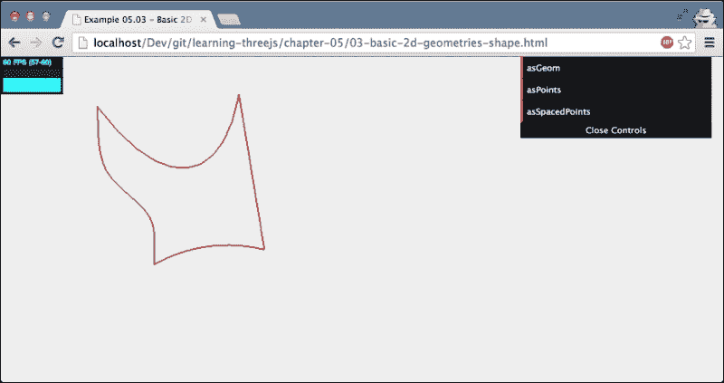

两个维度的形状就介绍到这里。下一部分将展示并解释基本的三维形状。

## 三维几何

在本节关于基本三维几何的介绍中，我们将从我们已经见过几次的几何体开始：`THREE.BoxGeometry`。

### THREE.BoxGeometry

`THREE.BoxGeometry` 是一个非常简单的 3D 几何体，允许你通过指定其宽度、高度和深度来创建一个立方体。我们添加了一个示例，`05-basic-3d-geometries-cube.html`，你可以在这里对这些属性进行操作。以下截图显示了此几何体：

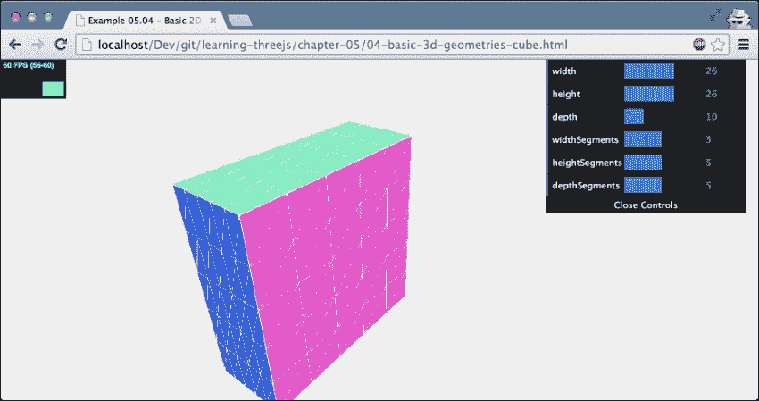

如此例所示，通过改变 `THREE.BoxGeometry` 的 `width`、`height` 和 `depth` 属性，你可以控制生成的网格的大小。当你创建一个新的立方体时，这三个属性也是必须的，如下所示：

```js
new THREE.BoxGeometry(10,10,10);
```

在示例中，你还可以看到一些其他可以在立方体上定义的属性。以下表格解释了所有属性：

| 属性 | 必需 | 描述 |
| --- | --- | --- |
| `Width` | 是 | 这是立方体的宽度。这是立方体顶点沿 *x* 轴的长度。 |
| `height` | 是 | 这是立方体的高度。这是立方体顶点沿 *y* 轴的长度。 |
| `depth` | 是 | 这是立方体的深度。这是立方体顶点沿 *z* 轴的长度。 |
| `widthSegments` | 否 | 这是我们沿着立方体的 *x* 轴将面分割成多少段。默认值是 `1`。 |
| `heightSegments` | 否 | 这是我们沿着立方体的 *y* 轴将面分割成多少段。默认值是 `1`。 |
| `depthSegments` | 否 | 这是我们沿着立方体的 *z* 轴将面分割成多少段。默认值是 `1`。 |

通过增加各种分段属性，你可以将立方体的六个主要面分割成更小的面。如果你想在立方体的某些部分使用 `THREE.MeshFaceMaterial` 设置特定的材质属性，这很有用。`THREE.BoxGeometry` 是一个非常简单的几何体。另一个简单的几何体是 `THREE.SphereGeometry`。

### THREE.SphereGeometry

使用 `SphereGeometry`，你可以创建一个三维球体。让我们直接进入示例，`06-basic-3d-geometries-sphere.html`：

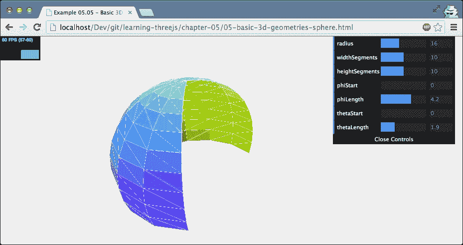

在前面的截图中，我们向您展示了基于 `THREE.SphereGeometry` 创建的半开放球体。这种几何形状非常灵活，可以用来创建各种与球体相关的几何形状。然而，一个基本的 `THREE.SphereGeometry` 可以像这样轻松创建：`new THREE.SphereGeometry()`。以下属性可以用来调整最终网格的外观：

| 属性 | 必需 | 描述 |
| --- | --- | --- |
| `radius` | 否 | 这用于设置球体的半径。这定义了最终网格的大小。默认值是 `50`。 |
| `widthSegments` | 否 | 这是指垂直方向上要使用的分段数。分段数越多，表面越平滑。默认值是 `8`，最小值是 `3`。 |
| `heightSegments` | 否 | 这是指水平方向上要使用的分段数。分段数越多，球体的表面越平滑。默认值是 `6`，最小值是 `2`。 |
| `phiStart` | 否 | 这决定了在球体的 *x* 轴上开始绘制球体的位置。这可以从 `0` 到 `2 * PI` 变化，默认值是 `0`。 |
| `phiLength` | 否 | 这决定了球体从 `phiStart` 起绘制的距离。`2 * PI` 将绘制一个完整的球体，而 `0.5 * PI` 将绘制一个开放的四分之一球体。默认值是 `2 * PI`。 |
| `thetaStart` | 否 | 这决定了在球体的 *x* 轴上开始绘制球体的位置。这可以从 `0` 到 `PI` 变化，默认值是 `0`。 |
| `thetaLength` | 否 | 这决定了球体从 `phiStart` 起绘制的距离。`PI` 值表示一个完整的球体，而 `0.5 * PI` 将只绘制球体的上半部分。默认值是 `PI`。 |

`radius`、`widthSegments` 和 `heightSegments` 属性应该是清晰的。我们已经在其他示例中看到了这些类型的属性。`phiStart`、`phiLength`、`thetaStart` 和 `thetaLength` 属性没有查看示例可能难以理解。幸运的是，您可以从 `06-basic-3d-geometries-sphere.html` 示例中的菜单中实验这些属性，并创建如这些有趣的几何形状：

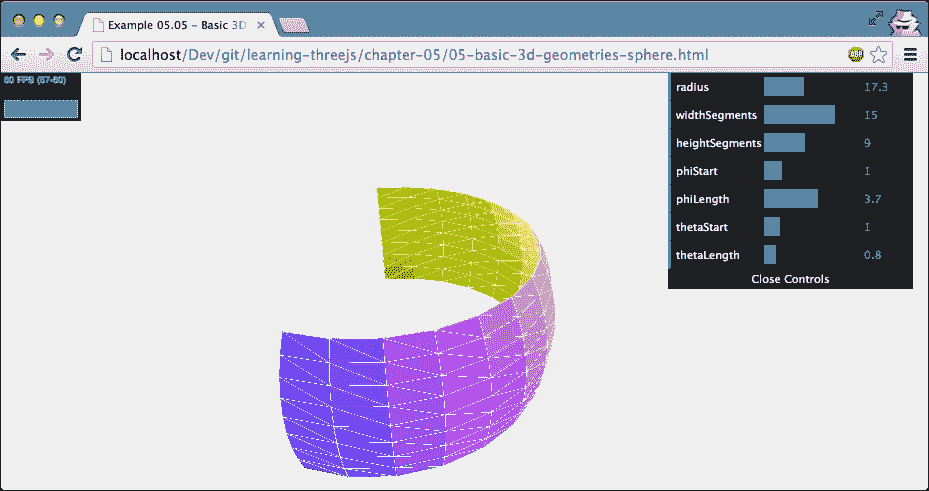

列表中的下一个是 `THREE.CylinderGeometry`。

### THREE.CylinderGeometry

使用这种几何形状，我们可以创建圆柱体和类似圆柱体的对象。对于所有其他几何形状，我们也有一个示例 (`07-basic-3d-geometries-cylinder.html`)，让您可以实验这种几何形状的属性，其截图如下：

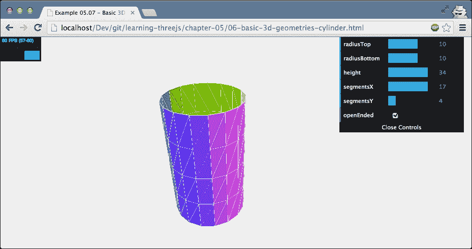

当您创建 `THREE.CylinderGeometry` 时，没有必需的参数。因此，您只需调用 `new THREE.CylinderGeometry()` 就可以创建一个圆柱体。您可以通过传递一些属性来改变这个圆柱体的外观，如示例所示。属性解释如下表：

| 属性 | 必需 | 描述 |
| --- | --- | --- |
| `radiusTop` | 否 | 这设置了圆柱顶部的尺寸。默认值是 `20`。 |
| `radiusBottom` | 否 | 这设置了圆柱底部的尺寸。默认值是 `20`。 |
| `height` | 否 | 此属性设置了圆柱的高度。默认高度是 `100`。 |
| `radialSegments` | 否 | 这决定了圆柱半径方向上的分段数。默认值是 `8`。分段数越多，圆柱越平滑。 |
| `heightSegments` | 否 | 这决定了圆柱高度方向上的分段数。默认值是 `1`。分段数越多，面数越多。 |
| `openEnded` | 否 | 这决定了网格是否在顶部和底部封闭。默认值是 `false`。 |

这些都是非常基本的属性，您可以使用它们来配置圆柱。然而，一个有趣的现象是，当您为顶部（或底部）使用负半径时。如果您这样做，您可以使用这个几何形状来创建类似沙漏的形状，如下面的截图所示。在此处需要注意的一点是，如您从颜色中看到的，在这种情况下，上半部分是翻转的。如果您使用未配置为 `THREE.DoubleSide` 的材质，您将看不到上半部分。

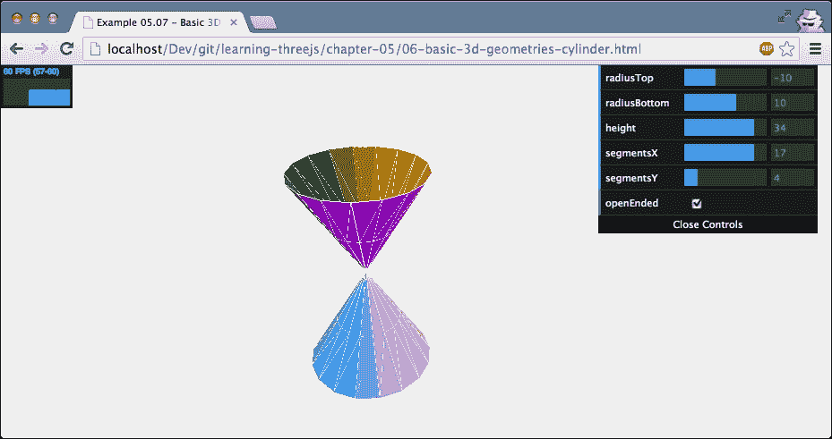

下一个几何形状是 `THREE.TorusGeometry`，您可以使用它来创建类似甜甜圈的形状。

### THREE.TorusGeometry

扭曲面是一个看起来像甜甜圈的基本形状。以下截图展示了 `THREE.TorusGeometry` 的实际应用，您可以通过打开 `08-basic-3d-geometries-torus.html` 示例来获取此截图：

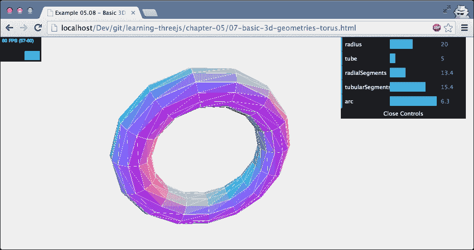

就像大多数简单几何形状一样，创建 `THREE.TorusGeometry` 时没有必填参数。以下表格列出了您在创建此几何形状时可以指定的参数：

| 属性 | 必需 | 描述 |
| --- | --- | --- |
| `radius` | 否 | 这设置了完整扭曲面的尺寸。默认值是 `100`。 |
| `tube` | 否 | 这设置了管子的半径（实际的甜甜圈）。此属性的默认值是 `40`。 |
| `radialSegments` | 否 | 这决定了扭曲面长度方向上要使用的分段数。默认值是 `8`。在演示中查看更改此值的效果。 |
| `tubularSegments` | 否 | 这决定了扭曲面宽度方向上要使用的分段数。默认值是 `6`。在演示中查看更改此值的效果。 |
| `arc` | 否 | 使用此属性，您可以控制扭曲面是否绘制成完整的圆圈。此值的默认值是 `2 * PI`（一个完整的圆圈）。 |

大多数这些都是非常基础的属性，你已经见过。然而，`arc` 属性却非常有趣。使用这个属性，你定义甜甜圈是形成一个完整的圆还是只有部分圆。通过实验这个属性，你可以创建非常有趣的网格，如下面设置 `arc` 为 `0.5 * PI` 的示例：

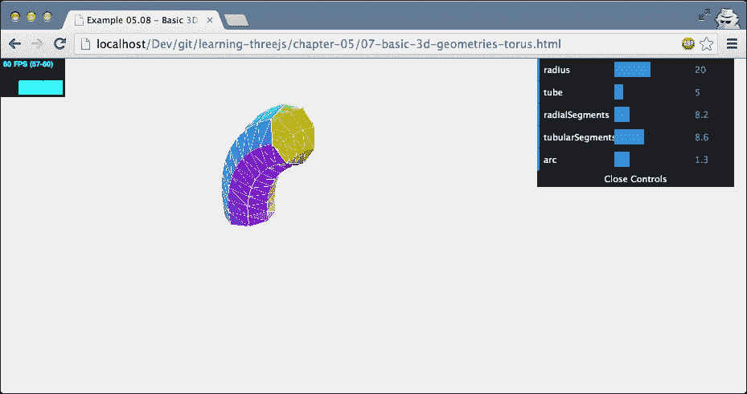

`THREE.TorusGeometry` 是一个非常直接的几何形状。在下一节中，我们将查看一个几乎与其名称相同但远不那么直接的几何形状：`THREE.TorusKnotGeometry`。

### THREE.TorusKnotGeometry

使用 `THREE.TorusKnotGeometry`，你可以创建一个环面结。环面结是一种特殊的结，看起来像是一个绕着自己缠绕几圈的管子。解释这个概念最好的方式是查看 `09-basic-3d-geometries-torus-knot.html` 示例。以下截图展示了这种几何形状：

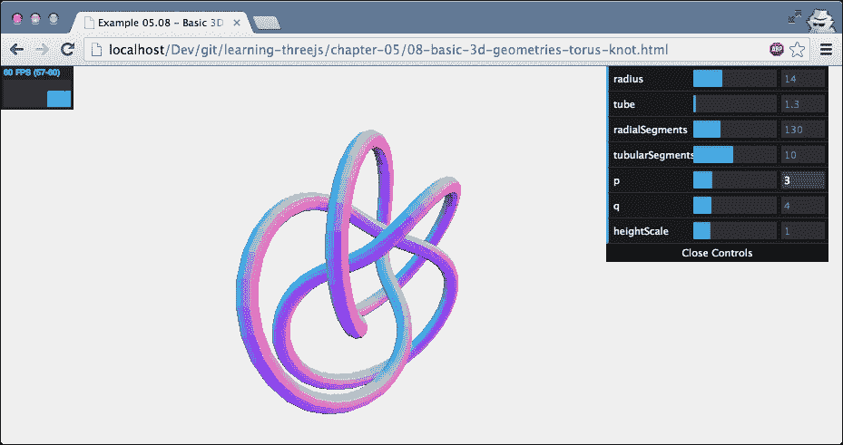

如果你打开这个示例并调整 `p` 和 `q` 属性，你可以创建各种美丽的几何形状。`p` 属性定义了结绕其轴旋转的频率，而 `q` 定义了结绕其内部旋转的次数。如果这听起来有点模糊，不要担心。你不需要理解这些属性就能创建美丽的结，例如以下截图所示（对细节感兴趣的人，维基百科上有关于这个主题的好文章，网址为 [`en.wikipedia.org/wiki/Torus_knot`](http://en.wikipedia.org/wiki/Torus_knot))）：

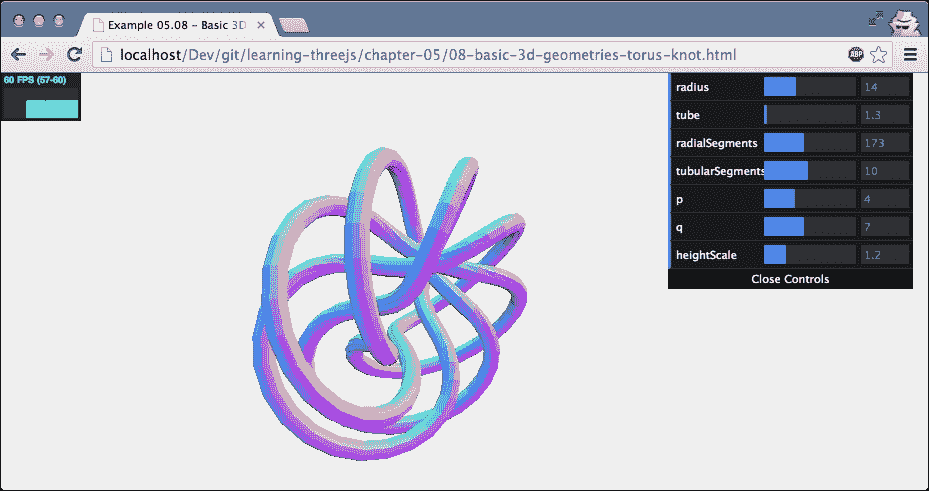

使用这个几何形状的示例，你可以调整以下属性并查看 `p` 和 `q` 的各种组合对这个几何形状的影响：

| 属性 | 必需 | 描述 |
| --- | --- | --- |
| `radius` | 否 | 这设置了完整环面的大小。默认值是 `100`。 |
| `tube` | 否 | 这设置了管子（实际的甜甜圈）的半径。此属性的默认值是 `40`。 |
| `radialSegments` | 否 | 这决定了沿环面结长度的段数。默认值是 `64`。在演示中查看改变此值的效果。 |
| `tubularSegments` | 否 | 这决定了沿环面结宽度的段数。默认值是 `8`。在演示中查看改变此值的效果。 |
| `p` | 否 | 这定义了结的形状，默认值是 `2`。 |
| `q` | 否 | 这定义了结的形状，默认值是 `3`。 |
| `heightScale` | 否 | 使用这个属性，你可以拉伸环面结。默认值是 `1`。 |

列表中的下一个几何形状是基本几何形状中的最后一个：`THREE.PolyhedronGeometry`。

### THREE.PolyhedronGeometry

使用这种几何形状，您可以轻松地创建多面体。多面体是一种只有平面面和直线边的几何形状。然而，通常您不会直接使用这种几何形状。Three.js 提供了一些可以直接使用而无需指定 `THREE.PolyhedronGeometry` 的顶点和面的特定多面体。我们将在本节后面讨论这些多面体。如果您确实想直接使用 `THREE.PolyhedronGeometry`，您必须指定顶点和面（就像我们在第三章 Chapter 3 中处理立方体时做的那样，*在 Three.js 中使用不同的光源*）。例如，我们可以创建一个简单的四面体（也参见本章中的 `THREE.TetrahedronGeometry`），如下所示：

```js
var vertices = [
  1,  1,  1, 
  -1, -1,  1, 
  -1,  1, -1, 
  1, -1, -1
];

var indices = [
  2, 1, 0, 
  0, 3, 2, 
  1, 3, 0, 
  2, 3, 1
];

polyhedron = createMesh(new THREE.PolyhedronGeometry(vertices, indices, controls.radius, controls.detail));
```

要构建 `THREE.PolyhedronGeometry`，我们需要传入 `vertices`、`indices`、`radius` 和 `detail` 属性。生成的 `THREE.PolyhedronGeometry` 对象在 `10-basic-3d-geometries-polyhedron.html` 示例中展示（在右上角的菜单中选择 **type** 为：**Custom**）：

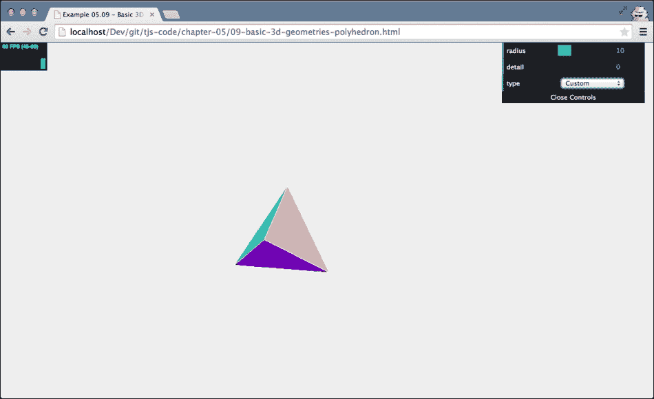

当您创建多面体时，您可以传入以下四个属性：

| 属性 | 必需 | 描述 |
| --- | --- | --- |
| `vertices` | 是 | 这些是多面体由其组成的点。 |
| `indices` | 是 | 这些是需要从顶点创建的面的索引。 |
| `radius` | 否 | 这是多面体的大小。默认为 `1`。 |
| `detail` | 否 | 使用此属性，您可以向多面体添加更多细节。如果将此设置为 `1`，多面体中的每个三角形将被分割成四个更小的三角形。如果设置为 `2`，那四个更小的三角形将再次分割成四个更小的三角形，依此类推。 |

在本节开头，我们提到 Three.js 默认附带了一些多面体。在接下来的小节中，我们将快速向您展示这些多面体。

所有这些多面体类型都可以通过查看 `09-basic-3d-geometries-polyhedron.html` 示例来查看。

#### THREE.IcosahedronGeometry

`THREE.IcosahedronGeometry` 创建一个由 12 个顶点创建的 20 个相同三角形面的多面体。在创建此多面体时，您只需要指定 `radius` 和 `detail` 级别。以下截图显示了使用 `THREE.IcosahedronGeometry` 创建的多面体：

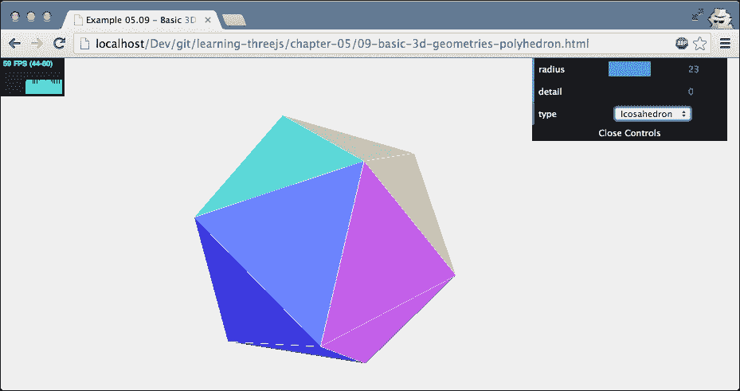

#### THREE.TetrahedronGeometry

四面体是最简单的多面体之一。这个多面体只包含由四个顶点创建的四个三角形面。您可以通过指定 `radius` 和 `detail` 级别来创建 `THREE.TetrahedronGeometry`，就像 Three.js 提供的其他多面体一样。以下是使用 `THREE.TetrahedronGeometry` 创建四面体的截图：

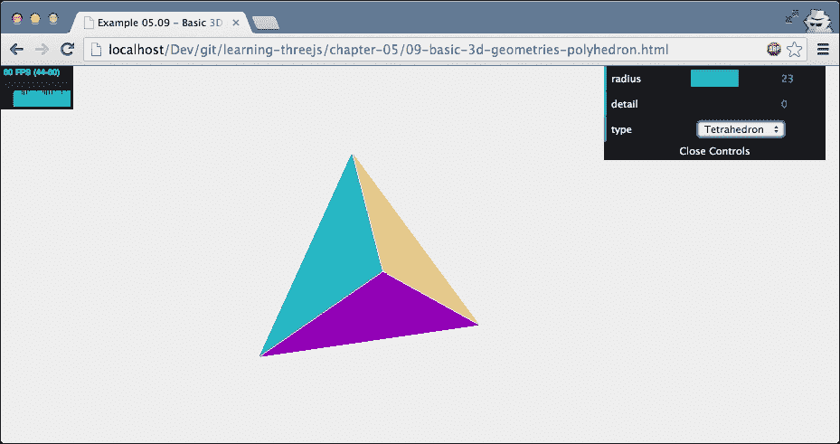

#### THREE.Octahedron Geometry

Three.js 还提供了一个八面体的实现。正如其名所示，这个多面体有 8 个面。这些面是由 6 个顶点创建的。以下截图显示了该几何形状：

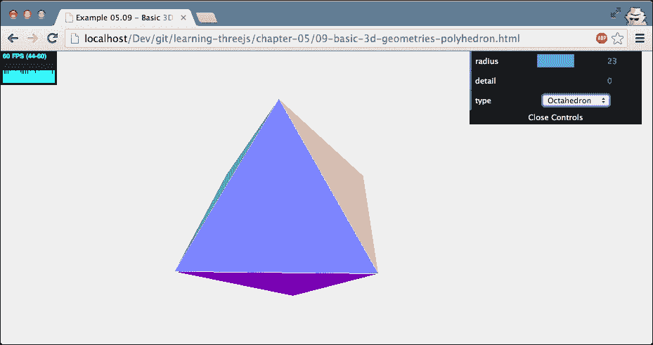

#### THREE.DodecahedronGeometry

Three.js 提供的最后一个多面体几何形状是 `THREE.DodecahedronGeometry`。这个多面体有 12 个面。以下截图显示了该几何形状：

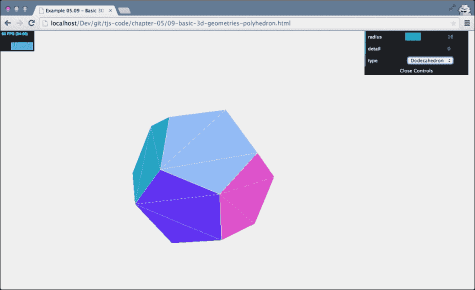

这就是本章关于 Three.js 提供的基本二维和三维几何形状的结束。

# 摘要

在本章中，我们讨论了 Three.js 提供的所有标准几何形状。正如你所见，有大量的几何形状可以直接使用。为了最好地学习如何使用这些几何形状，请尝试实验这些几何形状。使用本章中的示例来了解你可以用来自定义从 Three.js 获取的标准几何形状集合的属性。当你开始使用几何形状时，选择一个基本材质也是一个好主意；不要直接使用复杂的材质，而是从 `THREE.MeshBasicMaterial` 开始，将线框设置为 `true`，或者 `THREE.MeshNormalMaterial`。这样，你将能够更好地了解几何形状的真实形状。对于二维形状，重要的是要记住它们放置在 *x*-*y* 平面上。如果你想水平地有一个二维形状，你必须将网格绕 *x* 轴旋转 `-0.5 * PI`。最后，如果你正在旋转一个二维形状，或者一个 *开放* 的三维形状（例如，一个圆柱体或管子），请记住将材质设置为 `THREE.DoubleSide`。如果你不这样做，你的几何形状的内部或背面将不会显示。

在本章中，我们专注于简单直接的网格。Three.js 也提供了创建复杂几何形状的方法。在下一章中，你将学习如何创建这些几何形状。
