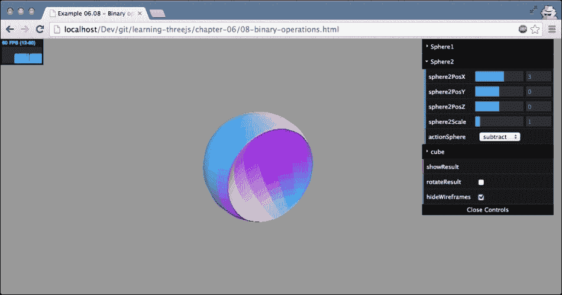

# 第六章。高级几何和二进制运算

在上一章中，我们向您展示了 Three.js 提供的所有基本几何形状。除了这些基本几何形状之外，Three.js 还提供了一套更高级和专业的对象。在本章中，我们将向您展示这些高级几何形状，并涵盖以下主题：

+   如何使用高级几何形状，如 `THREE.ConvexGeometry`、`THREE.LatheGeometry` 和 `THREE.TubeGeometry`。

+   如何使用 `THREE.ExtrudeGeometry` 从 2D 形状创建 3D 形状。我们将基于使用 Three.js 提供的功能绘制的 2D 形状来完成此操作，并展示一个基于外部加载的 SVG 图像创建 3D 形状的示例。

+   如果你想自己创建自定义形状，你可以轻松修改前几章中讨论过的形状。然而，Three.js 也提供了一个 `THREE.ParametricGeometry` 对象。使用此对象，你可以根据一组方程创建一个几何形状。

+   最后，我们将探讨如何使用 `THREE.TextGeometry` 创建 3D 文本效果。

+   此外，我们还将向您展示如何使用 Three.js 扩展 ThreeBSP 提供的二进制运算从现有几何形状创建新几何形状。

我们将从列表中的第一个开始，`THREE.ConvexGeometry`。

# THREE.ConvexGeometry

使用 `THREE.ConvexGeometry`，我们可以围绕一组点创建凸包。凸包是包含所有这些点的最小形状。理解这一点最简单的方法是查看一个示例。如果您打开 `01-advanced-3d-geometries-convex.html` 示例，您将看到一组随机点的凸包。以下截图显示了此几何形状：


在这个示例中，我们生成一组随机点，并根据这些点创建 `THREE.ConvexGeometry`。在示例中，您可以点击**重绘**，这将生成 20 个新的点并绘制凸包。我们还添加了每个点作为一个小型的 `THREE.SphereGeometry` 对象，以清楚地显示凸包的工作原理。`THREE.ConvexGeometry` 不包含在标准的 Three.js 分发中，因此您必须包含一个额外的 JavaScript 文件才能使用此几何形状。在您的 HTML 页面顶部添加以下内容：

```js
<script src="img/ConvexGeometry.js"></script>
```

以下代码片段显示了这些点是如何创建并添加到场景中的：

```js
function generatePoints() {
  // add 10 random spheres
  var points = [];
  for (var i = 0; i < 20; i++) {
    var randomX = -15 + Math.round(Math.random() * 30);
    var randomY = -15 + Math.round(Math.random() * 30);
    var randomZ = -15 + Math.round(Math.random() * 30);
    points.push(new THREE.Vector3(randomX, randomY, randomZ));
  }

  var group = new THREE.Object3D();
  var material = new THREE.MeshBasicMaterial({color: 0xff0000, transparent: false});
  points.forEach(function (point) {
    var geom = new THREE.SphereGeometry(0.2);
    var mesh = new THREE.Mesh(geom, material);
    mesh.position.clone(point);
    group.add(mesh);
  });

  // add the points as a group to the scene
  scene.add(group);
}
```

如此代码片段所示，我们创建了 20 个随机点（`THREE.Vector3`），并将它们推入一个数组。接下来，我们遍历这个数组，创建 `THREE.SphereGeometry`，并将位置设置为这些点之一（`position.clone(point)`）。所有点都被添加到一个组中（更多内容请参阅第七章，*粒子、精灵和点云*），因此我们可以通过旋转组来轻松地旋转它们。

一旦你有了这组点，创建 `THREE.ConvexGeometry` 非常简单，如下面的代码片段所示：

```js
// use the same points to create a convexgeometry
var convexGeometry = new THREE.ConvexGeometry(points);
convexMesh = createMesh(convexGeometry);
scene.add(convexMesh);
```

`THREE.ConvexGeometry`只接受一个包含顶点（`THREE.Vector3`类型）的数组作为参数。这里有一个关于`createMesh()`函数（这是我们自己在第五章中创建的函数）的最终说明，我们在本章中调用它。在前一章中，我们使用此方法通过`THREE.MeshNormalMaterial`创建网格。对于这个例子，我们将它改为半透明的绿色`THREE.MeshBasicMaterial`，以便更好地显示我们创建的凸包和构成此几何形状的各个点。

下一个复杂的几何形状是`THREE.LatheGeometry`，它可以用来创建类似花瓶的形状。

# THREE.LatheGeometry

`THREE.LatheGeometry`允许你从平滑曲线创建形状。这个曲线由一定数量的点（也称为节点）定义，通常称为样条曲线。这个样条曲线围绕对象的中心*z*轴旋转，并产生类似花瓶和钟形形状。再次强调，了解`THREE.LatheGeometry`外观的最简单方法是通过查看示例。这个几何形状在`02-advanced-3d-geometries-lathe.html`中显示。以下是从示例中截取的屏幕截图，显示了此几何形状：


在前一个屏幕截图中，你可以看到样条曲线作为一组小红色球体。这些球体的位置被传递给`THREE.LatheGeometry`，以及一些其他参数。在这个例子中，我们将这个样条曲线旋转半圆，并根据这个样条曲线，我们提取了你可以看到的形状。在我们查看所有参数之前，让我们看看创建样条曲线所使用的代码以及`THREE.LatheGeometry`如何使用这个样条曲线：

```js
function generatePoints(segments, phiStart, phiLength) {
  // add 10 random spheres
  var points = [];
  var height = 5;
  var count = 30;
  for (var i = 0; i < count; i++) {
    points.push(new THREE.Vector3((Math.sin(i * 0.2) + Math.cos(i * 0.3)) * height + 12, 0, ( i - count ) + count / 2));
  }

  ...

  // use the same points to create a LatheGeometry
  var latheGeometry = new THREE.LatheGeometry (points, segments, phiStart, phiLength);
  latheMesh = createMesh(latheGeometry);
  scene.add(latheMesh);
}
```

在这段 JavaScript 代码中，你可以看到我们生成了 30 个点，其中*x*坐标是基于正弦和余弦函数的组合，而*z*坐标是基于`i`和`count`变量。这创建了前一个屏幕截图中所显示的由红色点表示的样条曲线。

根据这些点，我们可以创建`THREE.LatheGeometry`。除了顶点数组之外，`THREE.LatheGeometry`还需要一些其他参数。下表列出了所有参数：

| 属性 | 必需 | 描述 |
| --- | --- | --- |
| `points` | 是 | 这些是构成用于生成钟形/花瓶形状的样条的点。 |
| `segments` | 否 | 这些是在创建形状时使用的段数。这个数字越高，生成的形状就越*圆滑*。默认值是`12`。 |
| `phiStart` | 否 | 这决定了在生成形状时从圆的哪个位置开始。这可以从`0`到`2*PI`。默认值是`0`。 |
| `phiLength` | 否 | 这定义了形状生成的完整程度。例如，四分之一形状将是`0.5*PI`。默认值是完整的`360`度或`2*PI`。 |

在下一节中，我们将探讨通过从 2D 形状提取 3D 几何体来创建几何体的另一种方法。

## 通过拉伸创建几何体

Three.js 提供了几种方法，可以将 2D 形状拉伸成 3D 形状。通过拉伸，我们指的是沿着其 *z* 轴拉伸 2D 形状以将其转换为 3D。例如，如果我们拉伸 `THREE.CircleGeometry`，我们得到一个看起来像圆柱体的形状，如果我们拉伸 `THREE.PlaneGeometry`，我们得到一个类似立方体的形状。

使用 `THREE.ExtrudeGeometry` 对象是拉伸形状最灵活的方法。

### THREE.ExtrudeGeometry

使用 `THREE.ExtrudeGeometry`，你可以从 2D 形状创建一个 3D 对象。在我们深入探讨这个几何体的细节之前，让我们先看看一个例子：`03-extrude-geometry.html`。以下是从例子中截取的屏幕截图，展示了这个几何体：


在这个例子中，我们使用了上一章中创建的 2D 形状，并使用 `THREE.ExtrudeGeometry` 将其转换为 3D。正如你在下面的屏幕截图中所看到的，形状沿着 *z* 轴拉伸，从而形成了一个 3D 形状。创建 `THREE.ExtrudeGeometry` 的代码非常简单：

```js
var options = {
  amount: 10,
  bevelThickness: 2,
  bevelSize: 1,
  bevelSegments: 3,
  bevelEnabled: true,
  curveSegments: 12,
  steps: 1
};

shape = createMesh(new THREE.ExtrudeGeometry(drawShape(), options));
```

在这段代码中，我们使用 `drawShape()` 函数创建了形状，就像我们在上一章中所做的那样。这个形状被传递给 `THREE.ExtrudeGeometry` 构造函数，同时传递一个 `options` 对象。通过 `options` 对象，你可以精确地定义形状应该如何拉伸。以下表格解释了你可以传递给 `THREE.ExtrudeGeometry` 的选项。

| 属性 | 必需 | 描述 |
| --- | --- | --- |
| `shapes` | 是 | 需要一个或多个形状（`THREE.Shape` 对象）来从其中拉伸几何体。请参阅前面的章节了解如何创建这样的形状。 |
| `amount` | 否 | 这决定了形状应该拉伸多远（深度）。默认值是 `100`。 |
| `bevelThickness` | 否 | 这决定了斜面的深度。斜面是前后面和拉伸之间的圆角。此值定义斜面进入形状的深度。默认值是 `6`。 |
| `bevelSize` | 否 | 这决定了斜面的高度。这被添加到形状的正常高度上。默认值是 `bevelThickness - 2`。 |
| `bevelSegments` | 否 | 这定义了斜面将使用的段数。使用的段数越多，斜面看起来越平滑。默认值是 `3`。 |
| `bevelEnabled` | 否 | 如果设置为 `true`，则添加斜面。默认值是 `true`。 |
| `curveSegments` | 否 | 这决定了在拉伸形状的曲线时将使用多少段。使用的段数越多，曲线看起来越平滑。默认值是 `12`。 |
| `steps` | 否 | 这定义了沿着拉伸的深度将分割成多少段。默认值是 `1`。更高的值将导致更多的单独面。 |
| `extrudePath` | No | 这是形状应该拉伸的路径（`THREE.CurvePath`）。如果没有指定，形状将沿着*z*轴拉伸。 |
| `material` | No | 这是用于前表面和后表面的材质索引。如果你想为前后表面使用不同的材质，请使用`THREE.SceneUtils.createMultiMaterialObject`函数来创建网格。 |
| `extrudeMaterial` | No | 这是用于斜面和拉伸的材质索引。如果你想为前后表面使用不同的材质，请使用`THREE.SceneUtils.createMultiMaterialObject`函数来创建网格。 |
| `uvGenerator` | No | 当你使用材质与纹理结合时，UV 贴图决定了纹理的哪一部分用于特定的面。通过`uvGenerator`属性，你可以传入自己的对象，该对象将为传入的形状创建面的 UV 设置。有关 UV 设置的更多信息，请参阅第十章，*加载和使用纹理*。如果没有指定，将使用`THREE.ExtrudeGeometry.WorldUVGenerator`。 |
| `frames` | No | Frenet 框架用于计算样条的切线、法线和双法线。当沿着`extrudePath`拉伸时使用。无需指定此参数，因为 Three.js 提供了自己的实现，即`THREE.TubeGeometry.FrenetFrames`，这也是默认值。有关 Frenet 框架的更多信息，请参阅[`en.wikipedia.org/wiki/Differential_geometry_of_curves#Frenet_frame`](http://en.wikipedia.org/wiki/Differential_geometry_of_curves#Frenet_frame)。 |

你可以使用`03-extrude-geometry.html`示例中的菜单来实验这些选项。

在本例中，我们沿着形状的*z*轴进行拉伸。正如你在选项中看到的，你也可以使用`extrudePath`选项沿着路径拉伸形状。在下面的几何体`THREE.TubeGeometry`中，我们将这样做。

### THREE.TubeGeometry

`THREE.TubeGeometry`创建一个沿着 3D 样条拉伸的管状体。你通过指定一系列顶点来指定路径，`THREE.TubeGeometry`将创建管状体。你可以在这个章节的源代码中找到一个可以实验的例子（`04-extrude-tube.html`）。以下截图显示了此示例：


如此例所示，我们生成了一些随机点，并使用这些点来绘制管状体。通过右上角的控件，我们可以定义管状体的外观或通过点击**newPoints**按钮生成一个新的管状体。创建管状体所需的代码非常简单，如下所示：

```js
var points = [];
for (var i = 0 ; i < controls.numberOfPoints ; i++) {
  var randomX = -20 + Math.round(Math.random() * 50);
  var randomY = -15 + Math.round(Math.random() * 40);
  var randomZ = -20 + Math.round(Math.random() * 40);

  points.push(new THREE.Vector3(randomX, randomY, randomZ));
}

var tubeGeometry = new THREE.TubeGeometry(new THREE.SplineCurve3(points), segments, radius, radiusSegments, closed);

var tubeMesh = createMesh(tubeGeometry);
scene.add(tubeMesh);
```

我们首先需要获取一组与 `THREE.Vector3` 类型的顶点，就像我们为 `THREE.ConvexGeometry` 和 `THREE.LatheGeometry` 所做的那样。然而，在我们可以使用这些点来创建管状体之前，我们首先需要将这些点转换为 `THREE.SplineCurve3`。换句话说，我们需要定义一条通过我们定义的点的平滑曲线。我们可以通过将顶点数组传递给 `THREE.SplineCurve3` 的构造函数来实现这一点。有了这条样条曲线和其他参数（我们稍后会解释），我们可以创建管状体并将其添加到场景中。

`THREE.TubeGeometry` 除了 `THREE.SplineCurve3` 之外还接受一些其他参数。以下表格列出了 `THREE.TubeGeometry` 的所有参数：

| 属性 | 必需 | 描述 |
| --- | --- | --- |
| `path` | 是 | 这是描述此管状体应遵循路径的 `THREE.SplineCurve3`。 |
| `segments` | 否 | 这些是用于构建管状体的段。默认值为 `64`。路径越长，您应该指定的段数就越多。 |
| `radius` | 否 | 这是管状体的半径。默认值为 `1`。 |
| `radiusSegments` | 否 | 这是沿管状体长度使用的段数。默认值为 `8`。您使用的越多，管状体看起来就越圆。 |
| `closed` | 否 | 如果设置为 `true`，管状体的起始端和末端将连接在一起。默认值为 `false`。 |

本章我们将展示的最后一条拉伸示例实际上并不是一个不同的几何形状。在下一节中，我们将向您展示如何使用 `THREE.ExtrudeGeometry` 从现有的 SVG 路径创建拉伸体。

### 从 SVG 拉伸

当我们讨论 `THREE.ShapeGeometry` 时，我们提到 SVG 大体上遵循相同的绘图形状的方法。SVG 与 Three.js 处理形状的方式非常相似。在本节中，我们将探讨如何使用来自 [`github.com/asutherland/d3-threeD`](https://github.com/asutherland/d3-threeD) 的小型库将 SVG 路径转换为 Three.js 形状。

对于 `05-extrude-svg.html` 示例，我使用了一个蝙蝠侠标志的 SVG 绘图，并使用 `ExtrudeGeometry` 将其转换为 3D，如下面的截图所示：


首先，让我们看看原始 SVG 代码的样子（您也可以在查看此示例的源代码时自己查看）：

```js
<svg version="1.0"   x="0px" y="0px" width="1152px" height="1152px" xml:space="preserve">
  <g>
  <path  id="batman-path" style="fill:rgb(0,0,0);" d="M 261.135 114.535 C 254.906 116.662 247.491 118.825 244.659 119.344 C 229.433 122.131 177.907 142.565 151.973 156.101 C 111.417 177.269 78.9808 203.399 49.2992 238.815 C 41.0479 248.66 26.5057 277.248 21.0148 294.418 C 14.873 313.624 15.3588 357.341 21.9304 376.806 C 29.244 398.469 39.6107 416.935 52.0865 430.524 C 58.2431 437.23 63.3085 443.321 63.3431 444.06 ... 261.135 114.535 "/>
  </g>
</svg>
```

除非你是 SVG 专家，否则这可能对你来说毫无意义。基本上，你在这里看到的是一系列绘图指令。例如，`C 277.987 119.348 279.673 116.786 279.673 115.867`告诉浏览器绘制一个三次贝塞尔曲线，而`L 489.242 111.787`告诉我们应该绘制到那个特定位置。幸运的是，我们不需要自己编写代码来解释这些。使用 d3-threeD 库，我们可以自动转换这些指令。这个库最初是为了与优秀的**D3.js**库一起使用而创建的，但经过一些小的调整，我们也可以单独使用这个特定的功能。

### 小贴士

**SVG**代表**可缩放矢量图形**。这是一个基于 XML 的标准，可以用来创建用于网络的矢量 2D 图像。这是一个由所有现代浏览器支持的开源标准。然而，直接使用 SVG 并通过 JavaScript 操作它并不十分直接。幸运的是，有几个开源 JavaScript 库使得使用 SVG 变得更加容易。**Paper.js**、**Snap.js**、**D3.js**和**Raphael.js**是一些最好的库。

以下代码片段展示了我们如何加载你之前看到的 SVG，将其转换为`THREE.ExtrudeGeometry`，并在屏幕上显示：

```js
function drawShape() {
  var svgString = document.querySelector("#batman-path").getAttribute("d");
  var shape = transformSVGPathExposed(svgString);
  return shape;
}

var options = {
  amount: 10,
  bevelThickness: 2,
  bevelSize: 1,
  bevelSegments: 3,
  bevelEnabled: true,
  curveSegments: 12,
  steps: 1
};

shape = createMesh(new THREE.ExtrudeGeometry(drawShape(), options));
```

在这个代码片段中，你会看到一个对`transformSVGPathExposed`函数的调用。这个函数由 d3-threeD 库提供，并接受一个 SVG 字符串作为参数。我们直接从以下表达式获取这个 SVG 字符串：`document.querySelector("#batman-path").getAttribute("d")`。在 SVG 中，`d`属性包含了用于绘制形状的路径语句。添加一个看起来很漂亮的闪亮材质和聚光灯，你就重新创建了此示例。

在本节中我们将讨论的最后一种几何形状是`THREE.ParametricGeometry`。使用这种几何形状，你可以指定一些函数，这些函数用于程序化地创建几何形状。

### THREE.ParametricGeometry

使用`THREE.ParametricGeometry`，你可以根据一个方程创建一个几何形状。在我们自己的示例之前，一个好的开始是查看 Three.js 已经提供的示例。当你下载 Three.js 发行版时，你会得到`examples/js/ParametricGeometries.js`文件。在这个文件中，你可以找到一些你可以与`THREE.ParametricGeometry`一起使用的方程示例。最基本的例子是创建平面的函数：

```js
function plane(u, v) {	
  var x = u * width;
  var y = 0;
  var z = v * depth;
  return new THREE.Vector3(x, y, z);
}
```

这个函数是通过`THREE.ParametricGeometry`调用的。`u`和`v`的值将在`0`到`1`之间变化，并且对于`0`到`1`之间的所有值都会被调用很多次。在这个例子中，`u`值用于确定向量的*x*坐标，而`v`值用于确定*z*坐标。当运行这个程序时，你会得到一个宽度为`width`和深度为`depth`的基本平面。

在我们的示例中，我们做了类似的事情。然而，我们不是创建一个平面，而是创建了一个波浪状的模式，正如您在`06-parametric-geometries.html`示例中所见。以下截图显示了此示例：


为了创建这个形状，我们向`THREE.ParametricGeometry`传递了以下函数：

```js
radialWave = function (u, v) {
  var r = 50;

  var x = Math.sin(u) * r;
  var z = Math.sin(v / 2) * 2 * r;
  var y = (Math.sin(u * 4 * Math.PI) + Math.cos(v * 2 * Math.PI)) * 2.8;

  return new THREE.Vector3(x, y, z);
}

var mesh = createMesh(new THREE.ParametricGeometry(radialWave, 120, 120, false));
```

正如您在这个示例中所见，通过几行代码，我们可以创建非常有趣的几何体。在这个示例中，您还可以看到我们可以传递给`THREE.ParametricGeometry`的参数。这些参数在以下表中解释：

| 属性 | 必选 | 描述 |
| --- | --- | --- |
| `function` | 是 | 这是一个函数，它根据提供的`u`和`v`值定义每个顶点的位置 |
| `slices` | 是 | 这定义了`u`值应该被分成多少部分 |
| `stacks` | 是 | 这定义了`v`值应该被分成多少部分 |

在继续本章的最后部分之前，我想对如何使用`slices`和`stacks`属性做一个总结。我们提到`u`和`v`属性被传递到提供的`function`参数中，并且这两个属性的值范围从`0`到`1`。通过`slices`和`stacks`属性，我们可以定义传递的函数被调用的频率。例如，如果我们将`slices`设置为`5`，将`stacks`设置为`4`，函数将使用以下值被调用：

```js
u:0/5, v:0/4
u:1/5, v:0/4
u:2/5, v:0/4
u:3/5, v:0/4
u:4/5, v:0/4
u:5/5, v:0/4
u:0/5, v:1/4
u:1/5, v:1/4
...
u:5/5, v:3/4
u:5/5, v:4/4
```

因此，这个值越高，您能指定的顶点就越多，创建的几何体就越平滑。您可以使用`06-parametric-geometries.html`示例右上角的菜单来查看此效果。

对于更多示例，您可以查看 Three.js 分布中的`examples/js/ParametricGeometries.js`文件。此文件包含创建以下几何体的函数：

+   克莱因瓶

+   平面

+   平面莫比乌斯带

+   3D 莫比乌斯带

+   管道

+   扭结

+   球体

本章的最后部分处理创建 3D 文本对象。

# 创建 3D 文本

在本章的最后部分，我们将快速浏览如何创建 3D 文本效果。首先，我们将查看如何使用 Three.js 提供的字体渲染文本，之后，我们将简要了解如何使用自己的字体进行此操作。

## 渲染文本

在 Three.js 中渲染文本非常简单。您只需定义要使用的字体和我们在讨论`THREE.ExtrudeGeometry`时看到的基 ExtrudeGeometry 础拉伸属性。以下截图显示了如何使用 Three.js 渲染文本的`07-text-geometry.html`示例：


创建此 3D 文本所需的代码如下：

```js
var options = {
  size: 90,
  height: 90,
  weight: 'normal',
  font: 'helvetiker',
  style: 'normal',
  bevelThickness: 2,
  bevelSize: 4,
  bevelSegments: 3,
  bevelEnabled: true,
  curveSegments: 12,
  steps: 1
};

// the createMesh is the same function we saw earlier
text1 = createMesh(new THREE.TextGeometry("Learning", options));
text1.position.z = -100;
text1.position.y = 100;
scene.add(text1);

text2 = createMesh(new THREE.TextGeometry("Three.js", options));
scene.add(text2);
};
```

让我们看看我们可以为`THREE.TextGeometry`指定的所有选项：

| 属性 | 必选 | 描述 |
| --- | --- | --- |
| `size` | 否 | 这是文本的大小。默认值是`100`。 |
| `height` | 否 | 这是拉伸的长度（深度）。默认值是`50`。 |
| `weight` | No | 这是字体的粗细。可能的值是 `normal` 和 `bold`。默认值是 `normal`。 |
| `font` | No | 这是将要使用的字体名称。默认值是 `helvetiker`。 |
| `style` | No | 这是字体的粗细。可能的值是 `normal` 和 `italic`。默认值是 `normal`。 |
| `bevelThickness` | No | 这是斜面的深度。斜面是前后面和挤压之间的圆角。默认值是 `10`。 |
| `bevelSize` | No | 这是斜面的高度。默认值是 `8`。 |
| `bevelSegments` | No | 这定义了斜面将使用的段数。段数越多，斜面看起来越平滑。默认值是 `3`。 |
| `bevelEnabled` | No | 如果设置为 `true`，则添加斜面。默认值是 `false`。 |
| `curveSegments` | No | 这定义了在挤压形状的曲线时使用的段数。段数越多，曲线看起来越平滑。默认值是 `4`。 |
| `steps` | No | 这定义了挤压将被分割成多少段。默认值是 `1`。 |
| `extrudePath` | No | 这是形状应该挤压的路径。如果没有指定，形状将沿着 *z* 轴挤压。 |
| `material` | No | 这是用于前后面的材料的索引。使用 `THREE.SceneUtils.createMultiMaterialObject` 函数来创建网格。 |
| `extrudeMaterial` | No | 这是用于斜面和挤压的材料的索引。使用 `THREE.SceneUtils.createMultiMaterialObject` 函数来创建网格。 |
| `uvGenerator` | No | 当您使用材质与纹理一起使用时，UV 映射确定纹理的哪个部分用于特定的面。通过 `UVGenerator` 属性，您可以传递自己的对象，该对象将为传入的形状创建面的 UV 设置。有关 UV 设置的更多信息，请参阅第十章，*加载和使用纹理*。如果没有指定，则使用 `THREE.ExtrudeGeometry.WorldUVGenerator`。 |
| `frames` | No | Frenet 坐标系用于计算样条的切线、法线和双法线。当沿着 `extrudePath` 挤压时使用。您不需要指定此值，因为 Three.js 提供了自己的实现，`THREE.TubeGeometry.FrenetFrames`，这也是默认值。有关 Frenet 坐标系的更多信息，请参阅 [`en.wikipedia.org/wiki/Differential_geometry_of_curves#Frenet_frame`](http://en.wikipedia.org/wiki/Differential_geometry_of_curves#Frenet_frame)。 |

包含在 Three.js 中的字体也添加到本书的源代码中。您可以在 `assets/fonts` 文件夹中找到它们。

### 提示

如果您想在 2D 中渲染字体，例如，将其用作材质的纹理，您不应该使用`THREE.TextGeometry`。`THREE.TextGeometry`内部使用`THREE.ExtrudeGeometry`构建 3D 文本，而 JavaScript 字体引入了很多开销。渲染简单的 2D 字体比仅使用 HTML5 canvas 更好。使用`context.font`，您可以设置要使用的字体，使用`context.fillText`，您可以将文本输出到画布上。然后您可以使用这个画布作为纹理的输入。我们将在第十章中向您展示如何做到这一点，*加载和使用纹理*。

您也可以使用其他字体与该几何体一起使用，但您首先需要将它们转换为 JavaScript。如何做到这一点将在下一节中展示。

## 添加自定义字体

Three.js 提供了一些字体，您可以在场景中使用这些字体。这些字体基于**typeface.js**提供的字体([`typeface.neocracy.org:81/`](http://typeface.neocracy.org:81/))。Typeface.js 是一个库，可以将 TrueType 和 OpenType 字体转换为 JavaScript。生成的 JavaScript 文件可以包含在您的页面上，然后该字体就可以在 Three.js 中使用。

要转换现有的 OpenType 或 TrueType 字体，您可以使用[`typeface.neocracy.org:81/fonts.html`](http://typeface.neocracy.org:81/fonts.html)网页。在此页面上，您可以上传字体，它将为您转换为 JavaScript。请注意，这并不适用于所有类型的字体。字体越简单（直线越多），在 Three.js 中使用时正确渲染的机会就越大。

要包含该字体，只需在您的 HTML 页面顶部添加以下行：

```js
<script type="text/javascript" src="img/bitstream_vera_sans_mono_roman.typeface.js">
</script>
```

这将加载字体并使其在 Three.js 中可用。如果您想了解字体的名称（用于`font`属性），可以使用以下 JavaScript 代码行将字体缓存打印到控制台：

```js
console.log(THREE.FontUtils.faces);
```

这将打印出如下内容：


在这里，您可以看到我们可以使用`helvetiker`字体，其`weight`为`either bold`或`normal`，以及`bitstream vera sans mono`字体，其`weight`为`normal`。请注意，每种字体粗细都对应一个单独的 JavaScript 文件，并且需要单独加载。确定字体名称的另一种方法是查看字体的 JavaScript 源文件。在文件末尾，您会找到一个名为`familyName`的属性，如下面的代码所示。此属性还包含字体的名称：

```js
"familyName":"Bitstream Vera Sans Mono"
```

在本章的下一部分，我们将介绍 ThreeBSP 库，使用二进制操作：`intersect`、`subtract`和`union`来创建非常有趣的几何体。

# 使用二进制操作组合网格

在本节中，我们将探讨创建几何体的另一种方法。到目前为止，在本章以及上一章中，我们使用了 Three.js 提供的默认几何体来创建看起来有趣的几何体。使用默认的属性集，你可以创建美丽的模型，但你受到 Three.js 提供的限制。在本节中，我们将向你展示如何将这些标准几何体组合起来创建新的几何体——这是一种称为**构造实体几何**（**CSG**）的技术。为此，我们使用 Three.js 扩展 ThreeBSP，你可以在[`github.com/skalnik/ThreeBSP`](https://github.com/skalnik/ThreeBSP)上找到它。这个额外的库提供了以下三个函数：

| 名称 | 描述 |
| --- | --- |
| `intersect` | 此函数允许你根据两个现有几何体的交集创建一个新的几何体。两个几何体重叠的区域将定义这个新几何体的形状。 |
| `union` | 联合函数可以用来合并两个几何体并创建一个新的几何体。你可以将此与我们在第八章中将要讨论的`mergeGeometry`功能进行比较，即第八章中的*创建和加载高级网格和几何体*。 |
| `subtract` | 减去函数是联合函数的对立面。你可以通过从第一个几何体中移除重叠区域来创建一个新的几何体。 |

在接下来的几节中，我们将更详细地探讨这些函数。以下截图显示了仅使用`union`和`subtract`功能依次创建的示例。


要使用这个库，我们需要将其包含在我们的页面中。这个库是用 CoffeeScript 编写的，它是 JavaScript 的一个更易于使用的变体。为了使其工作，我们有两种选择。我们可以添加 CoffeeScript 文件并在运行时编译它，或者我们可以将其预编译为 JavaScript 并直接包含它。对于第一种方法，我们需要做以下操作：

```js
<script type="text/javascript" src="img/coffee-script.js"></script>
<script type="text/coffeescript" src="img/ThreeBSP.coffee"></script>
```

`ThreeBSP.coffee`文件包含我们在这个例子中需要的功能，而`coffee-script.js`可以解释 ThreeBSP 使用的 Coffee 语言。我们需要采取的最后一步是确保在开始使用 ThreeBSP 功能之前，`ThreeBSP.coffee`文件已经被完全解析。为此，我们在文件的底部添加以下内容：

```js
<script type="text/coffeescript">
  onReady();
</script>
```

我们将初始的`onload`函数重命名为`onReady`，如下所示：

```js
function onReady() {
  // Three.js code
}
```

如果我们使用 CoffeeScript 命令行工具将 CoffeeScript 预编译为 JavaScript，我们可以直接包含生成的 JavaScript 文件。不过，在我们这样做之前，我们需要安装 CoffeeScript。你可以在 CoffeeScript 网站上找到安装说明，网址为[`coffeescript.org/`](http://coffeescript.org/)。一旦安装了 CoffeeScript，你可以使用以下命令行将 CoffeeScript ThreeBSP 文件转换为 JavaScript：

```js
coffee --compile ThreeBSP.coffee
```

此命令创建一个`ThreeBSP.js`文件，我们可以将其包含在我们的示例中，就像我们包含其他 JavaScript 文件一样。在我们的示例中，我们使用第二种方法，因为它比每次加载页面时编译 CoffeeScript 要快。为此，我们只需将以下内容添加到我们的 HTML 页面顶部：

```js
<script type="text/javascript" src="img/ThreeBSP.js"></script>
```

现在 ThreeBSP 库已加载，我们可以使用它提供的函数。

## 减法函数

在我们开始使用`subtract`函数之前，有一个重要的步骤您需要记住。这三个函数使用网格的绝对位置进行计算。因此，如果您在应用这些函数之前将网格分组或使用多种材质，您可能会得到奇怪的结果。为了获得最佳和最可预测的结果，请确保您正在处理未分组的网格。

让我们从演示`subtract`功能开始。为此，我们提供了一个示例，`08-binary-operations.html`。使用此示例，您可以尝试三种操作。当您第一次打开二进制操作示例时，您将看到以下类似的开屏：


有三个线框：一个立方体和两个球体。**Sphere1**，中心球体，是所有操作执行的对象，**Sphere2**位于右侧，**Cube**位于左侧。在**Sphere2**和**Cube**上，您可以定义四种操作之一：**subtract**（减法）、**union**（并集）、**intersect**（交集）和**none**（无）。这些操作是从**Sphere1**的角度应用的。当我们把**Sphere2**设置为减法，并选择**showResult**（并隐藏线框）时，结果将显示**Sphere1**减去**Sphere1**和**Sphere2**重叠的区域。请注意，在您点击**showResult**按钮后，一些操作可能需要几秒钟才能完成，所以当可见的*忙碌*指示器时，请耐心等待。

以下截图显示了在减去另一个球体后球体的结果操作：



在这个示例中，首先执行**Sphere2**定义的操作，然后执行**Cube**的操作。因此，如果我们减去**Sphere2**和**Cube**（我们在*x*轴上稍微缩放），我们将得到以下结果：


理解`subtract`功能性的最佳方式就是直接在示例中尝试。完成此操作所需的 ThreeBSP 代码非常简单，在这个示例中，它是在`redrawResult`函数中实现的，每当示例中的**showResult**按钮被点击时，我们都会调用这个函数：

```js
function redrawResult() {
  scene.remove(result);
  var sphere1BSP = new ThreeBSP(sphere1);
  var sphere2BSP = new ThreeBSP(sphere2);
  var cube2BSP = new ThreeBSP(cube);

  var resultBSP;

  // first do the sphere
  switch (controls.actionSphere) {
    case "subtract":
      resultBSP = sphere1BSP.subtract(sphere2BSP);
    break;
    case "intersect":
      resultBSP = sphere1BSP.intersect(sphere2BSP);
    break;
    case "union":
      resultBSP = sphere1BSP.union(sphere2BSP);
    break;
    case "none": // noop;
  }

  // next do the cube
  if (!resultBSP) resultBSP = sphere1BSP;
  switch (controls.actionCube) {
    case "subtract":
      resultBSP = resultBSP.subtract(cube2BSP);
    break;
    case "intersect":
      resultBSP = resultBSP.intersect(cube2BSP);
    break;
    case "union":
      resultBSP = resultBSP.union(cube2BSP);
    break;
    case "none": // noop;
  }

  if (controls.actionCube === "none" && controls.actionSphere === "none") {
  // do nothing
  } else {
    result = resultBSP.toMesh();
    result.geometry.computeFaceNormals();
    result.geometry.computeVertexNormals();
    scene.add(result);
  }
}
```

在这段代码中，我们首先将我们的网格（你可以看到的线框）包裹在一个`ThreeBSP`对象中。这使得我们可以对这些对象应用`subtract`、`intersect`和`union`函数。现在，我们只需在围绕中心球体（`sphere1BSP`）包裹的`ThreeBSP`对象上调用我们想要的特定函数，这个函数的结果将包含我们创建新网格所需的所有信息。要创建这个网格，我们只需在`sphere1BSP`对象上调用`toMesh()`函数。在生成的对象上，我们必须确保通过首先调用`computeFaceNormals`然后调用`computeVertexNormals()`来正确计算所有法线。由于运行二进制操作之一会改变几何体的顶点和面，这会影响面的法线，因此需要调用这些计算函数。显式地重新计算它们将确保你的新对象在设置材质的着色为`THREE.SmoothShading`时能够平滑着色（正确渲染）。最后，我们将结果添加到场景中。

对于`intersect`和`union`，我们使用完全相同的方法。

## 相交函数

在上一节中解释了所有内容之后，对于`intersect`函数就没有太多可以解释的了。使用这个函数，只留下网格重叠的部分。以下截图是一个示例，其中球体和立方体都被设置为相交：


如果你查看这个例子并调整设置，你会发现创建这类对象非常容易。而且记住，这可以应用于你创建的任何网格，即使是本章中看到的复杂网格，例如`THREE.ParametricGeometry`和`THREE.TextGeometry`。

`subtract`和`intersect`函数配合得很好。本节开头我们展示的例子是通过首先减去一个较小的球体来创建一个空心球体。之后，我们使用立方体与这个空心球体相交以得到以下结果（一个带有圆角的空心立方体）：


ThreeBSP 提供的最后一个函数是`union`函数。

## 并集函数

最后一个函数是 ThreeBSP 提供的函数中最不有趣的一个。使用这个函数，我们可以将两个网格组合在一起以创建一个新的网格。因此，当我们将其应用于两个球体和立方体时，我们将得到一个单一的对象——并集函数的结果：


这实际上并不那么有用，因为 Three.js 也提供了这个功能（参见第八章 Chapter 8，*创建和加载高级网格和几何形状*，其中我们解释了如何使用`THREE.Geometry.merge`），它还提供略微更好的性能。如果你启用旋转，你可以看到这个合并是从中心球体的视角应用的，因为它围绕该球体的中心旋转。同样的情况也适用于其他两个操作。

# 摘要

在本章中，我们看到了很多内容。我们介绍了几种高级几何形状，甚至展示了如何使用几个简单的二进制运算来创建看起来有趣的几何形状。我们展示了如何使用像`THREE.ConvexGeometry`、`THREE.TubeGeometry`和`THREE.LatheGeometry`这样的高级几何形状来创建真正美丽的形状，并实验这些几何形状以获得你想要的结果。一个非常不错的功能是，我们还可以将现有的 SVG 路径转换为 Three.js。不过，请记住，你可能仍然需要使用 GIMP、Adobe Illustrator 或 Inkscape 等工具对路径进行微调。

如果你想要创建 3D 文本，你需要指定要使用的字体。Three.js 附带了一些你可以使用的字体，但你也可以创建自己的字体。然而，请记住，复杂的字体通常无法正确转换。最后，使用 ThreeBSP，你可以访问可以应用于你的网格的三个二进制运算：合并、减去和相交。使用合并，你可以将两个网格组合在一起；使用减去，你从源网格中移除网格的重叠部分；使用相交，只保留重叠部分。

到目前为止，我们查看的是实体（或线框）几何形状，其中顶点相互连接以形成面。在下一章中，我们将探讨一种使用称为粒子的方法来可视化几何形状的替代方式。使用粒子，我们不渲染完整的几何形状——我们只是将顶点渲染为空间中的点。这允许你创建看起来很棒的 3D 效果，并且性能良好。
