# 第八章。创建和加载高级网格和几何形状

在本章中，我们将探讨几种不同的方法，您可以使用这些方法创建高级和复杂的几何形状和网格。在第五章“学习与几何形状一起工作”和第六章“高级几何形状和二进制操作”中，我们向您展示了如何使用 Three.js 的内置对象创建一些高级几何形状。在本章中，我们将使用以下两种方法来创建高级几何形状和网格：

+   **分组和合并**: 我们解释的第一个方法使用 Three.js 的内置功能来分组和合并现有的几何形状。这从现有对象中创建新的网格和几何形状。

+   **从外部加载**: 在本节中，我们将解释如何从外部来源加载网格和几何形状。例如，我们将向您展示如何使用 Blender 导出 Three.js 支持的网格格式。

我们首先介绍*分组和合并*方法。使用这种方法，我们使用标准的 Three.js 分组和`THREE.Geometry.merge()`函数来创建新对象。

# 几何形状分组和合并

在本节中，我们将探讨 Three.js 的两个基本功能：将对象分组在一起以及将多个网格合并成一个网格。我们将从分组对象开始。

## 将对象分组

在一些前面的章节中，您在处理多个材质时已经看到了这一点。当您使用多个材质从几何形状创建网格时，Three.js 会创建一个组。您的几何形状的多个副本被添加到这个组中，每个副本都有其特定的材质。这个组被返回，所以它看起来像是一个使用多个材质的网格。然而，实际上，它是一个包含多个网格的组。

创建组非常简单。您创建的每个网格都可以包含子元素，这些子元素可以通过 add 函数添加。将子对象添加到组中的效果是您可以移动、缩放、旋转和平移父对象，所有子对象也会受到影响。让我们看一个例子（`01-grouping.html`）。以下截图显示了此示例：

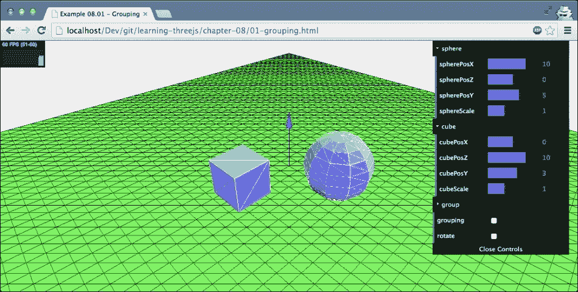

在此示例中，您可以使用菜单移动球体和立方体。如果您勾选**旋转**选项，您将看到这两个网格围绕它们的中心旋转。这并不是什么新东西，也不是很令人兴奋。然而，这两个对象并没有直接添加到场景中，而是作为组添加的。以下代码封装了这次讨论：

```js
sphere = createMesh(new THREE.SphereGeometry(5, 10, 10));
cube = createMesh(new THREE.BoxGeometry(6, 6, 6));

group = new THREE.Object3D();
group.add(sphere);
group.add(cube);

scene.add(group);
```

在这个代码片段中，你可以看到我们创建了`THREE.Object3D`。这是`THREE.Mesh`和`THREE.Scene`的基础类，但本身并不包含任何内容或导致任何渲染。请注意，在 Three.js 的最新版本中，引入了一个名为`THREE.Group`的新对象来支持分组。这个对象与`THREE.Object3D`对象完全相同，你可以在之前的代码中将`new THREE.Object3D()`替换为`new THREE.Group()`以获得相同的效果。在这个例子中，我们使用`add`函数将`sphere`和`cube`添加到这个对象中，然后将其添加到`scene`中。如果你查看示例，你仍然可以移动立方体和球体，并缩放和旋转这两个对象。你还可以在它们所在的组上执行这些操作。如果你查看组菜单，你会看到位置和缩放选项。你可以使用这些选项来缩放和移动整个组。这个组内对象的缩放和位置相对于组的缩放和位置。

缩放和位置非常直接。不过，需要注意的是，当你旋转一个组时，它不会分别旋转组内的对象；它会围绕组自己的中心旋转整个组（在我们的例子中，你围绕`group`对象的中心旋转整个组）。在这个例子中，我们使用`THREE.ArrowHelper`对象在组的中心放置了一个箭头，以指示旋转点：

```js
var arrow = new THREE.ArrowHelper(new THREE.Vector3(0, 1, 0), group.position, 10, 0x0000ff);
scene.add(arrow);
```

如果你同时勾选**分组**和**旋转**复选框，该组将会旋转。你会看到球体和立方体围绕组的中心（由箭头指示）旋转，如下所示：

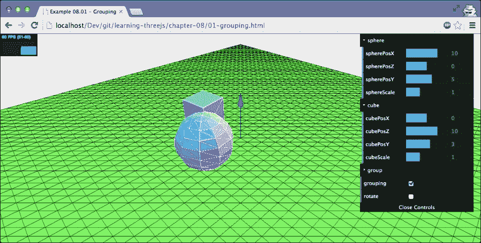

当使用一个组时，你仍然可以引用、修改和定位单个几何体。你需要记住的唯一一点是，所有位置、旋转和平移都是相对于父对象进行的。在下一节中，我们将探讨合并，在那里你将结合多个单独的几何体，最终得到一个单一的`THREE.Geometry`对象。

## 将多个网格合并成一个网格

在大多数情况下，使用组可以让你轻松地操作和管理大量网格。然而，当你处理一个非常大的对象数量时，性能将成为一个问题。使用组时，你仍然是在处理单个对象，每个对象都需要单独处理和渲染。通过`THREE.Geometry.merge()`，你可以将几何体合并在一起，创建一个组合的几何体。在下面的示例中，您可以了解这是如何工作的以及它对性能的影响。如果您打开`02-merging.html`示例，您会看到一个场景，其中包含一组随机分布的半透明立方体。通过菜单中的滑块，您可以设置场景中想要的立方体数量，并通过点击**重绘**按钮重新绘制场景。根据您所运行的硬件，您会看到随着立方体数量的增加，性能会下降。在我们的案例中，如您在下面的截图中所见，这发生在大约 4,000 个对象时，刷新率下降到大约 40 fps，而不是正常的 60 fps：

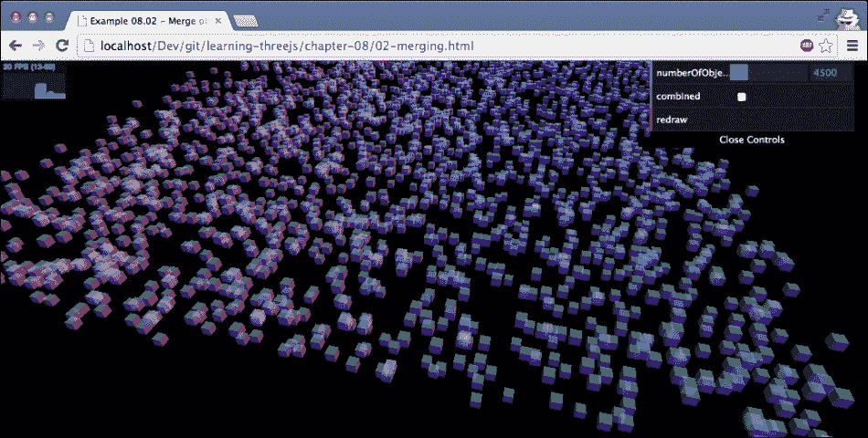

如您所见，您可以添加到场景中的网格数量有一定的限制。不过，通常情况下，你可能不需要那么多网格，但在创建特定游戏（例如，类似于*我的世界*）或高级可视化时，你可能需要管理大量单独的网格。通过`THREE.Geometry.merge()`，你可以解决这个问题。在我们查看代码之前，让我们运行这个相同的示例，但这次，将**组合**框勾选上。使用这个选项标记后，我们将所有立方体合并成一个单一的`THREE.Geometry`，并添加这个单一的几何体，如下面的截图所示：

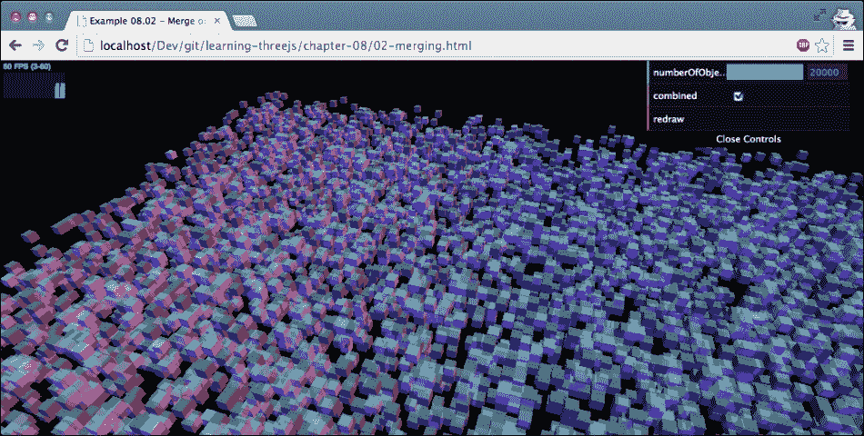

如您所见，我们能够轻松渲染 20,000 个立方体而不会出现性能下降。为此，我们使用了以下几行代码：

```js
var geometry = new THREE.Geometry();
for (var i = 0; i < controls.numberOfObjects; i++) {
  var cubeMesh = addcube();
  cubeMesh.updateMatrix();
  geometry.merge(cubeMesh.geometry,cubeMesh.matrix);
}
scene.add(new THREE.Mesh(geometry, cubeMaterial));
```

在这个代码片段中，`addCube()`函数返回`THREE.Mesh`。在 Three.js 的旧版本中，我们可以使用`THREE.GeometryUtils.merge`函数将`THREE.Mesh`对象合并到`THREE.Geometry`对象中。在最新版本中，这个功能已经被弃用，转而使用`THREE.Geometry.merge`函数。为了确保合并的`THREE.Geometry`对象定位和旋转正确，我们不仅向`merge`函数提供了`THREE.Geometry`，还提供了其变换矩阵。当我们向`merge`函数添加这个矩阵时，合并进来的立方体将被正确定位。

我们这样做 20,000 次，最终只保留一个几何形状并将其添加到场景中。如果您查看代码，您可能可以看到这种方法的几个缺点。由于您只剩下一个几何形状，因此您不能为每个单独的立方体应用材质。然而，这可以通过使用`THREE.MeshFaceMaterial`在一定程度上解决。然而，最大的缺点是您失去了对单个立方体的控制。如果您想移动、旋转或缩放单个立方体，您不能（除非您搜索正确的面和顶点并单独定位它们）。

使用分组和合并方法，您可以使用 Three.js 提供的基本几何形状创建大型且复杂的几何形状。如果您想创建更高级的几何形状，那么使用 Three.js 提供的编程方法并不总是最佳和最简单的方法。幸运的是，Three.js 提供了一些其他选项来创建几何形状。在下一节中，我们将探讨如何从外部资源加载几何形状和网格。

## 从外部资源加载几何形状

Three.js 可以读取多种 3D 文件格式，并导入那些文件中定义的几何形状和网格。以下表格显示了 Three.js 支持的文件格式：

| 格式 | 描述 |
| --- | --- |
| JSON | Three.js 有其自己的 JSON 格式，您可以使用它声明性地定义几何形状或场景。尽管这不是一个官方格式，但它非常易于使用，当您想要重用复杂的几何形状或场景时非常有用。 |
| OBJ 或 MTL | OBJ 是一种简单的 3D 格式，最初由**Wavefront Technologies**开发。它是被广泛采用的 3D 文件格式之一，用于定义对象的几何形状。MTL 是 OBJ 的配套格式。在 MTL 文件中，OBJ 文件中对象的材质被指定。如果需要从 Three.js 导出模型到 OBJ 格式，Three.js 也提供了一个自定义的 OBJ 导出器，称为 OBJExporter.js。 |
| Collada | Collada 是一种基于 XML 格式的定义*数字资产*的格式。这也是一个广泛使用的格式，几乎所有的 3D 应用程序和渲染引擎都支持它。 |
| STL | **STL**代表**立体光刻**，广泛用于快速原型制作。例如，3D 打印机的模型通常定义为 STL 文件。Three.js 也提供了一个自定义的 STL 导出器，称为 STLExporter.js，如果您想从 Three.js 导出模型到 STL 格式。 |
| CTM | CTM 是由**openCTM**创建的文件格式。它用作以紧凑格式存储基于 3D 三角形的网格的格式。 |
| VTK | VTK 是由**Visualization Toolkit**定义的文件格式，用于指定顶点和面。有两种格式可供选择：一种是基于二进制的，另一种是基于文本的 ASCII 格式。Three.js 仅支持基于 ASCII 的格式。 |
| AWD | AWD 是 3D 场景的二进制格式，通常与[`away3d.com/`](http://away3d.com/)引擎一起使用。请注意，此加载器不支持压缩的 AWD 文件。 |
| Assimp | Open asset import library（也称为**Assimp**）是一种导入各种 3D 模型格式的标准方式。使用此加载器，你可以导入使用 **assimp2json** 转换的多种 3D 格式的模型。详细信息请参阅 [`github.com/acgessler/assimp2json`](https://github.com/acgessler/assimp2json)。 |
| VRML | **VRML**代表**虚拟现实建模语言**。这是一种基于文本的格式，允许你指定 3D 对象和世界。它已被 X3D 文件格式取代。Three.js 不支持加载 X3D 模型，但这些模型可以轻松转换为其他格式。更多信息请参阅 [`www.x3dom.org/?page_id=532#`](http://www.x3dom.org/?page_id=532#)。 |
| Babylon | Babylon 是一个 3D JavaScript 游戏库。它使用自己的内部格式存储模型。更多关于这个的信息可以在 [`www.babylonjs.com/`](http://www.babylonjs.com/) 找到。 |
| PDB | 这是一个非常专业的格式，由**蛋白质数据银行**创建，用于指定蛋白质的外观。Three.js 可以加载并可视化指定在此格式下的蛋白质。 |
| PLY | 这种格式被称为**多边形**文件格式。这通常用于存储来自 3D 扫描仪的信息。 |

在下一章中，当我们讨论动画时，我们将重新审视这些格式（并查看另外两种格式，MD2 和 glTF）。现在，我们首先从列表中的第一个开始，即 Three.js 的内部格式。

## 在 Three.js JSON 格式下保存和加载

在 Three.js 中，你可以使用其 JSON 格式处理两种不同的场景。你可以用它来保存和加载单个 `THREE.Mesh`，或者用它来保存和加载一个完整的场景。

### 保存和加载 THREE.Mesh

为了演示保存和加载，我们创建了一个基于 `THREE.TorusKnotGeometry` 的简单示例。通过这个示例，你可以创建一个环面结，就像我们在 第五章 中所做的那样，*学习与几何体一起工作*，并使用 **Save & Load** 菜单中的 **save** 按钮保存当前几何体。对于这个示例，我们使用 HTML5 本地存储 API 进行保存。此 API 允许我们轻松地在客户端浏览器中存储持久信息，并在稍后时间检索它（即使在浏览器关闭并重新启动之后）。

我们将查看 `03-load-save-json-object.html` 示例。以下截图显示了此示例：

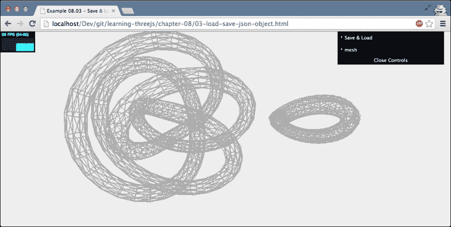

从 Three.js 导出 JSON 非常简单，不需要你包含任何额外的库。要将 `THREE.Mesh` 导出为 JSON，你需要做以下操作：

```js
var result = knot.toJSON();
localStorage.setItem("json", JSON.stringify(result));
```

在保存之前，我们首先使用 `JSON.stringify` 函数将 `toJSON` 函数的结果，一个 JavaScript 对象，转换为字符串。这会产生一个看起来像这样的 JSON 字符串（大多数顶点和面都被省略了）：

```js
{
  "metadata": {
    "version": 4.3,
    "type": "Object",
    "generator": "ObjectExporter"
  },
  "geometries": [{
    "uuid": "53E1B290-3EF3-4574-BD68-E65DFC618BA7",
    "type": "TorusKnotGeometry",
    "radius": 10,
    "tube": 1,
    "radialSegments": 64,
    "tubularSegments": 8,
    "p": 2,
    "q": 3,
    "heightScale": 1
  }],
  ...
}
```

如你所见，Three.js 保存了关于 `THREE.Mesh` 的所有信息。要使用 HTML5 本地存储 API 保存这些信息，我们只需要调用 `localStorage.setItem` 函数。第一个参数是键值（`json`），我们可以稍后使用它来检索我们作为第二个参数传递的信息。

将 `THREE.Mesh` 重新加载到 Three.js 中也只需要几行代码，如下所示：

```js
var json = localStorage.getItem("json");

if (json) {
  var loadedGeometry = JSON.parse(json);
  var loader = new THREE.ObjectLoader();

  loadedMesh = loader.parse(loadedGeometry);
  loadedMesh.position.x -= 50;
  scene.add(loadedMesh);
}
```

在这里，我们首先使用我们保存它的名称（在这种情况下是 `json`）从本地存储中获取 JSON。为此，我们使用 HTML5 本地存储 API 提供的 `localStorage.getItem` 函数。接下来，我们需要将字符串转换回 JavaScript 对象（`JSON.parse`），并将 JSON 对象转换回 `THREE.Mesh`。Three.js 提供了一个名为 `THREE.ObjectLoader` 的辅助对象，你可以使用它将 JSON 转换为 `THREE.Mesh`。在这个例子中，我们使用了加载器的 `parse` 方法来直接解析 JSON 字符串。加载器还提供了一个 `load` 函数，你可以传递包含 JSON 定义的文件的 URL。

如你所见，我们只保存了 `THREE.Mesh`。我们失去了其他所有内容。如果你想保存完整的场景，包括灯光和摄像机，你可以使用 `THREE.SceneExporter`。

### 保存和加载场景

如果你想保存一个完整的场景，你可以使用与我们在上一节中用于几何体的相同方法。`04-load-save-json-scene.html` 是一个展示这一点的有效示例。以下截图显示了此示例：

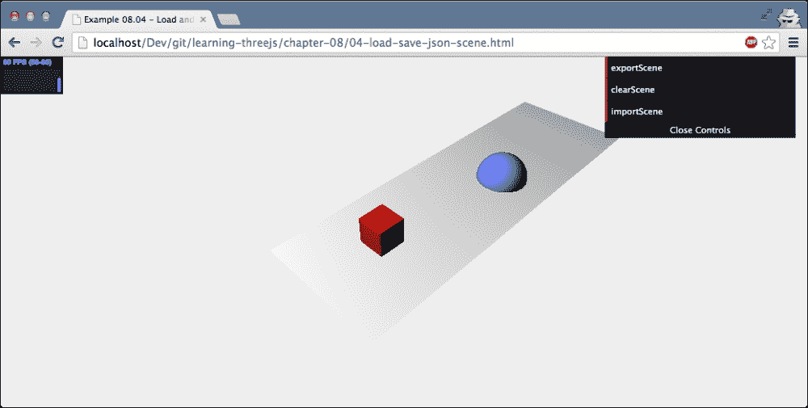

在这个例子中，你有三个选项：**exportScene**、**clearScene** 和 **importScene**。使用 **exportScene**，当前场景的状态将被保存到浏览器的本地存储中。要测试导入功能，你可以通过点击 **clearScene** 按钮来删除场景，然后使用 **importScene** 按钮从本地存储中加载它。执行所有这些操作代码非常简单，但在使用之前，你必须从 Three.js 发行版中导入所需的导出器和加载器（查看 `examples/js/exporters` 和 `examples/js/loaders` 目录）：

```js
<script type="text/javascript" src="img/SceneLoader.js"></script>
<script type="text/javascript" src="img/SceneExporter.js"></script>
```

在页面上包含这些 JavaScript 导入后，你可以使用以下代码导出场景：

```js
var exporter = new THREE.SceneExporter();
var sceneJson = JSON.stringify(exporter.parse(scene));
localStorage.setItem('scene', sceneJson);
```

这种方法与我们在上一节中使用的方法完全相同——只是这次我们使用 `THREE.SceneExporter()` 来导出完整的场景。生成的 JSON 看起来像这样：

```js
{
  "metadata": {
    "formatVersion": 3.2,
    "type": "scene",
    "generatedBy": "SceneExporter",
    "objects": 5,
    "geometries": 3,
    "materials": 3,
    "textures": 0
  },
  "urlBaseType": "relativeToScene", "objects": {
    "Object_78B22F27-C5D8-46BF-A539-A42207DDDCA8": {
      "geometry": "Geometry_5",
      "material": "Material_1",
      "position": [15, 0, 0],
      "rotation": [-1.5707963267948966, 0, 0],
      "scale": [1, 1, 1],
      "visible": true
    }
    ... // removed all the other objects for legibility
  },
  "geometries": {
    "Geometry_8235FC68-64F0-45E9-917F-5981B082D5BC": {
      "type": "cube",
      "width": 4,
      "height": 4,
      "depth": 4,
      "widthSegments": 1,
      "heightSegments": 1,
      "depthSegments": 1
    }
    ... // removed all the other objects for legibility
  }
  ... other scene information like textures
```

当你再次加载这个 JSON 时，Three.js 会精确地重新创建导出的对象。加载场景的方式如下：

```js
var json = (localStorage.getItem('scene'));
var sceneLoader = new THREE.SceneLoader();
sceneLoader.parse(JSON.parse(json), function(e) {
  scene = e.scene;
}, '.');
```

传递给加载器（`'.'`）的最后一个参数定义了相对 URL。例如，如果你有使用纹理（例如，外部图像）的材料，这些材料将通过这个相对 URL 被检索。在这个例子中，因为我们没有使用纹理，所以我们只传递当前目录。就像使用 `THREE.ObjectLoader` 一样，你也可以使用 `load` 函数从一个 URL 加载 JSON 文件。

您可以使用许多不同的 3D 程序来创建复杂的网格。一个流行的开源程序是 Blender ([www.blender.org](http://www.blender.org))。Three.js 为 Blender（以及 Maya 和 3D Studio Max）提供了一个导出器，可以直接导出为 Three.js 的 JSON 格式。在下一节中，我们将向您展示如何配置 Blender 以使用此导出器，并展示您如何在 Blender 中导出复杂模型并在 Three.js 中显示它。

## 使用 Blender

在我们开始配置之前，我们将展示我们期望的结果。在下面的截图中，您可以看到一个简单的 Blender 模型，我们使用 Three.js 插件导出，并使用`THREE.JSONLoader`导入到 Three.js 中：

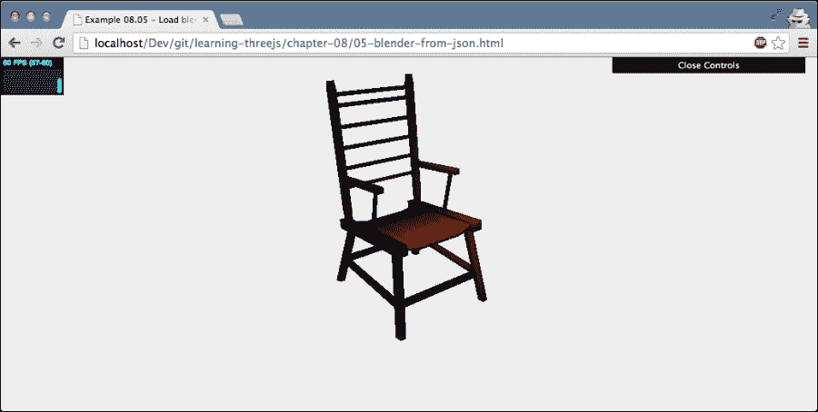

### 在 Blender 中安装 Three.js 导出器

要让 Blender 导出 Three.js 模型，我们首先需要将 Three.js 导出器添加到 Blender 中。以下步骤适用于 Mac OS X，但在 Windows 和 Linux 上也非常相似。您可以从[www.blender.org](http://www.blender.org)下载 Blender，并遵循特定平台的安装说明。安装后，您可以添加 Three.js 插件。首先，使用终端窗口定位 Blender 安装的`addons`目录：

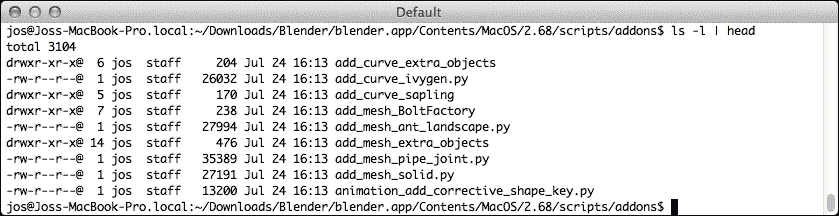

在我的 Mac 上，它位于这里：`./blender.app/Contents/MacOS/2.70/scripts/addons`。对于 Windows，此目录可以在以下位置找到：`C:\Users\USERNAME\AppData\Roaming\Blender Foundation\Blender\2.7X\scripts\addons`。而对于 Linux，您可以在以下位置找到此目录：`/home/USERNAME/.config/blender/2.7X/scripts/addons`。

接下来，您需要获取 Three.js 发行版并将其本地解包。在这个发行版中，您可以找到以下文件夹：`utils/exporters/blender/2.65/scripts/addons/`。在这个目录中，有一个名为`io_mesh_threejs`的单个子目录。将此目录复制到 Blender 安装的`addons`文件夹中。

现在，我们只需要启动 Blender 并启用导出器。在 Blender 中，打开**Blender 用户首选项**（**文件** | **用户首选项**）。在打开的窗口中，选择**插件**选项卡，并在搜索框中输入`three`。这将显示以下屏幕：

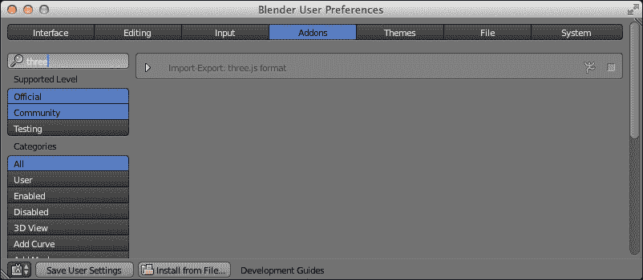

在这个阶段，已经找到了 Three.js 插件，但它仍然处于禁用状态。检查右侧的小复选框，Three.js 导出器将被启用。为了最终检查一切是否正常工作，打开**文件** | **导出**菜单选项，你会看到 Three.js 被列为一个导出选项。这在上面的截图中有展示：

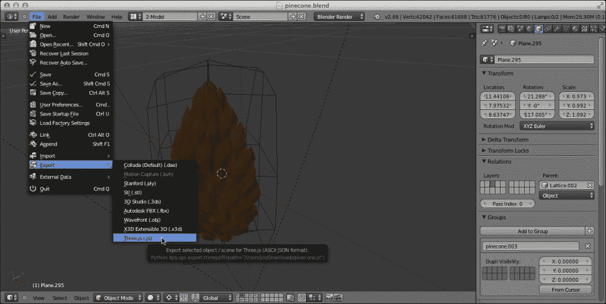

插件安装完成后，我们可以加载我们的第一个模型。

### 从 Blender 加载和导出模型

作为例子，我们在`assets/models`文件夹中添加了一个简单的 Blender 模型`misc_chair01.blend`，你可以在本书的源代码中找到它。在本节中，我们将加载此模型，并展示将此模型导出到 Three.js 所需的最小步骤。

首先，我们需要在 Blender 中加载这个模型。使用**文件** | **打开**并导航到包含`misc_chair01.blend`文件的文件夹。选择此文件并点击**打开**。这将显示一个看起来有点像这样的屏幕：

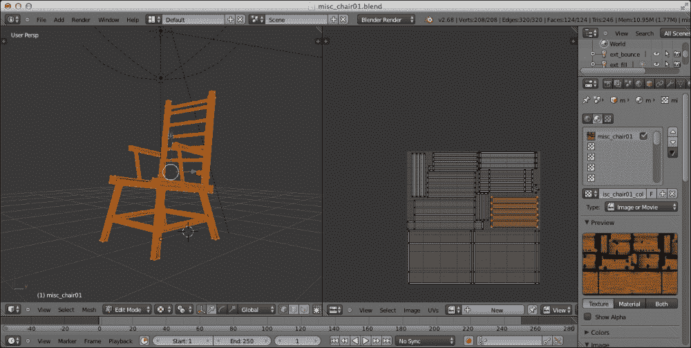

将此模型导出为 Three.js JSON 格式相当直接。从**文件**菜单，打开**导出** | **Three.js**，输入导出文件的名称，并选择**导出 Three.js**。这将创建一个 Three.js 可以理解的 JSON 文件。此文件内容的一部分如下所示：

```js
{

  "metadata" :
  {
    "formatVersion" : 3.1,
    "generatedBy"   : "Blender 2.7 Exporter",
    "vertices"      : 208,
    "faces"         : 124,
    "normals"       : 115,
    "colors"        : 0,
    "uvs"           : [270,151],
    "materials"     : 1,
    "morphTargets"  : 0,
    "bones"         : 0
  },
...
```

然而，我们还没有完全完成。在之前的屏幕截图中，你可以看到椅子包含一个木质纹理。如果你查看 JSON 导出，你可以看到椅子的导出也指定了一个材质，如下所示：

```js
"materials": [{
  "DbgColor": 15658734,
  "DbgIndex": 0,
  "DbgName": "misc_chair01",
  "blending": "NormalBlending",
  "colorAmbient": [0.53132, 0.25074, 0.147919],
  "colorDiffuse": [0.53132, 0.25074, 0.147919],
  "colorSpecular": [0.0, 0.0, 0.0],
  "depthTest": true,
  "depthWrite": true,
  "mapDiffuse": "misc_chair01_col.jpg",
  "mapDiffuseWrap": ["repeat", "repeat"],
  "shading": "Lambert",
  "specularCoef": 50,
  "transparency": 1.0,
  "transparent": false,
  "vertexColors": false
}],
```

此材质指定了`mapDiffuse`属性的一个纹理，`misc_chair01_col.jpg`。因此，除了导出模型外，我们还需要确保纹理文件也对 Three.js 可用。幸运的是，我们可以直接从 Blender 中保存这个纹理。

在 Blender 中，打开**UV/图像编辑器**视图。你可以从**文件**菜单选项左侧的下拉菜单中选择此视图。这将替换顶部菜单，如下所示：


确保你想要导出的纹理被选中，在我们的例子中是`misc_chair_01_col.jpg`（你可以使用小图像图标选择不同的纹理）。接下来，点击**图像**菜单并使用**另存为图像**菜单选项保存图像。将其保存在与模型相同的文件夹中，使用 JSON 导出文件中指定的名称。到此为止，我们就可以将模型加载到 Three.js 中了。

在这个阶段将此加载到 Three.js 中的代码看起来像这样：

```js
var loader = new THREE.JSONLoader();
loader.load('../assets/models/misc_chair01.js', function (geometry, mat) {
  mesh = new THREE.Mesh(geometry, mat[0]);

  mesh.scale.x = 15;
  mesh.scale.y = 15;
  mesh.scale.z = 15;

  scene.add(mesh);

}, '../assets/models/');
```

我们之前已经见过`JSONLoader`，但这次我们使用的是`load`函数而不是`parse`函数。在这个函数中，我们指定了想要加载的 URL（指向导出的 JSON 文件），一个在对象加载时被调用的回调函数，以及纹理可以找到的位置，`../assets/models/`（相对于页面）。这个回调函数接受两个参数：`geometry`和`mat`。`geometry`参数包含模型，而`mat`参数包含一个材质对象数组。我们知道只有一个材质，所以当我们创建`THREE.Mesh`时，我们直接引用那个材质。如果你打开`05-blender-from-json.html`示例，你可以看到我们刚刚从 Blender 导出的椅子。

使用 Three.js 导出器并不是将模型从 Blender 导入到 Three.js 的唯一方法。Three.js 理解多种 3D 文件格式，Blender 也可以导出为这些格式中的几种。然而，使用 Three.js 格式非常简单，如果出现问题，通常可以快速找到。

在下一节中，我们将查看 Three.js 支持的几种格式，并展示一个基于 Blender 的 OBJ 和 MTL 文件格式的示例。

## 从 3D 文件格式导入

在本章开头，我们列出了一些 Three.js 支持的格式。在本节中，我们将快速浏览这些格式的几个示例。请注意，对于所有这些格式，都需要包含一个额外的 JavaScript 文件。你可以在 Three.js 的`examples/js/loaders`目录中找到所有这些文件。

### OBJ 和 MTL 格式

OBJ 和 MTL 是配套格式，通常一起使用。OBJ 文件定义了几何形状，而 MTL 文件定义了使用的材质。OBJ 和 MTL 都是基于文本的格式。OBJ 文件的一部分看起来如下：

```js
v -0.032442 0.010796 0.025935
v -0.028519 0.013697 0.026201
v -0.029086 0.014533 0.021409
usemtl Material
s 1
f 2731 2735 2736 2732
f 2732 2736 3043 3044
```

MTL 文件定义材料如下：

```js
newmtl Material
Ns 56.862745
Ka 0.000000 0.000000 0.000000
Kd 0.360725 0.227524 0.127497
Ks 0.010000 0.010000 0.010000
Ni 1.000000
d 1.000000
illum 2
```

Three.js 的 OBJ 和 MTL 格式被很好地理解，并且 Blender 也支持这些格式。因此，作为替代方案，你可以选择将 Blender 中的模型导出为 OBJ/MTL 格式，而不是 Three.js 的 JSON 格式。Three.js 有两个不同的加载器你可以使用。如果你只想加载几何形状，你可以使用`OBJLoader`。我们在这个示例（`06-load-obj.html`）中使用了这个加载器。以下截图显示了此示例：

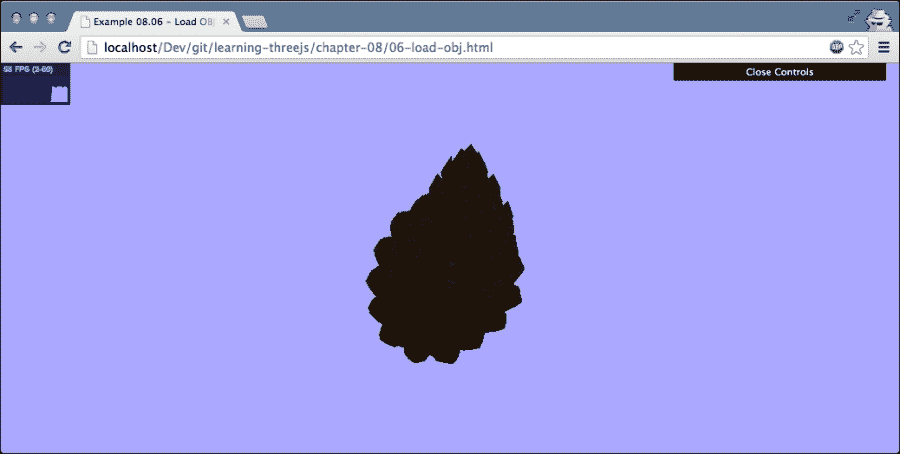

要在 Three.js 中导入此文件，你必须添加 OBJLoader JavaScript 文件：

```js
<script type="text/javascript" src="img/OBJLoader.js"></script>
```

按如下方式导入模型：

```js
var loader = new THREE.OBJLoader();
loader.load('../assets/models/pinecone.obj', function (loadedMesh) {
  var material = new THREE.MeshLambertMaterial({color: 0x5C3A21});

  // loadedMesh is a group of meshes. For
  // each mesh set the material, and compute the information
  // three.js needs for rendering.
  loadedMesh.children.forEach(function (child) {
    child.material = material;
    child.geometry.computeFaceNormals();
    child.geometry.computeVertexNormals();
  });

  mesh = loadedMesh;
  loadedMesh.scale.set(100, 100, 100);
  loadedMesh.rotation.x = -0.3;
  scene.add(loadedMesh);
});
```

在此代码中，我们使用`OBJLoader`从 URL 加载模型。一旦模型被加载，我们提供的回调函数将被调用，并将模型添加到场景中。

### 小贴士

通常，一个好的第一步是将回调函数的响应打印到控制台，以了解加载的对象是如何构建的。通常，使用这些加载器时，几何形状或网格会作为组层次结构返回。理解这一点会使放置和应用正确的材质以及采取任何其他额外步骤变得容易得多。此外，查看几个顶点的位置，以确定是否需要放大或缩小模型以及如何定位相机。在这个示例中，我们还调用了`computeFaceNormals`和`computeVertexNormals`。这是确保使用的材质（`THREE.MeshLambertMaterial`）正确渲染所必需的。

下一个示例（`07-load-obj-mtl.html`）使用`OBJMTLLoader`来加载模型并直接分配材质。以下截图显示了此示例：

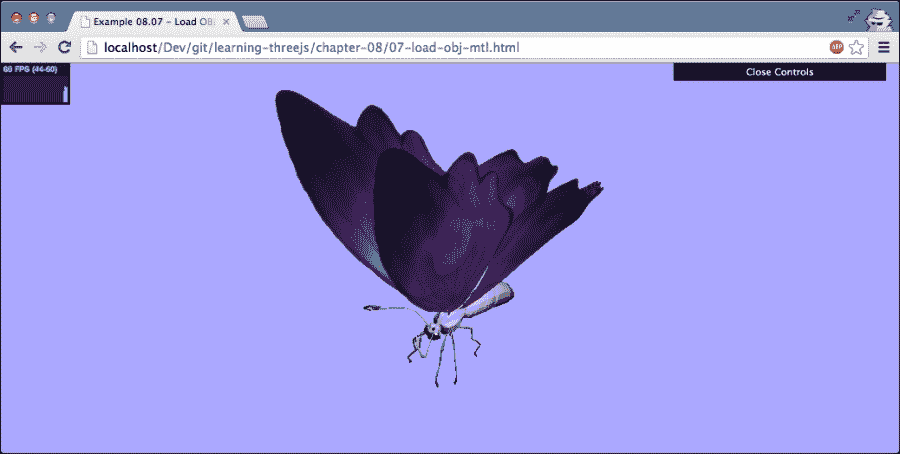

首先，我们需要将正确的加载器添加到页面中：

```js
<script type="text/javascript" src="img/OBJLoader.js"></script>
<script type="text/javascript" src="img/MTLLoader.js"></script>
<script type="text/javascript" src="img/OBJMTLLoader.js"></script>
```

我们可以像这样从 OBJ 和 MTL 文件加载模型：

```js
var loader = new THREE.OBJMTLLoader();
loader.load('../assets/models/butterfly.obj', '../assets/models/butterfly.mtl', function(object) {
  // configure the wings
  var wing2 = object.children[5].children[0];
  var wing1 = object.children[4].children[0];

  wing1.material.opacity = 0.6;
  wing1.material.transparent = true;
  wing1.material.depthTest = false;
  wing1.material.side = THREE.DoubleSide;

  wing2.material.opacity = 0.6;
  wing2.material.depthTest = false;
  wing2.material.transparent = true;
  wing2.material.side = THREE.DoubleSide;

  object.scale.set(140, 140, 140);
  mesh = object;
  scene.add(mesh);

  mesh.rotation.x = 0.2;
  mesh.rotation.y = -1.3;
});
```

在我们查看代码之前，首先要提到的是，如果您收到一个 OBJ 文件、一个 MTL 文件和所需的纹理文件，您必须检查 MTL 文件如何引用纹理。这些应该相对于 MTL 文件进行引用，而不是作为绝对路径。代码本身与我们之前看到的 `THREE.ObjLoader` 的代码并没有太大的不同。我们指定了 OBJ 文件的位置、MTL 文件的位置以及当模型加载时调用的函数。在这个例子中，我们使用的模型是一个复杂的模型。因此，我们在回调中设置了一些特定的属性来修复一些渲染问题，如下所示：

+   源文件中的不透明度设置不正确，导致翅膀不可见。因此，为了修复这个问题，我们自行设置了 `opacity` 和 `transparent` 属性。

+   默认情况下，Three.js 只渲染对象的单侧。由于我们从两个侧面查看翅膀，我们需要将 `side` 属性设置为 `THREE.DoubleSide` 值。

+   当翅膀需要叠加渲染时，它们造成了一些不希望出现的伪影。我们通过将 `depthTest` 属性设置为 `false` 来修复了这个问题。这会对性能产生轻微影响，但通常可以解决一些奇怪的渲染伪影。

但是，如您所见，您可以将复杂模型直接加载到 Three.js 中，并在浏览器中实时渲染。不过，您可能需要微调一些材质属性。

### 加载 Collada 模型

Collada 模型（扩展名为 `.dae`）是定义场景和模型（以及动画，我们将在下一章中看到）的另一种非常常见的格式。在 Collada 模型中，不仅定义了几何形状，还定义了材质。甚至可以定义光源。

要加载 Collada 模型，您必须基本上采取与 OBJ 和 MTL 模型相同的步骤。您首先包括正确的加载器：

```js
<script type="text/javascript" src="img/ColladaLoader.js"></script>
```

在这个例子中，我们将加载以下模型：

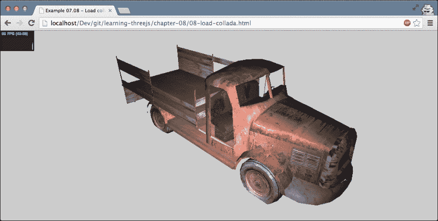

加载卡车模型再次非常简单：

```js
var mesh;
loader.load("../assets/models/dae/Truck_dae.dae", function (result) {
  mesh = result.scene.children[0].children[0].clone();
  mesh.scale.set(4, 4, 4);
  scene.add(mesh);
});
```

这里的主要区别在于回调函数返回的对象的结果。`result` 对象具有以下结构：

```js
var result = {

  scene: scene,
  morphs: morphs,
  skins: skins,
  animations: animData,
  dae: {
    ...
  }
};
```

在本章中，我们对 `scene` 参数中的对象感兴趣。我首先将场景打印到控制台，以查看我感兴趣的网格在哪里，它是 `result.scene.children[0].children[0]`。剩下要做的就是将其缩放到合理的大小并添加到场景中。关于这个特定示例的最后一句话——当我第一次加载这个模型时，材质没有正确渲染。原因是使用的纹理格式是 `.tga`，WebGL 不支持这种格式。为了修复这个问题，我不得不将 `.tga` 文件转换为 `.png`，并编辑 `.dae` 模型的 XML 以指向这些 `.png` 文件。

如您所见，对于大多数复杂的模型，包括材质，您通常需要采取一些额外的步骤才能获得期望的结果。通过仔细查看材质的配置方式（使用 `console.log()`）或用测试材质替换它们，问题通常很容易被发现。

### 加载 STL、CTM、VTK、AWD、Assimp、VRML 和 Babylon 模型

我们将快速浏览这些文件格式，因为它们都遵循相同的原理：

1.  在您的网页中包含 `[NameOfFormat]Loader.js`。

1.  使用 `[NameOfFormat]Loader.load()` 加载一个 URL。

1.  检查回调的响应格式并渲染结果。

我们为所有这些格式都包含了一个示例：

| 名称 | 示例 | 截图 |
| --- | --- | --- |
| STL | `08-load-STL.html` | 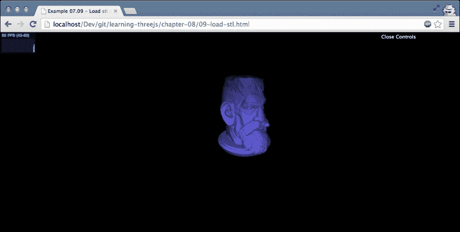 |
| CTM | `09-load-CTM.html` | 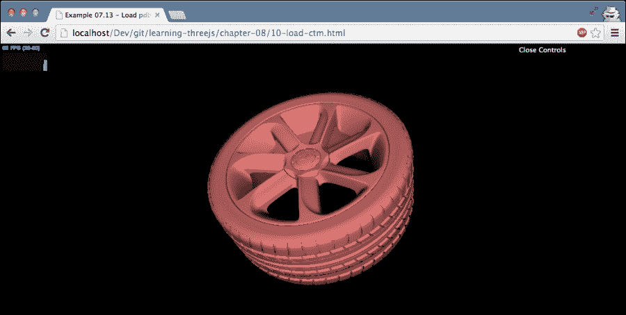 |
| VTK | `10-load-vtk.html` | 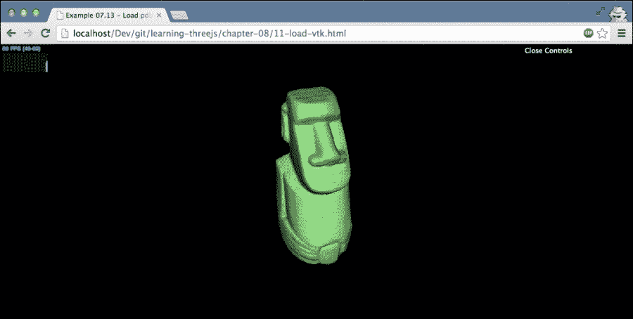 |
| AWD | `11-load-awd.html` | 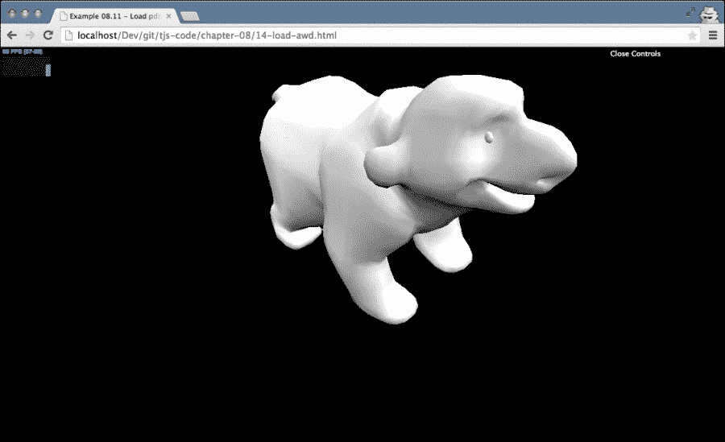 |
| Assimp | `12-load-assimp.html` | 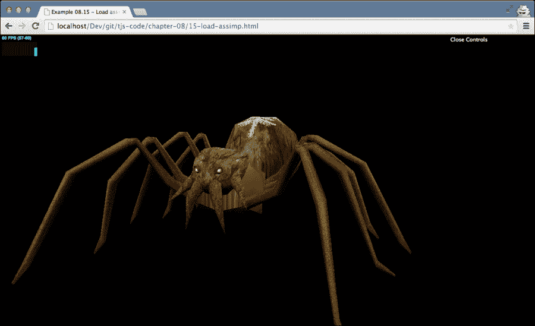 |
| VRML | `13-load-vrml.html` | 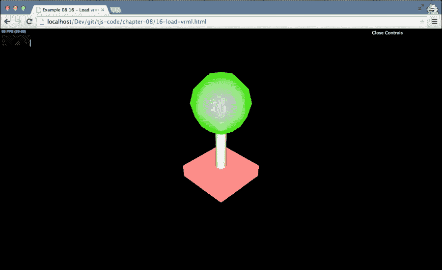 |
| Babylon | Babylon 加载器与表中其他加载器略有不同。使用此加载器，您不是加载单个 `THREE.Mesh` 或 `THREE.Geometry` 实例，而是使用此加载器加载一个完整的场景，包括灯光。`14-load-babylon.html` | 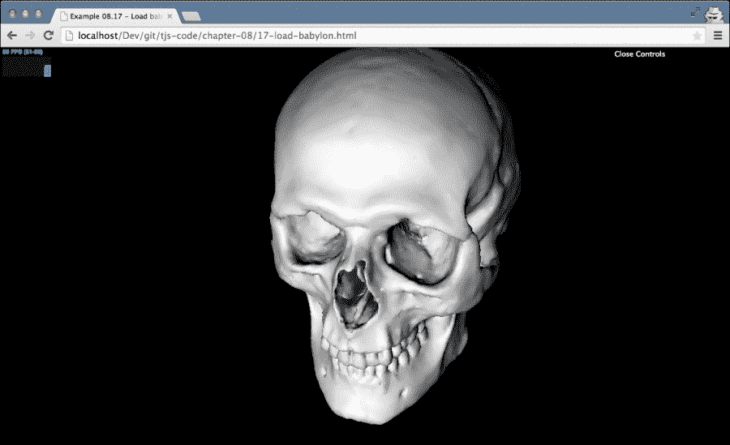 |

如果您查看这些示例的源代码，可能会看到对于其中的一些，我们需要更改一些材质属性或进行一些缩放，以便正确渲染模型。我们需要这样做的原因是因为模型在其外部应用程序中的创建方式，它具有与我们通常在 Three.js 中使用的不同尺寸和分组。

我们几乎展示了所有支持的文件格式。在接下来的两个部分中，我们将采用不同的方法。首先，我们将探讨如何从蛋白质数据银行（PDB 格式）渲染蛋白质，最后我们将使用定义在 PLY 格式的模型来创建粒子系统。

### 显示蛋白质数据银行的蛋白质

蛋白质数据银行 ([www.rcsb.org](http://www.rcsb.org)) 包含关于许多不同分子和蛋白质的详细信息。除了对这些蛋白质的解释外，它们还提供了一种下载这些分子 PDB 格式结构的方法。Three.js 为 PDB 格式的文件提供了加载器。在本节中，我们将给出一个示例，说明您如何解析 PDB 文件并使用 Three.js 可视化它们。

加载新文件格式的第一步，我们总是需要在 Three.js 中包含正确的加载器，如下所示：

```js
<script type="text/javascript" src="img/PDBLoader.js"></script>
```

包含了这个加载器后，我们将创建以下分子描述的 3D 模型（参见 `15-load-ptb.html` 示例）：

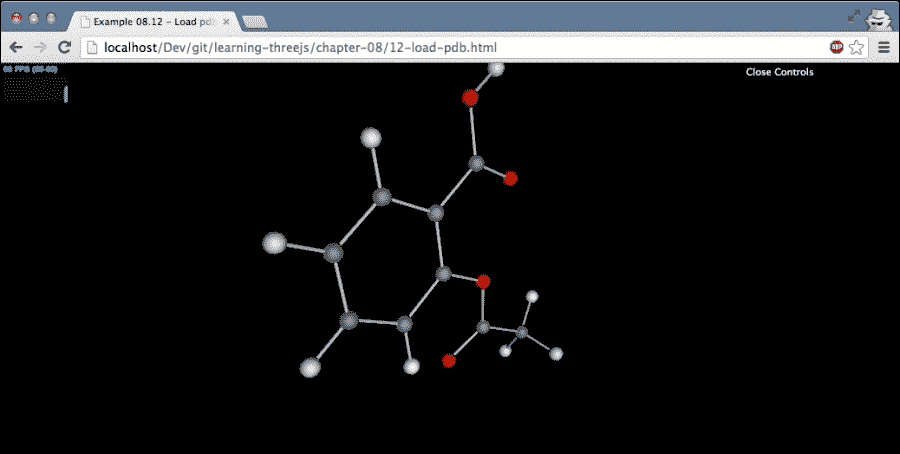

加载 PDB 文件的方式与之前的格式相同，如下所示：

```js
var loader = new THREE.PDBLoader();
var group = new THREE.Object3D();
loader.load("../assets/models/diamond.pdb", function (geometry, geometryBonds) {
  var i = 0;

  geometry.vertices.forEach(function (position) {
    var sphere = new THREE.SphereGeometry(0.2);
    var material = new THREE.MeshPhongMaterial({color: geometry.colors[i++]});
    var mesh = new THREE.Mesh(sphere, material);
    mesh.position.copy(position);
    group.add(mesh);
  });

  for (var j = 0; j < geometryBonds.vertices.length; j += 2) {
    var path = new THREE.SplineCurve3([geometryBonds.vertices[j], geometryBonds.vertices[j + 1]]);
    var tube = new THREE.TubeGeometry(path, 1, 0.04)
    var material = new THREE.MeshPhongMaterial({color: 0xcccccc});
    var mesh = new THREE.Mesh(tube, material);
    group.add(mesh);
  }
  console.log(geometry);
  console.log(geometryBonds);

  scene.add(group);
});
```

从这个示例中可以看出，我们实例化 `THREE.PDBLoader`，传入我们想要加载的模型文件，并提供一个在模型加载时被调用的回调函数。对于这个特定的加载器，回调函数接收两个参数：`geometry` 和 `geometryBonds`。`geometry` 参数提供的顶点包含单个原子的位置，而 `geometryBounds` 用于原子之间的连接。

对于每个顶点，我们创建一个由模型提供的颜色填充的球体：

```js
var sphere = new THREE.SphereGeometry(0.2);
var material = new THREE.MeshPhongMaterial({color: geometry.colors[i++]});
var mesh = new THREE.Mesh(sphere, material);
mesh.position.copy(position);
group.add(mesh)
```

每个连接的定义如下：

```js
var path = new THREE.SplineCurve3([geometryBonds.vertices[j], geometryBonds.vertices[j + 1]]);
var tube = new THREE.TubeGeometry(path, 1, 0.04)
var material = new THREE.MeshPhongMaterial({color: 0xcccccc});
var mesh = new THREE.Mesh(tube, material);
group.add(mesh);
```

对于连接，我们首先使用 `THREE.SplineCurve3` 对象创建一个 3D 路径。这个路径被用作 `THREE.Tube` 的输入，用于创建原子之间的连接。所有的连接和原子都被添加到一个组中，这个组被添加到场景中。你可以从蛋白质数据银行下载许多模型。

下图展示了钻石的结构：

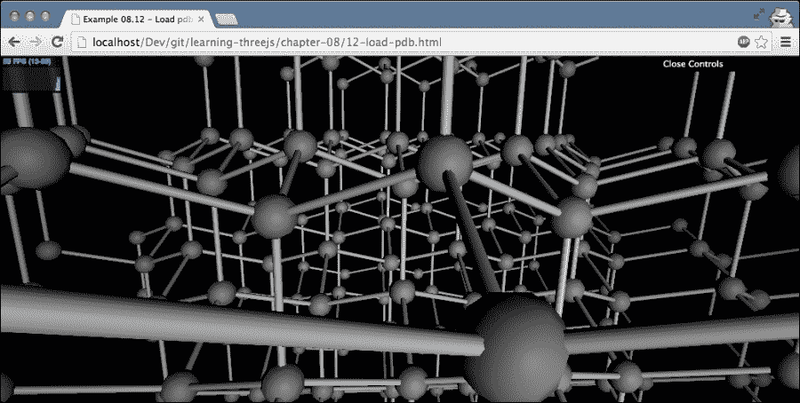

### 从 PLY 模型创建粒子系统

使用 PLY 格式与使用其他格式并没有太大的不同。你包含加载器，提供回调函数，并可视化模型。然而，对于这个最后的例子，我们将做一些不同的事情。我们不会将模型作为网格渲染，而是将使用这个模型的信息来创建一个粒子系统（参见 `15-load-ply.html` 示例）。以下截图展示了这个示例：

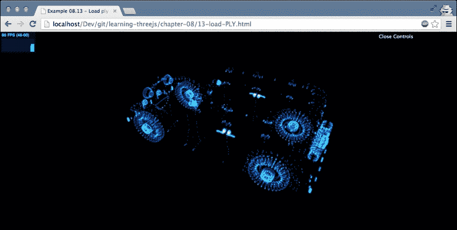

渲染前面截图的 JavaScript 代码实际上非常简单，如下所示：

```js
var loader = new THREE.PLYLoader();
var group = new THREE.Object3D();
loader.load("../assets/models/test.ply", function (geometry) {
  var material = new THREE.PointCloudMaterial({
    color: 0xffffff,
    size: 0.4,
    opacity: 0.6,
    transparent: true,
    blending: THREE.AdditiveBlending,
    map: generateSprite()
  });

  group = new THREE.PointCloud(geometry, material);
  group.sortParticles = true;

  scene.add(group);
});
```

如您所见，我们使用 `THREE.PLYLoader` 来加载模型。回调函数返回 `geometry`，我们将这个几何体作为 `THREE.PointCloud` 的输入。我们使用的材质与上一章最后一个示例中使用的相同。如您所见，使用 Three.js，结合来自不同来源的模型并以不同方式渲染它们非常容易，只需几行代码即可。

# 摘要

在 Three.js 中使用外部模型并不难。特别是对于简单模型，您只需进行几个简单的步骤。当处理外部模型或使用分组和合并创建它们时，有一些事情需要记住。首先，您需要记住的是，当您分组对象时，它们仍然作为单独的对象可用。应用于父对象的变换也会影响子对象，但您仍然可以单独变换子对象。除了分组之外，您还可以合并几何体。采用这种方法，您会失去单个几何体，并获得一个单一的新几何体。当您需要渲染成千上万的几何体并且遇到性能问题时，这种方法特别有用。

Three.js 支持大量外部格式。当使用这些格式加载器时，查看源代码并记录回调中接收到的信息是个好主意。这将帮助您了解获取正确网格并将其设置为正确位置和比例所需的步骤。通常，当模型显示不正确时，这可能是由于其材质设置引起的。可能是使用了不兼容的纹理格式，不透明度定义不正确，或者格式包含指向纹理图像的错误链接。通常，使用测试材质来确定模型本身是否正确加载，并将加载的材质记录到 JavaScript 控制台以检查意外值是个好主意。也有可能导出网格和场景，但请记住，Three.js 的`GeometryExporter`、`SceneExporter`和`SceneLoader`仍在开发中。

在本章以及前几章中，您所使用的模型大多是静态模型。它们没有动画效果，不会移动，也不会改变形状。在下一章中，您将学习如何使您的模型动起来，使其栩栩如生。除了动画之外，下一章还将解释 Three.js 提供的各种相机控制功能。有了相机控制，您可以移动、平移和旋转相机，使其围绕场景旋转。
