# 1

# 使用 Three.js 创建你的第一个 3D 场景

在近年来，现代浏览器获得了可以直接从**JavaScript**访问的强大功能。你可以轻松地使用**HTML5 标签**添加视频和音频，并通过使用**HTML5 Canvas**创建交互式组件。与现代浏览器一起，HTML5 还支持**WebGL**。使用 WebGL，你可以直接利用你的图形卡的处理器资源，创建高性能的 2D 和 3D 计算机图形。直接从 JavaScript 使用 WebGL 创建和动画化 3D 场景是一个非常复杂、冗长且容易出错的流程。**Three.js**是一个库，它使这个过程变得容易得多。以下列表显示了使用 Three.js 可以轻松完成的一些事情：

+   创建简单和复杂的 3D 几何形状，并在任何浏览器中渲染它们

+   在 3D 场景中动画化和移动对象

+   将纹理和材质应用到你的对象上

+   使用不同的光源照亮场景

+   使用 3D 建模软件中的模型，并将生成的模型导出到这些程序中

+   为你的 3D 场景添加高级后处理效果

+   创建并使用自定义着色器

+   创建、可视化和动画点云

+   创建**虚拟现实**（**VR**）和**增强现实**（**AR**）场景

通过几行 JavaScript（或**TypeScript**，正如我们将在本书后面看到的），你可以创建任何东西，从简单的 3D 模型到逼真的场景，所有这些都在浏览器中以实时渲染。例如，*图 1.1*展示了使用 Three.js 可以完成的事情（您可以通过在浏览器中打开[`threejs.org/examples/webgl_animation_keyframes.html`](https://threejs.org/examples/webgl_animation_keyframes.html)来亲自查看动画）：

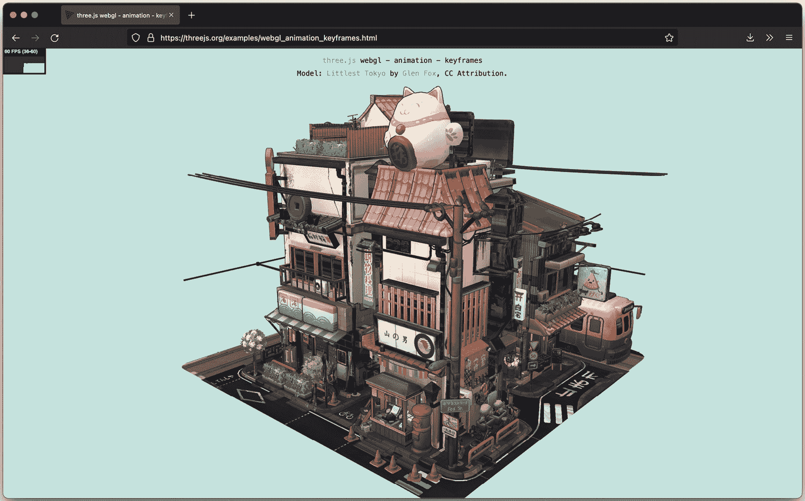

图 1.1 – Three.js 渲染和动画场景

在本章中，我们将直接进入 Three.js，创建几个示例，展示 Three.js 的工作原理，并让你可以用来玩耍和了解 Three.js。我们不会深入所有技术细节；你将在接下来的章节中了解这些。到本章结束时，你将能够创建一个场景，并运行和探索本书中的所有示例。

我们将从这个简短的 Three.js 介绍开始，然后快速进入前几个示例和代码示例。在我们开始之前，让我们快速查看最重要的浏览器及其对 WebGL（和 WebGPU）的支持情况。

注意

目前，所有桌面上的现代浏览器以及移动设备上的浏览器都支持 WebGL。IE 的旧版本（11 版本之前的版本）将无法运行基于 WebGL 的应用程序。在移动设备上，大多数浏览器支持 WebGL。因此，使用 WebGL，你可以在桌面和移动设备上创建运行良好的交互式 3D 可视化。

在本书中，我们将专注于 Three.js 提供的基于 WebGL 的渲染器。然而，也存在一个基于 CSS 3D 的渲染器，它提供了一个简单的 API 来创建基于 CSS 3D 的 3D 场景。使用基于 CSS 3D 的方法的一个大优点是，这个标准在所有移动和桌面浏览器上都得到支持，并允许你在 3D 空间中渲染 HTML 元素。我们不会深入探讨这个浏览器的细节，但将在*第七章*的*点和精灵*示例中展示一个例子。

除了 WebGL 之外，一个名为 WebGPU 的新标准正在开发中，它将提供比 WebGL 更好的性能，并在未来成为新的标准。当你使用 Three.js 时，你不必担心这个变化。Three.js 已经部分支持 WebGPU，随着该标准的成熟，Three.js 对该标准的支持也将成熟。因此，你用 Three.js 创建的一切也将与 WebGPU 无缝工作。

在本章中，你将直接创建一个 3D 场景，并能够在桌面或移动设备上运行它。我们将解释 Three.js 的核心概念，如果有更高级的主题，我们将在哪一章中更详细地解释这些内容。在本章中，我们将创建两个不同的场景。第一个场景将展示在 Three.js 中渲染的基本几何形状，如图下所示：

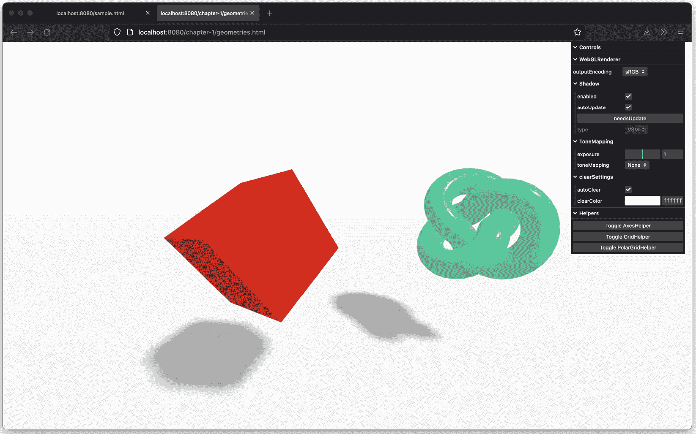

图 1.2 – 默认几何形状渲染

之后，我们还会快速展示如何加载外部模型，以及创建看起来逼真的场景是多么容易。第二个示例的结果将如下所示：

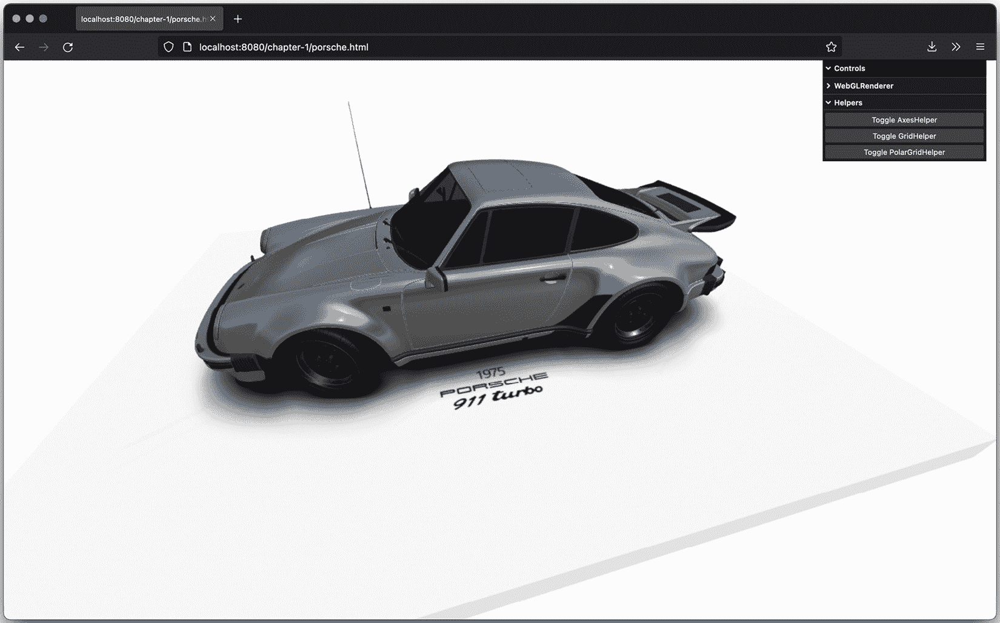

图 1.3 – 渲染外部加载的模型

在你开始这些示例之前，在接下来的几个部分中，我们将探讨你需要的工具，以及如何下载本书中展示的示例。

在本章中，我们将涵盖以下主题：

+   使用 Three.js 的要求

+   下载本书中使用的源代码和示例

+   测试和实验示例

+   渲染和查看 3D 对象

+   介绍几个用于统计和场景控制的辅助库

# 技术要求

Three.js 是一个 JavaScript **库**，因此你只需要一个文本编辑器和支持渲染结果的浏览器之一来创建 Three.js WebGL 应用程序。我推荐以下文本编辑器，我在过去几年中为各种项目广泛使用过：

+   **Visual Studio Code**：这个来自微软的免费编辑器在所有主要平台上运行，提供了基于类型、函数定义和导入库的出色语法高亮和智能完成。它提供了一个非常干净的界面，非常适合 JavaScript 项目开发。您可以从这里下载：[`code.visualstudio.com/`](https://code.visualstudio.com/)。如果您不想下载此编辑器，也可以直接导航到[`vscode.dev/`](https://vscode.dev/)，它将在您的浏览器中直接启动一个编辑器，您可以通过它连接到 GitHub 仓库或访问本地文件系统上的目录。

+   **WebStorm**：来自*JetBrains*的此编辑器提供了出色的 JavaScript 编辑支持。它支持代码补全、自动部署和 JavaScript 调试，直接从编辑器中进行。除此之外，WebStorm 对 GitHub（和其他版本控制系统）有出色的支持。您可以从[`www.jetbrains.com/webstorm/`](http://www.jetbrains.com/webstorm/)下载试用版。

+   **Notepad++**：Notepad++是一个通用编辑器，支持多种编程语言的代码高亮显示。它可以轻松地布局和格式化 JavaScript。请注意，Notepad++仅适用于 Windows。您可以从[`notepad-plus-plus.org/`](http://notepad-plus-plus.org/)下载 Notepad++。

+   **Sublime Text Editor**：Sublime 是一个优秀的编辑器，提供了非常好的 JavaScript 编辑支持。除此之外，它还提供了许多非常有用的选择（如多行选择）和编辑选项，一旦您习惯了它们，就能提供一个真正优秀的 JavaScript 编辑环境。Sublime 可以免费测试，并可以从[`www.sublimetext.com/`](http://www.sublimetext.com/)下载。

即使您不使用这些编辑器，也有很多编辑器可供选择，包括开源和商业的，您可以使用它们来编辑 JavaScript 并创建您的 Three.js 项目，因为您需要的只是文本编辑的能力。一个您可能想查看的项目是 AWS Cloud9 ([`c9.io`](http://c9.io))。这是一个基于云的 JavaScript 编辑器，可以连接到 GitHub 账户。这样，您可以直接访问本书的所有源代码和示例，并对其进行实验。

注意

除了这些基于文本的编辑器，您可以使用它们来编辑和实验本书的源代码，Three.js 目前还提供了一个在线编辑器。

使用这个编辑器，您可以在[`threejs.org/editor/`](http://threejs.org/editor/)找到它，通过图形化方式创建 Three.js 场景。

我建议选择 Visual Studio Code。这是一个非常轻量级的编辑器，对 JavaScript 有很好的支持，并且有几个其他扩展，使编写 JavaScript 应用程序变得更加容易。

之前我提到，大多数现代网络浏览器都支持 WebGL，并且可以用来运行 Three.js 示例。我通常在 Firefox 中运行我的代码。原因是，Firefox 通常对 WebGL 有最好的支持和性能，并且它有一个出色的 JavaScript 调试器。使用这个调试器，如图下所示，你可以通过使用断点和控制台输出等方式快速定位问题：

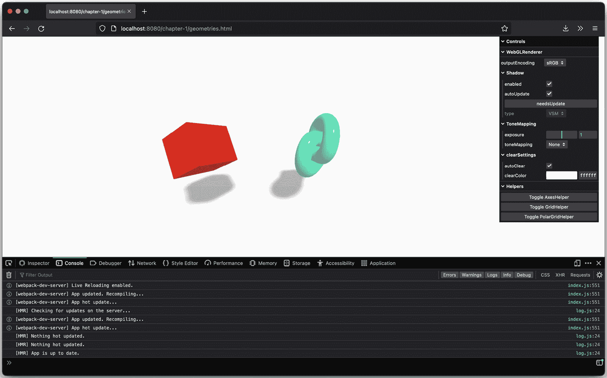

图 1.4 – Firefox 调试器

注意

本书中的所有示例都可以像在 Firefox 中一样在 Chrome 中运行。所以，如果你选择的是这个浏览器，当然可以使用它。

在本书中，我将为您提供调试器使用和其他调试技巧的指导。现在就介绍到这里；让我们获取源代码，并从第一个场景开始。

## 获取源代码

本书的所有代码都可在 GitHub 上找到 ([`github.com/PacktPublishing/Learn-Three.js-Fourth-edition`](https://github.com/PacktPublishing/Learn-Three.js-Fourth-edition))。GitHub 是一个托管 Git 仓库的网站。你可以使用这些来存储、访问和版本控制源代码。你可以通过以下几种方式获取源代码：你可以做以下任何一种：

+   克隆 Git 仓库。这意味着你使用 `git` 命令行工具获取本书源代码的最新版本。

+   从 GitHub 下载并解压存档，其中包含所有内容。

在接下来的两个小节中，我们将更详细地探讨这些选项。

### 使用 git 克隆仓库

获取所有示例的一种方法是通过 `git` 命令行工具克隆此仓库。为此，你需要为你的操作系统下载一个 Git 客户端。如果你有一个最新的操作系统，你可能已经安装了 Git。你可以在终端中快速检查这一点，如下所示：

```js
$ git --version
git version 2.30.1 (Apple Git-130)
```

如果命令尚未安装，你可以从这里获取客户端和安装说明：[`git-scm.com`](http://git-scm.com)。安装 Git 后，你可以使用 `git` 命令行工具克隆本书的仓库。打开命令提示符并转到你想下载源代码的目录。在该目录中，运行以下命令：

```js
$ git clone https://github.com/PacktPublishing/Learn-Three.js-Fourth-edition.
git clone git@github.com:PacktPublishing/Learn-Three.js-Fourth-edition.git
Cloning into 'learning-threejs-fourth'...
remote: Enumerating objects: 96, done.
remote: Counting objects: 100% (96/96), done.
remote: Compressing objects: 100% (85/85), done.
fetch-pack: unexpected disconnect while reading sideband packet
...
```

完成此操作后，所有源代码都将下载到 `learning-threejs-fourth` 目录中。从该目录，你可以运行本书中解释的所有示例。

### 下载和解压存档

如果你不想使用 `git` 直接从 GitHub 下载源代码，你也可以下载一个存档。在浏览器中打开 [`github.com/PacktPublishing/Learn-Three.js-Fourth-edition`](https://github.com/PacktPublishing/Learn-Three.js-Fourth-edition)，点击右侧的 **Code** 按钮。这将给你一个选项，通过点击 **Download** **ZIP** 选项来下载所有源代码的单一 ZIP 文件：

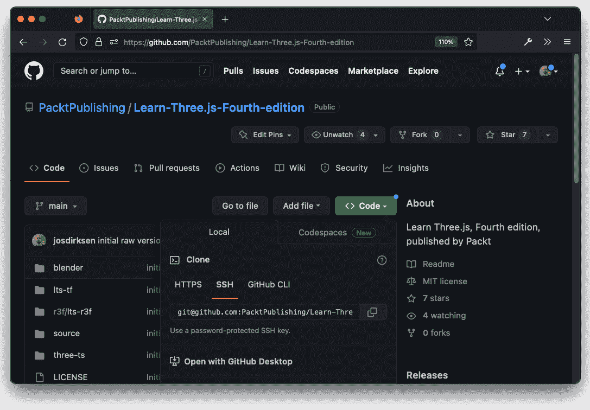

图 1.5 – 从 GitHub 下载存档

将其解压到您选择的目录后，所有示例都将可用。

注意

您也可以从您在 [`www.packtpub.com`](http://www.packtpub.com) 的账户下载示例代码文件，以获取您购买的所有 Packt 出版物的书籍。如果您在其他地方购买了这本书，您可以访问 [`www.packtpub.com/support`](http://www.packtpub.com/support) 并注册，以便将文件直接通过电子邮件发送给您。

现在你已经下载或克隆了源代码，让我们快速检查一切是否正常工作，并熟悉目录结构。

# 测试和实验示例

代码和示例按章节组织，并且，我们将提供一个简单的集成服务器，您可以使用它来访问所有示例。要启动并运行此服务器，我们需要安装 *Node.js* 和 *npm*。这些工具用于管理 JavaScript 包和构建 JavaScript 应用程序，并使我们的 Three.js 代码模块化以及集成现有的 JavaScript 库变得更加容易。

要安装这两个工具，请访问 [`nodejs.org/en/download/`](https://nodejs.org/en/download/) 并选择适合您操作系统的适当安装程序。安装完成后，打开一个终端并检查一切是否正常。在我的机器上，以下版本正在使用：

```js
$ npm --version
8.3.1
$ node --version
v16.14.0
```

一旦安装了这些工具，我们需要在构建和访问示例之前执行几个步骤来获取所有外部需要的依赖项：

1.  首先，我们需要下载示例中使用的所有外部库。例如，Three.js 是我们需要下载的依赖项之一。

要下载所有依赖项，请在下载或提取所有示例的目录中运行以下命令：

```js
$ npm install
added 570 packages, and audited 571 packages in 21s
```

前面的命令将开始下载所有必需的 JavaScript 库并将这些存储在 `node_modules` 文件夹中。

1.  接下来，我们需要构建示例。这样做会将我们的源代码和外部库合并成一个文件，我们可以在浏览器中查看。

要使用 `npm` 构建示例，请使用以下命令：

```js
$ npm run build
> ltjs-fourth@1.0.0 build
> webpack build
...
```

注意，您只需运行前面的两个命令一次。

1.  有了这些，所有示例都将构建完成，并准备好供你探索。要打开这些示例，你需要一个网络服务器。要启动服务器，只需运行以下命令：

    ```js
    $ npm run serve
    ```

    ```js
    > ltjs-fourth@1.0.0 serve
    ```

    ```js
    > webpack serve –open
    ```

    ```js
    <i> [webpack-dev-server] Project is running at:
    ```

    ```js
    <i> [webpack-dev-server] Loopback: http://localhost:8080/
    ```

    ```js
    <i> [webpack-dev-server] On Your Network (Ipv4): http://192.168.68.144:8080/
    ```

    ```js
    <i> [webpack-dev-server] On Your Network (Ipv6): http://[fe80::1]:8080/
    ```

    ```js
    …
    ```

到目前为止，你可能已经注意到 `npm` 已经打开了您的默认浏览器，并显示了 `http://localhost:8080` 的内容（如果这不是这种情况，只需打开您选择的浏览器并导航到 `http://localhost:8080`）。您将看到一个所有章节的概述。在每个这些子文件夹中，您将找到该章节中解释的示例：

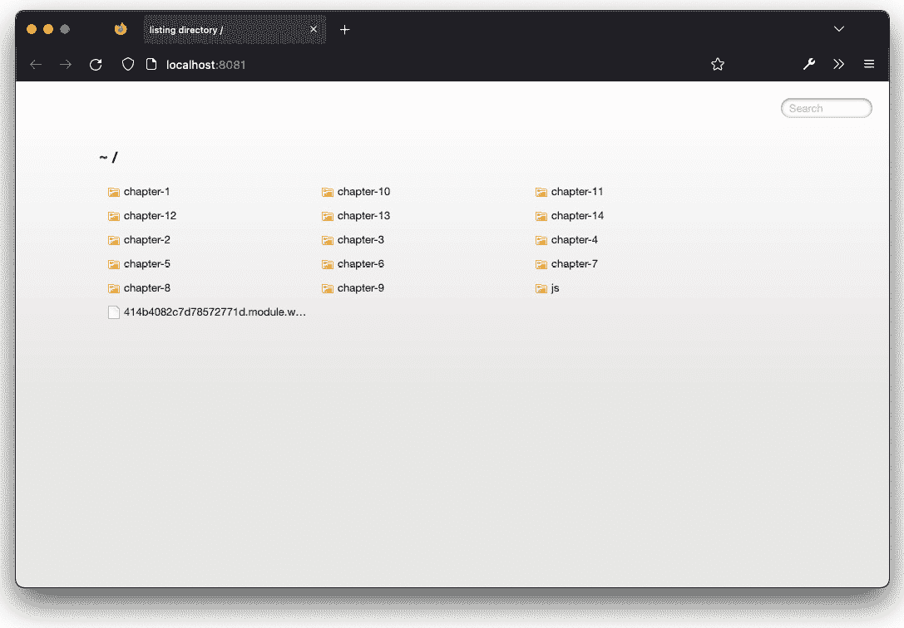

图 1.6 – 所有章节和示例概述

这个服务器的一个非常有趣的特点是，我们现在可以看到我们对源代码所做的更改立即反映在浏览器中。如果你是通过运行`npm run serve`来启动服务器的，请打开你从下载的源中在编辑器中打开的`chapter-01/geometries.js`示例，并更改一些内容；你会在保存更改后看到，在浏览器中这些更改也是同时发生的。这使得测试更改和微调颜色和灯光变得容易得多。如果你在你的代码编辑器中打开`chapter-01/geometries.js`文件，并在你的浏览器中打开`http://localhost:8080/chapter-01/geometries.html`示例，你就可以看到这个功能是如何工作的。在你的编辑器中，更改立方体的颜色。为此，找到以下代码：

```js
initScene(props)(({ scene, camera, renderer, orbitControls }) => {
  const geometry = new THREE.BoxGeometry();
  const cubeMaterial = new THREE.MeshPhongMaterial({
    color: 0xFF0000,
  });
```

更改为以下内容：

```js
initScene(props)(({ scene, camera, renderer, orbitControls }) => {
  const geometry = new THREE.BoxGeometry();
  const cubeMaterial = new THREE.MeshPhongMaterial({
    color: 0x0000FF,
  });
```

现在，当你保存文件时，你会立即看到浏览器中立方体的颜色发生了变化，而无需刷新浏览器或做其他任何事情。

注意

本书中所使用的设置是众多可用于开发 Web 应用的多种方法之一。或者，你也可以直接在 HTML 文件中包含 Three.js（以及其他库），或者使用与 Three.js 网站上的示例相同的`import-maps`方法。所有这些方法都有其优缺点。对于本书，我们选择了一种方法，这使得在浏览器中实验源代码变得容易，并且与这些类型的应用程序通常的构建方式非常相似。

要了解所有这些是如何协同工作的，一个很好的起点是查看我们在浏览器中打开的 HTML 文件。

# 探索 Three.js 应用程序的 HTML 结构

在本节中，我们将查看`geometries.html`文件的源代码。你可以通过在浏览器中查看源代码或从与本书源代码下载相同位置的`dist/chapter-1`文件夹中打开文件来完成此操作：

```js
<!DOCTYPE html>
<html>
<head>
  <meta charset="utf-8">
  <style>
    body {
      margin: 0;
    }
  </style>
  <script defer src="../js/vendors-node_modules_three_
    build_three_module_js.js"></script>
  <script defer src="../js/vendors-node_modules_lil-gui_
    dist_lil-gui_esm_js.js"></script>
  <script defer src="../js/vendors-node_modules_three_
    examples_jsm_controls_OrbitControls_js.js"></script>
  <script defer src="img/geometries.js"></script>
</head>
<body>
</body>
</html>
```

这段代码是在你运行`npm run build`步骤时生成的。这将把所有你使用的源代码和外部库组合成单独的源文件（称为包），并将它们添加到这个页面中。所以，你不需要自己这样做。前三个`<script>`标签指的是我们使用的任何外部库。在本书的后面部分，我们将介绍其他库，如`<style>`和`<body>`。`<style>`用于禁用页面上的任何边距，这样我们就可以使用完整的浏览器视口来显示我们的 3D 场景。此外，我们将通过编程方式将 3D 场景添加到空的`<body>`元素中，我们将在下一节中解释。

如果你确实想在这里添加自定义的 HTML 元素，当然可以。在下载的代码根目录下，你会找到一个`template.html`文件，该文件在构建过程中被用来为示例创建单独的 HTML 文件。你添加到那里的任何内容都将被添加到所有示例中。我们不会深入探讨其工作原理，因为这超出了本书的范围。然而，如果你想了解更多关于其工作原理的信息，以下是一些关于*webpack*（我们用于此）的优质资源：

+   webpack 入门指南：[`webpack.js.org/guides/getting-started/`](https://webpack.js.org/guides/getting-started/)。这个网站包含一个教程，解释了为什么我们需要 webpack 进行 JavaScript 开发，以及基本概念是如何工作的。

+   关于*HTML webpack 插件*的信息：[`github.com/jantimon/html-webpack-plugin`](https://github.com/jantimon/html-webpack-plugin)。在这里，你可以找到关于我们使用的 webpack 插件的信息，该插件用于将源代码组合成你在运行`npm run build`并在之后运行`npm run serve`后打开浏览器时看到的单独 HTML 页面。

注意，我们不必显式初始化场景或调用 JavaScript。每次我们打开这个页面，并且`geometries.js`文件被加载时，该文件中的 JavaScript 就会运行并创建我们的 3D 场景。

现在我们已经设置了基本结构，我们可以创建并渲染我们的第一个场景。

# 渲染和查看 3D 对象

在本节中，你将创建你的第一个场景，这是一个看起来像这样的简单 3D 场景：


图 1.7 – 包含两个标准几何形状的第一个场景

在前面的屏幕截图中，你可以看到两个旋转的对象。这些对象被称为*网格*。网格描述了对象的几何形状——即其形状——并包含有关对象材料的信息。网格决定了形状如何通过如颜色等特性在屏幕上显示，或者对象是闪亮的还是透明的。

在前面的屏幕截图中，我们可以识别出这三个网格：

| **对象** | **描述** |
| --- | --- |
| **平面** | 这是一个二维矩形，作为地面区域。在图 1.7 中，你可以看到它，因为它显示了两个网格的阴影。我们将创建一个非常大的矩形，这样你就看不到任何边缘。 |
| **立方体** | 这是一个三维立方体，如图 1.7 左边的所示。它以红色渲染。 |
| **环面结** | 这是图 1.7 右边可以看到的*环面结*。这个以绿色渲染。 |

图 1.8 – 场景中对象的概述

要将所有这些显示在屏幕上，我们需要执行几个步骤，我们将在接下来的章节中解释。

## 设置场景

每个 Three.js 应用程序至少需要一个相机、一个场景和一个渲染器。场景是包含所有对象（网格、相机和灯光）的容器，相机确定渲染时显示场景的哪个部分，渲染器负责在屏幕上创建输出，考虑到场景中网格、相机和灯光的所有信息。

我们将要讨论的所有代码都可以在 `chapter-1/getting-started.js` 文件中找到。这个文件的基本结构如下：

```js
import * as THREE from "three";
import Stats from 'three/examples/jsm/libs/stats.module'
import { OrbitControls } from 'three/examples/jsm/controls/OrbitControls'
// create a scene
...
// setup camera
...
// setup the renderer and attach to canvas
...
// add lights
...
// create a cube and torus knot and add them to the scene
...
// create a very large ground plane
...
// add orbitcontrols to pan around the scene using the
   mouse
...
// add statistics to monitor the framerate
...
// render the scene
```

如果你回顾前面的步骤，可能会注意到这些步骤对于你创建的每个场景都是相同的。由于这本书中有许多示例展示了 Three.js 的不同功能，我们将把这段代码提取到几个辅助文件中。我们将在本章末尾展示如何做到这一点。现在，我们将逐步介绍不同的步骤，并介绍 Three.js 场景的基本组件。

首先，我们必须创建一个 `THREE.Scene`。这是一个基本的容器，将包含所有的网格、灯光和相机，并具有一些简单的属性，我们将在下一章中更深入地探讨：

```js
// basic scene setup
const scene = new THREE.Scene();
scene.backgroundColor = 0xffffff;
scene.fog = new THREE.Fog(0xffffff, 0.0025, 50);
```

在这里，我们将创建一个容器对象，用于存放所有我们的对象，将此场景的背景颜色设置为白色（`0xffffff`），并在此场景中启用雾效。启用雾效后，远离相机的对象将逐渐被雾隐藏。

下一步是创建相机和渲染器：

```js
// setup camera and basic renderer
const camera = new THREE.PerspectiveCamera(
  75,
  window.innerWidth / window.innerHeight,
  0.1,
  1000
);
camera.position.x = -3;
camera.position.z = 8;
camera.position.y = 2;
// setup the renderer and attach to canvas
const renderer = new THREE.WebGLRenderer({ antialias: true
  });
renderer.outputEncoding = THREE.sRGBEncoding;
renderer.shadowMap.enabled = true;
renderer.shadowMap.type = THREE.VSMShadowMap;
renderer.setSize(window.innerWidth, window.innerHeight);
renderer.setClearColor(0xffffff);
document.body.appendChild(renderer.domElement);
```

在前面的代码中，我们创建了一个 `PerspectiveCamera`，它决定了场景的哪个部分被渲染。不要过于担心这一点，因为我们将在 *第三章* 中详细讨论这些参数，*在 Three.js 中处理光源*。我们还把相机定位在指定的 *x-、y-、z-* 坐标上。默认情况下，相机将朝向场景的中心（即 `0`、`0`、`0`），所以我们不需要为此做任何改变。

在这个代码片段中，我们还创建了一个 `WebGLRenderer`，我们将使用它来渲染相机在场景中的视图。现在忽略其他属性；我们将在下一章中详细介绍 `WebGLRenderer` 的细节，以及如何调整颜色和与阴影一起工作。一个值得注意的有趣部分是 `document.body.appendChild(renderer.domElement)`。这一步将一个 HTML `canvas` 元素添加到页面中，显示渲染器的输出。你可以在浏览器中检查页面时看到这一点：

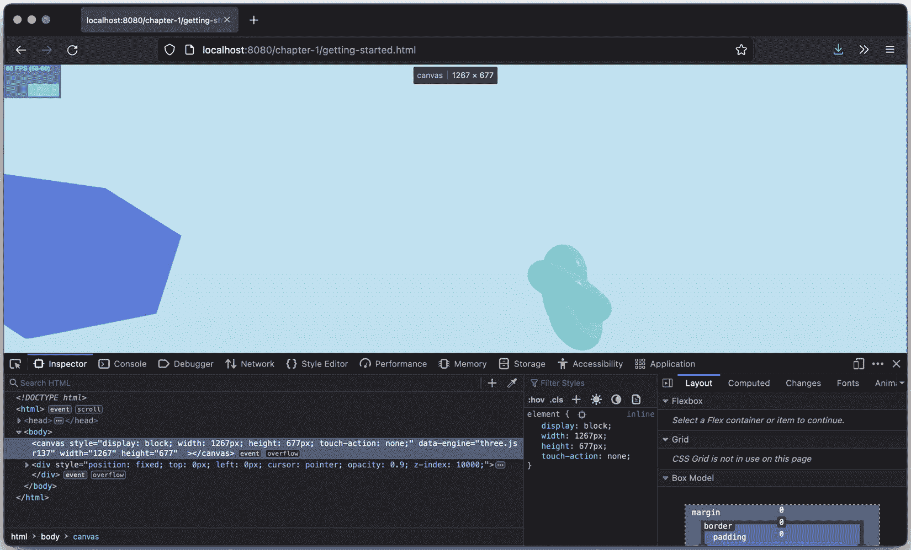

图 1.9 – 由 Three.js 添加的画布

到目前为止，我们有一个空的 `THREE.Scene`、一个 `THREE.PerspectiveCamera` 和一个 `THREE.WebGLRenderer`。如果我们向场景添加一些对象，我们就可以在屏幕上显示一些输出。不过，在我们这样做之前，我们还会添加一些额外的组件：

+   **OrbitControls**：这将允许你使用鼠标旋转和平移场景

+   **灯光**：这允许我们使用一些更高级的材质，投射阴影，并使我们的场景看起来更好

在下一节中，我们将首先添加灯光。

## 添加灯光

如果场景中没有灯光，大多数材质将被渲染为黑色。所以，为了看到我们的网格（并获得阴影），我们需要在场景中添加一些灯光。在这种情况下，我们将添加两个灯光：

+   `THREE.AmbientLight`：这只是影响一切物体强度和颜色相同的一个简单灯光。

+   `THREE.DirectionalLight`：这是一种光线彼此平行的光源。这正是我们体验太阳光的方式。

以下代码片段展示了如何做到这一点：

```js
// add lights
scene.add(new THREE.AmbientLight(0x666666))
const dirLight = new THREE.DirectionalLight(0xaaaaaa)
dirLight.position.set(5, 12, 8)
dirLight.castShadow = true
// and some more shadow related properties
```

再次，这些灯光可以通过各种方式配置，具体细节我们将在*第三章*中解释。到目前为止，我们已经准备好了所有渲染场景的组件，所以让我们添加网格。

## 添加网格

在下面的代码片段中，我们在场景中创建了三个网格：

```js
// create a cube and torus knot and add them to the scene
const cubeGeometry = new THREE.BoxGeometry();
const cubeMaterial = new THREE.MeshPhongMaterial({ color:
  0x0000FF });
const cube = new THREE.Mesh(cubeGeometry, cubeMaterial);
cube.position.x = -1;
cube.castShadow = true;
scene.add(cube);
const torusKnotGeometry = new THREE.TorusKnotBufferGeometry(0.5, 0.2, 100, 100);
const torusKnotMat = new THREE.MeshStandardMaterial({
  color: 0x00ff88,
  roughness: 0.1,
});
const torusKnotMesh = new THREE.Mesh(torusKnotGeometry, torusKnotMat);
torusKnotMesh.castShadow = true;
torusKnotMesh.position.x = 2;
scene.add(torusKnotMesh);
// create a very large ground plane
const groundGeometry = new THREE.PlaneBufferGeometry(10000,
  10000)
const groundMaterial = new THREE.MeshLambertMaterial({
  color: 0xffffff
})
const groundMesh = new THREE.Mesh(groundGeometry, groundMaterial)
groundMesh.position.set(0, -2, 0)
groundMesh.rotation.set(Math.PI / -2, 0, 0)
groundMesh.receiveShadow = true
scene.add(groundMesh)
);
```

在这里，我们创建了一个立方体、一个环面结和地面。所有这些网格都遵循同样的理念：

1.  我们创建形状——即物体的几何形状：一个`THREE.BoxGeometry`，一个`THREE.TorusKnotBufferGeometry`和一个`THREE.PlaneBufferGeometry`。

1.  我们创建材质。在这种情况下，我们为立方体使用`THREE.MeshPhongMaterial`，为环面结使用`THREE.MeshStandardMaterial`，为地面使用`THREE.MeshLambertMaterial`。立方体的颜色是蓝色，环面结的颜色是绿色的，地面的颜色是白色的。在*第四章*中，我们将探讨所有这些材质，它们最适合在哪里使用，以及如何配置它们。

1.  我们告诉 Three.js 立方体和环面结可以投射阴影，而地面将接收阴影。

1.  最后，从形状和材质中创建一个`THREE.Mesh`，定位网格，并将其添加到场景中。

到目前为止，我们只需要调用`renderer.render(scene, camera)`。你将在屏幕上看到结果：

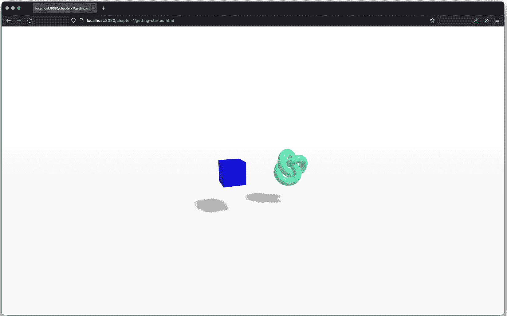

图 1.10 – 几何形状渲染器 – 静态

如果你已经有了源文件（`chapter-01/getting-started.js`），请在你的编辑器中打开它；现在也是尝试一些设置的好时机。通过改变`torusKnot.position.x`、`torusKnot.position.y`和`torusKnot.position.z`设置，你可以将环面结在场景中移动（更改将在你在编辑器中保存文件后生效）。你还可以通过改变材质的`color`属性轻松地更改网格的颜色。

## 添加动画循环

在这一点上，场景非常静态。你不能移动相机，也没有任何东西在移动。如果我们想对场景进行动画处理，我们首先需要找到一种方法在特定的时间间隔重新渲染场景。在 HTML5 和相关 JavaScript API 出现之前，我们通过使用`setInterval(function,interval)`函数来完成这个任务。使用`setInterval`，我们可以指定一个函数，例如，每 100 毫秒被调用一次。这个函数的问题在于它没有考虑到浏览器中的情况。如果你在浏览另一个标签页，这个函数仍然会每隔几毫秒被触发。除此之外，当屏幕重绘时，`setInterval`并不同步。这可能导致 CPU 使用率更高，闪烁，以及整体性能较差。

幸运的是，现代浏览器通过`requestAnimationFrame`函数提供了解决方案。

### 介绍 requestAnimationFrame

使用`requestAnimationFrame`，你可以指定一个在特定间隔被调用的函数。然而，你并不定义这个间隔。这个间隔由浏览器定义。你需要在提供的函数中完成任何需要的绘图，浏览器将确保尽可能平滑和高效地绘制。使用它很简单。我们只需添加以下代码：

```js
function animate() {
  requestAnimationFrame(animate);
  renderer.render(scene, camera);
}
animate();
```

在前面的`animate`函数中，我们再次调用了`requestAnimationFrame`，以保持动画的持续。我们唯一需要更改的代码是，在创建完整的场景之后，我们不是调用`renderer.render`，而是调用一次`animate()`函数来启动动画。如果你运行这个示例，与上一个示例相比，你不会看到任何变化，因为我们没有在这个`animate()`函数中做任何更改。然而，在我们向这个函数添加更多功能之前，我们将介绍一个小型的辅助库**stats.js**，它提供了关于动画运行帧率的详细信息。这个库与 Three.js 的作者相同，它渲染一个小型图表，显示场景渲染速率的信息。

要添加这些统计数据，我们只需要导入正确的模块并将其添加到我们的页面中：

```js
import Stats from 'three/examples/jsm/libs/stats.module'
const stats = Stats()
document.body.appendChild(stats.dom)
```

如果你保持这个状态，你会在屏幕左上角看到一个漂亮的统计计数器，但什么都不会发生。原因是我们需要告诉这个元素我们是否处于`requestAnimationFrame`循环中。为此，我们只需要在我们的`animate`函数中添加以下内容：

```js
function animate() {
  requestAnimationFrame(animate);
  stats.update();
  renderer.render(scene, camera);
}
animate();
```

如果你打开`chapter-1/getting-started.html`示例，你会看到屏幕左上角显示了一个**每秒帧数**（**FPS**）计数器：

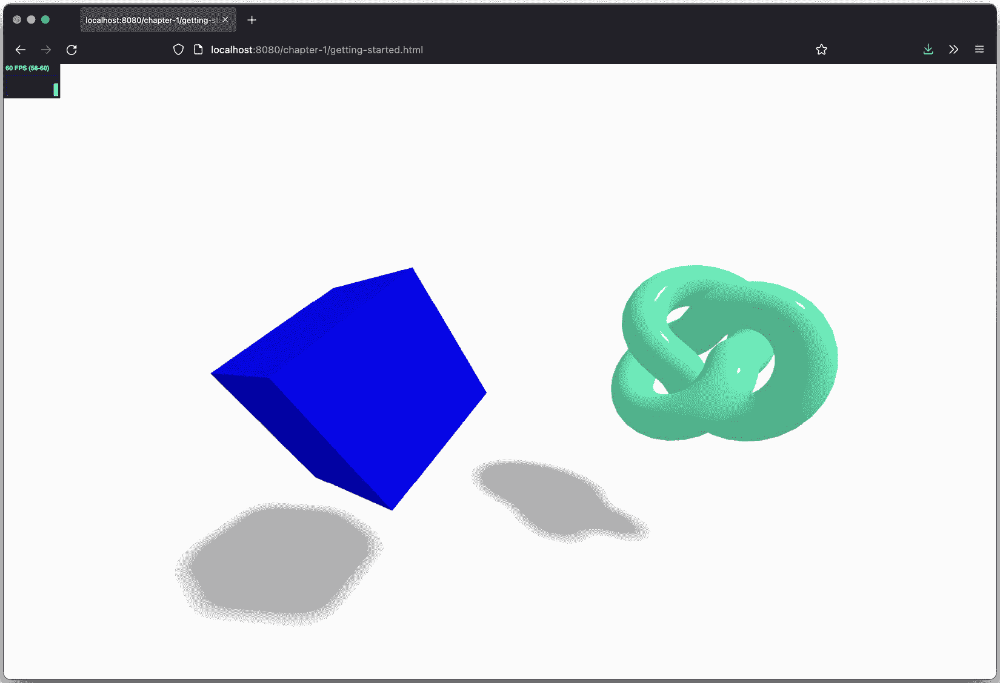

图 1.11 – FPS 统计信息

在`chapter-1/getting-started.html`示例中，你可以看到环面结和立方体正在它们的轴上移动。在下一节中，我们将解释如何通过扩展`animate()`函数来完成这个操作。

### 网格动画

配置了`requestAnimationFrame`和统计信息后，我们就有了放置动画代码的地方。我们只需要将以下内容添加到`animate()`函数中：

```js
cube.rotation.x += 0.01;
cube.rotation.y += 0.01;
cube.rotation.z += 0.01;
torusKnotMesh.rotation.x -= 0.01;
torusKnotMesh.rotation.y += 0.01;
torusKnotMesh.rotation.z -= 0.01;
```

这看起来很简单，对吧？我们每次调用`animate()`函数时，都会将每个轴的旋转属性增加 0.01，这表现为网格在所有轴上平滑旋转。如果我们改变位置而不是围绕轴旋转，我们可以移动网格：

```js
let step = 0;
animate() {
  ...
  step += 0.04;
  cube.position.x = 4*(Math.cos(step));
  cube.position.y = 4*Math.abs(Math.sin(step));
  ...
}
```

对于立方体，我们已经在场景中改变了`rotation`属性；现在，我们还将改变其`position`属性。我们希望立方体在场景中的一个点到另一个点之间以平滑的曲线弹跳。为此，我们需要改变其在*X*轴和*y*轴上的位置。`Math.cos`和`Math.sin`函数帮助我们使用`step`变量创建平滑的轨迹。这里我不会详细介绍它是如何工作的。现在，你需要知道的是，`step+=0.04`定义了弹跳球体的速度。如果你想自己启用这个功能，请打开`chapter-1/geometries.js`文件，并取消注释`animate()`函数中的部分。一旦这样做，你将在屏幕上看到类似这样的效果，其中蓝色的立方体在场景中舞动：

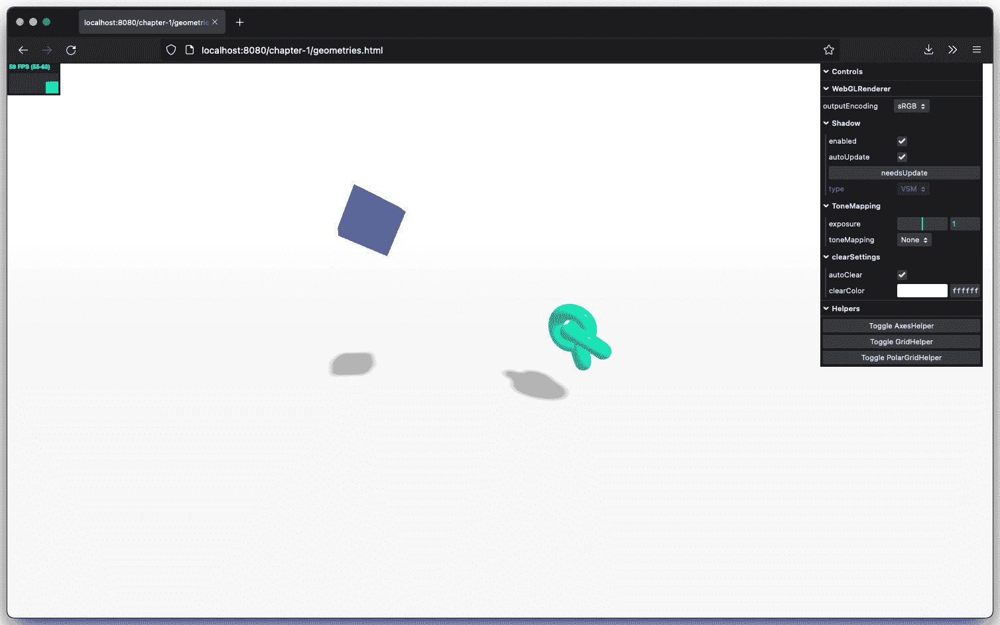

图 1.12 – 跳跃的蓝色立方体

### 启用轨道控制

如果你尝试用鼠标移动场景，不会发生太多变化。这是因为我们给相机添加了一个固定位置，并且在动画循环中没有更新其位置。当然，我们可以像处理立方体的位置一样做这件事，但 Three.js 自带了几个*控制*，允许你轻松地在场景中平移并移动相机。在这个例子中，我们将介绍`THREE.OrbitControls`。有了这些控制，你可以使用鼠标在场景中移动相机并查看不同的对象。为了使这个功能正常工作，我们只需要创建这些控制的新实例，将其附加到相机上，并在动画循环中调用`update`函数：

```js
const orbitControls = new OrbitControls(camera, renderer.
  domElement)
// and the controller has a whole range of other properties we can set
function animate() {
  ...
  orbitControls.update();
}
```

现在，你可以使用鼠标在场景中导航。这已经在`chapter-1/getting-started.html`示例中启用：

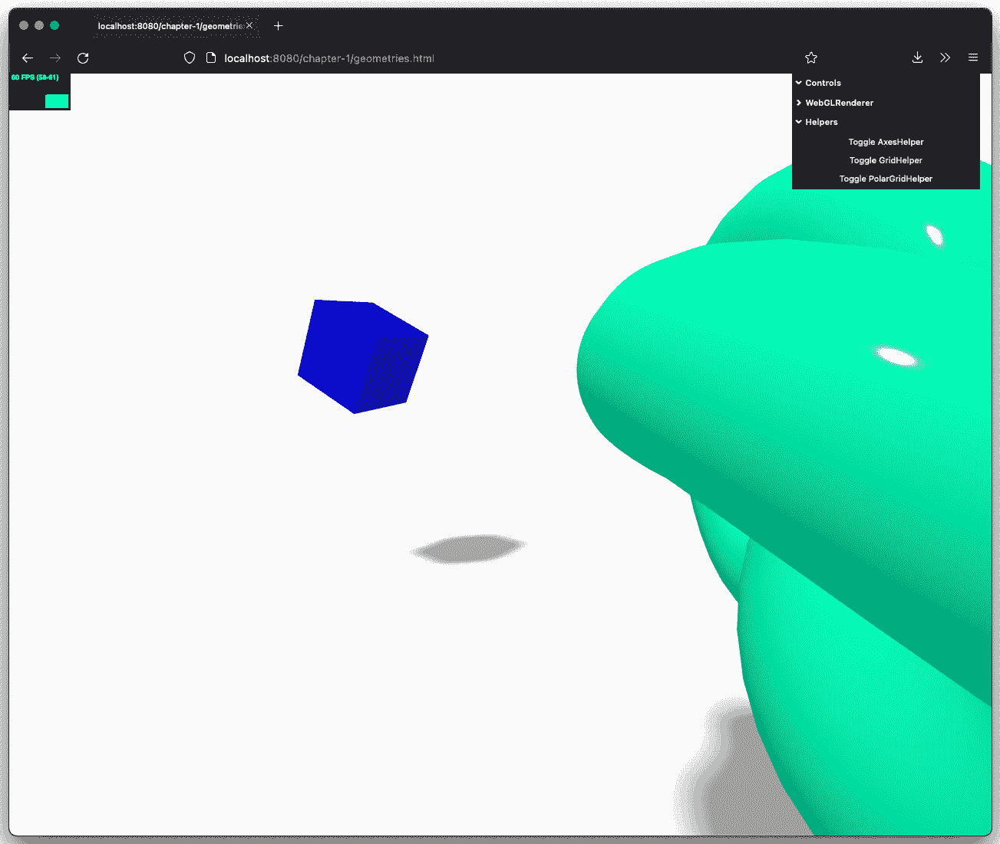

图 1.13 – 使用轨道控制进行缩放

在结束本节之前，我们将向我们的基本场景添加一个额外的元素。当与 3D 场景、动画、颜色和属性一起工作时，通常需要一些实验来获得正确的颜色、动画速度或材质属性。如果你有一个简单的**GUI**，可以让你实时更改这些属性，那就太容易了。幸运的是，你确实有！

## 使用 lil-gui 来控制属性并简化实验

在上一个示例中，我们为环面结和立方体添加了一点点动画。现在，我们将创建一个简单的 UI 元素，使我们能够控制旋转的速度和移动。为此，我们将使用来自[`lil-gui.georgealways.com/`](https://lil-gui.georgealways.com/)的`lil-gui`库。这个库允许我们快速创建一个简单的控制 UI，使实验场景变得更加容易。它可以按照以下方式添加：

```js
import GUI from "lil-gui";
...
const gui = new GUI();
const props = {
  cubeSpeed: 0.01,
  torusSpeed: 0.01,
};
gui.add(props, 'cubeSpeed', -0.2, 0.2, 0.01)
gui.add(props, 'torusSpeed', -0.2, 0.2, 0.01)
function animate() {
  ...
  cube.rotation.x += props.cubeSpeed;
  cube.rotation.y += props.cubeSpeed;
  cube.rotation.z += props.cubeSpeed;
  torusKnotMesh.rotation.x -= props.torusSpeed;
  torusKnotMesh.rotation.y += props.torusSpeed;
  torusKnotMesh.rotation.z -= props.torusSpeed;
  ...
}
```

在前面的代码片段中，我们创建了一个新的控制元素（`new GUI`）并配置了两个控制：`cubeSpeed`和`torusSpeed`。在每次动画步骤中，我们只需查找当前值并使用这些值来旋转网格。现在，我们可以实验这些属性，而无需在浏览器和编辑器之间切换。你将在本书的大多数示例中看到这个 UI，我们提供它，以便你可以轻松地玩转材料、灯光和其他 Three.js 对象提供的不同选项。在下面的屏幕截图中，你可以看到用于控制场景的控件，位于屏幕的右上角：

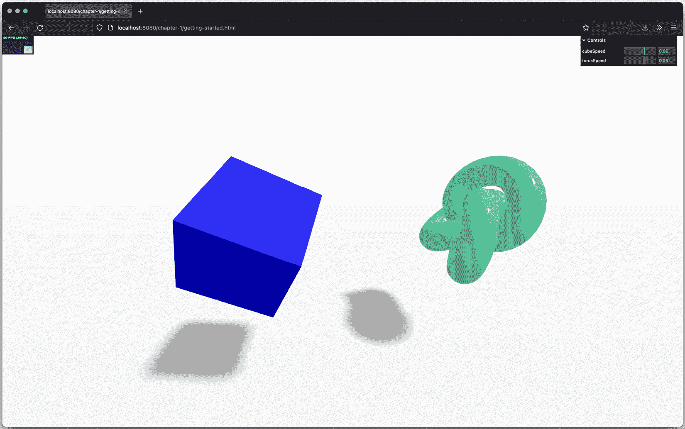

图 1.14 – 使用控件修改场景属性

在我们进入本章的最后部分之前，这里有一个关于我们迄今为止所展示内容的快速说明。你可以想象，大多数场景都需要相当相同的设置。它们都需要一些灯光、一个相机、一个场景，也许还有一个地面。为了避免在每个示例中添加所有这些，我们将大多数这些常见元素外部化到一个辅助库集中。这样，我们可以保持示例干净整洁，只展示与该示例相关的代码。如果你对如何设置感兴趣，可以查看`bootstrap`文件夹中的文件，它将这种方法整合在一起。

在上一个示例中，我们在场景中渲染了一些简单的网格，并直接定位它们。有时，确定物体的位置或旋转角度可能很困难。Three.js 提供了几个不同的辅助工具，它们为你提供了有关场景的额外信息。在下一节中，我们将探讨这些辅助函数中的几个。

# 辅助对象和实用函数

在我们进入下一章之前，我们将快速介绍几个辅助函数和对象。这些辅助工具使定位物体和查看场景中的情况变得更加容易。要看到这个动作的实际效果，最简单的方法是在浏览器中打开`chapter-01/porsche.html`示例：

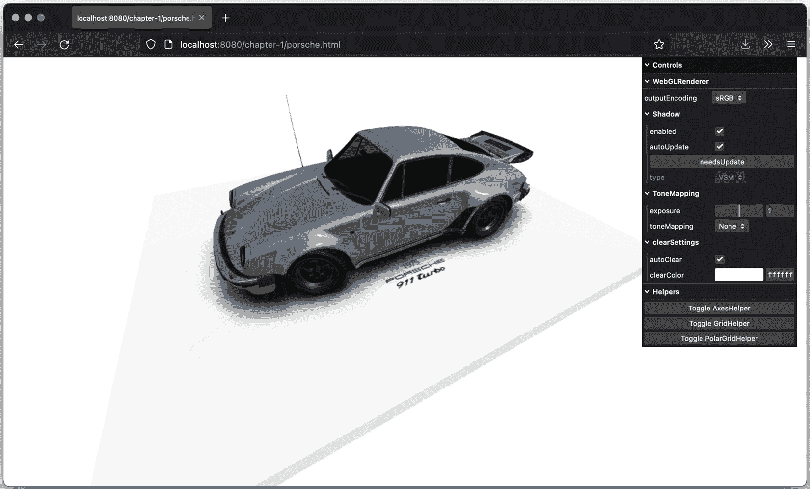

图 1.15 – 带辅助工具的保时捷示例

在屏幕的右侧，菜单的底部，你会看到控制区域中的三个按钮：**切换 AxesHelper**、**切换 GridHelper**和**切换 PolarGridHelper**。当你点击任何一个按钮时，Three.js 会在屏幕上添加一个覆盖层，这可以帮助你定位和定位网格，确定所需的旋转，并检查你对象的尺寸。例如，当我们切换**AxesHelper**时，我们将在场景中看到*x-*、*y-*和*z-*轴：

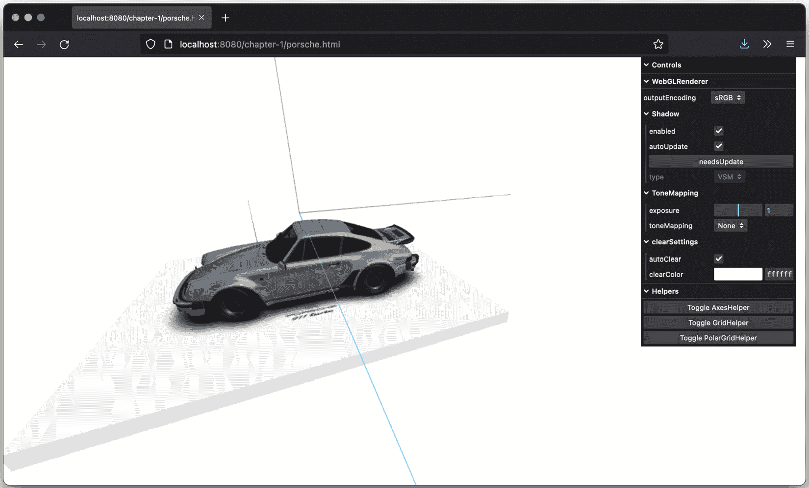

图 1.16 – 启用 AxesHelper 的保时捷示例

注意，在这个例子中，你可以看到一个更广泛的控制用户界面，你还可以控制`WebGLRenderer`的各个方面。

# 摘要

这就是第一章的全部内容。在本章中，你学习了如何设置你的开发环境，如何获取代码，以及如何开始使用本书提供的示例。然后，你学习了要使用 Three.js 渲染场景，你必须创建一个`THREE.Scene`对象，并添加一个相机、光源以及你想要渲染的对象。我们还展示了你如何通过添加动画来扩展这个基本场景。最后，我们添加了几个辅助库。我们使用了*lil-GUI*，它允许你快速创建控制用户界面，我们还添加了一个帧率计数器，它通过反馈帧率和其他指标来显示你的场景是如何渲染的。

所有这些项目都将帮助你理解即将到来的章节中的示例，并使你更容易尝试更高级的示例，并开始根据你的喜好修改它们。如果在接下来的几章中你进行实验时，东西坏了或者没有达到你预期的结果，请记住我们在本章中展示的内容：使用 JavaScript 控制台获取更多信息，添加调试语句，使用 Three.js 提供的辅助工具，或者添加自定义控制元素。

在下一章中，我们将扩展这里展示的基本设置，你将学习更多关于你可以用在 Three.js 中的最重要的构建块。
