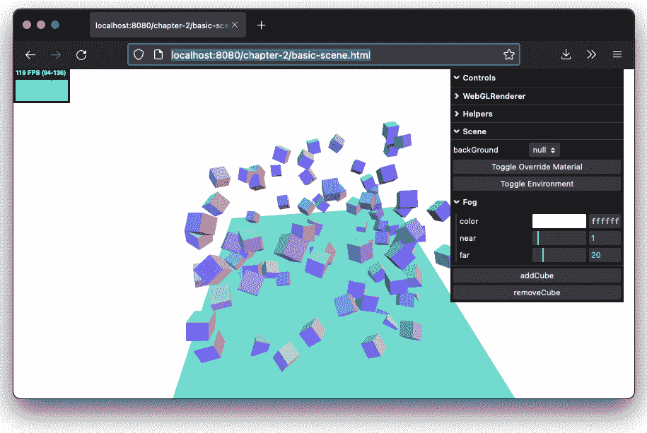

# 构成 Three.js 应用程序的基本组件

在上一章中，您学习了 Three.js 的基础知识。我们查看了一些示例，并创建了您的第一个完整的 Three.js 应用程序。在本章中，我们将更深入地探讨 Three.js，并解释构成 Three.js 应用程序的基本组件。

到本章结束时，您将学会如何使用每个 Three.js 应用程序中使用的标准组件，并应该能够使用这些标准组件创建简单的场景。您还应该能够舒适地使用使用更高级对象的 Three.js 应用程序，因为 Three.js 对简单和高级组件使用的方法是相同的。

在本章中，我们将涵盖以下主题：

+   创建场景

+   几何形状和网格之间的关系

+   使用不同摄像机渲染不同场景

我们首先将探讨如何创建场景并添加对象。

# 创建场景

在*第一章*，“使用 Three.js 创建您的第一个 3D 场景”，您创建了`THREE.Scene`，因此您已经了解了一些 Three.js 的基本知识。我们了解到，为了让场景显示任何内容，我们需要四种不同类型的对象：

+   `THREE.Scene`在屏幕上渲染。

+   **灯光**：这些对材料的外观有影响，并在创建阴影效果时使用（在*第三章*，“在 Three.js 中处理光源”中详细讨论）。

+   **网格**：这些是从摄像机视角渲染的主要对象。这些对象包含构成几何形状（例如，球体或立方体）的顶点和面，并包含一个材料，该材料定义了几何形状的外观。

+   **渲染器**：它使用摄像机和场景中的信息在屏幕上绘制（渲染）输出。

`THREE.Scene`是您想要渲染的灯光和网格的主要容器。`THREE.Scene`本身并没有太多选项和功能。

`THREE.Scene` 是一种结构，有时也被称为场景图。场景图可以包含图形场景所需的所有必要信息。在 Three.js 中，这意味着一个 `THREE.Scene` 包含了所有必要的渲染对象。值得注意的是，场景图，正如其名称所暗示的，不仅仅是一个对象的数组；场景图由树结构中的一组节点组成。正如我们将在 *第八章* 中看到，*创建和加载高级网格和几何体*，Three.js 提供了你可以用来创建不同网格或灯光组的对象。你主要使用的对象，你可以用它来创建场景图，是 `THREE.Group`。正如其名称所暗示的，这个对象允许你将对象分组在一起。`THREE.Mesh` 和 `THREE.Scene` 也都扩展自 Three.js 中的另一个基类 `THREE.Object3D`，它提供了一套标准函数来添加和修改子对象。`THREE.Mesh` 和 `THREE.Scene` 都也扩展自 `THREE.Object3D`，因此你也可以使用它们来创建嵌套结构。但按照惯例，并且从语义上讲更正确，使用 `THREE.Group` 来构建场景图。

## 场景的基本功能

探索场景功能最好的方式是查看一个例子。在本章的源代码中，你可以找到 `chapter-2/basic-scene.html` 示例。我们将使用这个例子来解释场景具有的各种功能和选项。当我们在这个例子中打开浏览器时，输出将类似于下一张截图所示（请记住，你可以使用鼠标移动、缩放和绕渲染场景平移）：


图 2.1 – 基本场景设置

前面的图看起来像我们在 *第一章* 中看到的例子，*使用 Three.js 创建您的第一个 3D 场景*。尽管场景看起来相当空旷，但它已经包含了一些对象：

+   我们有 `THREE.Mesh`，它代表你可以看到的地面区域

+   我们使用 `THREE.PerspectiveCamera` 来确定我们正在看什么

+   我们添加了 `THREE.AmbientLight` 和 `THREE.DirectionalLight` 来提供照明

这个示例的源代码可以在 `basic-scene.js` 中找到，并且我们可以使用来自 `bootstrap/bootstrap.js`、`bootstrap/floor.js` 和 `bootstrap/lighting.js` 的代码，因为这是一个我们在整本书中使用的通用场景设置。所有这些文件中发生的事情可以简化如下代码：

```js
// create a camera
const camera = new THREE.PerspectiveCamera(
  75,
  window.innerWidth / window.innerHeight,
  0.1,
  1000
);
// create a renderer
const renderer = new THREE.WebGLRenderer({ antialias: true
  });
// create a scene
const scene = new THREE.Scene();
// create the lights
scene.add(new THREE.AmbientLight(0x666666));
scene.add(THREE.DirectionalLight(0xaaaaaa));
// create the floor
const geo = new THREE.BoxBufferGeometry(10, 0.25, 10, 10,
  10, 10);
const mat = new THREE.MeshStandardMaterial({ color:
  0xffffff,});
const mesh = new THREE.Mesh(geo, mat);
scene.add(mesh);
```

如前述代码所示，我们创建了 `THREE.WebGLRenderer` 和 `THREE.PerspectiveCamera`，因为我们始终需要这些。接下来，我们创建了一个 `THREE.Scene` 并添加了我们想要使用的所有对象。在这种情况下，我们添加了两个灯光和一个网格。现在，我们已经拥有了启动渲染循环的所有组件，正如我们在 *第一章* 中看到的，*使用 Three.js 创建您的第一个 3D 场景*。

在我们更深入地查看`THREE.Scene`对象之前，我们首先解释一下在演示中你可以做什么，然后看看代码。在浏览器中打开`chapter-2/basic-scene.html`示例，查看右上角的**Controls**菜单，如下截图所示：


图 2.2 – 基本场景设置，使用 Cubemap 背景

### 添加和移除对象

使用这些`THREE.Scene`。我们将首先看看你如何向场景中添加和移除`THREE.Mesh`对象。以下代码显示了当你点击**addCube**按钮时调用的函数：

```js
const addCube = (scene) => {
  const color = randomColor();
  const pos = randomVector({
    xRange: { fromX: -4, toX: 4 },
    yRange: { fromY: -3, toY: 3 },
    zRange: { fromZ: -4, toZ: 4 },
  });
  const rotation = randomVector({
    xRange: { fromX: 0, toX: Math.PI * 2 },
    yRange: { fromY: 0, toY: Math.PI * 2 },
    zRange: { fromZ: 0, toZ: Math.PI * 2 },
  });
  const geometry = new THREE.BoxGeometry(0.5, 0.5, 0.5);
  const cubeMaterial = new THREE.MeshStandardMaterial({
    color: color,
    roughness: 0.1,
    metalness: 0.9,
  });
  const cube = new THREE.Mesh(geometry, cubeMaterial);
  cube.position.copy(pos);
  cube.rotation.setFromVector3(rotation);
  cube.castShadow = true;
  scene.add(cube);
};
```

让我们详细理解前面的代码：

+   首先，我们为即将添加的立方体确定了一些随机设置：一个随机颜色（通过调用`randomColor()`辅助函数）、一个随机位置和一个随机旋转。后两个是通过调用`randomVector()`随机生成的。

+   接下来，我们创建我们想要添加到场景中的几何体：一个立方体。我们只需为这个立方体创建一个新的`THREE.BoxGeometry`，定义一个材质（在这个例子中是`THREE.MeshStandardMaterial`），然后将这两个结合起来形成`THREE.Mesh`。我们使用随机变量来设置立方体的位置和旋转。

+   最后，通过调用`scene.add(cube)`，这个`THREE.Mesh`可以被添加到场景中。

在前面的代码中，我们引入了一个新元素，那就是我们使用`name`属性也给立方体起了一个名字。名称设置为`cube-`，后面加上场景中当前对象的数量（`scene.children.length`）。名称对于调试非常有用，也可以用来直接从你的场景中访问对象。如果你使用`THREE.Scene.getObjectByName(name)`函数，你可以直接检索一个特定的对象，例如，改变它的位置，而不必将 JavaScript 对象设置为全局变量。

也可能存在这样的情况，你想要从一个`THREE.Scene`中移除一个现有的对象。由于`THREE.Scene`通过`children`属性公开了其所有子对象，我们可以使用以下简单的代码来移除最后添加的子对象：

```js
const removeCube = (scene) => {
  scene.children.pop();
};
```

Three.js 还为`THREE.Scene`提供了其他有用的函数，这些函数与处理场景的子对象相关：

+   `add`：我们已经看到了这个函数，它将提供的对象添加到场景中。如果它之前被添加到不同的`THREE.Object3D`中，它将从那个对象中移除。

+   `Attach`：这与`add`类似，但如果你使用它，应用到此对象的任何旋转或平移都将被保留。

+   `getObjectById`：当你将对象添加到场景中时，它会获得一个 ID。第一个获得`1`，第二个获得`2`，依此类推。使用这个函数，你可以根据这个 ID 获取一个子对象。

+   `getObjectByName`：这个函数根据对象的`name`属性返回一个对象。你可以为对象设置一个名称——这与由 Three.js 分配的`id`属性形成对比。

+   `Remove`：这将从这个场景中移除此对象。

+   `Clear`：这将从场景中移除所有子对象。

注意，前面的函数实际上是从 `THREE.Scene` 扩展的基对象：`THREE.Object3D`。

在整本书中，如果我们想要操作场景的子对象（或者在 `THREE.Group` 中，我们将在后面探讨），我们会使用这些函数。

除了添加和删除对象的功能外，`THREE.Scene` 还提供了一些其他设置。我们将首先查看的是添加雾效。

### 添加雾效

`fog` 属性允许您为整个场景添加雾效；物体离相机越远，就越会被隐藏在视线之外。这可以在下面的屏幕截图中看到：


图 2.3 – 使用雾隐藏对象

要最好地看到添加的雾效，请使用鼠标进行缩放，您将看到立方体受到雾效的影响。在 Three.js 中启用雾效非常简单。只需在定义了您的场景之后添加以下代码行：

```js
scene.fog = new THREE.Fog( 0xffffff, 1, 20 );
```

在这里，我们定义了白色雾 (`0xffffff`)。其他两个属性可以用来调整雾的出现方式。`1` 值设置了 `near` 属性，而 `20` 值设置了 `far` 属性。有了这些属性，您可以确定雾开始的位置以及它变得多密集。使用 `THREE.Fog` 对象，雾是线性增加的。在 `chapter-02/basic-scene.html` 示例中，您可以通过使用屏幕右侧的菜单来修改这些属性，以查看这些设置如何影响您在屏幕上看到的内容。

Three.js 还提供了一个替代的雾实现，`THREE.FogExp2`：

```js
scene.fog = new THREE.FogExp2( 0xffffff, 0.01 );
```

这次，我们没有指定近点和远点，只是颜色 (`0xffffff`) 和雾的密度 (`0.01`)。通常，最好对这些属性进行一些实验，以获得您想要的效果。

场景的另一个有趣特性是您可以配置背景。

### 改变背景

我们已经看到，我们可以通过设置 `WebGLRenderer` 的 `clearColor` 来改变背景颜色，如下所示：`renderer.setClearColor(backgroundColor)`。您也可以使用 `THREE.Scene` 对象来改变背景。为此，您有三个选项：

+   *选项 1*：您可以使用纯色。

+   *选项 2*：您可以使用一个纹理，这基本上是一个图像，被拉伸以填充整个屏幕。（关于纹理的更多信息，请参阅 *第十章*，*加载和操作纹理*。）

+   *选项 3*：您可以使用环境贴图。这也是一种纹理，但它完全包围了相机，并在您改变相机方向时移动。

注意，这设置了我们要渲染的 HTML 画布的背景颜色，而不是 HTML 页面的背景颜色。如果您想要一个透明的画布，需要将渲染器的 `alpha` 属性设置为 `true`：

```js
new THREE.WebGLRenderer({ alpha: true }}
```

在右侧的`chapter-02/basic-scene.html`菜单中，有一个下拉菜单显示了所有这些不同的设置。如果你从**backGround**下拉菜单中选择**Texture**选项，你会看到以下内容：


图 2.4 – 使用纹理作为背景

我们将在*第十章*，*加载和使用纹理*中更详细地介绍纹理和立方体贴图。但现在，我们将快速查看如何配置这些以及场景的简单背景颜色（此代码的来源可以在`controls/scene-controls.js`中找到）：

```js
// remove any background by setting the background to null
scene.background = null;
// if you want a simple color, just set the background to a
  color
scene.background = new THREE.Color(0x44ff44);
// a texture can be loaded with a THREE.TextureLoader
const textureLoader = new THREE.TextureLoader();
textureLoader.load(
  "/assets/textures/wood/abstract-antique-
    backdrop-164005.jpg",
  (loaded) => {
    scene.background = loaded;
  }
// a cubemap can also be loaded with a THREE.TextureLoader
     textureLoader.load("/assets/equi.jpeg", (loaded) => {
  loaded.mapping = THREE.EquirectangularReflectionMapping;
  scene.background = loaded;
});
```

从前面的代码中可以看出，你可以将`null`、`THREE.Color`或`THREE.Texture`分配给场景的`background`属性。加载纹理或立方体贴图是异步进行的，因此，我们必须等待`THREE.TextureLoader`加载图像数据后，才能将其分配给背景。在立方体贴图的情况下，我们需要额外一步，并告诉 Three.js 我们加载了什么类型的纹理。当我们将深入探讨纹理的工作原理时，我们将在*第十章*，*加载和使用纹理*中详细介绍。

如果你回顾一下下面代码段的开头，你会看到我们是如何创建添加到场景中的立方体的：

```js
const geometry = new THREE.BoxGeometry(0.5, 0.5, 0.5);
const cubeMaterial = new THREE.MeshStandardMaterial({
  color: color,
  roughness: 0.1,
  metalness: 0.9,
});
const cube = new THREE.Mesh(geometry, cubeMaterial);
```

在前面的代码中，我们创建了一个几何体并指定了一个材质。`THREE.Scene`对象还提供了一种强制场景中网格使用相同材质的方法。在下一节中，我们将探讨这是如何工作的。

### 更新场景中所有材料

`THREE.Scene`有两个属性会影响场景中网格的材质。第一个是`overrideMaterial`属性。首先，让我们演示一下它是如何工作的。在`chapter-02/basic-scene.html`页面上，你可以点击`THREE.MeshNormalNormal`材质：



图 2.5 – 使用 MeshNormalMaterial 覆盖网格材料

如前图所示，现在所有对象（包括地面）现在都使用相同的材质 – 在这种情况下，`THREE.MeshNormalMaterial`。这种材质根据网格相对于相机的方向（其*法线*向量）为网格的每个面着色。这可以通过在代码中简单地调用`scene.overrideMaterial = new THREE.MeshNormalMaterial();`来实现。

除了将完整的材质应用到场景中，Three.js 还提供了一种方法来设置每个网格材质的环境贴图属性为相同的值。环境贴图模拟网格所在的环境（例如，一个房间、户外或洞穴）。环境贴图可用于在网格上创建反射，使其看起来更真实。

在上一节关于背景的章节中，我们已经看到了如何加载环境贴图。如果我们想让所有材料都使用环境贴图以获得更动态的反射和阴影，我们可以将加载的环境贴图分配给场景的 `environment` 属性：

```js
textureLoader.load("/assets/equi.jpeg", (loaded) => {
  loaded.mapping = THREE.EquirectangularReflectionMapping;
  scene.environment = loaded;
});
```

最好的方式是通过切换 `chapter-02/basic-scene.html` 示例来演示前面的代码。如果您现在将镜头拉近到立方体上，您可以看到它们的表面反射了部分环境，并且不再是纯色：


图 2.6 – 将环境贴图设置到场景中的所有网格上

现在我们已经讨论了所有要渲染的对象的基本容器，在下一节中，我们将更详细地探讨可以添加到场景中的对象（`THREE.Mesh` 结合 `THREE.Geometry` 和材质）。

# 几何形状和网格之间的关系

在迄今为止的每个示例中，您都看到了几何形状和网格的使用。例如，为了创建一个球体并将其添加到场景中，我们使用了以下代码：

```js
const sphereGeometry = new THREE.SphereGeometry(4, 20, 20);
const sphereMaterial = new THREE.MeshBasicMaterial({color:
  0x7777ff);
const sphere = new THREE.Mesh(sphereGeometry,
  sphereMaterial);
scene.add(sphere);
```

我们定义了几何形状（`THREE.SphereGeometry`），这是物体的形状，以及其材质（`THREE.MeshBasicMaterial`），然后我们将这两个结合在一个网格（`THREE.Mesh`）中，可以将其添加到场景中。在本节中，我们将更详细地探讨几何形状和网格。我们将从几何形状开始。

## 几何形状的属性和函数

Three.js 自带一套大量的几何形状，您可以直接在 3D 场景中使用。只需添加一个材质，创建一个网格，您就基本完成了。以下截图来自 `chapter-2/geometries` 示例，展示了 Three.js 中可用的几个标准几何形状：


图 2.7 – 场景中可用的一些基本几何形状

在 *第五章*，*学习与几何形状一起工作*，和 *第六章*，*探索高级几何形状* 中，我们将探索 Three.js 提供的所有基本和高级几何形状。现在，我们将更详细地看看几何形状实际上是什么。

在 Three.js 中，以及在大多数其他 3D 库中，几何形状基本上是在三维空间中点的集合，也称为顶点（一个单独的点称为顶点），以及连接这些点的多个面。以立方体为例：

+   一个立方体有八个角。每个角都可以定义为 `x-`、`y-` 和 `z-` 坐标。因此，每个立方体在三维空间中有八个点。

+   一个立方体有六个面，每个角都有一个顶点。在 Three.js 中，一个面始终由三个顶点组成，这三个顶点形成一个三角形（三角形有三个边）。因此，在立方体的例子中，每个面由两个三角形组成，以形成一个完整的面。这种外观的例子可以在 *图 2**.7 中看到，通过观察红色的立方体。

当你使用 Three.js 提供的几何体之一时，你不必自己定义所有的顶点和面。对于一个立方体，你只需要定义宽度、高度和深度。Three.js 使用这些信息并创建一个具有八个顶点且位置正确的几何体，并且具有正确的面数（立方体的情况下是 12 个面——每边两个三角形）。尽管你通常使用 Three.js 提供的几何体或自动生成它们，但你仍然可以使用顶点和面完全手动创建几何体，尽管这可能会很快变得复杂，如以下代码行所示：

```js
const v = [
    [1, 3, 1],
    [1, 3, -1],
    [1, -1, 1],
    [1, -1, -1],
    [-1, 3, -1],
    [-1, 3, 1],
    [-1, -1, -1],
    [-1, -1, 1]]
const faces = new Float32Array([
  ...v[0], ...v[2], ...v[1],
  ...v[2], ...v[3], ...v[1],
  ...v[4], ...v[6], ...v[5],
  ...v[6], ...v[7], ...v[5],
  ...v[4], ...v[5], ...v[1],
  ...v[5], ...v[0], ...v[1],
  ...v[7], ...v[6], ...v[2],
  ...v[6], ...v[3], ...v[2],
  ...v[5], ...v[7], ...v[0],
  ...v[7], ...v[2], ...v[0],
  ...v[1], ...v[3], ...v[4],
  ...v[3], ...v[6], ...v[4]
]);
const bufferGeometry = new THREE.BufferGeometry();
bufferGeometry.setAttribute("position", new THREE.BufferAttribute(faces, 3));
bufferGeometry.computeVertexNormals();
```

上述代码展示了如何创建一个简单的立方体。我们在`v`数组中定义了组成这个立方体的点（即顶点）。从这些顶点中，我们可以创建下一个面。在 Three.js 中，我们需要在一个大的`Float32Array`中提供所有的`faces`信息。正如我们提到的，一个面由三个顶点组成。因此，对于每个面，我们需要定义九个值：每个顶点的`x`、`y`和`z`。由于每个面有三个顶点，所以我们有九个值。为了使阅读更简单，我们使用 JavaScript 中的`...`（展开）操作符将每个顶点的单独值添加到数组中。因此，`...v[0], ...v[2], ...v[1]`将在数组中产生以下值：`1, 3, 1, 1, -1, 1, 1,` `3, 1`。

注意，你必须注意用于定义面的顶点的顺序。它们定义的顺序决定了 Three.js 认为它是一个正面面（面向摄像机的面）还是一个背面面。如果你创建面，你应该使用顺时针顺序来创建正面面，如果你想创建背面面，则应使用逆时针顺序。

在我们的例子中，我们使用了一些顶点来定义立方体的六个面，每个面有两个三角形。在 Three.js 的早期版本中，你也可以使用四边形而不是三角形。四边形使用四个顶点而不是三个来定义面。使用四边形或三角形哪个更好，在 3D 建模世界中是一个热烈的争论。基本上，在建模期间，通常更倾向于使用四边形，因为它们比三角形更容易增强和光滑。然而，对于渲染和游戏引擎来说，处理三角形通常更容易，因为每个形状都可以非常高效地使用三角形进行渲染。

使用这些顶点和面，我们现在可以创建一个新的`THREE.BufferGeometry`实例，并将顶点分配给`position`属性。最后一步是在我们创建的几何体上调用`computeVertexNormals()`。当我们调用这个函数时，Three.js 会确定每个顶点和面的法向量。这是 Three.js 用来根据场景中的各种灯光（如果你使用`THREE.MeshNormalMaterial`，可以很容易地可视化）来确定如何着色面的信息。

使用此几何形状，我们现在可以创建一个网格，就像我们之前看到的那样。我们创建了一个示例，你可以用它来调整顶点的位置，这同时也显示了单个面。在我们的`chapter-2/custom-geometry`示例中，你可以改变立方体的所有顶点的位置，并查看面如何反应。这如下面的截图所示：


图 2.8 – 移动顶点以改变形状

这个示例，与我们的所有其他示例具有相同的设置，有一个渲染循环。每次你更改下拉控制框中的一个属性时，立方体都会根据一个顶点的更改位置进行渲染。这不是一件现成就能做到的事情。出于性能考虑，Three.js 假设网格的几何形状在其生命周期内不会改变。对于大多数几何形状和用例，这是一个非常合理的假设。然而，如果你更改了底层数组（在这种情况下，是`const faces = new Float32Array([...])`数组），我们需要告诉 Three.js 有变化。你可以通过将相关属性的`needsUpdate`属性设置为`true`来实现这一点。这看起来可能如下所示：

```js
mesh.geometry.attributes.position.needsUpdate = true;
mesh.geometry.computeVertexNormals();
```

注意，在更新顶点的情况下，重新计算法向量也是一个好主意，以确保材料也能正确渲染。关于法向量是什么以及为什么它很重要的更多信息将在*第十章*，*加载和操作* *纹理*中解释。

从`chapter-2/custom-geometry`菜单中有一个按钮我们尚未处理。在右侧的菜单中，有一个`clone()`函数，正如其名所示，我们可以复制几何形状，例如，用它来创建具有不同材料的不同网格。在相同的示例`chapter-2/custom-geometry`中，你可以在控制 GUI 的顶部看到一个**clone**按钮，如下面的截图所示：


图 2.9 – 复制几何形状

如果你点击此按钮，将根据当前几何形状创建一个副本；然后，将创建一个新的具有不同材料的新对象，最后将该对象添加到场景中。此代码如下：

```js
const cloneGeometry = (scene) => {
  const clonedGeometry = bufferGeometry.clone();
  const backingArray = clonedGeometry.getAttribute
    ("position").array;
  // change the position of the x vertices so it is placed
  // next to the original object
  for (const i in backingArray) {
    if ((i + 1) % 3 === 0) {
      backingArray[i] = backingArray[i] + 3;
    }
  }
  clonedGeometry.getAttribute("position").needsUpdate =
    true;
  const cloned = meshFromGeometry(clonedGeometry);
  cloned.name = "clonedGeometry";
  const p = scene.getObjectByName("clonedGeometry");
  if (p) scene.remove(p);
  scene.add(cloned);
};
```

如前述代码所示，我们使用`clone()`函数来复制`bufferGeometry`。一旦复制，我们确保更新每个顶点的`x`值，以便副本位于与原始不同的位置（我们也可以使用`translateX`，我们将在本章下一节中解释）。接下来，我们创建一个`THREE.Mesh`，如果存在则移除复制的网格，并添加新的副本。为了创建新的网格，我们使用一个名为`meshFromGeometry`的自定义函数。作为一个快速旁白，让我们看看它是如何实现的：

```js
const meshFromGeometry = (geometry) => {
  var materials = [
    new THREE.MeshBasicMaterial({ color: 0xff0000,
      wireframe: true }),
    new THREE.MeshLambertMaterial({
      opacity: 0.1,
      color: 0xff0044,
      transparent: true,
    }),
  ];
  var mesh = createMultiMaterialObject(geometry, materials);
  mesh.name = "customGeometry";
  mesh.children.forEach(function (e) {
    e.castShadow = true;
  });
  return mesh;
};
```

如果你回顾一下这个例子，你可以看到一个透明的立方体和组成我们几何体的线条（边）。为了做到这一点，我们创建了一个多材质网格。这意味着我们告诉 Three.js 在单个网格中使用两种不同的材质。为此，Three.js 提供了一个名为`createMultiMaterialObject`的便捷辅助函数，它做了名字暗示的事情。根据一个几何体和一组材质列表，它创建了一个我们可以添加到场景中的对象。但是，当你使用`createMultiMaterialObject`的返回结果时，有一件事你需要知道。你得到的不只是一个网格；它是一个`THREE.Group`，一个容器对象，在这个例子中，它包含我们提供的每个材质的单独的`THREE.Mesh`。因此，当渲染网格时，它看起来像一个单一的对象，但实际上是由多个`THREE.Mesh`对象叠加渲染而成的。这也意味着，如果我们想要有阴影，我们需要为组内的每个网格启用阴影（这正是我们在前面的代码片段中所做的）。

在前面的代码中，我们使用了`THREE.SceneUtils`对象的`createMultiMaterialObject`来为我们创建的几何体添加一个线框。Three.js 还提供了一个使用`THREE.WireframeGeometry`添加线框的替代方法。假设你有一个名为`geom`的几何体，你可以从它创建一个线框几何体：`const wireframe = new THREE.WireframeGeometry(geom);`。接下来，你可以使用`Three.LineSegments`对象绘制这个几何体的线条，首先创建一个`const line = new THREE.LineSegments(wireframe)`对象，然后将其添加到场景中：`scene.add(line)`。由于这个辅助函数内部只是一个`THREE.Line`对象，你可以设置线框的外观。例如，要设置线框线的宽度，使用`line.material.linewidth = 2;`。

我们已经对`THREE.Mesh`对象进行了一些了解。在下一节中，我们将更深入地探讨你可以用它做什么。

## 网格的函数和属性

我们已经了解到，要创建一个网格，我们需要一个几何体和一个或多个材质。一旦我们有了网格，我们将其添加到场景中，它就会被渲染。有一些属性可以帮助我们改变网格在场景中的位置和显示方式。在我们的第一个例子中，我们将查看以下属性和函数：

+   `position`：这个属性决定了对象相对于其父对象的位置。通常，对象的父对象是一个`THREE.Scene`对象或一个`THREE.Group`对象。

+   `rotation`：使用这个属性，你可以设置对象围绕其自身的任何轴的旋转。Three.js 还提供了围绕单个轴旋转的特定函数：`rotateX()`、`rotateY()`和`rotateZ()`。

+   `scale`：这个属性允许你围绕对象的`x-`、`y-`和`z-`轴进行缩放。

+   `translateX()` / `translateY()` 和 `translateZ()`：这个属性通过指定量沿着相应的轴移动对象。

+   `lookAt()`：此属性将对象指向空间中的特定向量。这是手动设置旋转的替代方法。

+   `visible`：此属性确定此网格是否应该被渲染。

+   `castShadow`：此属性确定当网格被光线击中时是否投射阴影。默认情况下，网格不投射阴影。

当我们旋转一个对象时，我们是在围绕一个轴旋转。在 3D 场景中，有多个空间，你可以围绕其轴旋转。`rotateN()` 函数在 *局部* 空间中旋转对象。这意味着对象围绕其父对象的轴旋转。因此，当您将对象添加到场景中时，`rotateN()` 函数将围绕场景的主轴旋转该对象。当它是嵌套组的一部分时，这些函数将围绕其父对象的轴旋转对象，这通常是您所期望的行为。Three.js 还有一个特定的 `rotateOnWorldAxis`，它允许您无论对象的实际父对象是什么，都可以围绕主 `THREE.Scene` 的轴旋转对象。最后，您还可以通过调用 `rotateOnAxis` 函数强制对象围绕其自身的轴（这称为 *对象* 空间）旋转。

和往常一样，我们为您准备了一个示例，让您可以对这些属性进行操作。如果您在浏览器中打开 `chapter-2/mesh-properties`，您会看到一个下拉菜单，您可以在其中更改所有这些属性，并直接看到以下截图所示的结果：


图 2.10 – 网格属性

让我带您了解这些属性；我将从 `position` 属性开始。

### 使用位置属性设置网格的位置

我们已经多次看到这个属性，所以让我们快速了解一下。使用此属性，您设置对象相对于其父对象的 `x-`、`y-` 和 `z-` 坐标。我们将在 *第五章* *学习与几何体一起工作* 中回到这一点，当我们查看分组对象时。我们可以以三种不同的方式设置对象的位置属性。我们可以直接设置每个坐标：

```js
cube.position.x = 10;
cube.position.y = 3;
cube.position.z = 1;
```

然而，我们也可以一次性设置所有这些属性，如下所示：

```js
cube.position.set(10,3,1);
```

还有第三个选项。`position` 属性是一个 `THREE.Vector3` 对象。这意味着我们也可以这样做来设置此对象：

```js
cube.position = new THREE.Vector3(10,3,1)
```

接下来是列表中的 `rotation` 属性。您已经在这里和 *第一章* *使用 Three.js 创建您的第一个 3D 场景* 中看到过这个属性被使用过几次。

### 使用旋转属性定义网格的旋转

使用此属性，您可以为对象设置围绕其轴之一的旋转。您可以以与我们设置位置相同的方式设置此值。完整的旋转，如您可能从数学课中记得的，是 `2π`。您可以在 Three.js 中以几种不同的方式配置此属性：

```js
cube.rotation.x = 0.5*Math.PI;
cube.rotation.set(0.5*Math.PI, 0, 0);
cube.rotation = new THREE.Vector3(0.5*Math.PI,0,0);
```

如果你想要使用度数（从 0 到 360），我们必须将这些转换为弧度。这可以很容易地按照以下方式完成：

```js
const degrees = 45;
const inRadians = degrees * (Math.PI / 180);
```

在前面的代码块中，我们亲自进行了转换。Three.js 还提供了`MathUtils`类，它提供了很多有用的转换，包括一个与前面代码块中做同样事情的转换。你可以使用`chapter-2/mesh-properties`示例来玩转这个属性。

我们列表中的下一个属性是我们之前没有讨论过的：`scale`。这个名字基本上概括了你可以用这个属性做什么。你可以沿着特定的轴缩放对象。如果你将缩放设置为小于一的值，对象将会缩小，如下面的截图所示：


图 2.11 – 使用缩放缩小网格

当你使用大于一的值时，对象将会变大，如下面的截图所示：


图 2.12 – 使用缩放来放大网格

我们将要讨论的网格的下一个部分是`translate`属性。

### 使用`translate`属性改变位置

使用`translate`，你还可以改变对象的位置，但不是定义你想要对象所在的绝对位置，而是定义对象相对于当前位置应该移动的距离。例如，我们有一个添加到场景中的球体，其位置已被设置为`(1, 2, 3)`。接下来，我们沿着对象的`x`轴进行平移：`translateX(4)`。它的位置现在将是`(5, 2, 3)`。如果我们想将对象恢复到原始位置，我们使用`translateX(-4)`。在`chapter-2/mesh-properties`示例中，有一个名为`translate`的菜单标签，用于`x`、`y`和`z`的值，并点击**translate**按钮。你会看到对象根据这三个值移动到新的位置。

我们将要讨论的最后两个属性是用来完全移除对象的，通过将`visible`属性设置为`false`，并禁用该对象是否投射阴影，通过将`castShadow`属性设置为`false`。当你点击这些按钮时，你会看到立方体变得不可见和可见，并且你可以禁用它投射阴影。

关于网格、几何体以及你可以用这些对象做什么的更多信息，请查看*第五章*，*学习与几何体一起工作*，以及*第七章*，*点和精灵*。

到目前为止，我们已经了解了 `THREE.Scene`，这是包含我们想要渲染的所有对象的主要对象，并且我们已经详细探讨了 `THREE.Mesh` 是什么，以及如何创建一个 `THREE.Mesh` 并将其放置在场景中。在之前的章节中，我们已经使用摄像机来确定你想要渲染的 `THREE.Scene` 的哪一部分，但还没有详细解释如何配置摄像机。在下一节中，我们将深入探讨这些细节。

# 使用不同摄像机渲染不同场景

在 Three.js 中有两种不同的摄像机类型：正交摄像机和透视摄像机。请注意，Three.js 还提供了一些非常具体的摄像机，用于创建可以使用 3D 眼镜或 VR 设备查看的场景。在这本书中，我们不会详细介绍这些摄像机，因为它们的工作方式与本章中解释的摄像机完全相同。如果你对这些摄像机感兴趣，Three.js 提供了一些标准示例：

+   **全息** **效果**：[`threejs.org/examples/#webgl_effects_anaglyph`](https://threejs.org/examples/#webgl_effects_anaglyph)

)

+   **视差** **屏障**：[`threejs.org/examples/#webgl_effects_parallaxbarrier`](https://threejs.org/examples/#webgl_effects_parallaxbarrier)

)

+   **立体** **效果**：[`threejs.org/examples/#webgl_effects_stereo`](https://threejs.org/examples/#webgl_effects_stereo)

)

如果你正在寻找简单的 VR 摄像机，可以使用 `THREE.StereoCamera` 创建渲染为左右并排的 3D 场景（标准立体效果），使用平行屏障（如 3DS 提供），或者提供一种将不同视图渲染为不同颜色的立体效果。或者，Three.js 对 WebVR 标准有一些实验性支持，该标准被许多浏览器支持（更多信息，请参阅 [`webvr.info/developers/`](https://webvr.info/developers/)）。要使用此功能，不需要做太多改变。你只需设置 `renderer.vr.enabled = true`，Three.js 将处理其余部分。Three.js 网站上有几个示例演示了此属性以及 Three.js 对 WebVR 的其他一些支持功能：[`threejs.org/examples/`](https://threejs.org/examples/)。

目前，我们将专注于标准透视和正交摄像机。解释这些摄像机之间差异的最好方法是通过查看一些示例。

## 正交摄像机与透视摄像机的比较

在本章的示例中，你可以找到一个名为 `chapter2/cameras` 的演示。当你打开这个示例时，你会看到以下内容：


图 2.13 – 透视摄像机视图

上述截图被称为透视视图，是最自然的视图。如图所示，立方体离摄像机越远，渲染得越小。如果我们将摄像机更改为 Three.js 支持的另一种类型，即正射摄像机，你会看到相同场景的以下视图：


图 2.14 – 正射摄像机视图

使用正射摄像机时，所有立方体都以相同的大小渲染；物体与摄像机之间的距离无关。这通常用于 2D 游戏，例如 *Civilization* 和 *SimCity 4* 的旧版本：


图 2.15 – SimCity 4 中的正射投影使用

### 透视摄像机属性

让我们先更仔细地看看 `THREE.PerspectiveCamera`。在示例中，你可以设置一些属性，这些属性定义了通过摄像机镜头可以看到的内容：

+   `fov`: **视场角**（**FOV**）是从摄像机位置可以看到的场景部分。例如，人类几乎有 180 度的视场角，而一些鸟甚至有完整的 360 度视场角。但由于正常的计算机屏幕并没有完全填满我们的视野，因此通常选择较小的值。一般来说，对于游戏，选择 60 到 90 度的视场角。*良好* *默认值*: 50

+   `aspect`: 这是我们在渲染输出区域中渲染的区域的水平尺寸和垂直尺寸之间的宽高比。在我们的例子中，因为我们使用整个窗口，所以我们只使用那个比例。宽高比决定了水平视场角（FOV）和垂直视场角之间的差异。*良好* *默认值*: `window.innerWidth / window.innerHeight`

+   `near`: `near` 属性定义了 Three.js 应该将场景渲染得多靠近摄像机。通常，我们将此设置为一个非常小的值，以便直接从摄像机的位置渲染一切。*良好* *默认值*: 0.1

+   `far`: `far` 属性定义了摄像机可以从其位置看到多远。如果我们设置得太低，场景的一部分可能不会被渲染，如果我们设置得太高，在某些情况下，它可能会影响渲染性能。*良好* *默认值*: 100

+   `zoom`: `zoom` 属性允许你放大和缩小场景。当你使用小于 1 的数字时，你将场景缩小，如果你使用大于 1 的数字，你将场景放大。注意，如果你指定一个负值，场景将被渲染为颠倒的。*良好* *默认值*: 1

以下图表给出了这些属性如何共同工作以确定你所看到的内容的概述：


图 2.16 – 透视摄像机的属性

相机的`fov`属性决定了水平视野。基于`aspect`属性，垂直视野被确定。`near`属性用于确定近平面的位置，而`far`属性则决定了远平面的位置。近平面和远平面之间的区域将被渲染如下：


图 2.17 – 远近裁剪渲染网格

### 正射投影相机属性

要配置正射投影相机，我们需要使用其他属性。正射投影对使用何种宽高比或场景的视野范围不感兴趣，因为所有对象都以相同的大小渲染。当你定义一个正射投影相机时，你定义了需要渲染的立方体区域。正射投影相机的属性反映了这一点，如下所示：

+   `left`：在 Three.js 文档中，`left`属性被描述为相机的视锥体左平面。你应该将其视为将要渲染的左侧边界。如果你将此值设置为`-100`，你将看不到任何在左侧位置超过这个值的对象。

+   `right`：`right`属性的工作方式与`left`属性类似，但这次是在屏幕的另一侧。任何在右侧更远的位置都不会被渲染。

+   `top`：这是要渲染的顶部位置。

+   `bottom`：这是要渲染的底部位置。

+   `near`：从这个点开始，根据相机的位置，场景将被渲染。

+   `far`：到这个点，根据相机的位置，场景将被渲染。

+   `zoom`：这个属性允许你放大或缩小场景。当你使用小于`1`的数字时，你会缩小场景；如果你使用大于`1`的数字，你会放大场景。注意，如果你指定一个负值，场景将被渲染为颠倒的。默认值是`1`。

所有这些属性可以总结如下图所示：


图 2.18 – 正射投影相机的属性

就像透视相机一样，你可以精确地定义你想要渲染的场景区域：


图 2.19 – 使用正射投影相机的裁剪区域

在上一节中，我们解释了 Three.js 支持的不同类型的相机。你已经学习了如何配置它们，以及如何使用它们的属性来渲染场景的不同部分。我们还没有展示的是如何控制相机观察场景的哪个部分。我们将在下一节中解释这一点。

## 观察特定点

到目前为止，你已经看到了如何创建相机以及各种参数的含义。在*第一章* *使用 Three.js 创建您的第一个 3D 场景* 中，你也看到了你需要将相机放置在场景中的某个位置，并且从该相机看到的视图会被渲染。通常，相机指向场景的中心：位置 `(0, 0, 0)`。然而，我们可以很容易地更改相机所看的方向，如下所示：

```js
camera.lookAt(new THREE.Vector3(x, y, z));
```

在`chapter2/cameras`示例中，你也可以指定相机要看的坐标。请注意，当你更改`OrthographicCamera`设置中的`lookAt`时，立方体仍然保持相同的大小。


图 2.20 – 更改了正交相机的`lookAt`属性

当你使用`lookAt`函数时，你将相机指向一个特定的位置。你也可以使用这个函数使相机围绕场景中的物体移动。由于每个`THREE.Mesh`对象都有一个位置，它是一个`THREE.Vector3`对象，因此你可以使用`lookAt`函数指向场景中的特定网格。你需要做的只是使用这个：`camera.lookAt(mesh.position)`。如果你在渲染循环中调用这个函数，你将使相机跟随物体在场景中移动。

## 调试相机所看的对象

当配置相机时，有一个可以让你尝试不同设置的菜单会非常有帮助。有时，你可能想确切地看到相机将要渲染的区域。Three.js 允许你通过可视化相机的视锥体（相机所显示的区域）来实现这一点。为此，我们只需在场景中添加一个额外的相机并添加一个相机辅助器。要看到这个效果，请打开`chapter-2/debug-camera.html`示例：


图 2.21 – 显示相机的视锥体

在前面的图中，你可以看到透视相机的视锥体的轮廓。如果你在菜单中更改属性，你会看到视锥体也会随之改变。这个视锥体是通过添加以下内容可视化的：

```js
const helper = new THREE.CameraHelper(camera);
scene.add(helper);
// in the render loop
helper.update();
```

我们还添加了一个**switchCamera**按钮，允许你在场景外部观察的相机和场景中的主相机之间切换。这为获取正确的相机设置提供了一种很好的方法：


图 2.22 – 切换相机

在 Three.js 中切换相机非常简单。你需要做的只是告诉 Three.js 你想要通过不同的相机渲染场景。

# 摘要

我们在本章的第二部分介绍了许多内容。我们展示了 `THREE.Scene` 的功能和属性，并解释了如何使用这些属性来配置你的主场景。我们还向你展示了如何创建几何体。你可以从零开始使用 `THREE.Buffergeometry` 对象创建它们，或者使用 Three.js 提供的任何内置几何体。最后，我们向你展示了如何配置 Three.js 提供的两个主要摄像机。`THREE.PerspectiveCamera` 使用现实世界的透视来渲染场景，而 `THREE.OrthographicCamera` 提供了在游戏中经常看到的假 3D 效果。我们还涵盖了在 Three.js 中几何体是如何工作的，你现在可以轻松地创建自己的几何体，无论是从 Three.js 提供的标准几何体中创建，还是通过手工制作。

在下一章中，我们将探讨 Three.js 中可用的各种光源。你将学习不同光源的行为方式，如何创建和配置它们，以及它们如何影响不同的材质。
