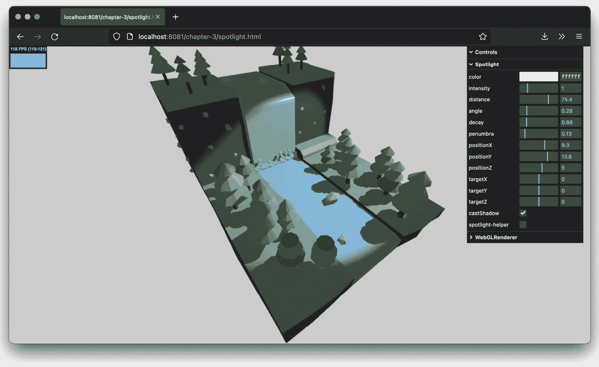
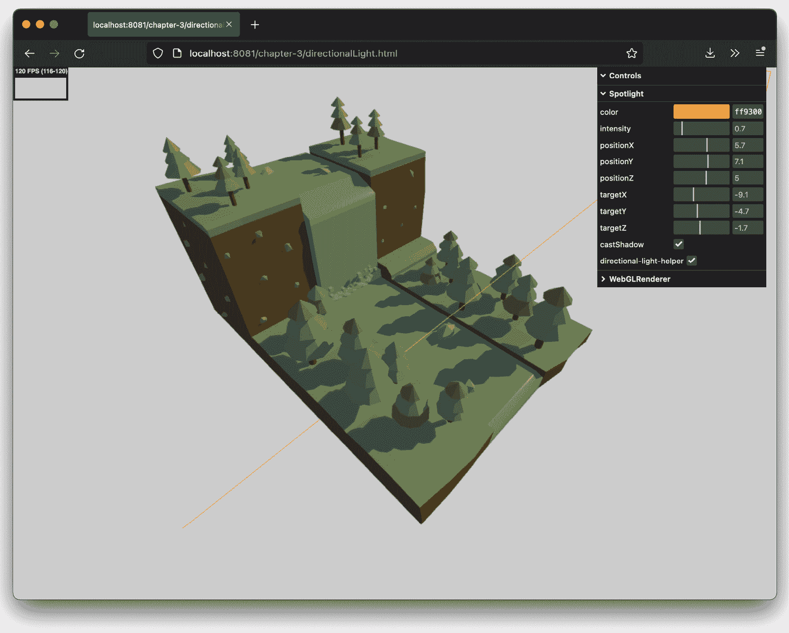
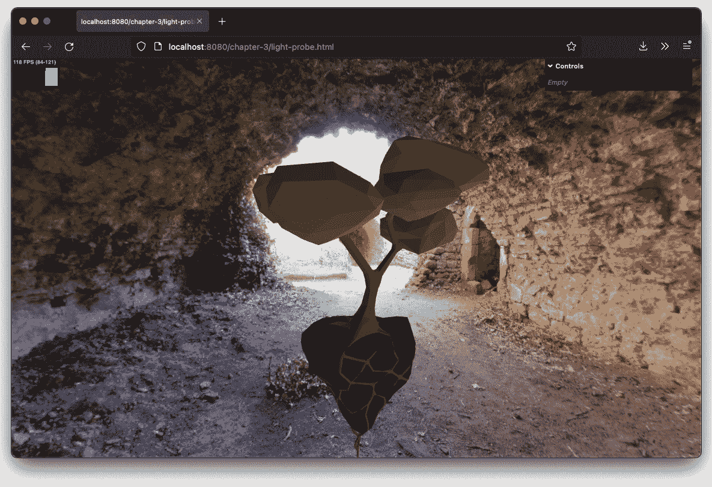

# 在 Three.js 中使用光源

在*第一章*，*使用 Three.js 创建您的第一个 3D 场景*中，你学习了 Three.js 的基础知识，而在*第二章*，*构成 Three.js 应用程序的基本组件*中，我们更深入地探讨了场景中最重要的一部分：几何体、网格和摄像机。你可能已经注意到，在那个章节中我们跳过了对灯光的详细探讨，尽管它们是每个 Three.js 场景的重要组成部分。没有灯光，我们将看不到任何渲染效果（除非我们使用基本或线框材质）。由于 Three.js 包含了多种不同的光源，每种光源都有特定的用途，我们将利用本章来解释灯光的各个方面细节，并为即将到来的关于材质使用的章节做准备。到本章结束时，你将了解可用的灯光之间的区别，并能够为你的场景选择和配置正确的灯光。

注意

WebGL 本身并不具备内置的光照支持。如果没有 Three.js，你将不得不编写特定的 WebGL 着色器程序来模拟这些类型的光，这相当困难。可以从[`developer.mozilla.org/en-US/docs/Web/WebGL/Lighting_in_WebGL`](https://developer.mozilla.org/en-US/docs/Web/WebGL/Lighting_in_WebGL)找到关于从头开始模拟 WebGL 中光照的良好介绍。

在本章中，我们将涵盖以下主题：

+   Three.js 中的不同类型的光照

+   使用基本光源

+   使用特殊光源

与所有章节一样，我们提供了大量的示例，你可以使用这些示例来实验灯光的行为。本章中展示的示例可以在提供的源代码的`chapter-03`文件夹中找到。

# Three.js 中提供了哪些光照类型？

Three.js 中提供了几种不同的光源，它们都具有特定的行为和用法。在本章中，我们将讨论以下一组光源：

+   `THREE.AmbientLight`：这是一种基本光源，其颜色被添加到场景中对象的当前颜色上。

+   `THREE.PointLight`：这是一个空间中的单一点，光线从这个点向所有方向扩散。这种光可以用来创建阴影。

+   `THREE.SpotLight`：这种光源具有类似台灯、天花板上的聚光灯或火炬的锥形效果。这种光可以投射阴影。

+   `THREE.DirectionalLight`：这也被称为无限光。从这个光源发出的光线看起来是平行的，类似于太阳的光线。这种光也可以用来创建阴影。

+   `THREE.HemisphereLight`：这是一种特殊的光源，可以通过模拟反射表面和微弱照亮的苍穹来创建更自然的外观户外光照。这种光源也不提供任何与阴影相关的功能。

+   `THREE.RectAreaLight`：使用这个光源，你可以在空间中指定一个区域，光从这个区域发出。`THREE.RectAreaLight` 不会产生任何阴影。

+   `THREE.LightProbe`：这是一种特殊类型的光源，根据使用的环境贴图，创建一个动态的环境光源来照亮场景。

+   `THREE.LensFlare`：这并不是一个光源，但使用 `THREE.LensFlare`，你可以为场景中的灯光添加镜头光晕效果。

本章分为两个主要部分。首先，我们将查看基本灯光：`THREE.AmbientLight`、`THREE.PointLight`、`THREE.SpotLight` 和 `THREE.DirectionalLight`。所有这些灯光都扩展了基本的 `THREE.Light` 对象，它提供了共享的功能。这里提到的灯光是简单的灯光，设置简单，可以用来重现大多数所需的灯光场景。在第二部分，我们将查看一些特殊用途的灯光和效果：`THREE.HemisphereLight`、`THREE.RectAreaLight`、`THREE.LightProbe` 和 `THREE.LensFlare`。你可能只有在非常特定的情况下才需要这些灯光。

# 与基本灯光一起工作

我们将从最基本的灯光开始：`THREE.AmbientLight`。

## THREE.AmbientLight

当你创建一个 `THREE.AmbientLight` 时，颜色是全局应用的。这种光没有特定的方向来源，`THREE.AmbientLight` 不会产生任何阴影。通常情况下，你不会将 `THREE.AmbientLight` 作为场景中唯一的灯光源，因为它以相同的方式将颜色应用到场景中的所有对象上，而不考虑网格的形状。你通常将它与其他灯光源一起使用，例如 `THREE.SpotLight` 或 `THREE.DirectionalLight`，以柔化阴影或为场景添加一些额外的颜色。理解这一点最简单的方法是查看 `chapter-03` 文件夹中的 `ambient-light.html` 示例。在这个示例中，你得到一个简单的用户界面，可以用来修改场景中可用的 `THREE.AmbientLight` 对象。

在以下屏幕截图中，你可以看到我们使用了一个简单的瀑布模型，并使使用的 `THREE.AmbientLight` 对象的 `color` 和 `intensity` 属性可配置。在这个第一张屏幕截图中，你可以看到当我们把灯光的颜色设置为红色时会发生什么：


图 3.1 – 环境光设置为红色

如你所见，现在场景中的每个元素都添加了红色到其原始颜色上。如果我们把颜色改为蓝色，我们会得到类似这样的效果：


图 3.2 – 环境光设置为蓝色

如此截图所示，蓝色被应用于所有物体，并在整个场景上产生光芒。当你使用这种灯光时，你应该记住的是，你应该非常保守地指定颜色。如果你指定的颜色太亮，你很快就会得到一个完全过饱和的图像。除了颜色之外，我们还可以设置灯光的 `intensity` 属性。这个属性决定了 `THREE.AmbientLight` 对场景中颜色的影响程度。如果我们将其调低，只有少量的颜色被应用于场景中的物体。如果我们将其调高，我们的场景就会变得非常明亮：


图 3.3 – 环境光设置为高强度的红色

现在我们已经看到了它的作用，让我们看看如何创建和使用一个 `THREE.AmbientLight`。以下代码行展示了如何创建一个 `THREE.AmbientLight`：

```js
const color = new THREE.Color(0xffffff);
const light = new THREE.AmbientLight(color);
scene.add(light);
```

创建一个 `THREE.AmbientLight` 非常简单，只需要几个步骤。`THREE.AmbientLight` 没有位置，是全局应用的，所以我们只需要指定颜色并将此灯光添加到场景中。可选地，我们也可以在这个构造函数中提供一个额外的值来指定这种灯光的强度。由于我们没有在这里指定它，它使用默认强度 `1`。

注意，在前面的代码片段中，我们向 `THREE.AmbientLight` 的构造函数传递了一个显式的 `THREE.Color` 对象。我们也可以将颜色作为字符串传递 – 例如，`"rgb(255, 0, 0)"` 或 `"hsl(0, 100%, 50%)"` – 或者作为数字，就像我们在前面的章节中所做的那样：`0xff0000`。更多关于这方面的信息可以在 *使用 THREE.Color 对象* 部分找到。

在我们讨论 `THREE.PointLight`、`THREE.SpotLight` 和 `THREE.DirectionalLight` 之前，首先让我们强调它们的主要区别 – 那就是它们如何发光。以下图表显示了这三个灯光源如何发光：


图 3.4 – 不同光源如何发光

你可以从这张图中看到以下内容：

+   `THREE.PointLight` 从一个特定的点向所有方向发出光

+   `THREE.SpotLight` 从一个特定的点以锥形形状发出光

+   `THREE.DirectionalLight` 不是从一个单独的点发出光，而是从二维平面发出光束，其中光束相互平行

我们将在接下来的几节中更详细地探讨这些灯光源。让我们从 `THREE.SpotLight` 开始。

## THREE.SpotLight

`THREE.SpotLight` 是你经常会用到的灯光之一（特别是如果你想使用阴影）。`THREE.SpotLight` 是一种具有锥形效果的灯光源。你可以将其与手电筒或灯笼进行比较。这种灯光源有一个方向和一个产生光的角度。以下截图显示了 `THREE.SpotLight` 的样子（`spotlight.html`）：



图 3.5 – 聚光灯照亮场景

以下表格列出了您可以使用来微调 `THREE.SpotLight` 的所有属性。首先，我们将查看特定于光的行为的属性：

| **名称** | **描述** |
| --- | --- |
| `Angle` | 确定从光源发出的光束的宽度。宽度以弧度为单位测量，默认值为 `Math.PI/3`。 |
| `castShadow` | 如果设置为 `true`，则应用此属性的灯光将创建阴影。有关如何配置阴影的详细信息，请参阅以下表格。 |
| `Color` | 表示光的颜色。 |
| `decay` | 表示随着您远离光源，光强度减弱的量。`decay` 值为 `2` 会产生更逼真的光，默认值为 `1`。此属性仅在将 `physicallyCorrectLights` 属性设置为 `WebGLRenderer` 时有效。 |
| `distance` | 当此属性设置为非 `0` 值时，光强度将从光源位置处的设置强度线性减少到指定距离处的 `0`。 |
| `intensity` | 表示光照射的强度。属性的默认值是 `1`。 |
| `penumbra` | 表示聚光灯硬币边缘的百分比，该边缘被平滑（模糊）到 `0`。它取值范围在 `0` 和 `1` 之间，默认值为 `0`。 |
| `power` | 表示在物理正确模式下渲染时光的 `power`（通过在 `WebGLRenderer` 上设置 `physicallyCorrectLights` 属性来启用）。此属性以流明为单位测量，默认值为 `4*Math.PI`。 |
| `position` | 表示光在 `THREE.Scene` 中的位置。 |
| `target` | 对于 `THREE.SpotLight`，光的方向很重要。使用 `target` 属性，您可以指定 `THREE.SpotLight` 指向场景中的特定对象或位置。请注意，此属性需要一个 `THREE.Object3D` 对象（例如，`THREE.Mesh`）。这与我们在 *第二章* 中看到的相机形成对比，这些相机在 `lookAt` 函数中使用 `THREE.Vector3`。 |
| `visible` | 如果此属性设置为 `true`（默认值），则灯光开启，如果设置为 `false`，则灯光关闭。 |

图 3.6 – THREE.SpotLight 对象的属性

当您为 `THREE.SpotLight` 启用阴影时，您可以控制阴影的渲染方式。您可以通过 `THREE.SpotLight` 的阴影属性来控制，它可以包括以下内容：

| **名称** | **描述** |
| --- | --- |
| `shadow.bias` | 将投射的阴影移向或远离投射阴影的对象。您可以使用此属性来解决在处理非常薄的对象时出现的某些奇怪效果。如果您在模型上看到奇怪的阴影效果，此属性的较小值（例如，`0.01`）通常可以解决问题。此属性的默认值是 `0`。 |
| `shadow.camera.far` | 确定从多远距离的光源处创建阴影。默认值是 `5000`。注意，您还可以设置 `THREE.PerspectiveCamera` 提供的所有其他属性，我们在 *第二章* 中展示了这些属性。 |
| `shadow.camera.fov` | 确定用于创建阴影的视野大小（参见 *第二章* 中的 *使用不同相机为不同场景* 部分）。默认值是 `50`。 |
| `shadow.camera.near` | 确定从多远距离的光源处创建阴影。默认值是 `50`。 |
| `shadow.mapSize.width` 和 `shadow.mapSize.height` | 确定用于创建阴影的像素数量。当阴影边缘参差不齐或看起来不光滑时，应增加这些值。渲染场景后，这些值不能更改。两者的默认值都是 `512`。 |
| `shadow.radius` | 当此值设置大于 1 时，阴影的边缘将变得模糊。如果 `THREE.WebGlRenderer` 的 `shadowMap.type` 属性设置为 `THREE.BasicShadowMap`，则此值将不会产生任何效果。 |

图 3.7 – THREE.SpotLight 对象的阴影属性

创建 `THREE.SpotLight` 非常简单。只需指定颜色，设置您想要的属性，并将其添加到场景中，如下所示：

```js
const spotLight = new THREE.SpotLight("#ffffff")
spotLight.penumbra = 0.4;
spotLight.position.set(10, 14, 5);
spotLight.castShadow = true;
spotLight.intensity = 1;
spotLight.shadow.camera.near = 10;
spotLight.shadow.camera.far = 25;
spotLight.shadow.mapSize.width = 2048;
spotLight.shadow.mapSize.height = 2048;
spotLight.shadow.bias = -0.01;
scene.add(spotLight.target);
```

在这里，我们创建了一个 `THREE.SpotLight` 实例，并设置了各种属性以配置灯光。我们还明确地将 `castShadow` 属性设置为 `true`，因为我们想要阴影。我们还需要将 `THREE.SpotLight` 指向某个地方，这通过 `target` 属性来完成。在我们可以使用此属性之前，我们首先需要将灯光的默认 `target` 添加到场景中，如下所示：

```js
scene.add(spotLight.target);
```

默认情况下，目标将被设置为 `(0, 0, 0)`。在本节的示例中，您可以更改 `target` 属性的位置，并看到灯光会跟随该对象的位置：


图 3.8 – 聚光灯指向目标

注意，您还可以将灯光的目标设置为场景中的对象。在这种情况下，灯光的方向将指向该对象。如果指向的对象移动，灯光将始终指向该对象。

在本节开头表中，我们展示了可以用来控制 `THREE.SpotLight` 发出光的方式的一些属性。`distance` 和 `angle` 属性定义了光锥的形状。`angle` 属性定义了锥体的宽度，而 `distance` 属性则设置了锥体的长度。以下图表解释了这两个值如何定义将接收 `THREE.SpotLight` 光照的区域：


图 3.9 – 聚光灯角度和距离

通常情况下，你不需要设置这些值，因为它们都带有合理的默认值，但你可以使用这些属性，例如，创建一个具有非常窄的光束或快速降低光强度的`THREE.SpotLight`实例。你可以用来改变`THREE.SpotLight`产生光的方式的最后一个属性是`penumbra`属性。使用这个属性，你可以设置从什么位置开始光锥边缘的光强度开始降低。在下面的屏幕截图中，你可以看到`penumbra`属性的作用结果。我们有一个非常明亮的光源（高强度），当它达到锥形边缘时，强度迅速降低：


图 3.10 – 具有硬边缘晕影的聚光灯

有时候，仅通过查看渲染的场景，可能很难确定灯光的正确设置。你可能出于性能原因想要微调被照亮的区域，或者尝试将光源移动到非常具体的位置。这可以通过使用`THREE.SpotLightHelper`来实现：

```js
const spotLightHelper = new THREE.SpotLightHelper
  (spotLight);
scene.add(spotLightHelper)
// in the render loop
spotLightHelper.update();
```

使用前面的代码，你可以得到一个轮廓，显示了聚光灯的细节，这有助于调试和正确定位和配置你的光源：


图 3.11– 启用辅助器的聚光灯

在继续到下一个光源之前，我们将快速查看`THREE.SpotLight`对象可用的与阴影相关的属性。你已经了解到，我们可以通过将`THREE.SpotLight`实例的`castShadow`属性设置为`true`来获取阴影。你也知道`THREE.Mesh`对象有两个与阴影相关的属性。你为应该产生阴影的对象设置`castShadow`属性，而对于应该显示阴影的对象，你使用`receiveShadow`属性。Three.js 还允许你非常精细地控制阴影的渲染方式。这是通过本节开头表格中解释的几个属性来实现的。通过`shadow.camera.near`、`shadow.camera.far`和`shadow.camera.fov`，你可以控制这个光在哪里以及如何产生阴影。对于`THREE.SpotLight`实例，你不能直接设置`shadow.camera.fov`。这个属性基于`THREE.SpotLight`的`angle`属性。这和我们在*第二章*中解释的透视相机的视野一样工作。看到这个效果的最简单方法是通过添加一个`THREE.CameraHelper`；你可以通过勾选菜单的`shadow-helper`复选框并调整相机设置来实现。正如你在下面的屏幕截图中可以看到的，勾选这个复选框会显示用于确定这个光源阴影的区域：


图 3.12 – 启用阴影辅助器的聚光灯

当调试与阴影相关的问题时，添加 `THREE.CameraHelper` 是有用的。为此，只需添加以下几行：

```js
const shadowCameraHelper = new THREE.CameraHelper
  (spotLight.shadow.camera);
scene.add(shadowCameraHelper);
// in the render loop
shadowCameraHelper.update();
```

我将以一些建议结束本节，以防你遇到与阴影相关的问题。

如果阴影看起来像块状，你可以增加 `shadow.mapSize.width` 和 `shadow.mapSize.Height` 属性，并确保用于计算阴影的区域紧密包裹你的对象。你可以使用 `shadow.camera.near`、`shadow.camera.far` 和 `shadow.camera.fov` 属性来配置这个区域。

记住，你不仅要告诉光产生阴影，还要通过设置 `castShadow` 和 `receiveShadow` 属性来告诉每个几何体它是否会接收和/或产生阴影。

阴影偏差

如果你场景中使用了细长的物体，渲染阴影时可能会看到奇怪的伪影。你可以使用 `shadow.bias` 属性来稍微偏移阴影，这通常可以解决这些问题。

如果你想要更柔和的阴影，你可以在 `THREE.WebGLRenderer` 上设置不同的 `shadowMapType` 值。默认情况下，此属性设置为 `THREE.PCFShadowMap`；如果你将此属性设置为 `PCFSoftShadowMap`，你会得到更柔和的阴影。

现在，让我们来看看列表中的下一个光源：`THREE.PointLight`。

## THREE.PointLight

`THREE.PointLight` 是一种从单个点向所有方向发射光的光源。点光源的一个好例子是射入夜空的信号弹或篝火。就像所有灯光一样，我们有一个特定的例子你可以用来玩转 `THREE.PointLight`。如果你查看 `chapter-03` 文件夹中的 `point-light.html`，你可以找到一个例子，其中 `THREE.PointLight` 被用于我们用于其他灯光的相同场景：


图 3.13 – 启用辅助工具的 PointLight

如前一张截图所示，此光向所有方向发射。就像我们之前看到的聚光灯一样，此光也有一个辅助工具，你可以以相同的方式使用它。你可以将其视为场景中心的线框：

```js
const pointLightHelper = new THREE.PointLightHelper
  (pointLight);
scene.add(pointLightHelper)
// in the render loop
pointLightHelper.update();
```

`THREE.PointLight` 与 `THREE.SpotLight` 共享一些属性，你可以使用这些属性来配置此光的行为：

| **名称** | **描述** |
| --- | --- |
| `color` | 该光源发出的光的颜色。 |
| `distance` | 表示光照射的距离。默认值是 `0`，这意味着光的强度不会根据距离而降低。 |
| `intensity` | 表示光照射的强度。默认值为 `1`。 |
| `position` | 表示光在 `THREE.Scene` 中的位置。 |
| `visible` | 确定光是否开启或关闭。如果此属性设置为 `true`（默认值），则此光开启，如果设置为 `false`，则光关闭。 |
| `decay` | 表示随着您远离光源，灯光强度减弱的程度。`decay` 值为 `2` 会产生更逼真的灯光，默认值为 `1`。此属性仅在将 `physicallyCorrectLights` 属性设置为 `WebGLRenderer` 时有效。 |
| `power` | 指的是在以物理正确模式渲染时灯光的功率（通过在 `WebGLRenderer` 上设置 `physicallyCorrectLights` 属性来启用此功能）。此属性以流明为单位测量，默认值为 `4*Math.PI`。`Power` 也与 `intensity` 属性直接相关（*power = intensity ** *4π*）。 |

图 3.14 – THREE.PointLight 对象的属性

除了这些属性外，`THREE.PointLight` 对象的阴影可以像 `THREE.SpotLight` 的阴影一样进行配置。在接下来的几个示例和屏幕截图中，我们将展示这些属性如何作用于 `THREE.PointLight`。首先，让我们看看如何创建一个 `THREE.PointLight`：

```js
const pointLight = new THREE.PointLight();
scene.add(pointLight);
```

这里没有特别之处——我们只是定义了灯光并将其添加到场景中；当然，您也可以设置我们刚刚展示的任何属性。`THREE.SpotLight` 对象的两个主要属性是 `distance` 和 `intensity`。使用 `distance`，您可以指定灯光发出多远后衰减到 `0`。例如，在下面的屏幕截图中，我们将 `distance` 属性设置为低值，并将 `intensity` 属性略微增加以模拟树木之间的篝火：


图 3.15 – 距离低且强度高的 PointLight

在此示例中无法设置 `power` 和衰减属性；如果您想模拟现实世界场景，这些属性非常有用。一个很好的例子可以在 Three.js 网站上找到：[`threejs.org/examples/#webgl_lights_physical`](https://threejs.org/examples/#webgl_lights_physical)。

`THREE.PointLight` 也使用一个相机来确定绘制阴影的位置，因此您可以使用 `THREE.CameraHelper` 来显示被该相机覆盖的部分。此外，`THREE.PointLight` 提供了一个辅助工具，`THREE.PointLightHelper`，以显示 `THREE.PointLight` 照明的位置。启用两者后，您将获得以下非常有用的调试信息：


图 3.16 – 启用辅助功能的 PointLight

如果您仔细观察之前的屏幕截图（*图 3.16*），您可能会注意到阴影是在阴影相机显示区域之外创建的。这是因为阴影辅助工具只显示从点光源位置投射下来的阴影。您可以将 `THREE.PointLight` 视为一个立方体，其中每个面都发出光线并可以投射阴影。在这种情况下，`THREE.ShadowCameraHelper` 只显示向下投射的阴影。

我们将要讨论的最后一种基本灯光是 `THREE.DirectionalLight`。

## THREE.DirectionalLight

这种光源可以被认为是非常远的灯光。它发出的所有光束都是相互平行的。一个很好的例子是太阳。太阳非常遥远，以至于我们接收到的地球上的光线（几乎）是相互平行的。`THREE.DirectionalLight` 与 `THREE.SpotLight`（我们之前看到的）之间的主要区别是，这种光不会像 `THREE.SpotLight` 那样随着距离光源的增大而减弱（你可以通过 `distance` 和 `exponent` 参数进行微调）。由 `THREE.DirectionalLight` 照亮的整个区域接收相同强度的光线。要看到这个效果，请查看以下 `directional-light.html` 示例：



图 3.17 – 模拟日落的定向光

正如你所见，使用 `THREE.DirectionalLight` 模拟，例如日落，是非常容易的。正如与 `THREE.SpotLight` 一样，你可以设置这个光的一些属性。例如，你可以设置光的 `intensity` 属性以及它投射阴影的方式。`THREE.DirectionalLight` 有很多属性与 `THREE.SpotLight` 相同：`position`、`target`、`intensity`、`castShadow`、`shadow.camera.near`、`shadow.camera.far`、`shadow.mapSize.width`、`shadow.mapSize.width` 和 `shadowBias`。有关这些属性的更多信息，你可以查看关于 `THREE.SpotLight` 的前述部分。

如果你回顾一下 `THREE.SpotLight` 的示例，你会看到我们必须定义应用阴影的光锥。由于 `THREE.DirectionalLight` 的所有光线都是相互平行的，所以我们没有需要应用阴影的光锥；相反，我们有一个长方体区域（在内部用 `THREE.OrthographicCamera` 表示），正如你在以下屏幕截图中所见，我们启用了阴影辅助工具：


图 3.18 – 显示长方体阴影区域的定向光

所有落在这个立方体内的物体都可以从光源投射和接收阴影。正如对于 `THREE.SpotLight`，你定义的围绕物体的这个区域越紧密，你的阴影看起来就越好。使用以下属性定义这个立方体：

```js
directionalLight.castShadow = true;
directionalLight.shadow.camera.near = 2;
directionalLight.shadow.camera.far = 80;
directionalLight.shadow.camera.left = -30;
directionalLight.shadow.camera.right = 30;
directionalLight.shadow.camera.top = 30;
directionalLight.shadow.camera.bottom = -30;
```

你可以将其与我们配置正交相机的方式进行比较，在 *第二章* 的 *使用不同相机为不同场景* 部分中。

正如我们在这个部分中已经看到的，光源使用颜色。到目前为止，我们只是使用十六进制字符串配置了颜色，但 `THREE.Color` 对象提供了很多不同的选项来创建初始颜色对象。在接下来的部分中，我们将探索 `THREE.Color` 对象提供的功能。

## 使用 THREE.Color 对象

在 Three.js 中，当您需要提供颜色（例如，用于材质、光源等）时，您可以传递一个 `THREE.Color` 对象；否则，Three.js 将根据传入的字符串值创建一个，正如我们在 `THREE.AmbientLight` 中所看到的。Three.js 在解析 `THREE.Color` 构造函数的输入时非常灵活。您可以通过以下方式创建一个 `THREE.Color` 对象：

+   `new THREE.Color("#ababab")` 将根据传入的 CSS 颜色字符串创建一个颜色。

+   `new THREE.Color(0xababab)` 将根据传入的十六进制值创建颜色。如果您知道十六进制值，这通常是最佳方法。

+   `new THREE.Color("rgb(255, 0, 0)")` 或 `new THREE.Color("rgb(100%, 0%, 0%)"`。

+   `new THREE.Color( 'skyblue' )`。

+   `new THREE.Color("hsl(0, 100%, 50%)"`。

+   `new THREE.Color( 1, 0, 0 )`。

如果您想在构造后更改颜色，您必须创建一个新的 `THREE.Color` 对象或修改 `THREE.Color` 对象的内部属性。`THREE.Color` 对象附带了一组大量的属性和函数。第一组函数允许您设置 `THREE.Color` 对象的颜色：

+   `set(value)`: 将颜色的值设置为提供的十六进制值。此十六进制值可以是字符串、数字或现有的 `THREE.Color` 实例。

+   `setHex(value)`: 将颜色的值设置为提供的数值十六进制值。

+   `setRGB(r,g,b)`: 根据提供的 RGB 值设置颜色的值。值范围从 `0` 到 `1`。

+   `setHSL(h,s,l)`: 根据提供的 HSL 值设置此颜色。值范围从 0 到 1。有关 HSL 如何用于配置颜色的良好解释，请参阅 [`en.wikibooks.org/wiki/Color_Models:_RGB,_HSV,_HSL`](http://en.wikibooks.org/wiki/Color_Models:_RGB,_HSV,_HSL)。

+   `setStyle(style)`: 根据 CSS 指定颜色的方式设置颜色的值。例如，您可以使用 `rgb(255,0,0)`、`#ff0000`、`#f00` 或甚至 `red`。

如果您已经有一个现有的 `THREE.Color` 实例并想使用该颜色，您可以使用以下函数：

+   `copy(color)`: 从提供的 `THREE.Color` 实例复制颜色值到该颜色。

+   `copySRGBToLinear(color)`: 根据提供的 `THREE.Color` 实例设置此对象的颜色。颜色首先从 sRGB 颜色空间转换为线性颜色空间。sRGB 颜色空间使用指数刻度而不是线性刻度。有关 sRGB 颜色空间的更多信息，请参阅此处：[`www.w3.org/Graphics/Color/sRGB.html`](https://www.w3.org/Graphics/Color/sRGB.html)。

+   `copyLinearToSRGB(color)`: 根据提供的 `THREE.Color` 实例设置此对象的颜色。颜色首先从线性颜色空间转换为 sRGB 颜色空间。

+   `convertSGRBToLinear()`: 将当前颜色从 sRGB 颜色空间转换为线性颜色空间。

+   `convertLinearToSGRB()`: 将当前颜色从线性颜色空间转换为 sRGB 颜色空间。

如果你需要有关当前配置颜色的信息，`THREE.Color`对象还提供了一些辅助函数：

+   `getHex()`: 返回从该颜色对象作为数字的值：`435241`。

+   `getHexString()`: 返回从该颜色对象作为十六进制字符串的值：`0c0c0c`。

+   `getStyle()`: 返回从该颜色对象作为基于 CSS 的值：`rgb(112,0,0)`。

+   `getHSL(target)`: 返回从该颜色对象作为 HSL 值（`{ h: 0, s: 0, l: 0 }`）。如果你提供可选的`target`对象，Three.js 将设置该对象的`h`、`s`和`l`属性。

Three.js 还提供了通过修改单个颜色组件来更改当前颜色的函数。这在此处展示：

+   `offsetHSL(h, s, l)`: 将提供的`h`、`s`和`l`值添加到当前颜色的`h`、`s`和`l`值上。

+   `add(color)`: 将提供的颜色的`r`、`g`和`b`值添加到当前颜色中。

+   `addColors(color1, color2)`: 将`color1`和`color2`相加，并将当前颜色的值设置为结果。

+   `addScalar(s)`: 将一个值添加到当前颜色的 RGB 组件中。请注意，内部值使用`0`到`1`的范围。 

+   `multiply(color)`: 将当前 RGB 值与`THREE.Color`的 RGB 值相乘。

+   `multiplyScalar(s)`: 将当前 RGB 值与提供的值相乘。请记住，内部值范围在`0`到`1`之间。

+   `lerp(color, alpha)`: 找到介于当前对象颜色和提供的`color`属性之间的颜色。`alpha`属性定义了结果颜色在当前颜色和提供颜色之间的距离。

最后，还有一些基本的辅助方法可用：

+   `equals(color)`: 如果提供的`THREE.Color`实例的 RGB 值与当前颜色的值匹配，则返回`true`

+   `fromArray(array)`: 与`setRGB`具有相同的功能，但现在，RGB 值可以作为数字数组提供。

+   `toArray`: 返回一个包含三个元素的数组：`[r, g, b]`

+   `clone`: 创建颜色的精确副本

在前面的列表中，你可以看到有许多方法可以更改当前颜色。许多这些函数在 Three.js 内部使用，但它们也提供了一个简单的方法来轻松更改光源和材质的颜色，而不必创建和分配新的`THREE.Color`对象。

到目前为止，我们已经了解了 Three.js 提供的基本光源以及阴影的工作原理。在大多数情况下，你将使用这些光源的组合来创建场景。Three.js 还提供了一些特殊光源，用于特定的使用场景。我们将在下一节中探讨这些内容。

# 使用特殊光源

在本节关于特殊灯光的内容中，我们将讨论 Three.js 提供的三个附加灯光。首先，我们将讨论 `THREE.HemisphereLight`，它有助于为户外场景创建更自然的照明。然后，我们将查看 `THREE.RectAreaLight`，它从大面积而不是单一点发射光线。接下来，我们将探讨如何使用 `LightProbe` 根据立方体贴图应用光线，最后，我们将向您展示如何为场景添加镜头光晕效果。

我们将要查看的第一个特殊灯光是 `THREE.HemisphereLight`。

## THREE.HemisphereLight

使用 `THREE.HemisphereLight`，我们可以创建看起来更自然的户外照明。如果没有这种灯光，我们可以通过创建 `THREE.DirectionalLight` 来模拟户外环境，该灯光模拟太阳光，并可能添加另一个 `THREE.AmbientLight` 来为场景提供一些通用颜色。然而，这样做看起来并不自然。当你身处户外时，并非所有光线都直接来自上方：很多光线被大气散射，并由地面和其他物体反射。Three.js 中的 `THREE.HemisphereLight` 就是为此场景而设计的。这是一种获得更自然户外照明的方法。要查看示例，请参考以下图中的 `hemisphere-light.html`：


图 3.19 – 半球光

如果你仔细观察这张截图，你会看到半球的光地颜色在球体的底部显示得更明显，而天空颜色（通过 `color` 属性设置）在场景顶部可见。在这个示例中，你可以设置这些颜色及其强度。创建半球光与创建其他任何灯光一样简单：

```js
const hemiLight = new THREE.HemisphereLight(0x0000ff,
  0x00ff00, 0.6); hemiLight.position.set(0, 500, 0);
scene.add(hemiLight);
```

你只需指定从天空接收到的颜色、从地面接收到的颜色以及这些灯光的强度。如果你想稍后更改这些值，你可以通过以下属性访问它们：

| **属性** | **描述** |
| --- | --- |
| `groundColor` | 表示从地面发出的颜色 |
| `color` | 表示从天空发出的颜色 |
| `intensity` | 表示光线照射的强度 |

图 3.20 – THREE.HemisphereLight 对象的属性

由于 `HemisphereLight` 类似于 `THREE.AmbientLight` 对象，它只为场景中的所有对象添加颜色，因此它不能投射阴影。我们之前看到的灯光更为传统。下一个属性允许您模拟来自矩形光源的光线 – 例如，窗户或电脑屏幕。

## THREE.RectAreaLight

使用 `THREE.RectAreaLight`，我们可以定义一个发射光线的矩形区域。在我们查看详细内容之前，让我们先看看我们想要达到的结果（`rectarea-light.html` 打开此示例）；以下截图显示了一些 `THREE.RectAreaLight` 对象：


图 3.21 – 横向发射完整表面的矩形区域光

在这个屏幕截图中，你可以看到我们定义了三个 `THREE.RectAreaLight` 对象，每个都有自己的颜色。你可以看到这些光如何影响整个区域，当你移动它们或改变它们的位置时，你可以看到场景中不同的物体是如何受到影响的。

我们还没有探讨不同的材质以及光是如何影响它们的。我们将在下一章中这样做，*第四章*，*使用 Three.js 材质*。一个 `THREE.RectAreaLight` 只能与 `THREE.MeshStandardMaterial` 或 `THREE.MeshPhysicalMaterial` 一起使用。关于这些材质的更多信息将在 *第四章* 中介绍。

要使用 `THREE.RectAreaLight`，我们需要做一些额外的步骤。首先，我们需要加载和初始化 `RectAreaLightUniformsLib`；以下是这个光源需要的额外低级 WebGL 脚本集：

```js
import { RectAreaLightUniformsLib } from "three/examples
  /jsm/lights/RectAreaLightUniformsLib.js";
...
RectAreaLightUniformsLib.init();
```

接下来，我们可以像创建任何其他光源一样创建 `THREE.AreaLight` 对象：

```js
const rectLight1 = new THREE.RectAreaLight
  (0xff0000, 5, 2, 5);
rectLight1.position.set(-3, 0, 5);
scene.add(rectLight1);
```

如果你查看这个对象的构造函数，你会看到它需要四个属性。第一个是光的颜色，第二个是强度，最后两个定义了这个光区域的面积大小。请注意，如果你想可视化这些光，就像我们在示例中所做的那样，你必须自己创建一个与你的 `THREE.RectAreaLight` 相同位置、旋转和大小的矩形。

这个光源可以用来创建一些很好的效果，但可能需要一些实验来得到你想要的效果。再次强调，在这个示例中，你有一个位于右侧的菜单，你可以使用它来尝试不同的设置。

在 Three.js 的最新版本中，增加了一个名为 `THREE.LightProbe` 的新光源。这个光源类似于 `THREE.AmbientLight`，但考虑到了 `WebGLRenderer` 的立方体贴图。这是我们本章要讨论的最后一个光源。

## THREE.LightProbe

在上一章中，我们简要地讨论了什么是立方体贴图。使用立方体贴图，你可以在环境中展示你的模型。在上一章中，我们使用立方体贴图创建了一个随着摄像机视角旋转的背景：


图 3.22 – 来自 第二章 的立方体贴图示例

正如我们将在下一章中看到的，我们可以使用立方体贴图的信息在我们的材质上显示反射。然而，通常这些环境贴图不会为你的场景贡献任何光。但是，使用 `THREE.LightProbe`，我们可以从立方体贴图中提取光照级别信息，并使用它来照亮我们的模型。所以，你得到的效果有点像 `THREE.AmbientLight`，但它根据场景中物体的位置和立方体贴图的信息影响物体。

解释这个的最简单方法就是看一个例子。在你的浏览器中打开`light-probe.html`；你会看到以下场景：



图 3.23 – 洞穴中的模型与 LightProbe

在前面的例子中，我们有一个位于洞穴环境中的模型。如果你旋转相机，可以看到根据环境光线，我们的模型被轻微地不同地照亮。在上一个截图，我们正在查看物体的背面，它在洞穴中更深处，所以模型的那一侧较暗。如果我们完全旋转相机，将洞穴的入口设置在我们的背后，我们会看到模型变得更亮，接收到的光线更多：


图 3.24 – 洞穴中的模型接收更多光线的 LightProbe

这是一个非常巧妙的技巧，可以让你的物体看起来更逼真，不那么平面，并且使用`THREE.LightProbe`，你的模型将非均匀地接收光线，这看起来要好得多。

设置`THREE.LightProbe`需要更多的工作，但只需要在你创建场景时做一次。只要你不改变环境，你就不需要重新计算`THREE.LightProbe`对象的值：

```js
Import { LightProbeGenerator } from "three/examples/
  jsm/lights//LightProbeGenerator";
...
const loadCubeMap = (renderer, scene) => {
  const base = "drachenfels";
  const ext = "png";
  const urls = [
    "/assets/panorama/" + base + "/posx." + ext,
    "/assets/panorama/" + base + "/negx." + ext,
    "/assets/panorama/" + base + "/posy." + ext,
    "/assets/panorama/" + base + "/negy." + ext,
    "/assets/panorama/" + base + "/posz." + ext,
    "/assets/panorama/" + base + "/negz." + ext,
  ];
  new THREE.CubeTextureLoader().load(urls, function
    (cubeTexture) {
    cubeTexture.encoding = THREE.sRGBEncoding;
    scene.background = cubeTexture;
    const lp = LightProbeGenerator.fromCubeTexture
      (cubeTexture);
    lp.intensity = 15;
    scene.add(lp);
  });
};
```

在前面的代码片段中，我们做了两件主要的事情。首先，我们使用`THREE.CubeTextureLoader`来加载一个立方体贴图。正如我们将在下一章中看到的，立方体贴图由六个图像组成，代表一个立方体的六个面，这些面组合起来将构成我们的环境。一旦加载完成，我们将它设置为场景的背景（注意，这对于`THREE.LightProbe`工作不是必需的）。

现在我们有了这个立方体贴图，我们可以从中生成一个`THREE.LightProbe`。这是通过将`cubeTexture`传递给一个`LightProbeGenerator`来完成的。结果是得到一个`THREE.LightProbe`，我们将其添加到场景中，就像添加任何其他光源一样。就像`THREE.AmbientLight`一样，你可以通过设置`intensity`属性来控制这个光对网格照明的贡献程度。

注意

Three.js 还提供另一种`LightProbe`：`THREE.HemisphereLightProbe`。这个与普通的`THREE.HemisphereLight`几乎一样工作，但内部使用`LightProbe`。

本章的最后一个对象不是一个光源，但它在电影中经常看到的相机技巧中玩了一个花招：`THREE.LensFlare`。

## THREE.LensFlare

你可能已经对镜头眩光很熟悉了。例如，当你直接拍摄太阳或其他明亮的光源时，它们会出现。在大多数情况下，你希望避免这种情况，但在游戏和 3D 生成的图像中，它提供了一个使场景看起来更逼真的效果。Three.js 也支持镜头眩光，并使其非常容易添加到场景中。在本节最后，我们将向场景添加一个镜头眩光，并创建以下屏幕截图所示的输出；你可以通过打开`lens-flare.html`来亲自查看：


图 3.25 – 当你直视光线时会出现镜头眩光

我们可以通过实例化`LensFlare`对象并添加`LensFlareElement`对象来创建一个镜头眩光：

```js
import {
  Lensflare,
  LensflareElement,
} from "three/examples/jsm/objects/Lensflare";
const textureLoader = new THREE.TextureLoader()
const textureFlare0 = textureLoader.load
  ('/assets/textures/lens-flares/lensflare0.png')
const textureFlare1 = textureLoader.load
  ('/assets/textures/lens-flares/lensflare3.png')
const lensFlare = new LensFlare();
lensFlare.addElement(new LensflareElement
  (textureFlare0, 512, 0));
lensFlare.addElement(new LensflareElement
  (textureFlare1, 60, 0.6));
lensFlare.addElement(new LensflareElement
  (textureFlare1, 70, 0.7));
lensFlare.addElement(new LensflareElement
  (textureFlare1, 120, 0.9));
lensFlare.addElement(new LensflareElement
  (textureFlare1, 70, 1.0));
pointLight.add(lensFlare);
```

`LensFlare`元素只是我们`LensFlareElement`对象的容器，而`LensFlareElement`是当你看光源时看到的那个效果。然后，我们将`LensFlare`添加到光源上，任务就完成了。如果你查看代码，你会看到我们为每个`LensFlareElement`传递了几个属性。这些属性决定了`LensFlareElement`的外观以及它在屏幕上的渲染位置。要使用这个元素，我们可以应用以下构造函数参数：

| **属性** | **描述** |
| --- | --- |
| `texture` | 一个纹理是一个确定眩光形状的图片。 |
| `size` | 我们可以指定眩光应该有多大。`size`表示像素大小。如果你指定`-1`，则使用纹理本身的大小。 |
| `distance` | 表示从光源（`0`）到相机（`1`）的距离。使用这个参数来定位镜头眩光在正确的位置。 |
| `color` | 表示眩光的颜色。 |

图 3.26 – THREE.LensFlareElement 对象的属性

首先，让我们更仔细地看看第一个`LensFlareElement`：

```js
const textureLoader = new THREE.TextureLoader();
const textureFlare0 = textureLoader.load(
  "/assets/textures/lens-flares/lensflare0.png"
);
lensFlare.addElement(new LensflareElement
  (textureFlare0, 512, 0));
```

第一个参数，`texture`，是一个显示眩光形状和一些基本色彩的照片。我们使用`THREE.TextureLoader`来加载这个图片，我们只需添加`texture`的位置：


图 3.27 – 示例中使用的镜头眩光

第二个参数是这个眩光的大小。由于这是我们自己在光源处看到的眩光，我们将它做得相当大：本例中为`512`像素。接下来，我们需要设置这个眩光的`distance`属性。你在这里设置的是光源与相机中心的相对距离。如果我们设置一个距离为`0`，纹理将显示在光源的位置，如果我们设置它为`1`，它将显示在相机的位置。在本例中，我们将其直接放置在光源处。

现在，如果你回顾一下其他`LightFlareElement`对象的位置，你会看到我们将它们定位在从`0`到`1`的间隔中，这导致了当你打开`lens-flare.html`示例时你看到的效果：

```js
const textureFlare1 = textureLoader.load(
  "/assets/textures/lens-flares/lensflare3.png"
);
lensFlare.addElement(new LensflareElement
  (textureFlare1, 60, 0.6));
lensFlare.addElement(new LensflareElement
  (textureFlare1, 70, 0.7));
lensFlare.addElement(new LensflareElement
  (textureFlare1, 120, 0.9));
lensFlare.addElement(new LensflareElement
  (textureFlare1, 70, 1.0));
```

有了这些，我们已经讨论了 Three.js 提供的各种光照选项。

# 摘要

在本章中，我们介绍了关于 Three.js 中可用的不同类型光源的大量信息。你了解到配置光源、颜色和阴影并不是一门精确的科学。为了得到正确的结果，你应该尝试不同的设置，并使用`lil.GUI`控件来微调你的配置。不同的光源表现不同，正如我们将在*第四章*中看到的，材质对光源的反应也不同。

`THREE.AmbientLight`颜色被添加到场景中的每一个颜色上，通常用于平滑硬色和阴影。`THREE.PointLight`向所有方向发射光线，并且可以投射阴影。`THREE.SpotLight`是一种类似手电筒的光源。它具有锥形形状，可以配置为随距离渐变，并且可以投射阴影。我们还探讨了`THREE.DirectionalLight`。这种光可以与远处的光源相比，例如太阳，其光线是平行的，强度不会随着距离配置目标越来越远而减弱，并且也可以投射阴影。

除了标准光源外，我们还探讨了几个更专业的光源。为了获得更自然的户外效果，你可以使用`THREE.HemisphereLight`，它考虑了地面和天空的反射。`THREE.RectAreaLight`不是从一个点发光，而是从大面积发射光线。我们还通过使用`THREE.LightProbe`展示了更高级的环境光照，它使用环境贴图中的信息来确定物体是如何被照亮的。最后，我们展示了如何使用`THREE.LenseFlare`对象添加摄影镜头光晕效果。

在到目前为止的章节中，我们已经介绍了几种不同的材质，在本章中，你看到并不是所有材质对可用光源的反应都是相同的。在*第四章*中，我们将概述 Three.js 中可用的材质。

# 第二部分：使用 Three.js 核心组件

在这部分，我们将深入探讨 Three.js 提供的不同材质以及你可以用来创建自己场景的不同几何形状。除了几何形状外，我们还将探讨 Three.js 如何支持点和精灵，你可以使用这些点或精灵，例如，来创建雨和烟雾效果。

在这部分，有以下章节：

+   *第四章*，*使用 Three.js 材质*

+   *第五章*，*学习使用几何形状*

+   *第六章*，*探索高级几何形状*

+   *第七章*, *点和精灵*
