# 第四章：与 Three.js 材质一起工作

在*第三章*，*在 Three.js 中使用光源*中，我们简要地讨论了材质。你了解到，一个材质与一个`THREE.Geometry`实例一起形成一个`THREE.Mesh`对象。材质就像物体的皮肤，定义了几何体的外观。例如，皮肤定义了几何体是否看起来像金属、透明或显示为线框。然后，生成的`THREE.Mesh`对象可以被添加到场景中，由 Three.js 进行渲染。

到目前为止，我们还没有详细地查看材质。在本章中，我们将深入了解 Three.js 提供的所有材质，并学习如何使用这些材质创建看起来好的 3D 对象。本章中我们将探讨的材质如下所示：

+   `MeshBasicMaterial`：这是一种基本的材质，你可以用它给你的几何体一个简单的颜色或显示你的几何体的线框。这种材质不受灯光的影响。

+   `MeshDepthMaterial`：这是一种使用从相机到网格的距离来确定如何着色网格的材质。

+   `MeshNormalMaterial`：这是一种简单的材质，它根据面的法向量来确定颜色。

+   `MeshLambertMaterial`：这是一种考虑光照的材质，用于创建看起来不反光的物体。

+   `MeshPhongMaterial`：这是一种也考虑光照的材质，可以用来创建反光的物体。

+   `MeshStandardMaterial`：这是一种使用基于物理的渲染来渲染对象的材质。在基于物理的渲染中，使用一个物理正确的模型来确定光线如何与表面相互作用。这允许你创建更准确和看起来更逼真的对象。

+   `MeshPhysicalMaterial`：这是`MeshStandardMaterial`的一个扩展，它允许对反射有更多的控制。

+   `MeshToonMaterial`：这是`MeshPhongMaterial`的一个扩展，试图使物体看起来像是手绘的。

+   `ShadowMaterial`：这是一种可以接收阴影的特定材质，但除此之外，它被渲染为透明。

+   `ShaderMaterial`：这种材质允许你指定着色器程序，以直接控制顶点的位置和像素的颜色。

+   `LineBasicMaterial`：这是一种可以用于`THREE.Line`几何体的材质，用于创建彩色线条。

+   `LineDashMaterial`：这与`LineBasicMaterial`相同，但此材质还允许你创建虚线效果。

在 Three.js 的源代码中，你还可以找到`THREE.SpriteMaterial`和`THREE.PointsMaterial`。这些是在为单个点着色时可以使用的材质。在本章中我们不会讨论这些，但将在*第七章*，*点和精灵*中探讨它们。

材质具有几个共同的属性，所以在我们查看第一个材质`THREE.MeshBasicMaterial`之前，我们将查看所有材质共有的属性。

# 理解常见的材质属性

您可以快速查看所有材质之间共享哪些属性。Three.js 提供了一个材质基类 `THREE.Material`，列出了所有这些常见属性。我们将这些常见材质属性分为以下三个类别：

+   **基本属性**：这些是您最常使用的属性。使用这些属性，您可以控制对象的透明度、是否可见以及如何引用（通过 ID 或自定义名称）。

+   **混合属性**：每个对象都有一组混合属性。这些属性定义了材质中每个点的颜色如何与后面的颜色结合。

+   **高级属性**：几个高级属性控制低级 WebGL 上下文如何渲染对象。在大多数情况下，您不需要处理这些属性。

注意，在本章中，我们将跳过大多数与纹理和贴图相关的属性。大多数材质允许您使用图像作为纹理（例如，类似木材或石头的纹理）。在*第十章* *加载和使用纹理*中，我们将深入了解各种可用的纹理和贴图选项。一些材质还具有与动画相关的特定属性（例如，`skinning`、`morpNormals` 和 `morphTargets`）；我们也将跳过这些属性。这些将在*第九章* *动画和移动摄像机*中讨论。`clipIntersection`、`clippingPlanes` 和 `clipShadows` 属性将在*第六章* *探索高级几何体*中讨论。

我们将从列表中显示的第一个集合开始：基本属性。

## 基本属性

这里列出了 `THREE.Material` 对象的基本属性（您将在 *THREE.MeshBasicMaterial* 部分中看到这些属性的实际应用）：

+   `id`：这用于识别材质，并在创建材质时分配。对于第一个材质，它从 `0` 开始，并为每个创建的额外材质增加 `1`。

+   `uuid`：这是一个唯一生成的 ID，并在内部使用。

+   `name`：您可以使用此属性为材质分配一个名称。这可以用于调试目的。

+   `opacity`：这定义了对象的透明度。请与 `transparent` 属性一起使用。此属性的取值范围从 `0` 到 `1`。

+   `transparent`: 如果设置为 `true`，Three.js 将使用设置的透明度渲染此对象。如果设置为 `false`，则对象不会透明，只是颜色较浅。如果您使用的是使用 alpha（透明度）通道的纹理，此属性也应设置为 `true`。

+   `visible`：这定义了此材质是否可见。如果您将其设置为 `false`，则您将不会在场景中看到该对象。

+   `side`: 通过这个属性，你可以定义材质应用于几何体的哪一侧。默认值是 `THREE.Frontside`，它将材质应用于对象的前面（外部）。你也可以将其设置为 `THREE.BackSide`，这样它就会应用于背面（内部），或者设置为 `THREE.DoubleSide`，这样它就会应用于两面。

+   `needsUpdate`: 当 Three.js 创建一个材质时，它会将其转换为一系列 WebGL 指令。当你想要你在材质中做的更改也导致 WebGL 指令的更新时，你可以将此属性设置为 `true`。

+   `colorWrite`: 如果设置为 `false`，则此材质的颜色将不会显示（实际上，你会创建不可见对象，这些对象会遮挡它们后面的对象）。

+   `flatShading`: 这决定了是否使用平面着色来渲染此材质。在平面着色中，组成对象的各个三角形分别渲染，并不会合并成一个平滑的表面。

+   `lights`: 这是一个布尔值，用于确定此材质是否受灯光影响。默认值是 `true`。

+   `premultipliedAlpha`: 这改变了对象透明度渲染的方式。默认值是 `false`。

+   `dithering`: 这将对渲染材质应用抖动效果。这可以用来避免条纹。默认值是 `false`。

+   `shadowSide`: 这就像 `side` 属性一样，但确定哪个面的哪一侧投射阴影。如果没有设置，它将遵循 `side` 属性设置的值。

+   `vertexColors`: 通过这个属性，你可以定义应用于每个顶点的单独颜色。如果设置为 `true`，则渲染时使用设置在顶点的任何颜色，而如果设置为 `false`，则顶点的颜色不使用。

+   `fog`: 这个属性确定此材质是否受全局雾设置的影响。这没有在动作中显示，但如果设置为 `false`，我们看到的全局雾（在*第二章*，*构成 Three.js 场景的基本组件*）将被禁用。

对于每个材质，你还可以设置几个混合属性。

## 混合属性

材质有几个通用的混合相关属性。混合决定了我们渲染的颜色如何与它们后面的颜色交互。当我们讨论组合材质时，我们会稍微涉及这个主题。混合属性如下：

+   `blending`: 这决定了此对象上的材质如何与背景混合。正常模式是 `THREE.NormalBlending`，它只显示顶层。

+   `blendSrc`: 除了使用标准混合模式外，你还可以通过设置 `blendsrc`、`blenddst` 和 `blendequation` 来创建自定义混合模式。此属性定义了对象（源）如何与背景（目标）混合。默认的 `THREE.SrcAlphaFactor` 设置使用 alpha（透明度）通道进行混合。

+   `blendSrcAlpha`: 这是 `blendSrc` 的透明度。默认值是 `null`。

+   `blendDst`：此属性定义了在混合中如何使用背景（目标）。默认值为`THREE.OneMinusSrcAlphaFactor`，这意味着此属性也使用源 alpha 通道进行混合，但使用`1`（源的 alpha 通道）作为值。

+   `blendDstAlpha`：这是`blendDst`的透明度。默认值为`null`。

+   `blendEquation`：这定义了如何使用`blendsrc`和`blenddst`值。默认值是相加（`AddEquation`）。使用这三个属性，您可以创建自己的自定义混合模式。

最后一批属性主要用于内部，并控制 WebGL 渲染场景的具体方式。

## 高级属性

我们不会深入这些属性的具体细节。这些属性与 WebGL 的内部工作方式有关。如果您想了解更多关于这些属性的信息，OpenGL 规范是一个好的起点。您可以在[`www.khronos.org/opengl/wiki`](https://www.khronos.org/opengl/wiki)找到此规范。以下列表提供了这些高级属性的简要描述：

+   `depthTest`：这是一个高级 WebGL 属性。使用此属性，您可以启用或禁用`GL_DEPTH_TEST`参数。此参数控制是否使用像素的深度来确定新像素的值。通常，您不需要更改此参数。更多详细信息可以在我们之前提到的 OpenGL 规范中找到。

+   `depthWrite`：这是另一个内部属性。此属性可以用来确定此材质是否影响 WebGL 深度缓冲区。如果您使用一个对象作为 2D 叠加（例如，一个中心），应将此属性设置为`false`。不过，通常您不需要更改此属性。

+   `depthFunc`：此函数比较像素的深度。这对应于 WebGL 规范中的`glDepthFunc`。

+   `polygonOffset`、`polygonOffsetFactor`和`polygonOffsetUnits`：通过这些属性，您可以控制`POLYGON_OFFSET_FILL` WebGL 功能。这些属性通常不需要。如果您想详细了解它们的功能，可以查看 OpenGL 规范。

+   `Alphatest`：此值可以设置为特定值（`0`到`1`）。当像素的 alpha 值小于此值时，它将不会被绘制。您可以使用此属性来移除一些与透明度相关的伪影。您可以将此材质的精度设置为以下 WebGL 值之一：`highp`、`mediump`或`lowp`。

现在，让我们看看所有可用的材质，以便您可以看到这些属性对渲染输出的影响。

# 从简单的材质开始

在本节中，我们将探讨几种简单的材质：`MeshBasicMaterial`、`MeshDepthMaterial`和`MeshNormalMaterial`。

在我们探讨这些材质的属性之前，这里有一个关于如何传递属性以配置材质的快速说明。有两种选项：

+   您可以将参数对象作为构造函数中的参数传递，如下所示：

    ```js
    const material = new THREE.MeshBasicMaterial({
    ```

    ```js
      color: 0xff0000,
    ```

    ```js
      name: 'material-1',
    ```

    ```js
      opacity: 0.5,
    ```

    ```js
      transparency: true,
    ```

    ```js
      ...
    ```

    ```js
    })
    ```

+   或者，您可以创建一个实例并单独设置属性，如下所示：

    ```js
    const material = new THREE.MeshBasicMaterial();
    ```

    ```js
    material.color = new THREE.Color(0xff0000);
    ```

    ```js
    material.name = 'material-1'; material.opacity = 0.5;
    ```

    ```js
    material.transparency = true;
    ```

通常，如果我们知道创建材质时所有属性的值，使用构造函数是最好的方式。这两种风格中使用的参数格式相同。唯一的例外是`color`属性。在第一种风格中，我们可以直接传入十六进制值，Three.js 将自行创建一个`THREE.Color`对象。在第二种风格中，我们必须显式创建一个`THREE.Color`对象。在这本书中，我们将使用这两种风格。

现在，让我们看看简单材质中的第一个：`THREE.MeshBasicMaterial`。

## THREE.MeshBasicMaterial

`MeshBasicMaterial`是一个非常简单的材质，它不会考虑场景中可用的灯光。具有这种材质的网格将被渲染为简单的、平面的多边形，您还可以选择显示几何体的线框。除了我们之前看到的关于这种材质的常见属性外，我们还可以设置以下属性（我们还将忽略用于纹理的属性，因为我们将讨论这些属性）：

+   `color`：这个属性允许您设置材质的颜色。

+   `wireframe`：这允许您将材质渲染为线框。这对于调试目的非常有用。

+   `vertexColors`：当设置为`true`时，这将考虑渲染模型时单个顶点的颜色。

在前面的章节中，我们看到了如何创建材质并将它们分配给对象。对于`THREE.MeshBasicMaterial`，我们可以这样做：

```js
const meshMaterial = new THREE.MeshBasicMaterial({color:
  0x7777ff});
```

这将创建一个新的`THREE.MeshBasicMaterial`并初始化`color`属性为`0x7777ff`（这是紫色）。

我们添加了一个示例，您可以使用它来尝试`THREE.MeshBasicMaterial`的属性以及我们在前几节中讨论的基本属性。如果您打开`chapter-04`文件夹中的`basic-mesh-material.html`示例，您会在屏幕上看到一个简单的网格，以及在场景右侧的一组属性，您可以使用这些属性来更改模型，添加简单的纹理，并立即更改任何材质属性以查看效果：

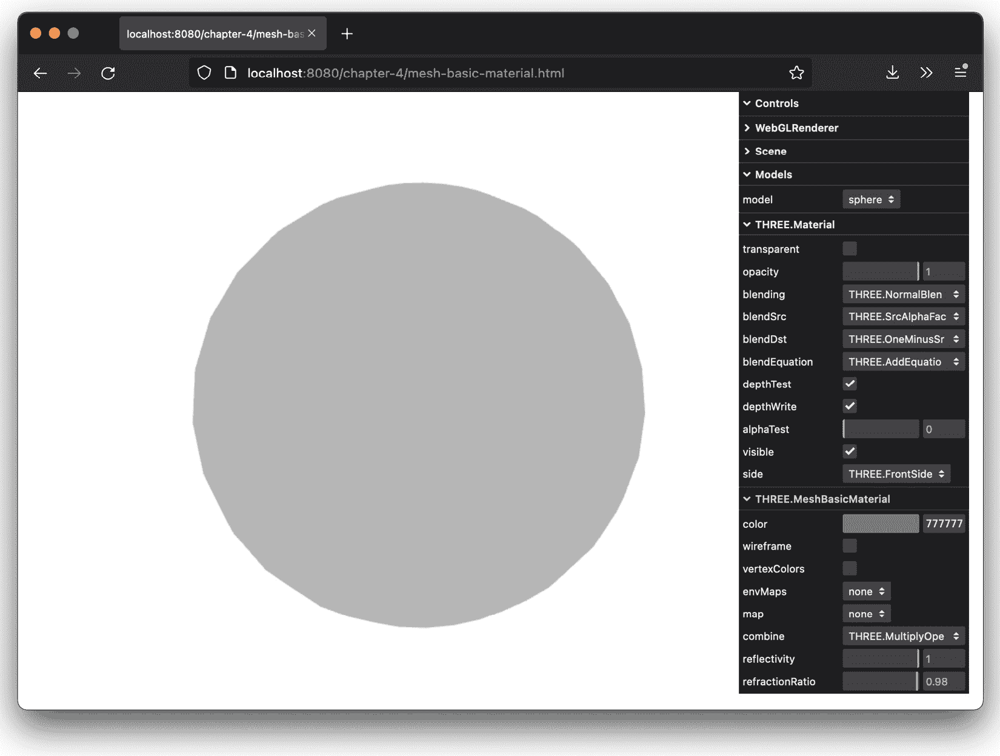

图 4.1 – 基本材质示例的起始屏幕

您可以在这张屏幕截图中看到的是一个基本的简单灰色球体。我们之前提到过`THREE.MeshBasicMaterial`不会对场景中的灯光做出反应，所以您看不到任何深度；所有面都是相同的颜色。尽管如此，您仍然可以创建看起来很棒的模型。例如，如果您通过在`envMaps`下拉菜单中选择`reflection`属性来启用反射，设置场景的背景，并将模型更改为`torus`模型，您已经可以创建看起来很棒的模型：

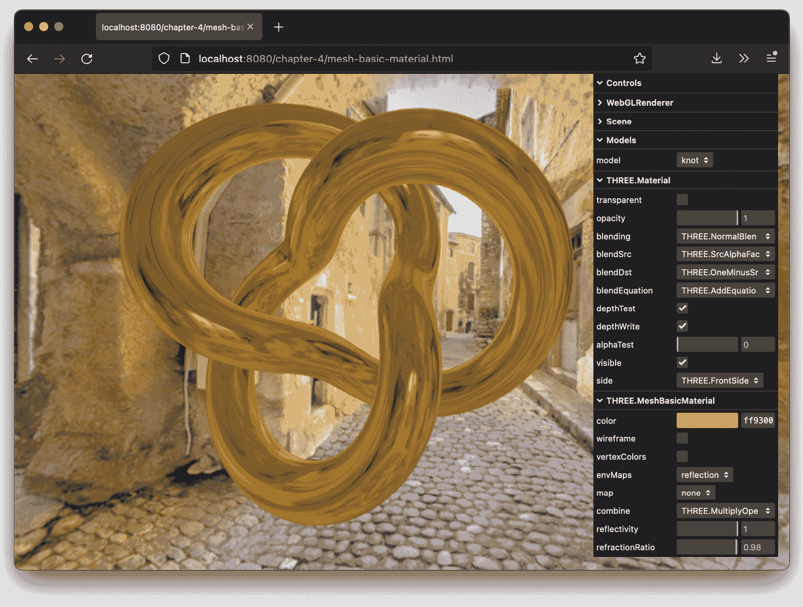

图 4.2 – 带环境图的环面结

`wireframe`属性非常适合查看`THREE.Mesh`的底层几何形状，并且非常适合调试：

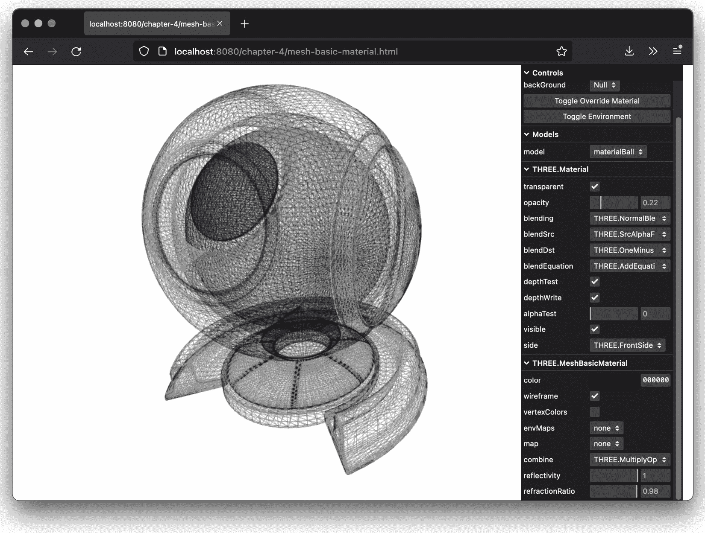

图 4.3 – 显示其线框的模型

我们接下来想要更仔细地研究的是`vertexColors`属性。如果您启用此属性，则模型的单个顶点的颜色将用于渲染模型。如果您从菜单中的模型下拉列表中选择`vertexColor`，您将看到一个具有着色顶点的模型。要查看这一点，最简单的方法是同时启用线框：

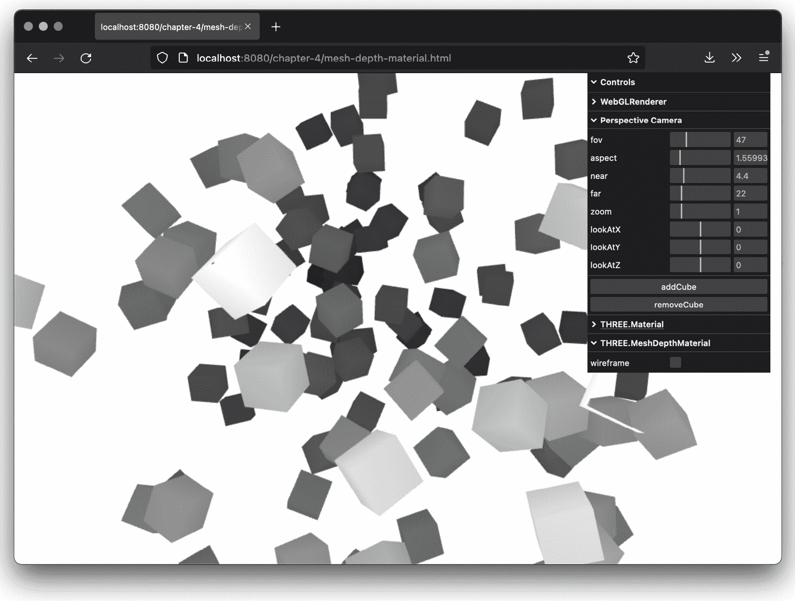

图 4.4 – 显示线框和顶点颜色的模型

顶点颜色可以用来用不同的颜色为网格的不同部分着色，而无需使用纹理或多个材料。

在这个示例中，您还可以通过查看*图 4.4*中的菜单的**THREE.Material**部分来尝试调整我们在本章开头讨论的标准材料属性。

## THREE.MeshDepthMaterial

列表中的下一个材料是`THREE.MeshDepthMaterial`。使用这种材料，对象的视觉效果不是由灯光或特定的材料属性定义的，而是由对象到摄像机的距离定义的。例如，您可以将其与其他材料结合使用，以轻松创建渐变效果。这种材料唯一的附加属性是我们之前在`THREE.MeshBasicMaterial`中看到的一个：`wireframe`属性。

为了演示这种材料，我们创建了一个示例，您可以通过打开`mesh-depth-material`示例来查看：


图 4.5 – 网格深度材料

在这个示例中，您可以通过点击菜单中的相关按钮来添加和移除立方体。您会看到靠近摄像机的立方体渲染得非常亮，而远离摄像机的立方体渲染得较暗。在这个示例中，您可以通过调整`Perspective Camera`设置的`far`和`near`属性来了解这是如何工作的。通过调整摄像机的`far`和`near`属性，您可以改变场景中所有立方体的亮度。

通常，您不会将此材料作为网格的唯一材料使用；相反，您会将其与不同的材料结合使用。我们将在下一节中看到这是如何工作的。

## 材料组合

如果您回顾一下`THREE.MeshDepthMaterial`的属性，您会看到没有选项可以设置立方体的颜色。所有这些都是由材料的默认属性为您决定的。然而，Three.js 提供了组合材料以创建新效果的选择（这也是混合作用的地方）。以下代码显示了我们可以如何组合材料：

```js
import * as SceneUtils from 'three/examples/jsm/
  utils/SceneUtils'
const material1 = new THREE.MeshDepthMaterial()
const material2 = new THREE.MeshBasicMaterial({ color:
  0xffff00 })
const geometry = new THREE.BoxGeometry(0.5, 0.5, 0.5)
const cube = SceneUtils.createMultiMaterialObject(geometry,
  [material2, material1])
```

首先，我们创建了两种材质。对于`THREE.MeshDepthMaterial`，我们没有做任何特殊的事情；对于`THREE.MeshBasicMaterial`，我们只是设置了颜色。这段代码的最后一行也是很重要的一行。当我们使用`SceneUtils.createMultiMaterialObject()`函数创建网格时，几何体被复制，并返回两个相同的网格组。

我们得到了以下使用`THREE.MeshDepthMaterial`的亮度和`THREE.MeshBasicMaterial`的颜色组合的绿色立方体。你可以在浏览器中打开`chapter-4`文件夹中的`combining-materials.html`示例来查看这是如何工作的：

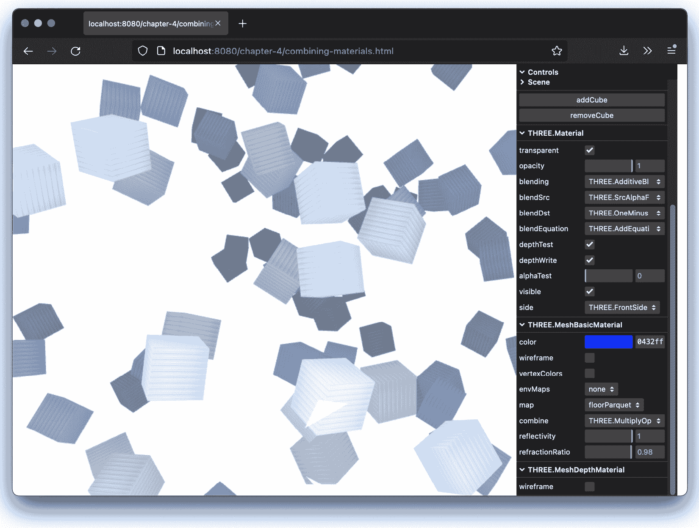

图 4.6 – 材料组合

当你第一次打开这个示例时，你只会看到实体对象，没有任何`THREE.MeshDepthMaterial`的效果。为了组合颜色，我们还需要指定这些颜色如何混合。在*图 4*.6*的右侧菜单中，你可以使用`blending`属性来指定这一点。在这个示例中，我们使用了`THREE.AdditiveBlending`模式，这意味着颜色会被相加，最终的颜色会显示出来。这个示例是探索不同混合选项并观察它们如何影响材质最终颜色的绝佳方式。

下一个材质也是我们不会对渲染中使用的颜色产生任何影响的一个。

## THREE.MeshNormalMaterial

理解这种材质如何渲染的最简单方法首先是查看一个示例。打开`chapter-4`文件夹中的`mesh-normal-material.html`示例，并启用`flatShading`：

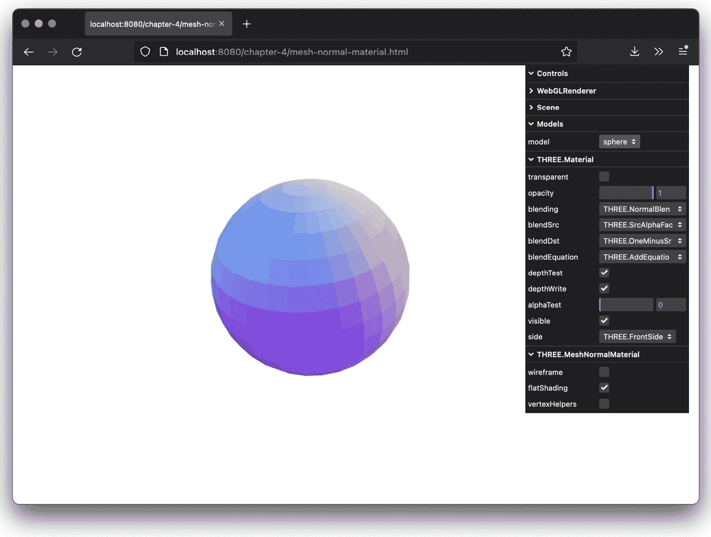

图 4.7 – 网格法线材质

如你所见，网格的每个面都以略不同的颜色渲染。这是因为每个面的颜色基于从面指向外的法线。而这个面的法线是基于构成面的各个顶点的法线向量。法线向量垂直于顶点的面。法线向量在 Three.js 的许多不同部分中使用。它用于确定光线反射，帮助将纹理映射到 3D 模型，并提供有关如何照亮、着色和着色像素表面的信息。幸运的是，Three.js 处理这些向量的计算并在内部使用它们，所以你不需要自己计算或处理它们。

Three.js 提供了一个辅助工具来可视化这个法线，你可以在菜单中启用`vertexHelpers`属性来显示它：

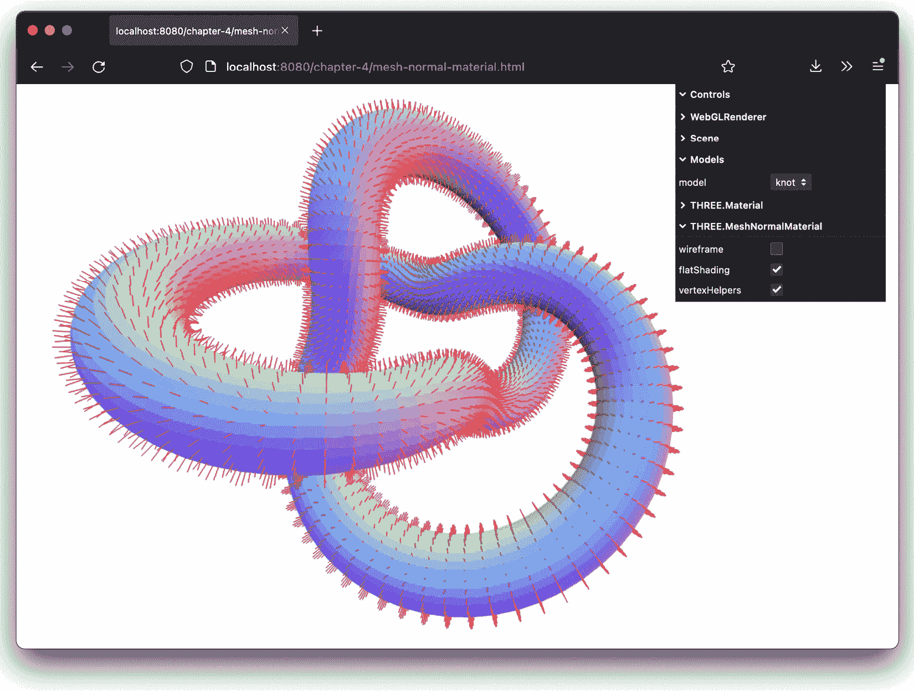

图 4.8 – 网格法线辅助工具

通过几行代码自己添加这个辅助工具：

```js
Import { VertexNormalsHelper } from 'three/examples/jsm/
  helpers/VertexNormalsHelper'
...
const helper = new VertexNormalsHelper(mesh, 0.1, 0xff0000)
helper.name = 'VertexNormalHelper'
scene.add(helper)
```

`VertexNormalsHelper`接受三个参数。第一个是`THREE.Mesh`，你想看到辅助工具的网格，第二个是箭头的长度，最后一个是颜色。

让我们以此为例，看看`shading`属性。使用`shading`属性，我们可以告诉 Three.js 如何渲染我们的对象。如果你使用`THREE.FlatShading`，每个面将按原样渲染（如前一张截图所示），或者你可以使用`THREE.SmoothShading`，它将平滑我们的对象的面。例如，如果我们使用`THREE.SmoothShading`渲染相同的球体，结果将看起来像这样：

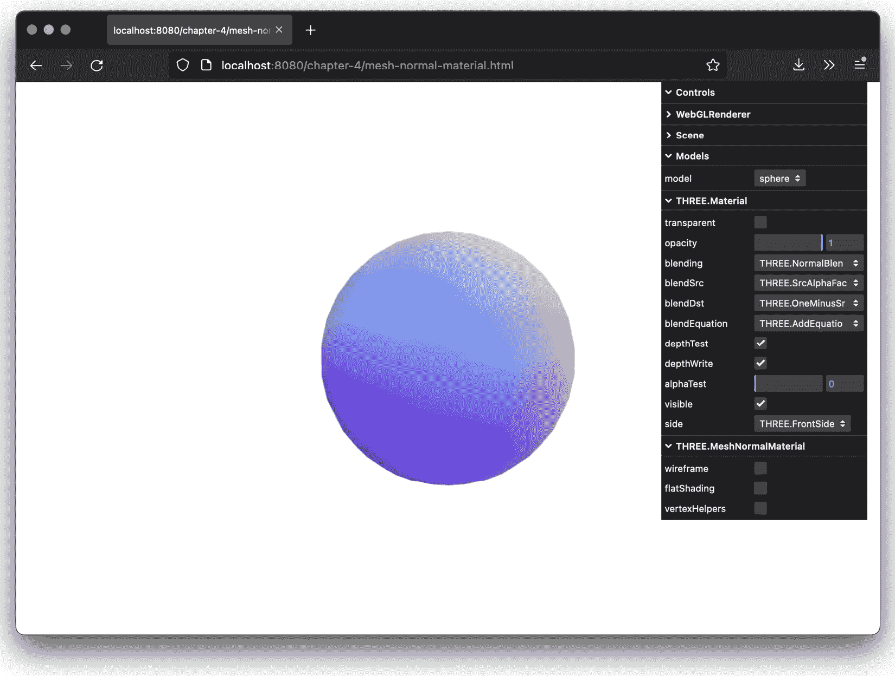

图 4.9 – 网格法线平滑着色

我们已经完成了简单材料的学习，但在继续之前，让我们看看一个额外的主题。在下一节中，我们将探讨如何为几何体的特定面使用不同的材料。

## 单个网格的多个材料

在创建`THREE.Mesh`时，到目前为止，我们使用的是单一材料。也可以为几何体的每个面定义特定的材料。例如，如果你有一个有 12 个面的立方体（记住，Three.js 使用三角形），你可以为立方体的每个面分配不同的材料（例如，使用不同的颜色）。这样做很简单，如下面的代码片段所示：

```js
const mat1 = new THREE.MeshBasicMaterial({ color: 0x777777
  })
const mat2 = new THREE.MeshBasicMaterial({ color: 0xff0000
  })
const mat3 = new THREE.MeshBasicMaterial({ color: 0x00ff00
  })
const mat4 = new THREE.MeshBasicMaterial({ color: 0x0000ff
  })
const mat5 = new THREE.MeshBasicMaterial({ color: 0x66aaff
  })
const mat6 = new THREE.MeshBasicMaterial({ color: 0xffaa66
  })
const matArray = [mat1, mat2, mat3, mat4, mat5, mat6]
const cubeGeom = new THREE.BoxGeometry(1, 1, 1, 10, 10, 10)
const cubeMesh = new THREE.Mesh(cubeGeom, material)
```

我们创建了一个名为`matArray`的数组来存储所有材料，并使用该数组创建`THREE.Mesh`。你可能注意到，尽管我们有 12 个面，但我们只创建了六个材料。要理解这是如何工作的，我们必须看看 Three.js 是如何将材料分配给面的。Three.js 使用`groups`属性来做这件事。要亲自查看，请打开`multi-material.js`的源代码，并添加`debugger`语句，如下所示：

```js
  const group = new THREE.Group()
  for (let x = 0; x < 3; x++) {
    for (let y = 0; y < 3; y++) {
      for (let z = 0; z < 3; z++) {
        const cubeMesh = sampleCube([mat1, mat2, mat3,
          mat4, mat5, mat6], 0.95)
        cubeMesh.position.set(x - 1.5, y - 1.5, z - 1.5)
        group.add(cubeMesh)
        debugger
      }
    }
  }
```

这将导致浏览器停止执行，并允许你从浏览器控制台检查所有对象：

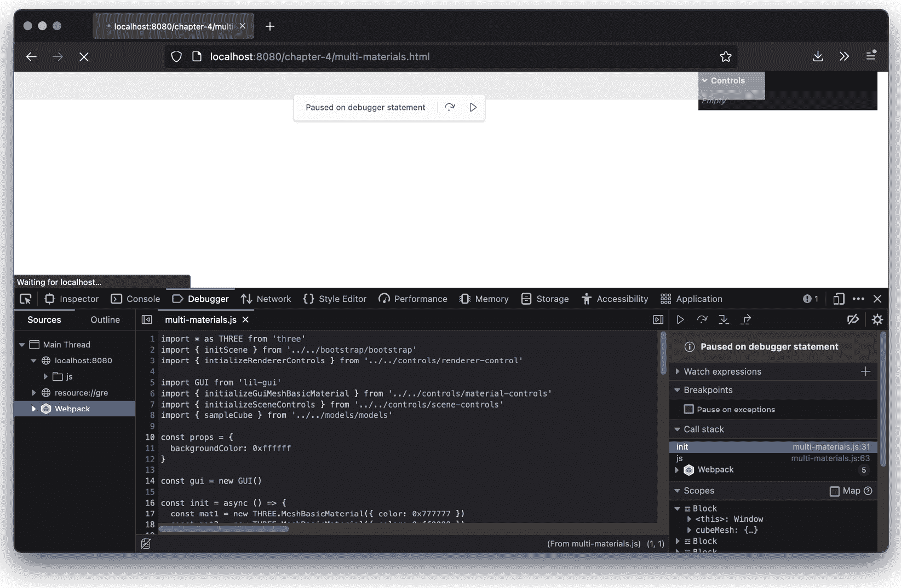

图 4.10 – 使用断点语句停止执行

在浏览器中，如果你打开`cubeMesh`，我们可以使用`console.log(cubeMesh)`：

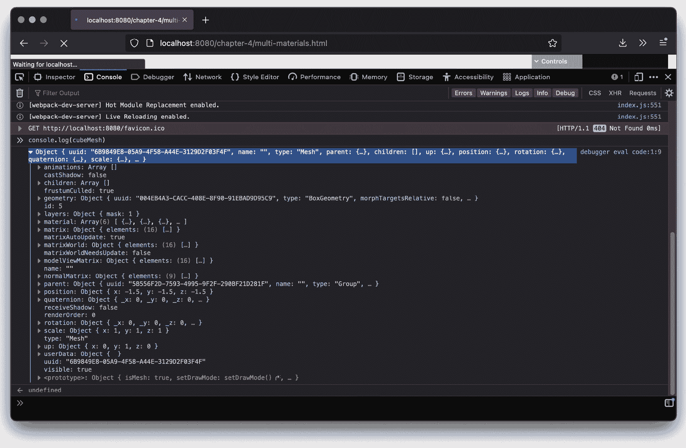

图 4.11 – 打印出有关对象的信息

如果你进一步查看`cubeMesh`的`geometry`属性，你会看到`groups`。这个属性是一个包含六个元素的数组，其中每个元素包含属于该组的顶点范围，以及一个额外的属性`materialIndex`，它指定了应该为该组顶点使用传入的哪种材料：

```js
[{ "start": 0,    "count": 600, "materialIndex": 0 },
 { "start": 600,  "count": 600, "materialIndex": 1 },
 { "start": 1200, "count": 600, "materialIndex": 2 },
 { "start": 1800, "count": 600, "materialIndex": 3 },
 { "start": 2400, "count": 600, "materialIndex": 4 },
 { "start": 3000, "count": 600, "materialIndex": 5 }]
```

因此，如果你从头开始创建自己的对象，并想将不同的材料应用于不同的顶点组，你必须确保正确设置`groups`属性。对于由 Three.js 创建的对象，你不需要手动做这件事，因为 Three.js 已经做了。

使用这种方法，创建有趣的模型非常简单。例如，我们可以轻松地创建一个简单的 3D 魔方，正如你在`multi-materials.html`示例中看到的那样：

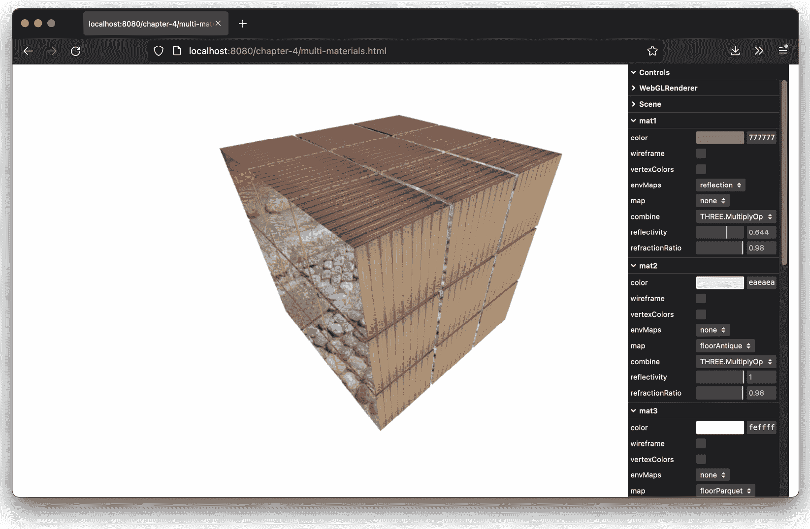

图 4.12 – 六种不同材料的多材料

我们还添加了对应用于每个面的材料的控制，以便进行实验。创建这个立方体与我们之前在*单个网格的多种材料*部分看到的方法没有太大区别：

```js
const group = new THREE.Group()
const mat1 = new THREE.MeshBasicMaterial({ color: 0x777777
  })
const mat2 = new THREE.MeshBasicMaterial({ color: 0xff0000
  })
const mat3 = new THREE.MeshBasicMaterial({ color: 0x00ff00
  })
const mat4 = new THREE.MeshBasicMaterial({ color: 0x0000ff
  })
const mat5 = new THREE.MeshBasicMaterial({ color: 0x66aaff
  })
const mat6 = new THREE.MeshBasicMaterial({ color: 0xffaa66
  })
for (let x = 0; x < 3; x++) {
  for (let y = 0; y < 3; y++) {
    for (let z = 0; z < 3; z++) {
      const cubeMesh = sampleCube([mat1, mat2, mat3, mat4,
        mat5, mat6], 0.95)
      cubeMesh.position.set(x - 1.5, y - 1.5, z - 1.5)
      group.add(cubeMesh)
    }
  }
}
```

在这段代码中，首先，我们创建`THREE.Group`，它将包含所有的单个立方体（组）；接下来，我们为立方体的每一面创建材料。然后，我们创建三个循环以确保创建正确的立方体数量。在这个循环中，我们创建每个单个立方体，分配材料，定位它们，并将它们添加到组中。你应该记住的是，立方体的位置相对于这个组的位置。如果我们移动或旋转组，所有的立方体都会随之移动和旋转。有关如何使用组的更多信息，请参阅*第八章*，*创建和加载高级网格* *和几何体*。

这样，我们就完成了关于基本材料和如何组合它们的这一节。在下一节中，我们将探讨更多高级材料。

# 高级材料

在本节中，我们将探讨 Three.js 提供的高级材料。我们将探讨以下材料：

+   `THREE.MeshLambertMaterial`：一种用于看起来粗糙的材料

+   `THREE.MeshPhongMaterial`：一种用于看起来光滑的材料

+   `THREE.MeshToonMaterial`：以卡通风格渲染网格

+   `THREE.ShadowMaterial`：一种只显示在其上投射的阴影的材料；材料本身是透明的

+   `THREE.MeshStandardMaterial`：一种多功能的材料，可以用来表示许多不同类型的表面

+   `THREE.MeshPhysicalMaterial`：类似于`THREE.MeshStandardMaterial`，但提供了更多类似真实世界表面的属性

+   `THREE.ShaderMaterial`：一种可以自己定义如何渲染对象，通过编写自己的着色器的材料

我们将从`THREE.MeshLambertMaterial`开始。

## THREE.MeshLambertMaterial

这种材料可以用来创建看起来平淡无奇、非闪亮的表面。这是一个非常易于使用的材料，它对场景中的光源做出反应。这个材料可以使用我们之前已经看到的基本属性进行配置，因此我们不会深入探讨这些属性的细节；相反，我们将专注于特定于这种材料的属性。这仅剩下以下属性：

+   `color`：这是材料颜色。

+   `emissive`：这是材料发出的颜色。它不作为光源，但这是一个不受其他光照影响的实色。默认为黑色。你可以使用这个属性来创建看起来像发光物体的对象。

+   `emissiveIntensity`：对象看起来发光的强度。

创建此对象的方法与我们之前看到的其他材质相同：

```js
const material = new THREE.MeshLambertMaterial({color:
  0x7777ff});
```

以下是一个此材质的示例，请查看 `mesh-lambert-material.html` 示例：

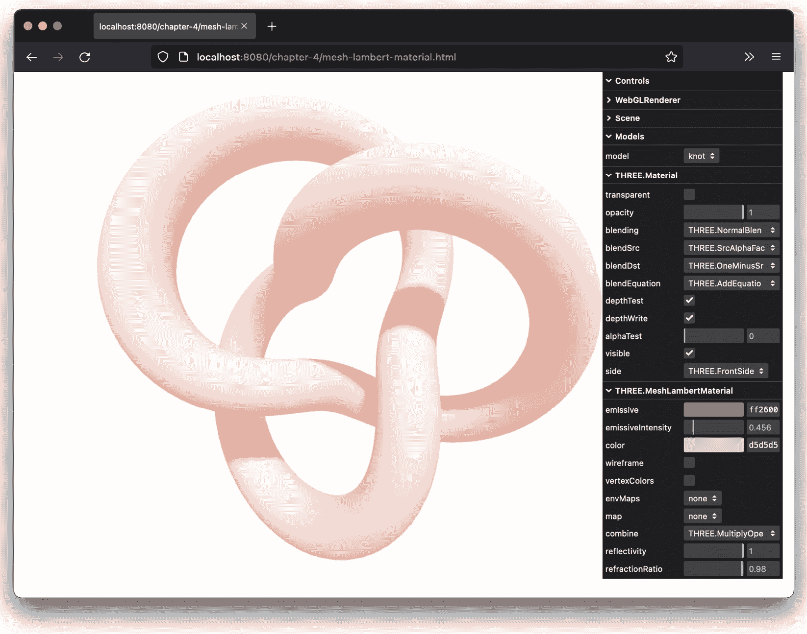

图 4.13 – 网格 Lambert 材质

此截图显示了一个白色的环面结，带有非常淡的红光发射。`THREE.LambertMaterial` 的一个有趣特性是它也支持线框属性，因此您可以渲染一个对场景中的灯光做出反应的线框：

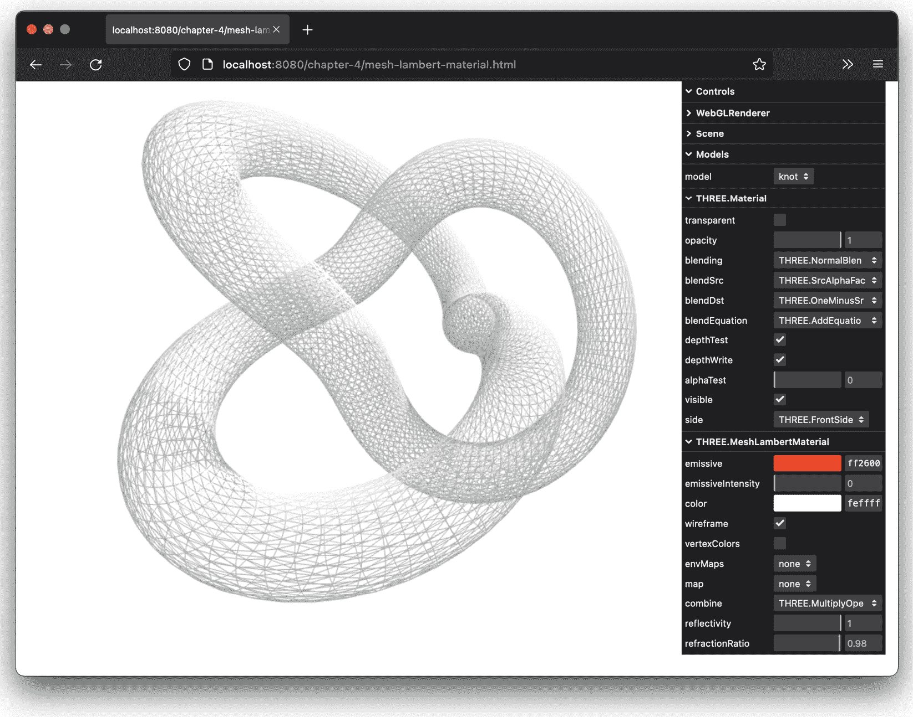

图 4.14 – 具有线框的网格 Lambert 材质

下一个材质的工作方式几乎与上一个相同，但可以用来创建具有光泽的对象。

## THREE.MeshPhongMaterial

使用 `THREE.MeshPhongMaterial`，我们可以创建一个具有光泽的材质。可用于此的属性与非光泽的 `THREE.MeshLambertMaterial` 对象的属性几乎相同。在旧版本中，这是唯一可以用来制作具有光泽、塑料或金属感对象的材质。随着 Three.js 的新版本，如果您想要更多控制，您还可以使用 `THREE.MeshStandardMaterial` 和 `THREE.MeshPhysicalMaterial`。在查看 `THREE.MeshPhongMaterial` 之后，我们将讨论这两种材质。

我们将再次跳过基本属性，专注于此材质的特定属性。此材质的属性在此列出：

+   `emissive`：这是此材质发出的颜色。它不作为光源，但这是一个不受其他光照影响的实色。默认为黑色。

+   `emissiveIntensity`：对象看起来发光的强度。

+   `specular`：此属性定义了材质的光泽度和发光颜色。如果将其设置为与 `color` 属性相同的颜色，则得到更具金属感的材质。如果设置为灰色，则结果为更具塑料感的材质。

+   `shininess`：此属性定义了镜面高光的光泽度。`shininess` 的默认值为 `30`。此值越高，对象的光泽度就越高。

初始化一个 `THREE.MeshPhongMaterial` 材质的方式与我们已经看到的所有其他材质相同，如下代码行所示：

```js
const meshMaterial = new THREE.MeshPhongMaterial({color:
  0x7777ff});
```

为了给您提供最佳的比较，我们将继续使用与 `THREE.MeshLambertMaterial` 和本章中其他材质相同的模型。您可以使用控制 GUI 来玩转此材质。例如，以下设置创建了一个具有塑料感的材质。您可以在 `mesh-phong-material.html` 中找到此示例：

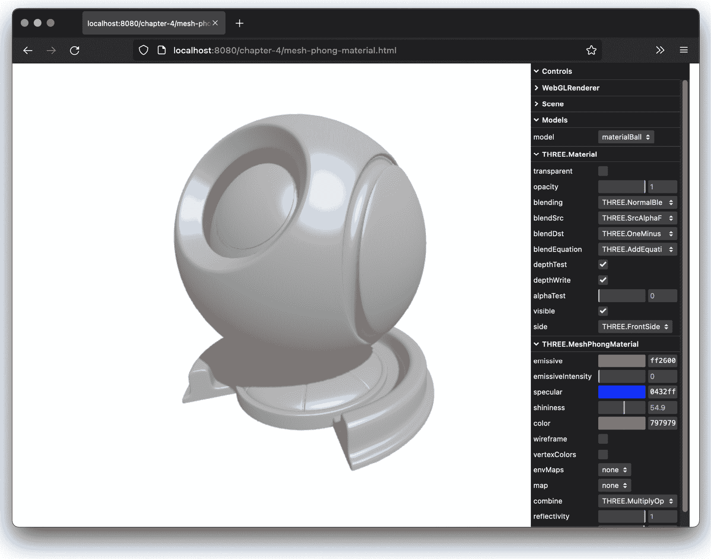

图 4.15 – 具有高光泽度的网格 Phong 材质

如此截图所示，与 `THREE.MeshLambertMaterial` 相比，该对象的光泽度和塑料感更强。

## THREE.MeshToonMaterial

并非 Three.js 提供的所有材质都实用。例如，`THREE.MeshToonMaterial` 允许您以类似卡通的风格渲染对象（参见 `mesh-toon-material.html` 示例）：

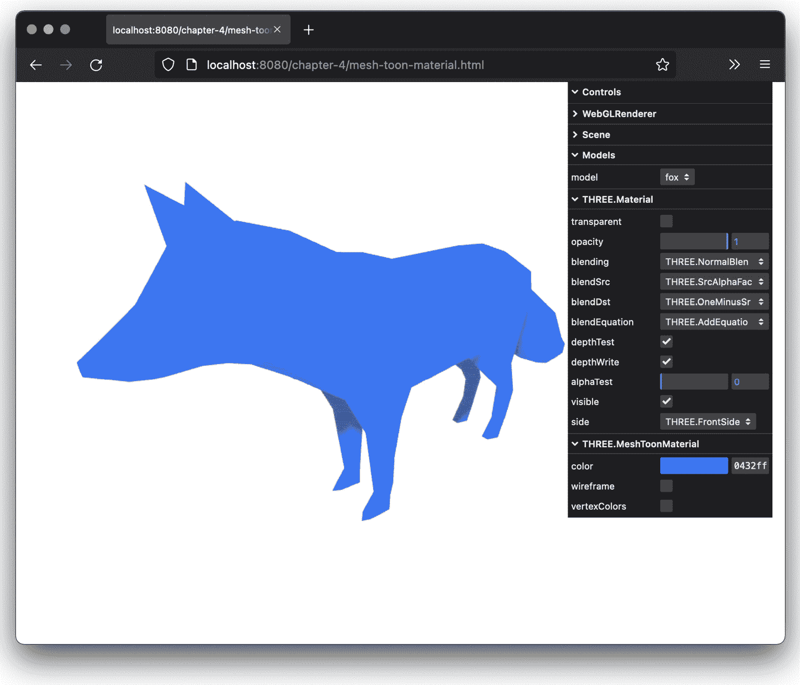

Figure 4.16 – The fox model rendered with MeshToonMaterial

如您所见，它看起来有点像我们之前看到的 `THREE.MeshBasicMaterial`，但这种材质会响应场景中的灯光并支持阴影。它只是将颜色组合在一起以创建类似卡通的效果。

如果您想要更逼真的材质，`THREE.MeshStandardMaterial` 是一个好的选择。

## THREE.MeshStandardMaterial

`THREE.MeshStandardMaterial` 是一种采用物理方法来确定场景中光照反应的材质。它非常适合用于具有光泽和金属质感的材质，并提供了一些您可以用来配置此材质的属性：

+   `metalness`: 此属性决定了材质的金属程度。非金属材质应使用 `0` 的值，而金属材质应使用接近 `1` 的值。默认值为 `0.5`。

+   `roughness`: 您也可以设置材质的粗糙程度。这决定了光线照射到该材质时的扩散情况。默认值为 `0.5`。值为 `0` 时呈现类似镜面的反射，而值为 `1` 则会扩散所有光线。

除了这些属性外，您还可以使用 `color` 和 `emissive` 属性，以及来自 `THREE.Material` 的属性，来改变此材质。如以下截图所示，我们可以通过调整 `metalness` 和 `roughness` 参数来模拟一种刷漆金属的外观：

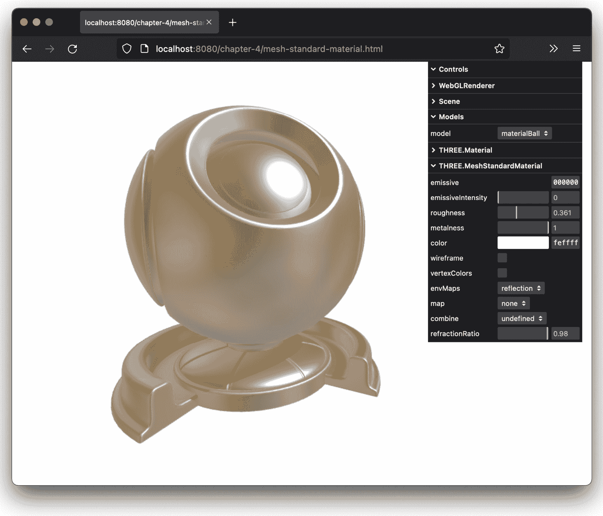

Figure 4.17 – Creating a brushed metal effect with MeshStandardMaterial

Three.js 提供了一种材质，提供了更多设置以渲染看起来更真实的对象：`THREE.MeshPhysicalMaterial`。

## THREE.MeshPhysicalMaterial

与 `THREE.MeshStandardMaterial` 非常接近的材质是 `THREE.MeshPhysicalMaterial`。使用此材质，您可以更好地控制材质的反射性。除了我们之前看到的 `THREE.MeshPhysicalMaterial` 的属性外，此材质还提供了以下属性，以帮助您控制材质的外观：

+   `clearCoat`: 表示材料上涂层层的值。此值越高，涂层的应用越多，`clearCoatRoughness` 参数的效果越明显。此值范围从 `0` 到 `1`，默认值为 `0`。

+   `clearCoatRoughness`: 材料涂层的粗糙程度。越粗糙，光线扩散越多。这通常与 `clearCoat` 属性一起使用。此值范围从 `0` 到 `1`，默认值为 `0`。

正如我们看到的其他材质一样，很难推理出你应该为特定需求使用的值。通常，添加一个简单的 UI（如我们在示例中所做）并调整值以找到最能反映你需求的组合是最好的选择。你可以通过查看 `mesh-physical-material.html` 示例来查看这个示例的实际效果：

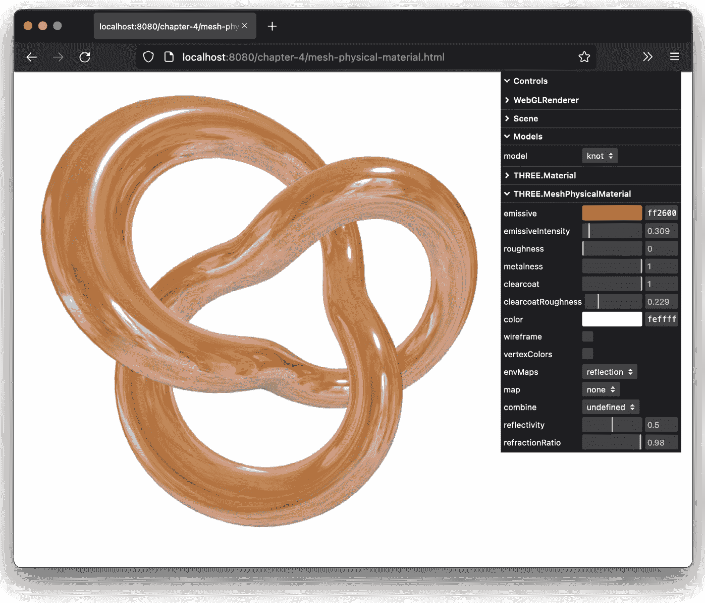

图 4.18 – 使用清漆控制反射的网格物理材质

大多数高级材质都能投射和接收阴影。我们将快速查看的下一个材质与大多数材质略有不同。这种材质不会渲染对象本身，而只显示阴影。

## THREE.ShadowMaterial

`THREE.ShadowMaterial` 是一种特殊的材质，它没有任何属性。你不能设置颜色或光泽，或任何其他东西。这个材质唯一能做的就是渲染网格接收到的阴影。以下截图应该可以解释这一点：

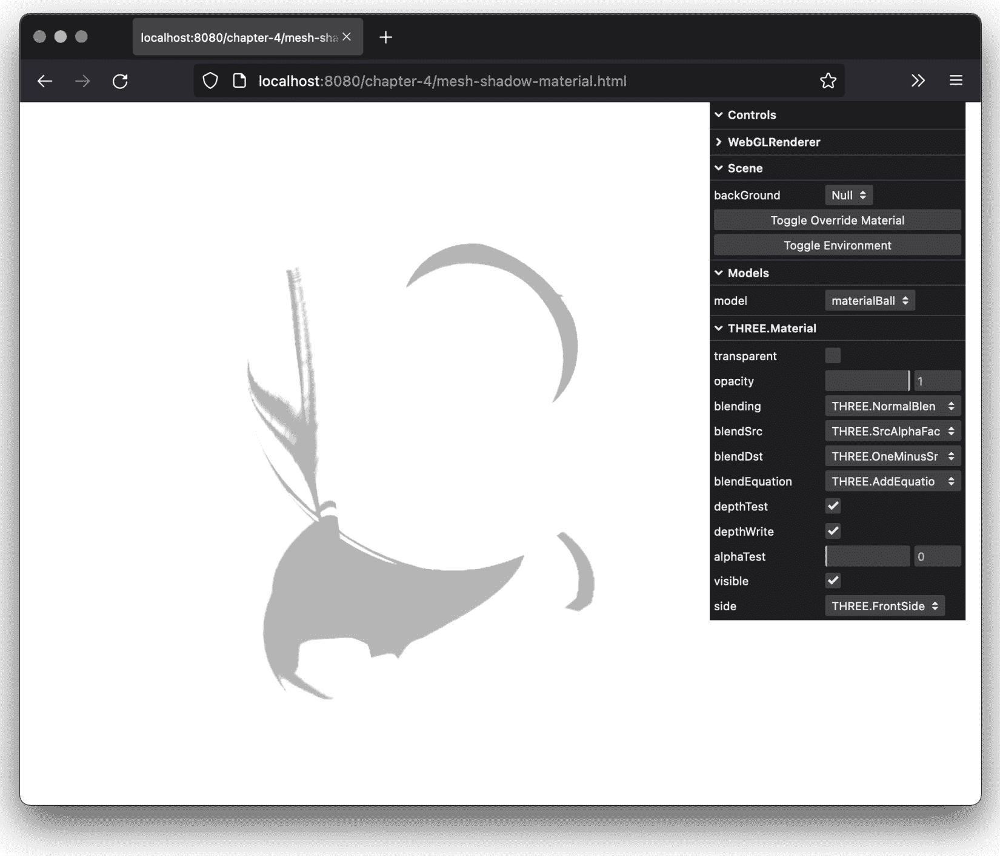

图 4.19 – 仅渲染网格接收到的阴影的阴影材质

在这里，我们只能看到对象接收到的阴影，没有其他东西。这种材质可以，例如，与你的其他材质结合使用，而无需确定如何接收阴影。

我们将要探索的最后一种高级材质是 `THREE.ShaderMaterial`。

## 使用 THREE.ShaderMaterial 自定义着色器

`THREE.ShaderMaterial` 是 Three.js 中最灵活和复杂的材质之一。使用这种材质，你可以传递自己的自定义着色器，这些着色器直接在 WebGL 上下文中运行。着色器将 Three.js 的 JavaScript 网格转换为屏幕上的像素。使用这些自定义着色器，你可以精确地定义你的对象应该如何渲染，以及如何覆盖或修改 Three.js 的默认设置。在本节中，我们不会过多地介绍如何编写自定义着色器；相反，我们只会展示几个示例。

正如我们已经看到的，`THREE.ShaderMaterial` 有几个你可以设置的属性。使用 `THREE.ShaderMaterial`，Three.js 会将所有关于这些属性的详细信息传递给你的自定义着色器，但你仍然需要处理这些信息以创建颜色和顶点位置。以下是将传递到着色器中的 `THREE.Material` 属性，你可以自己进行解释：

+   `wireframe`: 这会将材质渲染为线框。这对于调试目的非常有用。

+   `shading`: 这定义了阴影的应用方式。可能的值有 `THREE.SmoothShading` 和 `THREE.FlatShading`。这个属性在这个材料的示例中没有被启用。例如，可以查看 *THREE.* *MeshNormalMaterial* 部分。

+   `vertexColors`: 您可以使用此属性为每个顶点定义要应用的颜色。查看*THREE.LineBasicMaterial*部分中的`LineBasicMaterial`示例，在那里我们使用此属性为线的各个部分着色。

+   `fog`: 这决定了这个材料是否受全局雾设置的影响。这不会在动作中显示。如果设置为`false`，我们在*第二章*中看到的全局雾不会影响这个对象的渲染方式。

除了传递给着色器的这些属性外，`THREE.ShaderMaterial`还提供了一些特定的属性，您可以使用它们将额外的信息传递到您的自定义着色器中。再次强调，我们不会过多地详细介绍如何编写自己的着色器，因为这本身就可以是一本专著，所以我们只介绍基础知识：

+   `fragmentShader`: 这个着色器定义了传入的每个像素的颜色。在这里，您需要传入您的片段着色器程序的字面值字符串。

+   `vertexShader`: 这个着色器允许您改变传入的每个顶点的位置。在这里，您需要传入您的顶点着色器程序的字面值字符串。

+   `uniforms`: 这允许您将信息发送到您的着色器。相同的信息被发送到每个顶点和片段。

+   `defines`: 将自定义键值对转换为`#define`代码片段。使用这些片段，您可以在着色器程序中设置一些额外的全局变量或定义您自己的自定义全局常量。

+   `attributes`: 这些属性可以在每个顶点和片段之间变化。它们通常用于传递位置和法线相关的数据。如果您想使用这个属性，您需要为几何形状的所有顶点提供信息。

+   `lights`: 这决定了是否应将光数据传递到着色器中。默认为`false`。

在我们查看示例之前，我们将快速解释`THREE.ShaderMaterial`最重要的部分。要使用这种材料，我们必须传递两个不同的着色器：

+   `vertexShader`: 这是在几何形状的每个顶点上运行的。您可以使用这个着色器通过移动顶点的位置来变换几何形状。

+   `fragmentShader`: 这是在几何形状的每个片段上运行的。在`fragmentShader`中，我们返回应该显示给这个特定片段的颜色。

对于本章中讨论的所有材料，Three.js 提供了`fragmentShader`和`vertexShader`，因此您不必担心它们，也不必明确传递它们。

在本节中，我们将查看一个简单的示例，该示例使用一个非常简单的`vertexShader`程序，该程序改变简单`THREE.PlainGeometry`的顶点的`x`和`y`坐标，以及一个`fragmentShader`程序，该程序根据一些输入改变颜色。

接下来，你可以看到我们的`vertexShader`的完整代码。请注意，编写着色器不是在 JavaScript 中完成的。你使用一种类似于 C 的语言编写着色器，称为 GLSL（WebGL 支持 OpenGL ES Shading Language 1.0 —— 关于 GLSL 的更多信息，请参阅[`www.khronos.org/webgl/`](https://www.khronos.org/webgl/))。我们的简单着色器代码看起来像这样：

```js
uniform float time;
void main(){
  vec3 posChanged=position;
  posChanged.x=posChanged.x*(abs(sin(time*2.)));
  posChanged.y=posChanged.y*(abs(cos(time*1.)));
  posChanged.z=posChanged.z*(abs(sin(time*.5)));
  gl_Position=projectionMatrix*modelViewMatrix*vec4
    (posChanged,1.);
}
```

在这里，我们不会过多地深入细节，只关注这段代码最重要的部分。为了从 JavaScript 与着色器通信，我们使用一种称为 uniforms 的东西。在这个例子中，我们使用`uniform float time;`语句传入一个外部值。

基于此值，我们更改传入顶点的`x`、`y`和`z`坐标（该顶点作为位置变量传入）：

```js
  posChanged.x=posChanged.x*(abs(sin(time*2.)));
  posChanged.y=posChanged.y*(abs(cos(time*1.)));
  posChanged.z=posChanged.z*(abs(sin(time*.5)));
```

`posChanged`向量现在包含根据传入的时间变量计算出的这个顶点的新的坐标。我们需要执行的最后一个步骤是将这个新位置传回渲染器，对于 Three.js 来说，这总是这样做的：

```js
  gl_Position=projectionMatrix*modelViewMatrix*vec4
    (posChanged,1.);
```

`gl_Position`变量是一个特殊变量，用于返回最终位置。这个程序作为字符串值传递给`THREE.ShaderMaterial`的`vertexShader`属性。对于`fragmentShader`，我们做类似的事情。我们创建了一个非常简单的片段着色器，它根据传入的`time`uniform 翻转颜色：

```js
uniform float time;
void main(){
  float c1=mod(time,.5);
  float c2=mod(time,.7);
  float c3=mod(time,.9);
  gl_FragColor=vec4(c1,c2,c3,1.);
}
```

在`fragmentShader`中，我们确定传入的片段（一个像素）的颜色。真实的着色器程序考虑了很多因素，比如灯光、顶点在面上的位置、法线等等。然而，在这个例子中，我们只是确定颜色的`rgb`值，并在`gl_FragColor`中返回它，然后它会在最终渲染的网格上显示出来。

现在，我们需要将几何体、材质和两个着色器粘合在一起。在 Three.js 中，我们可以这样做：

```js
const geometry = new THREE.PlaneGeometry(10, 10, 100, 100)
const material = new THREE.ShaderMaterial({
  uniforms: {
    time: { value: 1.0 }
  },
  vertexShader: vs_simple,
  fragmentShader: fs_simple
})
const mesh = new THREE.Mesh(geometry, material)
```

在这里，我们定义了`time`uniform，它将包含在着色器中可用的值，并将`vertexShader`和`fragmentShader`定义为我们要使用的字符串。我们唯一需要做的是确保在渲染循环中更改`time`uniform，然后就可以了：

```js
// in the renderloop
material.uniforms.time.value += 0.005
```

在本章的示例中，我们添加了一些简单的着色器来进行实验。如果你打开`chapter-4`文件夹中的`shader-material-vertex.html`示例，你会看到结果：

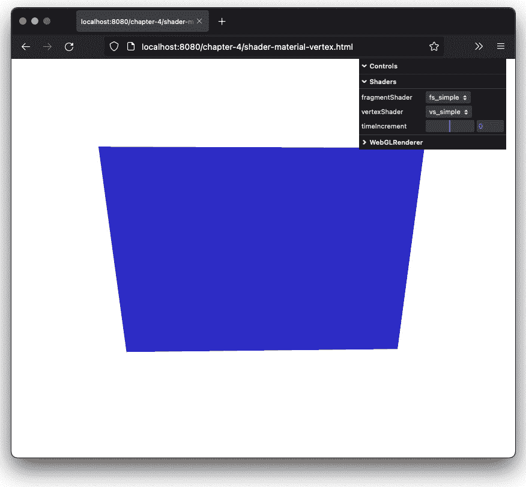

图 4.20 – 显示两个示例着色程序的平面着色器材质

在下拉菜单中，你还可以找到一些其他的着色器。例如，`fs_night_sky`片段着色器显示了一个星空夜空（基于[`www.shadertoy.com/view/Nlffzj`](https://www.shadertoy.com/view/Nlffzj)的着色器）。当与`vs_ripple`结合使用时，你会得到一个非常漂亮的视觉效果，完全在 GPU 上运行，如图所示：

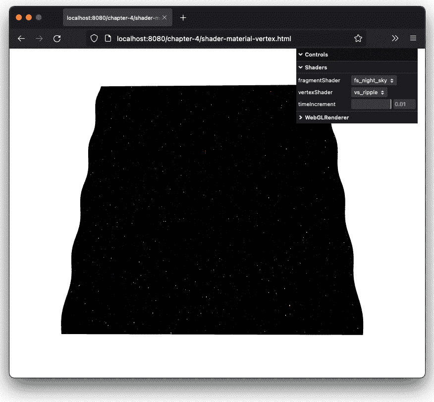

图 4.21 – 使用星夜片段着色器的涟漪效果

有可能将现有材质组合起来，并使用你自己的着色器重用它们的片段和顶点着色器。这样，例如，你可以通过一些自定义效果扩展 `THREE.MeshStandardMaterial`。然而，在 plain Three.js 中这样做相当困难，并且容易出错。幸运的是，有一个开源项目为我们提供了一个自定义材质，这使得包装现有材质并添加我们自己的自定义着色器变得非常容易。在下一节中，我们将快速看一下它是如何工作的。

## 使用 CustomShaderMaterial 自定义现有着色器

`THREE.CustomShader` 不包含在默认的 Three.js 分发中，但由于我们使用 `yarn`，安装它非常简单（这就是你在从 *第一章*，*使用 Three.js 创建你的第一个 3D 场景*) 运行相关命令时所做的事情）。如果你想了解更多关于这个模块的信息，你可以查看 [`github.com/FarazzShaikh/THREE-CustomShaderMaterial`](https://github.com/FarazzShaikh/THREE-CustomShaderMaterial)，在那里你可以找到文档和额外的示例。

在我们展示一些示例之前，先快速看一下代码。使用 `THREE.CustomShader` 与使用其他材质相同：

```js
const material = new CustomShaderMaterial({
  baseMaterial: THREE.MeshStandardMaterial,
  vertexShader: ...,
  fragmentShader: ...,
  uniforms: {
    time: { value: 0.2 },
    resolution: { value: new THREE.Vector2() }
  },
  flatShading: true,
  color: 0xffffff
})
```

如你所见，它有点像是普通材质和 `THREE.ShaderMaterial` 的结合。主要需要关注的是 `baseMaterial` 属性。在这里，你可以添加任何标准 Three.js 材质。除了 `vertexShader`、`fragmentShader` 和 `uniforms` 之外，任何你添加的额外属性都会应用到这个 `baseMaterial` 上。`vertexshader`、`fragmentShader` 和 `uniforms` 属性的工作方式与我们在 `THREE.ShaderMaterial` 中看到的方式相同。

默认情况下，我们需要对我们的着色器本身做一些小的修改。回想一下 *使用 THREE.ShaderMaterial 自定义你的着色器* 部分，在那里我们使用了 `gl_Position` 和 `gl_FragColor` 来设置顶点的最终位置和片段的颜色。使用这种材质，我们使用 `csm_Position` 作为最终位置，`csm_DiffuseColor` 作为颜色。还有一些其他的输出变量你可以使用，这些变量在这里有更详细的解释：[`github.com/FarazzShaikh/THREE-CustomShaderMaterial#output-variables`](https://github.com/FarazzShaikh/THREE-CustomShaderMaterial#output-variables)。

如果你打开 `custom-shader-material` 示例，你会看到我们的简单着色器如何与 Three.js 的默认材质一起使用：

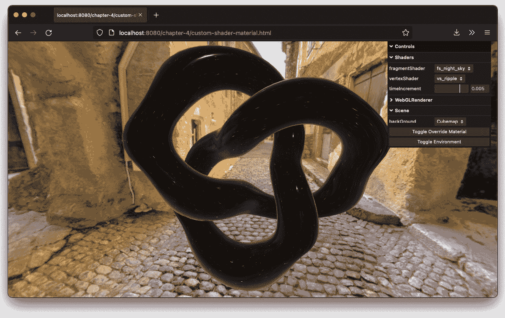

图 4.22 – 使用环境图和 MeshStandardMaterials 作为基础的涟漪效果

此方法为您提供了一个相对简单的方式来创建自定义着色器，而无需从头开始。您只需重用默认着色器中的灯光和阴影效果，并扩展它们以包含您所需的自定义功能。

到目前为止，我们已查看与网格一起工作的材料。Three.js 还提供了可以与线几何体一起使用的材料。在下一节中，我们将探讨这些材料。

# 可用于线几何体的材料

我们将要查看的最后几种材料只能用于一个特定的网格：`THREE.Line`。正如其名称所暗示的，这仅仅是一条线，只由线组成，不包含任何面。Three.js 提供了两种不同的材料，您可以在 `THREE.Line` 几何体上使用，如下所示：

+   `THREE.LineBasicMaterial`：这是一种基本的线材料，允许您设置 `color` 和 `vertexColors` 属性。

+   `THREE.LineDashedMaterial`：它具有与 `THREE.LineBasicMaterial` 相同的属性，但允许您通过指定 `dash` 和 `spacing` 大小来创建虚线效果。

我们将首先查看基本变体；之后，我们将查看虚线变体。

## THREE.LineBasicMaterial

可用于 `THREE.Line` 几何体的材料非常简单。它继承了 `THREE.Material` 的所有属性，但以下是该材料最重要的属性：

+   `color`：这决定了线的颜色。如果您指定了 `vertexColors`，则此属性将被忽略。以下代码片段展示了如何进行此操作。

+   `vertexColors`：您可以通过将此属性设置为 `THREE.VertexColors` 值来为每个顶点提供特定的颜色。

在我们查看 `THREE.LineBasicMaterial` 的示例之前，让我们快速看一下如何从一组顶点创建一个 `THREE.Line` 网格，并将其与 `THREE.LineMaterial` 结合起来以创建网格，如下所示：

```js
const points = gosper(4, 50)
const lineGeometry = new THREE.BufferGeometry().
  setFromPoints(points)
const colors = new Float32Array(points.length * 3)
points.forEach((e, i) => {
  const color = new THREE.Color(0xffffff)
  color.setHSL(e.x / 100 + 0.2, (e.y * 20) / 300, 0.8)
  colors[i * 3] = color.r
  colors[i * 3 + 1] = color.g
  colors[i * 3 + 2] = color.b
})
lineGeometry.setAttribute('color', new THREE.
  BufferAttribute(colors, 3, true))
const material = new THREE.LineBasicMaterial(0xff0000);
const mesh = new THREE.Line(lineGeometry, material)
mesh.computeLineDistances()
```

以下代码片段的第一部分 `const points = gosper(4, 60)` 被用作示例，以获取一组 `x`、`y` 和 `z` 坐标。此函数返回一个 Gosper 曲线（更多信息，请参阅 [`mathworld.wolfram.com/Peano-GosperCurve.html`](https://mathworld.wolfram.com/Peano-GosperCurve.html)），这是一个简单的算法，用于填充 2D 空间。接下来我们要做的是创建一个 `THREE.BufferGeometry` 实例，并调用 `setFromPoints` 函数来添加生成的点。对于每个坐标，我们还会计算一个颜色值，并将其用于设置几何体的 `color` 属性。注意此代码片段末尾的 `mesh.computeLineDistances`。当您想使用 `THREE.LineDashedMaterial` 时，这将是必需的。

现在我们有了我们的几何体，我们可以创建 `THREE.LineBasicMaterial` 并将其与几何体一起使用来创建一个 `THREE.Line` 网格。您可以在 `line-basic-material.html` 示例中看到结果。以下截图显示了此示例：

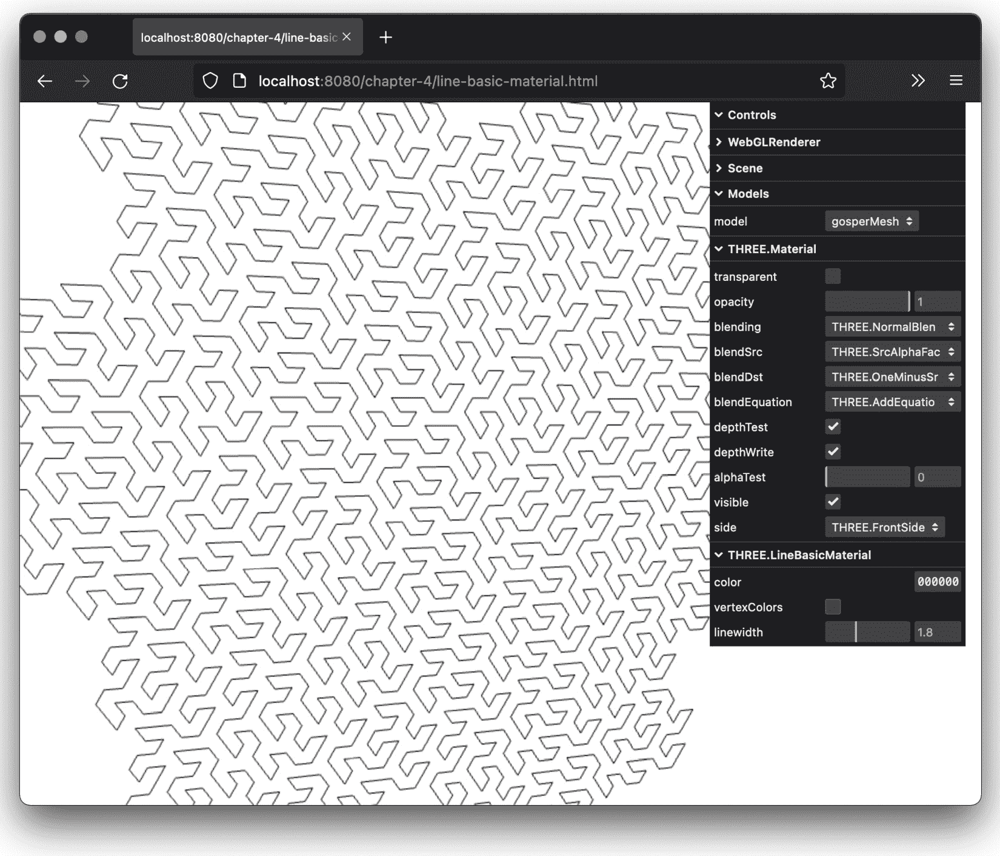

图 4.23 – 基本线材料

这是一个使用`THREE.LineBasicMaterial`创建的线几何体。如果我们启用`vertexColors`属性，我们会看到各个线段都有颜色：

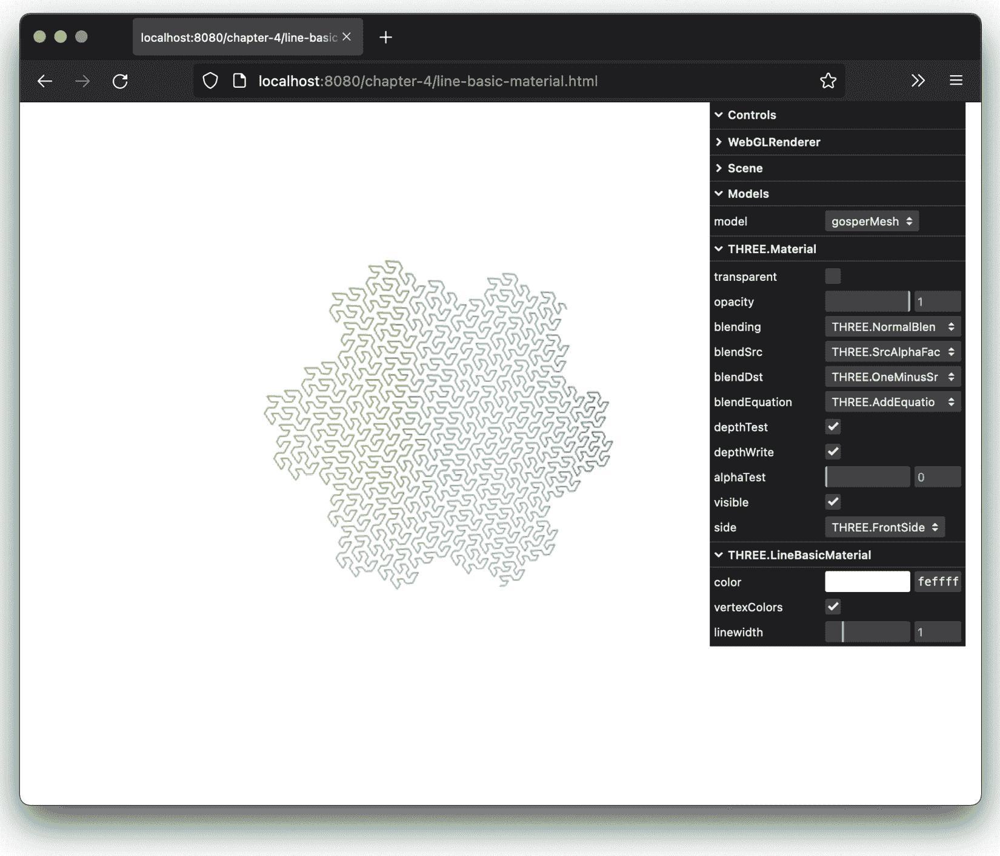

图 4.24 – 带顶点颜色的基本线材料

本章接下来要讨论的最后一种材料与`THREE.LineBasicMaterial`只有细微的差别。使用`THREE.LineDashedMaterial`，我们不仅可以给线着色，还可以给这些线添加空间。

## THREE.LineDashedMaterial

这种材料具有与`THREE.LineBasicMaterial`相同的属性，以及三个额外的属性，可以用来定义虚线的宽度和虚线之间的间隙宽度：

+   `scale`: 这会缩放`dashSize`和`gapSize`。如果缩放小于`1`，则`dashSize`和`gapSize`增加，而如果缩放大于`1`，则`dashSize`和`gapSize`减小。

+   `dashSize`: 这是虚线的长度。

+   `gapSize`: 这是间隙的长度。

这种材料几乎与`THREE.LineBasicMaterial`完全相同。唯一的区别是您必须调用`computeLineDistances()`（用于确定构成线的顶点之间的距离）。如果不这样做，间隙将不会正确显示。这种材料的示例可以在`line-dashed-material.html`中找到，看起来是这样的：

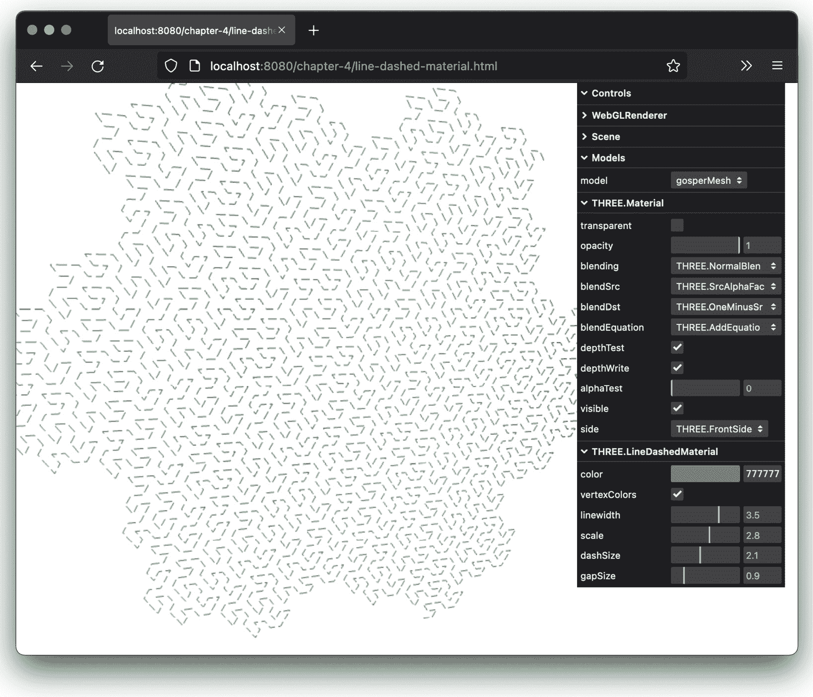

图 4.25 – 使用线虚线材料的高斯网格

关于用于线的材料这一部分就到这里。您已经看到，Three.js 只为线几何体提供了一些特定的材料，但使用这些材料，特别是与`vertexColors`结合使用，您应该能够以任何您想要的方式样式化线几何体。

# 摘要

Three.js 提供了许多您可以用来为几何体着色的材料。这些材料从非常简单的（`THREE.MeshBasicMaterial`）到复杂的（`THREE.ShaderMaterial`），其中您可以提供自己的`vertexShader`和`fragmentShader`程序。材料共享许多基本属性。如果您知道如何使用一种材料，您可能也知道如何使用其他材料。请注意，并非所有材料都对场景中的灯光做出反应。如果您需要一个考虑光照效果的材质，通常只需使用`THREE.MeshStandardMaterial`。如果您需要更多控制，也可以查看`THREE.MeshPhysicalMaterial`、`THREE.MeshPhongMaterial`或`THREE.MeshLamberMaterial`。仅从代码中确定某些材质属性的效果非常困难。通常，一个好的方法是使用控制 GUI 方法来实验这些属性，就像我们在本章中展示的那样。

此外，请记住，大多数材料的属性都可以在运行时进行修改。尽管如此（例如，`side`），有些属性在运行时是无法修改的。如果你更改了这样的值，你需要将`needsUpdate`属性设置为`true`。关于在运行时可以和不可以更改的完整概述，请参阅以下页面：[`threejs.org/docs/#manual/en/introduction/How-to-update-things`](https://threejs.org/docs/#manual/en/introduction/How-to-update-things)。

在本章和上一章中，我们讨论了几何体。我们在示例中使用它们，并探索了其中的一些。在下一章中，你将了解有关几何体的所有内容以及如何与它们一起工作。
