# 学习与几何体一起工作

在前面的章节中，您学习了如何使用 Three.js。现在您知道如何创建基本场景，添加光照，并为您的网格配置材质。在 *第二章*，*构成 Three.js 场景的基本组件*，我们简要介绍了（但并未深入探讨）Three.js 提供的可用几何体以及您可以使用它们创建 3D 对象的细节。在本章和 *第六章*，*探索高级几何体* 中，我们将向您介绍 Three.js 提供的所有内置几何体（除了我们在 *第四章*，*使用 Three.js 材质* 中讨论的 `THREE.Line`）。

在本章中，我们将探讨以下几何体：

+   `THREE.CircleGeometry`

+   `THREE.RingGeometry`

+   `THREE.PlaneGeometry`

+   `THREE.ShapeGeometry`

+   `THREE.BoxGeometry`

+   `THREE.SphereGeometry`

+   `THREE.CylinderGeometry`

+   `THREE.ConeGeometry`

+   `THREE.TorusGeometry`

+   `THREE.TorusKnotGeometry`

+   `THREE.PolyhedronGeometry`

+   `THREE.IcosahedronGeometry`

+   `THREE.OctahedronGeometry`

+   `THREE.TetraHedronGeometry`

+   `THREE.DodecahedronGeometry`

在我们探讨 Three.js 提供的几何体之前，我们首先深入了解一下 Three.js 如何作为 `THREE.BufferGeometry` 内部表示几何体。在某些文档中，您可能仍然会遇到 `THREE.Geometry` 作为所有几何体的基础对象。在较新版本中，这已被完全替换为 `THREE.BufferGeometry`，它通常提供更好的性能，因为它可以轻松地将数据传递到 GPU。然而，它比旧的 `THREE.Geometry` 稍微难以使用。

使用 `THREE.BufferGeometry`，几何体的所有属性都通过一组属性来识别。属性基本上是一个包含有关顶点位置信息的附加元数据的数组。属性还用于存储有关顶点的额外信息——例如，其颜色。要使用属性来定义顶点和面，您可以使用 `THREE.BufferGeometry` 的以下两个属性：

+   `attributes`：`attributes` 属性用于存储可以直接传递到 GPU 的信息。例如，为了定义一个形状，您定义一个 `Float32Array`，其中每个三个值定义一个顶点的位置。

然后将每个三个顶点解释为一个面。这可以在 `THREE.BufferGeometry` 中定义如下：`geometry.setAttribute( 'position', new THREE.BufferAttribute( arrayOfVertices, 3 ) );`。

+   `index`：默认情况下，不需要显式定义面（每三个连续的位置被解释为一个单独的面），但使用 `index` 属性，我们可以显式定义哪些顶点一起形成一个面：`geometry.setIndex(` `indicesArray );`。

对于本章中使用的几何形状，你不需要考虑这些内部属性，因为 Three.js 在你构建几何形状时会正确设置它们。但是，如果你要从头开始创建一个几何形状，你需要使用前面列表中显示的属性。

在 Three.js 中，我们有几个几何形状可以生成 2D 网格，以及更多用于创建 3D 网格的几何形状。在本章中，我们将讨论以下主题：

+   2D 几何形状

+   3D 几何形状

# 2D 几何形状

2D 对象看起来像平面对象，正如其名称所暗示的，只有两个维度。在本节中，我们将首先查看 2D 几何形状：`THREE.CircleGeometry`、`THREE.RingGeometry`、`THREE.PlaneGeometry` 和 `THREE.ShapeGeometry`。

## THREE.PlaneGeometry

一个 `THREE.PlaneGeometry` 对象可以用来创建一个非常简单的 2D 矩形。例如，查看本章源代码中的 `plane-geometry.html` 示例。以下截图展示了使用 `THREE.PlaneGeometry` 创建的矩形：

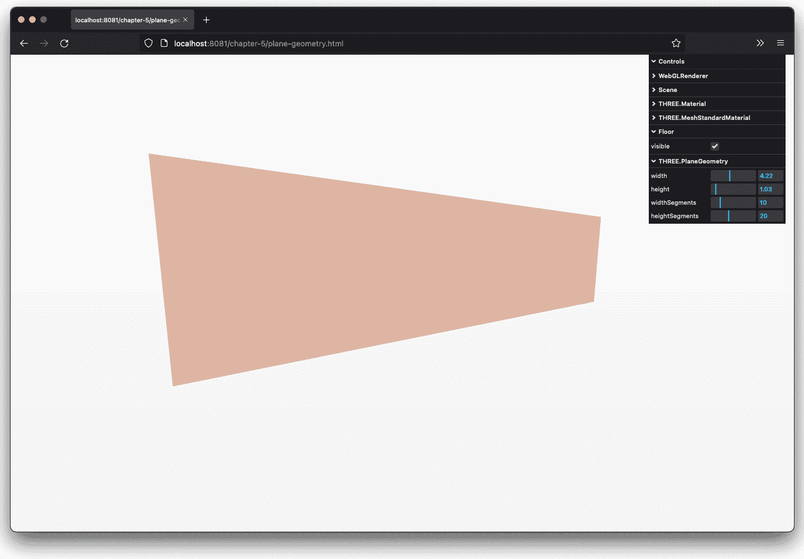

图 5.1 – 平面几何

在本章的示例中，我们添加了一个控制 GUI，你可以使用它来控制几何形状的属性（在这种情况下，`width`、`height`、`widthSegments` 和 `heightSegments`），还可以更改材质（及其属性），禁用阴影，并隐藏地面。例如，如果你想看到这个形状的各个面，你可以通过禁用地面并启用所选材质的 `wireframe` 属性轻松显示它们：

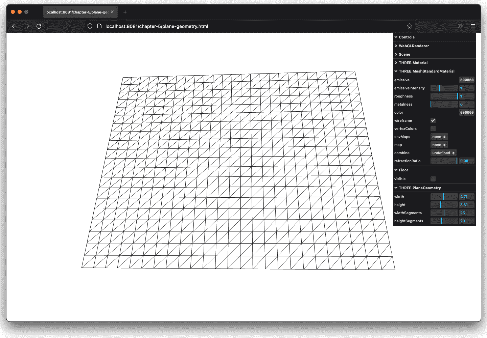

图 5.2 – 作为线框的平面几何

创建一个 `THREE.PlaneGeometry` 对象非常简单，如下所示：

```js
new THREE.PlaneGeometry(width, height, widthSegments, heightSegments)
```

在本例中，对于 `THREE.PlaneGeometry`，你可以更改这些属性，并直接看到它们对生成的 3D 对象产生的影响。以下列表展示了这些属性的说明：

+   `width`：这是矩形的宽度。

+   `height`：这是矩形的长度。

+   `widthSegments`：这是宽度应该分割成的段数。默认为 1。

+   `heightSegments`：这是高度应该分割成的段数。默认为 1。

如你所见，这并不是一个非常复杂的几何形状。你只需指定大小，然后就可以完成了。如果你想创建更多的面（例如，当你想创建一个棋盘图案时），你可以使用 `widthSegments` 和 `heightSegments` 属性将几何形状分割成更小的面。

注意

如果你想在创建几何形状之后访问其属性，你不能只说 `plane.width`。要访问几何形状的属性，你必须使用对象的 `parameters` 属性。因此，要获取本节中创建的平面对象的 `width` 属性，你必须使用 `plane.parameters.width`。

## THREE.CircleGeometry

你可能已经能猜到`THREE.CircleGeometry`创建的是什么了。使用这种几何形状，你可以创建一个非常简单的 2D 圆（或圆的一部分）。首先，让我们看看这个几何形状的示例，`circle-geometry.html`。

在以下屏幕截图中，你可以找到一个示例，其中我们创建了一个具有`thetaLength`值的`THREE.CircleGeometry`对象，这个值小于`2 *` `PI`：

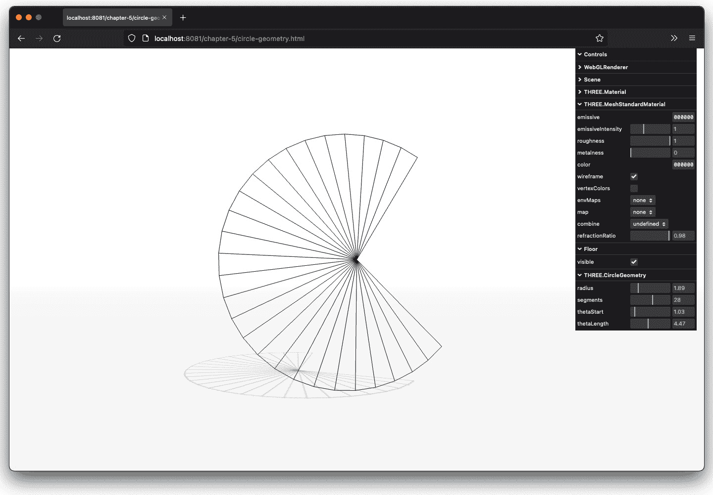

图 5.3 – 2D 圆几何

在这个示例中，你可以看到并控制由`THREE.CircleGeometry`创建的网格。`2 * PI`代表弧度为完整的圆。如果你更愿意使用度数而不是弧度，它们之间的转换非常简单。

以下两个函数可以帮助你将弧度转换为度数，如下所示：

```js
const deg2rad = (degrees) => (degrees * Math.PI) / 180
const rad2deg = (radians) => (radians * 180) / Math.PI
```

当你创建`THREE.CircleGeometry`时，你可以指定一些属性来定义圆的外观，如下所示：

+   `radius`: 圆的半径定义了它的大小。半径是从圆心到其边缘的距离。默认值是 50。

+   `segments`: 这个属性定义了用于创建圆的面数。最小值是 3，如果没有指定，这个值默认为 8。数值越高，圆越平滑。

+   `thetaStart`: 这个属性定义了绘制圆的起始位置。这个值可以从 0 到`2 * PI`，默认值是 0。

+   `thetaLength`: 这个属性定义了圆的完整程度。如果没有指定，默认值为`2 * PI`（一个完整的圆）。例如，如果你为这个值指定`0.5 * PI`，你将得到一个四分之一的圆。使用这个属性与`thetaStart`属性一起定义圆的形状。

你可以通过只指定`radius`和`segments`来创建一个完整的圆：

```js
new THREE.CircleGeometry(3, 12)
```

如果你想要从这个几何形状创建半圆，你可以使用类似以下的方法：

```js
new THREE.CircleGeometry(3, 12, 0, Math.PI);
```

这创建了一个半径为`3`的圆，被分成`12`个段。圆从默认的`0`开始，只画了一半，因为我们指定了`thetaLength`为`Math.PI`，这是半圆。

在继续下一个几何形状之前，这里有一个关于 Three.js 在创建这些 2D 形状（`THREE.PlaneGeometry`、`THREE.CircleGeometry`、`THREE.RingGeometry`和`THREE.ShapeGeometry`）时使用的方向的快速说明：Three.js 将这些对象创建为直立状态，因此它们沿着*x*-*y*平面对齐。这非常合乎逻辑，因为它们是 2D 形状。然而，通常，特别是使用`THREE.PlaneGeometry`时，你希望网格平放在地面上（*x*-*z*平面），作为某种地面区域，你可以在这个区域上定位其余的对象。要创建一个水平方向的 2D 对象而不是垂直方向的，最简单的方法是将网格绕其*x-*轴旋转四分之一圈（`-PI/2`），如下所示：

```js
mesh.rotation.x =- Math.PI/2;
```

关于`THREE.CircleGeometry`的所有内容到此结束。下一个几何形状，`THREE.RingGeometry`，看起来与`THREE.CircleGeometry`非常相似。

## THREE.RingGeometry

使用`THREE.RingGeometry`，你可以创建一个 2D 对象，它不仅非常类似于`THREE.CircleGeometry`，还允许你在中心定义一个孔（见`ring-geometry.html`）：

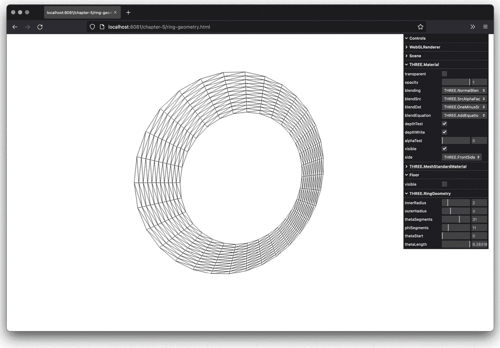

图 5.4 – 2D 环形几何

在创建`THREE.RingGeometry`对象时，你可以使用以下属性：

+   `innerRadius`: 圆的内半径定义了中心孔的大小。如果此属性设置为`0`，则不会显示孔。默认值为 0。

+   `outerRadius`: 圆的外半径定义了其大小。半径是从圆心到其边缘的距离。默认值为 50。

+   `thetaSegments`: 这是指用于创建圆的斜线段的数量。值越大，环形越平滑。默认值为 8。

+   `phiSegments`: 这是沿环形长度所需的段数。默认值为 8。这实际上并不影响圆的平滑度，但增加了面的数量。

+   `thetaStart`: 这定义了开始绘制圆的位置。此值可以从 0 到`2 * PI`，默认值为 0。

+   `thetaLength`: 这定义了圆的完整程度。如果没有指定，默认为`2 * PI`（一个完整的圆）。例如，如果您为此值指定`0.5 * PI`，则将得到四分之一的圆。使用此属性与`thetaStart`属性一起定义环的形状。

以下截图显示了`thetaStart`和`thetaLength`如何与`THREE.RingGeometry`一起工作：

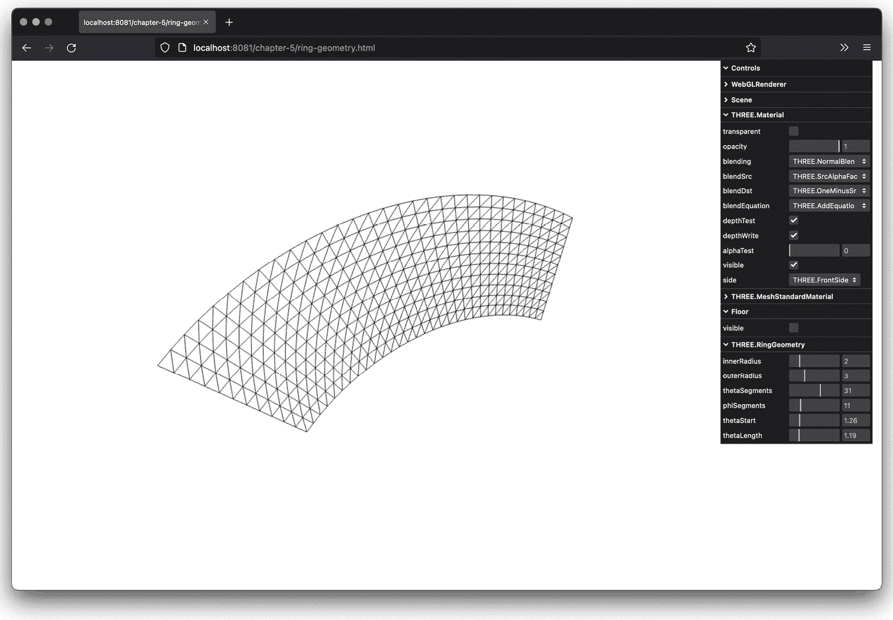

图 5.5 – 不同 theta 值的 2D 环形几何

在下一节中，我们将探讨 2D 形状中的最后一个：`THREE.ShapeGeometry`。

## THREE.ShapeGeometry

`THREE.PlaneGeometry`和`THREE.CircleGeometry`在自定义外观方面有限。如果您想创建自定义 2D 形状，可以使用`THREE.ShapeGeometry`。

使用`THREE.ShapeGeometry`，你可以调用一些函数来创建自己的形状。你可以将此功能与 HTML 画布元素和 SVG 中可用的`<path/>`元素功能进行比较。让我们从一个示例开始，然后我们将向您展示如何使用各种函数来绘制自己的形状。`shape-geometry.html`示例可以在本章的源代码中找到。

以下截图显示了此示例：

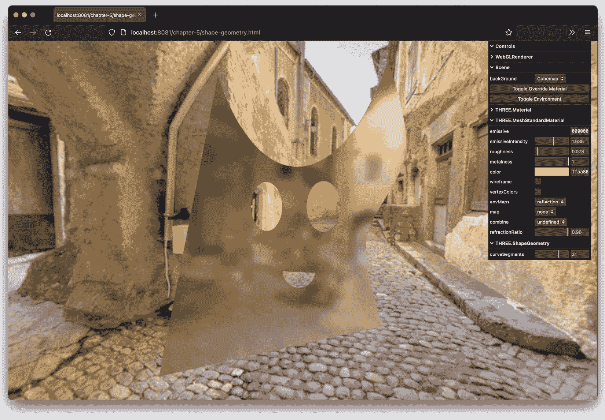

图 5.6 – 自定义形状几何

在这个例子中，你可以看到一个自定义创建的 2D 形状。在描述属性之前，首先，让我们看看创建这个形状所使用的代码。在我们创建 `THREE.ShapeGeometry` 对象之前，我们首先必须创建一个 `THREE.Shape` 对象。你可以通过查看之前的截图来追踪这些步骤，我们从右下角开始。这是创建 `THREE.Shape` 对象的方法：

```js
const drawShape = () => {
  // create a basic shape
  const shape = new THREE.Shape()
  // startpoint
  // straight line upwards
  shape.lineTo(10, 40)
  // the top of the figure, curve to the right
  shape.bezierCurveTo(15, 25, 25, 25, 30, 40)
  // spline back down
  shape.splineThru([new THREE.Vector2(32, 30), new
    THREE.Vector2(28, 20), new THREE.Vector2(30, 10)])
  // add 'eye' hole one
  const hole1 = new THREE.Path()
  hole1.absellipse(16, 24, 2, 3, 0, Math.PI * 2, true)
  shape.holes.push(hole1)
  // add 'eye hole 2'
  const hole2 = new THREE.Path()
  hole2.absellipse(23, 24, 2, 3, 0, Math.PI * 2, true)
  shape.holes.push(hole2)
  // add 'mouth'
  const hole3 = new THREE.Path()
  hole3.absarc(20, 16, 2, 0, Math.PI, true)
  shape.holes.push(hole3)
  return shape
}
```

在这段代码中，你可以看到我们使用线条、曲线和样条创建了这个形状的轮廓。之后，我们通过使用 `THREE.Shape` 的 `holes` 属性在这个形状上打了许多孔。

然而，在本节中，我们讨论的是 `THREE.ShapeGeometry` 而不是 `THREE.Shape` – 要从 `THREE.Shape` 创建一个几何体，我们需要将 `THREE.Shape`（在我们的例子中，由 `drawShape()` 函数返回）作为 `THREE.ShapeGeometry` 的参数传入。你也可以传入一个 `THREE.Shape` 对象的数组，但在我们的例子中，我们只使用了一个对象：

```js
new THREE.ShapeGeometry(drawShape())
```

这个函数的结果是一个可以用来创建网格的几何体。除了你想要转换为 `THREE.ShapeGeometry` 的形状之外，你还可以将多个额外的选项对象作为第二个参数传入：

+   `curveSegments`: 这个属性决定了从形状创建的曲线的平滑度。默认值是 12。

+   `material`: 这是用于为指定形状创建的面的 `materialIndex` 属性。因此，如果你传入多个材质，你可以指定应该将哪些材质应用于创建的形状的面。

+   `UVGenerator`: 当你使用材质与纹理一起使用时，UV 映射决定了纹理的哪一部分用于特定的面。使用 `UVGenerator` 属性，你可以传入自己的对象，这将为传入的形状创建 UV 设置。有关 UV 设置的更多信息，请参阅*第十章*，*加载和使用纹理*。如果没有指定，则使用 `THREE.ExtrudeGeometry.WorldUVGenerator`。

`THREE.ShapeGeometry` 的最重要部分是 `THREE.Shape`，你使用它来创建形状，所以让我们看看你可以用来创建 `THREE.Shape` 的绘图函数列表：

+   `moveTo(x,y)`: 将绘图位置移动到指定的 `x-` 和 `y-c` 坐标。

+   `lineTo(x,y)`: 从当前位置（例如，由 `moveTo` 函数设置）绘制一条线到提供的 `x-` 和 `y-c` 坐标。

+   `quadraticCurveTo(aCPx, aCPy, x, y)`: 有两种不同的方式来指定曲线。你可以使用 `quadraticCurveTo` 函数，或者使用 `bezierCurveTo` 函数。这两个函数之间的区别在于如何指定曲线的曲率。

对于二次曲线，我们需要指定一个额外的点（使用 `aCPx` 和 `aCPy` 参数），曲线仅基于该点以及当然，指定的端点（来自 `x` 和 `y` 参数）。对于三次曲线（由 `bezierCurveTo` 函数使用），你指定两个额外的点来定义曲线。起点是路径的当前位置。

以下图表解释了这两种选项之间的区别：

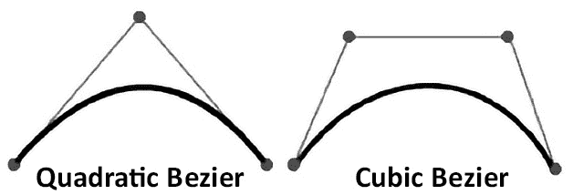

图 5.7 – 二次贝塞尔和三次贝塞尔

+   `bezierCurveTo(aCPx1, aCPy1, aCPx2, aCPy2, x, y)`: 这将根据提供的参数绘制一条曲线。有关解释，请参阅前面的列表条目。曲线是根据定义曲线的两个坐标（`aCPx1`、`aCPy1`、`aCPx2` 和 `aCPy2`）以及端点坐标（`x` 和 `y`）绘制的。起点是路径的当前位置。

+   `splineThru(pts)`: 此函数通过提供的坐标集（`pts`）绘制一条流畅的线条。此参数应为一个 `THREE.Vector2` 对象的数组。起点是路径的当前位置。

+   `arc(aX, aY, aRadius, aStartAngle, aEndAngle, aClockwise)`: 这将绘制一个圆（或圆的一部分）。圆从路径的当前位置开始。在这里，`aX` 和 `aY` 被用作相对于当前位置的偏移量。请注意，`aRadius` 设置圆的大小，而 `aStartAngle` 和 `aEndAngle` 定义绘制圆的哪一部分。布尔值 `aClockwise` 属性确定圆是按顺时针还是逆时针绘制。

+   `absArc(aX, aY, aRadius, aStartAngle, aEndAngle, AClockwise)`: 请参阅 `arc` 属性的描述。位置是绝对值，而不是相对于当前位置。

+   `ellipse(aX, aY, xRadius, yRadius, aStartAngle, aEndAngle, aClockwise)`: 请参阅 `arc` 属性的描述。作为补充，使用 `ellipse` 函数，我们可以分别设置 `x` 半径和 `y` 半径。

+   `absEllipse(aX, aY, xRadius, yRadius, aStartAngle, aEndAngle, aClockwise)`: 请参阅 `ellipse` 属性的描述。位置是绝对值，而不是相对于当前位置。

+   `fromPoints(vectors)`: 如果你向此函数传递一个 `THREE.Vector2`（或 `THREE.Vector3`）对象的数组，Three.js 将使用提供的向量创建一条路径。

+   `holes`: `holes` 属性包含一个 `THREE.Shape` 对象的数组。数组中的每个对象都被渲染为一个孔。一个很好的例子是我们在本节开头看到的例子。在那个代码片段中，我们向这个数组添加了三个 `THREE.Shape` 对象：一个用于左眼，一个用于右眼，还有一个用于我们主要的 `THREE.Shape` 对象的嘴巴。

就像许多示例一样，为了理解各种属性如何影响最终形状，最简单的方法就是只启用材质上的 `wireframe` 属性，并调整设置。例如，以下截图显示了当您为 `curveSegments` 使用低值时会发生什么：

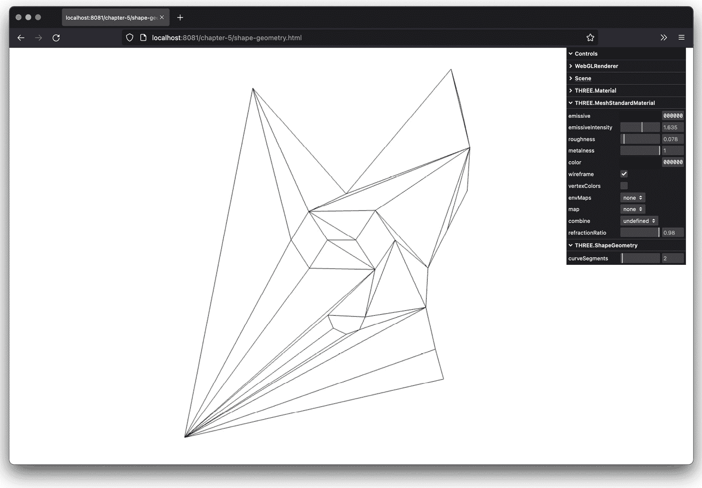

图 5.8 – 形状几何的线框图

如您所见，形状失去了它漂亮、圆润的边缘，但在过程中使用了更少的面。这就是二维形状的全部内容。以下几节将展示并解释基本三维形状。

# 三维几何体

在本节关于基本三维几何体的内容中，我们将从我们已经见过几次的几何体开始：`THREE.BoxGeometry`。

## THREE.BoxGeometry

`THREE.BoxGeometry` 是一个非常简单的三维几何体，允许您通过指定其 `width`、`height` 和 `depth` 属性来创建一个盒子。我们添加了一个示例，`box-geometry.html`，您可以在其中调整这些属性。以下截图显示了此几何体：

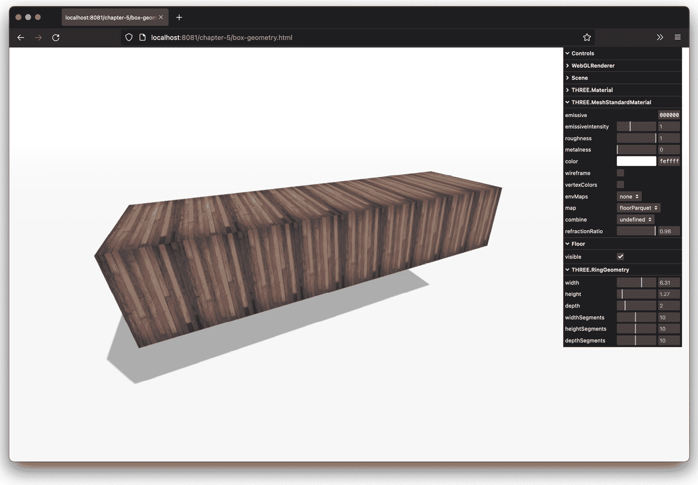

图 5.9 – 基本三维箱体几何

如您在此示例中看到的，通过更改 `THREE.BoxGeometry` 的 `width`、`height` 和 `depth` 属性，您可以控制生成的网格的大小。当您创建一个新的立方体时，这三个属性也是必需的，如下所示：

```js
new THREE.BoxGeometry(10,10,10);
```

在示例中，您还可以看到一些可以在立方体上定义的其他属性。以下列表解释了所有属性：

+   `width`：这是立方体的宽度。这是立方体顶点沿 *x* 轴的长度。

+   `height`：这是立方体的高度。这是立方体顶点沿 *y* 轴的长度。

+   `depth`：这是立方体的深度。这是立方体顶点沿 *z* 轴的长度。

+   `widthSegments`：这是我们将立方体的一个面沿 *x* 轴分割成多少段。默认值是 1。您定义的段数越多，一个面的面数就越多。如果此属性和下一个两个属性设置为 `1`，立方体的每个面将只有 2 个面。如果此属性设置为 `2`，面将被分割成 2 段，从而产生 4 个面。

+   `heightSegments`：这是我们将立方体的一个面沿 *y* 轴分割成多少段。默认值是 1。

+   `depthSegments`：这是我们将立方体的一个面沿 *z* 轴分割成多少段。默认值是 1。

通过增加各种段属性，您将立方体的六个主要面分割成更小的面。如果您想使用 `THREE.MeshFaceMaterial` 在立方体的某些部分设置特定的材质属性，这很有用。

`THREE.BoxGeometry` 是一个非常简单的几何体。另一个简单的是 `THREE.SphereGeometry`。

## THREE.SphereGeometry

使用 `THREE.SphereGeometry`，您可以创建一个三维球体。让我们直接进入示例，`sphere-geometry.html`：

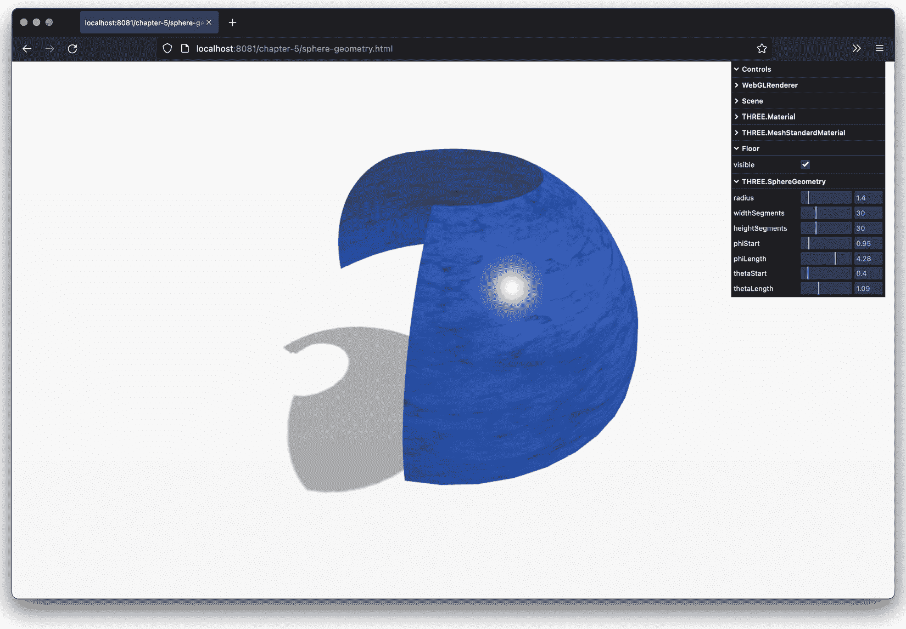

图 5.10 – 简单 3D 球体几何

在上一个截图中，我们向您展示了一个基于 `THREE.SphereGeometry` 创建的半开放球体。这种几何形状非常灵活，可以用来创建各种与球体相关的几何形状。然而，一个基本的 `THREE.SphereGeometry` 实例可以像这样轻松创建：`new THREE.SphereGeometry()`。

以下属性可以用来调整最终网格的外观：

+   `radius`：这用于设置球体的半径。这定义了最终网格的大小。默认值是 50。

+   `widthSegments`：这是用于垂直方向的段数。段数越多，表面越光滑。默认值是 8，最小值是 3。

+   `heightSegments`：这是用于水平方向的段数。段数越多，球体的表面越光滑。默认值是 6，最小值是 2。

+   `phiStart`：这决定了在球体的 *x-* 轴上开始绘制球体的位置。这可以从 0 到 `2 * PI` 范围内变化。默认值是 `0`。

+   `phiLength`：这决定了从 `phiStart` 开始绘制球体的距离。`2 * PI` 将绘制一个完整的球体，而 `0.5 * PI` 将绘制一个开放的四分之一球体。默认值是 `2 * PI`。

+   `thetaStart`：这决定了在球体的 *x-* 轴上开始绘制球体的位置。这可以从 0 到 `2 * PI` 范围内变化，默认值是 0。

+   `thetaLength`：这决定了从 `thetaStart` 开始绘制球体的距离。`2 * PI` 值表示一个完整的球体，而 `PI` 将只绘制球体的一半。默认值是 `2 * PI`。

`radius`、`widthSegments` 和 `heightSegments` 属性应该是清晰的。我们已经在其他示例中看到过这类属性。`phiStart`、`phiLength`、`thetaStart` 和 `thetaLength` 属性没有例子可能比较难以理解。幸运的是，你可以在 `sphere-geometry.html` 示例的菜单中实验这些属性，并创建如这些有趣的几何形状：

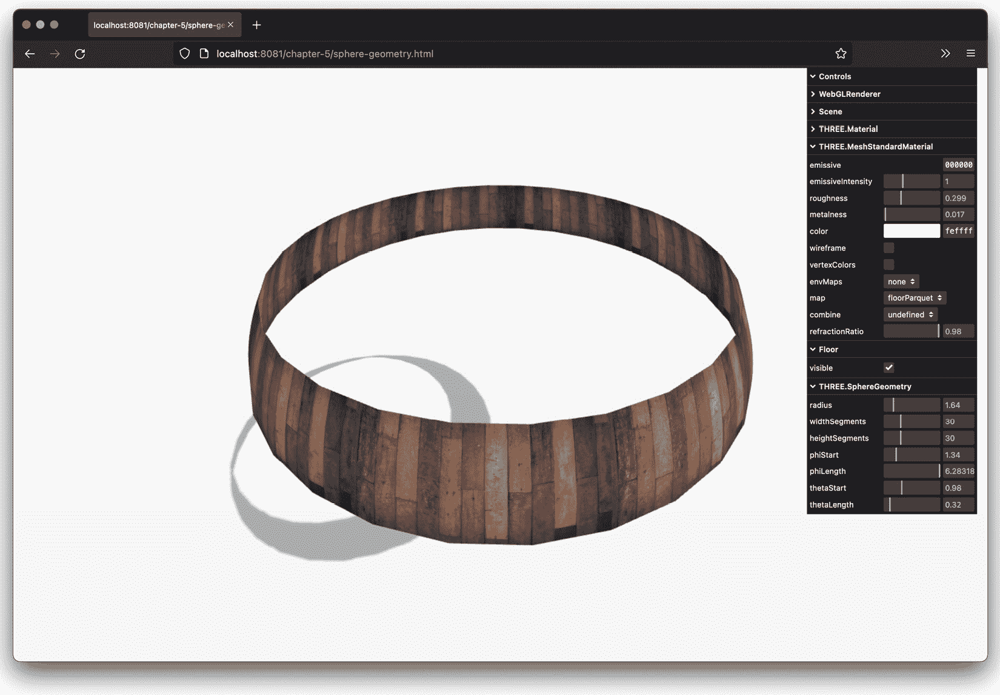

图 5.11 – 具有不同 phi 和 theta 属性的球体几何

列表中的下一个是 `THREE.CylinderGeometry`。

## THREE.CylinderGeometry

使用这种几何形状，我们可以创建圆柱和圆柱形物体。至于其他所有几何形状，我们也有一个示例（`cylinder-geometry.html`），让你可以实验这种几何形状的特性，其截图如下：

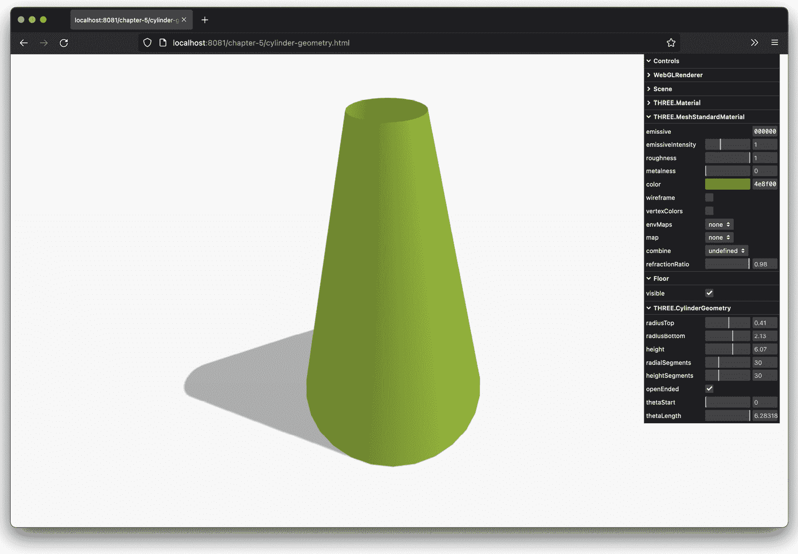

图 5.12 – 3D 圆柱体几何

当您创建`THREE.CylinderGeometry`时，没有强制性的参数，因此您只需调用`new THREE.CylinderGeometry()`即可创建圆柱。您可以通过传递一系列属性，如前例所示，来改变这个圆柱的外观。这些属性将在以下列表中解释：

+   `radiusTop`: 这设置了圆柱顶部的尺寸。默认值为 20。

+   `radiusBottom`: 这设置了圆柱底部的尺寸。默认值为 20。

+   `height`: 这个属性设置了圆柱的高度。默认高度为 100。

+   `radialSegments`: 这决定了圆柱半径方向上的分段数。默认值为 8。更多的分段意味着圆柱更加光滑。

+   `heightSegments`: 这决定了圆柱高度方向上的分段数。默认值为 1。更多的分段意味着更多的面。

+   `openEnded`: 这决定了网格在顶部和底部是否闭合。默认值为`false`。

+   `thetaStart`: 这决定了沿着圆柱的*x-*轴开始绘制圆柱的位置。这可以从 0 到`2 * PI`，默认值为 0。

+   `thetaLength`: 这决定了从`thetaStart`开始绘制圆柱的距离。`2 * PI`值是一个完整的圆柱，而`PI`将只绘制圆柱的一半。默认值为`2 * PI`。

这些都是非常基本的属性，您可以使用它们来配置圆柱。然而，有一个有趣的地方，那就是当您为顶部（或底部）使用负`radius`值时。如果您这样做，可以使用这种几何形状创建一个沙漏形状，如下面的截图所示：

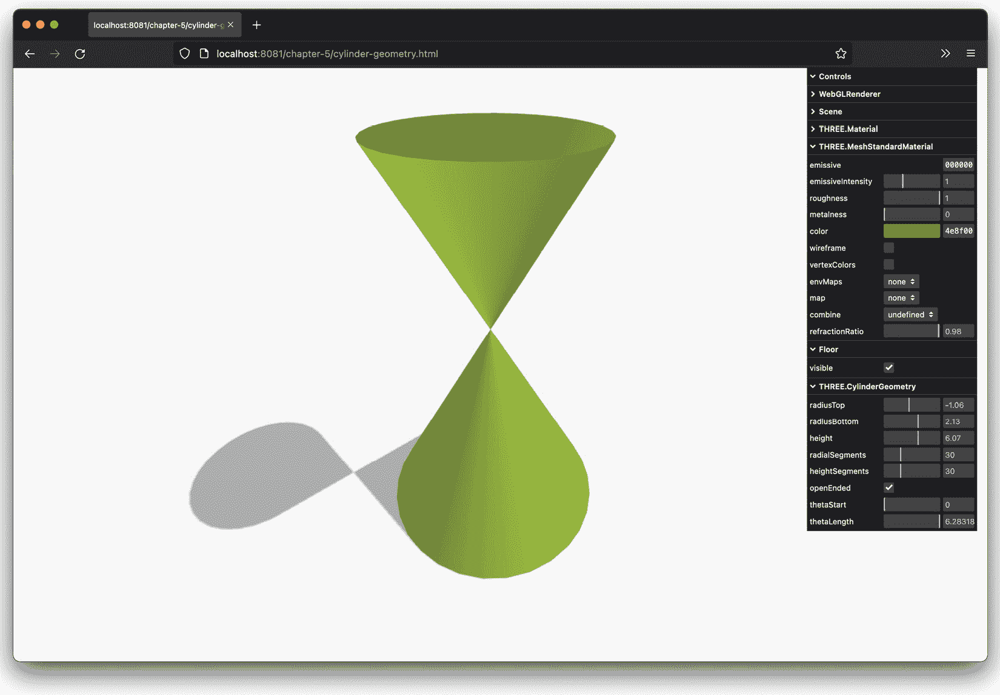

图 5.13 – 3D 圆柱几何作为沙漏

这里需要注意的一点是，在这种情况下，上半部分是翻转的。如果您使用未配置`THREE.DoubleSide`的材料，您将看不到上半部分。

下一个几何形状是`THREE.ConeGeometry`，它提供了与`THREE.CylinderGeometry`基本相同的功能，但顶部半径固定为零。

## THREE.ConeGeometry

`THREE.ConeGeometry`几乎与`THREE.CylinderGeometry`相同。它使用所有相同的属性，但它只允许您设置半径，而不是单独的`radiusTop`和`radiusBottom`值：

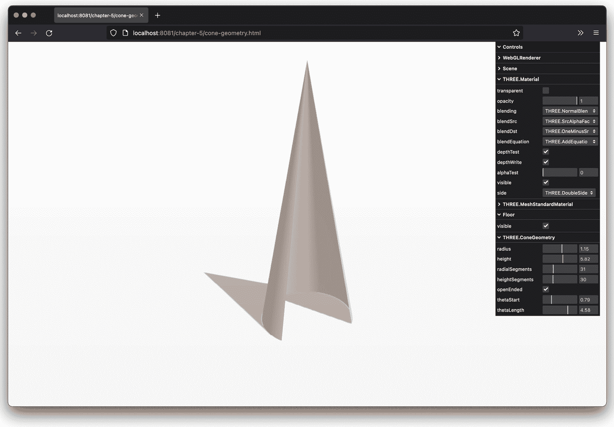

图 5.14 – 简单 3D 圆锥几何

以下属性可以在`THREE.ConeGeometry`上设置：

+   `radius`: 这设置了圆柱底部的尺寸。默认值为`20`。

+   `height`: 这个属性设置了圆柱的高度。默认高度为 100。

+   `radialSegments`: 这决定了圆柱半径方向上的分段数。默认值为 8。更多的分段意味着圆柱更加光滑。

+   `heightSegments`: 这决定了沿着圆柱高度方向的分段数。默认值是 1。更多的分段意味着更多的面。

+   `openEnded`: 这决定了网格是否在顶部和底部封闭。默认值是`false`。

+   `thetaStart`: 这决定了沿着圆柱的*x-*轴开始绘制的位置。这可以是从 0 到`2 * PI`的范围，默认值是 0。

+   `thetaLength`: 这决定了从`thetaStart`开始绘制圆柱的距离。`2 * PI`值是一个完整的圆柱，而`PI`将只绘制圆柱的一半。默认值是`2 * PI`。

下一个几何形状，`THREE.TorusGeometry`，允许您创建类似甜甜圈的形状对象。

## THREE.TorusGeometry

环面是一个看起来像甜甜圈的基本形状。以下截图，您可以通过打开`torus-geometry.html`示例来获取，显示了`THREE.TorusGeometry`的实际应用：

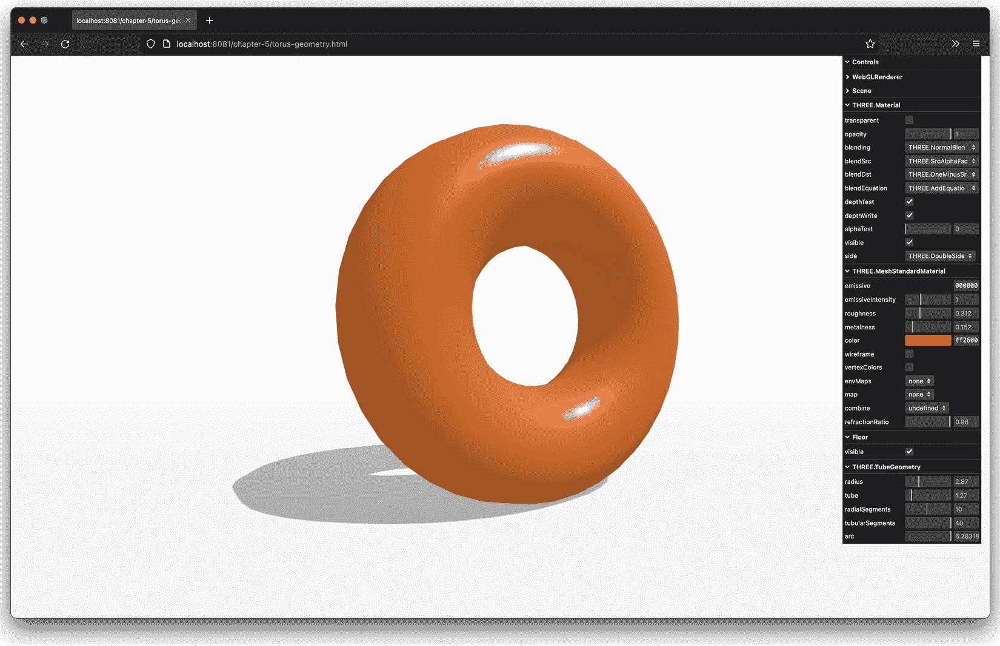

图 5.15 – 3D 环面几何形状

就像大多数简单几何形状一样，创建`THREE.TorusGeometry`时没有强制性的参数。以下列表提到了您在创建此几何形状时可以指定的参数：

+   `radius`: 这设置了完整环面的大小。默认值是 100。

+   `tube`: 这设置了管状体的半径（即实际的甜甜圈）。此属性的默认值是 40。

+   `radialSegments`: 这决定了沿着环面长度方向要使用的分段数。默认值是 8。请参见示例中更改此值的效果。

+   `tubularSegments`: 这决定了沿着环面宽度方向要使用的分段数。默认值是 6。请参见示例中更改此值的效果。

+   `arc`: 通过这个属性，您可以控制环面是否绘制一个完整的圆。此值的默认值是`2 * PI`（一个完整的圆）。

这些大多数都是非常基本的属性，您已经见过。然而，`arc`属性却非常有趣。通过这个属性，您可以定义甜甜圈是画一个完整的圆还是只有部分圆。通过实验这个属性，您可以创建非常有趣的网格，如下面一个将`arc`设置为小于`2 * PI`的值的例子：

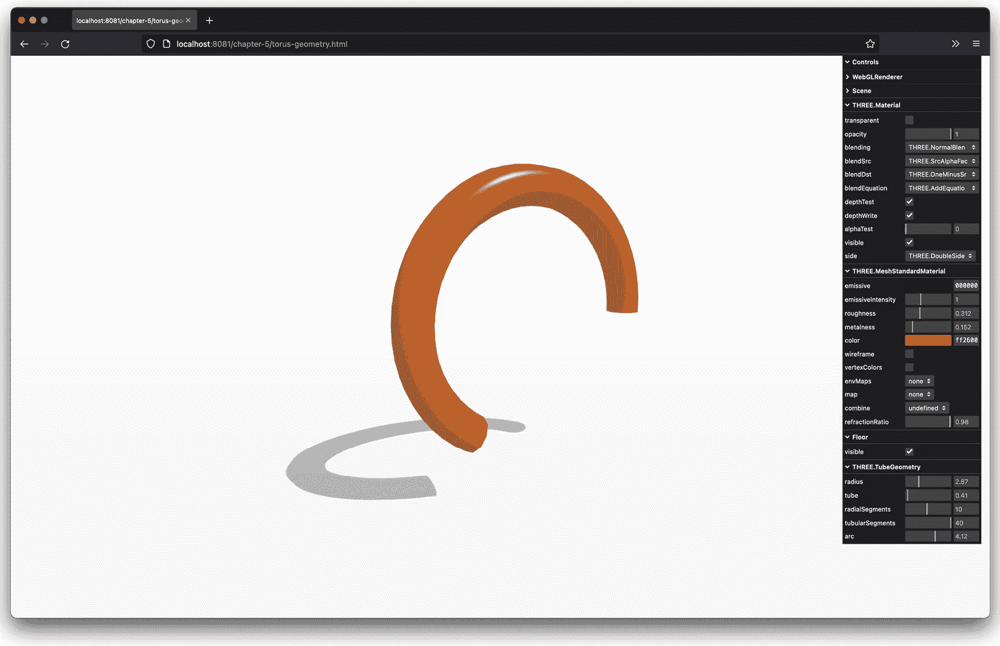

图 5.16 – 具有较小圆弧属性的 3D 环面几何形状

`THREE.TorusGeometry`是一个非常直接的几何形状。在下一节中，我们将查看一个几乎与其名称相同但不太直接的几何形状：`THREE.TorusKnotGeometry`。

## THREE.TorusKnotGeometry

使用`THREE.TorusKnotGeometry`，您可以创建环面结。环面结是一种特殊的结，看起来像一根管子绕自身缠绕了几次。最好的解释方式是查看`torus-knot-geometry.html`示例。以下截图显示了此几何形状：

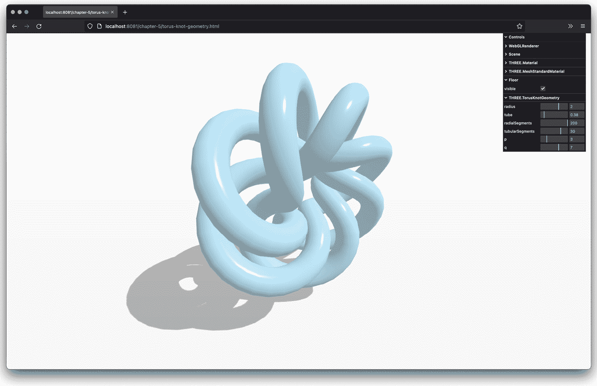

图 5.17 – 环面结几何形状

如果你打开这个示例并调整 `p` 和 `q` 属性，你可以创建各种美丽的几何形状。`p` 属性定义了结围绕其轴旋转的频率，而 `q` 定义了结围绕其内部旋转的程度。

如果这听起来有点模糊，不要担心。你不需要理解这些属性就能创建出美丽的结，例如以下截图所示（对细节感兴趣的人，Wolfram 在 [`mathworld.wolfram.com/TorusKnot.html`](https://mathworld.wolfram.com/TorusKnot.html) 上有一篇关于这个主题的好文章）：

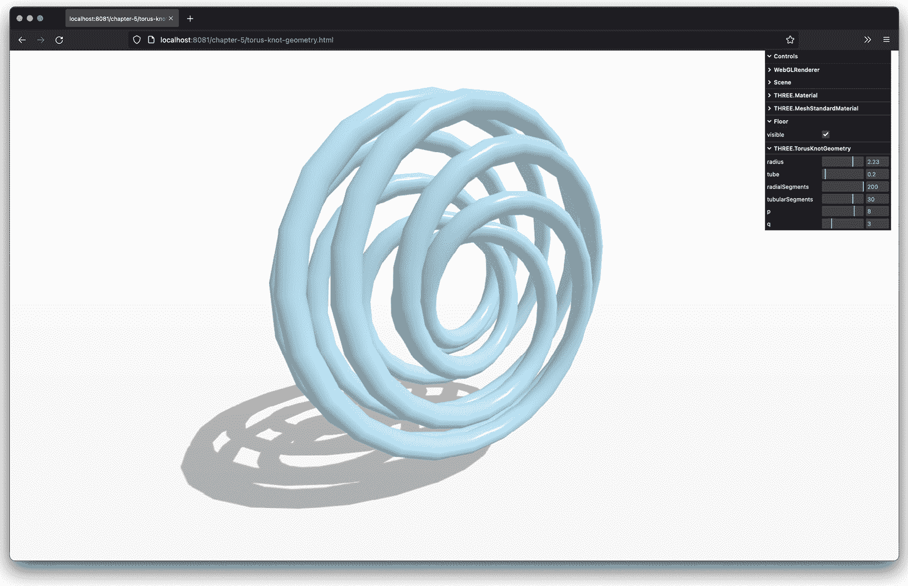

图 5.18 – 不同 p 和 q 值的环面结几何形状

通过这个几何形状的示例，你可以调整以下属性并查看 `p` 和 `q` 的各种组合对这个几何形状的影响：

+   `radius`：这个属性设置了完整环面的尺寸。默认值是 100。

+   `tube`：这个属性设置了管（实际甜甜圈）的半径。此属性的默认值是 40。

+   `radialSegments`：这个属性决定了在环面结的长度方向上要使用的分段数。默认值是 64。在演示中查看更改此值的效果。

+   `tubularSegments`：这个属性决定了在环面结的宽度方向上要使用的分段数。默认值是 8。在演示中查看更改此值的效果。

+   `p`：这个属性定义了结的形状，默认值是 2。

+   `q`：这个属性定义了结的形状，默认值是 3。

+   `heightScale`：使用这个属性，你可以拉伸环面结。默认值是 1。

列表中的下一个几何形状是基本几何形状中的最后一个：`THREE.PolyhedronGeometry`。

## THREE.PolyhedronGeometry

使用这种几何形状，你可以轻松地创建多面体。多面体是一种只有平面面和直线边的几何形状。然而，通常你不会直接使用 `THREE.PolyhedronGeometry`。Three.js 提供了一系列特定的多面体，你可以使用这些多面体而不必指定 `THREE.PolyhedronGeometry` 的顶点和面。我们将在本节后面讨论这些多面体。

如果你确实想直接使用 `THREE.PolyhedronGeometry`，你必须指定顶点和面（就像我们在 *第三章*，*在 Three.js 中使用光源*) 中为立方体所做的那样）。例如，我们可以创建一个简单的四面体（也参见本章中关于 `THREE.TetrahedronGeometry` 的部分），如下所示：

```js
const vertices = [
 1,  1,  1,
-1, -1,  1,
-1,  1, -1,
 1, -1, -1
];
const indices = [
2,  1,  0,
0,  3,  2,
1,  3,  0,
2,  3,  1
];
new THREE.PolyhedronBufferGeometry(vertices, indices, radius, detail)
```

要构建 `THREE.PolyhedronGeometry`，我们需要传入 `vertices`、`indices`、`radius` 和 `detail` 属性。生成的 `THREE.PolyhedronGeometry` 对象在 `polyhedron-geometry.html` 示例中展示：

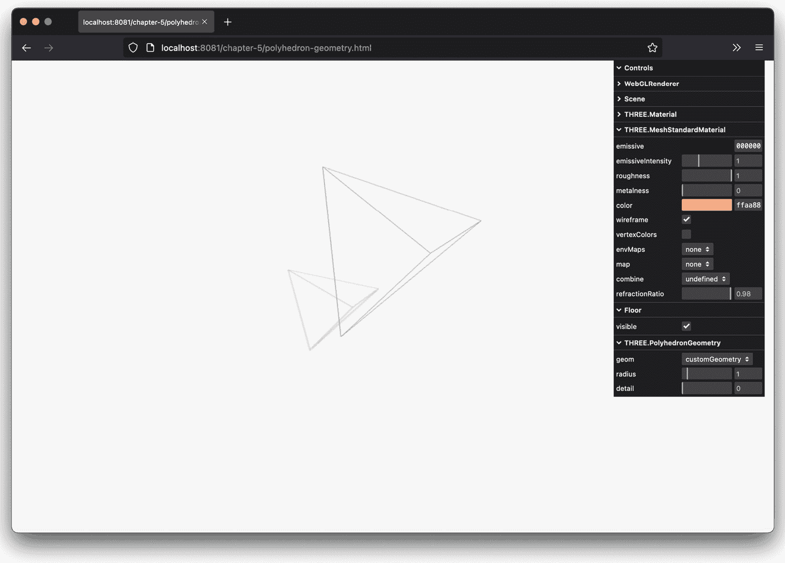

图 5.19 – 自定义多面体

当你创建一个多面体时，你可以传入以下四个属性：

+   `vertices`: 这些是多面体组成的点。

+   `indices`: 这些是需要从顶点创建的面。

+   `radius`: 这是多面体的大小。默认值为 1。

+   `detail`: 使用这个属性，你可以为多面体添加额外的细节。如果你将其设置为 `1`，多面体中的每个三角形将被分割成 4 个更小的三角形。如果你将其设置为 `2`，那 4 个更小的三角形将再次各自分割成 4 个更小的三角形，依此类推。

以下截图显示了相同的自定义网格，但现在具有更高的细节级别：

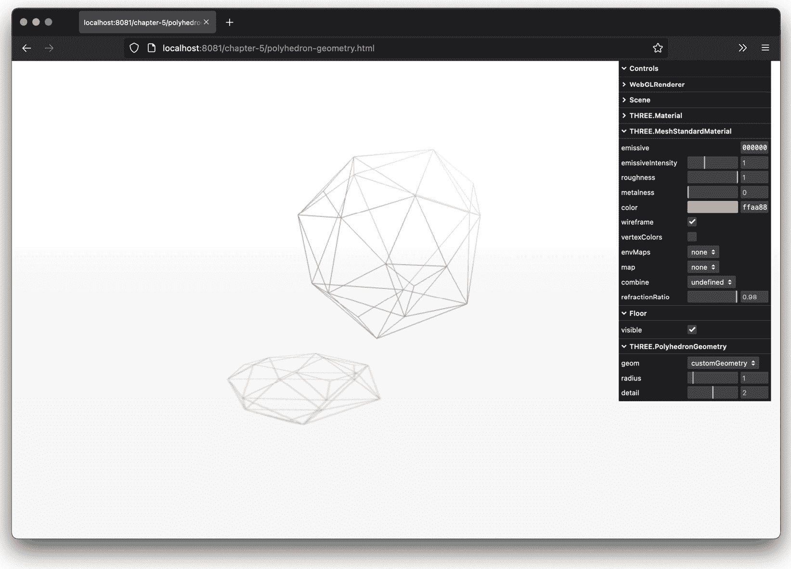

图 5.20 – 具有更高细节级别的自定义多面体

在本节的开始，我们提到 Three.js 默认提供了一些多面体。在接下来的小节中，我们将快速展示这些多面体。所有这些多面体类型都可以通过查看 `polyhedron-geometry.html` 示例来查看。

## THREE.IcosahedronGeometry

`THREE.IcosahedronGeometry` 创建了一个由 12 个顶点构成的 20 个相同三角形面的多面体。在创建这个多面体时，你需要指定的只有半径和细节级别。此截图显示了使用 `THREE.IcosahedronGeometry` 创建的多面体：

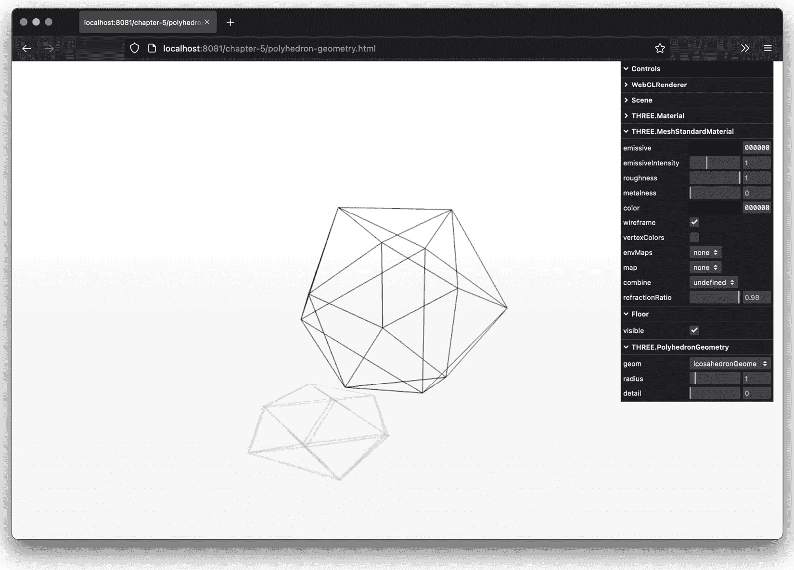

图 5.21 – 3D 二十面体几何

我们将要查看的下一个多面体是 `THREE.TetrahedronGeometry`。

## THREE.TetrahedronGeometry

四面体是多面体中最简单的一种。这个多面体只包含由四个顶点创建的四个三角形面。你可以像使用 Three.js 提供的其他多面体一样创建 `THREE.TetrahedronGeometry`，只需指定半径和细节级别。以下截图显示了使用 `THREE.TetrahedronGeometry` 创建的四面体：


图 5.22 – 3D 四面体几何

接下来，我们将看到具有八个面的多面体：八面体。

## THREE.OctahedronGeometry

Three.js 还提供了一个八面体的实现。正如其名所示，这个多面体有八个面。这些面是由六个顶点创建的。以下截图显示了此几何形状：

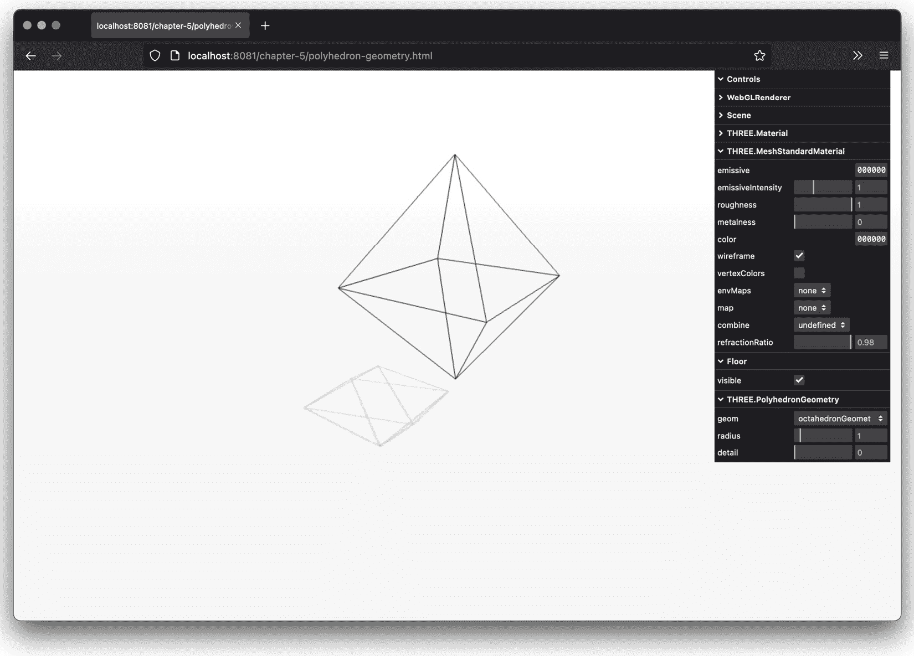

图 5.23 – 3D 八面体几何

我们将要查看的最后一个多面体是十二面体。

## THREE.DodecahedronGeometry

Three.js 提供的最后一个多面体几何是 `THREE.DodecahedronGeometry`。这个多面体有 12 个面。以下截图显示了此几何形状：

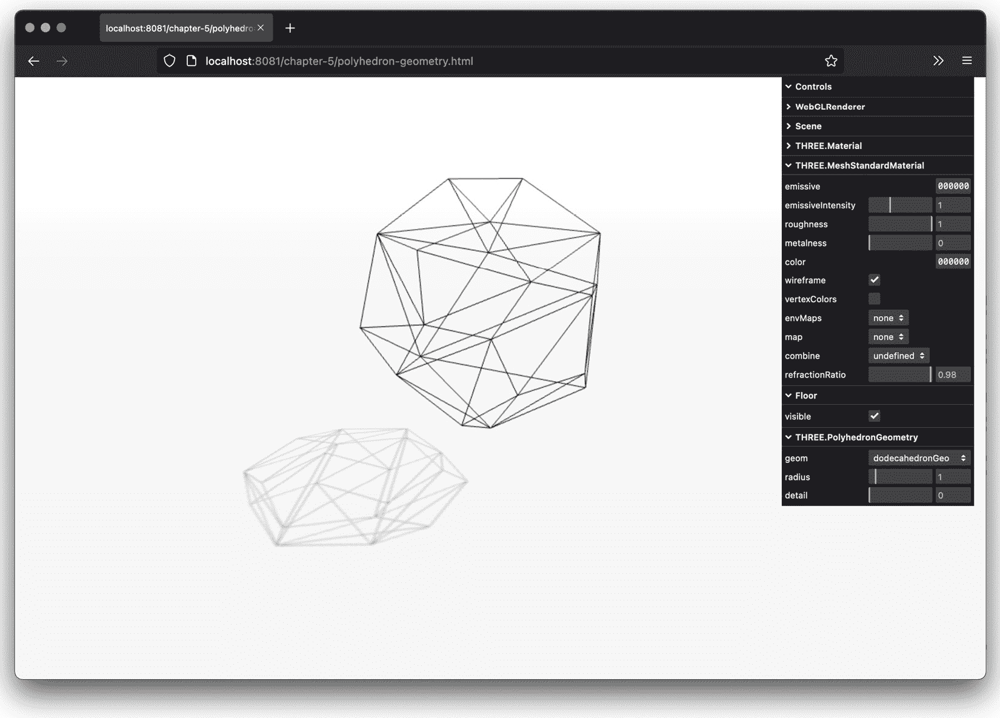

图 5.24 – 3D 十二面体几何

如你所见，Three.js 提供了一系列的 3D 几何形状，从直接有用的形状，如球体和立方体，到在实践中可能不太有用的形状，如多面体集合。无论如何，这些 3D 几何形状将为你创建和实验材料、几何形状和 3D 场景提供一个良好的起点。

# 摘要

在本章中，我们讨论了 Three.js 所能提供的所有标准几何形状。正如你所见，有很多几何形状可以直接使用。为了最好地学习如何使用这些几何形状，请进行实验。使用本章中的示例来了解你可以用来自定义从 Three.js 获取的标准几何形状集的属性。

对于二维形状，重要的是要记住它们放置在*x*-*y*平面上。如果你想水平放置二维形状，你需要将网格绕*x-*轴旋转`-0.5 * PI`。最后，注意如果你正在旋转二维形状，或者一个开放的 3D 形状（例如，圆柱或管），记得将材质设置为`THREE.DoubleSide`。如果不这样做，你的几何体的内部或背面将不会显示。

在本章中，我们专注于简单、直接的网格。Three.js 还提供了创建复杂几何形状的方法，我们将在*第六章*中介绍。
