# 第六章：探索高级几何形状

在*第五章*《学习与几何形状一起工作》中，我们向您展示了 Three.js 提供的所有基本几何形状。除了这些基本几何形状之外，Three.js 还提供了一套更高级和专业的对象。

在本章中，我们将向您展示这些高级几何形状：

+   如何使用`THREE.ConvexGeometry`、`THREE.LatheGeometry`、`THREE.BoxLineGeometry`、`THREE.RoundeBoxGeometry`、`THREE.TeapotGeometry`和`THREE.TubeGeometry`等高级几何形状。

+   如何使用`THREE.ExtrudeGeometry`从 2D 形状创建 3D 形状。我们将从一个 2D SVG 图像创建一个 3D 形状，并将从 2D Three.js 形状中拉伸以创建新颖的 3D 形状。

+   如果您想自己创建自定义形状，您可以继续玩我们之前章节中讨论的那些。然而，Three.js 还提供了一个`THREE.ParametricGeometry`对象。使用参数化几何，您可以使用可以更改以影响几何形状形状的参数来创建几何形状。

+   我们还将展示如何使用`THREE.TextGeometry`创建 3D 文字效果，并展示如何使用 Troika 库在场景中添加 2D 文字标签。

+   此外，我们还将向您展示如何使用两个辅助几何形状，`THREE.WireframeGeometry`和`THREE.EdgesGeometry`。这些辅助工具允许您查看其他几何形状的更多细节。

我们将从列表中的第一个开始，`THREE.ConvexGeometry`。

# 学习高级几何形状

在本节中，我们将探讨几个高级 Three.js 几何形状。我们将从`THREE.ConvexGeometry`开始，您可以使用它来创建凸包。

## THREE.ConvexGeometry

使用`THREE.ConvexGeometry`，我们可以从一组点中创建一个凸包。凸包是包含所有这些点的最小形状。理解这一点最简单的方法是查看一个示例。如果您打开`convex-geometry.html`示例，您将看到一组随机点的凸包。以下截图显示了该几何形状：

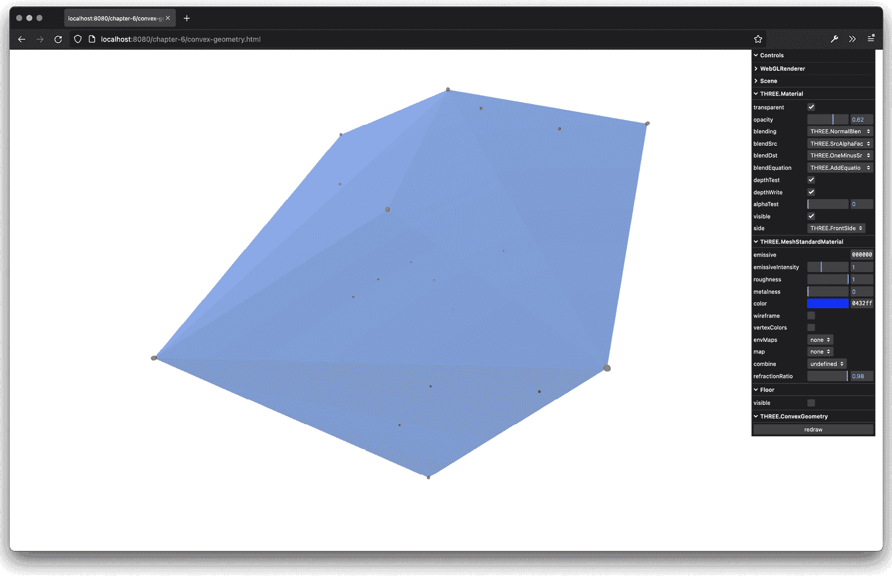

图 6.1 – 包含所有点的凸包

在此示例中，我们生成一组随机点，并根据这些点创建`THREE.ConvexGeometry`。在示例中，您可以使用`1`来查看用于创建此几何形状的点。为了这个示例，这些点被创建为小的`THREE.SphereGeometry`对象。

要创建`THREE.ConvexGeometry`，我们需要一组点。以下代码片段显示了我们是如何做到这一点的：

```js
const generatePoints = () => {
  const spGroup = new THREE.Object3D()
  spGroup.name = 'spGroup'
  const points = []
  for (let i = 0; i < 20; i++) {
    const randomX = -5 + Math.round(Math.random() * 10)
    const randomY = -5 + Math.round(Math.random() * 10)
    const randomZ = -5 + Math.round(Math.random() * 10)
    points.push(new THREE.Vector3(randomX, randomY, randomZ))
  }
  const material = new THREE.MeshBasicMaterial({ color:
    0xff0000, transparent: false })
  points.forEach(function (point) {
    const spGeom = new THREE.SphereGeometry(0.04)
    const spMesh = new THREE.Mesh(spGeom, material)
    spMesh.position.copy(point)
    spGroup.add(spMesh)
  })
  return {
    spGroup,
    points
  }
}
```

如此代码片段所示，我们创建了 20 个随机点（`THREE.Vector3`），并将它们推入一个数组中。接下来，我们遍历这个数组，创建 `THREE.SphereGeometry`，并将位置设置为这些点中的一个（`position.copy(point)`）。所有点都被添加到一个组中，这样我们就可以在重绘时轻松地替换它们。一旦你有了这组点，从它们创建 `THREE.ConvexGeometry` 就非常简单，如下面的代码片段所示：

```js
const convexGeometry = new THREE.ConvexGeometry(points);
```

一个包含顶点（`THREE.Vector3` 类型）的数组是 `THREE.ConvexGeometry` 唯一的参数。请注意，如果你想渲染一个平滑的 `THREE.ConvexGeometry`，你应该调用 `computeVertexNormals`，正如我们在 *第二章*，*组成 Three.js 应用程序的基本组件* 中所解释的。

下一个复杂的几何形状是 `THREE.LatheGeometry`，它可以用来创建类似花瓶的形状。

## THREE.LatheGeometry

`THREE.LatheGeometry` 允许你从一组点创建形状，这些点共同形成一个曲线。如果你看 *图 6.2**，你可以看到我们创建了许多点（红色圆点），Three.js 使用这些点来创建 `THREE.LatheGeometry`。再次强调，了解 `THREE.LatheGeometry` 的最佳方式是查看一个示例。这个几何形状在 `lathe-geometry.html` 中显示。以下是从示例中截取的屏幕截图，显示了此几何形状：

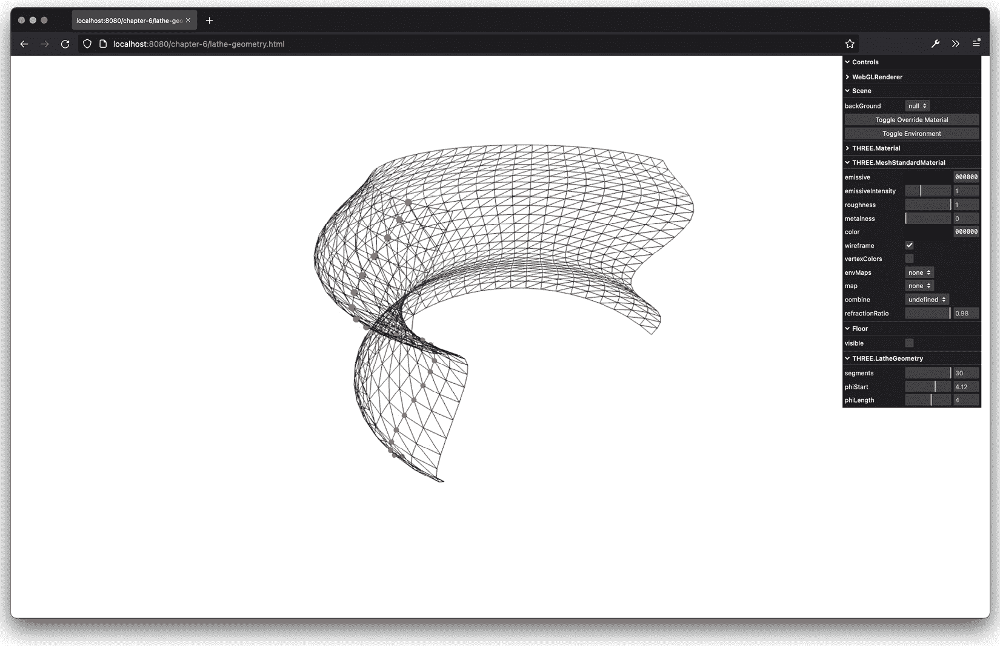

图 6.2 – 用于类似花瓶网格的车床

在前面的截图上，你可以看到创建这个几何形状所用的点，它们以一组小红球的形式呈现。这些点的位置被传递到 `THREE.LatheGeometry` 中，同时还有定义几何形状形状的参数。在我们查看所有参数之前，让我们看看创建单个点所用的代码以及 `THREE.LatheGeometry` 如何使用这些点：

```js
const generatePoints = () => {
  ...
  const points = []
  const height = 0.4
  const count = 25
  for (let i = 0; i < count; i++) {
    points.push(new THREE.Vector3((Math.sin(i * 0.4) +
      Math.cos(i * 0.4)) * height + 3, i / 6, 0))
  }
  ...
}
// use the same points to create a LatheGeometry
const latheGeometry = new THREE.LatheGeometry (points,
  segments, phiStart, phiLength);
latheMesh = createMesh(latheGeometry);
scene.add(latheMesh);
}
```

在这段 JavaScript 代码中，我们可以看到我们生成了 25 个点，其 *x* 坐标基于正弦和余弦函数的组合，而 *y* 坐标基于 `i` 和 `count` 变量。这在前面的截图中的红色圆点可视化为样条线。基于这些点，我们可以创建 `THREE.LatheGeometry`。除了顶点数组之外，`THREE.LatheGeometry` 还接受一些其他参数。以下列表解释了这些属性：

+   `points`：这些是构成生成钟形/花瓶形状的样条线的点。

+   `segments`：这些是在创建形状时使用的段数。这个数字越高，最终形状就越圆滑。默认值是 `12`。

+   `phiStart`：这决定了在生成形状时从圆的哪个位置开始。这可以从 `0` 到 `2*PI`。默认值是 `0`。

+   `phiLength`：这定义了形状生成的完整程度。例如，四分之一形状将是`0.5*PI`。默认值是完整的 360 度或`2*PI`。这个形状将从`phiStart`属性的起始位置开始。

在*第五章*中，我们已经看到了`BoxGeometry`。Three.js 还提供了另外两个类似盒子的几何体，我们将在下一节讨论。

## BoxLineGeometry

如果您只想显示轮廓，可以使用`THREE.BoxLineGeometry`。这个几何体与`THREE.BoxGeometry`完全一样，但它不是渲染一个实体对象，而是使用线条渲染盒子，如下所示（来自`box-line-geometry.html`）：


图 6.3 – 使用线条渲染的盒子

您使用这个几何体的方式与`THREE.BoxGeometry`相同，但不是创建`THREE.Mesh`，我们需要创建`THREE.LineSegments`，使用可用的线特定材料之一：

```js
import { BoxLineGeometry } from 'three/examples/jsm/
  geometries/BoxLineGeometry'
const material = new THREE.LineBasicMaterial({ color:
  0x000000 }),
const geometry = new BoxLineGeometry(width, height, depth,
  widthSegments, heightSegments, depthSegments)
const lines = new THREE.LineSegments(geometry, material)
scene.add(lines)
```

关于您可以传递给这个几何体的属性的说明，请参阅*第五章*中的`THREE.BoxGeometry`部分。

Three.js 还提供了一个稍微高级一点的`THREE.BoxGeometry`，您可以使用它来获得漂亮的圆角。您可以使用`RoundedBoxGeometry`来实现这一点。

## THREE.RoundedBoxGeometry

这个几何体使用与`THREE.BoxGeometry`相同的属性，但它还允许您指定圆角应该有多圆。在`rounded-box-geometry`示例中，您可以查看它看起来如何：

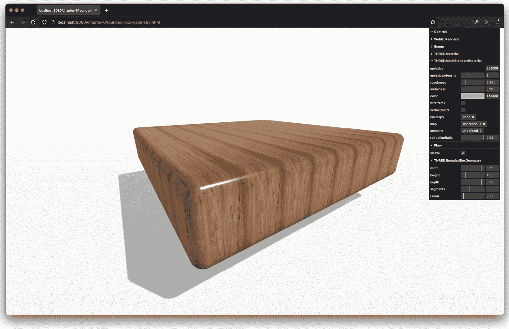

图 6.4 – 带有圆角的盒子

对于这个几何体，我们可以通过指定`width`、`height`和`depth`来指定盒子的尺寸。除了这些属性之外，这个几何体还提供了两个额外的属性：

+   `radius`：这是圆角的大小。这个值越高，圆角就越圆。

+   `segments`：这个属性定义了圆角将有多详细。如果这个值设置得较低，Three.js 将使用较少的顶点来定义圆角。

在我们展示如何从二维对象创建三维几何体之前，我们将查看 Three.js 提供的最终几何体，`TeapotGeometry`。

## TeapotGeometry

`TeapotGeometry`是一种可以用来渲染茶壶的几何体。这个茶壶是 3D 渲染的标准参考模型，自 1975 年以来一直被使用。关于这个模型历史的更多信息可以在这里找到：[`www.computerhistory.org/revolution/computer-graphics-music-and-art/15/206`](https://www.computerhistory.org/revolution/computer-graphics-music-and-art/15/206)。

使用这个模型的工作方式与迄今为止我们看到的所有其他模型完全相同：

```js
import { TeapotGeometry } from 'three/examples/jsm/
  geometries/TeapotGeometry'
...
const geom = new TeapotGeometry(size, segments, bottom,
  lid, body, fitLid, blinn)
```

您指定特定的属性然后创建几何体，将其分配给`THREE.Mesh`。根据属性，结果看起来像这样（在`teapot-geometry.html`示例中）：

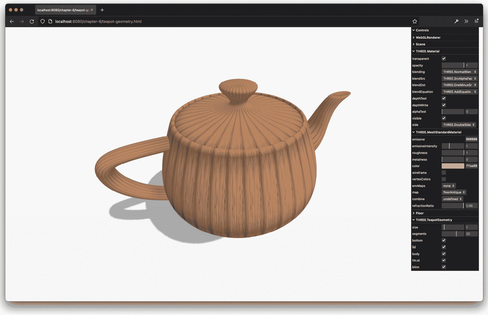

图 6.5 – 犹他茶壶

要配置此几何形状，您可以使用以下属性：

+   `size`: 这是茶壶的大小。

+   `segments`: 这定义了用于创建茶壶线框的段数。您使用的段数越多，茶壶看起来就越平滑。

+   `bottom`: 如果设置为`true`，茶壶的底部将被渲染。如果为`false`，底部将不会被渲染，这可以在茶壶位于表面且不需要渲染其底部时使用。

+   `lid`: 如果设置为`true`，茶壶的盖子将被渲染。如果为`false`，盖子将不会被渲染。

+   `body`: 如果设置为`true`，茶壶的主体将被渲染。如果为`false`，主体将不会被渲染。

+   `fitLid`: 如果设置为`true`，盖子将正好适合茶壶。如果为`false`，盖子和茶壶主体之间将有一个小间隙。

+   `blinn`: 这定义了是否使用与茶壶基于的原始 1975 年模型的相同纵横比。

在接下来的几节中，我们将探讨一种通过从 2D 形状中提取 3D 几何形状来创建几何形状的替代方法。

# 通过挤出 2D 形状创建几何形状

Three.js 提供了一种方法，我们可以通过挤出 2D 形状到 3D 形状。通过挤出，我们指的是沿着其*z*轴拉伸 2D 形状以将其转换为 3D。例如，如果我们挤出`THREE.CircleGeometry`，我们得到一个看起来像圆柱体的形状，如果我们挤出`THREE.PlaneGeometry`，我们得到一个类似立方体的形状。挤出形状最灵活的方法是使用`THREE.ExtrudeGeometry`。

## THREE.ExtrudeGeometry

使用`THREE.ExtrudeGeometry`，您可以从 2D 形状创建 3D 对象。在我们深入探讨这个几何形状的细节之前，让我们先看看一个例子，`extrude-geometry.html`。以下是从例子中截取的屏幕截图，显示了此几何形状：

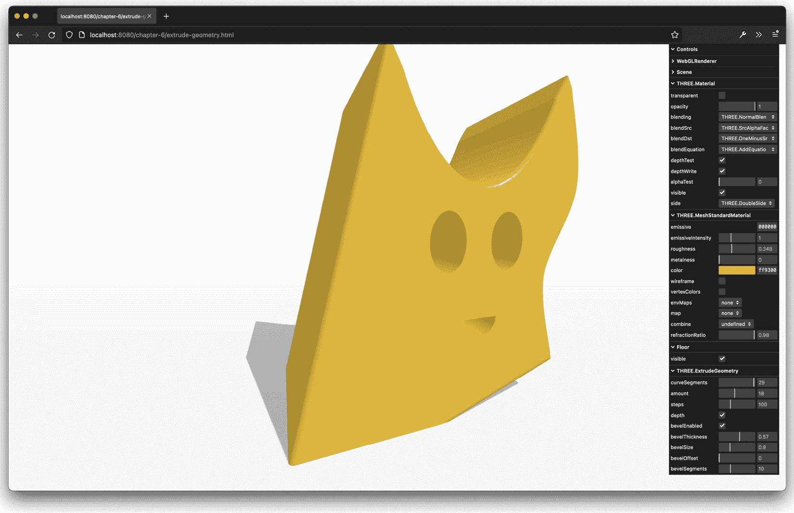

图 6.6 – 从 2D 形状创建 3D 几何形状

在这个例子中，我们使用了在*第五章*中“2D 几何形状”部分创建的 2D 形状，并使用`THREE.ExtrudeGeometry`将其转换为 3D。正如您在前面的屏幕截图中看到的，形状沿着*z*轴被挤出，从而形成了一个 3D 形状。创建`THREE.ExtrudeGeometry`的代码非常简单：

```js
const geometry = new THREE.ExtrudeGeometry(drawShape(), {
    curveSegments,
    steps,
    depth,
    bevelEnabled,
    bevelThickness,
    bevelSize,
    bevelOffset,
    bevelSegments,
    amount
  })
```

在此代码中，我们使用`drawShape()`函数创建了形状，就像我们在*第五章*中所做的那样。这个形状与一组属性一起传递给`THREE.ExtrudeGeometry`构造函数。通过这些属性，您可以精确地定义形状应该如何被挤出。以下列表解释了您可以传递给`THREE.ExtrudeGeometry`的选项：

+   `shapes`: 为了挤出几何形状，需要一个或多个形状（`THREE.Shape` 对象）。请参阅*第五章*，了解如何创建此类形状。

+   `depth`: 这决定了形状应该被拉伸多远（深度）。默认值是 100。

+   `bevelThickness`: 这决定了斜面的深度。斜面是前后面和拉伸之间的圆角。此值定义斜面进入形状的深度。默认值是 `6`。

+   `bevelSize`: 这决定了斜面的高度。这被添加到形状的正常高度上。默认值是 `bevelThickness - 2`。

+   `bevelSegments`: 这定义了斜面将使用的段数。使用的段数越多，斜面看起来越平滑。默认值是 `3`。注意，如果你添加更多段，你也在增加顶点数，这可能会对性能产生不利影响。

+   `bevelEnabled`: 如果设置为 `true`，则添加斜面。默认值是 `true`。

+   `bevelOffset`: 这是斜面开始处的形状轮廓距离。默认值是 `0`。

+   `curveSegments`: 这决定了在拉伸形状的曲线时将使用多少个段。使用的段数越多，曲线看起来越平滑。默认值是 `12`。

+   `steps`: 这定义了形状在拉伸深度上将被分割成多少个段。默认值是 `1`，这意味着它在其深度上只有一个段，没有不必要的额外顶点。

+   `extrudePath`: 这是形状应该拉伸的路径（`THREE.CurvePath`）。如果没有指定，形状将沿着 *z* 轴拉伸。注意，如果你有一个弯曲的路径，你还需要确保为 `steps` 属性设置一个更高的值，以便它可以准确地跟随曲线。

+   `uvGenerator`: 当你使用材质与纹理一起使用时，UV 映射决定了纹理的哪个部分用于特定的面。通过 `uvGenerator` 属性，你可以传入自己的对象，这将为传入的形状创建面的 UV 设置。有关 UV 设置的更多信息，请参阅 *第十章*，*加载和使用纹理*。如果没有指定，则使用 `THREE.ExtrudeGeometry.WorldUVGenerator`。

如果你想要为面和侧面使用不同的材质，你可以向 `THREE.Mesh` 传递一个材质数组。传入的第一个材质将应用于面，第二个材质将用于侧面。你可以通过 `extrude-geometry.html` 示例中的菜单来实验这些选项。在这个例子中，我们沿着其 *z* 轴拉伸了形状。正如你在本节前面列出的选项中可以看到，你也可以使用 `extrudePath` 选项沿着路径拉伸形状。在下面的几何体 `THREE.TubeGeometry` 中，我们将这样做。

## THREE.TubeGeometry

`THREE.TubeGeometry`创建了一个沿着 3D 样条曲线拉伸的管状体。您使用多个顶点指定路径，`THREE.TubeGeometry`将创建管状体。您可以在本章的源代码中找到一个可以实验的示例（`tube-geometry.html`）。以下截图显示了此示例：

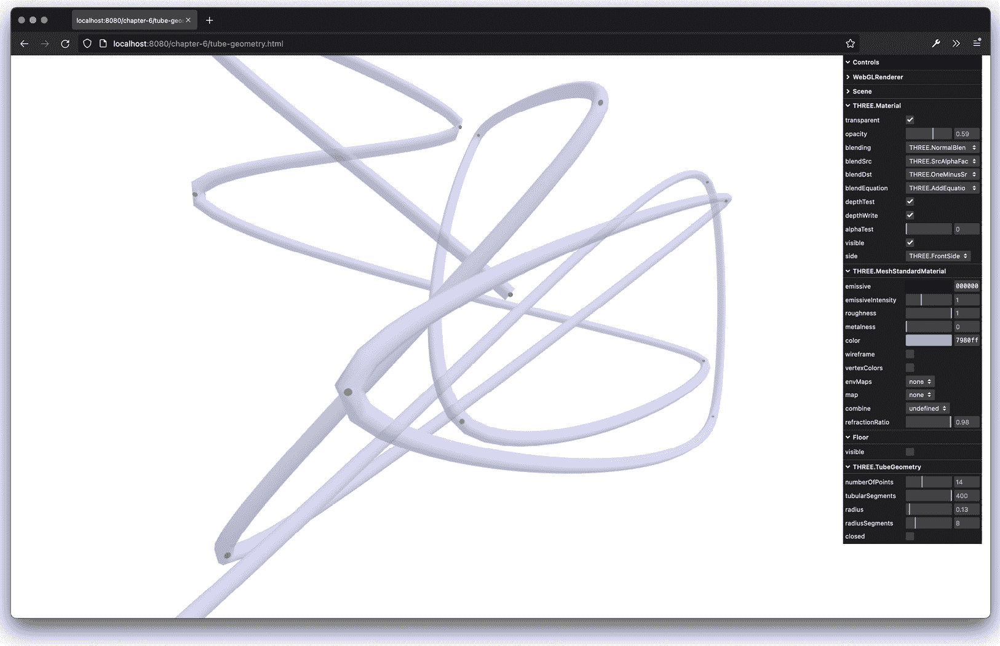

图 6.7 – 基于随机 3D 顶点的 TubeGeometry

正如您在这个示例中所看到的，我们生成了一些随机点，并使用这些点来绘制管状体。通过菜单中的控件，我们可以定义管状体的外观。创建管状体所需的代码非常简单，如下所示：

```js
const points = ... // array of THREE.Vector3 objects
const tubeGeometry = new TubeGeometry(
  new THREE.CatmullRomCurve3(points),
  tubularSegments,
  radius,
  radiusSegments,
  closed
)
```

我们首先需要获取一组顶点（`points`变量），这些顶点是`THREE.Vector3`类型，就像我们为`THREE.ConvexGeometry`和`THREE.LatheGeometry`所做的那样。然而，在我们能够使用这些点来创建管状体之前，我们首先需要将这些点转换为`THREE.Curve`。换句话说，我们需要定义一条通过我们定义的点的平滑曲线。我们可以通过将顶点数组传递给`THREE.CatmullRomCurve3`的构造函数，或者任何由 Three.js 提供的其他`Curve`实现来实现这一点。有了这条曲线和其他参数（我们将在本节中解释），我们可以创建管状体并将其添加到场景中。

在这个例子中，我们使用了`THREE.CatmullRomCurve3`。Three.js 提供了一些其他曲线，您也可以使用，它们接受略微不同的参数，但它们可以用来创建不同的曲线实现。开箱即用，Three.js 提供了以下曲线：`ArcCurve`、`CatmullRomCurve3`、`CubicBezierCurve`、`CubicBezierCurve3`、`EllipseCurve`、`LineCurve`、`LineCurve3`、`QuadraticBezierCurve`、`QuadraticBezierCurve3`和`SplineCurve`。

`THREE.TubeGeometry`除了曲线之外还接受一些其他参数。以下列出了`THREE.TubeGeometry`的所有参数：

+   `path`：这是`THREE.SplineCurve3`，它描述了管状体应该遵循的路径。

+   `tubularSegments`：这些是构建管状体所使用的段数。默认值为`64`。路径越长，您应该指定的段数就越多。

+   `radius`：这是管状体的半径。默认值为`1`。

+   `radiusSegments`：这是沿管状体长度使用的段数。默认值为`8`。您使用的越多，管状体看起来就越圆。

+   `closed`：如果设置为`true`，管状体的起始和结束将连接起来。默认值为`false`。

本章我们将展示的最后一个是拉伸示例，它实际上并不是一种不同的几何类型，但我们将使用`THREE.ExtrudeGeometry`从 SVG 图像创建拉伸体。

什么是 SVG？

SVG 是一种基于 XML 的标准，可以用于在网络上创建基于矢量的 2D 图像。这是一个由所有现代浏览器支持的开源标准。然而，直接使用 SVG 并从 JavaScript 中操作它并不是非常直接。幸运的是，有几个开源 JavaScript 库使得处理 SVG 变得容易得多。`Paper.js`、`Snap.js`、`D3.js` 和 `Raphael.js` 是其中一些最好的。如果你需要一个图形编辑器，你还可以使用开源的 Inkscape 产品。

## 从 SVG 元素拉伸 3D 形状

当我们在 *第五章* 中讨论 `THREE.ShapeGeometry` 时，我们提到 SVG 遵循几乎相同的绘图形状方法。在本节中，我们将探讨如何使用 SVG 图像与 `THREE.SVGLoader` 一起拉伸 SVG 图像。我们将使用蝙蝠侠标志作为示例：

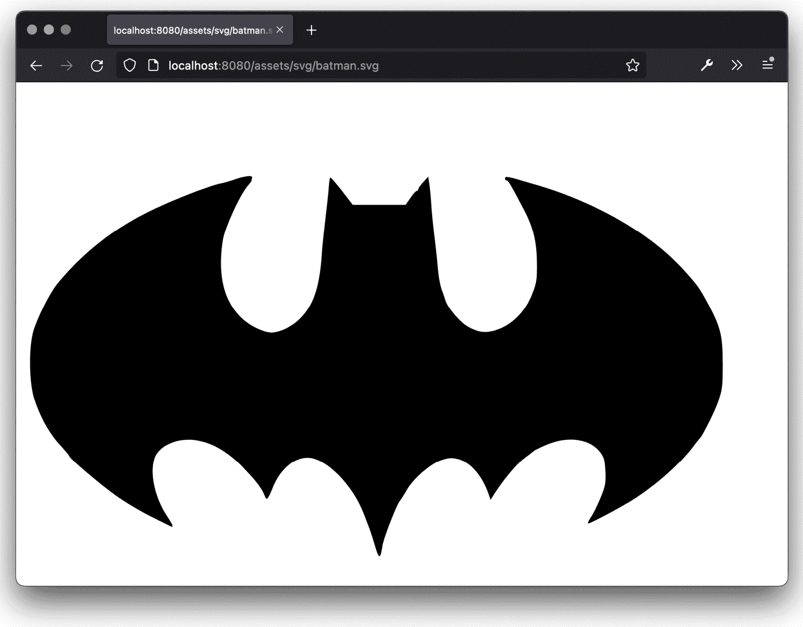

图 6.8 – 蝙蝠侠 SVG 基础图像

首先，让我们看看原始 SVG 代码的样子（你还可以在查看 `assets/svg/batman.svg` 文件的源代码时自己查看）：

```js
<svg version="1.0" xmlns="http://www.w3.org/2000/svg"   xmlns:xlink="http://www.w3.org/1999/xlink" x="0px" y="0px" width="1152px" height="1152px" xml:space="preserve">
  <g>
    <path   id="batman-path" style="fill:rgb(0,0,0);" d="M 261.135 114.535 C 254.906 116.662 247.491 118.825 244.659 119.344 C
    229.433 122.131 177.907 142.565 151.973 156.101 C   111.417
    177.269 78.9808 203.399 49.2992 238.815 C 41.0479   248.66
    26.5057 277.248 21.0148 294.418 C 14.873 313.624    15.3588
    357.341 21.9304 376.806 C 29.244 398.469 39.6107    416.935
    52.0865 430.524 C 58.2431 437.23 63.3085 443.321    63.3431
    444.06 ... 261.135 114.535 "/>
  </g>
</svg>
```

除非你是 SVG 大师，否则这对你来说可能意义不大。不过，基本上，你在这里看到的是一组绘图指令。例如，`C 277.987 119.348 279.673 116.786 279.673 115.867` 告诉浏览器绘制一个三次贝塞尔曲线，而 `L 489.242 111.787` 告诉我们应该绘制到那个特定位置。幸运的是，我们不需要自己编写代码来解释这些，可以使用 `THREE.SVGLoader`，如下面的代码所示：

```js
// returns a promise
const batmanShapesPromise = new SVGLoader().loadAsync('/assets/svg/batman.svg')
// when promise resolves the svg will contain the shapes
batmanShapes.then((svg) => {
  const shapes = SVGLoader.createShapes(svg.paths[0])
  // based on the shapes we can create an extrude geometry
    as we've seen earlier
  const geometry = new THREE.ExtrudeGeometry(shapes, {
    curveSegments,
    steps,
    depth,
    bevelEnabled,
    bevelThickness,
    bevelSize,
    bevelOffset,
    bevelSegments,
    amount
  })
  ...
}
```

在这个代码片段中，你可以看到我们使用 `SVGLoader` 来加载 SVG 文件。我们在这里使用 `loadAsync`，它将返回一个 JavaScript `Promise`。当这个 `Promise` 解决时，我们可以访问加载的 `svg` 数据。这些数据可以包含一个 `path` 元素列表，每个元素代表原始 SVG 的 `path` 元素。在我们的例子中，我们只有一个，所以我们使用 `svg.paths[0]` 并将其传递给 `SVGLoader.createShapes` 以将其转换为 `THREE.Shape` 对象的数组。现在我们有了这些形状，我们可以使用之前当我们拉伸自定义创建的 2D 几何形状时使用的方法，并使用 `THREE.ExtrudeGeometry` 从加载的 2D SVG 形状创建 3D 模型。

最终结果可以在浏览器中打开 `extrude-svg.html` 示例时看到：

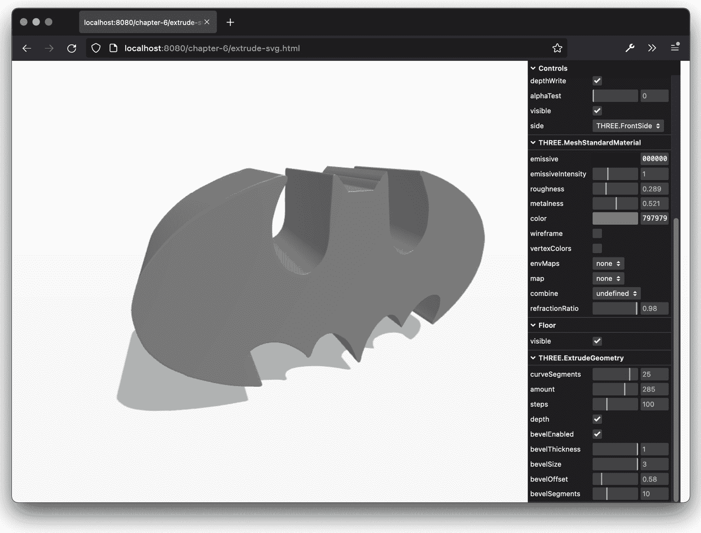

图 6.9 – 从 2D SVG 图像拉伸创建的 3D 蝙蝠侠标志

在本节中，我们将讨论的最后一种几何形状是 `THREE.ParametricGeometry`。使用这种几何形状，你可以指定几个函数，这些函数用于程序化地创建几何形状。

## THREE.ParametricGeometry

使用 `THREE.ParametricGeometry`，你可以根据一个方程创建一个几何体。在我们自己的例子深入之前，一个好的开始是查看 Three.js 已经提供的示例。当你下载 Three.js 分发版时，你会得到 `examples/js/ParametricGeometries.js` 文件。在这个文件中，你可以找到一些你可以与 `THREE.ParametricGeometry` 一起使用的方程示例。

最基本的例子是创建平面的函数：

```js
        plane: function ( width, height ) {
            return function ( u, v, target ) {
                const x = u * width;
                const y = 0;
                const z = v * height;
                target.set( x, y, z );
            };
        },
```

这个函数是由 `THREE.ParametricGeometry` 调用的。`u` 和 `v` 值将在 `0` 到 `1` 之间变化，并且将被多次调用，涵盖从 `0` 到 `1` 的所有值。在这个例子中，`u` 值用于确定向量的 `x` 坐标，而 `v` 值用于确定 `z` 坐标。运行后，你将得到一个宽度为 `width`，深度为 `depth` 的基本平面。

在我们的例子中，我们做了类似的事情。然而，我们不是创建一个平面，而是创建了一个波状图案，正如你在 `parametric-geometry.html` 示例中看到的那样。以下截图显示了此示例：

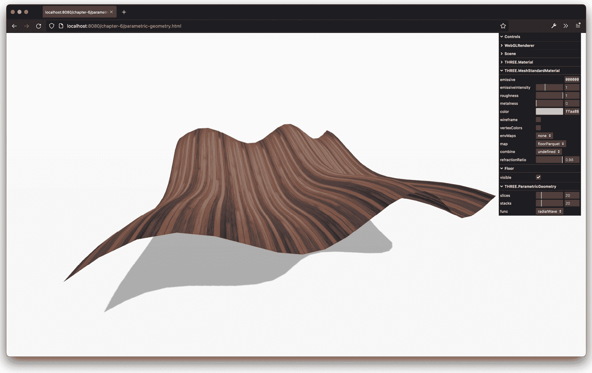

图 6.10 – 使用参数化几何创建的波状平面

为了创建这个形状，我们将以下函数传递给了 `THREE.ParametricGeometry`：

```js
const radialWave = (u, v, optionalTarget) => {
  var result = optionalTarget || new THREE.Vector3()
  var r = 20
  var x = Math.sin(u) * r
  var z = Math.sin(v / 2) * 2 * r + -10
  var y = Math.sin(u * 4 * Math.PI) + Math.cos(v * 2 *
    Math.PI)
  return result.set(x, y, z)
}
const geom = new THREE.ParametricGeometry(radialWave, 120,
  120);
```

正如你在本例中看到的，通过几行代码，我们可以创建一些非常有趣的几何体。在本例中，你还可以看到我们可以传递给 `THREE.ParametricGeometry` 的参数：

+   `function`：这是一个函数，它根据提供的 `u` 和 `v` 值定义每个顶点的位置

+   `slices`：这定义了 `u` 值应该被分成多少部分

+   `stacks`：这定义了 `v` 值应该被分成多少部分

通过改变函数，我们可以轻松地使用完全相同的方法渲染一个完全不同的对象：

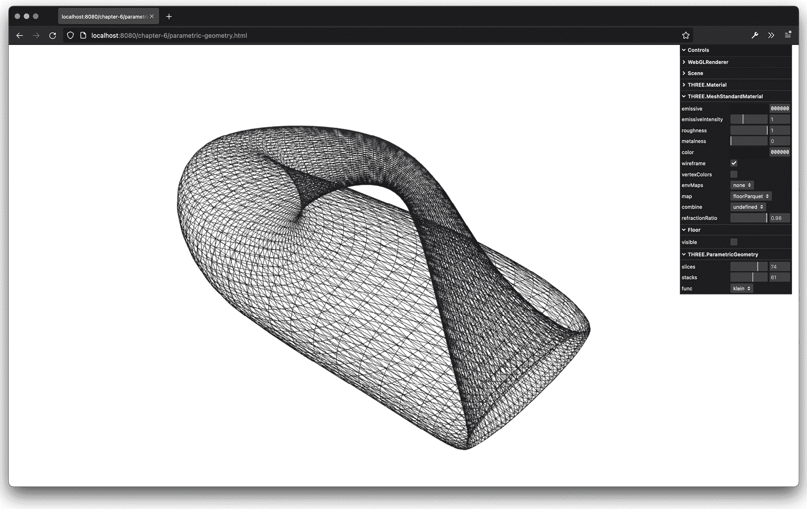

图 6.11 – 使用参数化几何渲染的克莱因瓶

在继续本章下一部分之前，关于如何使用 `slices` 和 `stacks` 属性的最后一点说明。我们提到 `u` 和 `v` 属性被传递到提供的函数参数中，并且这两个属性的值范围从 `0` 到 `1`。通过 `slices` 和 `stacks` 属性，我们可以定义传递的函数被调用的频率。例如，如果我们把 `slices` 设置为 `5`，`stacks` 设置为 `4`，函数将使用以下值被调用：

```js
u:0/5, v:0/4
u:1/5, v:0/4
u:2/5, v:0/4
u:3/5, v:0/4
u:4/5, v:0/4
u:5/5, v:0/4
u:0/5, v:1/4
u:1/5, v:1/4
...
u:5/5, v:3/4
u:5/5, v:4/4
```

因此，这些值越高，你可以指定更多的顶点，你创建的几何体将越平滑。你可以使用 `parametric-geometry.html` 示例右侧的菜单来查看这种效果。

对于更多示例，你可以查看 Three.js 分发版中的 `examples/js/ParametricGeometries.js` 文件。这个文件包含创建以下几何体的函数：

+   克莱因瓶

+   平面

+   平面莫比乌斯带

+   3D 莫比乌斯带

+   管道

+   环面结

+   球体

+   平面

有时候，你需要看到更多关于你的几何体的细节，而你并不太关心材质以及网格如何渲染。如果你想查看顶点和面，或者仅仅是轮廓，Three.js 提供了一些几何体可以帮助你实现这一点（除了启用你用于网格的材质的 `wireframe` 属性）。我们将在下一节中探讨这些内容。

# 可以用于调试的几何体

Three.js 默认提供了两个辅助几何体，这使得查看几何体的细节或仅仅是轮廓变得更加容易：

+   `THREE.EdgesGeometry` 提供了一个只渲染几何体边的几何体

+   `THREE.WireFrameGeometry`，它只渲染几何体而不显示任何面

首先，让我们看看 `THREE.EdgesGeometry`。

## THREE.EdgesGeometry

使用 `THREE.EdgesGeometry`，你包裹一个现有的几何体，然后通过只显示边而不是单独的顶点和面来渲染。一个例子可以在 `edges-geometry.html` 示例中看到：

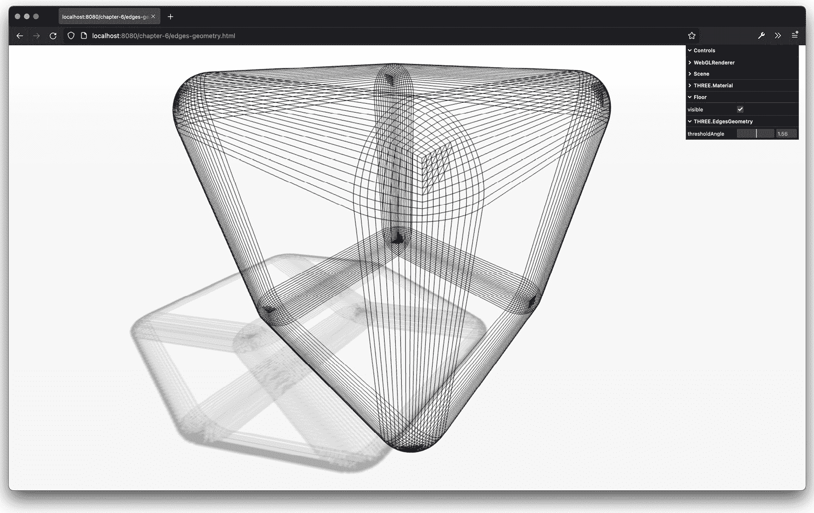

图 6.12 – 只显示边而不显示单独面的 EdgesGeometry

在前面的截图中，你可以看到 `RoundedBoxGeometry` 的轮廓被显示出来，我们只看到了边。由于 `RoundedBoxGeometry` 有平滑的角落，这些角落在使用 `THREE.EdgesGeometry` 时会被显示出来。

要使用这个几何体，你只需将现有的几何体像这样包裹起来：

```js
const baseGeometry = new RoundedBoxGeometry(3, 3, 3, 10, 0.4)
const edgesGeometry = THREE.EdgesGeometry(baseGeometry, 1.5)
}
```

`THREE.EdgesGeometry` 只接受一个属性 `thresholdAngle`。通过这个属性，你可以确定何时这个几何体绘制边。在 `edges-geometry.html` 中，你可以控制这个属性以查看效果。

如果你有一个现有的几何体并且想查看线框，你可以配置一个材质来显示这个线框：

```js
const material = new THREE.MeshBasicMaterial({ color: 0xffff00, wireframe: true })
```

Three.js 还提供了一种使用 `THREE.WireFrameGeometry` 的不同方式。

## THREE.WireFrameGeometry

这个几何体模拟了当你将材质的 `wireframe` 属性设置为 `true` 时看到的行为：

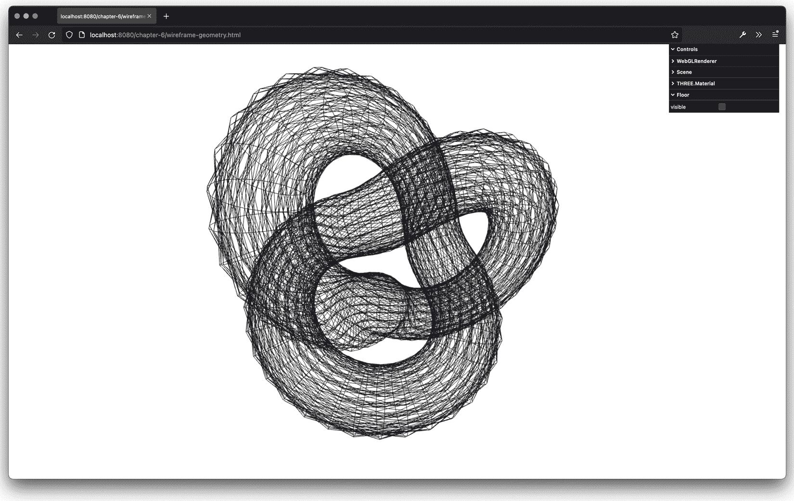

图 6.13 – 展示几何体所有单独面的线框几何体

使用这个材质的方式与使用 `THREE.EdgesGeometry` 相同：

```js
const baseGeometry = new THREE.TorusKnotBufferGeometry(3, 1, 100, 20, 6, 9)
const wireframeGeometry = new THREE.WireframeGeometry(baseGeometry)
```

这个几何体不接收任何额外的属性。

本章的最后部分将处理创建 3D 文本对象。我们将展示两种不同的方法，一种使用 `THREE.Text` 对象，另一种则使用外部库。

# 创建 3D 文本网格

在本节中，我们将快速查看如何创建 3D 文本。首先，我们将查看如何使用 Three.js 提供的字体渲染文本，以及如何使用你自己的字体。然后，我们将展示一个使用外部库 Troika ([`github.com/protectwise/troika`](https://github.com/protectwise/troika)) 的快速示例，该库使得创建标签和 2D 文本元素并将其添加到场景中变得非常容易。

## 渲染文本

在 Three.js 中渲染文本非常简单。你只需要定义你想要使用的字体，并使用我们在讨论 `THREE.ExtrudeGeometry` 时看到的相同拉伸属性。以下截图显示了 `text-geometry.html` 示例，展示了如何在 Three.js 中渲染文本：

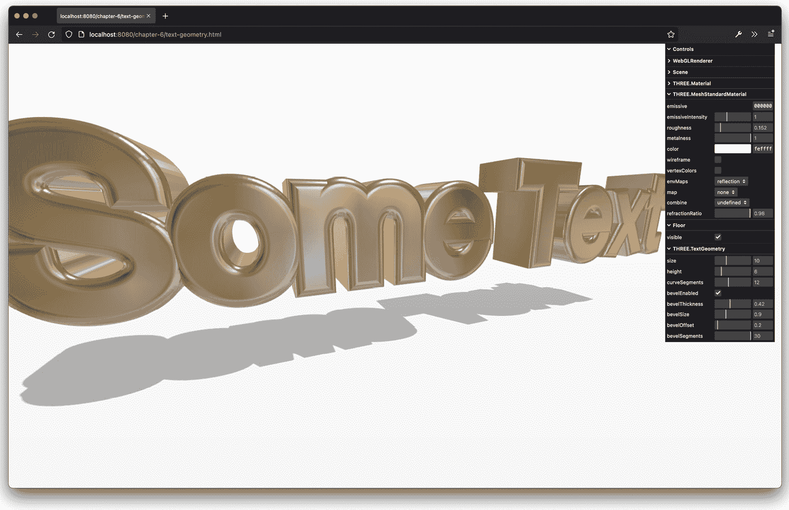

图 6.14 – 在 Three.js 中渲染文本

创建此 3D 文本所需的代码如下：

```js
import { FontLoader } from 'three/examples/jsm/
  loaders/FontLoader'
import { TextGeometry } from 'three/examples/jsm/
  geometries/TextGeometry'
...
new FontLoader()
  .loadAsync('/assets/fonts/helvetiker_regular.typeface.json')
  .then((font) => {
      const textGeom =  new TextGeometry('Some Text', {
          font,
          size,
          height,
          curveSegments,
          bevelEnabled,
          bevelThickness,
          bevelSize,
          bevelOffset,
          bevelSegments,
          amount
    })
    ...
  )
```

在此代码片段中，你可以看到我们首先必须加载字体。为此，Three.js 提供了 `FontLoader()`，我们提供要加载的字体名称，就像我们在 `SVGLoader` 中做的那样，我们得到一个 JavaScript `Promise`。一旦该 `Promise` 解决，我们使用加载的字体来创建 `TextGeometry`。

我们可以传递给 `THREE.TextGeometry` 的选项与我们可以传递给 `THREE.ExtrudeGeometry` 的选项相同：

+   `font`：用于文本的加载字体。

+   `size`：这是文本的大小。默认值是 `100`。

+   `height`：这是拉伸的长度（深度）。默认值是 `50`。

+   `curveSegments`：这定义了在拉伸形状的曲线时使用的段数。段数越多，曲线看起来越平滑。默认值是 `4`。

+   `bevelEnabled`：如果设置为 `true`，则添加斜面。默认值是 `false`。

+   `bevelThickness`：这是斜面的深度。斜面是前后面和拉伸之间的圆角。默认值是 `10`。

+   `bevelSize`：这是斜面的高度。默认值是 `8`。

+   `bevelSegments`：这定义了斜面将使用的段数。段数越多，斜面看起来越平滑。默认值是 `3`。

+   `bevelOffset`：这是斜面开始处的形状轮廓的距离。默认值是 `0`。

由于 `THREE.TextGeometry` 也是 `THREE.ExtrudeGeometry`，因此如果你想要为材质的前面和侧面使用不同的材质，则适用相同的方法。如果你在创建 `THREE.Mesh` 时传入一个包含两种材质的数组，Three.js 将将第一种材质应用于文本的前面和背面，第二种材质应用于侧面。

使用此几何形状也可以使用其他字体，但首先需要将它们转换为 JSON – 如何进行此操作将在下一节中展示。

## 添加自定义字体

Three.js 提供了一些字体，你可以在场景中使用这些字体。这些字体基于 `TypeFace.js` 库提供的字体。`TypeFace.js` 是一个可以将 TrueType 和 OpenType 字体转换为 JavaScript 的库。生成的 JavaScript 文件或 JSON 文件可以包含在你的页面中，然后该字体就可以在 Three.js 中使用。在旧版本中，使用了 JavaScript 文件，但在后来的 Three.js 版本中，Three.js 转向使用 JSON 文件。

要将现有的 OpenType 或 TrueType 字体转换为字体支持的格式，你可以使用网页 [`gero3.github.io/facetype.js/`](https://gero3.github.io/facetype.js/)：

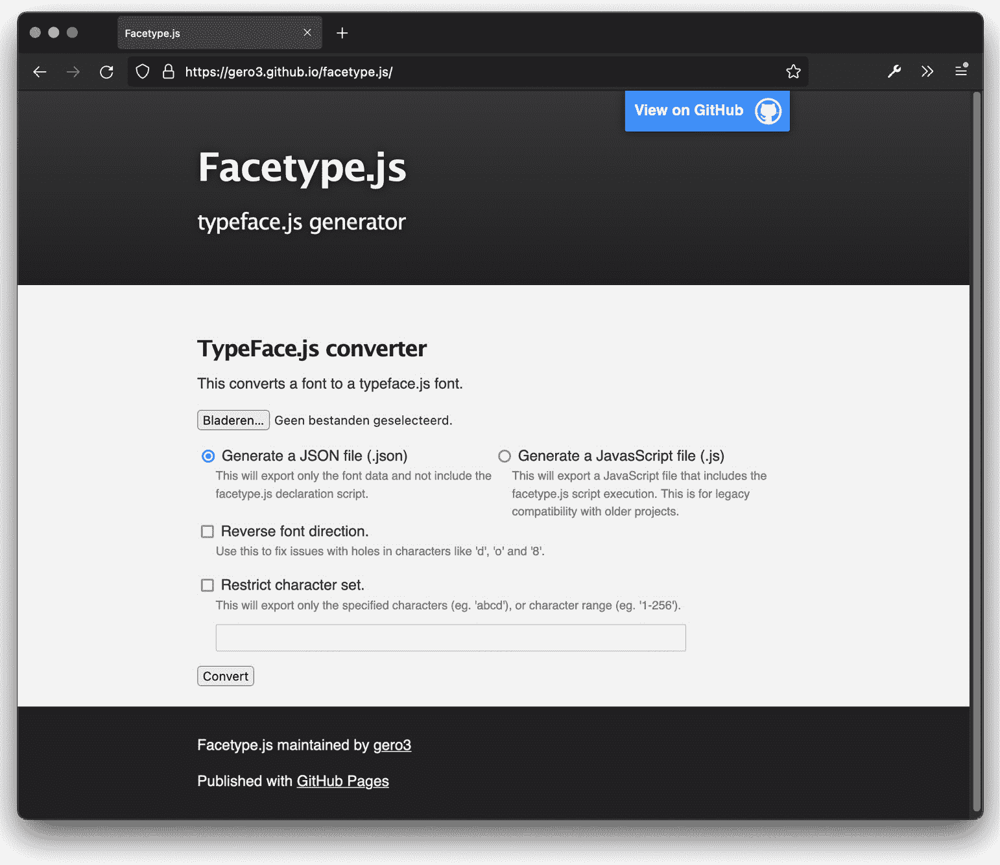

图 6.15 – 将字体转换为字体支持的格式

在这个页面上，你可以上传一个字体，它将为你转换为 JSON。请注意，这并不适用于所有类型的字体。字体越简单（直线越多），在 Three.js 中使用时正确渲染的机会就越大。生成的文件看起来像这样，其中每个字符（或符号）都被描述：

```js
{"glyphs":{"¦":{"x_min":359,"x_max":474,"ha":836,"o":"m 474 971 l 474 457 l
359 457 l 359 971 l 474 971 m 474 277 l 474 -237 l 359 -237 l 359 277 l 474
277 "},"Ž":{"x_min":106,"x_max":793,"ha":836,"o":"m 121 1013 l 778 1013 l
778 908 l 249 115 l 793 115 l 793 0 l 106 0 l 106 104 l 620 898 l 121 898 l
121 1013 m 353 1109 l 211 1289 l 305 1289 l 417 1168 l 530 1289 l 625 1289
l 482 1109 l 353 1109 "},"Á":{"x_min":25,"x_max":811,"ha":836,"o":"m 417
892 l 27 ....
```

一旦你有了 JSON 文件，你可以使用 `FontLoader`（如我们在 *渲染文本* 部分之前所展示的）来加载这个字体，并将其分配给可以传递给 `TextGeometry` 的选项中的 `font` 属性。

在本章的最后一个例子中，我们将探讨使用 Three.js 创建文本的另一种方法。

## 使用 Troika 库创建文本

如果你想要为场景的某些部分创建标签或 2D 文本标记，有一个替代选项是使用 `THREE.Text` 几何体。你还可以使用一个名为 Troika 的外部库：[`github.com/protectwise/troika`](https://github.com/protectwise/troika)。

这是一个相当大的库，提供了许多功能来为你的场景添加交互性。对于这个例子，我们只关注该库的文本模块。我们将创建的示例在 `troika-text.html` 示例中展示：

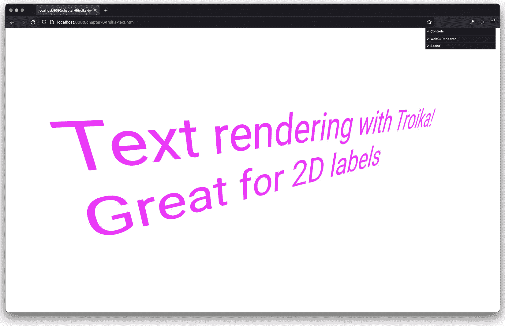

图 6.16 – 2D 标签的 Troika 文本

要使用这个库，我们首先必须安装它（如果你遵循了 *第一章*，*使用 Three.js 创建你的第一个 3D 场景* 的说明，你现在已经可以使用这个库了）：`$ yarn add troika-three-text`。一旦安装，我们就可以导入它并像使用 Three.js 提供的其他模块一样使用它：

```js
import { Text } from 'troika-three-text'
const troikaText = new Text()
troikaText.text = 'Text rendering with Troika!\nGreat for
  2D labels'
troikaText.fontSize = 2
troikaText.position.x = -3
troikaText.color = 0xff00ff
troikaText.sync()
scene.add(troikaText)
```

在前面的代码片段中，我们展示了如何使用 Troika 创建一个简单的文本元素。你只需要调用 `Text()` 构造函数并设置属性。然而，需要注意的是，每次你在 `Text()` 对象中更改属性时，都必须调用 `troikaText.sync()`。这将确保更改也应用于屏幕上渲染的模型。

# 摘要

在本章中，我们看到了很多内容。我们介绍了几种高级几何形状，并展示了如何使用 Three.js 创建和渲染文本元素。我们展示了如何使用高级几何形状，如`THREE.ConvexGeometry`、`THREE.TubeGeometry`和`THREE.LatheGeometry`来创建非常漂亮的形状，以及如何通过实验这些几何形状来获得你想要的结果。一个非常棒的功能是，我们还可以使用`THREE.ExtrudeGeometry`将现有的 SVG 路径转换为 Three.js。

我们还快速查看了几种非常有用的调试几何形状。`THREE.EdgesGeometry`仅显示另一个几何形状的边，而`THREE.WireframeGeometry`可以用来显示某些其他几何形状的线框。

最后，如果你想创建 3D 文本，Three.js 提供了`TextGeometry`，你可以传入你想要使用的字体。Three.js 自带了一些字体，但你也可以创建自己的字体。然而，请记住，复杂的字体通常无法正确转换。使用`TextGeometry`的替代方案是使用 Troika 库，它使得创建 2D 文本标签并将其放置在场景中的任何位置变得非常容易。

到目前为止，我们查看的是实体（或线框）几何形状，其中顶点相互连接以形成面。在下一章中，我们将探讨一种使用称为粒子或点的东西来可视化几何形状的替代方法。使用粒子，我们不渲染完整的几何形状——我们只是将单个顶点作为空间中的点进行渲染。这允许你创建看起来很棒且性能良好的 3D 效果。
