# 点和精灵

在前面的章节中，我们讨论了 Three.js 提供的最重要概念、对象和 API。在本章中，我们将探讨我们至今为止跳过的唯一概念：点和精灵。使用 `THREE.Points`（有时也称为精灵），可以非常容易地创建许多始终面向相机的矩形，您可以使用它们来模拟雨、雪、烟雾和其他有趣的效果。例如，您可以将单个几何体渲染为点集，并分别控制这些点。在本章中，我们将探索 Three.js 提供的各个点和精灵相关功能。

更具体地说，在本章中，我们将探讨以下主题：

+   使用 `THREE.SpriteMaterial` 和 `THREE.PointsMaterial` 创建和样式化粒子

+   使用 `THREE.Points` 创建一组点

+   使用画布来单独样式化每个点

+   使用纹理来样式化单个点

+   动画 `THREE.Points` 对象

+   从现有几何体创建 `THREE.Points` 对象

关于本章中使用的某些名称的简要说明

在 Three.js 的新版本中，与点相关的对象名称已经更改了几次。`THREE.Points` 对象之前被称为 `THREE.PointCloud`，在更早的版本中被称为 `THREE.ParticleSystem`。`THREE.Sprite` 之前被称为 `THREE.Particle`，材质也经历了多次名称更改。因此，如果您在网上看到使用这些旧名称的示例，请记住，它们讨论的是相同的概念。

让我们从探索粒子是什么以及如何创建一个粒子开始。

# 理解点和精灵

与大多数新概念一样，我们将从一个示例开始。在本章的源代码中，您将找到一个名为 `sprite.html` 的示例。打开此示例后，您将看到一个简约的场景，包含一个简单的彩色正方形：

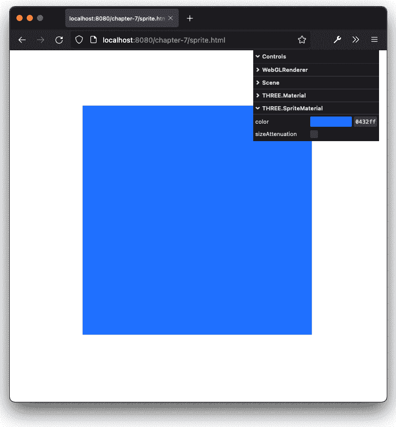

图 7.1 – 单个渲染的精灵

您可以使用鼠标旋转场景。您会注意到的一件事是，无论您如何看这个正方形，它总是看起来一样。例如，下面的截图显示了从不同位置查看同一场景的视图：

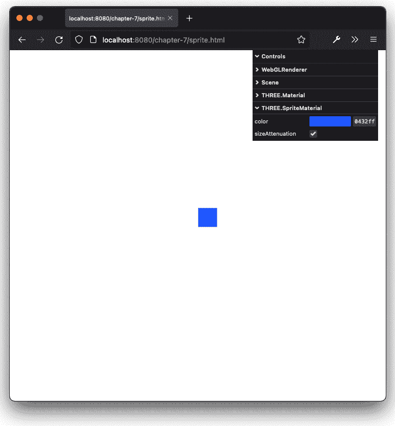

图 7.2 – 单个渲染的精灵将始终面向相机

如您所见，精灵仍然朝向相机倾斜，您无法看到其背后。您可以将精灵想象成一个始终面向相机的二维平面。如果您创建的精灵没有任何属性，它们将被渲染成小而白色的二维正方形。要创建精灵，我们只需要提供一个材质：

```js
const material = new THREE.SpriteMaterial({ size: 0.1,
  color: 0xff0000 })
const sprite = new THREE.Sprite(material)
sprite.position.copy(new THREE.Vector3(1,1,1))
```

您可以使用 `THREE.SpriteMaterial` 配置精灵的外观：

+   `color`: 这是精灵的颜色。默认颜色是白色。

+   `sizeAttenuation`：如果设置为 `false`，精灵将具有相同的大小，无论其相对于摄像机的位置有多远。如果设置为 `true`，大小基于与摄像机的距离。默认值是 `true`。注意，这仅在使用 `THREE.PerspectiveCamera` 时才有影响。对于 `THREE.OrthographicCamera`，如果设置为 `false`，它始终起作用。

+   `map`：使用这个属性，你可以将纹理应用到精灵上。例如，你可以使它们看起来像雪花。这个属性在这个示例中没有展示，但在本章的 *使用纹理来样式化粒子* 部分中有解释。

+   `opacity`：这个属性与 `transparent` 属性一起设置精灵的不透明度。默认值是 `1`（完全不透明）。

+   `transparent`：如果设置为 `true`，精灵将以 `opacity` 属性设置的透明度渲染。默认值是 `false`。

+   `blending`：这是渲染精灵时要使用的混合模式。

注意，`THREE.SpriteMaterial` 是从基础 `THREE.Material` 对象扩展而来的，因此该对象的所有属性也可以用于 `THREE.SpriteMaterial`。

在我们继续探讨更有趣的 `THREE.Points` 对象之前，让我们更仔细地看看 `THREE.Sprite` 对象。一个 `THREE.Sprite` 对象就像 `THREE.Mesh` 一样，是从 `THREE.Object3D` 对象扩展而来的。这意味着你从 `THREE.Mesh` 所了解的大部分属性和函数都可以用于 `THREE.Sprite`。你可以使用 `position` 属性设置其位置，使用 `scale` 属性缩放它，并使用 `translate` 属性沿着其轴移动它。

使用 `THREE.Sprite`，你可以非常容易地创建一组对象并在场景中移动它们。当你处理少量对象时，这效果很好，但当你想要处理大量 `THREE.Sprite` 对象时，你会很快遇到性能问题。这是因为每个对象都需要由 Three.js 分别管理。Three.js 提供了一种使用 `THREE.Points` 对象处理大量精灵的替代方法。使用 `THREE.Points`，Three.js 不需要管理许多单独的 `THREE.Sprite` 对象，只需管理 `THREE.Points` 实例即可。这将允许 Three.js 优化绘制精灵的方式，从而获得更好的性能。以下截图显示了使用 `THREE.Points` 对象渲染的几个精灵：

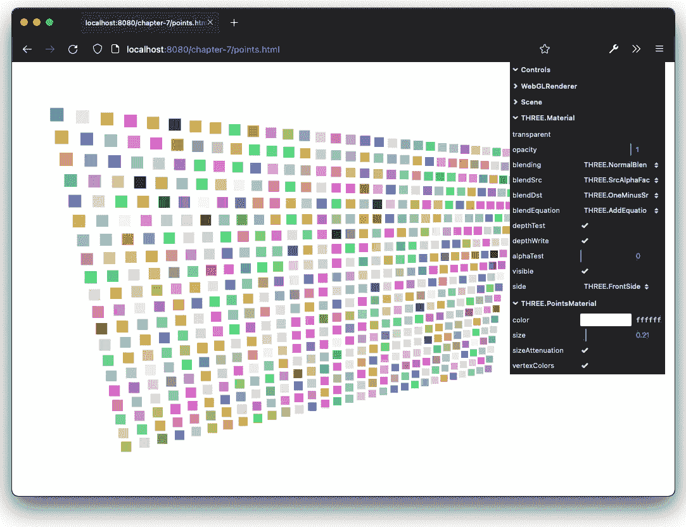

图 7.3 – 从 THREE.BufferGeometry 渲染的多个点

要创建一个 `THREE.Points` 对象，我们需要提供它一个 `THREE.BufferGeometry`。对于之前的截图，我们可以创建一个 `THREE.BufferGeometry`，如下所示：

```js
const createPoints = () => {
  const points = []
  for (let x = -15; x < 15; x++) {
    for (let y = -10; y < 10; y++) {
      let point = new THREE.Vector3(x / 4, y / 4, 0)
      points.push(point)
    }
  }
  const colors = new Float32Array(points.length * 3)
  points.forEach((e, i) => {
    const c = new THREE.Color(Math.random() * 0xffffff)
    colors[i * 3] = c.r
    colors[i * 3 + 1] = c.g
    colors[i * 3 + 2] = c.b
  })
  const geom = new THREE.BufferGeometry().setFromPoints(points)
  geom.setAttribute('color', new THREE.BufferAttribute(colors, 3, true))
  return geom
}
const material = new THREE.PointsMaterial({ size: 0.1,
  vertexColors: true, color: 0xffffff })
const points = new THREE.Points(createPoint(), material)
```

如您从这段代码片段中看到的，首先，我们创建了一个 `THREE.Vector3` 对象数组 – 每个对象对应我们想要创建精灵的位置。此外，我们在 `THREE.BufferGeometry` 上设置了 `color` 属性，该属性用于为每个精灵着色。使用 `THREE.BufferGeometry` 和一个 `THREE.PointsMaterial` 实例，我们可以创建 `THREE.Points` 对象。`THREE.PointsMaterial` 的属性几乎与 `THREE.SpriteMaterial` 的属性相同：

+   `color`: 这是点的颜色。默认颜色是 `0xffffff`。

+   `sizeAttenuation` 如果设置为 `false`，所有点将具有相同的大小，无论它们距离相机有多远。如果设置为 `true`，大小将基于距离相机的距离。默认值是 `true`。

+   `map`: 使用这个属性，你可以将纹理应用到点上。例如，你可以使它们看起来像雪花。这个属性在这个例子中没有展示，但会在本章后面的“使用纹理样式化粒子”部分进行解释。

+   `opacity`: 这与 `transparent` 属性一起设置精灵的不透明度。默认值是 `1`（无不透明度）。

+   `transparent`: 如果设置为 `true`，精灵将以 `opacity` 属性设置的不透明度渲染。默认值是 `false`。

+   `blending`: 这是渲染精灵时要使用的混合模式。

+   `vertexColors`: 通常，`THREE.Points` 中的所有点都有相同的颜色。如果将此属性设置为 `true`，并且几何体的颜色缓冲区属性已设置，则每个点将从该数组中获取颜色。默认值是 `false`。

和往常一样，您可以通过每个例子右侧的菜单来调整这些属性。

到目前为止，我们只以小方块的形式渲染了粒子，这是默认行为。然而，还有两种额外的样式化粒子的方式，我们将在下一节展示。

# 使用纹理样式化粒子

在本节中，我们将探讨以下两种改变精灵外观的方式：

+   使用 HTML 画布绘制图像并显示每个精灵

+   加载一个外部图像文件来定义每个精灵的外观

让我们先自己绘制图像。

## 在画布上绘制图像

在 `THREE.PointsMaterial` 的属性中，我们提到了 `map` 属性。使用 `map` 属性，我们可以为单个点加载纹理。使用 Three.js，这个纹理也可以是 HTML5 画布的输出。在我们查看代码之前，让我们看一个例子（`canvastexture.js`）：

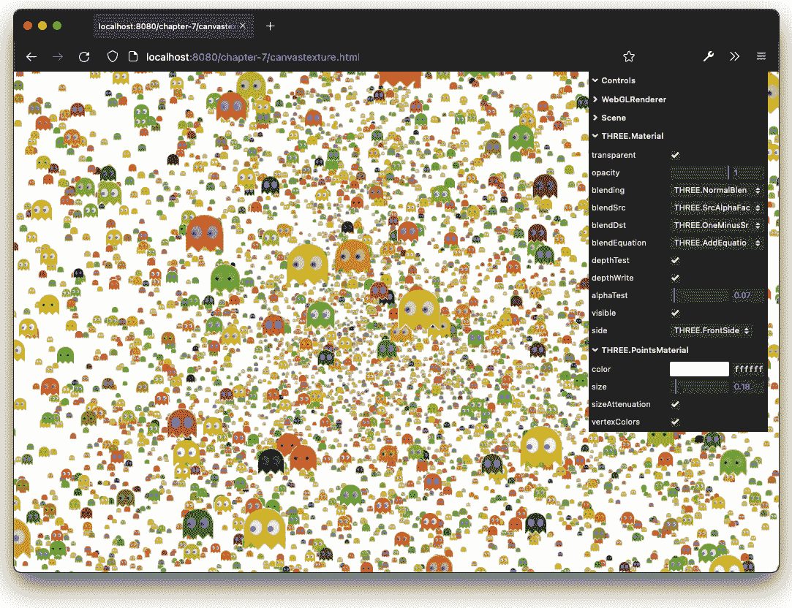

图 7.4 – 使用基于画布的纹理创建精灵

在这里，你可以看到屏幕上有一大群类似《吃豆人》的幽灵。这使用了我们在之前*理解点和精灵*部分看到的方法。不过，这次我们不是显示一个简单的正方形，而是一个图像。为了创建这个纹理，我们可以使用以下代码：

```js
const createGhostTexture = () => {
  const canvas = document.createElement('canvas')
  canvas.width = 32
  canvas.height = 32
  const ctx = canvas.getContext('2d')
  // the body
  ctx.translate(-81, -84)
  ctx.fillStyle = 'orange'
  ctx.beginPath()
  ctx.moveTo(83, 116)
  ctx.lineTo(83, 102)
  ctx.bezierCurveTo(83, 94, 89, 88, 97, 88)
  // some code removed for clarity
  ctx.fill()
  // the eyes
  ctx.fillStyle = 'white'
  ctx.beginPath()
  ctx.moveTo(91, 96)
  ctx.bezierCurveTo(88, 96, 87, 99, 87, 101)
  ctx.bezierCurveTo(87, 103, 88, 106, 91, 106)
  // some code removed for clarity
  ctx.fill()
  // the pupils
  ctx.fillStyle = 'blue'
  ctx.beginPath()
  ctx.arc(101, 102, 2, 0, Math.PI * 2, true)
  ctx.fill()
  ctx.beginPath()
  ctx.arc(89, 102, 2, 0, Math.PI * 2, true)
  ctx.fill()
  const texture = new THREE.Texture(canvas)
  texture.needsUpdate = true
  return texture
}
```

如你所见，首先，我们创建一个 HTML 画布，然后开始使用各种`ctx.`函数在上面绘制。最后，我们通过调用`new THREE.Texture(canvas)`将这个画布转换为一个`THREE.Texture`，这样就得到了我们可以用于精灵的纹理。记得将`texture.needsUpdate`设置为`true`，这将触发 Three.js 将实际的画布数据加载到纹理中。

现在我们已经得到了一个纹理，我们可以用它来创建一个`THREE.PointsMaterial`，就像我们在*理解点和精灵*部分做的那样：

```js
const createPoints = () => {
  const points = []
  const range = 15
  for (let i = 0; i < 15000; i++) {
    let particle = new THREE.Vector3(
      Math.random() * range - range / 2,
      Math.random() * range - range / 2,
      Math.random() * range - range / 2
    )
    points.push(particle)
  }
  const colors = new Float32Array(points.length * 3)
  points.forEach((e, i) => {
    const c = new THREE.Color(Math.random() * 0xffffff)
    colors[i * 3] = c.r
    colors[i * 3 + 1] = c.g
    colors[i * 3 + 2] = c.b
  })
  const geom = new THREE.BufferGeometry().setFromPoints(points)
  geom.setAttribute('color', new THREE.BufferAttribute(colors, 3, true))
  return geom
}
const material = new THREE.PointsMaterial({ size: 0.1,
  vertexColors: true, color: 0xffffff, map:
    createGhostTexture() })
const points = new THREE.Points(createPoint(), material)
```

如你所见，我们为这个示例创建了`15000`个点，并将它们随机地放置在指定的范围内。你可能注意到，即使你打开了`transparency`，一些精灵似乎重叠在其他精灵上。这是因为 Three.js 不是根据精灵的 z-index 来排序精灵的，所以在渲染时，它不能正确地确定哪个在另一个之前。你可以通过两种方法来解决这个问题：你可以关闭`depthWrite`，或者你可以调整`alphaTest`属性（从 0.5 开始是一个好的起点）。

如果你放大，你会看到 15,000 个单独的精灵：

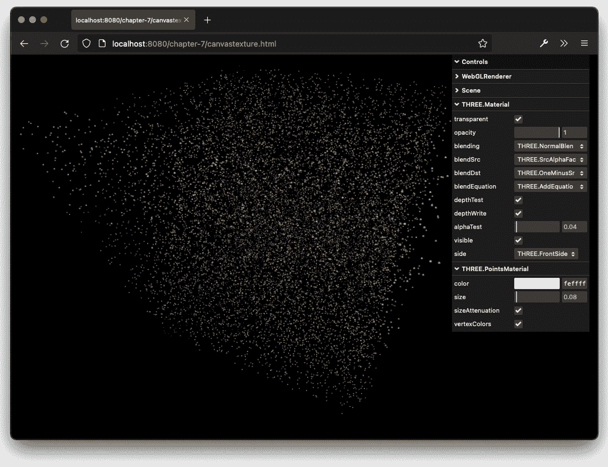

图 7.5 – 同时显示 15,000 个精灵

奇妙的是，即使有 100 万个点，一切仍然渲染得非常平滑（当然，这取决于你运行这些示例的硬件）：

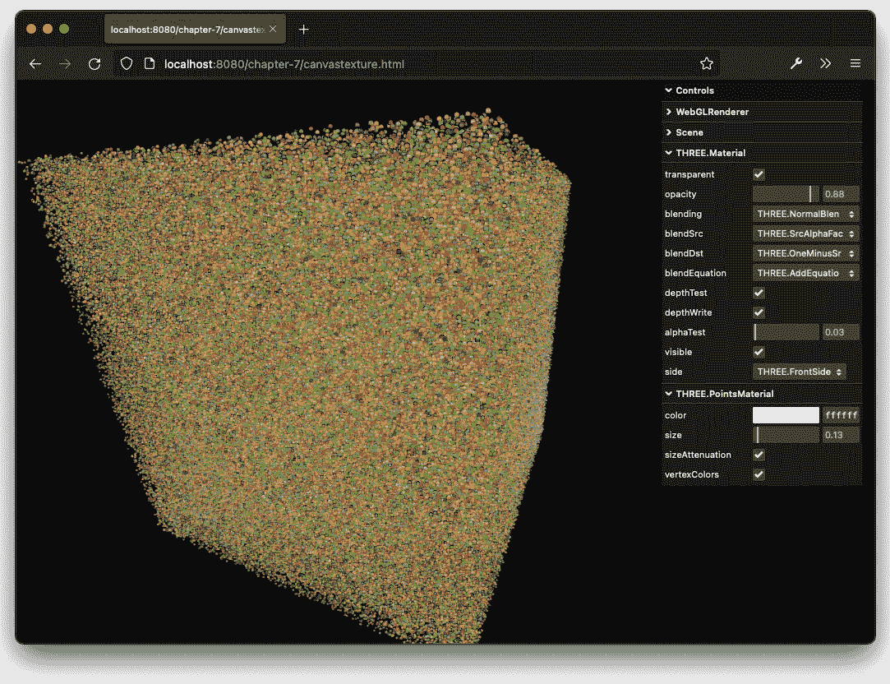

图 7.6 – 同时显示 1 百万个精灵

在下一节中，我们将从外部图像加载一些纹理，并使用这些纹理而不是自己绘制纹理。

## 使用纹理来样式化粒子

在*在画布上绘制图像*部分的示例中，我们看到了如何使用 HTML 画布来样式化`THREE.Points`。由于你可以绘制任何你想要的东西，甚至可以加载外部图像，你可以使用这种方法为粒子系统添加各种样式。然而，有一个更直接的方法来使用图像来样式化你的粒子：你可以使用`THREE.TextureLoader().load()`函数将图像加载为一个`THREE.Texture`对象。这个`THREE.Texture`对象然后可以被分配给材质的`map`属性。

在本节中，我们将展示两个示例，并解释如何创建它们。这两个示例都使用图像作为粒子的纹理。在第一个示例中，我们将创建一个雨的模拟（`rain.html`）：

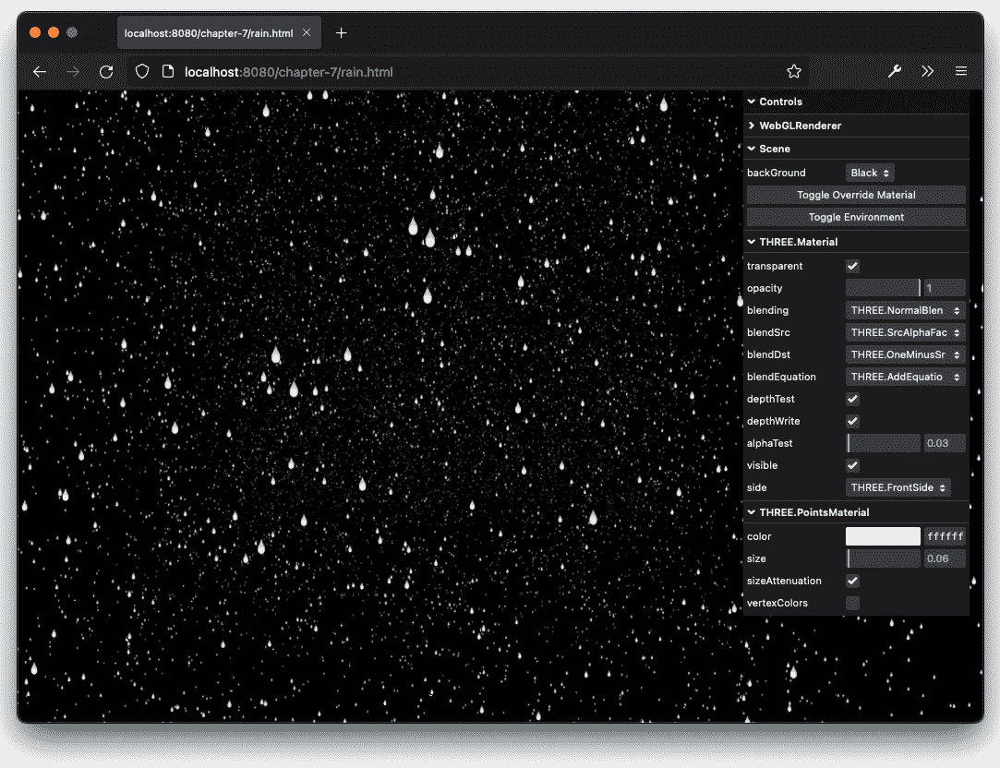

图 7.7 – 模拟雨滴下落

我们需要做的第一件事是获取一个代表我们雨滴的纹理。你可以在 `assets/textures/particles` 文件夹中找到一些示例。在接下来的章节中，我们将解释纹理的所有细节和要求。现在，你需要知道的是，纹理应该是正方形的，最好是 2 的幂（例如，64 x 64、128 x 128 或 256 x 256）。对于这个例子，我们将使用这个纹理：

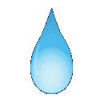

图 7.8 – 雨滴纹理

这个纹理是一个简单的透明图像，显示了雨滴的形状和颜色。在我们能够在 `THREE.PointsMaterial` 中使用这个纹理之前，我们需要加载它。这可以通过以下行代码完成：

```js
const texture = new THREE.TextureLoader().load("../../assets/textures/particles/raindrop-3t.png");
```

使用这一行代码，Three.js 将加载纹理，我们可以在我们的材质中使用它。对于这个例子，我们定义了材质如下：

```js
const material = new THREE.PointsMaterial({
    size: 0.1,
    vertexColors: false,
    color: 0xffffff,
    map: texture,
    transparent: true,
    opacity: 0.8,
    alphaTest: 0.01
  }),
```

在本章中，我们讨论了所有这些属性。这里要理解的主要是 `map` 属性指向我们使用 `THREE.TextureLoader.load` 函数加载的纹理。请注意，我们再次使用了 `alphaTest` 属性，以确保当两个精灵在彼此前面移动时没有奇怪的纹理。

这就处理了 `THREE.Points` 对象的样式。当你打开这个例子时，你还会看到点本身在移动。这样做非常简单。每个点都是一个顶点，它构成了创建 `THREE.Points` 对象所使用的几何形状。让我们看看我们如何为这个 `THREE.Points` 对象添加点：

```js
const count = 25000
const range = 20
const createPoints = () => {
  const points = []
  for (let i = 0; i < count; i++) {
    let particle = new THREE.Vector3(
      Math.random() * range - range / 2,
      Math.random() * range - range / 2,
      Math.random() * range - range / 1.5
    )
    points.push(particle)
  }
  const velocityArray = new Float32Array(count * 2)
  for (let i = 0; i < count * 2; i += 2) {
    velocityArray[i] = ((Math.random() - 0.5) / 5) * 0.1
    velocityArray[i + 1] = (Math.random() / 5) * 0.1 + 0.01
  }
  const geom = new THREE.BufferGeometry().setFromPoints(points)
  geom.setAttribute('velocity', new THREE.BufferAttribute(velocityArray, 2))
  return geom
}
const points = new THREE.Points(geom, material);
```

这与我们在本章中看到的先前的例子并没有太大的不同。在这里，我们为每个粒子添加了一个名为 `velocity` 的属性。这个属性由两个值组成：`velocityX` 和 `velocityY`。第一个值定义了粒子（雨滴）如何水平移动，而第二个值定义了雨滴下落的速度。现在每个雨滴都有自己的速度，我们可以在渲染循环中移动单个粒子：

```js
const positionArray = points.geometry.attributes.position.array
const velocityArray = points.geometry.attributes.velocity.array
for (let i = 0; i < points.geometry.attributes.position.count; i++) {
  const velocityX = velocityArray[i * 2]
  const velocityY = velocityArray[i * 2 + 1]
  positionArray[i * 3] += velocityX
  positionArray[i * 3 + 1] -= velocityY
  if (positionArray[i * 3] <= -(range / 2) || positionArray[i * 3] >= range / 2)
    positionArray[i * 3] = positionArray[i * 3] * -1
  if (positionArray[i * 3 + 1] <= -(range / 2) || positionArray[i * 3 + 1] >= range / 2)
    positionArray[i * 3 + 1] = positionArray[i * 3 + 1] * -1
}
points.geometry.attributes.position.needsUpdate = true
```

在这段代码中，我们从创建 `THREE.Points` 所使用的几何形状中获取所有顶点（粒子）。对于每个粒子，我们取 `velocityX` 和 `velocityY` 并使用它们来改变粒子的当前位置。然后，我们确保粒子保持在定义的范围内。如果 `v.y` 位置下降到 `0` 以下，我们将雨滴重新添加到顶部，如果 `v.x` 位置达到任何边缘，我们将通过反转水平速度使其弹回。最后，我们需要告诉 Three.js 我们在 `bufferGeometry` 中更改了一些内容，这样它下次渲染时就知道正确的值了。

让我们看看另一个例子。这次，我们不会制作雨，而是制作雪。此外，我们不会只使用一个纹理——我们将使用三张单独的图片（来自 Three.js 的示例）。让我们首先看看结果（`snow.html`）：

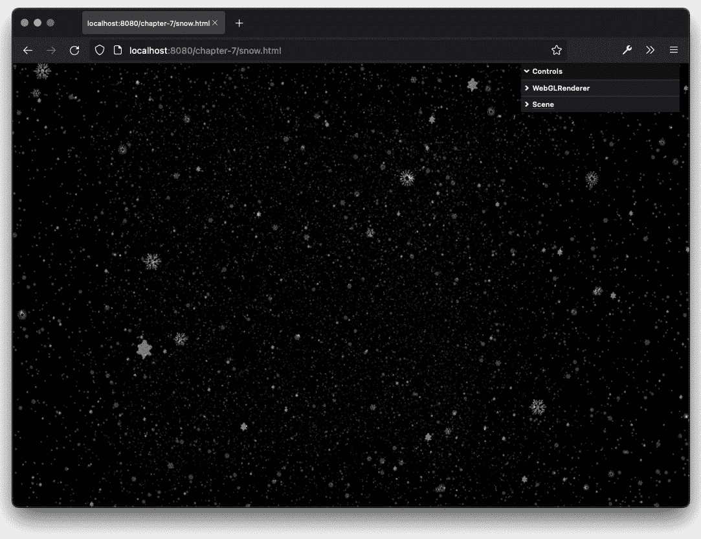

图 7.9 – 基于多个纹理的雪景

在前面的屏幕截图中，如果您仔细观察，可以看到我们并没有只使用单个图像作为纹理，而是使用了具有透明背景的多个图像。您可能想知道我们是如何做到这一点的。如您所记得，我们只能为`THREE.Points`对象使用单个材质。如果我们想使用多个材质，我们只需创建多个`THREE.Points`实例，如下所示：

```js
const texture1 = new THREE.TextureLoader().load
  ('/assets/textures/particles/snowflake4_t.png')
const texture2 = new THREE.TextureLoader().load
  ('/assets/textures/particles/snowflake2_t.png')
const texture3 = new  THREE.TextureLoader().load
  ('/assets/textures/particles/snowflake3_t.png')
const baseProps = {
  size: 0.1,
  color: 0xffffff,
  transparent: true,
  opacity: 0.5,
  blending: THREE.AdditiveBlending,
  depthTest: false,
  alphaTest: 0.01
}
const material1 = new THREE.PointsMaterial({
  ...baseProps,
  map: texture1
})
const material2 = new THREE.PointsMaterial({
  ...baseProps,
  map: texture2
})
const material3 = new THREE.PointsMaterial({
  ...baseProps,
  map: texture3
})
const points1 = new THREE.Points(createPoints(), material1)
const points2 = new THREE.Points(createPoints(), material2)
const points3 = new THREE.Points(createPoints(), material3)
```

在这个代码片段中，您可以看到我们创建了三个不同的`THREE.Points`实例，每个实例都有自己的材质。为了移动雪花，我们使用了与雨相同的方法，因此这里不展示`createPoint`和渲染循环的细节。这里需要注意的是，可以有一个单一的`THREE.Points`实例，其中各个精灵有不同的纹理。然而，这需要自定义的`fragment-shader`和您自己的`THREE.ShaderMaterial`实例。

在我们进入下一节之前，请注意，使用`THREE.Points`是向现有场景添加视觉效果的好方法。例如，我们在前面的例子中看到的雪可以迅速将一个标准场景变成雪景：


图 7.10 – `THREE.Points`与立方体贴图一起

我们可以使用精灵的另一种方式是在现有场景的上方创建一个简单的 2D**抬头显示**（**HUD**）。我们将在下一节中探讨如何做到这一点。

# 使用精灵图

在本章的开头，我们使用了一个`THREE.Sprite`对象来渲染单个点。这些精灵被定位在 3D 世界的某个位置，它们的大小基于与相机的距离（这有时也被称为`THREE.Sprite`对象：我们将向您展示如何使用额外的`THREE.OrthographicCamera`实例和一个额外的`THREE.Scene`来使用`THREE.Sprite`创建一个类似于 HUD 的层，用于您的 3D 内容。我们还将向您展示如何使用精灵图来选择`THREE.Sprite`对象的图像。

作为例子，我们将创建一个简单的`THREE.Sprite`对象，它在屏幕上从左到右移动。在背景中，我们将渲染一个带有相机的 3D 场景，您可以通过移动相机来展示`THREE.Sprite`对象是独立于相机移动的。以下屏幕截图显示了我们将为第一个示例创建的内容（`spritemap.html`）：

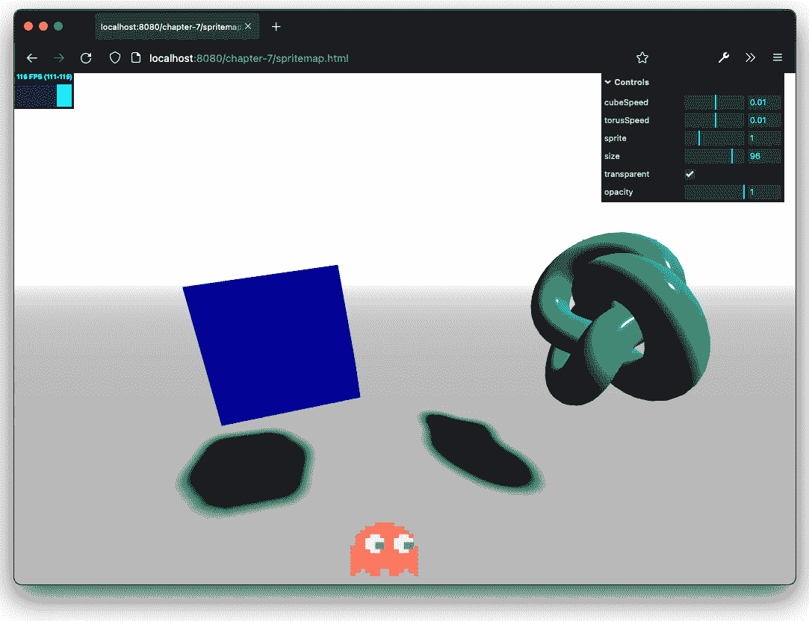

图 7.11 – 使用两个场景和相机创建 HUD

如果您在浏览器中打开这个示例，您会看到一个类似 Pac-Man 幽灵的精灵在屏幕上移动，每当它碰到右边时，它的颜色和形状都会改变。我们首先要做的是看看我们如何创建`THREE.OrthographicCamera`和单独的场景来渲染这个`THREE.Sprite`：

```js
const sceneOrtho = new THREE.Scene()
sceneOrtho.backgroundColor = new THREE.Color(0x000000)
const cameraOrtho = new THREE.OrthographicCamera(0, window.innerWidth, window.innerHeight, 0, -10, 10)
```

接下来，让我们看看如何构建 `THREE.Sprite` 对象以及加载精灵可以采取的各种形状：

```js
const getTexture = () => {
  const texture = new THREE.TextureLoader().load
   ('/assets/textures/particles/sprite-sheet.png')
  return texture
}
const createSprite = (size, transparent, opacity, spriteNumber) => {
  const spriteMaterial = new THREE.SpriteMaterial({
    opacity: opacity,
    color: 0xffffff,
    transparent: transparent,
    map: getTexture()
  })
  // we have 1 row, with five sprites
  spriteMaterial.map.offset = new THREE.Vector2(0.2 * spriteNumber, 0)
  spriteMaterial.map.repeat = new THREE.Vector2(1 / 5, 1)
  // make sure the object is always rendered at the front
  spriteMaterial.depthTest = false
  const sprite = new THREE.Sprite(spriteMaterial)
  sprite.scale.set(size, size, size)
  sprite.position.set(100, 50, -10)
  sprite.velocityX = 5
  sprite.name = 'Sprite'
  sceneOrtho.add(sprite)
}
```

在 `getTexture()` 函数中，我们加载一个纹理。然而，我们不是为每个幽灵加载五张不同的图片，而是加载一个包含所有精灵的单个纹理（也称为精灵图）。作为纹理的图像看起来像这样：

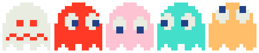

图 7.12 – 输入精灵图

使用 `map.offset` 和 `map.repeat` 属性，我们可以选择屏幕上要显示的正确精灵。使用 `map.offset` 属性，我们确定加载的纹理的 *x 轴*（`u`）和 *y 轴*（`v`）的偏移量。这些属性的缩放范围从 `0` 到 `1`。在我们的例子中，如果我们想选择第三个幽灵，我们必须将 `u` 偏移量（`x 轴`）设置为 `0.4`，因为我们只有一行，所以我们不需要改变 `v` 偏移量（`y 轴`）。如果我们只设置这个属性，纹理会在屏幕上显示压缩在一起的第三个、第四个和第五个幽灵。如果我们只想显示一个幽灵，我们需要放大。我们可以通过将 `map.repeat` 属性的 `u` 值设置为 `1/5` 来做到这一点。这意味着我们只放大（仅针对 `x 轴`）以只显示纹理的 20%，这正好是一个幽灵。

最后，我们需要更新 `render` 函数：

```js
  renderer.render(scene, camera)
  renderer.autoClear = false
  renderer.render(sceneOrtho, cameraOrtho)
```

首先，我们使用普通相机和两个网格渲染场景；然后，我们渲染包含我们的精灵的场景。在渲染循环中，我们还会切换一些属性，以便当精灵碰到右侧墙壁时显示下一个精灵并改变精灵的方向（代码未显示）。

到目前为止，在本章中，我们主要关注从头开始创建精灵和点云。然而，一个有趣的选择是从现有的几何体创建 `THREE.Points`。

# 从现有几何体创建 THREE.Points

如您所回忆的，`THREE.Points` 根据提供的 `THREE.BufferGeometry` 中的顶点渲染每个点。这意味着如果我们提供一个复杂的几何体（例如，环面结或管），我们可以根据该特定几何体的顶点创建 `THREE.Points`。在本章的最后一节中，我们将创建一个环面结，就像我们在 *第六章* 中看到的那样，*探索高级几何体*，并将其渲染为 `THREE.Points` 对象。

我们在 *第六章* 中解释了环面结，所以这里我们不会过多详细说明。下面的屏幕截图显示了示例（`points-from-geom.html`）：

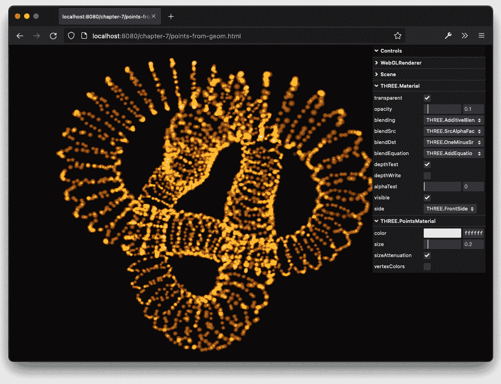

图 7.13 – 以点形式渲染的环面结，带有小动画

如您从前面的屏幕截图中所见，用于生成环面结的每个顶点都用作一个点。我们可以这样设置：

```js
const texture = new THREE.TextureLoader().load('/assets/textures/particles/glow.png')
const geometry = new THREE.TorusKnotGeometry(2, 0.5, 100, 30, 2, 3)
const material = new THREE.PointsMaterial({
    size: 0.2,
    vertexColors: false,
    color: 0xffffff,
    map: texture,
    depthWrite: false,
    opacity: 0.1,
    transparent: true,
    blending: THREE.AdditiveBlending
  })
const points = new THREE.Points(geometry, material)
```

如你所见，我们只是创建了一个几何形状，并将其用作`THREE.Points`对象的输入。这样，我们可以将每个几何形状渲染为点对象。

注意

如果你使用 Three.js 模型加载器（例如，glTF 模型）加载外部模型，你通常会得到一个对象层次结构——通常分组在`THREE.Group`或`THREE.Object3D`对象中。在这些情况下，你必须将每个组中的每个几何形状转换为`THREE.Points`对象。

# 摘要

本章到此结束。我们解释了精灵和点是什么，以及如何使用可用的材质来样式化这些对象。在本章中，你看到了如何直接使用`THREE.Sprite`，以及如果你想要创建大量的粒子，你应该使用一个`THREE.Points`对象。使用`THREE.Points`，所有元素共享相同的材质，你可以为单个粒子更改的唯一属性是其颜色，通过将材质的`vertexColors`属性设置为`true`并在`THREE.BufferGeometry`的`colors`数组中提供一个颜色值来实现，该数组用于创建`THREE.Points`。我们还展示了如何通过改变它们的位置来轻松地动画化粒子。这对于单个`THREE.Sprite`实例以及用于创建`THREE.Points`对象的几何形状的顶点都是一样的。

到目前为止，我们已经创建了基于 Three.js 提供的几何形状的网格。这对于简单的模型，如球体和立方体，效果很好，但当你想要创建复杂的 3D 模型时，这并不是最佳方法。对于这些模型，你通常会使用 3D 建模应用程序，例如 Blender 或 3D Studio Max。在下一章中，你将学习如何加载和显示由这样的 3D 建模应用程序创建的模型。

# 第三部分：粒子云，加载和动画模型

在本第三部分，我们将向你展示如何从外部模型加载数据以及 Three.js 如何支持动画。我们还将深入了解 Three.js 支持的纹理类型以及如何使用它们来增强你的模型。

在这部分，有以下章节：

+   *第八章*，*创建和加载高级网格和几何形状*

+   *第九章*，*动画和移动相机*

+   *第十章*，*加载和使用纹理*
