# 10

# 加载和使用纹理

在*第四章* *使用 Three.js 材质* 中，我们向您介绍了 Three.js 中可用的各种材质。然而，我们没有讨论将纹理应用于创建网格时使用的材质。在本章中，我们将探讨这个主题。具体来说，我们将讨论以下主题：

+   在 Three.js 中加载纹理并将其应用于网格

+   使用凹凸、法线和位移图来为网格应用深度和细节

+   使用光照图和环境遮挡图创建假阴影

+   使用光泽度、金属度和粗糙度图来设置网格特定部分的光泽度

+   为物体的部分透明度应用 alpha 图

+   使用环境图向材质添加详细的反射

+   使用 HTML5 Canvas 和视频元素作为纹理的输入

让我们从最基本的例子开始，我们将向您展示如何加载和应用纹理。

# 在材质中使用纹理

在 Three.js 中，纹理可以使用不同的方式。您可以使用它们来定义网格的颜色，但您也可以使用它们来定义光泽度、凹凸和反射。我们将首先查看一个非常基础的例子，其中我们将使用纹理来定义网格各个像素的颜色。这通常被称为颜色图或漫反射图。

## 加载纹理并将其应用于网格

纹理最基本的使用方式是将其设置为材质上的映射。当您使用这种材质创建网格时，网格将根据提供的纹理进行着色。加载纹理并将其应用于网格可以按以下方式完成：

```js
const textureLoader = new THREE.TextureLoader(); 
const texture = textureLoader.load
  ('/assets/textures/ground/ground_0036_color_1k.jpg')
```

在此代码示例中，我们使用`THREE.TextureLoader`的一个实例从特定位置加载一个图像文件。使用此加载器，您可以将 PNG、GIF 或 JPEG 图像作为纹理的输入（在本章的后面部分，我们将向您展示如何加载其他纹理格式）。请注意，纹理是异步加载的：如果纹理很大，并且在纹理完全加载之前渲染场景，您将短暂地看到没有应用纹理的网格。如果您想等待纹理加载完成，可以向`textureLoader.load()`函数提供一个回调：

```js
Const textureLoader = new THREE.TextureLoader(); 
const texture = textureLoader.load
  ('/assets/textures/ground/ground_0036_color_1k.jpg',
            onLoadFunction, 
            onProgressFunction,
            onErrorFunction)
```

如您所见，`load`函数接受三个额外的函数作为参数：`onLoadFunction`在纹理加载时被调用，`onProgressFunction`可用于跟踪纹理加载的进度，而`onErrorFunction`在加载或解析纹理时出错时被调用。现在纹理已经加载，我们可以将其添加到网格中：

```js
const material = new THREE.MeshPhongMaterial({ color: 
  0xffffff })
material.map = texture
```

注意，加载器还提供了一个`loadAsync`函数，它返回一个`Promise`，就像我们在上一章加载模型时看到的那样。

你几乎可以使用任何你想要的图像作为纹理。然而，使用边长为 2 的幂的平方纹理将获得最佳结果。例如，256 x 256、512 x 512、1,024 x 1,024 等尺寸工作得最好。如果纹理不是 2 的幂，Three.js 将把图像缩小到最接近的 2 的幂值。

我们将在本章的示例中使用的其中一个纹理看起来是这样的：

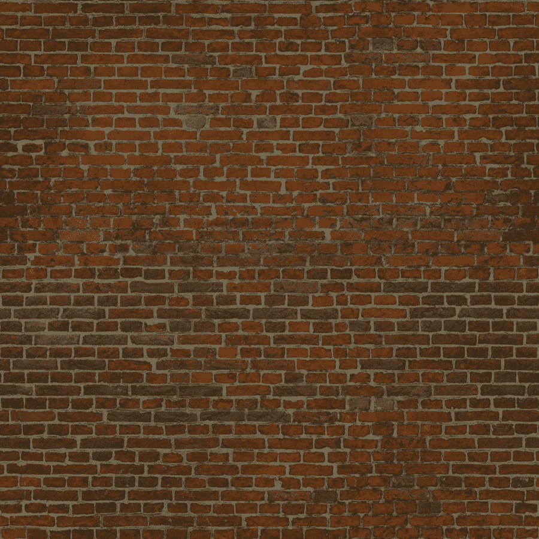

图 10.1 – 砖墙的颜色纹理

纹理的像素（也称为纹理像素）通常不会一对一地映射到面的像素上。如果相机非常靠近，我们需要放大纹理，如果我们缩小了视图，我们可能需要缩小纹理。为此，WebGL 和 Three.js 提供了一些不同的选项来调整图像大小。这是通过`magFilter`和`minFilter`属性来完成的：

+   `THREE.NearestFilter`: 这个过滤器使用它能够找到的最近纹理像素的颜色。当用于放大时，这会导致块状感，而当用于缩小，结果会丢失很多细节。

+   `THREE.LinearFilter`: 这个过滤器更高级；它使用四个相邻的纹理像素的颜色值来确定正确的颜色。在缩小操作中，你仍然会丢失很多细节，但放大将会更加平滑，且块状感更少。

除了这些基本值之外，我们还可以使用**MIP 贴图**。MIP 贴图是一组纹理图像，每个图像的大小是前一个图像的一半。这些图像在加载纹理时创建，允许进行更平滑的过滤。因此，当你有一个平方纹理（作为 2 的幂）时，你可以使用一些额外的策略来获得更好的过滤效果。可以使用以下值来设置属性：

+   `THREE.NearestMipMapNearestFilter`: 这个属性选择最佳的 MIP 贴图来映射所需的分辨率，并应用最近邻滤波原理，这是我们之前列表中讨论过的。放大时仍然会有块状感，但缩小看起来要好得多。

+   `THREE.NearestMipMapLinearFilter`: 这个属性不仅选择单个 MIP 贴图，还选择两个最近的 MIP 贴图级别。在这两个级别上，都应用最近邻滤波器，以获得两个中间结果。这两个结果通过线性滤波器处理以获得最终结果。

+   `THREE.LinearMipMapNearestFilter`: 这个属性选择最佳的 MIP 贴图来映射所需的分辨率，并应用线性滤波原理，这在我们之前的列表中已经讨论过。

+   `THREE.LinearMipMapLinearFilter`: 这个属性不仅选择单个 MIP 贴图，还选择两个最近的 MIP 贴图级别。在这两个级别上，都应用线性滤波器，以获得两个中间结果。这两个结果通过线性滤波器处理以获得最终结果。

如果你没有明确指定`magFilter`和`minFilter`属性，Three.js 将使用`THREE.LinearFilter`作为`magFilter`属性的默认值，并将`THREE.LinearMipMapLinearFilter`作为`minFilter`属性的默认值。

在我们的例子中，我们将仅使用默认的纹理属性。一个这样的基本纹理作为材料映射的例子可以在`texture-basics.html`中找到。以下截图显示了此示例：

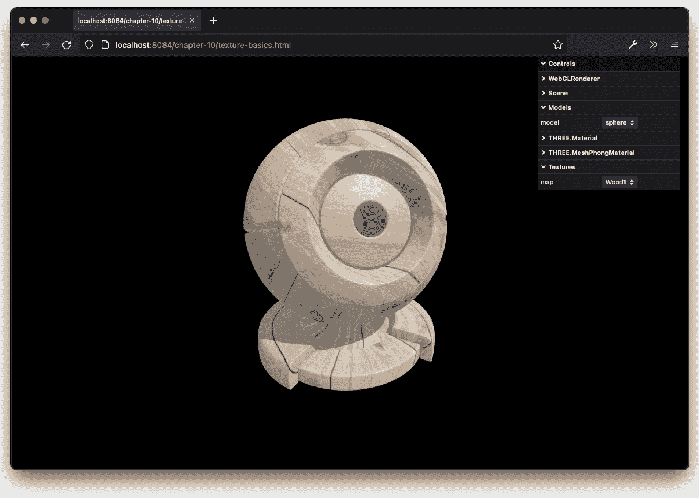

图 10.2 – 带有简单木纹的模型

在这个例子中，你可以更改模型并从右侧菜单中选择几个纹理。你还可以更改默认的材料属性，以查看材料在结合颜色图的情况下如何受到不同设置的影响。

在这个例子中，你可以看到纹理很好地包裹在形状周围。当你使用 Three.js 创建几何体时，它会确保任何使用的纹理都正确应用。这是通过称为 UV 映射的方法完成的。通过 UV 映射，我们可以告诉渲染器纹理的哪个部分应该应用到特定的面上。我们将在*第十三章*“使用 Blender 和 Three.js”的详细内容中介绍 UV 映射，我们将向你展示如何轻松使用 Blender 为 Three.js 创建自定义 UV 映射。

除了我们可以使用`THREE.TextureLoader`加载的标准图像格式之外，Three.js 还提供了一些自定义加载器，你可以使用这些加载器加载不同格式的纹理。如果你有特定的图像格式，你可以查看 Three.js 发行版的`loaders`文件夹（[`github.com/mrdoob/three.js/tree/dev/examples/jsm/loaders`](https://github.com/mrdoob/three.js/tree/dev/examples/jsm/loaders)），以查看该图像格式是否可以直接由 Three.js 加载，或者你是否需要手动转换它。

除了这些普通图像之外，Three.js 还支持 HDR 图像。

### 将 HDR 图像作为纹理加载

HDR 图像捕捉了比标准图像更高的亮度级别，可以更接近我们用肉眼看到的效果。Three.js 支持`EXR`和`RGBE`格式。如果你有一个 HDR 图像，你可以通过在`THREE.WebGLRenderer`中设置以下属性来微调 Three.js 渲染 HDR 图像的方式，因为 HDR 图像包含比显示器上显示的更多亮度信息。

+   `toneMapping`：此属性定义了如何将 HDR 图像的颜色映射到显示。Three.js 提供了以下选项：`THREE.NoToneMapping`、`THREE.LinearToneMapping`、`THREE.ReinhardToneMapping`、`THREE.Uncharted2ToneMapping`和`THREE.CineonToneMapping`。默认为`THREE.LinearToneMapping`。

+   `toneMappingExposure`：这是`toneMapping`的曝光级别。这可以用来微调渲染纹理的颜色。

+   `toneMappingWhitePoint`：这是用于 `toneMapping` 的白点。这也可以用来微调渲染纹理的颜色。

如果你想要加载一个 EXR 或 RGBE 图像并将其用作纹理，你可以使用 `THREE.EXRLoader` 或 `THREE.RGBELoader`。这与我们所看到的 `THREE.TextureLoader` 的方式相同：

```js
const loader = new THREE.EXRLoader(); 
exrTextureLoader.load('/assets/textures/exr/Rec709.exr')
...
const hdrTextureLoader = new THREE.RGBELoader(); 
hdrTextureLoader.load('/assets/textures/hdr/
  dani_cathedral_oBBC.hdr')
```

在 `texture-basics.html` 示例中，我们向你展示了如何使用纹理将颜色应用到网格上。在下一节中，我们将探讨如何通过将假高度信息应用到网格上来使用纹理使模型看起来更加详细。

## 使用凹凸贴图向网格提供额外细节

凹凸贴图用于向材质添加更多深度。你可以通过打开 `texture-bump-map.html` 来看到这个效果：

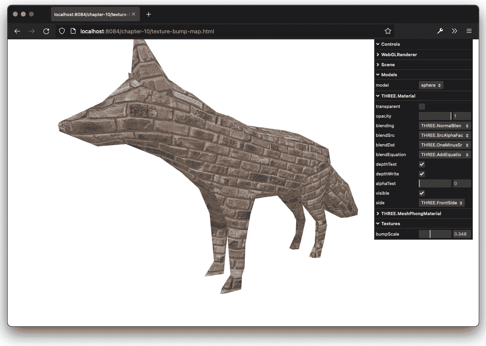

图 10.3 – 带凹凸贴图的模型

在这个例子中，你可以看到模型看起来更加详细，似乎有更多的深度。这是通过在材质上设置一个额外的纹理，即所谓的凹凸贴图来实现的：

```js
const exrLoader = new EXRLoader()
const colorMap = exrLoader.load('/assets/textures/brick-wall/brick_wall_001_diffuse_2k.exr', (texture) => {
  texture.wrapS = THREE.RepeatWrapping
  texture.wrapT = THREE.RepeatWrapping
  texture.repeat.set(4, 4)
})
const bumpMap = new THREE.TextureLoader().load(
  '/assets/textures/brick-wall/brick_wall_001_displacement_2k.png',
  (texture) => {
    texture.wrapS = THREE.RepeatWrapping
    texture.wrapT = THREE.RepeatWrapping
    texture.repeat.set(4, 4)
  }
)
const material = new THREE.MeshPhongMaterial({ color: 
  0xffffff })
material.map = colorMap
material.bumpMap = bumpMap
```

在此代码中，你可以看到，除了设置映射属性外，我们还设置了 `bumpMap` 属性到一个纹理。此外，通过前一个示例中的菜单，我们可以使用 `bumpScale` 属性设置凹凸的高度（或如果设置为负值，则为深度）。本例中使用的纹理在此处显示：

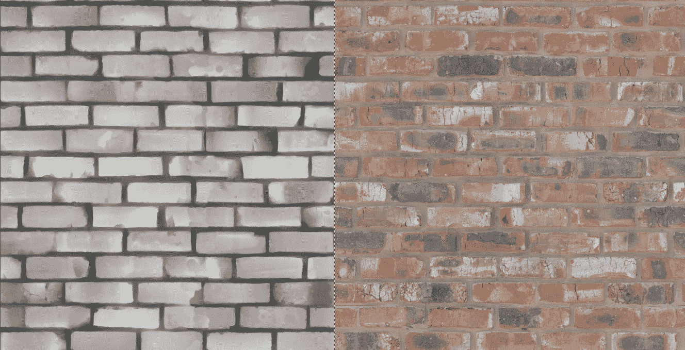

图 10.4 – 用于凹凸贴图的纹理

凹凸贴图是一个灰度图像，但你也可以使用彩色图像。像素的强度定义了凹凸的高度。凹凸贴图只包含像素的相对高度。它没有说明斜坡的方向。因此，使用凹凸贴图可以达到的细节水平和深度感知是有限的。对于更详细的信息，你可以使用法线贴图。

## 使用法线贴图实现更详细的凹凸和皱纹

在法线贴图中，高度（位移）没有存储，但每个像素的法线方向被存储。不深入细节的话，使用法线贴图，你可以创建看起来非常详细的模型，而这些模型只使用了少量顶点和面。例如，看看 `texture-normal-map.html` 示例：

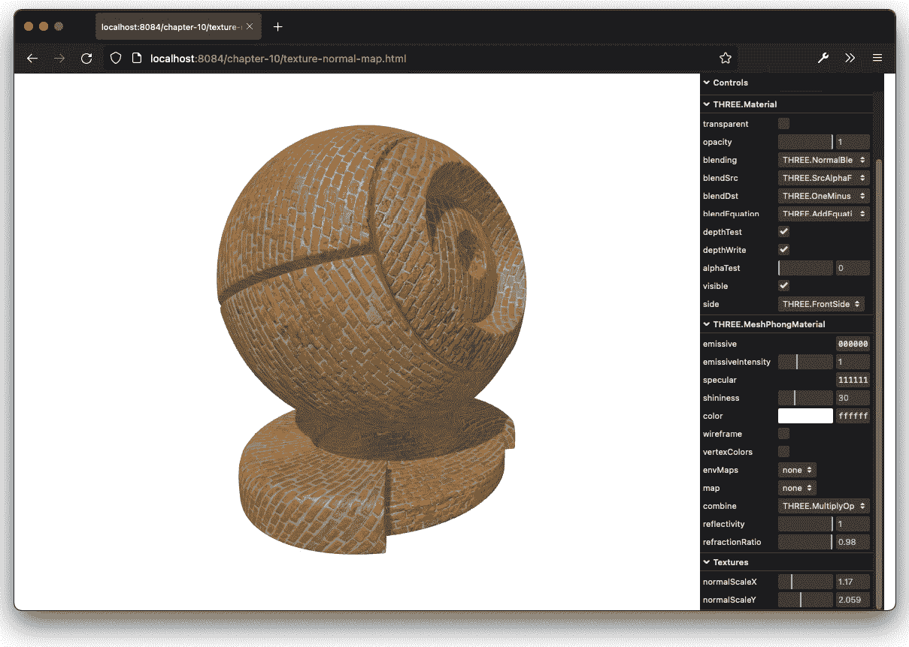

图 10.5 – 使用法线贴图的模型

在前面的屏幕截图中，你可以看到一个看起来非常详细的模型。当模型移动时，你可以看到纹理正在响应它接收到的光线。这提供了一个看起来非常逼真的模型，并且只需要一个非常简单的模型和几个纹理。以下代码片段展示了如何在 Three.js 中使用法线贴图：

```js
const colorMap = new THREE.TextureLoader().load('/assets/textures/red-bricks/red_bricks_04_diff_1k.jpg', (texture) => {
  texture.wrapS = THREE.RepeatWrapping
  texture.wrapT = THREE.RepeatWrapping
  texture.repeat.set(4, 4)
})
const normalMap = new THREE.TextureLoader().load(
  '/assets/textures/red-bricks/red_bricks_04_nor_gl_1k.jpg',
  (texture) => {
    texture.wrapS = THREE.RepeatWrapping
    texture.wrapT = THREE.RepeatWrapping
    texture.repeat.set(4, 4)
  }
)
const material = new THREE.MeshPhongMaterial({ color: 
  0xffffff })
material.map = colorMap
material.normalMap = normalMap
```

这涉及到与我们用于凹凸贴图相同的方法。不过，这次我们将 `normalMap` 属性设置为正常纹理。我们还可以通过设置 `normalScale` 属性（`mat.normalScale.set(1,1)`）来定义凹凸的明显程度。使用这个属性，你可以沿着 *X* 和 *Y* 轴进行缩放。然而，最好的方法是将这些值保持相同。在这个例子中，你可以尝试调整这些值。

下一个图展示了我们使用的正常贴图的样子：


图 10.6 – 正常纹理

然而，正常贴图的问题在于它们并不容易创建。你需要使用专门的工具，如 Blender 或 Photoshop。这些程序可以使用高分辨率的渲染或纹理作为输入，并从中创建正常贴图。

使用正常或凹凸贴图时，你不会改变模型的形状；所有的顶点都保持在相同的位置。这些贴图只是使用场景中的灯光来创建假深度和细节。然而，Three.js 提供了第三种方法，你可以使用它通过贴图添加细节到模型中，这种方法会改变顶点的位置。这是通过位移图实现的。

## 使用位移图来改变顶点的位置

Three.js 还提供了一个纹理，你可以用它来改变模型顶点的位置。虽然凹凸贴图和正常贴图可以产生深度错觉，但使用位移图时，我们根据纹理信息改变模型的形状。我们可以像使用其他贴图一样使用位移图：

```js
const colorMap = new THREE.TextureLoader().load('/assets/textures/displacement
  /w_c.jpg', (texture) => {
  texture.wrapS = THREE.RepeatWrapping
  texture.wrapT = THREE.RepeatWrapping
})
const displacementMap = new THREE.TextureLoader().load('/assets/textures/displacement
  /w_d.png', (texture) => {
  texture.wrapS = THREE.RepeatWrapping
  texture.wrapT = THREE.RepeatWrapping
})
const material = new THREE.MeshPhongMaterial({ color: 
  0xffffff })
material.map = colorMap
material.displacementMap = displacementMap
```

在前面的代码片段中，我们加载了一个位移图，其外观如下：

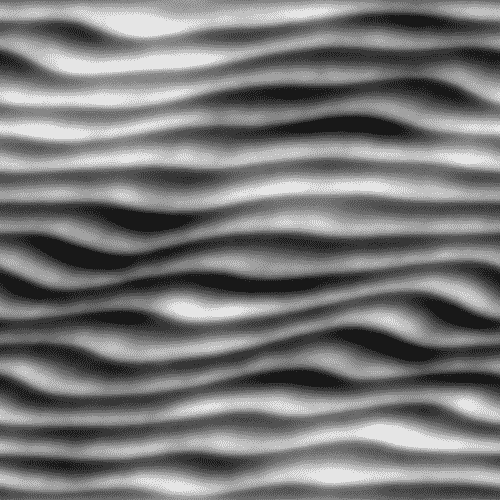

图 10.7 – 位移图

颜色越亮，顶点的位移就越大。当你运行 `texture-displacement.html` 示例时，你会看到位移贴图的结果是一个模型，其形状基于贴图中的信息发生变化：

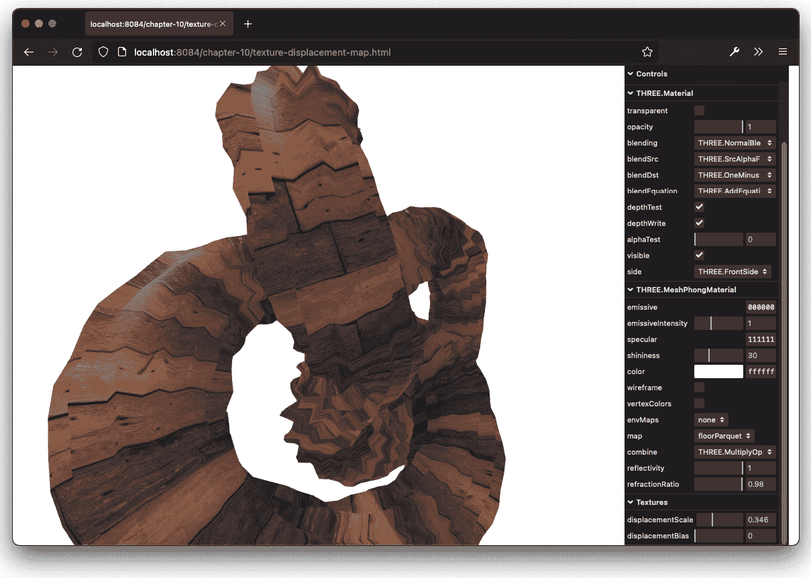

图 10.8 – 使用位移图建模

除了设置 `displacementMap` 纹理外，我们还可以使用 `displacementScale` 和 `displacementOffset` 来控制位移的明显程度。关于使用位移图还有一点要提，那就是它只有在你的网格包含大量顶点时才会得到良好的效果。如果不是这样，位移看起来就不会像提供的纹理，因为顶点太少，无法表示所需的位移。

## 使用环境遮蔽贴图添加微妙的阴影

在前面的章节中，你学习了如何在 Three.js 中使用阴影。如果你设置了正确网格的 `castShadow` 和 `receiveShadow` 属性，添加了一些灯光，并正确配置了灯光的阴影相机，Three.js 将渲染阴影。

然而，渲染阴影是一个相对昂贵的操作，它会在每个渲染循环中重复进行。如果你有移动的灯光或对象，这是必要的，但通常，一些灯光或模型是固定的，所以如果我们能计算一次阴影并重复使用它们，那就太好了。为了实现这一点，Three.js 提供了两种不同的图：环境光遮蔽图和光照图。在本节中，我们将探讨环境光遮蔽图，在下一节中，我们将探讨光照图。

环境光遮蔽是一种技术，用于确定模型每个部分在场景中的环境光照中暴露的程度。在 Blender 等工具中，环境光通常通过半球光或方向光，如太阳光来模拟。虽然模型的大部分区域都会接收到一些这种环境光照，但并非所有部分都会接收到相同的光照。例如，如果你建模一个人，头顶会比手臂底部接收到更多的环境光照。这种光照差异——即阴影——可以被渲染（烘焙，如以下截图所示）成纹理，然后我们可以将这个纹理应用到我们的模型上，以给它们添加阴影，而不必每次都计算阴影：


图 10.9 – 在 Blender 中烘焙的环境光遮蔽图

一旦你有了环境光遮蔽图，你可以将其分配给材质的`aoMap`属性，Three.js 将考虑这个信息在应用和计算场景中灯光应该应用到模型特定部分的程度。以下代码片段显示了如何设置`aoMap`属性：

```js
const aoMap = new THREE.TextureLoader().load('/assets/gltf/material_
  ball_in_3d-coat/aoMap.png')
const material = new THREE.MeshPhongMaterial({ color: 
  0xffffff })
material.aoMap = aoMap
material.aoMap.flipY = false
```

就像其他类型的纹理图一样，我们只需使用`THREE.TextureLoader`来加载纹理并将其分配给材质的正确属性。并且像许多其他图一样，我们也可以通过设置`aoMapIntensity`属性来调整地图对模型光照的影响程度。在这个例子中，你还可以看到我们需要将`aoMap`的`flipY`属性设置为 false。有时，外部程序以 Three.js 期望的纹理略有不同的方式存储材质。使用这个属性，我们可以翻转纹理的方向。这通常是在与模型一起工作时通过试错法注意到的事情。

要使环境遮挡贴图生效，我们通常需要额外一步。我们已经提到了 UV 映射（存储在 `uv` 属性中）。这些定义了纹理的哪一部分被映射到模型的特定面。对于环境遮挡贴图，以及以下示例中的光照贴图，Three.js 使用一组独立的 UV 映射（存储在 `uv2` 属性中），因为通常其他纹理需要以不同于阴影和光照贴图纹理的方式应用。在我们的示例中，我们只是复制了模型的 UV 映射；记住，当我们使用 `aoMap` 属性或 `lightMap` 属性时，Three.js 将使用 `uv2` 属性的值，而不是 `uv` 属性的值。如果加载的模型中没有这个属性，通常只需复制 `uv` 映射属性即可，因为我们没有对环境遮挡贴图进行任何优化，这可能需要不同的 UV 集合：

```js
const k = mesh.geometry
const uv1 = k.getAttribute('uv')
const uv2 = uv1.clone()
k.setAttribute('uv2', uv2)
```

我们将提供两个示例，展示我们如何使用环境遮挡贴图。在第一个示例中，我们展示了应用了 `aoMap` 的 *图 10.9* 中的模型（`texture-ao-map-model.html`）：

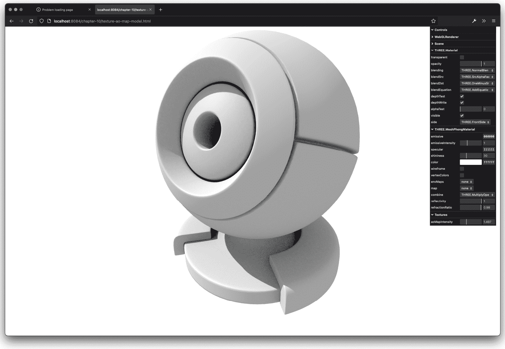

图 10.10 – 在 Blender 中烘焙的环境遮挡贴图然后应用于模型

您可以使用右侧的菜单设置 `aoMapIntensity`。此值越高，您将看到从加载的 `aoMap` 纹理中产生的阴影就越多。如您所见，拥有环境遮挡贴图非常有用，因为它为模型提供了丰富的细节，并使其看起来更加逼真。在本章中我们已经看到的一些纹理也提供了额外的 `aoMap`，您可以使用它。如果您打开 `texture-ao-map.html`，您将得到一个简单的砖块状纹理，但这次添加了 `aoMap`：

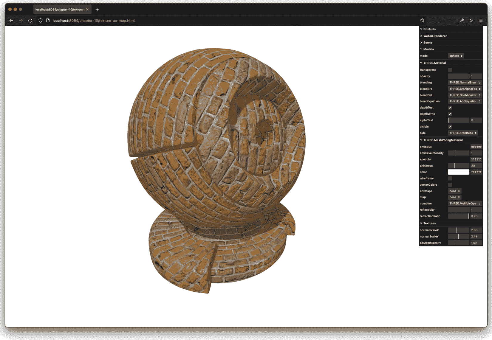

图 10.11 – 环境遮挡贴图与颜色和法线贴图结合

当环境遮挡贴图改变模型某些部分接收到的光照量时，Three.js 还支持 `lightmap`，它通过指定一个映射来为模型的某些部分添加额外的光照，从而产生相反的效果（大约是这样）。

## 使用光照贴图创建假光照

在本节中，我们将使用光照贴图。光照贴图是一种包含场景中灯光对模型影响程度信息的纹理。换句话说，灯光的效果被烘焙到纹理中。光照贴图在 3D 软件中烘焙，如 Blender，并包含模型每个部分的光照值：

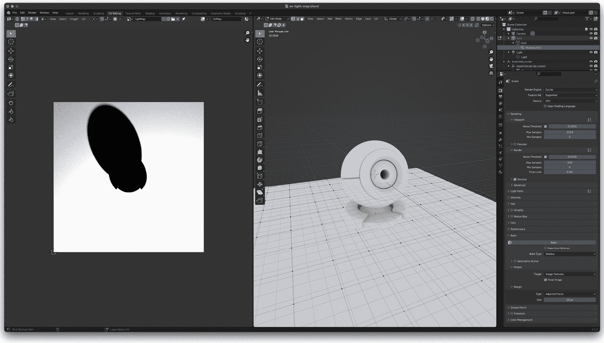

图 10.12 – 在 Blender 中烘焙的光照贴图

在本例中我们将使用的光照贴图如图*图 10.12*所示。编辑窗口的右侧显示了地平面的烘焙光照贴图。你可以看到整个地平面都被白色光照亮，而其中一部分接收到的光线较少，因为场景中还有一个模型。使用光照贴图的代码与使用环境遮挡贴图的代码类似：

```js
Const textureLoader = new THREE.TextureLoader()
const colorMap = textureLoader.load('/assets/textures/wood/
  abstract-antique-backdrop-164005.jpg')
const lightMap = textureLoader.load('/assets/gltf/
  material_ball_in_3d-coat/lightMap.png')
const material = new THREE.MeshBasicMaterial({ color: 
  0xffffff })
material.map = colorMap
material.lightMap = lightMap
material.lightMap.flipY = false
```

一次又一次，我们需要为 Three.js 提供一组额外的`uv`值，称为`uv2`（代码中未显示），并且我们必须使用`THREE.TextureLoader`来加载纹理——在这种情况下，使用了一个简单的纹理来表示地板的颜色和 Blender 为这个示例创建的光照贴图。结果如下（`texture-light-map.html`）:

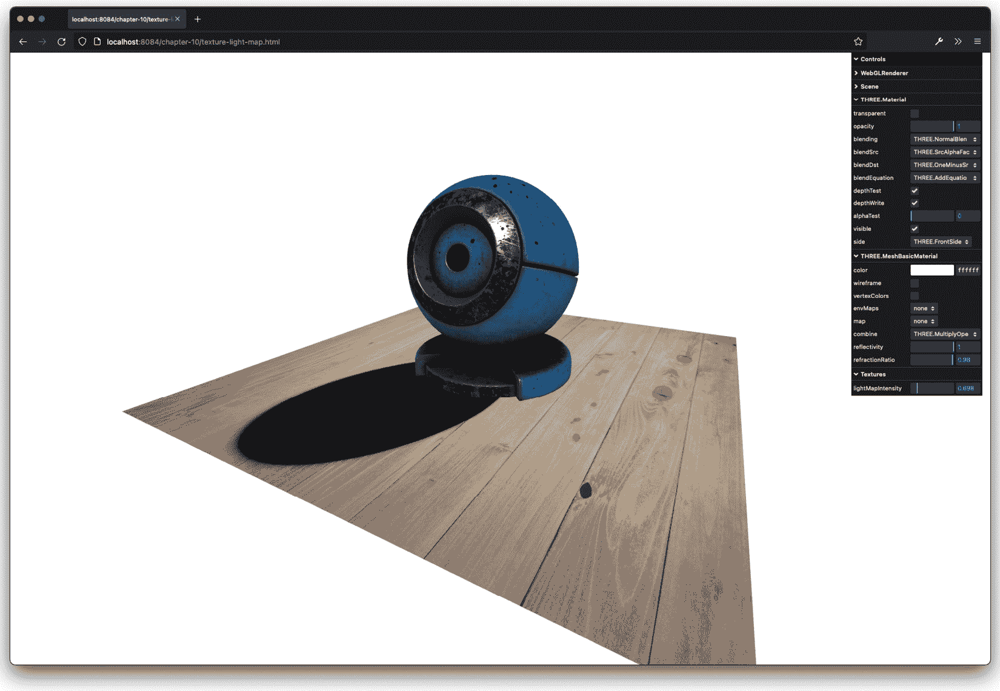

图 10.13 – 使用光照贴图创建假阴影

如果你查看前面的示例，你会看到光照贴图的信息被用来创建一个非常漂亮的阴影，这个阴影看起来像是模型投射的。重要的是要记住，烘焙阴影、灯光和环境遮挡在静态场景和静态物体中效果很好。一旦物体或光源发生变化或开始移动，你就必须实时计算阴影。

## 金属度和粗糙度贴图

当讨论 Three.js 中可用的材质时，我们提到一个好的默认材质是`THREE.MeshStandardMaterial`。你可以使用它来创建闪亮的金属材质，也可以应用粗糙度，使网格看起来更像木材或塑料。通过使用材质的金属度和粗糙度属性，我们可以配置材质以表示我们想要的材质。除了这两个属性之外，你还可以通过使用纹理来配置这些属性。因此，如果我们有一个粗糙的物体，并且我们想要指定该物体的某个部分是闪亮的，我们可以设置`THREE.MeshStandardMaterial`的`metalnessMap`属性，如果我们想要表明网格的某些部分应该被视为刮痕或更粗糙，我们可以设置`roughnessMap`属性。当你使用这些贴图时，模型特定部分的纹理值将被乘以`粗糙度`属性或`金属度`属性，这决定了该特定像素应该如何渲染。首先，我们将查看`texture-metalness-map.html`中的`金属度`属性：

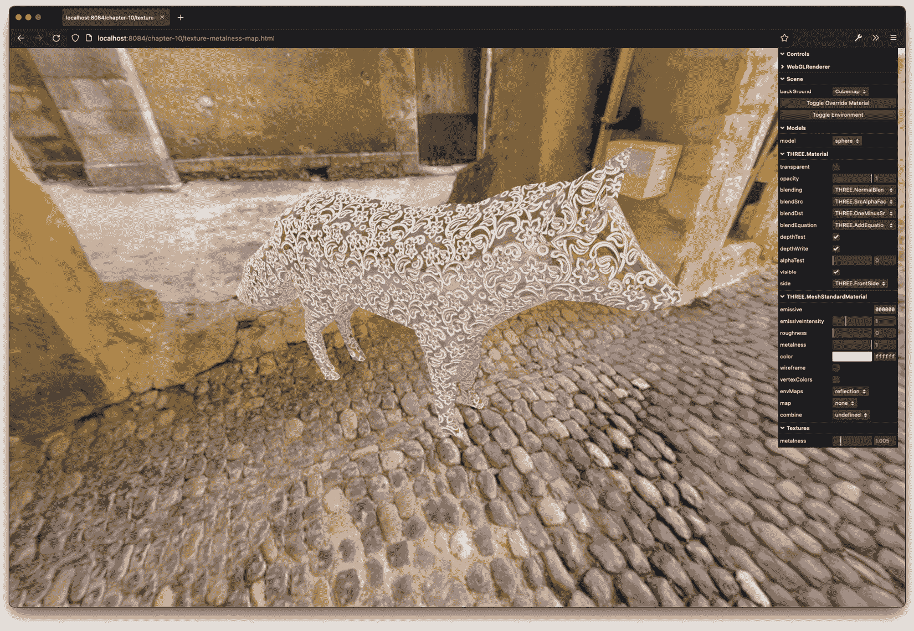

图 10.14 – 应用到模型上的金属度纹理

在本例中，我们提前了一步，并且还使用了一个环境贴图，这允许我们在对象上渲染来自环境的反射。具有高金属度的对象反射更多，而具有高粗糙度的对象则更多地散射反射。对于此模型，我们使用了 `metalnessMap`；您可以看到，当纹理中的 `metalness` 属性值高时，物体本身是闪亮的，而当 `metalness` 属性值低时，某些部分是粗糙的。当查看 `roughnessMap` 时，我们可以看到几乎相同但相反的情况：

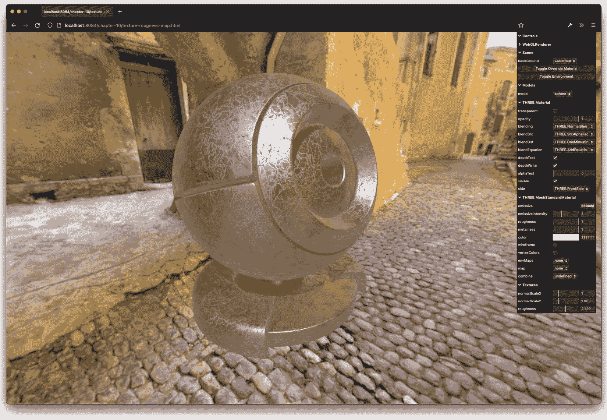

图 10.15 – 应用到模型上的粗糙度纹理

如您所见，基于提供的纹理，模型的某些部分比其他部分更粗糙或更刮痕。对于 `metalnessMap`，材料的值乘以材料的 `metalness` 属性；对于 `roughnessMap`，同样适用，但在此情况下，值乘以 `roughness` 属性。

加载这些纹理并将它们设置为材质可以这样做：

```js
const metalnessTexture = new THREE.TextureLoader().load(
  '/assets/textures/engraved/Engraved_Metal_003_ROUGH.jpg',
  (texture) => {
    texture.wrapS = THREE.RepeatWrapping
    texture.wrapT = THREE.RepeatWrapping
    texture.repeat.set(4, 4)
  }
)
const material = new THREE.MeshStandardMaterial({ color: 
  0xffffff })
material.metalnessMap = metalnessTexture
...
const roughnessTexture = new THREE.TextureLoader().load(
  '/assets/textures/marble/marble_0008_roughness_2k.jpg',
  (texture) => {
    texture.wrapS = THREE.RepeatWrapping
    texture.wrapT = THREE.RepeatWrapping
    texture.repeat.set(2, 2)
  }
)
const material = new THREE.MeshStandardMaterial({ color: 
  0xffffff })
material.roughnessMap = roughnessTexture
```

接下来是 Alpha 映射。使用 Alpha 映射，我们可以使用纹理来改变模型部分的不透明度。

## 使用 Alpha 映射创建透明模型

Alpha 映射是一种控制表面不透明度的方法。如果映射的值为黑色，则该模型的部分将完全透明，如果为白色，则将完全不透明。在我们查看纹理及其应用方法之前，我们首先来看一个示例（`texture-alpha-map.html`）：

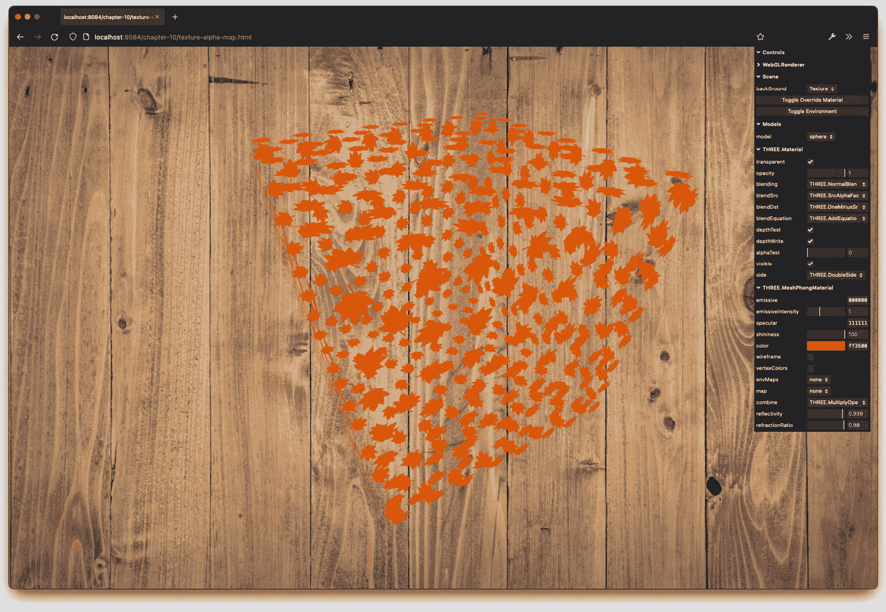

图 10.16 – 用于提供部分透明度的 Alpha 映射

在这个示例中，我们渲染了一个立方体并设置了材质的 `alphaMap` 属性。如果您打开这个示例，请确保将材质的 `transparency` 属性设置为 `true`。您可能会注意到，您只能看到立方体的正面部分，与前面的截图不同，您可以通过立方体看到另一面。原因是，默认情况下，使用的材质的侧面属性设置为 `THREE.FrontSide`。要渲染通常隐藏的侧面，我们必须将材质的侧面属性设置为 `THREE.DoubleSide`；您将看到立方体被渲染成前面的截图所示的样子。

在本例中我们使用的纹理是一个非常简单的：


图 10.17 – 用于创建透明模型的纹理

要加载它，我们必须使用与其他纹理相同的方法：

```js
const alphaMap = new THREE.TextureLoader().load('/assets/
  textures/alpha/partial-transparency.png', (texture) => {
  texture.wrapS = THREE.RepeatWrapping
  texture.wrapT = THREE.RepeatWrapping
  texture.repeat.set(4, 4)
})
const material = new THREE.MeshPhongMaterial({ color: 
  0xffffff })
material.alphaMap = alphaMap
material.transparent = true
```

在这个代码片段中，你还可以看到我们设置了纹理的`wrapS`、`wrapT`和`repeat`属性。我们将在本章后面更详细地解释这些属性，但可以使用这些属性来确定我们希望在网格上重复纹理的频率。如果设置为`(1, 1)`，则整个纹理在应用于网格时不会重复；如果设置为更高的值，则纹理会缩小并重复多次。在这种情况下，我们在两个方向上重复了四次。

## 为发光模型使用发射贴图

发射贴图是一种可以用来使模型的某些部分发光的纹理，就像发射属性对整个模型所做的那样。就像发射属性一样，使用发射贴图并不意味着这个物体正在发光——它只是使应用了此纹理的模型部分看起来像在发光。通过查看一个例子可以更容易地理解这一点。如果你在浏览器中打开`texture-emissive-map.html`示例，你会看到一个类似火山的物体：

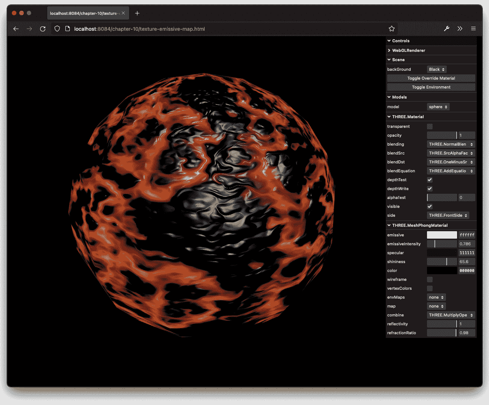

图 10.18 – 使用发射贴图的类似火山物体

当你仔细观察时，你可能会发现，尽管物体看起来在发光，但物体本身并不发光。这意味着你可以用这个方法来增强物体，但物体本身并不对场景的照明做出贡献。在这个例子中，我们使用了一个看起来如下所示的发射贴图：

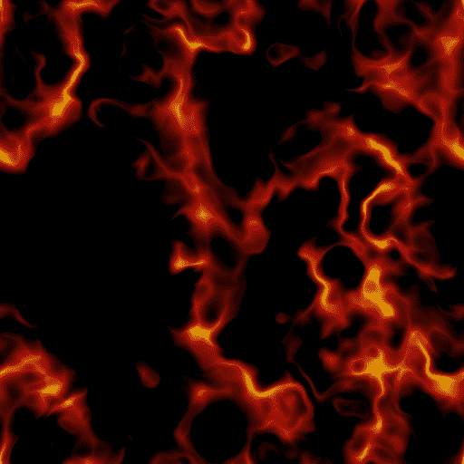

图 10.19 – 火山纹理

要加载和使用发射贴图，我们可以使用`THREE.TextureLoader`加载一个并将其分配给`emissiveMap`属性（以及一些其他贴图以显示*图 10.18*中的模型）：

```js
const emissiveMap = new   THREE.TextureLoader().load
  ('/assets/textures/lava/lava.png', (texture) => {
  texture.wrapS = THREE.RepeatWrapping
  texture.wrapT = THREE.RepeatWrapping
  texture.repeat.set(4, 4)
})
const roughnessMap = new THREE.TextureLoader().load
  ('/assets/textures/lava/lava-smoothness.png', (texture) => {
  texture.wrapS = THREE.RepeatWrapping
  texture.wrapT = THREE.RepeatWrapping
  texture.repeat.set(4, 4)
})
const normalMap = new THREE.TextureLoader().load
  ('/assets/textures/lava/lava-normals.png', (texture) => {
  texture.wrapS = THREE.RepeatWrapping
  texture.wrapT = THREE.RepeatWrapping
  texture.repeat.set(4, 4)
})
const material = new THREE.MeshPhongMaterial({ color: 
  0xffffff })
material.normalMap = normalMap
material.roughnessMap = roughnessMap
material.emissiveMap = emissiveMap
material.emissive = new THREE.Color(0xffffff)
material.color = new THREE.Color(0x000000)
```

由于`emissiveMap`中的颜色与发射属性相调制，请确保将材质的`emissive`属性设置为非黑色。

## 使用反射贴图确定闪亮度

在之前的例子中，我们主要使用了`THREE.MeshStandardMaterial`，以及该材质支持的不同贴图。如果你需要材质，`THREE.MeshStandardMaterial`通常是你的最佳选择，因为它可以轻松配置以表示大量不同类型的真实世界材质。在 Three.js 的旧版本中，你必须使用`THREE.MeshPhongMaterial`来创建闪亮的材质，使用`THREE.MeshLambertMaterial`来创建非闪亮的材质。本节中使用的反射贴图只能与`THREE.MeshPhongMaterial`一起使用。使用反射贴图，你可以定义模型的哪些部分应该是闪亮的，以及哪些部分应该是粗糙的（类似于我们之前看到的`metalnessMap`和`roughnessMap`）。在`texture-specular-map.html`示例中，我们渲染了地球，并使用反射贴图使海洋比陆地更闪亮：


图 10.20 – 显示反射海洋的镜面图

通过使用右上角的菜单，你可以调整镜面颜色和亮度。正如你所看到的，这两个属性会影响海洋反射光的方式，但它们不会改变陆地部分的亮度。这是因为我们使用了以下镜面图：


图 10.21 – 镜面图纹理

在这个图中，黑色表示图中这些部分的亮度为 0%，而白色部分亮度为 100%。

要使用镜面图，我们必须使用`THREE.TextureLoader`来加载图并将其分配给`THREE.MathPhongMaterial`的`specularMap`属性：

```js
const colorMap = new THREE.TextureLoader().load
  ('/assets/textures/specular/Earth.png')
const specularMap = new THREE.TextureLoader().load
  ('/assets/textures/specular/EarthSpec.png')
const normalMap = new THREE.TextureLoader().load
  ('/assets/textures/specular/EarthNormal.png')
const material = new THREE.MeshPhongMaterial({ color: 
  0xffffff })
material.map = colorMap
material.specularMap = specularMap
material.normalMap = normalMap
```

通过镜面图，我们已经讨论了你可以用来为你的模型添加深度、颜色、透明度或额外光照效果的大多数基本纹理。在接下来的两个部分中，我们将探讨另一种类型的图，这将允许你为你的模型添加环境反射。

## 使用环境图创建伪造的反射

计算环境反射非常耗费 CPU 资源，通常需要使用光线追踪方法。如果你想在 Three.js 中使用反射，你仍然可以这样做，但你需要伪造它。你可以通过创建一个包含对象所在环境的纹理并将其应用到特定对象上来实现这一点。首先，我们将向您展示我们期望的结果（参见`texture-environment-map.html`，如下截图所示）：

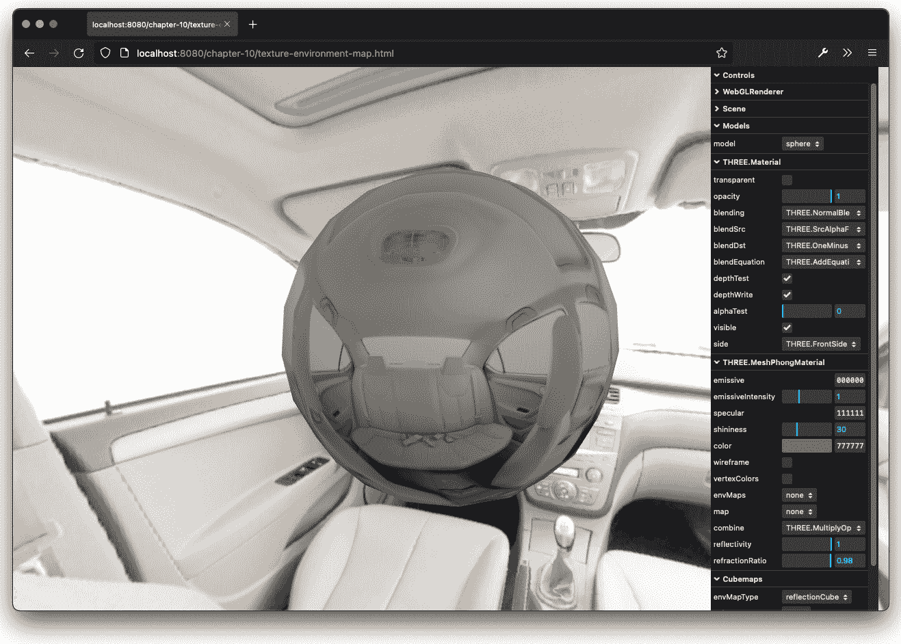

图 10.22 – 显示汽车内部的纹理图

在前面的截图中，你可以看到球体反射了环境。如果你移动鼠标，你也会看到反射与相机角度相对应，考虑到你所看到的环境。要创建这个示例，请执行以下步骤：

1.  创建一个`CubeTexture`对象。`CubeTexture`是一组可以应用于立方体每个面的六个纹理。

1.  设置天空盒。当我们有一个`CubeTexture`时，我们可以将其设置为场景的背景。如果我们这样做，我们实际上创建了一个非常大的盒子，其中放置了摄像机和对象，这样当我们移动摄像机时，场景的背景也会正确地改变。或者，我们也可以创建一个非常大的立方体，应用`CubeTexture`，并将其添加到场景中。

1.  将`CubeTexture`对象设置为材质的`cubeMap`属性的纹理。用于模拟环境的同一个`CubeTexture`对象应作为网格的纹理使用。Three.js 将确保它看起来像环境的反射。

创建一个`CubeTexture`相当简单，一旦你有了源材质。你需要的是六张图片，它们共同组成一个完整的环境。因此，你需要以下图片：

+   向上看（`posz`）

+   向后看（`negz`）

+   向上看（`posy`）

+   向下看（`negy`）

+   向右看（`posx`）

+   向左看（`negx`）

Three.js 会将这些拼接在一起以创建一个无缝的环境贴图。有几个网站可以下载全景图像，但它们通常是以球形等距圆环形格式，如下所示：


图 10.23 – 等距圆环形格式立方体贴图

你可以使用两种方式使用这些类型的贴图。首先，你可以将其转换为包含六个单独文件的立方体贴图格式。你可以使用以下网站在线转换：[`jaxry.github.io/panorama-to-cubemap/`](https://jaxry.github.io/panorama-to-cubemap/)。

或者，你可以使用不同的方法将这种纹理加载到 Three.js 中，我们将在本节稍后展示。

要从六个单独的文件中加载`CubeTexture`，我们可以使用`THREE.CubeTextureLoader`，如下所示：

```js
const cubeMapFlowers = new THREE.CubeTextureLoader().load([
  '/assets/textures/cubemap/flowers/right.png',
  '/assets/textures/cubemap/flowers/left.png',
  '/assets/textures/cubemap/flowers/top.png',
  '/assets/textures/cubemap/flowers/bottom.png',
  '/assets/textures/cubemap/flowers/front.png',
  '/assets/textures/cubemap/flowers/back.png'
])
const material = new THREE.MeshPhongMaterial({ color: 
  0x777777 }
material.envMap = cubeMapFlowers
material.mapping = THREE.CubeReflectionMapping
```

在这里，你可以看到我们已经从几幅不同的图像中加载了一个`cubeMap`。一旦加载，我们将纹理分配给材料的`envMap`属性。最后，我们必须通知 Three.js 我们想要使用哪种类型的映射。如果你使用`THREE.CubeTextureLoader`加载纹理，你可以使用`THREE.CubeReflectionMapping`或`THREE.CubeRefractionMapping`。第一个将使你的对象根据加载的`cubeMap`显示反射，而第二个将使你的模型变成一个更透明的类似玻璃的对象，它稍微折射光线，再次基于`cubeMap`中的信息。

我们也可以将这个`cubeMap`设置为场景的背景，如下所示：

```js
scene.background = cubeMapFlowers
```

当你只有一张图片时，过程并没有太大不同：

```js
const cubeMapEqui = new THREE.TextureLoader().load
  ('/assets/equi.jpeg')
const material = new THREE.MeshPhongMaterial({ color: 
  0x777777 }
material.envMap = cubeMapEqui
material.mapping = THREE.EquirectangularReflectionMapping
scene.background = cubeMapFlowers
```

这次，我们使用了正常的纹理加载器，但通过指定不同的`mapping`，我们可以通知 Three.js 如何渲染这个纹理。当使用这种方法时，你可以将映射设置为`THREE.EquirectangularRefractionMapping`或`THREE.EquirectangularReflectionMapping`。

这两种方法的结果都是一个看起来我们站在一个宽敞的户外环境中的场景，其中网格反射环境。侧边菜单允许你设置材料的属性：

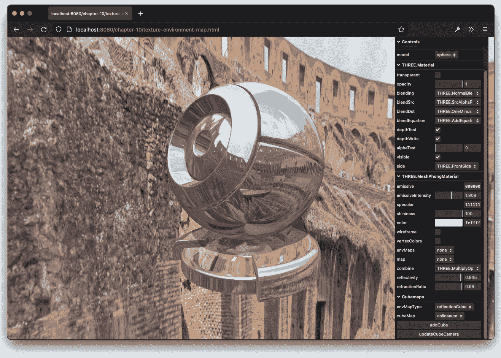

图 10.24 – 使用折射创建类似玻璃的对象

除了反射之外，Three.js 还允许你使用`cubeMap`对象进行折射（类似玻璃的对象）。以下截图展示了这一点（你可以通过使用右侧菜单来亲自测试）：

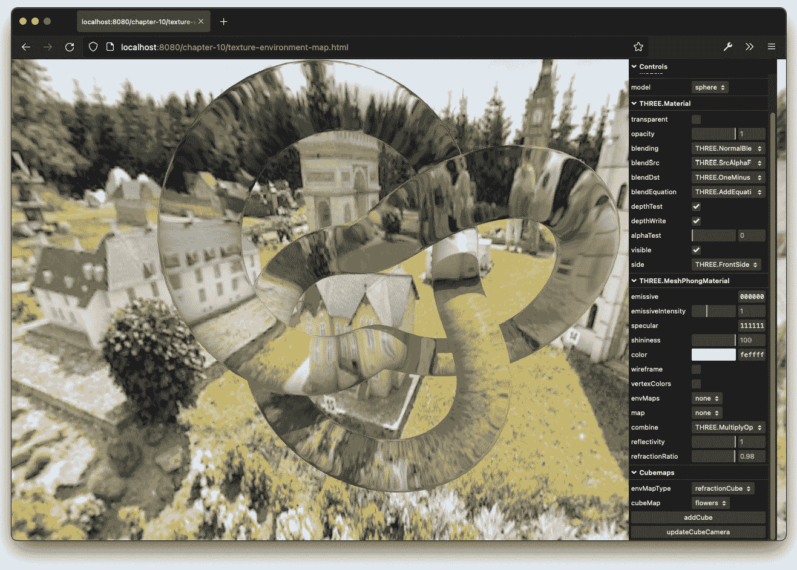

图 10.25 – 使用折射创建类似玻璃的对象

要得到这种效果，我们只需要将`cubeMap`的映射属性设置为`THREE.CubeRefractionMapping`（默认是反射，也可以通过指定`THREE.CubeReflectionMapping`手动设置）：

```js
 cubeMap.mapping = THREE.CubeRefractionMapping
```

在这个例子中，我们为网格使用了静态环境贴图。换句话说，我们只看到了环境的反射，而没有看到环境中的其他网格。在下面的屏幕截图中，你可以看到，通过一点工作，我们也可以显示其他物体的反射：

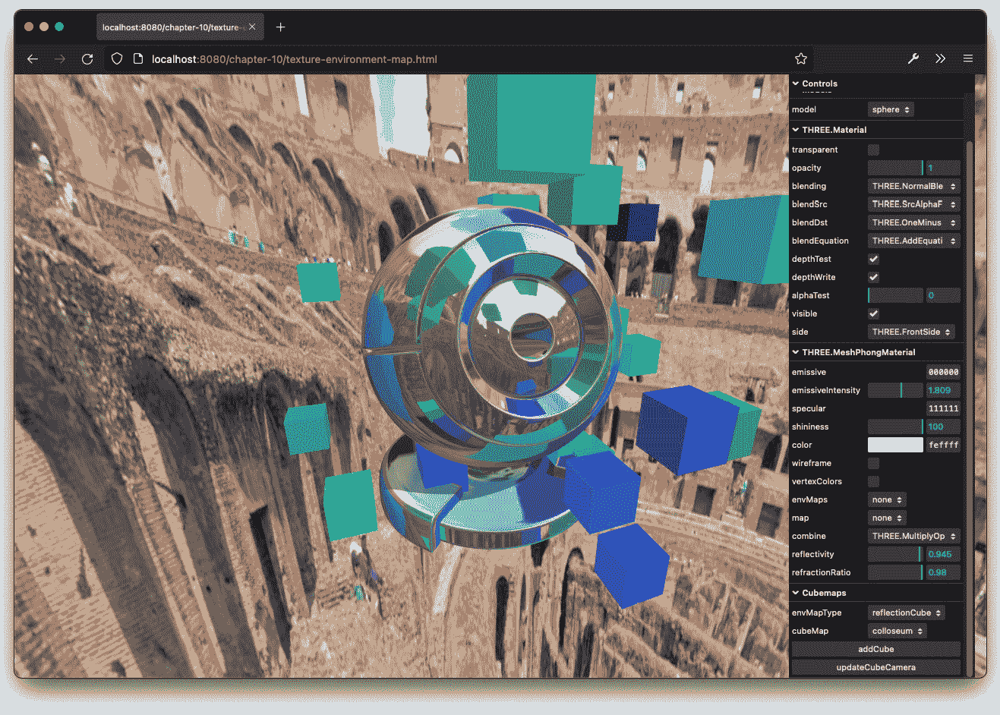

图 10.26 – 使用 cubeCamera 创建动态反射

为了显示场景中其他物体的反射，我们需要使用一些其他的 Three.js 组件。其中第一个是一个额外的相机，称为`THREE.CubeCamera`：

```js
const cubeRenderTarget = new THREE.WebGLCubeRenderTarget
  (128, {
  generateMipmaps: true,
  minFilter: THREE.LinearMipmapLinearFilter
})
const cubeCamera = new THREE.CubeCamera(0.1, 10, cubeRenderTarget)
cubeCamera.position.copy(mesh.position); 
scene.add(cubeCamera);
```

我们将使用`THREE.CubeCamera`来捕捉场景中所有物体渲染后的快照，并使用它来设置一个`cubeMap`。前两个参数定义了相机的近处和远处属性。因此，在这种情况下，相机只渲染它从 0.1 到 1.0 可以看到的内容。最后一个属性是我们想要渲染纹理的目标。为此，我们创建了一个`THREE.WebGLCubeRenderTarget`的实例。第一个参数是渲染目标的大小。值越高，反射看起来越详细。其他两个属性用于确定在缩放时纹理如何放大和缩小。

你需要确保将这个相机放置在你想要显示动态反射的`THREE.Mesh`的确切位置。在这个例子中，我们复制了网格的位置，以便相机正确定位。

现在我们已经正确设置了`CubeCamera`，我们需要确保`CubeCamera`所看到的内容被应用到我们示例中的立方体上。为此，我们必须将`envMap`属性设置为`cubeCamera.renderTarget`：

```js
cubeMaterial.envMap = cubeRenderTarget.texture;
```

现在，我们必须确保`cubeCamera`渲染场景，这样我们就可以将输出用作立方体的输入。为此，我们必须更新渲染循环如下（或者如果场景没有变化，我们只需调用一次）：

```js
const render = () => {
...
mesh.visible = false; 
cubeCamera.update(renderer, scene); 
mesh.visible = true;
requestAnimationFrame(render); 
renderer.render(scene, camera);
....
}
```

如你所见，首先，我们禁用了`mesh`的可见性。我们这样做是因为我们只想看到其他物体的反射。接下来，我们通过调用`update`函数使用`cubeCamera`渲染场景。之后，我们再次使`mesh`可见并正常渲染场景。结果是，在`mesh`的反射中，你可以看到我们添加的立方体。对于这个例子，每次你点击`updateCubeCamera`按钮时，网格的`envMap`属性都会被更新。

## 重复包装

当你将纹理应用到由 Three.js 创建的几何体上时，Three.js 会尽可能地优化纹理的应用。例如，对于立方体，这意味着每个面都会显示完整的纹理，而对于球体，完整的纹理会被包裹在球体上。然而，有些情况下你可能不希望纹理在整个面或整个几何体上扩散，而是希望纹理重复自身。Three.js 提供了允许你控制这一点的功能。一个可以让你玩转重复属性的例子在`texture-repeat-mapping.html`中提供。以下截图展示了这个例子：

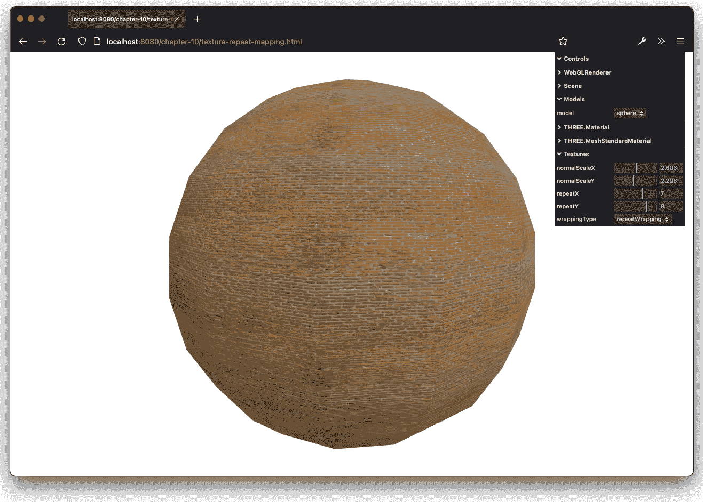

图 10.27 – 球体上的重复包裹

在此属性产生预期效果之前，你需要确保将纹理的包裹设置为`THREE.RepeatWrapping`，如下面的代码片段所示：

```js
mesh.material.map.wrapS = THREE.RepeatWrapping; 
mesh.material.map.wrapT = THREE.RepeatWrapping;
```

`wrapS`属性定义了纹理沿其*X*轴如何包裹，而`wrapT`属性定义了纹理应沿其*Y*轴如何包裹。Three.js 为此提供了三种选项，如下所示：

+   `THREE.RepeatWrapping`允许纹理重复自身

+   `THREE.MirroredRepeatWrapping`允许纹理重复自身，但每次重复都是镜像的

+   `THREE.ClampToEdgeWrapping`是一个默认设置，其中纹理不会整体重复；只有边缘的像素会被重复

在这个例子中，你可以玩转各种重复设置以及`wrapS`和`wrapT`选项。一旦选择了包裹类型，我们就可以设置`repeat`属性，如下面的代码片段所示：

```js
mesh.material.map.repeat.set(repeatX, repeatY);
```

`repeatX`变量定义了纹理沿其*X*轴重复的频率，而`repeatY`变量定义了沿*Y*轴的相同频率。如果这些值设置为 1，纹理不会重复；如果它们设置为更高的值，你会看到纹理开始重复。你也可以使用小于 1 的值。在这种情况下，你会放大纹理。如果你将重复值设置为负值，纹理将被镜像。

当你更改`repeat`属性时，Three.js 会自动更新纹理并使用这个新设置进行渲染。如果你从`THREE.RepeatWrapping`更改为`THREE.ClampToEdgeWrapping`，你必须显式地使用`mesh.material.map.needsUpdate = true;`来更新纹理：

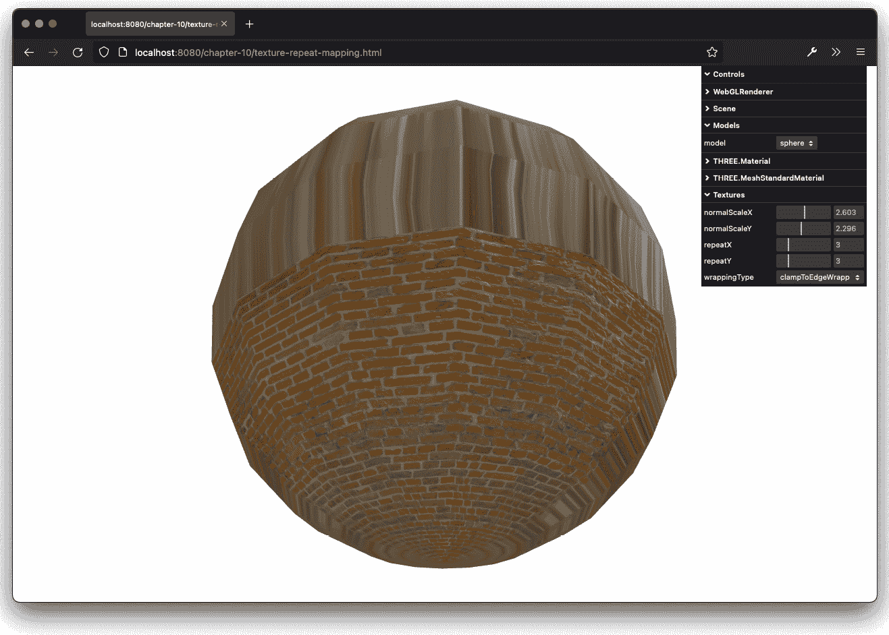

图 10.28 – 球体上的边缘包裹

到目前为止，我们只为纹理使用了静态图像。然而，Three.js 也有使用 HTML5 画布作为纹理的选项。

# 将渲染输出到画布并用作纹理

在本节中，我们将查看两个不同的示例。首先，我们将查看如何使用 `canvas` 创建一个简单的纹理并将其应用于网格；之后，我们将更进一步，创建一个可以用作凹凸映射的 `canvas`，使用随机生成的图案。

## 使用 canvas 作为颜色映射

在这个第一个例子中，我们将渲染一个分形到 HTML `Canvas` 元素上，并将其用作我们的网格的颜色映射。以下截图显示了此示例（`texture-canvas-as-color-map.html`）：

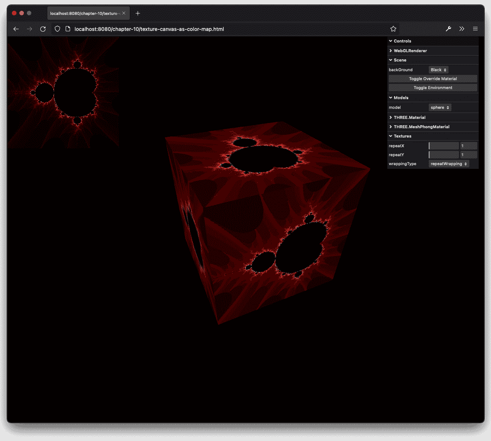

图 10.29 – 使用 HTML canvas 作为纹理

首先，我们将查看渲染分形所需的代码：

```js
import Mandelbrot from 'mandelbrot-canvas'
...
const div = document.createElement('div')
div.id = 'mandelbrot'
div.style = 'position: absolute'
document.body.append(div)
const mandelbrot = new Mandelbrot(document.getElementById('mandelbrot'), {
  height: 300,
  width: 300,
  magnification: 100
})
mandelbrot.render()
```

我们不会过多地深入细节，但这个库需要一个 `div` 元素作为输入，并在其中创建一个 `canvas` 元素。前面的代码将渲染分形，正如您在前面的截图中所看到的。接下来，我们需要将这个 `canvas` 分配给我们的材质的 `map` 属性：

```js
const material = new THREE.MeshPhongMaterial({
  color: 0xffffff,
  map: new THREE.Texture(document.querySelector
    ('#mandelbrot canvas'))
})
material.map.needsUpdate = true
```

在这里，我们只是创建一个新的 `THREE.Texture` 并传入 `canvas` 元素的引用。我们唯一需要做的是将 `material.map.needsUpdate` 设置为 `true`，这将触发 Three.js 从 `canvas` 元素获取最新信息，此时我们将看到它应用于网格。

我们当然可以使用这个相同的概念来处理我们迄今为止看到的所有不同类型的映射。在下一个示例中，我们将使用 `canvas` 作为凹凸映射。

## 使用 canvas 作为凹凸映射

如您在本章前面所见，我们可以使用凹凸映射给我们的模型添加高度。在这个映射中，像素的强度越高，皱纹就越高。由于凹凸映射只是一个简单的黑白图像，没有什么阻止我们在 `canvas` 上创建它，并使用该 `canvas` 作为凹凸映射的输入。

在以下示例中，我们将使用 `canvas` 生成基于 Perlin 噪声的灰度图像，并将其用作我们应用于立方体的凹凸映射的输入。请参阅 `texture-canvas-as-bump-map.html` 示例。以下截图显示了此示例：

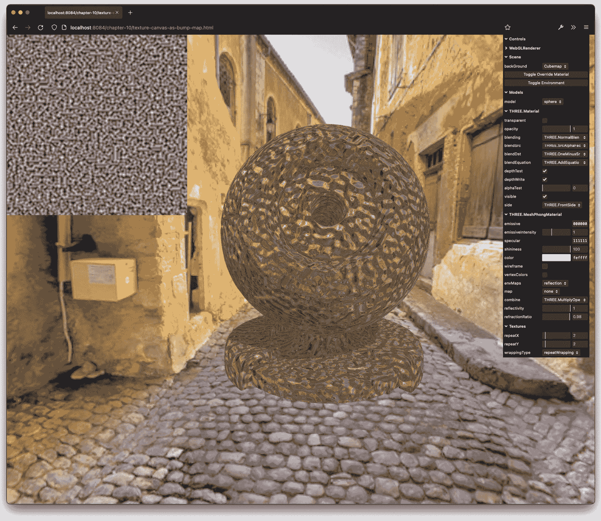

图 10.30 – 使用 HTML canvas 作为凹凸映射

这个方法基本上和我们在之前的 `canvas` 示例中看到的方法相同。我们需要创建一个 `canvas` 元素，并在其中填充一些噪声。要做到这一点，我们必须使用 Perlin 噪声。Perlin 噪声生成一个非常自然的外观纹理，正如您在前面的截图中所看到的。有关 Perlin 噪声和其他噪声生成器的更多信息，请参阅此处：[`thebookofshaders.com/11/`](https://thebookofshaders.com/11/)。完成此操作的代码如下所示：

```js
import generator from 'perlin'
var canvas = document.createElement('canvas')
canvas.className = 'myClass'
const size = 512
canvas.style = 'position:absolute;'
canvas.width = size
canvas.height = size
document.body.append(canvas)
const ctx = canvas.getContext('2d')
for (var x = 0; x < size; x++) {
  for (var y = 0; y < size; y++) {
    var base = new THREE.Color(0xffffff)
    var value = (generator.noise.perlin2(x / 8, y / 8) + 1) / 2
    base.multiplyScalar(value)
    ctx.fillStyle = '#' + base.getHexString()
    ctx.fillRect(x, y, 1, 1)
  }
}
```

我们使用`generator.noise.perlin2`函数根据`canvas`元素的`x`和`y`坐标创建一个 0 到 1 之间的值。这个值用于在`canvas`元素上绘制单个像素。对所有像素执行此操作将创建你可以在前一个截图的左上角看到的随机地图。这个地图然后可以用作凹凸贴图：

```js
const material = new THREE.MeshPhongMaterial({
  color: 0xffffff,
  bumpMap: new THREE.Texture(canvas)
})
material.bumpMap.needsUpdate = true
```

使用 THREE.DataTexture 创建动态纹理

在这个例子中，我们使用 HTML `canvas`元素渲染了 Perlin 噪声。Three.js 还提供了一个动态创建纹理的替代方法：你可以创建一个`THREE.DataTexture`纹理，其中你可以传递一个`Uint8Array`，你可以直接设置 RGB 值。有关如何使用`THREE.DataTexture`的更多信息，请参阅此处：[`threejs.org/docs/#api/en/textures/DataTexture`](https://threejs.org/docs/#api/en/textures/DataTexture)。

我们用于纹理的最终输入是另一个 HTML 元素：HTML5 视频元素。

## 使用视频输出作为纹理

如果你阅读了关于将渲染到 canvas 的前一节，你可能已经考虑过将视频渲染到 canvas 上，并使用它作为纹理的输入。这是其中一种方法，但 Three.js 已经直接支持使用 HTML5 视频元素（通过 WebGL）。查看`texture-canvas-as-video-map.html`：


图 10.31 – 使用 HTML 视频作为纹理

将视频作为纹理的输入非常简单，就像使用 canvas 元素一样。首先，我们需要一个视频元素来播放视频：

```js
const videoString = `
<video
  id="video"
  src="img/Big_Buck_Bunny_small.ogv"
  controls="true"
</video>
`
const div = document.createElement('div')
div.style = 'position: absolute'
document.body.append(div)
div.innerHTML = videoString
```

通过直接将 HTML 字符串设置到`div`元素的`innerHTML`属性中，创建了一个基本的 HTML5 `video`元素。虽然这对于测试来说效果很好，但框架和库通常提供更好的选项。接下来，我们可以配置 Three.js 使用视频作为纹理的输入，如下所示：

```js
const video = document.getElementById('video')
const texture = new THREE.VideoTexture(video)
const material = new THREE.MeshStandardMaterial({
  color: 0xffffff,
  map: texture
})
```

结果可以在`texture-canvas-as-video-map.html`示例中看到。

# 摘要

这样，我们就完成了关于纹理的这一章。正如你所看到的，Three.js 中有许多纹理可供使用，每种纹理都有不同的用途。你可以使用任何 PNG、JPG、GIF、TGA、DDS、PVR、TGA、KTX、EXR 或 RGBE 格式的图像作为纹理。加载这些图像是异步进行的，所以记得在加载纹理时使用渲染循环或添加回调。有了不同类型的纹理，你可以从低多边形模型创建出外观出色的对象。

使用 Three.js，创建动态纹理也很容易，可以使用 HTML5 `canvas`元素或`video`元素——只需定义一个以这些元素为输入的纹理，并在需要更新纹理时将`needsUpdate`属性设置为`true`。

随着本章的结束，我们基本上已经涵盖了 Three.js 的所有重要概念。然而，我们还没有探讨 Three.js 提供的一个有趣特性：后处理。通过后处理，你可以在场景渲染后添加效果。例如，你可以模糊或着色你的场景，或者使用扫描线添加类似电视的效果。在*第十一章*，*渲染后处理*中，我们将探讨后处理以及如何将其应用于你的场景。

# 第四部分：后处理、物理和声音

在本节的最后一部分，我们将探讨一些更高级的主题。我们将解释如何设置一个后处理管道，它可以用来向最终渲染的场景添加不同类型的特效。我们还将介绍 Rapier 物理引擎，并解释如何将 Three.js 和 Blender 结合使用。本部分结束时，我们将提供关于如何将 Three.js 与 React、TypeScript 和 Web-XR 标准结合使用的信息。

在本部分，有以下章节：

+   *第十一章*，*渲染后处理*

+   *第十二章*，*为你的场景添加物理和声音*

+   *第十三章*，*与 Blender 和 Three.js 一起工作*

+   *第十四章*，*Three.js 与 React、TypeScript 和 Web-XR 结合使用*
