# 渲染后处理

在本章中，我们将探讨 Three.js 的一个主要特性，我们之前尚未涉及：渲染后处理。通过渲染后处理，你可以在场景渲染后添加额外的效果。例如，你可以添加一个使场景看起来像是在旧电视上显示的效果，或者你可以添加模糊和光晕效果。

本章我们将讨论的主要内容包括以下几项：

+   为后处理设置 Three.js

+   由 Three.js 提供的某些基本后处理步骤，例如`BloomPass`和`FilmPass`

+   使用遮罩将效果应用于场景的一部分

+   使用`ShaderPass`添加更多基本的后处理效果，例如棕褐色滤镜、镜像效果和色彩调整

+   使用`ShaderPass`实现各种模糊效果和更高级的过滤器

+   通过编写简单的着色器创建自定义的后处理效果

在*第一章*，“使用 Three.js 创建你的第一个 3D 场景”，在“介绍 requestAnimationFrame”部分，我们设置了一个渲染循环，我们在整本书中使用了这个循环来渲染和动画化我们的场景。为了后处理，我们需要对这个设置进行一些修改，以便允许 Three.js 对最终渲染进行后处理。在第一部分，我们将探讨如何做到这一点。

# 为后处理设置 Three.js

要为后处理设置 Three.js，我们必须对我们的当前设置进行一些修改，如下所示：

1.  创建`EffectComposer`，它可以用来添加后处理步骤。

1.  配置`EffectComposer`以便它可以渲染我们的场景并应用任何额外的后处理步骤。

1.  在渲染循环中，使用`EffectComposer`来渲染场景，应用配置的后处理步骤，并显示输出。

和往常一样，我们将展示一个你可以用来实验和适应你自己的目的的示例。本章的第一个示例可以从`basic-setup.html`访问。你可以使用右上角的菜单来修改此示例中使用的后处理步骤的属性。在此示例中，我们将渲染来自*第九章*，“动画和移动摄像机”，并添加 RGB 偏移效果，如下所示：

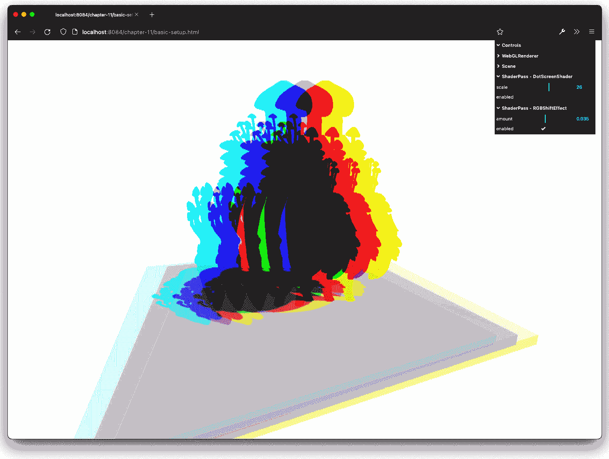

图 11.1 – 使用后处理步骤渲染

此效果是通过使用`ShaderPass`以及`EffectComposer`在场景渲染后添加的。在屏幕右侧的菜单中，你可以配置此效果，并启用`DotScreenShader`效果。

在接下来的几节中，我们将解释上一列表中的各个步骤。

## 创建 THREE.EffectComposer

要让`EffectComposer`工作，我们首先需要可以与之一起使用的效果。Three.js 附带了许多效果和着色器，您可以直接使用。在本章中，我们将展示其中大部分，但为了全面了解，请查看以下 GitHub 上的两个目录：

+   效果流程：[`github.com/mrdoob/three.js/tree/dev/examples/jsm/postprocessing`](https://github.com/mrdoob/three.js/tree/dev/examples/jsm/postprocessing)

)

+   着色器：[`github.com/mrdoob/three.js/tree/dev/examples/jsm/shaders`](https://github.com/mrdoob/three.js/tree/dev/examples/jsm/shaders)

)

要在您的场景中使用这些效果，您需要导入它们：

```js
import { EffectComposer } from 
  'three/examples/jsm/postprocessing/EffectComposer'
import { RenderPass } from 
  'three/examples/jsm/postprocessing/RenderPass.js'
import { ShaderPass } from 
  'three/examples/jsm/postprocessing/ShaderPass.js'
import { BloomPass } from 
  'three/examples/jsm/postprocessing/BloomPass.js'
import { GlitchPass } from 
  'three/examples/jsm/postprocessing/GlitchPass.js'
import { RGBShiftShader } from 
  'three/examples/jsm/shaders/RGBShiftShader.js'
import { DotScreenShader } from 
  'three/examples/jsm/shaders/DotScreenShader.js'
import { CopyShader } from 
  'three/examples/jsm/shaders/CopyShader.js'
```

在前面的代码块中，我们导入了主要的`EffectComposer`以及不同数量的后处理流程和着色器，我们可以与这个`EffectComposer`一起使用。一旦我们有了这些，设置`EffectComposer`就像这样：

```js
const composer = new EffectComposer(renderer)
```

如您所见，效果合成器接受的唯一参数是`renderer`。接下来，我们将向这个合成器添加各种流程。

## 配置 THREE.EffectComposer 进行后处理

每个流程都是按照它被添加到`THREE.EffectComposer`中的顺序执行的。我们首先添加的是`RenderPass`。这个流程使用提供的相机渲染场景，但还没有将其输出到屏幕上：

```js
const renderPass = new RenderPass(scene, camera); 
composer.addPass(renderPass);
```

使用`addPass`函数，我们将`RenderPass`添加到`EffectComposer`。下一步是添加另一个流程，它将使用`RenderPass`的结果作为输入，应用其转换，并将结果输出到屏幕。并非所有可用的流程都允许这样做，但我们在本例中使用的流程可以：

```js
const effect1 = new ShaderPass(DotScreenShader)
effect1.uniforms['scale'].value = 10
effect1.enabled = false
const effect2 = new ShaderPass(RGBShiftShader)
effect2.uniforms['amount'].value = 0.015
effect2.enabled = false
const composer = new EffectComposer(renderer)
composer.addPass(new RenderPass(scene, camera))
composer.addPass(effect1)
composer.addPass(effect2)
```

在这个例子中，我们向`composer`添加了两个效果。首先，场景使用`RenderPass`进行渲染，然后应用`DotScreenShader`，最后应用`RGBShiftShader`。

现在我们需要做的就是更新渲染循环，以便使用`EffectComposer`而不是通过正常的`WebGLRenderer`进行渲染。

## 更新渲染循环

我们只需要对我们的渲染循环进行小小的修改，使用合成器而不是`THREE.WebGLRenderer`：

```js
const render = () => { 
requestAnimationFrame(render); 
composer.render();
}
```

我们所做的唯一修改是移除`renderer.render(scene, camera)`并将其替换为`composer.render()`。这将调用`EffectComposer`上的渲染函数，它反过来使用传入的`THREE.WebGLRenderer`，结果是我们在屏幕上看到输出：

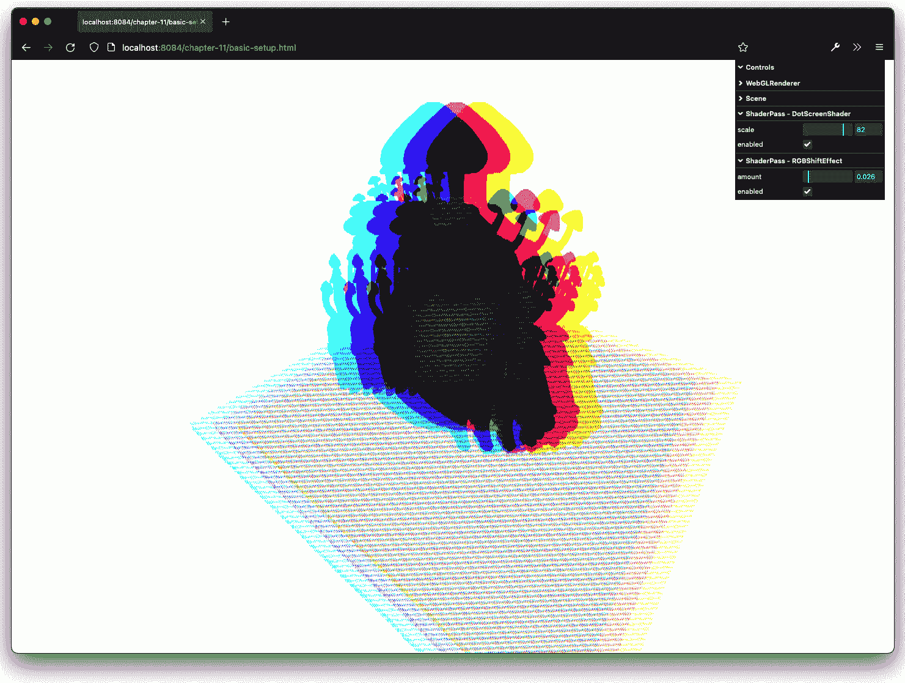

图 11.2 – 使用多个后处理流程渲染的图像

在应用渲染流程后使用控件

您仍然可以使用正常的控件在场景中移动。本章中您将看到的全部效果都是在场景渲染后应用的。使用这个基本设置，我们将在下一节中查看可用的后处理流程。

# 后处理流程

Three.js 附带了一些可以直接与`THREE.EffectComposer`一起使用的后处理流程。

使用简单的 GUI 进行实验

本章中展示的大多数着色器和通道都可以配置。当你想要应用一个自己的时，通常最简单的方法是添加一个简单的用户界面，允许你调整属性。这样，你可以看到针对特定场景的良好设置是什么。

以下列表显示了 Three.js 中可用的所有后处理通道：

+   `AdaptiveToneMappingPass`: 这个渲染通道根据场景中可用的光量调整场景的亮度。

+   `BloomPass`: 这是一个效果，使得较亮区域渗透到较暗区域。这模拟了相机被极其明亮的光线淹没的效果。

+   `BokehPass`: 这会给场景添加一个散景效果。有了散景效果，场景的前景是清晰的，而其余部分则模糊。

+   `ClearPass`: 这个溢出通道清除当前的纹理缓冲区。

+   `CubeTexturePass`: 这可以用来在场景中渲染天空盒。

+   `DotScreenPass`: 这会在屏幕上应用一层黑色点，代表原始图像。

+   `FilmPass`: 这通过应用扫描线和扭曲来模拟电视屏幕。

+   `GlitchPass`: 这在随机的时间间隔内在屏幕上显示电子故障。

+   `HalfTonePass`: 这会给场景添加半色调效果。有了半色调效果，场景被渲染为各种大小的一组彩色符号（圆形、方形等）。

+   `LUTPass`: 使用 `LUTPass`，你可以在渲染后对场景应用颜色校正步骤（本章中未展示）。

+   `MaskPass`: 这允许你将掩码应用于当前图像。后续通道仅应用于掩码区域。

+   `OutlinePass`: 这会渲染场景中物体的轮廓。

+   `RenderPass`: 这根据提供的场景和相机渲染场景。

+   `SAOPass`: 这提供运行时环境遮挡。

+   `SMAAPass`: 这会给场景添加抗锯齿效果。

+   `SSAARenderPass`: 这给场景添加抗锯齿。

+   `SSAOPass`: 这提供了一种执行运行时环境遮挡的替代方法。

+   `SSRPass`: 这个通道允许你创建反射物体。

+   `SavePass`: 当这个通道执行时，它会复制当前渲染步骤，你可以稍后使用。在实际应用中，这个通道并不那么有用，我们不会在我们的任何示例中使用它。

+   `ShaderPass`: 这允许你为高级或定制的后处理通道传递自定义着色器。

+   `TAARenderPass`: 这会给场景添加抗锯齿效果。

+   `TexturePass`: 这会将合成器的当前状态存储在一个纹理中，你可以将其用作其他 `EffectComposer` 实例的输入。

+   `UnrealBloomPass`: 这与 `THREE.BloomPass` 相同，但效果类似于在 Unreal 3D 引擎中使用的效果。

让我们从一些简单的通道开始。

## 简单的后处理通道

对于简单的通道，我们将查看 `FilmPass`、`BloomPass` 和 `DotScreenPass` 可以做什么。对于这些通道，有一个示例（`multi-passes.html`）允许您实验这些通道并查看它们如何以不同的方式影响原始输出。以下截图显示了示例：

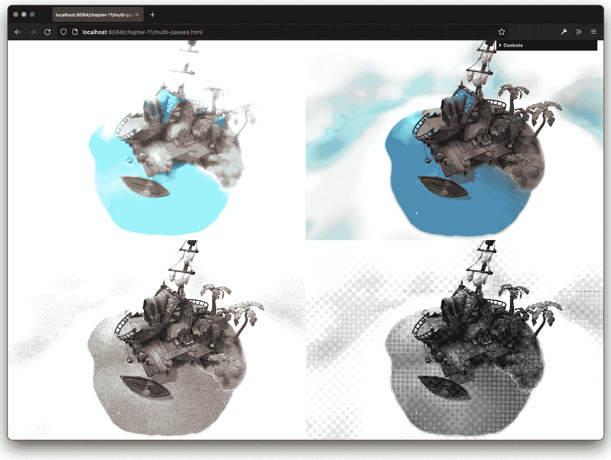

图 11.3 – 应用到场景中的三个简单通道

在此示例中，您可以同时看到四个场景，并且在每个场景中，都添加了不同的后处理通道。左上角显示的是 `BloomPass`，右下角显示的是 `DotScreenPass`，左下角显示的是 `FilmPass`。右上角显示的是原始渲染。

在此示例中，我们还使用了 `THREE.ShaderPass` 和 `THREE.TexturePass` 来重用原始渲染的输出作为其他三个场景的输入。这样，我们只需要渲染场景一次。因此，在我们查看单个通道之前，让我们看看这两个通道，如下所示：

```js
const effectCopy = new ShaderPass(CopyShader)
const renderedSceneComposer = new EffectComposer(renderer)
renderedSceneComposer.addPass(new RenderPass(scene, 
  camera))
renderedSceneComposer.addPass(new ShaderPass
  (GammaCorrectionShader))
renderedSceneComposer.addPass(effectCopy)
renderedSceneComposer.renderToScreen = false
const texturePass = new TexturePass
  (renderedSceneComposer.renderTarget2.texture)
```

在此代码片段中，我们设置了 `EffectComposer`，它将输出默认场景（右上角的一个）。此合成器有三个通道：

+   `RenderPass`：此通道渲染场景。

+   带有 `GammaCorrectionShader` 的 `ShaderPass`：确保输出的颜色是正确的。如果在应用效果后，场景的颜色看起来不正确，此着色器将对其进行纠正。

+   带有 `CopyShader` 的 `ShaderPass`：渲染输出（如果我们将 `renderToScreen` 属性设置为 `true`，则不会对屏幕进行任何进一步的后处理）。

如果您查看示例，您可以看到我们展示了相同的场景四次，但每次都应用了不同的效果。我们也可以通过使用 `RenderPass` 四次从头开始渲染场景，但这会有些浪费，因为我们可以直接重用第一个合成器的输出。为此，我们创建 `TexturePass` 并传入 `composer.renderTarget2.texture` 的值。此属性包含作为纹理渲染的场景，我们可以将其传递到 `TexturePass`。现在，我们可以使用 `texturePass` 变量作为其他合成器的输入，而无需从头开始渲染场景。让我们首先看看 `FilmPass` 以及我们如何使用 `TexturePass` 的结果作为输入。

### 使用 THREE.FilmPass 创建类似电视的效果

要创建 `FilmPass`，我们使用以下代码片段：

```js
const filmpass = new FilmPass()
const filmpassComposer = new EffectComposer(renderer)
filmpassComposer.addPass(texturePass)
filmpassComposer.addPass(filmpass)
```

使用 `TexturePass` 的唯一步骤是将它作为我们合成器中的第一个通道添加。接下来，我们只需添加 `FilmPass`，效果就会应用。`FilmPass` 可以接受四个额外的参数，如下所示列表：

+   `noiseIntensity`：此属性允许您控制场景看起来有多粗糙。

+   `scanlinesIntensity`: `FilmPass` 为场景添加了若干扫描线（见 `scanLinesCount`）。使用此属性，您可以定义这些扫描线显示的突出程度。

+   `scanLinesCount`：可以通过此属性控制显示的扫描线数量。

+   `grayscale`：如果将其设置为 `true`，输出将被转换为灰度。

实际上，您有两种方法可以传递这些参数。在这个例子中，我们将它们作为构造函数的参数传递，但您也可以直接设置它们，如下所示：

```js
effectFilm.uniforms.grayscale.value = controls.grayscale; 
effectFilm.uniforms.nIntensity.value = controls.
  noiseIntensity; 
effectFilm.uniforms.sIntensity.value = controls.
  scanlinesIntensity; 
effectFilm.uniforms.sCount.value = controls.scanlinesCount;
```

在这种方法中，我们使用 `uniforms` 属性，它直接与 WebGL 通信。在 *使用 THREE.ShaderPass 创建自定义效果* 部分，当我们讨论创建自定义着色器时，我们将更深入地了解 `uniforms`；现在，您只需要知道，通过这种方式，您可以更新后处理传递和着色器的配置，并直接查看结果。

此次传递的结果显示在以下图中：

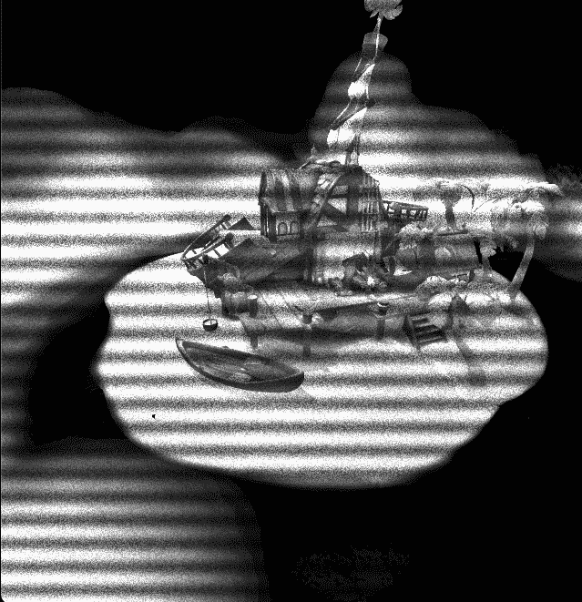

图 11.4 – FilmPass 提供的电影效果

下一个效果是 bloom 效果，您可以在 *图 11.3* 的左上角看到。

### 使用 THREE.BloomPass 为场景添加 bloom 效果

您在左上角看到的效果被称为 bloom 效果。当您应用 bloom 效果时，场景中的明亮区域将被突出显示并渗透到较暗的区域。创建 `BloomPass` 的代码如下：

```js
const bloomPass = new BloomPass()
const effectCopy = new ShaderPass(CopyShader)
bloomPassComposer = new EffectComposer(renderer)
bloomPassComposer.addPass(texturePass)
bloomPassComposer.addPass(bloomPass)
bloomPassComposer.addPass(effectCopy)
```

如果您将其与 `EffectComposer` 进行比较，后者我们与 `FilmPass` 一起使用，您会注意到我们添加了一个额外的传递，`effectCopy`。这一步不会添加任何特殊效果，只是将最后一步的输出复制到屏幕上。我们需要添加这一步，因为 `BloomPass` 不会直接渲染到屏幕上。

以下表格列出了您可以在 `BloomPass` 上设置的属性：

+   `strength`：这是 bloom 效果的强度。这个值越高，越亮的区域越亮，并且它们将更多地渗透到较暗的区域。

+   `kernelSize`：这是内核的大小。这是在单步中模糊的区域的大小。如果您将其设置得更高，将包括更多像素以确定特定点的效果。

+   `sigma`：使用 `sigma` 属性，您可以控制 bloom 效果的锐度。值越高，bloom 效果看起来越模糊。

+   `resolution`：`resolution` 属性定义了 bloom 效果创建的精确度。如果您将其设置得太低，结果看起来会像块状。

要更好地理解这些属性，最好的方法是通过使用上述示例 `multi-passes.html` 来实验它们。以下截图显示了具有高 sigma 大小和高强度的 `bloom` 效果：

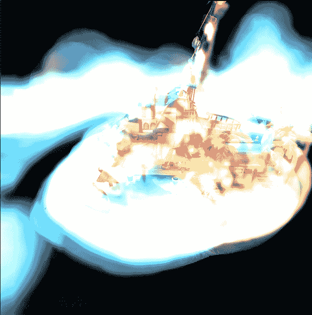

图 11.5 – 使用 BloomPass 的 bloom 效果

我们接下来要查看的下一个简单效果是 `DotScreenPass` 效果。

### 将场景输出为点集

使用 `DotScreenPass` 与使用 `BloomPass` 非常相似。我们刚刚看到了 `BloomPass` 的作用。现在让我们看看 `DotScreenPass` 的代码：

```js
const dotScreenPass = new DotScreenPass()
const dotScreenPassComposer = new EffectComposer(renderer)
dotScreenPassComposer.addPass(texturePass)
dotScreenPassComposer.addPass(dotScreenPass)
```

使用这个效果，我们不需要 `effectCopy` 将结果输出到屏幕。

`DotScreenPass` 也可以配置多个属性，如下所示：

+   `center`：通过 `center` 属性，你可以微调点的偏移方式。

+   `angle`：点以某种方式对齐。通过 `angle` 属性，你可以改变这种对齐方式。

+   `scale`：通过这个，我们可以设置要使用的点的尺寸。缩放值越低，点就越大。

对其他着色器适用的内容也适用于这个着色器。通过实验，更容易获得正确的设置，如下面的图所示：

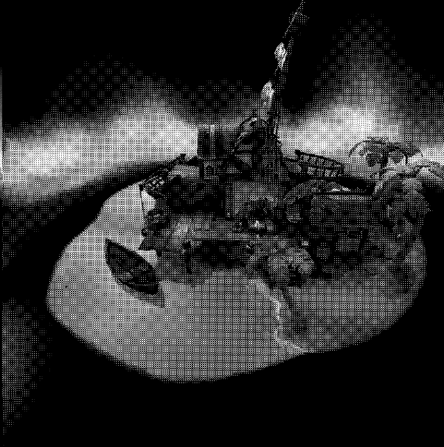

图 11.6 – 使用 DotScreenPass 的点阵效果

在我们继续下一组简单的着色器之前，我们首先看看我们是如何在同一屏幕上渲染多个场景的。

## 在同一屏幕上显示多个渲染器的输出

本节不会详细介绍如何使用后处理效果，但会解释如何在同一屏幕上获取所有四个 `EffectComposer` 实例的输出。首先，让我们看看这个示例中使用的渲染循环：

```js
const width = window.innerWidth || 2
const height = window.innerHeight || 2
const halfWidth = width / 2
const halfHeight = height / 2
const render = () => {
  renderer.autoClear = false
  renderer.clear()
  renderedSceneComposer.render()
  renderer.setViewport(0, 0, halfWidth, halfHeight)
  filmpassComposer.render()
  renderer.setViewport(halfWidth, 0, halfWidth, halfHeight)
  dotScreenPassComposer.render()
  renderer.setViewport(0, halfHeight, halfWidth, 
    halfHeight)
  bloomPassComposer.render()
  renderer.setViewport(halfWidth, halfHeight, halfWidth, 
    halfHeight)
  copyComposer.render()
  requestAnimationFrame(() => render())
}
```

首先要注意的是，我们将 `renderer.autoClear` 属性设置为 `false`，然后在渲染循环中显式调用 `clear()` 函数。如果我们每次在作曲家上调用 `render()` 函数时都不这样做，屏幕上之前渲染的部分将被清除。使用这种方法，我们只在渲染循环的开始清除一切。

为了避免所有我们的作曲家都在同一空间中渲染，我们将渲染器（我们的作曲家使用的）的 `viewport` 函数设置为屏幕的不同部分。这个函数接受四个参数：`x`、`y`、`width` 和 `height`。正如你在代码示例中所看到的，我们使用这个函数将屏幕分成四个区域，并让作曲家将渲染输出到它们各自的部分。请注意，如果你愿意，你也可以使用这种方法与多个 `scene`、`camera` 和 `WebGLRenderer` 实例一起使用。在这种设置下，渲染循环将渲染四个 `EffectComposer` 对象的各自部分。让我们快速看看另外几个通过：

## 额外的简单通过

如果你打开浏览器中的 `multi-passes-2.html` 示例，你会看到一些额外的通过动作：

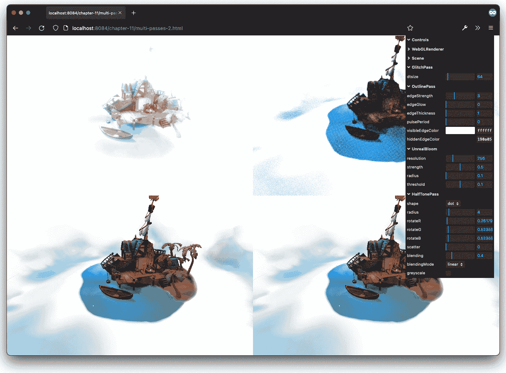

图 11.7 – 另一组四个通过

我们在这里不会过多地详细介绍，因为这些通过与前面章节中的通过配置方式相同。在这个例子中，你可以看到以下内容：

+   在左下角，你可以看到 `OutlinePass`。轮廓通过可以用来为 `THREE.Mesh` 对象绘制轮廓。

+   在右下角，显示了 `GlitchPass`。正如其名所示，这个通道提供了一个技术渲染故障效果。

+   在左上角，显示了 `UnrealBloom` 效果。

+   在右上角，使用 `HalftonePass` 将渲染转换为一系列点。

与本章中的所有示例一样，你可以通过使用右侧的菜单来配置这些通道的各个属性。

要正确查看 `OutlinePass`，你可以将场景背景设置为黑色并稍微放大一些：

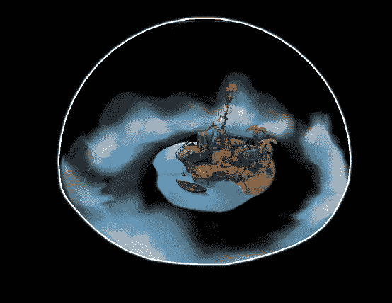

图 11.8 – 显示场景轮廓的轮廓通道

到目前为止，我们看到了简单的效果，在下一节中，我们将看看如何使用蒙版将效果应用于屏幕的一部分。

# 这可能听起来很复杂，但实际上完成起来非常简单。首先，让我们看看 `masks.html` 示例中我们想要达到的结果。以下截图显示了这些步骤的结果：

在前面的示例中，我们将后处理通道应用于整个屏幕。然而，Three.js 也有能力仅将通道应用于特定区域。在本节中，我们将执行以下步骤：

1.  我们需要做的第一件事是设置我们将要渲染的各种场景：

1.  创建 `EffectComposer`，将这些三个场景渲染成一张单独的图片。

1.  创建一个包含类似火星的球体的场景。

1.  这可能听起来很复杂，但实际上完成起来非常简单。首先，让我们看看 `masks.html` 示例中我们想要达到的结果。以下截图显示了这些步骤的结果：

1.  将着色效果应用于渲染为火星的球体。

1.  创建一个作为背景图像的场景。

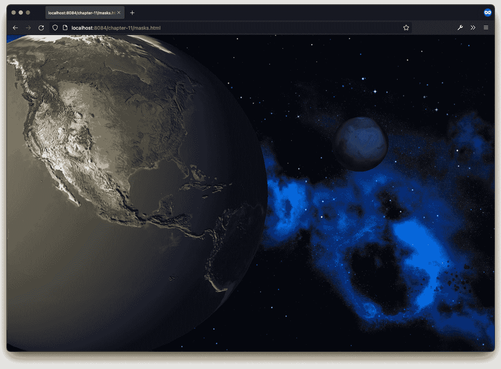

将棕褐色效果应用于渲染为地球的球体。

图 11.9 – 使用蒙版将效果应用于屏幕的一部分

创建一个包含类似地球的球体的场景。

```js
const sceneEarth = new THREE.Scene()
const sceneMars = new THREE.Scene()
const sceneBG = new THREE.Scene()
```

要创建地球和火星球体，我们只需创建具有正确材质和纹理的球体并将它们添加到特定的场景中。对于背景场景，我们加载一个纹理并将其设置为 `sceneBG` 的背景。这在上面的代码中显示（`addEarth` 和 `addMars` 只是辅助函数，用于使代码更清晰；它们从 `THREE.SphereGeometry` 创建一个简单的 `THREE.Mesh`，创建一些灯光并将它们全部添加到 `THREE.Scene`）：

```js
sceneBG.background = new THREE.TextureLoader().load
 ('/assets/textures/bg/starry-deep-outer-space-galaxy.jpg')
const earthAndLight = addEarth(sceneEarth)
sceneEarth.translateX(-16)
sceneEarth.scale.set(1.2, 1.2, 1.2)
const marsAndLight = addMars(sceneMars)
sceneMars.translateX(12)
sceneMars.translateY(6)
sceneMars.scale.set(0.2, 0.2, 0.2)
```

在这个例子中，我们使用场景的 `background` 属性添加星空背景。还有另一种创建背景的方法。我们可以使用 `THREE.OrthographicCamera`。使用 `THREE.OrthographicCamera`，渲染对象的尺寸在它靠近或远离相机时不会改变，因此，通过将 `THREE.PlaneGeometry` 对象直接放置在 `THREE.OrthographicCamera` 前面，我们也可以创建一个背景。

现在我们已经拥有了三个场景，我们可以开始设置我们的通道和 `EffectComposer`。让我们先看看完整的通道链，然后我们将查看单个通道：

```js
var composer = new EffectComposer(renderer)
composer.renderTarget1.stencilBuffer = true
composer.renderTarget2.stencilBuffer = true
composer.addPass(bgRenderPass)
composer.addPass(earthRenderPass)
composer.addPass(marsRenderPass)
composer.addPass(marsMask)
composer.addPass(effectColorify)
composer.addPass(clearMask)
composer.addPass(earthMask)
composer.addPass(effectSepia)
composer.addPass(clearMask)
composer.addPass(effectCopy)
```

要与遮罩一起工作，我们需要以稍微不同的方式创建 `EffectComposer`。我们需要将内部使用的渲染目标的 `stencilBuffer` 属性设置为 `true`。一个模板缓冲区，一种特殊的缓冲区，用于限制渲染区域。因此，通过启用模板缓冲区，我们可以使用我们的遮罩。让我们看看添加的前三个过程。这三个过程按照以下方式渲染背景、地球场景和火星场景：

```js
const bgRenderPass = new RenderPass(sceneBG, camera)
const earthRenderPass = new RenderPass(sceneEarth, camera)
earthRenderPass.clear = false
const marsRenderPass = new RenderPass(sceneMars, camera)
marsRenderPass.clear = false
```

这里没有什么新的内容，只是我们将其中两个过程的 `clear` 属性设置为 `false`。如果我们不这样做，我们只能看到 `marsRenderPass` 渲染的输出，因为它会在开始渲染之前清除一切。

如果你回顾一下 `EffectComposer` 的代码，接下来的三个过程是 `marsMask`、`effectColorify` 和 `clearMask`。首先，我们将看看这三个过程是如何定义的：

```js
const marsMask = new MaskPass(sceneMars, camera)
const effectColorify = new ShaderPass(ColorifyShader)
effectColorify.uniforms['color'].value.setRGB(0.5, 0.5, 1)
const clearMask = new ClearMaskPass()
```

这三个过程中的第一个是 `MaskPass`。当创建一个 `MaskPass` 对象时，你传递一个场景和一个相机，就像你为 `RenderPass` 做的那样。一个 `MaskPass` 对象将内部渲染这个场景，但不会在屏幕上显示，而是使用渲染的内部场景来创建一个遮罩。当一个 `MaskPass` 对象被添加到 `EffectComposer` 中时，所有后续的过程将只应用于由 `MaskPass` 定义的遮罩，直到遇到 `ClearMaskPass` 步骤。在这个例子中，这意味着添加蓝色光芒的 `effectColorify` 过程只应用于在 `sceneMars` 中渲染的物体。

我们使用相同的方法将棕褐色滤镜应用到地球物体上。我们首先基于地球场景创建一个遮罩，并在 `EffectComposer` 中使用这个遮罩。在使用 `MaskPass` 之后，我们添加我们想要应用的效果（在这种情况下是 `effectSepia`），完成之后，我们添加 `ClearMaskPass` 来再次移除遮罩。

对于这个特定的 `EffectComposer` 的最后一步，我们已经见过。我们需要将最终结果复制到屏幕上，为此我们再次使用 `effectCopy` 过程。使用这种设置，我们可以将我们希望成为整个屏幕一部分的效果应用上。但请注意，如果火星场景和地球场景重叠，这些效果将只应用于渲染图像的一部分。

这两个效果都将应用到屏幕的相应部分：

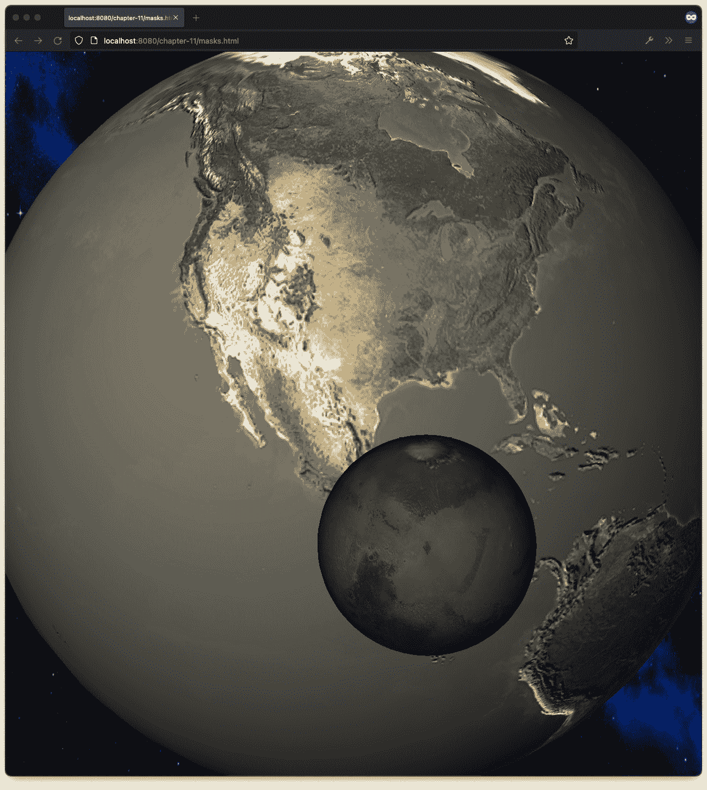

图 11.10 – 当遮罩重叠时，应用两个效果

在使用 `MaskPass` 时有一个有趣的额外属性，那就是 `inverse` 属性。如果这个属性设置为 `true`，遮罩将被反转。换句话说，效果将应用于除了传递给 `MaskPass` 的场景之外的所有内容。这在上面的屏幕截图中有显示，我们将 `earthMask` 的 `inverse` 属性设置为 `true`：

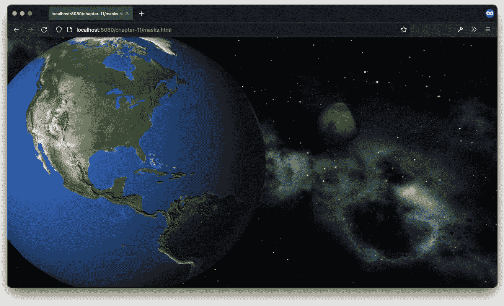

图 11.11 – 当遮罩重叠时，应用两个效果

在我们讨论 `ShaderPass` 之前，我们将查看两个提供更高级效果的过程：`BokehPass` 和 `SSAOPass`。

## 高级过程 – 模糊效果

使用 `BokehPass`，您可以为场景添加模糊效果。在模糊效果中，场景中只有一部分是清晰的，其余部分看起来是模糊的。要查看此效果的实际应用，您可以打开 `bokeh.html` 示例：

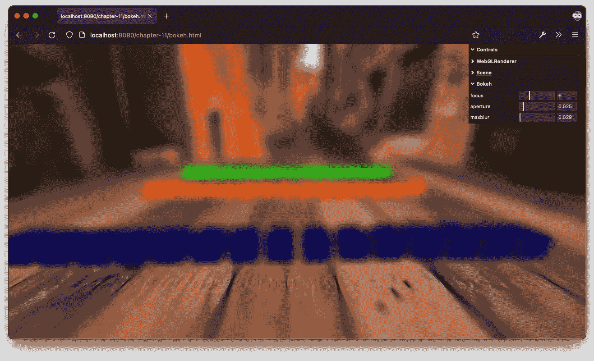

图 11.12 – 未聚焦的模糊效果

当您打开它时，最初，整个场景看起来是模糊的。通过 `aperture` 属性来确定应该聚焦的区域的大小。通过调整焦点，可以使前景中的立方体组清晰，如下所示：

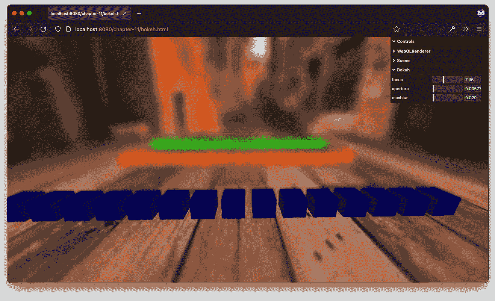

图 11.13 – 模糊效果聚焦于第一组立方体

或者，如果我们进一步滑动焦点，我们还可以聚焦于红色立方体：

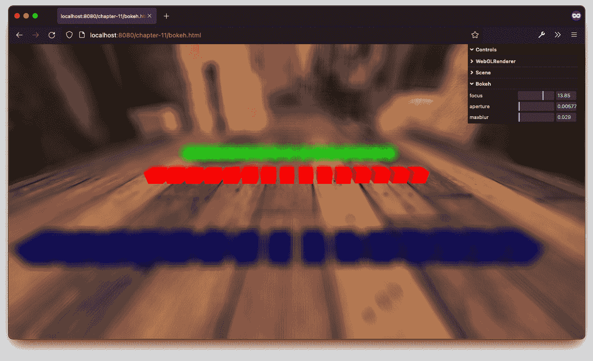

图 11.14 – 模糊效果聚焦于第二组立方体

如果我们将焦点进一步滑动，我们还可以聚焦于场景远端的绿色立方体组：

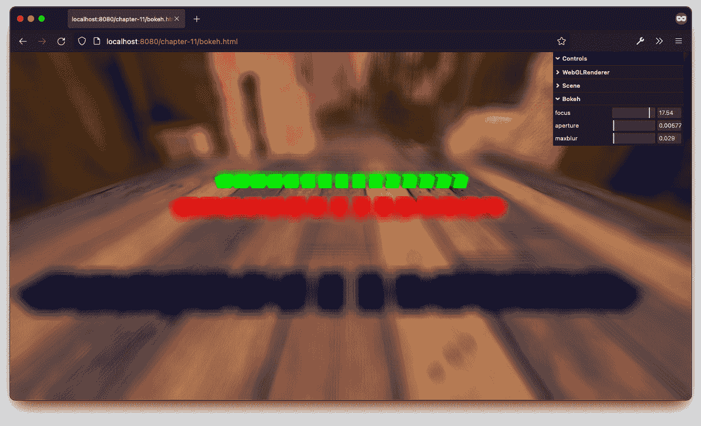

图 11.15 – 模糊效果聚焦于第三组立方体

`BokehPass` 可以像我们之前看到的其他过程一样使用：

```js
const params = { 
   focus: 10,
   aspect: camera.aspect, 
   aperture: 0.0002,
   maxblur: 1
};
const renderPass = new RenderPass(scene, camera);
const bokehPass = new BokehPass(scene, camera, params) 
bokehPass.renderToScreen = true;
const composer = new EffectComposer(renderer); 
composer.addPass(renderPass); 
composer.addPass(bokehPass);
```

实现所需的结果可能需要调整一些属性。

## 高级过程 – 环境遮挡

在 *第十章* *加载和使用纹理* 中，我们讨论了在材质上使用预烘焙的 `aoMap`，也可以在 `EffectComposer` 上使用过程来获得相同的效果。如果您打开 `ambient-occlusion.html` 示例，您将看到使用 `SSAOPass` 的结果：


图 11.16 – 应用了景深效果

没有应用环境遮挡滤镜的类似场景看起来非常平坦，如下所示：

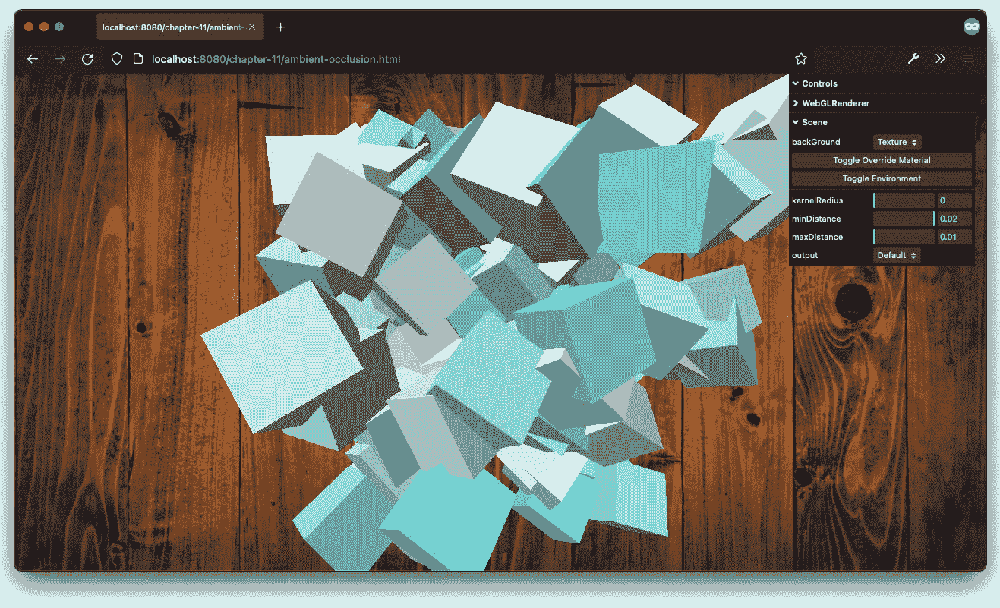

图 11.17 – 没有应用 AO 过滤器的相同场景

但是请注意，如果您使用此功能，您必须注意应用程序的整体性能，因为这是一个非常占用 GPU 的过程。

到目前为止，我们一直使用 Three.js 提供的标准过程来实现效果。Three.js 还提供了 `THREE.ShaderPass`，它可以用于自定义效果，并附带大量您可以使用的着色器，您可以进行实验。

# 使用 THREE.ShaderPass 实现自定义效果

使用 `THREE.ShaderPass`，我们可以通过传递自定义着色器来为场景应用大量额外的效果。Three.js 附带了一套可以与 `THREE.ShaderPass` 一起使用的着色器。它们将在本节中列出。我们将本节分为三个部分。

第一组涉及简单的着色器。所有这些着色器都可以通过打开`shaderpass-simple.html`示例来查看和配置：

+   `BleachBypassShader`: 这创建了一个漂白绕过效果。使用此效果，将在图像上应用类似银色的叠加。

+   `BlendShader`: 这不是一个作为单个后期处理步骤应用的着色器，但它允许你混合两个纹理。例如，你可以使用这个着色器将一个场景的渲染平滑地融合到另一个场景中（在`shaderpass-simple.html`中未显示）。

+   `BrightnessContrastShader`: 这允许你改变图像的亮度和对比度。

+   `ColorifyShader`: 这在屏幕上应用了一个颜色叠加。我们已经在遮罩示例中见过这个着色器。

+   `ColorCorrectionShader`: 使用这个着色器，你可以改变颜色分布。

+   `GammaCorrectionShader`: 这对渲染的场景应用伽玛校正。它使用一个固定的伽玛因子 2。请注意，你也可以通过使用`gammaFactor`、`gammaInput`和`gammaOutput`属性，在`THREE.WebGLRenderer`上直接设置伽玛校正。

+   `HueSaturationShader`: 这允许你改变颜色的色调和饱和度。

+   `KaleidoShader`: 这为场景添加了一个万花筒效果，该效果在场景中心提供径向反射。

+   `LuminosityShader`和`LuminostyHighPassShader`: 这提供了亮度效果，其中场景的亮度被显示出来。

+   `MirrorShader`: 这为屏幕的一部分创建了一个镜像效果。

+   `PixelShader`: 这创建了一个像素化效果。

+   `RGBShiftShader`: 这个着色器将颜色的红、绿和蓝分量分离。

+   `SepiaShader`: 这在屏幕上创建了一种类似棕褐色效果。

+   `SobelOperatorShader`: 这提供了边缘检测。

+   `VignetteShader`: 这应用了一个晕影效果。此效果在图像中心显示暗色边缘。

接下来，我们将查看提供一些模糊相关效果的着色器。这些效果可以通过`shaderpass-blurs.html`示例进行实验：

+   `HorizontalBlurShader`和`VerticalBlurShader`: 这些着色器将模糊效果应用到整个场景上。

+   `HorizontalTiltShiftShader`和`VerticalTiltShiftShader`: 这些着色器重新创建了一个倾斜移位效果。通过倾斜移位效果，可以确保只有图像的一部分是清晰的，从而创建出类似微缩景观的场景。

+   `FocusShader`: 这是一个简单的着色器，它产生一个边缘模糊的中心区域。

最后，还有一些我们不会详细查看的着色器；我们只是简单地列出它们，以示完整性。这些着色器主要在内部使用，由另一个着色器或我们在本章开头讨论的着色器通道使用：

+   `THREE.FXAAShader`: 这个着色器在后期处理阶段应用抗锯齿效果。如果你在渲染时应用抗锯齿太昂贵，请使用此着色器。

+   `THREE.ConvolutionShader`: 该着色器在`BloomPass`渲染通道内部使用。

+   `THREE.DepthLimitedBlurShader`: 该着色器在`SAOPass`用于环境光遮蔽。

+   `THREE.HalftoneShader`: 该着色器在`HalftonePass`内部使用。

+   `THREE.SAOShader`: 该着色器以着色器形式提供环境光遮蔽。

+   `THREE.SSAOShader`: 该着色器以着色器形式提供环境光遮蔽的替代方法。

+   `THREE.SMAAShader`: 该着色器为渲染场景提供抗锯齿。

+   `THREE.ToneMapShader`: 该着色器在`AdaptiveToneMappingPass`内部使用。

+   `UnpackDepthRGBAShader`: 该着色器可用于将 RGBA 纹理中编码的深度值可视化为颜色。

如果您查看 Three.js 分发的`Shaders`目录，可能会注意到我们在这章中没有列出的一些其他着色器。这些着色器 – `FresnelShader`、`OceanShader`、`ParallaxShader`和`WaterRefractionShader` – 不是用于后期处理的着色器，但它们应该与我们在*第四章*中讨论的`THREE.ShaderMaterial`对象一起使用，*使用 Three.js 材质*。

我们将从几个简单的着色器开始。

## 简单着色器

为了实验基本着色器，我们创建了一个示例，您可以在其中尝试大多数着色器并直接在场景中看到效果。您可以在`shaders.html`中找到此示例。以下截图显示了其中一些效果。

`BrightnessContrastShader`效果如下：

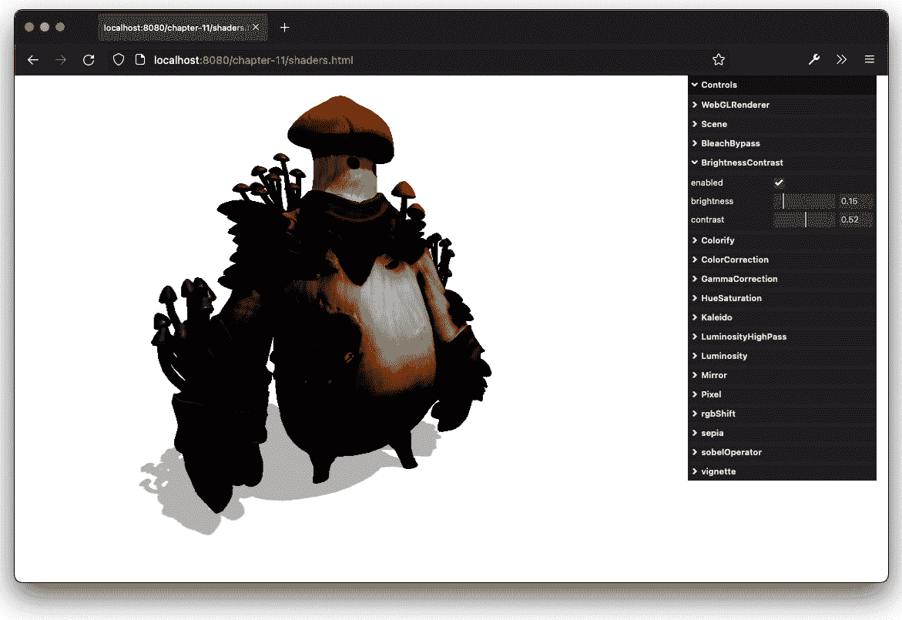

图 11.18 – BrightnessContractShader 效果

`SobelOperatorShader`效果检测轮廓：

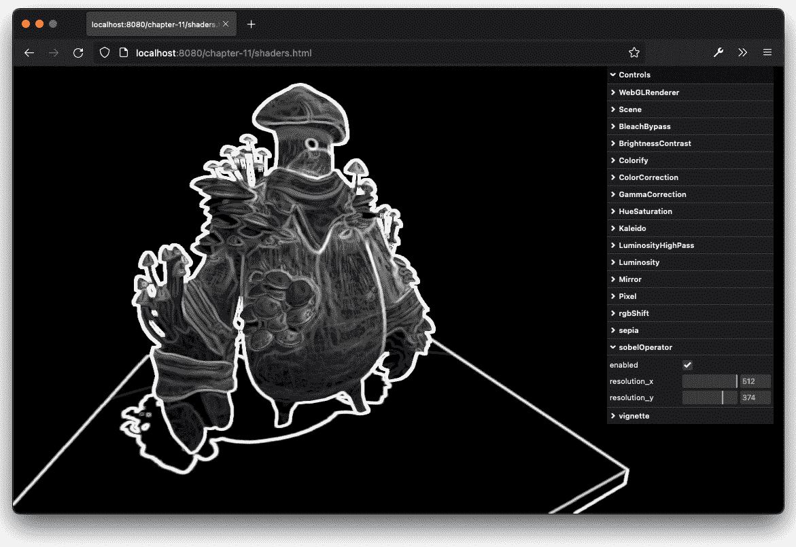

图 11.19 – SobelOperatorShader 效果

您可以使用`KaleidoShader`创建万花筒效果：

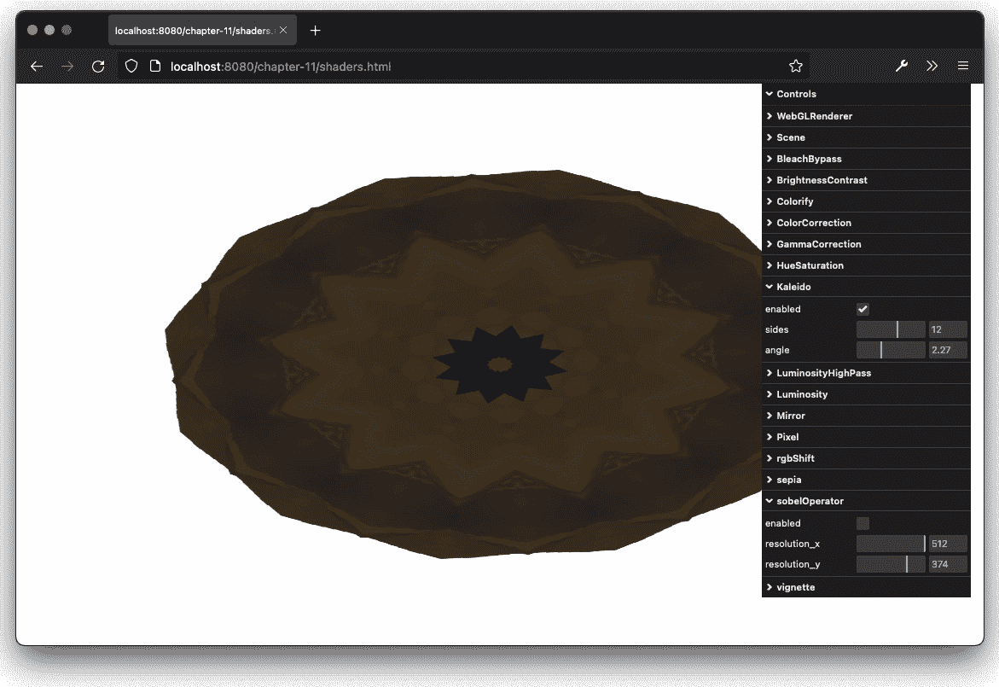

图 11.20 – KaleidoShader 效果

您可以使用`MirrorShader`镜像场景的一部分：

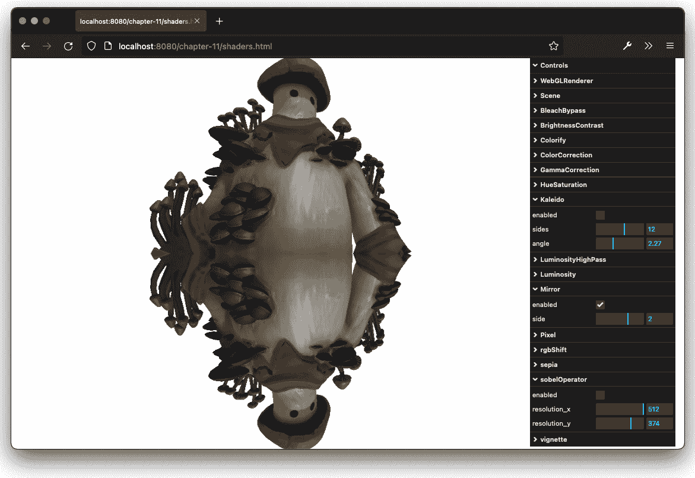

图 11.21 – MirrorShader 效果

`RGBShiftShader`效果如下：

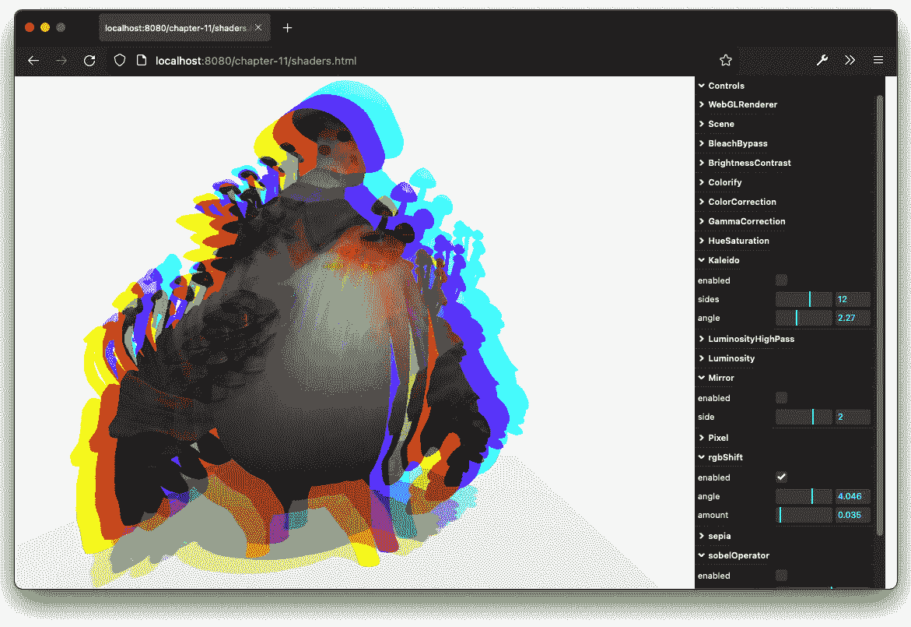

图 11.22 – RGBShiftShader 效果

您可以使用`LuminosityHighPassShader`在场景中调整亮度：

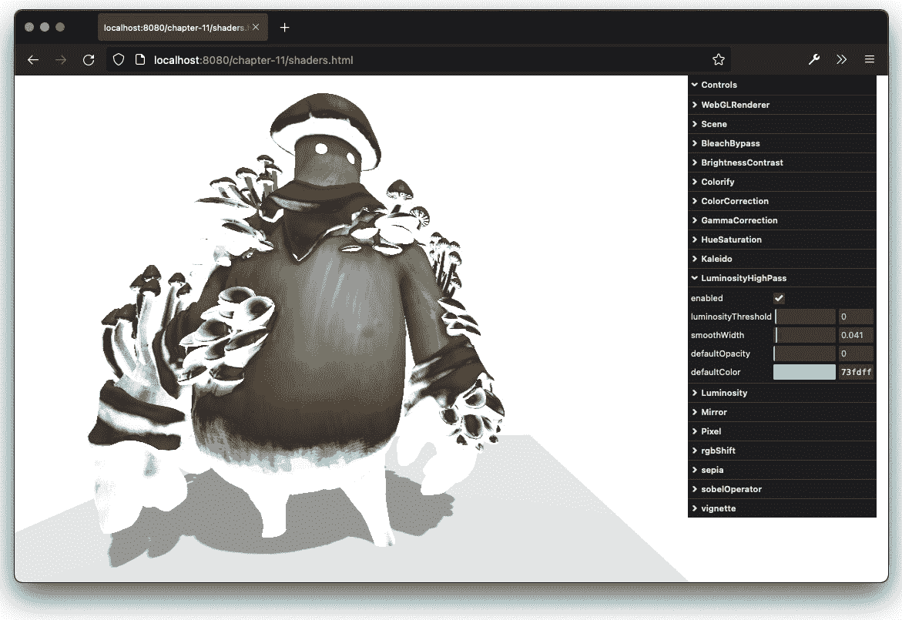

图 11.23 – LuminosityHighPassShader 效果

要查看其他效果，请使用右侧菜单查看它们的功能以及如何配置。Three.js 还提供了一些专门用于添加模糊效果的着色器。这些着色器将在下一节中展示。

## 模糊着色器

在本节中，我们不会深入代码；我们只会展示各种模糊着色器的结果。你可以通过使用 `shaders-blur.html` 示例来实验这些着色器。展示的前两个着色器是 `HorizontalBlurShader` 和 `VerticalBlurShader`：

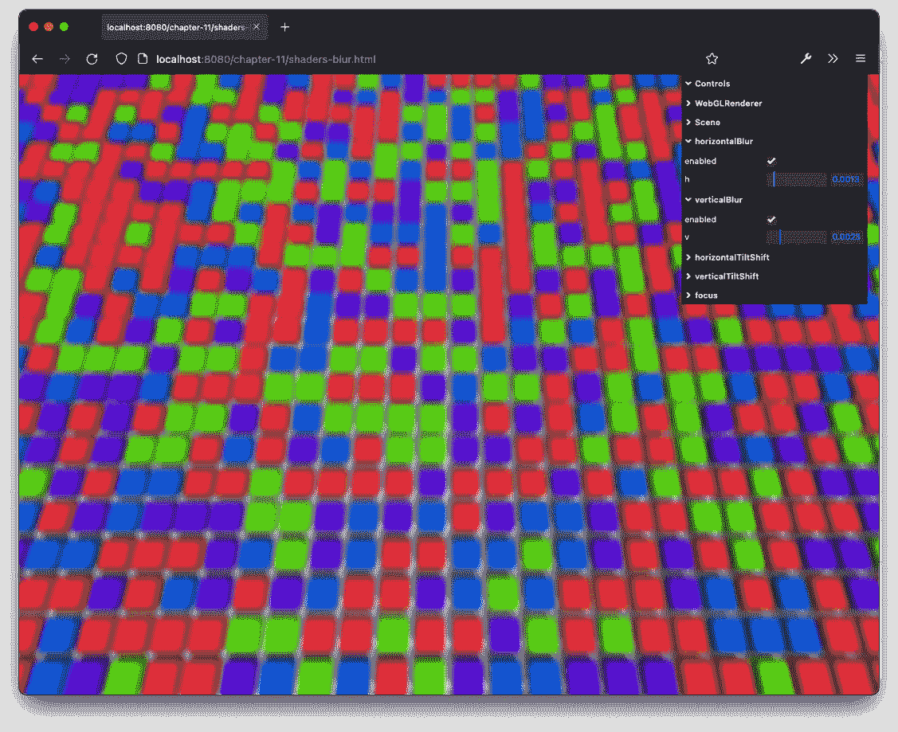

图 11.24 – 水平模糊着色器和垂直模糊着色器

另一种类似模糊的效果由 `HorizontalTiltShiftShader` 和 `VerticalTiltShiftShader` 提供。这种着色器不会模糊整个场景，而只是一个小区域。这产生了一种称为倾斜移位的效果。这通常用于从普通照片中创建类似微缩模型的效果。以下截图显示了此效果：

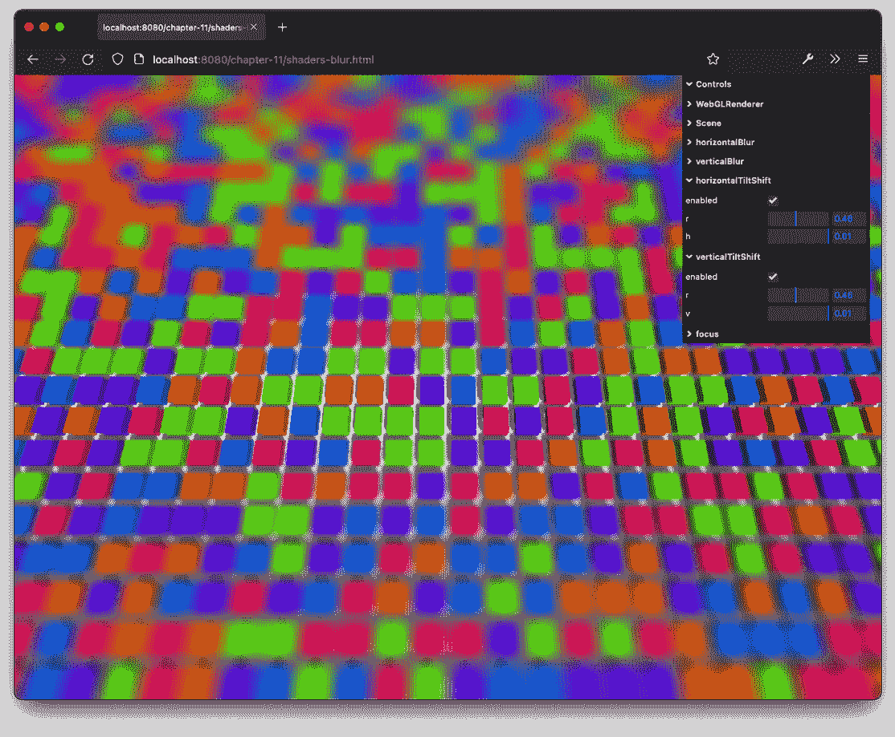

图 11.25 – 水平倾斜移位着色器和垂直倾斜移位着色器

最后一种类似模糊的效果由 `FocusShader` 提供：

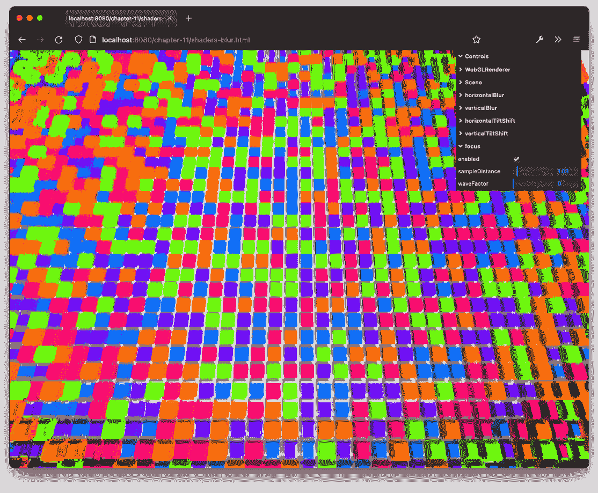

图 11.26 – 聚焦着色器

到目前为止，我们使用了 Three.js 提供的着色器。然而，你也可以为 `THREE.EffectComposer` 编写自己的着色器。

# 创建自定义后处理着色器

在本节中，你将学习如何创建一个可以在后处理中使用的自定义着色器。我们将创建两个不同的着色器。第一个将当前图像转换为灰度图像，第二个将通过减少可用的颜色数量将图像转换为 8 位图像。

顶点和片段着色器

创建顶点和片段着色器是一个非常广泛的主题。在本节中，我们只会触及这些着色器可以做什么以及它们是如何工作的表面。对于更深入的信息，你可以在 [`www.khronos.org/webgl/`](http://www.khronos.org/webgl/) 找到 WebGL 规范。另一个充满示例的资源是 Shadertoy，可在 [`www.shadertoy.com`](https://www.shadertoy.com) 或 *The Book of* *Shaders* [`thebookofshaders.com/`](https://thebookofshaders.com/) 找到。

## 自定义灰度着色器

要为 Three.js（以及其他 WebGL 库）创建自定义着色器，你必须创建两个组件：一个顶点着色器和一个片段着色器。顶点着色器可以用来改变单个顶点的位置，而片段着色器可以用来确定单个像素的颜色。对于后处理着色器，我们只需要实现一个片段着色器，并且可以保留 Three.js 提供的默认顶点着色器。

在查看代码之前，一个重要的问题是 GPU 支持多个着色器管线。这意味着顶点着色器可以在多个顶点上同时并行运行，片段着色器也是如此。

让我们先看看应用于我们的图像以产生灰度效果的着色器的完整源代码（`custom-shader.js`）：

```js
export const CustomGrayScaleShader = {
  uniforms: {
    tDiffuse: { type: 't', value: null },
    rPower: { type: 'f', value: 0.2126 },
    gPower: { type: 'f', value: 0.7152 },
    bPower: { type: 'f', value: 0.0722 }
  },
  // 0.2126 R + 0.7152 G + 0.0722 B
  // vertexshader is always the same for postprocessing 
     steps
  vertexShader: [
    'varying vec2 vUv;',
    'void main() {',
    'vUv = uv;',
    'gl_Position = projectionMatrix * modelViewMatrix * 
      vec4( position, 1.0 );',
    '}'
  ].join('\n'),
  fragmentShader: [
    // pass in our custom uniforms
    'uniform float rPower;',
    'uniform float gPower;',
    'uniform float bPower;',
    // pass in the image/texture we'll be modifying
    'uniform sampler2D tDiffuse;',
    // used to determine the correct texel we're working on
    'varying vec2 vUv;',
    // executed, in parallel, for each pixel
    'void main() {',
    // get the pixel from the texture we're working with 
       (called a texel)
    'vec4 texel = texture2D( tDiffuse, vUv );',
    // calculate the new color
    'float gray = texel.r*rPower + texel.g*gPower + 
      texel.b*bPower;',
    // return this new color
    'gl_FragColor = vec4( vec3(gray), texel.w );',
    '}'
  ].join('\n')
}
```

定义着色器的另一种方法

在*第四章*中，我们展示了如何将着色器定义在独立的单独文件中。在 Three.js 中，大多数着色器遵循前面代码片段中看到的结构。这两种方法都可以用来定义着色器的代码。

如前述代码块所示，这并不是 JavaScript。当你编写着色器时，你使用的是**OpenGL 着色语言**（**GLSL**），它看起来很像 C 编程语言。有关 GLSL 的更多信息，请参阅[`www.khronos.org/opengles/sdk/docs/manglsl/`](http://www.khronos.org/opengles/sdk/docs/manglsl/)。

首先，让我们看看顶点着色器：

```js
  vertexShader: [
    'varying vec2 vUv;',
    'void main() {',
    'vUv = uv;',
    'gl_Position = projectionMatrix * modelViewMatrix * 
      vec4( position, 1.0 );',
    '}'
  ].join('\n'),
```

对于后期处理，这个着色器实际上并不需要做任何事情。前面的代码是 Three.js 实现顶点着色器的标准方式。它使用`projectionMatrix`，这是从相机来的投影，以及`modelViewMatrix`，它将对象的位置映射到世界位置，以确定在屏幕上渲染顶点的位置。对于后期处理，这段代码中唯一有趣的事情是`uv`值，它指示从纹理中读取哪个 texel，通过`varying vec2` `vUv`变量传递到片段着色器。

这可以用来在片段着色器中修改像素。现在，让我们来看看片段着色器，看看代码在做什么。我们将从以下变量声明开始：

```js
  'uniform float rPower;',
  'uniform float gPower;',
  'uniform float bPower;',
  'uniform sampler2D tDiffuse;',
  'varying vec2 vUv;',
```

在这里，我们可以看到四个`uniform`属性的实例。`uniform`属性的实例具有从 JavaScript 传递到着色器的值，这些值对于每个处理的片段都是相同的。在这种情况下，我们传递了三个由类型`float`（用于确定要包含在最终灰度图像中的颜色的比例）标识的浮点数，以及一个纹理（`tDiffuse`），由类型`tDiffuse`标识。这个纹理包含来自`EffectComposer`实例的前一个传递中的图像。Three.js 确保当使用`tDiffuse`作为其名称时，这个纹理会被传递到这个着色器。我们也可以自己设置`uniform`属性的其它实例。在我们能够从 JavaScript 中使用这些 uniform 之前，我们必须定义我们想要暴露给 JavaScript 的`uniform`属性。这是在着色器文件顶部按照以下方式完成的：

```js
uniforms: {
"tDiffuse": { type: "t", value: null },
"rPower":   { type: "f", value: 0.2126 },
"gPower":   { type: "f", value: 0.7152 },
"bPower":   { type: "f", value: 0.0722 }
},
```

到目前为止，我们可以从 Three.js 接收配置参数，这将提供当前渲染的输出。让我们看看将每个像素转换为灰度像素的代码：

```js
"void main() {",
"vec4 texel = texture2D( tDiffuse, vUv );",
"float gray = texel.r*rPower + texel.g*gPower + 
  texel.b*bPower;", "gl_FragColor = vec4( vec3(gray), 
    texel.w );"
```

这里发生的情况是我们从传入的纹理中获取正确的像素。我们通过使用`texture2D`函数来完成这个操作，其中我们传入当前图像（`tDiffuse`）和我们想要分析的像素位置（`vUv`）。结果是包含颜色和不透明度（`texel.w`）的纹理像素（texel，纹理中的像素）。接下来，我们使用这个 texel 的`r`、`g`和`b`属性来计算一个灰度值。这个灰度值被设置为`gl_FragColor`变量，最终显示在屏幕上。并且，这样我们就有了自己的自定义着色器。这个着色器是以我们在本章中已经看到几次的方式使用的。首先，我们只需要设置`EffectComposer`，如下所示：

```js
const effectCopy = new ShaderPass(CopyShader)
effectCopy.renderToScreen = true
const grayScaleShader = new ShaderPass
  (CustomGrayScaleShader)
const gammaCorrectionShader = new ShaderPass
  (GammaCorrectionShader)
const composer = new EffectComposer(renderer)
composer.addPass(new RenderPass(scene, camera))
composer.addPass(grayScaleShader)
composer.addPass(gammaCorrectionShader)
composer.addPass(effectCopy)
```

我们在渲染循环中调用`composer.render()`。如果我们想在运行时更改这个着色器的属性，我们只需更新我们定义的`uniforms`属性，如下所示：

```js
shaderPass.uniforms.rPower.value = ...; 
shaderPass.uniforms.gPower.value = ...; 
shaderPass.uniforms.bPower.value = ...;
```

结果可以在`custom-shaders-scene.html`中看到。以下截图显示了此示例：

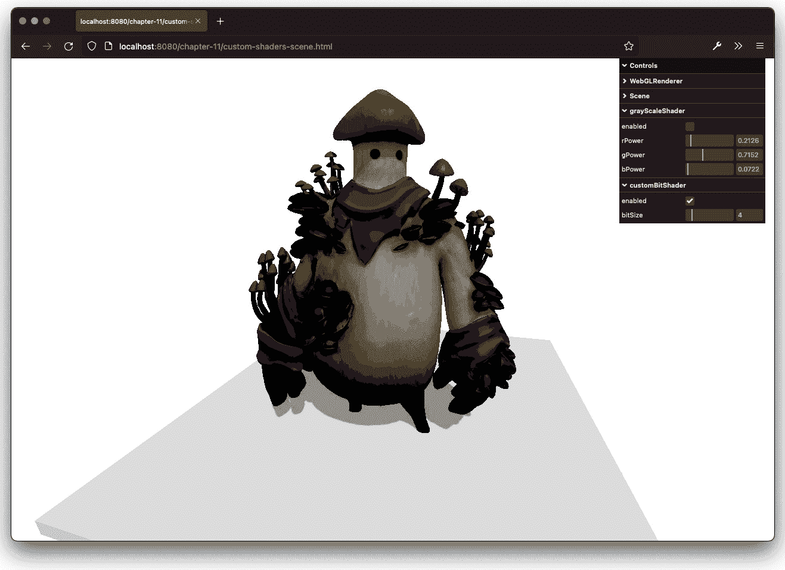

图 11.27 – 自定义灰度过滤

让我们创建另一个自定义着色器。这次，我们将 24 位输出减少到更低的位计数。

## 创建自定义位着色器

通常，颜色以 24 位值表示，这给我们大约 1600 万种不同的颜色。在计算机的早期阶段，这是不可能的，颜色通常以 8 位或 16 位颜色表示。使用这个着色器，我们将自动将 24 位输出转换为 4 位颜色深度（或任何你想要的）。

由于顶点着色器与我们的前一个示例相同，我们将跳过顶点着色器，直接列出`uniforms`属性的定义：

```js
uniforms: {
  "tDiffuse": { type: "t", value: null },
  "bitSize":    { type: "i", value: 4 }
}
```

`fragmentShader`代码如下：

```js
  fragmentShader: [
    'uniform int bitSize;',
    'uniform sampler2D tDiffuse;',
    'varying vec2 vUv;',
    'void main() {',
    'vec4 texel = texture2D( tDiffuse, vUv );',
    'float n = pow(float(bitSize),2.0);',
    'float newR = floor(texel.r*n)/n;',
    'float newG = floor(texel.g*n)/n;',
    'float newB = floor(texel.b*n)/n;',
    'gl_FragColor = vec4( vec3(newR,newG,newB), 1.0);',
    '}'
  ].join('\n')
```

我们定义了两个`uniform`属性的实例，可以用来配置这个着色器。第一个是 Three.js 用来传入当前屏幕的，第二个是我们定义的整数（`type:"i"`），作为我们想要渲染结果的颜色深度。代码本身非常直接：

1.  首先，我们根据传入的像素位置`vUv`从`tDiffuse`纹理中获取`texel`。

1.  我们根据`bitSize`属性计算我们可以拥有的颜色数量，通过计算`2`的`bitSize`次方（`pow(float(bitSize),2.0)`）。

1.  接下来，我们通过将此值乘以`n`，四舍五入（`floor(texel.r*n)`），然后再除以`n`来计算`texel`颜色的新值。

1.  结果被设置为`gl_FragColor`（红色、绿色和蓝色值以及不透明度）并在屏幕上显示。

你可以在我们之前的自定义着色器相同的示例`custom-shaders-scene.html`中查看这个自定义着色器的结果。以下截图显示了此示例，我们将位大小设置为 4。这意味着模型只以 16 种颜色渲染：

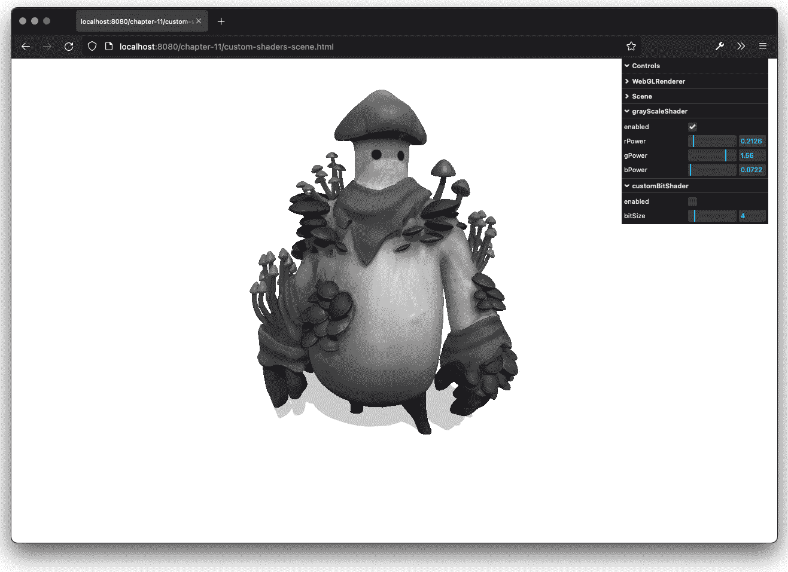

图 11.28 – 自定义位过滤

本章关于后处理的介绍到此结束。

# 摘要

我们在本章中讨论了许多不同的后处理选项。正如你所见，创建`EffectComposer`并将多个步骤链接起来实际上非常简单。你只需记住几点。并非所有步骤都会在屏幕上产生输出。如果你想输出到屏幕，你可以始终使用带有`CopyShader`的`ShaderPass`。你将步骤添加到作曲家的顺序很重要。效果将按照这个顺序应用。如果你想重用特定`EffectComposer`实例的结果，你可以通过使用`TexturePass`来实现。当你有多个`RenderPass`在你的`EffectComposer`中时，确保将`clear`属性设置为`false`。如果不这样做，你将只能看到最后一个`RenderPass`步骤的输出。如果你想只将效果应用到特定的对象上，你可以使用`MaskPass`。当你完成遮罩后，使用`ClearMaskPass`清除遮罩。除了 Three.js 提供的标准步骤外，还有许多标准着色器可用。你可以将这些与`ShaderPass`一起使用。使用 Three.js 的标准方法创建自定义后处理着色器非常简单。你只需创建一个片段着色器。

我们现在已经涵盖了关于 Three.js 核心的几乎所有知识。在*第十二章* *向场景添加物理和声音*中，我们将探讨一个名为 Rapier.js 的库，你可以使用它来扩展 Three.js 以添加物理效果，以便应用碰撞、重力和约束。
