# 为您的场景添加物理和声音

在本章中，我们将探讨 Rapier，这是另一个可以用来扩展 Three.js 基本功能的库。Rapier 是一个库，允许您将物理引入您的 3D 场景。当我们提到物理时，我们指的是您的对象受到重力的影响——它们可以相互碰撞，可以通过施加冲量来移动，并且可以通过不同类型的关节来限制它们的运动。除了物理之外，我们还将探讨 Three.js 如何帮助您向场景添加空间声音。

在本章中，我们将讨论以下主题：

+   创建一个 Rapier 场景，其中您的对象受到重力影响并可以相互碰撞

+   展示如何更改场景中对象的摩擦力和恢复力（弹性）

+   解释 Rapier 支持的形状及其使用方法

+   展示如何通过组合简单形状来创建复合形状

+   展示如何通过高度场模拟复杂形状

+   通过使用关节将对象连接到其他对象来限制对象的运动

+   向场景添加声音源，其声音大小和方向基于与摄像机的距离

可用的物理引擎

有许多不同的开源 JavaScript 物理引擎可供选择。尽管大多数引擎都没有处于活跃开发状态。然而，Rapier 正处于活跃开发中。Rapier 是用 Rust 编写的，并且交叉编译成 JavaScript，因此您可以在浏览器中使用它。如果您选择使用其他库，本章中的信息仍然有用，因为大多数库都使用本章中展示的相同方法。因此，尽管实现和使用的类和函数可能不同，但本章中展示的概念和设置在大多数情况下都将适用于您选择的任何物理库。

# 使用 Rapier 创建基本的 Three.js 场景

要开始，我们创建了一个非常基本的场景，其中有一个立方体掉落并击中一个平面。您可以通过查看`physics-setup.html`示例来查看此示例：

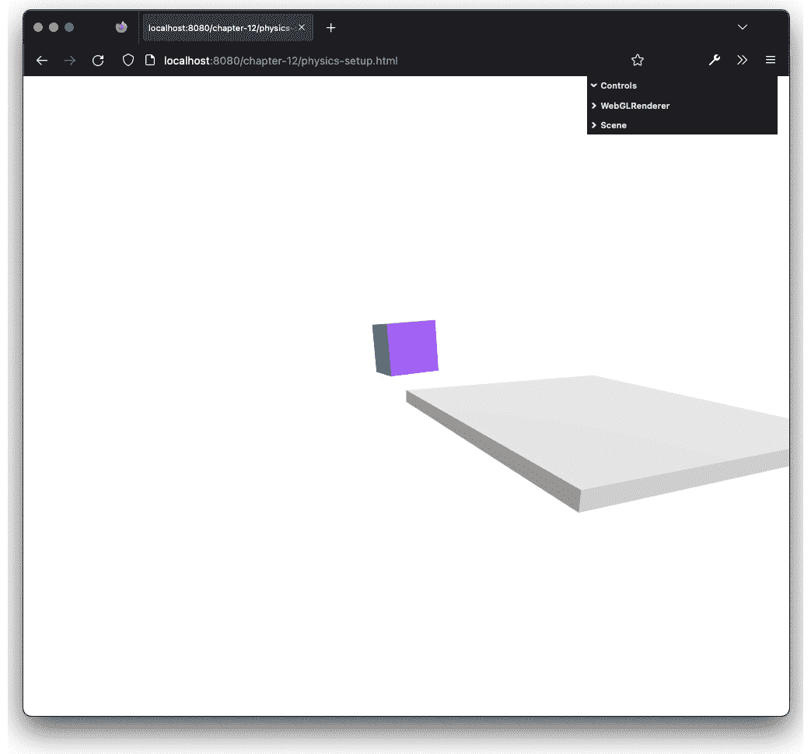

图 12.1 – 简单的 Rapier 物理

当您打开此示例时，您会看到立方体缓慢掉落，击中灰色水平平面的角落，并从其上弹跳。我们可以通过更新立方体的位置和旋转以及编程其反应来实现这一点。然而，这相当困难，因为我们需要确切知道它何时击中，在哪里击中，以及立方体在击中后应该如何旋转。使用 Rapier，我们只需配置物理世界，Rapier 就会精确计算场景中对象的运动情况。

在我们可以配置模型使用 Rapier 引擎之前，我们需要在我们的项目中安装 Rapier（我们已安装，所以如果您在本章提供的示例中进行实验，您不需要这样做）：

```js
$ yarn add @dimforge/rapier3d
```

一旦添加，我们需要将 Rapier 导入到我们的项目中。这与我们之前看到的正常导入略有不同，因为 Rapier 需要加载额外的 WebAssembly 资源。这是必要的，因为 Rapier 库是用 Rust 语言开发的，并编译成 WebAssembly，以便也可以在网络上使用。要使用 Rapier，我们需要像这样包装我们的脚本：

```js
import * as THREE from 'three'
import { RigidBodyType } from '@dimforge/rapier3d'
// maybe other imports
import('@dimforge/rapier3d').then((RAPIER) => {
  // the code
}
```

最后这个导入语句将异步加载 Rapier 库，并在所有数据加载和解析完成后调用回调。在代码的其余部分，你只需调用 `RAPIER` 对象即可访问 Rapier 特定的功能。

要使用 Rapier 设置一个场景，我们需要做一些事情：

1.  创建一个 Rapier `World`。这定义了我们正在模拟的物理世界，并允许我们定义将应用于该世界中物体的重力。

1.  对于你想要用 Rapier 模拟的每个对象，你必须定义一个 `RigidBodyDesc`。这定义了场景中一个对象的位置和旋转（以及一些其他属性）。通过将这个描述添加到 `World` 实例中，你将得到一个 `RigidBody`。

1.  接下来，你可以通过创建一个 `ColliderDesc` 对象来告诉 Rapier 你要添加的对象的形状。这将告诉 Rapier 你的对象是一个立方体、球体、圆锥体或其他形状；它有多大；它与其他物体之间的摩擦力有多大；以及它的弹性如何。这个描述将与之前创建的 `RigidBody` 结合，以创建一个 `Collider` 实例。

1.  在我们的动画循环中，我们现在可以调用 `world.step()`，这将使 Rapier 计算它所了解的所有 `RigidBody` 对象的新位置和旋转。

在线 Rapier 文档

在这本书中，我们将查看 Rapier 的各种属性。我们不会探索 Rapier 提供的全部功能，因为那可以填满一本书。有关 Rapier 的更多信息，请参阅此处：[`rapier.rs/docs/`](https://rapier.rs/docs/)。

让我们一步步走过这些步骤，看看你是如何将它们与你已经熟悉的 Three.js 对象结合起来的。

## 设置世界和创建描述

我们需要做的第一件事是创建我们正在模拟的 `World`：

```js
const gravity = { x: 0.0, y: -9.81, z: 0.0 }
const world = new RAPIER.World(gravity)
```

这是一段简单的代码，我们创建了一个在 *y* 轴上有 `-9.81` 重力的 `World`。这与地球上的重力相似。

接下来，让我们定义我们在示例中看到的 Three.js 对象：一个下落的立方体和它撞击的地板：

```js
const floor = new THREE.Mesh(
  new THREE.BoxGeometry(5, 0.25, 5),
  new THREE.MeshStandardMaterial({color: 0xdddddd})
)
floor.position.set(2.5, 0, 2.5)
const sampleMesh = new THREE.Mesh(
  new THREE.BoxGeometry(1, 1, 1),
  new THREE.MeshNormalMaterial()
)
sampleMesh.position.set(0, 4, 0)
scene.add(floor)
scene.add(sampleMesh)
```

这里没有什么新的。我们只是定义了两个 `THREE.Mesh` 对象，并将 `sampleMesh` 实例，即立方体，放置在 `floor` 表面角落上方。接下来，我们需要创建 `RigidBodyDesc` 和 `ColliderDesc` 对象，这些对象代表 Rapier 世界中的 `THREE.Mesh` 对象。我们将从简单的开始，即地板：

```js
const floorBodyDesc = new RAPIER.RigidBodyDesc
  (RigidBodyType.Fixed)
const floorBody = world.createRigidBody(floorBodyDesc)
floorBody.setTranslation({ x: 2.5, y: 0, z: 2.5 })
const floorColliderDesc = RAPIER.ColliderDesc.cuboid
  (2.5, 0.125, 2.5)
world.createCollider(floorColliderDesc, floorBody)
```

在这里，首先，我们创建一个带有单个参数的 `RigidBodyDesc`，即 `RigidBodyType.Fixed`。一个固定刚体意味着 Rapier 不允许改变这个对象的位置或旋转，因此这个对象不会受到重力的影响，也不会在另一个对象撞击时移动。通过调用 `world.createRigidBody`，我们将它添加到 Rapier 所知的 `world` 中，这样 Rapier 就可以在进行计算时考虑这个对象。然后，我们使用 `setTranslation` 将 `RigidBody` 放置在与我们的 Three.js 地板相同的位置。`setTranslation` 函数有一个可选的额外参数，称为 `wakeUp`。如果 `RigidBody` 正在睡眠（如果它长时间没有移动，可能会发生这种情况），将 `true` 传递给 `wakeUp` 属性确保 Rapier 在确定所有已知对象的新位置时将考虑 `RigidBody`。

我们仍然需要定义这个对象的外形，以便 Rapier 可以判断它何时与另一个对象发生碰撞。为此，我们使用 `Rapier.ColliderDesc.cuboid` 函数来指定形状。对于 `cuboid` 函数，Rapier 预期形状由半宽、半高和半深度定义。最后一步是将这个碰撞器添加到世界中，并将其连接到地板。为此，我们使用 `world.createCollider` 函数。

到目前为止，我们在 Rapier 世界中定义了 `floor`，这与我们的 Three.js 场景中的地板相对应。现在，我们定义将同样下落的立方体：

```js
Const rigidBodyDesc = new RAPIER.RigidBodyDesc
(RigidBodyType.Dynamic)
    .setTranslation(0, 4, 0)
const rigidBody = world.createRigidBody(rigidBodyDesc)
const rigidBodyColliderDesc = RAPIER.ColliderDesc.cuboid
  (0.5, 0.5, 0.5)
const rigidBodyCollider = world.createCollider
  (rigidBodyColliderDesc, rigidBody)
rigidBodyCollider.setRestitution(1)
```

这段代码与上一个类似——我们只是创建了与我们的 Three.js 场景中的对象相对应的 Rapier 相关对象。这里的主要变化是我们使用了 `RigidBodyType.Dynamic` 实例。这意味着这个对象可以完全由 Rapier 管理。Rapier 可以改变它的位置或平移。

Rapier 提供的附加刚体类型

除了 `Dynamic` 和 `Fixed` 刚体类型之外，Rapier 还提供了一个 `KinematicPositionBased` 类型，用于管理对象的位置，或者一个 `KinematicVelocityBased` 类型，用于我们自己管理对象的速度。更多相关信息请参阅此处：[`rapier.rs/docs/user_guides/javascript/rigid_bodies`](https://rapier.rs/docs/user_guides/javascript/rigid_bodies)。

## 渲染场景和模拟世界

剩下的工作是将 Three.js 对象渲染出来，模拟世界，并确保 Rapier 管理的对象的位置与 Three.js 网格的位置相对应：

```js
  const animate = (renderer, scene, camera) => {
    // basic animation loop
    requestAnimationFrame(() => animate(renderer, scene,
      camera))
    renderer.render(scene, camera)
    world.step()
    // copy over the position from Rapier to Three.js
    const rigidBodyPosition = rigidBody.translation()
    sampleMesh.position.set(
      rigidBodyPosition.x,
      rigidBodyPosition.y,
      rigidBodyPosition.z)
    // copy over the rotation from Rapier to Three.js
    const rigidBodyRotation = rigidBody.rotation()
    sampleMesh.rotation.setFromQuaternion(
      new THREE.Quaternion(rigidBodyRotation.x,
        rigidBodyRotation.y, rigidBodyRotation.z,
          rigidBodyRotation.w)
    )
  }
```

在我们的渲染循环中，我们有正常的 Three.js 元素来确保我们使用`requestAnimationFrame`在每一步渲染。除此之外，我们调用`world.step()`函数来触发 Rapier 中的计算。这将更新它所知道的所有物体的位置和旋转。接下来，我们需要确保这些新计算出的位置也通过 Three.js 对象反映出来。为此，我们只需获取 Rapier 世界中一个物体的当前位置（`rigidBody.translation()`）并将 Three.js 网格的位置设置为该函数的结果。对于旋转，我们同样这样做，首先在`rigidBody`上调用`rotation()`，然后将该旋转应用到我们的 Three.js 网格上。Rapier 使用四元数来定义旋转，因此在我们将旋转应用到 Three.js 网格之前，我们需要进行这种转换。

这就是您需要做的全部。以下各节中的所有示例都使用这种方法：

+   设置 Three.js 场景

+   在 Rapier 世界中设置一组类似的对象

+   确保在每个`step`之后，Three.js 场景和 Rapier 世界的位置和旋转再次对齐

在下一节中，我们将扩展这个示例，并展示更多关于在 Rapier 世界中物体如何相互作用的细节。

# 在 Rapier 中模拟多米诺

以下示例建立在我们在*设置世界和创建描述*部分查看的相同核心概念之上。您可以通过打开`dominos.html`示例来查看此示例：

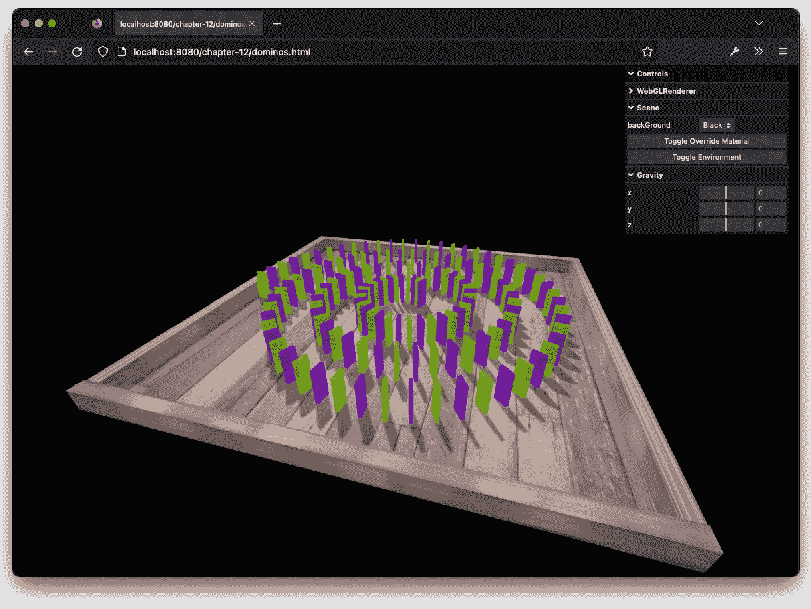

图 12.2 – 没有重力时静止的多米诺

在这里，您可以看到我们创建了一个简单的地板，许多多米诺就放置在这个地板上。如果您仔细观察，您会看到这些多米诺的第一个实例略微倾斜。如果您通过右侧菜单启用*y*轴上的重力，您会看到第一个多米诺倒下，撞到下一个，以此类推，直到所有多米诺都被撞倒：

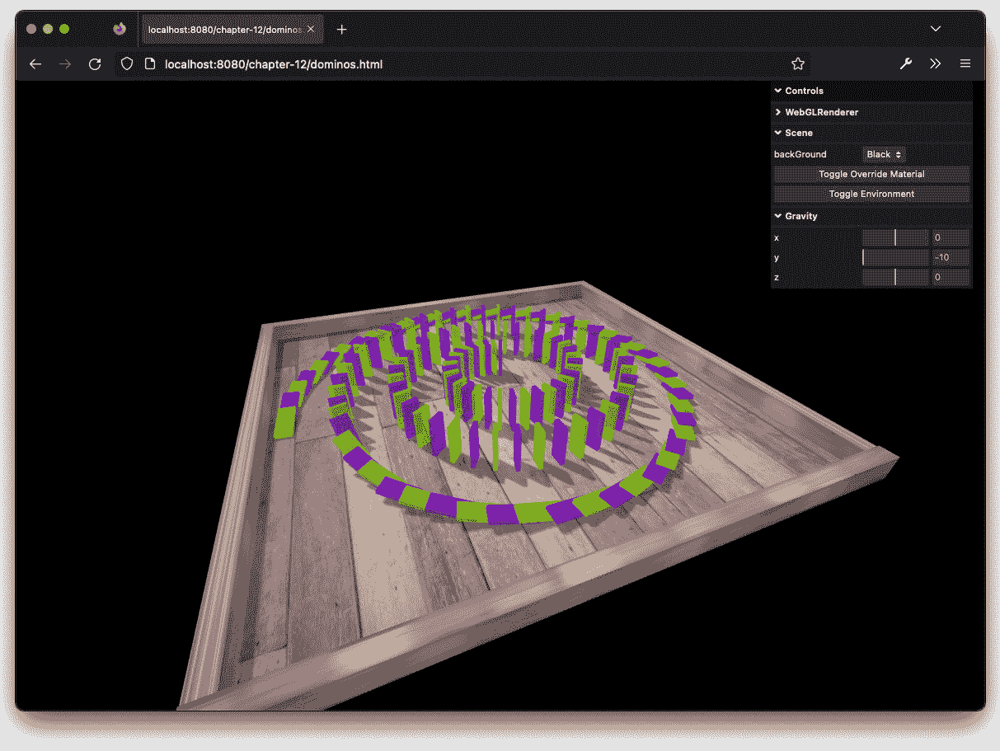

图 12.3 – 第一个多米诺被推倒后多米诺倒下

使用 Rapier 创建这个示例非常直接。我们只需创建代表多米诺的 Three.js 对象，创建相关的 Rapier `RigidBody`和`Collider`元素，并确保 Rapier 对象的更改通过 Three.js 对象反映出来。

首先，让我们快速看一下我们是如何创建 Three.js 多米诺的：

```js
const createDominos = () => {
    const getPoints = () => {
      const points = []
      const r = 2.8; const cX = 0; const cY = 0
      let circleOffset = 0
      for (let i = 0; i < 1200; i += 6 + circleOffset) {
        circleOffset = 1.5 * (i / 360)
        const x = (r / 1440) * (1440 - i) * Math.cos(i *
          (Math.PI / 180)) + cX
        const z = (r / 1440) * (1440 - i) * Math.sin(i *
          (Math.PI / 180)) + cY
        const y = 0
        points.push(new THREE.Vector3(x, y, z))
      }
      return points
    }
    const stones = new Group()
    stones.name = 'dominos'
    const points = getPoints()
    points.forEach((point, index) => {
      const colors = [0x66ff00, 0x6600ff]
      const stoneGeom = new THREE.BoxGeometry
        (0.05, 0.5, 0.2)
      const stone = new THREE.Mesh(
        stoneGeom,
        new THREE.MeshStandardMaterial({color: colors[index
        % colors.length], transparent: true, opacity: 0.8})
      )
      stone.position.copy(point)
      stone.lookAt(new THREE.Vector3(0, 0, 0))
      stones.add(stone)
    })
    return stones
  }
```

在此代码片段中，我们使用`getPoints`函数确定多米诺的位置。此函数返回一个`THREE.Vector3`对象的列表，代表单个石头的位置。每个石头都沿着从中心向外螺旋排列。接下来，这些`points`被用来在相同的位置创建多个`THREE.BoxGeometry`对象。为了确保多米诺的方向正确，我们使用`lookAt`函数使它们“看向”圆的中心。所有多米诺都被添加到一个`THREE.Group`对象中，然后我们将其添加到一个`THREE.Scene`实例中（这在代码片段中没有显示）。

现在我们有了我们的`THREE.Mesh`对象集，我们可以创建相应的 Rapier 对象集：

```js
const rapierDomino = (mesh) => {
  const stonePosition = mesh.position
  const stoneRotationQuaternion = new THREE.Quaternion().
    setFromEuler(mesh.rotation)
  const dominoBodyDescription = new RAPIER.RigidBodyDesc
    (RigidBodyType.Dynamic)
    .setTranslation(stonePosition.x, stonePosition.y,
      stonePosition.z)
    .setRotation(stoneRotationQuaternion))
    .setCanSleep(false)
    .setCcdEnabled(false)
  const dominoRigidBody = world.createRigidBody
    (dominoBodyDescription)
  const geometryParameters = mesh.geometry.parameters
  const dominoColliderDesc = RAPIER.ColliderDesc.cuboid(
    geometryParameters.width / 2,
    geometryParameters.height / 2,
    geometryParameters.depth / 2
  )
  const dominoCollider = world.createCollider
    (dominoColliderDesc, dominoRigidBody)
  mesh.userData.rigidBody = dominoRigidBody
  mesh.userData.collider = dominoCollider
}
```

这段代码将与*设置世界和创建描述*部分中的代码相似。在这里，我们获取传入的`THREE.Mesh`实例的位置和旋转，并使用这些信息来创建相关的 Rapier 对象。为了确保我们可以在渲染循环中访问`dominoCollider`和`dominoRigidBody`实例，我们将它们添加到传入网格的`userData`属性中。

此处的最后一步是在渲染循环中更新`THREE.Mesh`对象：

```js
  const animate = (renderer, scene, camera) => {
    requestAnimationFrame(() => animate(renderer, scene,
      camera))
    renderer.render(scene, camera)
    world.step()
    const dominosGroup = scene.getObjectByName('dominos')
    dominosGroup.children.forEach((domino) => {
      const dominoRigidBody = domino.userData.rigidBody
      const position = dominoRigidBody.translation()
      const rotation = dominoRigidBody.rotation()
      domino.position.set(position.x, position.y,
        position.z)
      domino.rotation.setFromQuaternion(new
        THREE.Quaternion(rotation.x, rotation.y,
          rotation.z, rotation.w))
    })
  }
```

在每个循环中，我们告诉 Rapier 计算世界的下一个状态（`world.step`），并且对于每个多米诺（它们是名为`dominos`的`THREE.Group`的`children`），我们根据存储在该网格`userdata`信息中的`RigidBody`对象更新`THREE.Mesh`实例的位置和旋转。

在我们继续探讨碰撞体提供的重要属性之前，我们将快速查看重力如何影响这个场景。当你打开这个示例时，借助右侧的菜单，你可以改变世界的重力。你可以使用这个功能来实验多米诺对不同的重力设置的反应。例如，以下示例显示了所有多米诺都倒下后，我们增加了沿*x*轴和*z*轴的重力的情况：

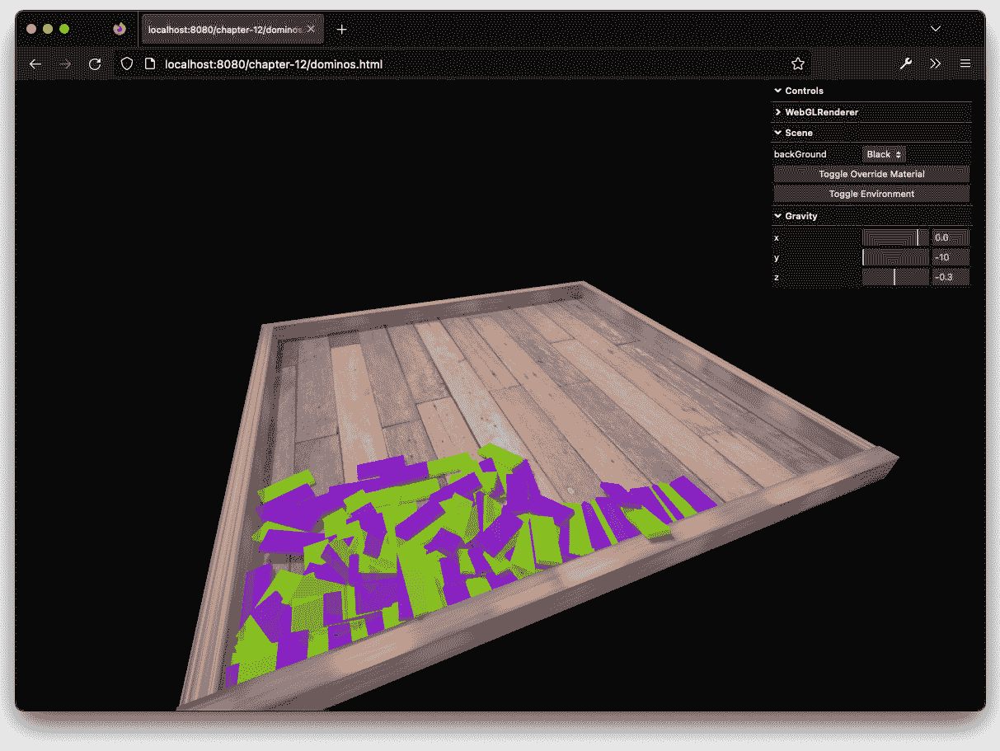

图 12.4 – 不同重力设置的多米诺

在下一节中，我们将展示设置摩擦和恢复系数对 Rapier 对象的影响。

# 处理恢复和摩擦

在下一个示例中，我们将更详细地查看 Rapier 提供的`Collider`的`恢复`和`摩擦`属性。

`恢复`是定义物体在与另一个物体碰撞后保持多少能量的属性。你可以将其视为弹性。网球具有高恢复性，而砖块具有低恢复性。

`摩擦`定义了一个物体在另一个物体上滑动时的容易程度。具有高摩擦的物体在另一个物体上移动时会迅速减速，而具有低摩擦的物体可以轻易滑动。例如，冰具有低摩擦，而砂纸具有高摩擦。

我们可以在构建 `RAPIER.ColliderDesc` 对象时设置这些属性，或者在我们已经使用 `(world.createCollider(...)` 函数创建碰撞体之后设置它。在我们查看代码之前，我们先看看这个例子。对于 `colliders-properties.html` 示例，你会看到一个大的盒子，你可以将形状投入其中：

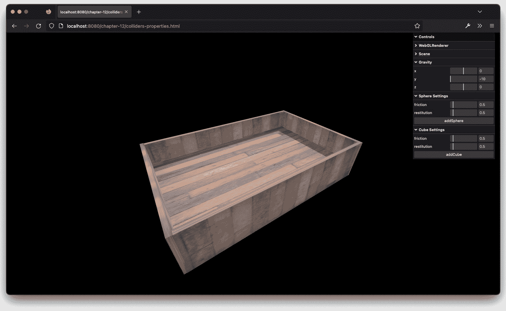

图 12.5 – 可将形状投入的空盒子

使用右侧的菜单，你可以投入球体和立方体形状，并设置添加对象的摩擦和恢复系数。对于第一个场景，我们将添加大量具有高摩擦的立方体。

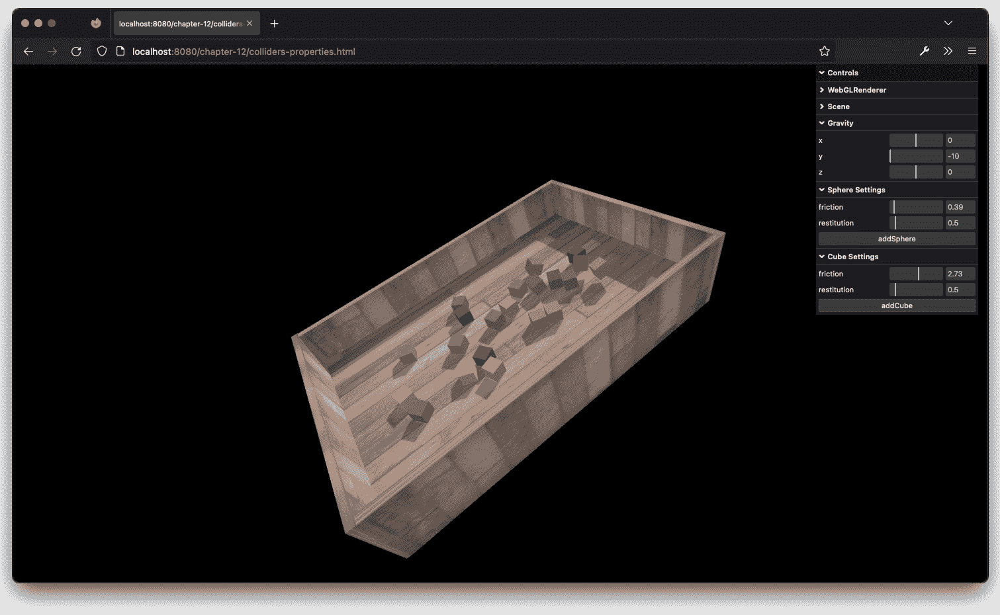

图 12.6 – 高摩擦的立方体盒子

你在这里看到的是，尽管盒子在其轴周围移动，但立方体几乎不移动。这是因为立方体本身具有非常高的摩擦。如果你用低摩擦尝试，你会看到盒子会在盒子的底部滑动。

要设置摩擦，你只需这样做：

```js
const rigidBodyDesc = new RAPIER.RigidBodyDesc
  (RigidBodyType.Dynamic)
const rigidBody = world.createRigidBody(rigidBodyDesc)
const rigidBodyColliderDesc = RAPIER.ColliderDesc.ball(0.2)
const rigidBodyCollider = world.createCollider
  (rigidBodyColliderDesc, rigidBody)
rigidBodyCollider.setFriction(0.5)
```

Rapier 提供了一种控制摩擦的额外方法，那就是通过使用 `setFrictionCombineRule` 函数来设置组合规则。这告诉 Rapier 如何组合两个发生碰撞的物体的摩擦（在我们的例子中，是盒子的底部和立方体）。使用 Rapier，你可以将其设置为以下值：

+   `CoefficientCombineRule.Average`：使用两个系数的平均值

+   `CoefficientCombineRule.Min`：使用两个系数中的最小值

+   `CoefficientCombineRule.Multiply`：使用两个系数的乘积

+   `CoefficientCombineRule.Max`：使用两个系数中的最大值

要探索 `restitution` 的工作原理，我们可以使用这个相同的例子（`colliders-properties.html`）：

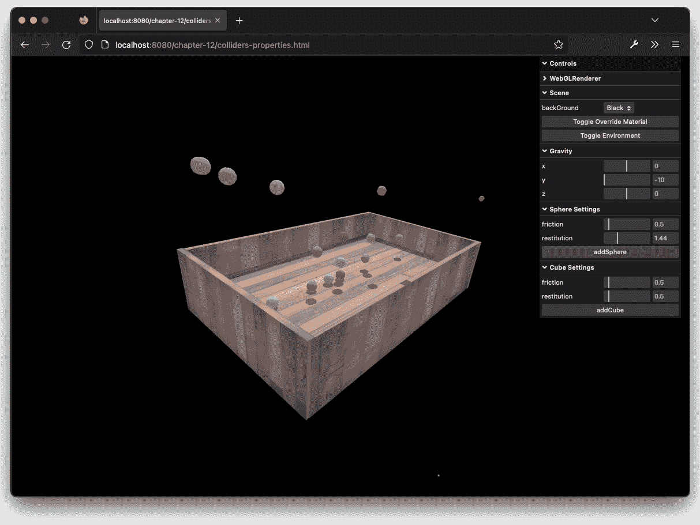


在这里，我们增加了球体的恢复系数。结果是，当添加球体或它们撞击墙壁时，它们现在会在盒子中弹跳。要设置恢复系数，你使用与摩擦相同的方法：

```js
const rigidBodyDesc = new RAPIER.RigidBodyDesc
  (RigidBodyType.Dynamic)
const rigidBody = world.createRigidBody(rigidBodyDesc)
const rigidBodyColliderDesc = RAPIER.ColliderDesc.ball(0.2)
const rigidBodyCollider = world.createCollider
  (rigidBodyColliderDesc, rigidBody)
rigidBodyCollider.setRestitution(0.9)
```

Rapier 还允许你设置如何计算相互碰撞的物体的 `restitution` 属性。你可以使用相同的值，但这次，你使用 `setRestitutionCombineRule` 函数。

`Collider` 有一些额外的属性，你可以使用它们来微调碰撞体如何与 Rapier 的世界视图交互，以及当物体发生碰撞时会发生什么。Rapier 本身提供了非常好的文档。特别是对于碰撞体，你可以在以下位置找到该文档：[`rapier.rs/docs/user_guides/javascript/colliders#restitution`](https://rapier.rs/docs/user_guides/javascript/colliders#restitution)。

# Rapier 支持的形状

Rapier 提供了一些你可以用来包裹你的几何形状的形状。在本节中，我们将带你了解所有可用的 Rapier 形状，并通过一个示例演示这些网格。请注意，要使用这些形状，你需要调用 `RAPIER.ColliderDesc.roundCuboid`、`RAPIER.ColliderDesc.ball` 等等。

Rapier 提供了 3D 形状和 2D 形状。我们只会查看 Rapier 提供的 3D 形状：

+   `球体`: 一个球形状，通过设置球体的半径来配置

+   `胶囊体`: 一个胶囊形状，由胶囊的半高和半径定义

+   `立方体`: 通过传递形状的半宽、半高和半深度来定义的一个简单的立方体形状

+   `高度场`: 高度场是一个形状，其中每个提供的值定义了一个 3D 平面的高度

+   `圆柱体`: 一个由圆柱的半高和半径定义的圆柱形状

+   `圆锥体`: 一个由圆柱底部的半高和半径定义的圆锥形状

+   `凸包`: 凸包是包含所有传入点的最小形状

+   `凸多边形网格`: 凸多边形网格也接受一定数量的点，但假设这些点已经形成一个凸包，因此 Rapier 不会进行任何计算来确定较小的形状

除了这些形状之外，Rapier 还为这些形状中的几个提供了额外的圆形变体：`roundCuboid`、`roundCylinder`、`roundCone`、`roundConvexHull` 和 `roundConvexMesh`。

我们提供了一个另一个示例，你可以看到这些形状的外观以及它们在相互碰撞时的交互。打开 `shapes.html` 示例来查看这一功能：

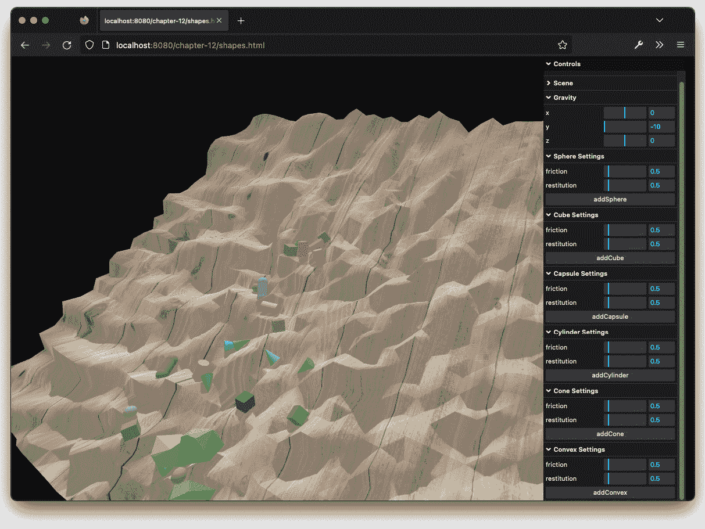

图 12.8 – 在高度场对象上方的形状

当你打开这个示例时，你会看到一个空的 `heightfield` 对象。通过右侧的菜单，你可以添加不同的形状，它们会相互碰撞，并与 `heightfield` 实例碰撞。再次强调，你可以为添加的对象设置特定的 `restitution` 和 `friction` 值。由于我们已经在前面的章节中解释了如何在 Rapier 中添加形状并确保 Three.js 中的相应形状得到更新，所以我们不会在这里详细说明如何从之前的列表中创建形状。对于代码，请查看本章源代码中的 `shapes.js` 文件。

在我们进入关节部分之前，有一个最后的注意事项——当我们想要描绘简单的形状（例如，球体或立方体）时，Rapier 定义这种模型的方式和 Three.js 定义的方式几乎相同。因此，当这种类型的物体与另一个物体碰撞时，它看起来是正确的。当我们有更复杂的形状时，例如在这个例子中的`高度图`实例，Three.js 解释和插值这些点到`高度图`实例的方式以及 Rapier 这样做的方式可能会有细微的差异。你可以通过查看`shapes.html`示例，添加很多不同的形状，然后查看`高度场`的底部来亲自看到这一点：

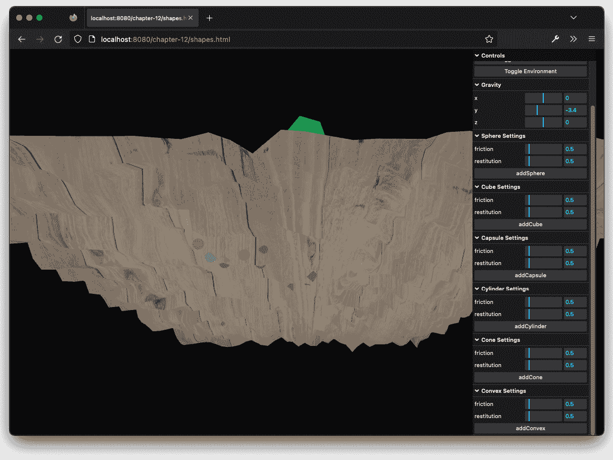

图 12.9 – 高度场的底部

你在这里可以看到的是，我们可以看到不同物体的微小部分从`高度图`中突出出来。原因是 Rapier 确定`高度图`的确切形状的方式与 Three.js 不同。换句话说，Rapier 认为`高度图`看起来略不同于 Three.js。因此，当它确定特定形状在碰撞时的位置时，可能会导致这样的小细节。然而，通过调整大小或创建更简单的物体，这可以很容易地避免。

到目前为止，我们已经探讨了重力和碰撞。Rapier 还提供了一种限制刚体运动和旋转的方法。我们将通过使用关节来解释 Rapier 是如何做到这一点的。

# 使用关节限制物体的运动

到目前为止，我们已经看到了一些基本物理现象。我们看到了各种形状如何响应重力、摩擦和恢复力，以及这如何影响碰撞。Rapier 还提供了高级结构，允许您限制物体的运动。在 Rapier 中，这些物体被称为关节。以下列表概述了 Rapier 中可用的关节：

+   **固定关节**：固定关节确保两个物体相对于彼此不移动。这意味着这两个物体之间的距离和旋转始终相同。

+   **球面关节**：球面关节确保两个物体之间的距离保持不变。然而，这些物体可以在所有三个轴向上围绕彼此移动。

+   **旋转关节**：使用这种关节，两个物体之间的距离保持不变，并且它们可以在一个轴上旋转——例如，方向盘，它只能围绕一个轴旋转。

+   **滑动关节**：与旋转关节类似，但这次，物体之间的旋转是固定的，物体可以在一个轴上移动。这会产生滑动效果——例如，如电梯向上移动。

在接下来的章节中，我们将探讨这些关节，并在示例中看到它们的作用。

## 使用固定关节连接两个物体

最简单的关节是固定关节。使用这个关节，你可以连接两个对象，并且它们将保持在创建关节时指定的相同距离和方向。

这在 `fixed-joint.html` 示例中显示：

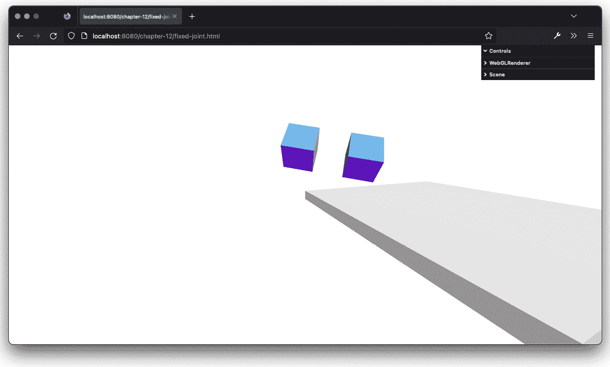

图 12.10 – 连接两个关节的固定关节

正如你在本例中可以看到的，两个立方体作为一个整体移动。这是因为它们通过固定关节连接在一起。为了设置这个，我们首先必须创建两个 `RigidBody` 对象和两个 `Collider` 对象，就像我们在前面的章节中已经看到的那样。接下来我们需要做的是连接这两个对象。为此，我们首先需要定义 `JointData`：

```js
  let params = RAPIER.JointData.fixed(
    { x: 0.0, y: 0.0, z: 0.0 },
    { w: 1.0, x: 0.0, y: 0.0, z: 0.0 },
    { x: 2.0, y: 0.0, z: 0.0 },
    { w: 1.0, x: 0.0, y: 0.0, z: 0.0 }
  )
```

这意味着我们将第一个物体放置在 `{ x: 0.0, y: 0.0, z: 0.0 }`（其中心）的位置与第二个物体连接，第二个物体位于 `{ x: 2.0, y: 0.0, z: 0.0 }`，其中第一个物体使用四元数 `{ w: 1.0, x: 0.0, y: 0.0, z: 0.0 }` 进行旋转，第二个物体以相同的量进行旋转 – `{ w: 1.0, x: 0.0, y: 0.0, z: 0.0 }`。我们现在唯一需要做的是告诉 Rapier `world` 这个关节以及它应用于哪些 `RigidBody` 对象：

```js
world.createImpulseJoint(params, rigidBody1, rigidBody2,
  true)
```

这里最后一个属性定义了 `RigidBody` 是否因为此关节而唤醒。当 `RigidBody` 几秒钟没有移动时，它可以被置于睡眠状态。对于关节来说，通常最好将其设置为 `true`，因为这确保了如果我们将关节附加到其中一个 `RigidBody` 对象，而该对象处于睡眠状态，则 `RigidBody` 将被唤醒。

另一种看到这个关节作用的好方法是使用以下参数：

```js
  let params = RAPIER.JointData.fixed(
    { x: 0.0, y: 0.0, z: 0.0 },
    { w: 1.0, x: 0.0, y: 0.0, z: 0.0 },
    { x: 2.0, y: 2.0, z: 2.0 },
    { w: 0.3, x: 1, y: 1, z: 1 }
  )
```

这将导致两个立方体卡在场景中心的地上：

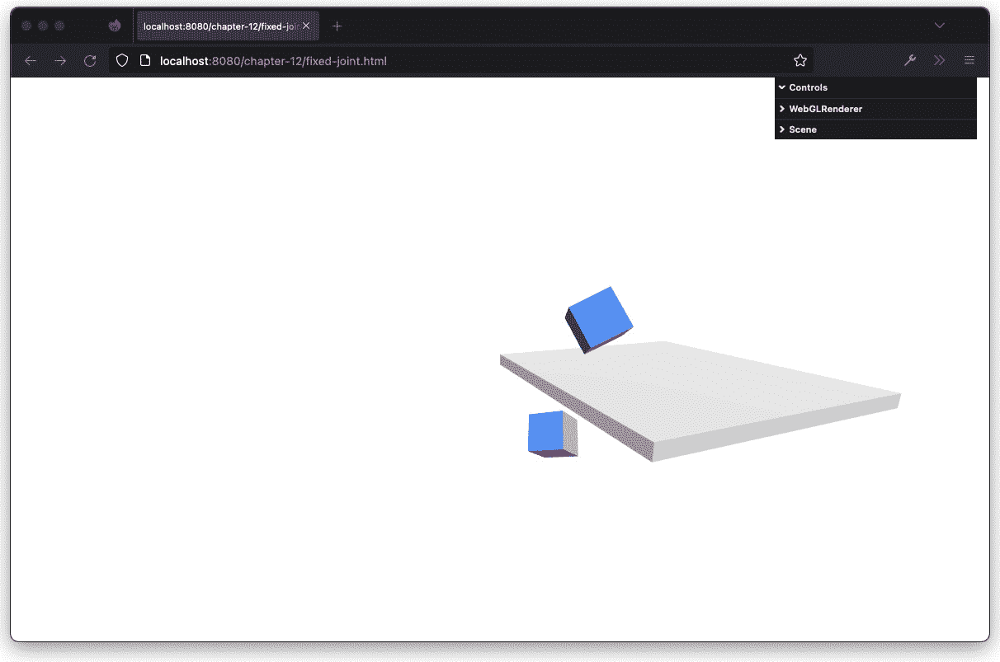

图 12.11 – 连接两个立方体的固定关节

接下来在我们的列表中是球形关节。

## 使用球形关节连接物体

球形关节允许两个物体在彼此周围自由移动，同时保持这些物体之间的相同距离。这可以用于布娃娃效果，或者就像我们在本例中所做的那样，创建一个链 (`sphere-joint.html`)：

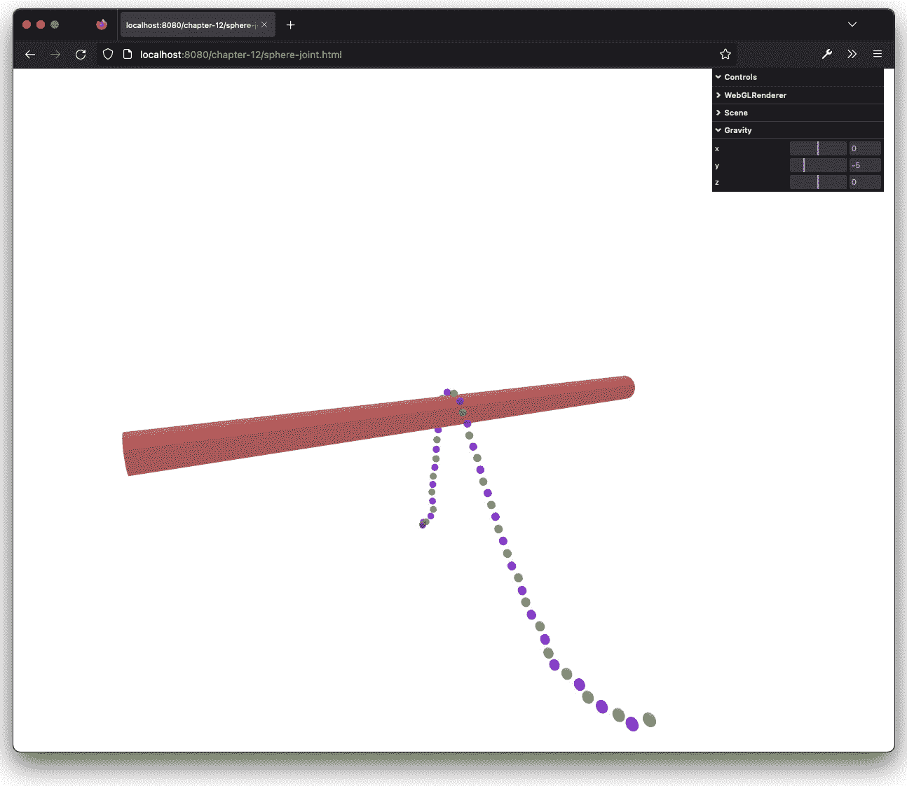

图 12.12 – 通过球形关节连接的多个球体

正如你在本例中可以看到的，我们已经连接了许多球体来创建一串球体。当这些球体撞击中间的圆柱体时，它们会绕着圆柱体滚动并慢慢滑离这个圆柱体。你可以看到，虽然这些球体之间的方向根据它们的碰撞而改变，但球体之间的绝对距离保持不变。因此，为了设置这个示例，我们创建了许多带有 `RigidBody` 和 `Collider` 的球体，类似于前面的示例。对于每一对球体，我们还创建了一个类似的关节：

```js
  const createChain = (beads) => {
    for (let i = 1; i < beads.length; i++) {
      const previousBead = beads[i - 1].userData.rigidBody
      const thisBead = beads[i].userData.rigidBody
      const positionPrevious = beads[i - 1].position
      const positionNext = beads[i].position
      const xOffset = Math.abs(positionNext.x –
        positionPrevious.x)
      const params = RAPIER.JointData.spherical(
        { x: 0, y: 0, z: 0 },
        { x: xOffset, y: 0, z: 0 }
        )
      world.createImpulseJoint(params, thisBead,
        previousBead, true)
    }
  }
```

您可以看到我们使用`RAPIER.JointData.spherical`创建了一个关节。这里的参数定义了第一个对象的位置，`{ x: 0, y: 0, z: 0 }`，以及第二个对象的相对位置，`{ x: xOffset, y: 0, z: 0 }`。我们对所有对象都这样做，并使用`world.createImpulseJoint(params, thisBead, previousBead, true)`将关节添加到 Rapier 世界中。

结果是我们得到了一个通过这些球形关节连接的球体链。

下一个关节，转动关节，允许我们通过指定一个对象相对于另一个对象可以围绕其旋转的单轴来限制两个对象的运动。

## 使用转动关节限制旋转

使用转动关节，很容易创建齿轮、轮子和风扇等围绕单轴旋转的结构。最容易解释这一点的方法是查看`revolute-joint.html`示例：

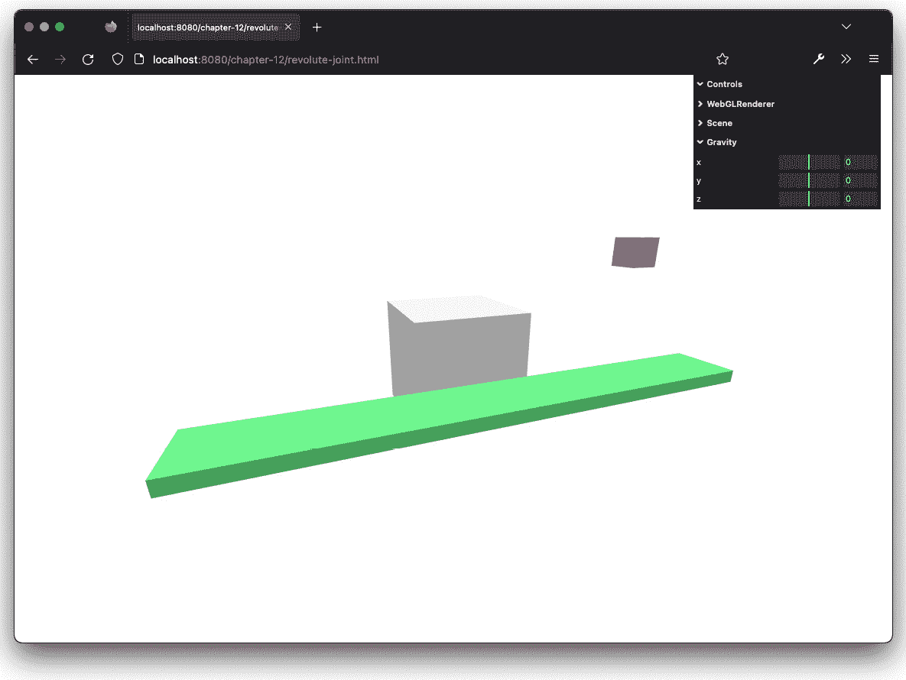

图 12.13 – 立方体在掉落在旋转条上之前

在*图 12**.13 中，您可以看到一个紫色立方体悬浮在绿色条形上方。当您在`y`方向上启用重力时，立方体会掉在绿色条形上。这个绿色条形的中心通过一个转动关节与中间的固定立方体连接。结果是，这个绿色条形现在会因紫色立方体的重量而慢慢旋转：

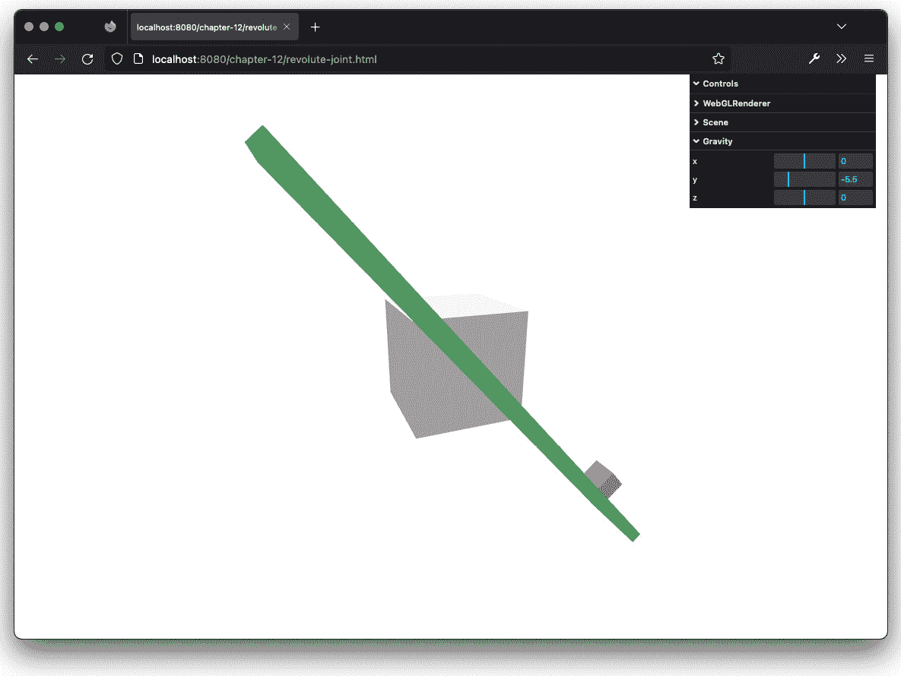

图 12.14 – 条形对一端重量的反应

为了使转动关节工作，我们再次需要两个刚体。灰色立方体的 Rapier 部分定义如下：

```js
const bodyDesc = new RAPIER.RigidBodyDesc(RigidBodyType.Fixed)
const body = world.createRigidBody(bodyDesc)
const colliderDesc = RAPIER.ColliderDesc.cuboid(0.5, 0.5, 0.5)
const collider = world.createCollider(colliderDesc, body)
```

这意味着，无论对它施加什么力，这个`RigidBody`都将始终处于相同的位置。绿色条形的定义如下：

```js
Const bodyDesc = new RAPIER.RigidBodyDesc
  (RigidBodyType.Dynamic)
  .setCanSleep(false)
  .setTranslation(-1, 0, 0)
  .setAngularDamping(0.1)
const body = world.createRigidBody(bodyDesc)
const colliderDesc = RAPIER.ColliderDesc.cuboid(0.25, 0.05,
  2)
const collider = world.createCollider(colliderDesc, body)
```

这里没有什么特别之处，但我们引入了一个新的属性`angularDamping`。有了角阻尼，Rapier 会逐渐减小`RigidBody`的旋转速度。在我们的例子中，这意味着条形将在一段时间后慢慢停止旋转。

我们正在下落的盒子看起来是这样的：

```js
Const bodyDesc = new RAPIER.RigidBodyDesc
  (RigidBodyType.Dynamic)
  .setCanSleep(false)
  .setTranslation(-1, 1, 1)
const body = world.createRigidBody(bodyDesc)
const colliderDesc = RAPIER.ColliderDesc.cuboid
  (0.1, 0.1, 0.1)
const collider = world.createCollider(colliderDesc, body)
```

因此，到目前为止，我们已经定义了`RigidBody`。现在，我们可以将固定的盒子与绿色的条形连接起来：

```js
const params = RAPIER.JointData.revolute(
  { x: 0.0, y: 0, z: 0 },
  { x: 1.0, y: 0, z: 0 },
  { x: 1, y: 0, z: 0 }
)
let joint = world.createImpulseJoint(params, fixedCubeBody,
  greenBarBody, true)
```

前两个参数确定两个刚体连接的位置（遵循与固定关节相同的思想）。最后一个参数定义了两个刚体相对于彼此可以旋转的向量。由于我们的第一个`RigidBody`是固定的，只有绿色的条形可以旋转。

Rapier 支持的最后一个关节类型是滑动关节。

## 使用滑动关节限制运动到一个单轴

滑动关节将对象的运动限制到一个单轴。以下示例（`prismatic.html`）演示了这一点，其中红色立方体的运动被限制到一个单轴：

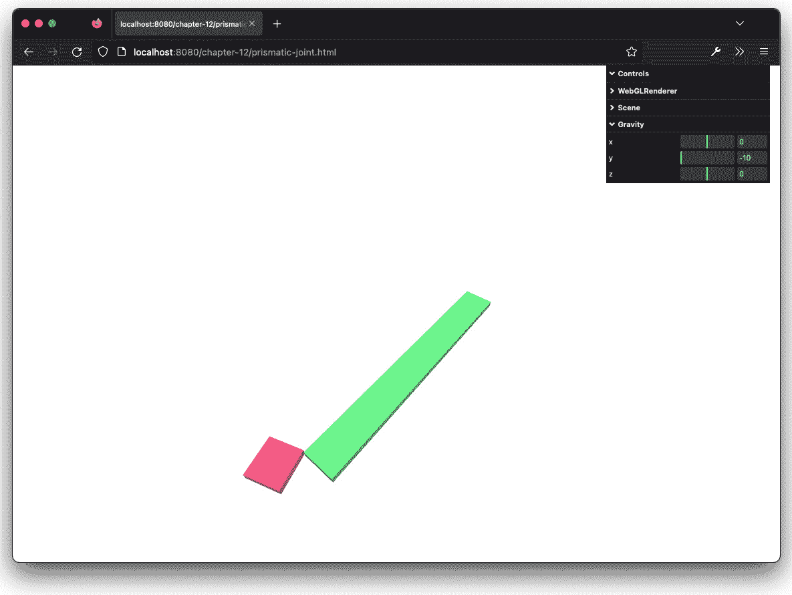

图 12.15 – 红色立方体被限制在一个轴上

在本例中，我们使用之前示例中的旋转关节将一个立方体投向绿色杆。这将导致绿色杆围绕其*y*-轴在中心旋转并击中红棕色的立方体。这个立方体仅限于沿单轴移动，您会看到它沿着该轴移动。

为了创建本例中的关节，我们使用了以下代码片段：

```js
const prismaticParams = RAPIER.JointData.prismatic(
  { x: 0.0, y: 0.0, z: 0 },
  { x: 0.0, y: 0.0, z: 3 },
  { x: 1, y: 0, z: 0 }
)
prismaticParams.limits = [-2, 2]
prismaticParams.limitsEnabled = true
world.createImpulseJoint(prismaticParams, fixedCubeBody,
  redCubeBody, true)
```

我们再次定义`fixedCubeBody`的位置（`{ x: 0.0, y: 0.0, z: 0 }`），这定义了我们相对于其移动的对象。然后，我们定义我们立方体的位置 - `{ x: 0.0, y: 0.0, z: 3 }`。最后，我们定义允许我们的对象移动的轴。在这种情况下，我们定义了`{ x: 1, y: 0, z: 0 }`，这意味着它允许沿其*x*-轴移动。

使用关节电机在允许的轴上移动物体

球形、旋转和滑动关节也支持一种称为电机的功能。使用电机，您可以在允许的轴上移动刚体。我们在这几个示例中没有展示这一点，但通过使用电机，您可以添加自动旋转的齿轮或创建一个使用电机通过旋转关节移动轮子的汽车。有关电机的更多信息，请参阅 Rapier 文档的相关部分：[`rapier.rs/docs/user_guides/javascript/joints#joint-motors`](https://rapier.rs/docs/user_guides/javascript/joints#joint-motors)。

如我们在*使用 Rapier 创建基本的 Three.js 场景*部分中提到的，我们只是触及了 Rapier 可能性的表面。Rapier 是一个功能丰富的库，具有许多允许微调的特性，并且应该为可能需要物理引擎的大多数情况提供支持。该库正在积极开发中，在线文档非常好。

通过本章中的示例和在线文档，您应该能够将 Rapier 集成到自己的场景中，即使对于本章未解释的功能也是如此。

我们主要探讨了 3D 模型及其在 Three.js 中的渲染方法。然而，Three.js 也提供了对 3D 声音的支持。在下一节中，我们将向您展示如何向 Three.js 场景添加方向性声音的示例。

# 向场景添加声音源

到目前为止，我们已经讨论了几个相关主题，我们已经拥有了创建美丽场景、游戏和其他 3D 可视化的大量元素。然而，我们尚未展示如何将声音添加到您的 Three.js 场景中。在本节中，我们将探讨两个允许您向场景添加声音源的 Three.js 对象。这尤其有趣，因为这些声音源会响应摄像头的位置：

+   声源与摄像头之间的距离决定了声源的音量

+   摄像头左侧和右侧的位置分别决定了左侧扬声器与右侧扬声器的音量

最好的解释方式是看到这个动作的实际效果。在你的浏览器中打开`audio.html`示例，你会看到一个来自*第九章*的场景，*动画和移动* *相机*：

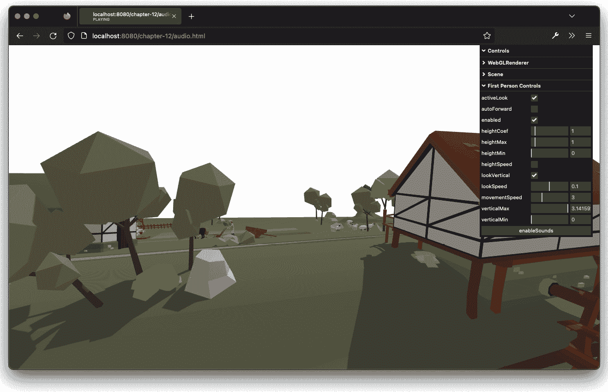

图 12.16 – 带有音频元素的场景

这个例子使用了我们在*第九章*中看到的**第一人称控制**，因此你可以使用箭头键与鼠标结合来在场景中移动。由于浏览器不再支持自动启动音频，首先，点击右侧菜单中的`enableSounds`按钮来打开声音。当你这样做时，你会听到附近有水声——你将能够听到一些远处的牛和羊。

水声来自你起始位置后面的水车，羊群的声音来自右侧的羊群，牛的声音集中在拉犁的两头牛身上。如果你使用控制台在场景中移动，你会注意到声音会根据你的位置而改变——离羊群越近，你听到的声音就越好，当你向左移动时，牛的声音就会更响。这被称为位置音频，其中使用音量和方向来确定如何播放声音。

完成这个任务只需要很少的代码。我们首先需要做的是定义一个`THREE.AudioListener`对象并将其添加到`THREE.PerspectiveCamera`：

```js
const listener = new THREE.AudioListener(); camera.add(listener1);
```

接下来，我们需要创建一个`THREE.Mesh`（或`THREE.Object3D`）实例，并将一个`THREE.PositionalAudio`对象添加到该网格中。这将确定这个特定声音的源位置：

```js
const mesh1 = new THREE.Mesh(new THREE.BoxGeometry(1, 1,
  1), new THREE.MeshNormalMaterial({ visible: false }))
mesh1.position.set(-4, -2, 10)
scene.add(mesh1)
const posSound1 = new THREE.PositionalAudio(listener)
const audioLoader = new THREE.AudioLoader()
audioLoader.load('/assets/sounds/water.mp3', function
  (buffer) {
posSound1.setBuffer(buffer)
posSound1.setRefDistance(1)
posSound1.setRolloffFactor(3)
posSound1.setLoop(true)
mesh1.add(posSound3)
```

如此代码片段所示，我们首先创建一个标准的`THREE.Mesh`实例。接下来，我们创建一个`THREE.PositionalAudio`对象，并将其连接到我们之前创建的`THREE.AudioListener`对象。最后，我们添加音频并配置一些属性，这些属性定义了声音的播放方式和行为：

+   `setRefDistance`：这决定了声音在哪个距离上会降低音量。

+   `setLoop`：默认情况下，声音只播放一次。通过将此属性设置为`true`，声音会循环播放。

+   `setRolloffFactor`：这决定了当你远离声音源时音量下降的速度。

内部，Three.js 使用 Web Audio API([`webaudio.github.io/web-audio-api/`](http://webaudio.github.io/web-audio-api/))来播放声音并确定正确的音量。并非所有浏览器都支持此规范。目前最好的支持来自 Chrome 和 Firefox。

# 摘要

在本章中，我们探讨了如何通过添加物理引擎来扩展 Three.js 的基本 3D 功能。为此，我们使用了 Rapier 库，该库允许您为场景和对象添加重力，使对象能够相互交互并在碰撞时弹跳，以及使用关节来限制对象之间的相对运动。

除了这些，我们还向您展示了 Three.js 如何支持 3D 声音。我们创建了一个场景，您可以使用 `THREE.PositionalAudio` 和 `THREE.AudioListener` 对象添加位置声音。

尽管我们现在已经涵盖了 Three.js 提供的所有核心功能，但还有两个章节专门用于探索一些您可以与 Three.js 一起使用的外部工具和库。在下一章中，我们将深入探讨 Blender，看看我们如何利用 Blender 的功能，例如烘焙阴影、编辑 UV 映射，以及在 Blender 和 Three.js 之间交换模型。
