# 使用 Blender 和 Three.js 一起工作

在本章中，我们将更深入地探讨如何使用 Blender 和 Three.js 一起工作。我们将在本章中解释以下概念：

+   *从 Three.js 导出并导入到 Blender 中*：我们将创建一个简单场景，从 Three.js 中导出它，然后在 Blender 中加载和渲染。

+   *从 Blender 导出静态场景并导入到 Three.js 中*：在这里，我们将创建一个场景在 Blender 中，将其导出为 Three.js，并在 Three.js 中渲染。

+   *从 Blender 导出动画并导入到 Three.js 中*：Blender 允许我们创建动画，我们将创建一个简单动画，并在 Three.js 中加载和显示。

+   *在 Blender 中烘焙光照贴图和环境遮挡贴图*：Blender 允许我们烘焙不同类型的贴图，这些贴图可以在 Three.js 中使用。

+   *在 Blender 中进行自定义 UV 建模*：通过 UV 建模，我们确定纹理如何应用于几何体。Blender 提供了许多工具来简化这一过程。我们将探讨如何使用 Blender 的 UV 建模功能，并将结果用于 Three.js。

在我们开始本章之前，请确保安装 Blender，以便你可以跟随。你可以从以下链接下载适用于你的操作系统的安装程序：[`www.blender.org/download/`](https://www.blender.org/download/)。本章中显示的 Blender 截图是使用 Blender 的 macOS 版本拍摄的，但 Windows 和 Linux 的版本看起来相同。

让我们开始我们的第一个主题，在这个主题中，我们在 Three.js 中创建一个场景，将其导出为中间格式，最后将其导入到 Blender 中。

# 从 Three.js 导出并导入到 Blender 中

对于这个例子，我们将只使用我们在 *第六章* 中看到的参数化几何体进行简单示例重用，*探索高级几何体*。如果你在浏览器中打开 `export-to-blender.html`，你可以创建一些参数化几何体。在右侧菜单的底部，我们添加了一个 **exportScene** 按钮：

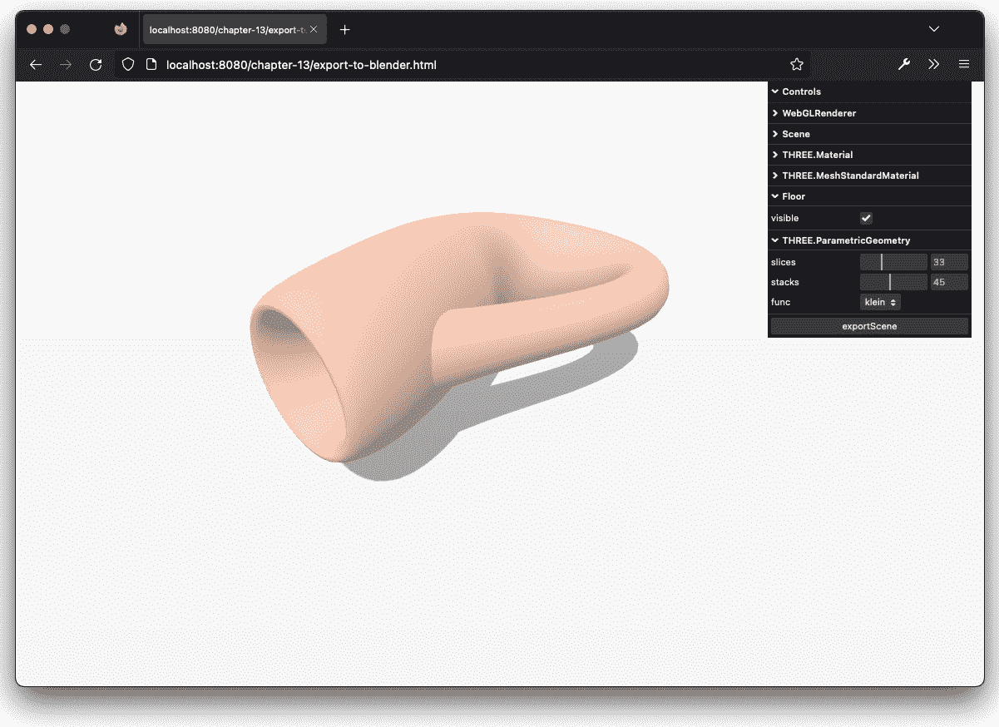

图 13.1 – 我们将要导出的简单场景

当你点击该按钮时，模型将以 GLTF 格式保存并下载到你的电脑上。要使用 Three.js 导出模型，我们可以使用 `GLTFexporter` 如下所示：

```js
const exporter = new GLTFExporter()
const options = {
  trs: false,
  onlyVisible: true,
  binary: false
}
exporter.parse(
  scene,
  (result) => {
    const output = JSON.stringify(result, null, 2)
    save(new Blob([output], { type: 'text/plain' }),
      'out.gltf')
  },
  (error) => {
    console.log('An error happened during parsing of the
      scene', error)
  },
  options
)
```

在这里，你可以看到我们创建了一个 `GLTFExporter`，我们可以用它来导出 `THREE.Scene`。我们可以以 glTF 二进制格式或 JSON 格式导出场景。对于这个例子，我们以 JSON 格式导出。glTF 格式是一个复杂的格式，虽然 `GLTFExporter` 支持构成 Three.js 场景的许多对象，但你仍然可能会遇到导出失败的问题。更新到 Three.js 的最新版本通常是最佳解决方案，因为该组件正在不断进行工作。

一旦我们得到我们的 `output`，我们可以触发浏览器的 `download` 功能，它将保存到你的本地机器上：

```js
const save = (blob, filename) => {
  const link = document.createElement('a')
  link.style.display = 'none'
  document.body.appendChild(link)
  link.href = URL.createObjectURL(blob)
  link.download = filename
  link.click()
}
```

结果是一个 glTF 文件，其前几行看起来像这样：

```js
{
  "asset": {
    "version": "2.0",
    "generator": "THREE.GLTFExporter"
  },
  "scenes": [
    {
      "nodes": [
        0,
        1,
        2,
        3
      ]
    }
  ],
  "scene": 0,
  "nodes": 
    {},
...
```

现在我们已经得到了包含我们场景的 glTF 文件，我们可以将其导入 Blender。因此，打开 Blender，你会看到一个默认场景，其中有一个单个小立方体。通过选择它并按 **x** 键来删除立方体。一旦删除，我们就有一个空场景，我们将在这里加载导出的场景。

在顶部的 **文件** 菜单中选择 **导入 | glTF 2.0**，你将看到一个文件浏览器。导航到你下载模型的位置，选择文件，然后点击 **导入 glTF 2.0**。这将打开文件，并显示类似以下内容：

![图 13.2 – 在 Blender 中导入的 Three.js 场景图 13.2 – 在 Blender 中导入的 Three.js 场景如你所见，Blender 已经导入了我们的完整场景，我们在 Three.js 中定义的 `THREE.Mesh` 现在在 Blender 中可用。在 Blender 中，我们现在可以像使用任何其他网格一样使用它。然而，对于这个例子，让我们保持简单，只用 Blender 的 **Cycles** 渲染器渲染这个场景。为此，点击右侧菜单中的 **渲染属性**（看起来像相机的图标）并选择 **渲染引擎** 为 **Cycles**：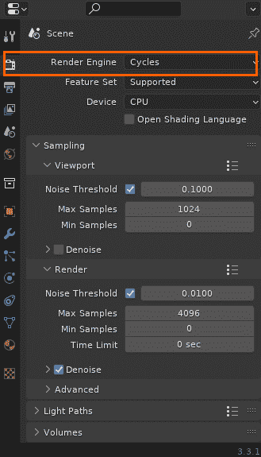

图 13.3 – 在 Blender 中使用 Cycles 渲染引擎进行渲染

接下来，我们需要正确放置相机，所以使用鼠标在场景中移动，直到你得到一个满意的视图，然后按 *Ctrl* + *Alt* + *numpad 0* 来对齐相机。此时，你将得到类似以下内容：

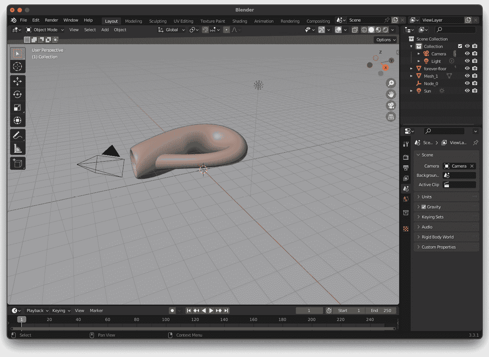

图 13.4 – 显示相机看到的区域和将要渲染的内容

现在，我们可以通过按 *F12* 来渲染场景。这将启动 **Cycles** 渲染引擎，你将看到模型在 Blender 中被渲染：

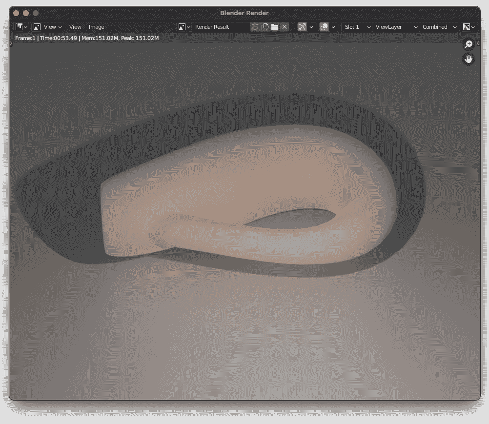

图 13.5 – 在 Blender 中从导出的 Three.js 模型渲染的最终图像

正如你所见，使用 glTF 作为 Three.js 和 Blender 之间交换模型和场景的格式非常简单。只需使用 `GLTFExporter`，将模型导入 Blender，你就可以在你的模型上使用 Blender 提供的所有功能。

当然，反过来操作也同样简单，我们将在下一节中向你展示。

# 从 Blender 导出静态场景并将其导入 Three.js

从 Blender 导出模型与导入它们一样简单。在 Three.js 的旧版本中，你可以使用一个特定的 Blender 插件来导出为 Three.js 特定的 JSON 格式。然而，在后来的版本中，glTF 在 Three.js 中已成为与其他工具交换模型的标准。因此，为了与 Blender 一起使用，我们只需做以下操作：

1.  在 Blender 中创建一个模型。

1.  将模型导出为 glTF 文件。

1.  在 Blender 中导入 glTF 文件并将其添加到场景中。

让我们在 Blender 中首先创建一个简单的模型。我们将使用 Blender 默认使用的模型，该模型可以通过从菜单中选择 **添加** | **网格** | **猴子** 在 **对象模式** 中添加。点击 **猴子** 以选择它：

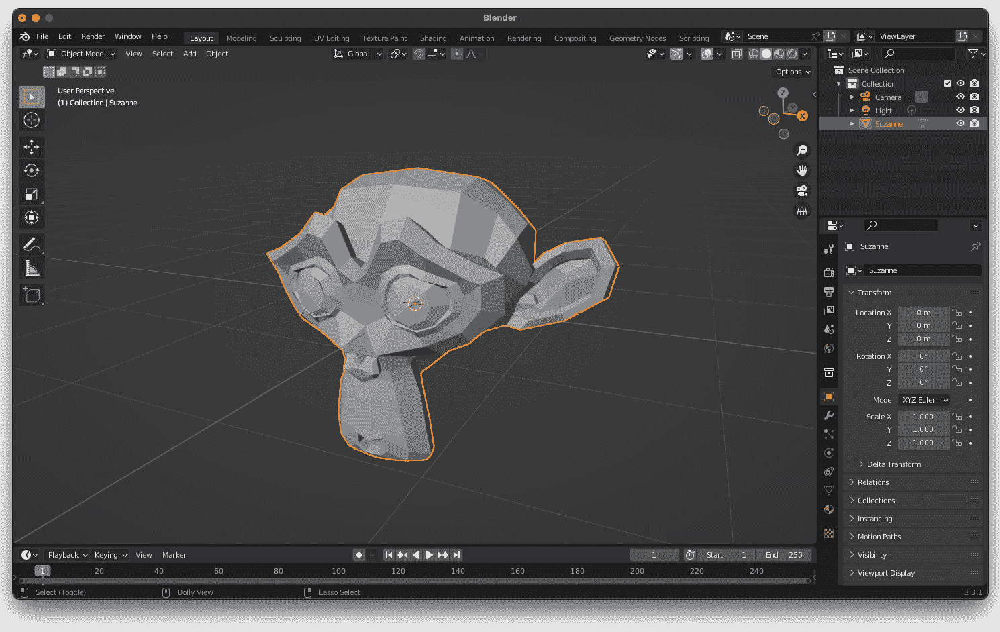

图 13.6 – 在 Blender 中创建要导出的模型

选中模型后，在上部菜单中选择 `文件->导出->glTF 2.0`：

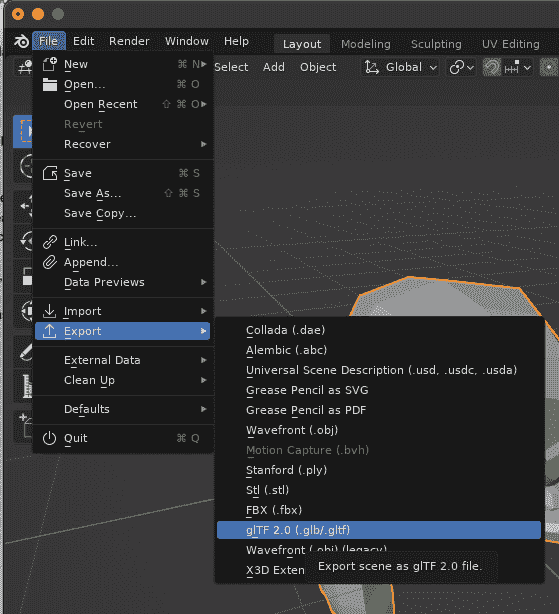

图 13.7 – 选择 glTF 导出

对于这个例子，我们只导出网格。请注意，当你从 Blender 导出时，始终要检查 **应用修改器** 复选框。这将确保在导出网格之前应用了 Blender 中使用的任何高级生成器或修改器。

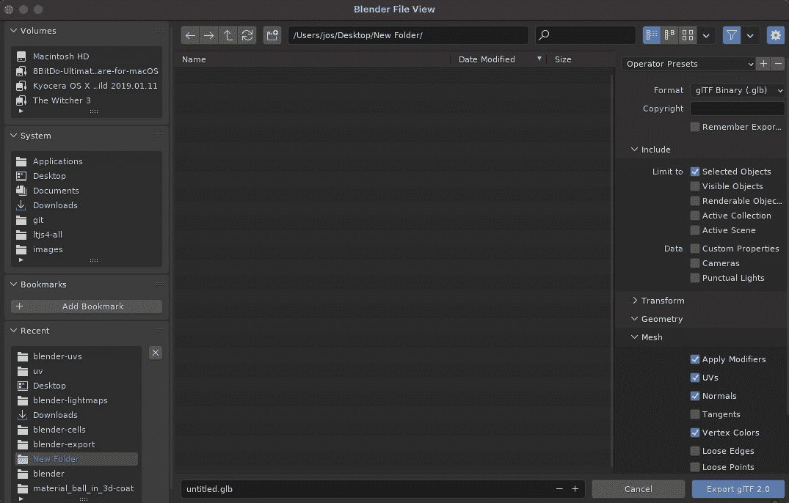

图 13.8 – 将模型导出为 glTF 文件

文件导出后，我们可以在 Three.js 中使用 `GLTFImporter` 加载它：

```js
  const loader = new GLTFLoader()
  return loader.loadAsync('/assets/gltf/
    blender-export/monkey.glb').then((structure) => {
    return structure.scene
  })
```

最终结果是 Blender 中的确切模型，但在 Three.js 中可视化（见 `import-from-blender.html` 示例）：

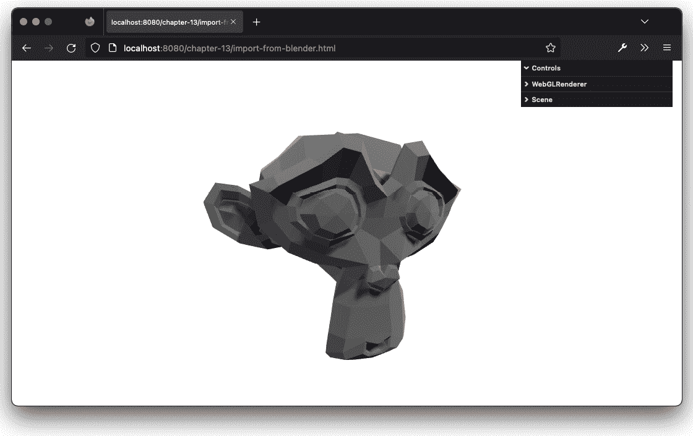

图 13.9 – 在 Three.js 中可视化的 Blender 模型

注意，这不仅仅限于网格 – 使用 glTF，我们还可以以相同的方式导出灯光、相机和纹理。

# 从 Blender 导出动画并将其导入到 Three.js

从 Blender 导出动画的方式基本上与导出静态场景的方式相同。因此，对于这个例子，我们将创建一个简单的动画，再次以 glTF 格式导出，并将其加载到 Three.js 场景中。为此，我们将创建一个简单的场景，在其中渲染一个掉落并破碎成块的立方体。为此，我们首先需要一个地板和一个立方体。因此，创建一个平面和一个稍微高于这个平面的立方体：

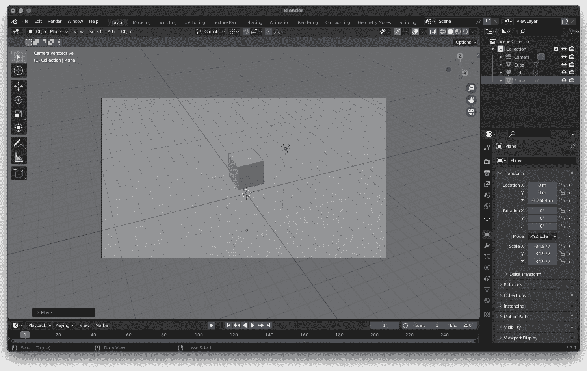

图 13.10 – 一个空的 Blender 项目

在这里，我们只是将立方体向上移动了一点（按 *G* 键以抓取立方体）并添加了一个平面（**添加** | **网格** | **平面**），然后我们将这个平面缩放以使其变大。现在，我们可以向场景添加物理效果。在 *第十二章* 中，*向场景添加物理和声音*，我们介绍了刚体的概念。Blender 使用相同的方法。选择立方体并使用 **对象** | **刚体** | **添加活动**，然后选择平面并像这样添加其刚体：**对象** | **刚体** | **添加被动**。此时，当我们（通过使用 *空格键*）在 Blender 中播放动画时，你会看到立方体掉落：

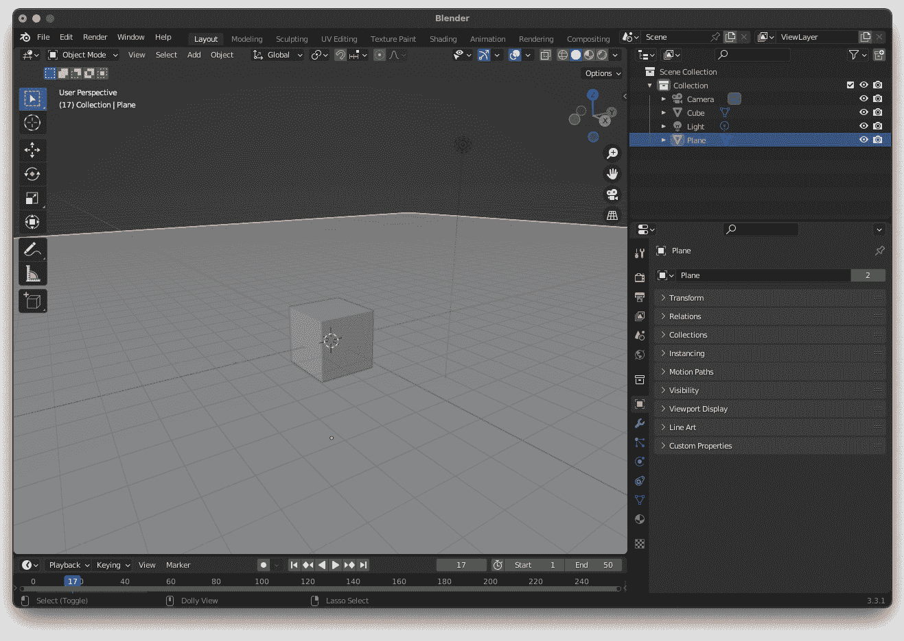

图 13.11 – 立方体掉落的一半动画

要创建破碎块效果，我们需要启用 `单元格裂缝` 插件，并勾选复选框以启用插件：

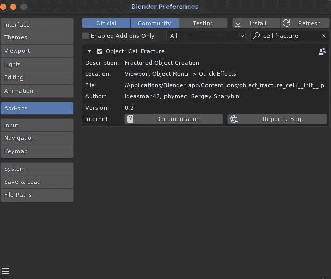

图 13.12 – 启用单元格裂缝插件

在我们将立方体分割成更小的部分之前，让我们给模型添加一些顶点，以便 Blender 有一个很好的顶点数量，它可以用来分割模型。为此，在 **编辑模式** 中选择立方体（通过使用 *Tab* 键）并从顶部菜单中选择 **边** | **细分**。这样做两次，你会得到类似这样的效果：

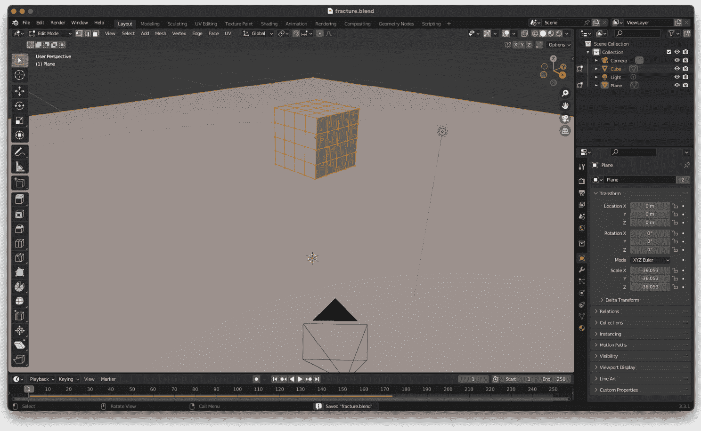

图 13.13 – 显示具有多个细分部分的立方体

按 *Tab* 键返回到 **对象模式**，选中立方体后，打开 **单元格裂缝** 窗口，然后转到 **对象** | **快速效果** | **单元格裂缝**：

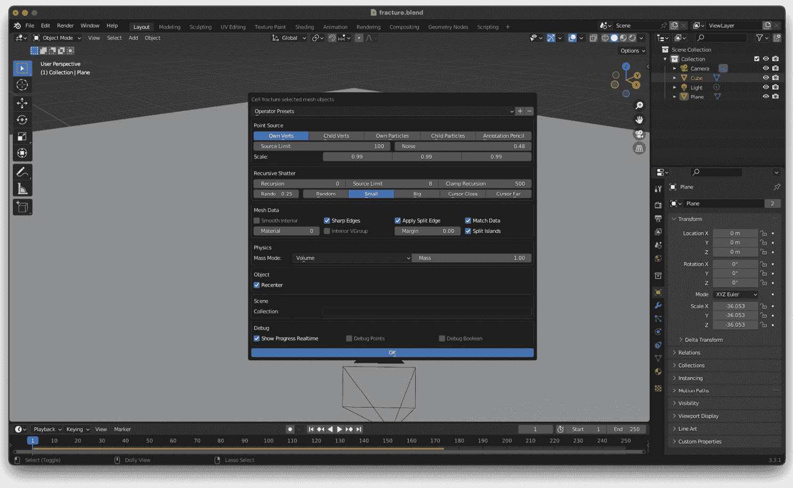

图 13.14 – 配置裂缝

你可以调整这些设置以获得不同类型的裂缝。在 *图 13*.3 中配置的设置，你会得到类似这样的效果：

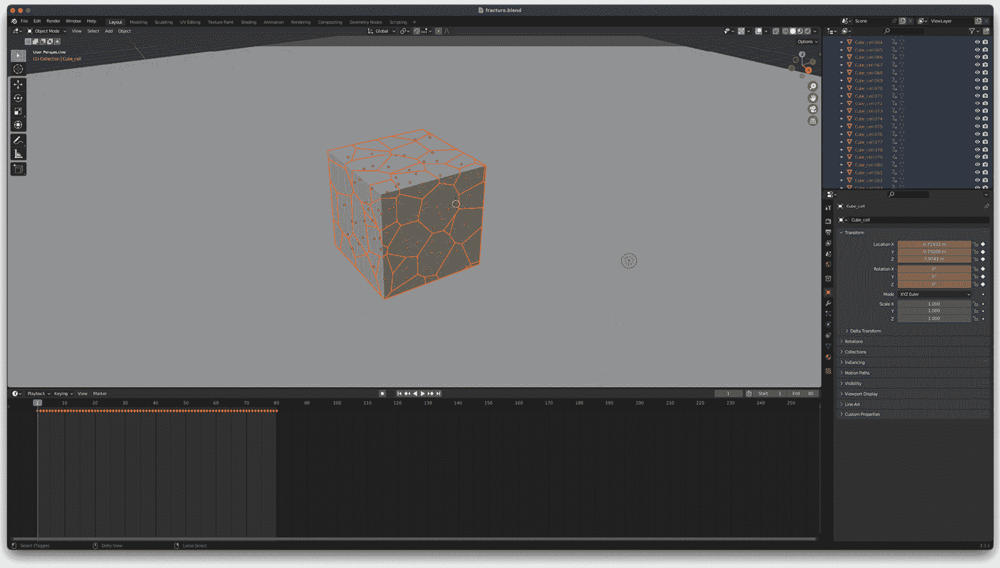

图 13.15 – 显示裂缝的立方体

接下来，选择原始立方体并按 **x** 键删除它。这将只留下裂缝部分，我们将对它们进行动画处理。为此，选择立方体中的所有单元格，并再次使用 **对象** | **刚体** | **添加活动**。完成后，按 *空格键*，你会看到立方体正在下落并在撞击时破碎。

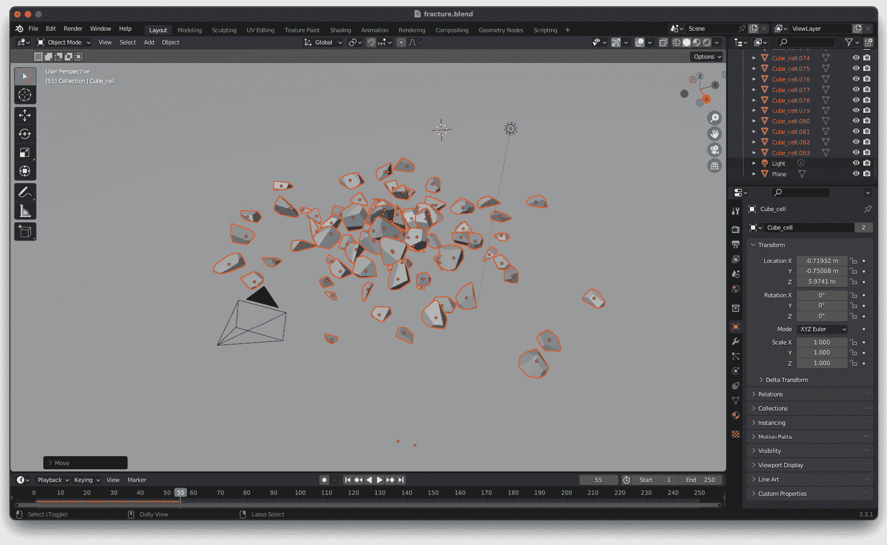

图 13.16 – 立方体掉落后的样子

到这一点，我们的动画基本上已经准备好了。现在，我们需要导出这个动画，以便我们可以将其加载到 Three.js 中并从那里重新播放它。在这样做之前，请确保将动画的结束（屏幕的右下角）设置为帧 80，因为导出完整的 250 帧并不那么有用。此外，我们需要告诉 Blender 将物理引擎的信息转换为一系列关键帧。这是因为我们不能导出物理引擎本身，所以我们必须烘焙所有网格的位置和旋转，以便我们可以导出它们。为此，再次选择所有单元格，并使用 **对象** | **刚体** | **烘焙到关键帧**。你可以选择默认设置并点击 **导出 glTF2.0** 按钮，以获得以下屏幕：

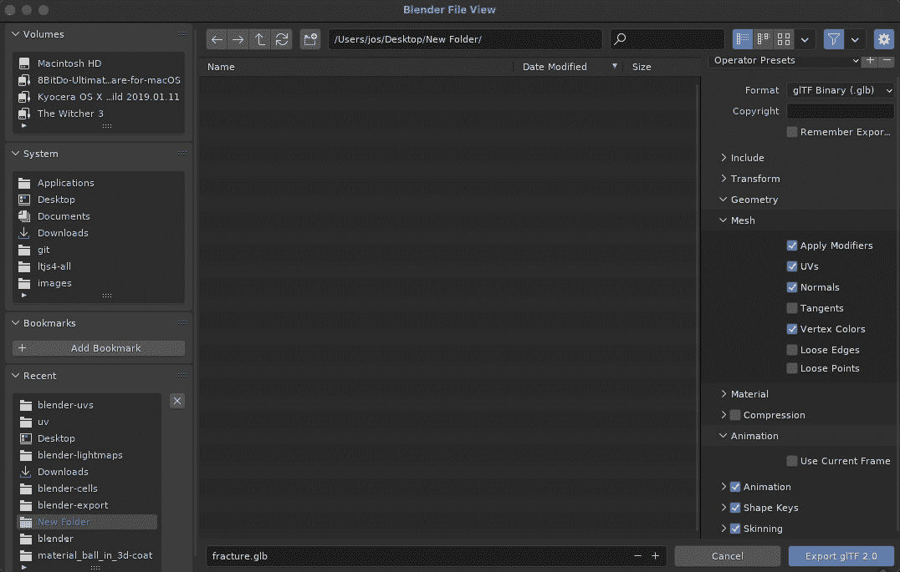

图 13.17 – 动画导出设置

到这一点，我们将为每个单元格创建一个动画，它跟踪单个网格的旋转和位置。有了这些信息，我们可以在 Three.js 中加载场景并设置动画混音器以进行播放：

```js
const mixers = []
const modelAsync = () => {
  const loader = new GLTFLoader()
  return loader.loadAsync('/assets/models/
     blender-cells/fracture.glb').then((structure) => {
    console.log(structure)
    // setup the ground plane
    const planeMesh = structure.scene.
      getObjectByName('Plane')
    planeMesh.material.side = THREE.DoubleSide
    planeMesh.material.color = new THREE.Color(0xff5555)
    // setup the material for the pieces
    const materialPieces = new THREE.MeshStandardMaterial({ color: 0xffcc33 })
    structure.animations.forEach((animation) => {
      const meshName = animation.name.substring
     (0, animation.name.indexOf('Action')).replace('.', '')
      const mesh = structure.scene.
        getObjectByName(meshName)
      mesh.material = materialPieces
      const mixer = new THREE.AnimationMixer(mesh)
      const action = mixer.clipAction(animation)
      action.play()
      mixers.push(mixer)
    })
    applyShadowsAndDepthWrite(structure.scene)
    return structure.scene
  })
}
```

在渲染循环中，我们需要为每个动画更新混音器：

```js
const clock = new THREE.Clock()
const onRender = () => {
  const delta = clock.getDelta()
  mixers.forEach((mixer) => {
    mixer.update(delta)
  })
}
```

结果看起来是这样的：

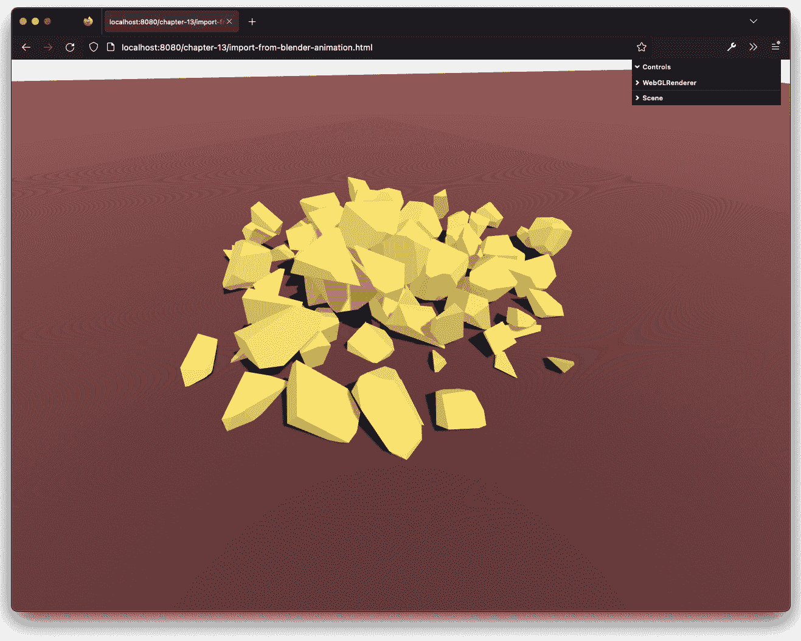

图 13.18 – 在 Three.js 中的爆炸立方体

我们在这里向您展示的相同原理可以应用于 Blender 支持的不同类型的动画。需要记住的主要一点是，Three.js 不会理解 Blender 使用的物理引擎或其他高级动画模型。因此，当您导出动画时，请确保烘焙动画，以便您可以使用标准的 Three.js 工具回放这些基于关键帧的动画。

在下一节中，我们将更详细地探讨如何使用 Blender 烘焙不同类型的纹理（贴图），然后将其加载到 Three.js 中。我们已经在*第十章*中看到了实际效果，*加载和操作纹理*，但在这个章节中，我们将向您展示如何使用 Blender 来烘焙这些贴图。

# 在 Blender 中烘焙光照贴图和环境遮挡贴图

对于这个场景，我们将回顾*第十章*中的示例，其中我们使用了 Blender 中的光照贴图。这个光照贴图提供了良好的光照效果，而无需在 Three.js 中实时计算。为此，我们将采取以下步骤：

1.  在 Blender 中设置一个简单的场景，包含几个模型。

1.  在 Blender 中设置灯光和模型。

1.  在 Blender 中将光照烘焙到纹理中。

1.  导出场景。

1.  在 Three.js 中渲染一切。

在接下来的章节中，我们将详细讨论每个步骤。

## 在 Blender 中设置场景

对于这个示例，我们将创建一个简单的场景，并在其中烘焙一些灯光。开始一个新项目，选择默认的立方体并按`e`然后按`z`沿*z*轴挤出以获得一个简单的形状，如下所示：

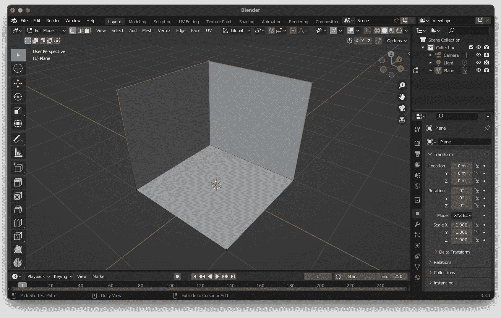

图 13.19 – 创建一个简单的房间结构

一旦你有了这个模型，回到**对象模式**（使用*Tab*），在房间中放置几个网格以获得类似以下所示的效果：

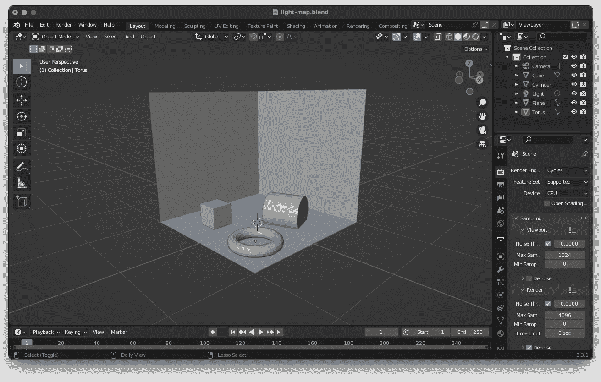

图 13.20 – 带有网格的完整房间

目前没有特别之处——只是一个没有灯光的简单房间。在我们添加灯光之前，先改变一下物体的颜色。因此，在 Blender 中，转到**材质属性**，为每个网格创建一个新的材质，并设置颜色。结果将类似于以下这样：

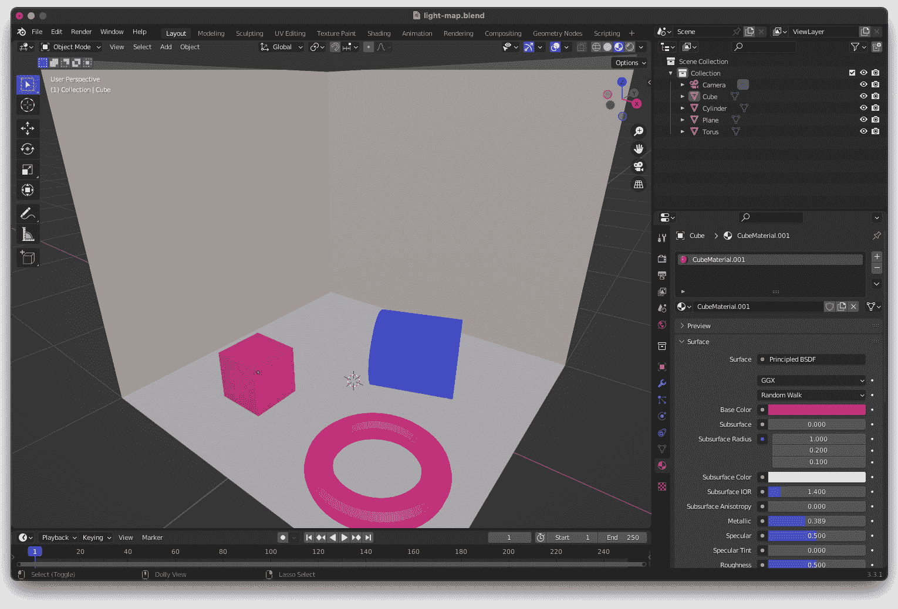

图 13.21 – 向场景中的不同物体添加颜色

接下来，我们将添加一些漂亮的灯光。

## 向场景添加灯光

对于这个场景的光照，我们将添加基于 HDRI 的良好光照。使用 HDRI 光照，我们不是只有一个光源，而是提供一个将被用作场景光源的图像。对于这个例子，我们从这里下载了一个 HDRI 图像：[`polyhaven.com/a/thatch_chapel`](https://polyhaven.com/a/thatch_chapel)。

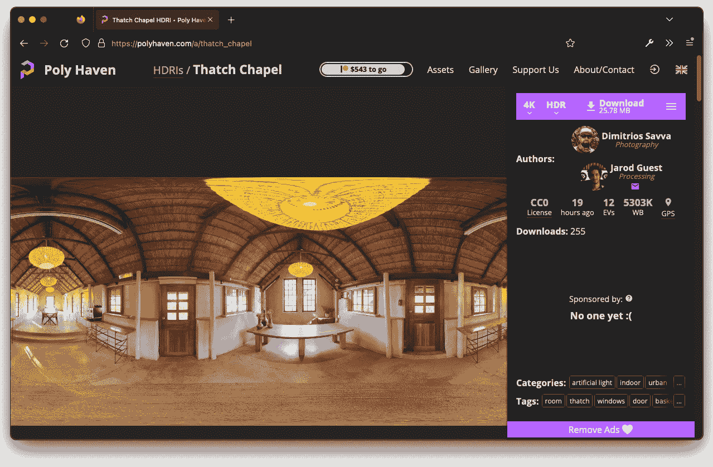

图 13.22 – 从 Poly Haven 下载 HDRI

下载后，我们有一个大图像文件，我们可以在 Blender 中使用。为此，从**属性编辑器**面板打开**世界**选项卡，选择**表面**下拉菜单，并选择**背景**。在此之下，您将找到**颜色**选项，点击此选项，并选择**环境纹理**：

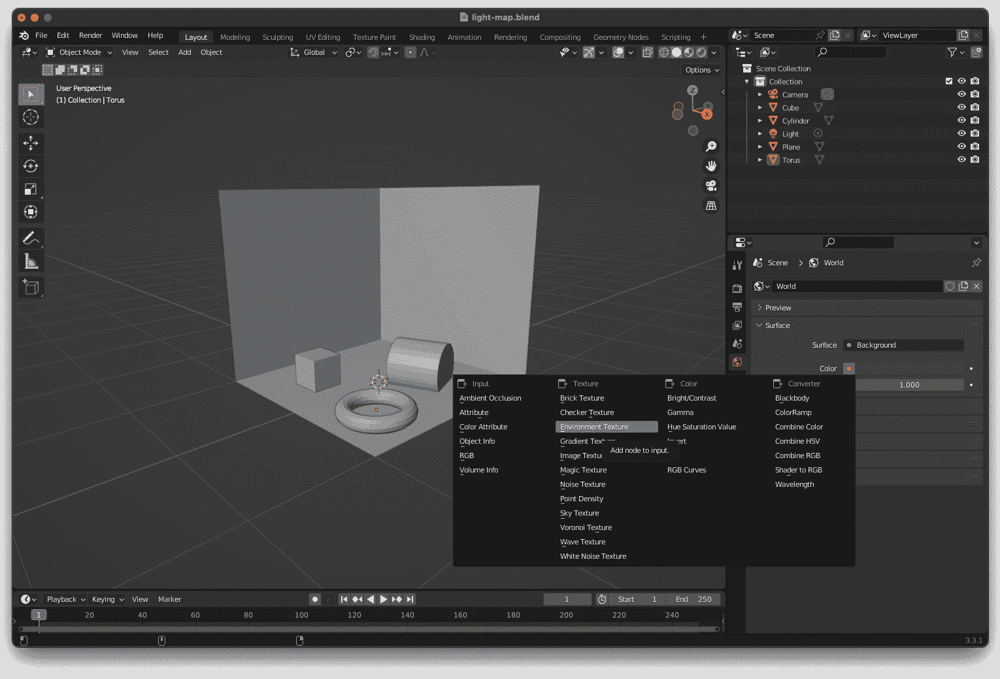

图 13.23 – 向世界中添加环境纹理

接下来，点击**打开**，浏览到您下载图片的位置，并选择该位置。此时，我们只需渲染场景并查看 HDRI 贴图提供的照明：

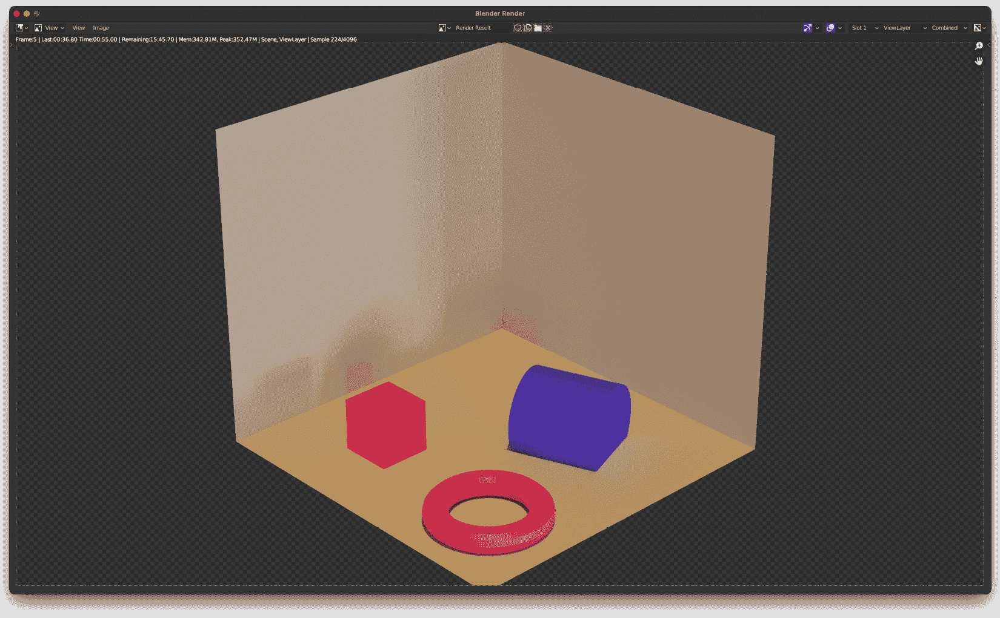

图 13.24 – 渲染场景以检查 HDRI 光照

如您所见，场景已经相当不错，我们无需放置单独的灯光。现在，墙上有一些漂亮的柔和阴影，物体似乎从多个角度被照亮，物体看起来很漂亮。为了将灯光信息作为静态光照贴图使用，我们需要将光照烘焙到纹理上，并将该纹理映射到 Three.js 中的物体上。

## 烘焙光照纹理

要烘焙光照，首先，我们需要创建一个纹理来存储这些信息。选择立方体（或您想要烘焙光照的任何其他对象）。转到**着色**视图，在屏幕底部的**节点编辑器**中，添加一个新的**图像纹理**项：**添加** | **纹理** | **图像纹理**。默认值应该适合使用：

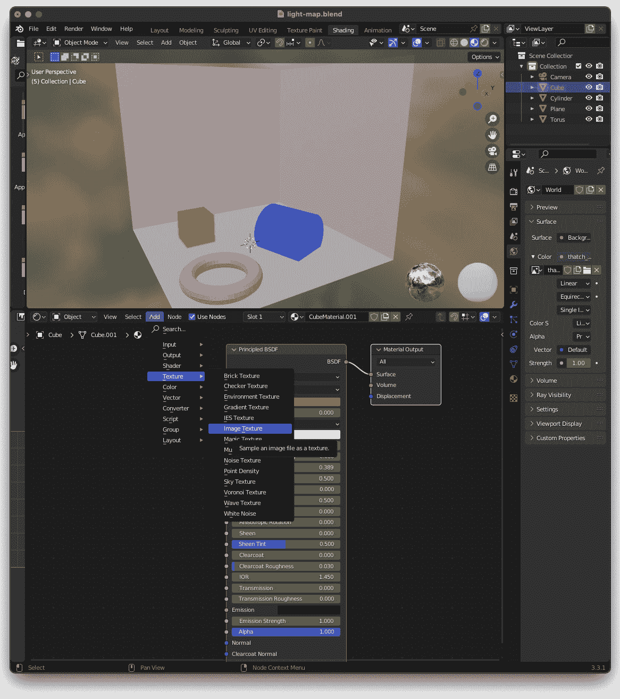

图 13.25 – 向纹理图像中添加烘焙光照贴图

接下来，点击您刚刚添加的节点上的**新建**按钮，并选择纹理的大小和名称：

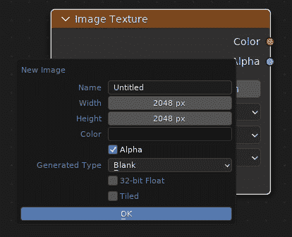

图 13.26 – 添加用于纹理图像的新图像

现在，转到**属性编辑器**面板的**渲染**选项卡，并设置以下属性：

+   **渲染引擎**：**Cycles**。

+   `512` 或渲染光照贴图将花费非常长的时间。

+   在**烘焙**菜单中，从**烘焙类型**菜单中选择**漫反射**，在**影响**部分，选择**直接**和**间接**。这将仅渲染环境光照的影响。

现在，您可以点击**烘焙**，Blender 将为所选对象渲染光照贴图到纹理中：

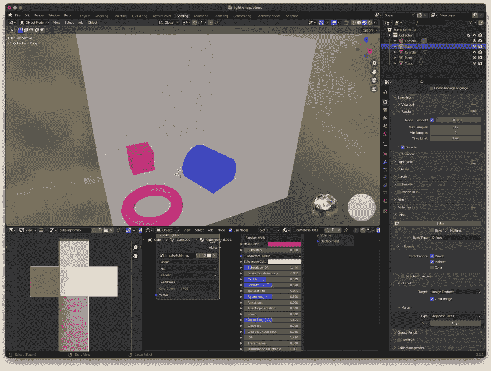

图 13.27 – 立方体的渲染光照贴图

就这样。如图 13.29 所示，在左下角的图像查看器中可以看到，我们现在已经得到了一个看起来很不错的立方体渲染光照贴图。您可以通过点击图像查看器中的汉堡菜单将此图像导出为独立的纹理：

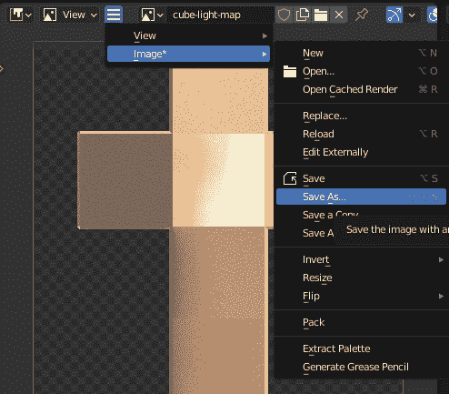

图 13.28 – 将光照贴图导出到外部文件

您现在可以为其他网格重复此操作。但在为盒子做这个之前，我们首先需要快速修复 UV 映射。我们需要这样做，因为我们拉伸了一些顶点以创建类似房间的结构，Blender 需要知道如何正确映射它们。不深入细节，我们可以让 Blender 提出一个创建 UV 映射的建议。点击顶部的**UV 编辑**菜单，选择**平面**，进入**编辑模式**，然后从**UV**菜单中选择**UV** | **展开** | **智能展开**：

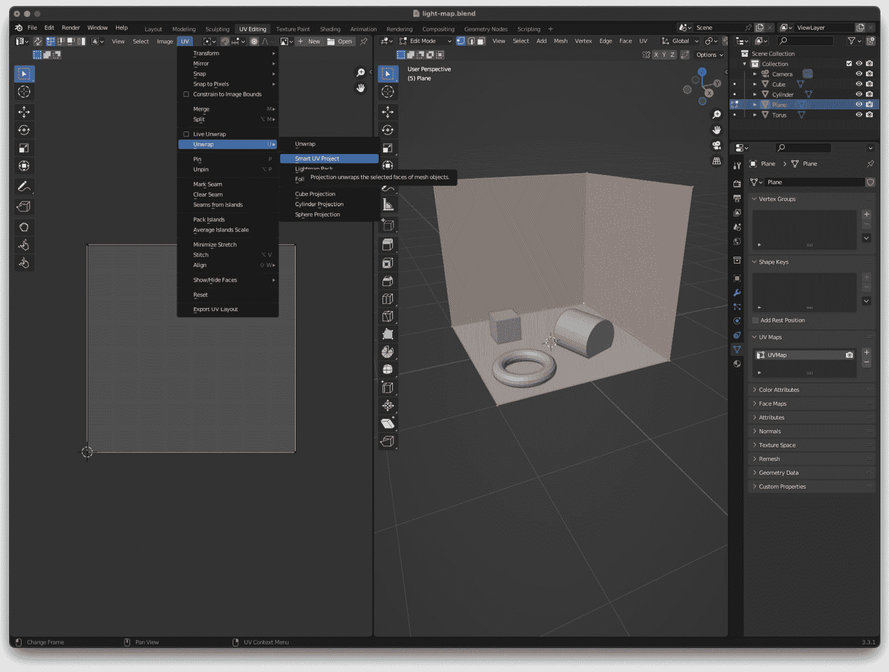

图 13.29 – 修复房间网格的 UV

这将确保为房间的所有侧面生成光照贴图。现在，为所有网格重复此操作，您将拥有这个特定场景的光照贴图。一旦导出所有光照贴图，我们就可以导出场景本身，然后使用这些创建的光照贴图在 Three.js 中渲染：

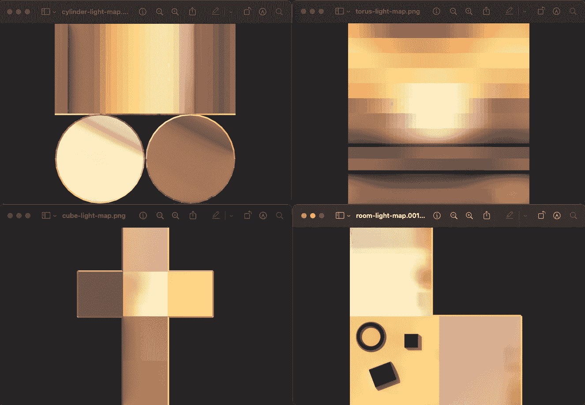

图 13.30 – 所创建的所有光照贴图

现在我们已经烘焙了所有贴图，下一步是从 Blender 导出所有内容，并将场景和贴图导入到 Three.js 中。

## 导出场景并将其导入 Blender

我们已经在*从 Blender 导出静态场景并将其导入 Three.js*部分中看到了如何从 Blender 导出场景以在 Three.js 中使用，所以我们将重复这些相同的步骤。点击**文件** | **导出** | **glTF 2.0**。我们可以使用默认设置，因为我们没有动画，所以可以禁用动画复选框。导出后，我们可以将场景导入到 Three.js。如果我们不应用纹理（并使用我们自己的默认灯光），场景将看起来像这样：

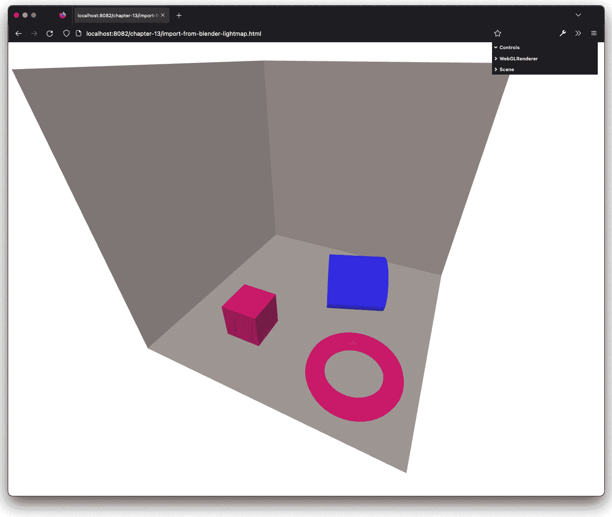

图 13.31 – 没有光照贴图的默认灯光渲染的 Three.js 场景

我们已经在*第十章*中看到了如何加载和应用光照贴图。以下代码片段展示了如何加载从 Blender 导出的所有光照贴图纹理：

```js
const cubeLightMap = new THREE.TextureLoader().load
  ('/assets/models/blender-lightmaps/cube-light-map.png')
const cylinderLightMap = new THREE.TextureLoader().load
('/assets/models/blender-lightmaps/cylinder-light-map.png')
const roomLightMap = new THREE.TextureLoader().load
  ('/assets/models/blender-lightmaps/room-light-map.png')
const torusLightMap = new THREE.TextureLoader().load
  ('/assets/models/blender-lightmaps/torus-light-map.png')
const addLightMap = (mesh, lightMap) => {
  const uv1 = mesh.geometry.getAttribute('uv')
  const uv2 = uv1.clone()
  mesh.geometry.setAttribute('uv2', uv2)
  mesh.material.lightMap = lightMap
  lightMap.flipY = false
}
const modelAsync = () => {
  const loader = new GLTFLoader()
  return loader.loadAsync('/assets/models/blender-
    lightmaps/light-map.glb').then((structure) => {
    const cubeMesh = structure.scene.
      getObjectByName('Cube')
    const cylinderMesh = structure.scene.
      getObjectByName('Cylinder')
    const torusMesh = structure.scene.
      getObjectByName('Torus')
    const roomMesh = structure.scene.
      getObjectByName('Plane')
    addLightMap(cubeMesh, cubeLightMap)
    addLightMap(cylinderMesh, cylinderLightMap)
    addLightMap(torusMesh, torusLightMap)
    addLightMap(roomMesh, roomLightMap)
    return structure.scene
  })
}
```

现在，当我们查看相同的场景（`import-from-blender-lightmap.html`）时，我们有一个非常好的光照场景，尽管我们没有提供任何光源，而是使用了 Blender 中的烘焙灯光：


图 13.32 – 应用 Blender 烘焙的光照贴图的相同场景

如果我们导出光照贴图，我们隐式地也得到了关于阴影的信息，因为在那些位置，光线当然会更少。我们还可以从 Blender 中获得更详细的阴影贴图。例如，我们可以生成环境遮蔽贴图，这样我们就不需要在运行时创建它们。

## 在 Blender 中烘焙环境遮蔽贴图

如果我们回到我们已有的场景，我们也可以烘焙环境遮蔽贴图。这个方法与烘焙光照贴图的方法相同：

1.  设置场景。

1.  添加所有产生阴影的光源和对象。

1.  确保你在**着色器编辑器**中有一个空的**图像纹理**，我们可以将阴影烘焙到这个纹理上。

1.  选择相关的烘焙选项并将阴影渲染到图像中。

由于前三个步骤与光照贴图相同，我们将跳过这些步骤，看看渲染阴影贴图所需的渲染设置：

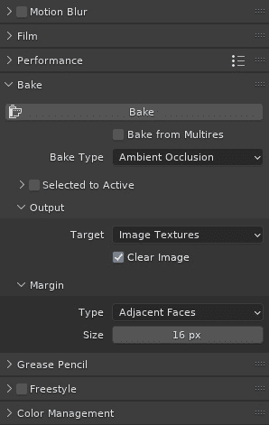

图 13.33 – 烘焙环境遮蔽贴图的渲染设置

如你所见，你只需要更改**烘焙类型**下拉菜单为**环境遮蔽**。现在，你可以选择要烘焙这些阴影的网格并点击**烘焙**按钮。对于房间网格，结果看起来像这样：

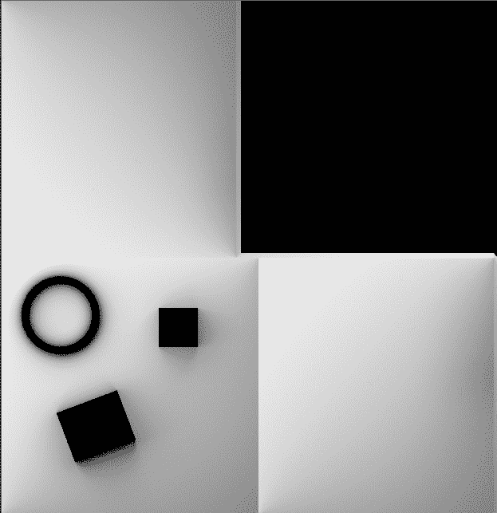

图 13.34 – 作为纹理的环境遮蔽贴图

Blender 提供了一些其他烘焙类型，你可以使用它们来获得看起来很好的纹理（特别是对于场景的静态部分），这可以大大提高渲染性能。

对于本节关于 Blender 的内容，我们还将探讨一个主题，那就是如何使用 Blender 更改纹理的 UV 贴图。

# 在 Blender 中进行自定义 UV 建模

在本节中，我们将从一个新的空 Blender 场景开始，并使用默认的立方体进行实验。为了获得 UV 贴图工作原理的良好概述，你可以使用一种称为 UV 网格的东西，它看起来像这样：

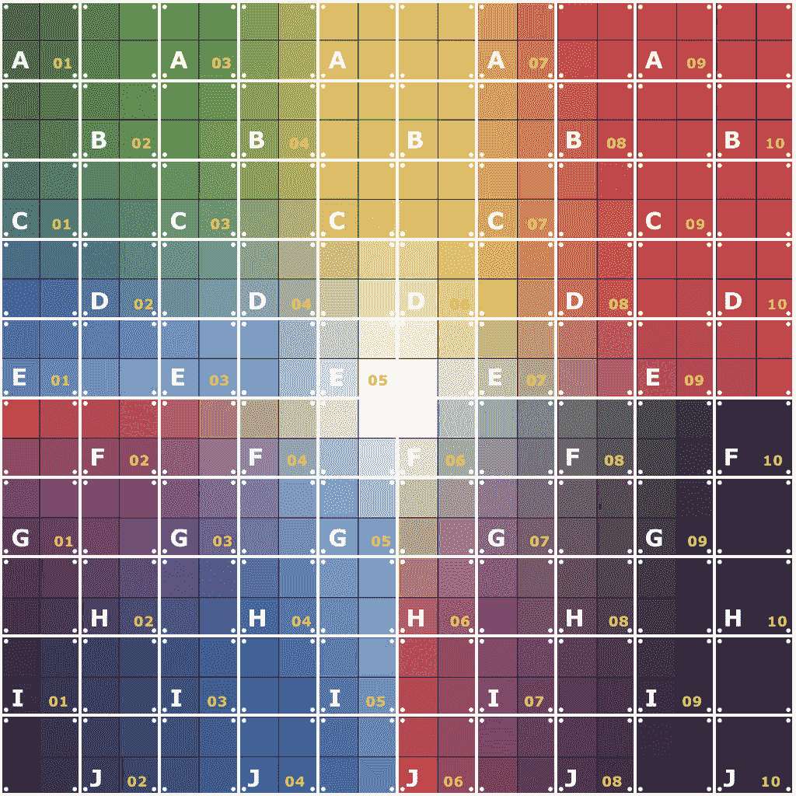

图 13.35 – 一个示例 UV 纹理

当你将此作为默认立方体的纹理应用时，你会看到网格的各个顶点如何映射到纹理上的特定位置。为了使用这个，我们首先需要定义这个纹理。你可以轻松地从屏幕右侧的**属性**视图中的**材质属性**中进行此操作。点击**基础颜色**属性前的黄色点并选择**图像纹理**。这允许你浏览并选择用作纹理的图像：

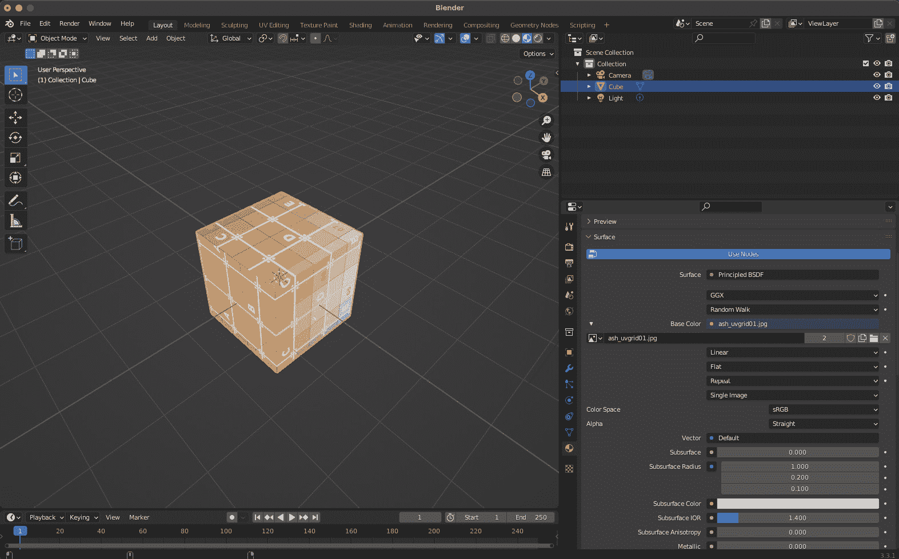

图 13.36 – 在 Blender 中向网格添加纹理

你已经在主视图中看到这个纹理是如何应用到立方体上的。如果我们将这个网格及其材质导出到 Three.js 并渲染它，我们会看到完全相同的映射，因为 Three.js 将使用 Blender 定义的 UV 映射 (`import-from-blender-uv-map-1.html`)：

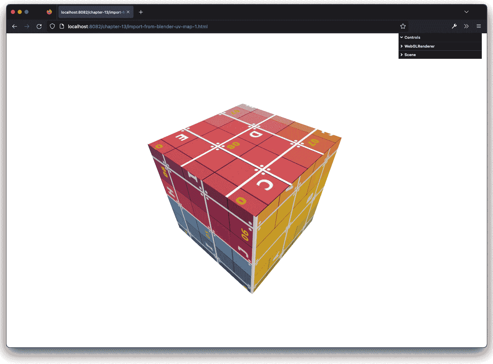

图 13.37 – 在 Three.js 中渲染的带有 UV 网格的盒子

现在，让我们切换回 Blender，并打开 **UV 编辑** 选项卡。在屏幕右侧的 **编辑模式**（使用 *Tab* 键）中选择四个面向前方的顶点。当你选择这些顶点后，你会在屏幕左侧看到这四个顶点的位置。

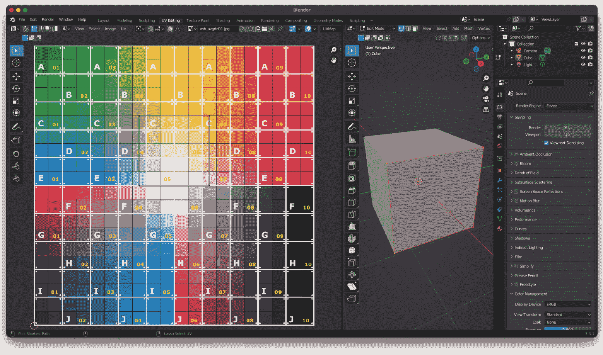

图 13.38 – UV 编辑器显示组成立方体前表面的四个像素的映射

在 UV 编辑器中，你现在可以抓取 (*g*) 顶点并将它们移动到纹理上的不同位置。例如，你可以将它们移动到纹理的边缘，如下所示：

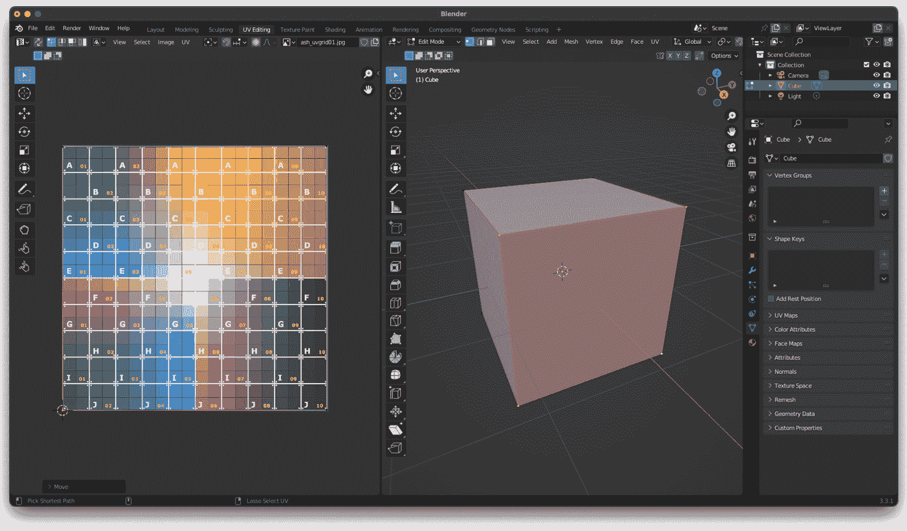

图 13.39 – 一侧映射到完整纹理

移动顶点将导致一个看起来像这样的立方体：

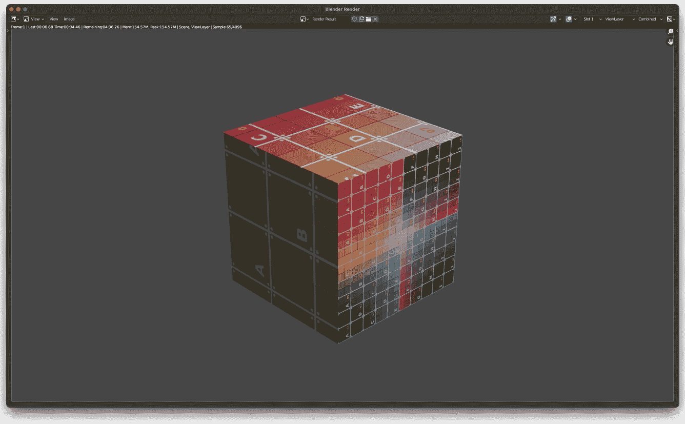

图 13.40 – 带有自定义 UV 映射的 Blender 立方体渲染

当然，当我们导出并导入这个最小模型时，这也在 Three.js 中直接显示：

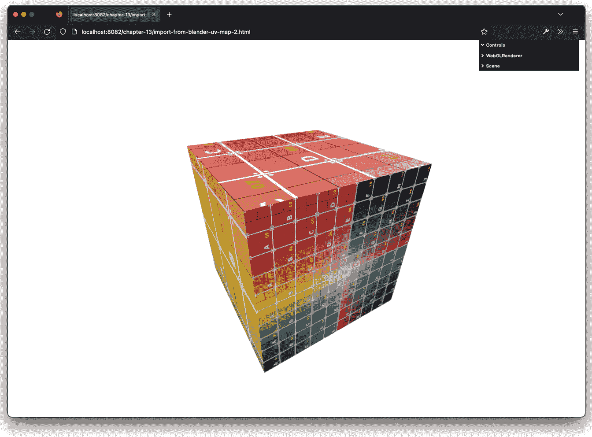

图 13.41 – 立方体的 Three.js 视图，带有自定义 UV 映射

使用这种方法，可以非常容易地定义你的网格的哪些部分应该映射到纹理的哪个部分。

# 摘要

在本章中，我们探讨了如何与 Blender 和 Three.js 协同工作。我们展示了如何使用 glTF 格式作为标准格式在 Three.js 和 Blender 之间交换数据。这对于网格、动画和大多数纹理来说效果很好。然而，对于高级纹理属性，你可能需要在 Three.js 或 Blender 中进行一些微调。我们还展示了如何在 Blender 中烘焙特定的纹理，如光照贴图和环境遮挡贴图，并在 Three.js 中使用它们。这允许你在 Blender 中一次性渲染这些信息，将其导入到 Three.js 中，并创建出优秀的阴影、灯光和环境遮挡，而无需 Three.js 通常必须进行的复杂计算。请注意，当然，这仅适用于光照静态、几何体和网格不移动或改变形状的场景。通常，你可以用这个方法来处理场景中的静态部分。最后，我们简要地探讨了 UV 贴图的工作原理，即顶点被映射到纹理上的一个位置，以及如何使用 Blender 来玩转这种映射。再次强调，通过使用 glTF 作为交换格式，Blender 中的所有信息都可以轻松地用于 Three.js。

我们现在即将结束这本书的阅读。在最后一章，我们将探讨两个额外的主题——如何将 Three.js 与 React.js 结合使用，以及我们将快速浏览 Three.js 对 VR 和 AR 的支持。
