# 14

# Three.js 与 React、TypeScript 和 Web-XR 一起使用

在本章的最后，我们将深入探讨两个额外的主题。首先，我们将探讨如何将 Three.js 与 TypeScript 和 React 结合使用。本章的第二部分将展示一些示例，说明您如何将 3D 场景与 Web-XR 集成。使用 Web-XR，您可以增强场景以与 VR 和 AR 技术一起工作。

更具体地说，我们将向您展示以下示例：

+   **使用 TypeScript 与 Three.js**：对于第一个示例，我们将向您展示如何创建一个结合了 Three.js 和 TypeScript 的简单项目。我们将创建一个非常简单的应用程序，类似于我们在前几章中已经看到的示例，并展示您如何使用 TypeScript 与 Three.js 一起创建场景。

+   **使用 TypeScript 和 React 与 Three.js**：React 是一个非常流行的 Web 开发框架，通常与 TypeScript 一起使用。在本节中，我们将创建一个简单的 Three.js 项目，该项目使用 React.js 和 TypeScript。

+   `React-three-fiber`。使用这个库，我们可以使用一组 React 组件声明性地配置 Three.js。这个库提供了 React 和 Three.js 之间出色的集成，使得在 React 应用程序中使用 Three.js 变得简单直接。

+   **Three.js 和 VR**：本节将向您展示如何以 VR 方式查看您的 3D 场景。

+   **Three.js 和 AR**：本节将解释如何创建一个简单的 3D 场景，您可以在其中添加 Three.js 网格。

让我们从本章的第一个示例开始，将 Three.js 与 TypeScript 集成。

# 使用 TypeScript 与 Three.js

TypeScript 提供了一种类型化的语言，它可以编译成 JavaScript。这意味着您可以使用它来创建您的网站，并且它在浏览器中运行得就像正常的 JavaScript 一样。设置 TypeScript 项目有许多不同的方法，但最简单的方法是由 Vite 提供（[`vitejs.dev/`](https://vitejs.dev/)）。Vite 提供了一个集成的构建环境，可以看作是 webpack（我们用于正常章节示例）的替代品。

我们需要做的第一件事是创建一个新的 Vite 项目。您可以自己执行这些步骤，或者您可以直接在`three-ts`文件夹中运行 `yarn install` 以跳过此设置。要获取一个空的 TypeScript 项目，我们只需在控制台中运行以下代码：

```js
$ yarn create vite three-ts --template vanilla-ts
yarn create v1.22.17
warning package.json: No license field
[1/4]   Resolving packages...
[2/4]   Fetching packages...
[3/4]   Linking dependencies...
[4/4]   Building fresh packages...
warning Your current version of Yarn is out of date. The latest version is "1.22.19", while you're on "1.22.17".
info To upgrade, run the following command:
$ curl --compressed -o- -L https://yarnpkg.com/install.sh | bash
success Installed "create-vite@3.2.1" with binaries:
      - create-vite
      - cva
[######################################################################] 70/70
Scaffolding project in /Users/jos/dev/git/personal/ltjs4-all/three-ts...
```

接下来，切换到目录（`three-ts`）并运行 `yarn install`。

```js
$ yarn install
yarn install v1.22.17
warning ../package.json: No license field
info No lockfile found.
[1/4]   Resolving packages...
[2/4]   Fetching packages...
[3/4]   Linking dependencies...
[4/4]   Building fresh packages...
success Saved lockfile.
  Done in 3.31s.
```

到目前为止，我们有一个空的 Vite 项目，您可以通过运行 `yarn vite` 来启动它。

```js
$  three-ts git:(main)  yarn vite
yarn run v1.22.17
warning ../package.json: No license field
$ /Users/jos/dev/git/personal/ltjs4-all/three-ts/node_modules/.bin/vite
  VITE v3.2.3  ready in 193 ms
    Local:   http://127.0.0.1:5173/
    Network: use --host to expose
```

如果您将浏览器指向 `http://127.0.0.1:5173/`，您将看到 Vite 的起始页面，并且您将有一个配置好的 TypeScript 项目：

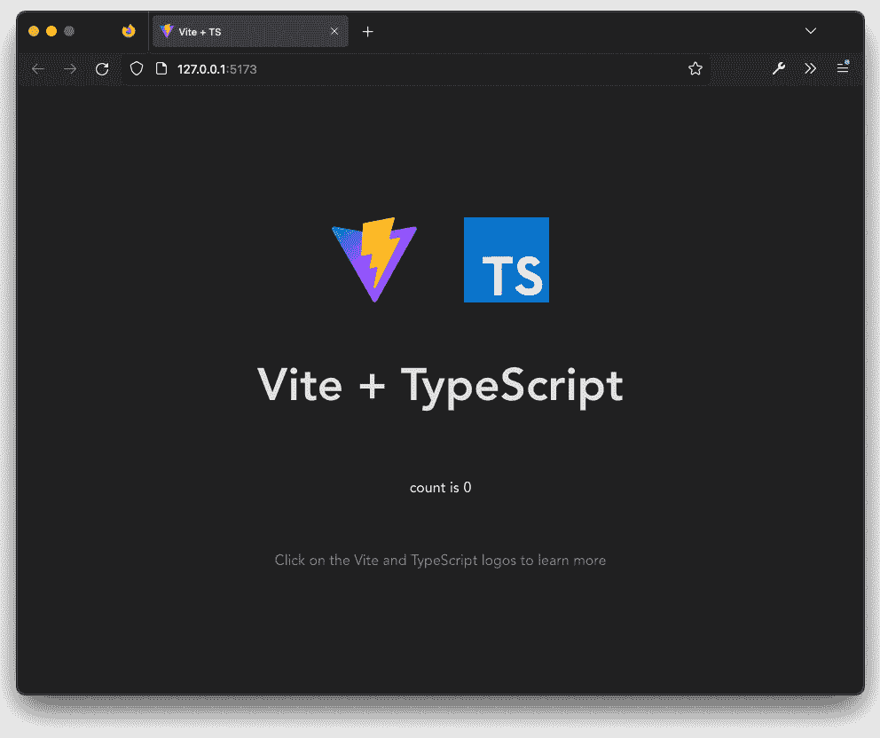

图 14.1 – 使用 Vite 的空 TypeScript 项目

接下来，我们必须添加 Three.js 库，之后我们可以添加一些 TypeScript 代码来初始化 Three.js。要添加 Three.js，我们需要添加以下两个 node 模块：

```js
$ yarn add three
$ yarn add -D @types/three
```

第一个添加了 Three.js 库，而第二个添加了 Three.js 库的`types`描述。这些`types`在编辑器中使用，以便在 IDE（例如 Visual Studio Code）中与 Three.js 和 TypeScript 一起工作时获得一些不错的代码补全。到目前为止，我们已经准备好将 Three.js 添加到这个项目中，并开始使用 TypeScript 开发 Three.js 应用程序。要添加 TypeScript，我们首先需要快速查看应用程序是如何初始化的。为此，你可以查看`public.html`文件，它看起来像这样：

```js
<!DOCTYPE html>
<html lang="en">
  <head>
    <meta charset="UTF-8" />
    <link rel="icon" type="image/svg+xml" href="/vite.svg" />
    <meta name="viewport" content="width=device-width,
      initial-scale=1.0" />
    <title>Vite + TS</title>
  </head>
  <body>
    <div id="app"></div>
    <script type="module" src="img/main.ts"></script>
  </body>
</html>
```

在前面的代码中，正如你在最后的`script`行中可以看到的，这个 HTML 页面加载了`src/main/ts`文件。打开此文件并将其内容更改为以下内容：

```js
import './style.css'
import { initThreeJsScene } from './threeCanvas'
const mainElement = document.querySelector
  <HTMLDivElement>('#app')
if (mainElement) {
  initThreeJsScene(mainElement)
}
```

这里编写的代码将尝试找到主要的`#app`节点。如果找到该节点，它将把该节点传递给定义在`threeCanvas.ts`文件中的`initThreeJsScene`函数。此文件包含初始化 Three.js 场景的代码：

```js
import * as THREE from 'three'
import { OrbitControls } from 'three/examples/jsm/
  controls/OrbitControls'
export const width = 500
export const height = 500
export const initThreeJsScene = (node: HTMLDivElement) => {
  const scene = new THREE.Scene()
  const camera = new THREE.PerspectiveCamera(75, height /
    width, 0.1, 1000)
  const renderer = new THREE.WebGLRenderer()
  renderer.setClearColor(0xffffff)
  renderer.setSize(height, width)
  node.appendChild(renderer.domElement)
  camera.position.z = 5
  const geometry = new THREE.BoxGeometry()
  const material = new THREE.MeshNormalMaterial()
  const cube = new THREE.Mesh(geometry, material)
  const controls = new OrbitControls(camera, node)
  scene.add(cube)
  const animate = () => {
    controls.update()
    requestAnimationFrame(animate)
    cube.rotation.x += 0.01
    cube.rotation.y += 0.01
    renderer.render(scene, camera)
  }
  animate()
}
```

这将看起来与我们在前几章中创建的初始简单场景的代码相似。主要的变化是，在这里，我们可以使用 TypeScript 提供的所有功能。Vite 将处理将 JavaScript 进行转换，因此你不需要做任何事情就可以在浏览器中看到结果：

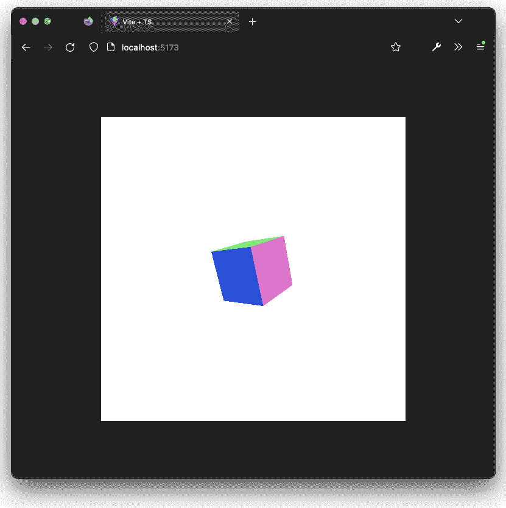

图 14.2 – 带有 Three.js 的简单 TypeScript 项目

现在我们已经介绍了 Three.js 和 TypeScript，让我们更进一步，看看我们如何将它们与 React 集成。

# 使用 TypeScript 和 React 与 Three.js

从零开始创建 React 应用程序有不同的方法（例如，Vite 也支持这一点），但最常见的方法是使用命令行中的`yarn create react-app lts-tf --template TypeScript`命令。就像 Vite 一样，这将创建一个新的项目。对于这个例子，我们在`lts-tf`目录中创建了此项目。一旦创建，我们必须像为 Vite 做的那样添加 Three.js 库：

```js
$ yarn create react-app lts-tf --template TypeScript
...
$ cd lts-tf
$ yarn add three
$ yarn add -D @types/three
$ yarn install
```

这应该设置一个简单的 React TypeScript 应用程序，添加正确的 Three.js 库，并安装所有其他必需的模块。下一步是快速检查这一切是否正常工作。运行`yarn start`命令：

```js
$ yarn start
Compiled successfully!
You can now view lts-tf in the browser.
  Local:            http://localhost:3000
  On Your Network:  http://192.168.68.112:3000
Note that the development build is not optimized.
To create a production build, use yarn build.
webpack compiled successfully
Files successfully emitted, waiting for typecheck results...
Issues checking in progress...
No issues found.
```

打开你的浏览器到`http://localhost:3000`，你会看到一个简单的 React 启动屏幕：

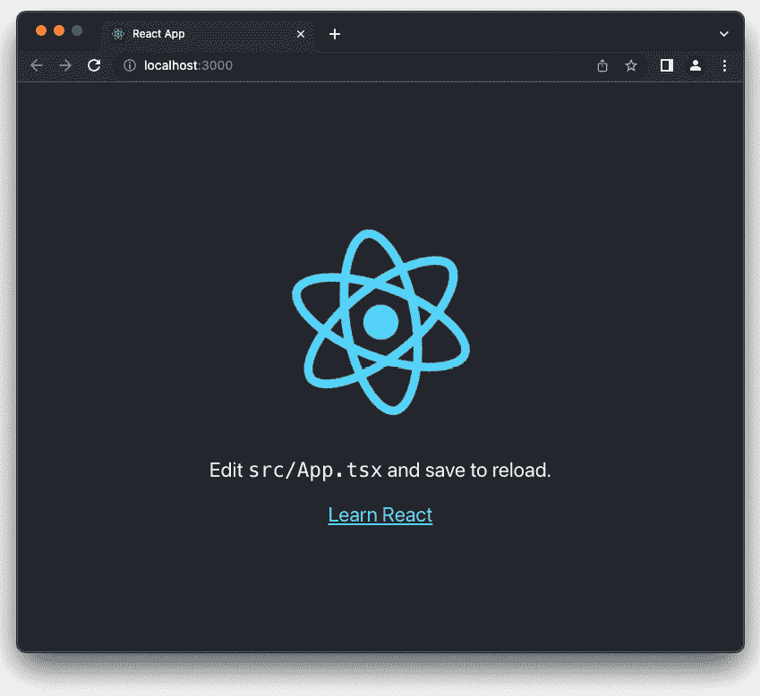

图 14.3 – 带有 Three.js 的简单 TypeScript 项目

在这个屏幕上，我们可以看到我们需要编辑`app.tsx`文件，所以我们将更新它，类似于我们在*使用 TypeScript 与 Three.js*部分看到的纯 TypeScript 示例，但这次作为一个 React 组件：

```js
import './App.css'
import { ThreeCanvas } from './ThreeCanvas'
function App() {
  return (
    <div className="App">
      <ThreeCanvas></ThreeCanvas>
    </div>
  )
}
export default App
```

如您所见，这里我们定义了一个名为 `ThreeCanvas` 的自定义组件，现在它在应用程序启动时立即加载。Three.js 初始化代码由 `ThreeCanvas` 元素提供，您可以在 `ThreeCanvas.tsx` 文件中找到它。这个文件的大部分内容与我们在 *使用 TypeScript 的 Three.js* 部分中描述的 `initThreeJsScene` 函数类似，但为了完整性，我们将在这里包含整个文件：

```js
import { useCallback, useState } from 'react'
import * as THREE from 'three'
const initThreeJsScene = (node: HTMLDivElement) => {
  const scene = new THREE.Scene()
  const camera = new THREE.PerspectiveCamera(75, 500 / 500,
    0.1, 1000)
  const renderer = new THREE.WebGLRenderer()
  renderer.setClearColor(0xffffff)
  renderer.setSize(500, 500)
  node.appendChild(renderer.domElement)
  camera.position.z = 5
  const geometry = new THREE.BoxGeometry()
  const material = new THREE.MeshNormalMaterial()
  const cube = new THREE.Mesh(geometry, material)
  scene.add(cube)
  const animate = () => {
    requestAnimationFrame(animate)
    cube.rotation.x += 0.01
    cube.rotation.y += 0.01
    renderer.render(scene, camera)
  }
  animate()
}
export const ThreeCanvas = () => {
  const [initialized, setInitialized] = useState(false)
  const threeDivRef = useCallback(
    (node: HTMLDivElement | null) => {
      if (node !== null && !initialized) {
        initThreeJsScene(node)
        setInitialized(true)
      }
    },
    [initialized]
  )
  return (
    <div
      style={{
        display: 'flex',
        alignItems: 'center',
        justifyContent: 'center',
        height: '100vh'
      }}
      ref={threeDivRef}
    ></div>
  )
}
```

在 `initThreeJsScene` 中，您可以找到使用 TypeScript 初始化简单 Three.js 场景的标准代码。为了将这个 Three.js 场景连接到 React，我们可以使用来自 `ThreeCanvas` 功能 React 组件的代码。我们在这里想要做的是在 `div` 元素附加到其父节点时初始化 Three.js 场景。为此，我们可以使用 `useCallback` 函数。这个函数将在节点第一次附加到父节点时被调用，即使父节点的一个属性发生变化，它也不会重新运行。在我们的情况下，我们还将添加另一个 `isInitialized` 状态，以确保即使在开发服务器重新加载应用程序的部分时，我们也只初始化我们的 Three.js 场景一次。

useRef 或 useCallback

你可能会想在这里使用 `useRef`。在 https://reactjs.org/docs/hooks-faq.html#how-can-i-measure-a-dom-node 有一个很好的解释，说明了为什么在这种情况下，你应该使用 `useCallback` 而不是 `useRef` 来避免不必要的重新渲染。

在前面的设置完成后，我们现在可以看到结果：

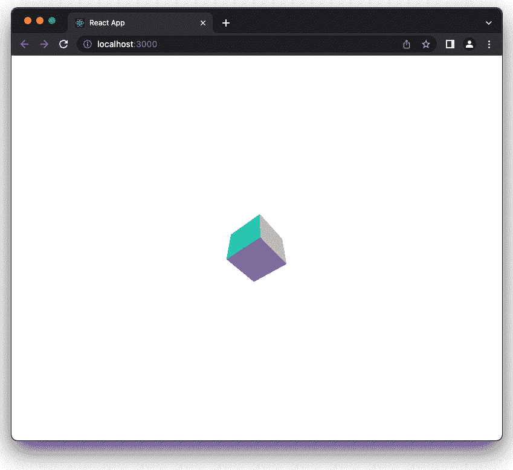

图 14.4 – 使用 TypeScript 和 React 的 Three.js

在上一个示例中，我们创建了一个简单的 React 和 Three.js 之间的集成。虽然这可行，但用程序描述 Three.js 场景感觉有点奇怪，因为在 React 中，通常使用组件声明性地声明应用程序。我们可以像处理 `ThreeCanvas` 组件那样包装现有的 Three.js 组件，但这会很快变得复杂。幸运的是，不过，Three.js fibers 项目已经为我们完成了所有这些艰苦的工作：`https://docs.pmnd.rs/react-three-fiber/getting-started/introduction`。在下一节中，我们将探讨如何借助这个项目轻松地将 Three.js 和 React 集成在一起。

# 使用 React Three Fiber 与 Three.js 和 React 集成

在前面的示例中，我们自行设置了 React 和 Three.js 之间的集成。虽然这可行，但这种方法并没有紧密地与 React 的工作方式集成。为了这些框架之间良好的集成，我们可以使用 React Three Fiber。我们将再次从设置项目开始。

为了做到这一点，请运行以下命令：

```js
$ yarn create react-app lts-r3f
$ cd lts-3rf
$ yarn install
$ yarn add three
$ yarn add @react-three/fiber
```

这将安装我们需要的所有依赖项并设置一个新的 React 项目。要启动`lts-r3f`目录中的此项目，运行`yarn start`，这将启动一个服务器。打开屏幕上显示的 URL（`http://localhost:3000`）；你会看到以下屏幕，这是我们之前看到的，显示了一个空的 React 项目：

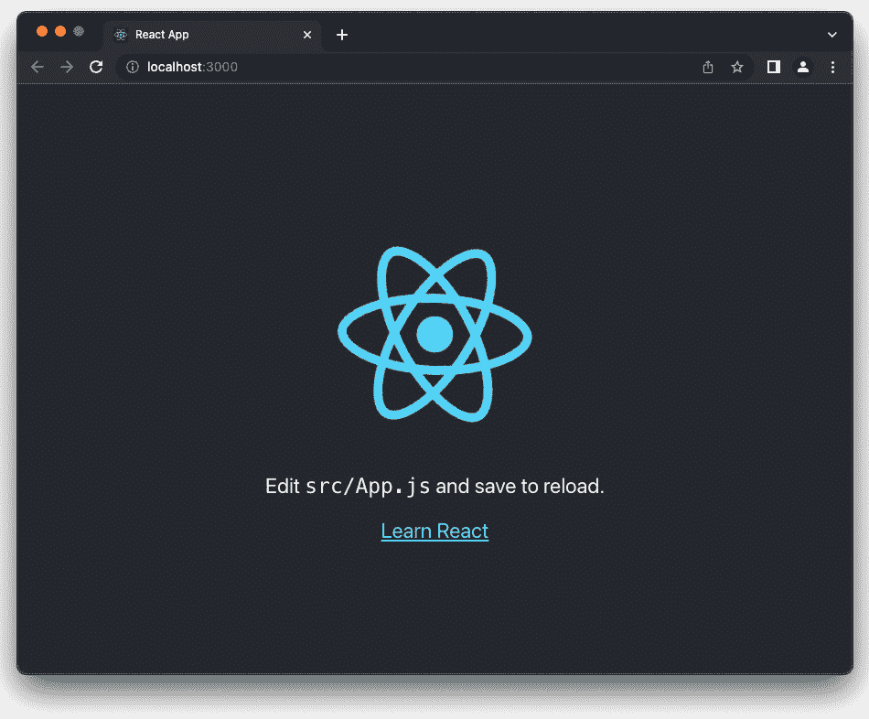

图 14.5 – 启动一个简单的 JavaScript React 应用程序

当屏幕开始扩展这个示例时，我们需要编辑`app.jsx`文件。我们将创建一个新的组件，该组件将包含我们的 Three.js 场景：

```js
import './App.css'
import { Canvas } from '@react-three/fiber'
import { Scene } from './Scene'
function App() {
  return (
    <Canvas>
      <Scene />
    </Canvas>
  )
}
export default App
```

在这里，我们已经可以看到 Three Fiber 组件中的第一个——`Canvas`元素。`Canvas`元素创建一个`Canvas` div，并且是所有由这个库提供的其他 Three.js 组件的父容器。由于我们将`Scene`作为子组件添加到这个`Canvas`组件中，我们可以在我们的自定义组件中定义完整的 Three.js 场景。接下来，我们将创建这个`Scene`组件：

```js
import React from 'react'
export const Scene = () => {
  return (
    <>
      <ambientLight intensity={0.1} />
      <directionalLight color="white" intensity={0.2}
       position={[0, 0, 5]} />
      <mesh
        rotation={[0.3, 0.6, 0.3]}>
        <boxGeometry args={[2, 5, 1]} />
        <meshStandardMaterial color={color}
          opacity={opacity} transparent={true} />
      </mesh>
    </>
  )
}
```

我们这里有一个非常简单的 Three.js 场景，它看起来与我们在本书中之前看到的类似。这个场景包含以下对象：

+   `<ambientLight>`：一个`Three.AmbientLight`对象的实例。

+   `<directionalLight>`：一个`Three.DirectionalLight`对象的实例。

+   `<mesh>`：这代表一个`Three.Mesh`。正如我们所知，一个`Three.Mesh`包含一个几何体和一个材质，这些作为此元素的子元素定义。在这个示例中，我们还设置了此网格的旋转。

+   `<boxGeometry>`：这与`Three.BoxGeometry`类似，我们通过`args`属性传递构造函数参数。

+   `<meshStandardMaterial>`：这创建了一个`THREE.MeshStandardMaterial`的实例，并在这个材质上配置了一些属性。

现在，当你打开浏览器到`localhost:3000`时，你会看到一个 Three.js 场景：

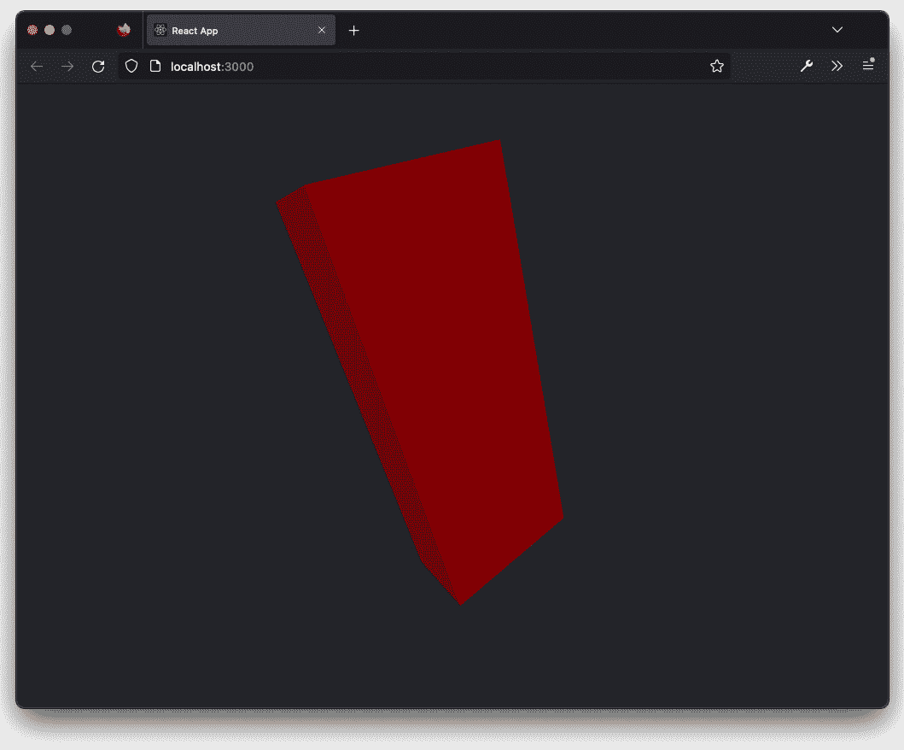

图 14.6 – 使用 React Three Fiber 渲染的 Three.js 场景

在这个示例中，我们只展示了 React Three Fiber 提供的一些小元素。所有由 Three.js 提供的对象都可以按照我们刚刚展示的方式进行配置。只需将它们作为元素添加，配置它们，它们就会在屏幕上显示。除了轻松显示这些元素之外，所有这些元素都表现得像正常的 React 组件。因此，每当父元素的属性发生变化时，所有元素都会重新渲染（或更新）。

除了 React Three Fiber 提供的元素之外，还有一整套由`@react-three/drei`提供的附加组件。你可以在[`github.com/pmndrs/drei`](https://github.com/pmndrs/drei)找到这些组件及其描述：

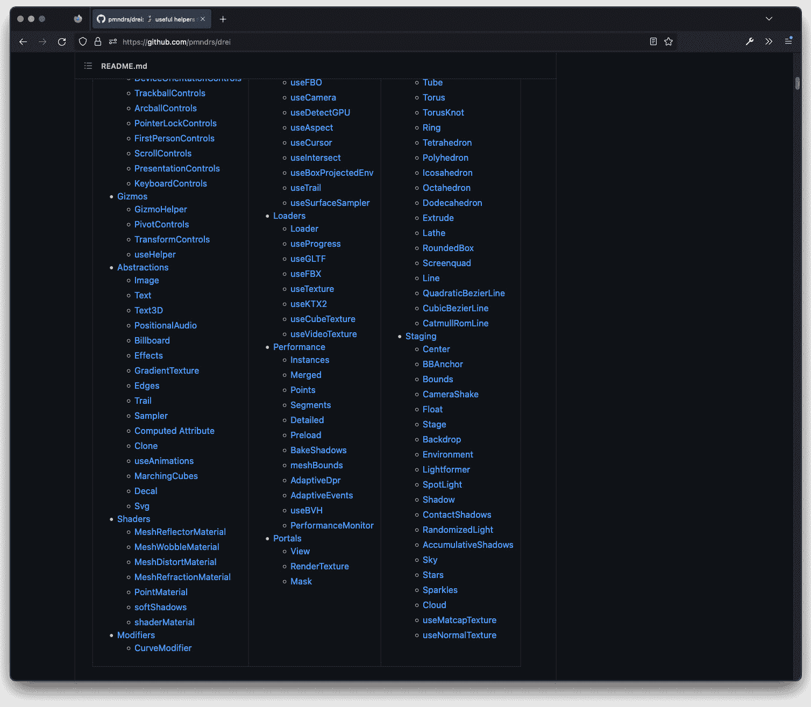

图 14.7 – 来自@react-three/drei 的附加组件

对于下一个示例，我们将使用这个库提供的一些组件，因此我们需要将以下内容添加到我们的项目中：

```js
$ yarn add @react-three/drei
```

现在，我们将扩展我们的示例到这一点：

```js
import React, { useState } from 'react'
import './App.css'
import { OrbitControls, Sky } from '@react-three/drei'
import { useFrame } from '@react-three/fiber'
export const Scene = () => {
  // run on each render of react
  // const size = useThree((state) => state.size)
  const mesh = React.useRef()
  const [color, setColor] = useState('red')
  const [opacity, setOpacity] = useState(1)
  const [isRotating, setIsRotating] = useState(false)
  // run on each rerender of
  useFrame(({ clock }, delta, xrFrame) => {
    if (isRotating) mesh.current.rotation.x += 0.01
  })
  return (
    <>
      <Sky distance={450000} sunPosition={[0, 1, 0]}
        inclination={0} azimuth={0.25} />
      <ambientLight intensity={0.1} />
      <directionalLight color="white" intensity={0.2}
        position={[0, 0, 5]} />
      <OrbitControls></OrbitControls>
      <mesh
        ref={mesh}
        rotation={[0.3, 0.6, 0.3]}
        onClick={() => setColor('yellow')}
        onPointerEnter={() => {
          setOpacity(0.5)
          setIsRotating(true)
        }}
        onPointerLeave={() => {
          setOpacity(1)
          setIsRotating(false)
        }}
      >
        <boxGeometry args={[2, 5, 1]} />
        <meshStandardMaterial color={color}
          opacity={opacity} transparent={true} />
      </mesh>
    </>
  )
}
```

在查看浏览器中的结果之前，让我们先探索一下代码。首先，我们将查看我们添加到组件中的新元素：

+   `<OrbitControls>`：这是由`drei`库提供的。这将在场景中添加一个`THREE.OrbitControls`元素。这与我们在早期章节中使用的`OrbitControls`相同。正如你所看到的，只需添加元素就足够了；不需要额外的配置。

+   `<Sky>`：此元素为场景提供了一个漂亮的背景天空。

我们还添加了几个标准的 React Hooks：

```js
  const mesh = React.useRef()
  const [color, setColor] = useState('red')
  const [opacity, setOpacity] = useState(1)
  const [isRotating, setIsRotating] = useState(false)
```

在这里，我们定义了一个`Ref`，我们将其连接到网格（`<mesh ref={mesh}) ..>`）。我们使用这个`Ref`是为了在渲染循环中稍后访问 Three.js 组件。我们还使用了三次`useState`来跟踪材质的`color`和`opacity`状态值，以及查看`mesh`属性是否正在旋转。这两个 Hooks 中的第一个用于我们在网格上定义的事件：

```js
      <mesh
        onClick={() => setColor('yellow')}
        onPointerEnter={() => {
          setOpacity(0.5)
          setIsRotating(true)
        }}
        onPointerLeave={() => {
          setOpacity(1)
          setIsRotating(false)
        }}>
```

使用这些事件处理器，我们可以非常容易地将鼠标与网格集成。不需要`RayCaster`对象——只需添加事件监听器即可完成。在这种情况下，当鼠标指针进入我们的网格时，我们改变`opacity`状态值和`isRotation`标志。当鼠标离开我们的网格时，我们将`opacity`状态值恢复，并将`isRotation`标志再次设置为`false`。最后，当我们点击网格时，我们将颜色更改为`黄色`。

`color`和`opacity`状态值可以直接在`meshStandardMaterial`中使用，如下所示：

```js
<meshStandardMaterial color={color} opacity={opacity}
  transparent={true} />
```

现在，当触发相关事件时，透明度和颜色将自动更新。对于旋转，我们想使用 Three.js 渲染循环。为此，React Three Fiber 提供了一个额外的钩子：

```js
  useFrame(({ clock }, delta, xrFrame) => {
    if (isRotating) mesh.current.rotation.x += 0.01
  })
```

`useFrame`在 Three.js 中每次有渲染循环时都会被调用。在这种情况下，我们检查`isRotating`状态，如果我们应该旋转，我们使用之前定义的`useRef`引用来获取对底层 Three.js 组件的访问权限，并简单地增加其旋转。这一切都非常简单方便。浏览器中的结果如下所示：

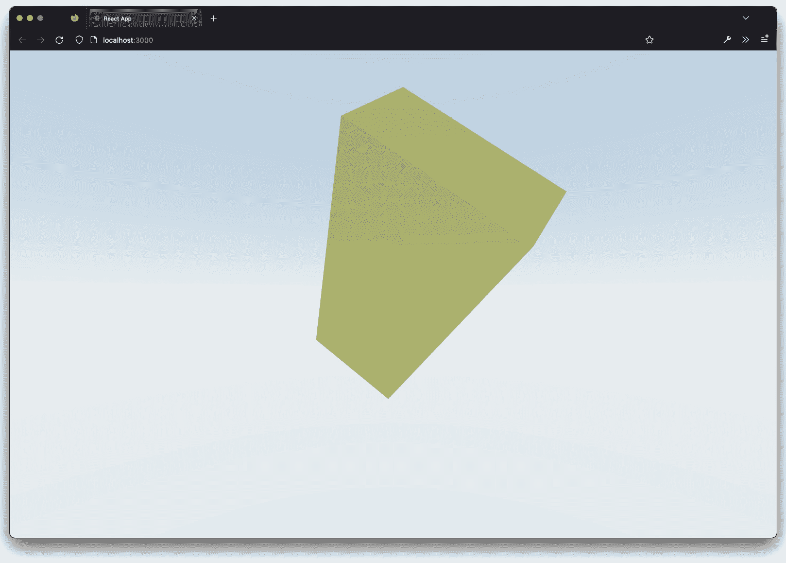

图 14.8 – 使用 React 和 React Three Fiber 效果的场景

React Three Fiber 和`drei`库几乎提供了你在正常 Three.js 库中拥有的所有功能（以及一些不可用的功能）。如果你使用 React 并且需要集成 Three.js，这是使用 Three.js 的一个很好的方法。即使你并不一定在构建 React 应用程序，React Three Fiber 提供的声明式定义场景、组件和交互的方式也非常直观。React Three Fiber 为任何你想要创建的 Three.js 可视化提供了一个很好的替代方案。

在接下来的两节中，我们将探讨如何通过 AR 和 VR 功能扩展您的 3D 场景。我们将首先查看如何在场景中启用 VR。

# Three.js 和 VR

在我们查看所需的代码更改之前，我们将向浏览器添加一个扩展，以便我们可以模拟 VR 头戴式设备和 VR 控制。这样，您可以在不需要物理头戴式设备和物理控制器的情况下测试您的场景。为此，我们将安装 WebXR API 模拟器。此插件适用于 Firefox 和 Chrome：

+   **Firefox 插件**：从这里下载并安装：[`addons.mozilla.org/en-US/firefox/addon/webxr-api-emulator/`](https://addons.mozilla.org/en-US/firefox/addon/webxr-api-emulator/)

)

+   **Chrome 插件**：从这里下载并安装：[`chrome.google.com/webstore/detail/webxr-api-emulator/mjddjgeghkdijejnciaefnkjmkafnnje`](https://chrome.google.com/webstore/detail/webxr-api-emulator/mjddjgeghkdijejnciaefnkjmkafnnje)

)

按照您特定浏览器的说明。安装后，我们可以使用此示例进行测试：[`immersive-web.github.io/webxr-samples/immersive-vr-session.html`](https://immersive-web.github.io/webxr-samples/immersive-vr-session.html)。

打开此示例，打开您的开发者控制台，并点击**WebXR**标签。现在，您将看到如下内容：

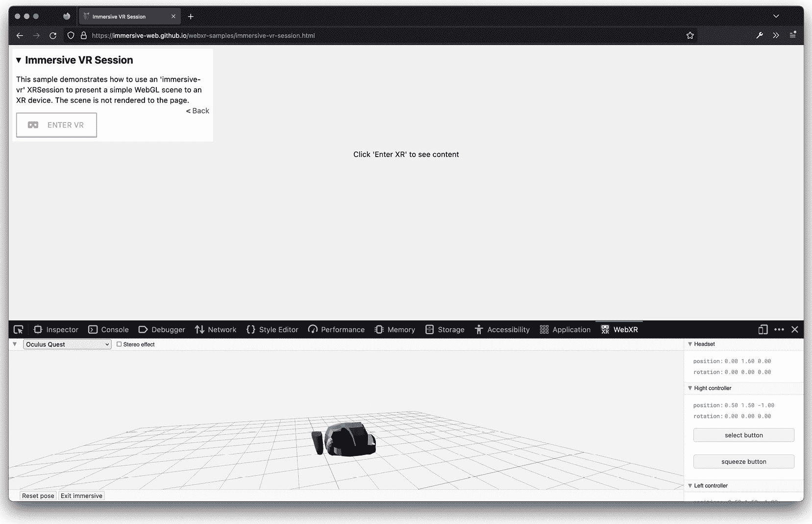

图 14.9 – 带有 WebXR API 扩展的 Firefox 浏览器

在扩展中，您将看到一个虚拟头戴式设备和一些虚拟 VR 控制。通过点击头戴式设备，您可以模拟真实 VR 头戴式设备的运动；同样适用于控制。如果您点击**进入 VR**按钮，现在您可以简单地测试您的 VR 场景，而无需实际的 VR 头戴式设备：

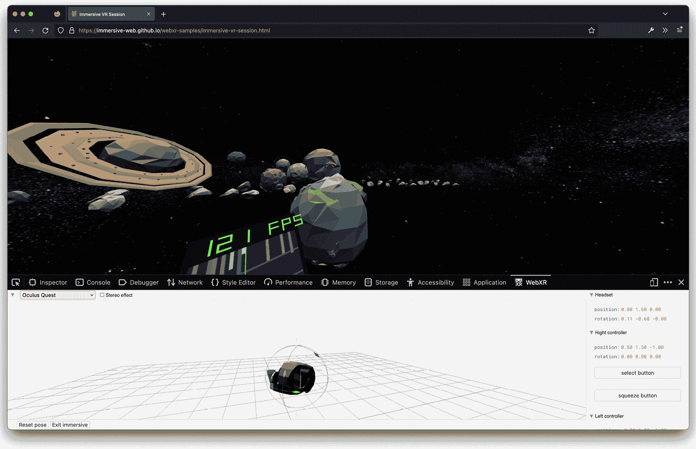

图 14.10 – 模拟 VR 头戴式设备

现在我们已经有一个（虚拟的）头戴式设备可以玩耍了，让我们将我们之前的一个场景转换成一个 VR 场景，在那里我们可以跟踪头部运动并为一些虚拟的 VR 控制添加功能。为此，我们创建了第八章“创建和加载高级网格和几何体”中“First Person Controls”示例的副本。您可以通过打开`chapter-14`源中的`vr.html`示例来打开此示例：

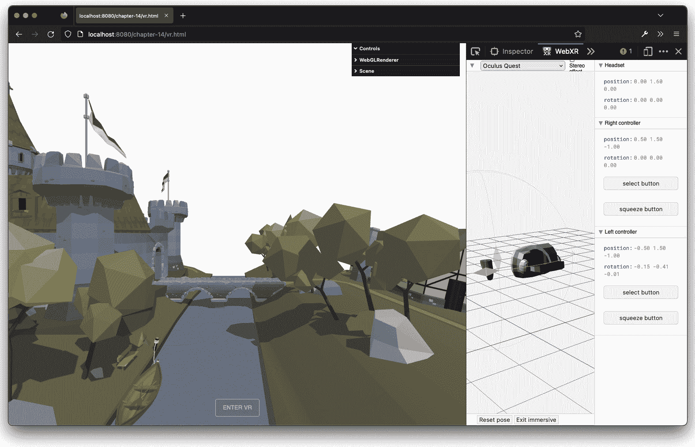

图 14.11 – 基于第九章示例的空 VR 场景

为了使您的场景准备好 VR，我们需要采取几个步骤。首先，我们需要告诉 Three.js 我们将启用 Web-XR 功能。这可以这样完成：

```js
renderer.xr.enabled = true
```

下一步是添加一个简单的按钮，我们可以点击它进入 VR 模式。Three.js 为此提供了一个现成的组件，我们可以这样使用：

```js
import { VRButton } from 'three/examples/jsm/webxr/VRButton'
document.body.appendChild(VRButton.createButton(renderer))
```

这将创建出在图 14.11 底部可以看到的按钮。

最后，我们需要更新我们的渲染循环。如您从*第一章*，“使用 Three.js 创建您的第一个 3D 场景”中可能记得，我们使用`requestAnimationFrame`来控制渲染循环。当与 VR 一起工作时，我们需要稍作改变，如下所示：

```js
animate()
function animate() {
  renderer.setAnimationLoop(animate)
  renderer.render(scene, camera)
  if (onRender) onRender(clock, controls, camera, scene)
}
```

在这里，我们使用了`renderer.setAnimationLoop`而不是`requestAnimationFrame`。此时，我们的场景已经转换为 VR，一旦我们点击按钮，我们就进入 VR 模式并可以环顾我们的场景：

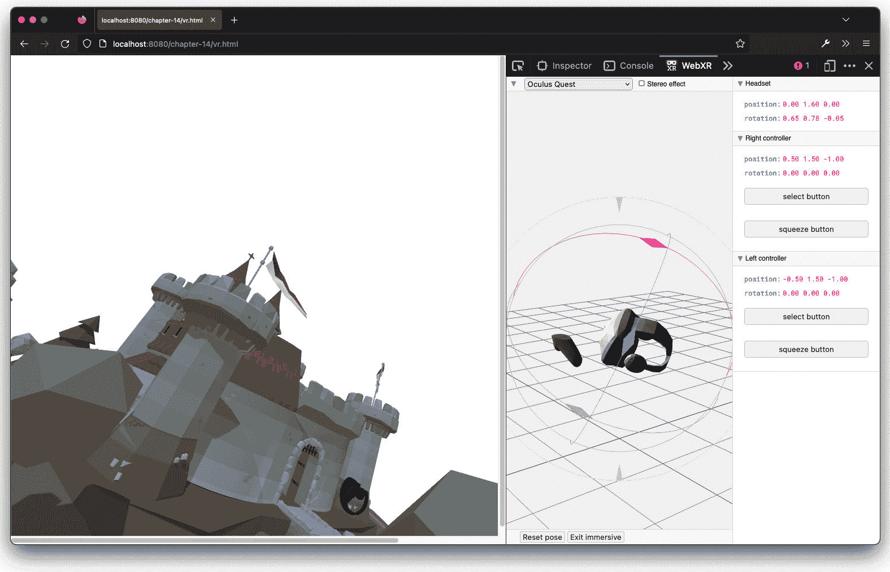

图 14.12 – 使用浏览器扩展进入 VR 模式并旋转相机

之前的截图是在您进入 VR 时显示的。现在，您可以通过在 Web-XR 扩展中的 VR 设备上点击并移动它来轻松地移动相机。这些步骤基本上就是将任何 Three.js 场景转换为 VR 场景所需的所有步骤。

如果您仔细观察*图 14**.12*，您可能会注意到我们还展示了一些手持 VR 设备。我们还没有展示如何添加这些设备。为此，Three.js 也提供了一些不错的辅助组件：

```js
import { XRControllerModelFactory } from
  'three/examples/jsm/webxr/XRControllerModelFactory'
const controllerModelFactory = new
  XRControllerModelFactory()
const controllerGrip1 = renderer.xr.getControllerGrip(0)
controllerGrip1.add(controllerModelFactory.createControllerModel(controllerGrip1))
scene.add(controllerGrip1)
const controllerGrip2 = renderer.xr.getControllerGrip(1)
controllerGrip2.add(controllerModelFactory.createControllerModel(controllerGrip2))
scene.add(controllerGrip2)
```

通过前面的代码，我们要求 Three.js 获取有关附加控制器的信息，创建一个模型，并将它们添加到场景中。如果您使用 WebXR API 模拟器，您可以移动控件，它们也会在场景中移动。

Three.js 提供了大量示例，展示了您如何使用这些控件拖动对象、在场景中选择对象以及通过控件添加其他交互性。对于这个简单的示例，我们添加了在您点击`select`按钮时在第一个控制器的位置（右侧的那个）添加一个立方体的选项：

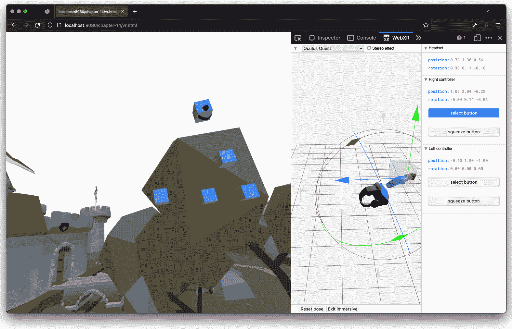

图 14.13 – 在 VR 场景中添加立方体

我们可以通过简单地给控制器添加事件监听器来实现这一点，如下所示：

```js
const controller = renderer.xr.getController(0)
controller.addEventListener('selectstart', () => {
  console.log('start', controller)
  const mesh = new THREE.Mesh(new THREE.BoxGeometry(0.1,
    0.1, 0.1), new THREE.MeshNormalMaterial())
  mesh.position.copy(controller.position)
  scene.add(mesh)
})
controller.addEventListener('selectend', () => {
  console.log('end', controller)
})
```

在这段简单的代码中，您可以看到我们给控制器添加了两个事件监听器。当`selectstart`事件被触发时，我们在控制器的位置添加一个新的立方体。而当`selectend`事件被触发时，我们只是在控制台记录一些信息。通过 JavaScript 可以访问其他几个事件。有关在 VR 会话中可用的 API 的更多信息，您可以查看以下文档：[`developer.mozilla.org/en-US/docs/Web/API/XRSession`](https://developer.mozilla.org/en-US/docs/Web/API/XRSession)

)

对于最后一部分，我们将快速浏览如何将 Three.js 与 AR 结合使用。

# Three.js 和 AR

虽然在许多设备和浏览器上，Three.js 对 VR 的支持良好，但对于 Web-AR 来说并非如此。在 Android 设备上，支持相当不错，但在 iOS 设备上，效果并不理想。苹果公司目前正在努力将此功能添加到 Safari 中，因此一旦实现，原生 AR 也应该在 iOS 上工作。检查哪些浏览器支持此功能的一个好方法是查看[`caniuse.com/webxr`](https://caniuse.com/webxr)，它提供了所有主要浏览器支持的最新概述。

因此，要测试原生 AR 示例，你需要在 Android 设备上查看，或者使用我们在*Three.js 和* *VR* 部分使用的相同模拟器。

让我们创建一个标准场景，你可以将其用作 AR 实验的起点。我们首先需要做的是告诉 Three.js 我们想要使用 XR：

```js
const renderer = new THREE.WebGLRenderer({ antialias: true,
  alpha: true })
renderer.xr.enabled = true
```

注意，我们需要将`alpha`属性设置为`true`；否则，我们不会看到任何来自摄像头的透传。接下来，就像我们对 VR 所做的那样，我们需要通过调用`rendered.xr.enabled`在渲染器上启用 AR/VR。

要进入 AR 模式，Three.js 还提供了一个我们可以使用的按钮：

```js
Import { ARButton } from 'three/examples/jsm/
  webxr/ARButton'
document.body.appendChild(ARButton.createButton(renderer))
```

最后，我们只需将`requestAnimationFrame`更改为`setAnimationLoop`：

```js
animate()
function animate() {
  renderer.setAnimationLoop(animate)
  renderer.render(scene, camera)
}
```

这就是全部内容。如果你打开`ar.html`示例并通过 WebXR 插件（需要选择`Samsung Galaxy S8+ (AR)`设备）查看此示例，你会看到类似这样的内容：

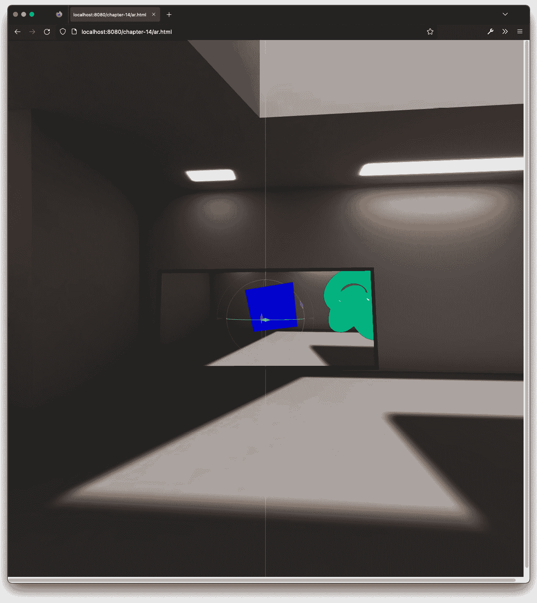

图 14.14 – 使用设备的原生 AR 功能在 Three.js 中查看 AR 场景

在此屏幕截图中，你可以看到一个模拟的 AR 环境，我们可以看到我们渲染的两个对象。如果你移动模拟的手机，你会注意到渲染的对象相对于手机摄像头的位置是固定的。

此处的示例非常简单，但它展示了如何设置最小 AR 场景的基本方法。Web-XR 提供了许多与 AR 相关的其他功能，例如检测平面和碰撞测试。然而，涵盖这些内容略超出了本书的范围。有关 Web-XR 和此 API 公开的原生 AR 功能的信息，你可以查看以下规范：[`developer.mozilla.org/en-US/docs/Web/API/WebXR_Device_API/Fundamentals`](https://developer.mozilla.org/en-US/docs/Web/API/WebXR_Device_API/Fundamentals)。

# 摘要

在本章中，我们探讨了与 Three.js 相关的一些技术。我们向您展示了将 Three.js 与 TypeScript 和 React 集成的不同方法，我们还展示了如何创建一些基本的 AR 和 VR 场景。

通过使用 Three.js 的 TypeScript 绑定，你可以轻松地从你的 TypeScript 项目中访问所有 Three.js 功能。通过 React Three Fiber 库，将 Three.js 与 React 集成也变得简单易行。

在 Three.js 中使用 VR 和 AR 也非常简单。只需向主渲染器添加几个属性，您就可以快速将任何场景转换为 VR 或 AR 场景。记得使用浏览器插件来轻松测试您的场景，而无需实际 VR 和 AR 设备。

有了这些，我们就来到了这本书的结尾。希望您喜欢阅读它并尝试使用示例。祝您实验愉快！
