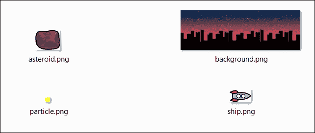
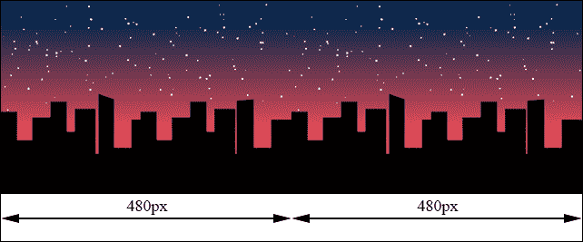
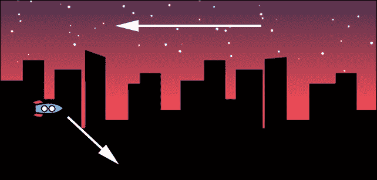
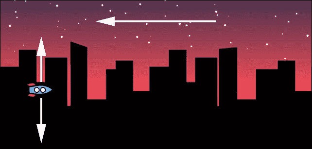
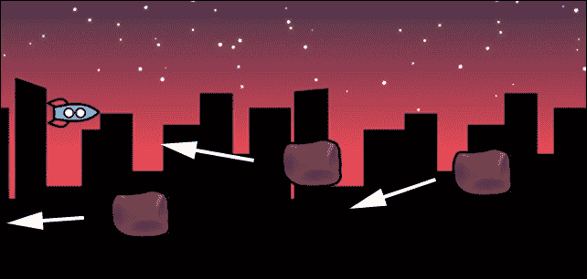
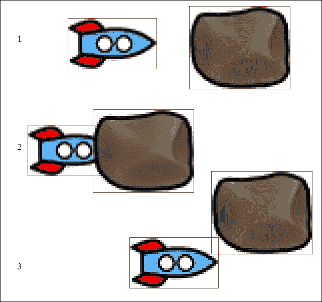
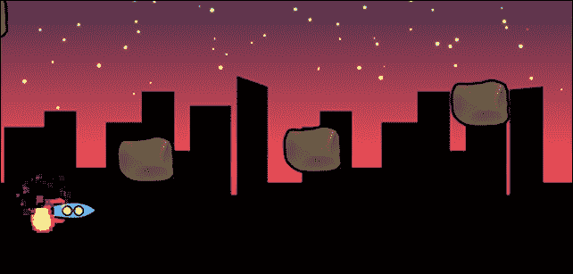

# 第三章. 在屏幕上移动精灵 - 无尽跑酷

很久以前，无尽跑酷从一个名为**直升机**的游戏开始，你必须驾驶直升机穿过无尽的洞穴，只需按一个按钮给它推力。

然后，游戏变得更加复杂，直到移动游戏开始传播。由于简单的单次点击控制，无尽跑酷开始获得新的流行。玩家只需在需要时触摸任何地方来控制直升机。

在本章中，你将构建一个无尽跑酷游戏，其中一艘太空船在城市中飞行，同时避开危险的陨石。

在制作这个游戏的过程中，你将学习如何做其他事情，例如：

+   滚动大图像以在无尽背景上给出一个概念

+   安排事件

+   控制帧率

+   检查精灵之间的碰撞

+   创建一个简单的粒子系统

+   手动移动精灵或使用动作

此外，尽管这是一个跨平台游戏，你还将了解仅使用鼠标控制。当你已经遇到它们在制作注意力游戏时，将它们更改为触摸或点击控制将很容易。总的来说，如果你计划一个仅适用于桌面的浏览器游戏，这将是有用的东西。

# 加载和放置图形资源

你需要在第一章中创建的蓝图上构建游戏，所以这里是`assets`文件夹的内容：



你可以看到太空船、你必须避免的陨石、一个小圆圈用于创建粒子效果，以及滚动背景。

你将花一些时间尝试理解背景。由于游戏是 480 x 320 像素，你的背景至少应该是*480*2=960*像素宽，这是由两个 480 x 320 的无缝图像组成的。

通过以下图像，你将能够给玩家提供飞越无尽城市景观的可能性：



所有这些图像都需要通过位于`src`的`loadassets.js`文件预加载，它将变成：

```js
var gameResources = ["assets/background.png","assets/ship.png","assets/particle.png","assets/asteroid.png"];

```

你还需要对`main.js`做一些修改，因为这次你想要一个横幅模式的游戏：

```js
cc.game.onStart = function(){
  cc.view.setDesignResolutionSize(480, 320, cc.ResolutionPolicy.SHOW_ALL);
  cc.LoaderScene.preload(gameResources, function () {
    cc.director.runScene(new gameScene());
  }, this);
};
cc.game.run();
```

突出的行显示了新的分辨率设置。

# 添加无限滚动背景

现在，是时候添加城市景观背景了，它将无限且无缝地滚动。最后，你可以开始编辑`gamescript.js`：

```js
var background;
var gameLayer;
var scrollSpeed = 1;
var gameScene = cc.Scene.extend({
  onEnter:function () {
    this._super();
    gameLayer = new game();
    gameLayer.init();
    this.addChild(gameLayer);
  }
});
var game = cc.Layer.extend({
  init:function () {
    this._super();
    background = new ScrollingBG();
    this.addChild(background);
    this.scheduleUpdate();
  },
  update:function(dt){
    background.scroll();
  }
});
var ScrollingBG = cc.Sprite.extend({
  ctor:function() {
    this._super();
    this.initWithFile("assets/background.png");
  },
  onEnter:function() {
    this.setPosition(480,160);
  },
  scroll:function(){
    this.setPosition(this.getPosition().x-scrollSpeed,this.getPosition().y);
    if(this.getPosition().x<0){
      this.setPosition(this.getPosition().x+480,this.getPosition().y);
    }
  }
});
```

你可能会认为这有很多代码，但其中大部分只是复制和粘贴你在制作注意力游戏时已经看到的内容。

让我们看看有趣的新内容：

```js
var background;
var gameLayer;
var scrollSpeed = 1;
```

这三个变量将代表背景精灵、主游戏层和每帧像素的滚动速度。这意味着你希望背景在每一帧滚动一个像素，即每秒 60 像素。

现在，应该非常清楚为什么你正在使用固定帧率。在像 Chrome 这样的快速浏览器上，其刷新率为 120 fps，你将能够看到背景以与 Firefox 60 fps 浏览器相同的速度滚动。

`gameScene`代码中没有包含任何新内容，所以让我们跳转到游戏定义，这将引入一个新特性：

```js
var game = cc.Layer.extend({
  init:function () {
    this._super();
    background = new ScrollingBG();
    this.addChild(background);
    this.scheduleUpdate();
  },
  update:function(dt){
    background.scroll();
  }
});
```

在声明了一个`ScrollingBG`类之后，你将像在制作集中注意力游戏时创建瓷砖那样扩展内置的`Sprite`类；你可以看到一个对`scheduleUpdate`方法的调用。

通常，Cocos2d-JS 游戏是静态的。它永远不会更新。就像之前的集中注意力游戏一样，如果你长时间不玩游戏，什么都不会发生。

为了帮助你添加一些动作，Cocos2d-JS 允许你安排在特定时间发生的事件。

安排事件的简单方法就是`scheduleUpdate`方法。这就像说你想在游戏刷新时做某事，在我们的例子中是每 1/60 秒。

当你调用`scheduleUpdate`时，一个自定义的`update`函数将在每一帧被调用：

```js
update:function(dt){
background.scroll();
}
```

目前，你只是在调用你的`ScrollingBG`新类的自定义方法。

如果你掌握了上一章中解释的类继承基础知识，`ScrollingBG`的定义也非常简单：

```js
var ScrollingBG = cc.Sprite.extend({
  ctor:function() {
    this._super();
    this.initWithFile("assets/background.png");
  },
  onEnter:function() {
    this.setPosition(480,160);
  },
  scroll:function(){
    this.setPosition(this.getPosition().x-scrollSpeed,this.getPosition().y);
    if(this.getPosition().x<0){
      this.setPosition(this.getPosition().x+480,this.getPosition().y);
    }
  }
});
```

在这里，一旦你加载并将背景图像添加到屏幕上，你通过`scrollSpeed`像素向左移动它，给人一种它在向右移动的感觉。一旦背景图像移动超过 480 像素，即其长度的一半或你的游戏分辨率的完整长度，你将精确地将其移动回 480 像素，给玩家一种无限滚动的错觉。

我可以放一张你现在得到的图片，但最好是你亲自测试并看到美丽的滚动背景。

注意，这只是移动屏幕上资产的一种方法，因为 Cocos2d-JS 提供了一套管理精灵位置的方法。我将在添加屏幕上的小行星时介绍它们，但此时，让我们专注于游戏的主要角色：飞船！

# 添加飞船

你将要添加的飞船只是一个另一个精灵，但你将给它像受重力规则支配的行为。

首先，让我们添加几个变量：

```js
var background;
var gameLayer;
var scrollSpeed = 1;
var ship;
var gameGravity = -0.05;

```

`ship`变量将是飞船本身，而`gameGravity`是吸引飞船向屏幕底部运动的力。

然后，在`game`声明中的`init`函数内，你以添加背景的方式添加飞船：

```js
var game = cc.Layer.extend({
  init:function () {
    this._super();
    background = new ScrollingBG();
    this.addChild(background);
    this.scheduleUpdate();
    ship = new Ship();
    this.addChild(ship);
  },
  update:function(dt){
    background.scroll();
    ship.updateY();
  }
});
```

然后，在`update`函数中（记住这个函数是自动在每一帧被调用的）。多亏了`scheduleUpdate`方法，一个名为`updateY`的自定义方法被调用。

飞船本身的创建与仅仅扩展`Sprite`类没有太大区别：

```js
var Ship = cc.Sprite.extend({
  ctor:function() {
    this._super();
    this.initWithFile("assets/ship.png");
    this.ySpeed = 0;
  },
  onEnter:function() {
    this.setPosition(60,160);
  },
  updateY:function() {
    this.setPosition(this.getPosition().x,this.getPosition().y+this.ySpeed);
    this.ySpeed += gameGravity;
  }
});
```

飞船被分配了一个图像和一个名为`ySpeed`的自定义属性，初始值由`ctor`构造函数设置为零。

一旦它被放置在舞台上，`onEnter` 函数将其放置在 `60`，`160`（记住它的 *x* 位置永远不会改变）。然后，`setPosition` 函数，它由游戏的 `update` 函数在每一帧调用，将 `gameGravity` 值添加到飞船的垂直速度 (`ySpeed`)，并通过向当前位置添加速度来更新其 *y* 位置。

这是处理重力、力和推力（将在下一步介绍）最便宜但最快的方法，并且在简单的游戏如无尽跑酷中效果良好。

现在，运行游戏并看看会发生什么：



你应该看到我们之前创建的漂亮的滚动背景和可怜的飞船正在向下坠落并消失在屏幕底部。

你刚刚学会了宇宙飞船创建的第一条规则：*记住引擎*。

# 控制宇宙飞船

玩家可以通过在屏幕上按住鼠标或手指来给宇宙飞船提供推力。

正如你应该能够检测到玩家触摸屏幕时的情况，我将向你展示一种仅使用鼠标控制宇宙飞船的方法，让你学习一些新知识。你可以自由地用你喜欢的控制方式来替换这种控制飞船的方式。

你将只用几行代码来管理飞船控制，首先通过添加一个新的全局变量：

```js
var background;
var gameLayer;
var scrollSpeed = 1;
var ship;
var gameGravity = -0.05;
var gameThrust = 0.1;

```

`gameThrust` 变量代表引擎功率，这是使飞船在空中飞行的力量。

你正在用鼠标控制游戏，所以这就是你更改 `game` 声明的方式：

```js
var game = cc.Layer.extend({
  init:function () {
    this._super();
    cc.eventManager.addListener({
      event: cc.EventListener.MOUSE,
      onMouseDown: function(event){
        ship.engineOn = true;
      },
      onMouseUp: function(event){
        ship.engineOn = false;
      }
    },this)
    background = new ScrollingBG();
    this.addChild(background);
    this.scheduleUpdate();
    ship = new Ship();
    this.addChild(ship);

  },
  update:function(dt){
    background.scroll();
    ship.updateY();
  }
});
```

与上一章不同，这里你是在运行时添加了监听器，而没有将其声明为变量然后调用。基本上和以前一样，只是现在你正在使用鼠标，所以你必须将事件类型定义为 `cc.EventListener.MOUSE`。事件是 `onMouseDown` 当玩家按下鼠标时，以及 `onMouseUp` 当鼠标释放时。现在，使用 `onMouseDown` 和 `onMouseUp`，你只需将飞船的引擎打开或关闭，这实际上是一个名为 `engineOn` 的布尔 `ship` 属性。

你打算如何使用这样的属性？你只需像处理重力一样更新飞船的垂直速度：

```js
var Ship = cc.Sprite.extend({
  ctor:function() {
    this._super();
    this.initWithFile("assets/ship.png");
    this.ySpeed = 0;
    this.engineOn = false;
  },
  onEnter:function() {
    this.setPosition(60,160);
  },
  updateY:function() {
    if(this.engineOn){
      this.ySpeed += gameThrust;
    }
    this.setPosition(this.getPosition().x,this.getPosition().y+this.ySpeed);
    this.ySpeed += gameGravity;
  }
})
```

这真的很简单。首先，将 `engineOn` 设置为 `false`，然后根据其值，你决定是否需要将 `gameThrust` 添加到 `ySpeed`。

测试游戏并尝试通过按住和释放鼠标按钮来控制飞船。



最后，宇宙飞船可以和平和谐地飞过城市。不幸的是，游戏设计师有点疯狂，他们可能会决定通过添加一个足够大的致命小行星带来改变宇宙飞船的计划，足以摧毁一艘宇宙飞船。

# 添加小行星

当宇宙飞船从左到右飞行时（实际上它并没有，但看起来是这样），你必须添加小行星，它们从游戏的右侧进入屏幕。

现在，你只需在屏幕的右侧放置一些小行星精灵，并让它们向左侧移动，就像你之前处理背景城市景观那样，但如果你那样做，你不会学到任何新东西，所以让我们看看另一种管理精灵移动的方法。

首先，在你能够移动小行星之前，你必须先创建它。

在这个游戏中，每半秒就会出现一个新的小行星，所以是时候在`game`类声明中安排另一个事件了：

```js
var game = cc.Layer.extend({
  init:function () {
    this._super();
    cc.eventManager.addListener({
      event: cc.EventListener.MOUSE,
      onMouseDown: function(event){
        ship.engineOn = true;
      },
      onMouseUp: function(event){
        ship.engineOn = false;
      }
    },this)
    background = new ScrollingBG();
    this.addChild(background);
    this.scheduleUpdate();
    this.schedule(this.addAsteroid,0.5);
    ship = new Ship();
    this.addChild(ship);

  },
  update:function(dt){
    background.scroll();
    ship.updateY();
  },
  addAsteroid:function(event){
    var asteroid = new Asteroid();
    this.addChild(asteroid,1);
  },
  removeAsteroid:function(asteroid){
    this.removeChild(asteroid);
  }
});
```

要在给定的时间间隔安排一个事件，你使用`schedule`方法，它的工作方式类似于`scheduleUpdate`，但这次你还可以定义要调用的函数，在这个例子中是`addAsteroid`，以及时间间隔（以秒为单位）。

很容易看出`addAsteroid`的作用：它通过扩展`Sprite`类来添加小行星，就像你之前看到的那样。你还添加了一个`removeAsteroid`函数，因为你不希望小行星永远留在游戏中；一旦它们不再必要，你将看到如何移除它们。

这是`Asteroid`类：

```js
var Asteroid = cc.Sprite.extend({
  ctor:function() {
    this._super();
    this.initWithFile("assets/asteroid.png");
  },
  onEnter:function() {
    this._super();
    this.setPosition(600,Math.random()*320);
    var moveAction= cc.MoveTo.create(2.5, new cc.Point(-100,Math.random()*320));
    this.runAction(moveAction);
    this.scheduleUpdate();
  },
  update:function(dt){
    if(this.getPosition().x<-50){
      gameLayer.removeAsteroid(this)
    }
  }
});
```

运行游戏，你会看到一个小行星带沿着随机路径飞向飞船。



简单的类声明中有很多内容，所以让我们仔细看看前面的代码。

`ctor`构造函数简单地创建实例并为其分配一个图像，就像往常一样。所以，魔法发生在其他地方。

`onEnter`事件将小行星放置在屏幕的右侧，高度随机；下一行负责整个动画：

```js
var moveAction = cc.MoveTo.create(2.5,new cc.Point(-100,Math.random()*320));
```

Cocos2d-JS 允许你创建动作，在这个例子中，基本上是缓动，可以看作是在特定时间点要做的事情。

这个动作应该在 2.5 秒内移动到屏幕左侧的随机点。就是这样。Cocos2d-JS 将如何执行这项任务并不重要；你只需说“把这个小行星带到那里，让它飞到那个点”。

这些动作的力量是惊人的，你将在本书的更多示例中处理它们。

一旦创建了动作，你就可以使用以下方式让 Cocos2d-JS 执行它：

```js
this.runAction(moveAction);
```

小行星的旅行已经完成。你也应该看到是否有`scheduleUpdate`调用，因为你想要在小行星从屏幕左侧退出时移除它们；所以，在`update`函数中（记住，每个`scheduleUpdate`方法在每个帧上都会调用一个`update`函数）。你只需检查小行星是否在屏幕外，然后使用你之前创建的`removeAsteroid`方法将其移除。

这真的很简单，不是吗？

很遗憾！小行星和飞船还没有发生碰撞，但别担心，这不会超过几行代码。

# 小行星与飞船碰撞

检查两个精灵是否碰撞的最简单方法，也是你在当前构建的简单快节奏街机游戏中最常用的方法，就是检查精灵的边界框是否以某种方式相交。

图像的边界框是包含图像本身的矩形，这个方法的原则可以通过以下图像解释：



在这个 4 倍缩放的图像中，您可以看到边界框碰撞的三个不同反应方式：

1.  边界框不相交。没有发生碰撞。

1.  边界框相交。发生了碰撞。

1.  边界框相交，尽管没有发生碰撞。

在复杂的碰撞引擎中，为了防止情况 3，一旦边界框相交，就会执行像素完美的碰撞，但这很消耗 CPU 资源，目前您不想达到如此高的精度。

因此，如果您想尽可能少地让情况 3 发生，您可以将精灵绘制得尽可能接近矩形，或者您可以考虑两个比原始边界框略小的框之间的交集。

记住，玩家希望得到宽恕，所以如果只是几像素的问题，最好不要看到实际的碰撞，而是一个假阳性碰撞。

话虽如此，以下是如何通过 Cocos2d-JS 帮助您管理边界框碰撞，在 asteroid 的 `update` 函数中工作：

```js
update:function(dt){
  var shipBoundingBox = ship.getBoundingBox();
  var asteroidBoundingBox = this.getBoundingBox();
  if(cc.rectIntersectsRect(shipBoundingBox,asteroidBoundingBox)){
    gameLayer.removeAsteroid(this);
    restartGame();
  }
  if(this.getPosition().x<-50){
    gameLayer.removeAsteroid(this)
  }
}
```

`getBoundingBox`方法返回一个矩形，这是实际的精灵边界框，而`rectIntersectsRect`方法检查两个矩形是否相交。

这很简单。碰撞检测发生在两行代码中。然后，移除小行星并调用`restartGame`函数。这个函数只是重置飞船的变量，如下面的代码所示：

```js
function restartGame(){
  ship.ySpeed = 0;
  ship.setPosition(ship.getPosition().x,160);
}
```

现在，测试游戏，您将看到飞船与小行星碰撞后位置被重置。这样，当您死亡时，游戏会变得有些惩罚性，因为您通常会复活在小行星前面，导致立即死亡。记住，玩家希望得到宽恕。

# 不可摧毁性

这个特性与新的 Cocos2d-JS 无关，这只是游戏设计中的打磨，但请记住，打磨总是比添加特性更好。

人们玩愤怒的小鸟系列游戏玩到死，因为它很精致，并不是因为木块确实像现实世界中的木块一样破碎。

因此，当玩家将飞船撞向小行星后，让我们让飞船在有限的时间内不可摧毁；通过使其闪烁来让玩家看到飞船无法被摧毁。

您将在飞船的`ctor`构造函数中添加一个`invulnerability`属性：

```js
ctor:function() { 
  this._super(); 
  this.initWithFile("assets/ship.png");
  this.ySpeed = 0;
this.engineOn = false;
this.invulnerability = 0;
}
```

当`invulnerability`设置为零时，这意味着飞船不具有不可摧毁性，可以被小行星摧毁。您必须在小行星的`update`方法中添加这个情况：

```js
update:function(dt){
  var shipBoundingBox = ship.getBoundingBox();
  var asteroidBoundingBox = this.getBoundingBox();
  if(cc.rectIntersectsRect(shipBoundingBox,asteroidBoundingBox) &&ship.invulnerability==0){
    gameLayer.removeAsteroid(this);
    restartGame();
  }
  if(this.getPosition().x<-50){
    gameLayer.removeAsteroid(this)
  }
}
```

如您所见，只有当不可摧毁性设置为零时，才会处理碰撞，当您在`restartGame`函数中重新启动游戏时，您将其赋予一个高值，比如说 100：

```js
function restartGame(){
  ship.ySpeed = 0;
  ship.setPosition(ship.getPosition().x,160);
ship.invulnerability=100;
}
```

这意味着现在飞船不能被摧毁。为了给玩家提供视觉反馈并减少无敌值，让我们在飞船的 `updateY` 函数中添加两行代码：

```js
updateY:function() {
if(this.engineOn){
    this.ySpeed += gameThrust;
  }
if(this.invulnerability>0){
    this.invulnerability --;
    this.setOpacity(255-this.getOpacity()); 
  }
this.setPosition(this.getPosition().x,this.getPosition().y+this.ySpeed);
  this.ySpeed += gameGravity;
}
```

如果无敌值大于零，就减少它，并通过将飞船的不透明度从完全不透明（255）切换到完全透明（0）来使飞船闪烁。

`setOpacity` 和 `getOpacity` 方法处理精灵的不透明度。

测试游戏，在你撞上小行星后，你应该大约有半秒钟的 *上帝模式*。

# 防止飞船飞出屏幕

最后你需要做的是防止飞船飞出屏幕。如果你按住鼠标时间过长，或者根本不按鼠标，你的飞船将分别飞出屏幕的顶部或底部。

你需要通过惩罚来防止飞船飞出屏幕，即让飞船无法被摧毁。

只需将这些两行代码添加到飞船的 `updateY` 函数中：

```js
updateY:function() {
if(this.engineOn){
    this.ySpeed += gameThrust;
  }
if(this.invulnerability>0){
    this.invulnerability --;
    this.setOpacity(255-this.getOpacity());	
  }
this.setPosition(this.getPosition().x,this.getPosition().y+this.ySpeed);
  this.ySpeed += gameGravity;
if(this.getPosition().y<0 || this.getPosition().y>320){
    restartGame();
  }
}
```

无需注释它们，这只是一个检查飞船垂直位置的 `if` 语句。

# 添加粒子

你还记得在你的 `assets` 文件夹中有一个叫做 `particle.png` 的黄色圆圈吗？你将使用它来创建一个漂亮的粒子效果来模拟飞船引擎。

讨论粒子系统超出了本书的范围，因此有关更详细的信息以及与 Cocos2d-JS 兼容的完整粒子生成软件，请查看 [`71squared.com/particledesigner`](https://71squared.com/particledesigner)。

在这里，你只是将要添加最简单的粒子效果，但你将看到它具有以下图示的视觉吸引力：



首先，创建一个新的全局变量：

```js
var background;
var gameLayer;var scrollSpeed = 1;
var ship;
var gameGravity = -0.05;
var gameThrust = 0.1;
var emitter;

```

发射器将在游戏的 `init` 函数中创建和配置：

```js
init:function () {
  this._super();
  this.setMouseEnabled(true);
  background = new ScrollingBG();
  this.addChild(background);
  this.scheduleUpdate();
  this.schedule(this.addAsteroid,0.5)
  ship = new Ship();
  this.addChild(ship);
  emitter = cc.ParticleSun.create();
  this.addChild(emitter,1);
  var myTexture = cc.textureCache. addImage("assets/particle.png");
  emitter.setTexture(myTexture);
  emitter.setStartSize(2);
  emitter.setEndSize(4);
}
```

在这里，你可以看到发射器是通过一个 **太阳** 效果创建的，一个图像被分配给它，并且给出了起始和结束图像的大小。

这足以生成一个始终工作的粒子发射器，但你还需要在引擎工作时通过更新飞船的 `updateY` 函数来跟踪飞船：

```js
updateY:function() {
  if(this.engineOn){
    this.ySpeed += gameThrust;
    emitter.setPosition(this.getPosition().x-25,this.getPosition().y);
  }
  else{
    emitter.setPosition(this.getPosition().x-250,this.getPosition().y);
  }
  if(this.invulnerability>0){
    this.invulnerability --;
    this.setOpacity(255-this.getOpacity());
  }
this.setPosition(this.getPosition().x,this.getPosition().y+this.ySpeed);
  this.ySpeed += gameGravity;
  if(this.getPosition().y<0 || this.getPosition().y>320){
    restartGame();
  }

}
```

在这里，当引擎开启时，你只需将发射器移动到飞船的尾部，当引擎关闭时，将其移出屏幕。虽然简单粗暴，但确实有效。

测试游戏；当引擎开启时，你应该会看到之前看到的图像中的炫酷效果。

# 概述

在这一章中，你学习了如何创建补间动画、碰撞等。你还学习了如何通过粒子生成创建一个完整的游戏。

为了更熟悉 Cocos2d-JS，你应该做的是，运用你到目前为止所学的内容来改进游戏。你可以尝试将控制模式从鼠标驱动切换到触摸驱动，显示没有撞击小行星时行驶的最大距离，并且每 *n* 秒通过使小行星更快或更频繁地出现来提高难度级别。

现在，你已经准备好进入下一章了，在这一章中，由于触控检测，触控操作将变得更加互动。
