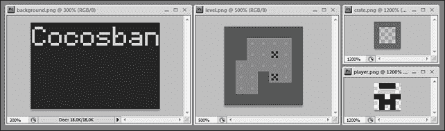
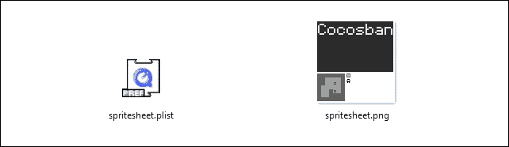
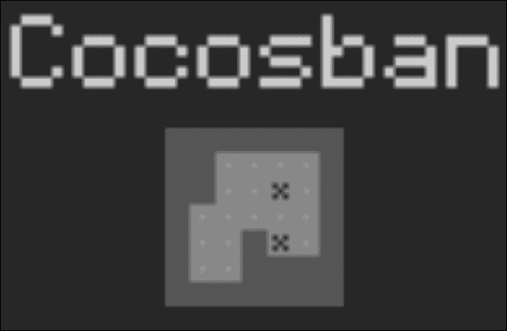
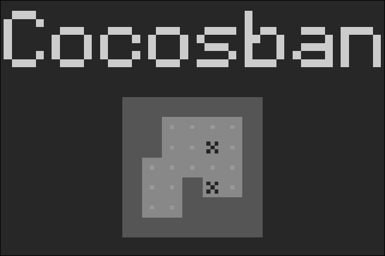
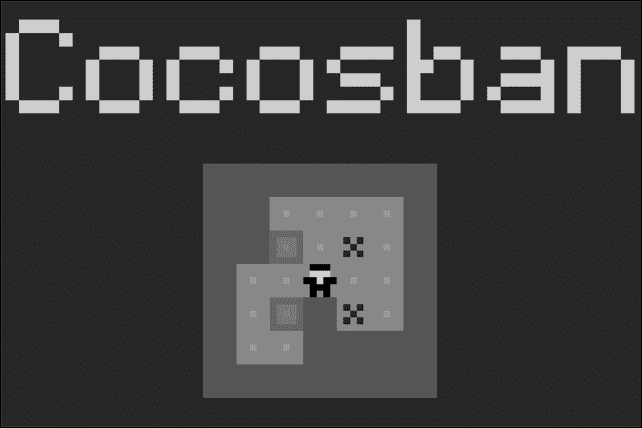
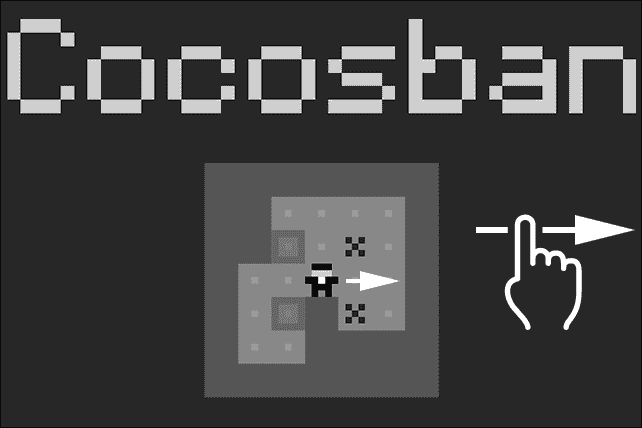

# 第四章. 通过 Sokoban 的制作了解滑动操作

你知道 Sokoban 游戏吗？这是一个有趣的益智游戏，玩家需要推动箱子到指定的位置。通常，在电脑上，这类游戏——称为基于图块的游戏——是通过箭头键控制的，但鉴于我们的游戏需要跨平台，我们将让玩家通过滑动来控制游戏中的移动。

我们将要构建的游戏与我制作的 iOS 游戏 BWBan 非常相似。它是免费的；你可以在[`bit.ly/1fUXP8c`](http://bit.ly/1fUXP8c)上玩。

在制作这个游戏的过程中，我们将称之为 Cocosban，你将学习以下主题：

+   如何检测滑动操作

+   如何通过精灵表加载图形资源

+   通过抗锯齿玩转 8 位像素游戏的创建方法

有很多事情要做，所以让我们从第一章中制作的好老蓝图开始，并在此基础上进行工作。

# 加载图形资源

不必说，你应该做的第一件事是将你的图形资源放在`assets`文件夹中，但这一步有一些新的内容。

在之前的示例中，我们总是为每个游戏角色在`assets`文件夹中填充一个`PNG`图像——太空船和小行星有自己的图像。这也适用于所有注意力集中瓷砖等等。

Cocos2d-JS 在处理多个图像时没有问题，但作为一条黄金法则，记住你处理的图像越少，你的游戏性能越好。

那么，技巧在哪里？为了有一个太空船和小行星，你可能认为你需要加载一个太空船图像和一个小行星图像，但还有另一种更好的方法来做这件事，那就是使用**精灵表**。

精灵表是由将各种小图像组合成单个图像而制成的图像。如果你从事网页设计，它们被称为**CSS 精灵**，如果你已经制作了一些原生 iOS 应用程序，它们被称为纹理图集。

这是否意味着你必须手动创建一个大型图像，并将所有图形资源都放在里面？嗯，虽然你可以手动完成，但有几个软件解决方案可以加快这个过程。我使用并推荐给你的是 TexturePacker，你可以在[www.codeandweb.com/texturepacker](http://www.codeandweb.com/texturepacker)找到它。它使用直观的拖放界面，并支持 Cocos2d 导出。

这些是为游戏创建的四个图像，直接来自我的 Photoshop：



我想让你注意图像的缩放因子——实际上，它们真的很小。由于我们正在制作像素游戏，我制作的图像都非常小，从标题图像的 96 x 64 像素到箱子玩家的 5 x 5 像素。

一旦由 TexturePacker 处理并导出到 Cocos2d，你的资源文件夹应该包含以下两个文件：



你应该很容易识别所有之前绘制并打包到 `spritesheet.png` 中的图形资源，你可能会想知道为什么我们需要 `spritesheet.plist` 文件。

打开它，你基本上会找到一个包含所有图像信息的 XML 文件，从它们的原始文件名到它们在 `spritesheet.plist` 中的当前大小和坐标：

```js
<?xml version="1.0" encoding="UTF-8"?>
<!DOCTYPEplist PUBLIC "-//Apple Computer//DTD PLIST 1.0//EN" "http://www.apple.com/DTDs/PropertyList-1.0.dtd">
<plist version="1.0">
    <dict>
        <key>frames</key>
        <dict>
            <key>background.png</key>
            <dict>
                <key>frame</key>
                <string>{{2,2},{96,64}}</string>
                <key>offset</key>
                <string>{0,0}</string>
                <key>rotated</key>
                <false/>
                <key>sourceColorRect</key>
                <string>{{0,0},{96,64}}</string>
                <key>sourceSize</key>
                <string>{96,64}</string>
            </dict>
            <key>crate.png</key>
            <dict>
                <key>frame</key>
                <string>{{39,68},{5,5}}</string>
                <key>offset</key>
                <string>{0,0}</string>
                <key>rotated</key>
                <false/>
                <key>sourceColorRect</key>
                <string>{{0,0},{5,5}}</string>
                <key>sourceSize</key>
                <string>{5,5}</string>
            </dict>
        </dict>
    </plist>
```

在各种 Cocos2d-JS 指南和参考资料中，这被称为精灵表。实际上，它更像是一个纹理图集；多亏了 XML 文件，它解释并描述了图集中包含的每个图像。

因此，现在是时候使用 `loadassets.js` 加载这两个文件了：

```js
var gameResources = [
  "assets/spritesheet.plist",
  "assets/spritesheet.png"
];
```

同时，`main.js` 将在横屏模式下将我们的分辨率策略设置为 480 x 320 像素：

```js
cc.game.onStart = function(){
  cc.view.setDesignResolutionSize(480, 320, cc.ResolutionPolicy.SHOW_ALL);
  cc.LoaderScene.preload(gameResources, function () {
    cc.director.runScene(new gameScene());
  }, this);
};
cc.game.run();

varmyGame = new cocos2dGame(gameScene);
```

现在，是时候创建游戏本身了。

# 构建关卡

通常，基于瓦片的关卡存储在二维数组中，Cocosban 也遵循这一趋势。因此，我们在 `gamescript.js` 中声明的第一个全局变量，它是一个包含关卡数据的数组，如下所示：

```js
var level = [
  [1,1,1,1,1,1,1],
  [1,1,0,0,0,0,1],
  [1,1,3,0,2,0,1],
  [1,0,0,4,0,0,1],
  [1,0,3,1,2,0,1],
  [1,0,0,1,1,1,1],
  [1,1,1,1,1,1,1]
];
```

每个项目代表一个瓦片，每个值代表一个项目，我这样编码：

+   `0`：这个项目是一个空瓦片

+   `1`：这个项目是墙壁

+   `2`：这个项目是放置箱子的地方

+   `3`：这个项目是箱子

+   `4`：这个项目是玩家

+   `5`：这个项目是在放置箱子的地方（3+2）

+   `6`：这个项目是在放置箱子的地方的玩家（4+2）

我们的 `gameScene` 声明始终相同：

```js
var gameScene = cc.Scene.extend({
  onEnter:function () {
  this._super();
    gameLayer = new game();
    gameLayer.init();
    this.addChild(gameLayer);
  }
});
```

最后，我们准备扩展 `game` 类。

在我们开始之前，我想简要讨论一下移动端基于瓦片的游戏。

如果你查看 `level` 数组，你会看到它是一个 *7x7=49* 项目的数组。这意味着我们将放置 *49 个瓦片 = 49 个精灵* 在屏幕上。

没关系，但在屏幕上放置东西会消耗性能。由于我们不知道我们的游戏将在哪些设备上运行，屏幕上潜在的移动元素越少，性能就越好。

由于我们游戏中唯一移动的元素是箱子和小英雄，而所有墙壁和地板瓦片始终保持在它们的位置，我简单地手绘了关卡，只添加了可移动的角色作为瓦片。

在设计跨平台应用时，你应该做同样的事情，除非你使用的是随机或程序生成的内容。

话虽如此，这是 `game` 类的声明方式：

```js
var game  = cc.Layer.extend({
  init:function () {
    this._super();
    cache = cc.spriteFrameCache;
    cache.addSpriteFrames("assets/spritesheet.plist", "assets/spritesheet.png");
    var backgroundSprite = cc.Sprite.create(cache.getSpriteFrame("background.png"));
    backgroundSprite.setPosition(240,160);
    backgroundSprite.setScale(5);
    this.addChild(backgroundSprite);
    var levelSprite =  cc.Sprite.create(cache.getSpriteFrame("level.png"));
    levelSprite.setPosition(240,110);
    levelSprite.setScale(5);
    this.addChild(levelSprite);
  }
```

如你所见，大部分代码已经在之前的章节中解释过了。我们使游戏能够触摸驱动，并在舞台上添加了一些精灵。只需看看我是如何加载精灵表的：

```js
cache = cc.spriteFrameCache;
cache.addSpriteFrames("assets/spritesheet.plist", "assets/spritesheet.png");
```

你可以这样从精灵表中选择单个图像：

```js
var backgroundSprite = cc.Sprite.create(cache.getSpriteFrame("background.png"));
```

最后，由于我们的精灵非常非常小，它们需要放大。`setScale` 方法允许我们放大精灵：

```js
backgroundSprite.setScale(5);
```

现在，我们准备启动游戏并看到我们的精灵被放大了 5 倍：



前面的图像不是一个模糊的低分辨率图像。它就是你将在屏幕上看到的实际游戏，因为 Cocos2d-JS 应用了抗锯齿效果，在这种情况下，浪费了我们想要给游戏的 8 位外观。抗锯齿在你想获得平滑图像时非常有用，但如果你的计划是创建像素游戏，它会使你的游戏看起来真的很糟糕。

你可以用 `setAliasTexParameters` 方法通过添加这一行来防止将抗锯齿应用于纹理：

```js
var game  = cc.Layer.extend({
  init:function () {
    this._super();
    cache = cc.spriteFrameCache;
    cache.addSpriteFrames("assets/spritesheet.plist", "assets/spritesheet.png");
    var backgroundSprite = cc.Sprite.create(cache.getSpriteFrame("background.png"));
    backgroundSprite.getTexture().setAliasTexParameters();
    backgroundSprite.setPosition(240,160);
    backgroundSprite.setScale(5);
    this.addChild(backgroundSprite);
    var levelSprite =  cc.Sprite.create(cache.getSpriteFrame("level.png"));
    levelSprite.setPosition(240,110);
    levelSprite.setScale(5);
    this.addChild(levelSprite);
  }
});
```

再次运行游戏，你将看到你的像素完美游戏：



此外，我还想让你注意，`setAliasTexParameters` 方法只调用一次，并且作用于所有精灵——并且将作用于在这个游戏中创建的每个其他精灵——因为它应用于整个精灵图集。

在这个时候，我们可以创建玩家和箱子。它们只是根据 `level` 数组中的位置和关卡图像在舞台中的位置手动定位的精灵。

构建关卡的其他脚本与 Cocos2d-JS 无关，因为它完全是 JavaScript，所以我将稍微加快一点。首先，我需要三个更多的全局变量：

```js
var cratesArray = [];
var playerPosition;
var playerSprite;
```

这就是它们所代表的：

+   `cratesArray`：这是一个将包含所有箱体精灵的数组

+   `playerPosition`：这是一个将用于在迷宫中存储玩家位置的变量

+   `playerSprite`：这个变量代表玩家本身

然后，在添加了 `level` 精灵的行之后，我们可以放置玩家和箱子：

```js
var game  = cc.Layer.extend({
  init:function () {
    this._super();
    // same as before
    this.addChild(levelSprite);
    for(i=0;i<7;i++){
      cratesArray[i]=[];
      for(j=0;j<7;j++){
        switch(level[i][j]){
          case 4:
          case 6:
          playerSprite = cc.Sprite.create(cache.getSpriteFrame("player.png"));
          playerSprite.setPosition(165+25*j,185-25*i);
          playerSprite.setScale(5);
          this.addChild(playerSprite);
          playerPosition = {x:j,y:i};
          cratesArray[i][j]=null;
          break;
          case 3:
          case 5:
          var crateSprite = cc.Sprite.create(cache.getSpriteFrame("crate.png"));
          crateSprite.setPosition(165+25*j,185-25*i);
          crateSprite.setScale(5);
          this.addChild(crateSprite);
          cratesArray[i][j]=crateSprite;
          break;
          default:
          cratesArray[i][j]=null;
        }
      }
    }
  }
});
```

你看到了吗？通过纯 JavaScript，我们只是在 `level` 数组项为 3 或 5 时添加了箱子精灵，在 `level` 数组项为 4 或 6 时添加了玩家精灵。

那些奇怪的数学运算只是用来根据它们的位置将瓦片放置在正确的位置。

以下截图是当你运行脚本时应看到的结果：



就这样！你的像素关卡已经准备好可以玩了。让我们检测玩家的移动。

# 检测滑动

如果我们分析一个滑动，我们可以将其分解为三个部分：

1.  玩家在舞台的某个点上触摸。

1.  玩家正在某个方向上拖动他们的手指。

1.  玩家正在释放手指。

通过比较拖动开始和结束的点坐标，我们可以确定滑动的方向，并相应地移动玩家。

我们需要添加三个新的全局变量：

```js
var startTouch;
var endTouch;
var swipeTolerance = 10;
```

它们的名字相当自解释：`startTouch` 和 `endTouch` 将存储滑动操作的起始点和结束点，而 `swipeTolerance` 是 `startTouch` 和 `endTouch` 之间允许的最小像素距离，以便将整个操作视为滑动。

现在，我们将让 `game` 检测触摸开始或结束：

```js
var game  = cc.Layer.extend({
  init:function () {
    // same as before
    cc.eventManager.addListener(listener, this);
     }
});
```

如同往常，我们添加了一个附加到名为 `listener` 的变量的监听器，我们将这样定义它：

```js
var listener = cc.EventListener.create({
  event: cc.EventListener.TOUCH_ONE_BY_ONE,
  swallowTouches: true,
  onTouchBegan:function (touch,event) {
    startTouch = touch.getLocation();
    return true;
  },
  onTouchEnded:function(touch, event){
    endTouch = touch.getLocation();
    swipeDirection();
  }
});
```

`onTouchBegan`函数将注册初始触摸并更新`startTouch`内容；多亏了`getLocation`方法。注意，该函数返回`true`。你确保这个函数返回`true`非常重要，否则`onTouchEnded`不会被触发。

对于`onTouchEnded`也是如此，它将更新`endTouch`。然后，调用`swipeDirection`函数。它将允许我们移动玩家：

```js
function swipeDirection(){
  var distX = startTouch.x - endTouch.x;
  var distY = startTouch.y - endTouch.y;
  if(Math.abs(distX)+Math.abs(distY)>swipeTolerance){
    if(Math.abs(distX)>Math.abs(distY)){
      if(distX>0){
        playerSprite.setPosition(playerSprite.getPosition().x-25,playerSprite.getPosition().y);
        //move(-1,0);
      }
      else{
        playerSprite.setPosition(playerSprite.getPosition().x+25,playerSprite.getPosition().y);
        //move(1,0);
      }
    }
    else{
      if(distY>0){
        playerSprite.setPosition(playerSprite.getPosition().x,playerSprite.getPosition().y-25);
        //move(0,1);
      }
      else{
        playerSprite.setPosition(playerSprite.getPosition().x,playerSprite.getPosition().y+25);
        //move(0,-1);
      }
    }
  }
}
```

运行游戏，以下是你将看到的截图：



一旦你向一个方向滑动，玩家就会相应地移动。

让我们看看`swipeDirection`函数中会发生什么：

```js
var distX = startTouch.x - endTouch.x;
var distY = startTouch.y - endTouch.y;
```

从开始触摸到结束触摸的水平距离和垂直距离被计算：

```js
if(Math.abs(distX)+Math.abs(distY)>swipeTolerance){
```

只有当水平和垂直距离之和大于允许的最小像素容差，才能说移动实际上是一个滑动时，整个函数才会执行：

```js
if(Math.abs(distX)>Math.abs(distY)){
```

下一步是确定玩家是水平还是垂直滑动。没有检查滑动是否严格水平或垂直；因此，对角线滑动将被视为水平或垂直，根据它们最大的分量：

```js
if(distX>0){
```

一旦我们知道移动是水平还是垂直，就到了检查方向的时候：左或右？上或下？代码的其余部分只是检查这些问题，并相应地移动玩家 25 像素。不幸的是，你将能够穿过箱子和墙壁。是时候编写游戏规则了。

# 完成游戏

我即将编写的代码与 Cocos2d-JS 无关，因为它只是纯 JavaScript，解释它将超出本书的范围。我只是检查合法移动，并相应地移动玩家和箱子。

所有一切都由`move`函数管理，该函数将检查合法移动并更新箱子和玩家的位置。`move`函数有两个参数，`deltaX`和`deltaY`，它们代表玩家试图水平或垂直移动的瓷砖数量。

这意味着`move(0,1)`将尝试将玩家向上移动（水平方向 0 个瓷砖，垂直方向 1 个瓷砖），`move(-1,0)`将尝试将玩家向左移动，以此类推。

`swipeDirection`函数改变了这一点：

```js
function swipeDirection(){
  var distX = startTouch.x - endTouch.x;
  var distY = startTouch.y - endTouch.y;
  if(Math.abs(distX)+Math.abs(distY)>swipeTolerance){
    if(Math.abs(distX)>Math.abs(distY)){
      if(distX>0){
        move(-1,0);
      }
      else{
        move(1,0);
      }
    }
    else{
      if(distY>0){
        move(0,1);
      }
      else{
        move(0,-1);
      }
    }
  }
}
```

每次调用`move`函数时，都会检测到一个有效的滑动。

这是`move`函数：

```js
function move(deltaX,deltaY){
  switch(level[playerPosition.y+deltaY][playerPosition.x+deltaX]){
    case 0:
    case 2:
    level[playerPosition.y][playerPosition.x]-=4;
    playerPosition.x+=deltaX;
    playerPosition.y+=deltaY;
    level[playerPosition.y][playerPosition.x]+=4;
    playerSprite.setPosition(165+25*playerPosition.x,185-25*playerPosition.y);
    break;
    case 3:
    case 5:
    if(level[playerPosition.y+deltaY*2][playerPosition.x+deltaX*2]==0 || level[playerPosition.y+deltaY*2][playerPosition.x+deltaX*2]==2){
      level[playerPosition.y][playerPosition.x]-=4;
      playerPosition.x+=deltaX;
      playerPosition.y+=deltaY;
      level[playerPosition.y][playerPosition.x]+=1;
      playerSprite.setPosition(165+25*playerPosition.x,185-25*playerPosition.y);
      level[playerPosition.y+deltaY][playerPosition.x+deltaX]+=3;
      var movingCrate = cratesArray[playerPosition.y][playerPosition.x];
      movingCrate.setPosition(movingCrate.getPosition().x+25*deltaX,movingCrate.getPosition().y-25*deltaY);
      cratesArray[playerPosition.y+deltaY][playerPosition.x+deltaX]=movingCrate;
      cratesArray[playerPosition.y][playerPosition.x]=null;
    }
    break;
  }
}
```

享受你的游戏。

# 概述

在本章中，你学习了如何使用精灵表来管理你的资产，创建像素完美的游戏，并检测滑动。你还创建了一个名为 Cocosban 的精彩益智游戏。

如果你注意到了，玩家和箱子的移动是通过让资产跳转到目的地来实现的。你为什么不添加一个缓动效果来创建平滑的移动呢？这将是你的一大成就。

此外，没有检查玩家是否完成了关卡。完成关卡没有箱子在箱子目标之外。试着开发它。

然后，跟随我通过一条充满音乐的小径；我们将为我们的游戏添加音效！
