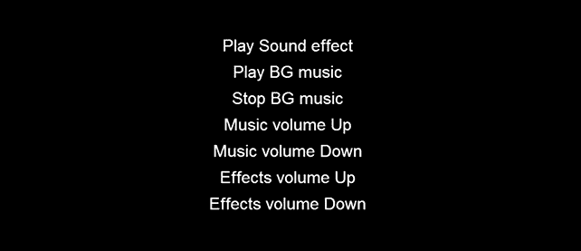

# 第五章。成为音乐大师

尽管你可能认为你在阅读这本书时创建的游戏是完整的，但由于一个简单的原因，它们缺少某种氛围：它们是哑的。

没有声音，没有背景音乐，什么都没有。一个完整、完全抛光的游戏必须有背景音乐和音效，这就是你将在本章中学到的。

跟随我，你将能够：

+   为你的游戏添加音效

+   为你的游戏添加背景音乐

+   循环声音

+   开始和停止声音

+   改变音乐和音效的音量

此外，由于你学得越多越好，你还将看到如何创建选项菜单。

现在，上网选择一些优秀的音乐和音效。

# 选择声音

让我们猜测发生了什么。你找到了那首令人难以置信的歌曲，它是电子音乐和重金属音乐的混合，你认为它非常适合你的太空射击游戏。你下载了它，并享受了 4 分 56 秒的蓝光质量声音。

此外，在几分钟内，你至少找到了三首也适合你游戏的歌。让我们把它们都添加进去，就像在 GTA 系列游戏中做游戏内广播一样。

等等！玩家正在浏览器中运行你的游戏，可能是在任何免费 Wi-Fi 区域之外，下载速度也不是很高。除非你的名字是 Lady Gaga，而且那首歌是你的最新热门单曲，否则你不可能让他们等待半小时来下载一首歌。

人们想要按下*播放*按钮并玩你的游戏；记住，你是在制作游戏，而不是几秒钟内的声音，所以请明智地选择你的声音，它们不能比游戏本身更大。

在音质和大小之间找到良好的平衡，直到你找到一个好的妥协点，并且在选择背景音乐时，一个短循环比一个长调要好得多。

此外，记住不同的浏览器在不同的操作系统上读取不同的声音类型，所以你应该提供三种不同格式的相同声音：`MP3`、`WAV`和`OGG`。

### 注意

关于声音优化和转换的讨论超出了本书的范围，但我建议你使用我用来编辑游戏中声音的免费软件**Audacity**，可在[`audacity.sourceforge.net/`](http://audacity.sourceforge.net/)找到。

# 预加载声音

预加载声音与预加载图形资源完全相同。在`assets`文件夹中，有两个 mp3 文件：`loop.mp3`，这是一个用作背景音乐的短循环，而`bang.mp3`则是一个 Uzi 音效。记住，在你的最终项目中，你将不得不包括`WAV`和`OGG`文件，以确保在不同设备和不同浏览器之间实现最大的兼容性。

`loadassets.js`文件将包含预加载声音的数组：

```js
var gameResources = [
  "assets/bang.mp3",
  "assets/loop.mp3"
];

```

现在，让我们创建一个可以播放声音和音乐的菜单。

# 创建声音菜单

创建菜单有几种方法，其中最有趣的是创建每个菜单项的图形资源，然后添加触摸或鼠标监听器，并以您应该已经知道的方式处理整个事情。

这次，您将看到一些新内容：Cocos2d-JS 内置的 `Menu` 类。

这是 `gameScript.js` 的内容：

```js
var gameScene = cc.Scene.extend({
  onEnter:function () {
    this._super();
    gameLayer = new game();
    gameLayer.init();
    this.addChild(gameLayer);
  }
});

var game = cc.Layer.extend({
  init:function () {
    this._super();
    this.audioEngine = cc.audioEngine;
    var playSoundMenu = new cc.MenuItemFont.create("Play Sound effect",this.playSound,this);
    playSoundMenu.setPosition(new cc.Point(0,350));
    var playBGMusicMenu = new cc.MenuItemFont.create("Play BG music",this.playBGMusic,this);
    playBGMusicMenu.setPosition(new cc.Point(0,300));
    var stopBGMusicMenu = new cc.MenuItemFont.create("Stop BG music",this.stopBGMusic,this);
    stopBGMusicMenu.setPosition(new cc.Point(0,250));
    var musicUpMenu = new cc.MenuItemFont.create("Music volume Up",this.musicUp,this);
    musicUpMenu.setPosition(new cc.Point(0,200));
    var musicDownMenu = new cc.MenuItemFont.create("Music volume Down",this.musicDown,this);
    musicDownMenu.setPosition(new cc.Point(0,150));
    var effectsUpMenu = new cc.MenuItemFont.create("Effects volume Up",this.effectsUp,this);
    effectsUpMenu.setPosition(new cc.Point(0,100));
    var effectsDownMenu = new cc.MenuItemFont.create("Effects volume Down",this.effectsDown,this);
    effectsDownMenu.setPosition(new cc.Point(0,50));
    var menu = cc.Menu.create(playSoundMenu,playBGMusicMenu,stopBGMusicMenu,musicUpMenu,musicDownMenu,effectsUpMenu,effectsDownMenu);
    menu.setPosition(new cc.Point(160,40));
    this.addChild(menu);
  }
});
```

这确实有很多内容，但学习起来并不复杂：`gameScene` 变量声明与之前的项目相同，而游戏声明与以下代码行不同：

```js
this.audioEngine = cc.audioEngine;
```

这将允许您初始化音频引擎，您会发现很多：确切地说，有七个菜单项声明，就像这样：

```js
var playSoundMenu = new cc.MenuItemFont.create("Play Sound effect",this.playSound,this);
playSoundMenu.setPosition(new cc.Point(0,350));
```

`cc.MenuItemFont.create` 函数在点击时创建一个具有缩放效果的文本菜单项。

这三个参数分别代表要显示的文本、要运行的回调函数以及运行回调的目标。

所有的七个菜单项都是用相同的方式创建的，并且使用您已经知道的 `setPosition` 方法进行定位。

一旦所有这些项都被创建，您就可以使用以下代码片段将它们转换成一个实际的菜单：

```js
var menu = cc.Menu.create(playSoundMenu,playBGMusicMenu,stopBGMusicMenu,musicUpMenu,musicDownMenu,effectsUpMenu,effectsDownMenu);
menu.setPosition(new cc.Point(160,40));
this.addChild(menu);
```

`Menu.create` 函数包含了您刚刚创建的所有菜单项，并且像往常一样使用 `addChild` 和 `setPosition` 方法添加和定位到舞台。

运行项目，您将看到以下截图所示的内容：



点击或触摸菜单项以查看缩放效果，尽管目前没有任何操作发生，因为回调函数仍然需要被创建。

# 管理音乐和音效

是时候创建所有回调函数了，让我们扩展 `game` 类声明的内容：

```js
var game = cc.Layer.extend({
  init:function () {
    // same as before
  },
  playSound:function(){
    this.audioEngine.playEffect("assets/bang.mp3");
  },
  playBGMusic:function(){
    if(!this.audioEngine.isMusicPlaying()){
      this.audioEngine.playMusic("assets/loop.mp3",true);
    }
  },
  stopBGMusic:function(){
    if(this.audioEngine.isMusicPlaying()){
      this.audioEngine.stopMusic();
    }
  },
  musicUp:function(){
    this.audioEngine.setMusicVolume(this.audioEngine.getMusicVolume()+0.1);
  },
  musicDown:function(){
    this.audioEngine.setMusicVolume(this.audioEngine.getMusicVolume()-0.1);
  },
  effectsUp:function(){
    this.audioEngine.setEffectsVolume(this.audioEngine.getEffectsVolume()+0.1);
  },
  effectsDown:function(){
    this.audioEngine.setEffectsVolume(this.audioEngine.getEffectsVolume()-0.1);
  }
});
```

现在，如果您测试项目，您将能够播放和停止声音，以及调整音乐和音效的音量。

让我们逐一查看所有函数：

```js
playSound:function(){
  this.audioEngine.playEffect("assets/bang.mp3");
}
playEffect method simply plays a sound effect.
playBGMusic:function(){
  if(!this.audioEngine.isMusicPlaying()){
    this.audioEngine.playMusic("assets/loop.mp3",true);
  }
}
```

当音乐没有播放时，使用 `playMusic` 方法播放音乐。第二个参数表示循环播放。您可以通过 `isMusicPlaying` 方法查看音乐是否正在播放：

```js
stopBGMusic:function(){
  if(this.audioEngine.isMusicPlaying()){
    this.audioEngine.stopMusic();
  }
}
```

应用之前使用过的相同概念，如果音乐已经在播放，您可以使用 `stopMusic` 方法停止它：

```js
musicUp:function(){
  this.audioEngine.setMusicVolume(this.audioEngine.getMusicVolume()+0.1);
}
```

`getMusicVolume` 和 `setMusicVolume` 方法分别使用从 0（无音量）到 1（全音量）的值获取和设置音乐音量：

```js
musicDown:function(){
this.audioEngine.setMusicVolume(this.audioEngine.getMusicVolume()-0.1);
}
```

以下概念应用于 `getEffectsVolume` 和 `setEffectsVolume`：

```js
effectsUp:function(){
  this.audioEngine.setEffectsVolume(this.audioEngine.getEffectsVolume()+0.1);
}
effectsDown:function(){
  this.audioEngine.setEffectsVolume(this.audioEngine.getEffectsVolume()-0.1);
}
```

此外，这也是您如何使用 Cocos2d-JS 管理声音的方法。

# 概述

感谢您在本章中学到的知识，您的游戏现在将包含背景音乐和音效。

为什么不将声音添加到您在前几章中创建的游戏中呢？那么，准备好吧，因为我们将要把交互性提升到一个全新的水平！
