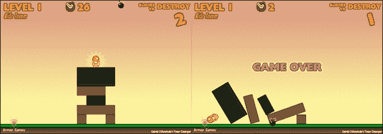
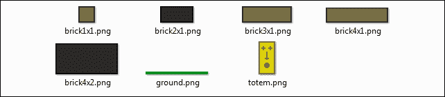
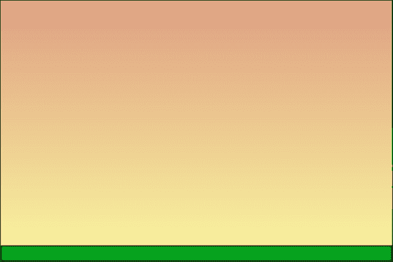
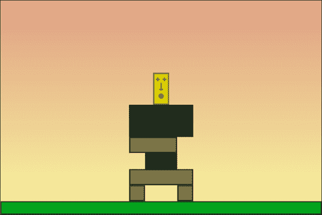
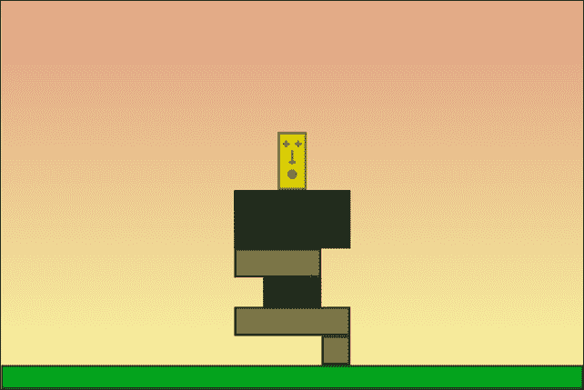
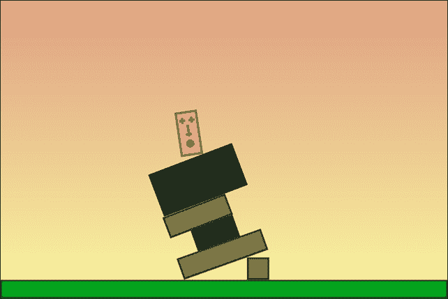
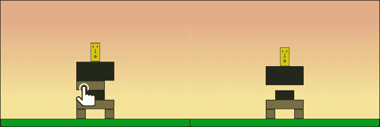

# 第七章。使用 Box2D 引擎为您的游戏添加物理

如果你问我休闲游戏最大的革命是什么，毫无疑问我会说是物理引擎。许多畅销的休闲游戏，如蜡笔物理、图腾破坏者、城堡粉碎、愤怒的小鸟、小翅膀，仅举几个例子，都使用了物理引擎来添加一种没有这些引擎就无法实现的现实行为。

在 2D 物理引擎中，Box2D 是最受欢迎的，最初是用 C++编写的，后来移植到了包括 JavaScript 在内的所有主要语言。

Cocos2d-JS 支持 Box2D，本章将涵盖创建物理游戏，包括以下概念：

+   配置和设置 Cocos2d-JS 以将 Box2D 引擎添加到您的游戏中

+   创建物理世界

+   为世界添加真实的重力

+   通过组合刚体、形状和固定装置来创建物理对象

+   创建材料

+   创建静态对象

+   创建动态对象

+   将精灵附加到物理对象上

+   使用鼠标/手指选择物理对象

+   销毁物理对象

+   检查物体之间的碰撞

+   运行物理模拟

这有很多东西，不是吗？

到了本章的结尾，您将拥有一个著名物理游戏的可玩关卡。

# 在开始之前

仅用几页来学习 Box2D 是不可能的。您需要一整本书来开始掌握它。

### 小贴士

要深入了解 Box2D，您可以在[`www.packtpub.com/game-development/box2d-flash-games`](https://www.packtpub.com/game-development/box2d-flash-games)找到我的书，《Box2D for Flash Games》。

总之，这一章将为您提供添加物理到游戏的骨架。尽管经验丰富的 Box2D 用户可能会发现碰撞检测等一些概念介绍得不够完美，但最终它还是可行的，这正是本章的真正目的：为您提供开始学习 Box2D 并将其包含到 Cocos2d-JS 项目中的知识。

# 将 Box2D 引擎添加到您的项目中

最好的游戏是 Totem Destroyer，您可以在这里找到它：[`armorgames.com/play/1871/totem-destroyer`](http://armorgames.com/play/1871/totem-destroyer)。

您必须通过点击/轻触砖块来摧毁它们，同时注意不要让图腾掉到地上，否则游戏结束。并非所有砖块都可以被摧毁。在下面的屏幕截图所示的关卡中，深色砖块无法被摧毁：



尽管游戏玩法相当简单，但它包含了一些高级物理概念，例如碰撞检测和如何选择物理体。

我们将构建这个关卡；因此，像往常一样，我们首先需要处理的是资源文件夹的内容：



这就是`loadassets.js`的内容：

```js
var gameResources = [
  "assets/brick1x1.png",
  "assets/brick2x1.png",
  "assets/brick3x1.png",
  "assets/brick4x1.png",
  "assets/brick4x2.png",
  "assets/ground.png",
  "assets/totem.png"
];
```

为了尽可能快地加载，我们在前几章中使用的基本 Cocos2d-JS 源代码没有包含任何物理引擎。

为了让 Cocos2d-JS 与 Box2D 一起工作，我们必须加载另一个名为`external`的模块，我们将在`project.json`文件中定义它。

```js
{
  "debugMode" : 0,
  "showFPS" : false,
  "frameRate" : 60,
  "id" : "gameCanvas",
  "renderMode" : 0,
  "engineDir":"cocos2d-html5/",

  "modules" : ["cocos2d","external"],

  "jsList" : [
    "src/loadassets.js",
    "src/gamescript.js"
    ]
}
```

现在，引擎知道我们将使用 Box2D；因此，我们可以专注于游戏本身。

# 配置物理世界

从现在开始，所有的脚本都将按照惯例写在`gamescript.js`中，所以请准备好编写你的第一个 Cocos2d-JS Box2D 脚本。

一些魔法从前两行开始，它们声明了全局变量：

```js
var world;
var worldScale = 30;
```

在这里，`world`变量将代表我们在其中设置游戏的物理世界，它将包括我们将会发现的自己的重力和其他属性。然而，首先我想说几句关于`worldScale`的话。

Box2D 是一个使用现实世界测量单位的真实物理引擎。这样，你将在 Box2D 世界中创建的一切都将用米来衡量。如果你创建一个边长为 2 米的盒子，这意味着它是两米。

另一方面，浏览器有自己的单位，即像素。你可以有一个 480 像素宽的游戏，但你永远不会找到一个两米宽的游戏。

因此，我们需要找到像素和米之间的比率。在几乎每一个项目中，*1 米=30 像素*的设置都很好，并允许我们在像素中思考和操作，而不必关心 Box2D 的内部单位。

`gameScene`类的声明没有改变：

```js
var gameScene = cc.Scene.extend({
  onEnter:function () {
    this._super();
    gameLayer = new game();
    gameLayer.init();
    this.addChild(gameLayer);
  }
});
```

如往常一样，有趣的部分可以在`game`声明中找到：

```js
var game = cc.Layer.extend({
  init:function () {
    this._super();
    var backgroundLayer = cc.LayerGradient.create(cc.color(0xdf,0x9f,0x83,255), cc.color(0xfa,0xf7,0x9f,255));
    this.addChild(backgroundLayer);
    var gravity = new Box2D.Common.Math.b2Vec2(0, -10)
    world = new Box2D.Dynamics.b2World(gravity, true);

    this.scheduleUpdate();
  },
  update:function(dt){
    world.Step(dt,10,10);
    console.log(world);
  }
});
```

一旦运行项目，在你的控制台中，你应该会看到几个**b2World**的实例。

这意味着我们的 Box2D 物理世界正在运行；让我们看看发生了什么。

首先，我们添加了一个渐变背景层：

```js
var backgroundLayer = cc.LayerGradient.create(cc.color(0xdf,0x9f,0x83,255), cc.color(0xfa,0xf7,0x9f,255));
this.addChild(backgroundLayer);
```

然后，我们已经知道物理世界有重力。以下是定义重力的方法：

```js
var gravity = new Box2D.Common.Math.b2Vec2(0, -10);
```

总而言之，现实世界中的重力可以用一个向量来表示，地球的重力可以用一个向量(0,9.81)来表示，其中 9.81 用米每秒平方表示，这是在地球表面附近坠落物体的平均加速度。

在 Box2D 中，`b2Vec2`类型用于存储向量；虽然我们可以将 9.81 近似为 10，但重力向量的*y*值为什么是-10，这相当不清楚。负重力？

让我来解释一下：你已经知道 Cocos2d-JS 的坐标原点位于舞台的左下角；因此，只要你从底部向上移动，你的 y 坐标就会增加。另一方面，Box2D 以相反的方式工作：只要一个物理体向下坠落，它的*y*坐标就会增加，将重力设置为(0,10)会使 Cocos2d-JS 精灵飞走而不是坠落。

这就是为什么我们需要反转重力。在 Box2D 中，内部世界体将飞走，但我们将在舞台上看到相同的物体坠落。

现在，我们终于可以创建世界了：

```js
world = new Box2D.Dynamics.b2World(gravity, true);
```

如你所见，世界有两个参数：我们之前创建的`gravity`变量和一个布尔标志，用于确定身体是否可以休眠。通常，为了节省 CPU 时间，一段时间内没有受到打击且不受力的影响的物理身体会被休眠。这意味着它们仍然存在于 Box2D 世界中，尽管它们的每个帧的位置不会更新，直到由于某些事件（如碰撞或施加到它们上的力）而醒来。

剩下的行应该对你来说已经很清晰了。我们正在使游戏能够安排更新函数在每个帧执行：

```js
this.scheduleUpdate();
```

当我们调用`scheduleUpdate`时，我们还需要一个`update`函数，在这种情况下，它只包含：

```js
world.Step(dt,10,10)
```

`Step`方法将模拟推进一定的时间，`dt`在这种情况下，为了尽可能准确，而其他两个参数分别代表速度和位置迭代。

这两个参数是必需的，因为大多数 Box2D 代码都是用于一个称为约束求解器的操作，这是一个一次解决模拟中所有约束的算法。虽然单个约束可以很容易地解决，但当更多的约束介入时，解决其中一个意味着稍微干扰其他约束。这就是为什么我们需要更多的迭代才能有一个准确的模拟。官方 Box2D 文档建议将速度设置为 8，位置设置为 3，尽管我通常将两者都设置为 10，并且在制作简单游戏时没有遇到任何问题。

现在，是时候构建图腾了。

# 向世界添加身体

在 Box2D 世界中，一个物理对象被称为身体。因此，我们将看到如何向世界添加一个身体。此外，由于我们“图腾破坏者”游戏中的所有身体都是盒子，我们将定义一个函数来创建一个身体，并对其进行定制以适应我们的需求。

我们将从结尾开始，调用一个我们尚未编写的函数，只是为了看看我们需要创建任何用于“图腾破坏者”的身体的全部参数。

因此，游戏的`init`函数将被修改成这样：

```js
init:function () {
  this._super();
  var backgroundLayer = cc.LayerGradient.create(cc.color(0xdf,0x9f,0x83,255), cc.color(0xfa,0xf7,0x9f,255));
  this.addChild(backgroundLayer);
  var gravity = new Box2D.Common.Math.b2Vec2(0, -10)
  world = new Box2D.Dynamics.b2World(gravity, true);

  this.scheduleUpdate();
  this.addBody(240,10,480,20,false,"assets/ground.png","ground");
}
```

我们的定制函数被称为`addBody`，根据参数的数量将执行很多事情。让我们看看以下参数：

+   `240`：这是身体水平中心，以像素为单位。

+   `10`：这是身体垂直中心，以像素为单位。

+   `480`：这是身体的宽度，以像素为单位。

+   `20`：这是身体的高度，以像素为单位。

+   `false`：这个布尔值决定了身体是动态的还是静态的。我们正在构建两种类型的身体，动态身体，它们会受到重力等力的作用并响应碰撞，以及静态身体，它们不能被移动。这将是一个静态身体。

+   `"assets/ground.png"`：这些是要绑定到身体上的图形资源。

+   `"ground"`：这是身体类型。我们称之为`ground`，因为它将代表地面。

换句话说，我们在舞台底部创建了一个静态身体，它将代表地面。

现在，是时候看看如何使用 Cocos2d-JS 和 Box2D 创建和配置一个身体了。将`addBody`函数添加到`game`类中：

```js
addBody: function(posX,posY,width,height,isDynamic,spriteImage,type){
  var fixtureDef = new  Box2D.Dynamics.b2FixtureDef;
  fixtureDef.density = 1.0;
  fixtureDef.friction = 0.5;
  fixtureDef.restitution = 0.2;
  fixtureDef.shape = new Box2D.Collision.Shapes.b2PolygonShape;
  fixtureDef.shape.SetAsBox(0.5*width/worldScale,0.5*height/worldScale);
  var bodyDef = new Box2D.Dynamics.b2BodyDef;
  if(isDynamic){
    bodyDef.type = Box2D.Dynamics.b2Body.b2_dynamicBody;
  }
  else{
    bodyDef.type = Box2D.Dynamics.b2Body.b2_staticBody;
  }
  bodyDef.position.Set(posX/worldScale,posY/worldScale);
  var userSprite = cc.Sprite.create(spriteImage);
  this.addChild(userSprite, 0);
  userSprite.setPosition(posX,posY);
  bodyDef.userData = {
    type: type,
    asset: userSprite
  }
  var body = world.CreateBody(bodyDef)
  body.CreateFixture(fixtureDef);
}
```

这里有很多新内容，所以我们将逐行查看。首先，我们必须创建一个固定件：

```js
var fixtureDef = new  Box2D.Dynamics.b2FixtureDef;
```

将固定件视为一个关系，它是一个物理演员（body）与其形状之间的关系，该形状决定了物体的外观——如盒子、圆形等。

固定件还通过这三个属性决定了身体的材料：

```js
fixtureDef.density = 1.0;
fixtureDef.friction = 0.5;
fixtureDef.restitution = 0.2;
```

`density`属性影响身体的重量，`friction`决定了身体如何相互滑动，而`restitution`用于查看身体如何弹跳。

现在，是时候创建与固定件相连的形状了：

```js
fixtureDef.shape = new Box2D.Collision.Shapes.b2PolygonShape;
fixtureDef.shape.SetAsBox(0.5*width/worldScale,0.5*height/worldScale);
```

`SetAsBox`方法根据 Box2D 接受的宽度的一半和高度创建一个盒子。所以，如果你想有一个 30 米宽的盒子，你必须将其宽度设置为*30*0.5。如前所述，我们谈论的是像素，所以我们还必须将给定的宽度除以`worldScale`。

一旦我们有了形状和固定件，就是时候关注物理身体了：

```js
var bodyDef = new Box2D.Dynamics.b2BodyDef;
```

现在，我们可以确定身体是静态的还是动态的。在我们的游戏中，只有地板将是一个静态身体。相应的代码如下：

```js
if(isDynamic){
  bodyDef.type = Box2D.Dynamics.b2Body.b2_dynamicBody;
}
else{
  bodyDef.type = Box2D.Dynamics.b2Body.b2_staticBody;
}
```

`type`属性将决定身体是静态的还是动态的。现在，我们有了形状、身体和固定件；为什么我们不把这个身体放在世界的某个地方呢？请看下面的代码片段：

```js
bodyDef.position.Set(posX/worldScale,posY/worldScale);
```

这可以通过`position`属性来完成。别忘了像素到米的转换。

现在是 Box2D 最困难的部分。大多数试图学习 Box2D 的人在需要将图形资产附加到身体上时都会失败。主要原因在于，Box2D 不允许你将精灵附加到身体上。用 72 像素的字体打印出来。你必须手动将精灵放置在舞台上，并随着世界的更新手动移动它们。

让我们添加这个精灵：

```js
var userSprite = cc.Sprite.create(spriteImage);
this.addChild(userSprite, 0);
userSprite.setPosition(posX,posY);
```

这很简单，因为我们只是以与第一章开始以来相同的方式添加了一个精灵。无论如何，我们必须以某种方式告诉 Box2D 这个精灵属于我们刚刚创建的身体。

太棒了！有一个`userData`属性，我们可以用它来存储任何类型的自定义身体信息：

```js
bodyDef.userData = {
  type: type,
  asset: userSprite
}
```

在这种情况下，我定义了一个对象，其中包含要链接的精灵和我们要处理的身体类型——在这种情况下，它将是`ground`，根据传递给`addBody`函数的参数。

最后，我们准备将身体附加到世界中，也就是说，将我们的身体定义——`b2BodyDef`是一个身体定义——转换成物理身体：

```js
var body = world.CreateBody(bodyDef);
body.CreateFixture(fixtureDef);
```

`CreateBody`方法将从身体定义创建一个真实的物理身体，而`CreateFixture`方法将固定件及其形状附加到身体上。

最后，我们可以运行游戏，以下是你应该看到的图像：



最后，我们将有一个坚固的地板，而且还有一个函数将允许我们快速创建整个图腾。

让我们添加这些行：

```js
init:function () {
  this._super();
  var backgroundLayer = cc.LayerGradient.create(cc.color(0xdf,0x9f,0x83,255), cc.color(0xfa,0xf7,0x9f,255));
  this.addChild(backgroundLayer);
  var gravity = new Box2D.Common.Math.b2Vec2(0, -10)
  world = new Box2D.Dynamics.b2World(gravity, true);

  this.scheduleUpdate();
  this.addBody(240,10,480,20,false,"assets/ground.png","ground");
  this.addBody(204,32,24,24,true,"assets/brick1x1.png","destroyable");
  this.addBody(276,32,24,24,true,"assets/brick1x1.png",  "destroyable");
  this.addBody(240,56,96,24,true,"assets/brick4x1.png","destroyable");
  this.addBody(240,80,48,24,true,"assets/brick2x1.png","solid");
  this.addBody(228,104,72,24,true,"assets/brick3x1.png",  "destroyable");
  this.addBody(240,140,96,48,true,"assets/brick4x2.png","solid");
  this.addBody(240,188,24,48,true,"assets/totem.png","totem");
}
```

我们只需正确调用`addBody`函数，就可以用每个砖块定义的自己的图形资产、位置、大小和属性来构建我们的图腾。

现在启动游戏：



那就对了！我们的图腾现在站在地板上，准备被摧毁。

# 随着世界变化更新精灵位置

不幸的是，我们的图腾仍然只是一堆静态的精灵。是的，我们将其附加到了一个物体上，但世界发生变化时会发生什么呢？

尝试移除图腾的左脚，方法如下：

```js
init:function () {
  this._super();
  var backgroundLayer = cc.LayerGradient.create(cc.color(0xdf,0x9f,0x83,255), cc.color(0xfa,0xf7,0x9f,255));
  this.addChild(backgroundLayer);
  var gravity = new Box2D.Common.Math.b2Vec2(0, -10)
  world = new Box2D.Dynamics.b2World(gravity, true);

  this.scheduleUpdate();
  this.addBody(240,10,480,20,false,"assets/ground.png","ground");
  //this.addBody(204,32,24,24,true,"assets/brick1x1.png",  "destroyable");
  this.addBody(276,32,24,24,true,"assets/brick1x1.png","destroyable");
  this.addBody(240,56,96,24,true,"assets/brick4x1.png","destroyable");
  this.addBody(240,80,48,24,true,"assets/brick2x1.png","solid");
  this.addBody(228,104,72,24,true,"assets/brick3x1.png","destroyable");
  this.addBody(240,140,96,48,true,"assets/brick4x2.png","solid");
  this.addBody(240,188,24,48,true,"assets/totem.png","totem");
}
```

我只是注释了一行；让我们看看会发生什么：



这显然是错误的。图腾应该掉下来！

这是因为我们在创建物体时正确地放置了精灵，但自那时起，精灵的位置尚未更新。

结果是，无论物体发生什么变化，精灵都保持在相同的位置。还记得吗？*Box2D 不允许将精灵附加到物体上*。教训学到了。

我们必须在`update`函数中手动移动精灵：

```js
update:function(dt){
  world.Step(dt,10,10);
  for (var b = world.GetBodyList(); b; b = b.GetNext()) {
    if (b.GetUserData() != null) {
      var mySprite = b.GetUserData().asset;
      mySprite.setPosition(b.GetPosition().x * worldScale, b.GetPosition().y * worldScale);
      mySprite.setRotation(-1 * cc.radiansToDegrees (b.GetAngle()));
    }
  }
}
```

现在运行游戏：



最后，图腾掉下来了！让我们看看发生了什么：

```js
for (var b = world.GetBodyList(); b; b = b.GetNext()) {
```

这个循环遍历世界中放置的所有物体。

```js
if (b.GetUserData() != null) {
```

`b`现在是我们的当前物体，我们将查看是否将其用户数据中设置了某些内容：

```js
var mySprite = b.GetUserData().asset;
mySprite.setPosition(b.GetPosition().x * worldScale, b.GetPosition().y * worldScale);
mySprite.setRotation(-1 * cc.radiansToDegrees (b.GetAngle()));
```

一旦我们知道用户数据中有什么东西，就像这个例子一样，我们知道它是我们创建来构建图腾或地面的物体之一。你还记得我们在用户数据中创建了一个对象吗？`mySprite`变量将存储我们插入此对象中的精灵。

`GetPosition`方法返回物体的位置；因此，我们可以更新精灵的位置——记住从米到像素的转换——而`getAngle`返回物体的旋转。

这样我们就可以手动更新所有附加到 Box2D 世界物体的精灵。

# 选择和摧毁世界物体

正如名字“图腾破坏者”所暗示的，你应该能够摧毁图腾。首先，取消注释之前注释的行，以便恢复图腾的左脚，然后当玩家触摸/点击它们时，我们就可以准备摧毁砖块了。

一切从触摸开始，所以我们必须通过首先将监听器添加到游戏的`init`函数来管理它：

```js
init:function () {
  // same as before
  cc.eventManager.addListener(touchListener, this);
}
```

然后创建`listener`变量本身：

```js
var touchListener = cc.EventListener.create({
  event: cc.EventListener.TOUCH_ONE_BY_ONE,
  swallowTouches: true,
  onTouchBegan: function (touch, event) {
    var worldPoint = new Box2D.Common.Math.b2Vec2(touch.getLocation().x/worldScale,touch.getLocation().y/worldScale);
    for (var b = world.GetBodyList(); b; b = b.GetNext()) {
      if (b.GetUserData() != null && b.GetUserData().type=="destroyable") {
        for(var f = b.GetFixtureList();f; f=f.GetNext()){
          if(f.TestPoint(worldPoint)){
            gameLayer.removeChild(b.GetUserData().asset)
            world.DestroyBody(b);
          }
        }
      }
    }
  }
});
```

让我们看看我们添加了什么。首先，我们必须获取点击/触摸坐标并将它们转换为 Box2D 世界坐标；这意味着将像素转换为米，并将坐标放入一个`b2Vec2`变量中：

```js
var worldPoint = new Box2D.Common.Math.b2Vec2(touch.getLocation().x/worldScale,touch.getLocation().y/worldScale);
```

然后，我们将以更新精灵位置时相同的方式遍历所有物体：

```js
for (var b = world.GetBodyList(); b; b = b.GetNext()) {
```

并非所有物体都可以被摧毁：例如，地面和深色砖块不能被摧毁，所以我们必须确保我们只尝试摧毁我们用`destroyable`标记的用户数据中的砖块：

```js
if (b.GetUserData() != null && b.GetUserData().type=="destroyable") {
```

一旦我们知道一块砖可以被摧毁，我们就必须遍历它的所有固定件，看看其中是否有任何一个包含玩家点击/触摸的点。这就是我们将如何遍历一个物体的所有固定件：

```js
for (var f = b.GetFixtureList();f; f=f.GetNext()){
```

一旦 `f` 代表当前纹理，`TestPoint` 方法将返回 `true` 如果传递给它的点位于固定件内部：

```js
if(f.TestPoint(worldPoint)){
```

到这个时候，我们确信玩家触摸了 `b` 主体，我们可以在移除精灵后摧毁它。记住：*Box2D 不允许你将精灵附加到主体上*。这个代码片段如下所示：

```js
gameLayer.removeChild(b.GetUserData().asset);
world.DestroyBody(b);
```

`DestroyBody` 方法从世界中移除一个主体。

运行游戏并触摸一些主体，然后你将能够摧毁那些轻的主体。



现在游戏已经准备好被玩，我们只需要检查偶像是否触摸到地面。这是一个游戏结束事件，所以它非常重要。

# 检查主体之间的碰撞

为了完成原型，我们需要检查偶像是否触摸到地面。根据你到目前为止对 Box2D 的了解，最简单的方法是持续扫描偶像的碰撞，并检查它碰撞到的主体中是否有地面。

我们需要在 `update` 函数中添加一些行：

```js
update:function(dt){
  world.Step(dt,10,10);
  for (var b = world.GetBodyList(); b; b = b.GetNext()) {
    if (b.GetUserData() != null) {
      var mySprite = b.GetUserData().asset;
      mySprite.setPosition(b.GetPosition().x * worldScale, b.GetPosition().y * worldScale);
      mySprite.setRotation(-1 * cc.radiansToDegrees (b.GetAngle()));
      if(b.GetUserData().type=="totem"){
        for(var c = b.GetContactList(); c; c = c.m_next){
          if(c.other.GetUserData() && c.other.GetUserData().type=="ground"){
            console.log("Oh no!!!!");
          }
        }
      }
    }
  }
}
```

在我们遍历主体和固定件的方式中，我们可以使用以下代码行遍历接触：

```js
for(var c = b.GetContactList(); c; c = c.m_next){
```

对于每个 `c` 接触，我们通过 `other` 属性检查与之接触的主体；如果它的类型是 `ground`，我们在控制台输出一条消息。整个过程只有在当前主体是偶像时才会进行。

运行游戏并让偶像触摸地面。你将在控制台日志中看到几个 **Oh no!!!!** 的实例。最终，我们有一个工作的图腾摧毁者原型！！

# 摘要

构建一个图腾摧毁者关卡是一个巨大的成就，因为现在你能够构建一个像最受欢迎的浏览器游戏之一那样的跨平台游戏；所有这些都归功于 Box2D。

你为什么不通过设定一个目标——比如 *移除四个方块*——来改进它呢？当这个目标达成后，等待几秒钟看看偶像是否保持在原位而没有掉到地上，就像在原始游戏中那样？
