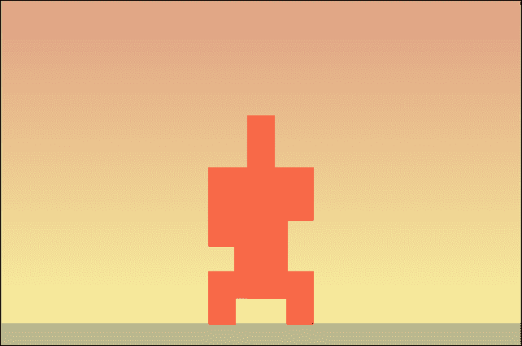
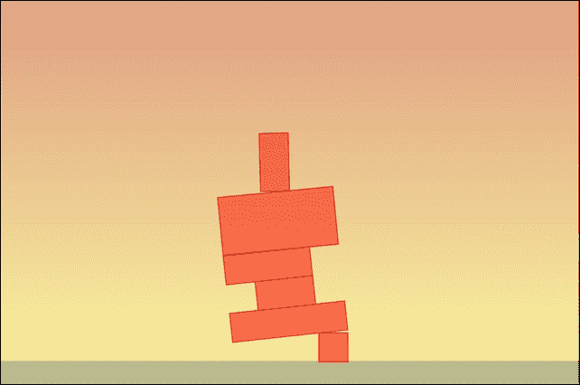
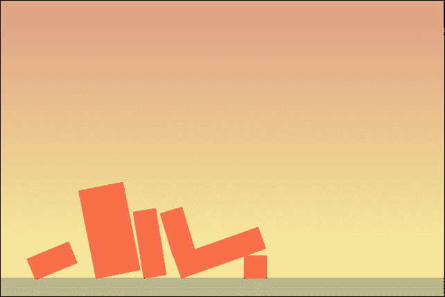
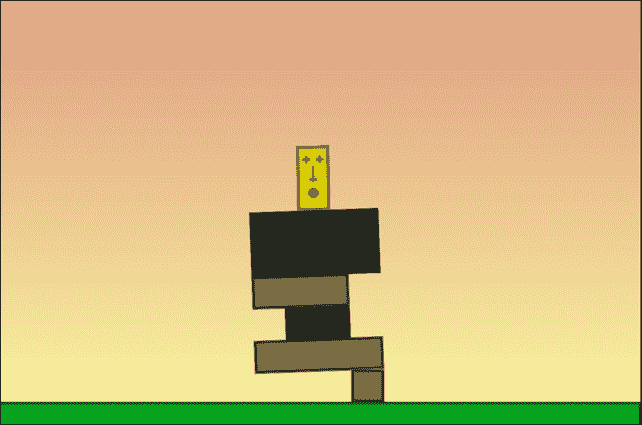

# 第八章。使用 Chipmunk2D 引擎给你的游戏添加物理

在上一章中，你看到了如何使用 Box2D 给你的游戏添加物理。然而，Box2D 并不是 Cocos2d-JS 支持的唯一物理引擎；你还可以使用 Chipmunk2D 引擎在你的游戏中添加物理特性。

所以主要问题是：你应该使用 Box2D 还是 Chipmunk2D 来给你的游戏添加物理？没有正确答案。只需使用你感觉最舒适的一个。

因此，在本章中，我将向你展示如何使用 Chipmunk2D 创建相同的 Totem Destroyer 游戏，突出两个物理引擎之间的相似之处和不同之处。

正如你在上一章中看到的，现在是时候学习了：

+   配置 Cocos2d-JS 以将 Chipmunk2D 引擎添加到你的游戏中

+   创建具有重力的物理空间

+   将刚体和形状组合以创建物理对象

+   创建材料

+   创建静态对象

+   创建动态对象

+   将精灵附加到物理对象上

+   使用鼠标或手指选择物理对象

+   销毁物理对象

+   检查物体之间的碰撞

+   运行物理模拟

+   使用调试绘图来测试你的项目

我假设你对上一章中讨论的基本 Box2D 概念相当熟悉，所以我在创建游戏时会快速进行。

# 将 Chipmunk2D 引擎添加到你的项目中

由于我们将创建与上一章相同的游戏，我建议你将你的项目复制到一个新文件夹中，因为我们将在上一章中已经编写的代码中重用大部分。所有图形资产都不会改变，所以只需不要触摸`assets`文件夹。对于`loadassets.js`、`main.js`和`project.json`文件也是如此。

所以基本上，我们唯一要更改的文件是`gamescript.js`。准备好深入 Chipmunk2D 的世界。

## 一个没有物理的物理游戏

既然我们已经构建了 Totem Destroyer 游戏原型，我们可以从中移除所有物理部分，只留下骨架，在那里我们将构建新的物理引擎。

`gamescript.js`去物理版本如下：

```js
var gameScene = cc.Scene.extend({
  onEnter:function () {
    this._super();
    gameLayer = new game();
    gameLayer.init();
    this.addChild(gameLayer);
  }
});

var game = cc.Layer.extend({
  init:function () {
    this._super();
    var backgroundLayer = cc.LayerGradient.create(cc.color(0xdf,0x9f,0x83,255), cc.color(0xfa,0xf7,0x9f,255));
    this.addChild(backgroundLayer);
    // create physics world somehow
    this.addBody(240,10,480,20,false,"assets/ground.png","ground");
    this.addBody(204,32,24,24,true,"assets/brick1x1.png","destroyable");
    this.addBody(276,32,24,24,true,"assets/brick1x1.png","destroyable");
    this.addBody(240,56,96,24,true,"assets/brick4x1.png","destroyable");
    this.addBody(240,80,48,24,true,"assets/brick2x1.png","solid");
    this.addBody(228,104,72,24,true,"assets/brick3x1.png","destroyable");
    this.addBody(240,140,96,48,true,"assets/brick4x2.png","solid");
    this.addBody(240,188,24,48,true,"assets/totem.png","totem");
    this.scheduleUpdate();
    cc.eventManager.addListener(touchListener, this);
  },
  addBody: function(posX,posY,width,height,isDynamic,spriteImage,type){
    // create the physics body somehow
  },
  update:function(dt){
    // update the world somehow
  }
});

var touchListener = cc.EventListener.create({
  event: cc.EventListener.TOUCH_ONE_BY_ONE,
  onTouchBegan: function (touch, event) {
    // destroy a physics body somehow
  }
})
```

现在，一切准备就绪，可以将 Chimpunk2D 物理引擎注入到游戏中。让我们从头开始，创建物理世界。

# 配置物理空间

看看标题。它说**配置物理空间**。我使用*space*而不是*world*，因为 Chipmunk2D 称*space*为 Box2D 所称的*world*。

世界和空间代表同一件事：物理驱动事件发生的地方。

虽然 Chipmunk2D 称之为*space*，但我们将继续使用名为*world*的变量，以尽可能多地与 Box2D 代码保持相似。这是你看到两个引擎相似之处和不同之处的最佳方式。

按照以下方式更改游戏声明中的`init`函数：

```js
init:function () {
  this._super();
  var backgroundLayer = cc.LayerGradient.create(cc.color(0xdf,0x9f,0x83,255), cc.color(0xfa,0xf7,0x9f,255));
  this.addChild(backgroundLayer);
  world = new cp.Space();
  world.gravity = cp.v(0, -100);
  this.addBody(240,10,480,20,false,"assets/ground.png","ground");
  this.addBody(204,32,24,24,true,"assets/brick1x1.png","destroyable");
  this.addBody(276,32,24,24,true,"assets/brick1x1.png","destroyable");
  this.addBody(240,56,96,24,true,"assets/brick4x1.png","destroyable");
  this.addBody(240,80,48,24,true,"assets/brick2x1.png","solid");
  this.addBody(228,104,72,24,true,"assets/brick3x1.png","destroyable");
  this.addBody(240,140,96,48,true,"assets/brick4x2.png","solid");
  this.addBody(240,188,24,48,true,"assets/totem.png","totem");
  this.scheduleUpdate();
  cc.eventManager.addListener(touchListener, this);
}
```

此外，在脚本的最开始创建`world`全局变量：

```js
var world;
```

让我们看看当执行以下行时会发生什么：

```js
world = new cp.Space();
```

`cp.Space` 方法创建 Chipmunk2D 空间；到现在你应该知道这与 Box2D 世界相同：

```js
world.gravity = cp.v(0, -100);
```

`gravity` 属性使用向量设置 `world gravity`。`cp.v` 是 Chipmunk2D 表示向量的方式，与 Box2D 使用 `b2Vec2` 的方式相同。它有一个水平和垂直分量，要模拟地球重力，可以使用 `(0,-100)`。

与 Box2D 不同，Chipmunk2D 不使用现实世界的测量单位，所以请期待使用像素而不是米。

# 向空间添加物体

我们已经有了带有所有必需参数的 `addBody` 函数，所以是时候定义它了：

```js
addBody: function(posX,posY,width,height,isDynamic,spriteImage,type){
  if(isDynamic){
    var body = new cp.Body(1,cp.momentForBox(1,width,height));
  }
  else{
    var body = new cp.Body(Infinity,Infinity);
  }
  body.setPos(cp.v(posX,posY));
  if(isDynamic){
    world.addBody(body);
  }
  var shape = new cp.BoxShape(body, width, height);
  shape.setFriction(1);
  shape.setElasticity(0);
  shape.name=type;
  world.addShape(shape);
}
```

这就是 Box2D 和 Chipmunk2D 之间的大差异开始显现的地方。因此，我们将逐行解释 `addBody` 函数：

```js
if(isDynamic) {
  var body = new cp.Body(1,cp.momentForBox(1,width,height));
}
else{
  var body = new cp.Body(Infinity,Infinity);
}
```

我们有两种创建物体的方式，无论它是静态的还是动态的。两者都使用 `cp.Body` 方法，其参数是质量和惯性矩。惯性矩是刚体质量属性，它决定了围绕旋转轴所需的扭矩以实现所需的角加速度。

### 注意

更多信息，请访问维基百科上的文章 [`en.wikipedia.org/wiki/Moment_of_inertia`](http://en.wikipedia.org/wiki/Moment_of_inertia)，它解释得非常清楚。

当一个物体是动态的，我会将其质量设置为 `1`，但它可以是任何正的有限数，惯性矩是质量、宽度和高度通过 `momentForBox` 方法计算的结果，这个方法为我们做了繁重的工作。

因此，一个质量为 *1* 的盒子可以这样声明：

```js
var body = new cp.Body(1,cp.momentForBox(1,width,height));
```

当声明一个质量为 15 的盒子时，可以这样替换 1 为 15：

```js
var body = new cp.Body(15,cp.momentForBox(15,width,height));
```

### 小贴士

记住，对于动态物体，质量可以设置为任何正数。

另一方面，当处理静态物体时，你必须将质量和惯性矩都设置为无限大，JavaScript 使用无限大来表示。

一旦创建了物体，你需要给它一个空间中的位置：

```js
body.setPos(cp.v(posX,posY));
```

`setPos` 方法使用像素坐标将其放置在空间中。正如你所看到的，`cp.v` 参数是你调用 `addBody` 函数时设置的像素坐标，无需进行单位转换。

如果你记得，在 Box2D 章节中，你需要将米转换为像素。然而，Chipmunk2D 直接在像素中工作。

现在，是时候将物体添加到空间中了：

```js
if(isDynamic){
  world.addBody(body);
}
```

`addBody` 方法将一个物体添加到空间中。你可能想知道为什么我只在它是动态的情况下将其添加到空间中。一旦一个物体被定义为具有无限质量和惯性矩的静态物体，除非你计划在游戏过程中手动移动它（例如一个移动的平台，这与我们的固体地面不同），否则不需要将其添加到空间中，因为你只会添加它的碰撞形状。

什么是一个物体的碰撞形状？你即将发现它：

```js
var shape = new cp.BoxShape(body, width, height);
```

大概和 Box2D 一样，Chipmunk2D 使用物体和形状工作，其中物体代表抽象的物理实体，而形状是附加到物体上的实际物理物质。在 Box2D 中，我们使用固定件作为物体和形状之间的粘合剂，而在 Chipmunk2D 中，这并不是必要的：我们可以直接创建一个形状并将其附加到物体上。

让我们创建形状然后：

```js
var shape = new cp.BoxShape(body, width, height);
shape.setFriction(1);
shape.setElasticity(0);
shape.name=type;
world.addShape(shape);
```

`cp.BoxShape`方法创建形状，设置宽度、高度，并将形状附加到`setFriction`和`setElasticity`定义的形状材料上，这被称为弹性，类似于 Box2D 的恢复系数。我还为形状赋予了一个名称；然后`addShape`方法将形状添加到空间中。

现在，所有这些形状和物体都应该准备好由 Chipmunk2D 空间处理，所以是时候看看如何运行模拟了。

## 更新 Chipmunk2D 空间和使用 debug draw

要更新 Chipmunk2D 空间，只需在更新函数中调用`step`方法：

```js
update:function(dt){
  world.step(dt);
}
```

这将使模拟前进`dt`时间。

好的，现在运行项目，你会看到只有背景渐变。我们遗漏了什么吗？

与 Box2D 类似，Chipmunk2D 不绘制空间；它只是计算它，并留给我们渲染它的任务。

无论如何，为了快速简单的测试，有一个名为 debug draw 的功能（也包含在 Box2D 中），尽管我没有向你展示如何减少页面数量，这允许你在没有将实际图形资产附加到物体上时渲染空间。

这样修改`init`函数：

```js
init:function () {
  this._super();
  var backgroundLayer = cc.LayerGradient.create(cc.color(0xdf,0x9f,0x83,255), cc.color(0xfa,0xf7,0x9f,255));
  this.addChild(backgroundLayer);
  world = new cp.Space();
  world.gravity = cp.v(0, -100);
  var debugDraw = cc.PhysicsDebugNode.create(world);
  debugDraw.setVisible(true);
  this.addChild(debugDraw);
  this.addBody(240,10,480,20,false,"assets/ground.png","ground");
  this.addBody(204,32,24,24,true,"assets/brick1x1.png","destroyable");
  this.addBody(276,32,24,24,true,"assets/brick1x1.png","destroyable");
  this.addBody(240,56,96,24,true,"assets/brick4x1.png","destroyable");
  this.addBody(240,80,48,24,true,"assets/brick2x1.png","solid");
  this.addBody(228,104,72,24,true,"assets/brick3x1.png","destroyable");
  this.addBody(240,140,96,48,true,"assets/brick4x2.png","solid");
  this.addBody(240,188,24,48,true,"assets/totem.png","totem");
  this.scheduleUpdate();
  cc.eventManager.addListener(touchListener, this);
}
```

这三条线将使用`cc.PhysicsDebugNode.create`方法创建一个 debug draw 层，稍后将其添加到舞台中。

现在运行项目：



此外，这里是我们用 debug draw 渲染的动态图腾碎片和静态背景。`PhysicsDebug`将遍历空间中的形状和约束，并以默认颜色绘制它们。现在，我们可以在游戏完成后继续添加功能，并添加实际的图形资产。这将节省开发时间，因为如果某些东西没有按预期工作，我们可以使用 debug draw 来查看 Chipmunk2D 物体的位置是否与图形资产的位置匹配。

# 选择和摧毁空间物体

玩家必须能够摧毁某些物体：通过点击或轻触名为`destroyable`的物体来摧毁它们。因此，这是完整的`touchListener`声明：

```js
var touchListener = cc.EventListener.create({
  event: cc.EventListener.TOUCH_ONE_BY_ONE,
  onTouchBegan: function (touch, event) {
    for(var i=shapeArray.length-1;i>=0;i--){
      if(shapeArray[i].pointQuery(cp.v(touch.getLocation().x,touch.getLocation().y))!=undefined){
        if(shapeArray[i].name=="destroyable"){
          world.removeBody(shapeArray[i].getBody())
          world.removeShape(shapeArray[i])
          shapeArray.splice(i,1);
        }
      }
    }
  }
})
```

在评论它之前，我将向你解释另一种遍历空间中所有这些物体或形状的方法。

你还记得 Box2D 中的物体选择吗？我们使用`GetBodyList()`函数遍历所有世界物体。这是其中一种方法。然而，还有其他方法；既然我想尽可能多地展示功能，这次我们将遍历形状而不使用任何 Chipmunk2D 专有函数。

我们可以添加另一个全局变量，称为`shapeArray`，一个空数组：

```js
var world;
var shapeArray=[];

```

然后，在 `addBody` 函数中，一旦我们将形状添加到空间中，我们就将其追加到 `shapeArray`：

```js
addBody: function(posX,posY,width,height,isDynamic,spriteImage,type){
  if(isDynamic){
    var body = new cp.Body(1,cp.momentForBox(1,width,height));
  }
  else{
    var body = new cp.Body(Infinity,Infinity);
  }
  body.setPos(cp.v(posX,posY));
  if(isDynamic){
    world.addBody(body);
  }
  var shape = new cp.BoxShape(body, width, height);
  shape.setFriction(1);
  shape.setElasticity(0);
  shape.name=type;
  world.addShape(shape);
  shapeArray.push(shape);
}
```

一旦我们有了 `shapeArray` 中的所有形状，就很容易通过循环遍历它们，并使用 `pointQuery`（其参数是一个具有舞台坐标的向量）来查看点击或触摸的点是否在它们之中。如果它不返回 `undefined`，则意味着该点在给定的形状内。

然后，`removeBody` 和 `removeShape` 空间方法分别删除形状和物体。记得在删除东西时手动修改 `shapeArray`。

想看看这行不行？只需运行项目并点击可摧毁的砖块：



小心！这是掉落的砖块！

这让我想起了两件事。首先，这不是解决关卡的最佳方式。其次，我们必须检测偶像何时撞击地面。

# 检查物体之间的碰撞

在上一章中，为了检测碰撞，我们遍历了偶像接触点以查看何时撞击地面。

Box2D 和 Chipmunk2D 都有更有趣的方式来检查碰撞，因为它们处理碰撞监听器。

将高亮行添加到 `init` 函数中：

```js
init:function () {
  this._super();
  var backgroundLayer = cc.LayerGradient.create(cc.color(0xdf,0x9f,0x83,255), cc.color(0xfa,0xf7,0x9f,255));
  this.addChild(backgroundLayer);
  world = new cp.Space();
  world.gravity = cp.v(0, -100);
  this._debugNode = cc.PhysicsDebugNode.create(world);
  this._debugNode.setVisible( true );
  this.addChild( this._debugNode );
  this.scheduleUpdate();
  this.addBody(240,10,480,20,false,"assets/ground.png","ground");
  this.addBody(204,32,24,24,true,"assets/brick1x1.png","destroyable");
  this.addBody(276,32,24,24,true,"assets/brick1x1.png","destroyable");
  this.addBody(240,56,96,24,true,"assets/brick4x1.png","destroyable");
  this.addBody(240,80,48,24,true,"assets/brick2x1.png","solid");
  this.addBody(228,104,72,24,true,"assets/brick3x1.png","destroyable");
  this.addBody(240,140,96,48,true,"assets/brick4x2.png","solid");
  this.addBody(240,188,24,48,true,"assets/totem.png","totem");
  cc.eventManager.addListener(touchListener, this);
  world.setDefaultCollisionHandler  (this.collisionBegin,null,null,null);
}
```

只用一行代码，我们就进入了碰撞监听器的世界。可以使用以下不同类型的监听器：

+   `setDefaultCollisionHandler`: 每当碰撞更新时，此方法将调用四个函数。在 Chipmunk2D 以及 Box2D 中，碰撞有四种状态：

    +   `begin`: 此方法定义脚本意识到两个形状接触的时间。

    +   `preSolve`: 在解决碰撞之前调用此方法。解决碰撞意味着根据碰撞本身更新形状和物体。

    +   `postSolve`: 在解决碰撞后调用此方法。

    +   `separate`: 当碰撞不再存在时，即这两个形状不再接触时，会调用此方法。

我们只需要检查碰撞何时开始；这就是为什么我将 `collisionBegin` 作为第一个参数传递，将其他参数留为 `null`。`collisionBegin` 函数非常简单：

```js
collisionBegin : function (arbiter, space ) {
  if((arbiter.a.name=="totem" && arbiter.b.name=="ground") || (arbiter.b.name=="totem" && arbiter.a.name=="ground")){
    console.log("Oh no!!!!");
  }
  return true;
}
```

我只是检查第一个形状：`arbiter.a` 是否被称作 `totem`，第二个形状：`arbiter.b` 是否被称作 `ground` 或反之，以输出控制台信息。

你还必须返回 `true`，否则碰撞将被忽略。

运行项目，当图腾以这种方式接触地面时：



你将看到这个：

**哦不！！！**

最后，我们完成了 Totem Destroyer 原型的所有游戏机制。我们只需将我们的图形资源添加到游戏中。

你注意到吗？我们通过添加图形资源来完成项目，而在上一章中，我们是先添加它们的。这是我喜欢编程的原因之一。你的选择是无限的。

# 使用你自己的图形资源

就像在上一章中一样，当我们添加身体时，我们会添加图形，然后根据其身体位置和旋转更新它们的位置和旋转。

首先，更新`addBody`函数：

```js
addBody: function(posX,posY,width,height,isDynamic,spriteImage,type){
  if(isDynamic){
    var body = new cp.Body(1,cp.momentForBox(1,width,height));
  }
  else{
    var body = new cp.Body(Infinity,Infinity);
  }
  body.setPos(cp.v(posX,posY));
  var bodySprite = cc.Sprite.create(spriteImage);
  gameLayer.addChild(bodySprite,0);
  bodySprite.setPosition(posX,posY);
  if(isDynamic){
    world.addBody(body);
  }
  var shape = new cp.BoxShape(body, width, height);
  shape.setFriction(1);
  shape.setElasticity(0);
  shape.name=type;
  shape.image=bodySprite;
  world.addShape(shape);
  shapeArray.push(shape);
}
```

这与我们在 Box2D 中看到的方式相同：精灵被添加到游戏中，并保存在自定义形状属性中——在这种情况下，`image`。

要在`update`函数中更新精灵的位置，我们需要遍历所有形状：

```js
update:function(dt){
  world.step(dt);
  for(var i=shapeArray.length-1;i>=0;i--){
    shapeArray[i].image.x=shapeArray[i].body.p.x
    shapeArray[i].image.y=shapeArray[i].body.p.y
    var angle = Math.atan2(-shapeArray[i].body.rot.y,shapeArray[i].body.rot.x);
    shapeArray[i].image.rotation= angle*57.2957795;
  }
}
```

我们遍历我们的自定义变量`shapeArray`，并根据其身体位置和旋转更新每个形状图像。虽然使用`p`属性获取身体位置非常简单，但 Chipmunk2D 不返回以度或弧度为单位的角度，而是以向量形式返回；你可以使用`rot`属性获取其位置。这就是为什么我使用`atan2`方法从向量中获取角度；然后我将它乘以`57.2957795`将弧度转换为度。

同时，别忘了在移除其身体时手动移除精灵：

```js
var touchListener = cc.EventListener.create({
  event: cc.EventListener.TOUCH_ONE_BY_ONE,
  onTouchBegan: function (touch, event) {
    for(var i=shapeArray.length-1;i>=0;i--){
      if(shapeArray[i].pointQuery(cp.v(touch.getLocation().x,touch.getLocation().y))!=undefined){
        if(shapeArray[i].name=="destroyable"){
          gameLayer.removeChild(shapeArray[i].image);
          world.removeBody(shapeArray[i].getBody())
          world.removeShape(shapeArray[i])
          shapeArray.splice(i,1);
        }
      }
    }
  }
})
```

运行项目并查看您的自定义图形效果：



到这个时候，你可以移除调试绘图图形；这让你有了使用两个不同物理引擎制作的相同游戏。

# 摘要

让我恭喜你；你不仅制作了一个图腾破坏者游戏，而且你还能够使用两个不同的物理引擎来制作它。并不是所有的开发者都能做到这一点。现在，将你在 Box2D 游戏中添加的相同改进添加到游戏中，因为你已经改进了游戏，不是吗？让我们开始最后一章，在那里你将在几分钟内创建一个大片游戏。
