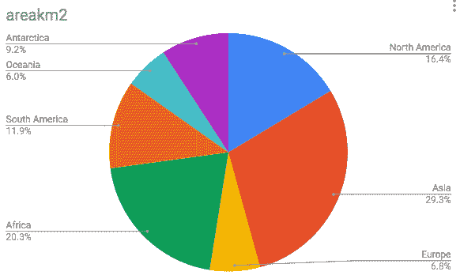
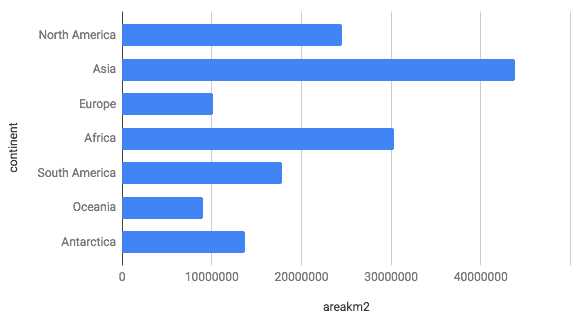
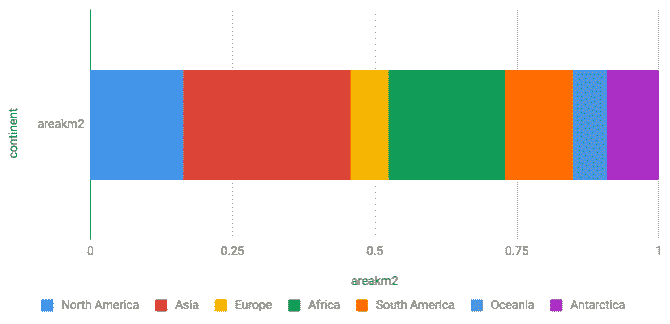
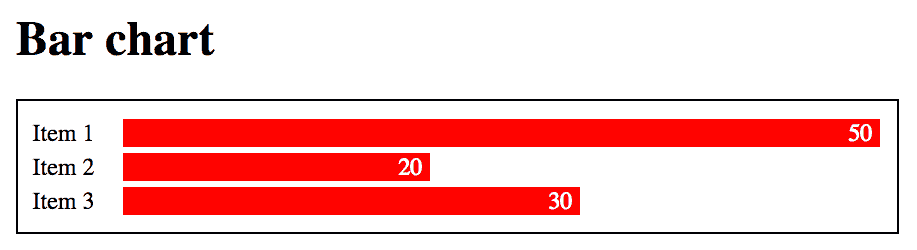
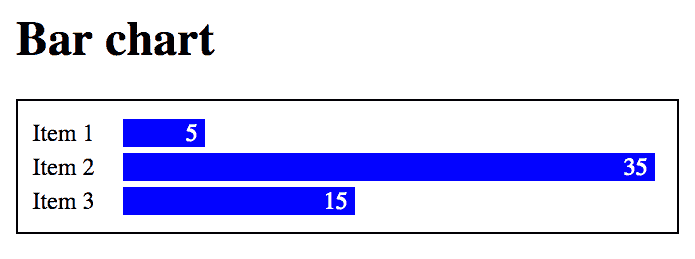
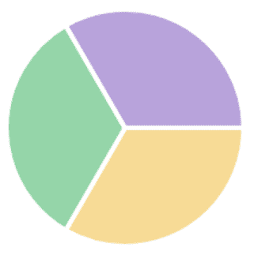

# 简介

这是一本关于使用 JavaScript 和 Chart.js 进行数据可视化的书籍，Chart.js 是最受欢迎的数据可视化库之一，也是使用起来最简单的库之一。Chart.js 提供了现成的交互式可视化工具，您只需进行最少的编码即可使用。在将您的数据加载到标准的 JavaScript 数组后，您可以使用简单的基于对象的声明性结构添加样式和其他配置。Chart.js 会自动缩放您的数据，生成刻度和网格线，创建交互式工具提示，并适应可用空间，使您的图表自动响应。这是开始创建 Web 数据可视化的一种极好方式。

Chart.js 是免费的、开源的，并由 GitHub 上活跃的开发者社区维护。作为一个数据可视化库，它在 GitHub 上以星标数量排名第二。排名第一的是 D3.js，这是一个更大、更复杂的库，学习曲线陡峭。您仍然需要了解 JavaScript、HTML 和 CSS 才能使用 Chart.js，但您不必成为专家。除了 JavaScript 之外，它还基于其他 Web 标准，如 DOM、CSS 和 Canvas。图表自动在 Canvas 中渲染，并控制所有 canvas 配置、调整大小和像素比。您需要了解的关于 Canvas 的唯一事情是如何在您的页面上包含一个 `<canvas>` 标签并获取上下文，但 Canvas 知识对于高级图表可能很有用。

本书假设您已经了解一些 JavaScript、HTML 和 CSS。下一章提供了对特定主题和您在学习 Chart.js 时可能遇到的主要技术的快速回顾。如果您愿意，可以跳过它，直接跳到第三章，*Chart.js 快速入门*。本章简要介绍了数据可视化和数据可视化框架，并对本书的其余部分进行了概述。

本章将涵盖以下主题：

+   数据可视化

+   为什么使用数据可视化库？

+   如何使用本书

# 数据可视化

视觉表示为数据提供了上下文，刺激了观众的头脑，揭示了通常从表格数据中不明显的信息。通常，使用视觉元素捕获数据的实质性内容要自然得多。图表和地图是讲述数据故事的有力、清晰和有效手段。它们可以在小空间中打包大量信息，并使比较数据、提供见解和揭示隐藏在数字中的趋势、关系、因果关系和其他模式变得更容易。

图表通过吸引观众的注意力来揭示和强调数据。它们可以将复杂的数据集简化，以促进发现和理解，帮助观众在不同的上下文中分析和推理数据。但它们也可能夸大、误导，甚至撒谎。一个视觉上吸引人的图表很重要，但设计师应该发现如何在形式和功能之间达到平衡。

数据可视化既是艺术又是科学。图表不需要解释一切。它不总是需要精确。它可能针对特定的受众，这应该提供理解和解码所需的上下文。

# 图表类型

数据可视化通常指的是定量信息的视觉展示，如统计图表、图表、数据地图等。但它可以包括任何类型的数据视觉表示，例如数学图形、路径网络（地铁系统、道路、电子电路图）、词云、音乐和声音表示、时间线、地理信息系统、化学和原子图，或任何其他使用视觉符号编码数据的方式。

如果你使用像 D3.js 这样的数据驱动库，你可以创建任何类型的可视化。带有预配置格式的图表库，如 Chart.js，功能更有限，但使用起来更容易。

Chart.js 支持八种基本图表类型：

+   条形图（水平和垂直）

+   线/面积（包括堆叠）

+   雷达图（径向线）

+   极坐标面积图（径向条形图）

+   散点图

+   气泡图

+   饼图

+   环形图

它不支持网络图、树或地理地图，但你可以使用 Chart.js 创建与其他图形共享数据的可视化。在第四章，*创建图表*中，我们将使用 Chart.js 创建一个气泡图，表示世界各地的城市人口，并将它们绘制在地图上。 

# 选择图表

选择图表需要了解你的数据。图表是一种旨在揭示信息的沟通手段，所以主要问题是：你想要展示什么？一旦你回答了这个问题，你应该分析你的数据，并发现你有什么类型的数据。在可视化中使用的数据值通常可以分为以下三种类型之一：

+   **定量**：可以测量或计数的值（数字、长度、面积、角度）

+   **序数**：一个值可以被排序或比较（颜色饱和度、面积、角度、长度、单词）

+   **名义**：一个类别（一个名称）

你的图表的目的是什么？你是想揭示关系、趋势还是因果关系？你希望强调哪种关系？你的变量与时间或空间相关吗？

可视化可以组织成类别，这有助于选择所需的图表类型。大多数图表和地图都可以归入以下类别之一：

+   *时间序列*（在一段时间内绘制单个变量的图表）。例如，展示趋势的折线图。

+   *时间/线性*（按时间线排列的分类）。例如，一系列事件。

+   *空间/平面/体积*（在空间地图上分布的分类）。例如，带有地理地图上分布数据的*人口图*或*色块图*。

+   *比较*（在单一时期内，与数量相关的类别被比较和排序）。例如，比较值的条形图。

+   *部分与整体*（分类子集作为整体的比例）。例如，以百分比表示切片的饼图。

+   *相关性*（比较两个或多个变量）。例如，比较两个变量的散点图，或比较三个变量的气泡图。

在他的经典著作《*定量信息的视觉展示*》中，爱德华·图费（Edward Tufte）定义了一些可以用来衡量可视化质量与完整性的方面。它们如下：

+   **数据-墨水比率**：用于显示数据的墨水（或像素）量

+   **图表垃圾**：与显示的数据无关的视觉垃圾（并且经常阻碍数据展示）

+   **谎言因子**：衡量可视化完整性的数字；例如，通过不精确地表示比例和长度而撒谎的图表

通过从图表中移除不必要的线条和标签等图表垃圾（chart-junk），可以提高数据-墨水比率。有时线条对于上下文很重要，但在交互式网络可视化中，你可以非常简约。你总是可以通过工具提示或其他交互式资源提供需求的详细信息。

人类对图形的感知方式深刻地影响着沟通，可能会因为视觉错觉而被改善或扭曲。没有谎言因子为零的图表，但适当的选择可以显著提高它。一个糟糕的选择会增加谎言因子，并可能导致观众产生错误的感知。

位置和长度最适合表示定量信息。接下来是方向和角度，然后是面积、体积、曲率，最后是阴影、饱和度和颜色。由于长度和位置比角度和面积更容易感知和比较，因此条形图中的数据比饼图中的数据感知得更准确。考虑以下比较大陆面积的饼图：



比较大陆面积的饼图

现在看看以条形图表示的完全相同的数据：



比较大陆面积的条形图

哪一个更清晰？虽然饼图适合显示比例，但角度的比较要困难得多。长度的差异更容易比较，在这种情况下条形图更好。但使用饼图来比较*两个*值作为*整体的一部分*可能更清晰，例如，一个大陆的面积与剩余面积的比较，以揭示它相对于整个地球所占的土地比例。

要同时显示比例和长度，你可能想尝试一个单一的堆积条形图，但它仍然比简单的条形图差，因为堆积条不容易像并排放置时那样比较：



比较大陆面积的堆积条形图

当然，你可以出于其他原因选择图表，但了解每种情况下你失去和获得的是什么很重要。分析和探索性可视化需要高度精确，但如果你需要吸引观众的注意力，可能愿意以牺牲一些精确度为代价使用更具吸引力的可视化。

# 基于网络的可视化

当爱德华·图费（Edward Tufte）撰写他的关于数据可视化的经典书籍时，大部分内容都是针对印刷媒体的。今天，你可以创建使用实时更新的数据的可视化，具有允许用户交互的动态界面。基于网络的视觉化的设计指南是不同的。它们*可以*并且*应该*是动态和交互式的。交互式图表可以通过隐藏细节来包含更多信息，这些细节可以在用户需要时请求。图表有时被渲染为概览或 Sparklines，只有通过缩放和刷选等策略才能揭示细节。

# 为什么使用数据可视化库？

实际上，你不需要任何编码就能为网页创建出色的交互式可视化。你总是可以使用图表服务。有很多这样的服务；有些是付费的，有些是免费的。它们提供配置界面和数据转换工具，允许你创建各种美丽的图表。流行的服务包括*Google Charts*、*Tableau*、*Infogram*和*Plotly*。如果它们完全满足你的数据可视化需求，你实际上并不需要这本书。

但如果你知道 HTML、CSS 和 JavaScript，你就不需要使用这些平台。网络标准提供了你创建任何复杂图形所需的所有工具，没有任何平台或计划的限制。使用网络标准还便于将你的可视化与网络应用程序、前端框架（如*React*、*Angular*和*Vue*）以及后端网络服务（如 RESTful 服务提供的资源和数据）集成。

但你真的需要使用像 Chart.js 这样的库吗？难道你不能只使用标准的 JavaScript、HTML、CSS 和 Canvas 吗？

# 为网页创建数据可视化

你实际上并不需要任何库或框架来在网页上创建和显示交互式和动画数据可视化。标准的 HTML、CSS 和 JavaScript 已经为你做到了这一点。基本的 HTML 提供了可以通过 CSS 进行样式的结构元素，可以用来显示简单的图形元素，例如彩色矩形。这意味着你只需在 CSS 中应用不同的宽度到`div`元素，就可以创建一个基本的静态柱状图。

看看下面的 HTML 和 CSS 代码：

```js
<html lang="en">
<head>
    <meta charset="UTF-8">
    <title>Title</title>
    <style>
        #data {
            width: 600px;
            border: solid black 1px;
            padding: 10px;
        }
        .label {
            display: inline-block;
            width: 60px;
        }
        .bar {
            display: inline-block;
            background: red;
            margin: 2px 0;
            text-align: right;
            padding-right: 5px;
            color: white;
        }
        #data .bar1 { width: 500px; }
        #data .bar2 { width: 200px; }
        #data .bar3 { width: 300px; }

    </style>
</head>
<body>

<h1>Bar chart</h1>
<div id="data">
    <div><span class="label">Item 1</span><span class="bar bar1">50</span></div>
    <div><span class="label">Item 2</span><span class="bar bar2">20</span></div>
    <div><span class="label">Item 3</span><span class="bar bar3">30</span></div>
</div>

</body>
</html>
```

如果你在一个网页浏览器中运行它，你会得到以下图表：



仅使用 HTML 和 CSS 创建的简单静态柱状图

当然，这不是绘制条形图的最佳方式。数字在 HTML 中插入得有些随意，长度由 CSS 的宽度属性定义。你必须自己计算比例。很容易出错并显示错误的数据。这只是为了说明所有图形工具已经存在于 HTML 和 CSS 中。我们需要的只是一个为我们生成代码的库。

由于**文档对象模型**（**DOM**）允许脚本语言访问和更改元素的风格属性，宽度可以在 JavaScript 中指定，甚至可以响应事件或随时间变化，从而允许创建具有动画的交互式图形。将以下 JavaScript 函数添加到前面的图表中，你可以在用户使用标准 DOM 命令点击图表时更改值、长度和颜色：

```js
 <div id="data" onclick="changeData()">...</div>
 <script>
     function changeData() {
         let chart = document.getElementById("data");
         let elements = chart.children;
         let values = [5, 35, 15];
         for(let i = 0; i < values.length; i++) {
             let labelElement = elements[i].children[1].innerText = 
             values[i];
             elements[i].children[1].style.background = "blue";
             elements[i].children[1].style.width = values[i] * 10 + "px";
         }
     }
 </script>
```

以下截图显示了在点击后与前面相同的图表，具有新的颜色和值：



使用标准 DOM、CSS、HTML 和 JavaScript 创建的交互式条形图

但你不必使用`div`和 CSS 来绘制条形图。自从 HTML5 以来，你也可以使用 Canvas API——这是一个完整的图形库，可以用来创建任何类型的图形，而不仅仅是矩形。以下示例仅使用标准 HTML 和没有额外库就显示了与饼图相同的数据：

```js
<canvas id="chart" height="200" width="400"></canvas>

<script>
    const canvas = document.getElementById('chart');
    const ctx = canvas.getContext('2d');
    const rad = Math.min(canvas.height, canvas.width) / 2;

    const data = [100, 100, 100];
    const comp = n => Math.floor(Math.random() * 255);
    const colors = function() {
        return "rgba("+comp()+","+comp()+","+comp()+",0.5)";
    };

    let angle  = 0.0;
    let total  = data.reduce((a, b) => a + b, 0);

    for (var i = 0; i < data.length; i++) {
        ctx.fillStyle = colors();
        ctx.strokeStyle = 'white';
        ctx.lineWidth = 4;
        ctx.beginPath();
        ctx.moveTo(rad, rad);
        ctx.arc(rad, rad, rad, angle, angle + 
               (Math.PI * 2 * (data[i]/total)), false);
        ctx.lineTo(rad, rad);
        ctx.fill();
        ctx.stroke();
        angle += Math.PI * 2 * (data[i] / total);
    }
</script>
```

你可以从本章的 GitHub 仓库下载所有这些代码示例。详情请见最后一节。结果如下所示：



使用 HTML Canvas 创建的简单饼图

在 Chart.js 中，即使不写一行 Canvas 代码，你也能制作出更漂亮的饼图，你也不必担心计算弧度或调整比例以适应页面。你还可以用比之前更少的代码获得免费的工具提示。Chart.js 可能无法满足你所有的数据可视化需求，但它确实是一个很好的开始方式。然后你可以应用你的 HTML 和 JavaScript 知识，并通过插件扩展它，与其它图表解决方案集成，或者迁移到一个更大且不受限制的库，如 D3.js。

# 如何使用本书

本书旨在作为创建数据可视化的 Chart.js 实用手册。它不涵盖 Chart.js 的所有方面，但涵盖了创建可视化时可能使用的大多数功能。涵盖了所有八个 Chart.js 图表，探讨了使用从公共仓库获取的外部数据的不同配置和应用。

每一章都涵盖了基本概念。每个概念都总是用一个简单的代码示例来展示，但每个章节也展示了可能需要额外 JavaScript 编程的更复杂示例，并包括解决现实世界问题的解决方案，例如下载、解析和过滤数据文件以将其转换为 Chart.js 可用的格式。

书中使用了代码列表，但大多数时候，它们专注于一个特定的功能，只展示完整代码的一部分。但你可以下载完整的列表。书中使用的所有代码示例都可以从位于：[`github.com/PacktPublishing/Learn-charts.js`](https://github.com/PacktPublishing/Learn-charts.js) 的公共 GitHub 仓库中获取。

仓库中为每个章节都有一个文件夹，命名为 `Chapter01`、`Chapter02` 等。每个代码列表和每个由代码生成的图像都包含对每个章节对应文件夹中文件的相对引用。你可以在学习时尝试所有代码示例。你也可以以任何你喜欢的方式使用它，因为它是免费和开源的。

下面是每个章节的简要总结：

第二章，*技术基础*，涵盖了技术基础、数据格式，并探讨了加载和解析文件的一些技术。它提供了 Chart.js 所用主题的一般背景，例如 JavaScript、CSS、DOM 和 Canvas。如果你愿意，可以跳过这些部分。

第三章*，Chart.js 快速入门*，包括快速入门和几个 Chart.js 功能的概述。它展示了如何设置网页以使用 Chart.js 以及如何创建你的第一个图表。你将了解 Chart.js 提供的所有内容。它还介绍了条形图类型（垂直和水平）。

第四章，*创建图表*，涵盖了所有其他可用的图表类型：折线/面积图、雷达图、极坐标面积图、饼图、环形图、散点图和气泡图。它还展示了如何从公共数据门户加载和解析外部 CSV 和 JSON 数据，并使用它们创建现实世界的可视化。

第五章，*刻度和网格配置*，专注于配置所有图表的刻度、轴和网格线。你将学习如何使用径向网格和笛卡尔网格与线性、对数、分类和时间轴一起使用。

第六章，*配置样式和交互性*，处理了配置几个属性的问题，对于这些属性，Chart.js 已经提供了默认值：字体、标题和标签。它还探讨了几个实用的标签插件和配色方案，这对于可访问图表非常重要。本章还展示了如何配置过渡、动画和交互。

第七章*，高级 Chart.js*，涵盖了您不太可能经常使用的某些高级功能，因为 Chart.js 已经提供了良好的默认设置。这些包括工具提示配置、创建自定义图例、混合图表、如何在单个页面上显示多个图表、在 Canvas 上叠加 Chart.js 以及创建插件。

我认为这本书涵盖了 Chart.js 中最重要的主题。它省略了一些高级编程主题、几个插件以及与前端框架的集成，这些内容也没有涉及。

我与 Chart.js 没有任何关联，这本书也不代替官方的 Chart.js 文档，这是该主题的终极参考指南。该文档由社区维护，免费提供在 [www.chartjs.org/docs/latest](http://www.chartjs.org/docs/latest)。还有许多探索其主要功能的示例，这些示例也是文档的一部分，可在 [www.chartjs.org/samples/latest](http://www.chartjs.org/samples/latest) 找到。

在撰写这本书时，我尽力提供尽可能准确的信息。所有代码列表都经过测试，并做出了额外努力以确保所有代码示例在书中得到适当引用，并且按预期工作。本书基于 Chart.js 版本 2.7.3。我预计示例应该继续与任何 2.x 版本兼容，但如果您使用的是较新版本，某些代码可能无法按预期工作。

Chart.js 社区在 *GitHub* 和 *StackOverflow* 上非常活跃。如果您对 Chart.js 有任何疑问，您可以在 [stackoverflow.com](http://stackoverflow.com) 上提交问题，您可能会在几小时或更短的时间内得到答案。

我希望您喜欢这本书，并在学习 Chart.js 时像我一样享受乐趣。

# 摘要

本章提供了数据可视化主题的快速介绍，并介绍了 Chart.js，这是一个 JavaScript 库，您将学习如何创建用于网络的响应式交互式可视化。我们还展示了标准网络技术如何提供您创建网络图表所需的一切，以及如何使用像 Chart.js 这样的数据可视化库带来益处。

在下一章中，我们将介绍 Chart.js 所使用的某些标准技术的基础知识——数据格式和数据操作技术——但如果您想立即开始使用 Chart.js，您可以跳过它，直接跳到 第三章*，Chart.js 快速入门*。

# 参考文献

**书籍和网站**：

+   爱德华·R·图费。《定量信息的视觉展示》。图形出版社，1997 年

+   伊莎贝尔·梅雷莱斯。《信息设计》。洛克波特出版社，2013 年

+   史蒂芬·菲。*数据可视化：过去、现在和未来*。感知边缘，2007 年

+   大卫·卡尼曼。《快速与慢思考》。法拉尔、斯特劳斯和吉鲁出版社，2011 年

+   Ben Bederson 和 Ben Schneiderman. *信息可视化的艺术*. 2003
