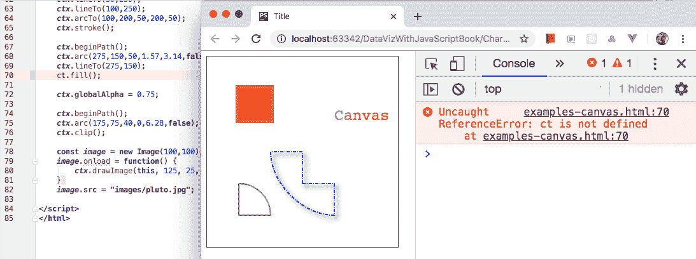
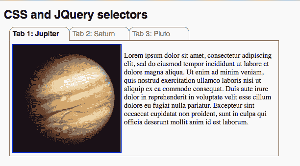
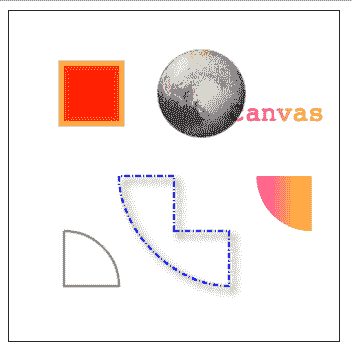
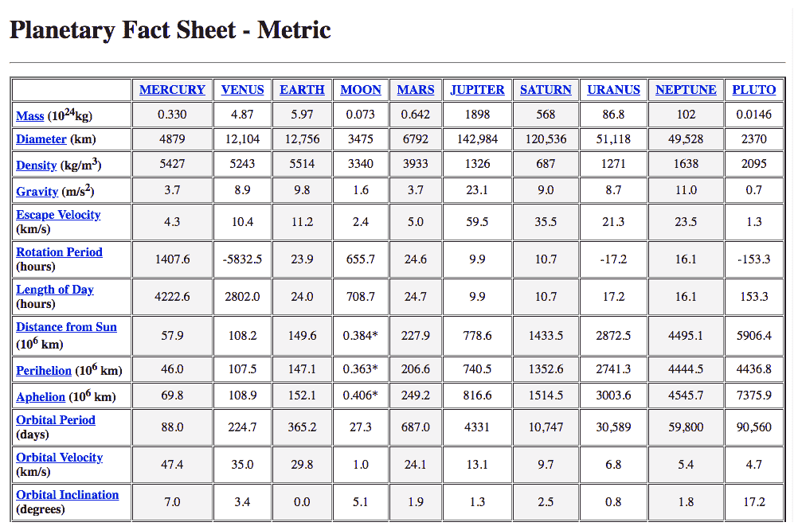

# 技术基础

本书假设你已经掌握了 HTML、CSS 和 JavaScript 的基本知识，这些是使用 Chart.js 创建可视化的必备工具。本书中的所有示例都是用 JavaScript ES2015 或 ES6 编写的。本章的一个目标是对这些技术的核心主题进行回顾。这包括与字符串、对象和数组操作相关的 JavaScript 主题，HTML 文档对象模型（DOM），基本的 JQuery，CSS 选择器，以及 HTML 画布。当然，如果你已经对这些技术感到熟悉，你可以跳过这些部分。

本章还描述了在可视化中常用的数据格式，如 CSV、XML 和 JSON，以及如何在你的 Web 页面中加载、解析和使用这些格式的外部数据文件。你还将学习如何设置一个小型测试 Web 服务器来运行加载外部资源的文件。

最后部分包含了一些关于如何获取和准备数据以供你的可视化使用、如何将 HTML 数据转换为标准格式，以及如何从 HTML 页面中提取所需信息的技巧。

在本章中，你将学习以下内容：

+   Chart.js 必需的 JavaScript

+   其他技术：DOM、CSS、JQuery 和 Canvas

+   数据格式

+   如何加载和解析外部数据文件

+   如何提取和转换数据

# Chart.js 必需的 JavaScript

客户端应用程序，如交互式 Web 图形，依赖于浏览器支持。本书假设你的受众使用支持 HTML5 Canvas 和 ES2015（包括所有现代浏览器）的浏览器。所有示例都使用 ES2015 语法，包括*const*和*let*代替*var*，在适当的地方使用箭头函数，使用扩展运算符、映射、集合和承诺。外部文件使用 Fetch API 加载，该 API 最近才得到支持，但如果你需要，可以轻松切换到 JQuery。

虽然使用 Chart.js 创建可视化主要是一个声明性过程，但它仍然是一个 JavaScript 库，需要基本的 JavaScript 知识。要创建一个简单的图表，你需要知道如何声明常量和变量，执行基本的数学布尔字符串和属性操作，调用和创建函数，操作对象和数组，以及实例化 Chart.js 对象。典型的图表还需要足够的知识来编程控制结构，编写回调函数，排序和过滤数据集，生成随机数，以及加载外部文件。本节是对你使用 Chart.js 所需的主要 ES2015 主题的快速回顾。

# 浏览器工具

你不需要一个完整的客户端模块化 Node 开发环境来使用 Chart.js 创建可视化，但你仍然需要一个良好的调试器。每个浏览器都自带开发工具，允许你导航静态页面结构和生成的 DOM 元素，以及一个控制台，你可以实时与 JavaScript 引擎使用的数据进行交互。

最重要的工具是**JavaScript 控制台**，在这里你会看到任何错误信息。当你期望看到其他内容却得到一个空白页面，并且不知道为什么你的代码没有按预期工作，这种情况非常常见。有时，可能只是你忘记了一个逗号，或者网络连接中断导致某些文件没有加载。如果你在运行页面时打开了 JavaScript 控制台，它会立即告诉你发生了什么。使用带有行号的编辑器也是一个好主意，因为大多数错误信息都会告诉我们问题发生的位置：



使用 JavaScript 控制台调试 JavaScript

你可以将开发者工具作为浏览器中的一个框架或作为单独的窗口打开。以下是最受欢迎的三种浏览器最新版本中 JavaScript 控制台的菜单路径：

+   Chrome: 查看 | 开发者 | JavaScript 控制台

+   Firefox: 工具 | 网页开发者 | 网页控制台

+   Safari: 开发 | 显示错误控制台

本节中的大多数代码片段和示例都可以通过在 JavaScript 控制台中输入它们来测试。这是一种学习 JavaScript 的好方法。它还会访问通过`<script>`标签加载的任何 JavaScript 库文件的功能，以及`<script></script>`块中声明的任何全局变量。

# JavaScript 类型和变量

JavaScript 不是一种强类型语言，因为类型没有声明，变量可以接收不同的类型，但数据值确实有类型。主要类型有**Number**、**String**、**Boolean**、**Array**、**Object**和**Function**。前三种是标量类型，后三种也是对象。如果值具有不同的类型，它们在同一个表达式中会被以不同的方式处理。例如，在一个表达式如`a = b + c`中，如果`b`和`c`是数字（它们将被相加），或者其中一个是一个字符串（它们将被连接），那么`a`的值将会不同。

值可以进行比较，如果比较是**严格的**（例如，使用`===`而不是`==`），那么它们的类型就很重要。但是，依赖于这样的转换可能会令人困惑（`0`、`""`、`null`、`NaN`和`undefined`都被认为是`false`，但`false`字符串转换为`true`，因为它不是一个空字符串）。

在 ES5 JavaScript 中，`var`是声明变量的唯一关键字。它忽略了块作用域，并且会被提升到函数的顶部。自从 ES6（ES2015）以来，引入了两个新的关键字：`const`和`let`。它们都是块作用域的，并且在使用之前需要赋值（`var`默认为`undefined`）。使用`const`的声明是常量，不能重新赋值。通常认为，尽可能使用`const`是好的做法，只有在确实需要重新定义变量时才使用`let`。

# 图表中使用的**数据结构**

用作可视化数据源的数据通常以某种结构组织。最常见的数据结构可能是*列表*（数组）和*表格*（映射），存储在某种标准数据格式中。当使用外部数据源时，你通常需要对其进行清理，删除不必要的值，简化其结构，应用边界等。之后，你可以解析它，并将其最终存储在本地 JavaScript 数组或 JavaScript 对象中，以便图表使用。

一旦你的数据存储在 JavaScript 数据结构中，你可以通过在存储的值上应用数学运算来进一步转换它。你可以更改结构，创建新字段，合并和删除数据。典型操作包括将新值推送到数据集中，切片或拆分数组，创建子集，转换数据等。JavaScript 提供了许多原生操作，使修改数组和对象变得更容易。你还可以使用 JQuery 等库。

# Arrays

你将使用的主要数据结构来存储一维数据是 JavaScript 数组。它是 Chart.js 中大多数图表类型的主要数据集格式。制作一个简单的柱状图只需要一个值数组。你可以通过在括号内声明一个项目列表来创建一个数组，或者如果你想从一个空数组开始，只需一对开闭括号：

```js
const colors = ["red", "blue", "green"];
const geocoords = [27.2345, 34.9937];
const numbers = [1,2,3,4,5,6];
const empty = [];
```

你可以使用数组索引访问数组的项，索引从零开始计数：

```js
const blue = colors[1];
const latitude = geocoords[0];
```

每个数组都有一个长度属性，它返回元素的个数。使用数组索引进行迭代非常有用：

```js
for(let i = 0; i < colors.length; i++) {
    console.log(colors[i]);
}
```

你还可以使用*of*运算符（在 ES2015 中引入）遍历数组的元素，当你不需要索引时：

```js
for(let color of colors) {
    console.log(color);
}
```

你可以使用`forEach()`方法，它为每个元素运行一个函数，并允许在函数内部访问索引、项和数组：

```js
colors.forEach(function(i, color, colors) {
    console.log((i+1) + ": " + color);
}
```

在 JavaScript 中，多维数组是以数组数组的格式创建的：

```js
const points = [[200,300], [150,100], [100,300]];
```

你可以这样检索单个项：

```js
const firstPoint = points[0];
const middleX = points[1][0];
```

JavaScript 提供了许多方法来提取和插入数组中的数据。通常建议尽可能使用这些方法。以下表格列出了你可以用于数组的有用方法。一些方法会修改数组；其他方法返回新的数组和其他类型。提供的示例使用之前声明的`colors`和`numbers`数组。你可以使用浏览器中的 JavaScript 控制台尝试它们：

| **方法** | **描述** | **示例** |
| --- | --- | --- |
| `push(item)` | 修改数组，在末尾添加一个项。 |

```js
colors.push("yellow"); 
/*["red", "blue", "green", 
   "yellow"];*/
```

|

| `pop()` | 修改数组，移除并返回最后一个项。 |
| --- | --- |

```js
const green = colors.pop(); 
// ["red", "blue"];
```

|

| `unshift(item)` | 修改数组，在开头插入一个项。 |
| --- | --- |

```js
colors.unshift("yellow");
/*["yellow", "red", "blue", 
   "green"];*/
```

|

| `shift()` | 修改数组，移除并返回第一个项。 |
| --- | --- |

```js
const red = colors.shift();
// ["blue", "green"];
```

|

| `splice(p,n,i)` | 从位置`p`开始修改数组。可用于删除、插入或替换项。 |
| --- | --- |

```js
const s = numbers.splice(2,3);
 // s = [3,4,5]
 // numbers = [1,2,6]
```

|

| `reverse()` | 修改数组，反转其顺序。 |
| --- | --- |

```js
numbers.reverse(); 
// [6,5,4,3,2,1]
```

|

| `sort()` | 修改数组，按字符串顺序（如果没有参数）或按比较函数排序。 |
| --- | --- |

```js
numbers.sort((a,b) => b – a);
// numbers = [6,5,4,3,2,1]
```

|

| `slice(b,e)` | 返回从 `b` 到 `e` 的数组的一个浅拷贝。 |
| --- | --- |

```js
const mid = numbers.slice(2,4)
 // mid = [3,4]
```

|

| `filter(callback)` | 返回一个新数组，其中的元素通过函数实现的测试。 |
| --- | --- |

```js
const even = numbers.filter(n => n%2==0);
// [2,4,6]
```

|

| `find(function)` | 返回满足测试函数的第一个元素。 |
| --- | --- |

```js
const two = numbers.find(n => n%2==0);
// 2
```

|

| `indexOf(item)` | 返回数组中项目首次出现的位置索引。 |
| --- | --- |

```js
const n = numbers.indexOf(3); 
// 4
```

|

| `includes(item)` | 如果数组在其条目中包含项目，则返回 `true`。 |
| --- | --- |

```js
const n = numbers.includes(3); 
// true
```

|

| `lastIndexOf(item)` | 返回数组中项目最后一次出现的位置索引。 |
| --- | --- |

```js
const n = colors.lastIndexOf("blue"); 
// 1
```

|

| `concat(other)` | 返回一个新数组，它将当前数组与另一个数组合并。 |
| --- | --- |

```js
const eight = numbers.concat([7,8]);
// [1,2,3,4,5,6,7,8]
```

|

| `join()``join(delim)` | 返回数组中元素的逗号分隔字符串（可以使用可选的分隔符）。 |
| --- | --- |

```js
const csv = numbers.join();
// "1,2,3,4,5,6"
const conc = numbers.join("");
// "123456"
```

|

| `map(function)` | 返回一个新数组，其中的每个元素都通过函数修改。 |
| --- | --- |

```js
const squares = numbers.map(n => n*n);
// [1,4,9,16,25,36]
```

|

| `reduce(function)` | 返回使用数组中的值进行的累积操作的结果。 |
| --- | --- |

```js
const sum =
  numbers.reduce((a, n) => a + n);
```

|

| `forEach(function)` | 对数组中的每个元素执行提供的函数一次。 |
| --- | --- |

```js
const squares = [];
numbers.forEach(n => squares.push(n*n)
// squares = [1,4,9,16,26,36]
```

|

JavaScript 数组操作函数

除了数组之外，ES2015 还引入了两种新的数据结构：Map，一个具有键值对的关联数组，比简单对象更容易使用，以及 Set，它不允许重复值。两者都可以转换为数组。

# 字符串

在 JavaScript 中，字符串是原始类型，可以使用单引号或双引号创建。它们之间没有区别，这只是风格问题。ES2015 引入了两个新的字符串特性：*模板字符串*和*多行字符串*。

多行字符串可以通过在每行末尾添加反斜杠来创建：

```js
const line = "Multiline strings can be \
reated adding a backslash \
at the end of each line";
```

模板字符串是通过反引号创建的字符串。它们允许在 `${}` 插值占位符内包含 JavaScript 表达式。结果作为单个字符串连接：

```js
const template = `The square root of 2 is ${Math.sqrt(2)}`;
```

如果需要在字符串中使用特殊字符，例如双引号字符串中的双引号或反斜杠，需要在它前面加上反斜杠：

```js
const s = "This is a backslash \\ and this is a double quote \"";
```

有几种字符串操作方法。它们都返回新的字符串或其他类型。没有方法修改原始字符串：

| **方法** | **描述** | **示例** |
| --- | --- | --- |
| `startsWith(s)` | 如果字符串以作为参数传递的字符串开头，则返回 `true`。 |

```js
const s = "This is a test string"
const r = s.startsWith("This");    
// true
```

|

| `endsWith(s)` | 如果字符串以作为参数传递的字符串结尾，则返回 `true`。 |
| --- | --- |

```js
const s = "This is a test string"
const r = s.endsWith("This"); 
// false
```

|

| `substring(s,e)` | 返回从 `start`（包含）到 *end* 索引（不包含）之间的子字符串。 |
| --- | --- |

```js
const k = "Aardvark"
const ardva = k.substring(1,6);
```

|

| `split(regx)``split(delim)` | 通过分隔符字符或正则表达式分割字符串，并返回一个数组。 |
| --- | --- |

```js
const result = s.split(" ");
// result =
//["This","is","a","test","string"]
```

|

| `indexOf()` | 返回子字符串首次出现的位置索引。 |
| --- | --- |

```js
const k = "Aardvark"
const i = k.indexOf("ar"); // i = 1
```

|

| `lastIndexOf()` | 返回子字符串最后一次出现的位置索引。 |
| --- | --- |

```js
const k = "Aardvark"
const i = k.lastIndexOf("ar");
// i = 5
```

|

| `charAt(i)` | 返回索引 `*i*` 处的 `char`。也支持为 `‘string'[i]`。 |
| --- | --- |

```js
const k = "Aardvark"
const v = k.charAt(4);
```

|

| `trim()` | 从字符串的两端删除空白字符。 |
| --- | --- |

```js
const text = "   data   "
const r = data.trim(); 
// r = "data"
```

|

| `match(regx)` | 返回一个数组，该数组是正则表达式与字符串匹配的结果。 |
| --- | --- |

```js
const k = "Aardvark"
const v = k.match(/[a-f]/g);
// v = ["a", "d", "a"]
```

|

| `replace(regx,r)``replace(s,t)` | 返回一个新的字符串，该字符串将应用于字符串的正则表达式匹配替换为替换文本，或将源字符串的所有出现替换为目标字符串。 |
| --- | --- |

```js
const k = "Aardvark"
const a = p.replace(/a/gi, 'u')
// a = "uurdvurk"
const b = p.replace('ardv', 'ntib')
// b = "Antibark"
```

|

JavaScript 字符串操作函数

# 函数

函数通常使用 JavaScript 中的 `function` 关键字创建，使用以下形式之一：

```js
function f() {
    console.log('function1', this);
}
const g = function(name) {
    console.log('function ' + name, this);
}
f(); // calls f
g('test'); // calls g() with a parameter
```

`this` 关键字指向拥有函数的对象。如果此代码在浏览器中运行，并且这是一个在 `<script>` 块中创建的顶级函数，则所有者是全球的 `window` 对象。通过此访问的任何属性都指向该对象。

函数可以放置在对象的范围内，作为方法使用。以下代码中的 `this` 引用指向 `obj` 对象，可以访问 `this.a` 和 `this.b`：

```js
const obj = {a: 5, b: 6}
obj.method = function() {
    console.log('method', this)
}
object.method()
```

箭头函数是在 ES2015 中引入的。它们更加紧凑，可以使代码更简洁，但 `this` 的作用域不再由对象保留。在以下代码中，它引用全局的 `window` 对象。使用 `this.a` 和 `this.b` 的代码将不会在对象中找到任何数据，并返回 `undefined`：

```js
obj.arrow = () => console.log('arrow', this)
object.arrow()
```

你可以在 Chart.js 回调中使用箭头函数，但如果你需要访问图表实例，通常使用 `this`，你应该使用普通函数而不是箭头函数。

# 对象

对象是无序的数据集合。对象中的值存储为键值对。你可以通过在花括号内声明逗号分隔的 *键:值* 对来创建对象，或者如果你想要从空对象开始，可以简单地使用一对开闭花括号：

```js
const color = {name: "red", code: ff0000};
const empty = {};
```

对象可以包含其他对象和数组，这些数组也可以包含对象。它们还可以包含函数，这些函数可以访问局部属性，并作为方法使用：

```js
const city = {name: "Sao Paulo",
              location: {latitude: 23.555, longitude: 46.63},
              airports: ["SAO","CGH","GRU","VCP"]};
const circle = {
    x: 200,
    y: 100,
    r: 50,
    area: function() {
        return this.r * this.r * 3.14;
    }
}
```

简单图表通常使用的典型数据集通常由一个对象数组组成：

```js
var array2 = [
    {continent: "Asia", areakm2: 43820000},
    {continent: "Europe", areakm2: 10180000},
    {continent: "Africa", areakm2: 30370000},
    {continent: "South America", areakm2: 17840000},
    {continent: "Oceania", areakm2: 9008500},
    {continent: "North America", areakm2=24490000}
];
```

你可以使用点操作符或包含键作为字符串的方括号来访问对象的属性。你可以使用点操作符运行其方法：

```js
const latitude = city.location.latitude;
const oceania = array2[4].continent;
const code = color["code"];
circle.r = 100;
const area = circle.area();
```

你也可以遍历对象的属性：

```js
for(let key in color) {
     console.log(key + ": " + color[key]);
}
```

可以向对象添加属性和函数。在全局范围内声明一个空对象以声明代码很常见，以便在其他上下文中添加数据：

```js
const map = {};
function getCoords(coords) {
    map.latitude = coords.lat;
    map.longitude = coords.lng;
}
```

对象也可以通过构造函数创建。你可以使用以下方式创建包含当前日期/时间的对象：

```js
const now = new Date();
```

创建一个 Chart.js 实例需要使用至少两个参数的构造函数。第二个参数是一个对象，包含两个属性，一个字符串和另一个对象：

```js
const chart =
    new Chart("bar-chart ",{type:"bar", data:{labels:[],datasets:[]}});
```

JSON 是基于 JavaScript 对象的数据格式。它与 JavaScript 对象具有相同的结构，但属性键必须放在双引号内：

```js
{"name": "Sao Paulo",
              "location": {"latitude": 23.555, "longitude": 46.63},
              "airports": ["SAO","CGH","GRU","VCP"]};
```

要在 JavaScript 中使用 JSON 字符串，你必须解析它。

# 其他技术

本节简要介绍了你应该了解的其他技术，包括它们的基本概念。它们包括 HTML DOM、JQuery、CSS 和 HTML Canvas。如果你已经了解并使用这些技术，可以浏览或跳过本节。接下来的几节还提供了可以从本章 GitHub 仓库下载的代码示例。

# HTML 文档对象模型（DOM）

HTML 文档的结构通常用标签描述，但也可以使用带有 **Document Object Model (DOM)** 的 JavaScript 命令指定：一个语言中立的 API，它将 HTML 或 XML 文档表示为 *树*。考虑以下 HTML 文档（`Examples/example-1.html`）：

```js
<html>
<body>
     <h1>Simple page</h1>
     <p>Simple paragraph</p>
     <div>
         
         <p>Click me!</p>
     </div>
 </body>
 </html>
```

本页构建了一个包含 HTML 元素和文本的相互连接的 *节点* 树。可以使用以下 JavaScript 命令获得相同的结果（`Examples/example-2.html`）：

```js
 const html = document.documentElement;

 const body = document.createElement("body");
 html.appendChild(body);

 const h1 = document.createElement("h1");
 const h1Text = document.createTextNode("Simple page");
 h1.appendChild(h1Text);
 body.appendChild(h1);

 const p = document.createElement("p");
 const pText = document.createTextNode("Simple paragraph");
 p.appendChild(pText);
 body.appendChild(p);

 const div = document.createElement("div");
 const divImg = document.createElement("img");
 divImg.setAttribute("src", "pluto.jpg");
 divImg.setAttribute("width", "100");
 div.appendChild(divImg);

 const divP = document.createElement("p");
 const divPText = document.createTextNode("Click me!");
 divP.appendChild(divPText);
 div.appendChild(divP);

 body.appendChild(div);
```

当然，编写标签要简单得多，但 JavaScript 给你提供了使结构和内容 *动态化* 的能力。使用 DOM 命令，你可以添加新元素，移动它们，删除它们，并更改它们的属性和文本内容。你还可以在 DOM 树中导航，选择或搜索特定元素或数据，并将样式和事件处理器绑定到元素上。

例如，如果你添加以下代码，每次点击图片时都会创建一个新的 `<p>` 元素，包含 `“New line”` 文本（`Examples/example-3.html`）：

```js
div.style.cursor = "pointer";
div.addEventListener("click", function() {
    const p = document.createElement("p");
    p.innerHTML = "New line";
    this.appendChild(p);
});
```

通常，你不会使用 DOM 编写整个文档，而只是控制动态部分的文档。通常，你会将静态部分编写为 HTML，并在必要时使用脚本（`Examples/example-4.html`）：

```js
 <html>
 <body>
 <h1>Simple page</h1>
 <p>Simple paragraph</p>
 <div id="my-section">
     
     <p>Click me!</p>
 </div>
 </body>

 <script>
     const div = document.getElementById("my-section");
     div.style.cursor = "pointer";
     div.addEventListener("click", function() {
         const p = document.createElement("p");
         p.innerHTML = "New line";
         this.appendChild(p);
     });
 </script>
 </html>
```

对于数据驱动的文档，你可以使用 DOM 脚本来将存储在数组或对象中的数据绑定到元素的属性，从而改变尺寸、颜色、文本内容和位置。大多数数据可视化库正是通过提供基于 DOM 的函数来实现这一点，使这项任务变得简单得多。

以下表格列出了最重要的 DOM 命令：

| **方法或属性** | **描述** |
| --- | --- |
| `createElement(tag)` | 创建一个元素（不连接到节点树）并返回其引用。 |
| `createTextNode(text)` | 创建一个文本节点（不连接到节点树）并返回其引用。 |
| `appendChild(element)` | 将传入参数的元素作为当前元素的子元素连接。 |
| `removeChild(element)` | 将子元素从当前元素中断开连接。 |
| `setAttribute(name, value)` | 使用传入的参数设置此元素的属性名称和值。 |
| `getElementById(id)` | 返回一个通过传入参数的 `id` 标识的元素。 |
| `getElementsByTagName(tag)` | 返回一个包含所有匹配传入参数标签名的元素的 `nodelist`（数组）。 |
| `addEventListener(e, func)` | 将事件处理程序附加到该元素。第一个参数是事件类型（例如，`‘click'`, `‘key'`, 等等）第二个参数是处理函数。 |
| `documentElement` | 该属性引用文档根部的元素。对于 HTML 和 XHTML，它是`<html>`元素。 |
| `children` | 该属性返回一个包含此元素子元素的节点列表。 |
| `innerText` | 在 SVG 或 HTML 文档中，这个读写属性是一个创建文本节点并将其附加到元素的快捷方式。 |
| `innerHTML` | 在 HTML 文档中，这个读写属性是一个将整个 HTML 片段作为子元素附加的快捷方式。 |
| `style` | 在 SVG 或 HTML 文档中，该属性允许访问元素的 CSS 样式。您可以使用它动态地读取和修改样式。 |

HTML DOM 支持的属性和方法选择

# 层叠样式表

**层叠样式表**（**CSS**）是一个 W3C 标准，它指定了 HTML 和 XML 元素在屏幕上的显示方式。它是一种声明性语言，其中视觉属性应用于标签选择器。您可以使用 CSS 将颜色、字体、边距、阴影和渐变等属性应用于一个或多个标签，在二维和三维中进行坐标变换，并设置过渡和动画的规则。CSS 属性和选择器也用于 JavaScript 库，如 JQuery 和 D3.js。

CSS 选择器是用于通过类型、类、ID、通配符、属性、上下文、状态和位置选择元素的表达式。选择表达式的结果可能由零个、一个或多个元素组成。JavaScript 库使用选择器来获取可以通过 DOM 编程方式操作的对象。可以从逗号分隔的选择表达式列表中形成结果集。元素也可以通过组合选择器从上下文中选择。以下表格列出了主要选择器及其一些示例：

| **选择器** | **语法** | **描述示例（在 CSS 中）** |
| --- | --- | --- |
| 类型选择器 | `tagname` | 选择指定类型（标签名）的元素集合，例如 `td, h1, prect { … } /* 所有 <rect> 标签 */`。 |
| 类选择器 | `.classname` | 选择属于指定类的元素集合，例如 `.selected` 和 `p.copy`。 |
| ID 选择器 | `#idname` | 选择具有指定`id`属性的元素，例如 `#main` 和 `#chart`。 |
| 全局选择器 | `*` | 选择所有元素。 |
| 属性选择器 | `[attr]` `[attr=value]`(其他几种组合) | 选择包含属性的元素。选择具有指定值的属性的元素。其他组合匹配属性值中的字符串。 |
| 后代组合器 | `ancestor selectedtag` | 选择嵌套在指定祖先元素内的元素（之间可能包含其他元素），例如 `table td`。 |
| 子组合器 | `parent > selectedtag` | 选择直接位于指定父元素（`selectedTag`是父元素的子元素）下方的元素，例如 `table >tbody >tr >td`。 |
| 一般兄弟组合器 | `preceding ~ selectedtag` | 选择出现在指定前驱之后（两者具有相同的父元素）的元素，例如 `h1 ~p.last`。 |
| 相邻兄弟组合器 | `previous + selectedtag` | 选择出现在指定兄弟之后（两者具有相同的父元素）的元素，例如 `h1 +p.first`。 |
| 伪类 | `tag:state` | 选择处于指定*state*的元素，例如 `a:hover, p:last-child, td:nth-of-type(2), :not(x)`。 |
| 伪元素 | `tag::property` | 选择具有指定`property`的元素，很少使用。 |

CSS 选择器

大多数时候，您将使用最简单的选择器。ID、类和类型选择器是最常见的。最终，您可能会使用后代组合器或属性选择器。

以下代码使用简单选择器更改包含三个部分的未格式化页面的视觉外观。这些部分是堆叠在一起的。省略了 CSS 属性和其他部分，但您可以在完整的代码列表中看到它们（`Examples/example-5-selectors.html`）：

```js
<html lang="en">
<head>
    <style>
        h1 {…}
        .tab h1 {…}
        .tab p {…}
        .illustration {…}
        .tab {…}
        .tab .contents {…}
        .container {…}
        .tab:nth-child(2) h1 {…}
        .tab:nth-child(3) h1 {…}
    </style>
</head>

<body>
<h1>CSS and JQuery selectors</h1>

<div id="container">

    <div class="tab first" id="section1">
        <div class="contents">
            
            <p>…</p>
        </div>
        <h1>Tab 1: Jupiter</h1>
    </div>

    <div class="tab" id="section2">
        <div class="contents">
            
            <p>…</p>
        </div>
        <h1>Tab 2: Saturn</h1>
    </div>

    <div class="tab" id="section3">
        <div class="contents">
            
            <p>…</p>
        </div>
        <h1>Tab 3: Pluto</h1>
    </div>

</div>
</body>

</html>
```

结果如下：



仅使用 CSS 样式化的堆叠信息的 HTML 页面

# JQuery 基础

JQuery 不是一个标准技术，但它是一个事实上的 Web 标准。它使用 CSS 选择器在任意 HTML 文件中定位元素，并提供与 DOM 相同的功能，但语法更简洁。要使用*JQuery*，您首先需要使用`<script>`标签将其库包含在您的 HTML 页面中。这可以通过 CDN URL 轻松完成：

```js
<script src="img/jquery-3.3.1.min.js"></script>
```

此代码片段是一个使用*JQuery*执行与最后一个 DOM 示例中显示的完全相同操作的页面。结果是更容易理解（`Examples/example-6.html`）：

```js
<html>
<body>
<head>
    <style>
        #my-section {
            cursor: pointer;
        }
    </style>
</head>
<h1>Simple page</h1>
<p>Simple paragraph</p>
<div id="my-section">
    
    <p>Click me!</p>
</div>
</body>
<script src="img/jquery-3.3.1.min.js"></script>
<script>
    $("#my-section").on("click", function() {
        $(this).append("<p>New Line</p>");
    });
</script>
</html>
```

CSS 选择器用于 JavaScript 库，如*JQuery*，以应用动态样式和操作文档的结构和内容。主要的 JQuery(selector)函数，通常通过其别名`$(selector)`函数使用，是一个元素选择器，它接收一个 CSS 选择器表达式作为其参数：

```js
const divSet = $("div");
const title1 = $("#section1 h1");
```

选择可以返回零个、一个或一个元素列表。您可以使用`length`属性测试选择的长度：

```js
if($("table").length == 0) {
     console.log("there are no tables in this document")
 }
```

使用*JQuery*和 CSS 示例中显示的代码，我们可以通过选择器和*JQuery*函数使选项卡在点击时淡入和淡出（`Examples/example-7-selectors.html`）：

```js
<script src="img/jquery-3.3.1.min.js"></script>
<script>
    $(".tab").on("click", function() {
        $(".tab h1").css("color", "gray");
        $(".tab h1").css("background", "white");
        $(".tab h1").css("font-weight", "normal");
        $(".tab h1").css("z-index", "-1");
        $("#" + $(this).attr("id") + " h1").css("color", "black");
        $("#" + $(this).attr("id") + " h1").css("background", "whitesmoke");
        $("#" + $(this).attr("id") + " h1").css("font-weight", "bold");
        $("#" + $(this).attr("id") + " h1").css("z-index", "1");
        $(".tab .contents").fadeOut();
        $("#" + $(this).attr("id") + " .contents").fadeIn();
    });
    $("#section1").trigger("click");
</script>
```

# HTML5 画布

使用 HTML 标签无法绘制圆形或渐变，但您可以使用 HTML Canvas：一个用于 2D 矢量图形的完整功能的 JavaScript 图形 API。您可以使用 Canvas 绘制任何您想要的，由于它是 JavaScript，您可以使其动画化并响应用件。

要使用 Canvas 绘制，您需要在您的页面上创建一个 `<canvas>` 元素。您可以使用纯 HTML 来做这件事：

```js
<body>
    <canvas id="canvas" width="300" height="300"></canvas>
</body>
```

您还可以使用 HTML DOM 动态创建它：

```js
const canvas = document.createElement("canvas");
canvas.setAttribute("width", 300);
canvas.setAttribute("height", 300);
document.body.appendChild(canvas);
```

您也可以使用 *JQuery* 创建它：

```js
const canvas = $("<canvas/>",{id: "canvas"}).prop({width:300,height:300});
```

然后，您可以使用 DOM 引用：

```js
const canvas = document.getElementById("canvas");
const canvas = $("#canvas");
```

或者，您可以使用 jQuery 引用：

```js
const canvas = document.getElementById("canvas");
const canvas = $("#canvas");
```

一旦您有了画布对象，您就可以获取一个 2D 图形上下文并开始绘制：

```js
const ctx    = canvas.getContext("2d");
```

实际上，Canvas API 主要由从图形上下文调用的方法和属性组成。在绘制之前，您设置诸如字体、填充颜色和描边颜色等属性：

```js
ctx.fillStyle = "red";
ctx.strokeStyle = "rgba(255,127,0,0.7)";
ctx.lineWidth = 10;
```

然后填充或描边矩形和包含线条和曲线的任意路径。这些命令将在位置 50,50 绘制一个红色 50 x 50 像素的正方形，并带有 10 像素宽的黄色半透明边框：

```js
ctx.fillRect(50,50,50,50);
ctx.strokeRect(50,50,50,50);
```

您可以在同一画布上绘制其他形状、文本和图像。上下文属性除非重新定义，否则不会改变。

您也可以使用路径命令来绘制。您需要从 `ctx.beginPath()` 开始路径，然后调用一系列命令将点移动到并绘制线条和曲线，完成后您可以关闭路径（如果它是闭合路径），并调用 `fill()` 和/或 `stroke()` 来使用当前样式绘制它。

以下代码绘制了一些形状、路径、阴影、渐变和文本：

```js
 ctx.strokeStyle = "blue";
 ctx.lineWidth = 2;
 ctx.shadowBlur = 10;
 ctx.shadowColor = "green";
 ctx.shadowOffsetX = ctx.shadowOffsetY = 5;
 ctx.setLineDash([5,2,1,2]);
 ctx.beginPath();
 ctx.moveTo(150,200);
 ctx.lineTo(150,150);
 ctx.lineTo(100,150);
 ctx.bezierCurveTo(100,200,150,250,200,250);
 ctx.lineTo(200,200);
 ctx.closePath();
 ctx.stroke();
 const text = "Canvas";
 ctx.font = "24px monospace";
 const textWidth = ctx.measureText(text).width;
 const gradient = ctx.createLinearGradient(200,100,200 + textWidth,100);
 gradient.addColorStop(0,"magenta");
 gradient.addColorStop(1, "yellow");
 ctx.fillStyle = gradient;
 ctx.shadowColor = "transparent";
 ctx.fillText("Canvas", 200, 100);
 ctx.setLineDash([0]);
 ctx.strokeStyle = "gray";
 ctx.beginPath();
 ctx.moveTo(50,200);
 ctx.lineTo(50,250);
 ctx.lineTo(100,250);
 ctx.arcTo(100,200,50,200,50);
 ctx.stroke();
 ctx.beginPath();
 ctx.arc(275,150,50,1.57,3.14,false);
 ctx.lineTo(275,150);
 ctx.fill();
 ctx.globalAlpha = 0.75;
 ctx.beginPath();
 ctx.arc(175,75,40,0,6.28,false);
 ctx.clip();
 const image = new Image(100,100);
 image.onload = function() {
     ctx.drawImage(this, 125, 25, this.width, this.height);
 }
 image.src = "pluto.jpg";
```

以下图表显示了结果。您可以尝试运行完整的代码，该代码可在 `Examples/example-8-canvas.html` 中找到：



在 HTML Canvas 上下文中绘制的某些形状。代码：*Examples/example-8-canvas.html*

以下表格列出了一些基本的 Canvas 命令。所有命令都是当前 Canvas 上下文的方法：

| **方法或属性** | **描述** |
| --- | --- |
| `fillStyle` | 设置在 `fill()` 命令中使用的颜色。 |
| `strokeStyle` | 设置在 `stroke()` 命令中使用的颜色。 |
| `lineWidth` | 设置在 `stroke()` 命令中使用的线宽。 |
| `lineCap` | 设置线条端点的样式，例如 `butt`（默认）、`round` 或 `square`。 |
| `lineJoin` | 设置线条连接的样式，例如 `‘round'`、`‘bevel'` 或 `‘miter'`（默认）。 |
| `font` | 设置在 `strokeText()` 或 `fillText()` 命令中使用的字体。 |
| `globalAlpha` | 设置上下文的全局不透明度（`0` = 透明，`1` = 不透明）。 |
| `shadowBlur, shadowColor,` `shadowOffsetX, shadowOffsetY` | 设置阴影属性。默认颜色是透明的黑色。默认数值为零。 |
| `fillRect(x,y,w,h)` | 填充一个矩形。 |
| `strokeRect(x,y,w,h)` | 在矩形周围绘制一个边框。 |
| `setLineDash(dasharray)` | 接收一个用于虚线的数组，交替绘制线条和空白。 |
| `fillText(text,x,y);` | 在 x 和 y 位置填充文本（y 是基线）。 |
| `strokeText(text,` x, y); | 在 x 和 y 位置绘制文本的边框。 |
| `createLinearGradient(x0, y0, x1, y1)` | 创建与线条垂直的线性渐变。也支持径向渐变和图案。 |
| `drawImage(image, x, y, w, h)` | 绘制图像。 |
| `beginPath()` | 开始路径。 |
| `moveTo(x, y)` | 将光标移动到路径中的某个位置。 |
| `lineTo(x, y)` | 将光标移动到路径中的某个位置，同时绘制一条线。 |
| `bezierCurveTo(c1x, c1y, c2x, c2y, x, y), quadraticCurveTo(cx, cy, x, y)` | 在路径中绘制具有一个（*二次*）或两个（*贝塞尔*）控制点的曲线。 |
| `arc(x, y, r, sa, ea)` | 通过指定路径中的中心、半径、起始角和结束角来绘制弧线。 |
| `arcTo(sx, sy, r, ex, ey)` | 通过指定起始点坐标、半径和终点坐标来绘制弧线。 |
| `rect(x, y, w, h)` | 使用左上角的坐标、宽度和高度在路径中绘制矩形。 |
| `clip()` | 使用路径绘制的形状创建一个裁剪区域，该区域将影响之后绘制的对象。 |
| `fill()` | 使用当前颜色填充路径。 |
| `stroke()` | 使用当前颜色绘制路径。 |

选定的 HTML Canvas 命令

# 数据格式

用于可视化的数据通常以标准格式分布，可以共享。即使数据来自数据库，数据通常也以某种标准格式提供。流行的专有格式，如 Excel 电子表格，很常见，但大多数统计数据是以 CSV、XML 或 JSON 格式存储或提供的。

# CSV

CSV 代表逗号分隔值。它是一种非常流行的公共数据格式。CSV 文件是一个文本文件，模拟表格。它通常包含一个标题行，包含列名，以及一个或多个包含值字段的数据行。行由换行符分隔，每行中的逗号分隔字段形成列。它与 HTML 表格完美对应。这是一个简单的 CSV 文件，包含七个大洲的人口和陆地面积（`Data/sample.csv`）：

```js
 continent,population,areakm2
 "North America",579024000,24490000
 "Asia",4436224000,43820000
 "Europe",738849000,10180000
 "Africa",1216130000,30370000
 "South America",422535000,17840000
 "Oceania",39901000,9008500
 "Antarctica",1106,13720000
```

在 CVS 中没有类型。引号用于包含可能包含分隔符的文本。如果字段不包含逗号，则不需要引号。

CSV 也用于指代不使用逗号作为分隔符的类似文件。这些文件更准确地称为**分隔符分隔值**（**DSV**）文件。最常见的分隔符是制表符（TSV）、竖线（|）和分号。

CSVs 可能变得损坏且无法读取，但它是文本，你可以修复它。缺失或未转义的逗号是最常见的问题。

# XML

**可扩展标记语言**（**XML**）是一种非常流行的数据格式。Web 服务的 Ajax 响应通常以文本或 XML 返回。它通过 DOM API 在 JavaScript 中具有标准原生支持，不需要额外的解析。尽管仍然可以在 XML 格式中找到数据，但如果可用，CSV 和 JSON 替代品通常更小且更容易处理。

这是与前面显示的 CSV 文件相同数据的 XML 文件示例（`Data/sample.xml`）：

```js
<continents>
     <continent>
         <name>North America</name>
         <population>579024000</population>
         <area unit="km">24490000</area>
     </continent>
     <continent>
         <name>Asia</name>
         <population>4436224000</population>
         <area unit="km">43820000</area>
     </continent>
 ...
     <continent>
         <name>Antarctica</name>
         <population>1106</population>
         <area>13720000</area>
     </continent>
 </continents>
```

如果有 XML Schema 可用，XML 文件可以进行验证。你可以使用 DOM 或 XPath（这更容易）从格式良好的 XML 文件中提取数据。所有语言中都有许多工具可以用来操作 XML。XML 也很容易生成。它的主要缺点是冗长和体积大。

# JSON

JSON 代表 JavaScript 对象表示法。它看起来很像 JavaScript 对象，但它有更严格的格式规则。这可能是最容易处理的一种格式。它紧凑且易于解析，并且正在逐渐取代 XML，成为 Web 服务中首选的数据格式。

包含大陆数据的以下数据文件以 JSON 格式（`Data/sample.json`）展示：

```js
[
     {
         "continent": "North America",
         "population": 579024000,
         "areakm2": 24490000
     },{
         "continent": "Asia",
         "population": 4436224000,
         "areakm2": 43820000
     },{
         "continent": "Europe",
         "population": 738849000,
         "areakm2": 10180000
     },{
         "continent": "Africa",
         "population": 1216130000,
         "areakm2": 30370000
     },{
         "continent": "South America",
         "population": 422535000,
         "areakm2": 17840000
     },{
         "continent": "Oceania",
         "population": 39901000,
         "areakm2": 9008500
     },{
         "continent": "Antarctica",
         "population": 1106,
         "areakm2": 13720000
     }
 ]
```

JSON 是 JavaScript 中数据操作的首选格式。你可以使用许多在线工具将 CSV 和 XML 文件转换为 JSON。

# 加载和解析外部数据文件

除非你的数据集非常小或静态，否则通常不会将其嵌入到你的网页中。你可能会在 HTML 页面加载后，从单独的文件中异步请求加载它，然后解析它。本节涵盖了与加载和解析外部文件相关的话题。

# 使用 Web 服务器

本书中的大多数示例都由一个单独的文件组成（不考虑使用 `<script>` 标签加载的外部库），你只需在浏览器中打开它们即可运行。你甚至不需要 Web 服务器。只需点击文件，然后在浏览器中查看即可。但这种方法在通过 Ajax 加载外部文件的示例中不起作用。对于这些文件，你需要一个 Web 服务器。

如果你正在使用 HTML 编辑器，例如 PHPStorm 或 Brackets，它将自动为你启动一个 Web 服务器，并将页面服务到你的默认浏览器。如果你在系统中安装了 Python（它在 macOS 和 Linux 中是原生的，你可以在 Windows 中安装它），你可以在文件安装的目录中运行一个简单的服务器。语法取决于你安装的 Python 版本。你可以通过打开控制台并输入以下命令来检查：

```js
python -v
```

现在，转到存储你的 HTML 文件的目录，并运行以下命令之一。如果你有 Python 3.x，运行：

```js
python3 -m http.server
```

如果你使用的是 2.x 版本，运行：

```js
python -m SimpleHTTPServer
```

现在，你可以使用 `http://localhost:8080/your-file-name.html` 打开你的文件。

# 使用标准 JavaScript 加载文件

将数据加载到网页中的标准方式是使用异步 JavaScript 和 XML，或 Ajax。它使用所有现代浏览器都支持的内置 `XMLHttpRequest` 对象。

要使用 `XMLHttpRequest` 加载文件，你需要创建 `XMLHttpRequest` 对象，选择一个 HTTP 方法，使用该对象打开到文件 URL 的 HTTP 连接，并发送请求。你还必须创建一个回调函数，该函数监听对象的 `'readystatechange'` 事件并测试对象的 `readystate` 属性。

当这个属性包含 `XMLHttpRequest.DONE` 时，请求已完成，你可以提取数据。但还没有结束！如果请求成功完成（对象 *status* 属性等于 200），你需要从对象中提取数据。在 CSV 文件中，数据将在 `responseText` 属性中（如果是 XML，则位于不同的位置）。只有在这种情况下，你才能最终解析其内容并创建你的数据数组。这在上面的代码（`Examples/example-9-ajax.html`）中展示：

```js
 const httpRequest = new XMLHttpRequest();
 httpRequest.open('GET', 'Data/sample.csv');
 httpRequest.send();

    httpRequest.onreadystatechange = function(){
       if (httpRequest.readyState === XMLHttpRequest.DONE) {
           if (httpRequest.status === 200) {
               const text = httpRequest.responseText;
               parse(text);
           }
       }
    }
function parse(text) {
     // parse the CSV text and transform it into a JavaScript object
 }
```

# 使用 JQuery 加载文件

你永远不需要使用标准的 JavaScript 来加载文件，但了解它是如何工作的总是好的。使用 *JQuery* 库加载文件要简单得多得多（`Examples/example-10-ajax-jquery.html`）：

```js
$.ajax({
     url: 'Data/sample.csv',
     success: function(text){
         parse(text)
     }
 });
```

你也可以使用 *JQuery* 在单步中加载和解析 JSON 文件：

```js
$.getJSON('/Data/sample.json', function(object) {
     // use the JavaScript object
 }
```

# 使用标准 Fetch API 加载文件

在所有现代浏览器中，你也可以使用 Fetch API 加载外部文件。这是加载文件的新的 JavaScript 标准，我们将在本书中所有加载外部文件的示例中使用它，但在一些较旧的浏览器中可能不起作用。在这种情况下，你应该回退到标准的 JavaScript 或 JQuery。

`fetch()` 命令是一个基于 JavaScript 承诺的响应式方法。一个基本的 fetch 请求示例如下（`Examples/example-12-fetch.html`）:

```js
fetch('Data/sample.csv')
  .then(response => response.text())
  .then(function(text) {
      parse(text);
  });
```

你也可以使用 `fetch()` 解析 JSON 文件：

```js
fetch('Data/sample.json')
   .then(response => response.json())
   .then(function(object) {
       // use the JavaScript object
   });
```

# 解析 JSON

虽然 JSON 基于 JavaScript，但 JSON 文件不是一个 JavaScript 对象。它是一个字符串。为了将其转换为对象并使用点操作符访问其属性，你可以使用 `JSON.parse()`：

```js
const obj = JSON.parse(jsonString);
```

有时候你需要将 JavaScript 对象转换回 JSON 格式。你可能也会这样做以进行调试。你可以使用 `JSON.stringify()` 来实现：

```js
const jsonString = JSON.stringify(obj);
```

如果你解析了本节开头示例中的 JSON 文件，JavaScript 对象实际上将是一个对象数组，你可以使用以下代码（`Examples/example-14.html`）列出其内容（在 JavaScript 控制台中）：

```js
obj.forEach(function(item) {
     console.log(item.continent, +item.population, +item.areakm2);
 });
```

# 解析 CSV

JavaScript 中没有内置的 CSV 解析器，但如果你有一个非常小且简单的 CSV 文件，你可以使用 JavaScript 字符串操作工具或正则表达式来解析它，通过换行符（`\n`）分割以选择每一行，然后通过分隔符分割以选择每一行中的数据单元格。

较大的数据文件更复杂，因为前面的代码依赖于特定的格式，并且没有处理引号字符串内的逗号、缺失数据等问题。在这种情况下，你应该使用 CSV 解析器。本书中的大多数示例使用由 Matt Holt 开发的 PapaParse CSV 解析器 ([papaparse.com](http://papaparse.com))，它是开源的且免费的。以下代码展示了如何使用 PapaParse 将 CSV 转换为 JavaScript 对象：

```js
const csvData = Papa.parse(csvText, {header: true}).data;
```

如果你解析了本节开头示例中的 CSV 文件，你将收到一个对象数组，你可以使用以下代码（`Examples/example-15.html`）列出其内容（在 JavaScript 控制台中）：

```js
csvData.forEach(function(item) {
     console.log(item.continent, +item.population, +item.areakm2);
 });
```

最后两个属性前的加号将它们转换为数字。如果你不这样做，即使它们是数字，它们也会被加载为字符串。

# 加载多个文件

有时你需要从不同的来源获取文件，这些文件需要在页面上加载并操作。你可以使用`Promise.all()`来加载这些文件，如下所示。Promise 中的代码只有在所有文件都加载完成后才会执行（`Examples/example-16.html`）：

```js
 const files = ['/path/to/file.json', '/path/to/file.csv'];
 var promises = files.map(file => fetch(file).then(resp => resp.text()));
 Promise.all(promises).then(results => {
     const jsonData = JSON.parse(results[0]);
     const csvData = Papa.parse(results[1], {header: true}).data;
     // use the two data objects
 });
```

# 显示地图

不使用任何图表库，仅使用标准 JavaScript，你可以加载一个 JSON 文件，并使用 Canvas 绘制世界地图。数据是特殊的 JSON 格式，用于存储地理形状：GeoJSON。其一般结构如下：

```js
{"type":"FeatureCollection",
  "features":[
     {"type":"Feature",id":"AFG","properties":{"name":"Afghanistan"},
      "geometry":{"type":"Polygon","coordinates":[[[61.210817,35.650072],...]]
     },{"type":"Feature", "id":"AGO", "properties":{"name":"Angola"},
      "geometry":{"type":"MultiPolygon","coordinates":[[[[16.326528,-5.87747,...]]
     },
     // many other lines
   ]
 }
```

使用 JavaScript，你可以加载这个文件，解析它，并访问每个经纬度对。然后你可以调整这些值，使它们适合你的 Canvas 坐标系统，并使用 Canvas 路径命令绘制每个形状。这是在以下代码中完成的（`Examples/example-17.html`）：

```js
<canvas id="map" width="1000" height="500"></canvas>
<script>
     var canvas = document.getElementById("map");
     var ctx = canvas.getContext("2d");

     // Map ocean background
     ctx.fillStyle = 'white';
     ctx.fillRect(0, 0, canvas.width, canvas.height);

     // countries border and background
     ctx.lineWidth = .25;
     ctx.strokeStyle = 'white';
     ctx.fillStyle = 'rgb(50,100,150)';

     // load and draw map
     fetch('Data/world.geojson')
     .then(response => response.text())
     .then((jsonData) => {
         let object = JSON.parse(jsonData);
         drawMap(object.features);
     });
     function scaleX(coord) {
         return canvas.width * (180 + coord) / 360;
     }
     function scaleY(coord) {
         return canvas.height * (90 - coord) / 180;
     }
     function drawPolygon(coords) {
         ctx.beginPath();
         for(let i = 0; i < coords.length; i++ ) {
             let latitude = coords[i][1];
             let longitude = coords[i][0];
             if(i == 0) {
                 ctx.moveTo(scaleX(longitude), scaleY(latitude));
             } else {
                 ctx.lineTo(scaleX(longitude), scaleY(latitude));
             }
         }
         ctx.stroke();
         ctx.fill();
     }
     function drawMap(data) {
         data.forEach(obj => {
             if(obj.geometry.type == 'MultiPolygon') {
                 obj.geometry.coordinates.forEach(poly => drawPolygon(poly[0]));
             } else if(obj.geometry.type == 'Polygon') {
                 obj.geometry.coordinates.forEach(poly => drawPolygon(poly));
             }
         });
     }
 </script>
```

结果如下所示：


使用 GeoJSON、JavaScript 和 Canvas 代码创建的世界地图

# 提取和转换数据

如果你足够幸运，能在 CSV、XML 或 JSON 中找到你的数据，你可以立即加载并开始使用。但如果你的数据仅以 HTML 表格的形式提供，或者更糟糕的是，以 PDF 文件的形式提供呢？在这些情况下，你需要提取你的数据并将其转换为可用的格式。

如果这是一个非常简单的 HTML 表格，有时你可以选择它并将其复制粘贴到电子表格中，以保留行和列。然后你可以将其导出为 CSV。有时你可能需要做额外的工作，比如删除垃圾字符、样式和不需要的列。这是有风险的，因为你可能在处理过程中丢失数据或引入错误。

# 在线工具

你还可以使用在线工具，尝试将 HTML 表格转换为 XML、CSV 和 JSON。让我们试一个例子。NASA JPL 网站有一个包含关于月球和太阳系内行星数据的网页([nssdc.gsfc.nasa.gov/planetary/factsheet](http://nssdc.gsfc.nasa.gov/planetary/factsheet))。要使用这些数据，你需要将其转换为标准格式，如 JSON、CSV 或 XML，但它只以 HTML 表格的形式提供，如下所示：



包含可用于图表的数据的 HTML 表格

让我们先尝试一个在线转换服务。搜索 HTML 到 CSV 转换，我在`www.convertcsv.com`找到了一个在线转换服务，有几个 CSV 转换工具。打开 HTML 表格到 CSV 链接，然后可以在输入框中粘贴源代码，或者提供其 URL。有一些选项你可以配置，例如选择分隔符。点击“将 HTML 转换为 CSV”按钮，以下文本将出现在输出框中：

```js
,MERCURY,VENUS,EARTH,MOON,MARS,JUPITER,SATURN,URANUS,NEPTUNE,PLUTO
 Mass (1024kg),0.330,4.87,5.97,0.073,0.642,1898,568,86.8,102,0.0146
 Diameter (km),4879,"12,104","12,756",3475,6792,"142,984","120,536",...,2370
 Density (kg/m3),5427,5243,5514,3340,3933,1326,687,1271,1638,2095
 Gravity (m/s2),3.7,8.9,9.8,1.6,3.7,23.1,9.0,8.7,11.0,0.7
 ... several rows not shown ...
 Number of Moons,0,0,1,0,2,79,62,27,14,5
 Ring System?,No,No,No,No,No,Yes,Yes,Yes,Yes,No
 Global Magnetic Field?,Yes,No,Yes,No,No,Yes,Yes,Yes,Yes,Unknown
 ,MERCURY,VENUS,EARTH,MOON,MARS,JUPITER,SATURN,URANUS,NEPTUNE,PLUTO
```

这是一个有效的 CSV 文件，但一些字段被解释为字符串，而不是数字（例如，一些直径）。你可能还希望删除一些不必要的行，例如最后一行，或者你不需要的数据。你可以在以后编辑文件并编写一个脚本，使用正则表达式修复数字。下载结果并将其保存到文件中，然后尝试使用 JavaScript 加载该文件。

由于这是一个第三方在线服务，我无法保证你在阅读这本书时它仍然存在，但你应该能找到执行相同转换的类似服务。如果找不到，你也可以自己编写一个提取脚本。用于此目的的一个好工具是 *XPath*，它被许多提取库和浏览器支持，将在下一节中描述。

# 使用 XPath 提取数据

由于 HTML 是一个结构化文档，你可以使用计算机程序来导航这个结构并提取选定的文本节点、属性和元素。大多数网络提取工具都是基于 XPath 的：这是一个 XML 标准，可以用来在 XML 结构中导航并使用路径符号选择元素、属性和文本节点。尽管 HTML 不像 XML 那样严格，但它有类似的可以表示为 XPath 路径的结构，并且被许多网络抓取工具支持。

例如，上一页面的前几行具有以下结构：

```js
<html>
   <head>
     <title>Planetary Fact Sheet</title>
   </head>
   <body bgcolor=FFFFFF>
     <p>
     <hr>
     <H1>Planetary Fact Sheet - Metric</H1>
     <hr>
     <p>
     <table> ...
```

这不是 XML 或 XHTML，因为属性不在引号内，标签也没有关闭，但你仍然可以使用 XPath 从它中提取数据。此路径将给出标题：

```js
/html/head/title/text()
```

以下任何一个都可以从 body 标签返回 `bgcolor` 属性（其名称和值）：

```js
/html/body/@bgcolor
/html/body/attribute::bgcolor
```

这个将返回 `<H1>` 标题的内容：

```js
/html/head/h1/text()
```

这个有点棘手。如果这是 XML，它将是 `/html/head/p/hr/H1`，因为所有 XML 标签都必须关闭，但 HTML 解析器会自动关闭 `<p>` 和 `<hr>` 标签，因为其中不能有 `<h1>` 标题。HTML 也不区分大小写，所以使用 `H1` 或 `h1` 对这些解析器来说没有区别。尽管如此，这仍然可能会让一些解析器感到困惑。你可以通过使用以下方法来确保安全：

```js
/html/head//H1/text()
```

`//` 或双斜杠表示在 `<head>` 和 `<H1>` 之间可以有任意数量的层级。这与 XML 或 HTML 绝对路径兼容。

你可以使用浏览器中的 JavaScript 控制台来实验 XPath，在 `$x(expression)` 内写入 XPath 表达式。让我们用 *行星事实表* 页面来试一试。在浏览器中打开页面，然后打开一个控制台窗口，并输入以下内容：

```js
$x("//table")
```

这将选择文档中的所有表格。在这种情况下，只有一个。你也可以查看源代码或检查页面以发现绝对路径：

```js
$x("/html/body/p/table")
```

输入此命令，控制台将显示与你的选择对应的 HTML 片段。现在让我们选择包含直径的行。它是表格中的第三行。你可以忽略现有的`<thead>`或`<tbody>`标签，使用`//`。XPath 从 1 开始计数子节点，而不是 JavaScript 中的 0。命令返回一个包含单个`<tr>`元素的数组。我们可以使用`[0]`来提取它：

```js
$x("//table//tr[3]")[0]
```

这将选择以下片段：

```js
<tr>
   <td align="left"><b><a href="planetfact_notes.html#diam">Diameter</a> 
(km)</b></td>
   <td align="center" bgcolor="F5F5F5">4879</td>
   <td align="center" bgcolor="FFFFFF">12,104</td>
   <td align="center" bgcolor="F5F5F5">12,756</td>
   <td align="center" bgcolor="FFFFFF">3475</td>
   <td align="center" bgcolor="F5F5F5">6792</td>
   <td align="center" bgcolor="FFFFFF">142,984</td>
   <td align="center" bgcolor="F5F5F5">120,536</td>
   <td align="center" bgcolor="FFFFFF">51,118</td>
   <td align="center" bgcolor="F5F5F5">49,528</td>
   <td align="center" bgcolor="FFFFFF">2370</td>
 </tr>
```

要选择地球的直径，你需要添加一个额外的路径步骤：

```js
$x("//table//tr[3]/td[4]")[0]
```

结果如下：

```js
<td align="center" bgcolor="F5F5F5">12,756</td>
```

要提取文本，你需要在 XPath 表达式的末尾包含`text()`函数。你还需要从`$x()`函数的结果中提取数据，使用`data`属性：

```js
const result = $x("/html/body/p/table/tbody/tr[3]/td[4]/text()")[0].data
```

这将返回一个字符串结果。然后你可以使用正则表达式删除逗号，然后将结果转换为数字：

```js
const value = +data.replace(/\,/g,''); 
// removes commas and converts to number
```

如果你需要提取大量数据，例如所有行星的直径，你可能想使用编程库来自动化这个过程。`$x()`命令仅在浏览器控制台中有效，但许多编程语言支持 XPath 库和 API。你也可以使用像 Scrapy（Python 中）或 Selenium（多种语言中）这样的工具，这些工具支持 XPath 选择器，可以从 HTML 中提取数据。

XPath 是一种非常强大的数据提取语言，这只是一个非常简短的介绍。但也有一些替代方案，例如 XQuery（另一种具有查询语法的 XML 标准）和 CSS 选择器（由*JQuery*使用，也由 Scrapy 和 Selenium 支持）。

# 摘要

本章回顾了几个基本的技术概念，这些概念将帮助你使用 Chart.js 创建可视化。尽管 Chart.js 试图隐藏所有底层复杂性，但它仍然是一个 JavaScript 库，对 JavaScript、DOM 和 CSS 的基本知识仍然很重要。

本章还描述了用于统计数据的常用数据格式：CSV、XML 和 JSON。它还描述了如何加载这些格式的外部文件以及如何解析它们。此外，你还了解了一些从 HTML 页面中提取非这些格式数据的方法。

在下一章中，我们将开始使用 Chart.js 创建数据可视化。
