# Chart.js - 快速入门

本章提供了使用 Chart.js 创建基于 Web 的数据可视化的快速入门指南。您将学习如何设置库并配置一个基本网页，您可以在其中包含图表。我们将通过一个完整的分步示例，描述如何创建柱状图并使用标签、工具提示、标题、交互、颜色、动画等对其进行配置。通过使用 Chart.js 创建一个功能齐全的图表，您将更好地理解我们在稍后探索细节时的主要概念。

在本章中，您将了解以下主题：

+   如何安装和设置 Chart.js

+   如何创建一个简单的柱状图

+   如何配置坐标轴、颜色和工具提示

+   如何添加动画和响应简单事件

+   如何创建水平和堆叠的柱状图

# Chart.js 简介

Chart.js 是一个基于 HTML5 Canvas 的开源社区维护的 JavaScript 数据可视化库。在撰写本文时，它可用作版本 2.7.3，并包含八种可定制的图表类型。使用 Chart.js 创建图表非常简单。它可以简单到将 JavaScript 库加载到您的页面中，选择一个图表类型，并为其提供一个数据数组。

所有图表都使用默认的外观和感觉以及基本交互功能进行配置。您可以专注于数据，并快速创建一个简单、响应式且适合您页面的交互式图表。您不必担心配置填充或边距、将标签放入坐标轴、添加工具提示或控制过渡。但如果您需要更改某些内容，有许多配置选项可供选择。

# 安装和设置

要设置一个用于 Chart.js 的网页，您只需加载库。如果您已经设置了一个网站，您可以从[www.chartjs.org](http://www.chartjs.org)下载 Chart.js，将其存储在您可以从网页加载的位置，并使用以下`<script>`标签导入它：

```js
<script src="img/Chart.min.js"></script>
```

如果您有一个模块化开发环境，您也可以使用`npm`或`bower`安装 Chart.js，如下面的代码所示。Chart.js 与 ES6 模块、*Angular*、*React*和*Vue*应用程序集成良好：

```js
npm install chart.js --save
bower install chart.js --save
```

开始使用最简单的方式是链接到一个由**内容分发网络**（**CDN**）提供的库文件。您可以在`cdnjs.com/libraries/Chart.js`获取列表，选择您想要的版本和 CDN 提供商，并复制其中一个链接。除非您想检查代码，否则请使用压缩链接（以`min.js`结尾）。最好不要使用捆绑版本，因为它包含一些额外的非 Chart.js 库（更好的做法是在需要时单独包含第三方库）。

使用任何文本或代码编辑器，将链接复制到 HTML 文件`<head>`部分中某个`script`标签的`src`属性，如下所示：

```js
<script src="img/Chart.min.js">
</script>
```

如果你有一个开发环境，例如 Visual Studio Code、PHPStorm 或 Brackets，你可能希望为新页面设置一个包含 Chart.js CDN 脚本标签的模板文件。

另一种探索 Chart.js 和跟随本书中的示例的方法是使用在线代码编辑器，例如 *CodePen* 或 *JSFiddle*。这也是分享你的图表和代码的好方法。

使用 JSFiddle ([`jsfiddle.net/`](https://jsfiddle.net/))，你只需要将 Chart.js CDN 添加到资源选项卡，如下面的截图所示，然后你可以使用选项卡来编写你的图表的 HTML、CSS 和 JavaScript 代码：

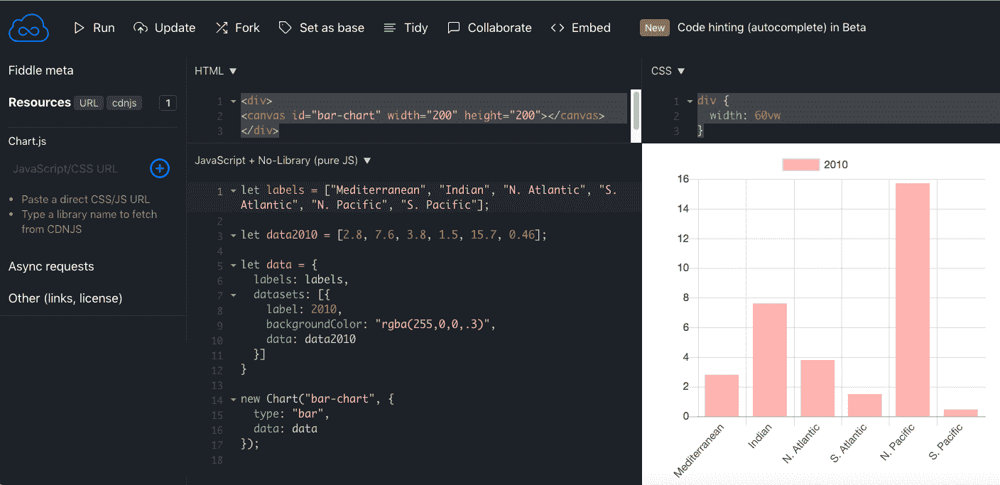

使用 *JSFiddle* (*jsfiddle.net*) 作为在线代码编辑器

要在 *CodePen* ([`codepen.io/`](https://codepen.io/)) 中配置 Chart.js，请点击设置菜单，然后点击 JavaScript 选项卡。搜索 Chart.js，并点击第一个选项将 CDN 添加到你的环境中，如下面的截图所示：

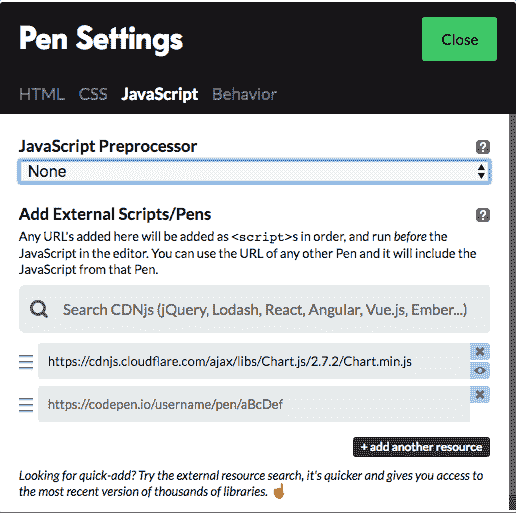

将 Chart.js 支持添加到 *CodePen* (*codepen.io*)

你现在可以使用 Chart.js 库并实时查看结果，如下面的截图所示：

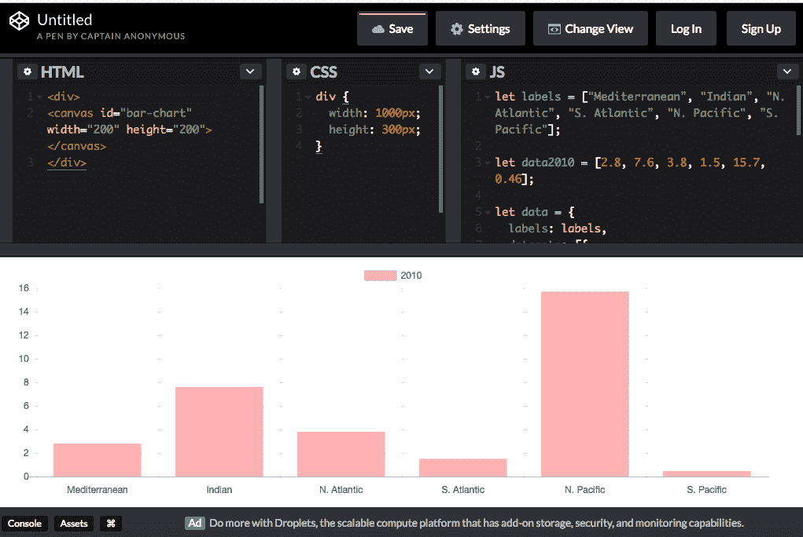

使用 CodePen (codepen.io) 作为在线代码编辑器

# 创建一个简单的柱状图

现在你已经设置好了工作环境，让我们开始创建一个简单的柱状图。你可以边走边输入代码，也可以从 GitHub 仓库下载本章的完整工作示例。本书中的每个截图和代码列表都包含用于生成它的文件引用。

# 设置图形上下文

图表是在由 HTML Canvas 对象提供的图形上下文中显示的。创建一个图表有很多方法；最简单的方法是使用纯 HTML。在 `<body>` 内部的某个位置放置一个 `<canvas>` 元素。它应该有一个 `ID` 属性，如下所示：

```js
<canvas id="my-bar-chart" width="200" height="200"></canvas>
```

Chart.js 图形默认是响应式的。图表将适应可用空间：`height` 和 `width` 属性不会影响图表的实际大小（除非你更改默认值）。

你可以使用 DOM（或 JQuery）在任何由你的 HTML 文件加载的脚本块或文件中获取 `canvas` 对象的 JavaScript 处理器，如下面的代码片段所示（在本书的大多数 JavaScript 列表中，脚本块将被忽略）：

```js
<script>
    const canvas = document.getElementById("my-bar-chart");
</script>
```

你还可以使用 **文档对象模型** (**DOM**) 或 JQuery 动态创建一个 `<canvas>` 对象。在这种情况下，`ID` 属性不是严格必要的，因为变量本身可以用作处理器的引用，但定义一个属性是良好的实践，如下所示：

```js
canvas canvas = document.createElement("canvas");
canvas.setAttribute("id","my-bar-chart");
document.body.appendChild(canvas);
```

使用 `Chart()` 构造函数创建图表。它接收两个参数：图表将要显示的画布的图形 *上下文*，以及包含图表数据的 *对象*，如下面的代码所示：

```js
const chartObj = {…}; // the chart data is here
const context = canvas.getContext("2d");
new Chart(context, chartObj); // this will display the chart in the canvas
```

如果你的 `canvas` 对象已经声明了 `ID` 属性，你不需要 `context` 对象。你可以直接使用 `ID` 属性作为第一个参数，如下所示：

```js
new Chart("my-bar-chart", chartObj);
```

包含图表数据的对象至少需要两个属性：`type`，它选择 Chart.js 的八种不同类型的图表之一；以及 `data`，它引用一个包含数据集和要显示的数据属性的对象的引用，如下所示：

```js
const chartObj = {type: "bar", data: dataObj};
```

通常，图表对象是在构造函数内部配置的，如下所示：

```js
new Chart("my-bar-chart", {type: "bar", data: dataObj});
```

这是使用 Chart.js 创建的任何图表的基本设置。它目前不会显示任何图表，因为我们没有提供任何数据，但如果你的库正确加载，你应该看到一个空轴。代码位于 `Templates/BasicTemplate.html` 文件中。

如果你的屏幕上没有显示任何内容，那么你的代码中可能存在语法错误。检查浏览器中的 JavaScript 控制台。当你使用 JavaScript 时，始终打开它是好主意，这样错误可以快速检测和修复。

# 创建柱状图

柱状图显示与值相关联的分类列表，这些值由柱子的长度表示。要创建一个简单的柱状图，我们需要一个 *分类* 列表以及一个 *值* 列表。

让我们创建一个简单的图表来显示每个海洋的水量。我们需要一个分类数组，如下所示：

```js
const labels = ["Arctic", "North Atlantic", "South Atlantic",
                "Indian", "North Pacific", "South Pacific",
                "Southern"];
```

此外，我们还需要一个相应的值数组，如下所示：

```js
const volumes = [18750,146000,160000,264000,341000,329000,71800]; // 10³ km3
```

`data` 对象应该包含一个 `labels` 属性，它将引用 `categories` 数组，以及一个 `datasets` 属性，它包含一个至少有一个 `dataset` 对象的数组。每个 `dataset` 对象都有一个 `label` 属性和一个 `data` 属性，它将接收我们图表（`volumes` 数组）的数据，如下所示：

```js
const dataObj = {
     labels: labels,
     datasets: [
         {
             label: "Volume",
             data: volumes
         }
     ]
}
```

图表已经预配置了刻度、轴、默认颜色、字体、动画和工具提示。将前述代码中的 `dataObj` 对象作为图表对象（`chartObj`）的 `data` 属性，你将得到一个交互式且响应式的柱状图，类似于以下所示：

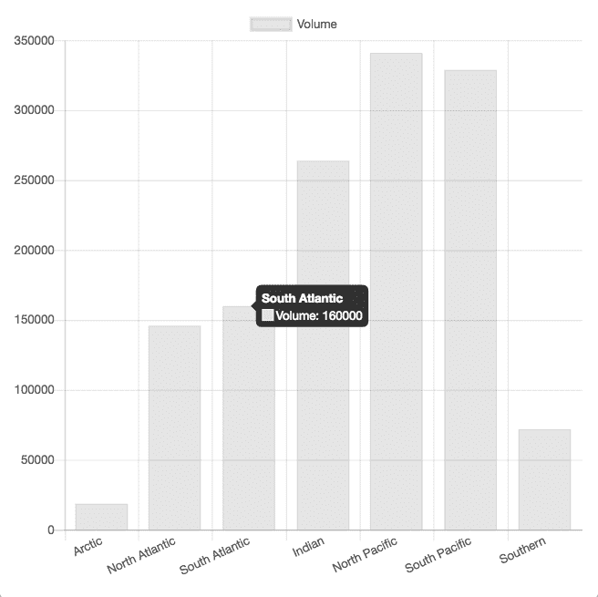

一个简单的柱状图（代码：*Pages/BarChart1.html)*

尝试调整窗口大小，看看标签和刻度如何适应新的显示。将鼠标移到柱子上，看看工具提示如何显示图表信息。单击 `dataset` 标签并切换其可见性。在以下章节中，我们将配置一些其外观和行为。

完整的列表如下所示：

```js
 <!DOCTYPE html>
 <html lang="en">
 <head>
 <script src="img/Chart.min.js">
 </script>
 </head>
 <body>
 <canvas id="ocean-volume-bar-chart" width="400" height="400"></canvas>
 <script>
   const labels = ["Arctic", "North Atlantic", "South Atlantic",
                   "Indian", "North Pacific", "South Pacific", "Southern"];
   const volumes = [18750,146000,160000,264000,341000,329000,71800];

   const dataObj = {
       labels: labels,
       datasets: [
           {
               label: "Volume",
               data: volumes
           }
       ]
   }
   new Chart("ocean-volume-bar-chart", {type: "bar", data: dataObj});
  </script>
 </body>
 </html>
```

尝试在你的开发环境中输入前述代码，或者从 `Pages/BarChart1.html` 下载它。

# 配置颜色、字体和响应性

使用 Chart.js 创建的图表天生具有响应性，并且很好地适应屏幕，但它们也是天生的灰色。在本节中，你将了解如何更改一些样式属性。

# 柱状图的 `dataset` 配置

除了`data`和`label`属性外，每个数据集对象还可以包含许多可选配置属性。它们大多数用于配置填充和边框颜色和宽度。以下表格中简要描述了它们：

| **属性** | **值** | **描述** |
| --- | --- | --- |
| `data` | `Number[]` | 包含要显示的数据的数字数组（这是必需的） |
| `label` | `String` | 数据集的标签 |
| `backgroundColor` | `String` 或 `String[]` | 条形的填充颜色 |
| `borderColor` | `String` 或 `String[]` | 边框的颜色 |
| `borderWidth` | `Number` 或 `Number[]` | 边框的宽度 |
| `hoverBackgroundColor` | `String` 或 `String[]` | 鼠标悬停在条形上时的填充颜色 |
| `hoverBorderColor` | `String` 或 `String[]` | 鼠标悬停在条形上时的边框颜色 |
| `hoverBorderWidth` | `Number` 或 `Number[]` | 鼠标悬停在条形上时的边框宽度 |
| `borderSkipped` | `bottom`, `left`, `top`, `right` | 选择条形没有边框的边缘（默认为`bar`的`bottom`，`horizontalBar`的`left`） |
| `yAxisID` 和 `xAxisID` | 轴 ID（见第五章，*刻度和网格配置*） | 用于轴配置 |

条形图的数据集属性

您可以通过在每个`dataset`对象中添加颜色属性或通过配置影响所有图表的全局默认值来更改灰色条形。`backgroundColor`属性接收一个包含以合法 CSS 格式指定的颜色的字符串。例如，如果您想有实心的红色条形，可以使用以下格式：

+   `red`

+   `rgb(255,0,0)`

+   `rgba(100%,0,0,1)`

+   `#ff0000`, `#f00`

+   `hsl(0,100%,50%)`

+   `hsla(0,100%,50%,1)`

`borderColor`属性控制标签图标的颜色。如果指定了大于零的`borderWidth`值，它还会配置条形的颜色，如下所示：

```js
 const dataObj = {
     labels: labels,
     datasets: [
         {
             label: "Volume",
             data: volumes,
             borderWidth: 2,
             backgroundColor: "hsla(20,100%,80%,0.8)",
             borderColor: "hsla(0,100%,50%,1)"
         }
     ]
 }
 new Chart("ocean-volume-bar-chart", {type: "bar", data: dataObj});
```

上述代码应产生以下所示的结果。完整代码可在`Pages/BarChart2.html`中找到：

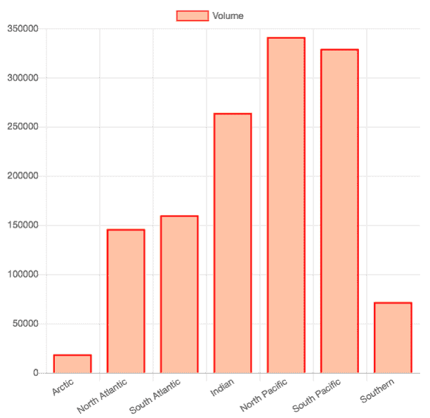

将颜色属性应用于条形图（代码：*Pages/BarChart2.html)*

# 选项配置

默认值是按图表配置的，包含在`chart`对象中的选项配置对象（构造函数的第二个参数），如下面的代码块所示：

```js
new Chart("ocean-volume-bar-chart",
        {
            type: "bar",
            data: dataObj,
            options: {} // configure options here
        });
```

您可以更改许多默认值。例如，您可能希望对图表的大小有更多的控制，图表会自动调整大小。这是因为图表默认是响应式的。您可以通过覆盖`responsive`属性来关闭响应式，该属性的默认值为`true`，如下所示：

```js
options: {
    responsive: false
}
```

现在，您的图表不再自动调整大小。但是，如果您想进行调整大小，但不关心纵横比怎么办？那么，您可以覆盖`maintainAspectRatio`属性，如下所示：

```js
options: {
    maintainAspectRatio: false
}
```

如果您的`canvas`对象位于一个控制其大小并使用 CSS 配置的父`<div>`容器内，您可能希望这样做。在以下代码（`Pages/BarChart4.html`）中，画布将占据其父容器大小的`80%`，如下所示：

```js
<style>
    #canvas-container {
        position: relative;
        height: 80%;
        width: 80%;
    }
</style>
<div id="canvas-container">
  <canvas id="ocean-volume-bar-chart" width="200" height="200"></canvas>
</div>
```

如果您尝试调整图表大小，默认情况下，它将保持其宽高比（并且不再适应页面），除非将`maintainAspectRatio`属性设置为`false`，如下所示：

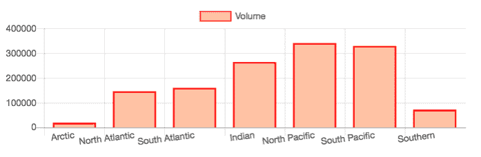

配置图表的宽高比以使其适应画布（代码：*Pages/BarChart4.html*）

# 文本和字体

文本可以包含在许多不同的对象中。每个数据对象可以有一个类别列表，每个数据集可以有一个图例，图表可以有一个标题，并且工具提示可以包含标题和其他信息。某些文本默认是可见或不可见的。您可以为图表内的任何文本配置可见性、字体家族、字体大小和颜色。

字体可以全局应用（对所有图表）使用默认配置。使用`options`配置对象，它们可以局部应用于标题和图例，这些也被配置为对象。

在我们的图表中，我们有一个数据集，这使得图例变得多余。您可以通过将`legend.display`属性更改为`false`来隐藏它，如下所示：

```js
options: { // configure options here
    ...
    legend: {
        display: false
    }
}
```

我们还可以为图表添加标题并配置其字体大小、颜色和家族，如下所示：

```js
options: { // configure options here
     maintainAspectRatio: false,
     legend: {
         display: false
     },
     title: {
         display: true,
         text: ['Volume of the oceans','in thousands of cubic km'],
         fontFamily: "TrebuchetMS",
         fontSize: 24,
         fontColor: 'rgb(0,120,0)',
     }
 }
```

仅将标题添加到`text`属性是不够的。由于`display`属性默认为`false`，您必须显式将其定义为`true`，以便标题显示。这些更改后，您的图表应类似于以下所示：

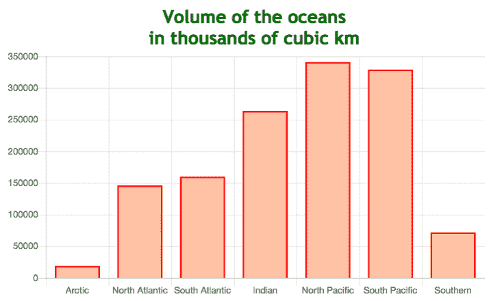

添加标题并定义字体属性（代码：*Pages/BarChart5.html*）

您可以配置图表中所有文本的样式，包括单个工具提示标题和正文、刻度、主刻度和副刻度，正如我们将在以下章节中看到的。

# 全局默认值

本地配置选项会覆盖全局默认配置，这些配置可以使用`Chart.defaults.global`对象进行配置。您可以为字体、颜色、坐标轴、网格线、刻度、动画、工具提示和元素属性进行配置，无论是全局（对所有图表）还是本地（对特定图表）。

要指定全局字体家族，您可以使用以下代码：

```js
Chart.defaults.global.defaultFontFamily = "Helvetica Neue";
```

这将影响图表中的所有文本。您还可以通过更改属性（如`Chart.defaults.global.legend`、`Chart.defaults.global.title`等）为特定的文本元素定义默认值，如下所示：

```js
Chart.defaults.global.legend.fontSize = 10; // all legend text will be size 10
```

图表中使用的默认颜色是`rgba(0,0,0,0.1)（浅灰色）`。您可以使用`Chart.defaults.global.defaultColor`来更改此颜色。

全局属性非常适合包含在单独的`.js`文件中，这样您的图表就具有一致的外观和字段。您也可能更喜欢在只有一个图表的情况下也使用它们。

以下表格列出了可以应用于局部或全局的条形图特定配置。全局条形图设置存储在`Chart.defaults.bar`和`Charts.defaults.horizontalBar`中。局部设置应存储在`options`对象下的`scales.xAxes[]`或`scales.yAxes[]`中，分别对应垂直和水平条形图。尝试在您的图表中使用其中一些，并查看您得到的结果：

| **属性** | **值** | **描述** |
| --- | --- | --- |
| `barPercentage` | `Number` | 条形（每个数据集）宽度占类别（所有数据集）宽度的百分比。默认值为`0.9`。 |
| `categoryPercentage` | 类别宽度占样本宽度的百分比。默认值为`0.8`。 |
| `barThickness` | 这将手动设置条形宽度（忽略`categoryPercentage`和`barPercentage`）。 |
| `maxBarThickness` | 这将条形厚度限制为此数值。 |

图表的选项配置属性

# 过渡、交互和工具提示

所有图表也都自带基本过渡、动画和交互式工具提示。对于简单的图表，您可能不需要更改任何内容；但如果您想要更多控制，可以使用局部和全局属性来配置这些行为。

# 过渡持续时间

您可以创建在用户交互时改变外观的图表。它们将自动优雅且平滑地过渡到新值。过渡动画使用默认的简单算法和持续时间配置，但您可以通过编辑`Chart.defaults.global.animation`对象的属性来更改它们，或者通过使用`options.animation`对象在本地覆盖任何默认设置。

例如，在以下图表代码中，所有过渡持续五秒钟（`Pages/BarChart6.html`）：

```js
new Chart("ocean-volume-bar-chart", {
    type: "bar",
    data: {...},
    options: {
        …
        animation: {
            duration: 5000
        }
    }
});
```

# 更新图表

您可以使用 JavaScript 函数和库动态更改数据，但这些更改不会立即反映在您的图表中。更改数据后，您必须调用`update()`以重新绘制它。为此，您需要一个对`chart`对象的变量引用，如下所示：

```js
const ch = new Chart("ocean-volume-bar-chart", {...});
```

以下示例切换图表中的数据，用不同的数组替换数据集中的值，并更改标签、标题和颜色。`toggle()`函数被注册为画布上的点击事件监听器。无论何时在画布上点击，它都会运行，更改几个属性的值，并调用`update()`，这将强制图表过渡到新的数据和外观，如下所示：

```js
const labels = ["Arctic", "North Atlantic", "South Atlantic", "Indian",
                "North Pacific", "South Pacific", "Southern"];

 const area   = [15558,41900,40270,70560,84000,84750,21960];   // km2 * 10³
 const volume = [18750,146000,160000,264000,341000,329000,71800];      //km3 * 10³
 const canvas = document.getElementById("ocean-volume-bar-chart");
 const ctx = canvas.getContext("2d");
 const ch = new Chart(ctx, {
     type: "bar",
     data: {
         labels: labels,
         datasets: [
             {
                 label: "Volume",
                 data: volume,
                 borderWidth: 2,
                 backgroundColor: "hsla(20,100%,80%,0.8)",
                 borderColor: "hsla(0,100%,50%,1)"
             }
         ]
     },
     options: {
         maintainAspectRatio: false,
         title: {
             display: true,
             text: ['Volume of the oceans','in thousands of cubic km'],
             fontFamily: "TrebuchetMS",
             fontSize: 24
         },
         legend: {
             display: false
         }
     }
 });

 canvas.addEventListener("click", toggle);

 function toggle(event) {
     if(ch.data.datasets[0].label == "Volume") {
         ch.data.datasets[0].data = area;
         ch.data.datasets[0].label = "Area";
         ch.data.datasets[0].borderColor = "hsla(120,100%,50%,1)";
         ch.data.datasets[0].backgroundColor = "hsla(140,100%,80%,0.8)";
         ch.options.title.text = ['Surface area of the oceans',
                                  'in thousands of square km'];
     } else {
         ch.data.datasets[0].data = volume;
         ch.data.datasets[0].label = "Volume";
         ch.data.datasets[0].backgroundColor = "hsla(20,100%,80%,0.8)";
         ch.data.datasets[0].borderColor = "hsla(0,100%,50%,1)";
         ch.options.title.text = ['Volume of the oceans',
                                  'in thousands of cubic km'];
     }
     ch.update();
 }
```

以下截图显示了点击前后相同的图表。完整代码可在`Pages/BarChart7.html`找到：

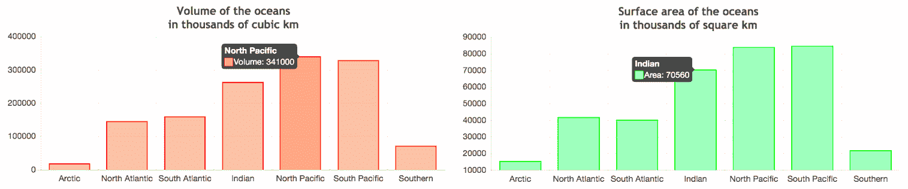

点击前后相同图表的截图。代码：*Pages/BarChart7.html*

# 工具提示

动画持续时间不影响工具提示，它们有自己的配置。除了动画之外，你还可以在工具提示中配置颜色、字体、间距、形状和行为。你还可以声明回调函数，在每个交互时改变外观和内容。如果你需要向工具提示添加更多信息，Chart.js 允许你创建包含图像和文本的复杂 HTML 工具提示。

例如，以下配置创建包含默认标题颜色的黑色工具提示。工具提示配置选项包含设置文本颜色的回调，使其与条形图的颜色相匹配，如下所示：

```js
options: {
     …
     title: {…},
     legend: {…},
     animation: {…},
     tooltips: {
       backgroundColor: 'rgba(200,200,255,.9)',
       titleFontColor: 'black',
       caretSize: 5,
       callbacks: {
           labelColor: function(tooltipItem, chart) {
              return {
                  borderColor: 'black',
                  backgroundColor: 
                  chart.data.datasets[0].backgroundColor
              }
           },
           labelTextColor:function(tooltipItem, chart){
              return chart.data.datasets[0].borderColor;
           }
        }
     }
 }
```

你可以在`Pages/BarChart8.html`文件中运行前面的代码。

# 与更大的多个数据集一起工作

到目前为止我们所看到的，你应该已经能够创建一个简单的条形图。在本节中，我们将探讨一些与大型数据集相关的配置选项，你可能会将其作为外部文件加载，以及多个数据集，这些数据集可以绘制在同一张图表上。

# 加载数据

许多时候，你的数据将在线上可用，你可能希望动态地加载它。将数据和代码保存在不同的文件中也是一个好主意。如果你有一个 CSV 文件中的数据，你可以将其加载到 JavaScript 代码中，并使用它来生成图表。

JavaScript 使用 Ajax 异步加载数据。你可以使用标准的 Ajax、JQuery 或 ES6 fetch 函数，它像一个 JavaScript 承诺一样工作。在加载 CSV 文件后，你需要解析它。如果你只需要一组类别标签和值，你可以不使用解析器来处理。

在这个例子中，我们将使用一个包含 20 个最大污染者在海洋中处置的塑料废物量的 CSV 文件。你可以在本章的 GitHub 仓库中找到以下代码`Data/waste.csv`：

```js
 Country,Tonnes
 China,8819717
 Indonesia,3216856
 Philippines,1883659
 ...
 United States,275424
```

以下代码加载并解析文件，将数据拆分为行，然后通过逗号拆分每一行来组装一个`labels`数组和`values`数组（我们也可以使用 CSV 解析器）。这个过程将数据转换成可以由 Chart.js 使用的数组格式，如下所示：

```js
fetch('../Data/waste.csv')
  .then(response => response.text())
  .then((data) => {
    const labels = [],
          values = [];
    const rows = data.split("\n");

    rows.forEach(r => {
        const item = r.split(",");
        labels.push(item[0]);
        values.push(+item[1]);
    });

    labels.shift(); // remove the header
    values.shift(); // remove the header

    console.log(labels); // print to check if the arrays
    console.log(values); // were generated correctly

    draw(labels, values);

 });
```

`draw()`函数包含设置画布、创建和显示条形图的代码，如下所示：

```js
function draw(labels, values) {
   const canvas = document.getElementById("bar-chart");
   const ctx = canvas.getContext("2d");

   new Chart(ctx, {
       type: "bar",
       data: {
           labels: labels, // the labels
           datasets: [
               {
                   label: "Tonnes of plastic",
                   data: values, // the data values
                   borderWidth: 2,
                   backgroundColor: "hsla(20,100%,80%,0.8)",
                   borderColor: "hsla(0,100%,50%,1)"
               }
             ]
         },
         options: {
             maintainAspectRatio: false,
             title: {
                 display: true,
                 text: 'Tonnes of plastic waste',
                 fontSize: 16
             },
             legend: {
                 display: false
             }
         }
     });
 }
```

你可以在`Pages/BarChart9.html`中查看完整的代码。结果如下所示：

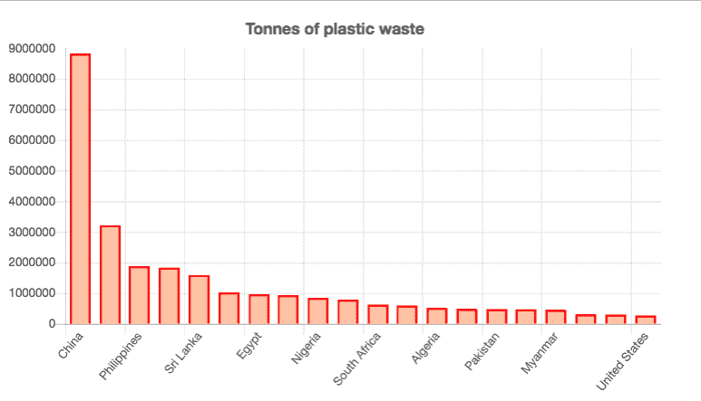

使用从外部文件加载数据创建的条形图（代码：*Pages/BarChart9.html)*

# 水平条形图

当你需要显示和比较大量数据时，水平条形图可能更适合。你可以通过将`type`更改为`horizontalBar`轻松地将垂直条形图转换为水平条形图，如下所示：

```js
new Chart(ctx, {
    type: "horizontalBar",
    data: {…}
}
```

前面的图表似乎更适合作为水平图表，因为类别标签不需要侧转。你可以在`Pages/BarChart10.html`中看到完整的代码。以下截图显示了图表现在的样子：

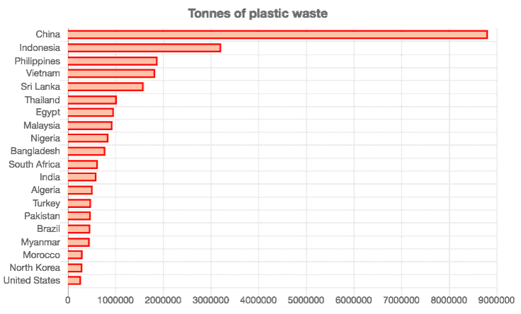

水平条形图（代码：*Pages/BarChart10.html*）

# 添加额外数据集

你可以向条形图中添加更多数据集，并使用新的图例标签、颜色和数据数组进行配置。以下示例将加载一个较大的 `.csv` 文件，其中包含 `2010` 年塑料废物处理的数据和 `2025` 年的预测。它有一个额外的列，如下所示：

```js
 Country,2010,2025
 China,8819717,17814777
 Indonesia,3216856,7415202
 Philippines,1883659,5088394
 ...
 United States,275424,336819
```

这次，代码将生成两个 `data` 数组和单个 `labels` 数组。属于同一类别的数据和标签具有相同的索引，如下所示：

```js
fetch('../Data/waste2.csv')
 .then(response => response.text())
 .then((data) => {
   const labels = [],
         values2010 = [],
         values2025 = [];

   const rows = data.split("\n");

   rows.forEach(r => {
       const item = r.split(",");
       labels.push(item[0]);
       values2010.push(+item[1]/1000000); // divide by 1 million to make
       values2025.push(+item[2]/1000000); // the chart easier to read
    });

    labels.shift();
    values2010.shift();
    values2025.shift();

    draw(labels, [values2010, values2025]);

 });
```

新的值将包含在第二个数据集中，在 `datasets` 数组中，如下所示。

```js
function draw(labels, values) {
    const canvas = document.getElementById("bar-chart");
    const ctx = canvas.getContext("2d");

    new Chart(ctx, {
        type: "horizontalBar",
        data: {
            labels: labels,
            datasets: [
                {  
                    label: "2010",
                    data: values[0],
                    backgroundColor: "hsla(20,100%,50%,0.7)",
                },{
                    label: "2025",
                    data: values[1],
                    backgroundColor: "hsla(260,100%,50%,0.7)",
                }
            ]
        },
        options: {
            maintainAspectRatio: false,
            title: {
                display: true,
                text: 'Millions of tonnes of plastic waste',
                fontSize: 16
            }
        }
    });
 }
```

完整的代码位于 `Pages/BarChart12.html`。使用两个数据集，每个类别都有两个条形。每个数据集还有一个图例项。结果如下所示：

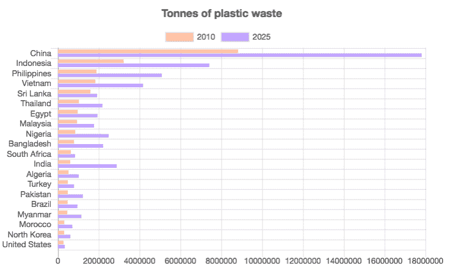

包含两个数据集的条形图（代码：*Pages/BarChart12.html*）

使用两个或更多数据集时，你可能希望使用配置选项属性 `barPercentage` 和 `categoryPercentage` 来配置条形的宽度。前者控制每个类别的单个条形的宽度，后者确定一个类别中所有条形所占的空间。这些属性应该在 `options.scales.xAxes[]` 中定义，如果你使用的是条形图，如果是 `horizontalBar`（见 `Pages/BarChart12.html`），则应在 `options.scales.yAxes[]` 中定义，如下所示：

```js
options: {
    maintainAspectRatio: false,
    title: {
        display: true,
        text: 'Tonnes of plastic waste',
        fontSize: 16
     },
     scales: {
         yAxes: [{
             barPercentage: .3,
             categoryPercentage: .5
         }]
     }
 }
```

# 堆叠条形图

条形通常并排放置以进行比较。然而，如果值是整体的一部分，你可以将不同数据集中的条形堆叠起来以强调这种关系。我们可以堆叠世界海洋的体积，因为它们的总和揭示了世界上海洋水的总体积。以下数据对象将每个海洋的体积放置在单独的数据集中，如下所示：

```js
const dataObj = {
    labels: ["Volume"], // there is only one category
    datasets: [
        {
            label: "Arctic", data: [18750],
            backgroundColor: "hsla(0,100%,50%,0.5)"
        },{
            label: "North Atlantic", data: [146000],
            backgroundColor: "hsla(60,100%,50%,0.5)"
        },{
            label: "South Atlantic", data: [160000],
            backgroundColor: "hsla(120,100%,50%,0.5)"
        },{
            label: "Indian", data: [264000],
            backgroundColor: "hsla(180,100%,50%,0.5)"
        },{
            label: "North Pacific", data: [341000],
            backgroundColor: "hsla(240,100%,50%,0.5)"
        },{
            label: "South Pacific", data: [329000],
            backgroundColor: "hsla(300,100%,50%,0.5)"
        },{
            label: "Southern", data: [71800],
            backgroundColor: "hsla(340,100%,50%,0.5)"
        },
    ]
 };
```

要将条形图转换为堆叠图，你必须配置 *x* 和 *y* 轴的设置，并启用堆叠属性，如下所示：

```js
 const optionsObj = {
    maintainAspectRatio: false,
     title: {
         display: true,
         text: 'Volume of oceans (km3)',
         fontSize: 16
     },
     legend: {
         position: 'right'
     },
     scales: {
         xAxes: [{
             stacked: true
         }],
         yAxes: [{
             stacked: true
         }]
     }
 }
 new Chart("ocean-volume-bar-chart",
           {type: "bar", data: dataObj, options: optionsObj});
```

预期的结果如下所示。完整的代码位于 `Pages/BarChart13.html`：

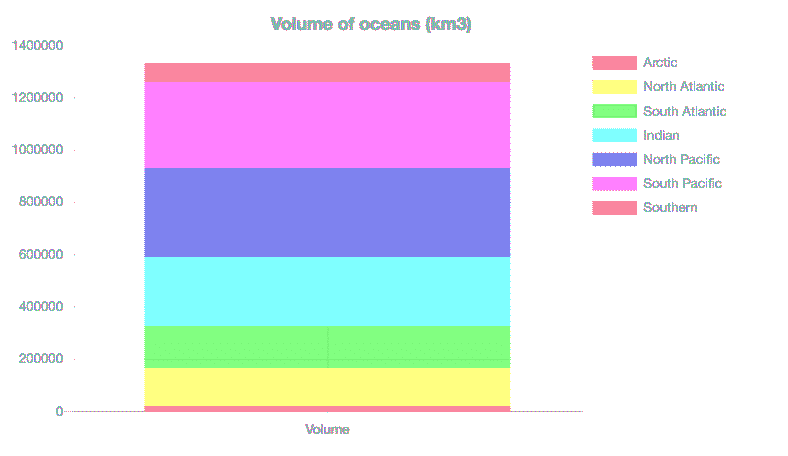

可以使用堆叠条形图来显示数据作为整体的一部分（代码：*Pages/BarChart13.html*）

# 摘要

在本章中，我们学习了如何在 Web 应用程序中安装 Chart.js 以及如何快速创建一个简单、交互式且响应式的条形图，并将其包含在网页中。我们还学习了如何通过更改基本属性，如颜色、字体、响应性、动画持续时间和工具提示来配置图表的默认外观和感觉。有了这些知识，你就可以开始使用 Chart.js 在你的网页中显示简单的数据可视化。

本章还探讨了某些现实世界的问题，例如加载外部文件，以及如何通过过滤数据和配置图表来处理更大的数据集，以便更有效地显示信息。

在接下来的章节中，我们将更详细地探讨 Chart.js，创建所有八种不同的图表类型，学习如何配置其他几个属性，并处理更复杂的数据集。

# 参考文献

**书籍和网站**:

+   Chart.js 官方文档和示例：[`www.chartjs.org/docs/latest/`](https://www.chartjs.org/docs/latest/)

**数据来源**:

+   世界海洋的体积（基于 ETOPO1）：`Chapter03/Pages/BarChart1.html`以及其他。[`www.ngdc.noaa.gov/mgg/global/etopo1_ocean_volumes.html`](https://www.ngdc.noaa.gov/mgg/global/etopo1_ocean_volumes.html)

+   塑料垃圾：`Chapter03/Data/waste.csv`。Jambeck 等人发表的《塑料垃圾从陆地进入海洋的输入》。科学杂志，2015 年 2 月 13 日
