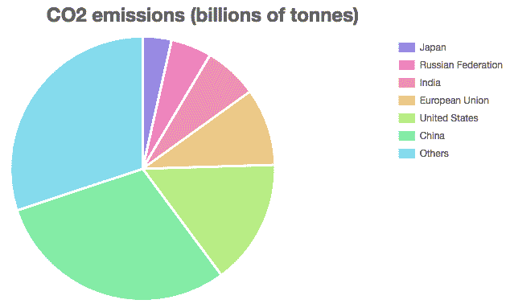

# 创建图表

本章介绍了使用 Chart.js 创建的几个图表，这些图表可以有效地传达定量信息和关系。图表的选择取决于数据的类型，每一组值之间的关系，以及你想要展示的关系类型。在前一章中，我们学习了如何高效地在柱状图中展示数据，并比较不同类别相关的定量信息。在本章中，你将创建折线图和雷达图来比较一维数据的序列，饼图和环形图来比较比例，散点图和气泡图来表示两个或更多维度，以及极坐标图来在径向网格中显示定量数据。

在本章中，你将了解以下主题：

+   折线和面积图

+   雷达图和极坐标图

+   饼图和环形图

+   散点图和气泡图

# 折线和面积图

折线图用于显示两组数据之间的相关性，其中一组应包含分类或有序数据（升序或降序）。折线图最常见应用是时间序列，其中有序集由时间点组成。如果使用任意类别，应能够与它们建立某种类型的连接序列（例如，步骤的有序序列）。

折线图显示估计值。将数据集相关联的点通过代表估计值的直线或曲线连接起来。折线图可以用来预测中间值并揭示趋势。

# 创建简单的折线图

就像柱状图一样，你需要加载 Chart.js JavaScript 库，在页面的 `<body>` 中放置一个 `<canvas>` 对象，并创建一个新的图表，引用画布的 ID 和包含图表数据的对象。`chart` 对象应指定 `line` 作为图表类型。以下代码是创建折线图所需的最小代码，使用 Chart.js 提供的全局默认值：

```js
<html>
 <head>
     <script src="img/Chart.min.js"></script>
 </head>
 <body>

 <canvas id="my-line-chart" width="400" height="200"></canvas>

 <script>
     const values =
       [1.17,1.35,1.3,1.09,0.93,0.76,0.83,0.98,0.87,0.89,0.93,0.81];
     const labels =

["Jan","Feb","Mar","Apr","May","Jun","Jul","Aug","Sep","Oct","Nov","Dec"];

     const dataObj = {
         labels: labels,
         datasets: [{ data: values }]
     }
     const chartObj = {
         type: "line",
         data: dataObj
     };
     new Chart("my-line-chart", chartObj);
 </script>
 </body></html>
```

这份数据包含来自 NASA 的 2016 年全球平均温度，结果如下所示。正如你所见，默认的折线图有灰色线条和灰色填充。你可以使用 *options* 或 *dataset* 配置来更改这些默认值。完整代码在 `LineArea/line-1.html`：


简单的折线图，显示默认的 Chart.js 属性，2016 年全球平均温度（代码：*LineArea/line-1.html)*

# 数据集配置

可以应用特定于数据集的选项来控制属性，例如每条线的颜色和宽度。向数据集添加 `borderColor` 属性将设置线的颜色（以及图例框），如下所示：

```js
let dataObj = {
     labels: labels,
     datasets: [{
         data: values,
         borderColor: 'hsla(300,100%,50%,1)'
         backgroundColor: 'transparent';
     }]
 }
```

以下图表显示了为数据集设置 `borderColor` 和 `backgroundColor` 的效果。此配置仅影响一个数据集。您还可以配置影响所有数据集的属性。在此示例中，图例也通过选项配置（在单独的部分中解释）被移除。您可以在 `LineArea/line-2.html` 中查看完整的代码，如下面的截图所示：


简单的折线图，展示了 2016 年测量的平均全球温度（代码：*LineArea/line-2.html)*

以下列出的数据集属性可以用于 `datasets` 数组中的每个对象。许多属性也与其他显示数值数据的图表共享，例如雷达图、散点图和气泡图：

| **属性** | **值** | **描述** |
| --- | --- | --- |
| `data` | `Number[]` | 包含要显示的数据的数字数组（必填）。 |
| `label` | `String` | 数据集的标签（出现在图例和工具提示中）。 |
| `backgroundColor` | CSS 颜色属性值字符串 | 在线（或上方）下的填充颜色。位置取决于 `fill` 属性。 |
| `borderColor` | CSS 颜色属性值字符串 | 线的颜色。 |
| `borderWidth` | `Number` | 线的像素宽度。 |
| `borderDash` | `Number[]` | 画布 `setLineDash` 方法。描述交替线宽和空间的数组。例如，`[5, 10]` 将创建一个具有 5 像素划线和 10 像素空间的虚线。 |
| `borderDashOffset` | `Number` | 画布 `lineDashOffset` 属性。线段的偏移量。如果为零（默认），则 `[10,10]` 划线将从 `10` 像素线开始。如果 `10`，它将从 `10` 像素空间开始。如果 `5`，它将从 `5` 像素线开始，然后是 `10` 像素空间，`10` 像素线，以此类推。 |
| `borderJoinStyle` | `'bevel'`，`'round'`，或 `'miter'`（默认） | 画布 `lineJoin` 属性。 |
| `borderCapStyle` | `'butt'`（默认），`'round'`，或 `'square'` | 画布 `lineCap` 属性。 |
| `pointBackgroundColor` | `Color` 或 `Color[]` | 点的背景颜色。 |
| `pointBorderColor` | `Color` 或 `Color[]` | 点的边框颜色。 |
| `pointBorderWidth` | `Number` 或 `Number[]` | 点的边框宽度。 |
| `pointRadius` | `String` 或 `String[]` | 点的半径。 |
| `pointStyle` | `circle`（默认），`cross`，`line`，`crossRot`，`dash`，`rectRounded`，`rectRot`，`star`，或 `triangle` | 点的样式。一个字符串或指向 `Image` 对象的 DOM 引用。 |
| `pointHoverBackgroundColor` | `Color` 或 `Color[]` | 鼠标悬停时点的背景颜色。 |
| `pointHoverBorderColor` | `Color` 或 `Color[]` | 鼠标悬停时点的边框颜色。 |
| `pointHoverBorderWidth` | `Number` 或 `Number[]` | 鼠标悬停时点的宽度。 |
| `pointHoverRadius` | `Number` 或 `Number[]` | 鼠标悬停时点的半径。 |
| `pointHitRadius` | `Number` 或 `Number[]` | 点的不可见半径，该点对鼠标悬停做出反应（以显示工具提示）。 |
| `cubicInterpolationMode` | `'default'` 或 `'monotone'` | 默认算法采用立方加权插值。它不保证单调性（因此，如果值增加或减少，默认算法可能会偏离此行为）。 |
| `lineTension` | `Number` | 立方贝塞尔线张力（这仅适用于默认插值模式）。如果为零，则图表将绘制直线。 |
| `fill` | `false`，`start`，`end`，`origin` 或数据集索引（相对或绝对） | 此属性描述了线条之间的空间填充方式。`false` 关闭此功能。`start` 填充线条上方或之前的空间，`end` 填充相反的空间，`origin` 填充到图表的原点，索引值填充两个数据集之间的空间。一个数字表示数据集的绝对索引。包含有符号数字的字符串（例如：`+2`）表示相对数据集（例如：前两个数据集）。 |
| `spanGaps` | `'bottom'`，`'left'`，`'top'` 或 `'right'` | 如果为 `false`，则空值或 *NaN*（非零）将导致线条中断。默认为 `false`。 |
| `showLine` | Boolean | 如果为 `false`，则不会显示此数据集的行（仅显示点）。 |
| `steppedLine` | `true` = `'before'`，`false`（默认），或 `'after'` | 以一系列步骤绘制线条。如果为 `true` 或 `before`，则使用初始点。如果为 `after`，则使用最终值。默认为 `false`，这将禁用此算法。 |
| `yAxisID` 和 `xAxisID` | 轴 ID（见 第七章* 高级 Chart.js*) | 这用于轴配置。 |

折线图的数据集属性

数据点代表数据集中的实际数据，并作为工具提示的锚点。可以通过 `pointStyle` 属性选择几种不同的数据点样式。如下所示：


可用于折线图的数据点样式（代码：*LineArea/line-3-pointStyle.html)*

数据点还可以配置半径、背景颜色、边框颜色和工具提示行为。在折线图中，只有点代表实际值。线条只是估计值。根据您显示的数据类型或要显示的点数，可能没有必要显示它们。您可能还想以不同的方式渲染它们。

有几个选项可以控制绘制线条的算法。`lineTension` 属性是一个数字（通常在 `0` 和 `0.5` 之间），它配置每条线的立方贝塞尔插值，在每两点之间绘制平滑曲线。如果将其设置为零，则图表将绘制直线，如下面的图例所示：


比较 lineTension 属性的不同值（代码：*LineArea/line-4-tension.html)*

如果您正在绘制离散值，可能更喜欢将线条绘制为 *阶梯状*。您可以通过选择 `steppedLine` 属性的 `before` 或 `after` 策略，根据线段的第一个或第二个点来放置阶梯。效果如下所示：


使用不同策略对 steppedLine 属性的影响（代码：LineArea/line-5-stepped.html）

# 折线图的选项配置

我们用于条形图的相同通用选项也可以用于配置折线图，但也有一些图表特定的选项。所有图表都预配置了默认值，可以使用本地或全局属性来覆盖这些默认值。移除使用线条的所有图表的阴影（而不是按数据集设置透明度）的一种方法是将线条元素的填充全局属性声明为 `false`，如下所示：

```js
Chart.defaults.global.elements.line.fill = false;
```

然而，您可以通过在选项配置对象中设置每个图表的属性来配置选项。我们改进了第一个折线图的渲染方式，移除了图例，因为只有一个数据集，所以不需要图例（见 `LineArea/line-2.html`），如下所示：

```js
let chartObj = {
     type: "line",
     data: dataObj,
     options:{
         legend: {
             display: false
         }
     }
 };
 new Chart("my-line-chart", chartObj);
```

通过将每个数据集的 `pointRadius` 设置为零，可以完全隐藏数据点。然而，您也可以通过设置 `Chart.defaults.global.elements.point.radius` 中属性的值来为所有数据集和图表全局配置它们。这将隐藏使用点的所有图表中的所有点，如下所示：

```js
Chart.defaults.global.elements.point.radius = 0;
```

如果您有很多点，可能不想绘制线条。要隐藏特定数据集的线条，可以将它的 `showLine` 属性设置为 `false`，但也可以使用以下列出的选项属性配置所有线条的绘制。

它们可以设置为当前图表的本地值或所有图表的全局值：

| **属性** | **值** | **描述** |
| --- | --- | --- |
| `showLines` | `true` 或 `false` | 如果此属性为 `false`，则不绘制点之间的线条。折线图的默认值为 `true`。散点图的默认值为 `false`。 |
| `spanGaps` | `true` 或 `false` | 如果此属性为 `false`，则 `null` 值或 `NaN`（非零）会导致线条中断。默认值为 `false`。 |

折线图的配置属性

使用 `Chart.defaults.line` 对象配置线元素的全球选项。要默认隐藏所有线条，请使用以下代码：

```js
Chart.defaults.line.showLines = false;
```

本地定义在 `options` 对象内部。您可以使用以下代码覆盖图表的默认值：

```js
options: { showLines: true }
```

# 包含多个数据集的折线图

每个数据集通过单独的线条在折线图中显示。以下示例向我们的图表添加了一组新的值，即 1880 年测量的平均月温度。现在我们可以将两个数据集绘制在同一个网格中，并比较它们与 2016 年的平均温度，如下所示：

```js
// NASA/GISS Temperature anomalies from 1880 to 2016
 let values2016 =
   [1.17,1.35,1.3,1.09,0.93,0.76,0.83,0.98,0.87,0.89,0.93,0.81];
 let values1880 =
   [-0.3,-0.21,-0.18,-0.27,-0.14,-0.29,-0.24,-0.08,-0.17,-0.16,-0.19,
   -0.22];
 Chart.defaults.global.elements.line.fill = false;

 let labels =
   ["Jan","Feb","Mar","Apr","May","Jun","Jul","Aug","Sep","Oct","Nov",
   "Dec"];

 let dataObj = {
     labels: labels,
     datasets: [{
         label: '2016',
         data: values2016,
         borderColor: 'hsla(300,100%,50%,1)',
         borderDash: [5, 5],
     },{
         label: '1880',
         data: values1880,
         borderColor: 'hsla(200,100%,50%,1)'
     }]
 }
// the rest of the code is identical
```

前面代码的结果显示在以下图表中。完整代码位于`LineArea/line-6-datasets.html`。该图表显示，2016 年的平均温度异常值比 1880 年的测量值高约 1°C：


包含两个数据集的折线图（代码：*LineArea/line-6-datasets.html*）

可以使用`fill`属性与布尔值一起使用来打开/关闭所有线条的阴影，但它也可以用作`dataset`属性来为单个数据集配置阴影策略。在这种情况下，它接收一个标识轴线的字符串：`'start'`、`'end'`或`'origin'`，这将使图表在线条和轴线之间（最小、最大或零轴线）着色。它也可以在线条之间着色，指定一个相对数字作为字符串：`'-1'`将在当前数据集和上一个数据集之间着色，`'+2'`将从当前数据集着色到`dataset`数组中高两个位置的数据集。您还可以引用`dataset`数组的绝对索引。以下图表比较了这些填充策略的一些效果：


折线图填充策略（代码：*LineArea/line-7-fill.html*）

# 从外部文件加载数据

折线图非常适合揭示大量数据中的趋势和关系。公共数据通常以 CSV 和 JSON 等标准格式广泛可用，但在使用之前通常需要降级、解析并转换为 Chart.js 期望的数据格式。在本节中，我们将从公共数据文件中提取数据并将其转换为揭示趋势的可视化。

对于所有使用外部文件的示例，您需要使用 Web 服务器打开您的文件。双击 HTML 文件并在浏览器中打开它不会起作用。如果您没有使用 Web 服务器运行文件，请参阅第二章中“技术基础”部分的*加载数据文件*部分，了解如何配置 Web 服务器进行测试。

之前示例中的温度数据是从 NASA **戈达德太空研究所**（**GISS**）网站（[data.giss.nasa.gov/gistemp](http://data.giss.nasa.gov/gistemp)）获取的 JSON 文件中提取的，该网站包含了 1880 年至 2016 年之间每年的月度测量数据。将所有月份的数据绘制在一张图表上将会非常有趣。我们可以通过加载文件并使用 JavaScript 提取所需的数据来实现这一点。

以下是从 GISS 网站 JSON 文件中提取的片段。它也可以在 GitHub 上本章的存储库中找到，位于`Data/monthly_json.json`：

```js
[
   {"Date": "2016-12-27", "Mean": 0.7895,  "Source": "GCAG"},
   {"Date": "2016-12-27", "Mean": 0.81, "Source": "GISTEMP"},
   {"Date": "2016-11-27", "Mean": 0.7504,  "Source": "GCAG"},
   {"Date": "2016-11-27", "Mean": 0.93, "Source": "GISTEMP"},
   {"Date": "2016-10-27", "Mean": 0.7292,  "Source": "GCAG"},
   {"Date": "2016-10-27", "Mean": 0.89, "Source": "GISTEMP"},
   /* ... many, many more lines ... */
   {"Date": "1880-02-27", "Mean": -0.1229,  "Source": "GCAG"},
   {"Date": "1880-02-27", "Mean": -0.21, "Source": "GISTEMP"},
   {"Date": "1880-01-27", "Mean": 0.0009,   "Source": "GCAG"},
   {"Date": "1880-01-27", "Mean": -0.3,  "Source": "GISTEMP"}
 ]
```

文件应该异步加载。你可以使用任何 Ajax 库来完成此操作（例如，JQuery）或使用所有现代浏览器都支持的标准的 ES2015 功能。在这本书中，我们将使用标准的 JavaScript `fetch()`命令（在 GitHub 仓库中，大多数示例也有 JQuery 替代方案）。

`fetch()`命令是响应式的。它将等待整个文件加载到内存中，然后才移动到第一个`then()`步骤，该步骤处理响应并提取 JSON 字符串（使用`text()`方法）。第二个`then()`步骤仅在所有内容都放置在字符串中，并在最终步骤中可用于解析之后才开始，如下所示：

```js
fetch('monthly_json.json') 
    .then(response => response.text())
    .then((json) => {
        const dataMap = new Map();
    ...
    });
```

在使用 JSON 文件（它是一个字符串）之前，我们需要解析它，使其成为一个 JavaScript 对象，然后我们可以使用点操作符读取单个字段。这可以通过标准的 JavaScript 命令`JSON.parse()`完成，如下所示：

```js
const obj = JSON.parse(json);
```

如果你使用`fetch()`而不是 JQuery 或其他库，你可能更喜欢使用一个加载并解析 JSON 的函数。在这种情况下，你不应该运行前面的命令。

数据包含两个测量值，分别标记为`GCAC`和`GISTEMP`。我们只需要其中一个，因此我们将仅过滤具有`GISTEMP`作为`Source`的对象。我们还将反转数组，以便较早的测量值在图表中首先出现。我们可以在一行中完成所有这些，如下所示：

```js
const obj = JSON.parse(json).reverse()
                            .filter(field => field.Source == 'GISTEMP');
console.log(obj);
```

最后一条将在你的浏览器 JavaScript 控制台中打印以下代码：

```js
 Array(1644)
  [0 ... 99]
 0:{Date: "1880-01-27", Mean: -0.3, Source: "GISTEMP"}
 1:{Date: "1880-02-27", Mean: -0.21, Source: "GISTEMP"}
 2:{Date: "1880-03-27", Mean: -0.18, Source: "GISTEMP"}
 3:{Date: "1880-04-27", Mean: -0.27, Source: "GISTEMP"}
 …
```

现在，选择我们需要的用于构建每年数据集的数据变得容易了。最好的方法是创建一个`Map`，存储每个值和月份，并使用年份作为检索键。将日期组件拆分以提取年份和月份，然后将这些值和温度异常存储在一个新的对象（具有`year`、`month`和`value`属性）中，为每个`Map`条目。

这些步骤在以下代码中执行：

```js
const dataMap = new Map();
obj.forEach(d => {
    const year = d.Date.split("-")[0], month = d.Date.split("-")[1];
    if(dataMap.get(year)) {
        dataMap.get(year).push({year: year, month: month, value: d.Mean});
     } else {
        dataMap.set(year, [{year: year, month: month, value: d.Mean}]);
     }
 });
console.log(dataMap); // check the structure of the generated map!
draw(dataMap);
```

生成的地图将包含数据集中每一年份的一个键。每个条目的值将是一个包含 12 个对象的数组，每个对象代表一个月。使用浏览器中的 JavaScript 控制台来检查生成的地图。

`draw()`函数将`dataMap`转换为 Chart.js 可以使用的形式。对于每个条目，它将创建一个`dataset`对象并将其添加到`datasets`数组中。每个`dataset`对象包含一个具有数据值数组的`data`属性（每月一个），以及数据集配置属性，如线条颜色和标签。地图的键（年份）是标签，颜色使用渐变序列生成，根据年份改变色调，如下所示：

```js
function draw(dataMap) {
    const datasets = [];
    dataMap.forEach((entry, key) => {
        const dataset = {
            label: key, // the year
            data: entry.map(n => n.value), 
            // array w temperature for each month
            borderColor:     'hsla('+(key*2)+',50%,50%,0.9)', 
            //gradient
            backgroundColor: 'hsla('+(key*2)+',50%,50%,0.9)',
            borderWidth: 1,
            pointRadius: 0 // hide the data points
         };
         datasets.push(dataset);
     });
 ...
```

现在我们可以组装数据对象并实例化折线图，如下所示：

```js
    const months = ["Jan","Feb", ...,"Oct","Nov","Dec"];
    Chart.defaults.global.elements.line.fill = false;
    const chartObj = {
        type: "line",
        data: {
            labels: months,
            datasets: datasets
        }
    };
    new Chart("my-line-chart", chartObj);
 }
```

最终结果如下所示。完整的代码可在`LineArea/line-8-load-fetch.html`（fetch 版本）和`LineArea/line-8-load-jquery.html`（JQuery 版本）中找到：


使用外部数据绘制的折线图，显示从 1880 年到 2016 年的温度变化（数据：NASA/GISS；代码：*LineArea/line-8-load-fetch.html* 用于获取版本，或 *LineArea/line-8-load-jquery.html* 用于 jQuery 版本）

看起来不错，但信息太多。我们可以过滤掉一些结果，但也可以简单地减少标签的数量。`options.legend.labels.filter`属性支持一个`callback`函数，我们可以使用它来过滤掉选定的标签。在下面的代码中，它将只显示间隔 20 年的标签：

```js
const chartObj = {
    type: "line",
    data: {
        labels: labels,
        datasets: datasets
    }
    options:{
        legend: {
            labels: {
                filter: function(item, chart) {
                    return new Number(item.text) % 20 == 0;
                }
            }
        }
    }
};
```

结果如下所示，完整代码在`LineArea/line-10-filter.html`中。现在只显示了几个图例，颜色差异足够大，可以与图表的不同部分相关联。尽管图表中仍然有大量信息，但颜色足以揭示温度上升的趋势：


使用外部数据过滤掉多余标签后的折线图（代码：*LineArea/line-10-filter.html)*

# 堆叠面积图

可以使用折线图来显示每个国家每年向大气中排放的二氧化碳量。这将揭示一个国家的排放量是增加、稳定还是减少，但这样的折线图对于显示*总*排放到空气中的二氧化碳量以及每个国家对此总量的贡献并不是非常有用。你可以使用堆叠面积图来显示这类信息。

Chart.js 中没有特殊的`area`类型图表。相反，你可以通过配置每个数据集在折线图中的填充属性来创建一个简单的重叠面积图。要创建堆叠面积图，你需要将 x 轴和 y 轴的堆叠属性设置为`true`。

让我们尝试一个例子。我们将使用一个包含 1960 年至 2014 年选定国家碳排放（以千吨为单位）数据的 JSON 文件。它基于包含所有国家数据的 CSV 文件，该文件可以从世界银行公共数据库中下载。我创建了一个只包含六个最大污染者的 JSON 版本文件，将其他所有国家的数据合并到一个条目中。这是我们将会使用的文件`(Data/world_bank_co2_kt.json)`，如下所示：

```js
{ "labels":[1960,1961,…,2013,2014],
   "entries":[
      {"country":"Others",
       "data":[983835.74025,1015886.52639,
        …,10073290.7688,10300830.9827]},
      {"country":"Russian Federation",
       "data":[0,0,… ,1778561.006,1705345.684]},
      {"country":"India",
       "data":[120581.961,130402.187,… ,2034752.294,2238377.137]},
      {"country":"Japan",
       "data":[232781.16,283118.069,… ,1246515.976,1214048.358]},
      {"country":"China",
       "data":[780726.302,552066.85,… ,10258007.128,10291926.878]},
      {"country":"European Union",
       "data":[2359594.88616257,2445945.66448806,… 
        ,3421472.348,3241844.353]},
      {"country":"United States",
       "data":[2890696.1,2880505.507,2987207.873,… 
        ,5159160.972,5254279.285]}
 ]}
```

如前例所示，我们需要加载文件并解析 JSON 字符串，如下所示：

```js
fetch('world_bank_co2_kt.json')
         .then(response => response.text())
         .then((json) => {
     draw(JSON.parse(json));
 });
```

下一步是设置一个从数据中获取的`labels`和`datasets`数组。JSON 文件已经包含了一个包含年份的数组，所以你只需要直接将其复制到图表的数据对象的`labels`属性中。`datasets`数组是通过遍历数据文件条目数组中的每个条目来组装的，从中提取数据集的标签（来自`country`属性）和数据数组（来自`data`属性）。我们将使用数组的索引来生成不同的颜色，如下所示：

```js
 function draw(datasetsObj) {
     const datasets = [];
     datasetsObj.entries.forEach((entry, index) => {
         const color = 'hsla('+(index+5)*50+',75%,75%,1)';
         const dataset = {
             label: entry.country,
             data: entry.data,
             borderColor: color,
             backgroundColor: color,
             borderWidth: 3,
             fill: 'start', // fills the space below each line
             pointRadius: 0
         };
         datasets.push(dataset);
     });

     const dataObj = {
         labels: datasetsObj.labels, // copied from the JSON data
         datasets: datasets
     }

     new Chart("my-area-chart", {type: "line", data: dataObj });
```

以下代码的结果如下。完整的代码在`LineArea/line-11-area.html`中。1990 年和 1992 年之间的步骤是由前几年数据不足造成的，主要来自华沙条约国家和苏联：


展示重叠（非堆叠）数据集的面积图（代码：*LineArea/line-11-area.html)*

`Chart`可能不是你预期的样子。它并没有堆叠数据。其他数据集覆盖了所有其他数据集。

数据集可以以两种方式堆叠：在*x*轴上，或者在*y*轴上，因此你必须告诉 Chart.js 你想要如何操作。在这个例子中，将年份相加没有意义，但将碳排放量相加是有意义的，因此我们必须堆叠*y*轴。这是通过将选项配置对象中的`scales.yAxes[0].stacked`属性设置为`true`来实现的，如下所示：

```js
 const chartObj = {
     type: "line",
     data: dataObj,
     options:{
        scales: {
            yAxes: [{
               stacked: true
            }]
       },
           legend: {
            labels: {
                boxWidth: 20,
            }
         }
     }
 };
```

在前面的选项配置中，我们还减小了图例框的大小到一半（`boxWidth`属性）。你可以看到最终结果如下。完整的代码在`LineArea/line-12-area-stacked.html`中：


展示总排放量和按国家排放的 CO2 排放量的堆叠面积图（代码：*LineArea/line-12-area-stacked.html)*

现在图表显示，从 1990 年到 1992 年的步骤主要归因于俄罗斯，因为世界银行在 1990 年之前没有俄罗斯（当时是苏联）的碳排放数据。

# 雷达图

雷达图是在径向轴上绘制的折线图。它们可以与包含至少三个值的单个或多个数据集一起使用。只有一个轴，它从中心开始。每条线从同一点开始和结束，因此雷达图通常用于显示具有循环性质（例如小时、月份、日程安排或重复事件）的值，一个以相同位置开始和结束的类别顺序列表（例如往返），或者没有特定顺序的类别。雷达图可以通过揭示强项和弱项，或显示数据的异常值和共性来比较不同的数据集。它通常与少量数据集（即不超过三到四个）配合使用效果最好。

雷达图通常不适合大型数据集。在这些情况下，通常更好的选择是使用笛卡尔线图或条形图。径向距离也较难感知，尽管可以通过网格最小化这种限制。

雷达图的配置属性与线图相同。你甚至可以重用相同的 datasets 和标签。每个数据集的数据属性必须包含一个数字数组，并且`chart`对象应该配置为`type='radar'`。

在以下示例中，雷达图被用来比较为期 30 天的旅行三种不同的行程安排。每个数据集列出了在每座城市花费的天数。使用这个图表，游客可以快速可视化旅行中每天将如何分配到每个城市，这使得选择最佳行程变得更容易：

```js
    let dataObj = {
         labels: ["Lisbon", "Paris", "Berlin", "Moscow", "Rome", 
         "Barcelona"],
         datasets: [
             {
                 label: "Trip schedule #1",
                 data: [5,5,5,5,5,5],
                 borderColor: 'red',
                 backgroundColor: 'hsla(0,75%,75%,.25)'
             },{
                 label: "Trip schedule #2",
                 data: [7,3,3,3,7,7],
                 borderColor: 'blue',
                 backgroundColor: 'hsla(240,75%,75%,.25)'
             },{
                 label: "Trip schedule #3",
                 data: [4,7,7,7,3,2],
                 borderColor: 'yellow',
                 backgroundColor: 'hsla(60,75%,75%,.25)'
             }
         ]
     }

     const chartObj = {
         type: "radar",
         data: dataObj,
         options: {
             scale: {
                 ticks: {
                     beginAtZero: true,
                     stepSize: 1 // show one gridline per day
                 }
             }
         }
     };
     new Chart("my-radar-chart", chartObj);
```

雷达图没有包含*x*轴和*y*轴的`scales`属性，而只有一个`scale`属性。网格结构在`ticks`属性中配置（关于刻度的更多信息请参阅本章末尾）。

结果如下所示。你可以在`Radar/radar-1.html`中查看完整的代码：


比较为期 30 天的旅行三种不同行程安排的雷达图（代码：*Radar/radar-1.html)*

雷达图非常适合周期性数据，例如一年中的月份。让我们尝试将上一节中创建的笛卡尔线图转换为具有相同数据的雷达图。大部分代码都是相同的。你只需要更改图表类型，但一些细微的配置更改会使它看起来更好。

以下代码展示了略微修改后的`draw()`函数，它使用相同的 NASA/GISS 月度温度数据，但在雷达图中绘制线条：

```js
 const months = ["Jan", "Feb", "Mar", ... , "Sep", "Oct", "Nov", 
 "Dec"];

 function draw(datasetMap) {
     const datasets = [];

     datasetMap.forEach((entry, key) => {
         const dataset = {
             label: key,
             data: entry.map(n => n.value),
             borderColor:     'hsla('+(key*2)+',50%,50%,.9)',
             backgroundColor: 'hsla('+(key*2)+',50%,50%,0.1)',
             borderWidth: 1,
             pointRadius: 0, // don't show the data points
             lineTension: .4 // do draw lines as curves (not default in 
                              radar)
         };
         datasets.push(dataset);
     });

     const dataObj = {
         labels: months,
         datasets: datasets
     }

     const chartObj = {
         type: "radar",
         data: dataObj,
         options: {
             animation: {
                 duration: 0
             },
             scale: {
                 ticks: {
                     max: 1.5
                 }
             },
             legend: {
                 labels: {
                     boxWidth: 20,
                     filter: function(item, chart) {
                         return new Number(item.text) % 20 == 0
                                       || item.text % 2016 == 0;
                     }
                 }
             }
         }
     };

     new Chart("my-radar-chart", chartObj);
 }
```

雷达图的默认线张力为`0`，这会绘制直线。由于这些值是平均值，我们为`lineTension`属性选择了介于 0 和 0.5 之间的值，以便图表绘制出曲线。

完整的代码可在`Radar/radar-3.html`中找到。结果如下所示：


展示从 1880 年到 2016 年全球温度上升的雷达图（代码：*Radar/radar-3.html)*

颜色的变化足以揭示温度逐年上升。然而，如果你希望有更高的精度，可以尝试过滤掉一些`datasets`，并仅显示每二十年的数据，如下所示：

```js
datasets: datasets.filter(d => d.label % 20 == 0 || d.label % 2016 == 0)
```

结果仅展示八年，如下所示。完整的代码在`Radar/radar-4.html`中：


展示从 1880 年到 2016 年每 20 年全球温度上升的雷达图（代码：*Radar/radar-4.html)*

# 饼图和环形图

饼图和环形图用于显示数据作为整体部分之间的数值比例。每个数据值都表示为一个切片，代表一个成比例的数量。这些图表非常受欢迎，但也受到广泛的批评。由于我们不太擅长感知角度，与条形图或折线图相比，比较饼图中的数据要困难得多。使用饼图来比较非常小的数据集可以避免或减少这些问题。

饼图通常用于显示单个数据集。图表对象的 `type` 属性应该是 `pie`。环形图与饼图等效，但它们是通过 `type: doughnut` 创建的。您还可以通过简单地更改数据集属性 `cutoutPercentage` 为 `50`（或任何非零值）将任何饼图转换为环形图。

# 创建一个简单的饼图

让我们创建一个简单的饼图来比较世界最大污染者在某一年内的二氧化碳排放量。您可以使用我们用于区域图的相同数据，但您需要选择一个数据集，将国家名称放在 `labels` 数组中，将一年的数据放在 `data` 数组中，并为每个切片生成颜色。所有这些都可以在 JavaScript 中完成（见 `Pie/pie-2-fetch.html`），但为了简单起见，并专注于简单饼图的构建，我们将直接在 HTML 文件中包含数据，如下面的代码块所示：

```js
 const dataset = [1.21, 1.71, 2.24, 3.24, 5.25, 10.29, 10.3]; // 2014 data
 const labels = ["Japan", "Russian Federation", "India", "European Union",
                 "United States", "China", "Others"];
 const colors = [];

 dataset.forEach((entry, index) => { // generate some colors
     colors.push('hsla('+((index+5)*50)+',75%,75%,1)');
 });
```

`datasets` 数组包含一个数据集，如下所示：

```js
const dataObj = {
     labels: labels,
     datasets: [{
         data: dataset,
         backgroundColor: colors,
         borderWidth: 3
     }]
 }
```

图表类型应该是 `pie`，如下所示：

```js
const chartObj = {
     type: "pie",
     data: dataObj,
     options:{
         title: {
             text: "CO2 emissions (billions of tonnes)",
             display: true,
             fontSize: 24
         },
         legend: {
             labels: {
                 boxWidth: 20,
             },
             position: 'right'
         }

     }
 };
 new Chart("my-pie-chart", chartObj);
```

结果如下所示。您还可以在 `Pie/pie-1.html` 中查看完整的代码。请注意，切片没有标签。只有当您将鼠标悬停在切片上时，您才能看到每个切片的值。它将在工具提示中显示：



一个简单的饼图，显示了最大的污染者按百万吨计的二氧化碳排放量（代码：*Pie/pie-1.html)*

# 饼图的数据集属性

除了 `data` 和 `labels` 属性外，还可以在每个数据集对象中使用以下列出的其他属性来配置每个切片的颜色和样式。所有属性都接受一个属性数组，并且每个属性都应用于相应的切片：

| **属性** | **值** | **描述** |
| --- | --- | --- |
| `backgroundColor` | CSS 颜色字符串数组 | 切片的填充颜色 |
| `borderColor` | CSS 颜色字符串数组 | 切片的边框颜色 |
| `borderWidth` | 数字数组 | 切片的边框宽度 |
| `hoverBackgroundColor` | CSS 颜色字符串数组 | 鼠标悬停时切片的填充颜色 |
| `hoverBorderColor` | CSS 颜色字符串数组 | 鼠标悬停时切片的边框颜色 |
| `hoverBorderWidth` | 数字数组 | 鼠标悬停时切片的边框宽度 |

饼图和环形图的数据集选项

# 配置选项

饼图的常见配置选项是继承的，但也有一些特定于饼图和环形图的选项。这些选项如下表所示：

| **属性** | **值** | **描述** |
| --- | --- | --- |
| `cutoutPercentage` | 数字。默认值：对于 `'pie'` 为 `0`，对于 `'doughnut'` 为 `'50'` | 从图表中间切掉的部分的百分比 |
| `rotation` | 数字。默认值：*-0.5 * Math.PI* | 绘制弧线的起始角度 |
| `circumference` | `Number. 默认值：*2 * Math.PI*` | 饼图的周长 |

饼图和环形图的配置选项

这些选项将合并（并覆盖）全局配置选项。也可以通过`Chart.defaults.doughnut`和`Chart.defaults.pie`对象设置每种图表类型的默认选项，它们支持前面列出的相同属性。

# 如何在饼图的切片中显示值

目前，没有原生的 Chart.js 方法在饼图中显示值或百分比而不使用工具提示。但你可以通过插件或扩展来实现这一点。在以下示例中，我们将使用一个非常简单的库，称为`Chart.Piecelabel.js`。你可以从[gihub.com/emn178/Chart.PieceLabel.js](http://github.com/emn178/Chart.PieceLabel.js)下载它，并使用脚本标签将其包含在你的页面中：

```js
<script src="img/Chart.PieceLabel.js"></script>
```

就这样！现在你可以将`pieceLabel`属性添加到`options`对象中，并配置切片的标签。你可以显示绝对值或百分比，将标签放置在切片内部、边缘或外部，在弧上绘制文本，并配置多个字体属性。以下是一些这些属性的示例（你可以查看库的文档以获取更多属性）：

| **属性** | **值** | **描述** |
| --- | --- | --- |
| `render` | `'percentage'`（默认）或 `'value'` | 显示切片的百分比或值。 |
| `precision` | 数字 | 百分比（小数点后的数字）的`precision`（不适用于其他值）。 |
| `fontSize`, `fontColor`, `fontSize`, 和 `fontFamily` | CSS 属性值字符串 | 更改标签的字体属性。 |
| `textShadow` | `true` 或 `false` | 将阴影应用于标签（阴影属性，如偏移量和颜色，也可以通过其他属性进行配置）。 |
| `position` | `'default'`, `'border'` 或 `'outside'` | 将标签放置在不同的位置。 |
| `arc` | `true` 或 `false` | 绘制与弧对齐的文本。当位置为`'outside'`时效果更好。 |

*Chart.PieceLabel.js*插件的某些配置选项

要在上一示例中创建的饼图中包含标签，请将以下属性添加到你的图表的`options`对象中（见`Pie/pie-3-plugin.html`）：

```js
options:{
     pieceLabel: {
        fontColor: '#000',
        render: 'value',
        textShadow: true,
        position: 'border'
    },
 …
```

运行脚本，你将得到包含每个切片所表示的值的标签，如下面的图表所示：


使用 Chart.PieceLabel.js 扩展显示每个切片上的标签的简单饼图（代码：*Pie/pie-3-plugin.html)*

如果你想要更多的定制，你可以尝试其他插件，如`ChartJS-Datalabels`和`ChartJS-Outlabels`，它们支持复杂的标签放置选项。这两个插件将在第六章，*配置样式和交互性*中探讨。

# 准备饼图和环形图的图表数据

饼图不能用于任何类型的数据。它们应该仅用于显示部分与整体的关系，并且包含的数据值不应超过六七个。以下截图显示了当你创建包含过多数据的饼图或环形图时会发生什么。在这个例子中，我们加载了一个包含近 200 个国家人口的环形图。它可能是一种艺术，但并不是真正有用的可视化：


滥用饼图（代码：Pie/pie-4-evilpie.html；另见 *Pie/pie-6-evilpie.html)*

即使将此数据集减少到不到 20 个值，它仍然不能有效地在饼图中显示。颜色不够，而且很难在这么多切片中放置标签，更不用说角度比较起来要困难得多。在这种情况下，你应该切换到条形图，它可以有效地比较 20 个值甚至更多。

以下截图显示了使用相同数据创建的条形图，过滤以显示 35 个人口最多的国家：


与饼图相比，条形图更适合比较大型数据集（代码：Pie/pie-5-evilpie-as-bar.html；另见 *Pie/pie-7-evilpie-as-bar.html)*

如果你仍然想使用饼图，你需要减少数据样本，但仅仅过滤数据（例如，只包括人口最多的国家）是不够的。因为饼图应该显示部分与整体的关系，但你还需要添加被排除的项目（例如，将小国的人口加起来，就像在二氧化碳排放的例子中那样）。

在以下示例中执行此操作：它加载并解析 CSV 数据文件，按人口排序数据，创建包含最大国家的对象数组，最后将所有其他人口加到新的 `others` 条目中。

解析 CSV 时，我们使用流行的 `PapaParse` 库 ([github.com/mholt/PapaParse](http://github.com/mholt/PapaParse)). 你可以使用以下代码将其包含在你的页面中：

```js
<script   
src="img/papaparse.min.js">
 </script>
```

`PapaParse` 读取 CSV 并将数据转换为 JavaScript 数组，其中每行都是一个对象，列标题作为键。要从任何包含标题的第一行（这是最常见的情况）的 CSV 文件中获取数据，请使用以下代码：

```js
const data = Papa.parse(csv, {header: true}).data;
```

现在，对于每个数组项，你可以使用 `item.header` 或 `item['header']` 访问值。

以下代码加载 CSV，解析它，并调用一个函数来减少数据。然后，减少后的数据传递给 `drawData()` 函数，该函数将使用 Chart.js 绘制饼图，如下所示：

```js
 const numberOfEntries = 6; // change this to include more countries

 fetch('../Data/WPP2017_UN.csv')
     .then(response => response.text())
     .then((csv) => {
         const data = Papa.parse(csv, {header: true}).data;
         const reduced = reduceData(data);
         drawData(reduced);
 });
```

`reduceData()` 函数通过按人口排序并切片数组来过滤人口最多的国家，并将剩余国家的人口添加到 `others` 条目中，如下所示：

```js
 function reduceData(array) {
     array.sort((a, b) =>  a["2015"] - b["2015"]);

     const topEntries =
         array.slice(array.length - numberOfEntries,array.length)
              .map(d => ({country: d["Country or region"], data: 
              +d["2015"]}));

     let others = array.slice(0, array.length - numberOfEntries);
     const sumOthers = others.map(d => +d["2015"]).reduce((a,b) => a+b, 0);
     others = {country: "Others", data: sumOthers};
     topEntries.push(others);
     return topEntries;
 }
```

`drawData()` 函数准备数据以便 Chart.js 使用，并使用结果填充图表的标签、`datasets[0].data` 和 `datasets[0].backgroundColor`，如下所示：

```js
 function drawData(data) {
     const dataset = [], labels = [], colors = [];
     let count = 0;
     data.forEach(d => {
         dataset.push(Math.round(d.data/1000));
         labels.push(d.country);
         colors.push('hsla('+(count++ * 
         300/numberOfEntries)+',100%,70%,.9)');
     });

     const dataObj = {
         labels: labels,
         datasets: [
             {
                 data: dataset,
                 backgroundColor: colors,
                 borderWidth: 5,
                 hoverBackgroundColor: 'black',
                 hoverBorderColor: 'white'
             }
         ]
     }

     const chartObj = {
         type: "doughnut",
         data: dataObj,
         options: {
             title: {
                 display: true,
                 position: 'left',
                 fontSize: 24,
                 text: "World population (millions)"
             },
             legend: {
                 position: 'right'
             },
             pieceLabel: {
                 fontColor: '#000',
                 render: 'value',
                 textShadow: true,
                 position: 'border'
             }
         }
     };
     new Chart("my-pie-chart", chartObj);
 }
```

您可以在 `Pie/pie-8-filter.html` 中查看完整代码。以下结果图表显示了六个国家与其他所有国家的比较：


一个比较人口最多的国家和世界上其他国家的环图（代码：*Pie/pie-8-filter.html)*

# 改变圆周

饼图和环图不必是完整的圆。您可以设置 `circumference` 属性的值（以弧度为单位）并使用小于 360 度的值（*2 * Math.PI* 弧度）。使用 `Math.PI` 作为圆周，您可以得到半饼图或半环图。这些图表适合比较两个或三个值，并且可能更适合在较小的空间中使用。

在以下示例中，我们修改了之前的图表。它使用半饼图比较了中国和印度的 2017 年人口与世界上其他国家的人口。以下片段包含相关代码。您可以在 `Pie/pie-9-halfpie.html` 中查看完整代码：

```js
 const numberOfEntries = 2;
 // ...
 const chartObj = {
     type: "doughnut",
     data: dataObj,
     options: {
         circumference: Math.PI, // creates the half-pie
         rotation: Math.PI / 2,  // rotates the half-pie 180 degrees
         title: {...},
         legend: {...},
         pieceLabel: {...}
     }
 };
new Chart("my-pie-chart", chartObj);
```

结果图表如下所示。`rotation` 属性不包含旋转量，而是一个位置（即绘制弧线的起始角度），默认旋转位置是 *-Math.PI/2*，因此 *Math.PI/2* 的值实际上旋转了 180 度，而不是 90 度，这可能与预期不同（为了达到垂直位置，请使用 Math.PI）：


改变饼图的圆周和旋转属性（代码：*Pie/pie-9-halfpie.html)*

# 包含多个数据集的饼图和环图

通常，您只使用饼图显示单个数据集，但支持多个数据集。它们显示为同心圆。在这种情况下，标记数据是强制性的，因为无法直观地比较切片的大小。

以下示例使用包含 1980 年和 2015 年国家人口估计的两个数据集来创建饼图，1980 年的值在内部圆圈中，2015 年的值在外部圆圈中。以下代码片段如下所示。您可以在 `Pie/pie-10-multiset.html` 中查看完整代码：

```js
 const dataset2015 = [189,206,258,320,1309,1397,3703],
       dataset1980 = [78,121,147,230,697,994,2191];

 const labels = ["Pakistan", "Brazil", "Indonesia", "United States of 
                America", "India", "China", "Others"];

 const colors2015 = [], colors1980 = [];

 let count = 0;
 labels.forEach(d => {
     count++;
     colors2015.push('hsla('+(count * 300 / labels.length)+', 100%,
     50%, .9)');
     colors1980.push('hsla('+(count * 300 / labels.length)+', 100%,
     75%, .9)');
 });

 const dataObj = {
     labels: labels,
     datasets: [
         { data: dataset2015, backgroundColor: colors2015 },
         { data: dataset1980, backgroundColor: colors1980 }
     ]
 }
 const canvas = document.getElementById("my-pie-chart");
 const ctx = canvas.getContext("2d");

 const chartObj = {
     type: "doughnut",
     data: dataObj,
     options: {
         animation: { // to draw on canvas use this callback
             onComplete: function() {
                 ctx.fillText("Population in 1980",
                               canvas.width/2 - 140,canvas.height/2);
                 ctx.fillText("Population in 2015",
                               canvas.width/2 + 70,canvas.height - 10);
             }
         } // ...
     }
 };

 const chart = new Chart("my-pie-chart", chartObj);
 chart.update();
```

饼图和环图中心的标签是通过直接在画布上绘制创建的。如果您需要这样做，必须使用回调。当图表绘制完成时，会调用 `onComplete` 回调（在 `options.animation` 下配置）。如果您不使用回调，Chart.js 可能会擦除您所绘制的任何内容。此行为将在第六章，*配置样式和*

*交互性*。

结果如下所示：


一个包含两个数据集的饼图（代码：Pie/pie-10-multiset.html）

这些图表可能视觉上吸引人，但它们可能会引入一些严重的感知错误。外弧被感知得比实际大得多。这是一种视觉错觉。在前面的图表中，人口增长不会引起注意，除非差异显著。如果您反转数据集的顺序，将 1980 年的值放在外圈上，就可以可视化这个问题。以下图表显示了这一点，其中似乎有些人口按整个比例增长，而实际上它们都在减少。这个图表在欺骗我们：


在饼图和环形图中无法比较多个数据集：较小的值看起来似乎更大（代码：Pie/pie-11-evilmultiset.html）

# 极坐标面积图

极坐标面积图类似于在径向轴上渲染的条形图。如果您需要精度，条形图通常是更好的选择，但您可能会选择极坐标面积图来获得其视觉效果。

要创建极坐标面积图，您需要以与条形图相同的方式设置数据，然后将类型更改为 `polarArea`。与雷达图一样，只有一个 `scale` 属性和轴需要配置。

在以下示例中，我们使用极坐标面积图来比较世界海洋的体积。它是基于我们在第三章，*Chart.js – 快速入门*中创建的具有相同数据的条形图。

```js
 const labels = ["Arctic", "Southern", "North Atlantic", "South 
                Atlantic", "Indian", "South Pacific", "North Pacific"];
 const volume = [18750, 71800,146000,160000,264000,329000,341000]; 
 // km3*10³

 Chart.defaults.global.elements.rectangle.borderWidth = 1;

 const chartObj = {
     labels: labels,
     datasets: [
         {
             label: "Volume",
             data: volume,
             borderWidth: 2,
             backgroundColor: [
                 'hsla(260,100%,75%,.7',
                 'hsla(245,100%,75%,.7',
                 'hsla(230,100%,75%,.7',
                 'hsla(210,100%,75%,.7',
                 'hsla(195,100%,75%,.7',
                 'hsla(180,100%,75%,.7',
                 'hsla(165,100%,75%,.7']
         }
     ]
 }
 new Chart("my-polar-area-chart", {
     type: "polarArea",
     data: chartObj,
     options: {
         title: {
             display: true,
             position: 'left',
             fontSize: 24,
             text: "Volume of water (in 1000 cubic km)"
         },
         legend: {
             position: 'right'
         }
     }
 });
```

您可以在 `PolarArea/polar-area-1.html` 中查看完整的代码。结果如下所示：


比较每个海洋中水体积的极坐标面积图（代码：*PolarArea/polar-area-1.html)*

极坐标面积图与饼图和环形图共享相同的数据集属性，主要由设置切片边框宽度、边框颜色和填充颜色的属性组成。

极坐标面积图有一个特定的配置选项，如下所示：

| **属性** | **值** | **描述** |
| --- | --- | --- |
| `startAngle` | 数字 | 开始绘制弧线的角度 |

极坐标面积图的配置选项

您可以绘制包含多个数据集的极坐标面积图，但它们将会重叠。当前版本的 Chart.js（2.7.2）不支持在这些图表中堆叠或其他显示多个数据集的方式。您还可以查看 `PolarArea/polar-area-2.html` 和 `polar-area-3.html` 以了解其他配置极坐标面积图的方法。

# 散点图和气泡图

散点图或散点图在数据科学和统计学中非常受欢迎。它们可以用来探索变量之间的各种相关性，揭示趋势、集群、线性关系和非线性关系。它是问题解决程序和决策过程中的一个基本工具。

散点图通过在笛卡尔坐标系中绘制两个变量的点来显示它们之间的相关性。可以通过使用不同的形状和/或颜色来显示额外的变量。

气泡图是一种散点图，它使用不同半径的圆来显示额外的变量。将散点图与其他图表（如折线图和柱状图）重叠也是常见的，这样可以强调模式并比较原始数据与估计值（如趋势线，最佳拟合）。

# 创建散点图

`type`属性应该是`scatter`。散点图支持与折线图相同的属性，但数据属性应包含一个包含以下结构的点对象数组：

```js
{
     x: number,
     y: number
 }
```

以下示例创建了一个包含单个数据集的简单散点图。数据值由为*x*属性生成的数字序列组成，以及每个数字的正弦函数为*y*属性：

```js
const dataset = [];
 for(let i = 0; i <= 360; i+= 5) {
     const point = {
         x: i,
         y: Math.sin(i * Math.PI / 180)
     }
     dataset.push(point);
 }

 const dataObj = {
     datasets: [
         {
             data: dataset,
             pointRadius: 2,
             backgroundColor: 'red'
         }
     ]
 }

 const chartObj = {
     type: "scatter",
     data: dataObj,
     options: {
         legend: {
             display: false
         },

     }
 };
 new Chart("my-scatter-chart", chartObj);
```

你可以在`ScatterBubble/scatter-1.html`中查看完整的代码。结果如下所示：


一个简单的散点图，其中 x = n，y = sin(x)（代码：*ScatterBubble/scatter-1.html*）

可以在同一张图表上显示多个数据集。以下示例生成两个额外的数学函数，并使用相同的刻度显示它们的图形：

```js
const dataset1 = [], dataset2 = [], dataset3 = [];
 for(let i = 0; i <= 360; i+= 5) {
     const n = i * Math.PI / 180;
     const point1 = { x: n - Math.PI, y: Math.sin(n) }
     const point2 = { x: n - Math.PI, y: Math.cos(n) }
     const point3 = { x: Math.cos(n) + Math.sin(n), y: Math.cos(n) -
     Math.sin(n) }
     dataset1.push(point1);
     dataset2.push(point2);
     dataset3.push(point3);
 }

 const dataObj = {
     datasets: [
         {   data: dataset1,
             pointRadius: 2,
             backgroundColor: 'red'
         },{
             data: dataset2,
             pointRadius: 2,
             backgroundColor: 'blue'
         },{
             data: dataset3,
             pointRadius: 2,
             backgroundColor: 'green'
         }
     ]
 }

 const chartObj = {
     type: "scatter",
     data: dataObj,
     options: {
         legend: { display: false },
         scales: {
             yAxes: [{
                 ticks: {min: -2, max: 2}
             }]
         }
     }
 };
 new Chart("my-scatter-chart", chartObj);
```

你可以在`ScatterBubble/scatter-3.html`中查看完整的代码。结果如下所示：


包含多个数据集的散点图（代码：*ScatterBubble/scatter-3.html*）

# 使用散点图揭示相关性

散点图非常适合展示数据之间的相关性。以下示例将结合 NASA/GISS 全球温度数据（`Data/monthly_json.json`）和夏威夷莫纳罗亚山测量的 CO2 排放数据（`Data/co2_mm_mlo.csv`），以探究两者之间是否存在相关性。由于莫纳罗亚山的数据仅从 1959 年后可用，我们将仅使用该年份之后的 GISS 数据。

由于我们必须加载多个文件，我们将使用 JavaScript 承诺。每个数据源被解析，并将数据发送到`combine()`函数，该函数返回一个可以由 Chart.js 使用的数组，如下所示：

```js
const canvas = document.getElementById("my-scatter-chart");
 const files = ['../Data/monthly_json.json', '../Data/co2_mm_mlo.csv'];
 var promises = files.map(file => fetch(file).then(resp => resp.text()));
 Promise.all(promises).then(results => {
     const temperatures = JSON.parse(results[0]);
     const co2emissions = Papa.parse(results[1], {header: true}).data;
     const data = combine(temperatures, co2emissions);
     drawData(data);
 });
```

`combine()`函数遍历 CO2 数据中的每个对象，提取年份和月份，并使用它来获取相应的平均温度，然后创建一个包含每个月/年的 CO2 和温度的对象。每个对象被推入一个返回的数组中，如下所示：

```js
function combine(tempData, co2Data) {
     const entries = [];
     co2Data.filter(n => +n.year >= 1959).forEach(measure => {
        const year = measure.year, month = measure.month;
        let temperature = 0;
        tempData.filter(n => n.Source=='GISTEMP' && +n.Date.split("-")
        [0] >= 1959)
                .forEach(temp => {
                     if(+temp.Date.split("-")[0] == year
                        && +temp.Date.split("-")[1] == month) {
                            temperature = temp.Mean;
                        }
                 });
        entries.push({ co2: measure.average, temp: temperature });
     });
     return entries;
 }
```

以下`drawData()`函数使用包含`co2`和`temp`属性的数组对象来绘制散点图，通过将这些值复制到`{x,y}`对象中来实现：

```js
function drawData(datasets) {
     const entries = [];
     datasets.forEach(entry => {
         const obj = { x: entry.co2, y: entry.temp };
         entries.push(obj);
     });
     const dataObj = {
         datasets: [
             {
                 data: entries,
                 pointRadius: 2,
                 pointBackgroundColor: 'rgba(255,0,0,.5)'
             }
         ]
     }
     const chartObj = {
         type: "scatter",
         data: dataObj,
         options: { legend: { display: false } }
     };
     new Chart("my-scatter-chart", chartObj);
 }
```

你可以在`ScatterBubble/scatter-4.html`中查看完整的代码。以下图表显示了结果，并揭示了增长中的 CO2 排放量和全球温度之间可能存在的关系。它还显示了我们应该过滤掉的一些数据，例如缺失的 CO2 测量值，这些值显示为*-99.99*：


比较二氧化碳排放量（来源：马乌纳洛亚）和全球温度（来源：NASA；代码：*ScatterBubble/scatter-4.html*）

我们可以通过向`co2Data`过滤器添加额外的谓词来过滤掉不良的测量值，如下所示：

```js
co2Data.filter(n => +n.year >= 1959 && n.average > 0)
```

也是一个好主意为坐标轴添加标签，这样观众就能知道正在比较的数据类型。下面的配置添加了坐标轴标题以及图表的标题。完整的代码位于`ScatterBubble/scatter-5.html`中：

```js
const chartObj = {
     type: "scatter",
     data: dataObj,
     options: {
         legend: { display: false},
         title: {
             display: true,
             text: 'CO2 emissions vs. Global temperatures',
             fontSize: 24
         },
         scales: {
             xAxes: [{
                 scaleLabel: {
                     labelString: 'CO2 emissions (ppm)',
                     display: true
                 }
             }],
             yAxes: [{
                 scaleLabel: {
                     labelString: 'Temperature anomaly (Celsius)',
                     display: true
                 }
             }],
         }
     }
 };
 new Chart("my-scatter-chart", chartObj);
```

最终的图表如下所示：


过滤掉错误测量值后的 CO2 与温度散点图（代码：*ScatterBubble/scatter-5.html*）

# 大量数据的散点图

散点图非常适合揭示大型数据集中的隐藏模式。在下面的例子中，我们将使用从公共数据库（[geonames.org](http://geonames.org)）获得的大量文件来绘制散点图，显示基于纬度和经度的城市位置。该文件包含人口超过 15,000 的地点列表（`Data/cities_15000.csv`）。它包含超过 10 万个条目（因此，加载将需要几秒钟）。这是 CSV 文件的一般结构：

```js
geonameid;asciiname;latitude;longitude;country_code;population;timezone14256;Azadshahr;34.79049;48.57011;IR;514102;Asia/Tehran
18918;Protaras;35.0125;34.05833;CY;20230;Asia/Nicosia
23814;Kahriz;34.3838;47.0553;IR;766706;Asia/Tehran
24851;Nurabad;34.0734;47.9725;IR;73528;Asia/Tehran
// + than 100 000 lines
```

要构建散点图，我们需要处理文件并将纬度和经度转换为点数据格式。坐标轴也必须配置为表示地球的圆柱投影（经度限制为*-180*到*180*，纬度限制为*-90*到*90*）。下面的代码配置了刻度，加载了文件，解析了数据，为每个坐标对创建了点对象，并绘制了图表：

```js
fetch('../Data/cities15000.csv')
    .then(response => response.text())
    .then(csv => drawData(Papa.parse(csv, {header: true}).data));

 function drawData(datasets) {
     const locations = [];
     datasets.forEach(city => {
         const obj = {
             x: city.longitude,
             y: city.latitude,
             name: city.asciiname
         }
         locations.push(obj);
     });

     const dataObj = {
         datasets: [
             {
                 label: "Label",
                 data: locations,
                 pointRadius: .25,
                 pointBackgroundColor: 'red'
             }
         ]
     }

     const chartObj = {
         type: "scatter",
         data: dataObj,
         options: {
             animation: { duration: 0 },
             title: { display: false },
             responsive: false,
             legend: { display: false },
             scales: {
                 xAxes: [ { ticks: { min: -180, max: 180 } } ],
                 yAxes: [ { ticks: { min: -90,  max: 90  } } ]
             },
             tooltips: {
                 callbacks: {
                     title: (items,data) => locations[items[0].index].name
                 }
             }
         }
     };

     new Chart("my-scatter-chart", chartObj);
 }
```

您可以在`ScatterBubble/scatter-6-world.html`中查看完整的代码。结果显示了一个令人惊讶的隐藏模式（以及陆地和人类之间的相关性）。您可以将鼠标移到点上，它将显示位置名称和坐标（这是使用提示回调函数配置的）：


显示超过 10 万个有人类居住地点位置的散点图（代码：*ScatterBubble/scatter-6-world.html*）

# 气泡图

气泡图就像散点图一样，但它们可以在点的直径（或形状）中显示额外的变量。`type`属性应该是`bubble`。尽管它们与散点图共享相同的数据集属性，但大多数气泡图可以接收回调函数，这允许更高的交互性。气泡图的数据结构包含三个属性，如下所示：

```js
{x: number, y: number, r: number}
```

当图表缩放时，`x`和`y`属性会自动缩放。`r`属性是像素中的原始圆半径，不会缩放（但您可以在需要缩放时配置回调函数）。

以下代码（`ScatterBubble/bubble-1.html`）创建了一个包含五个条目的简单气泡图，每个气泡的颜色根据气泡的半径自动生成，使用回调函数：

```js
const dataObj = {
     datasets: [
         {
             data: [{x:5, y:1, r:60},{x:3, y:1, r:30},{x:1, y:2, r:15},
                    {x:3, y:5, r:90},{x:2, y:4, r:20}],
             backgroundColor: function(context) {
                 const point = context.dataset.data[context.dataIndex];
                 return 'hsla('+(point.r * 4)+',100%,70%,.6)'
             }
         }
     ]
 }

 const chartObj = { type: "bubble", data: dataObj,
     options: {
         scales: {
             xAxes: [{ticks: {min: 0, max: 6}}],
             yAxes: [{ticks: {min: 0, max: 7}}]
         },
     }
 };
 new Chart("my-bubble-chart", chartObj);
```

结果如下所示。请注意，如果您调整图表大小，气泡大小不会改变：


一个简单的气泡图，包含一个数据集（代码：*ScatterBubble/bubble-1.html)*

当显示大量数据时，气泡图不如散点图信息丰富，但它们仍然可以揭示有趣的信息。以下示例将之前显示的散点图转换为气泡图，使用每个位置的 population 生成气泡的半径。

由于气泡可能会重叠，数据集被排序，使得人口较少的气泡保持在顶部。`scaleR()`函数创建了一个简单的比例，将 population 转换为圆的半径，如下所示：

```js
fetch('../Data/cities15000.csv')
         .then(response => response.text())
         .then(csv => {
             const data = Papa.parse(csv, {header: true}).data;
             drawData(data.sort((a, b) =>  b.population - a.population));
          });

 function scaleR(value) {
     const r = Math.floor(value / 100000);
     return r != 0 ? r/10 : .25;
 }
```

`drawData()`函数为气泡图创建一个数据点对象，包含三个属性`x`、`y`，包含经纬度，以及缩放后的 population 转换为半径，如下所示：

```js
function drawData(datasets) {
     const coordset = [];
     datasets.forEach(city => {
         const obj = {
             x: city.longitude,
             y: city.latitude,
             r: scaleR(city.population)
         };
         coordset.push(obj);
     });
```

数据对象包含数据数组作为其数据，并配置了`backgroundColor`

将属性作为回调函数返回不同颜色的气泡，取决于半径的值，如下所示：

```js
     const dataObj = {
         datasets: [
             {
                 label: "Label",
                 data: coordset,
                 backgroundColor: function(context) {
                     const value =     
                     context.dataset.data[context.dataIndex].r;
                     if(value > 20) return 'hsla(0,100%,50%,.4)';
                     if(value > 10) return 'hsla(30,100%,50%,.5)';
                     if(value > 5) return 'hsla(60,100%,50%,.6)';
                     if(value > 1) return 'hsla(120,100%,50%,.7)';
                     else return 'hsla(0,0%,50%,1)';
                 }
             }
         ]
     }

     new Chart("my-bubble-chart", {type: 'bubble', data: dataObj, options: {...});
 }
```

您可以在`ScatterBubble/bubble-2.html`中看到完整的代码。结果如下所示：


城市的气泡地图。气泡的半径与每个位置的 population 成比例（代码：*ScatterBubble/bubble-2.html)*

# 摘要

在本章中，我们学习了如何创建 Chart.js 支持的所有标准图表类型：柱状图、水平柱状图、折线图、面积图、饼图、环形图、极坐标面积图、雷达图、散点图和气泡图。

不同的图表更适合某些类型的数据集和目的，而不是其他图表。我们用不同的图表探索了相同的例子，并看到了每种类型如何传达数据的不同方面，揭示相关性、比例、趋势和隐藏的模式。

每个图表都通过一个简单的示例进行介绍，但我们还创建了一些使用公共 CSV 和 JSON 数据的真实世界可视化，这些数据需要缩小、合并、过滤并映射到 Chart.js 期望的数据格式。

我们还尝试了几个配置属性，包括图形元素、数据集和图表，允许高度定制。其中许多将在下一章中更详细地探讨。

# 参考文献

**书籍和网站**：

+   Chart.js 官方文档和示例：[`www.chartjs.org/docs/latest/`](https://www.chartjs.org/docs/latest/)

+   PieceLabel 插件（`Chart.PieceLabel.js`）[`github.com/emn178/Chart.PieceLabel.js`](https://github.com/emn178/Chart.PieceLabel.js)

**数据来源**：

+   Mauna Loa CO2 测量数据：`Chapter04/Data/co2_mm_mlo.csv`*.* Pieter Tans 博士，NOAA/ESRL ([www.esrl.noaa.gov/gmd/ccgg/trends/](http://www.esrl.noaa.gov/gmd/ccgg/trends/)) 和 Ralph Keeling 博士，斯克里普斯海洋研究所 ([scrippsco2.ucsd.edu/](http://scrippsco2.ucsd.edu/))。

+   海洋温度：`Chapter04/Data/monthly_json.json`。GISTEMP 团队，*2019：GISS 地表温度分析（GISTEMP）*。NASA 戈达德太空研究所。数据访问时间：2019-02-01，[`data.giss.nasa.gov/gistemp/`](https://data.giss.nasa.gov/gistemp/)。Hansen, J., R. Ruedy, M. Sato, and K. Lo, 2010：全球地表温度变化，Rev. Geophys., 48, RG4004, doi:10.1029/2010RG000345。

+   地理数据库：`Chapter02/Data/cities1000.csv`。GeoNames 地理数据库：[www.geonames.org](http://www.geonames.org)。

+   每国二氧化碳排放量（1960-2014）：`Chapter04/world_bank_co2_kt.json`。*世界银行公开数据*。[`data.worldbank.org`](https://data.worldbank.org)

+   世界人口：`Chapter04/WPP2017_UN.csv`。*联合国 2017 年世界人口展望*。[`www.un.org`](https://www.un.org)
