# 第五章：比例和网格配置

在本章中，你将学习如何配置控制你的图表在笛卡尔或辐射网格中显示的比例。除了饼图和环形图之外，所有图表都使用比例。笛卡尔图表，如线图、柱状图、散点图和气泡图，使用一对垂直轴，每个轴都由 Chart.js 自动计算的比例来定位数据点。图表中的数据，如极坐标面积图和雷达图，使用单个比例，将数据点放置在从中心出发的不同位置。你可以配置比例，改变数据点的显示方式，例如，使用对数比例而不是默认的线性比例来表示数值。你也可以选择顺序时间比例而不是分类比例。还有许多方法可以配置样式，并改变轴、网格线、刻度和标签在图表中的显示方式。

在本章中，我们将涵盖以下主题：

+   配置比例

+   笛卡尔轴、刻度和网格线

+   辐射轴、刻度和网格线

+   高级比例配置

# 配置比例

*比例*是一种变换，它放大或缩小数据域，以便它适合特定的范围。Chart.js 自动缩放数据，调整域数据值，使其适合图表预留的空间。比例由一个*轴*表示，这是一个表示域范围的定向线。放置在轴线上离散的值被称为`刻度`。具有垂直或辐射轴和离散刻度的坐标系形成一个`网格`。比例、轴、刻度和网格存在于所有图表中，即使你看不到它们。它们控制数据点在图表中的显示方式。

笛卡尔图表有两个比例，每个比例由垂直轴表示，*x*和*y*，而辐射图表有一个比例，由半径和角度表示。辐射比例始终是线性的，但笛卡尔比例可以是线性的、对数的、分类的或时间的。Chart.js 还允许你创建自己的比例。

在大多数图表中，轴、网格线和刻度标签默认可见，但你可能希望删除不必要的线条、淡化颜色、虚线并隐藏未使用的图例，以最大化图表的数据-墨水比率。可以为所有标签配置字体大小和颜色，并且你可以使用回调函数有条件地隐藏数据。

# 笛卡尔配置选项

笛卡尔网格用于散点图、气泡图、柱状图和线图，包含两组比例，每组对应一个垂直轴。它们在分配给`options.scales`属性的物体中配置：

```js
options: {
     scales: {
         xAxes: [{…}, ..., {…}], // array of x-axis objects
        yAxes: [{…}, ..., {…}]  // array of y-axis objects
    }
 }
```

你可以有每种类型的多轴。它们可以是堆叠的、并排放置或位于相对的两侧。每个轴都可以链接到特定的数据集。

极坐标面积图和雷达图使用辐射比例，并配置一个单独的`options.scale`属性：

```js
options: {
     scale: {
         {…} // axis object containing configuration for the radial axis
     }
 }
```

笛卡尔图表中的所有轴配置对象和径向图表中的`scale`属性都包含一个`display`属性，它接收一个布尔值（`true`或`false`），使其可见或不可见。以下代码片段隐藏了笛卡尔图表和径向图表中的所有轴、网格和标签：

```js
options: { // configuration for a Cartesian chart
     scales: { xAxes: [{display: false}], yAxes: [{display: false}] }
 }
options: { // configuration for a radial chart
     scale: { display: false }
 }
```

结果在此处显示。您可以使用此效果创建 Sparklines（小型简约可视化）。请参阅`Scales/scales-1-Cartesian-display.html`和`scales-2-radial-display.html`中的完整代码：

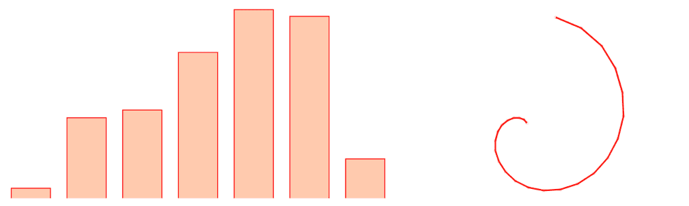

一个带有隐藏轴、网格线和刻度标签的笛卡尔图表和一个径向图表。

代码：*Scales/scales-1-Cartesian-display.html* 和 *scales-2-radial-display.html*

坐标轴还支持十多个回调函数，可以用来配置每个轴显示的标签、刻度和其他数据。

# 笛卡尔坐标轴、刻度和网格线

有五种使用笛卡尔网格的图表类型：柱状图、水平柱状图、线图、散点图和气泡图。每个图表都有两个刻度，每个垂直轴一个。每个刻度可以是四种类型之一：

+   `type:'linear'`: 一个可以用来比较相同量级数值的数值刻度。

+   `type:'logarithmic'`: 一个用于比较不同量级数值的数值刻度。

+   `type:'category'`: 一个无序的分类列表。

+   `type:'time'`: 一个有序的瞬间列表。这个刻度需要`moment.js`库。

在大多数图表中，至少有一个刻度是数值的（线性或对数）。在散点图和气泡图中，两个刻度都是数值的。时间序列图使用数值刻度和时间刻度，但也可以使用分类刻度。您还可以创建两个刻度都是分类的相关图表。

以下表格列出了所有笛卡尔轴的常见配置选项（最后三个是对象，它们包含将在单独部分中描述的特定配置参数）：

| **属性** | **值** | **描述** |
| --- | --- | --- |
| `type` | `'logarithmic'`, `'linear'` (散点图和气泡图中的两个轴的默认值，以及线图和柱状图的 y 轴的默认值), `'category'` (柱状图和线图的 x 轴的默认值),  `'time'` (需要`moment.js`库) | 选择轴类型。注意，某些配置属性是特定于某些类型的轴的，而其他可能不被支持。 |
| `position` | `top` 或 `bottom` (xAxes 的默认值) for `xAxes`; left (默认) 或 right for `yAxes` | 轴的位置。如果有多个轴位于同一位置，它将被放置在现有轴的下方或左侧。您可以使用`weight`对它们进行排序。请参阅`Cartesian/Cartesian-1-position.html`。 |
| `weight` | `Number` | 当有多个轴位于同一位置时，按顺序排列轴。较大的数字将轴放置在图表之外更远的位置。请参阅`Cartesian/Cartesian-2-weight.html`。 |
| `offset` | `true` 或 `false`（默认值适用于所有轴，除了条形图中的 `type:'category'`） | 如果为 `true`，则在轴的每一边添加空间。 |
| `id` | `String` | 标记轴以便在多个轴使用时与数据集相关联。 |
| `gridLines` | `Object` | 配置网格线。 |
| `scaleLabel` | `Object` | 配置刻度标题。 |
| `ticks` | `Object` | 配置刻度。 |

Cartesian 规模的配置属性和对象

此外，还有 14 个未在此列出的生命周期回调函数。这些属性始终用于 `scales.xAxes` 或 `scales.yAxes` 数组中的对象内。以下是一个典型的配置示例：

```js
options: {
     scales: {
         xAxes: [{
             ticks: {…},
             scaleLabel: {…},
             gridLines: {…}
         }],
         yAxes: [{
             type: 'logarithmic', 
             position: 'left',
             scaleLabel: {…},
         ]
     }
 }
```

这种多级嵌套层次结构有时可能会让人困惑。一个常见的错误是将属性放置在错误的对象中；不会显示错误消息，但什么也不会发生。在本章中，我们将使用 *axis* 来指代 `xAxes` 或 `yAxes` 中的任何轴对象（例如 `axis.ticks.minor`、`axis.scaleLabel`），或者使用从 `scales` 对象的完整路径（例如 `scale.yAxes[0].ticks.minor`）。例外情况是当它们在表中列出时，但在此情况下，父对象将会有限定。

# 数值 Cartesian 规模

有两种数值规模。在所有使用数值规模的图表中，`type:'linear'` 是默认值，但并不总是最佳选择。线性图表最适合比较相同量级的数据点，但当样本中包含一些值是其他值的数百倍时，数据相关性可能难以发现。

# 线性规模

在以下散点图中使用了线性规模，该图绘制了几个国家的总人口，比较了它们在 1980 年（*y 轴*）和 2015 年（*x 轴*）的人口。数据来自联合国（有关此章节的 GitHub 存储库中的 `Data/WPP2017_UNH.csv`）。中位数线表示人口相同的点。位于中间线以上阴影区域的国家经历了人口减少：

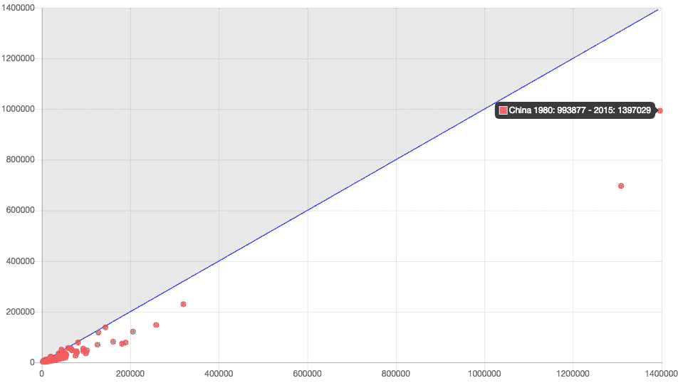

显示 1980 年至 2015 年人口增减的图表。由于中国、印度和世界其他地区量级的不同，线性规模不是最佳选择

代码：*Numeric/numeric-1-linear.html*

图表右侧的两个点代表印度和中国。所有其他国家都集中在图表的左下角。由于它混合了不同量级的值，这个图表非常难以阅读。大多数国家人口数量较小（以百万计），当与中国和印度（以十亿计）相比时，它们最终会杂乱无章地出现在刻度的开始部分。在这些情况下，我们应该使用对数规模。

工具提示显示图表中每个国家的名称。您可以在 `Numeric/numeric-1-linear.html` 中查看此图表的完整代码。这是一个混合图表，包含不同类型的数据集（线性和散点）。我们将在 第七章*，高级 Chart.js* 中探讨混合图表。

# 对数尺度

将轴对象的 *type* 属性声明为对数将根据对数尺度渲染其数据。将上一个示例中的一个轴更改为 `type: 'logarithmic'`，则线条将变成曲线，如下所示。在这个可视化中，数据点的分布似乎有所改善。它们更接近，图表揭示了之前不可见的一些数据：

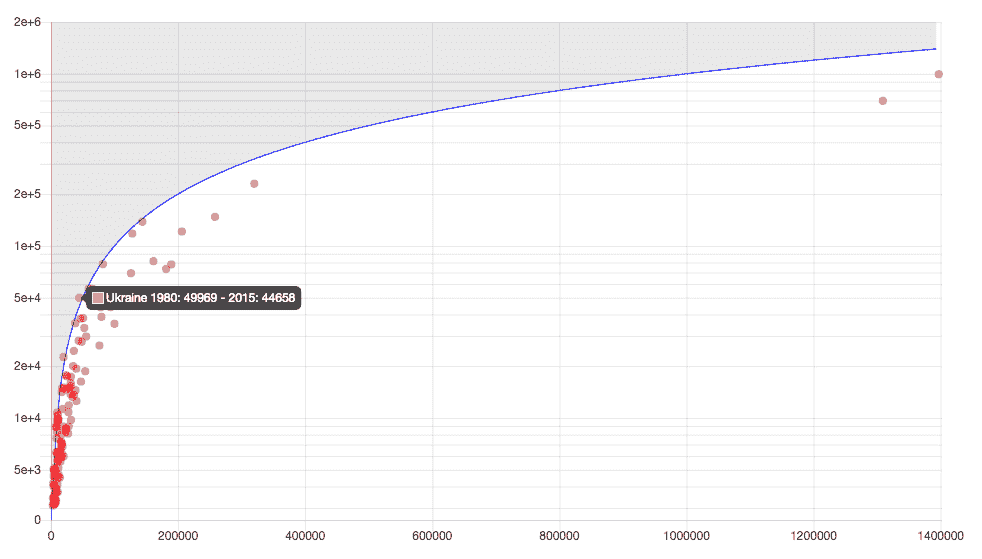

将其中一个尺度设置为对数尺度可以改进散点图，揭示隐藏的数据

代码：*Numeric/numeric-2-log.html*

我们可以改进它。由于两个尺度都包含相同的人口数据，我们可以将两个轴的类型都声明为对数，如下所示。现在曲线再次变成直线，点更接近，更容易比较，并且揭示了更多隐藏的数据：


具有两个对数轴的更好的散点图

代码：*Numeric/numeric-3-log.html*

最后两个示例的完整代码在 `Numeric/numeric-2-log.html` 和 `numeric-3-log.html`。

# 配置轴标题

您可以使用 `axis.scaleLabel` 属性为任何 Cartesian 图表中的每个轴添加标签或标题（例如，`options.scales.xAxes[0].scaleLabel` 配置第一个 *x* 轴的标题）。以下表格列出了 `scaleLabel` 对象的可配置属性：

| **属性** | **值** | **描述** |
| --- | --- | --- |
| `display` | `true` 或 `false` (默认) | 显示或隐藏轴标题 |
| `labelString` | `String` (默认为 `''`) | 轴的标题 |
| `lineHeight` | `Number` | 文本上方和下方的间距 |
| `fontColor, fontFamily, fontStyle` | `String` | CSS 字体属性 |
| `fontSize` | `Number` | 像素字体大小 |
| `padding` | `Number` | 文本前后间距 |

Cartesian 尺度的刻度标签（刻度标题）配置。这些属性用于任何 axis.scaleLabel 对象。

以下代码片段为我们在 第三章，*Chart.js – 快速入门* 中创建的柱状图的 *x* 轴和 *y* 轴添加标题。请注意，仅添加 `axis.scaleLabel.labelString` 是不够的，您还必须设置 `axis.scaleLabel.display: true`，因为标题默认是隐藏的：

```js
scales: {
     xAxes: [{
         scaleLabel: {
             display: true,
             labelString: "Oceans",
             fontSize: 16
         }
     }],
     yAxes: [{
         scaleLabel: {
             display: true,
             labelString: "Volume in cubic km",
             fontSize: 16
         }
     }]
 }
```

在 `Cartesian/Cartesian-3-scaleLabel.html` 中查看完整代码。结果如下所示：

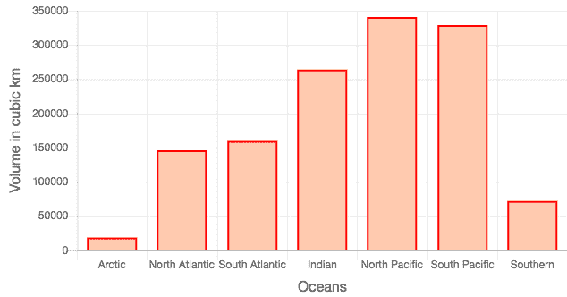

使用 `*scaleLabel*` 属性添加轴标题。代码：*Cartesian/Cartesian-3-scaleLabel.html.*

# 配置刻度

刻度是沿着轴放置的离散点。它们的位置决定了数据点相对于轴的绘制方式。在数值尺度中，`axis.ticks` 属性配置轴将显示的最大和最小数值参数以及要显示的刻度数量。在任何笛卡尔尺度中，它可以用来应用刻度标签的样式并配置填充和其他定位参数。刻度标记在 `axis.gridLines` 属性中单独配置。

以下表格列出了可以为任何笛卡尔尺度配置的刻度属性：

| **属性** | **值** | **描述** |
| --- | --- | --- |
| `display` | `true`（默认）或 `false` | 显示或隐藏刻度标签。 |
| `fontSize` | `Number` | 像素字体大小。 |
| `fontColor`, `fontFamily`, `fontStyle` | `String` | CSS 字体属性。 |
| `reverse` | `true` 或 `false`（默认） | 反转刻度标签的顺序。 |
| `callback` | 函数。默认: `d=>d` | 函数接收刻度的值。它可以用来隐藏刻度或更改显示的值。 |
| `labelOffset` | `Number`. 默认: `0` | 从刻度的中心点偏移标签。 |
| `mirror` | `true` 或 `false`（默认） | 将标签翻转围绕轴到图表内部。 |
| `padding` | `Number`. 默认: `10` | 刻度标签与轴之间的空间。 |
| `autoSkip` | `true`（默认）或 `false` | 如果水平标签空间不足，则跳过标签。`autoSkip:true` 总是显示它们。 |
| `maxRotation` | `Number`. 默认: `90` | `xAxis` 中标签的最大旋转角度。 |
| `minRotation` | `Number`. 默认: `0` | `xAxis` 中标签的最小旋转角度。 |

笛卡尔尺度的刻度配置。这些属性用于任何 *axis.ticks* 对象。

以下表格列出了由数值尺度（线性或对数）支持的附加刻度属性：

| **属性** | **值** | **描述** |
| --- | --- | --- |
| `min` | `Number` | 轴的下限。 |
| `max` | `Number` | 轴的上限。 |
| `suggestedMin` | `Number` | 如果数据的最大值更大，则将其设置为最小值。 |
| `suggestedMax` | `Number` | 如果数据的最大值更小，则将其设置为最大值。 |
| `beginAtZero` | `true`（默认）或 `false` | 强制轴使用零作为下限。 |
| `stepSize` | `Number` | 设置刻度之间最小步长。覆盖精度。 |
| `maxTicksLimit` | `Number`. 默认是 `11`。 | 明确设置轴的最大刻度数。 |

线性和对数尺度的刻度配置。这些属性用于这些尺度的任何 *axis.ticks* 对象

以下配置应用于我们在 第三章*，Chart.js – 快速入门* 中创建的一个条形图，它使用 `axis.ticks.callback` 属性将单词 `ocean` 作为后缀添加到水平轴的刻度标签中。垂直轴被反转，使得条形看起来是倒置的：

```js
scales: {
     xAxes: [{
         ticks: {
             callback: d => d + ' ocean'
         }
     }],
     yAxes: [{
         ticks: {
             reverse: true,
         }
     }]
 }
```

结果在此显示。完整代码请见 `Cartesian/Cartesian-4-ticks-style.html`:

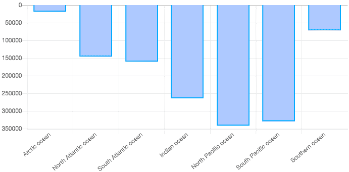

在 Cartesian 图表中配置刻度，反转垂直轴，并在水平轴标签中添加文本使用 *axis.ticks.callback*。

代码：*Cartesian/Cartesian-4-ticks-style.html*

Chart.js 会自动计算每个轴的最小范围，以便以最有效的方式渲染数据。但您可以使用 `axis.ticks.min` 和 `axis.ticks.max` 属性显式设置最小和最大值。在这种情况下，任何超出范围的图表部分将不会显示。或者，您可以使用 `axis.ticks.suggestedMin` 和 `axis.ticks.suggestedMax`，这也会限制范围，但前提是没有数据值被省略。以下代码将这些属性应用于散点图，并通过将 `axis.ticks.stepSize` 设置为较小的值来添加更多刻度（默认最大值为 `11`）：

```js
scales: {
     xAxes: [{
         ticks: {
             padding: 10,
             stepSize: 20,
         }
     }],
     yAxes: [{
         ticks: {
             padding: 10,
             min: -0.6,
             suggestedMax: 0.6, // ignored, because data is larger

         }
     }]
 }
```

此配置的结果如下所示。完整代码位于 `Cartesian/Cartesian-5-ticks-minmax.html`:

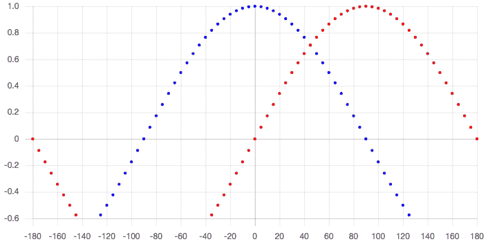

数值图表中的刻度配置：步长和最小值

代码：*Cartesian/Cartesian-5-ticks-minmax.html*

# 配置网格线

Cartesian 网格支持多个属性，这些属性会改变屏幕上网格线的显示。您可以更改颜色、线宽、线型、刻度大小、网格线的间距，以及零线的不同样式。您还可以显示或隐藏网格线、刻度和边框，减少不必要的图表元素，使图表更高效。

这些属性配置在每个 `xAxes` 或 `yAxes` 数组对象中的 `gridLines` 对象内，并在此列出：

| **属性** | **值** | **描述** |
| --- | --- | --- |
| `display` | `true` (默认) 或 `false` | 显示或隐藏此轴的网格线。 |
| `color` | CSS 颜色或颜色数组；默认为 `‘rgba(0,0,0,.1)’` | 网格线的颜色。如果使用数组，则为每条线设置颜色。 |
| `lineWidth` | `Number`; 默认为 `1` | 网格线的宽度。 |
| `borderDash` | `Number[]` | 网格线的虚线数组。 |
| `borderDashOffset` | `Number` | 网格线的虚线偏移量。 |
| `drawBorder` | `true` (默认) 或 `false` | 绘制/隐藏坐标轴线。 |
| `drawOnChartArea` | `true` (默认) 或 `false` | 在图表区域内绘制/隐藏坐标轴的网格线。 |
| `drawTicks` | `true` (默认) 或 `false` | 绘制/隐藏刻度标记。 |
| `tickMarkLength` | `Number` | 刻度标记的大小。 |
| `zeroLineWidth` | `Number` | 零线的宽度。 |
| `zeroLineColor` | CSS 颜色 | 零线的颜色。 |
| `zeroLineBorderDash` | `Number[]` | 零线的虚线数组。 |
| `zeroLineBorderDashOffset` | `Number` | 零线的虚线偏移量。 |
| `offsetGridLines` | `true` 或 `false` | 将网格线移动到标签之间（默认在柱状图中）。 |

Cartesian 刻度中网格线的配置。这些属性用于任何*axis.gridLines*对象

这里展示了几个网格线配置示例。此代码为垂直网格线应用了不同的颜色，并为水平网格线应用了虚线数组。由于`axis.gridLines.drawBorder`设置为`false`，轴线被隐藏。两个轴的零线都应用了不同的宽度和颜色：

```js
scales: {
     xAxes: [{
         gridLines: {
             color: ['#fff','#d30','#b33',...,'#09b','#09e'],
             lineWidth: 2,
             zeroLineColor: 'black',
             zeroLineWidth: 5,
             drawBorder: false
         },
         ticks: {
             padding: 10,
             callback: function(d) {return d != 200 ? d : undefined;}
         }
     }],
     yAxes: [{
         gridLines: {
             zeroLineColor: 'black',
             zeroLineWidth: 5,
             lineWidth: 2,
             borderDash: [5, 5],
             drawBorder: false
         },
         ticks: { padding: 10 }
     }]
 }
```

结果显示在下方的屏幕截图上。完整代码位于`Cartesian/Cartesian-6-grid-styles.html`：

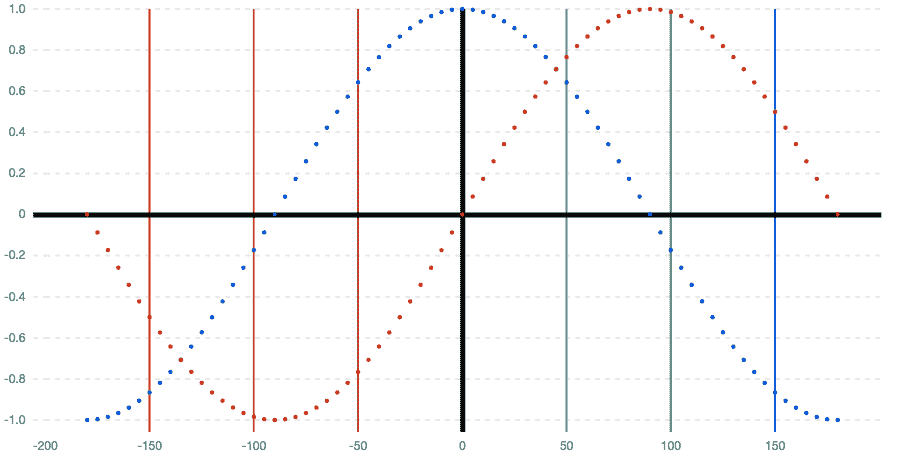

垂直网格线具有不同的颜色，水平网格线具有虚线数组。两个轴线都被隐藏，使用`axis.gridLines.drawBorder: false`

代码：Cartesian/Cartesian-6-grid-styles.html

刻度线是穿过图表区域外的线条。您可以使用`axis.gridLines.drawTicks:false`来隐藏它们，或者使用`axis.gridLines.tickMarkLength`来调整它们的长度。您可以使用`axis.gridLines.drawOnChartArea:false`在图表区域内隐藏`gridLines`，以及使用`axis.gridLines.drawBorder:false`隐藏轴线。这些属性被用于配置以下图表（`Cartesian/Cartesian-7-grid-styles.html`）：


垂直网格具有 15 像素的*axis.gridLines.tickMarkLength*和*axis.gridLines.drawOnChartArea: false*。水平网格隐藏轴，使用*axis.gridLines.drawBorder: false*

代码：*Cartesian/Cartesian-7-grid-styles.html*

此配置隐藏了`ticks`和`gridLines`以生成具有单个居中*y*轴的简约图表：

```js
options: {
     scales: {
         xAxes: [{
                ticks: { display: false },
             gridLines: { display: false }
         }],
         yAxes: [{
                ticks: {
                 mirror: true,
                 padding: -(canvas.width/2)
             },
             gridLines: {
                 drawBorder: false,
                 drawOnChartArea: false,
                 drawTicks: false,
                 offsetGridLines: true
             }
         }]
     }
 }
```

将结果应用于折线图显示如下。完整代码请见`Cartesian/Cartesian-8-grid-minimal.html`：


具有最小网格标记的图表 代码：*Cartesian/Cartesian-8-grid-minimal.html*

# 类别刻度

典型的柱状图和折线图使用类别刻度作为*x*轴，数值刻度作为*y*轴。多个数据集重用相同的类别数据。在这些图表中，用于类别轴的值来自数据对象的`labels`属性。如果数据集有`labels`属性，其*x*轴将自动定义为`type:category`。

# 配置轴

类别刻度与数值图表具有相同的轴配置，但在`axis`和`axis.ticks`对象中支持一些额外的属性。`axis`对象有一个额外的属性，可以用来覆盖轴的数据对象`labels`：

| **属性** | **值** | **描述** |
| --- | --- | --- |
| `labels` | 字符串数组 | 要显示的标签数组。覆盖任何其他标签定义，包括数据对象属性：`labels`、`xLabels`或`yLabels`。 |

类别刻度轴的附加配置

以下代码片段显示了在三个不同属性中定义的类别标签。由于单个*x*轴包含`labels`属性，它将覆盖所有之前的定义：

```js
new Chart("my-chart",
    type: ...,
    data: {
        labels: ['One', 'Two', 'Three'], // used if others are not present
        xLabels: ['ONE', 'TWO', 'THREE'],   // overrides ‘labels’     
        datasets: […]
    },
    options: {
        scales: {
            xAxes: [{
                type: 'category',
                labels: ['Label 1', 'Label 2', 'Label 3'] // overrides 
                xLabels
            }]
        }
    }
});
```

你可以使用 Chart.js 中的 `xLabels` 和 `yLabels` 属性在数据对象中创建具有类别尺度的图表，适用于 *x* 和 *y* 轴。每种类型的第一个轴将使用它们。`data` 和 `xLabels` 数组具有相同的大小。`xLabels` 数组中的每个元素都与 `data` 数组中的相应项相关联，该数组包含来自 `yLabels` 数组的值。这创建了一个类别之间的多对一关系。许多 *x* 值共享一个单一的 *y* 值。

在以下示例中，使用 `Global.defaults.scale` 为所有轴设置了属性：

```js
const yLabels = ["Water", "Land", "Air"]; // groups: multiple points
const xLabels = ["Ship", "Train", "Bike", "Cruiser",
                 "Jet", "Bus", "Rocket", "Car"]; // items: single point
const data = ["Water", "Land", "Land", "Water", "Air", "Land", "Air",           
              "Land"];

const dataObj = {
    xLabels: xLabels, // used by x-axis category scale
    yLabels: yLabels, // used by y-axis category scale
    datasets: [
        {
            data: data,
            pointRadius: 50, pointHoverRadius: 50,
            pointStyle: 'rectRot',
            showLine: false,
            backgroundColor: "hsla(20,100%,80%,0.8)",
            borderColor: "hsla(0,100%,50%,1)"
        }
    ]
}

 Chart.defaults.scale.gridLines.drawBorder = false;
 Chart.defaults.scale.gridLines.lineWidth = 10;
 Chart.defaults.scale.gridLines.drawBorder = false;
 Chart.defaults.scale.offset = true;
 Chart.defaults.scale.ticks.padding = 20;

 new Chart("correlation",
         {
             type: "line",
             data: dataObj,
             options: {
                 legend: {display: false},
                 scales: {
                     xAxes: [{type: 'category'}],
                     yAxes: [{type: 'category'}]
                 },
                 animation: {duration: 0},
                 tooltips: {displayColors: false}
             }
         });
```

结果如下所示。请参阅 `Category/category-1-one-to-many.html` 中的完整代码：

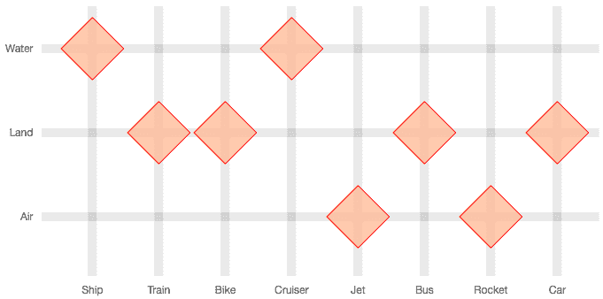

使用两个 *type:’category’* 轴创建的许多到一关系的关联图。

代码：*Category/category-1-one-to-many.html.*

你也可以创建许多到多类别的关联关系，但它不会与类别尺度一起工作。你必须设置一个带有两个数值线性尺度的散点图，然后使用回调将数字映射回类别。以下代码显示了如何做到这一点：

```js
const xLabels = ["Lake","River","Road","Railroad","Ocean","Air"];
 const yLabels = ["Car","Bus","Airplane","Sailboat","Cruiser","Train",
                  "Bike"]
 const data = [
     {x: 1, y: 4}, {x: 1, y: 5}, {x: 2, y: 4}, {x: 3, y: 1}, {x: 3, y: 2},
     {x: 3, y: 7}, {x: 4, y: 6}, {x: 5, y: 5}, {x: 6, y: 3}
 ];

 const dataObj = {
     datasets: [
         {
             data: data,
             pointRadius: 20, pointHoverRadius: 20,
             pointStyle: 'rectRot',
             backgroundColor: "hsla(20,100%,80%,0.8)",
             borderColor: "hsla(0,100%,50%,1)"
         }
     ]
 }

 Chart.defaults.scale.gridLines.drawBorder = false;
 Chart.defaults.scale.gridLines.lineWidth = 2;
 Chart.defaults.scale.gridLines.color = 'red';
 Chart.defaults.scale.offset = true;
 Chart.defaults.scale.ticks.padding = 10;
 Chart.defaults.scale.ticks.min = 0;

 new Chart("correlation",
         {
             type: "scatter",
             data: dataObj,
             options: {
                 legend: {display: false},
                 animation: { duration: 0 },
                 scales: {
                     xAxes: [{
                         ticks: {
                             max: 7,
                             callback: function(value) {
                                 return xLabels[value-1];
                             }
                         }
                     }],
                     yAxes: [{
                         ticks: {
                             max: 8,
                             callback: function(value) {
                                 return yLabels[value-1];
                             }
                         }
                     }]
                 }
             }
         });
```

结果如下所示。请参阅 `Category/category-2-many-to-many.html` 中的完整代码：

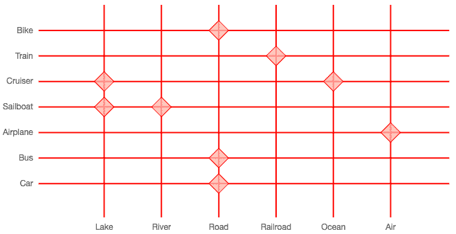

使用两个 *type:'linear'* 轴和将数值映射到类别的许多到多关系的关联图

代码：*Category/category-2-many-to-many.html*

# 配置刻度

类别尺度扩展了笛卡尔图表的 `axis.ticks` 配置，并增加了三个额外的属性，如下表所示：

| **属性** | **值** | **描述** |
| --- | --- | --- |
| `labels` | `String` | 标签 `labels` 数组。这将覆盖之前对此数组的任何声明。 |
| `min` | `String` | `axis.ticks.labels` 中的一个字符串，表示类别数据的下限。 |
| `max` | `String` | `axis.ticks.labels` 中的一个字符串，表示类别数据的上限。 |

类别尺度的额外刻度配置属性

`axis.ticks.min` 和 `axis.ticks.max` 属性取决于字符串在 `axis.ticks.labels` 数组中的出现顺序。如果顺序相反，结果可能是一个空图表。

这是我们在 第三章，*Chart.js – 快速入门* 中创建的条形图，类别标签顺序相反，并且有五个条形而不是七个。缺失的条形是通过类别尺度的 `axis.ticks.min` 和 `axis.ticks.max` 属性移除的，这些属性接受字符串：

```js
scales: {
     xAxes: [{ // category axis
         display: true,
         ticks: {
             labels: labels.reverse(), // overrides labels array
             min: 'South Pacific',
             max: 'North Atlantic'
         }
     }]
 }
```

结果如下所示。请参阅 `Category/category-3-minmax.html` 中的完整代码：

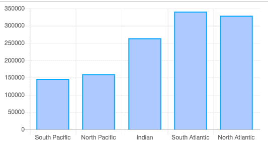

使用 *axis.ticks*.*min* 和 *axis.ticks*.*max* 来限制类别尺度的范围。

代码：*Category/category-3-minmax.html.*

# 配置网格线

类别尺度与数值尺度使用的相同 `axis.gridLines` 配置。

# 时间尺度

你可以使用简单的字符串类别来表示日期和时间信息，但通过使用时间类型的轴，你可以解析、格式化和生成时间数据。这提供了更大的灵活性和交互性。

时间尺度需要 `moment.js` 库（[momentjs.com](http://momentjs.com)）。要使用时间尺度，你可以导入 `moment.js` 库或将 `Chart.bundle.js` 库包含在你的页面中。最好导入 `moment.js`，因为你可能还想使用其他日期和时间函数。你可以通过将其包含在页面中通过 CDN 来实现：

```js
<script src="img/moment.js">
 </script>
```

数据通常使用点结构配置，其中 *x* 属性是日期，*y* 属性是某个定量值。你也可以使用 t 属性代替 *x*。许多标准日期格式可以自动解析。以下是一些有效的时间数据点：

```js
{x: new Date(), y: 1} // now
{t: ‘20190224’, y: 2} // 2019-02-24
```

你也可以在简单的数据对象 `labels` 数组中包含日期：

```js
new Chart("my-chart", {
     type: "bar",
     data: {
         labels: [‘20190224’, ‘20190227’, ‘20190305’],
         datasets: [...],
     }
 });
```

这里有一个最小示例。此代码使用 `moment.js` 库生成一个日期列表，并创建一个包含 10 个日期的数据集。它使用所有时间尺度属性的默认值，除了 `axis.time.unit`，它通知应使用的单位：

```js
const dataset = [];
 let date = moment('20181120');
 for(let i = 1; i <= 10; i+= 1) {
     dataset.push({t: date, y: Math.random() * 10});
     date = moment(date)
            .add( Math.floor(Math.random() * 10)+1, 'days').calendar();
 }
 const dataObj = {
     datasets: [{data: dataset, backgroundColor: 'hsla(290,100%,45%,.5)'}]
 }
 new Chart("my-chart", {
     type: "bar",
     data: dataObj,
     options: {
         legend: {display: false},
         scales: {
             xAxes: [{
                 type: 'time',
                 offset: true,
                 gridLines: { offsetGridLines: true },
                 time: {unit: 'day'}
             }]
         }
     }
 });
```

偏移量移动条形和 `gridLines`，使它们保持在图表内。这是具有类别尺度的条形图的默认设置，但不是时间尺度的。结果如下所示（`Time/time-1.html`）。请注意，条形图不是等间距的，但时间间隔是。这是默认配置，但你可以更改它，就像我们接下来要看到的那样：

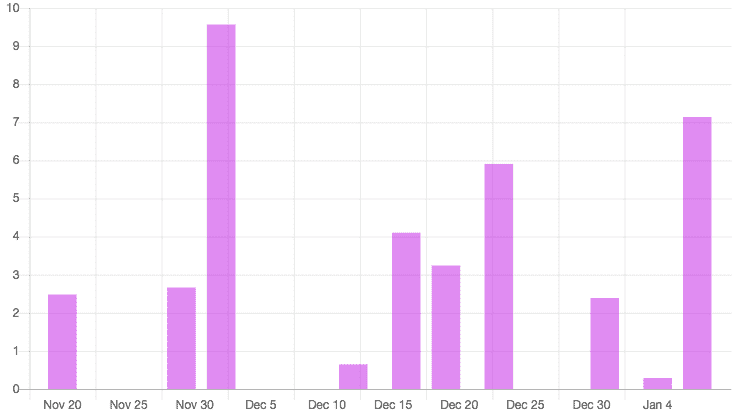

使用默认配置的时间尺度的条形图。代码：*Time/time-1-html.*

# 配置时间格式

特定于时间尺度的属性配置在 `axis.time` 属性中。它接收一个对象。以下列出了其中的一些属性：

| **属性** | **值** | **描述** |
| --- | --- | --- |
| `unit` | `millisecond`, `second`, `minute`, `hour`, `day`, `week`, `month`, `quarter`, `year` | 考虑数据的时间单位。 |
| `stepSize` | `Number` | 尺度中值之间的最小步长（这可能在单个刻度中组合多个值）。 |
| `displayFormats` | 对象，包含零个或多个时间单位作为字符串属性 | 此对象用于覆盖每个单位使用的默认字符串格式。以下列出了支持的标记。 |
| `tooltipFormat` | 包含日期格式的字符串，例如 `MMMM`，`YYYY` 或 `h:mm:ss` | 用于在工具提示中显示数据/时间信息的格式字符串。以下列出了支持的标记。 |

*axis.time* 对象的选定属性

时间尺度使用 `moment.js` 格式，这些格式基于标准的日期/时间格式标记。以下列出了每个单位的默认格式及其产生的输出：

| **单位** | **默认格式** | **输出示例** |
| --- | --- | --- |
| `Millisecond` | `h:mm:ss.SSS A` | `2:07:36.976 PM` |
| `Second` | `h:mm:ss A` | `2:07:36 PM` |
| `分钟` | `h:mm A` | `2:07 PM` |
| `Hour` | `hA` | `2 PM` |
| `Day` | `MMM D` | `Feb 24` |
| `Week` | `ll` | `Feb 24 2019` |
| `Month` | `MMM YYYY` | `Feb 2019` |
| `Quarter` | `[Q]Q - YYYY` | `Q1 – 2019` |
| `Year` | `YYYY` | `2019` |

时间刻度中使用的默认时间单位格式

如果您希望以特定方式格式化日期/时间，可以使用 `axis.time.displayFormats` 属性来覆盖您所使用的时间单位默认格式：

```js
time: {
     unit: 'month',
     displayFormats: {
         month: 'MMMM',   // will print January, February,… for month units
     }
 }
```

您可以将以下标记组合起来创建一个字符串：

| **Property** | **Tokens** | **Output** |
| --- | --- | --- |
| `Day of month` | `D, Do, DD` | `1 2 … 31, 1st 2nd … 31st, 01 02 … 31` |
| `Day of week` | `d, ddd, dddd` | `0 1 … 6, Sun Mon … Sat, Sunday, Monday … Saturday` |
| `Month` | `M, MM, MMM, MMMM` | `1 2 … 12, 01 02 … 12, Jan Feb … Dec, January February … December` |
| `Quarter` | `Q, Qo` | `1 2 3 4, 1st 2nd 3rd 4th` |
| `Year` | `YYYY, Y` | `1970 1971 … 2030, 1970 1971 … 9999` |
| `AM/PM` | `A, a` | `AM PM, am pm` |
| `AM/PM` | `A, a` | `AM PM, am pm` |
| `Hour` | `H, HH, h, hh` | `0 1 … 23, 00 01 … 23, 1 2 … 12, 01 02 … 12` |
| `Minute` | `m, mm` | `0 1 … 59, 00 01 … 59` |
| `Second` | `s, ss` | `0 1 … 59, 00 01 … 59` |
| `Millisecond` | `SSS` | `000 001 … 999` |
| `Time zone` | `ZZ` | `-0700 -0600 … +0700` |

创建日期字符串格式的最常见标记

此外，还有其他本地化格式。请参阅 `moment.js`（`momentjs.com/docs/#/displaying/format`）文档中的附加选项。

# 配置轴

时间刻度支持所有笛卡尔刻度的属性，并增加两个额外的属性，如下表所示。这些属性在每个轴中配置（例如，`scales.xAxes[0].bounds`）：

| **Property** | **Value** | **Description** |
| --- | --- | --- |
| `bounds` | data (default), ticks | 设置刻度边界策略。默认数据将调整轴的维度以适应数据。使用刻度，图表将被截断以适应刻度。 |
| `distribution` | linear (default) or series | 数据在轴上的分布方式。如果是系列，数据值将均匀分布。如果是线性，瞬间将均匀分布。 |

时间刻度的附加轴配置属性

在最后一个例子中，条形位置不均匀，因为默认分布保留了时间瞬间。在这个例子中，条形将均匀分布，但它们之间的周期将不均匀。数据由刻度限制，而不是数据点，日期格式显示缩写月份、日和年：

```js
xAxes: [{
     type: 'time',
     offset: true,
     gridLines: { offsetGridLines: true },
     distribution: 'series',
     bounds: 'ticks',
     time: {
         unit: 'day',
         displayFormats: {
             day: 'MMM D Y',
         }
     }
 }]
```

结果如下所示。请参阅 `Time/time-2.html` 中的完整代码：

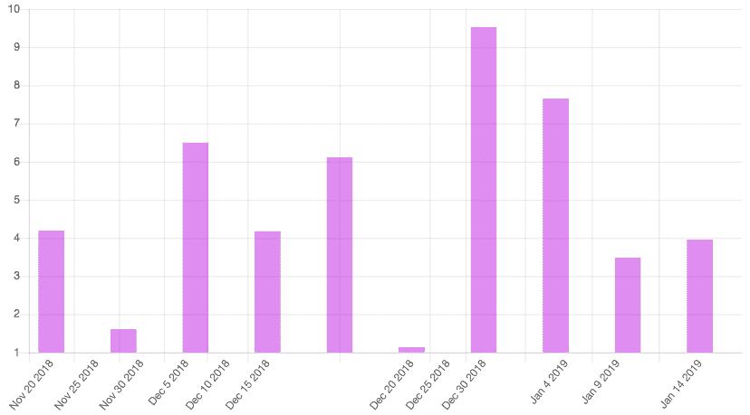

一个具有等距条形和刻度界限的时间刻度图表。代码：*Time/time-2.html.*

# 配置刻度

时间刻度扩展了笛卡尔图表的 `axis.ticks` 配置，并增加了一个额外的属性，如下所示：

| **Property** | **Value** | **Description** |
| --- | --- | --- |
| `source` | `auto`（默认），`data`（默认，如果数据在点格式中），`labels`（默认，如果数据在数组格式中） | 选择从何处获取时间刻度的条目。 |

时间刻度的时间刻度配置属性

`axis.ticks.source` 属性允许您选择时间刻度的数据源。如果您的数据集是一个简单的数组，并且日期位于标签数组中，则默认配置将自动从那里获取日期。您也可以显式设置此属性：

```js
const dataset = [], labels = [];
 let date = moment('20181120');
 for(let i = 1; i <= 10; i+= 1) {
     labels.push(date);
     dataset.push(Math.random() * 10);
     date = moment(date)
            .add( Math.floor(Math.random() * 10)+1, 'days').calendar();
 }

 const dataObj = {
     labels: labels,
     datasets: [{
         data: dataset,
         backgroundColor: 'hsla(290,100%,45%,.5)'
     }]
 }

 new Chart("my-chart", { type: "bar", data: dataObj,
     options: {
         scales: {
             xAxes: [{
                 // ... other configuration not shown
                 ticks: { source: 'labels' }
             }]
         }
     }
 });
```

结果在此处显示。请参阅完整的代码 `Time/time-3.html`：

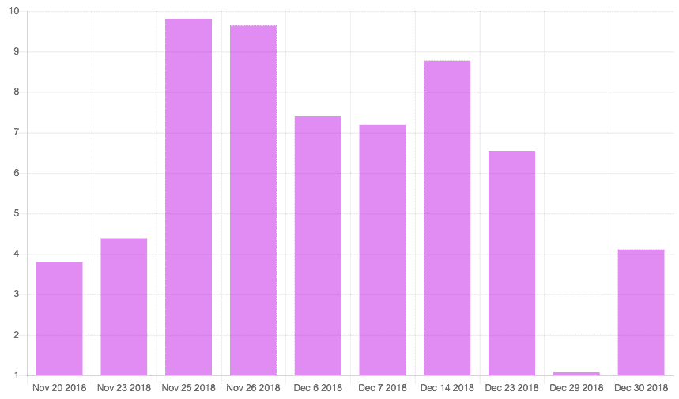

使用 *labels* 数组作为刻度数据源的时间刻度的柱状图。代码：*Time/time-3.html*。

# 配置网格线

时间刻度与数值刻度使用的相同 `axis.gridLines` 配置。

# 径向刻度

两个 Chart.js 图表类型使用径向刻度：`radar` 和 `polarArea`。具有单个刻度的径向图表使用此处列出的属性进行配置。一些属性与笛卡尔刻度中使用的属性类似，但它们的配置选项较少：

| **属性** | **值** | **描述** |
| --- | --- | --- |
| `pointLabels` | `Object` | 配置点标签 |
| `ticks` | `Object` | 配置图表刻度 |
| `angleLines` | `Object` | 配置径向网格线 |
| `gridLines` | `Object` | 配置同心网格线 |

径向刻度的配置对象

这些属性直接用于 `options.scale` 对象内部。例如：

```js
options: {
     scale: {
         ticks: {…},
         angleLines: {…},
         gridLines: {…},
         pointLabels: {…}
     }
 }
```

# 配置点标签

点标签是围绕径向图表显示的标签，位于每个角度线上。刻度标签放置在图表内部，覆盖第一条角度线，并带有背景。点标签通过 `scale.pointLabels` 属性进行配置，该属性是一个具有以下属性的对象：

| **属性** | **值** | **描述** |
| --- | --- | --- |
| `display` | `true` (默认在雷达图中) 或 `false` (默认在极区图中) | 显示或隐藏轴标签 |
| `callback` | 函数；默认为 `d=>d` | 为每个点返回值标签 |
| `fontColor`，`fontFamily`，`fontStyle` | 包含 CSS 字体属性的字符串 | 字体属性 |
| `fontSize` | 数字 | 像素字体大小 |

径向轴点标签配置属性

您可以使用 `display:false` 在径向图表中隐藏 `pointLabels`（请参阅以下图例）。如果您使用极区图表，并且想要使它们可见，可以使用 `display:true`。请参阅 `Radial/radial-1-pointLabels-hide.html` 和 `radial-2-pointLabels-polar.html`。

以下代码使用一些其他的 `pointLabel` 属性来改变雷达图中标签的颜色，并使用回调函数向每个标签添加文本：

```js
scale: {
     pointLabels: { callback: (d) => 'Step ' + d, fontColor: 'red'}
 }
```

请参阅完整的代码 `Radial/radial-3-pointLabels-callback.html`。结果如下所示：

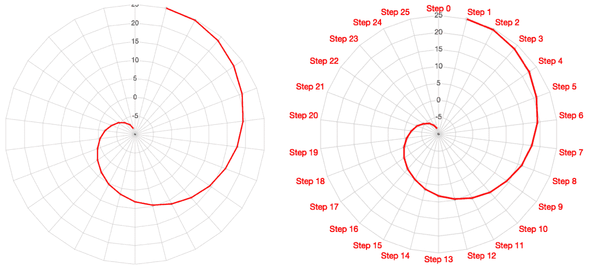

径向刻度标签配置。左侧：使用 `scale.pointLabels.display *= false*` 隐藏标签。右侧：使用回调函数更改颜色并附加文本。代码：`Radial/radial-1-pointLabels-hide.html` 和 `radial-3-pointLabels-callback.html`。

# 配置刻度

径向轴的刻度是同心圆（可以渲染为圆形或多边形，每个角度线都有一个顶点）。刻度标签放置在圆圈上，并在其后面有背景。

刻度在 `scale.ticks` 对象中配置，具有以下属性：

| **属性** | **值** | **描述** |
| --- | --- | --- |
| `display` | `true`（默认）或 `false` | 显示或隐藏刻度标签。 |
| `fontSize` | `Number` | 像素字体大小。 |
| `fontColor`, `fontFamily`, `fontStyle` | `String` | CSS 字体属性。 |
| `reverse` | `true` 或 `false`（默认） | 反转刻度标签的顺序。 |
| `callback` | 函数；默认：`d=>d` | 函数接收刻度的值。它可以用来隐藏刻度或更改显示的值。 |
| `min` | `Number` | 轴的下限。 |
| `max` | `Number` | 轴的上限。 |
| `suggestedMin` | `Number` | 如果数据的最大值更大，则将此设置为最小值。 |
| `suggestedMax` | `Number` | 如果数据的最大值更小，则将此设置为最大值。 |
| `beginAtZero` | `true`（默认）或 `false` | 强制轴使用零作为下限。 |
| `stepSize` | `Number` | 设置刻度之间最小步长。 |
| `maxTicksLimit` | `Number`; 默认是 `11` | 明确设置轴的最大刻度数。 |
| `showLabelBackdrop` | `true` 或 `false`; 默认是 `true` | 在网格线上绘制刻度标签的背景。 |
| `backdropPaddingX backdropPaddingY` | `Number`; 默认是 `2` | 背景填充。 |
| `backdropColor` | `Color`; 默认是 `rgba(255,255,255,.75)` | 标签背景颜色。 |

径向刻度的属性

刻度属性类似于用于笛卡尔线性图表的属性。以下代码显示了应用于雷达图的一些刻度配置：

```js
scale: {
     ticks: {
         fontColor: 'blue',
         callback: (d) => d + ' m',
         reverse: true,
         min: 0,
     }
 }
```

结果在此处显示。请参阅完整的代码 `Radial/radial-4-ticks.html`：

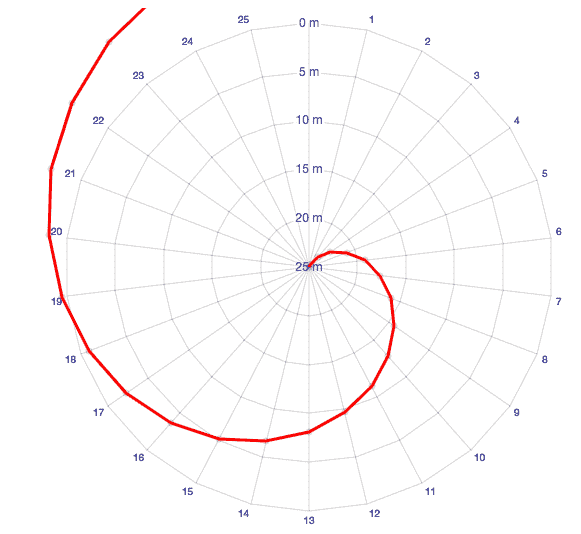

具有某些刻度配置的雷达图。*代码：`Radial/radial-4-ticks.html`*。

# 配置网格和角度线

以下属性用于配置径向网格的径向线（`scale.angleLines`）和同心圆或多边形（`scale.gridLines`）：

| **属性** | **值** | **描述** |
| --- | --- | --- |
| `display` | `true`（雷达图默认）或 `false`（极坐标区域默认） | 显示或隐藏线条。 |
| `color` | `Color` | 线的颜色。 |
| `circular` | `true`（极坐标区域默认）或 `false`（雷达图默认） | 仅在 `gridLines` 对象中。如果为 `true`，则 `gridLines` 是圆形的。否则，它们是点之间的直线。 |
| `lineWidth` | `Number` | 线条的宽度。 |

径向网格中网格和角度线的配置

以下代码在雷达图中配置了多个网格和角度线的属性。它将网格线改为圆形，并更改了线宽和颜色：

```js
scale: {
     gridLines: {
         circular: true,
         lineWidth: 2,
         color: 'hsla(240,100%,50%,.2)'
     },
     angleLines: {
         display: true,
         lineWidth: 2,
         color: 'hsla(120,100%,25%,.2)'
     }
 }
```

将结果应用于雷达图，如下所示。完整代码请见 `Radial/radial-5-grid-angle-lines.html`：

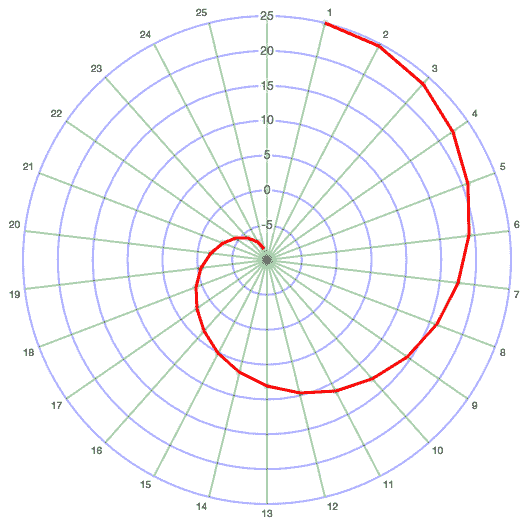

配置了网格和角度线的雷达图。*代码：Radial/radial-5-grid-angle-lines.html*

# 高级刻度配置

本节简要概述了一些您可能不太经常使用的配置。有关这些主题的更多详细信息，请参阅官方文档。

# 多个笛卡尔坐标轴

在二维笛卡尔网格中绘制数据只需要两个坐标轴，但如果需要，您可以添加更多。您可能希望在一个图表的两侧重复坐标轴标题或刻度标签以提高清晰度。您还可以显示具有不同刻度的两个数据集（尽管这在数据可视化中通常是不良做法）。

如果您有多个坐标轴，可以使用 `axis.weight` 和 `axis.position` 属性来控制它们的相对位置。除非您使用 `id` 属性将坐标轴连接到特定的数据集，否则 `yAxis` 数组中的第一个坐标轴将用于所有数据集。数据集通过 `yAxisID` 或 `xAxisID` 属性链接到坐标轴，这些属性引用坐标轴的 ID。有关示例，请参阅 `Advanced/adv-1-position-evil.html`。

以下代码片段配置了一个图表的三个坐标轴，并将它们放置在图表的不同侧面。它没有明确链接任何数据集，因为它们都使用相同的刻度：

```js
scales: {
     yAxes: [{
         id: 'y-axis-1',
         ticks: {min: -2,max: 2},
         scaleLabel: {display: true, labelString: "Left Axis"},
         position: 'left'
     },{
         id: 'y-axis-2',
         ticks: {min: -2, max: 2},
         scaleLabel: {display: true,labelString: "Right Axis"},
         gridLines: {display: false},
         position: 'right'
     }],
     xAxes: [{
         ticks: {min: -4, max: 4},
         scaleLabel: {display: true,labelString: "Top Axis"},
         position: 'top'
     }],
 }
```

完整代码请见 `Cartesian/Cartesian-1-position.html`。结果如下所示：


在不同位置的三个坐标轴的图表。代码：*Cartesian/Cartesian-1-position.html.*

您也可以将坐标轴堆叠在同一侧，如下所示。这在类别刻度中添加上下文时很有用。在这个例子中，为海洋添加了一个额外的类别刻度：

```js
const labels = ["Arctic", "North Atlantic", "South Atlantic", "Indian",
                 "North Pacific", "South Pacific", "Southern"];
 const labels2 = ["","Atlantic", "", "Pacific",""];
// ...
xAxes: [
     {
         weight: 10,
         labels: labels,
         ticks: {
             fontColor: 'black'
         }
     },{
         weight: 20,
         labels: labels2,
         ticks: {
             fontColor: 'purple'
         },
         offset: true
     },
 ]
```

结果如下所示。完整代码请见 `Cartesian/Cartesian-2-weight.html`：

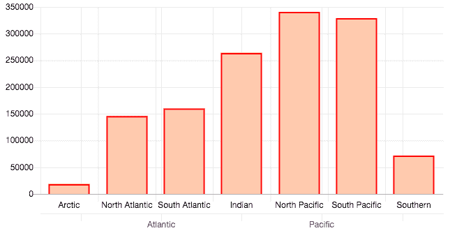

在同一侧有两个类别坐标轴的图表。代码：*Cartesian/Cartesian-2-weight.html.*

可能最好隐藏或配置第二个类别刻度的网格线，以免它们泄漏到图表区域。

# 回调函数

如果您需要过滤或更改单个刻度标签，可以使用生命周期回调函数。共有 14 个这样的回调函数，它们直接在每个坐标轴对象中进行配置。以下代码示例展示了如何根据刻度值（增加步长）进行过滤，并在稍后的阶段更改要显示的值（在这个阶段，更改不再影响图表）：

```js
yAxes: [
     {
         afterBuildTicks: function(axis) {
             log('afterBuildTicks')
             axis.ticks = axis.ticks.filter((d,i) => d % 100000 == 0);

         },
         afterTickToLabelConversion: function(axis) {
             log('afterTickToLabelConversion')
             axis.ticks.forEach((d,i) => axis.ticks[i] = +d/1000);
         }
     }
 ]
```

完整代码请见 `Advanced/adv-2-callbacks.html` 和 `adv-3-radial-callbacks.html`。

# 规模服务

可以使用刻度服务在变化时更新刻度。你可以使用它来传递一个部分配置，该配置将与当前配置合并。在以下代码中，它被用来设置线性刻度中刻度的最小边界，并在类别刻度的刻度标签中添加文本：

```js
Chart.scaleService.updateScaleDefaults('linear', {
     ticks: {
         min: -100000
     },
     afterTickToLabelConversion: function(axis) {
         axis.ticks.forEach((d,i) => axis.ticks[i] = +d/1000);
     }
 });

 Chart.scaleService.updateScaleDefaults('category', {
     afterTickToLabelConversion: function(axis) {
         axis.ticks.forEach((d,i) => axis.ticks[i] = d + " Ocean")
     }
 });
```

在 `Advanced/adv-4-scaleService.html` 中查看完整代码。

# 摘要

在本章中，你学习了如何配置 Chart.js 支持的不同类型的刻度：用于径向图表（如雷达图和极坐标图）的线性刻度，以及用于散点图、气泡图、折线图和柱状图的笛卡尔刻度。你可以通过改变数据呈现方式或样式网格线和标签来为图表添加上下文来配置刻度。

我们还比较了不同类型的笛卡尔图表，说明了为什么有时使用对数刻度而不是线性刻度更好。我们创建了没有数值刻度的类别图表，并探讨了时间刻度。

在下一章中，我们将更详细地探讨配置，有效地使用颜色、字体和交互性，通过回调函数来控制图表的外观。

# 参考文献

**书籍和网站**：

+   Chart.js 官方文档和示例：[`www.chartjs.org/docs/latest/`](https://www.chartjs.org/docs/latest/) 缩放插件：[`github.com/chartjs/chartjs-plugin-zoom`](https://github.com/chartjs/chartjs-plugin-zoom)
