# 第六章：配置样式和交互性

在本章中，你将学习如何配置图表的外观和感觉，使其反映所需的布局或风格，遵循图表设计的良好实践，并调整其交互和响应行为。这包括配置颜色、渐变、图案和字体，设置边距、填充、边框、填充、背景、线宽、虚线，定位标题和图例，以及配置过渡和动画的行为。其中一些属性可以通过 Chart.js 配置选项轻松配置，但其他属性则需要插件和扩展，这些内容也将在本章中介绍。

在本章中，你将学习以下内容：

+   默认配置

+   字体

+   颜色、渐变、图案和阴影

+   添加文本元素和标签

+   交互、数据更新和动画

# 默认配置

在 Chart.js 中创建的每个图表都预先配置了默认属性。在创建新的图表实例时，你始终可以在`options`对象中覆盖这些属性，但你也可以通过直接在`Chart.defaults`对象中设置属性来覆盖所有或许多图表的属性。

例如，任何类型的图表的默认线张力是`0.4`。如果你想所有图表都只使用直线，并且刻度从零开始，你可以让所有页面加载一个`defaults.js`文件，该文件声明以下默认值：

```js
Charts.defaults.global.elements.line.tension = 0;
Charts.defaults.scales.ticks.beginAtZero = true;
```

如果你只想在雷达图中使用曲线线，你可以使用以下方式覆盖所有雷达图表的属性（但不是任何其他类型的图表）：

```js
Charts.defaults.radar.elements.line.tension = 0.4;
```

然后，如果你有一个特定的折线图，你更愿意使用曲线线，你可以在创建图表实例时再次覆盖属性，使用其`options`配置对象：

```js
const chart = new Chart("my-chart", {     type: 'line', data: {...},
   options: {
     elements: {
       line: {
         tension: 0
         //overrides Charts.defaults.global.elements.line.tension
       }
     }
   }
 });
```

一些选项甚至可以配置为图表中的特定数据集，例如线张力。如果你在`datasets`数组中的特定数据集使用`lineTension: 0.3`，则只有对应该数据集的线将显示新的张力：

```js
datasets: [{
    data: [1,2,1],
    lineTension: 0.3
}]
```

顺序很重要，层次结构也是如此。在更具体的环境中设置的属性将几乎总是覆盖在更一般环境中设置的值。并且任何全局属性都应该在实例化图表之前设置。在下一节中，我们将探讨可以在不同配置级别定义的选项，它们的对象结构和它们的默认值。

# 全局默认值

`Chart.defaults.global`中的属性包含所有类型图表的配置选项，包括图形元素、标题和副标题、布局属性、动画、工具提示、事件和插件。但它不包括网格和刻度，这些在`Chart.defaults.scale`对象中配置。`Chart.defaults.global`中可用的选项如下。所有这些属性（除默认字体和颜色设置外）也作为任何图表实例的选项配置对象中的属性：

| **对象** | **值** | **描述** |
| --- | --- | --- |
| `defaultColor` | CSS 颜色 | 所有图表元素的默认颜色。此属性在多个图表元素中被覆盖，因此实际上并不太有用。默认值为 `'rgba(0,0,0,0.1)'`。 |
| `defaultFontColor` | CSS 颜色（例如：`'lightblue'`，`'#9cf'`，`'#ff0000'`，`'rgb(100%,50%,25%)'`，`'hsl(60,100%,50%)'`，`'rgba(100%,50%,25%,0.6)'`，`'hsla(60,100%,50%,0.1)'`） | 所有文本的默认颜色（除非用更具体的字体颜色属性覆盖）。默认值为 `'#666'`。 |
| `defaultFontFamily` | CSS 字体家族名称或列表（例如：`'Helvetica'`，`"Helvetica Neue"`，`sans-serif'`） | 所有文本的默认家族（除非用更具体的字体颜色属性覆盖）。默认值为 `'Helvetica Neue'`，`'Helvetica'`，`'Arial'`，`sans-serif'`。 |
| `defaultFontSize` | 像素字体大小 | 所有文本的默认像素大小（除非用更具体的字体大小属性覆盖）。默认值为 12。 |
| `defaultFontStyle` | CSS 字体样式（例如：`'bold'`，`'italic'`，`'normal'`）或正在使用的字体中可用的任何样式（例如：`'condensed bold'`，`'light'`，等等） | 所有文本的默认样式（除非用更具体的字体样式属性覆盖）。默认值为 `'normal'`。 |
| `layout.padding` | 用于 `top`，`left`，`right`，`bottom` 的数字或具有数值属性的对象 | 如果值是数字，则在图表的所有边上应用像素大小的填充。如果是对象，则可以分别应用于图表的不同边。 |
| `maintainAspectRatio` | `true` 或 `false` | 保持画布元素的宽高比。 |
| `responsive` | `true` 或 `false` | 当画布大小改变时，调整图表大小。默认值为 `true`。 |
| `showLines` | `true` 或 `false` | 如果为 `true`，则在点值之间显示线条。默认值为 `true`，但在散点图中会被覆盖为 `false`。 |
| `title` | 对象 | 请参阅本章的*图例和标签*部分。 |
| `legend` | 对象 | 请参阅本章的*图例和标签*部分。 |
| `tooltips` | 对象 | 请参阅第七章，*高级 Chart.js*。 |
| `hover` | 对象 | 请参阅第七章*，*高级 Chart.js*。 |
| `elements` | 对象 | 请参阅本章的*图表元素*部分。 |
| `events` | 对象 | 请参阅本章的*动画*部分。 |
| `plugins` | 对象 | 请参阅第七章，*高级 Chart.js*。 |
| `animation` | 对象 | 请参阅本章的*动画*部分。 |

在 Charts.defaults.global 中可配置的选项，可用于所有图表。回调函数未列出。

例如，以下配置将关闭任何图表之间的线渲染。由于此属性在折线图或雷达图中没有被覆盖，如果你创建一个折线图，它将没有线条。只有点将可见：

```js
Chart.defaults.global.showLines = false;
```

此配置将关闭所有图表的图例（对于单数据集图表非常有用）：

```js
Chart.defaults.global.legend.display = false;
```

# 刻度默认值

可以在 `Charts.defaults.scale` 对象中全局配置刻度和网格。以下表格列出了该对象的高级属性和一些默认属性。其中一些默认属性在特定图表中被重写。在这些情况下，在此上下文中更改它们可能没有任何效果：

| **对象** | **描述** | **默认属性** |
| --- | --- | --- |
| `display` | 显示（`true`）或隐藏（`false`）此图表的刻度。默认为 `true`。 |
| `offset` | 向图表的左右边缘添加额外空间。默认为 `false`（在柱状图中被重写为 `true`）。 |
| `gridLines` | 所有刻度（某些在特定图表类型中被重写）的默认属性和回调函数。见第五章，*刻度和网格配置*。 |

```js
display = true
color = 'rgba(0,0,0,0.1)
lineWidth = 1
drawTicks: true
drawOnChartArea = true
offsetGridLines = false
```

|

| `scaleLabel` | 所有刻度的默认属性和回调函数（某些在特定图表类型中被重写）。有关详细信息，请参阅第五章*，刻度和网格配置*。 |
| --- | --- |

```js
display = false,
labelString = ''
lineHeight = 1.2
padding: {top: 4, bottom: 4}
```

|

| `ticks` | 所有刻度的默认属性和回调函数（某些在特定图表类型中被重写）。有关详细信息，请参阅第五章*，刻度和网格配置*。 |
| --- | --- |

```js
display = true
beginAtZero = false
autoSkip = true
reverse = false
```

|

在 Charts.defaults.scales 中可以配置的选项，用于配置所有图表的刻度。

例如，以下代码将在使用笛卡尔坐标轴的任何图表的所有轴上放置相同的标签（`bar`、`horizontalBar`、`line`、`scatter`、`bubble`）：

```js
Chart.defaults.scale.scaleLabel.display = true;
Chart.defaults.scale.scaleLabel.labelString = 'default';
```

`display` 属性在所有刻度组件中可用。使用 `display: false`，您可以全局移除刻度、标签、网格线和其他非图表信息，仅在必要时在特定图表中重写这些属性。这是一个好习惯，并将最大化您图表的数据到墨水比率。

本节中的代码片段来自 `Config/defaults-1-global-config.html`，位于本章的 GitHub 仓库中。

# 图形元素

**图形元素**是用于在不同类型的图表中渲染数据集的可视化的基本元素。您可以通过配置 `Chart.defaults.global.elements` 上下文中的四个对象来为它们定义默认值，如下所示。其中一些属性在特定图表的默认值中被重写，因此在此级别更改它们可能不会产生任何效果：

| **对象** | **描述** | **默认属性** |
| --- | --- | --- |
| `arc` | Canvas 弧的默认属性，用于饼图、环形图和极坐标面积图。 |

```js
backgroundColor:"rgba(0,0,0,0.1)"
borderColor:"#fff"
borderWidth:2
```

|

| `line` | 用于线图和雷达图的 Canvas 线的默认属性。在 `borderCapStyle` 和 `borderJoinStyle` 中使用了 Canvas 属性。有关在 `fill` 策略中使用的 Canvas 属性，请参阅第二章，*技术基础*。有关 `fill` 策略，请参阅第四章，*创建图表*。 |
| --- | --- |

```js
backgroundColor:"rgba(0,0,0,0.1)"
borderCapStyle:"butt"
//(see Chapter 2)
 borderColor:"rgba(0,0,0,0.1)"
 borderDash:[]
 borderDashOffset:0
 borderJoinStyle:"miter"
//(see Chapter 2)
 borderWidth:3
 capBezierPoints:true
 fill:true //(see Chapter 4)
 tension:0.4
 stepped: false
```

|

| `Point` | 值点实际上是使用 Canvas 弧线绘制的圆。此对象包含线、雷达、散点或气泡图中点的默认属性。有关更多点样式，请参阅第四章，*创建图表*。 |
| --- | --- |

```js
backgroundColor:"rgba(0,0,0,0.1)"
borderColor:"rgba(0,0,0,0.1)"
borderWidth:1
hitRadius:1
hoverBorderWidth:1
hoverRadius:4
pointStyle:"circle"
//(see Chapter 4)
radius:3
```

|

| `Rectangle` | 用于柱状图和 `horizontalBar` 图的 Canvas 矩形的默认属性。其中一个边框未绘制（跳过）。 |
| --- | --- |

```js
backgroundColor:"rgba(0,0,0,0.1)"
borderColor:"rgba(0,0,0,0.1)"
borderSkipped:"bottom" ("left"in horizontalBar)
borderWidth:0
```

|

Charts.defaults.global.elements 中适用于所有图表元素的可选设置

以下代码将使所有线图和雷达图使用红色虚线 5 像素线作为默认值，除非在它们的默认配置或 `options` 对象中覆盖。请参阅 `Config/defaults-2-global-elements.html`，如下所示：

```js
const line = Chart.defaults.global.elements.line;
line.borderDash = [5,5];
line.borderWidth = 5;
line.borderColor = 'red';
```

# 图表默认值

`Chart.default` 上下文中包含一个对象，用于 Chart.js 支持的每种图表类型。类型如下表所示，其中还列出了一些之前在每个图表中配置的属性。这些属性可以覆盖全局默认的图表样式和元素（`Chart.default.global`）以及刻度默认属性（`Chart.default.scales`）。您可以通过在 `Chart.default` 上下文中更改这些属性或局部在选项对象内部来定义新的默认值：

| **对象** | **描述** | **默认属性（选择）** |
| --- | --- | --- |
| `bar` | 柱状图默认属性 |

```js
hover.mode = 'label'
scales.xAxes[0].type = 'category'
scales.yAxes[0].type = 'linear'
```

|

| `horizontalBar` | 水平柱状图默认属性 |
| --- | --- |

```js
hover.mode = 'index'
scales.xAxes[0].type = 'linear'
scales.yAxes[0].type = 'category'
elements.rectangle.borderSkipped = 'left'
```

|

| `pie` | 饼图默认属性和回调函数 |
| --- | --- |

```js
circumference = 2 * Math.PI
cutoutPercentage = 0
hover.mode = 'single'
```

|

| `doughnut` | 饼图默认属性和回调函数 |
| --- | --- |

```js
circumference = 2 * Math.PI
cutoutPercentage = 50
hover.mode = 'single'
```

|

| `line` | 线图默认属性和回调函数 |
| --- | --- |

```js
hover.mode = 'label'
scales.xAxes[0] = {type: 'category', id: 'x-axis-0'}
scales.yAxes[0] = {type: 'linear', id: 'y-axis-0'}
showLines = true,
spanGaps = false
```

|

| `radar` | 雷达图默认属性 |
| --- | --- |

```js
elements.line.tension = 0
scale.type = 'radialLinear'
```

|

| `polarArea` | 极坐标图默认属性 |
| --- | --- |

```js
angleLines.display = false
gridLines.circular = true
pointLabels.display = false
ticks.beginAtZero = true
type = "radialLinear"
startAngle = Math.PI / 2
```

|

| `scatter` | 散点图默认属性 |
| --- | --- |

```js
hover.mode = 'single'
showLines = false
scales.xAxes[0] = {type: 'linear', id: 'x-axis-1'}
scales.yAxes[0] = {type: 'linear', id: 'y-axis-1'}
```

|

| `bubble` | 气泡图默认属性 |
| --- | --- |

```js
hover.mode = 'single'
scales.xAxes[0] = {type: 'linear', id: 'x-axis-0'}
scales.yAxes[0] = {type: 'linear', id: 'y-axis-0'}
```

|

Charts.defaults 中不同类型图表的默认选项

您可以通过将它们打印到 JavaScript 控制台并检查对象树来查看当前默认属性的值，使用 `console.log()`。以下代码将打印上下文根：

```js
console.log(Chart.defaults);
```

您还可以检查（并修改）图表实例的属性。在这种情况下，您需要将新图表分配给一个变量句柄（请参阅 `Config/defaults-1-global-config.html`）：

```js
const chart = new Chart(…);
console.log("Chart Data, chart.config.data);
console.log("Chart Options, chart.options);
```

# 字体

Chart.js 使用 Canvas 来选择和显示本地和已安装的字体。字体配置涉及设置最多四个字体属性：家族、大小、样式和颜色。一个 `fontFamily` 是包含字体家族名称列表的字符串，一个 `fontStyle` 包含对应字体家族支持样式的名称，一个 `fontColor` 是任何有效的 CSS 兼容颜色字符串，而 `fontSize` 是表示像素大小的数字。您可以在包含文本的任何对象中配置字体属性：标题、刻度标签、图例标签或工具提示，或者您可以设置全局默认值，这些默认值将被显式设置字体属性的文字元素继承。

# 选择标准字体

基本字体属性命名为 `fontFamily`、`fontSize`、`fontStyle` 和 `fontColor`。一些对象有这些相同属性的修饰版本。以下列出了这些对象：

| **包含文本元素的对象** | **描述** | **字体属性** |
| --- | --- | --- |
| `Chart.defaults.global` | 全局默认值 | `defaultFontFamily`、`defaultFontSize`、`defaultFontStyle`、`defaultFontColor` |

| `Chart.defaults.global.title` | 图表标题 | `fontFamily`、`fontSize`，

`fontStyle`,

`fontColor` |

| `Chart.defaults.scale.ticks` | 轴标签 |
| --- | --- |
| `Chart.defaults.scale.ticks.minor` | 次要刻度标签 |
| `Chart.defaults.scale.ticks.major` | 主要刻度标签 |
| `Chart.defaults.global.legend` | 图例标签 |
| `Chart.defaults.global.tooltips` | 工具提示标题 | `titleFontFamily`、`titleFontSize`、`titleFontStyle`、`titleFontColor` |
| `Chart.defaults.global.tooltips` | 工具提示正文 | `bodyFontFamily`、`bodyFontSize`、`bodyFontStyle`、`bodyFontColor` |
| `Chart.defaults.global.tooltips` | 工具提示页脚 | `footerFontFamily`、`footerFontSize`、`footerFontStyle`、`footerFontColor` |

拥有字体配置属性的对象

由于通常避免在整个图表中使用多个字体家族是一个好的实践，因此全局选项是配置此属性的最好位置。您还可以设置其他字体默认值：

```js
Chart.defaults.global.defaultFontFamily =
     'Courier, "Courier New", "Lucida Console", monospace';Chart.defaults.global.defaultFontSize = 12;
Chart.defaults.global.defaultFontStyle= 'normal';
Chart.defaults.global.defaultFontColor = '#333';
```

您始终可以选择在适当的地方覆盖特定属性，例如图表标题的字体大小：

```js
Chart.defaults.global.title.fontSize = 24;
```

如果需要，您还可以再次覆盖它，在图表实例中设置不同的值：

```js
const chart = new Chart("my-chart", {type: 'line', data: {…},
    options: {
        title: {
            display: true,
            text: "Very large title that doesn't fit in the default space",
            fontSize: 20
           }
        }
});
```

# 使用 Web 字体

Chart.js 可以使用您网站上的任何字体。除了所有浏览器都支持的常规字体（*serif*、*sans-serif*、*monospace*）之外，您还可以使用通过样式表加载的在线字体。

在以下示例中，我们正在使用一个免费的网络字体（OFL 许可证），称为 *Yanone Kaffeesatz*，从 Google Fonts 获取。要安装它，只需将以下链接添加到您的 HTML 页面的 `<head>` 中：

```js
<link href="https://fonts.googleapis.com/css?family=Yanone+Kaffeesatz"
       rel="stylesheet">
```

现在，您可以在 CSS 和 HTML 中使用 Yanone Kaffeesatz 字体家族。Canvas 可以通过使用 `font` 属性将其设置为上下文字体。在 Chart.js 中使用它的最简单方法是将其声明为默认全局字体。如果此功能可用，您还可以配置任何字体样式：

```js
Chart.defaults.global.defaultFontFamily = '"Yanone Kaffesatz", sans-serif';
```

在以下示例中，我们更改了几个字体属性（`family`、`color`、`size`和`style`），使用了上一章中创建的一个饼图/环形图的全球选项：

```js
Chart.defaults.global.defaultFontColor = 'black';
Chart.defaults.global.defaultFontFamily =
      '"Yanone Kaffesatz", "Helvetica Narrow", "Arial Narrow", sans-serif';
Chart.defaults.global.defaultFontSize = 24;
Chart.defaults.global.defaultFontStyle = 'normal';
Chart.defaults.global.title.fontSize = 40;
Chart.defaults.global.title.fontColor = 'hsla(240,50%,70%,1)';
Chart.defaults.global.legend.labels.fontColor = 'hsla(120,20%,60%,1)';
```

结果在以下图表中显示。代码位于`Fonts/fonts-1.html`，并需要安装 Yanone Kaffesatz 字体（或任何其他字体，如果你编辑代码）：

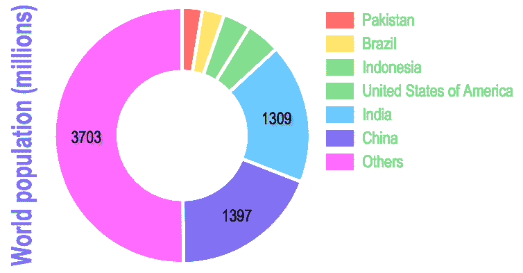

使用网络字体进行标题和标签的环形图。代码：*Fonts/fonts-1.html.*

# 颜色、渐变、图案和阴影

选择有效的数据可视化配色方案并非易事。颜色不仅仅用于使图表看起来更美观。除了区分和暗示数据集之间的关联外，它们还可能通过色调、对比度、饱和度或亮度等属性传达信息。它们甚至可以影响观看者的情绪。颜色的选择永远不会是中立的。它可能会吸引或排斥观看者对相关信息。

其他方面可能也很重要，具体取决于你的受众。你可能希望出于纯粹的美学原因使用渐变、斜面和阴影，但如果你的受众需要最大程度的可访问性，你也可能需要考虑使用色盲安全调色板或图案。

# 配置颜色

Chart.js 支持标准的 HTML/CSS 颜色名称和代码（见第二章，*技术基础*），这些名称和代码被分配给控制字体、线条（和边框）、填充的属性。你可以通过名称（例如，red）选择颜色，十六进制代码（`#f00`，`#ff0000`），或者接收 RGB 或 HSL 组件的三参数生成函数（`rgb(255,0,0)`，或者`hsl(0,100%,50%)`）。CSS 颜色生成函数还包括一个四参数版本，它使用 alpha 组件控制透明度（`'rgba(255,0,0,1)'`，或者`'hsla(0,100%,50%,1)'`）。

`Chart.defaults.global.defaultColor`属性为所有图表组件设置默认颜色，但它通常被字体、刻度、图形元素和默认为单色调的图表的默认配置所覆盖。这些属性出现在不同的图表元素中。它们有不同的名称，但它们都以`Color`后缀结尾。基本配置属性（在`Chart.defaults.global`或`options`对象中使用）包含一个颜色，但应用到一个单一数据集时，它们也可以是一个颜色数组。

# 配色方案和调色板

Chart.js 不包含原生的调色板生成器。在我们之前的例子中，我们要么指定了显式颜色，要么创建了不超过六色的调色板，或者使用了随机颜色生成函数。但颜色是图表中传达信息的重要手段，应该仔细选择。如果不小心使用，您的图表可能会暗示数据之间不存在的关联，欺骗观众。明暗和饱和度不同的颜色暗示着顺序关系（更强/更弱或更热/更冷）。对立的数据可以使用发散调色板更好地表示，其中极端值由互补颜色表示。如果您的数据代表不同的类别，则使用定性颜色方案将更好地可视化。根据您的受众和图表的目的，您在选择颜色时还可能需要考虑可访问性问题，例如色盲或颜色受限设备的渲染。所有这些任务都可以通过使用专门设计的调色板或方案来简化。

调色板是一系列固定大小的颜色，通常在 JavaScript 中表示为数组。一个 **方案** 代表一系列调色板，通常在 JavaScript 中是一个函数（或一个对象）。您可以使用方案生成包含任意颜色序列的调色板。

您可以编写自己的调色板、方案和颜色生成器，但使用流行的服务和 JavaScript 库生成精心选择的调色板和方案要容易得多。

ColorBrewer 是由 Cynthia Brewer 创建的网站，您可以在其中生成一个包含精心设计的调色板的数组字符串，这些调色板不仅看起来很漂亮，而且还考虑了您使用的数据类型（定性、发散和顺序）及其可访问性（色盲、显示/打印和灰度）。您可以选择并实时查看效果，配置可访问性和数据属性，并以不同格式（包括 JavaScript 数组和 CSS）生成颜色字符串：

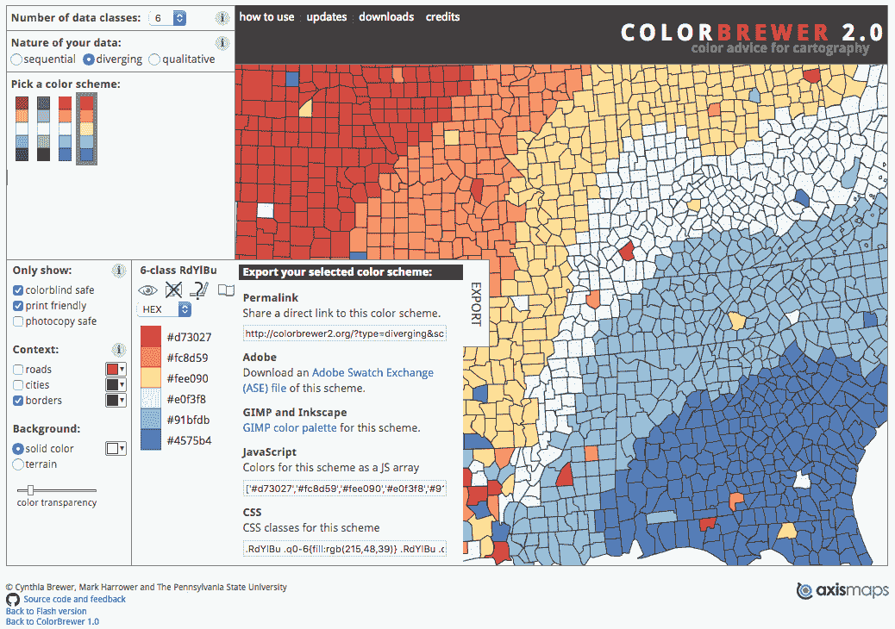

使用 ColorBrewer 选择和生成一个颜色盲安全的小调色板

让我们用一个简单的条形图来试试，该条形图包含代码中列出的单个数据集，如下所示：

```js
<body>
<canvas id="canvas" width="200" height="100"></canvas>
<script>
    const data = {
        labels: ["Mon", "Tue", "Wed", "Thu", "Fri", "Sat"],
        datasets: [
            {
                data: [10, 5, 2, 20, 30, 41],
            }
        ]
    };
    new Chart('canvas', { type: 'bar', data: data, 
                          options: {legend: {display: false}} });
</script>
</body>
```

当您加载页面时，它应该显示一个单色条形图，其中所有条形共享相同的灰色调。

使用 *ColorBrewer* 网站，选择一个六色调色板，配置您想要的任何属性，然后将 JavaScript 数组复制到您的剪贴板。将其粘贴为数据集的 `backGroundColor` 属性：

```js
datasets: [{
   data: [10, 5, 2, 20, 30, 41],
   backgroundColor:['#d73027','#fc8d59','#fee090','#e0f3f8','#91bfdb','#4575b4']
}]
```

然后加载您的图表并查看结果。它应该类似于以下条形图。完整代码在 `Colors/colors-1-brewer.html`：

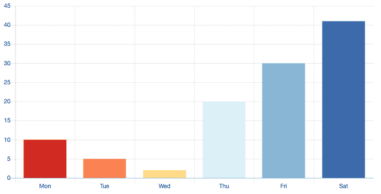

使用 ColorBrewer 六色发散调色板的颜色进行图表。代码：*Colors/colors-1-brewer.html.*

*ColorBrewer* 调色板限制为九种颜色（或根据您选择的设置更少），如果您需要更多颜色，可以从 *保罗·托尔的方案页面* 中选择，该页面也非常受欢迎，或者使用其他生成器（有很多）。

另一个选项是使用 Google `palette.js` 库，它包含颜色调色板生成函数。它支持 ColorBrewer 和 *保罗·托尔色彩方案页面* 中的所有方案，并包括 HSV、RGB 和 Solarized 方案的附加生成器。要使用它，您需要在页面上包含 `palette.js` 文件。您可以从 GitHub 网站下载它或使用 CDN：

```js
<script src="img/palette.min.js"></script>
```

现在您可以通过调用位于 `google.github.io/palette.js` 的演示页面中列出的某个颜色方案函数来生成调色板，如下所示：

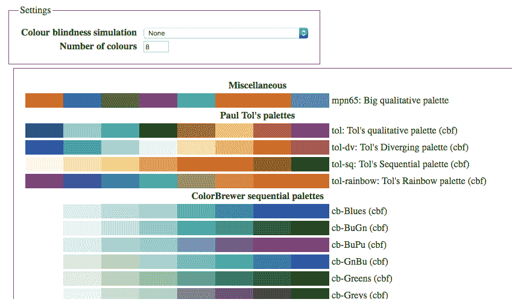

包含 palette.js 生成器支持的色彩方案的页面列表（请参阅完整的演示页面 google.github.io/palette.js）

演示页面允许您尝试不同的方案，检查您可以在调色板中包含多少颜色，并模拟不同级别的色盲。以下代码将生成包含保罗·托尔定性色彩方案的六个颜色的调色板，用于我们的条形图：

```js
const colorsArray = palette('tol', 6);
```

颜色数组包含颜色的十六进制代码，但 Canvas（和 Chart.js）不会显示颜色，除非数字前有一个哈希字符。以下代码修复了这个问题：

```js
const colorsArray = palette('tol', 6).map(n=>'#'+n);
```

现在只需将 `backgroundColor` 属性设置为颜色数组：

```js
backgroundColor: colorsArray
```

结果如下所示。代码在 `Colors/colors-2-palettejs.html` 中：

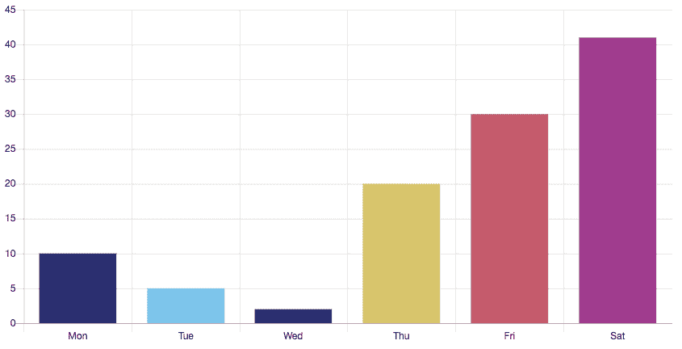

使用生成调色板中的颜色创建的图表。代码：*Colors/colors-2-palettejs.html*

# 渐变

Chart.js 没有对渐变的原生支持，但它们使用 Canvas 生成相当容易。问题是梯度在 Canvas 对象中有一个绝对位置，而您的图表可能是响应式的。如果图表被调整大小，梯度必须重新计算，并且图表需要更新。

处理这个问题的一种方法是在图表创建时以及每次窗口调整大小时调用一个渐变函数，将渐变将应用于的区域尺寸传递给 Canvas 渐变函数。我们可以使用回调和 Chart.js 的 `update()` 函数来完成此操作。

在 Canvas 中创建渐变的函数如下：

```js
canvasContext.createLinearGradient(x0, y0, x1, y1);
```

梯度包含一条垂线的方程。要创建沿 *y* 轴变化的线性梯度，我们需要从图表的底部画到顶部。这意味着 `x0` = `x1` = `0`，`y1` 是图表的底部，而 `y0` 是顶部。如果我们编写一个接收图表实例的函数，我们可以从 `scales["y-axis-0"].top` 和 `scales["y-axis-0"].bottom` 中检索这些信息。以下是一个用于绘制背景颜色和包含两个数据集的折线图的梯度函数（`Colors/colors-3-gradient.html`）：

```js
function drawGradient(chart) {
     const x0 = 0;
     const y0 = chart.scales["y-axis-0"].top;
     const x1 = 0;
     const y1 = chart.scales["y-axis-0"].bottom;

     const gradient1 = chart.ctx.createLinearGradient(x0, y0, x1, y1);
     gradient1.addColorStop(0, 'hsla(60,100%,70%,.4)');
     gradient1.addColorStop(1, 'hsla(0,100%,25%,.8)');

     const gradient2 = chart.ctx.createLinearGradient(x0, y0, x1, y1);
     gradient2.addColorStop(0, 'hsla(300,100%,70%,.4)');
     gradient2.addColorStop(1, 'hsla(240,100%,25%,.8)');

     chart.data.datasets[0].backgroundColor = gradient1;
     chart.data.datasets[1].backgroundColor = gradient2;
 }
```

你必须在图表创建后立即调用该函数，然后调用 `update()` 重新绘制图表。每次调整大小后，都要再次调用它。这可以通过 `onComplete()` 动画回调自动完成，如下面的代码所示：

```js
const data = {
    labels: ["Sun", "Mon", "Tue", "Wed", "Thu", "Fri", "Sat"],
    datasets: [
        {
            label: 'Week 1',
            data: [2, 5, 2, 0, 20, 48, 51],
            borderColor: 'red'
        },{
            label: 'Week 2',
            data: [44, 36, 13, 40, 40, 9, 3],
            borderColor: 'blue'
        }
    ]
};

const chart = new Chart('canvas', {
    type: 'line',
    data: data,
    options: {
        animation: {
            onComplete: function(context) {
               drawGradient(context.chart);
            }
        }
    }
});
drawGradient(chart);
chart.update();
```

最终结果如下所示：

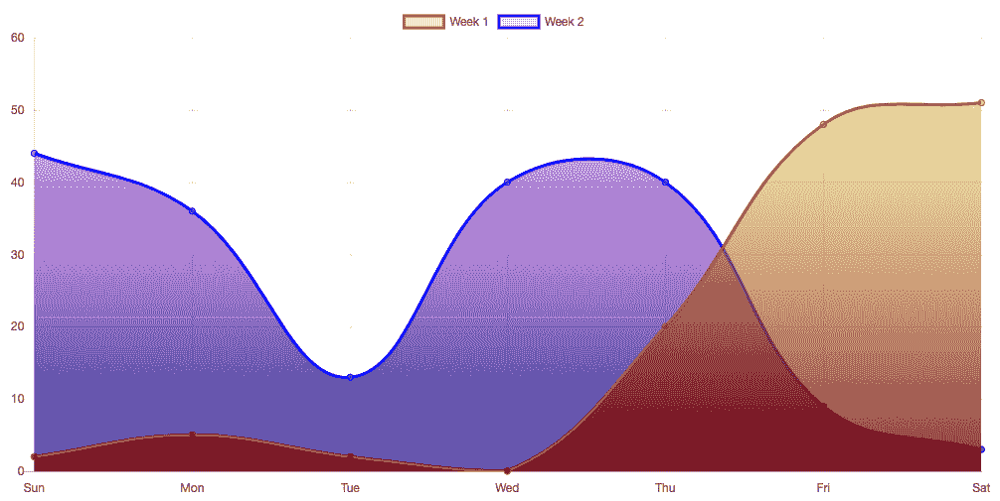

使用渐变作为每个数据集的背景颜色的折线图。代码：*Colors/colors-3-gradient.html.*

# 图案

图案是创建不依赖于颜色编码的图表的绝佳方式，并且它们可以在彩色或单色设备或印刷媒体中使用。当然，它们也是色盲安全的。你可以使用类似于用于渐变的 HTML Canvas 命令来创建图案，但使用插件，如 Chart.js 官方文档中列出的 Patternomaly 插件，要容易得多。

你可以通过从其 GitHub 仓库 ([github.com/ashiguruma/patternomaly](http://github.com/ashiguruma/patternomaly)) 下载 JavaScript 库或使用 CDN 链接来获取 Patternomaly：

```js
<script src="img/patternomaly.min.js">
</script>
```

要生成一个图案，你只需选择一个颜色并调用 `pattern.generate()`，它将随机选择 21 个可用图案中的 1 个：

```js
pattern.generate('rgb(50%,20%,10%');
```

你还可以将特定图案作为 `pattern.draw()` 的第一个参数选择：

```js
pattern.draw('triangle', 'lightblue');
```

支持的图案列表如下所示 (`Colors/colors-4-patternomaly.html`)：

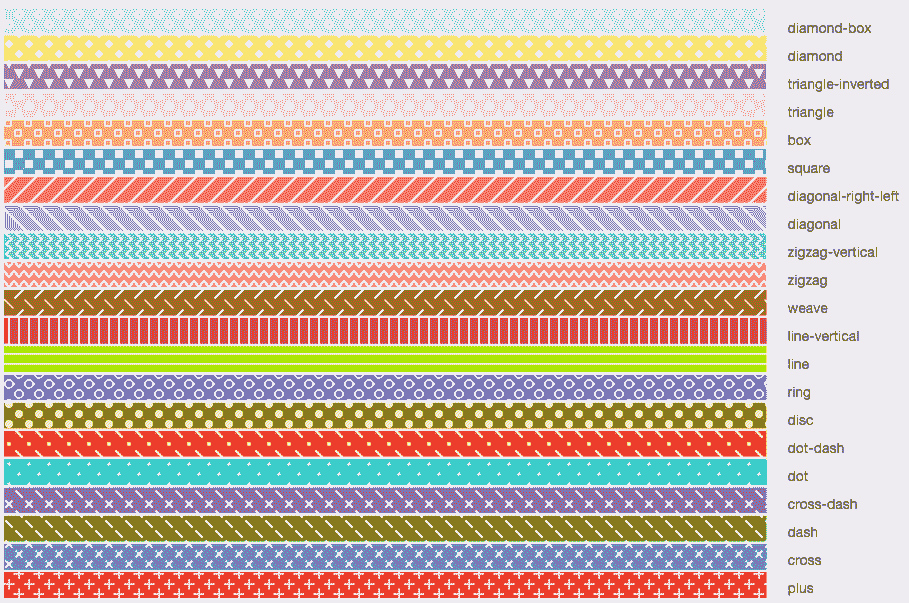

patternomaly.js 插件中可用的图案。代码：*Colors/colors-4-patternomaly.html.*

`generate()` 函数也接受一个颜色数组作为参数。你可以包含为 Color Brewer 示例获取的调色板，并基于它们生成图案：

```js
let patternArray = ['#d73027','#fc8d59','#fee090','#e0f3f8','#91bfdb','#4575b4'];
pattern.generate(patternArray);
```

让我们使用图案来为条形图着色。在这个例子 (`Colors/colors-5-pattern.html`) 中，我们将从 `palette.js` 库（它返回一个颜色数组）的 `pallete()` 函数调用传递给 `generate()` 作为参数，并将其分配给条形的 `backgroundColor` 属性：

```js
backgroundColor: pattern.generate( palette('tol', 6).map(n=>'#'+n) ),
```

结果如下所示：

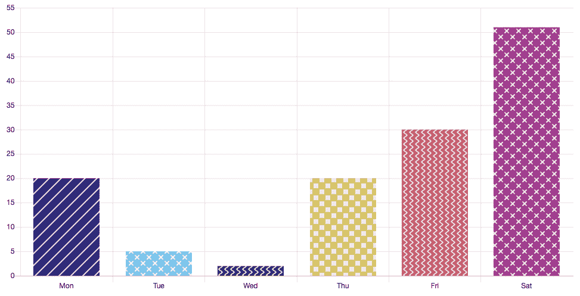

使用生成的图案和颜色创建的无色盲图表。代码：*Colors/colors-5-pattern.html.*

# 阴影和斜面

在官方 Chart.js 文档中列出了几个第三方插件，其中之一名为 `chartjs-plugin-style`，为图表添加了一些样式选项；这些选项包括斜面、阴影和发光效果。要使用它，你可以通过 `npm` 安装插件或从 `nagix.github.io/chartjs-plugin-style` 下载 JavaScript 文件，并将其导入到你的页面中：

```js
<script src="img/chartjs-plugin-style.min.js"></script>
```

现在，你可以在你的数据集中使用新的属性来添加斜面、阴影和发光效果。以下示例配置了斜面并为简单的条形图添加了阴影。属性的名称应该是自解释的：

```js
const data = {
    labels: ["Mon", "Tue", "Wed", "Thu", "Fri", "Sat"],
    datasets: [
        {
            label: 'Week 1',
            data: [20, 5, 2, 20, 30, 51],
            backgroundColor: ['yellow','red','blue','green','orange', 
            'cyan'],
            bevelWidth: 3,
            bevelHighlightColor: 'rgba(255, 255, 255, 0.75)',
            bevelShadowColor: 'rgba(0, 0, 0, 0.5)',
            shadowOffsetX: 5,
            shadowOffsetY: 5,
            shadowBlur: 10,
            shadowColor: 'rgba(0, 0, 0, 0.5)',
        }
    ]
};

new Chart('canvas', { type: 'bar', data: data,
                      options: {legend: {display: false}} });
```

最终结果将在下面展示。您还可以将其与生成的颜色、调色板函数和图案混合。尝试使用不同类型的图表！代码位于 `Colors/colors-6-shadows.html`：

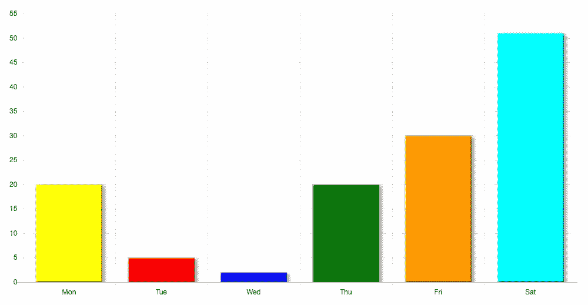

一个带有斜面和阴影的条形图。代码：*Colors/colors-6-shadows.html.*

# 添加文本元素和标签

您始终可以在图表外部添加标题和副标题，使用纯 HTML 或 JavaScript。然而，Chart.js 还包括绘制和配置图表内部文本元素的属性，作为图表的一部分。如果属性不足以提供足够的灵活性，您可以使用回调来过滤或生成标签。如果工具提示、标题和图例还不够，您还可以使用插件向条形图、切片和线条添加标签。您甚至可以使用纯 HTML Canvas 在图表上绘制。本节将探讨一些这些技术。

# 图例和标签

默认情况下，图例在条形图、折线图、饼图和环形图中显示。它们显示为与数据集表示的线条、条形或切片颜色相关的标签化、彩色框列表，即使在只有一个数据集的情况下也会在屏幕上渲染。在这种情况下，您可能希望隐藏它们。您还可以调整其他几个属性和回调。最重要的属性如下列所示：

| **属性** | **值** | **描述** |
| --- | --- | --- |
| `显示` | `true` 或 `false` | 显示或隐藏图表的图例。默认为 `true`。 |
| `位置` | `'top'`, `'bottom'`, `'left'`, `'right'` | 选择标签相对于图表的位置。默认为 `'top'`。 |
| `反转` | `true` 或 `false` | 反转图例中标签的顺序。默认为 `false`。 |
| `标签` | 对象 | 配置每个标签的文本和彩色框。 |

图例对象的主要属性

您还可以将两个回调附加到图例上：

| **属性** | **参数** | **描述** |
| --- | --- | --- |
| `onClick` | (event,label)：`label.text` 属性包含标签的文本；`label.datasetIndex` 包含数组的索引。 | 对 `'click'` 事件做出反应。默认实现切换标签和相关数据集的显示与隐藏。 |
| `onHover` | (event,label)：`label.text` 属性包含标签的文本；`label.datasetIndex` 包含数组的索引。 | 对 `'hover'` 事件做出反应。默认情况下没有实现此回调。 |

图例对象的回调函数

以下示例包含一个简单的三数据集折线图。不是隐藏数据集，而是覆盖了图例的 `onClick` 回调，将所选数据集的颜色更改为灰色。请注意，数据集索引是从回调参数中获得的，但数据集属性是在当前图表的对象树中更改的（`this.chart.data.datasets`）：

```js
const data = [[12,19,3,5,2,3],[6,5,33,2,7,11],[2,3,5,16,0,1]],
   strokes = ['rgba(54,162,235,1)','rgba(255,99,132,1)', 
              'rgba(132,255,99,1)'],
   fills =  
   ['rgba(54,162,235,.2)','rgba(255,99,132,.2)','rgba(132,200,99,.2)']; const grayFill = 'rgb(0,0,0,.2)';
const grayStroke = 'rgb(0,0,0,.8)';

const datasets = [];
for(const i = 0; i < data.length; i++) {
     datasets.push({
         label: 'Dataset ' + (i+1),
         data: data[i],
         backgroundColor: fills[i],
         borderColor: strokes[i],
         borderWidth: 1
     });
 }

 const myChart = new Chart("myChart", {
     type: 'line',
     data: {
         labels: ['Day 1','Day 2','Day 3','Day 4','Day 5','Day 6'],
         datasets: datasets,
     },
     options: {
         legend: {
             position: 'left',
             reverse: true,
             onClick: function(event, label) {
                 const index = label.datasetIndex;
                 const dataset = this.chart.data.datasets[index];
                 if(dataset.backgroundColor == fills[index]) {
                     dataset.backgroundColor = grayFill;
                     dataset.borderColor = grayStroke;
                 } else {
                     dataset.backgroundColor = fills[index];
                     dataset.borderColor = strokes[index];
                 }
                 this.chart.update();
             }
         }
     }
 })
```

以下截图显示了点击数据集前后的图表。请参阅完整的代码 `Text/text-1-legend-callback.html`：

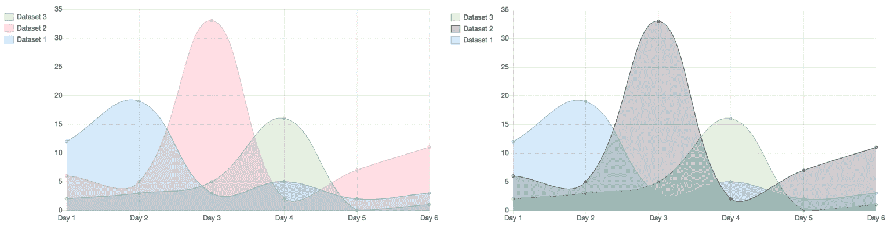

实现一个 `onClick` 回调以更改数据集的颜色。代码：*Text/text-1-legend-callback.html.*

`legend.labels` 属性用于配置单个图例标签的显示外观。以下表格显示了您最可能使用的属性：

| **属性** | **值** | **描述** |
| --- | --- | --- |
| `fontSize`, `fontStyle`, `fontColor`, `fontFamily` | 数字和字符串 | 字体属性继承全局字体设置。 |
| `boxWidth` | 数字 | 彩色框的宽度。默认值为 40。 |
| `Padding` | 数字 | 彩色框行之间的填充。 |

图例.labels 对象的主要属性

没有属性可以设置彩色框的颜色。如果没有为数据集分配颜色，它通常会继承全局的 `defaultColor`。您可以使用 `generateLabels` 回调属性更改此行为。您还可以通过将函数分配给 `filter` `callback` 属性来过滤掉不需要的标签。以下列出了这些属性：

| **属性** | **参数** | **描述** |
| --- | --- | --- |
| `generateLabels` | `(chart)`: 当前图表。这与 `this.chart` 相同。 | 默认实现返回数据集标签作为文本和一个与数据集颜色匹配的矩形彩色框。 |
| `filter` | `(label, item)`: `label.text` 包含标签的文本；`label.datasetIndex` 包含数组索引；`item.datasets` 包含数据集数组；`item.labels` 包含 *x* 轴标签或饼图切片标签。 | 这包含一个过滤函数，用于返回应显示的标签。默认实现返回 `true`。此属性仅过滤标签，不过滤数据集（线条或切片仍会显示）。 |

图例.labels 对象的回调属性

标签样式可以在 `options` 对象内部配置，在每个图表实例中配置，或者使用 `Global.defaults.legend` 对象为所有图表配置，例如：

```js
    Chart.defaults.global.legend.labels.fontSize = 16;
    Chart.defaults.global.legend.labels.boxWidth = 20;
```

以下过滤配置将仅显示最大值低于 `20` 的数据集的标签。所有三个数据集都将显示，但只有两个标签将显示（`Text/text-2-legend-label.html`）：

```js
labels: {
    filter: function(label, item) {
      return Math.max(...item.datasets[label.datasetIndex].data) <= 20;
    }
}
```

`generateLabels` 回调应该仅在您想创建自己的图例时实现。如果您有一个非常复杂的图例，可以通过实现 `Chart.defaults.global.legendCallback` 属性的回调函数或在每个图表中使用 `options` 中的 `legendCallback` 属性来生成 HTML 图例。这将在 第七章*,* 高级 Chart.js* 中探讨。

# 标题

Chart.js 的默认设置是不开启标题，因为您也可以在 HTML 中以更大的灵活性创建自己的标题。如果您仍然想在图表中添加标题，您至少需要设置两个属性：`display`（值为 `true`）和 `text`（标题文本）。您可能还想配置的其他属性如下：

| **属性** | **值** | **描述** |
| --- | --- | --- |
| `display` | `true` 或 `false` | 显示标题。默认为 `false`。 |
| `text` | `String` 或 `String[]` | 包含标题文本的字符串或字符串数组，用于多行标题。 |
| `fontStyle`、`fontFamily`、`fontSize`、`fontColor` | `String` 和 `Number` | 字体属性。默认 `fontStyle` 为粗体，但其他属性继承。 |
| `lineHeight` | `Number` | 默认行高为 1.2。 |
| `padding` | `Number` | 默认填充为 10。 |
| `position` | `'top'`、`'bottom'`、`'left'` 或 `'right'` | 这是标题应该放置的位置。默认为 `'top'`。标题在侧面的位置将逆时针旋转 90 度。 |

[options.title 对象的主要属性]

您可以使用 `Chart.defaults.global.title` 为所有图表配置标题，或在新的图表实例的 `options` 对象中配置。您也可以在更新图表或响应事件后随时更改标题。

# 向线条、条形和切片添加标签

在 第四章 *创建图表* 中，我们使用了一个简单的插件向饼图切片添加标签。在本节中，我们将向您展示另外两个允许更多定制的插件。它们列在 Chart.js 的官方文档中，但由第三方开发，应从它们自己的仓库安装或下载。

`chart-plugin-datalabels` 插件提供了对所有类型图表中值的高自定义标签功能，支持脚本和事件处理。您可以在 `chartjs-plugin-datalabels.netlify.com/samples/` 中看到几个示例，那里也有文档链接和 GitHub 仓库链接。安装它的最简单方法是使用 CDN。在您的页面中包含以下代码：

```js
 <script src="img/chartjs-plugin-datalabels">  
 </script>
```

可以通过以下三种上下文中的一种来按数据集、按图表或全局进行配置：

+   在数据集中：`dataset.datalabels.*`

+   在图表实例中：`options.plugins.datalabels.*`

+   全局，对所有图表：`Chart.defaults.global.plugins.datalabels.*`

本地设置会覆盖全局设置。详细内容超出了本章范围，但该插件有很好的文档记录。以下是一个简单示例，使用我们在上一节中使用的折线图。所有配置都是在 `options.plugins.datalabels` 对象中完成的，该对象在数据点上方添加了漂亮的标签（见 `Text/text-4-datalabels.html`）：

```js
options: {
    plugins: {
        datalabels: {
            backgroundColor: function(context) {
                return context.dataset.borderColor;
           },
          borderRadius: 4,
          color: 'white',
          font: { weight: 'bold'},
          formatter: Math.round
     }
 },
}
```

结果如下截图所示：

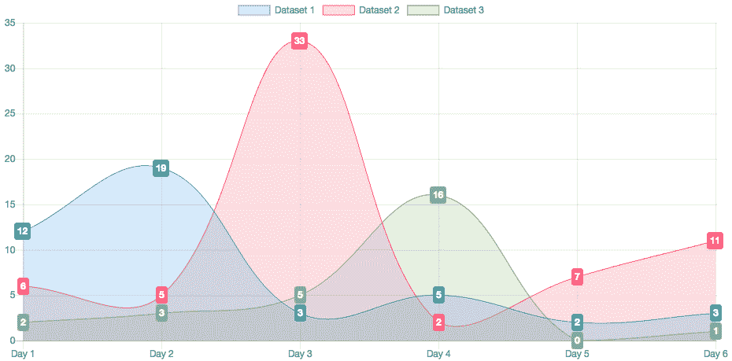

使用 chartjs-datalabels 插件向折线图添加值标签。代码：代码位于 *Text/text-4-datalabels.html*。

使用此插件还有更多可以做的事情。在其他图表上尝试它并查看示例。

第二个标签插件是 `chart-plugin-outlabels`*.* 它允许在饼图和环形图中更好地可视化数据值，将标签显示在切片外部。您可以在 `piechart-outlabels.netlify.com/sample/` 中看到一个示例，在那里您还可以找到文档和 GitHub 仓库的链接。要在您的页面上使用它，请包含以下内容：

```js
<script src="img/> outlabels"> </script>
```

如许多其他插件一样，可以通过以下三种上下文中的一种来按数据集、按图表或全局进行配置：

+   在数据集中：`dataset.outlabels.*`

+   在图表实例中：`options.plugins.outlabels.*`

+   对于所有图表全局：`Chart.defaults.global.plugins.outlabels.*`

该插件还引入了一种新的图表类型：`outlabeledPie`。它可以替代 `pie` 或 `doughnut`，并且配置起来更简单。

以下是我们之前示例中使用的 doughnut 图表的简单示例，使用 `outlabeledPie`（完整代码请见 `Text/text-5-outlabels.html`）：

```js
 const data = {
     labels: ["Mon", "Tue", "Wed", "Thu", "Fri", "Sat"],
     datasets: [
         {
             label: 'Week 1',
             data: [20, 5, 2, 20, 30, 51],
             backgroundColor: palette('tol', 6).map(n=>'#'+n),
         }
     ]
 };

 new Chart('canvas', {
     type: 'outlabeledPie',
     data: data,
     options: {
         zoomOutPercentage: 30,
         plugins: {
             legend: false,
             outlabels: {
                 text: '%l %p',
                 color: 'white',
                 stretch: 45,
                 font: {
                     resizable: true,
                     minSize: 12,
                     maxSize: 18
                 }
             }
         }
     }
 });
```

结果如下所示：

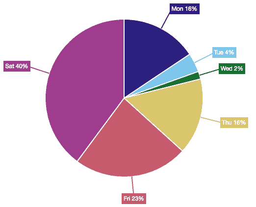

使用 chartjs-outlabels 插件标记值的饼图。代码：*Text/text-5-outlabels.html*。

查看文档以获取更多选项，并尝试在其他图表中使用此插件。

# 交互、数据更新和动画

除非更改配置选项，否则所有图表都预先配置了默认行为和过渡效果，这些效果是动画化的。动画由事件触发，例如窗口调整大小、数据更新或用户交互。默认预配置的图表交互包括将鼠标悬停在或靠近值点上（用于触发包含详细信息的工具提示的出现）以及点击或触摸图例。这提供了基本的交互性以及平滑的数据过渡，但您可能仍然希望通过编写不同事件或动画阶段的回调函数、更改动画属性（如持续时间或缓动算法）或甚至完全关闭动画来对其进行微调。如果您需要更多控制，您可以使用插件或标准 JavaScript 扩展大部分此功能。

# 数据更新

一个交互式图表可能显示周期性变化的数据。一个网页可能包含一个自动更改数据的算法；它可能下载包含新数据的新数据文件，或者它可能允许用户输入或请求更改源数据值。在任何这些情况下，一旦新数据可用，图表都应该更新。数据更新可以在回调函数内部自动发生，也可以使用 `update()` 命令显式调用。要使用它，您需要保存对图表对象的变量引用：

```js
const chart = new Chart(…);
 // make changes
 chart.update();
```

当使用回调时，通常可以使用`this`关键字引用图表的当前实例：

```js
callback: function() {
     // make changes
     this.chart.update();
}
```

变更通常涉及图表实例的`datasets`和`options`属性。让我们看一个例子。在以下代码中，`square()`函数将平方图表中的所有数据值并将*x*轴更改为对数刻度。`squareRoot()`函数执行相反的操作。在更新网格（使用未记录的`scaleMerge()`函数）后，图表被更新：

```js
function square(chart) {
    const datasets = chart.config.data.datasets;
    for(let i = 0; i < datasets.length; i++) {
        for(let j = 0; j < datasets[i].data.length; j++) {
            let value = datasets[i].data[j];
            datasets[i].data[j] = value * value;
        }
    }
    chart.options.scales.yAxes = 
        Chart.helpers.scaleMerge(Chart.defaults.scale, 
                                 {yAxes: [{type: 'logarithmic'}]}).yAxes; 
    chart.update();
}

function squareRoot(chart) {
    const datasets = chart.config.data.datasets;
    for(let i = 0; i < datasets.length; i++) {
        for(let j = 0; j < datasets[i].data.length; j++) {
            let value = datasets[i].data[j];
            datasets[i].data[j] = Math.sqrt(value);
        }
    }
    chart.options.scales.yAxes = 
        Chart.helpers.scaleMerge(Chart.defaults.scale, 
                                 {yAxes: [{type: 'linear'}]}).yAxes; 
    chart.update();
}
```

HTML 按钮注册为事件监听器，根据当前*y*轴类型调用两个函数之一，并更新图表：

```js
 let button = document.getElementById("toggle");
 button.addEventListener('click', function() {
     const type = myChart.options.scales.yAxes[0].type;
     if(type == 'linear') {
         square(myChart);
     } else {
         squareRoot(myChart);
     }
 });
```

尝试一下。完整代码在`Animation/animation-1-update.html`中，以下截图显示了图表的两个不同状态：

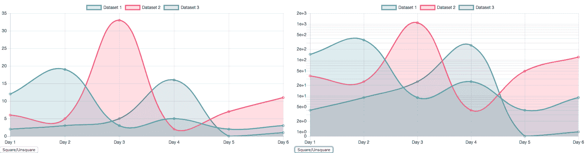

更改值和刻度后更新图表。代码：*Animation/animation-1-update.html.*

# 事件

你可以通过局部配置`options.events`属性或全局使用`Chart.defaults.global.events`来选择你的图表将响应哪些事件。默认配置包括一个包含六个事件名称的数组：

```js
events: ["mousemove", "mouseout", "click", "touchstart", "touchmove", "touchend"]
```

这些是当光标位于画布上下文内时浏览器将监听的事件。它们控制可点击项（如图例标签和工具提示）的行为。如果你正在编写自己的处理程序，你可能希望通过重新定义属性来包含包含较少事件的数组来关闭某些事件。例如，如果你想在一个图表中禁用悬停和触摸事件，只允许`click`事件，你可以在你的选项配置中添加以下内容：

```js
options: {
   events: ['click']
}
```

# 配置动画

你应该已经注意到，当你点击按钮时，线条不会立即移动到它们的新位置。图表平滑过渡，大约需要一秒钟。通过调用`update()`触发的过渡将自动使用标准动画配置。

有两个动画属性你可以轻松更改。它们如下列出：

| **属性** | **值** | **描述** |
| --- | --- | --- |
| 持续时间 | `Number` | 动画持续的时间（以毫秒为单位）。默认为 1,000（一秒）。 |
| 缓动 | `'linear'`, `'easeInQuad'`, `'easeOutQuad', 'easeInOutQuad'`, `'easeInCubic'`, `'easeOutCubic'`, `'easeInOutCubic'`, `'easeInQuart'`, `'easeOutQuart'`, `'easeInOutQuart'`, `'easeInQuint'`, `'easeOutQuint'`, `'easeInOutQuint'`, `'easeInSine'`, `'easeOutSine'`, `'easeInOutSine'`, `'easeInExpo'`, `'easeOutExpo'`, `'easeInOutExpo'`, `'easeInCirc'`, `'easeOutCirc'`, `'easeInOutCirc'`, `'easeInElastic'`, `'easeOutElastic'`, `'easeInOutElastic'`, `'easeInBack'`, `'easeOutBack'`, `'easeInOutBack'`, `'easeInBounce'`, `'easeOutBounce'`, `'easeInOutBounce'` | 用于动画的缓动函数。这些基于*Robert Penner 的缓动函数*（[robertpenner.com/easing](http://robertpenner.com/easing)）。如果你查看每个缓动函数的图形表示，选择起来会更简单，这些图形表示可在[`easings.net`](http://easings.net)找到。 |

选项.animation 对象的属性

要立即过渡到新值（不进行任何动画），你应该包含一个包含`duration:0`的对象：

```js
options: {
    animation: {
        duration: 0
    }
}
```

现在变化将立即发生。

属性可以在每个图表的选项对象中配置，或在`Chart.defaults.global`中全局配置。

有两个用于配置动画的`callback`属性，如下列出。一个允许你挂钩到动画的每个步骤，另一个允许动画完成后运行代码：

| **属性** | **参数** | **描述** |
| --- | --- | --- |
| `onProgress` | (`animation`): 主要属性有`animation.chart`（当前图表）、`animation.currentStep`和`animation.numSteps`（`currentStep`/`numSteps`返回动画到目前为止的百分比） | 在动画的每个步骤后调用。 |
| `onComplete` | (`animation`): 主要属性有`animation.chart`（当前图表）、`animation.currentStep`和`animation.numSteps`（`currentStep`/`numSteps`返回动画到目前为止的百分比） | 在动画结束时调用。任何在图表渲染后要应用的变化（如 Canvas 覆盖）应在此上下文中调用。 |

选项.animation 的回调属性

我们在前面示例的网页中添加了一个 HTML 进度条，并在以下代码中将折线图动画设置为持续五秒。在每一步，进度条通过`onProgress`回调函数更新。每次回调都会在每次调用时将当前步骤打印到 JavaScript 控制台：

```js
<body>
<canvas id="myChart" width="400" height="200"></canvas>
<form><button type="button" id="toggle">Square/Unsquare</button></form>
<progress id="progress" max="1" value="0"></progress>
<script>
    ...
    const progress = document.getElementById("progress");
    ...
    const myChart = new Chart("myChart", { type: 'line', data: {…},
        options: {
           animation: {
                 duration: 5000,
                onProgress: function(animation) {
                    console.log(animation.currentStep /  
                                animation.numSteps);
                    progress.value = animation.currentStep / 
                                     animation.numSteps;
                },
                onComplete: function(animation) {
                    console.log(animation.currentStep);
               }
            }
      }
})
    let button = document.getElementById("toggle");
    button.addEventListener('click', function() {…});
</script>
```

完整的代码在`Animation/animation-2.html`中。以下是动画进行到一半时的截图：


在更新图表后的五秒动画期间使用进度条。代码：*Animation/animation-2.html*。

在这个示例中，`onComplete` 回调只是简单地打印到控制台，但如果在图表渲染到屏幕后需要更新或更改任何内容，它是最重要的回调之一。如果你在回调之外将某个东西绘制到 Canvas 上，Chart.js 将会擦除它。在第四章“创建图表”中，我们使用它通过 Canvas API 在饼图上绘制文本。在本章中，我们在每次调整大小事件后给图表添加了渐变色。

# 摘要

在本章中，我们探讨了使用 Chart.js 创建交互式图表的多种配置外观和感觉的方法，包括使用原生属性，以及一些扩展和插件。

我们首先学习了如何设置全局默认值，这些默认值可以被多个图表继承，并用于在不同图表之间设置一致的主题，共享基本的布局、字体和配色方案。我们还探索了一些在线服务、工具、扩展和插件，用于样式化图表和添加标签。然后我们配置了图表在更新和用户交互后的行为，调整动画算法和回调。

你已经掌握了足够的 Chart.js 知识来创建任何图表。在下一章中，我们将更深入地探讨一些这些主题，配置工具提示，学习如何编程 Chart.js API，你还将学习如何创建自己的插件。

# 参考文献

**书籍和网站**：

+   Chart.js 官方文档和示例：[`www.chartjs.org/docs/latest/`](https://www.chartjs.org/docs/latest/)

**数据来源**：

+   世界海洋的体积（基于 ETOPO1）：`Chapter03/Pages/BarChart1.html` 以及其他。[`www.ngdc.noaa.gov/mgg/global/etopo1_ocean_volumes.html`](https://www.ngdc.noaa.gov/mgg/global/etopo1_ocean_volumes.html)

+   世界人口：`Chapter04/WPP2017_UN.csv`。*联合国 2017 年世界人口展望*。[`www.un.org`](https://www.un.org)
