# 第七章：高级 Chart.js

当您使用 Chart.js 创建数据可视化时，您的大部分工作将涉及准备数据，以便它可以被图表实例加载和使用。您不必过多担心字体、内边距、坐标轴、屏幕调整大小或响应性，因为新图表预先配置了默认值，旨在实现最佳展示和交互性。在上一个章节中，我们学习了如何调整不同类型图表的颜色、标签、动画和其他典型配置。在本章中，我们将探讨您不太经常使用且可能需要额外编码、扩展以及与其他库（如提示信息行为配置、标签生成、脚本、创建混合图表、创建插件、使用 Chart.js API 和使用 HTML Canvas 与 Chart.js）集成的配置主题。

本章您将学习以下内容：

+   提示信息配置

+   高级图例配置

+   显示多个图表

+   扩展 Chart.js

# 提示信息配置

提示信息是 Chart.js 用于揭示数据定量细节的主要功能。虽然一些上下文来自网格，但要在数据点旁边原生显示数据，唯一的方法是使用提示信息。当然，您也可以像我们在上一章中看到的那样标记值点，但这需要扩展或插件，并且如果过度使用可能会使图表显得杂乱。Chart.js 可视化依赖于交互性来显示细节。在本节中，我们将学习如何配置这些细节的显示方式。

可以使用 `options` 对象中的 `tooltips` 键为每个图表配置提示信息。也可以使用 `Chart.defaults.global.tooltips` 为所有图表配置。您可以配置的这些对象的属性列在以下表格中：

| **对象** | **值** | **描述** |
| --- | --- | --- |
| `titleSpacing` | 数字 | 每一行 *标题* 前后的空格。默认值是 `2`。 |
| `bodySpacing` | 数字 | 每一个 *提示信息* 项目前后的空格。默认值是 `2`。 |
| `footerSpacing` | 数字 | 每一行 *页脚* 前后的空格。默认值是 `2`。 |
| `titleMarginBottom` | 数字 | 在 `title` 之后的边距（像素）。默认值是 `6`。 |
| `footerMarginTop` | 数字 | 在 `footer` 之前的边距（像素）。默认值是 `6`。 |
| `xPadding` | 数字 | 像素单位的垂直内边距。默认值是 `6`。 |
| `yPadding` | 数字 | 像素单位的水平内边距。默认值是 `6`。 |
| `enabled` | `true` 或 `false` | 打开或关闭提示信息。默认值是 `true`。 |
| `intersect` | `true` 或 `false` | 如果为 `true`，则提示交互模式仅在光标正好悬停在点（在 `pointHitRadius` 内）上时应用。如果为 `false`，则始终应用。全局默认值是 `true`，但根据图表类型可能会有所变化。 |
| `mode` | `nearest`, `index`, `dataset`, `x`, `y`。已弃用的值是 `label`（与 `index` 相同），和 `single`（当 `intersect: true` 时，行为类似于 `nearest`）。 | 选择工具提示交互模式。`nearest` 显示最近点的值（每个工具提示包含一个项目），`index` 显示具有相同索引的所有点的值（每个 `dataset` 在同一个工具提示中都有一个项目），`dataset` 将整个 `dataset` 显示在工具提示中。仅对笛卡尔尺度提供两种其他模式：`x` 将包含所有具有相同 `x` 坐标值的项，`y` 将包含所有具有相同 `y` 坐标值的项。在笛卡尔尺度中，`index` 模式默认为 `x` 索引，也可以通过添加属性 `axis`: `y` 来设置 `y` 索引。全局默认值为 `nearest`，但根据图表类型而变化。 |
| `position` | `average`, `nearest`, 或自定义位置 | 定义工具提示相对于值点的位置。默认为 `average`。（您可以通过在 `Chart.Tooltip.positioners` 映射中创建一个返回包含 *x* 和 *y* 坐标对象的条目来自定义自己的自定义位置。） |
| `titleFontFamily`, `titleFontStyle`, `titleFontColor`, `titleFontSize` | `String` 和 `Number` | `title` 的字体属性（使用 `callbacks` 进行配置）。 |
| `bodyFontFamily`, `bodyFontStyle`, `bodyFontColor`, `bodyFontSize` | `String` 和 `Number` | `body` 的字体属性（使用 `callbacks` 进行配置）。 |
| `footerFontFamily`, `footerFontStyle`, `footerFontColor`, `footerFontSize` | `String` 和 `Number` | `footer` 的字体属性（使用 `callbacks` 进行配置）。 |
| `caretSize` | `Number` | 工具提示箭头的大小（以像素为单位）。默认为 `5`。 |
| `caretPadding` | `Number` | 箭头尖端与工具提示位置（例如值点）的距离。默认为 `2`。 |
| `cornerRadius` | `Number` | 圆角矩形的半径（以像素为单位）。默认为 `6`。 |
| `backgroundColor` | CSS 颜色 | 工具提示的背景颜色。默认为 `rgba(0,0,0,0.8)`。 |
| `multiKeyBackground` | CSS 颜色 | 着色框的背景（如果 `dataset` 颜色不透明则不可见）。默认为 `#fff`。 |
| `borderColor` | CSS 颜色 | 工具提示的边框颜色。默认为 `rgba(0,0,0,0)`。 |
| `borderWidth` | Number | 工具提示的边框宽度。默认为 0。 |
| `displayColors` | `true` 或 `false` | 如果为 `false`，则隐藏颜色框。默认为 `true`。 |
| `callbacks` | Object | 包含多个回调函数的对象。请参阅本章中工具提示 `callbacks` 的 *Tooltip callbacks* 部分。 |

工具提示的静态属性（用于 *options.tooltips* 键）

在以下示例中，更改了图表实例的提示框的几个默认样式属性。每个提示框将具有灰色背景、黄色 3 像素边框、粉色 16 像素标题、斜体正文和 10 像素箭头，距离数据点 10 像素：

```js
const data = {
   labels: ["One", "Two", "Three", "Four"],
   datasets: [{label:'Dataset 1',… },{label:'Dataset 2',…}, 
   {label:'Dataset 3',…}]
};
new Chart('chart', {type: 'line', data: data,
    options: {
        legend: { display: false },
        tooltips: {
            mode: 'index',
            titleFontSize: 16,
            titleFontColor: 'pink',
            bodyFontStyle: 'italic',
            titleSpacing: 10,
            caretSize: 10,
            caretPadding: 10,
            backgroundColor: 'rgba(10,10,60,.5)',
            borderColor: 'yellow',
            borderWidth: 3,
        },
    }
});
```

完整代码在`Tooltips/tooltip-1.html`中。结果如下：

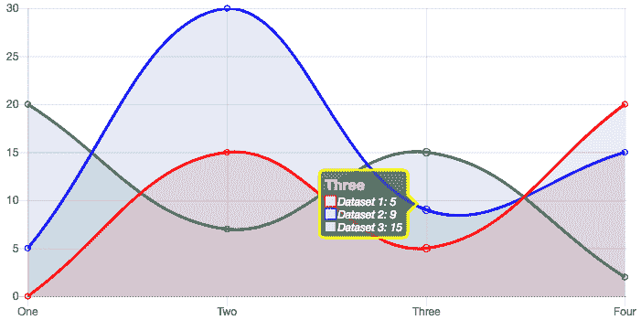

带有修改过的边框颜色和宽度、背景颜色、标题字体大小和颜色、正文字体样式的提示框，

带有刻度箭头大小和填充（从值点到箭头的距离）。代码：*Tooltips/tooltip-1.html.*

# 悬停交互

提示框响应悬停事件。下表列出了`hover`对象的属性，可以通过`Chart.defaults.global.hover`全局配置或通过`options.hover`局部配置：

| **Object** | **Value** | **描述** |
| --- | --- | --- |
| `intersect` | `true`或`false` | 与`tooltip.intersect`相同的行为。提示框可以响应悬停时的不同交叉状态。 |
| `mode` | `nearest`、`index`、`dataset`、`x`、`y`。已弃用的值是`label`（与`index`相同），以及`single`（当`intersect: true`时，行为类似于`nearest`）。 | 与`tooltip.mode`相同的行为。提示框可以响应悬停时的不同模式。 |
| `axis` | `x`、`y`、`xy` | 选择用于在悬停事件期间计算值点到光标距离的参数。默认为`x`。水平条形图覆盖此为`y`，以便`mode:index`可以选中不同的条形。 |
| `animationDuration` | `Number` | 动画持续时间。这会影响任何悬停事件，包括提示框。 |

悬停对象的配置选项

`hover`和提示框对象都支持模式（mode）和交叉（intersect）属性。它们很相似，但`hover`属性还适用于非提示框事件（通过可选的`onHover`回调配置）。

如果`intersect`属性为`true`，则只有在鼠标直接位于条形或饼图块上，或位于值点的一定半径内时（对于线形、散点图和气泡图），事件才会触发。如果`intersect`为`false`，则事件可能在鼠标未位于值点之前触发。

`mode`属性选择与事件相关的数据值。如果`intersect`为`false`，且`mode`为`nearest`，则将选择最近的点。

当在提示框中使用时，`mode`属性还确定哪些项目出现在提示框中。如果为`nearest`，它将显示鼠标所在点最近的价值。该属性还可以有以下值：

+   `point`，仅显示实际与点相交的项目（典型的内联图表）

+   `index`，显示相同索引处的所有点（在柱状图或饼图中很常见）

+   `dataset`，列出数据集中的所有点

还有两种仅适用于笛卡尔刻度的模式：*x*和*y*，分别选择具有相同*x*和*y*值的所有点。

编辑 `Tooltips/tooltip-3-modes.html` 文件并尝试不同的模式。以下截图显示了应用于具有三个数据集的折线图的某些提示信息模式：

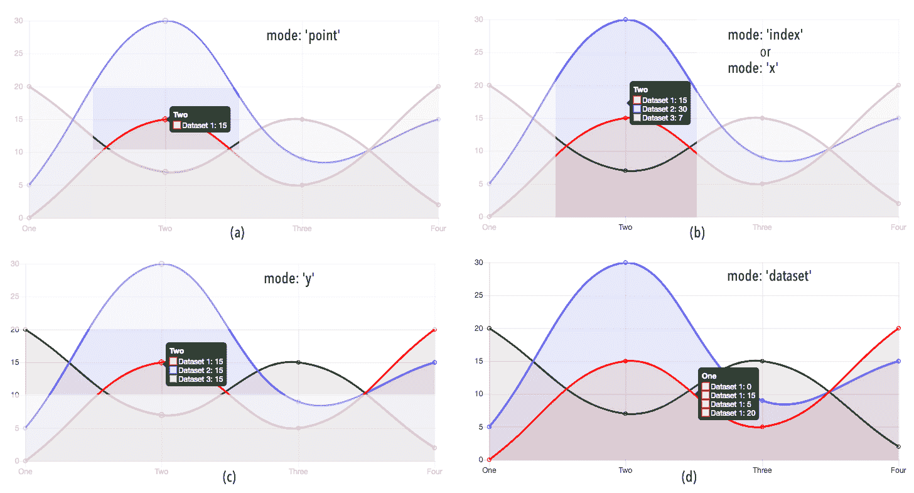

提示信息交互模式： (a) 显示单个值点； (b) 显示具有相同索引（或在此情况下为 x 值）的项目；

(c) 显示具有相同 *y* 值的项目； (d) 显示数据集中的所有项目。代码：*Tooltips/tooltip-3-modes.html.*

# 可脚本化属性

提示信息有三个属性接收函数。一个允许你用你自己的自定义 HTML 提示信息替换 Canvas 生成的提示信息。其他两个允许对提示信息项进行排序（当多个项出现在单个提示信息中）和过滤。以下列出了这些属性：

| **对象** | **参数** | **描述** |
| --- | --- | --- |
| `custom` | (`tooltipModel`) | 用于生成自定义 HTML 提示信息。请参阅本章中 HTML 提示信息的 *自定义 HTML 提示信息* 部分。 |
| `filter` | `(item, data)`; `data.datasets` 中的数据集数组；`data.labels` 中的标签数组；`item.x` 和 `item.y` 包含值点的坐标，`item.xLabel` 和 `item.yLabel` 是每个轴上的标签，`item.index` 是数据集中项目的索引，`item.datasetIndex` 是其数据集的索引。 | 一个返回 `true` 或 `false` 的函数，在渲染提示信息项之前被调用。如果返回 `false`，则该项将不会被渲染。 |
| `itemSort` | `(item1, item2)`; 每个参数都是一个具有以下属性的项对象：`x`，`y`，`xLabel`，`yLabel`，`index`，`dataSetIndex`。 | 对项目（在包含多个项的提示信息中）进行排序。该函数返回一个数字。如果 `item1 < item2`，则函数应返回负值；如果 `item1 > item2`，则应返回正值；如果它们相等，则返回零。 |

提示信息的可脚本化属性

让我们看看一些示例。在以下代码 (`Tooltip/tooltip-4-script-filter.html`) 中，过滤函数忽略了所有 *y* 值大于 `20` 的项目。此外，使用了 `events` 键来减少提示信息响应的事件。在此示例中，它们仅在点击时被激活：

```js
const data = {
   labels: ["One", "Two", "Three", "Four"],
   datasets: [{label:'Dataset 1',… },{label:'Dataset 2',…},
   {label:'Dataset 3',…}]
};
new Chart('chart', { type: 'line', data: data,
    options: {
        legend: { display: false },
        tooltips: {
            mode: 'index',
            intersect: false,
            filter: (item, data) => data.datasets[item.datasetIndex]
                                        .data[item.index] < 20
        },
        events: ['click']
    }
});
```

以下截图显示了点击 `index` 1 附近的值点时的结果。由于三个点中的一个大于 `20`，因此它没有显示在提示信息中：

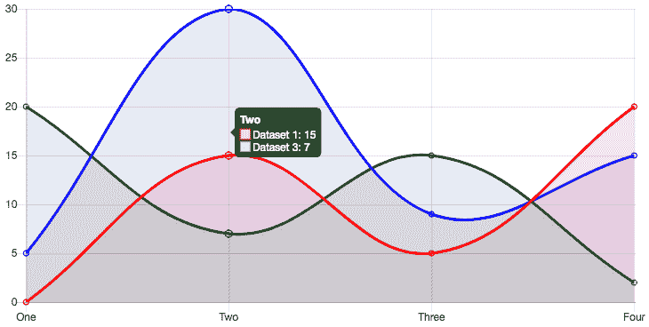

带有模式：仅过滤具有小于 20 的 *y* 值的项目的提示信息。代码：*Tooltip/tooltip-4-script-filter.html.*

此示例 (`Tooltip/tooltip-5-script-sort.html`) 配置了按 *y* 值的 *升序* 对项目进行排序，在同一图表中：

```js
new Chart('chart', { type: 'line', data: data,
        options: {
            legend: { display: false },
            tooltips: {
                mode: 'index',
                intersect: false,
                itemSort: (a,b) => b.y - a.y
            },
            events: ['click']
        }
    });
```

结果如下。请注意，提示信息项是按其 *y* 值排序的：

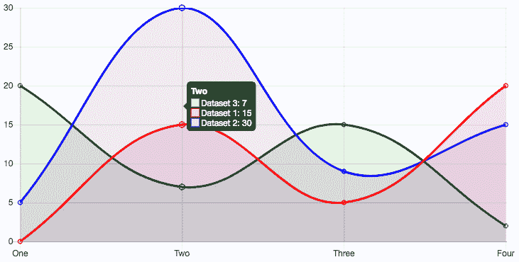

带有模式：'index' 的提示信息按其 *y* 值排序。代码：*Tooltip/tooltip-5-script-sort.html.*

# 提示信息回调函数

使用`callbacks`，您可以根据数据值和其他可访问属性动态生成工具提示中显示的项目文本内容和颜色。`Callbacks`是`tooltips.callbacks`对象的属性，可以在全局（`Chart.defaults.global.tooltips.callbacks`）或每个图表实例本地配置（`options.tooltips.callbacks`）。它们在表中按以下方式列出：

| **对象** | **参数** | **描述** |
| --- | --- | --- |
| `beforeTitle`, `title`, `afterTitle` | `(item[], data)`；`data.datasets`中的数据集数组；`data.labels`中的标签数组；每个项目元素包含以下属性：`x`，`y`，`xLabel`，`yLabel`，`index`，`dataSetIndex`。 | `title`函数返回工具提示标题的文本。您还可以实现其他函数以包含其上或其下的文本。 |
| `beforeBody`, `body`, `afterBody` | `body`函数返回工具提示主体的文本（包括标签）。您还可以实现其他函数以包含其上或其下的文本。 |  |
| `beforeFooter`, `footer`, `afterFooter` | `footer`函数返回工具提示脚注的文本。您还可以实现其他函数以包含其前或其后的文本。 |  |
| `beforeLabel`, `label`, `afterLabel` | `(item,data)`；`data.datasets`中的数据集数组；`data.labels`中的标签数组；`item.x`和`item.y`包含值点的坐标，`item.xLabel`和`item.yLabel`是每个轴的标签，`item.index`是项目在数据集中的索引，`item.datasetIndex`是其数据集的索引。 | `label`函数返回此标签的文本。您还可以实现其他函数以包含一个或多个标签上或其下的文本。 |
| `labelColor` | `(item, chart)` | 该函数返回单个项目标签文本框的颜色 |
| `labelTextColor` | `(item, chart)` | 该函数返回单个项目标签文本的颜色 |

用于创建和更改工具提示文本内容的回调函数

以下示例（`Tooltips/tooltip-6-callback.html`）使用`callbacks`向标题添加额外文本，在项目标签上下插入分隔符字符，并附加包含所有值点的平均值的`footer`：

```js
new Chart('chart', { type: 'horizontalBar', data: data,
    options: {
        legend: { display: false },
        tooltips: {
            mode: 'index',
            callbacks: {
                footer: (items, data) => 'Average: ' + (data.datasets
                                        .map(d=>d.data[items[0].index])
                                        .reduce((a,b)=>a+b, 0) /     
                                         items.length)
                                        .toFixed(2),
                title: (items, data) => "Stage " + items[0].yLabel,
                beforeBody: () => '============',
                afterBody: () => '------------------',
            }
        },
        events: ['click']
    }
});
```

结果如下：

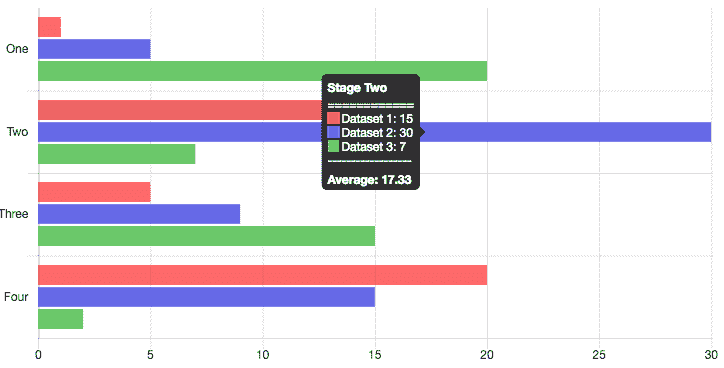

使用回调函数创建具有脚注、标题中额外文本以及主体前后分隔符的工具提示。代码：*Tooltips/tooltip-6-callback.html.*

# 自定义 HTML 工具提示

`Chart.defaults.global.tooltips.custom`（或`options.tooltips.custom`）属性接收一个函数，该函数应构建一个 HTML 工具提示并将其连接到作为参数传递的工具提示*模型*对象。工具提示模型是一个原生对象，它响应工具提示事件并存储工具提示属性。如果需要，其属性可以在 HTML 工具提示内部复制和重用。

以下示例（`Tooltips/tooltip-7-custom.html`）展示了如何创建一个包含图像的简单自定义 HTML 提示框。自定义提示框可以使用 HTML 创建，如以下片段所示，或者通过 DOM 编程创建，并且最初应该隐藏（`opacity: 0`）。当`hover`事件激活提示框时，模型的透明度会改变，自定义提示框会利用这种状态使自己可见：

```js
<html><head> ...
    <style> 
        #tooltip {
            opacity: 0;
            position: absolute;
            margin: 5px;
        }
    </style>
</head><body>
<canvas id="chart" width="200" height="100"></canvas>
<div id="tooltip"></div>
<script>
    const data = {
        labels: ["jupiter", "saturn", "uranus", "neptune"],
        datasets: [{
           data: [142984,120536,51118,49528],
           backgroundColor: ['#d7191c','#fdae61','#abdda4','#2b83ba'],
        }]
    };
    new Chart('chart', { type: 'bar', data: data,
        options: {
           legend: { display: false },
            title: {
                display: true,
                text: 'Planetary diameters',
                fontSize: 24
            },
            tooltips: {
                mode: 'index',
                intersect: true,
                enabled: false, // turn off canvas tooltips
                custom: function(model) {
                    const tooltip = document.getElementById('tooltip');
                    if(model.opacity === 0) {
                        tooltip.style.opacity = 0;
                        return;                    }
                   if(model.body) {
                        const value = model.body[0].lines[0];
                        tooltip.innerHTML = '<b>'+ value + " km<br/>"
                                            +'                                            +model.title[0] +'.jpg" 
                                            </img>';
                        const pos =   
                        this._chart.canvas.getBoundingClientRect();
                        tooltip.style.opacity = 1;
                        tooltip.style.left = pos.left + model.caretX +  
                        'px';
                        tooltip.style.top  = -50 + pos.top +  
                        model.caretY + 'px';
                    }
                }
            }
        }
    });
</script>
</body></html>
```

代码从提示框模型的`title`中提取标题和文件名，从模型的`body`中提取值。自定义提示框还使用了模型的坐标来决定其放置的位置。结果如下。如果您将鼠标悬停在*x*轴的标签或条形上，HTML 提示框将显示在每个条形的上方：

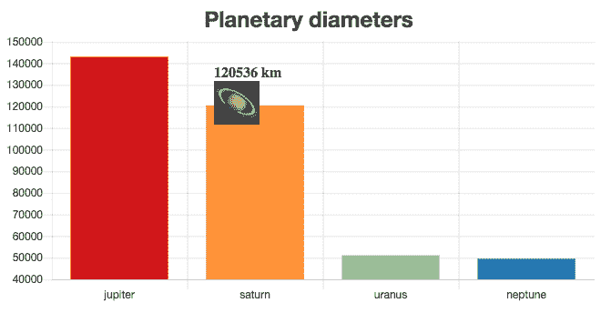

当鼠标悬停在条形或标签上时，会出现自定义 HTML 提示框的条形图。代码：*Tooltips/tooltip-7-custom.html.*

在饼图中定位提示框要复杂一些。有关如何创建自定义 HTML 提示框的更多示例，请查看官方文档中的示例页面。

# 高级图例配置

Chart.js 为图例和标签提供了默认的呈现和行为。在前一章中，我们看到了一些如何通过编程`onClick`事件处理程序回调来更改默认行为的例子。在本节中，我们将看到如何生成单个标签，如果您需要更多的控制，我们将看到如何创建自定义 HTML 图例。

# 生成标签

标签可以通过`generateLabels`回调属性生成。它们应该返回一个项目对象（与传递给`onClick`函数的对象相同），该对象包含以下列出的属性：

| **对象** | **值** | **描述** |
| --- | --- | --- |
| `text` | 字符串 | 标签的文本 |
| `datasetIndex` | 数字 | 标签的索引 |

| `fillStyle`, `strokeStyle`, `lineCap`, `lineJoin`,

`lineDash`, `lineWidth`, `lineDashOffset` | 与相应的 Canvas 命令相同的值 | 图例框的填充和描边属性 |

| `pointStyle` | `circle`, `cross`, `crossRot`, `dash`, `line`, `rect`, `rectRounded`, `rectRot`, `star`, `triangle` | 如果`legend.labels.usePointStyle`为`true`，则标签将使用与图表相同的点样式。这允许您为图例标签设置不同的点样式。 |
| --- | --- | --- |
| `hidden` | 布尔值 | 如果`true`，则与数据集相关的图表元素将不会渲染 |

图例标签对象的属性（由`onClick`接收并由`generateLabels`返回）

以下代码显示了使用`generateLabels`回调配置图例标签（`Legend/legend-1-gen-labels.html`）的配置。彩色框配置为旋转矩形，带有`pointStyle`。标签的`fontSize`控制字体和点的大小。每个数据集的边框颜色是每个标签的填充：

```js
options: {
    legend: {
        labels: {
            usePointStyle: true,
            fontSize: 14,
            generateLabels: function(chart) {
                const items = [];
                chart.data.datasets.forEach((dataset, i) => {
                    items.push({
                        text: dataset.label,
                        datasetIndex: i,
                        fillStyle: dataset.borderColor,
                        lineWidth: 0,
                        pointStyle: 'rectRot',
                    });
                });
                return items;
            },
        },  ...
    }
}
```

结果如下：

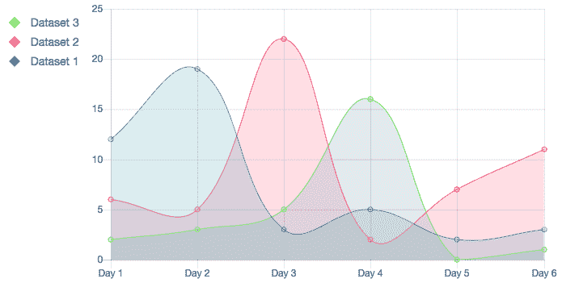

为图例生成具有不同符号的标签。代码：*Legend/legend-1-gen-labels.html.*

# HTML 图例

如果你有一个非常复杂的图例或者希望在 Canvas 之外显示图例，与页面中的 HTML 混合，你可以生成自定义 HTML 图例。要创建它们，你需要一个空的`<div>`块：

```js
<div id="chart-legends"></div>
```

因此，图例可以附加到页面的主体上。然后，你为`Chart.defaults.global.legendCallback`属性或`options.legendCallback`实现一个`callback`函数，该函数返回图例的 HTML。你可以动态创建内容，并使用从图表复制的属性值应用 CSS 样式。HTML 是通过`chart.generateLegend()`生成的。

通过示例更容易理解。以下代码从一个 HTML 列表实现了一个简单的 HTML 图例。你可以在`Legend/legend-2-html-callback.html`中运行完整代码：

```js
const myChart = new Chart("myChart", {
     type: 'line',
     data: {
         labels: ['Day 1','Day 2','Day 3','Day 4','Day 5','Day 6'],
         datasets: datasets,
     },
     options: {
         legendCallback: function(chart) {
             const labels = document.createElement("ul");
             labels.style.display = 'flex';
             labels.style.justifyContent = 'center';

             chart.data.datasets.forEach((dataset, i) => {
                 const item = document.createElement("li");
                 item.style.listStyle = 'none';
                 item.style.display = 'inline';

                 const icon = document.createElement("div");
                 icon.style.width = icon.style.height = '15px';
                 icon.style.display = 'inline-block';
                 icon.style.margin = '0 6px';
                 icon.style.backgroundColor = dataset.borderColor;

                 item.appendChild(icon); // add colored square
                 item.innerHTML += dataset.label; // add label text
                 labels.appendChild(item);
             });
             return labels.outerHTML;
         },
         legend: { display: false, position: 'bottom' }
     }
 });

 const legend = document.getElementById('chart-legends');
 legend.innerHTML = myChart.generateLegend(); // generates HTML
```

新图例不会替换默认标签。除非你希望显示两个图例，否则你应该使用`display: false`来隐藏默认图例。

这些 HTML 图例中不包含任何行为。你需要自己使用 JavaScript 事件来实现它们。以下截图显示了之前代码的结果：

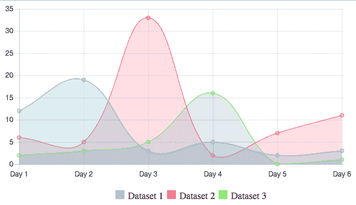

使用 HTML 创建的图例。代码：*Legend/legend-1-gen-labels.html.*

# 显示多个图表

许多时候，你需要在同一页面上显示多个图表，以展示不同的数据集，或者使用不同的图表类型来展示相同数据的不同视角。你也可能希望在同一轴上绘制多个图表，以便进行比较。另一种可能性是使用 Canvas 在图表之上或之下绘制，以添加上下文或额外数据。所有这些场景在 Chart.js 中都是可能的，但它们需要不同的策略。

# 在一个页面上渲染多个图表

你可以通过为每个图表绘制一个单独的 Canvas 来在同一页面上渲染多个不同的图表。

以下示例在一个页面上显示了四个共享相同数据的图表。首先，我们需要使用 HTML 和 CSS 设置画布：

```js
<html lang="en">
<head>
     <script src="img/Chart.min.js"></script>
     <style>
         .container {
             width: 98%;
             height: 80vh;
             position: absolute;
         }
         .top {
             height:50%;
             position: relative;
         }
         .col {
             width: 50%;
             position: absolute;
         }
         .col:nth-child(2n-1) {
             left: 50%;
         }
         .footer {
             height: 50%;
             position: relative;
         }
     </style>
 </head>
 <body>
 <div class="container">
     <div class="top" width="400" height="200">
         <div class="col"><canvas id="chart1"></canvas></div>
         <div class="col"><canvas id="chart2"></canvas></div>
     </div>
     <div class="top" width="400" height="200">
         <div class="col"><canvas id="chart3"></canvas></div>
         <div class="col"><canvas id="chart4"></canvas></div>
     </div>
     <div class="footer">
         <form>
           <button type="button" id="changeData">Get Data</button>
         </form>
     </div>
 </div>
 <script> ... </script>
 </body>
 </html>
```

以下代码展示了 JavaScript 代码。图表最初加载一些静态数据，但每次按下按钮时，数据都会改变，图表也会更新。`updateData()`函数被创建用来模拟每次按钮按下时加载到每个图表中的新随机数据：

```js
function updateData() {
     charts.forEach(c => {
         let datasets = 3
         if(c.canvas.id == 'chart4') {
             datasets = 1;
         }
         for(let i = 0; i < datasets; i++) {
             for (let j = 0; j < 6; j++) {
                c.config.data.datasets[i].data[j] =  
                Math.ceil(Math.random() * 25);
             }
         }
         c.update();
     });
 }

 Chart.defaults.global.legend.labels.boxWidth = 15;

 const data = [[12, 19, 3, 5, 2, 3],[6, 5, 22, 2, 7, 11],[2, 3, 5, 16,  
 0, 1]],
       labels = ['Day 1','Day 2','Day 3','Day 4','Day 5','Day 6'],
       strokes = 
      ['rgba(54,162,235,1)','rgba(255,99,132,1)','rgba(132,255,99,1)'],
       fills=   
      ['rgba(54,162,235,.2)','rgba(255,99,132,.2)',
      'rgba(132,200,99,.2)'];

 const datasets = [];
 for(let i = 0; i < data.length; i++) {
     datasets.push({
         label: 'Dataset ' + (i+1),
         data: data[i],
         backgroundColor: fills[i],
         borderColor: strokes[i],
     });
 }

 const charts = [];

 charts.push(new Chart("chart1", { type: 'line',
     data: { labels: labels, datasets: datasets }
 }));

 charts.push(new Chart("chart2", { type: 'bar',
     data: { labels: labels, datasets: datasets }
 }));

 charts.push(new Chart("chart3", { type: 'radar',
     data: { labels: labels, datasets: datasets },
     options: {legend: {display: false }}
 }));

 charts.push(new Chart("chart4", { type: 'doughnut',
     data: {
         labels: labels,
         datasets: [datasets[0]].map(d => ({
             data: d.data,
             backgroundColor: ['#d73027','#fc8d59','#fee090',
                               '#e0f3f8','#91bfdb','#4575b4'],
         })),
     },
     options: {legend: {position: 'left'}}
 }));

 document.getElementById("changeData")
         .addEventListener("click", updateData);
```

你可以看到以下结果。运行`Multiple/ multiple-1-canvas.html`中的完整代码。按下按钮并观察所有图表同时改变：

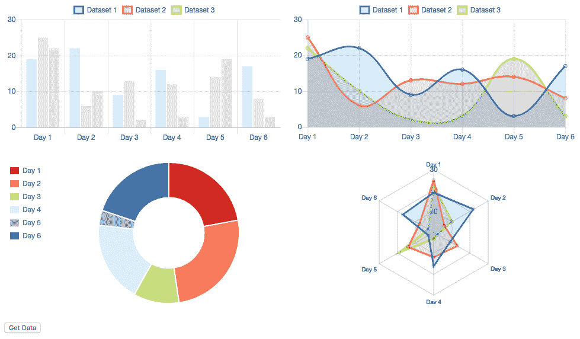

在一个页面上显示和更新多个图表。代码：*Multiple/multiple-1-canvas.html.*

# 混合图表

混合图表是不同类型的图表，它们共享相同的轴。一个典型的例子是将柱状图与一个或多个折线图叠加。在 Chart.js 中，这可以通过在数据集的一个或多个中添加不同的`type`属性来实现。

在以下示例（`Multiple/ multiple-2-mixed.html`）中，使用条形图显示一组值，并使用折线图显示累积平均值：

```js
const values = [12, 33, 42, 67, 90, 56, 51, 78, 95, 101, 120, 140];
const averages = [];
for(let i = 0; i < values.length; i++) {
     averages[i] = values.slice(0,i+1).reduce((a,b)=>a+b,0)/(i+1);
 }

 new Chart("myChart", {
     type: 'bar',
     data: {
         labels: ['Jan','Feb','Mar','Apr','May','Jun','Jul',
                  'Aug','Sep','Oct','Nov','Dec'],
         datasets: [{
             type: 'line',
             label: 'Line dataset (average)',
             data: averages,
             borderColor: 'red',
             fill: false
         },{
             label: 'Bar dataset (totals)',
             data: values,
             borderColor: 'blue',
             backgroundColor: 'rgba(0,0,120,.6)'
         }]
     }
 })
```

由于`bar`是默认类型，因此不需要`type`属性。每种类型也可能有额外的数据集。

结果如下：

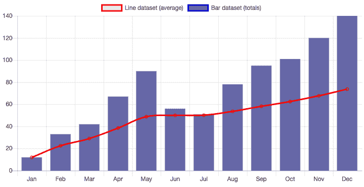

混合条形图/折线图。代码：*Multiple/multiple-2-mixed.html.*

# 在画布上叠加

在图表上绘制文本和图形的一种方法是在图表完全加载后在其相同的画布上绘制。您可以通过将代码实现为分配给`animation.onComplete`属性的函数来完成此操作。您还可以编写一个简单的插件。另一种在图表上方或下方绘制的方法是在另一个画布上绘制，并将其定位在您的图表画布的*正好*上方或下方。如果您不会调整页面大小，这很容易做到。如果您进行任何调整大小，您将不得不编写额外的脚本以缩放画布内容，以保持与图表（在这种情况下，插件将是一个更好的解决方案）同步。

例如，让我们使用我们在第二章中加载和渲染的`GeoJSON`世界地图，*技术基础*，并将其放置在第四章中创建的气泡图下，*创建图表*的城市人口。由于地图使用简单的圆柱投影，我们只需使它们大小相同，并使用 CSS 绝对定位将一个堆叠在另一个之上：

```js
<html lang="en">
 <head>
     <script src="img/canvasmap.js" ></script>
     <script src="img/Chart.min.js"></script>
     <script src="img/papaparse.min.js"></script>
     <style>
         canvas {
             position: absolute;
             top:  0;
             left: 0;
         }
     </style>
 </head>
 <body>

<canvas id="map" width="1000" height="500"></canvas>
<canvas id="my-bubble-chart" width="1000" height="500"></canvas>
<script>...</script>
</body></html>
```

绘图也必须从相同的位置开始，并使用相同的比例。代码使用了`JavaScript/canvasmap.js`中的四个函数：一个简单的脚本，用于从 GeoJSON 数据绘制地图：

+   `map.setCanvas(canvas)`：接收将要绘制地图的背景画布

+   `map.drawMap(geodata)`：接收一个 GeoJSON 特征的数组并绘制地图

+   `map.scaleX(longitude)`和`map.scaleY(latitude)`：将经纬度转换为像素坐标

以下代码获取地图的`canvas`上下文，并设置其填充和描边样式，加载并解析包含世界地图形状的 GeoJSON 文件，以及包含城市名称、人口、纬度和经度的 CSV 文件。然后调用函数绘制地图和图表：

```js
const mapCanvas = document.getElementById("map");
const mapContext = mapCanvas.getContext("2d");

 // Map ocean background
 mapContext.fillStyle = 'rgb(200,200,255)';
 mapContext.fillRect(0, 0, mapCanvas.width, mapCanvas.height);

 // countries border and background
 mapContext.lineWidth = .25;
 mapContext.strokeStyle = 'white';
 mapContext.fillStyle = 'rgb(50,50,160';

 // setup map canvas
 map.setCanvas(mapCanvas); // Function from JavaScript/canvasmap.js

 // load files
 const files = ['../Data/world.geojson', '../Data/cities15000.csv'];
 const promises = files.map(file => fetch(file).then(resp =>   
 resp.text()));
 Promise.all(promises).then(results => {

     // Draw the map
     const object = JSON.parse(results[0]);
     map.drawMap(object.features); // function from  
     JavaScript/canvasmap.js

     // Draw the chart
     const data = Papa.parse(results[1], {header: true});
     drawChart(data.data);  // function described below
 });
```

每个气泡的半径将与人口数量成一定比例。此函数将返回一个适合在地图上显示的值：

```js
function scaleR(value) {
     const r = Math.floor(value / 100000);
     return r != 0 ? r/10 : .25;
 }
```

`drawChart()`函数使用解析的 CSV 数据集生成一个包含位置对象的数组，每个对象包含*名称*和气泡图所需的属性：`r`半径和*x*，*y*坐标。生成的`locations`数组用作气泡图的`dataset`：

```js
function drawChart(datasets) {
     const locations = [];
     datasets.forEach(city => {
         const obj = {
             x: map.scaleX(+city.longitude), // From  
             JavaScript/canvasmap.js
             y: map.scaleY(-city.latitude),  // From 
             JavaScript/canvasmap.js
             r: scaleR(city.population),
             name: city.asciiname
         };
         locations.push(obj);
     });

     const dataObj = {
         datasets: [
             {   data: locations,
                 backgroundColor: function(context) {...}
             }
         ]
     }
```

`options` 配置对象必须配置刻度，以确保没有边距。设置刻度的 `min` 和 `max` 属性，移除图例，并设置 `responsive:false` 将保证这一点。工具提示也被配置为显示名称和人口（这里没有显示，但可以在 `Multiple/multiple-3-overlay.html` 中看到完整的代码）：

```js
    const chartObj = {
         type: "bubble",
         data: dataObj,
         options: {
             scales: {
                 xAxes: [{ display: false,
                           ticks: {
                             min: map.scaleX(-180), // match map size  
                             with
                             max: map.scaleX(180)   // canvas size
                         }
                     }
                 ],
                 yAxes: [{ display: false,
                           ticks: {
                             min: map.scaleY(-90), // match map size 
                             with
                             max: map.scaleY(90)   // canvas size
                         }
                     }
                 ]
             },
             tooltips: {...}, // see full code
             animation: { duration: 0 },
             responsive: false,
             legend: { display: false }
         }
     };
     new Chart("my-bubble-chart", chartObj);
 }
```

最终结果是如下。图表是交互式的；你可以悬停在大型城市上以获取详细信息：

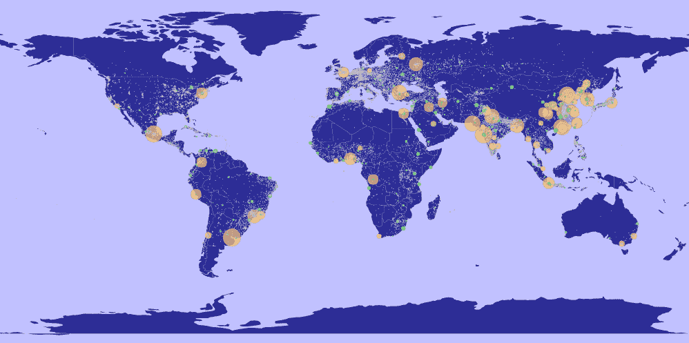

两个堆叠的 HTML Canvas：一个绘制 SVG GeoJSON 地图，另一个使用 Chart.js 绘制气泡图。

代码：*Multiple/multiple-3-overlay.html.*

由于在这个示例中使用了非常大的文件，加载图表需要一些时间，并且在某些系统上工具提示可能运行得有点慢。一种快速优化方法是，在加载之前减少数据文件的大小。也可以过滤并仅使用大城市，用 Canvas 分别绘制小城市。

# 扩展 Chart.js

有几种方法可以扩展 Chart.js。可以使用原型方法、回调和事件处理器与渲染过程交互；可以创建插件，它们有自己的生命周期，并且更容易在其他图表中重用；还可以从现有图表或甚至创建新的图表和刻度扩展 Chart.js。

# 原型方法

原型方法在渲染和更新过程中自动调用。如果需要干扰渲染过程，也可以直接调用它们。它们列在以下表中：

| **方法** | **描述** |
| --- | --- |
| `destroy()` | 销毁图表实例。如果希望重用画布或完全删除图表，可以使用此方法。 |
| `reset()` | 将图表恢复到其初始状态（布局之后和初始动画之前）。可以使用 `render()` 或 `update()` 触发新的动画。 |
| `stop()` | 停止动画循环。这通常在 `onProgress` 回调中调用。调用 `render()` 或 `update()` 将继续动画。 |
| `clear()` | 清除图表画布（在图表完成渲染后生效）。可以调用 `render()` 或 `update()` 重新绘制它。 |
| `resize()` | 调整图表大小。每当画布大小调整时自动调用。 |
| `update(config)` | 更新图表。在数据集有任何更改后应调用此方法。可以包含一个具有以下属性的配置对象：*duration*（数字）用于控制重绘动画的持续时间，*lazy*（布尔值）用于决定动画是否可以被其他动画中断，以及 *easing*（字符串），用于选择缓动函数。 |
| `render(config)` | 重新绘制所有图表元素，但不更新新数据对应的图表元素。 |
| `toBase64Image()` | 将图表生成一个新的 base64 编码的 PNG 图像。它可以在 HTML 页面上显示，或转换为 blob 以供下载。 |
| `generateLegend()` | 当调用时，返回 `options.legendCallback` 属性的内容（一个 HTML 图例）。 |
| `getElementAtEvent(e)` | 在事件处理程序中使用，以获取事件中的元素。 |
| `getElementsAtEvent(e)` | 在事件处理程序中使用，以获取在事件中具有相同数据索引的所有元素。 |
| `getDatasetAtEvent(e)` | 在事件处理程序中使用，以获取属于数据集的元素数组。 |
| `getDatasetMeta(index)` | 返回与索引对应的数据集的元数据。 |

Chart.js 原型方法

其中一些方法用于触发插件中生命周期回调的执行。许多方法已经被自动调用，并且可能不是在动画的所有阶段都有效，因为其他阶段可能会调用取消所需效果的方法。

在本章中，我们看到了 `generateLabels()` 的一个示例，在前一章中，我们使用了 `update()`。事件方法在事件处理程序中很常见，这些处理程序接收一个 JavaScript 事件。

`toBase64Image()` 方法生成一个 Base64 图片字符串。在 `animation.onComplete` 或在任何仅当图表完全绘制时调用的 `callback` 函数中调用它（否则可能会生成部分绘制的或空白图片）。它返回一个字符串，可以分配给 HTML 图像的 `src` 属性，以便在 HTML 页面上进行渲染：

```js
<image id="image"></image>
…
<script>
new Chart("chart", { type: 'line', data: {…},
     options: {
         animation: {
             onComplete: function () {
                 let image = document.getElementById('image');
                 image.src = this.toBase64Image();
        }
    }
});
</script>
```

您还可以使用它通过 blob 函数创建用于下载的图片。使用从 [www.npmjs.com/package/b64-to-blob](http://www.npmjs.com/package/b64-to-blob) 可用的 `b64-to-blob` 函数，或者通过在您的页面上添加以下行通过 CDN 使用：

```js
<script src="img/b64-to-blob"></script>
```

在您想要下载链接的位置添加以下标签：

```js
<a id=’link’ download=’chart.png’></a>
```

然后，将此代码放置在 `animation.onComplete` 函数中：

```js
const link = document.getElementById('link');
const blob = b64toBlob(image.src.split(',')[1], 'image/png');
link.href = URL.createObjectURL(blob);
```

在图表加载后，它将创建一个链接，点击该链接将下载图表的 PNG 图片。完整的代码位于 `Extensions/ext-1-prototype.html`。

# 创建插件

插件是扩展 Chart.js 的最高效方式。插件可以在图表渲染周期的不同阶段之前和之后插入代码。在每个阶段，它可以访问图表对象并读取可配置的选项。这可以用来更改图表的几乎所有属性或行为。

插件被设计成可重用的。在前几章中，我们使用了几个流行的插件以不同的方式扩展了 Chart.js。它们非常适合封装复杂性，但简单的插件也非常有用。

在最后一个例子中，我们为图表的 PNG 版本创建了一个下载链接。如果你尝试过，你可能已经注意到图像有一个透明的背景。如果你的背景是白色的，这没问题，但如果不是，图表可能难以阅读。解决这个问题的天真方法是用 CSS 或填充命令将画布涂成白色。但是，这不会起作用，因为 Chart.js 在其渲染周期中会重新绘制画布。你还需要处理任何动画、调整大小、更新和其他可能在你更改颜色后重置背景的事件。这是一个插件用例。使用插件，你可以在渲染周期中插入代码，在初始化画布之后、绘制图表之前绘制背景。

Chart.js 的渲染生命周期如下所示。当图表首次加载时，它执行 **init**、**update** 和 **render** 步骤。每次页面调整大小，都会执行 **update** 和 **render**，在 **events** 上，执行 **render** 步骤：

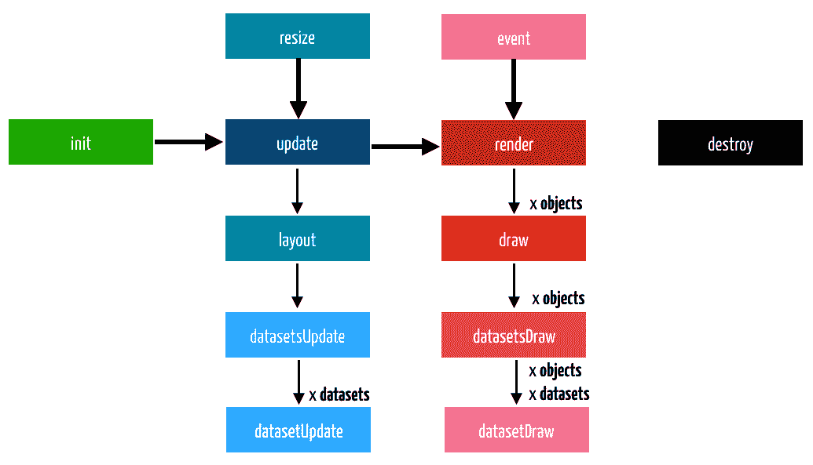

Chart.js 生命周期。每个阶段都可以被插件回调拦截。

根据你的插件，你可能需要拦截这些步骤中的一个或多个。以下表格列出了插件可用的回调函数。每个 `callback` 函数至少包含两个参数：对图表实例的引用和一个 `options` 对象（在 `options.plugins` 下的插件 ID 键配置）。一些回调可能还有其他参数：

| **方法** | **参数** | **描述** |
| --- | --- | --- |
| `beforeInit` `afterInit` | (*chart, options*) | 在调用新的 `Chart()` 之前和之后调用 |
| `beforeUpdate` `afterUpdate` | (*chart, options*) | 在 *update* 阶段之前和之后调用 |
| `beforeLayout` `afterLayout` | (*chart, options*) | 在 *layout* 阶段之前和之后调用 |
| `beforeDatasetsUpdate` `afterDatasetsUpdate` | (*chart, options*) | 在更新所有数据集之前和之后调用 |
| `beforeDatasetUpdate` `afterDatasetUpdate` | (*chart, dataset, options*) | 在更新每个数据集之前和之后调用 |
| `beforeRender` `afterRender` | (*chart, options*) | 在 *render* 阶段之前和之后调用 |
| `beforeDraw` `afterDraw` | (*chart, easing, options*) | 在 *draw* 阶段之前和之后调用 |
| `beforeDatasetsDraw` `afterDatasetsDraw` | (*chart, easing, options*) | 在绘制所有数据集之前和之后调用 |
| `beforeDatasetDraw` `afterDatasetDraw` | (*chart, dataset, options*) | 在绘制每个数据集之前和之后调用 |
| `beforeEvent` `afterEvent` | (*chart, event, options*) | 在 *events* 之前和之后调用 |
| `resize` | (*chart, dimensions, options*) | 在调整大小后调用 |
| `destroy` | (*chart, options*) | 在调用 `chart.destroy()` 之后调用 |

可以在插件中使用的生命周期回调

要查看这些方法的演示，运行`Extensions/ext-2-plugin-lifecycle.html`文件。它会在渲染和销毁具有三个插件的图表时记录每个生命周期事件。

插件是一个简单的对象。除非您计划在`*options*`对象中配置插件，否则不需要`id`属性。您可以仅包含所需的回调属性。以下代码将创建一个简单的可配置插件，该插件将在图表前绘制一个蓝色方块，并在坐标轴前绘制一个红色方块，但位于条形图后面（`Extensions/ext-3-simple-plugin.html`）：

```js
const plugin = {
     id: 'p1',
     afterRender: function(chart, options) {
         chart.ctx.fillStyle = 'blue';
         chart.ctx.fillRect(60,60,100,100);
     },
     beforeDatasetsDraw: function(chart, percent, options) {
         chart.ctx.fillStyle = 'red';
         chart.ctx.fillRect(200,60,100,100);
     },
 };
```

此效果在此处显示：

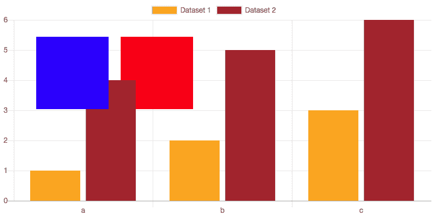

在图表中使用简单的插件绘制了蓝色和红色方块。代码：*Extensions/ext-3-simple-plugin.html.*

如果您在本地编写插件并且有多个图表，您可以使用`Chart()`构造函数中的`*plugins*`键包含要添加到每个图表的插件列表。它接受一个数组：

```js
new Chart("chart", {
     type: 'bar',
     data: {…},
     options: {…},
     plugins: [plugin1]
 });
```

应尽可能使插件可重用。可重用插件通常在单独的`.js`文件中创建，并自动对所有图表可用。在这种情况下，它们应使用以下方式全局注册：

```js
Chart.plugins.register(plugin);
```

让我们为最后一个示例创建一个插件，以便图片和图表都有不透明的背景。插件应具有可配置的选项。如果您可以为每个图表配置背景颜色，那么重用此插件的可能性更大。我们还可以添加绘制背景图片的可能性。该插件将存储在单独的 JavaScript 文件`JavaScript/chartback.js`中，该文件创建插件对象并将其全局注册。`id`是必要的，这样图表就可以识别插件并配置其选项。

由于每次图表大小调整或更新时都需要重新绘制图片，因此最佳绘制位置是在`beforeDraw`回调中。此代码还将图片放置在坐标轴后面：

```js
const bgPlugin = { id: 'chartback',
    beforeDraw: function(chart, steps, options) {
       let ctx = chart.ctx;
        if(options.backgroundColor) {
            ctx.fillStyle = options.backgroundColor;
            ctx.fillRect(0, 0, chart.width, chart.height);
        }
        if(options.backgroundImage) {
            let image = new Image(chart.width, chart.height);
            image.src = options.backgroundImage;
            ctx.drawImage(image, 0,0,chart.width, chart.height);
        }
    }
}
Chart.plugins.register(bgPlugin);
```

要使用此插件，将其导入到将创建图表的 HTML 文件中：

```js
<script src="img/chartback.js"></script>
```

此插件的可配置选项可以在`options.plugins.chartback`键（`chartback`是插件的 ID）中设置。此代码位于`Extensions/ext-4-chartback.html`：

```js
new Chart("chart", { type: 'bar', data: {…},
    options: {
        animation: {…},
        plugins: {
            chartback: {
                backgroundColor: 'white',
                backgroundImage: '../Images/mars.jpg'
            }
        }
    },
});
```

图表将带有背景图片绘制。如果您不想显示图片，只需设置`backgroundColor`，就可以得到一个具有不透明背景的图表。以下截图显示了包含图表和由图片查看器应用程序加载的`.png`文件的网页：

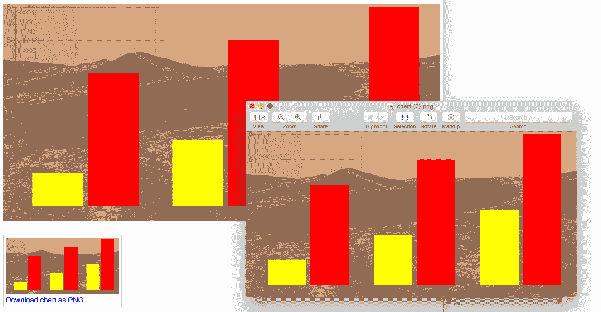

使用一个将背景图片放置在图表后面的插件。代码：*Extensions/ext-4-chartback.html.*

# Chart.js 扩展

除了插件，Chart.js 还包括一个高级扩展 API，你可以使用它来扩展图表和坐标轴。使用此 API，你可以通过实现提供的接口从现有的图表类型派生，或者创建全新的图表类型。这个主题超出了本书的范围，但你可以在官方文档中尝试提供的示例，或者可能使用一些已经广泛可用的许多流行扩展。官方文档中列出了其中的一些。

# 摘要

在本章中，我们探讨了几个你可能很少需要但能让你对图表的外观和感觉有更多控制的 Chart.js 高级主题，允许高度定制，并有可能将其与标准 Web 技术和框架集成。

我们学习了如何使用原生 Canvas 选项和自定义 HTML 扩展来配置工具提示和图例的展示和行为，以及如何使用 Canvas 创建包含多个图表、混合图表和与其他图形叠加的图表页面。我们还使用 Chart.js 的编程 API 编写了扩展，以生成图表的 PNG 版本，并创建了一个简单的插件，该插件可以向图表添加背景图片。

# 参考文献

**书籍和网站**:

+   Chart.js 官方文档和示例：[`www.chartjs.org/docs/latest/`](https://www.chartjs.org/docs/latest/)

+   Palette.js 颜色方案：[`google.github.io/palette.js/`](http://google.github.io/palette.js/)

+   Cynthia Brewer 的 Color brewer 2.0：[`colorbrewer2.org/`](http://colorbrewer2.org/)

+   Patternomaly 插件：[`github.com/ashiguruma/patternomaly`](https://github.com/ashiguruma/patternomaly)

+   Datalabels 插件：[`github.com/chartjs/chartjs-plugin-datalabels`](https://github.com/chartjs/chartjs-plugin-datalabels)

+   Outlabels 插件：[`github.com/Neckster/chartjs-plugin-piechart-outlabels`](https://github.com/Neckster/chartjs-plugin-piechart-outlabels)

**数据来源**:

+   世界海洋的体积（基于 ETOPO1）：`Chapter03/Pages/BarChart1.html` 及其他。[`www.ngdc.noaa.gov/mgg/global/etopo1_ocean_volumes.html`](https://www.ngdc.noaa.gov/mgg/global/etopo1_ocean_volumes.html)

+   地理数据库：`Chapter02/Data/cities1000.csv`。GeoNames 地理数据库：[www.geonames.org](http://www.geonames.org)

+   世界 GeoJSON 地图：`Chapter02/Data/world.geojson`。简化版本改编自 [`www.naturalearthdata.com`](https://www.naturalearthdata.com)
