# 1

# 由 Clip Studio Paint 创作的漫画和插画图像库

大家好！欢迎来到**Clip Studio Paint**的乐趣世界。无论您是想开始您的创意之旅，还是只是想提高您的技能，您都来到了正确的地点。通过阅读本书，您将发现控制数字工具以创作漫画的巨大自由度。有些章节甚至可能会激发您尝试以前从未想象过可以利用的不同类型的艺术和效果！无论何时您感到困惑或不确定，您都可以随时回到这本书来检查如何使用某些工具。这将是一次有趣的旅程，帮助您提高表达漫画故事的能力。那么，让我们开始我们的冒险吧。

首先，本章致力于向您展示 Clip Studio Paint 创作的视觉示例。只需浏览本章的页面，我们就能确切地了解 Clip Studio Paint 具有哪些功能和能力。您也可以将其视为本书过程中开始发展创意想法的早期窗口。

别担心——随着我们的进展，这些工具和技术将逐步解释。在本章中，您将找到介绍每个工具的书籍部分，这样您就可以跳转到详细说明您想学习的精确技巧的地方。当然，如果您已经熟悉某些主题，也可以自由跳过。

本章将涵盖以下主要内容：

+   插画库

+   使用了哪些工具

# 插画库

在接下来的章节中，我们将预览您将在本书中学习如何使用的每个 Clip Studio Paint 工具。如果您对某种特定风格特别感兴趣，可以考虑直接跳转到那一章学习技巧。

*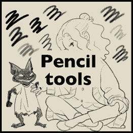*

图 1.1：铅笔工具示例图像

## 铅笔工具

*图 1.1* 展示了本工具集中可用的铅笔示例。您可以使用铅笔进行草图绘制和表达温馨、巧妙的艺术。是的，您可以使用铅笔工具完成整个全彩漫画插画！关于如何使用铅笔的详细信息可以在*第三章*，*铅笔绘制：图层和图层属性面板*中找到。

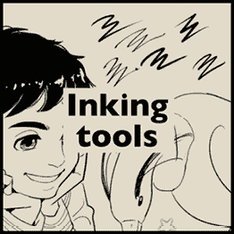

图 1.2：墨水工具示例图像

## 墨水工具

*图 1.2* 展示了本工具集中可用的钢笔示例。这些是漫画中最受欢迎的工具。它们产生干净、清晰的漫画插画，使得在场景中发生的事情一目了然，即使在彩色或质量较差的纸张上打印仍然清晰。关于如何使用钢笔的详细信息可以在*第八章*，*墨水工具入门*中找到。

*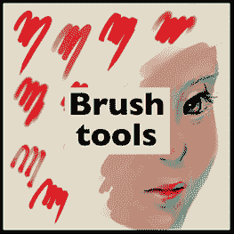*

图 1.3：笔刷工具示例图像

## 笔刷工具

*图 1.3* 展示了此工具集中可用的画笔示例。是的，就像物理画笔一样，我们可以在最新版本的 Clip Studio Paint 中使用画笔工具混合和混合颜色！油画、水彩和书法……那里有如此多的好画笔。如何使用画笔的详细信息可以在 *第四章*，*介绍 Clip Studio Paint 画笔* 中找到。

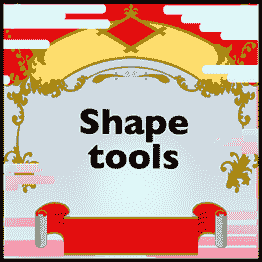

图 1.4：形状工具示例图像

## 形状工具

*图 1.4* 展示了形状工具绘制的示例。这些工具让您摆脱了摇摆不定的线条。相反，您可以使用形状工具创建准确、精确的对象、建筑和装饰形状！更多关于探索矢量图层的信息可以在 *第十一章*，*探索矢量图层* 中找到。

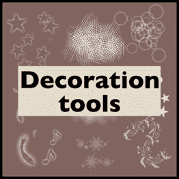

图 1.5：装饰工具示例图像

## 装饰工具

*图 1.5* 展示了此工具集中可用的装饰示例。它们非常适合表达情感、场景的基调以及服装的图案！如何使用装饰工具的详细信息可以在 *第四章*，*介绍 Clip Studio Paint 画笔* 中找到。

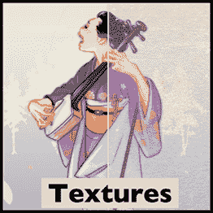

图 1.6：纹理示例

## 纹理

*图 1.6* 展示了带纹理和不带纹理的示例图像。如果您想在艺术作品中添加纸张/划痕/腐朽纹理，您可以通过创建或下载纹理图像来添加额外的效果。

您可以简单地添加一个纹理图像的额外图层并更改图层混合模式。您可以在 *第十六章*，*使用 Clip Studio Paint 为漫画上色* 中了解更多信息。

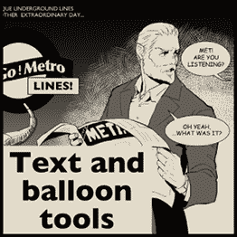

图 1.7：文本和气泡工具示例

## 文本和气泡工具

*图 1.7* 展示了文本和气泡工具的示例。漫画创作涉及多个阶段，包括分镜草图、上色（如果是彩色漫画）、添加色调和效果以及添加文本。因此，您可以添加对话来讲述故事。您可以在 *第七章*，*使用文本和气泡工具* 中学习如何添加文本和对话气泡。

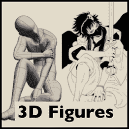

图 1.8：3D 图形示例

## 3D 图形

*图 1.8* 展示了使用 3D 图形作为姿态参考的示例。您可以通过参考或追踪 3D 模型来绘制角色。这在您想要绘制准确姿势或从不同角度的物体/身体时特别有用。更多关于使用 3D 模型的信息可以在 *第十四章*，*使用 3D 图形和物体* 中找到。

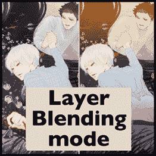

图 1.9：图层混合模式示例

## 图层混合模式

*图 1.9* 展示了带有和没有图层混合模式的绘图示例。在完成您的绘图的基本着色后，您可能想要添加阴影、光照或光反射，甚至改变整体印象。您可以使用图层混合模式来实现这一点。您可以在*第十六章*，*使用 Clip Studio Paint 为漫画上色*中查看所有可用的效果。

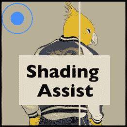

图 1.10：渲染辅助样本

## 渲染辅助

*图 1.10* 展示了带有和没有**渲染辅助**的绘图示例。在完成您的绘图的基本着色后，您可能想要给它添加有效的阴影。您可以选择添加哪种类型的阴影，例如**简单阴影**或**黄昏阴影**。示例图像显示了**黄昏阴影**。您可以在*第十六章*，*使用 Clip Studio Paint 为漫画上色*中查看所有可用的效果。

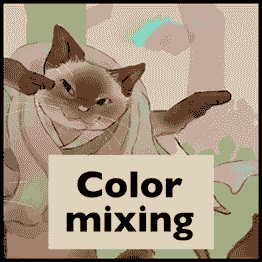

图 1.11：颜色混合样本

## 颜色抖动

*图 1.11* 展示了使用颜色抖动效果的绘图示例。Clip Studio Paint 的最新版本使得非常生动和逼真的颜色混合成为可能。只需将您的画笔设置为**更改笔尖**，您就可以在绘图时享受颜色混合的效果。更多详情请参阅*第四章*，*介绍 Clip Studio Paint 画笔*。

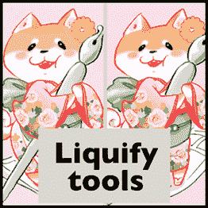

图 1.12：流体工具样本

## 流体工具

*图 1.12* 展示了使用**流体工具**润色前后的绘图示例。注意角色的脸部略微膨胀，就像鱼眼效果一样。如您所见，您可以通过用笔追踪图像的特定部分来改变图像的形状和大小。当您想要对形状进行细微调整时，这非常方便。更多详情请参阅*第十六章*，*使用 Clip Studio Paint 为漫画上色*。

# 摘要

现在您已经看到了一些使用 Clip Studio Paint 创作的实际艺术作品，我希望您对程序提供的工具和功能有了更好的了解。您现在可能还不知道如何精确地实现这些功能，因为您不需要成为专家就能使用它们，但了解可用的工具和功能总是好的。

您可能也注意到，一些类似刮擦或渗透的模拟效果也可以数字化制作。这将为您展示事故、污渍或颜色意外混合的机会，这些可能会为您的作品增添有趣的效果！

如果你已经将一些图片扫描到你的设备上，你可以添加这些效果作为额外的细节。如果能找到一两个吸引你的效果那就太好了。阅读完这一章，安装程序，并获取绘图板后，你可以忽略其余章节的顺序，直接跳转到详细描述你想要学习的技术的那一章节。

但最重要的是，享受 Clip Studio Paint 的乐趣！

# 加入我们的 Discord！

与其他用户一起阅读这本书。提问，为其他读者提供解决方案，等等。

扫描二维码或访问链接加入社区。

[`packt.link/clipstudiopaint`](https://packt.link/clipstudiopaint)

