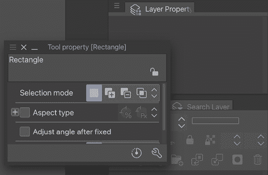

# 第二章：安装 Clip Studio Paint Pro 和界面基础

在本章中，我们将直接深入主题，开始了解 Clip Studio Paint。首先，我们将查看运行 Clip Studio Paint 的推荐系统规格以及如何安装程序。我们还将讨论绘图板的重要性以及如何获取一个绘图板。

一旦我们安装了 Clip Studio Paint，我们将了解其界面。首先，我们将回顾默认界面的各个部分。然后，我们将学习如何根据我们的需求自定义和更改界面，以及如何选择工具，并了解构成 Clip Studio Paint 界面的各种调色板及其属性。

到本章结束时，你将能够安装 Clip Studio Paint 并识别其界面的不同部分。尽管安装和导航可能听起来有点枯燥，但了解这些是很重要的。一旦我们了解了不同的导航部分，艺术创作的世界大门就打开了。这就像是在参观一个新家的第一站！

在本章中，我们将学习以下主题：

+   系统规格、安装和您的激活号

+   关于绘图板

+   默认用户界面

+   移动、折叠和堆叠调色板

+   使用工具调色板

+   使用命令栏

# 系统规格、安装和您的序列号

在安装 Clip Studio Paint 之前，我们需要确保我们的计算机硬件能够运行该程序。图形软件可能会对系统资源造成压力，因此确保您的计算机能够胜任这项任务是很重要的！

Clip Studio Paint 是为 Windows PC 和 Mac 操作系统设计的；您通过一次性购买获得永久许可证。除了 Mac 和 PC，它还可在 iPad、iPhone、Galaxy、Android 和 Chromebook 上以月度和年度使用计划提供。您可以使用所有提到的硬件的免费试用版。一旦我们确保我们的计算机可以运行程序，我们就可以下载并安装软件，并首次运行它。

## 系统要求

要有效地运行 Clip Studio Paint，我们的计算机必须满足某些系统要求。这些要求对于 PC 和 Mac 略有不同，所以请仔细检查您将要安装软件的计算机的系统要求，以确保 Clip Studio Paint 能够正常运行。

PC 和 Mac 计算机使用此程序有以下要求：

+   **存储空间**: 硬盘上至少有 3 GB 的可用存储空间。

+   **显示器**: 需要 XGA (1,024 x 768) 或更高分辨率，以及高彩色 (16 位，65,536 种颜色) 或更高。

+   **互联网访问**: 需要互联网连接进行许可证验证。

## Windows 系统要求

在 Windows 上运行 Clip Studio Paint 版本 2 的要求如下：

+   **操作系统**:

    +   Microsoft Windows 英文操作系统

    +   Windows 10 (64 位)

    +   Windows 11 (64 位)

+   **主要计算机/处理器**：

    +   兼容 SSE2 的 Intel 处理器或 AMD CPU。

    +   兼容 OpenGL 2.1 的 GPU。

    +   需要 2 GB 或更多的内存；建议使用 8 GB 或更多。

**重要提示**

为了获得最佳软件性能，需要足够的内存空间和 CPU 能力，这涉及到图像大小、图层数量等因素。一般来说，图像大小和图层数量越大，所需的内存越多，CPU 速度越快。

+   **平板**：

    +   兼容 Windows Ink 平台的平板电脑。

    +   支持压力感应笔的笔电或显示器（兼容 Wintab）。

    +   推荐使用 WACOM、XPPen 和 Huion 设备作为兼容 Wintab 的平板电脑。

## macOS 要求

如果你使用的是 macOS 计算机，你需要满足以下系统要求才能运行 Clip Studio Paint 版本 3：

+   **操作系统**：

    +   macOS 操作系统 12、13 和 14。

+   **主要计算机/处理器**：

    +   Apple M 系列芯片或 Intel 处理器。

    +   兼容 OpenGL 2.1 的 GPU。

    +   需要 2 GB 或更多的内存；建议使用 8 GB 或更多。

我们将在“关于图形平板”部分更详细地介绍平板电脑。如果你的计算机系统满足或超过了列出的要求，那么就是安装程序的时候了！

## 安装程序

要购买和下载 Clip Studio Paint 程序，你需要一个互联网连接。该程序可通过 Clip Studio 网站获取。要访问英文版本网站，你需要在互联网浏览器中访问 URL [`www.clipstudio.net/en`](http://www.clipstudio.net/en)。

Clip Studio 提供了程序的免费试用版，如果你想在购买前确保你的计算机系统可以运行它，或者想要探索程序并确保它符合你的需求，这将非常有用。在撰写本文时，Clip Studio Paint 的免费试用版在大多数设备上最长可达 3 个月，在 Galaxy 设备上可达 6 个月。你可以尝试 Clip Studio Paint Pro 和 Clip Studio Paint EX 两个版本的程序。此外，在使用软件的试用版时，你需要注册一个免费的 Clip Studio 账户。

我们将在第十八章“探索 Clip Studio 资源和动画”中进一步讨论 Clip Studio 账户。

**重要提示**

选择 Clip Studio Paint Pro 还是 Clip Studio Paint EX？您应该选择哪个版本？软件的 Pro 版本和 EX 版本之间几乎没有区别。Pro 版本是标准版本，而 EX 是功能齐全的版本。Clip Studio Paint Pro 比 EX 版本便宜。这两个程序版本之间最大的区别是，EX 版本允许您创建多页文件（包含多个页面，可以一次性查看和编辑的文件），并且 EX 版本在文件中的动画帧数量上没有限制，而 Pro 版本将动画帧限制在总共 24 帧。如果您将创建长动画、漫画或漫画章节或其他需要查看多页的作品，强烈建议您选择 Clip Studio Paint 的 EX 版本。

## 下载试用版

一旦我们进入 Clip Studio 网站，我们需要下载试用版或购买软件。要下载试用版，请完成以下步骤：

1.  在[ClipStudio.net/en](http://ClipStudio.net/en)网站上，点击标有**免费试用**的绿色按钮。

1.  选择与您的操作系统（Windows 或 macOS）兼容的软件版本，并点击相应的**下载试用版**按钮。

1.  如果您尚未注册，请点击**注册以获得前 3 个月免费**（适用于 Windows 和 mac OS），或者如果您已经有了 Clip Studio 账户，请使用您的 Clip Studio 账户登录。

1.  在下一个窗口中，点击**免费试用 30 天**以注册您的 Clip Studio 账户并获得 30 天免费。如果您申请月度计划，点击**3 个月免费试用**以获得 3 个月免费。

1.  程序安装文件将被保存在您的计算机上。

## 购买 Clip Studio Paint

Clip Studio 提供两种不同的购买方式：一次性购买和年度/月度计划。一次性购买意味着，正如其名，您只需支付一次即可使用 Clip Studio，而年度/月度计划意味着您可以选择每年或每月支付一次来使用 Clip Studio。让我们看一下以下图表，了解两者的区别，并看看哪一种最适合您！

|  | **一次性购买** | **年度/月度计划** |
| --- | --- | --- |
| 支持的设备 | Windows 和 macOS | Windows、macOS、iPad、iPhone、Galaxy、Android 和 Chromebook |
| 激活码和序列号问题 | 是 | 否 |
| 设备数量 | 1 个单位 | 1-4 个单位 |
| 更新内容 | 稳定更新 | 稳定和功能更新 |
| 支付方式 | 信用卡和 PayPal | 根据您订购的商店而异 |
| Clip Studio 账户 | 需要注册 | 购买时创建 |
| 购买/合同信息 | 认证后在您的 Clip Studio 账户中显示 | 注册后将在您的 Clip Studio 账户中显示 |

**重要提示**

在上述图表的信息之上还有一些例外和条件。例如，一次性购买软件可以通过订阅更新通行证来更新新功能。此外，Apple Pay 和 Google Pay 允许您从智能手机购买一次性购买软件。在购买时再次检查详细信息总是最好的做法！

如果您准备好购买 Clip Studio Paint，请按照以下步骤操作：

1.  在[ClipStudio.net/en](http://ClipStudio.net/en)网站上，点击右上角的**购买**按钮。

1.  将显示永久许可证 Pro 和 EX 年度/月度计划以及 12 个月许可证（一次性付款）的价格表。从价格旁边的下拉菜单中选择您的货币，然后点击您希望购买的软件版本下方的**立即购买**按钮。

1.  在下一个屏幕上，填写您的有效电子邮件地址以接收您的激活码。

1.  在下一个屏幕上选择支付方式并填写您的支付信息。

1.  完成必要的字段并点击标记为**支付**的按钮。

在注册购买版本时，我们将在首次启动应用程序时输入软件的激活码（一次性购买的序列号）。您的激活码和序列号将发送到您购买程序时注册的电子邮件地址。邮件将从`no-reply@clip-studio.com`发送，标题为**[CLIP STUDIO PAINT] 这是您的 Clip Studio Paint 激活码**。

下面的图片是电子邮件内容的截图：

图 2.1：激活码电子邮件内容截图

准备好激活码后，让我们安装 Clip Studio 启动器！

按照以下步骤安装您的 Clip Studio 启动器：

前往网页浏览器[`ec.clip-studio.com/en-us/activation-codes/`](https://ec.clip-studio.com/en-us/activation-codes/)并在框中输入您的激活码，如图中所示截图：

图 2.2：注册页面截图

在下一个页面点击**应用**，如图中所示截图：

图 2.3：购买类型截图

在下一个页面点击**确认**，如图中所示截图：

图 2.4：确认页面截图

下一个屏幕将出现，并完成激活码验证。

图 2.5：激活完成截图

点击以下截图中的链接**请在此处下载应用程序**，如图中箭头所示：

图 2.6 – 链接截图

它将带您到下载页面。您的操作系统安装程序将自动下载。如果您在*步骤 5*中退出并重新打开页面，请点击您的电脑操作系统，下载 Clip Studio Paint Ver. 3.0.0 的安装程序。

太好了！现在您的 Clip Studio 安装程序已安装在设备上，让我们来安装应用程序！

## 在 Windows 电脑上安装

按照以下步骤在您的 Windows 电脑上安装 Clip Studio Paint：

1.  定位到已保存到您电脑上的名为`CSP_XXw_setup.exe`的安装文件，并双击它以启动设置程序。

1.  将显示欢迎屏幕。点击**下一步**以继续。

1.  阅读许可协议。点击**我接受许可协议条款**旁边的圆圈以接受条款。点击**下一步**以继续。

1.  将显示**选择目标位置**窗口。设置将默认在`Program Files`文件夹中安装。如果您想更改此文件夹的位置，请点击当前选中文件夹名称右侧的**更改**按钮，并选择所需文件夹的位置。一旦选择了所需的文件夹，请点击**下一步**。

1.  在下一屏幕上，选择所需的安装语言。请注意，当使用购买版本时，必须使用与序列号相关联的语言。如果使用试用版，请选择您希望安装的语言。然后，点击**下一步**。

1.  点击**安装**以完成安装。

1.  当出现安装完成界面时，点击**完成**按钮退出设置。

## 在 Mac 电脑上安装

按照以下步骤在您的 Mac 电脑上安装 Clip Studio Paint：

1.  定位到已保存到您电脑上的名为`CSP_XXm_app.pkg`的文件，并双击它以启动**安装**窗口。

1.  一旦启动设置程序，点击**继续**。

1.  阅读许可协议，然后点击**继续**。

1.  要继续，您必须在下一屏幕上点击**同意**以接受许可协议条款。

1.  在**安装类型**屏幕上，点击**安装**以继续。

1.  选择所需的安装语言。请注意，当使用购买版本时，必须使用与序列号相关联的语言。如果您正在使用试用版，请选择您希望安装的语言。然后，点击**确定**。

1.  安装完成后，您将看到一个屏幕显示安装成功。点击**关闭**以退出设置程序。

**重要提示**

如果您尝试打开文件时看到警告消息，您需要转到**系统偏好设置**，然后转到**安全性与隐私**，并点击钥匙图标以能够进行更改。在**通用**部分，勾选**App Store 和已识别的开发者**，然后再次尝试打开文件。

1.  双击右侧图像所示的 Clip Studio 应用程序图标：

图 2.7：Clip Studio 图标截图

一旦 Clip Studio 打开，点击屏幕左上角的**Draw**，如下面的截图所示：

图 2.8：Draw 图标截图

1.  从**CLIP STUDIO PAINT 入门**对话框中选择**我已经拥有许可证/我已经注册了免费优惠**。当出现登录屏幕时，输入您的电子邮件地址和密码进行登录。

图 2.9：CLIP STUDIO PAINT 入门对话框截图

1.  许可证将自动验证，Clip Studio Paint 将启动。如果打开许可证列表，请选择 Ver. 3.0 的许可证并点击**激活**。

非常重要，要将此代码保存在一个安全的地方，以便您可以找到它！您的 Clip Studio Paint 激活代码允许您在满足以下条件的情况下，在最多四台计算机上注册软件。

如果您购买了一台新电脑并需要再次安装 Clip Studio Paint，您也必须拥有您的序列号。将注册电子邮件保存在电子邮件客户端的安全文件夹中。我还将重要的序列号保存在云备份中的文本文件中，例如 Dropbox 或 Google Drive，以防我的电子邮件出现问题。您还可能想在可移动驱动器上备份您的序列号，例如 USB 驱动器，以确保它安全且在紧急情况下可以恢复。

**重要提示**

如果您在尝试打开文件时看到警告消息，您需要转到**系统偏好设置**，然后转到**安全性与隐私**，并点击钥匙图标才能进行更改。在**常规**部分，勾选**App Store 和已识别的开发者**，然后再次尝试打开文件。

## 首次启动程序

现在我们已经安装了程序，我们准备首次启动它。在首次启动时，您将有机会下载额外的材料，例如新的画笔、图案和 3D 模型。输入并验证您的序列号，或注册使用试用版。这是我们可以打开 Clip Studio Paint 程序并开始探索界面的最后一步，所以让我们开始吧。

## 更改许可证

有几种情况下可能需要更改许可证：

+   从试用版切换到购买版

+   从专业版升级到 EX 版

要更改许可证，请按照以下步骤操作：

1.  启动 Clip Studio Paint 软件。

1.  从**帮助**菜单中选择**注册/更改许可证…**选项（或在 macOS 中的 Clip Studio Paint 菜单）。

1.  输入您的注册电子邮件地址和密码，然后点击**登录**。

1.  点击**Enter**输入新的序列号或激活代码，然后点击**激活**。

1.  按照屏幕上的说明完成许可证注册，然后点击**启动**。

## 下载额外材料

你可以下载的额外材料包括许多额外的工具、图案或模型，这些超出了基本工具的范围。如果在程序的初始注册期间没有下载，可以通过以下步骤稍后下载：

1.  通过双击图标启动 Clip Studio 应用程序。

1.  一旦打开 Clip Studio，点击右上角的设置菜单（齿轮图标）。

1.  从菜单中点击**现在下载额外材料**。

1.  当显示下载确认消息时，点击**是**以开始下载。根据材料的大小，此下载可能需要几分钟。

一旦我们安装了程序，我们就需要一个在程序上绘制工具！让我们开始了解我们在 Clip Studio Paint 中用来创作艺术的是什么。

# 关于绘图板

当使用如 Clip Studio Paint 这样的艺术软件时，拥有绘图板会让生活变得更加轻松。那么，什么是绘图板，你可以在哪里获得一个？

## 什么是绘图板？

绘图板是一种带有笔尖的电脑外围设备。它允许你手持笔尖，以你在纸上用铅笔或钢笔画画的方式绘制。右边的以下图示说明了基本的绘图板和笔尖：

图 2.10：绘图板

绘图板有各种各样的类型和品牌，价格从不到 100 美元到超过 2500 美元不等，因此很容易找到符合你预算的平板电脑。我无法表达得足够清楚，当你拥有绘图板时，在 Clip Studio Paint 中工作是多么容易！

在购买绘图板时需要考虑许多不同的因素。让我们分析一些选项，以便你在购买平板电脑时能做出明智的选择。

## 我应该购买哪种类型的平板电脑？

绘图板主要有两种类型：传统平板电脑和监视器平板电脑。传统平板电脑是平板，可以插入或无线连接到你的电脑。然后你使用笔尖在平板上绘制，同时看着单独的显示器，就像在电脑上使用鼠标一样。

监视器平板电脑是一种内置了监视器屏幕的平板电脑。你直接在屏幕上使用笔尖，这样你就可以同时看到你的手和你正在绘制的内容。这种方法感觉更像使用传统的纸张和铅笔，对于新平板电脑用户来说，调整期更短，因为手部动作和眼睛所见之间的脱节更少。传统的平板电脑非常适合绘画，但对于需要精确度的详细绘图，如上色，监视器平板电脑发挥着重要作用。

然而，这需要付出代价。每一年，显示器绘图板变得越来越实惠，但它们仍然比传统绘图板贵得多。如果您为年轻艺术家购买绘图板，或者您是刚开始接触数字艺术的人，我总是建议购买传统绘图板。它们的价格远更实惠，通常也容易找到二手的，而且仍然处于良好的工作状态。对于更多从事艺术创作且确定喜欢数字工作的成熟艺术家，投资更大的绘图板或绘图板显示器通常会加快您的工作流程并使生活更轻松，因此投资高端绘图板是有意义的。

## 我应该购买多大尺寸的绘图板？

绘图板的大小从不超过传统鼠标垫到桌面大小不等。您购买绘图板的大小很大程度上取决于您的绘画方式。坐下来在一张普通纸上画画，并注意您画的大小。在您决定要购买的绘图板尺寸之前，您需要弄清楚这一点！

在考虑不同尺寸的绘图板时，您需要考虑存储它们的空间。如果您经常携带笔记本电脑使用绘图板旅行，或者您的办公桌上空间有限，您可能需要购买一个更易于携带的小型绘图板。然而，如果您有更大的空间或只会在桌面上使用绘图板，那么一个更大的绘图板可能更适合您。我发现，画小图的人可能对小型绘图板感到舒适。就我个人而言，我画得比较大，画画时往往占据整张纸，所以我喜欢在工作时使用更大的绘图板，因为它给了我更多的空间来工作。

## 我应该购买哪个品牌的绘图板？

市面上有各种各样的绘图板可供选择，每种都有自己的优缺点。其中一些最知名的绘图板品牌是 Wacom、XPPen 和 Huion。每个品牌都有各种尺寸和价格的绘图板，大多数您都可以在它们的网站上找到，或者通过在亚马逊等网站上搜索找到。

我经常被问到我推荐哪个品牌的绘图板，对我来说，有一个明显的赢家：Wacom。根据我的个人经验，Wacom 绘图板质量最高，使用寿命最长。

了解哪些型号适合您的预算总是好的。以下是根据价格范围组织的 Wacom、Huion 和 XPPen 推荐型号列表：

+   **50–199 美元范围**: Wacom Intuos 中号，HUION HS610，以及 XP Pen Artist 12 Pro 11.6”

+   **200–300 美元**: Wacom Intuos 5 Touch 中号，HUION Kamvas Pro 16，以及 XP Pen Artist 15.6

+   **+400 美元**: Wacom Cintiq 13 HD，HUION Kamvas Pro 16 2.5k，以及 XP Pen Artist 22R Pro

您通常也可以在 eBay 和 Amazon 上找到它们，所以只要稍加搜索，您应该能够找到任何预算范围内的绘图板。

**重要提示**

Clip Studio Paint 的 iPad 版本与电脑版本一样好。但请记住，在电脑上购买 Clip Studio Paint 并不意味着您可以使用 iPad、iPhone、Galaxy 和 Android 版本免费使用。您需要为这些版本支付月费，无论您是否已经在电脑上安装了 Clip Studio Paint。想了解更多关于 Clip Studio Paint 价格范围的信息，请访问[ClipStudio.net/en](http://ClipStudio.net/en)。

现在我们已经安装了 Clip Studio Paint 并选择了我们的绘图板，是时候开始了解这款令人惊叹的艺术软件了。

# 查看默认界面

一旦您启动 Clip Studio Paint，您将看到默认界面。新用户经常到达默认界面并感到恐慌。一开始可能会有些令人不知所措，但我保证它并不那么可怕！通过一点探索，我们可以分解默认界面并了解每个部分的功能。在下一节中，我们甚至会学习如何自定义界面以满足我们的需求。但就目前而言，让我们来看看默认用户界面。

以下截图显示了您首次启动程序时可能看到的内容：

图 2.11：默认界面的截图

前一个截图中的数字与以下内容相对应。

1.  **菜单栏**是您将找到许多选项的地方，例如创建和保存文件、程序首选项、查看首选项等。

图 2.12：菜单栏的截图

1.  **工具栏**包含了我们将用于创建漫画和插图的全部各种工具。在工具栏的顶部有如**缩放**、**移动**、**移动图层**、**选择**、**自动选择**和**吸管**等工具。中间是绘图工具，如**橡皮擦**、**笔**、**铅笔**、**画笔**、**喷枪**、**装饰**和**混合**。在工具栏的底部三分之一处有如**填充**、**渐变**、**形状**、**边框**、**直尺**、**操作**、**文本**和**修正线**等工具。工具栏的最后部分显示了我们的当前前景色和背景色选择，以及透明色选择。随着我们继续阅读本书，我们将讨论所有这些工具，所以如果您现在还不知道它们的功能，请不要担心。

    

    图 2.13：工具栏的截图

1.  左侧显示的**快速访问**和**材质**面板功能丰富，但它们是 Clip Studio Paint 软件中极其有用的部分。快速访问面板为我们提供了访问更多常用操作的方法，就像命令栏一样。快速访问面板也可以自定义，但与命令栏不同，它内部有两个集合。这提供了更多的灵活性，因为集合 1 可以用于保存和撤销等功能，而集合 2 可以配置为最广泛使用的工具或其他命令，以便使着色等任务更容易。我们将在第五章“页面和面板塑造漫画”中更深入地探讨快速访问面板。此软件部分还包含显示在右边的**材质**面板。材质可以是漫画框架模板、词泡、照片，甚至是特殊的画笔设计和 3D 模型。材质面板中包含着大量的项目。我们将在第十四章“使用 3D 人物和物体”中了解更多关于 3D 模型的信息，在第九章“墨水特殊效果和材质面板”中了解更多关于材质面板的信息。

图 2.14：快速访问和材质面板截图

1.  **子工具**面板包含工具面板中每个工具的选项，并且根据我们当前选中的工具而变化。在此面板的顶部是铅笔类别中的不同工具类别。在面板的中心区域是不同类型的铅笔工具。您在子工具中显示的工具可能与以下右边的截图所示的不同：

图 2.15：子工具面板截图

1.  **工具属性**面板显示了当前选中工具的选项，如图右边的截图所示。每个工具都可以根据我们的个人需求进行自定义，我们将在本章后面更详细地讨论这一点。

图 2.16：工具属性面板截图

1.  **画笔大小**面板允许我们通过从面板中显示的图标中选择预设画笔大小之一来快速更改画笔的大小：

图 2.17：画笔大小面板截图

1.  **颜色面板**为我们提供了选择和混合颜色的几个选项，所有这些我们将在第十五章“颜色面板”中进一步探讨。

图 2.18：颜色面板截图

1.  **命令栏**是 Clip Studio Paint 中的强大功能，尽管它看起来并不起眼。这个小界面部分为我们提供了快速访问常用功能，例如创建新文件、保存、撤销，甚至导出文件。最好的是，它还可以完全自定义！

我们将在第三章“页面和面板塑造漫画”中学习如何自定义命令栏。

图 2.19：命令栏截图

1.  当在 Clip Studio Paint 中打开绘图或文件时，它将在程序中央的画布显示中显示。

1.  **时间轴**调色板用于显示动画时间轴。我们将在第十八章*探索 Clip Studio 资产和动画*中了解更多关于创建动画的内容。

图 2.20：时间轴调色板截图

**子视图**调色板显示了当前活动文件，以及一个红色矩形，它勾勒出当前查看的画布部分。当在页面放大工作时，这非常有用。

图 2.21：子视图调色板截图

1.  在**导航器**调色板下方是 12，**图层属性**调色板，它为我们提供了当前活动图层的选项。我们将在第三章*铅笔：图层和图层属性调色板*中更详细地讨论图层和图层属性。

图 2.22：图层属性调色板截图

1.  我们界面的最后一部分是**图层**调色板，它显示了当前活动文件中的所有图层：

图 2.23：图层调色板截图

现在我们已经更好地掌握了界面的默认部分，我们可以学习如何移动程序中的元素并自定义它以满足我们的需求。继续阅读以了解更多信息！

# 移动、折叠和关闭调色板

我最喜欢的 Clip Studio Paint 的特点之一是其可定制性。我们不仅可以自定义我们的工具，还可以自定义程序界面，使其看起来我们想要的样子。这意味着我们可以设置程序调色板和工具栏，以提供最有效的流程，使我们的过程尽可能流畅。移动、关闭和重新排列调色板的过程非常简单，所以让我们直接开始。

## 移动调色板

让我们从将调色板移动到 Clip Studio Paint 界面中的新位置开始。在这个例子中，我将使用**工具属性**调色板，但您可以选择任何调色板进行此操作。按照以下步骤移动调色板：

1.  定位要移动的调色板。

1.  将鼠标光标放在调色板标签上的名称上。当鼠标光标处于正确位置时，标签将以蓝色突出显示。

1.  按住鼠标左键以抓住调色板，然后移动鼠标将其从当前位置拖出。调色板的新位置将以红色显示，如图中右侧的截图所示：

图 2.24：调色板位置截图

将调色板拖动到新的期望位置。当调色板对齐到界面中新的放置位置时，将出现红色线条，如下图中**图层属性**调色板下方的红色线条所示：

图 2.25：调色板位置 2 的截图

当调色板位于所需的新位置时，释放鼠标左键以完成移动调色板。在下面的截图中，**工具属性**调色板现在位于**图层属性**调色板下方：

图 2.26：调色板位置 3 的截图

通过将调色板拖动到画布显示窗口并释放它，使其周围出现红色矩形时，可以将调色板从界面中弹出。这将使调色板独立存在，而不是作为界面侧边栏的一部分，如右边的截图所示：

图 2.27：调色板位置 4 的截图

## 关闭调色板

关闭不需要的调色板有两种方法。按照以下简单步骤关闭调色板：

1.  按照前面的说明移动调色板，并确保按照*步骤 6*所示弹出调色板。

1.  点击调色板右上角的**X**按钮以关闭它。

1.  一旦关闭调色板，要重新获取它，只需转到**文件**菜单中的**窗口**。点击调色板的名称以再次显示它。或者，也可以通过点击带有勾选标记的名称来使用**窗口**菜单关闭调色板。

## 折叠和展开调色板

Clip Studio Paint 还可以临时隐藏整个调色板组，并在需要时重新获取它们。在右边的截图中，**快速访问**和**材料**调色板已折叠，因此我们只能看到类别图标：

图 2.28：快速访问和材料调色板的截图

让我们按照以下步骤学习如何展开和折叠这些调色板：

1.  要完全展开调色板，请点击调色板窗口顶部的单个指向右的箭头。调色板将展开，如右边的截图所示：

图 2.29：展开的调色板截图

要将调色板折叠回仅图标，请点击调色板顶部的单个指向左的箭头。

1.  要完全折叠调色板，请点击调色板顶部的双箭头。

**提示**

记住屏幕右侧的调色板将会有指向相反方向的箭头，但它们仍然执行相同的功能！它们只是将调色板折叠到右侧而不是左侧。折叠调色板是在小屏幕上为自己提供更多绘图空间的好方法，所以如果你觉得界面拥挤，并且想在创作艺术时暂时移开某些东西，请务必使用此功能！

# 工具调色板和命令栏

现在我们已经探讨了如何移动调色板，让我们更详细地讨论工具调色板和命令栏。这两个部分都是 Clip Studio Paint 界面的重要组成部分，你将经常使用它们，所以在我们开始绘画之前，让我们先了解它们。

## 工具调色板

工具调色板位于程序默认界面左侧的下方。以下截图显示了这一点：

工具调色板让我们可以访问 Clip Studio Paint 中的各种绘画和编辑工具。工具被分为类别，由工具调色板上的水平线分隔，并分为三部分。

工具调色板的上三分之一是选择和编辑工具。从上到下，它们按以下顺序列出，括号中是相应的快捷键：

工具调色板的底部显示了当前的前景和背景颜色，以及一个可以选择的透明*颜色*，允许标记工具像橡皮擦一样使用。更多关于这方面的信息请参阅*第六章*，*橡皮擦、选择和子视图调色板*。

最好将工具调色板想象成工具类别的集合。点击工具调色板中的任何一个图标将改变**子工具**调色板中可用的选项。然后从**子工具**调色板中选择所需的工具。你可以将工具调色板想象成每个抽屉里存放着供应品的抽屉。例如，如果我们点击工具调色板中的铅笔，就像打开一个抽屉，里面存放着所有的铅笔。然后，我们可以从这类铅笔中选择我们想要的特定铅笔。保持工具调色板和**子工具**调色板相邻打开总是很好，这样可以快速方便地进行工具选择。

## 自定义工具调色板

就像 Clip Studio Paint 界面的其他所有部分一样，工具调色板可以根据我们的需求进行自定义。让我们看看我们可以自定义工具栏的不同选项。

### 工具重排序

就像界面的调色板一样，工具栏中的工具可以根据我们的个人需求进行移动。对于以下说明，让我们将铅笔工具移动到缩放工具上方，使其成为工具调色板中的第一个工具。通过以下步骤完成此操作：

1.  点击要移动的工具在工具调色板上的图标，并按住鼠标左键。

1.  按住按钮的同时，将工具图标拖动到新位置。一条红线将显示当前位置。

1.  一旦红线在新位置，释放鼠标按钮。

1.  要将工具图标放回其原始位置，重复前面的步骤再次移动它。

### 工具重命名

工具调色板中的任何工具都可以重命名。要完成此操作，请完成以下步骤：

1.  在调色板中找到要重命名的工具图标。

1.  用鼠标右键单击图标以显示右侧截图中的菜单：

图 2.31：重命名工具的截图 1

1.  从菜单中选择**工具设置…**。将出现以下对话框：

图 2.32：重命名工具的截图 2

1.  在文本输入字段中，输入工具的新名称。

1.  要接受名称更改，请单击**确定**。如果您改变主意，不想重命名工具，请单击**取消**。

### 删除工具

有时候，您可能根本不使用某些类别的工具，并且不希望它们使您的空间杂乱。使用 Clip Studio Paint，我们可以消除一些视觉杂乱，并从工具调色板中删除我们不使用的工具。使用以下步骤删除工具及其所有子工具：

1.  在工具调色板中找到要删除的工具的图标。

1.  右键单击图标以显示“重命名工具”部分的*步骤 2*中显示的菜单。

1.  从菜单中选择**删除工具…**。将出现以下消息：

图 2.33：删除工具的截图

要继续删除工具及其所有子工具，请单击**确定**。如果我们改变主意，想保留工具图标在工具调色板中，我们可以简单地单击**取消**。

**提示**

如果您意外地从工具调色板中删除了重要的默认工具，需要将其恢复，所有默认子工具都可在工具调色板菜单中找到。单击调色板左上角的图标，从下拉菜单中选择**从默认添加…**。从列表中选择要添加到工具调色板中的工具，并选择**确定**。太好了！被删除的工具现在已回到工具调色板中！

现在我们已经了解了如何自定义工具调色板，让我们花一分钟时间来谈谈命令栏。

## 主要命令栏

主要或永久命令栏位于**文件**菜单和画布显示区域之间。它如下截图所示：

前一截图中的命令栏上的默认选项如下，从左到右：

# 摘要

在本章中，您学习了如何获取 Clip Studio Paint 并安装它。您现在熟悉了默认界面，可以移动、关闭和临时折叠菜单和调色板，并且知道如何在工具调色板中重新排列工具。我们还更详细地了解了主菜单中的命令栏和选择启动器。

在下一章中，在我们开始实际绘图之前，我们将查看程序的首选项。它们对于为您创建一个舒适的艺术工作室非常有帮助，通过整理并使常用工具更靠近您。让我们为您的创作构建一个独特的环境！继续阅读以了解更多信息。

# 加入我们的 Discord！

与其他用户一起阅读这本书。提出问题，为其他读者提供解决方案，等等。

扫描二维码或访问链接以加入社区。

[`packt.link/clipstudiopaint`](https://packt.link/clipstudiopaint)

