# 3

# 草稿绘制：层次和层次属性面板

大多数人可能之前都听说过**草稿绘制**这个词。草稿绘制是漫画或漫画创作过程中的一个阶段，在这一阶段，艺术家在上墨之前用铅笔绘制页面的布局。在 Clip Studio Paint 中，我们为此提供了出色的功能！在数字艺术程序中工作的最佳特性之一是能够在**层次**中工作。我们可以使用层次来编辑和分离完成的铅笔作品和墨水作品，随着我们阅读本章，你将发现更多好处！

层次就像用于投影的透明层堆叠：每个透明层都携带一些文本或图像元素，这样我们就可以将铅笔草图层与上墨艺术层分开，当所有透明层堆叠在一起时，就形成了完整的图像。你可以通过单击来使每个层次可见或不可见，并且对一个层次的操纵不会影响其他层次的美术。大多数数字艺术软件都允许创建层次，Clip Studio Paint 也不例外。本章全部关于层次！

本章讨论的主题包括以下内容：

+   草稿绘制

+   层次面板

+   层次属性

+   不同类型的层次

+   层组与层颜色

+   层次效果

让我们直接进入正题！

# 技术要求

要开始，你需要在你的设备上安装 Clip Studio Paint，并准备好一个新的空白画布。任何尺寸都可以，但我建议创建一个 300 DPI 的正方形画布，以便通过本章的内容。你可以通过点击**文件**，选择**新建文件…**，选择**插画**图标，然后点击**确定**来创建它。

# 什么是草稿绘制？

草稿绘制是漫画创作阶段之一，在这一阶段，你会在上墨之前根据漫画脚本绘制铅笔草图。在漫画创作过程中，通常会有一个初稿铅笔草图和一个二稿铅笔草图。第一个被称为**Ne-mu**，发音类似于“Name”，这是一种非常粗糙的铅笔草图，包含画框和对话气泡，以创建整个页面的草案。

我们这样做是为了获得一个良好的页面视觉规划，如果你与出版社合作，那么向编辑、设计师和/或编剧展示它是很重要的。在获得批准后，我们继续进行第二个铅笔草图，这个草图更详细，更容易用上墨笔进行工作。在右边的图像中，我们可以看到漫画页面创作的整个过程，包括最左上角的 Ne-mu 和旁边的第二个铅笔草图：

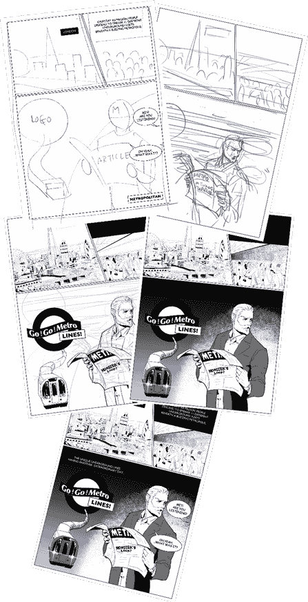

图 3.1：漫画页面创作过程的示例图像

当我们用铅笔工具绘制 Ne-mu 时，我们关注的是布局，所以只要能清楚地知道这个人物是谁，基本图形就足够了。我经常在人物的脸上写上人物的姓氏首字母。我们可以在以下草图中看到图形绘制是如何组成的：

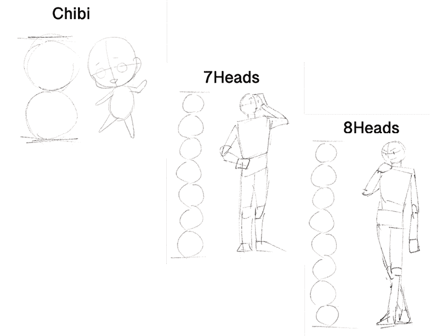

图 3.2：各种比例的铅笔绘图

铅笔草图是一个好的起点。继续完善粗略的人物，直到比例看起来正确。这里显示的头规则是一个好的开始！你可能需要花一些时间来调整头部、手臂和腿的大小。一开始可能会很沮丧，但一旦你对整体形状满意，你就不必再担心它了，当你进入更多细节，如衣服、表情等。当然，你练习比例越多，它们就会越直观地出现在你面前。

有时候，我们在绘制完人物后意识到我们想要改变角色的姿势，但仍然想参考原始姿势而不删除它。在这种情况下，层就派上用场了。只需创建一个新的层，使用不同颜色的铅笔工具，并在新层上开始绘制替代姿势。

当我们在一个面板上有不同元素相互重叠时，我们也可以使用层。每个元素都绘制在不同的层上，因此我们可以一次移动一个元素，而不会影响其他绘图。

我们可以在以下图片中看到这两个案例：

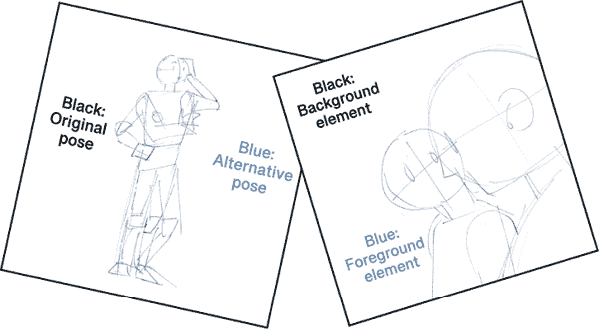

图 3.3：多层铅笔绘制的样本图像

如我们所见，即使你的第一个草图并不完全正确，它仍然是有用的。当你刚开始时，不要过于挑剔或擦除太多！如果没有黑色原始姿势作为参考，要绘制这里显示的蓝色替代姿势将会更困难。铅笔绘制是一个犯错误的好时机，只要你在上墨之前修正它们。

对的，我们从在数字绘图中使用层中受益良多。让我们更仔细地看看它们是什么。

# 什么是层？

在一件数字艺术作品中，层是一个神奇的东西，可以使我们的工作流程更顺畅、更简单，它还可以在我们从铅笔到墨水到颜色的过程中节省很多麻烦。好吧，所以也许它并不是真正的魔法，但它非常接近！

层就像用于投影的透明度堆叠：每个透明度都携带一些文本或图像元素，这样我们就可以将铅笔草图层与上墨艺术层分开，当所有透明度堆叠在一起时，它们就形成了完整的图像。您只需单击一次即可使每个层可见或不可见，并且对一个层的操作不会影响另一个层上的艺术。

但层是什么？它们是如何工作的？让我们看看以下示例图片。现在草图已经完成，可以通过在它上面上墨和上色来完成艺术创作。此截图中的彩色绘图是由它上面的五层组成的：

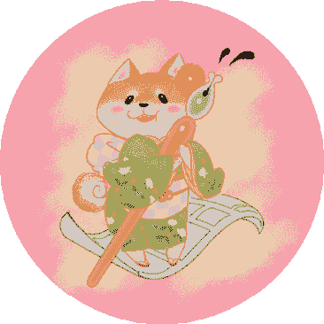

图 3.4：样本彩色绘图

那些图层究竟是什么？在下面的截图中，我们可以清楚地看到它们：

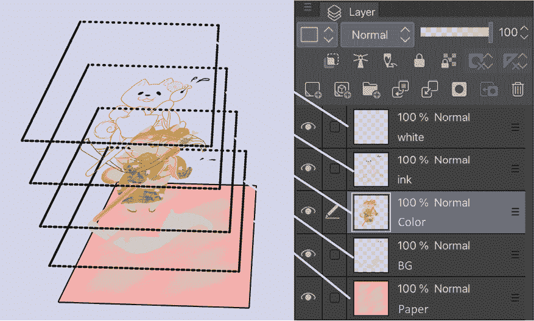

图 3.5：彩色艺术品的图层图

在这里，我们可以看到我们之前提到的透明度。每个透明度都有自己的文本或图像的一部分，当它们堆叠在一起时，就形成了完整的图像。粉红色的背景是纸张图层。在其上方，有一个带有灰色（人物站立的地毯）的图层。然后，有一个包含大部分绘图颜色的图层。在其上方是人物的线条艺术（墨水）。最后，在最上面是一个带有白色点以产生闪耀效果的图层。

完全可以在不使用图层的情况下创建数字艺术，但图层可以使你的数字艺术生活更加轻松。以下是可以使用图层完成的一些事情列表：

+   操作、添加额外内容或组织铅笔素描

+   在开始着色后，甚至可以更改和编辑墨水

+   为图像的某些部分添加特殊效果

+   使用调整图层、混合模式和图层蒙版轻松校正颜色

+   如果在着色过程中出现错误，则仅将图像恢复为墨水

+   无需影响图像其他部分的情况下更改线稿的颜色

+   将单个字符或元素分离出来，以便在其他图像中重复使用

+   组织图像元素

使用图层还有很多好处。当然，也有一些缺点。根据你选择使用多少图层，图层的数量可能会开始减缓内存和磁盘空间较小的计算机。记住这一点，尤其是在处理高 DPI 的大图像时。

既然我们已经了解了图层是什么以及为什么想要使用它们，那么让我们来探索**图层**面板，并讨论不同类型的图层。

# 介绍图层面板

就像 Clip Studio Paint 中的大多数选项一样，图层有一个调色板，它充当管理创建图层的*指挥中心*。当我们查看下面的截图中的**图层**面板时，我们可以看到有许多图标和选项适用于不同的图层：

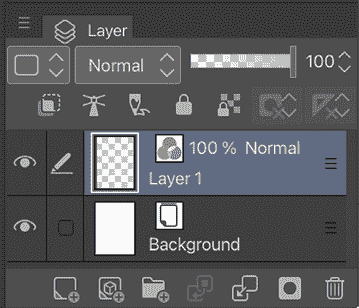

图 3.6：图层面板的截图

如果你无法在你的 Clip Studio Paint 界面中找到**图层**面板，请转到**文件**菜单中的**窗口**，然后点击**图层**以显示它。

顶部行有两个下拉菜单和一个滑块。左侧的第一个下拉菜单用于决定调色板颜色，改变**图层**面板中图层名称旁边图标的颜色。它用于通过颜色分组来轻松组织图层。例如，当制作包含许多角色的图像时，与每个角色相关的每个图层都可以分配一个图层颜色，以便于识别。

左侧的第二个下拉菜单是**混合模式**，它将不同的颜色效果应用到图层下的绘图上。关于**混合模式**的完整解释可以在*第十六章*，*使用 Clip Studio Paint 为你的漫画上色*中找到。

在**混合模式**下拉菜单的右侧有一个滑块。这控制图层的透明度。透明度是指图层上对象具有的透明度量。如果滑块设置为**100**，则图层内容为全不透明。如果设置为零，则图层内容将完全透明，因此不可见。我通常在开始在上层描线时将草图层的透明度设置为 30%，这样我们就可以清楚地看到描线线。

在**混合模式**和透明度滑块下方是一组图标。以下是从左到右的列表以及每个图标的描述：

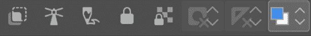

图 3.7：图标的截图

+   **剪切到下层图层**：此功能使用下层图层隐藏当前图层的一些部分。当前图层的内容仅在下层图层也有内容的地方显示。这是一个在有限区域内着色时非常有用的功能。例如，我们可以用它来着色肤色、服装图案和阴影。在以下截图中，脸颊颜色层被下方的肤色层剪切，这样脸颊颜色就不会超出脸的外侧：

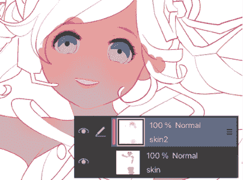

图 3.8：Clip to layer below 功能的截图

+   **设置为参考层**：某些工具，如**填充**工具，可以设置为使用另一个图层来参考其参数。此图标将当前选定的图层转换为这些工具的参考层。使用此设置可以防止颜色溢出到参考层上绘制的边界。我们还可以将其链接到第四章“介绍 Clip Studio Paint 画笔”中的*防溢出*部分上的**防溢出**设置。

+   **设置为草稿层**：此选项将图层转换为草稿层。导出和打印图像时，可以设置忽略草稿层，即使该层在文件中可见。

+   **锁定图层**：此设置使图层无法绘制或更改，直到解锁。

+   **锁定透明像素**：此设置使图层无法绘制透明像素。只有当前绘制上的像素才能被更改。

+   **启用蒙版**：此选项启用或禁用图层蒙版，可以隐藏图像的一些部分。这是一个向服装添加图案的绝佳功能！您可以在第十二章“制作图层蒙版和屏幕色调”中了解更多关于图层蒙版的信息。

+   一旦点击**应用蒙版到图层**图标，标记任何您不想编辑的区域，并选择取消选择选项。在这些区域蒙版后，您可以编辑您的艺术作品而不会影响这些区域。

例如，以下图像显示了应用于服装图案层的蒙版。缩略图中的黑色区域是使用取消选择选项蒙版的区域：

**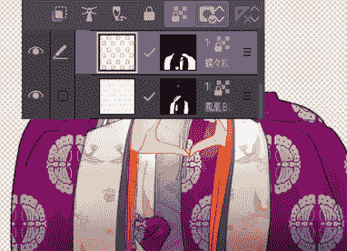**

图 3.9：图层蒙版功能的截图

+   **设置标尺显示区域**：这控制了标尺在哪些图层或图层文件夹中可见，例如仅在包含标尺的图层中可见，或者可以从绘图中的任何图层看到标尺。

以下截图是另一组称为命令栏的图标。这组图标允许我们直接从**图层**面板执行许多常见的图层操作。它看起来如下：

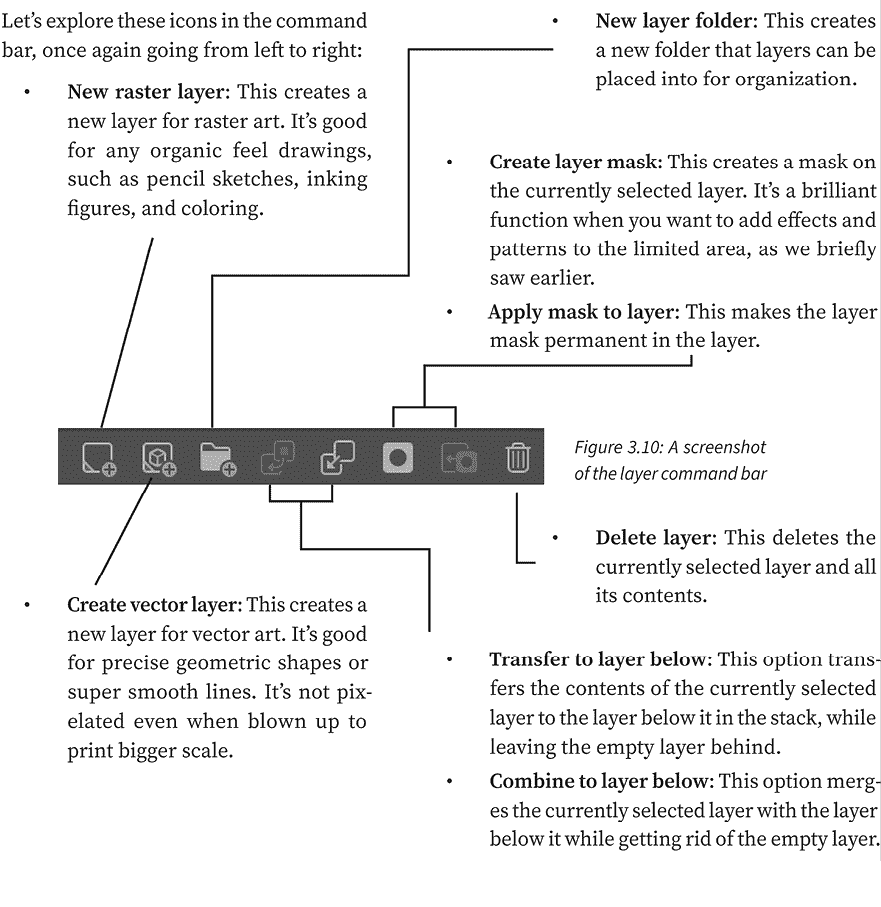

在命令栏下方或上方，具体取决于您使用的设备，是您图像当前图层的列表。

如您在以下截图中所见，每个都有一个看起来像眼睛的符号，表示图层是否可见。您可以通过点击此眼睛图标来隐藏草图图层以检查您的上墨过程。同样，您可以通过使上面的图层不可见来检查任何下面的艺术作品。

在当前活动图层的眼睛图标右侧，有一个看起来像笔的图标。这表示该图层是当前正在处理的图层。在图层名称上方，当前混合模式在图像中显示为**正常**，您可以在*第十六章*的*探索图层混合模式*部分中找到有关图层混合模式的更多信息，*使用 Clip Studio Paint 为你的漫画上色*。它还告诉我们不透明度，为**100%**。这些详细信息显示是为了方便快速找到特定的图层：

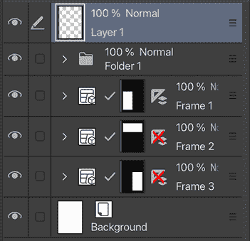

图 3.11：图层列表的截图

现在我们已经了解了所有关于**图层**面板的内容，让我们看看它的伴侣：**图层属性**面板。

# **图层属性**面板

**图层属性**面板位于默认界面布局中**图层**面板的上方。如果您找不到**图层属性**面板，可以通过转到**文件**菜单并点击**窗口 | 图层属性**来恢复。

**图层属性**面板在**图层**面板的功能基础上增加了许多功能。以下截图显示了它：

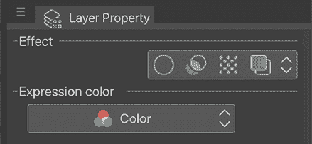

图 3.12：图层属性面板的截图

虽然这是一个小小的面板，但它可以完成大事。现在让我们探索它的每个选项。

## 边界效果

**边界效果**图标，位于顶部行左侧的第一个图标，可以用于在图层上获得两种不同的外观。最常见的方法是向图层内容的外部添加描边。

要这样做，请点击**边界效果**选项中最左侧的图标以激活**边缘**选项。以下是在文本图层上应用**边界效果**的截图：

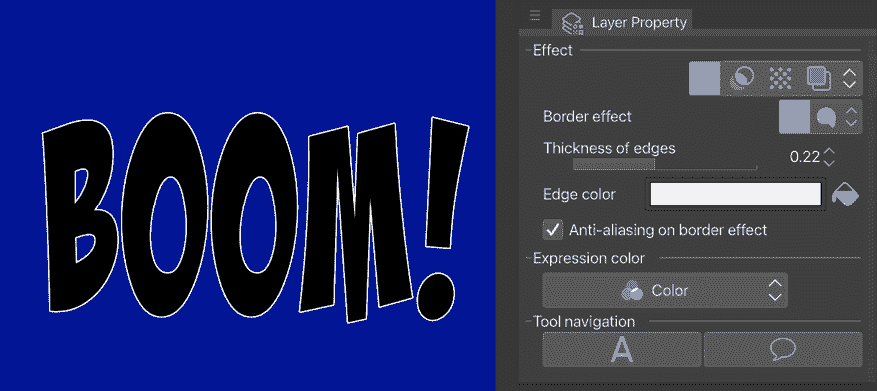

图 3.13：文本样本和图层属性面板的截图

通过调整**边缘厚度**设置，可以通过调整滑块或使用滑块右侧的上箭头和下箭头来使边框变厚或变薄。**边缘颜色**可以通过点击显示当前颜色的矩形并使用颜色选择器窗口选择新颜色来设置。

**边框效果**还有一个设置，那就是**水彩边缘**效果。此效果与其他边缘效果看起来非常不同，并且有更多的选项，它可以用来给艺术品一种光滑的外观，让人联想到传统水彩。

要访问**水彩边缘**效果，请点击**图层属性**面板下**边框效果**标题旁边的图标。

在下面的截图中，已经将**水彩边缘**效果应用于右侧的笔触：

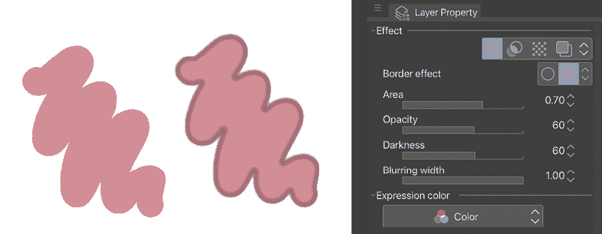

图 3.14：应用了水彩边缘效果图像样本的截图

注意右侧的笔触周围有一个深色的边缘，这正是如果水彩颜料覆盖在干颜料上时的反应。通过移动**区域**、**不透明度**、**暗度**和**模糊宽度**滑块，可以改变此效果的外观。此选项没有**理想**的设置，但移动滑块会实时更新图层，因此非常容易——而且很有趣——去尝试。

当我们将此作为图层属性应用时，我们正在影响整个图层。如果您只想为特定的画笔添加水彩边缘效果，请参阅**第四章**中的**水彩边缘**部分。

现在我们已经了解了**边框效果**选项，让我们探索另一个选项：**提取线条**效果。

## 提取线条

**提取线条**图标是**图层属性**面板中**效果**选项下的另一个图标。此选项仅在 EX 版本中可用，并且特别适用于将 3D 对象融入您的艺术作品中。这通常用作模板，您可以在其上绘制对象。

在下面的截图中，我拍摄了一些风景照片，并对其应用了**提取线条**效果。始终最好使用焦点正确、光线充足且对比度高的照片。以下截图中的**图层属性**面板显示了使用的设置：

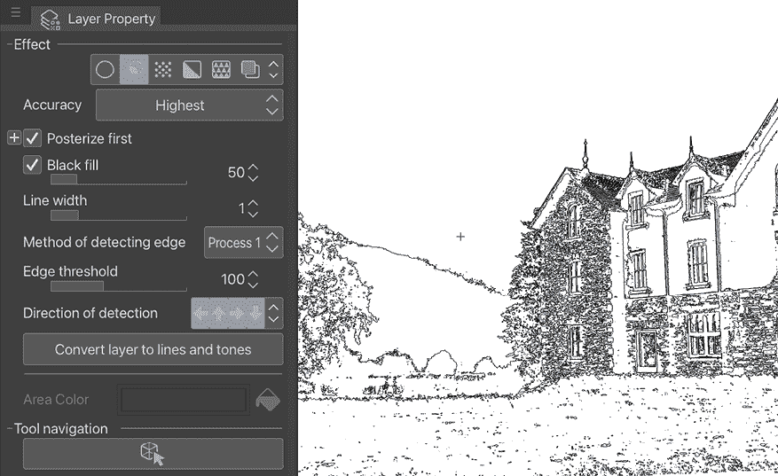

图 3.15：提取线条图像的截图

使用此选项可以将照片转换为线条画。通过调整**图层属性**面板中的选项，我们可以实时预览线条画的效果。使用此图层效果不会永久更改源照片，因为如果改变主意，我们可以在任何时候关闭效果，所以请随意调整滑块！

**重要提示**

在你的艺术作品中只使用你自己拍摄或获得使用许可的照片。记住，即使你通过谷歌搜索找到了一张照片，也不意味着你有权使用它！确保照片的所有者同意使用，即使你不会出售你制作的这件艺术品。

此选项还有一个名为**转换为线条和色调**的另一个效果。这主要被漫画艺术家用于 3D 对象或背景照片，但我们也可以继续在我们的风景照片上使用它。一旦我们设置了前面截图所示的内容，我们就可以点击**线条提取**设置底部的**将图层转换为线条和色调**按钮。以下对话框将出现：

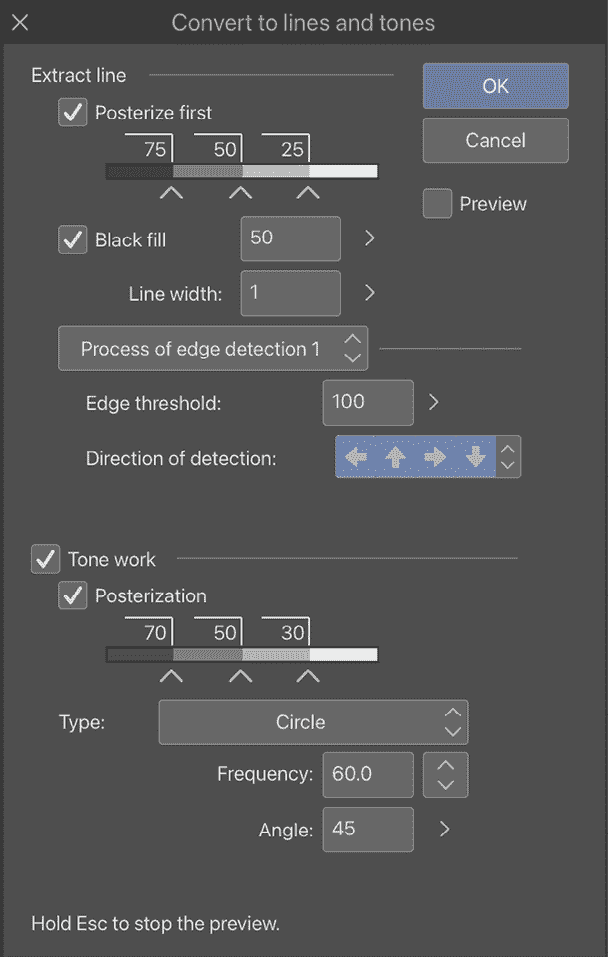

图 3.16：图层线条和色调转换设置截图

在继续之前，可以在此窗口中再次修改设置。要查看所做的更改，请确保勾选**取消**按钮下方的**预览**复选框。请注意，在内存或硬盘空间较少的计算机系统上，预览可能较慢。

当我们点击**确定**时，我们会得到类似这样的结果：

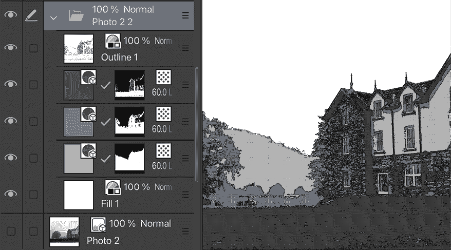

图 3.17：带有图层调板的照片截图

根据我们在上一个窗口中指定的设置，Clip Studio Paint 会自动创建一个轮廓层和几个色调层。查看**图层**调板，我们还可以看到我们的原始图像安全地保存在色调层和轮廓层下面的一个图层上。这意味着我们不必担心对照片进行修改后无法撤销。如果我们对转换的最终结果不满意，可以撤销操作，或删除图层，然后尝试得到不同的结果。理想的结果应该与图像上的其他绘画很好地融合，如下面的示例所示：

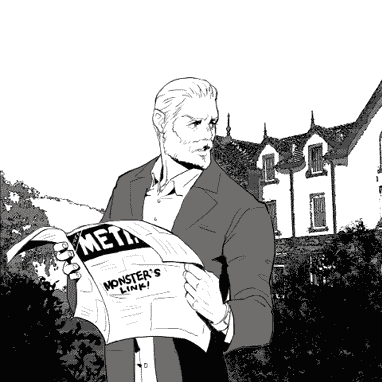

图 3.18：带有照片背景的示例图像

记住，为了保持风格的一致性，最好是在自动创建的背景上绘制。

## 色调

在我们的**图层属性**效果选项中，下一个图标是**色调**效果。正如其名所示，它将我们的图层转换为网屏色调，具体取决于图层的内容。

什么是网点？如果你阅读日本漫画，你可能见过网点，但从未知道它们的名字！**网点**是一种由网点、线条或网纹组成的图案，用于对任何区域进行着色或添加纹理。在传统的笔和纸绘画中，这些色调是通过将类似贴纸的预先印刷图案贴在绘图上方来应用的。一些公司甚至开始印刷背景图像，如城市天际线或森林的照片，以使漫画创作过程更快、更简单。现在，使用数字网点很容易创建。使用数字网点意味着我们不必补充我们的网点供应，因为我们永远不会用完，并且我们可以制作自定义网点。我们可以在第十二章“制作遮罩和网点”的“添加网点”部分中找到更多关于使用网点的内容。

在下面的屏幕截图中，**色调**层效果已被应用于包含绘图阴影的图层：

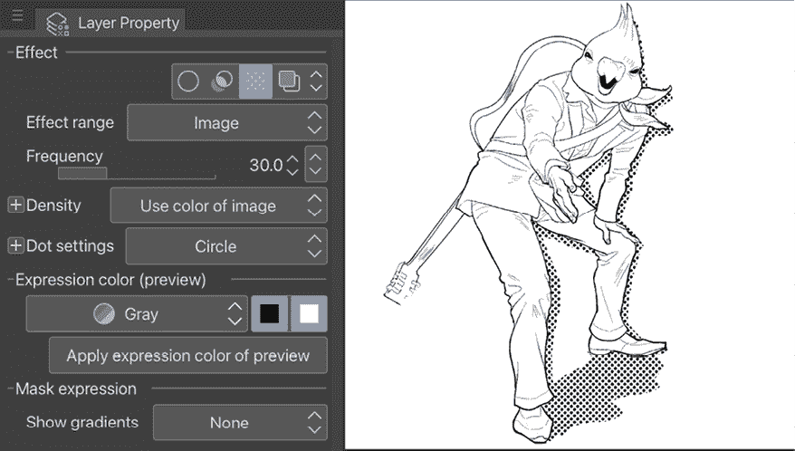

图 3.19：带有图层属性调板的某件艺术作品的屏幕截图

对于这个效果，我们也有几个选项，例如设置**频率**，这将使网点图案更密集或更稀疏。请注意，使用此滑块设置的数字越高，网点就会越小。**密度**可以根据图像的颜色或亮度来设置。将此设置更改为增加亮度会使图像的较亮部分更透明。**网点设置**可以用来改变组成网点图案的网点的形状。有许多选项，从标准的圆形到星星、花朵、心形等等！

现在，让我们来谈谈最后一个效果选项。

## 图层颜色

**图层颜色**效果简单，是你日常艺术创作中最常用的效果之一。以下屏幕截图展示了图层颜色效果在铅笔素描上的应用示例：

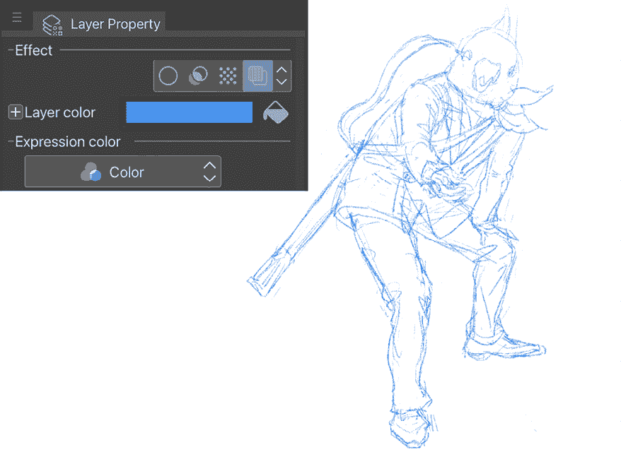

图 3.20：带有图层颜色效果的铅笔素描的屏幕截图

**图层颜色**选项根据用户在**图层颜色**选择框中设置的颜色对所选图层的内容进行着色。默认情况下，这设置为类似传统漫画中非摄影蓝色铅笔艺术的浅蓝色。这是一种非破坏性的着色方法，因为我们只需再次单击**图层颜色**图标即可将图层恢复到其原始颜色。

使用此选项最常见的方式是在上墨之前将完成的铅笔素描图层调整为蓝色。

## 表达式颜色

**图层属性**调板的最后一部分是**表达式颜色**下拉菜单。此菜单在以下屏幕截图中显示：

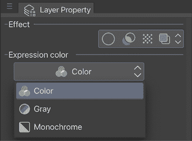

图 3.21：表达式颜色选项的屏幕截图

使用此菜单，我们可以设置文档中每个层的颜色模式。例如，对于清晰的线条艺术，我们可以通过选择**单色**选项将墨水层设置为仅黑白像素。铅笔素描层可以设置为**灰色**，而仅包含颜色内容的层可以设置为**彩色**。这种对单个层颜色模式的控制可以帮助减少具有许多层的较大文件的大小，所以在工作时请记住这一点！

现在我们知道了**层**和**层属性**调色板中的图标和菜单的功能，让我们探索一些你可以用层做的事情。

# 组织层

层是强大的数字艺术软件工具，但只有当你知道如何有效地使用它们时。许多从纸上作品转向使用层的艺术家在弄清楚如何工作在层上时会有困难。在本节中，我们将创建几个新的层，并通过重命名它们和在**层**调色板中更改它们的颜色来保持它们的组织。

按以下步骤创建一个新文件，并设置层以从草图到墨水绘制：

1.  创建一个新文件。使用**显示所有漫画设置**图标下的**A4 彩色**模板以获取有关创建新文件和使用模板的更多信息。如果您正在使用 Clip Studio Paint EX，请不要为此文件打开**多页**选项。我们只想为此练习在一个页面上工作。

1.  一旦我们点击**确定**并创建文件，我们应该有一个看起来如右边的**层**调色板：

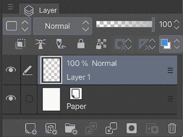

图 3.22：带有新图层的层调色板截图

1.  双击**层**调色板中的**层 1**文字来重命名层。当文本输入框出现时，将层命名为**草图**。按键盘上的*Enter*键确认新的层名称。现在，我们的**层**调色板看起来如下：

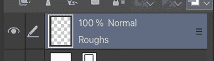

图 3.23：一个带有新名称图层的截图

1.  使用**更改调色板颜色**下拉菜单将**草图**层更改为蓝色。这是为了使我们能够快速识别层堆栈中的**草图**层。现在，我们的**层**调色板看起来如下：

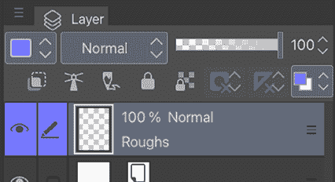

图 3.24：层调色板的截图

1.  通过点击层上方和左侧的**新建矢量层**图标或在**层**调色板底部，根据您的界面或设备创建一个新层。您还可以在屏幕顶部的**文件**菜单中转到**层** | **新建矢量层**。栅格层适合有机绘图，而矢量层适合具有超级平滑线条的几何形状，并且在放大到更大尺寸时避免像素化。使用概述在*步骤 3*和*步骤 4*中，将这个新层命名为**完成铅笔**并将颜色设置为绿色。现在，我们的**层**调色板应该看起来如下面的截图所示：

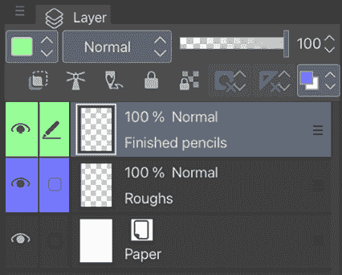

图 3.25：三个图层的截图

1.  使用前面的步骤，创建另一个名为**Inks**的新层，并将**调色板颜色**设置为**红色**。

1.  现在，我们将创建一个**图层文件夹**来存放我们的**草图**和**完成的铅笔**层。通过在堆叠中选择**完成的铅笔**层来创建一个**图层文件夹**（当前选中的层将在**图层**调色板中显示为蓝色）。现在，点击调色板顶部的**新建图层文件夹**图标（或根据您的设备在**图层**调色板的底部）。您还可以在**文件**菜单中使用**图层** | **新建图层文件夹**。现在，我们的**图层**调色板看起来像这样：

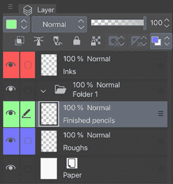

图 3.26：四层和一个文件夹的截图

1.  双击**文件夹 1**的词语以打开文本输入框来重命名文件夹。将名称更改为**铅笔**，并在键盘上按*Enter*键以完成名称更改。

1.  选择**完成的铅笔**层，并在点击**草图**层的同时按住键盘上的*Shift*或*Ctrl*按钮，以同时选择两个铅笔层。当它们一起被选中时，两个层都会变成蓝色。现在，使用鼠标将层拖动到**铅笔**文件夹中。当鼠标悬停在文件夹上时，如果显示一个红色矩形，你就知道它们已经处于正确的位置，如下面的右图所示。

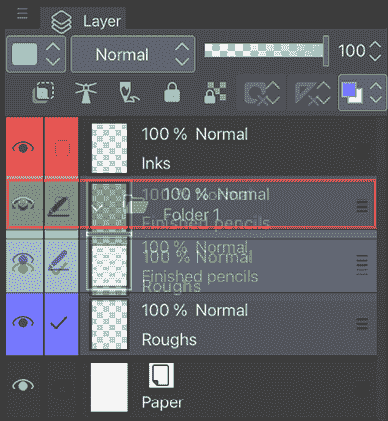

图 3.27：向文件夹添加图层的截图

1.  释放鼠标按钮以完成将图层移动到文件夹的操作。

1.  保存你的文件。我们将在下一章中在这些图层上绘制。

我们现在有一个看起来像这样的图层堆叠（以及一个图层文件夹）：

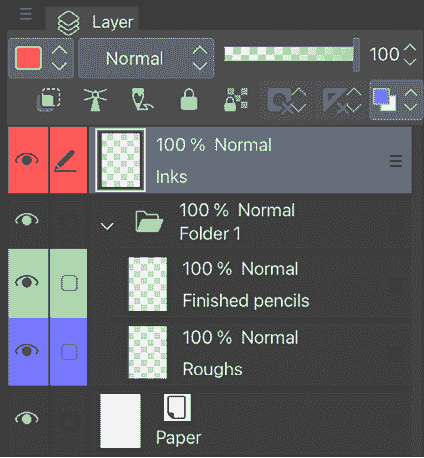

图 3.28：文件夹中层的截图

将图层整理到文件夹中除了带来组织上的清晰度之外，还有另一个好处——您可以一次性移动、编辑、更改不透明度，并添加图层混合模式效果到文件夹中的所有图层！

当然，这只是使用和组织图层的方式之一。随着您继续在数字图层上工作，您将找到自己使用它们的方式。一些艺术家在完成的作品中使用许多许多层，而有些人可能只使用几层。

个人来说，我尽量将图层数量保持在最低，但带有大量字符的大色块可以迅速使堆叠变得相当高！

**提示**

您有很多层，并且很难找到您需要工作的那一层吗？将**缩略图显示设置**更改为只显示**图层**调色板缩略图中某些元素绘制的区域。**缩略图显示设置**可以通过点击**图层**标签名称旁边的三个横条来找到**。**在**图层**下拉菜单中，点击**缩略图显示设置**，并点击**仅显示图层区域**，如下面的图像所示：

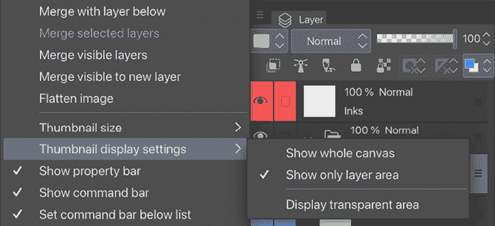

图 3.29：图层下拉菜单的截图

极佳 – 你的图层缩略图更全面，更容易识别哪个元素在哪个图层上！

# 摘要

在本章中，我们学习了铅笔素描作为漫画创作过程的一部分。这是犯错误、不断练习并最终掌握比例的最佳时机。如果你是新手，无论是绘画人物还是使用平板电脑绘画，可能会感到沮丧，但随着时间的推移，你会变得更好。事实上，这可能是构图中最困难的部分；如果你有一个好的铅笔素描，其余的细节就会自然而然地就位。

作为你数字艺术之旅的重要一步，我们学习了图层是什么以及如何在创建铅笔素描时使用它们。我们可以使用图层添加不同姿势的草图或添加额外的前景元素。记住，当你开始在新的图层上绘制墨水作品时，你应该降低铅笔素描层的透明度，以便专注于墨水。将铅笔绘制层的颜色改变，以进一步区分它和墨水，也是有帮助的。

我们还探讨了在给数字艺术上色时层的好处；它们为实验提供了自由，同时保护了你的艺术作品的每个元素，使你的作品易于编辑且安全。考虑到这一点，我们学习了**图层**调板及其各种选项和图标。我们还学习了**图层属性**调板及其对我们图层可能产生的影响。在*第十五章*和*第十六章*中，当我们查看创建你的调色板和探索图层混合模式时，我们将更详细地探讨上色。

随着你作为艺术家的成长，你的画作将变得越来越复杂。毕竟，从简单的草图开始，逐步提高是最好的。为了处理越来越多的图层，我们学习了如何创建图层文件夹。

现在，是时候深入了解 Clip Studio Paint 中你每天都会使用的笔工具了，无论是用于铅笔绘制还是墨水绘制。在下一章中，我们将学习关于 Clip Studio Paint 画笔的内容。

# 加入我们的 Discord 频道！

与其他用户一起阅读这本书。提出问题，为其他读者提供解决方案，等等。

扫描二维码或访问链接加入社区。

[`packt.link/clipstudiopaint`](https://packt.link/clipstudiopaint)

