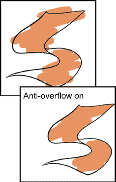

# 4

# 介绍 Clip Studio Paint 画笔

在模拟世界中，用铅笔、墨水、颜料、画笔和许多其他工具在纸上或画布上绘制图纸。在数字世界中，我们也有无数的工具——许多模仿现实世界的艺术用品和技术。在 Clip Studio Paint 中，这些标记工具的大部分都归入**画笔**标题下，包括如铅笔、笔、马克笔、粉彩、油画颜料等子类别。我们将通过示例图像熟悉画笔工具箱，这样当我们开始绘画时，我们将熟悉默认工具以及如何根据我们个人的工作风格来更改它们。

在本章中，我们将涵盖以下主题：

+   理解 Clip Studio Paint 画笔的类别并导航它们

+   Clip Studio Paint 画笔引擎简介

+   探索工具属性和设置

+   复制、保存和恢复画笔

让我们直接开始学习这些多功能的数字艺术工具！

# 技术要求

要开始，您需要在您的设备上已经安装了 Clip Studio Paint，然后您需要打开一个新的空白画布。任何大小都可以，但我建议创建一个 300 dpi 的正方形画布，以便通过本章的内容。

# 导航画笔

在模拟艺术的世界里，画笔是一个非常具体的工具。然而，在 Clip Studio Paint 中，"画笔"这个词可以指代几种不同的工具。通常，我们使用"画笔"这个术语来指代一种数字工具，它使用笔或鼠标来绘制线条，与其他填充颜色或选择或执行数字艺术中可以执行的其他操作的工具有所不同。

我们将提到的绝大多数被称为画笔的工具都可以在用户界面工具栏的一个部分中找到。这些工具图标被标记为**橡皮擦**、**铅笔**、**笔**（又称**勾线**工具）、**画笔**、**喷枪**、**装饰**和**混合**。这些工具类别的图标在左侧的屏幕截图中显示：

图 4.1：工具栏和艺术样本

点击工具栏中的这些图标之一会导致**子工具**面板发生变化。

在本章中，我们将密切观察最重要的画笔工具——在这种情况下，是笔工具。当我们点击工具栏中的**笔**图标时，我们可以在**子工具**面板中看到铅笔的类别，如下面的截图所示，其中包含勾线和阴影示例：

图 4.2：子工具面板

**子工具**面板顶部的按钮显示了在**笔**标题下可用的不同工具类别。

**笔**类别包括**G-Pen**，向下还有**Real G-Pen**。这些工具是一系列设置，用于改变压感笔与画布的交互以及所制作的数字标记的外观。例如，以下屏幕截图显示了使用**G-pen 工具**在左侧绘制的艺术作品和**Real G-Pen**工具在右侧绘制的艺术作品：

图 4.3：样本笔绘制

您注意到线条外观的差异了吗？**Real G-Pen**工具根据笔压产生更精确的粗细，并产生更粗壮且变化丰富的线条，类似于使用传统 G 笔所得到的效果。尽管两种笔都支持压感，但**Real G-Pen**工具在绘图时能产生更敏感的结果和更多纹理。

现在花点时间查看每个画笔工具类别和**子工具**类别，并检查不同的工具。打开一个空白画布，使用您看起来最有趣的工具在画布上做标记并测试它们。数字艺术的最好之处在于它的宽容性。如果您不喜欢所做的标记，它总是可以被擦除或撤销，所以请抓住这个机会玩一玩并熟悉这些工具。

图 4.4：样本画笔绘制

完成这些后，让我们继续前进，熟悉画笔引擎，这是一个强大的工具，允许您自定义工具以适应您的风格！

# 画笔引擎

Clip Studio Paint 凭借其强大但易于使用的画笔引擎，让您轻松创建自己的工具。画笔引擎中有很多选项，例如画笔大小、形状以及如何进行修正。但一旦您了解每个选项的功能，就可以轻松制作出满足您需求的最佳工具。让我们立即开始，通过查看画笔选项并了解每个选项的功能来入门。

## 访问画笔选项

要访问创建和更改画笔的选项，请点击一个画笔工具。在本例中，我们将查看**G-pen**，它是**笔**工具下的一个子工具。一旦您选择了一个画笔工具作为当前活动工具，找到**工具属性**面板。在右下角有一个看起来像扳手的图标。点击扳手图标，如图所示，以打开**子工具详细**面板。

图 4.5：子工具详细图标

**子工具详细**面板在以下屏幕截图中显示：

图 4.6：子工具详细面板

选项类别列在左侧列中，实际可编辑的选项显示在右侧。

我们将在*第九章*，*墨水特殊效果*中讨论制作用于特殊效果的定制画笔，因此我们将在那一章中介绍更多这些画笔选项。在这一章中，我们只是想对定制现有工具有一个感觉，所以我们将介绍对调整现有画笔的感觉和外观最有用的选项。现在，让我们检查**画笔大小**、**墨水**、**抗锯齿**、**校正**和**开始和结束**类别下的选项。

## 画笔大小

当我们在绘制草图时，我们可能希望在草图层上使用非常粗的铅笔线条，而可能希望使用更细的线条来绘制详细的背景场景或睫毛。出于这些原因，我们可以控制我们标记工具的粗细。**画笔大小**类别包含与画笔大小或线条宽度相关的选项。

画笔的大小是通过滑块设置的，通过点击滑块右侧的当前数字并使用数字键盘手动输入大小，或者通过调整数字显示右侧的上箭头和下箭头来调整画笔大小。画笔大小也可以根据其他因素进行调整，例如在平板电脑笔尖上施加的压力。

**提示**

在画笔引擎中还有更多可以根据源设置进行调整的选项。寻找那些选项右侧的矩形按钮，以访问它们的源设置菜单。

在**画笔大小**滑块下方，有两个复选框。第一个是**按屏幕大小指定**。当此选项激活时，画笔的大小不会根据缩放比例改变。因此，当文档在 100%缩放时大小为*4.00*的工具，在文档放大或缩小时将保持相同大小，而不是随着缩放而变大或变小。另一个复选框是**至少 1 像素**。此选项确保所绘制的标记至少为 1 像素，即使笔压变得非常轻，以至于线条应该中断。

## 墨水

下一个选项类别是**墨水**类别，它与墨水颜色的粗细和混合有关。在这里，您可以找到如**混合模式**等设置。这些设置相当高级，您可以在*第十六章*，*使用 Clip Studio Paint 为你的漫画上色*中了解更多关于上色的信息。

## 颜色抖动

在**墨水**类别下，有一个**颜色抖动**类别，可以使画笔颜色在笔触方面发生变化。如果画笔尖端颜色固定，**颜色抖动**设置将不会影响画笔颜色。选项如下截图所示：

图 4.7：颜色抖动类别

让我们来看看每个设置是如何影响画笔颜色的：

+   **更改画笔尖端颜色**让您可以控制画笔尖端颜色动态设置，当开启时共有四种选项。

+   **随机化每笔**，当它被打开时，在您绘制时随机化每笔的颜色。

让我们看看每个复选框的四个选项：

+   **色调**滑块控制要添加到笔触中的颜色的变化程度。

+   **饱和度**滑块控制要添加到笔触中的颜色的鲜艳程度。较高的值会产生更鲜艳的颜色。

+   **亮度**滑块控制混合到笔触中的颜色的值。

+   **混合副色**滑块允许我们使用主绘图颜色和副绘图颜色的组合进行绘制。值越大，副绘图颜色在绘制中的强度就越大。

让我们看看**随机化每笔**设置的几个示例：

图 4.8：各种随机化每笔设置的样本笔触

您可以看到每条笔触都会根据设置改变墨水颜色。我为每条笔触写上了设置名称，以便您可以看到它们产生的影响。在这些示例中，铜色是主色，白色是副色。您可以通过这种随机颜色效果在墨水中享受通过偶然发现事物。

在**颜色抖动**设置中每个滑块的右侧，都有笔形图标。如果您点击其中一个，将出现一个**色调动态**子菜单，如下面的截图所示：

图 4.9：色调动态调色板

每个选项控制输入源如何影响笔触颜色。

我最喜欢的设置是在**混合副色**滑块下开启**笔压**输入，将**改变笔尖颜色**的值设为**50**。这样，当我施加压力在笔上时，可以自然地出现副色，并在绘制过程中逐渐增加。这为您在合并两种不同颜色时提供了极大的控制。以下是一个使用我最喜欢的设置的笔刷示例，主色为红色，副色为白色：

这个类别为您提供了在笔触颜色方面的无限实验！现在让我们继续探讨更多有趣的设置，以最大化使用数字艺术工具的益处。

图 4.10：笔刷示例

## 反走样

在本章中，我们将要查看的下一个类别是**反走样**类别，它控制笔触边界的平滑外观。选项如下所示：

图 4.11：反走样类别

反走样是一种描述数字线条看起来是锯齿状还是平滑的复杂方式。使用**反走样**类别中的图标，可以将线条的平滑度设置为**无**、**弱**、**中**或**强**。以下是用**G 笔**制作的线条的两个示例。上面的一个将反走样设置为**无**，而下面的一个设置为**强**：

图 4.12：反走样类别

注意观察顶部线条有很多尖锐的边缘，这使得它看起来像像素化。抗锯齿通过给线条边缘添加灰色调来平滑它，避免了这种锯齿状的外观。底部线条，当选项设置为**强**时，由于边缘添加的灰色量，看起来柔和且几乎模糊。我通常选择**中等**或**强**，除非我想在我的艺术作品中保留像素化纹理。

## 双刷

让我们看看**2 – 笔刷形状**类别下的双刷设置。您可以将两种不同的笔刷形状组合起来以表达独特的笔触。首先点击**双刷**复选框，然后您将看到所有**双刷**选项出现。设置与正常笔刷设置相同；有形状、尖端、效果、笔触和纹理选项。有数百万种可能性来发明您自己的组合。

在以下图像中，您可以看到一些使用双刷效果创建的草形笔刷的样本绘制：

图 4.13：双刷绘制样本

您可以通过以下步骤重现样本绘制：

下载或创建草装饰笔刷，将其存储在装饰笔刷子调色板中，并选择它。您可以在*第十八章*，*探索 Clip Studio 资产和动画*中学习如何下载笔刷，或在*第九章*，*墨水特殊效果和材料调色板*中学习如何创建它。

1.  在前面的图像中，在**2-抗锯齿**设置下方，您可以看到第二支笔的笔触样本。选择其中一个，然后点击**应用笔刷形状**。

1.  在画布上尝试一下。

通过选择各种形状的次级笔刷并尝试双刷设置，您可能会遇到令人惊喜的意外结果！

## 水彩边缘

现在，让我们跳转到水彩边缘类别！

传统上，水彩是一种使用水稀释颜色并创造特殊纹理的艺术材料，如晕染、模糊、染色、透明背景颜色以及染色区域周围的较暗边缘，所有这些都创造了一种非常柔和和精致的艺术效果。Clip Studio Paint 有一个功能可以数字化地重现这些效果，正如您在左侧的艺术作品中看到的那样：

图 4.14：水彩笔刷绘制样本

在考虑这些水彩效果的同时，让我们看看**水彩边缘**设置下的**子工具详细**类别列表。**水彩边缘**在激活时会在笔触上创建边缘。结合纹理以产生水彩效果。这种效果在密集颜色笔刷中是不可见的。以下截图显示了水彩边缘笔触以及**水彩边缘**设置：

图 4.15：带有示例笔触的水彩边缘类别

当您点击任何选项时，其描述将出现在调色板上。其中最重要的是**水彩边缘**，它控制边缘外观的强度。通过点击复选框并更改其值，我们将在画布上获得期望的边缘外观！

## 校正

现在，让我们跳转到**校正**设置下的**子工具详细**类别列表。**校正**设置可以帮助我们在绘图时绘制出干净、尖锐的线条，即使我们手部颤抖或还不习惯做数字艺术和墨迹。然而，过度依赖这些选项中的某些选项的权衡是，在某些选项上设置过高可能会根据您系统的配置导致计算机卡顿。

下面是**校正**设置的截图：

图 4.16：校正类别

下面将逐一解释每个**校正**选项：

+   **锐角**会将绘制的线条的拐角自动转换为尖锐的点，即使它们略微弯曲。

+   **稳定化**用于平滑线条。**稳定化**设置的值越大，线条就越平滑（即使实际绘制的线条可能有些颤抖）。**根据速度调整**复选框将允许根据画笔的移动速度调整稳定化级别。您可以选择在画笔移动较慢或较快时是否需要更多的稳定化。

+   **后校正**会在线条绘制后稳定线条并使其平滑。线条绘制和平滑处理之间存在轻微的延迟。**根据速度调整**根据线条绘制的速度使线条更加平滑。**根据缩放调整**根据画布的缩放控制线条平滑的程度。**贝塞尔曲线**在校正完成后将线条转换为二次贝塞尔曲线。

+   **锥度**会根据设置的值自动调整行尾，值越大，在画笔标记之后行尾的锥度就越大。

+   **启用吸附**控制此工具是否吸附到活动标尺上。我们将在第十三章*关于标尺的一切*中学习所有关于标尺的内容。

+   **矢量磁铁**用于矢量图层。它允许新线条自动与现有的矢量线条合并。关于矢量的更多信息将在第十章*探索矢量图层*中介绍。

使用**稳定化**和**后校正**可以在您的墨迹中产生巨大的差异。如果您刚开始数字工作或手部不太稳定，这真是太好了。草图阶段可以有颤抖的线条，但在墨迹阶段，尤其是背景建筑或金属物体，需要稳定的线条。在下面的截图中，上面的线条是在**后校正**之前，下面的线条是在校正后的相同线条：

图 4.17：线条绘图

注意下面的线条与上面的线条相比有多平滑，尤其是在曲线部分。然而，有时这种计算机校正会使线条看起来不那么自然，所以根据你个人的艺术风格，如果你想要一种自然和工艺风格的艺术作品，你可能想要适度地使用它。如果你的风格很好地融合到超级平滑的曲线中，比如当你绘制大量未来派建筑和机器人时，那就尽情发挥吧！

**提示**

在接下来的部分，*玩转笔刷设置*，我们将学习如何复制一个工具并对复制进行修改。我喜欢用看起来非常自然的笔刷工具给人物上墨，但我也有一个设置了高稳定性的工具副本，用于上墨机器人物体和无机背景。保存你最喜欢的工具的副本可以帮助节省时间，所以不妨试试！

以下图像展示了一幅使用相同 G 笔的样本艺术品，其中一幅使用了光稳定技术来绘制有机形状，如花朵和石头，而另一幅则使用了重后校正来绘制竹子和木制品的直线：

图 4.18：使用校正设置的样本艺术

**校正**工具就像在绘画时有一个无形助手！

## 开始和结束

现在我们来看看**开始和结束**类别。这些选项改变了绘制线条的开始和结束部分的外观。如果你在尝试得到完美锥形线条时遇到困难，这些设置将帮助你达到你想要的视觉效果，如下面的样本所示：

图 4.19：开启和关闭开始和结束的样本笔触

左侧的图像显示了带有和不带有**开始**和**结束**选项的笔触样本。

上面这些笔触非常适合绘制 1980 年代风格的简单图案或手写体。下面的笔触是在开启**开始和结束**，并且**笔刷大小**使用**开始**和**结束**值各为**800**的情况下制作的。继续阅读以了解如何调整它！

以下是一个**开始和结束**设置屏幕的截图：

图 4.20：开始和结束类别

在此类别下的第一个选项是一个下拉菜单，可以选择更改线条的开始和结束。列表中的每一项都是可以修改线条开始和结束的因素。勾选所需参数旁边的框可以激活它，然后右侧的滑块用于设置该设置的最低值，但通常我们只使用**笔刷大小**选项，在下拉菜单中将值设置为 1。

**开始和结束**设置中也有以下选项：

+   **如何指定**允许通过**长度**、**百分比**或**渐变**来设置**开始和结束**设置。**长度**和**百分比**将产生从设定最小值到全值再返回的线条。选择**渐变**将仅改变线条的末端，而不是开始。

+   **开始**复选框和滑块允许我们配置线条开始处的效果长度。**结束**复选框和滑块执行相同的功能，但作用于线条的末端！

+   **根据速度设置开始和结束**将根据绘制线条的速度设置开始和结束效果值。

下一个笔刷选项是最后一个。

### 防溢出

最后一个笔刷类别是**防溢出**。当我们给图像添加颜色时，它非常有用。我们需要首先设置一个线条艺术层作为“参考层”，以阻止笔触超出线条。你可以通过选择线条艺术层并点击**将所选图层设置为参考层**图标来完成此操作，该图标在图层调色板中看起来像灯塔图像。

**防溢出**设置如图所示：

图 4.21：防溢出设置

这些在给艺术作品上色时非常有用。以下示例展示了左侧顶部和底部都关闭了**不要交叉参考层线**的艺术作品。右侧的详细设置是**容差**为 10%，**面积缩放**勾选并设置为 1.00 值，以及**矩形缩放模式**：

图 4.22：防溢出设置样本艺术

如您在图像下方所示，当您开始添加颜色时，颜色不会从线条艺术溢出。我们不需要在之后费力地擦除任何重叠的颜色！

**提示**

不确定某个特定的笔刷设置是什么作用？用鼠标或触控笔悬停在它上面，**子工具详细信息**屏幕的底部将显示该选项的描述。

在调整笔刷设置方面有许多可能性，掌握这些选项在尝试新的表达方式和定制笔刷以满足个人需求时非常有帮助。让我们继续阅读，尝试不同的设置！

# 玩转笔刷设置

现在，我们了解了这些笔刷设置的作用。数字艺术最好的事情之一是几乎没有什么是不可以更改的。如果你用笔做了标记，你几乎总是可以撤销（或擦除）。在 Clip Studio Paint 中，如果你对某个工具做了不喜欢的更改，你总是可以将工具恢复到其初始设置。话虽如此，让我们学习如何复制现有的笔刷工具，更改副本的设置，然后用副本做标记，看看一些笔刷选项在应用时会有什么效果。

按照以下步骤创建笔刷工具的副本并更改设置：

1.  选择要复制的工具。在这些说明中，我们将使用**G-pen 子工具**工具。

1.  在**子工具**面板中，如图所示，点击箭头所指的图标。这是**复制子工具**图标：

图 4.23：子工具面板

1.  在出现的弹出**复制子工具**窗口中，如图所示，为新子工具输入一个名称。在这个例子中，我将名称保留为**G-pen 2**： 

    

    图 4.24：复制子工具窗口

1.  确保在画布窗口中打开了一个画布，以便在更改时可以测试新工具。

1.  打开**子工具详情**窗口。确保你可以看到并在**子工具详情**窗口后面的画布上绘制。我们将使用这个空白画布来测试我们的更改。

1.  继续更改设置并在画布上测试新的画笔以查看效果。

1.  一旦你完成设置更改并看到它们在实际中的应用，你可以点击**子工具详情**窗口右上角的**X**来关闭它并保存工具，或者你可以将工具重置为其初始设置。

1.  要将工具重置为其初始设置，请按**子工具详情**窗口左下角的**重置所有设置到默认**按钮。

1.  要将设置保存为新默认设置（并覆盖工具当前的默认设置），请按**子工具详情**窗口右下角的**将所有设置注册到初始设置**按钮。

现在我们已经复制了一个画笔工具，进行了更改，并实验了设置，让我们学习如何保存我们新画笔工具的备份副本，以及如何将画笔加载到**子工具**面板中。继续阅读以获取更多详细信息。

# 导出和加载画笔

无论你是想备份所有自定义工具以防灾难发生，还是想通过赠送或出售它们与世界分享你的画笔，了解如何导出你的工具都是一件好事。这是一个极其简单的流程，可以在未来节省你的辛勤工作，或者如果你特别擅长制作专业画笔，还可以提供收入来源！但在我们进入第九章**墨水特效和材质调色板**中制作专业画笔之前，让我们学习如何导出和加载画笔，以便备份我们的工具。在 Clip Studio Paint 中，你可以导出和导入任何类型的子工具，而不仅仅是画笔！

## 导出工具

现在，让我们看看如何导出你的工具。通过遵循这些简单的步骤，你将在你的设备上保存你最初创建的工具的备份副本。如果你修改了你的工具，不必担心；原始文件始终在你的设备上的一个文件夹中！

1.  选择要导出的子工具。在这个例子中，我们将使用我们在上一节中创建的**G-pen 2**工具。

1.  在**子工具**面板的左上角有一个三条横线的图标。这是**子工具**下拉菜单。点击菜单将显示它，如下面的截图所示：

图 4.25：子工具组菜单的一部分

1.  在菜单中点击**导出子工具...**选项。

1.  在下一个屏幕中，导航到您希望保存子工具的文件夹。然后，输入工具的名称。在下面的截图中，我们保留名称为**G-pen 2**：

图 4.26：子工具保存窗口

1.  点击**保存**以完成导出。

现在，让我们学习如何在 Clip Studio Paint 中加载工具。

## 导入工具

现在我们已经导出了我们的自定义工具，让我们学习如何导入工具。您可以从数字艺术供应商网站，如 True Grid Texture Supply([`www.truegrittexturesupply.com/`](https://www.truegrittexturesupply.com/))找到并下载新工具。有免费和付费的工具可供下载。您可以通过加入 Clip Studio 论坛在 SNS 上找到更多信息，或者简单地关注数字艺术技巧账号。

一旦您有一些要导入到 Clip Studio Paint 工具面板的工具，您实际上可以通过两种方式完成，我们将在下面介绍这两种方法！

下面是使用**导入子工具…**选项导入工具的步骤：

1.  在工具栏中点击**笔**类别，然后在**子工具**面板中点击**笔**类别，这是工具将要导出的位置。

1.  在**子工具**面板的左上角点击看起来像三条横线的**子工具**下拉图标。然后，点击**导入子工具...**选项。

1.  导航到子工具文件所在的文件夹。点击子工具文件，然后点击**打开**按钮以完成导入。

下面的点击并拖动方法是导入工具，也可以用来同时导入多个工具：

1.  在 Windows 操作系统中或在 Mac 的**Finder**中，打开包含要导入的工具的文件夹。

1.  在 Clip Studio Paint 中，选择工具或工具将要存储的**子工具**面板类别。

1.  点击并拖动包含工具文件的文件夹窗口，以便同时看到 Clip Studio Paint 的**子工具**面板和文件夹。这在上面的截图中有展示：

图 4.27：子工具类别和 Finder 窗口

1.  选择要导入的工具或工具。点击并拖动工具或工具文件到**子工具**面板上。鼠标光标将变成一个*+*符号。释放鼠标按钮以完成导入。

1.  工具或工具的导入将会完成。在下面的截图中，我们可以看到**G-pen 2**已经被添加到**笔**子工具组中：

图 4.28：子工具类别

完成！你已经导出并导入子工具了。知道如何自定义和移动工具文件不是很好吗？现在，你能够自己创建工具并组织它们！这就像在传统艺术家的画室里拥有真实的画笔和工具柜来存放它们一样！

**重要提示**

从 1.10.6 版本开始，Clip Studio Paint 可以导入 Photoshop 画笔文件（`.abr`）。你可以通过使用本节中讨论的相同方法来导入它们！画笔的结果可能与在 Photoshop 中的使用不同，但知道我们可以分享画笔是非常好的！

# 摘要

在本章中，我们学习了如何导航画笔类别和子工具。我们还学习了如何使用 Clip Studio Paint 的画笔引擎中的某些选项来自定义我们的画笔。然后，我们学习了如何导出我们的工具以进行备份或与他人分享，以及两种将新工具导入软件的方法。

现在我们已经了解了画笔，在下一章中，我们将查看程序的首选项。它们非常有帮助，可以通过整理和将常用工具放置得更近来创建一个舒适的艺术工作室。让我们为你的创作建立一个独特的环境！我们还将查看页面和面板的创建。继续阅读以了解更多信息。

# 加入我们的 Discord！

与其他用户一起阅读这本书。提出问题，为其他读者提供解决方案，还有更多。

扫描二维码或访问链接加入社区。

[`packt.link/clipstudiopaint`](https://packt.link/clipstudiopaint)

