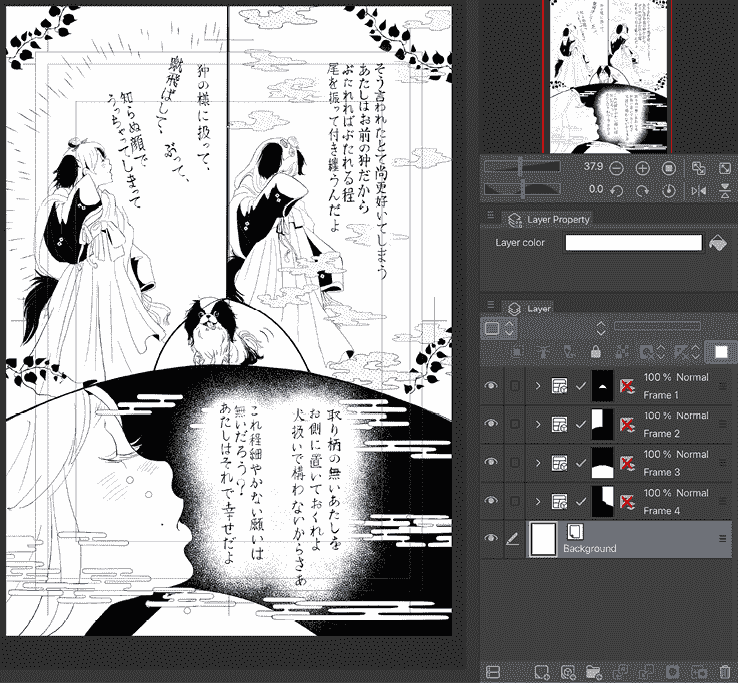
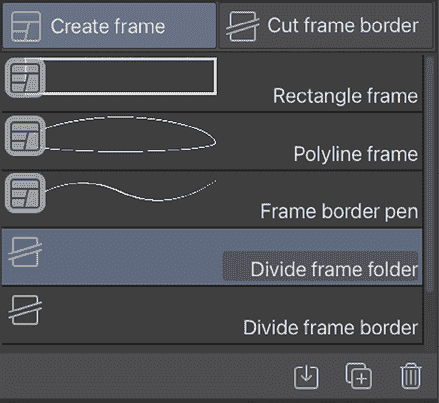

# 5

# 页面和面板来塑造漫画

现在我们已经安装了 Clip Studio Paint 并了解了图层和画笔的基础知识，在本章中，我们将更仔细地查看我们的工作区。在准备新文件时，有许多设置我们现在应该查看，因为我们已经开始创建艺术品。

重要的是，我们将通过在新页面上设置漫画面板来构建我们对图层知识的理解。这个过程就像设置一个工作室桌子来工作，选择要使用的纸张，并知道使用正确的工具来创建面板。

在本章中，我们将涵盖以下主题：

+   创建和保存工作区

+   创建自定义尺寸的页面并保存预设

+   将模板添加到新文件中

+   制作漫画面板

+   创建新文件和模板

+   使用模板面板以及创建和编辑它们

让我们直接进入正题！

# 创建和保存工作区

Clip Studio Paint 最好的功能之一是能够为不同的任务创建和保存不同的工作区。工作区是一组调色板及其在界面上的位置。Clip Studio Paint 在程序中已经包含了一些工作区选项，但我们也可以创建自己的工作区。

## 保存工作区

按照以下步骤创建和保存工作区：

1.  使用*第二章*中的说明，*安装 Clip Studio Paint Pro 和界面基础*，来移动、折叠和关闭调色板以设置工作区。在下面的屏幕截图中，调色板已全部移动到界面的左侧，以便更容易用左手选择项目，假设你是用右手画画的右手用户：

图 5.1：工作区截图

1.  要保存当前工作区，请点击**文件**菜单中的**窗口**，然后转到**工作区**并点击**注册工作区**。将出现如图*图 5.2*所示的框。

图 5.2：注册工作区框

1.  在文本输入框中为工作区输入一个名称。然后，点击**确定**以保存工作区设置。

你的工作区现在已保存！

## 在工作区之间切换

现在我们已经保存了我们自己的一个工作区，我们可以随时切换到该工作区。按照以下步骤加载之前保存的工作区：

1.  点击**文件**菜单中的**窗口**，然后转到**工作区**以查看以下选项：

图 5.3：工作区选项

1.  要切换回默认工作区，请点击**重置为默认**选项。

1.  要切换到 Clip Studio 中包含的工作区之一，请点击**插图**或**漫画**选项。

1.  要加载自定义工作区，请定位到**插图**和**漫画**工作区名称上方区域，然后点击工作区名称以重新加载。

新工作区将被加载。

## 管理和删除工作区

有时，你可能想要重命名或删除已保存的工作区。我们可以通过以下步骤轻松完成：

1.  在**文件**菜单中，点击**窗口** | **工作区** | **管理工作区...**。*图 5.4*中的菜单将出现。

1.  要删除一个工作区，点击菜单左侧的工作区名称以将其高亮显示为蓝色。然后，点击右侧标记为**删除**的按钮。

图 5.4：管理工作区框

1.  要重命名工作区，点击工作区名称以将其高亮显示为蓝色。然后，点击右侧标记为**更改设置名称**的按钮。输入工作区的新名称，然后点击**确定**以保存新名称。

如您所见，创建新工作区并在它们之间切换很容易！也许你想要一个用于绘制和上墨的工作区，另一个用于上色。天空是无限的，所以让你的工作区充满创意，并利用它们来最大化你的工作效率。

**提示**

如果你正在使用 Clip Studio Paint 的平板或手机版本，你可能想要一个带有简单功能的快速草图。在这种情况下，你可以在这两种模式之间切换：Studio 模式（你现在看到的界面）和简单模式（有限的工具和功能）。以下图表显示了两种不同模式的比较。

图 5.5：Studio 模式和简单模式界面

**提示**

切换步骤很简单：只需点击**文件**菜单中的 Clip Studio 图标，然后从下拉菜单中选择**切换到简单模式**。当你想再次回到 Studio 模式时，点击屏幕右上角的三个点图标，然后选择**切换到 Studio 模式**。

在下一节中，我们将开始创建新文件，并了解文件模板。

# 新文件和模板

在大多数计算机程序中创建新文件相当简单，这里也不例外。在 Clip Studio Paint 中，你可以简单地启动程序，点击**绘制**，然后从**项目**中选择**插画**，然后按**确定**。现在你面前有一个空白画布！

如果你想深入了解漫画创作，有一些术语和选项需要解释，这样你就可以创建符合项目规格的文件。对于计划以后印刷漫画的人来说，这些可能非常重要。在本节中，我们将讨论创建新文件时的相关术语，并学习如何将模板创建或加载到新页面中。让我们开始吧！

## 新文件窗口 – 解释

当首次在 Clip Studio Paint 中创建新文件时，选项的数量可能会看起来令人畏惧。不过不用担心——在本节中，我们将了解最重要的选项。话虽如此，我们也可以探索新窗口中的每个选项，并解释其含义，所以请随意选择是否跳过未标记为重要的部分。

下面的截图显示了新建文件对话框。请注意，如果您使用的是 Clip Studio Paint Pro，您将不会拥有 Clip Studio Paint EX 中可用的 **多页** 或 **封面页** 设置：

图 5.6：新建文件窗口

哇，选项好多！一开始可能会觉得有点吓人，但让我们一点一点地分解，并单独讨论每个选项，以便我们知道它们各自的功能。最重要的选项被标记为 *重要*，如果您只想了解关键选项：

+   **重要：** **项目** 是我们可以从预设文档选项中选择类别的区域。

类别包括 **插画**、**网络漫画**、**漫画**、**粉丝杂志印刷**、**显示所有漫画设置** 和 **动画**。点击这些类别之一会根据所选的 **项目** 类别更改可用的设置以及预设。例如，选择 **插画** 类别会隐藏与制作漫画相关的任何设置。

我们将在第十九章 *导出、打印和上传您的漫画* 中仔细查看 **网络漫画** 类别。

+   **重要：** **文件名** 是一个文本框，可以在此添加文件名。在创建多页文件时，此字段必须填写。

+   **重要：** **保存到** 是保存多页文件的目标文件夹。要更改目标文件夹，请点击当前文件路径右侧的 **浏览** 按钮。

+   **预设** 是与 **使用工作** 部分中当前选择相对应的预设页面大小和设置的下拉菜单。这也是任何用户创建的页面预设将出现的地方。我们将在接下来的章节中了解更多关于保存页面设置的内容。

+   **重要：** **单位** 是我们可以设置页面度量单位的区域。在前面的截图中，它设置为 **mm**。可以通过下拉菜单将其设置为 **cm**、**in**、**px** 或 **pt**。

在 **画布** 部分，我们有几个选项。**宽度** 和 **高度** 是新画布的尺寸，其单位由 **单位** 下拉菜单中设置的度量单位决定。这些可以通过文本框右侧的箭头进行调整，或者我们可以点击框内并直接输入新的尺寸。要切换高度和宽度的尺寸，请点击 **宽度** 和 **高度** 框左侧的弯曲双头箭头按钮。

+   **重要：** **分辨率** 是您可以设置新文档分辨率的 dpi 值的地方。对于印刷项目，这应该至少是 300 dpi。

**提示**

请确保所有项目至少以 300 dpi（或更大，如果您的计算机可以处理的话！）创建，这样您就永远不会因为决定打印而需要重做某些事情。分辨率低的图片在打印时看起来会像素化且模糊。

+   **基本表达颜色**是您可以设置图像默认表达颜色的地方。**基本表达颜色**可以在图像的各个图层中稍后更改，无论在此步骤中设置的表达颜色是什么。然而，如果您正在创建纯黑白或灰度图像，这可以节省时间（以及文件空间！）

+   **纸张颜色**是您可以设置默认纸张颜色的地方。在此处激活复选框将在文件中创建一个以指定纸张颜色填充的**纸张**图层。此纸张颜色可以稍后编辑。如果纸张颜色未激活，则新文件将是透明的。

+   **模板**是复选框，我们可以将模板加载到新文件中。我们将在下一节中更详细地讨论模板。

+   **漫画设置**部分激活了**装订（完成）尺寸**和边框尺寸选项。让我们更详细地讨论**装订（完成）尺寸**和边框尺寸选项：

+   **装订（完成）尺寸**是打印后完成页面的尺寸。在打印过程中，我们有一个出血区域，这是在文档打印后从纸张边缘裁剪掉的。这就是如何实现全出血（图像延伸到纸张边缘）的方法：

    +   画布区域的**宽度**和**高度**设置应该是纸张大小，包括任何出血区域。

    +   **装订（完成）尺寸**的**宽度**和**高度**应该是裁剪后页面的完成尺寸。例如，如果我们有一个 6 x 9 英寸的完成页面，带有 0.25 英寸的出血边距，那么我们需要将 0.25 英寸加到纸张的四面。

    +   这将使我们的画布**宽度**和**高度**为 6.5 x 9.5 英寸，但我们的**装订（完成）尺寸**将是 6 x 9 英寸。

    +   可以从下拉菜单中选择预设完成尺寸，或通过文本输入框手动输入。

+   **默认边框（内边距）尺寸**是完成页面的边距大小。这有时被称为安全区域。我们希望将漫画或其他印刷设计中的重要元素保持在页面边缘之外，尤其是在进行出血时。这是因为纸张的边缘会被裁剪到完成尺寸，有时这些裁剪并不精确。将文本或其他重要元素放置得太靠近边缘可能会导致这些内容被裁剪掉！与装订尺寸一样，边框尺寸可以从下拉菜单中选择或手动在文本框中输入。

+   **X 偏移和 Y 偏移**用于将边框向左、右、上或下偏移。如果您需要将边距向左或右移动以补偿书籍的装订，或者如果您想将内边框稍微向上移动以留出页面底部页码或注释的空间，这个功能非常实用。

+   **对齐裁剪标记**用于对齐双页书的裁剪标记。当你打开它时，裁剪标记通过调整裁剪边界的位置来合并。可以通过在**间隙**部分输入数字来调整左右页上裁剪边界的位置。当它关闭时，裁剪标记将创建在左右页的纸张边缘相匹配的位置。

+   **安全边距**是用于多种格式印刷的手稿的边框，显示所有格式都将打印的区域。当它打开时，安全边距边框将在画布上以绿色显示。

+   **杂志设置**用于导出能够被杂志打印机使用的数据。此选项主要用于日本同人志。

+   **多页**是仅在 Clip Studio Paint EX 中可用的选项。勾选此框允许你创建包含嵌套多页文件的文件。对于制作长章节漫画的人来说，此选项非常有价值。通过使用多页文件，你可以一次性查看文件中的所有页面，检查作品的流程，并重新排列、删除或添加页面。

+   **页数**框控制新文件中应创建多少页，可以通过在文本输入框右侧的向下箭头设置，或者手动输入数字来设置：

    +   你可以选择如何查看页面，无论是**逐页**（像装订书籍）还是**网络漫画**（垂直滚动）。

    +   根据你选择的视图，设置和**故事**窗口将发生变化。

    +   **合并为双页书**复选框将自动将面对面的页面合并为双页书。

    +   **装订点**控制书的装订在书的哪一侧。例如，英文书籍的装订在左侧，而日文书籍的装订在右侧。

在创建多页文件时，可以使用**封面页**选项。当此选项处于激活状态时，将为文件创建前封面和后封面。请注意，这些封面包含在页数统计中。因此，一个 24 页的文件将产生 20 页内页，一个前外封面，一个前内封面，一个后内封面和一个后外封面。就像设置画布的其余部分一样，**分辨率**、**颜色**、**纸张颜色**和**模板**也可以为封面设置。

对于**封面页布局**也有两种选项。第一个图标是将封面设置为双页书，这样封面背面和正面就成为一个连续的页面，可以同时设计和绘制。当选择此选项时，可以使用**指定书脊宽度**选项来设置完成书籍的书脊宽度，以便在封面添加适当宽度的书脊。在**封面页布局**下方的右侧图标将封面页分割成单独的页面。

+   **新**文件窗口的**故事信息**部分是可选的，但可能非常有帮助，尤其是在与团队协作或向印刷厂发送文件时。**故事名称**允许您输入您的故事名称。文本输入框右侧的下拉菜单用于控制故事名称在新页面上的显示位置。通过勾选**故事数量**复选框，可以输入当前故事的编号。

**副标题**文本框可用于添加任何额外的标题信息。**作者**框可用于添加漫画故事的作者姓名，而右侧的下拉菜单可用于确定作者姓名在页面上的显示位置。通过勾选**页码**复选框，将在页面的出血区域内自动显示页码。**页码**复选框右侧的下拉菜单可用于控制此数字的显示位置。**起始编号**框用于指示数字序列中的第一个数字。

+   **新文件**窗口的**页码**部分是添加新页面页码信息的地方。页码是页码的另一种称呼。**页码**选项将在新页面的出血区域内留下可见的页码。**起始编号**允许我们设置页码编号的起始数字。可以通过**颜色**下拉菜单设置页码的颜色。要给页码的外侧添加描边，请勾选**放置边缘**复选框，然后在右侧的文本输入框中指定所需的轮廓厚度。**页码**复选框用于激活**页码**选项，并指示页码信息应包含在新文件中。

复选框右侧的下拉菜单允许您自定义页码在页面上的显示位置。**格式**文本输入框用于格式化页码周围的任何文本（例如，可以在文本输入框中输入“第 1 页，共 35 页”）。**与默认边框的间隙**用于设置页码信息与页面默认边框之间的间隙。间隙选项中的数字越大，页码信息与默认边框线之间的空间就越大。**字体**下拉菜单允许我们设置用于页码信息的所需字体，而旁边的**大小**选项设置页码文本的大小。*图 5.7*是**页码**部分的屏幕截图。

图 5.7：新文件窗口的页码部分

在下方有一个**盲页**复选框。**盲页**会在页面的内侧边缘添加页码，当页面装订成书时，这个位置就是书脊所在。这些页码在书籍装订后是不可见的。

最后，如果您想记录漫画创作的延时视频，请点击窗口底部**多页**部分下方的**记录延时视频**复选框，如图 5.8 所示。这将允许您记录和分享延时视频。

图 5.8：新建文件窗口的时间轴部分

现在我们已经了解了所有这些术语和选项，我们可以创建一个新页面！在下一节中，我们将创建一个自定义页面，尺寸为标准美国漫画书纸张尺寸，并带有推荐的边距。我们将保存此页面作为预设，然后创建一个添加了模板的新文件。让我们开始吧！

# 创建基本方形画布

在学习如何创建漫画自定义页面之前，让我们先创建一个基本的插画画布。按照以下步骤操作非常简单：

1.  转到**文件** | **新建**或按*Ctrl* + *N*键打开**新建**对话框。

1.  在**项目**部分，点击最左侧的**插画**图标。

1.  将**单位**设置为**px**，**宽度**和**高度**设置为`1000`，**分辨率**设置为`300`。

1.  将**基本表达式颜色**设置为**颜色**，然后按**确定**。

现在您面前有一个漂亮的方形画布，可以绘制任何东西！

一旦您准备好尝试控制规格，我们就可以继续到更精确的文件设置。

# 创建自定义页面并保存预设

虽然它提供了日本和欧洲漫画尺寸，但 Clip Studio Paint 没有提供美国漫画书常见的尺寸。我们将创建一个标准的美国漫画书尺寸页面，并将其保存为预设以供以后使用。按照以下步骤完成此活动：

1.  转到**文件** | **新建**或按*Ctrl* + *N*键打开**新建**对话框。

1.  在**项目**部分，点击**显示所有漫画设置**图标。

1.  将**预设**下拉菜单右侧的**单位**下拉菜单更改为**英寸**（in）。

1.  在**宽度**输入框中输入`7.00`。

1.  在**高度**输入框中输入`10.50`。

1.  将**分辨率**设置为`300` dpi（或更高，取决于您的计算机硬件）。

1.  设置**基本表达式颜色**。我通常将其保留为**颜色**，但如果您的大部分工作为黑白或灰度，您可能希望选择不同的模式。可以在文件中稍后调整单个图层，因此即使我们在这一步选择灰度模式，我们稍后仍可以选择为我们的作品上色。

1.  如果尚未勾选，请通过点击复选框来设置**纸张颜色**，然后点击颜色选择框以选择纸张颜色。在本例中，我们将保持纸张颜色为白色。

1.  如果尚未激活，请点击**漫画设置**旁边的复选框以激活它。在**装订（完成）尺寸**中，输入**宽度**为`6.75`，**高度**为`10.25`。

1.  输入**出血宽度**为`0.10`。

1.  在**默认边框（内边距）大小**下，将**宽度**设置为`6.25`。将**高度**设置为`9.75`。将**X 偏移**和**Y 偏移**都设置为`0.00`。您的设置应该看起来像以下截图所示：

图 5.9：新漫画设置窗口

1.  现在，我们将把这个页面设置集保存为预设，以便我们可以在以后再次使用。为此，您只需点击位于**预设**下拉菜单右侧的**保存**图标。这将弹出**添加到预设**窗口，如图 5.10 所示。

图 5.10：添加到预设窗口

1.  在**预设名称**框中为新预设输入名称。使用复选框来指示哪些设置应该被保存。完成后，点击**确定**以保存预设。

新预设将出现在**预设**下拉菜单中，并准备好用于未来的项目！在下一节中，我们将学习如何将模板添加到我们的文件中。

# 将模板添加到新文件

模板可以节省很多时间。例如，如果您正在制作一系列所有都有相同四格布局的漫画，那么通过使用 Clip Studio Paint EX，您可以创建一个多页文件，并在创建时将四个面板加载到文件的每一页上，从而节省宝贵的时间！不过，无论您使用的是 Pro 版本还是 EX 版本，使用模板都可以节省很多繁琐的工作。所以，让我们通过以下简单步骤学习如何将页面模板加载到新文件中：

1.  通过访问**文件** | **新建**（或按*Ctrl* + *N*）打开**新建**对话框。

1.  如果您从前面的练习中保存了预设页面，现在是一个很好的时机，通过从**预设**下拉菜单中选择它来尝试使用它。

1.  在**画布**部分，点击**模板**一词旁边的复选框。这将弹出**模板**对话框。

1.  滚动浏览模板选择，找到所需的模板。在这个例子中，我们将使用**4 框 2 条带标题**模板。点击模板以选择它。

1.  点击**模板**窗口中的**确定**。现在，所选模板将显示在**模板**复选框旁边。要切换到不同的模板，点击带有当前模板名称的按钮，再次弹出**模板**对话框。

1.  对于 EX 用户，请勾选**多页**选项旁边的框。在下拉菜单中，选择**8**作为页数。在窗口顶部的**文件名**文本框中添加标题，并选择一个文件夹来保存新文件。

1.  您的屏幕现在应该看起来像*图 5.11*。点击**确定**以创建新文件。

图 5.11：新漫画页面窗口

**提示**

创建多页文件可能需要几秒钟到几分钟，具体取决于页数和您计算机系统的速度。

请耐心等待！

以下截图显示了我们的八页文件，每页都选择了我们选择的框架模板：

图 5.12：多页窗口

哇，现在你面前有漫画页面可以工作了！而且你知道如何使用分镜模板。我们接下来进行下一个阶段——制作你自己的漫画分镜？

# 制作漫画分镜

使用已经准备好的模板制作漫画分镜总是更快，但如果你需要自己创建，有各种各样的工具和选项用于框架边框层。这些框架边框制作了漫画分镜——故事中每件连续艺术作品所绘制的独立框框。

这些框架边框层可以轻松创建，只需几点击即可编辑，甚至可以设置为屏蔽分镜外的任何内容——这使得绘画体验更加容易。如果你想了解更多关于图层的信息，请查看第三章，**铅笔绘制：图层和图层属性调板**。

现在，让我们开始制作一些漫画分镜！

## 框架边框层是什么？

首先，框架边框层是 Clip Studio Paint 所说的从这些层创建漫画分镜的特定类型的层。漫画中的分镜就像电影或电视剧中的镜头。它们包含动作，也可以传达经过的时间或动作的重量。分镜还可以为页面带来很多戏剧性和兴奋感，并引导读者的视线在构图中移动，告诉他们什么重要，他们应该看什么。

分镜布局可以是简单的，也可以非常详细。让我们看看几个漫画分镜的例子，以及它们在**图层**调板中的框架边框层布局。

以下图像是同一页上三个分镜的第一个例子：

图 5.13：漫画页面和图层调板 1

在一个安静、基于对话的故事布局中，时间以一致的节奏流逝。因此，我们使用大致相同大小的框架来表示时间的稳定流逝。在这个例子中，有两个人在交谈。一个女孩坐着，我们可以在第一分镜中看到她的全身，然后在第二分镜中看到她脸部的特写（这是日式风格，所以是从右到左阅读的），一个男孩慢慢地离开了这个地方。

在截图右下角的**图层**调板中，你会看到漫画的各种框架。每个分镜都是在它自己的框架或框架边框文件夹中创建的，你可以通过查看每个图层的黑白蒙版来确定它是哪个分镜。（有关图层蒙版的更多信息，请参阅第十二章，制作图层蒙版和网点纸。）以下截图显示了另一个漫画分镜的例子：

图 5.14：漫画页面和图层调板 2

在前面的例子中，角色的动作比之前的图像要多！下面两个画面描绘了一个男孩消失的身体，展示了两个角色相同的视角。这两个画面保持在页面的内边框内，但上面的分镜已经延伸到页边之外，创造了一个充满动态动作的场景。

这被称为**出血**，正如我们在*“新文件窗口 - 解释”*部分中讨论的那样。它指的是任何超出页面边缘的艺术作品。当打印时，纸张将被裁剪到最终的完成尺寸，这样纸张边缘就没有白色边距。这种在打印后裁剪纸张的过程发生在传统的书籍出版中，这就是为什么我们必须始终牢记页面的内边距（在 Clip Studio Paint 的“**新**”文件选项中的**默认边距大小** - 请参阅*第二章*，“安装 Clip Studio Paint Pro 和界面基础”，了解更多关于创建新文件的信息）。艺术作品、文本以及任何其他靠近页面边缘的东西都有可能在裁剪过程中被裁掉，所以始终将任何重要内容，如对话和话泡，保持在内边距内是个好主意。

这里是一个漫画分镜布局的第三个例子，以及它对应的来自 Clip Studio Paint 的**图层**调板：

图 5.15：漫画页面和图层调板 3

这是一页展示女孩对她的盲目爱情的告白，中间的狗象征着这种情感。分镜是圆形的，使页面在梦幻般的心态中讲述时印象更加柔和。信不信由你，这套分镜和其他分镜示例一样容易创建；只需稍作预先规划，确保一切井然有序即可！

当然，这三个例子并不能涵盖漫画分镜的全部范围。就像拍摄电影一样，讲述故事的方式有无数种。页面构图取决于艺术家的风格和他们所讲述的故事类型，从而决定了分镜的风格。

因此，既然我们已经讨论了分镜及其定义，让我们来看看我们用来制作它们的工具。

# 创建、编辑和使用模板分镜

为了创建边框分镜，你需要一个打开的页面。我建议使用漫画类别下的其中一个模板来测试分镜创建工具，但使用任何你感到舒适的画布尺寸！我推荐使用漫画模板，因为它们已经设置了内边框大小，所以很容易看到你应该在哪里放置分镜以避免它们被裁掉。

在我们实际创建一些分镜之前，让我们来看看制作它们的子工具以及这些子工具的一些选项。**边框**子工具可以在工具栏的**图形**类别下找到。这些子工具在*图 5.16*中显示。

图 5.16：创建框架子工具

在本节中，我们将集中讨论**矩形框架**、**多段线框架**和**框架边框笔**工具。我们将在本章后面的**分割和编辑面板**部分讨论其他两种子工具。

*图 5.17*显示了**矩形框架**子工具的**工具属性**选项。以下列表提供了关于每个选项的详细信息：

+   **绘制边框**：此复选框控制是否在创建的框架外部绘制线条。未选中时，Clip Studio Paint 将创建一个无边框的面板。

+   **如何添加**：此下拉菜单下的选项是**创建新文件夹**和**添加到所选文件夹**。根据所选设置，新面板将要么在自己的文件夹中创建，要么在同一个文件夹中创建。我们将在本章下一节中进一步讨论这一点。

+   **光栅层**：当选中时，此选项将在新面板文件夹下方自动创建一个新的光栅层。

+   **框架内部填充**：自动在新的框架中创建背景填充图层。

+   **纵横比类型**：当选中时，此选项通过设置固定比例或固定长度来控制创建的面板的纵横比。例如，要创建所有大小完全相同的框架，可以在**设置长度**选项下设置**宽度**和**高度**。

+   **笔刷大小**：控制创建的边框轮廓的厚度。

+   **抗锯齿**：设置边框轮廓的抗锯齿效果。

+   **笔刷形状**：控制用于绘制外部边框的笔刷。例如，可以使用此下拉菜单设置虚线或心形边框。

图 5.17：矩形框架子工具

现在我们对面板选项有了些了解，让我们使用**框架边框**类别中的前三个子工具创建一些面板。

## 使用矩形框架工具

按照以下步骤使用**矩形框架**工具创建漫画面板：

1.  从**框架边框**类别中选择**矩形框架**工具。

1.  编辑工具属性以设置所需设置。

1.  决定您想在打开的页面上将面板放置的位置。

1.  在您想要面板开始的位置单击并按住鼠标按钮或笔刷。

1.  拖动以创建面板，并在面板达到所需形状和大小时释放。

1.  重复操作以创建更多面板。

**矩形框架**工具可用于创建圆形、多边形形状的面板，以及正方形和矩形。只需在**工具属性**调色板底部单击图标，即可显示*图 5.18*所示的屏幕。

图 5.18：子工具详细面板

在**图**选项下，您将找到将形状更改为圆形或多边形的图标，如前面的截图所示。

**提示**

想要在“工具属性”调色板中查看“子工具详细”屏幕中的选项以方便访问？点击选项名称左侧的框以打开眼睛图标。任何旁边有眼睛图标的选项都将可在“工具属性”调色板中使用。

## 使用多段线框架工具

“多段线框架”工具允许我们创建更复杂和不规则形状的框架。

选择“多段线框架”工具并查看“工具属性”调色板。如果“曲线”选项不可见，可以通过“子工具详细”调色板访问，如图 5.19 所示。

第一个图标将在框架的点之间产生直线，第二个选项是“样条”设置，它将在框架的每个点之间创建曲线。要使用这两个选项中的任何一个，只需在画布上点击您希望框架开始的位置。然后，再次点击以确定第二个点。继续点击框架的每个角落，直到回到起始点，然后双击以完成框架。

图 5.19：子工具详细面板

使用“直线”选项制作的框架如图 5.20 所示。

右侧的示例图像是一个武士被捕获的场景，他透过城堡墙上装饰性的孔洞观看。使用特定形状的面板描绘了一种你秘密通过墙上的孔洞、钥匙孔或某些其他裂缝观看场景的感觉。如果你是第一次使用多段线框架工具，可能需要一点时间来有效地使用它。但别担心，只需一步步尝试，很快你就能完全掌握这个工具！

图 5.20：使用“直线”选项制作的框架

## 使用二次贝塞尔选项

使用“二次贝塞尔”选项制作面板需要一点时间来适应，通常在初始点设置后需要一些细化。按照以下步骤使用二次贝塞尔创建曲线面板：

1.  从“工具属性”调色板中选择“多段线框架”，然后选择“二次贝塞尔”选项。

1.  在您希望框架开始的位置在画布上点击一次。

1.  点击您希望框架开始弯曲的点。这将在此点击点创建一个小方块手柄。

1.  将光标移到画布上的另一个点。框架的线条将根据第二次点击的位置和光标当前的位置弯曲。

1.  继续点击以向框架添加框和曲线，直到达到所需的长度。当达到起始点时，双击以结束框架。

1.  要调整框架，选择“操作”类别中的工具，然后在其类别中选择“对象”工具。点击框架轮廓以选择它并显示手柄控件。在图 5.21 的左侧图像中，控制手柄位于直线，框架具有曲线。

图 5.21：使用二次贝塞尔线选项制作的框架

上一张截图的右侧是一个示例面板，描绘了一个角色的零散记忆，其中角色只记得他们所见的一部分。这是通过使用**二次贝塞尔**选项创建抽象形状来实现的。这个工具有自己的形状处理方式。你可以尝试移动每个点，看看工具如何修改形状！

## 使用立方贝塞尔选项

制作曲线框架的另一种选项是使用立方贝塞尔设置。按照以下步骤使用立方贝塞尔创建框架：

1.  从**多边形框架工具**的工具属性调色板中选择**立方贝塞尔**设置。

1.  点击框架的第一个点。

1.  当点击添加第一条曲线时，按住鼠标按钮并沿着线条的方向拖动。例如，如果你从画布的左侧开始并向右移动，则在按住按钮的同时将鼠标向右拖动。沿着线条的方向拖动可以防止控制手柄反向并在线条中产生“打结”。

1.  点击第三个点，并按住鼠标按钮拖动以继续制作曲线。

1.  要结束框架创建过程，点击起始点以包围框架。

1.  要编辑立方贝塞尔框架，选择工具的**操作**类别，并选择**对象**工具。点击框架以显示控制手柄。以下截图中的左侧图像显示了控制手柄，由红色线条表示：

图 5.22：使用立方贝塞尔线选项制作的框架

立方贝塞尔有一个独特的功能，即红色手柄：它们使您能够创建所需的精确平滑形状！在右侧的图像中，场景捕捉了一个男人轮廓内的记忆。这是一个示例，说明如何在一个现代图像（戴帽子的男人的轮廓）中描绘一个过去场景（在角色的记忆中）。

## 使用框架边框笔

**框架边框笔**是一个多功能的工具，允许您将任何手绘形状转换为框架边框。它使用起来非常简单！

按照以下步骤使用框架边框笔创建框架：

1.  从**框架边框**类别中选择**框架边框笔**子工具。

1.  使用鼠标或平板电脑笔，绘制面板轮廓所需的形状。

1.  当整个形状被包围时，释放鼠标按钮或笔尖的压力以完成框架创建过程。

1.  如以下截图所示，使用框架边框笔工具可以制作比其他框架创建工具更复杂的框架形状。

图 5.23：使用框架边框笔选项制作的框架

框架边框笔用于更复杂的形状，并且绘制自由手绘非常容易！它将为您在画板形状上提供更多自由度。在上一张截图的右侧，您可以看到由框架边框笔创建的令人毛骨悚然的血流框架边框。

## 一层多个画板，还是每个画板一层？

您可能会想：为什么使用**框架边框**工具来创建画板，而不是使用各种形状工具简单地绘制一个边框并在其中创建我们的艺术作品？

框架边框面板具有一个特性，使得它们比仅使用**直接绘制**工具来绘制一个正方形并在其中绘制漫画艺术要方便得多。正如您可能从截图中所注意到的，漫画边框的外侧被涂上了紫色。这是因为框架边框是用自动应用在外侧的图层蒙版制作的。正因为如此，我们可以创建超出画板的艺术作品，而这些作品会自动清理。例如，让我们看看*图 5.24*中的图像。

图 5.24：带有画板的绘制和同一图像

左侧的线条画得相当大，而在右侧的图像中，只有线条在框架边框面板内的部分是可见的。正因为这个图层蒙版，我们不需要花费时间仔细确保我们的艺术作品不会超出画板。

然而，我们可以将画板全部创建在自己的图层上，或者每个画板都在同一图层上。在*图 5.25*中，一个画板被创建在自己的图层上，另外两个画板被创建在同一图层上。

您可以通过查看图层名称左侧的黑白色图层蒙版图标来看到每个图层的轮廓。**框架 1**图层顶部有一个画板，而**框架 2**图层底部左侧和底部右侧都有一个画板。这些是通过在**矩形框架**工具的工具属性中的**如何添加**下拉菜单中切换两个选项创建的。

图 5.25：带有框架边框画板的图层

如*图 5.26*左侧所示，**框架 1**图层使我们只能看到附加图层蒙版内的内容。其他两个画板被阴影覆盖，这些框架的内容将不可见，并且在绘制时不受影响。

图 5.26：选择不同图层的页面

如果我们在单独的图层上创建所有画板，那么每个画板都将独立于其他画板。然而，如果我们在同一图层上创建画板，艺术作品可以连续显示在多个画板中，因此您在为不同的画板上墨时不需要切换图层。步骤更少，麻烦更少！

最终，决定是否将所有帧放在它们自己的层上，或者都放在一个层上，这是你的选择。将每个都放在单独的层上意味着需要管理更多的层，并且需要更多的点击来完成你的漫画页面。但将它们都放在一个层上意味着需要管理更多的创作过程，以确保艺术品只在其应有的帧中。

个人来说，我更习惯只使用一到两个面板层，因为这样有更少的层需要切换，可以使工作变得简单。但当然，最适合你的选择将取决于你的工作风格和偏好。这尤其在你接受委托工作时需要快速调整面板顺序时更为重要；将每个面板放在单独的层上可以节省大量时间，因为你可以直接移动面板层文件夹而不是重新绘制内容！

你现在知道了为什么我们需要帧边框面板，以及如何以各种方式创建它们。如果你创建的面板形状并不完全符合你的期望，不要慌张；你总是可以编辑它！继续阅读以了解如何操作。

# 分割和编辑面板

在数字领域工作的一个重大优势是能够即时进行编辑。是的，即使我们创建了它们，我们的帧边框面板也可以进行编辑。调整大小、旋转，甚至完全改变帧的位置都是可能的，同样也可以添加一个新的或完全删除一个。在本节中，我们将学习如何修改我们创建的帧。

如果你还没有创建面板，请按照本章*制作漫画面板*部分的说明操作，并在页面上添加一些面板！

要调整漫画面板的大小，你首先需要从工具栏的**操作**类别中选择**对象**工具。然后点击漫画面板的外边缘以选择它。选择后，将在面板轮廓上显示一条红色线条，以及一些浅蓝色把手和小的黄色箭头。面板的外边缘还将显示一个带有每个角落的浅蓝色把手和顶部中心的把手的矩形。

要手动调整面板大小，请点击一个浅蓝色把手并拖动。一旦达到所需的大小，释放鼠标按钮。

小黄色箭头也可以用来快速调整面板大小。点击其中一个黄色箭头将自动将面板的边缘调整到与附近面板相同的大小（如果有附近面板的话），或者将面板的侧面调整到页面边缘。在*图 5.27*中，面板左侧的黄色箭头被用来快速将面板延伸到页面边缘。

图 5.27：调整面板大小

旋转面板就像调整大小一样简单！要旋转面板，只需将鼠标移至面板顶部边界框外伸出的浅蓝色手柄上。当鼠标处于正确的旋转位置时，光标将变为曲线双头箭头。点击并拖动以将面板旋转到所需位置。在*图 5.28*中，使用手柄顺时针旋转了面板。

图 5.28：面板旋转

要移动选定的面板，将**对象**工具放在面板边缘的红线周围。点击并拖动以将面板移动到新位置。一旦达到新位置，释放按钮以停止移动面板。*图 5.29*显示了面板边缘已经从起始位置向下和向右移动。

图 5.29：面板扩展

所以现在你知道，即使你已经绘制了艺术品，你仍然可以移动/编辑面板。哎呀，真是个解脱！

## 分割现有框架

记得我之前说过我们会在后面介绍**分割框架文件夹**和**分割框架边框**工具吗？现在正是时候！

使用这些工具，很容易将整个框架页面切割成几部分，而不是使用框架绘图工具逐个创建框架。**分割框架文件夹**和**分割框架边框**工具可以将一个框架分割成两个。但是，正如它们的名称所暗示的，它们在执行分割时略有不同。

之前，我们讨论了我们可以将所有框架放在一个图层上，或者每个框架放在自己的图层上。这两个分割工具将现有框架分割成单独的图层或所有框架都在一个图层上。让我们看看每个工具以及如何使用它。

*图 5.30*显示了**工具属性**调色板中的**分割框架文件夹**工具。在以下列表中，您将找到每个这些设置的描述：

图 5.30：分割框架文件夹工具的工具属性调色板

+   **分割形状**：控制如何分割面板。选项包括**通过直线分割**、**通过多段线分割**，以及**通过样条分割**。使用直线选项将产生一条直线的面板分割。多段线分割允许我们使用分段线创建面板分割。样条分割选项允许我们创建曲线面板分割。

+   **分割方法**：控制面板分割操作的方式。选项包括**分割框架文件夹并复制内部图层**、**分割框架文件夹并创建空图层**，以及**不分割框架文件夹但分割框架边框**。前两个选项在分割完成后将创建一个新的面板文件夹，但第一个选项将在现有面板内部复制图层，而第二个将在文件夹内部创建一个空图层。

第三个选项通过分割框架但保持两个新框架在同一图层上，将**分割框架文件夹**工具转换为**分割框架边框**工具。

+   **首选项中的框架边距空间**: 使用程序首选项中设置的值来设置面板之间的间距。

+   **垂直间距**: 当不使用程序首选项选项时，此设置将设置面板之间垂直间隙的宽度。

+   **水平间距**: 当未选中前面的选项时，此设置将设置面板之间水平间隙的高度。

使用**分割框架文件夹**工具非常简单。只需选择工具，然后点击或靠近面板边缘进行分割。在按住鼠标按钮或笔刷的同时，拖动到想要分割面板的位置。一组线条将显示面板分割的预览，以便你可以确切地看到新面板的外观。一旦预览线条位于正确的位置，释放鼠标按钮即可完成分割。

在*图 5.31*中，我们的面板已被分为两个面板，每个面板都有自己的文件夹。当你想要对分为两个画面的场景应用不同的效果时，这非常有用。例如，你可能想要将场景分割以展示角色独白或过去。*图 5.31*的左侧面板被选中进行编辑。在**分割形状**中使用了**通过直线分割**选项来分割画面。

图 5.31：面板分为两部分

*图 5.32*显示了**分割框架边框**工具的**工具属性**调色板。请参考前面的列表以了解每个选项的分解。此工具分割现有框架，但保持每个新框架在同一层上，使得连接的面板保持一致。

图 5.32：分割框架边框工具的工具属性

在*图 5.33*中，面板已使用**通过样条分割**设置进行分割，以便进行曲线分割。

图 5.33：曲线分割

现在我们知道了如何创建、编辑和分割面板。我们还可以使用面板模板来帮助节省页面创建的时间。继续阅读以了解更多信息！

## 使用框架模板材料

**材质**调色板拥有大量有用的资源，可以在处理创意项目时节省大量时间。**材质**调色板中包含大量框架模板，可以轻松快速地设置漫画页面。

你将在*第九章*，“着色特殊效果和材质调色板”中了解更多关于**材质**调色板的信息。

漫画面板模板可以在**材质**调色板中找到，位于**漫画材质**文件夹下，以及**框架模板**子文件夹中。此文件夹在*图 5.34*中显示。

图 5.34：材质调色板

材料调板右侧的图标显示了漫画面板布局的预览。要将其中之一添加到你的页面，找到所需的构图模板并点击以选择它。选择将用蓝色突出显示。要将材料添加到你的页面，点击材料调板底部的**粘贴所选材料到画布**图标，它看起来如下截图所示：

图 5.35：粘贴所选材料到画布图标

下一个截图的左侧显示了添加到画布的**4 帧 2 条带标题**构图模板，右侧显示了模板中的每个面板都在**图层**调板的单独空文件夹中。通过使用构图模板，我们还可以更专注于绘制我们的漫画的艺术！

图 5.36：粘贴的模板及其层截图

**提示**

想要使用构图模板节省时间，但你的每一页漫画都有不同的面板布局？创建一个围绕页面内边界的单个大面板的构图模板，并将其应用到故事文件中。然后，使用**分割框架文件夹**或**分割框架边框**工具将一个大面板切割成更小的面板！

# 摘要

在这一章节中，我们涵盖了有关漫画创作的各个方面！首先，我们学习了如何设置工作空间，然后是关于创建新文件和模板，最后是关于框架边框面板的所有内容！

当你发现更易于使用的工作空间布局，或者想要尝试更复杂故事讲述的新文件设置或面板布局时，你可以回到这一章节进行更多的工作空间调整。

对于文件配置，我建议你坚持使用我们在*将模板添加到新文件*部分中使用的新的文件模板设置，除非你需要按照特定的设置创建你的漫画。这样，你就不必每次创建新文件时都担心应该配置哪些设置；快速进入创作是非常好的！只需确保文件分辨率在 300 dpi 左右即可。

现在你有一个很好的漫画工作空间来绘制你的故事和面板变化，接下来我们是否该探索橡皮擦了？在下一章中，我们将学习关于橡皮擦、选择工具、子视图调板以及如何使用它们。让我们继续阅读！

# 加入我们的 Discord！

与其他用户一起阅读这本书。提出问题，为其他读者提供解决方案，等等。

扫描二维码或访问链接加入社区。

[`packt.link/clipstudiopaint`](https://packt.link/clipstudiopaint)

