# 橡皮擦、选择工具和子视图调板

无论您是在纸上用铅笔绘制然后数字化上墨，还是从头到尾进行数字化绘制，大多数艺术流程都需要一定程度的细化。在本章中，我们将使用各种工具来细化我们的图像，从橡皮擦到允许我们缩放和旋转图像部分的选择工具。我们还将了解 Clip Studio Paint 的一个出色功能，即**子视图**调板，它允许我们轻松存储和使用参考图像。

在本章中，我们将涵盖以下主题：

+   橡皮擦和将透明色用作橡皮擦

+   画圈工具和其他选择工具

+   将参考图像加载到子视图调板中

+   使用图层颜色准备草图

让我们开始细化我们的铅笔作品！

# 技术要求

要开始，您需要在您的设备上安装 Clip Studio Paint 并打开一个以任何深色为背景的新画布。任何尺寸都可以，但我建议创建一个 300 dpi 的正方形画布，以便浏览本章的内容。

# 橡皮擦工具和透明色

无论我们是铅笔素描、墨水勾勒还是上色，意外总是会发生。尤其是在我们创作非常整洁和光滑的艺术风格时，橡皮工具和透明色就成为了我们的守护者。它们不仅用于擦除不必要的标记；我们还可以策略性地使用它们，例如用于亮度、光线反射、剪影框架、消失的对象和雨天场景。继续阅读以了解更多信息。

在 Clip Studio Paint 中，有一系列专门的橡皮擦工具，可以通过点击工具栏中的**橡皮擦**图标，然后从**子工具**调板中选择一个选项来访问。这些**橡皮擦**子工具各有不同的用途。但是，通过使用工具栏中的颜色选择器选项中的透明色选择，我们也可以将任何标记工具转换为橡皮擦。我们将在后面的*使用透明色*部分更详细地介绍透明色。不过，在讨论透明色之前，让我们先谈谈 Clip Studio Paint 中的一些橡皮擦工具及其功能。

# 橡皮擦工具

一旦开始绘画，您就需要橡皮擦来纠正错误或给您的图像添加半擦除的纹理，这在数字绘画中也是一样的。Clip Studio Paint 中有各种有用的橡皮擦。右侧的截图显示了 Clip Studio Paint 中的橡皮擦子工具。

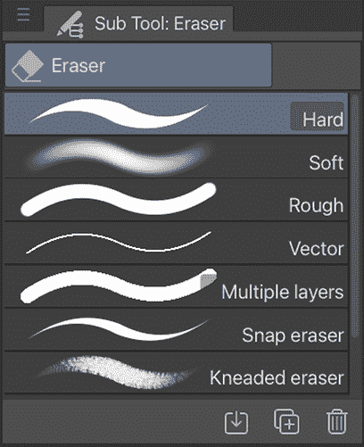

图 6.1：橡皮擦子工具菜单

这些工具各有不同的外观和使用方式。现在让我们简要地探索每一个。

**提示**

如果您使用的是带有橡皮擦端笔尖的绘图板，例如某些型号的**Wacom**绘图板，那么当笔尖上的**橡皮擦**按钮被激活时，当前选中的**橡皮擦**子工具将被使用。

## 硬橡皮擦

硬橡皮擦是一种具有硬边且压力感应的橡皮擦工具。由于它是压力感应的，当使用绘图板时，它是一个非常通用的工具，因为只需简单地改变用笔尖按压的力度，就可以改变被擦除区域的大小。因此，这个橡皮擦工具就像一个压力感应笔：你可以用它来控制线条宽度，就像用笔工具绘图一样！

右侧的截图显示了硬橡皮擦工具的一些使用示例。

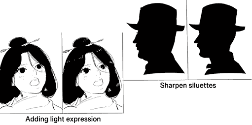

图 6.2：硬橡皮擦的使用

你可以看到这个橡皮擦有一个非常清晰的边缘；当你想要擦除具有明确边缘的部分时，它会派上用场。我可以这么说，这是最基础的橡皮擦！

**提示**

当你对自己的线条不满意时，我强烈建议使用**撤销**按钮，而不是使用硬橡皮擦工具来细化它，因为硬橡皮擦工具最适合雕刻线条边缘，而不是细化它们。我通常将左手放在*Cmd + Z*上，然后重复：画，撤销，画，撤销……直到我画出想要的线条。我发现这样可以得到最佳结果，并且可以更快地工作。你还可以将这个快捷键映射到平板上的一个按钮上，这样就可以轻松访问。

## 软橡皮擦

软橡皮擦也是一个压力感应工具。它有一个柔软、模糊的边缘，最佳使用方法是像左侧截图右侧所示的那样以非常柔和的方式减少颜色。

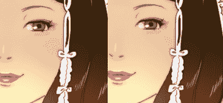

图 6.3：软橡皮擦

这个橡皮擦非常适合用于效果，例如将一种颜色渐变到另一种颜色或制作微妙的渐变。它也可以用于一般的擦除。

## 粗糙橡皮擦

粗糙橡皮擦工具是一个非压力感应的具有硬边的工具。因为它默认不是压力感应的，所以工具的大小将保持一致，尽管笔尖上的压力有变化。

右侧的截图显示了粗糙橡皮擦的使用示例。

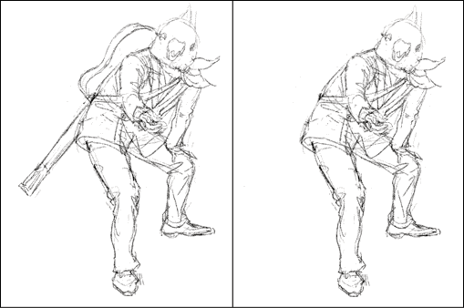

图 6.4：粗糙橡皮擦

由于它不是压力感应的，因此更适合用于粗糙草图而不是详细绘图。

## 向量橡皮擦

向量橡皮擦可以在位图图层上使用，但它在矢量图层上最有用，因为在矢量图层上，你可以用向量橡皮擦的一笔擦除整条线或一个形状！我们将在第十章*探索矢量图层*中详细讨论矢量图层。

## 多图层橡皮擦

如果你的图像上有一些不应该存在的污点或斑迹，但你找不到它所在的图层？多图层橡皮擦可以快速解决这个问题。不过，在使用过程中，请确保不要擦除你想要保留的图像部分！

多图层橡皮擦工具一次可以擦除多个图层的内容。它将从堆叠中的每个图层删除它所使用的区域的内容。下面的截图显示了一个由多个图层组成的图像。背景色图层被锁定，如你所见，旁边有一个锁图标：

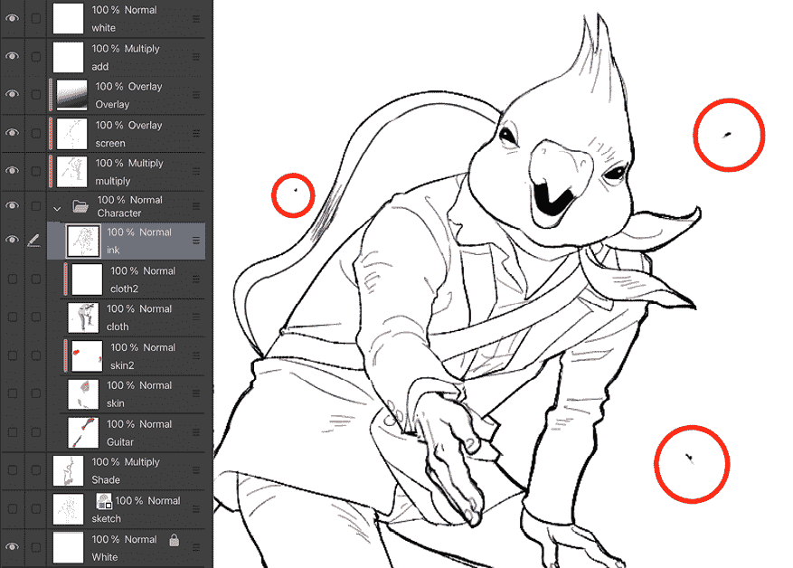

图 6.5：多图层

前面的图像中有三个圆圈标记的污点，等待被擦除，但我们不知道它们位于哪一层！与其逐层检查使它们变得不可见以确定它们所在的层，不如使用**多图层**橡皮擦工具。因为它影响所有图层，我们可以清理这些标记，无论它们位于哪一层。不过有一个警告；如果你不希望背景色被擦除，请记得锁定背景色图层，这样图层就不会受到影响。

## 吸附橡皮擦

如果你需要擦除仅与标尺对齐的部分，这个工具就是为你准备的。

这个橡皮擦会自动吸附到标尺形状上，因此图像的其他部分不会受到影响。你可以在下面的右边的截图中看到这一点：

图 6.6：吸附橡皮擦

吸附橡皮擦工具沿着标尺线擦除，以表达建筑物的照明。我们将在*第十三章*，*关于标尺的一切*中进一步讨论**标尺**。

## 橡皮泥橡皮擦

对于想要在画作中呈现更多类似传统外观的艺术家来说，橡皮泥橡皮擦（或者一些艺术家可能称之为*橡皮泥橡皮擦*）可以很好地完成工作。它可以在画作上提供非常精细的擦除效果，例如皮肤纹理，如左边的截图所示。

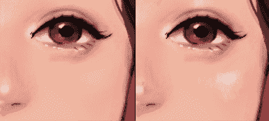

图 6.7：橡皮泥橡皮擦纹理效果

现在我们已经讨论了我们的专用橡皮擦工具，让我们来谈谈如何使用拾色器中的透明选项将任何工具转换为橡皮擦。

# 使用透明颜色

在 Clip Studio 界面工具栏的底部有两个正方形，显示当前选定的前景和背景颜色。在这些下面还有一个填充有棋盘格图案的矩形。这如右边的截图所示，位于前景和背景颜色选择下方：

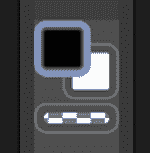

图 6.8：工具栏颜色样本

棋盘格图案是数字艺术程序中显示透明度的方法。拥有这个透明样本意味着我们可以通过更改我们的颜色选择为透明来快速将任何工具转换为橡皮擦。

此选项用于使用纹理橡皮擦制作特殊效果。右边的截图显示了**G-Pen**工具和**软**装饰工具使用透明选项作为橡皮擦来表达左边的雨和气氛，而**潘帕斯草原**装饰工具在右边作为橡皮擦使用：

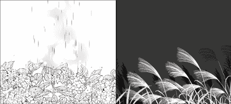

图 6.9：使用各种绘图工具擦除

当然，这些只是使用透明度作为绘画颜色所能达到的一些效果的例子。

意想不到的是，还有更多删除和编辑你的艺术作品的方法！让我们继续了解在 Clip Studio Paint 中可以利用的各种选择工具。

# Lassos 和其他选择工具

在数字空间中创建艺术的最有用功能之一是能够移动、缩放、旋转、翻转以及以其他方式变换整个或部分绘图以获得完全正确的外观。在本节中，我们将使用选择工具来清理和纠正一个包含几个错误的草图。你可以跟随自己的草图或使用以下草图作为参考。这些工具可以用于画布上的任何草图。

以下是我们将在本节中查看的草图：

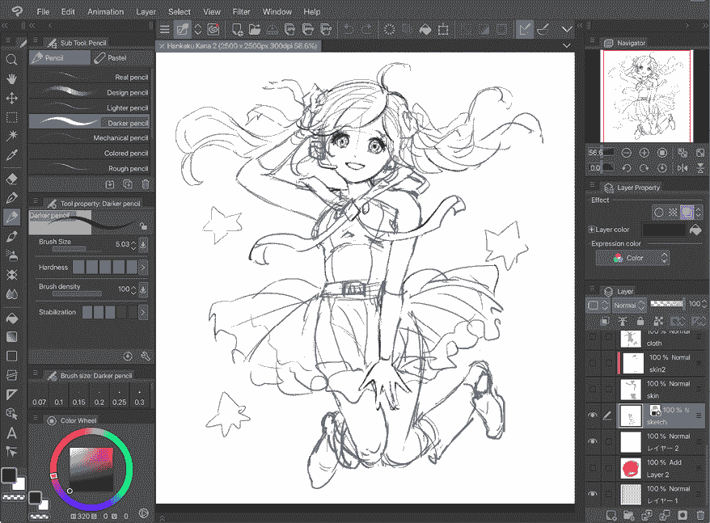

图 6.10：带有 Clip Studio Paint 界面的草图

这幅画有几个问题，我们将使用选择和变换工具来纠正它们。角色的左手有点太大，头顶上的头发团需要不同的形状，头饰的丝带需要更好的形状。让我们使用选择区域和其他选择工具来修复这些问题。

## 矩形和椭圆选择区域工具

**矩形**和**椭圆**工具的工作方式相同；唯一的区别是它们产生的选择形状。当我们的选择不需要精确时，我们可以使用这些工具。对于我们将要纠正的草图，我们将使用矩形工具来纠正我们绘图中角色的左手大小。

**提示**

我建议任何重叠的对象，如身体前面的手臂，或站在其他人前面的角色，应该在不同的图层上，以便更容易操作。

尽管我们将使用矩形工具，但椭圆工具的操作方式完全相同。

让我们使用矩形工具和**选择启动器**选项，按照以下步骤调整我们绘图中的一部分大小：

1.  识别需要细化的绘图区域。在我们的草图案例中，我们将调整角色的手的大小以纠正比例。

1.  从工具栏中选择**选择区域**图标。然后，从**子工具**调色板中选择**矩形**工具。

1.  使用鼠标或触控笔，按住并拖动**选择区域**工具围绕要选择的绘图部分。当适当的区域被轮廓线包围时，释放鼠标或触控笔按钮以完成选择。以下截图显示了矩形选择的示例：

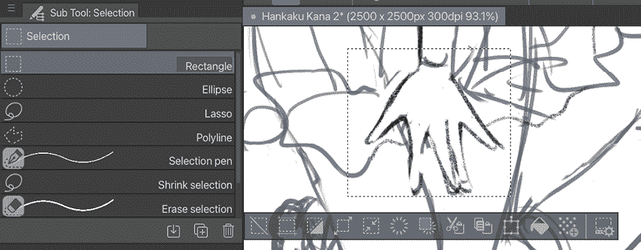

图 6.11：矩形选择

1.  选择**缩放/旋转**图标，它在**选择**命令栏上从右数第四个。使用选择角落的方形手柄通过拖动它们向内或向外来调整绘图部分的大小。

1.  如果进行了不希望的改变，点击所选区域下方的**取消**图标。

1.  尝试保持手的腕部与手臂对齐。一旦区域与新的所需大小匹配，点击选择下方的**确定**按钮，如图所示，或在键盘上按*Enter*键以提交更改：

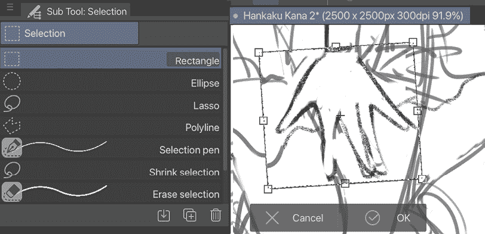

图 6.12：调整大小后的手部图像

注意，如果在选择仍然处于变换模式时尝试选择不同的工具或执行其他操作，将出现一个消息框询问您是否希望提交更改。

1.  使用**橡皮擦**和**画笔**工具来纠正草图中的任何不匹配区域，例如手腕和脚踝。

使用矩形和圆形选择是很好，但当我们有一个比这更复杂的形状的区域时怎么办？让我们学习如何使用**选择**命令栏中的其他工具。

## 选择启动器

让我们看看出现在您所做选择正下方的启动器。您通常只需使用启动器中的您喜欢的功能即可完成任务，但了解其他重要功能也是很好的。选择启动器包含有用的工具，如下面的截图所示。

从左到右，选择启动器中的选项及其功能如下：

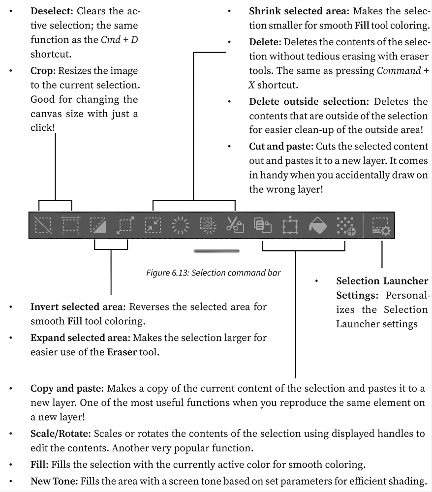

如果将光标悬停在命令栏下方的水平栏上，光标将变成一只手。如果您点击并按住，可以将命令栏移动到画布上的任何位置！

## 套索和多边形选择区域工具

对于更复杂的选择，**套索**和**多边形**工具是您应该了解的好工具。它们基本上以相同的方式工作。下一组指令中将使用套索工具，但也会介绍多边形工具。

套索工具允许曲线和圆形的选择区域，而多边形工具可以制作复杂形状，但选择区域的每个部分都必须是直线。

按以下步骤选择并水平翻转绘图的选择区域：

1.  识别要选择的绘图区域，并从子工具的**选择区域**类别中选择合适的工具。要使用套索工具，按住鼠标或笔尖按钮并拖动以围绕区域绘制，当您回到起点时释放按钮。套索工具的示例显示在右侧。

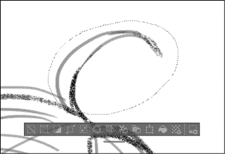

图 6.14：套索选择区域

1.  要使用多边形工具，用鼠标或笔尖点击并移动到另一个区域。再次点击以设置选择区域边界的另一个点。继续此过程，直到回到起点以完成选择区域，或双击从当前点绘制一条直线到起点。左侧的截图显示了在点击起点之前使用多边形选择一个部分的流程。

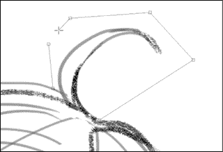

图 6.15：多边形选择区域

1.  要开始变换过程，点击**缩放/旋转**图标，它在选择启动器中从右数第四个。

1.  为了水平翻转选择区域，我们需要查看**工具属性**调色板。以下截图显示了**工具属性**调色板：

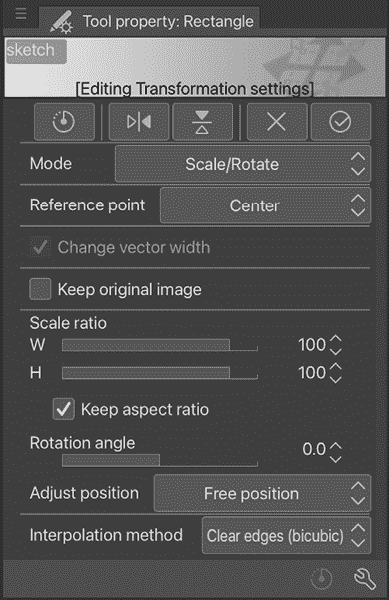

图 6.16：矩形工具的工具属性调色板

1.  在**变换设置**顶部的矩形图标集中，点击**翻转旋转中心垂直**图标，它是从左数第二个，以垂直镜像当前选定的区域。

1.  调整选择区域到正确的位置，然后点击选择区域下方的**确定**图标或按键盘上的*Enter*键。

1.  这里显示了翻转和调整后的绘图部分：

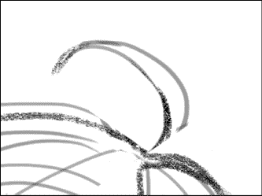

图 6.17：翻转的部分

是的，那一团头发现在是一个镜像！使用**铅笔**和**橡皮擦**工具清理翻转图像后可能突出的或缺失的部分。

您已经看到了几种不同的方法来擦除艺术作品的一部分。不是很好奇更多关于使用选择工具的丰富功能来编辑您的艺术作品吗？

## 使用工具属性调色板缩放或旋转选择区域

如前所述，当使用选择进行**缩放/旋转**功能时，**工具属性**调色板会根据选择改变其内容。**工具属性**调色板变成了变换命令中心，了解它的功能非常重要！在我们继续之前，让我们更仔细地看看这个调色板。

**工具属性**调色板中的**变换设置**区域显示在左侧。

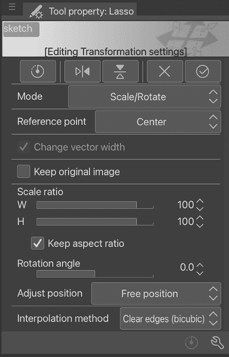

图 6.18：套索工具属性

当选择区域或整个图层的内容正在缩放或旋转时，这些设置是可用的。要变换整个图层的内容，只需从**图层**调色板中选择图层，然后在界面窗口顶部的菜单中点击**缩放/旋转**图标，位于**文件**菜单和**画布显示**区域之间。图层内容周围将出现一个边界框。

**变换设置**区域在调色板顶部有五个图标，如图所示。

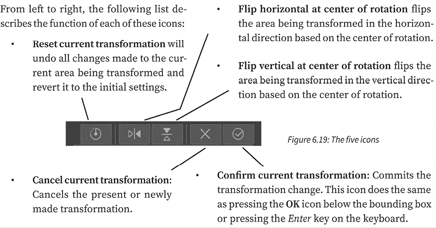

在这些图标下方是其他变换选项，具体描述如下：

+   **模式类型**：您可以从下拉菜单中选择一个模式类型，以决定如何从图像中转换：**缩放/旋转**、**缩放**、**旋转**、**自由变换**、**扭曲**、**倾斜**和**透视**。

+   **参考点**：允许在当前边界框中设置旋转点。默认设置是变换区域的中心，但可以从下拉菜单中选择其他选项。

+   **更改矢量宽度**：这仅在转换矢量图像时使用。我们将在第十章*探索矢量图层*中更详细地讨论矢量。

+   **保留原始图像**：当进行转换时，这将保留原始图像。例如，如果勾选此框，当我们移动选择区域到左侧时，Clip Studio Paint 将复制正在转换的区域并创建两个实例。当你想要复制元素而不增加图层或图层文件夹数量时，这非常有用！在右侧的屏幕截图中，当勾选此框时，复制的场景已经被移动并重新触摸到下一个画布，从而创建了一个时间流逝的场景：

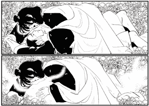

图 6.20：使用复制图像的画布

+   **缩放比例**：控制正在转换区域的宽度和高度的比例。使用滑块，可以在任一轴上精确地转换选择区域。激活滑块下方的**保持纵横比**复选框将确保保留转换区域的原始比例，以便图像在任一方向上都不会倾斜。

+   **旋转角度**：这是一个控制正在转换区域旋转的滑块。可以使用此滑块精确地旋转选择区域。或者，将鼠标光标移动到边界框的角落并稍微移到其外部，将产生一个可以用于自由旋转选择的弯曲双头箭头。

+   **调整位置**：这是一个下拉菜单，用于控制转换区域的位置。将此设置为**自由位置**允许我们按自己的意愿移动、旋转和缩放转换区域。另一个设置是**画布**，它将自动调整选择区域的大小以匹配画布的大小，并将其设置在中心。

+   **插值方法**：这包含 Clip Studio Paint 在放大和缩小过程中如何混合相邻像素颜色的选项。**平滑边缘（双线性）**设置混合相邻像素并使其平滑，但这可能会导致根据转换内容出现模糊的轮廓。**硬边缘（最近邻）**通过不基于相邻像素混合来保持尖锐的颜色分离；然而，这可能会导致不希望的粗糙边缘。**清晰边缘（双三次）**混合并平滑颜色分离，以便实现平滑过渡，并且当图像旋转时，轮廓的处理方式使其比**平滑**选项更突出。然而，轮廓周围可能会出现白色噪声。**高精度（平均颜色）**计算转换后图像中每个像素的平均颜色。放大图像时，图像变得清晰，缩小图像时变得柔和。当缩小图像时，细线不会被中断。然而，缩小图像的边缘可能会变得模糊，你可能需要使用其他选项来回调整，以在包含许多细线的图像上获得所需的结果。

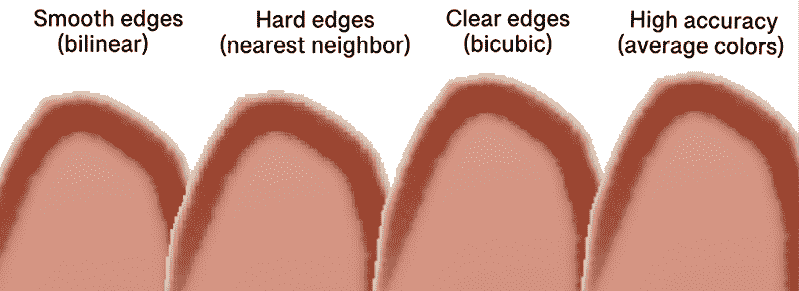

图 6.21：各种插值方法

最常用的方法是黑色和白色图像的**平滑边缘**选项和彩色图像的**高精度**。

现在，让我们了解一些更有机的选择工具。

## 选择笔

**选择笔**是选择区域工具类别的另一个子工具。要使用**选择笔**，从**子工具**调色板中选择它。然后使用鼠标或触控笔绘制选择。右边的截图中的绿色区域是我们的选择区域：

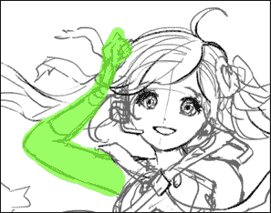

图 6.22：使用选择笔选择区域

任何被选择笔（默认为明亮的绿色高亮颜色）高亮的区域都将包含在选择中。左边的截图显示了从高亮区域制作的选择：

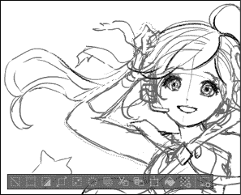

图 6.23：使用选择笔选择区域

选择笔使得高度精确的选择变得容易。如果您需要制作更小的选择，只需将选择笔刷的大小减小。要选择大面积，请将刷的大小增大。

**提示**

要将更多区域添加到选择中，在移动鼠标或触控笔的同时按住键盘上的*Shift*按钮。要从选择中删除区域，按住*Alt*键。一个**+**或**-**符号将出现在选择工具光标旁边，以指示是否添加或移除区域。

## 缩小选择

**缩小选择**工具允许我们快速轻松地隔离绘图中的元素，而无需过于精确。按照以下步骤使用缩小选择工具：

1.  从工具的**选择区域**类别中选择**缩小选择**子工具。

1.  使用鼠标或触控笔拖动以选择元素。如下面的截图所示，此选择不需要非常精确：

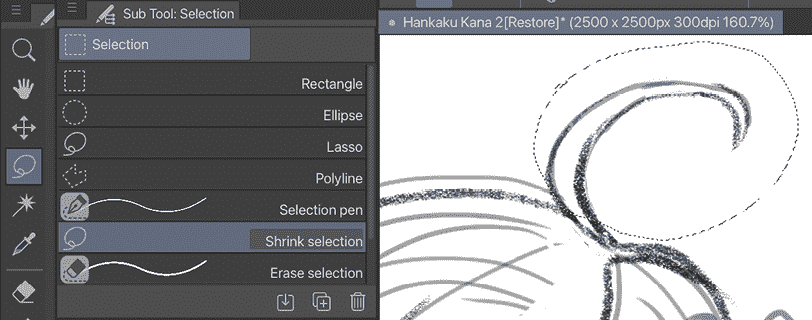

图 6.24：缩小选择区域

1.  一旦释放鼠标按钮或触控笔，Clip Studio Paint 将自动将选择缩小到选择区域内的元素外部。左边截图所示的是所做的选择。

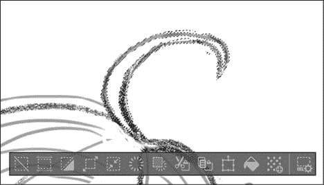

图 6.25：缩小选择区域和命令栏

**提示**

注意，可能需要进行一些细化，就像前一个截图中的选择一样。较浅颜色的线条没有被包含在最终选择中。缩小选择工具在具有锐利、清晰定义的线条的区域上做出最佳选择，例如使用钢笔工具创建的线条。

## 删除选择

我们将要学习的**选择区域**类别中的最后一个子工具是**删除选择**工具。请注意，这是通过使用橡皮擦工具来调整选择区域，而不是删除您艺术作品的那部分。以下步骤概述了如何使用此工具：

1.  使用其他选择工具之一进行选择。

1.  从**子工具**调色板中选择**删除选择**子工具。

1.  使用**擦除选择**工具在当前选中的区域上*绘制*，这些区域应该被取消选择。当绘制时，这些区域将以绿色突出显示，如图左边的截图所示：

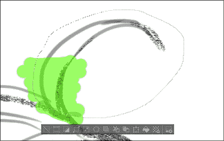

图 6.26：擦除选择工具

1.  当所有要清除的区域都被突出显示后，释放鼠标按钮或笔刷。

1.  Clip Studio Paint 会根据突出显示的区域自动取消选择区域，如图右边的截图所示，现在只有左侧的区域被选中。

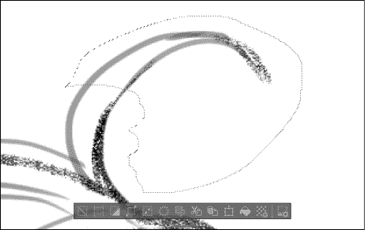

图 6.27：使用擦除选择工具后的选中区域

现在我们已经了解了所有关于选择工具的内容，接下来让我们学习一个在组织参考图像方面非常有帮助的调板。继续阅读，了解**子视图**调板。

# 子视图调板

**子视图**调板可能对一些人来说像是一个谜，但我发现它是整个 Clip Studio Paint 界面中最实用的调板之一。让我们深入探讨这个简单而强大的小调板。

当您第一次开始使用 Clip Studio Paint 时，**子视图**调板看起来如图右边的截图所示。

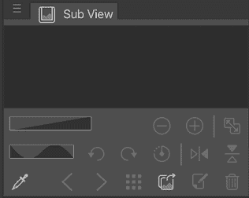

图 6.28：子视图调板

当您第一次看它时，似乎没有什么用途！那么，它是用来做什么的呢？

**子视图**调板允许我们将图像加载到其中，并查看、缩放、旋转、翻转以及从这些图像中选择颜色。如果您是漫画书艺术家，这个调板可以用来保存角色设计、概念艺术、背景设计草图、颜色样本以及您在制作漫画时可能需要定期访问的任何其他图像。对于插画家来说，这可以用来保存参考图像或其他灵感。这是一个小小的参考图书馆，它会记住加载到其中的图像，这样您就不必每次打开 Clip Studio Paint 时都通过新窗口打开它们。

现在我们来学习如何使用**子视图**调板。

## 将图像加载到子视图调板中

按照以下步骤将图像加载到**子视图**调板中，并在库中浏览图像：

1.  在**子视图**调板中，点击**导入**图标（它看起来像一个文件夹——或者一个图片，具体取决于您的设备——带有指向右方的箭头）。这将打开您的文件浏览器。

1.  在文件浏览器中，导航到要导入的图像。点击文件以选择它。点击**打开**以完成导入。

1.  要一次性添加多个图像，请按住键盘上的*Shift*或*Ctrl*键并选择文件，然后点击**打开**一次性导入所有选定的文件。

1.  一旦图像被加载到**子视图**调板中，我们就可以在这个调板中看到它们，并翻阅它们。右边的截图显示了包含一些我的角色设计的**子视图**调板。

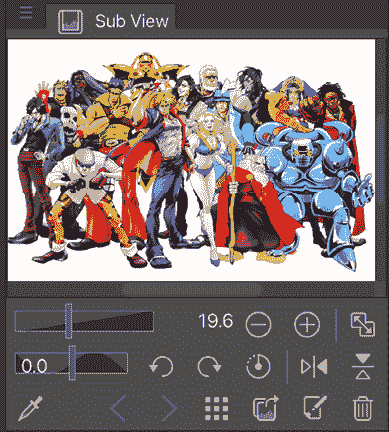

图 6.29：带有图像的子视图调板

1.  要查看**子视图**调色板中加载的其他图像，请找到**吸管**图标旁边的左右箭头。点击任一箭头将导航到**子视图**调色板中的上一张或下一张图像。

注意，只有当多个图像被导入**子视图**调色板时，这些箭头才会处于活动状态。

或者，您也可以通过点击右侧第四个图标（9 个方格网格图标），如右边的截图所示，从图像列表视图中选择您想要显示的图像。

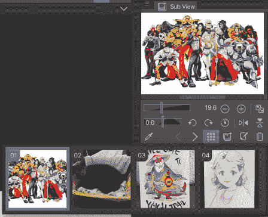

图 6.30：图像列表视图

1.  您还可以通过点击底部第二个图标（看起来像一张纸和一支铅笔）将图像作为新画布打开。要从**子视图**调色板中删除图像，请点击调色板右下角的**清除**图标。此图标看起来像是一个垃圾桶。这将仅从**子视图**调色板中清除图像，而不会从您的计算机中删除它。

## 在子视图图像中进行缩放、旋转和选择颜色

除了能够在**子视图**调色板中构建参考库外，我们还可以对这些图像进行缩放、旋转、翻转和选择颜色。

要在**子视图**中放大图像，请使用位于调色板图像视图区域下方的滑块。或者，您也可以使用位于滑块右侧的**-**和**+**放大镜图标，逐个放大和缩小。**适合导航器**图标确保当调色板大小调整时，图像会调整大小以适应**子视图**窗口。当图像被放大且吸管工具不活跃时，将光标放在图像上会将它切换到**移动**工具，并允许您拖动图像以查看特定区域。

要在**子视图**中旋转图像，可以使用缩放滑块下方的滑块。将滑块中央的矩形向左或向右拖动以旋转图像。**向左旋转**和**向右旋转**箭头也可以用来在任意方向上增量且精确地旋转图像。右边的截图显示了一个旋转的**子视图**图像。

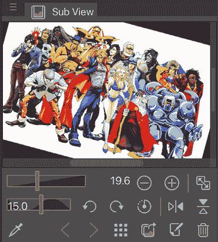

图 6.31：旋转的子视图图像

要将图像重置为其原始旋转，请点击旋转箭头右侧的**重置旋转**图标。

在旋转设置右侧有两个图标。它们是**水平翻转**和**垂直翻转**，它们可以在任意轴上翻转当前的**子视图**图像。左边的截图是我们的**子视图**图像示例，已垂直翻转：

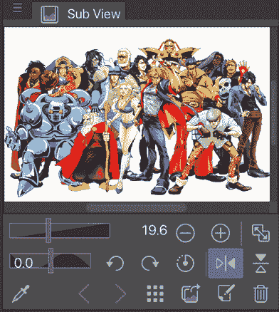

图 6.32：翻转的子视图图像

如前所述，颜色选择也可以从**子视图**图像中进行。要从与加载的图像交互的默认手形工具切换到颜色选择器，点击位于右下角的吸管图标。吸管现在将激活在**子视图**图像上。使用吸管点击将选择图像中的颜色，并将其设置为活动的前景色或背景色，具体取决于工具栏中选中的是哪一个。

在下一节中，我们将学习如何使用之前章节中简要提到的**图层** **颜色**设置来准备用于数字上色的草图。继续阅读以了解更多信息。

# 使用图层颜色准备草图用于上色

我们将通过学习 Clip Studio Paint 解决常见数字艺术问题的一种方法来结束本章。那些过去做过数字艺术的读者可能对以下场景很熟悉。

你完成了草图并创建了一个用于最终上色的图层。你上色了一段时间后，意识到草图中的某些内容需要更改。你切换回草图图层进行修改，然后继续上色。直到你完成上色，你才意识到你从未切换回你的上色图层，现在你的上色图层和铅笔草图在同一图层上，你必须从头开始。

这是在使用数字图层工作时非常令人沮丧且常见的问题。幸运的是，Clip Studio Paint 的制作者为我们提供了一个功能，使得这个问题成为过去式。当然，你可以通过锁定草图图层来防止对其做出任何更改，但这样如果需要做出更改，你必须花费时间解锁它，然后才能纠正错误或调整细节。这看起来可能微不足道，但锁定和解锁图层会耗费宝贵的时间，而我一直在努力尽可能简化工作流程！

按照以下步骤将草图图层变为蓝色，并在另一图层上开始上色：

1.  打开一个包含草图图层的文件。如果你没有，请使用*第三章*，*铅笔：图层和图层属性面板*中的说明来设置包含图层的文件，然后在草图图层上绘制草图。

1.  一旦我们有了完成的草图图层并确保它是**图层**面板中的活动图层，我们就在**图层属性**面板中点击**图层颜色**图标。这将把所选图层的全部内容变成一种蓝色，这种蓝色让人联想到传统铅笔和纸张艺术中使用的非照片蓝色。在下面的屏幕截图中，铅笔图层已被变为蓝色：

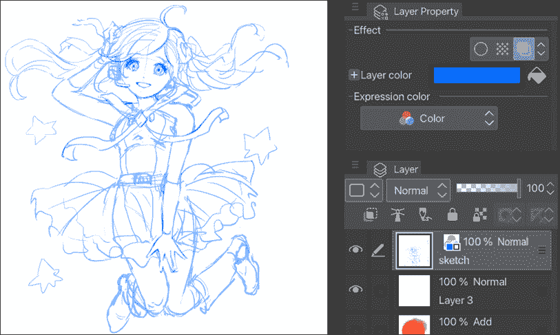

图 6.33：草图变为蓝色

1.  要更改图层的颜色，点击现在将在**图层属性**面板中出现的蓝色矩形。这将打开颜色选择器。你可以从颜色选择器中选择任何颜色作为图层颜色。

1.  在右侧的屏幕截图中，我们可以看到，由于图层名称上方的图标，我们的彩色图层在图层列表中很容易辨认。如果你有很多图层并且需要找到已经着色的那个，请寻找这个图标：

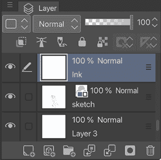

图 6.34：图层调板

1.  当**图层颜色**选项处于激活状态时，在此图层上创建的任何新标记将以图层颜色显示。在下面的屏幕截图中，使用绘图笔工具在草图图层上创建了一个标记。由于标记是蓝色的，我们知道我们仍然处于铅笔图层，而不是墨水图层：

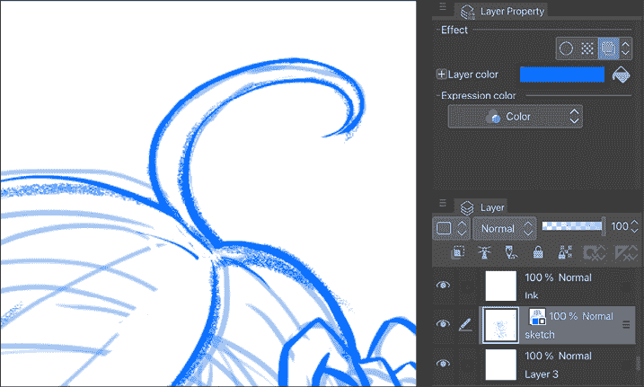

图 6.35：在草图图层上上墨

1.  在**图层**调板中选择**墨水**图层，位于**完成铅笔**图层之上，并开始上墨。现在墨水线条将使用工具栏中当前选定的颜色，而不是使用图层颜色。在下面的屏幕截图中，墨水线条是黑色的，因为我们处于正确的图层：

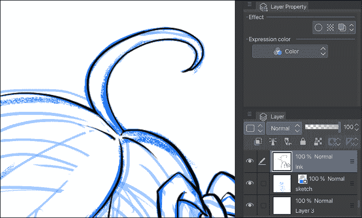

图 6.36：在墨水图层上上墨

这是对常见数字艺术问题的一个简单解决方案，也是一个我希望你能将其融入自己工作流程的有用功能！

# 概述

在本章中，我们讨论了橡皮擦工具以及如何使用透明颜色将任何画笔工具转换为橡皮擦。我们讨论了不同的选择工具以及如何通过使用**选择**命令栏来调整艺术作品。我们还讨论了**子视图**调板以及如何使用它来存储各种参考图像。最后，我们学习了**图层颜色**功能如何完全消除常见的数字艺术问题。

在下一章中，我们将学习所有关于使 Clip Studio Paint 成为真正强大的艺术软件的标尺工具。继续阅读以了解更多信息。

# 在 Discord 上加入我们！

与其他用户一起阅读这本书。提出问题，为其他读者提供解决方案，等等。

扫描二维码或访问链接加入社区。

[`packt.link/clipstudiopaint`](https://packt.link/clipstudiopaint)

