# 使用文本和气球工具

漫画和漫画创作中一个精彩之处在于你可以让你的角色有对话！这种媒体的排版可能是一个复杂且微妙的主题，可以填满一本自己的书。漫画排版的规则和惯例多种多样，排版本身是一项需要大量时间和实践才能掌握的技能。在电脑出现之前的日子里，漫画会有一个专门的排版师，他们会用各种工具手工绘制所有对话框、气球和文字。幸运的是，我们可以使用 Clip Studio Paint 和计算机上安装的字体来处理排版，而无需自己绘制每一个字母！

在本章中，我们将探讨漫画话泡的基本理论，并学习如何使用 Clip Studio Paint 中的文本和气球工具来应用它。由于 Clip Studio 是为漫画家制作的，它自然有使创建话泡变得容易的工具，以及创建不同气球尾巴和其他工具。

本章将涵盖以下主题：

+   话泡的基本理论

+   文本工具基础

+   高级文本设置

+   创建自定义文本工具

+   制作和编辑话泡

+   连接话泡

+   使用话泡素材

让我们开始吧！

# 技术要求

要开始，您需要在您的设备上已经安装了 Clip Studio Paint，并打开一个新的画布，最好画上一位角色。任何尺寸都可以，但我建议创建一个 300 dpi 的正方形画布，以便通过本章的内容。

# 话泡的基本理论

在我们学习如何创建话泡之前，让我们稍微思考一下它们应该放在哪里。

考虑话泡和文本框作为漫画面板及其在页面上的构图的一部分是很重要的。即使在草图阶段，我们也需要将这些元素视为构图的一部分，包括人物和环境。

这意味着首先，文本（以及它们所属的画板）必须按照易于遵循的顺序排列。这看起来可能很明显，但它对人们阅读您的漫画有很大的影响。谁在回答谁？角色是在动作展示之前、期间还是之后说话？从一个画板到另一个画板，时间流逝是否清晰？毕竟，阅读是一种线性体验，我们有效地处理信息流给读者的方式很重要。

也许更重要的是，要考虑文本框和气球对整个构图的影响。文本必须放置在作品的**中心周围**，而不是正中间。

考虑到这两个方面——对话的顺序及其融入构图中——我们应该看看一些例子。以下样本显示了左边的西方漫画和右边的日本漫画中的文本：

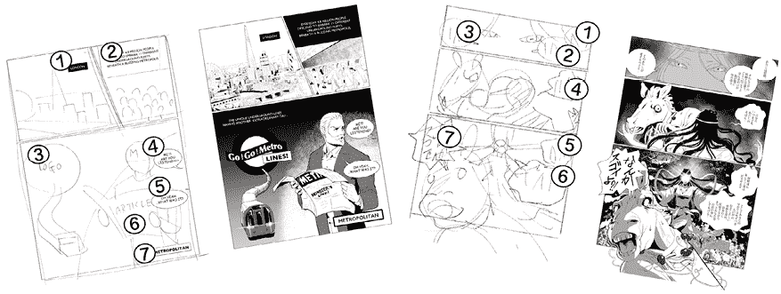

图 7.1：带有文本的草图和漫画页面

您可以从这些示例中看出，文本框的位置受阅读方向的影响——在西方漫画中是从左到右，在日本漫画中是从右到左。在两种情况下，框通常从上到下流动，并且靠近说话的角色。然而，在两种情况下，它们都不会与艺术作品的重要部分重叠。

通常，文本框用于公告，而对话气泡用于角色对话。例如，您可能见过文本框用于宣布从一页到另一页的时间流逝等细节。正如我们可以在左侧示例中看到的那样，关于时间流逝的公告通常放置在构图的角落。

根据对话的语气和节奏，可以使用不同的形状来创建对话气泡。在之前的示例中，西方漫画中角色的沉思通过带有小尾巴的圆形气泡表示。相比之下，充满动作的漫画使用波浪形形状和更大的文本。

现在，让我们开始学习如何创建这些气泡。

# 文本工具的基本用法

在本节中，我们将学习如何使用文本工具及其基本设置的基础知识，然后再在接下来的章节中扩展我们的知识。让我们按照以下步骤在绘图上添加一些文本：

1.  打开一个空白画布或绘图以添加一些文本。

1.  从工具栏中选择工具的**文本**类别。

1.  确保在**子工具**面板中选择了**文本**子类别。

1.  选择**文本**工具。

1.  在**工具属性**面板中，从下拉菜单中选择所需的字体。此菜单将填充您计算机系统上已安装的字体。

1.  使用滑块或上下箭头选择字体大小。

1.  文本的对齐方式（左对齐、居中对齐或右对齐）可以在**工具属性**面板的“对齐”部分设置。

1.  将**文本方向**设置为水平或垂直。

1.  使用显示的选项设置**文本颜色**。**文本颜色**可以是当前选定的主颜色、当前选定的副颜色或用户颜色。

1.  在您想要放置文本的画布上单击，并键入您想要的对话或单词。

图 7.2 显示了我的一页漫画，其中添加了对话文本。

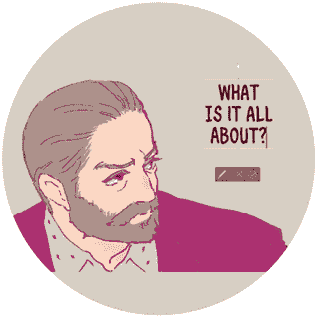

图 7.2：带有文本的漫画面板

左侧截图中的文本居中对齐，大小为 9.0 点。根据您使用的字体以及您的写作和艺术风格，可能需要更大的或更小的尺寸。然而，请记住可读性，您不希望把您的字写得太小以至于无法辨认！如果您要将您的漫画发布到互联网上并打印出来，请确保您的文本在这两种格式中都是可辨认的。有时，在印刷品中可辨认的文本在互联网上可能变得难以辨认。

**提示**

一旦你输入了文本，你可以通过使用文本周围的控件来即时调整其大小。在前面的屏幕截图中，它们是围绕文本框外部的圆形和矩形手柄。点击并拖动这些控件中的一个将使文本变大或变小。

这些是制作 Clip Studio Paint 中文字的基本控件。在下一节中，我们将更深入地探讨文本设置，以对行和字符间距等事物进行更精细的调整。

# 探索高级文本设置

在某些情况下，你可能需要调整你使用的字体的一部分。无论是字符之间的间距还是文本行之间的间距，Clip Studio Paint 都为你提供了选项，让你可以精细调整字体以达到完美。无论是字母看起来太紧凑还是行看起来太近，你只需要使用以下设置来处理它们。我认为重要的任何设置都被标记为**重要**，这些是**字体**、**字体大小**、**对齐**和**文本颜色**。现在让我们看看这些设置。要访问设置，从用户界面中的**工具属性**面板打开**子工具详细**面板。

## 编辑属性设置

**子工具详细**面板的左侧包含选项类别。每个添加的类别都包含**工具属性**面板中的更改是否应用于新文本或选中文本的选择选项。图 7.3 显示了此**编辑属性**选项类别。

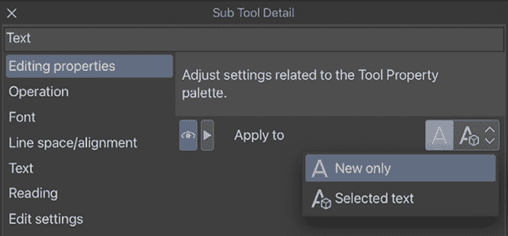

图 7.3：文本工具的子工具详细面板中的编辑属性选项

有时候，你可能只想更改新文本的字体或字母的大小，而不改变同一句子中的现有文本。**编辑属性**选项处理这个问题！当你选择**仅新文本**时，**工具属性**中的更改不会影响任何选中的文本。当你只想强调同一话泡/文本框中的某些文本部分时，这很有用。当设置为**选中文本**时，属性将应用于新文本和选中文本。通常，我将它设置为**选中文本**。

## 操作设置

第二个类别是**操作**设置。这也是一个非常有用的新功能。这些设置让你决定如何操作之前输入的文本。图 7.4 显示了**操作**设置选项。

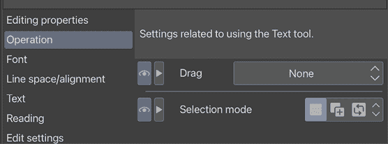

图 7.4：文本工具的子工具详细面板中的操作选项

第一个**操作**选项是**拖动**，它允许你决定是否想要创建一个文本框。

如果你从下拉菜单中选择**创建文本框**，则会创建一个带自动换行的文本框。自动换行是一个非常新的功能，可以用来在创建的框架内对齐文本！当选项设置为**选择文本**时，区域内的任何文本都将被选中以便在画布上拖动。当设置为**无**时，上述任一选项都将应用。我通常将其设置为**无**。

## 字体设置

此类别包含字体和字符大小、单词和字符间距以及字体样式的选项。

图 7.5 显示了此字体选项类别，以下列表描述了这些选项：

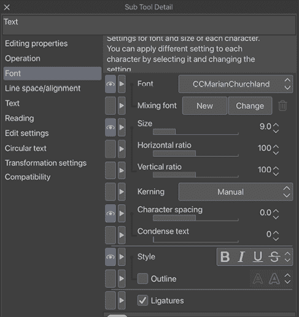

图 7.5：文本工具的子工具详细面板中的操作选项

+   **字体**（重要）：此下拉菜单列出当前选定的字体。此列表由已安装到您计算机操作系统的字体组成。

+   **混合字体**：此选项主要用于混合日文、中文和英文字符，因此我们在这本书中不会使用它。

+   **大小**（重要）：设置字体的大小。

+   **水平比例**：此选项设置字母的水平扩展，使字母变宽或变窄。

+   **垂直比例**：使用此选项来控制字体的垂直比例，使字母变高或变短。

+   **字距调整**：设置字距调整对的比例。当从下拉菜单中选择**手动**时，您可以通过设置一个数字来调整所选字距调整对的间距。选择**矩阵**将根据字体信息自动调整特定字距调整对的间距。如果没有字体信息，字符将按照标准间距排列。

+   **字符间距**：调整字体字母之间的间距。

+   **压缩文本**：指定每个字符两侧的间隙比例。

+   **样式**：此选项允许您将字体设置为粗体、斜体、下划线或删除线字体样式。

+   **轮廓**：将字体转换为仅轮廓的字体，其中字母没有用实色填充。

+   **连字符**：开启或关闭连字符。这是一个小众功能。您可能遇到的唯一可能用途是需要关闭连字符，因为小写字母粘在一起，打印时难以辨认。

## 行间距/对齐设置

**子工具详细**面板中的第四个选项类别是**行间距/对齐**，它让您能够控制编辑行。此选项类别的选项如图 7.6 所示。

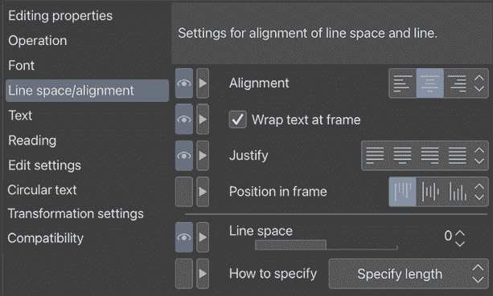

图 7.6：文本工具的子工具详细面板中的行间距选项

这些设置在以下的项目符号列表中描述：

+   **对齐**（重要）：设置文本行的对齐方式为**左对齐**、**居中**或**右对齐**。

+   **在框架中换行**：通过勾选此框，文本将在框架内换行。当它关闭时，框架的大小将调整以适应文本。

+   **两端对齐**：使文本对齐，使其与文本框的两边对齐。此设置仅在**在框架中换行**开启时可用。

+   **在框架中的位置**：设置文本在框架内的位置。此设置仅在**在框架中换行**开启时可用。

+   **行间距**：在**如何指定**中选择**长度**时，通过长度调整行间距，但在选择**百分比**时，通过百分比调整。

+   **如何指定**：此下拉菜单控制如何指定**行间距**选项。它可以设置为**指定长度**或**按百分比**。

现在，你知道如何编辑行。接下来，我们将探索文本外观的更多详细设置。

## 文本设置

在本节中，我们将查看**文本**类别，它使我们能够控制更多详细的设置，例如文本方向和背景颜色。图 7.7 显示了**文本**类别在**子工具详细**调色板中的情况。

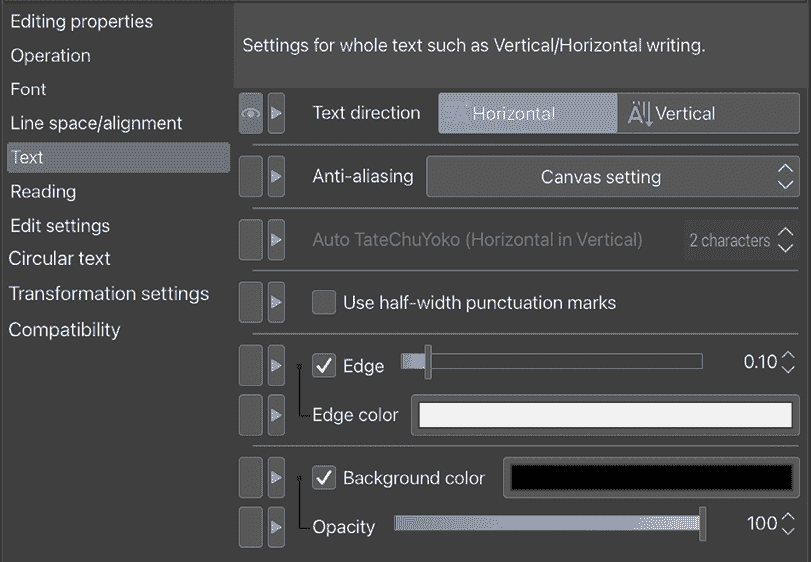

图 7.7：文本工具的子工具详细调色板中的文本选项

下面的列表中描述了每个**文本**设置：

+   **文本方向**：将文本方向设置为**水平**或**垂直**。

+   **抗锯齿**：设置文本使用的抗锯齿。选项有**画布设置**、**开启**和**关闭**。

+   **自动 TateChuYoko（垂直中的水平）**：设置在**TateChuYoko**（垂直中的水平）中自动显示多少个连续半角字符。它仅适用于日语，因此我们可以跳过这一项。

+   **使用半角标点符号**：选中此复选框将使用宽度为正常大小一半的标点符号，这仅在使用双字节字符的语言中有效，例如日语。

+   **边缘**：为选定的文本添加轮廓。轮廓的厚度可以通过点击复选框后激活的滑块来控制。

+   **边缘颜色**：允许用户选择边缘轮廓的颜色。点击选项名称右侧的矩形以选择颜色。

+   **背景颜色**：为文本设置背景颜色。

+   **不透明度**：控制背景颜色的不透明度。

在下一节中，我们将查看**编辑****设置**，跳过**阅读**设置，因为它们是专门为日本漫画设计的。**编辑****设置**允许你决定文本颜色和要将文本添加到哪个图层。

## 编辑设置

在本节中，我们将查看文本颜色设置以及要将文本添加到哪个图层。图 7.8 显示了**文本**选项中的**编辑****设置**类别：

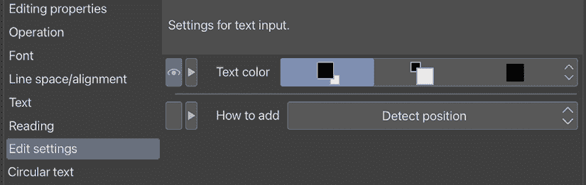

图 7.8：文本工具的子工具详细调色板中的编辑设置选项

下文将解释这些选项：

+   **文本颜色（**重要**）**：通过将其设置为主要颜色、副颜色或用户颜色来控制文本颜色。用户颜色可以通过点击用户颜色图标然后使用颜色选择器选择颜色来选择。

+   **如何添加**：此下拉菜单控制 Clip Studio Paint 如何插入文本，例如始终创建新图层、添加到选定的文本或检测位置。

现在，我们已经知道了**编辑设置**是什么。你知道你可以转换你刚刚输入的文本吗？继续阅读以了解更多。

## 圆形文本

如果你想要创建一个围绕圆形形状的圆形文本的有趣设计，这个功能就是为你准备的！通过点击**圆形文本**框，设置将变得可用，如图 7.9 所示。

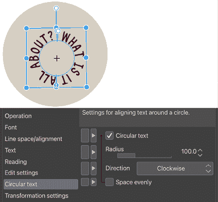

图 7.9：文本工具的子工具详细面板中的示例文本和圆形文本选项

+   **半径**：你可以调整文本放置的圆形的半径。

+   **方向**：当设置为下拉菜单中的**顺时针**时，字符将按顺时针方向排列。当设置为**逆时针**时，字符将按逆时针方向排列，使得文本读起来是逆时针的。

+   **均匀间距**：当开启时，字符或单词将在起点和终点之间均匀分布。你可以通过画布上的手柄调整起点和终点，如图中所示的前一个截图。

## 变换设置

如果你想要调整文本的大小、旋转和倾斜，这些设置会很有用。图 7.10 显示了带有手柄的变换方块和**子工具详细**面板中的**变换设置**类别。

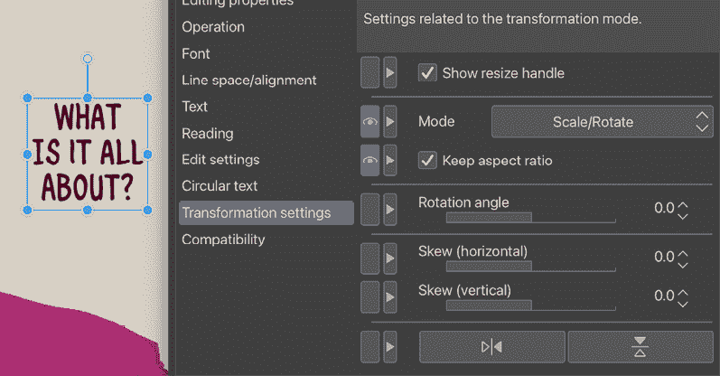

图 7.10：文本工具的子工具详细面板中的变换设置选项

以下列表解释了**变换设置**选项：

+   **显示调整大小手柄**：在调整大小框的顶部，你可以看到一个带有小球的条形末端的手柄。通过开启它，你可以使用手柄调整文本大小。

+   **模式**：这个下拉菜单控制你想要如何变换文本，例如**缩放/旋转**、**缩放**、**旋转**、**倾斜**和**缩放/旋转/倾斜**。

+   **保持纵横比**：当开启时，在变换文本时保持纵横比。

+   **旋转角度**：调整围绕水平轴的旋转角度。

+   **倾斜（水平）**：调整文本的水平倾斜。

+   **倾斜（垂直）**：调整文本的垂直倾斜。

+   **翻转**：左侧按钮水平翻转文本，右侧按钮垂直翻转文本。

现在，你可以控制文本的变换。接下来，还有一个你可能想了解的最后一个设置。

## 兼容性

在某些情况下，字体根据你使用的 Clip Studio Paint 版本可能会有细微的外观差异。例如，当你向在 1.13 版本中创建的漫画添加新文本时，相同的字体在 3.0 版本中可能会有新的设计。

如果你想要保持你漫画中所有文本的一致性，最安全的选项是使用相同版本的相同字体。你可以从下拉菜单中选择你正在使用的版本。另一个选项是手动编辑设置，尽管这将是一场败仗。

现在我们已经熟悉了所有可用的编辑和微调文本的选项，让我们创建一个自定义文本工具预设来保存特定漫画项目的这些设置。

**提示**

您是否经常打开**子工具****详细**窗口来获取设置？任何工具的**子工具详细**设置都可以通过点击设置名称左侧的矩形添加到界面中的**工具属性**面板。旁边有眼睛图标的设置将出现在**工具属性**面板中，使它们易于访问！

哇，这真是太多了要吸收——许多文本设置，如对齐、行间距和文本颜色！但它们让您有自由控制文本在您的漫画中如何显示；您还可以根据场景、语气和情绪更改它们。有没有一个固定的设置，由您自己创建，您可以在整个漫画中使用它，而无需每次都重置？让我们通过阅读下一节来实现这一点。

# 创建自定义文本工具

对于某些项目，您可能需要多次使用同一组文本设置。制作漫画只是您可能想要自定义文本工具的一个例子，该工具可以保存您的字体、字体大小、对齐方式和其他设置，这样您就无需反复设置它们！

创建自定义文本工具很容易。按照以下步骤创建一个保存的文本工具：

1.  选择**文本**子工具。

1.  在**子工具**面板的右下角，点击**创建当前选中的子工具副本**图标。

1.  将出现**复制子工具**窗口，如图 7.11 所示。

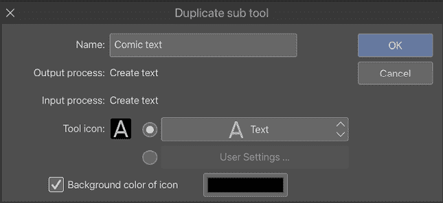图 7.11：复制子工具

1.  在**名称**文本输入框中为您的新的文本工具输入一个名称。

1.  如果需要，选择一个工具图标。

1.  点击**图标背景颜色**复选框并选择一个颜色，当选择此子工具时，在图标周围显示该颜色。

1.  点击**确定**以创建新的子工具。

1.  使用文本设置和高级设置，对新文本工具进行更改，以设置字体、字体大小以及任何其他选项，使文本看起来符合您的要求。

现在，无论何时您需要使用这些设置创建文本，您都可以选择您自定义的文本工具预设，并立即开始输入！

# 创建和编辑对话气泡

由于 Clip Studio Paint 主要是为了创建漫画而制作的，因此程序中包含了一些创建对话气泡的工具。只需几步点击，我们就可以创建可以像矢量对象一样编辑的对话气泡和尾巴。

按照以下步骤创建一个气泡和尾巴：

1.  使用我们在本章第一部分给出的说明，在画布上添加一些文本。

1.  **气泡**工具与**文本**工具属于同一类别。它们在图 7.12 中显示。

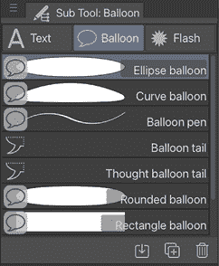

图 7.12：气泡子工具

1.  选择所需的**气泡**工具。在本套说明中，我们将使用**椭圆气泡**工具。

1.  选择文本层后，点击**椭圆气球**工具，并拖动以创建围绕文本的气球。不用担心做得完美——我们将在下一步调整位置。

1.  使用**操作**|**对象**工具，点击之前创建的气球。使用此工具直接点击气球将显示单个控制点，并允许像矢量点一样操作它们。如果您想了解更多信息，请参阅*第十章*，*矢量图层和材质面板*。使用边界框外部的手柄根据需要调整气球的大小，如图 7.13 所示。

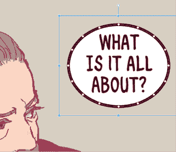

图 7.13：椭圆气球示例

1.  要重新定位气球内的文本，使用**对象**工具点击文本以显示文本边界框。在框内点击并拖动文本将重新定位文本，而外部的手柄可以用来调整文本的大小。

1.  要创建气球尾巴，从**文本**类别中选择**气球尾巴**子工具。

1.  在**工具属性**面板中，从**如何弯曲**下拉菜单中选择所需的选项。在这个例子中，我们将使用**样条**选项。

1.  点击在话筒内开始绘制尾巴。当使用**样条**选项时，在气球尾巴应该弯曲的点处点击第二次。继续点击放置曲线点，直到达到所需的尾巴长度，然后双击结束尾巴。您可以在图 7.14 中看到完美的尾巴。

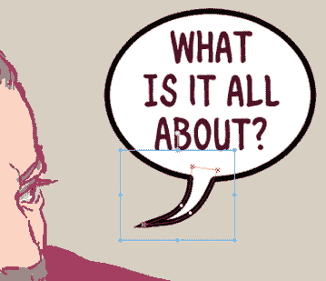

图 7.14：带尾巴的气球

对象工具可以用来编辑气球尾巴以及气球的外观。前面的说明告诉我们如何制作一个简单的气球和尾巴。现在，在我们讨论其他气球工具之前，让我们花几分钟时间看看**椭圆气球**工具的**工具属性**选项。

## 椭圆气球工具

图 7.15 显示了**椭圆气球**工具的**工具属性**面板，这是最通用且易于创建的气球。在 Clip Studio Paint 中，您可以决定话筒的外观，例如颜色、形状以及要将它们添加到的图层。让我们看看如何调整气球的外观，使其符合您的期望。

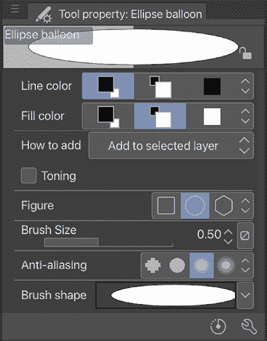

图 7.15：椭圆气球工具的**工具属性**面板

下面的列表描述了**工具属性**窗口中显示的每个选项：

+   **线条颜色**：气球边缘轮廓的颜色。通常，我们将其设置为使用主颜色，即黑色。

+   **填充颜色**：设置话筒内部的颜色。通常，我们将其设置为使用子颜色，即白色。

+   **如何添加**：控制气球如何添加到图像中。选项有**创建新图层**和**添加到所选图层**。我通常选择**添加到所选图层**以减少图层的数量。

+   **色调**：通过点色调效果创建气球。

+   **形状**：设置气球的形状。可以创建矩形、椭圆或多边形。最常见的使用是椭圆。

+   **刷大小**：控制轮廓的厚度。较细看起来更聪明，而较粗则使读者更容易识别阅读文本的区域。所以，你还得考虑整体构图。

+   **抗锯齿**：设置创建的气球轮廓的抗锯齿级别。选择**弱**用于常规使用。

+   **刷形**：此下拉菜单允许将各种效果应用于气球的轮廓。除了最常见的**笔**设置外，还有更多设置可供选择，例如**铅笔**、**喷枪**和**喷雾**，以及水彩设计如**波浪**、**粗糙边缘**、**凹凸**、**虚线**、**点线**、**心形**、**星形**、**蕾丝带**和**旋律**等可以应用于轮廓。

创建自己偏好的气球难道不是既简单又足够吗？我们将在下一节中查看如何编辑气球尾巴，这甚至更简单易行！

## **气球尾巴工具**

在漫画中，尤其是在同一面板中有多个角色时，我们需要指明哪个对话来自哪个角色，以避免混淆。因此，为每个对话配备准确的气球尾巴是必要的。让我们来看看有哪些气球尾巴选项。

图 7.16 显示了**气球尾巴**工具的选项。

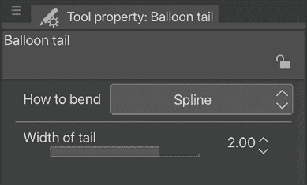

图 7.16：气球尾巴工具的工具属性面板

以下列表描述了**气球尾巴**工具的每个选项：

+   **如何弯曲**：设置要创建的尾巴类型。这些是**直线**、**折线**和**样条线**。

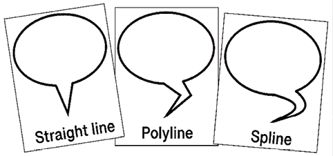

图 7.17：各种气球尾巴工具

+   **尾巴宽度**：控制尾巴起始点的宽度。在上一个屏幕截图中，宽度设置为 142.0。

太好了，现在你知道如何设置气球尾巴选项了！让我们继续了解不同形状的气球，这在需要比椭圆形状气球更多样化的情况下非常有用。

## **曲线气球工具**

**曲线气球**工具是创建对话气泡的另一种方式，它允许在气球形状上具有更大的灵活性。图 7.18 显示了此工具的选项。

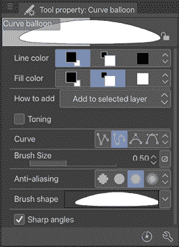

图 7.18：曲线气球工具的工具属性面板

许多这些选项与**椭圆气球**工具相同。以下列表解释了此工具独有的选项：

+   **曲线**：控制气球曲线的形状。有关每个**曲线**选项的详细描述，请参阅第十三章“所有关于标尺”中的*曲线标尺*部分。

+   **锐角**：将角落从平滑曲线变为硬角。

所以气球不必总是圆形！让我们在下一节中看看更多不同形状的气球。

## **气球笔工具**

大多数时候，Clip Studio Paint 的工具足以制作椭圆、尾巴和曲线，以讲述你的故事。如果你正确使用它们，它们是可定制的，并且易于阅读。

然而，有时你可能想创建自己的气泡。如果你有一个非常华丽的漫画风格，那么你很可能想创建自己的气泡，甚至开始学习书法。或者，也许你只是想自己绘制气泡，因为你想要传达一种语气，比如一个愤怒或恐慌的角色。

**气球笔**工具允许我们通过手绘来创建对话气泡。图 7.19 显示了此工具的**工具属性**选项。

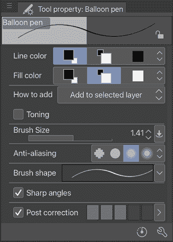

图 7.19：气球笔工具的工具属性调色板

到目前为止，我们已经看到了这些设置中的大多数。事实上，只有一个新选项需要记住：

+   **后校正**: 当此选项被选中时，程序将在绘制线条后对其进行平滑处理。校正量基于选项名称右侧条形栏中选择的值。我通常将此设置在最小值，因为使用**气球笔**工具的原因是为了创建手绘线条，例如一个颤抖的线条气球，用于一个害怕角色的对话。

这就只剩下了一个问题：*我应该绘制什么形状*？这实际上是一个非常好的问题，因为这将是一直在学习的事情。我建议你翻阅一些你最喜欢的漫画以获取灵感，以及 Clip Studio Paint 中可用的对话气泡材料。如果你需要，你可以将这些材料（甚至在网上找到的图片）放在画布上，以便练习。

你现在已经掌握了对话气泡；使用我们学到的选项，你可以添加气泡，更改它们的形状和颜色，编辑它们的尾巴，甚至绘制手绘形状的气泡！

在一个画格中有多于一个对话怎么样？如果它们来自同一个角色，你也可以将它们连接起来！这不是很有趣吗？

我们将在下一节中讨论如何做到这一点！

# 实现连接的对话气泡

在本节中，我们将学习如何实现连接的对话气泡。当你在多个连接在一起的对话气泡中有多段对话时，会使用连接的对话气泡，如图 7.20 所示。

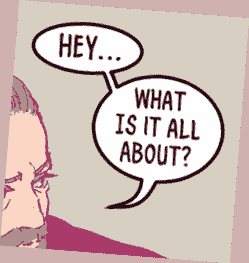

图 7.20：连接气泡的截图

在 Clip Studio Paint 中，这种风格的对话气泡很容易制作，但确实需要一些事先考虑。设置连接的对话气泡实际上发生在制作对话气泡的文本工具阶段。按照以下步骤创建连接的对话气泡：

1.  使用**文本**工具输入第一个对话气泡的文本。点击文本输入下方带勾选圆圈的图标以提交文本。此图标如图 7.21 所示。

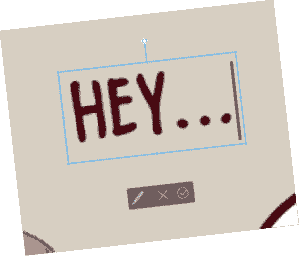

图 7.21：文本输入命令栏

1.  选择**文本**工具，将光标移至包围你输入的第一个文本的框附近。当你处于正确的位置制作连接文本框时，光标旁边会出现一个**+**图标。点击并输入第二个气泡的文本。

1.  当输入第二个文本区域时，点击一次勾选圆圈图标。任何连接的文本区域周围都会出现一个框，如图 7.22 所示。

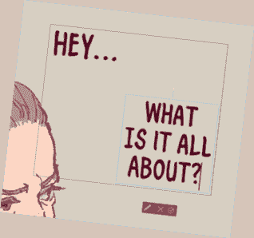

图 7.22：同一图层上的两个不同文本

1.  使用本章节中“制作和编辑对话气泡”部分提供的说明，为每个文本部分创建一个气泡。

1.  选择**气泡尾巴**工具，将尾巴从第一个气泡拖动到第二个，如图 7.23 所示。

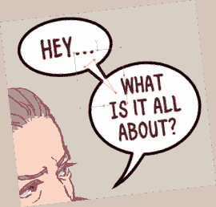

图 7.23：连接对话气泡的尾巴

1.  一旦创建尾巴，它将自动连接两个气泡，如图 7.24 所示。

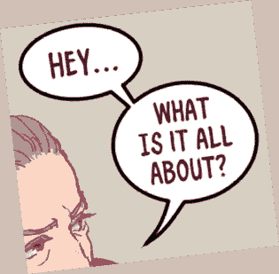

图 7.24：连接的对话气泡

哇，两个对话已经连接上了！漫画读者会完美理解这两个气泡都来自同一个角色！

现在，你已经知道如何在同一面板中处理多个气泡，所以当有多个对话时，你不会慌张。你只需在第一个对话下方点击**+**图标，创建气泡，然后用尾巴将它们连接起来。

在下一节中，我们将学习如何使用现成的特殊气泡。你可能会找到一个非常适合你漫画或漫画创作的气泡。

# 使用对话气泡材料

除了拥有可用的对话气泡子工具外，Clip Studio Paint 还有一个用于特殊对话、情感时刻以及几乎所有你能想象到的内容的对话气泡材料库。

我们将在第十章*矢量图层和材料调色板*中更深入地介绍材料，但现在让我们看看**材料**调色板中的具体气泡。

本节中**材料**调色板的部分如图 7.25 所示。

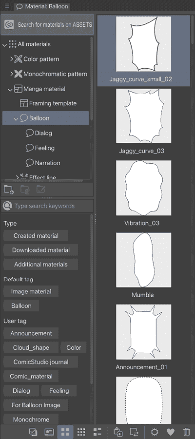

图 7.25：对话气泡材料

气泡材料位于图书馆的**漫画材料**类别中。气泡有三个子类别，具体如下所示：

+   **对话**：**对话**气泡包括喊叫、咕哝、公告、耳语、思维云等气泡。

+   **情感**：**情感**气泡更加专业化，具有花朵、星星等颜色的边框。

+   **旁白**：**旁白**类别包含各种矩形气泡，非常适合漫画中的旁白。

注意，这些材料中的一些可能需要在使用前从 Clip Studio Assets 下载。更多信息，请参阅第十八章，*探索 Clip Studio Assets 和动画*。

要使用对话气泡材料，选择材料以突出显示它，然后点击**材料**调色板底部的**将选定的材料粘贴到画布上**图标。

图标显示在图 7.26 中。

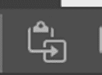

图 7.26：粘贴所选材料到画布图标

对话气泡材料不会自动附着到图像中现有的文本上，因此可能需要重新定位和调整大小以适应文本。

# 摘要

在本章中，我们学习了如何使用**文本**工具和设置来编辑和微调文本。我们学习了如何创建自定义文本工具以保存我们的漫画项目的文本设置。然后，我们学习了如何创建带尾巴的对话气泡，如何连接对话气泡，以及关于对话气泡材料的内容。

这些技能非常实用，不仅可以帮助你更快、更准确地书写文字和绘制对话气泡，还可以让你的对话具有独特的风格。漫画和漫画中的文字确实是你的创作的一部分，它在讲述故事时与你的艺术一样重要。

随着你阅读更多的漫画和漫画，你会注意到字体及其放置如何完美地补充场景、节奏和故事主题。了解适合你的漫画的字体是很重要的——如果你追求整体的艺术一致性，你应该考虑创建自己的字体。这是一套独特的技能，但你将开始看到有意义的差异，而无需成为书法和字体设计的专家！话虽如此，我们需要记住，最重要的是可读性；选择易读的设计而不是艺术外观，以便能够讲述你的故事，始终如此。

在下一章中，我们将学习一些绘制艺术作品的技巧，同时也会查看许多可用的绘图工具。

# 加入我们的 Discord 频道！

与其他用户一起阅读这本书。提出问题，为其他读者提供解决方案，等等。

扫描二维码或访问链接以加入社区。

[`packt.link/clipstudiopaint`](https://packt.link/clipstudiopaint)

