# 8

# 开始使用上墨工具

在漫画的早期，铅笔线条太浅，无法被用来复制漫画艺术的相机捕捉。因此，艺术家使用画笔或钢笔和黑色墨水重新绘制铅笔线条，使它们足够深，以便相机捕捉。上墨已经成为一门艺术。Clip Studio Paint 拥有数字艺术界最好的上墨工具之一，当你购买软件时，它就包含在内。还有许多第三方工具可供免费或购买，这些工具提供了专业的上墨功能，为上墨线条提供了不同的外观和感觉。

我们将在第一部分开始逐步上墨过程，所以如果你对数字上墨不太了解，请不要担心！你还将看到 Clip Studio Paint 提供的许多上墨工具，然后我们将在本章的后续部分了解如何自定义它们。最后，我们将以了解如何在矢量图层上使用上墨工具来结束本章。

在本章中，我们将讨论以下主题：

+   上墨原则

+   上墨工具

+   自定义压力灵敏度设置

+   在矢量图层上上墨

+   上墨漫画分镜的技巧

让我们开始吧！

# 上墨原则

在非数字工具的世界里上墨是一个使用钢笔或画笔和印度墨水来最终确定铅笔线条并使其准备好上色或着色的过程。在漫画早期，印刷机无法打印灰度，因此需要深黑色墨水线条来复制漫画艺术。

在数字世界中，我们不仅仅局限于使用黑色墨水来绘制线条，我们可以使用多种工具来制作我们的最终线条。良好的上墨有一门艺术，我们应该简要讨论一下。

上墨是将粗糙的铅笔草图转化为具有最终边缘、体积和光影感的艺术。为了看到这个过程的实际操作，让我们看看从草图到最终色调的上墨过程，并研究上墨线条如何强调作品的氛围。

## 创建优秀的铅笔草图

在开始上墨之前，你需要创建铅笔草图，这是我们曾在*第三章*，*铅笔绘制：层和后期属性面板*中学到的。在那个章节中，我们提到了如何使用铅笔草图来建立角色的比例。在我们开始上墨之前，让我们再次提及那个方法，同时引入一些更复杂的元素——这次是**透视**。

当你创作视觉作品时，你应该考虑透视如何在你想要在静态图像中创造动感时发挥神奇的作用。一旦你对比例感到舒适，深入透视是自然下一步要学习的技能，以创作出优秀的铅笔草图。

在理论上，透视是一种相当简单的东西，但在艺术中运用它则需要练习。我们知道，离你越近的物体看起来比远处的物体大。在左边的图像中，我们可以看到我使用右边的透视在一个画面中绘制了我的 7 头身比例角色，这比没有重叠或透视地排列它们创造了一个更戏剧化的外观。

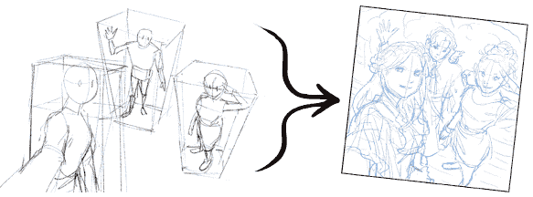

图 8.1：铅笔素描的构图图像

在前面的草图中，前面的女士正在拍团体自拍，这意味着她是离相机最近的对象，因此她的右臂看起来很大，遮挡了她的身体。然后右边的角色是下一个最近的对象，画得稍微小一些。最后，站在相机后面的角色，由于被其他两个角色遮挡，他的身体被隐藏了。

如果你将这三个角色分别绘制在不同的图层上，那么移动它们进行编辑会更加方便。例如，你可以选择每个单独的角色，并在构图中移动它们，同时调整它们的大小。你可以编辑或重新绘制，直到你觉得看起来合适。

一旦在最初的几幅草图的基础上确立了基本形态，你将想要考虑添加细节。最好是以迭代的方式来做，添加新的图层，并逐渐深入到更复杂的细节中。

根据你想要创作的漫画风格，学习如何绘制细节可能对你来说是一个漫长而有益的旅程。实际上，这是一个永无止境的经历。话虽如此，一个基本且必须做对的地方是创造表情。与透视训练相结合，训练自己绘制表情将产生更加生动的艺术作品！

看看下面的角色，他们表达了一系列的情感：

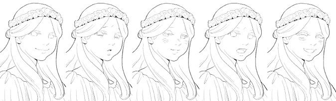

图 8.2：各种面部表情的截图

正如你所见，一个人的许多表情都来自于他们的嘴和眼睛。如果你是刚开始学习画表情，这一点值得思考和实践——一个角色如何用眼睛皱眉？他们如何用眼睛微笑？尝试使用不同的图层叠加来绘制不同的表情。注意眉毛的位置如何带来很大的差异。此外，你还需要考虑脸颊的红晕、眼睛周围的皱褶和其他细节。

就像所有绘画技巧一样，最好的学习方法是研究别人是如何做的，然后亲自实践。你也可以使用 Clip Studio Paint 材料或从网上下载的图像，尝试追踪它们的表情。

如你所注意到的，*图 8.2* 不是一个混乱的草图，而是一个墨迹构图。现在你已经使用铅笔素描将你的艺术作品做到你满意的程度，是时候用同样的方式给你的艺术作品上墨了，在这个过程中清理它，并做出一些额外的艺术决定。

## 开始上墨

一旦你认为你的草图准备好可以用墨重新绘制，使用**图层属性**调板上的**图层颜色**设置将最终铅笔草图变为蓝色，并将草图层的**不透明度**设置为 30%，以便更容易地看到新的上墨线条。

别担心，你的草图在这个阶段应该相当粗糙，每条线都有多次尝试，还有一些用于组织透视、面部细节等的引导线。这就是为什么我们现在会用最终的上墨线条来覆盖它。

当你给图像上墨时，最正统的方法是使用**G 笔**，它因其具有更高的触感和倾斜灵敏度设置而受到欢迎，适用于字符轮廓，以及**映射笔**，它非常适合在内容上绘制非常细的线条以及进行细节处理。

更高的触感和倾斜灵敏度意味着线条宽度会根据你施加的压力或倾斜程度从细到粗变化。这可以在以下**笔压**设置和相应的线条样本的截图中看到。

要更改**笔压**和**倾斜**输入，你可以通过点击**笔刷大小**设置右侧的按钮来找到选项：

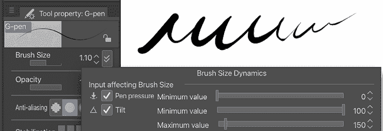

图 8.3：高笔压设置和线条的截图

以下截图显示了一个非活动压力和倾斜灵敏度设置，这意味着无论你施加多少压力或倾斜你的笔，笔的宽度都不会改变：

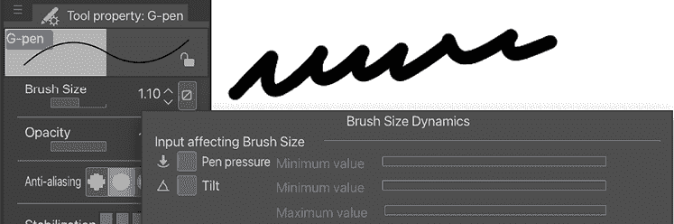

图 8.4：低笔压设置和线条的截图

我们将在本章后面的*自定义压力灵敏度设置*部分探索更多笔的设置。

通过对线条宽度有很好的控制，可以使图像看起来经过精心制作且柔和，尤其是当你绘制像人类皮肤、头发和蓬松的连衣裙这样的东西时——这些用具有更高触感和倾斜灵敏度的 G 笔来创建将非常完美！

映射笔的触感和倾斜灵敏度较低，但我向你保证，使用它配合微小的笔刷设置，并围绕头发、眼睛和服装的细节进行绘制，将为你提供绘制内容的完美和精确的外观。让我们再次看看*图 8.2*中使用的上墨工具：

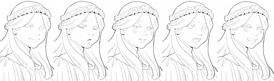

图 8.5：各种面部表情的截图

使用这些笔可以帮助你描绘面部表情的微妙细节！

以下截图显示了使用**G 笔**和**映射笔**进行上墨的第一阶段：

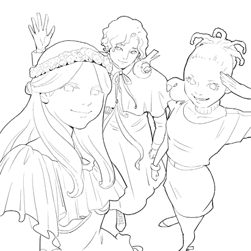

图 8.6：第一绘图阶段的截图

你可能会注意到两件事：

+   第一件事是线条粗细；角色的轮廓是用较粗的**G 笔**线条绘制的，使角色从背景中突出出来，细节是用较细的绘图笔线条添加的。如果所有线条的粗细都相同，漫画的读者将难以找到焦点。对于极端的透视场景，你可以为最近的对象使用非常粗的线条！

+   第二件事是，这条线描中已经有了阴影。看看字符的脸部下方，以及花环下方，注意黑色填充的墨水部分如何描绘阴影。这是在简单的黑白线描上创造三维效果的一个技巧。

在下一阶段，我们可以添加更多阴影和深色表达，如下面的截图所示：

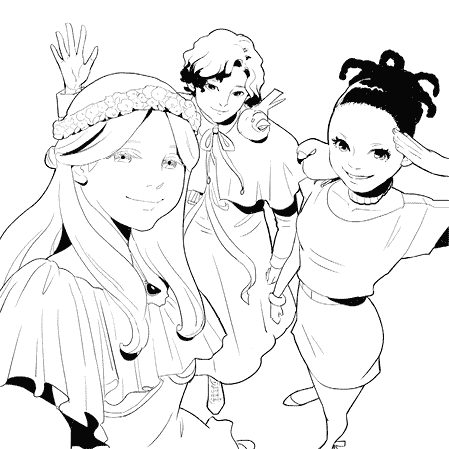

图 8.7：第二次上墨阶段

嘭！右边的角色头发是黑色的，中间的角色头发是暗而有光泽的，左边的角色头发是浅色的。你可以通过添加一些线条来创建任何笔工具的封闭区域，用下面的层的**填充**工具填充区域，并留下一个小部分未触及，以产生光泽的头发效果。

不仅头发如此；如果你看看他们的眼睛，眼睛的颜色也是用不同的阴影描绘的。左边的角色眼睛颜色较浅，因此眼睛不像其他人那样用黑色墨水填充。

如果我们有一个背景会怎样呢？请看下面的截图：

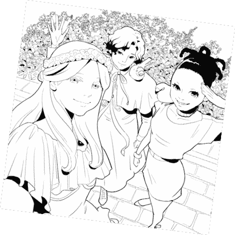

图 8.8：背景上墨阶段的截图

树木、树叶和地板瓷砖被添加到图中！与角色轮廓相比，背景图像是用绘图笔以更细的线条绘制的，因为背景中的自然物离相机更远，在这个图像中不太重要。此外，您还可以将背景层的颜色更改为浅灰色。这有助于与前景中的对象形成更多对比。

但等等…这张图片看起来太杂乱了！你需要在角色或物体与背景之间留出空间。

首先，我们将在包含字符的层和背景层之间添加一个新层。然后，我们使用画笔工具用白色在角色周围绘制空间。

以这种方式，你可以强调图像的重点，如下面的截图所示：

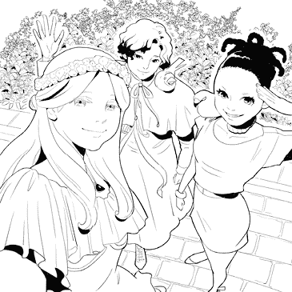

图 8.9：带有额外上墨阶段的背景截图

这仅仅是一个微小的变化，但它使读者在图中关注对象的引导上产生了很大的差异。最后要添加的是，在字符下方添加一个黑色阴影的积水，使它们真正突出，如下面的截图所示：

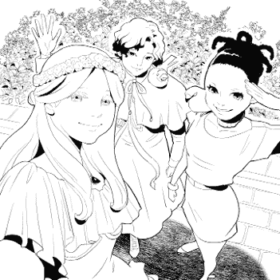

图 8.10：最后上墨阶段的截图

通过在包含字符的层和背景层之间添加一个新层，我们现在可以清楚地看到角色。

当然，有很多种上墨的方法。许多上墨者使用黑色填充某些区域以表示深色调。羽化、交叉影线和交叉影线可以用来添加阴影、细节和纹理。以下图像是相同的上墨艺术作品，但使用了交叉影线进行上色：

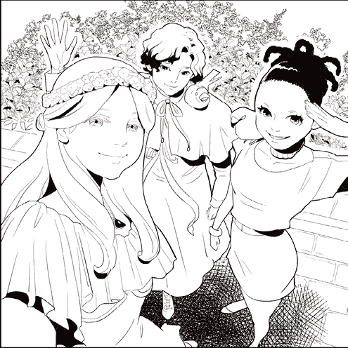

图 8.11：使用交叉影线进行上色的截图

甚至有使用无线条重量的墨水风格的艺术，这种风格被称为*线条清晰*或清晰线条。上墨就像每个艺术家的风格一样个性化，如果你是新手，可能需要一段时间来发展自己的风格。关键是不断练习！

现在我们已经了解了一些上墨的原则，如何更改铅笔层的图层颜色，如何使用细线和粗线，如何添加阴影，以及最后如何绘制背景，让我们在下一节中探索一些 Clip Studio Paint 中的上墨工具。

# 探索上墨工具

Clip Studio Paint 提供了各种上墨工具，多亏了可定制的笔刷引擎，我们还可以修改工具以更好地满足我们的需求。对于经验丰富的上墨者，有一些模仿传统上墨工具的工具，如 G 笔、萝卜笔、书法笔和纹理笔。还有各种可以用于上墨的记号笔工具。

## 交替上墨工具

有些漫画家决定使用**铅笔**工具进行最终上墨，而其他人只是用它来绘制草图。使用**铅笔**作为最终上墨工具的一个原因是可以给人一种“手工”的感觉。它不仅轻便且易于绘制，还能给人一种温暖的手绘印象，就像翻看艺术家的素描本一样。右边的截图显示了使用**铅笔**工具绘制的面板。

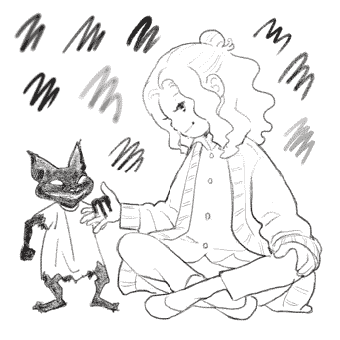

图 8.12：铅笔绘制的截图

这里与钢笔绘制的区别在于线条不太平滑和清晰，阴影不是平坦的黑色块，我们仍然可以看到铅笔痕迹。

使用**铅笔**工具，我们还可以创建其他艺术元素，如与我们的艺术作品和谐一致的对话框和音效。生活片段或幻想故事漫画通常使用铅笔或粉笔进行最终上墨，以营造温馨舒适的感觉。

让我们看看左边的截图中的另一种使用刷子而不是墨水的替代方案。

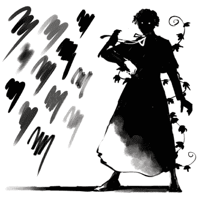

图 8.13：刷子绘制的截图

在这个截图中，我们可以看到刷子绘制的图像和其他刷子标记样本。使用刷子的好处是我们可以立即将视觉效果转变为戏剧性的，并轻松创建黑到灰的色调。图像底部角色的阴影显示了纹理渐变。线条不如使用**笔**工具绘制的线条平滑，但**刷**工具给了我们使用涂抹、涂抹或模糊效果的空间。我们经常发现漫画家使用**刷**来创作恐怖、悬疑和传统东方风格的漫画。

**提示**

一旦你选择了一个上墨工具，确保在整个漫画中坚持使用该工具，除非你想要在故事的部分特定部分添加不同的印象，例如某人的过去或梦境序列。例如，如果你从 12 pt 开始使用**G-pen**，请一直使用它直到结束。否则，漫画的视觉效果将不会保持一致性，读者将无法再专注于故事。

**G-pen**默认工具由于其压力灵敏度设置，如我在上一节中提到的，作为真实毛笔和墨水体验的替代品相当不错。

我收到很多人询问我使用哪些上墨工具。我个人使用了几种我喜欢的第三方设计师提供的上墨工具！你可以下载其他 Clip Studio Paint 艺术家创建的现成笔，其中一些是付费的。你可以查看*第十八章*，*探索 Clip Studio Assets 和动画*，了解更多关于这些现成材料和如何下载它们的信息。

但如果你不想花钱购买工具，你总是可以制作一个适合你需求和风格的工具！对于每个艺术家来说，“感觉正确”的工具都是不同的，因为每个艺术家都是不同的，并且希望从他们的工具中获得不同的外观。我们将在后面的*自定义压力灵敏度设置*部分进一步探讨这一点。

**提示**

在获得平滑外观的墨迹方面有困难吗？在放大时上墨！我发现将 300 dpi 或更大图像放大到 250%然后上墨对我来说效果最好。当我放大时，线条看起来有点不稳，但缩放回来看，线条看起来平滑且清晰！

让我们简要讨论一下我们可以用来在 Clip Studio Paint 中上墨的工具类别。

## 马克笔工具

从美工笔到基本的 Sharpie，大多数艺术家在他们的一生中某个时刻都曾使用过马克笔工具在纸上绘制作品。在 Clip Studio Paint 中，马克笔工具的特点是具有固定的线宽，这意味着无论我们用笔尖轻按还是重按，它们都不会变粗或变细，正如你在右边的截图中所看到的笔和马克笔的比较。

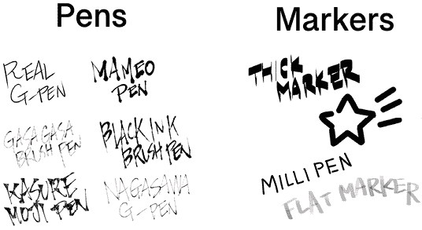

图 8.14：笔和马克笔样本截图

尽管马克笔提供的线条宽度没有变化，但在某些上墨情况下它们仍然很有价值。例如，带有吉祥物和物体、机器以及其他无机物体的背景，用线条变化较少的线条上墨看起来很棒：

图 8.15：马克笔样本截图

尽管我们按下时不会变粗或变细，但我们总是可以改变马克笔尖的大小，通过手动使其变粗或变细来获得线条的变化，而不是通过压力。

马克笔工具可以在**笔**类别下找到，作为该类别下的子工具标签。以下是**马克笔**工具在**子工具**调色板中的截图：

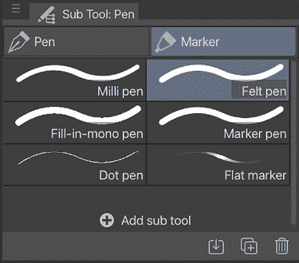

图 8.16：标记子工具面板截图

让我们来看看一些更多的绘图工具。

## 钢笔工具

钢笔工具是数字和模拟艺术世界中的主要绘图工具。经过一些练习，我们可以用钢笔工具绘制任何东西。Clip Studio Paint 中的钢笔工具具有压力感应功能，允许我们根据用笔尖按压的力度来绘制粗细不同的线条。

**提示**

在 Clip Studio Paint 中遇到工具问题？请访问你平板电脑品牌的网站，确保你已经安装了你平板电脑型号的最新驱动程序。一些最常见的软件问题只是过时驱动程序的问题。确保你也备份了以前的驱动程序，以防新驱动程序中存在错误！

对于从传统艺术转向数字艺术，并使用画笔或毛笔进行上色的艺术家来说，Clip Studio Paint 中的钢笔工具在绘图时将提供最熟悉的感觉，尤其是如果你有一个可更换笔尖的平板电脑笔。Wacom 品牌的平板电脑通常有不同的笔尖可以安装在笔尖上，以在平板电脑上提供不同的感觉，无论是增加摩擦以使体验更像在纸上工作，还是弹簧加载的笔尖，可以提供画笔或毛笔的柔软感觉。因此，如果你有这种可以更换笔尖的平板电脑，一定要尝试一下！此外，你还需要确保手头有几根额外的笔尖，因为笔尖会随着时间的推移而磨损，需要更换。你不想在截止日期临近时没有新的笔尖而只有一根短小的笔尖！

以下截图显示了**笔**工具类别在**子工具**面板中的位置：

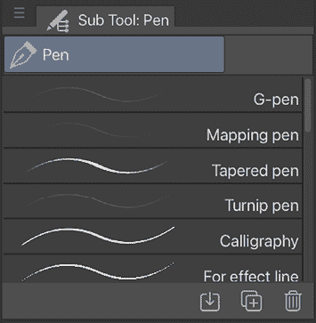

图 8.17：笔子工具面板截图

**提示**

如果你发现你的手粘在平板电脑上（或者对于屏幕或平板电脑上的工作者来说，是弄脏了平板电脑），你将需要一块防污布！这些手套戴在你的主导手，除了小指和无名指外，其他手指都是无指的，这些手指上有布料以防止你的皮肤接触平板电脑。你可以通过购买一双便宜的手套并剪掉大拇指、食指和中指来自己制作一个，或者你可以购买一个。一个流行的品牌是[www.smudgeguard.com](http://www.smudgeguard.com)。

我们在本节中探讨了钢笔工具和标记工具，以及它们之间的区别。

我们可以通过多种方式自定义我们的绘图工具，但开始自己制作工具最简单的方法之一是更改压力感应设置。在下一节中，我们将复制一个现有的工具并调整其设置，以制作我们自己的自定义绘图工具。

# 自定义压力感应设置

所有艺术家都有自己的笔倾斜偏好和他们在纸上施加的压力。我们可以通过在纸上使用传统笔来控制这一点，但我们需要配置我们的数字工具，以便它们理解我们的偏好。

我们将创建一个敏感的笔，它将给我们提供细线，但也会很快变粗。按照以下步骤完成这个练习：

1.  从**笔子工具**调板中选择**G-pen**工具。

1.  在**子工具**调板右下角点击**创建当前选中子工具的副本**图标，以复制**G-pen**工具。

1.  用你喜欢的名字命名新工具。在右侧的截图上，我们正在将工具命名为`Responsive Pen`：

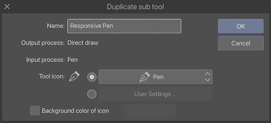

图 8.18：**笔副本子工具**窗口的截图

1.  点击**确定**以完成工具副本的制作。

1.  在**工具属性**调板中，点击扳手图标以打开**子工具详情**窗口。

1.  将**笔刷大小**更改为**8.0**。

1.  点击**笔刷大小**选项最右侧的按钮以打开**笔刷大小动态**选项。

1.  确保在**笔压力**旁边的复选框被勾选。**笔刷大小动态**窗口应该看起来像右侧的截图。

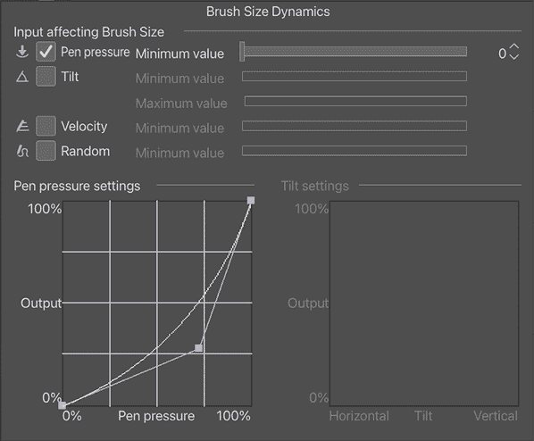

图 8.19：**笔刷大小动态**窗口的截图

1.  **最小值**滑块控制我们的笔可以多小。它设置为**0**，表示如果我们使用轻压力，我们可以在线条上创建断裂。如果你想制作一个始终给出至少一些厚度的工具，你可以将此滑块更改为不同的最小值。

1.  底部标记为**笔压力设置**的曲线图控制随着我们在笔尖上增加压力，笔从**0%**到**100%**的速度。我们将将其从目前温和的曲线改为 S 曲线。要做到这一点，点击曲线以添加第二个控制点。然后，调整紫色手柄以形成以下截图中的形状：

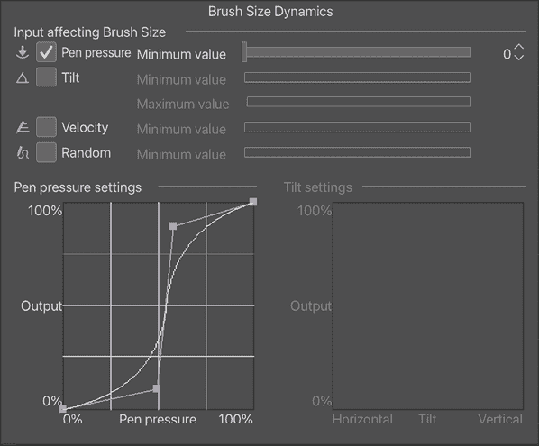

图 8.20：带有 S 曲线设置的**笔刷大小动态**窗口的截图

1.  在新画布上测试笔。轻轻按下，然后在绘制线条时加重力度。尝试慢速和快速绘制线条。根据需要调整曲线设置，直到你喜欢新笔工具的感觉。

1.  如果你的平板支持**倾斜**设置，你还可以通过在**笔刷大小动态**窗口中启用**倾斜**选项旁边的复选框并按相同方式调整这些设置来实验这些设置。

1.  你向曲线添加的控制点越多，笔的行为就越不稳定。尝试设置，直到你得到你喜欢的结果！

1.  一旦你调整完设置，关闭**子工具详情**调板。你现在可以使用你的新笔进行绘制了！

你的笔是否感觉像理解了你绘画时的行为？太好了，你现在可以使用我们在这个部分学到的步骤随时更改压力设置，以便获得更合适的绘图工具。

在下一节中，我们将讨论如何在矢量层上绘制墨迹。是的，这与我们之前学习的在栅格层上绘制墨迹不同，但请相信我，它同样有用。让我们了解更多吧！

# 在矢量层上绘制墨迹

对于初学者来说，在矢量层上绘制墨迹非常宽容，因为矢量线条的可编辑性。（有关矢量线条的更多信息，请参阅第十章，*探索矢量图层*）。如果你刚开始学习绘制墨迹，或者你想能够绘制一条墨迹然后调整直到完美，那么在矢量层上绘制墨迹将非常适合你的需求！然而，初学者请注意，在数字领域，即使是墨迹也可以被擦除，**撤销**按钮可以原谅大多数错误。只要记得在开始绘制墨迹时使用一个与你的草图分开的图层，无论你选择栅格墨迹还是矢量墨迹，你都可以擦除和调整你的线条。

为了举例说明我们如何在矢量层上调整墨迹线条，让我们看看右侧的截图，展示了我们使用**笔**工具绘制的线条，这些线条还没有进行任何矢量调整。

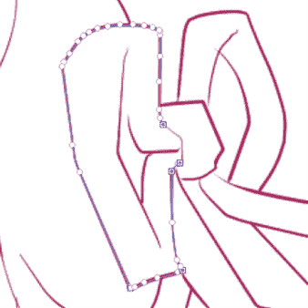

图 8.21：矢量自由手绘截图

注意，有些线条可能不够稳定，缺乏前一个示例中自信绘制墨迹的流畅性。在我们使用**控制点**工具和**简化矢量线条**工具处理线条后，我们得到了更平滑、更优雅的线条，如下面的截图所示：

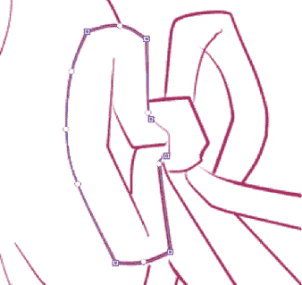

图 8.22：修正后的矢量自由手绘截图

你选择在矢量层还是栅格层上绘制墨迹，当然完全取决于你个人的喜好。你练习墨迹越多，你会变得越好！在下一节中，我们将探讨一些如何有效地绘制漫画分镜的技巧。

# 绘制漫画分镜的技巧

现在我们已经对 Clip Studio Paint 中的墨迹和墨迹工具有了基础的了解，让我们来谈谈如何在漫画页面上绘制墨迹。当然，这些都是一般性的建议，因为我们完全可以写一本书专门讨论如何绘制漫画（实际上已经有人写了整本书关于这个话题！）。但对于刚开始的人来说，这里有一些使墨迹过程变得更容易的一般性建议：

+   从你最想绘制的分镜开始。在传统墨迹中，我们会从我们优势手对角线的另一角开始，斜着穿过页面并向下绘制，以避免墨迹干燥时的涂抹，但使用数字墨迹，我们不必担心这一点。从你想要首先绘制的任何分镜开始，然后按你喜欢的方式在页面上移动。

+   在开始绘制墨迹之前，请记得在铅笔层上开启**图层颜色**选项。这确保了我们能够轻松地看到已经绘制的墨迹和可能遗漏的线条，并防止我们在错误的图层上绘制墨迹，从而避免需要从头开始。

+   在单独的图层上绘制角色和背景，或者前景和背景。我喜欢将我的角色与背景分开，然后根据需要应用图层蒙版。这不仅使我能够更容易地调整角色或背景元素的位置，而且确保背景在需要时可以在其他画板中重复使用。

+   使用橡皮擦工具或透明颜色来纠正你的错误。记住，数字墨迹不是永久的！我们可以调整它，删除墨迹图层，重新开始，或者使用橡皮擦或设置为**透明度**选项的工具添加纹理。

如果你真的想提高你的绘图技巧，互联网上有数百种资源，艺术家们在那里发布他们的铅笔作品供他人上墨和/或上色。确保你有原始艺术家的许可来使用这项工作，如果你在某个地方发布你的上墨版本，请提供信用和艺术家网站的链接！练习是提高和找到你自己的风格的最佳方式。

现在，你已经了解了 Clip Studio Paint 提供的绘图基本方法。你也真正理解了数字绘图是什么。

# 摘要

在本章中，我们讨论了绘图的原因以及绘制清晰和动态线条的一些基本原则。我们探讨了**马克笔**和笔工具，这是我们制作 Clip Studio Paint 中墨迹的两个主要工具，并学习了如何调整**笔**工具的压力设置来自定义我们的工具。我们讨论了在矢量图层上绘图以及这样做的好处。现在你可以掌握绘图工具了！

让我们再迈出一步，成为 Clip Studio Paint 的大师。在下一章中，我们将讨论如何绘制一些特殊效果。我们还将制作带有自定义笔尖的画笔以产生特殊效果，并讨论更多特殊工具，例如创建纹理墨迹画笔，这将扩展你的数字绘图功能。

# 加入我们的 Discord！

与其他用户一起阅读这本书。提出问题，为其他读者提供解决方案，等等。

扫描二维码或访问链接加入社区。

[`packt.link/clipstudiopaint`](https://packt.link/clipstudiopaint)

