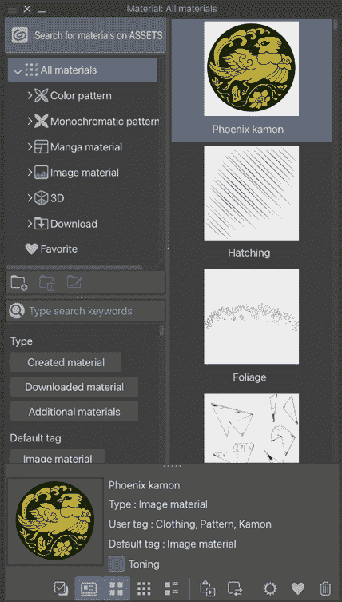

# 材质调色板和上墨特效

有时，上墨需要我们回答一系列关于如何呈现某个东西的问题。我们如何制作出纹理粗糙的外观？我们如何利用数字空间使重复的上墨任务变得更简单、更高效？熟悉其他绘图工具及其自定义方法是节省绘图时间的最佳方式。当你对如何创建和自定义工具有核心理解时，你可以制作出解决问题的特殊工具，并加快你的工作流程。

数字艺术材料是一个有争议的话题，因为过度依赖它们有时被视为作弊。重要的是要记住，用于自定义笔刷的材料仍然需要绘制；你仍然需要知道如何绘制材料，只是节省了绘制数百片叶子或草叶的重复工作。制作出能够创建粗糙效果、闪电，甚至为我们创建人群场景的自定义工具，并不比在纸上使用尺子或圆规作弊。

在本章中，我们将学习如何使用材质调色板并建立一个基础，这将使你能够创建自己的自定义工具。每个练习都是设计来建立在之前学到的技能之上的，以带你了解笔刷引擎中的不同选项。本章将涵盖以下主题：

+   探索**材质调色板**

+   创建纹理上墨笔刷

+   制作破碎玻璃碎片笔刷

+   创建植被笔刷

+   使用交叉影线笔刷进行纹理处理

让我们立即开始吧！

# 技术要求

要开始，你需要在你的设备上安装 Clip Studio Paint，并打开一个没有背景颜色的新画布。任何尺寸都可以，但我建议创建一个 300 dpi 的正方形画布，以便通过本章的内容。

# 探索材质调色板

你知道你可以将你的艺术作品保存到**材质**调色板中，以便以后在笔刷、图案、设计、背景等中使用吗？这无疑是数字绘画中最有用的技术之一！

在本节中，我们将设计一个图案并将其保存到**材质**调色板中，以便它可以作为角色衬衫上的图案使用。首先，让我们先看看**材质**调色板的类别，这些类别在*图 9.1*中展示。

图 9.1：材质调色板

+   **色彩图案**包含彩色图案和背景资产。这些资产大多是无缝拼贴，但并非全部。它们根据类型被分为子类别。

+   **单色图案**用于黑白图案、背景和纹理。本类别包含许多不同类型的网屏图案，用于漫画创作。

+   **漫画材质**包含用于创建漫画页面框架模板、对话气泡、音效和效果线的资产。

+   **图像材质**包含插图和照片资产，以及笔尖材质资产。

+   **3D**包含所有 3D 资产。有关 3D 材质的更多信息，请参阅**第十四章**，**使用 3D 图形和对象**。

+   **下载**包含从 Clip Studio Paint 应用程序下载的所有资产。有关下载新材料的更多信息，请参阅**第十八章**，**探索 Clip Studio 资产和动画**。

+   **收藏**包含你通过在调色板底部按下心形图标将任何材料添加到收藏类别中的材料。收藏任何经常使用的材料是个好主意。

现在我们已经了解了材质调色板中不同类型的资产，我们应该学习如何将我们自己的艺术品保存到调色板。让我们在下一节中看看如何做到这一点。

## 将艺术品保存到材质调色板

我们可能有多种原因想要将一件艺术品保存到**材质**调色板。也许它是你漫画系列的标题标志，你希望能够轻松地将其添加到封面。也许它是一个你打算覆盖在任何你发布的在线图像上的水印，以防止艺术盗用。也许它是一个为你漫画中的反派设计的特殊对话框，或者是一个为你主角服装设计的特殊重复格子图案。你还可以设计复杂的纹身并将其保存到材质调色板，这样你就可以在每次绘制角色时重复使用它们，而不是每次都重新绘制设计！或者，你可以为角色创建一个 T 恤设计，只需简单地粘贴并稍作编辑以适应角色站立的角度，而不是每次都重新绘制设计！

材料的使用可能性仅限于你的想象力，前面提到的只是一些使用它们的想法。

让我们以下面的艺术作品为例。我们将学习如何将你的艺术资产保存到材质调色板，并将其应用到你的画作中：

图 9.2：示例材质设计

我保留了带有透明背景的设计，因为它将被用于另一部作品中的角色服装，这样我就可以在以后通过将设计本身从选择中隔离出来来改变服装的颜色。

以下步骤将指导你将图像保存到**材质**调色板的过程：

1.  如果你的图像由多个图层组成，你可以选择将图像**合并**，或者转到**[图层]菜单 | 合并可见图层到新图层**来创建一个包含图层副本的新图层。只有当前活动图层的**内容**会被保存到**材质**调色板中，所以请确保所有将要保存的图像部分都在同一图层上，并且在继续之前选择该图层。

1.  在**文件**菜单中，点击**编辑**，选择**注册材质**，然后点击**图像…**。

1.  将会显示**材质属性**窗口，如下面的截图所示：

图 9.3：材质属性窗口

1.  在**素材名称**文本输入框中输入一个名称。

1.  **素材图像**框将显示正在保存的图像的预览。如果此图像不正确，请点击**取消**按钮，并按照*步骤 1*中的说明确保你的图像都在一个图层上。

1.  在**粘贴操作**下，确保勾选了**缩放/放大**选项，并在下拉菜单中选择**粘贴后调整**。这将允许我们在将素材添加到画布后调整其大小。

1.  **指定图层调板中的顺序**设置允许我们选择素材将在图层堆叠中的哪个位置添加。例如，如果我们正在添加背景图像，我们可以选择**背景等**选项，这样图像将始终粘贴在其他图层堆叠之下。由于我们在这个例子中创建的是服装设计，我们将选择**效果等**，以便设计出现在角色上方。

1.  在**选择保存位置**窗口中选择你想要在**素材**下保存的所需类别。在这个例子中，我们使用**图像素材 | 插画 | 装饰**文件夹来保存这个设计。

1.  点击**搜索标签**窗口右下角的图标来为素材添加标签。我总是建议为任何你创建和保存的素材使用一个独特的标签，这样你可以快速找到所有资产。我使用了**服装**这个标签，但你也可以想出你自己的名字，或者甚至可以是你的漫画项目的名字，如果你愿意的话！

1.  点击**确定**将设计保存到调板中。

一旦我们的图像保存，我们就可以在**素材**调板中查看它。在以下截图中，**凤凰纹章**设计（按照前面的说明保存）显示在列表顶部的**所有素材**下，因为它刚刚被添加：

图 9.4：素材调板

通过选择素材并点击**素材**调板底部的**将选定的素材粘贴到画布**图标，素材将被添加到当前活动的画布上。**将选定的素材粘贴到画布**图标的外观如以下截图所示：

图 9.5：将选定的素材粘贴到画布的图标

在以下截图中，设计已经被添加到角色的服装上，所以现在你不需要在每个场景中重复绘制相同的角色图像！只是要注意，为了让设计适合服装，我们可以点击**文件**菜单中的**编辑**，选择**变换**|**网格变换…**，然后移动控制手柄来塑造设计。

图 9.6：粘贴了素材的艺术作品

我相信你一定有很多想要在你的漫画中使用的设计，现在你知道了如何存储和使用它们，而无需再次重复创建它们！

**提示**

这个技巧将为你节省大量时间！创建一个包含一个页面满格子的分镜图层文件夹，在分割成形状之前，为你的漫画中使用的每种字体创建带有对话气泡样本的图层，一个草图图层和一个墨水图层。然后，点击文件夹并将其拖动到**材料**调色板中，你希望打开的类别已经打开。

这可以在你继续绘制漫画系列时用于以下页面，你不必重新创建整个场景。在每一页新的漫画中，只需点击**粘贴选定的材料到画布**图标！现在你只需要编辑元素，而不需要从头开始创建。

# 创建纹理上色画笔

在本节中，我们将使用我们探索的材料来创建一个纹理上色画笔，这将帮助我们描绘一种特定的粗犷外观。这个练习将使我们熟悉创建和保存自定义画笔尖端以及调整**子工具详细**调色板中的某些画笔尖端设置。按照以下步骤制作这个纹理上色画笔：

1.  在一个新的画布上，创建一个新的位图图层。确保在**图层属性**调色板中**表达式颜色**设置为**灰色**。

1.  选择**喷枪**工具和**滴液**子工具。在灰色图层上，使用**滴液**工具以纯黑色为活动颜色绘制一个圆形形状。不要做得太精确；我们希望它有一些变化。你的形状应该看起来像*图 9.7*中的样子。

1.  关闭除了上一步中创建的形状所在的图层之外的所有图层。这包括任何纸张图层！我们只想在完成下一步之前看到我们新的画笔尖端形状。

1.  在**文件**菜单中，点击**编辑** | **注册材料** | **图像...**。此路径在以下屏幕截图中显示：

图 9.8：注册材料菜单

1.  这将打开**材料属性**窗口。输入一个描述性和独特的**材料名称**值。**材料图像**显示我们正在保存的形状预览。检查以确保没有显示我们不希望在画笔形状中显示的其他内容。

1.  点击**使用为画笔尖端形状**旁边的复选框。然后，在**选择保存位置**窗口中，在**图像材料**文件夹下选择**画笔**子文件夹来存储材料。

1.  最后，通过点击**搜索标签**窗口底部的**+**图标输入几个标签。这将使我们能够在制作工具时轻松搜索我们的材料。你的**材料属性**窗口应该看起来像以下屏幕截图：

1.  在**材料属性**窗口中设置所有参数后，点击**确定**。这保存了我们的新材料。

1.  使用第八章中的说明，*开始使用上色工具*，创建 G-pen 工具的副本。将这个新工具命名为`Drop Texture`。

1.  使用**工具属性**面板底部的扳手图标打开**子工具详情**面板。

1.  点击**子工具详情**面板左侧的**刷头**类别。

1.  在**刷头形状**旁边，点击标记为**材质**的按钮。现在**刷头形状**下方的框将显示**点击此处添加刷头形状**。点击此框以弹出**选择刷头形状**窗口。

1.  在**选择刷头形状**窗口中，找到本练习开始时制作的刷头。点击它以选择它，如下面的图所示：

图 9.10：选择刷头形状窗口

1.  点击**确定**以确认刷头形状。这将带我们回到**子工具详情**面板。

1.  在**刷头**选项中，点击**厚度**选项最右侧的按钮。勾选**随机**框以启用此参数，如下面的截图所示：

图 9.11：厚度动态窗口

1.  也要为**角度**选项重复*步骤 15*，如下面的截图所示：

图 9.12：角度动态窗口

1.  测试您的新纹理绘图笔！

这个纹理绘图笔将给您带来如下所示的艺术作品左侧的效果。

图 9.13：带有新纹理刷的示例图像

注意，其他线条略微模糊，以强调氛围。我复制了线稿图层，检查新图层被选中，然后从文件菜单中选择**滤镜** | **高斯模糊…**，将**强度**设置为**6.00**，然后点击**确定**。现在线稿看起来模糊得很漂亮。

您也可以通过从简单的形状绘制创建刷笔来创建自己的有趣图案，如下面的示例图像所示：

图 9.14：使用图案作为纹理刷

在图 9.14 的左侧是刷头形状，右侧是一些带状图像，展示了不同的刷笔重叠方式。这非常适合创建有趣的图案！

对于刷笔设置，在**描边**类别中打开**带状**功能，打开**后校正**，并在**校正**类别中将值设为最大。我们将在后面的章节中了解更多关于带状功能的信息：*创建叶刷*。

哇，您已经制作了自己的特殊刷头！

您想了解更多关于这些特殊刷笔的信息吗？继续阅读以了解不同的刷笔。

在下一节中，我们将创建一个可以帮助我们创建更复杂效果的刷笔。

# 制作破碎玻璃碎片刷

通过利用 Clip Studio Paint 的功能，我们可以通过一个刷笔节省时间，使应用原本繁琐的特殊效果变得简单。我们将创建一个使破碎玻璃碎片在图像上落下的刷笔。按照以下步骤创建此刷笔：

1.  打开一个空白画布，最好至少 300 dpi。在这个画布中不需要使用**纸张**选项；实际上，我们希望有一个透明背景。

1.  在一个空层上使用您喜欢的绘图工具，绘制几个锯齿状、破碎的玻璃形状的轮廓。轮廓使用黑色或深灰色。

1.  在轮廓层下方创建一个新的图层。在这个图层中，将玻璃形状填充为纯白色。

1.  通过使用**图层**调板右上角的滑块，将白色图层的透明度降低到 50%。

1.  通过在**文件**菜单中点击**图层**并点击**合并可见图层**来合并轮廓层与 50%透明的白色层。（注意，这将合并任何当前可见的图层，所以请确保您唯一可见的图层是玻璃碎片轮廓和 50%白色填充。）您应该有一个透明背景，现在您的画布看起来应该像以下屏幕截图：

图 9.15：破碎玻璃绘制

1.  在**文件**菜单中，点击**编辑** | **注册材质** | **图像...**。此路径在以下屏幕截图中显示：

图 9.16：注册材质菜单

1.  这将打开**材质属性**窗口。输入一个描述性且唯一的**材质名称**值。**材质图像**显示我们正在保存的形状预览。

1.  选中此选项以确保没有显示我们不希望在画笔形状中出现的其他内容。

1.  点击**使用于画笔尖端形状**旁边的复选框。然后，在**选择保存位置**窗口中，在**图像材质**文件夹下选择**画笔**子文件夹以存储材质。

1.  最后，通过点击**搜索标签**窗口底部的**+**图标添加几个标签。这将使我们能够在制作工具时轻松搜索我们的材质。设置将如下所示：

图 9.17：材质属性窗口

1.  在**材质属性**窗口中设置所有参数后，点击**确定**。这保存了我们的新材质。

1.  如前几节所述，复制 G-pen。将新子工具命名为`Broken glass`。点击**确定**。

1.  在**工具属性**调板中，点击右下角的扳手图标以打开**子工具细节**屏幕。

1.  将**画笔大小**更改为**60.0**。打开**画笔大小动态**以将**最小值**设置为**15**并编辑曲线，使其看起来像以下屏幕截图：

图 9.18：画笔大小动态窗口

1.  点击**抗锯齿**并选择**中等**，然后在**子工具细节**调板中点击**画笔尖端**。

1.  在**尖端形状**选项下点击**材质**按钮。现在，**尖端形状**下方的框将显示**点击此处添加尖端形状**。

1.  点击此框以打开**选择笔尖形状**窗口，然后定位在本练习开始时制作的玻璃碎片形状。如图下截图所示，突出显示它们，然后点击**确定**：

图 9.19：选择笔尖形状窗口

1.  在**笔尖**设置中，点击**厚度**选项右侧的图标。勾选**随机**选项旁边的框，并将最小值设置为**65**，如图下截图所示：

图 9.20：厚度动态窗口

1.  点击**角度**选项右侧的图标，并选择**线条方向**选项。勾选**随机**选项旁边的框，并将效果**强度**设置为**100**，如图下截图所示：

图 9.21：角度动态窗口

1.  在**子工具详情**窗口中，点击**描边**类别。

1.  将**间隙**选项设置为**固定**，通过点击第一个图标（中心有一个完整圆圈的图标）来实现。

1.  使用**间隙**选项下的滑块将值设置为**150.0**。

1.  将**重复方法**|**随机**设置为如图下截图所示：

图 9.22：重复方法下拉菜单

1.  测试您的新画笔！

画笔将给我们以下图所示的效果：

图 9.23：使用破碎玻璃画笔的示例图像

通过将**厚度**、**角度**和**重复方法**选项更改为**随机**，我们在使用画笔时可以得到玻璃碎片形状的随机旋转和方向。通过更改**间隙**选项，我们使画笔尖端形状彼此之间显示得很远，而不是像其他绘图工具那样连续绘制。

您还可以使用透视变换一次更改玻璃大小。您可以通过从**文件**菜单中选择**编辑**，然后选择**变换**|**透视…**来尝试此操作。现在您可以移动控制手柄来更改透视，如图下截图所示。

图 9.24：透视变换

接下来，我们将创建一个帮助我们绘制自然不同方面的画笔。使用定制的叶画笔，您可以非常容易地绘制树木及其叶子！让我们按照下一节的步骤制作自己的画笔。

# 创建叶画笔

我认为我无需保密，叶画笔是我最喜欢的专业画笔之一。这个画笔使绘制详细的树木和灌木变得容易，并介绍了画笔细节中的**带子**选项。

在以下步骤中，我们将创建一个叶状材质，然后将其制作成像卷轴一样的画笔：

1.  打开一个至少 300 dpi 分辨率的空白画布。

1.  使用蘸水笔，绘制一排叶子，类似于树木或灌木的顶部。

1.  将叶子填充为白色。使用以下截图作为指南创建您的叶子和白色填充。您需要一个透明的背景，就像我们在本章前面的部分中所有的那样。

1.  从**文件**菜单中，点击**图层** | **合并可见图层**。现在图像类似于以下截图：

图 9.25：绘制叶子

1.  在**文件**菜单中，点击**编辑** | **注册材质** | **图像...**。这将弹出**材质属性**窗口。输入一个描述性且唯一的**材质名称**值。**材质图像**显示我们正在保存的形状预览。检查以确保没有显示我们不希望在笔刷形状中出现的其他内容。

1.  点击**使用于笔尖形状**旁边的复选框。然后，在**选择保存位置**窗口的**图像材质**文件夹下选择**笔刷**子文件夹来存储材质。

1.  最后，通过点击**搜索标签**窗口底部的**+**图标输入几个标签。这将使我们能够在制作工具时轻松搜索我们的材质。您的**材质属性**窗口应类似于以下截图：

图 9.26：材质属性窗口

1.  在所有参数设置完成后，在**材质属性**窗口中点击**确定**。这保存了我们的新材质。

1.  复制 G 笔并命名这个新工具为`叶刷`。

1.  在**工具属性**面板中，点击底右角的扳手图标以打开**子工具详情**面板。

1.  根据需要设置**墨水**类别：

    1.  确保将**不透明度**设置为**100**

    1.  将**混合模式**设置为**正常**

    1.  **抗锯齿**：设置为**无**

    对于**笔尖**类别**：**

    1.  点击**笔尖形状**选项下的**材质**按钮；现在**笔尖形状**下方的框将显示**点击此处添加笔尖形状**。

    1.  点击该框以弹出**选择笔尖形状**窗口。

    1.  定位您的叶子形状并点击以选择它。点击**确定**将此材质加载到笔刷中。

    1.  将**厚度**设置为**100**。

1.  在某些情况下，叶子材质是垂直加载而不是水平加载，如下面的截图所示，这不是我们想要的：

图 9.27：带有垂直叶子材质的笔尖菜单

1.  没有关系；要改变材质形状的方向，将**角度**的值从**0.0**更改为**100**。这将使材质旋转成水平方向，如下面的截图所示：

图 9.28：带有水平叶子材质的笔尖菜单

1.  点击**角度**设置右侧的图标以打开**角度动态**窗口。确保**随机**选项旁边的框未被选中，如下面的截图所示：

图 9.29：角度动态窗口

1.  在**子工具详情**屏幕的左侧点击**笔触**。点击**带子**选项旁边的复选框以激活它。现在画笔看起来如下截图：

图 9.30：笔触菜单

1.  测试你的新画笔。

当在图层中使用时，这种画笔效果最佳。为了理解我的意思，让我们看看使用这个工具创建树木的过程。

在绘制出树的树干和顶部叶片的大致形状后，用画笔沿着顶部的轮廓进行绘制。按照顺时针方向工作，以确保底部叶片的方向正确。查看以下截图，注意箭头的方向。这是我们工作的方向：

图 9.31：叶片画笔的笔触

还不错，但可以更好！通过继续以相同的顺时针方向工作，但稍微在已经存在的叶片内部，我们可以制作更多层叶片，这些叶片将从树枝向外生长，如以下截图所示：

图 9.32：分层叶片画笔的笔触

通过使用**带子**设置，我们得到一个重复图案的画笔，就像胶带上打印的图案一样展开。这也允许我们将图案颠倒过来，制作底部叶片，而无需创建一个刷头材料颠倒的第二画笔。分层叶片给我们一个详细的成品！

通过使用**带子**选项并玩转**重复**方法，我们可以制作出模拟图案织物装饰、蕾丝、褶皱、针织图案，甚至鞋带的画笔！

过度依赖材料画笔可能会导致你的艺术作品看起来很普通，尤其是当多个构图使用相同的画笔时。为了获得更自然的外观，你应该开始手工绘制你的艺术作品的元素。

或者，尝试手工制作新材料，以便有更多的选择。你还可以用手工细节覆盖材料画笔的结果。

简而言之，材料画笔是创建基础的方便工具，你可以在自己的艺术作品中完成这些基础。

在**第十八章**，**探索 Clip Studio Assets 和动画**中，我们将学习如何访问 Clip Studio Paint Assets 下载库，在那里你可以获取更多自定义工具的想法，或者下载其他用户制作的工具。

接下来，我们将查看最实用的画笔之一——交叉阴影画笔。继续阅读下一节，了解如何创建它！

# 使用交叉阴影画笔进行纹理处理

晕染是一种通过使用平行线组实现的着色技术。交叉晕染是一组平行线，它们以另一个方向交叉另一组平行线，增加了纹理和更深的阴影外观。晕染和交叉晕染可以为单色插图增添美丽的光泽和纹理。通过制作晕染笔刷，我们可以实现这种外观，而无需手动绘制所有线条。在创建用于绘制笔尖的新画布时，请确保将**基本表达颜色**设置为**灰色**而不是**彩色**。以下截图显示了新文件创建窗口中的下拉菜单，其中可以进行此更改：

图 9.33：基本表达颜色选项截图

以下步骤将指导您完成笔刷创建过程：

1.  选择**标尺**工具类别，然后选择**创建标尺**子工具类别。

1.  从**子工具**调色板中选择**特殊标尺**。

1.  在**工具属性**调色板中，从**特殊标尺**下拉菜单中选择**平行线**，如图所示：

图 9.34：特殊标尺下拉菜单

1.  在画布内点击并按住鼠标按钮或触控笔。在仍然按住的同时，以一定角度将光标拖动过画布。释放鼠标按钮以设置标尺。画布现在应该看起来像这样：

图 9.35：以对角线设置平行线

1.  从**笔**子工具中选择您首选的笔工具。

1.  确保画布上方主命令栏中的**对齐到特殊标尺**选项处于激活状态。这将使笔跟随平行线标尺。参见图标位置如下截图：

图 9.36：对齐到特殊标尺选项

1.  使用您首选的笔工具，绘制一组平行线，如图所示：

图 9.37：通过对齐到标尺绘制的线条

1.  关闭或删除平行线层后面的任何**纸张**颜色层或任何填充层，只留下线条组和透明背景。

1.  在我们可以设置新的笔尖材质之前，必须清除平行线标尺。为此，从**操作**工具类别中选择**对象**子工具。点击标尺以选择它。然后，从**文件**菜单中点击**编辑** | **删除**。（您也可以右键单击并从弹出菜单中选择**清除**。）

1.  在**文件**菜单中，点击**编辑** | **注册材质** | **图像...**。

1.  这将打开**材质属性**窗口。输入一个描述性且唯一的**材质名称**值。**材质图像**显示我们正在保存的形状预览。检查以确保没有显示我们不希望包含在笔刷形状中的其他内容。

1.  点击**用于笔尖形状**旁边的复选框。然后，在**选择保存位置**窗口中，在**图像材料**文件夹下选择**笔刷**子文件夹以存储材料。

1.  最后，通过点击**搜索标签**窗口底部的**+**图标添加几个标签。这将使我们能够在制作工具时轻松搜索我们的材料。你的**材料属性**窗口应类似于以下截图：

图 9.38：材料属性窗口

1.  点击**确定**以注册材料。

1.  复制 G 笔，就像我们在本章的其他部分所做的那样。将这个新工具命名为`Cross-hatching`。

1.  在**工具属性**调色板中，点击右下角的扳手图标以打开**子工具详情**调色板。

    1.  点击**笔尖**选项。

    1.  在**尖端形状**选项下点击**材料**按钮。现在**尖端形状**下方的框将显示**点击此处添加尖端形状**。点击此框以弹出**选择笔尖形状**窗口。

    1.  搜索并选择在本节中先前创建的笔尖形状。

    1.  点击**角度**设置右侧的图标以打开**角度动态**窗口。

    1.  点击**线条方向**旁边的圆形按钮以激活此选项，如图下所示：

    图 9.39：角度动态窗口

此选项将设置笔尖材料的方向，根据我们移动笔尖绘制线条的方向，允许我们重叠阴影以获得交叉阴影线条。

1.  在**选项**类别下的**划痕**类别中，将**间隙**设置为**固定**。

1.  测试你的新工具！

图 9.40：使用中的交叉阴影笔刷效果

因为我们是在**灰色**颜色模式的画布上创建的笔刷材料，这意味着我们可以根据需要设置笔刷的颜色。这在前面的图中可以看到，左侧脸部、头发、肩膀和报纸尖端的白色高亮交叉阴影。

你现在可以为你的艺术品应用纹理阴影和光线了！

# 摘要

本章为我们提供了关于**材质**调板的知识，以及制作我们自己的自定义工具的基础，有了这些知识，你应该能够制作出几乎任何你能想象到的特殊画笔！我们学习了如何制作和保存我们自己的自定义材质，这些材质可以用作画笔尖端。我们创建了一个粗糙纹理的墨水画笔，并学习了如何设置**子工具细节**设置以获得我们想要的外观。我们制作了一个利用**不透明度**和**随机**方向的玻璃碎片画笔，以在插画中呈现出数百个手工绘制的玻璃碎片。然后，我们使用**带状工具**选项创建了一个叶刷。最后，我们使用平行线标尺创建了一个画笔尖端材质，并使用**线条方向**画笔选项创建了一个层叠交叉阴影画笔。

在下一章中，我们将继续介绍如何使用矢量图层。我们将更详细地了解矢量图层与位图图层的不同之处，位图图层有一些可能对你有用的不同功能。

# 与我们在 Discord 上相聚！

与其他用户一起阅读这本书。提出问题，为其他读者提供解决方案，等等。

扫描二维码或访问链接加入社区。

[`packt.link/clipstudiopaint`](https://packt.link/clipstudiopaint)

