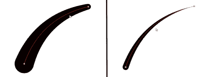
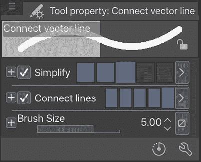

# 10

# 探索向量图层

使用 Clip Studio Paint 的一个好处是它可以生成位图和向量图像。实际上，位图和向量可以通过简单地创建相应的图层类型在不同的画布图层上使用。然而，在 Clip Studio Paint 中创建向量与在其他向量程序中创建向量有许多不同之处。

向量图像与位图图像不同。位图图像由称为像素的小色块组成。位图图像在许多情况下都得到使用，但它们确实有一些缺点——主要是由于它们由像素组成，放大时会有质量损失。向量图像由程序中连接在一起的点组成，可以即时编辑和任意调整大小而不会损失任何质量。

在本章中，我们将学习如何在 Clip Studio Paint 中创建向量，以及如何将艺术品保存到**材料**调色板以供以后使用。以下内容将涵盖：

+   创建向量图层

+   在向量图层上绘制

+   编辑向量

到本章结束时，您将了解如何处理向量线条绘制，并掌握使用材料的知识。

让我们开始学习向量吧！

# 技术要求

要开始，您需要在您的设备上已经安装了 Clip Studio Paint，并且打开了一个带有白色纸张图层的空白画布。任何尺寸都可以，但我建议创建一个 300-dpi 的正方形画布，以便在本章内容中工作。

# Clip Studio Paint 中的向量

在本节中，我们将从学习向量开始，所以如果您对这个术语不熟悉，请不要担心。我们将从它们是什么开始，然后您将通过我们的分步教程尝试创建一些向量艺术。

向量图像由基于数学表达式的点、线和曲线组成。因为这些图像是由数学表达式定义的，而不是像素，所以它们可以无限放大或缩小而不会失去质量或变得像素化。

向量最常用于标志，但它们也可以用于创建漫画和插图。线条可以调整而不需要重新绘制，所以如果您在绘制线条时感到不自信，那么使用向量可能是一个解决方案。

一些图形软件只能处理向量或位图信息。Clip Studio Paint 可以同时处理这两种信息，甚至可以在同一图像文件中同时处理。如果我们想这样做，我们可以让图像的一个图层填充向量信息，而其他所有图层都填充位图信息！

**注意**

值得注意的是，如果您已经熟悉在其他程序中处理向量，您可能需要适应 Clip Studio Paint 处理向量图形的方式。此外，Clip Studio Paint 的向量不能作为向量从程序中导出，其他程序的向量图形也不能作为向量导入到 Clip Studio Paint 中。

让我们开始创建你的矢量艺术！

# 创建矢量层

要开始使用矢量，我们需要创建一个矢量层。有两种方法可以做到这一点：通过**文件**菜单或通过**图层**调色板。我们将在接下来的几节中探讨这些方法。

## 通过文件菜单创建矢量层

按照以下步骤使用**文件**菜单创建矢量层：

1.  在**文件**菜单中，点击**文件**，然后转到**新建图层**，最后点击**矢量层**。

1.  在出现的**新建矢量层**对话框中为图层输入名称。

1.  从**新建矢量层**对话框中的下拉菜单中选择**表达式颜色**（**黑色**和**白色**，**灰色**或**彩色**）。

1.  点击**确定**以创建新图层。

在下一节中，我们将看到如何从**图层**调色板创建矢量层。

## 通过图层调色板创建矢量层

按照以下步骤使用**图层**调色板创建矢量层：

1.  在用户界面中找到**图层**调色板。

1.  点击**图层**调色板中的**新建矢量层**图标。该图标在右边的截图中被箭头所指：

图 10.1：图层调色板截图

1.  新图层将被创建，并将在调色板中的图层堆栈中显示。

在矢量层上绘制的任何内容都将是一个矢量图像，这意味着它不是由像素组成，而是由控制点组成。现在我们知道了两种创建矢量层的方法。它们可以从**文件**菜单或从**图层**调色板创建。第二种方法肯定更容易，因为它只需要点击一个图标！

在下一节中，我们将学习如何使用我们喜欢的工具在矢量层上绘制。

# 在矢量层上绘制

一旦创建了矢量层，你就可以使用任何你喜欢的工具在上面绘制，包括铅笔、钢笔或直接绘制工具（线条、曲线、椭圆等）。

可能需要一些编辑来创建平滑的线条，我们更喜欢尽可能少的控制点，以便更容易编辑线条。

让我们看看两张相似的矢量线条，如图右边的截图所示：

图 10.2：两条矢量线条

顶部的线条是使用**连续曲线**工具创建的。底部的线条是使用**笔**工具创建的。沿每条线显示的小圆圈是用于编辑矢量线条的控制点。在用**连续曲线**工具创建的线条上，曲线改变方向的每个点都显示了九个控制点。

使用**笔**工具绘制曲线创建的线条有更多的控制点，因为 Clip Studio Paint 会自动将它们放置在程序认为可能需要的位置。这使得在没有额外工作的前提下编辑矢量线条变得更加困难。

幸运的是，Clip Studio Paint 为我们提供了使清理过程更简单的工具，这正是我们将在下一节中探讨的内容。

# 编辑矢量

在本节中，我们将探讨编辑矢量线条的不同方法。首先，我们将了解编辑工具，然后我们将尝试在上一节中创建的矢量线条上使用一些工具。最后，我们将学习如何更改线条宽度。

使用矢量图形的一个优点是线条可以无限调整和编辑，直到完美，这与处理位图图层不同，在位图图层中，必须擦除并重新绘制线条，直到它恰到好处。可以使用控制点操纵和重塑矢量线条。

Clip Studio Paint 提供了允许轻松清理和编辑矢量线条的工具。这些工具可以在工具栏的**校正线条**组中找到，如右图所示：

图 10.3：校正线条子工具选项截图

让我们更详细地看看这些**校正线条**工具，了解它们的功能以及如何使用它们。

## 使用捏合矢量线条工具

我认为最好首先讨论这个工具，因为使用**捏合矢量线条**是轻松调整线条位置的一种方法。点击此工具，然后点击您想要移动的线条并拖动到所需位置。如您所见，**捏合矢量线条**图标显示一个圆圈捏合线条。就这么简单——如果您只需要进行小调整，这就是您需要的工具！

例如，在右图截图上，我想在人物后面的吉他轮廓上添加更多曲线。因此，我使用了**捏合矢量线条**工具来事后编辑线条：

图 10.4：捏合矢量线条示例截图

让我们来看看它的设置。

图 10.5：捏合矢量线条子工具设置截图

**捏合矢量线条**工具选项的设置如下（并在右图所示中展示）：

+   **固定端点**：此选项设置要编辑的捏合线条的端点。如果您选择**固定一个端点**选项，如截图所示，您可以移动线条的一个端点，但不能移动另一个端点。

+   **捏合级别**：此选项调整使用此工具编辑时线条弯曲的程度。较大值会使整条线弯曲，而较小值则只弯曲线条的一小部分。

+   **效果范围**：此选项调整您沿线条拖动时影响的线条范围。值越大，一次移动的线条部分就越多。

+   **添加控制点**：当激活时，此选项会在弯曲线条时自动添加控制点，以便在编辑时不会拖动没有控制点的部分。如果没有激活，整条线将按原样拖动，因此绘图形状可能会变形。

+   **连接线**：当激活时，如果您捏住一条线并将其移动到接触另一条线的末端，这些线将被连接。如果您在**固定末端**设置中选择**固定两端**选项，则无法激活此功能。

现在您已经知道了如何控制**捏矢量线**工具，因此您可以使用此工具随意调整矢量线！现在我们将探讨在下一节中编辑矢量的不同方法。

## 使用控制点工具

**控制点**子工具可用于对矢量线上的控制点执行各种操作。当选择**控制点**子工具时，可以通过**子工具属性**面板访问这些功能。左边的屏幕截图显示了**子工具属性**面板：

图 10.6：控制点子工具属性面板的屏幕截图

**控制点工具**的不同模式描述如下：

+   **移动控制点**：允许通过点击和拖动来移动控制点。

+   **添加控制点**：通过在应该放置额外控制点的矢量线上点击来添加控制点。

+   **删除控制点**：通过点击删除控制点。

+   **切换角点**：切换控制点的角点。控制点可以是硬角或曲线，使用此工具将矢量线上的硬角转换为曲线，反之亦然。

+   **调整线宽**：通过在控制点上点击并拖动到右侧或左侧来轻松操纵矢量线的宽度。向任意方向拖动都会使该控制点的线变细或变粗。*图 10.7*显示了分别从左到右和从右到左拖动笔尖后相同线宽的示例线：

图 10.7：调整线宽操作时的屏幕截图

+   **调整不透明度**：这与**正确线宽**选项类似，允许我们通过点击和拖动来改变控制点的线的不透明度。当您不想有实心粗线边缘时，它工作得很好。*图 10.8*显示了使用**调整不透明度**前后的效果：

图 10.8：使用调整不透明度前后的屏幕截图

+   **分割线**：在工具点击的点处分割矢量线。

通过在这些选项之间来回切换，您将获得对操作矢量线的极大控制！但是，控制点不会太多吗？我们将在下一节中看到如何简化这一点。

## 使用简化矢量线工具

这是我创建 Clip Studio Paint 中的矢量图形时使用最多的工具。我大多数艺术作品都喜欢手绘线条的样式，特别是那些从细到粗再回到细的线条，就像是用传统毛笔笔触绘制的一样。然而，正如本章的**在矢量图层上绘图**部分所示，在矢量图层上使用绘图工具会产生控制点过多的线条，使得编辑线条变得困难。

**简化矢量线**工具可以用来将手绘线条中的控制点数量减少到仅需要的点。右侧屏幕截图中的线条在左侧使用了**简化矢量线**工具，而右侧仍然保留着自动创建的控制点：

图 10.9：半简化线条的屏幕截图

注意曲线右侧的控制点与左侧的控制点相比是多么接近。这是因为 Clip Studio Paint 在用笔或刷工具绘制矢量线时，在矢量线上放置了过多的控制点。

使用**简化矢量线**工具很简单。只需选择该工具，设置画笔大小，然后点击并拖动它覆盖需要简化的矢量线区域。在这次拖动过程中，绿色高亮显示了你已经使用工具的区域。当鼠标按钮释放时，程序将自动简化线条。

注意，使用此工具后，一些控制点可能需要轻微调整以确保准确性。现在你的矢量线看起来简化了，更容易管理。让我们继续学习如何更改线宽。

## 使用正确的线宽工具

**正确的线宽**子工具位于**正确线**组下，允许在瞬间更改矢量线的宽度。这是我们用来更改线宽的工具之一。让我们来看看**正确的线宽**子工具的属性，这些属性在右侧的屏幕截图中显示：

图 10.10：正确的线宽子工具属性屏幕截图

选项名称左侧的白色圆圈表示当前激活的操作：

+   **加粗**：这将使矢量线变粗，具体取决于滑块当前的位置和工具的使用位置。

+   **变窄**：这与上述操作相反，会使矢量线变细。如果你点击它旁边的较小**+**图标，它会告诉你至少需要 1 像素来减少宽度。

+   **放大宽度**和**缩小宽度**：通过放大或缩小来使线条变粗或变窄，根据这些选项下设置的值。这意味着如果你在**放大宽度**的值中输入**2**，则工具使用的矢量线部分将变得两倍粗。

右侧截图中的轮廓是通过此工具加粗的。您可以看到这对某些风格或想要为角色添加更多强调时非常有帮助！

图 10.11：调整线宽的绘图截图

+   **固定宽度**：将工具使用的线上的任何部分设置为滑块指示的宽度，无论在使用前有多粗或多细。

+   **处理整行**：复选框将一次性在整个矢量线上完成指定的操作。当想要使整条线变粗或变细时，这可以节省大量时间，因为只需在沿线任何地方单击一次，就可以一次性改变整条线，而无需我们使用工具选择整条线！

+   **笔刷大小**：其滑块控制**正确线宽**工具的光标大小。

## 使用重绘矢量线工具

**重绘矢量线**子工具非常实用，因为它允许您根据喜好推拉矢量线。只需选择工具，在矢量线上单击某处，然后拖动它以改变线。这是一个快速调整矢量线而不必完全重绘它们的简单方法！在前面的一节中，我们学习了**捏合矢量线**工具，用于对矢量线进行简单的调整。这些工具在现实中相当相似，但这个工具通常在复杂形状线调整方面更方便。

## 使用重绘矢量线宽工具

**重绘矢量线宽**子工具是在创建矢量线后调整其粗细或细度的另一种方法。说实话，当需要调整矢量线粗细时，我倾向于使用这个工具，因为它比**正确线宽**工具更直观。**重绘矢量线宽**子工具使用**笔刷大小**设置来调整线的粗细。笔刷大小设置得越大，工具就会使它所使用的线部分越粗。当笔刷设置为小于当前线宽的大小时，工具会使线变窄。在右侧的截图上，此工具使用了沿线的不同大小设置：

图 10.12：使用重绘线宽工具编辑的绘图截图

无论笔刷设置的大小如何，使用工具后线就会变成那个大小。链装饰笔线是通过将笔刷大小设置得比当前宽度大得多来创建的。这是通过在该线段上仅绘制一次来完成的。

这就是我们可以根据需要调整线宽的方法。在下一节中，我们将探讨如何使两条独立的矢量线连接，所以请继续阅读。

## 使用连接矢量线工具

如果你看到你想要填充的两个向量线条之间存在间隙，这个工具就是为你准备的。你只需要用这个工具在线条间隙上画一下，它就会自动填充！和其他工具一样，这个工具也有几个设置，如下面的截图所示：

图 10.13：Connect 向量线条子工具属性截图

让我们来看看子工具属性中的每个设置：

+   **简化**：减少你画线连接线条区域中的控制点数量。正如你在下面的截图中所看到的，较小的值会使线条以更复杂的形状连接，而较大的值会使连接以更简单的形状进行：

图 10.14：Connect 向量子工具的简化属性截图

+   **连接线条**：当此选项被激活时，将重叠的线条连接成一条。值越大，可以连接的线条越多。请注意不要设置得太高，否则可能会发生一些意外的连接。

+   **笔刷大小**：此选项设置笔刷的大小。

呼，看起来有很多选项需要考虑！但现在你可以移动、添加、擦除和简化控制点，甚至可以改变线宽而无需反复重绘线条。因为它们是矢量图，当你增加画布大小时，你的线条也不会失去质量。所以，现在你已经熟悉了**捏合向量线条**、**控制点**、**正确线宽**、**重绘向量线条**、**连接向量线条**和**重绘向量线条宽度**工具，并知道它们是如何工作的！

你犯了一个错误或者只是想要隐藏矢量线条的一部分？没问题，继续阅读以了解如何擦除矢量线条。

## 使用向量橡皮擦工具

在*第六章*，*橡皮擦、选择和子视图面板*中，我提到我们将在后面的章节中讨论**向量橡皮擦**。现在，那个时间已经到了！

**向量橡皮擦**可以像普通橡皮擦一样使用，但它也有一些设置，使得在处理矢量图时成为一个节省时间的神奇工具。现在，让我们更仔细地看看这些设置，如下面的截图所示：

图 10.15：Vector 橡皮擦工具属性截图

请特别注意**工具属性**面板中的**向量橡皮擦**部分。这个特殊设置使得**向量橡皮擦**工具在所有橡皮擦工具中显得特别。在左边的截图中，我们可以看到三个图标，每个图标旁边都有一个黑色和蓝色的**+**符号。这些图标是**擦除接触区域**，

图 10.16：擦除接触区域图标截图

**擦除至交点**，

图 10.17：擦除到交点图标截图

以及**整行**。

图 10.18：擦除整行图标截图

为了说明这些设置各自的作用，一个简单的直线路线网格矢量层将帮助我们。

**擦除触摸区域**选项将仅擦除工具经过的部分，就像其他任何橡皮擦工具通常所做的那样。在下面的屏幕截图中，使用了此设置，然后使用它沿着线条网格划了一条线。只有工具经过的线条部分被擦除：

图 10.19：擦除触摸区域动作

使用**擦除到交点**选项可以快速轻松地清理线条网格。此设置将擦除矢量线，直到它与另一条矢量线相交。在左侧的屏幕截图中，它被用来穿过网格的第三列进行一次划线。请注意，与上一个选项不同，该部分的全部水平线条都已消失，尽管工具只移动了列中线条的中心：

图 10.20：使用擦除到交点的动作

此设置可用于快速清理前一个屏幕截图中的网格边缘。在网格的边缘划一圈，多余的线条就会被完全擦除，直到它们与其他矢量线相交，如右侧的屏幕截图所示：

图 10.21：另一个使用擦除到交点的动作

而不是费力地擦除线条的末端并拼命试图使其完美，**擦除到交点**工具会为您一次性完成。您可以在艺术作品中利用它，例如在发丝边缘和面部轮廓线条上，如左边的示例艺术作品所示：

图 10.22：在艺术上使用擦除到交点

**整行**设置将擦除点击的矢量线的全部内容，无论橡皮擦工具设置的大小有多小。在右侧的屏幕截图中，这个设置被用于两条水平网格线上，以形成一组矩形而不是正方形：

图 10.23：整行动作

需要快速在建筑侧面绘制窗户吗？创建一个矢量层。以建筑为透视绘制矢量线条网格，然后使用矢量橡皮擦快速清理网格的边缘，并用**擦除到交点**设置在窗户之间留出空间！

这些选项有用吗？它们将为您制作整洁的图纸节省大量宝贵的时间。

让我们继续探讨如何保存您宝贵的艺术作品以备将来再次使用。这就像艺术工作室里的抽屉，为将来反复使用保存艺术材料，无论何时需要它们！

# 摘要

在本章中，我们首先熟悉了矢量。我们学习了什么是矢量，以及 Clip Studio Paint 中的矢量与其他程序中的矢量有何不同。我们学习了如何创建矢量图层，以及如何使用直接绘图工具和笔刷工具在上面绘制。最后，我们学习了我们可以使用哪些工具来精细调整我们的矢量绘图。

你现在已经知道了如何使用位图和矢量图层。你知道你还可以在 Clip Studio Paint 中创建自己的音效吗？在下一章中，我们将学习编辑、修改、着色和总结文本，同时通过添加音效来发挥创意。

# 加入我们的 Discord 频道！

与其他用户一起阅读这本书。提问，为其他读者提供解决方案，等等。

扫描二维码或访问链接加入社区。

[`packt.link/clipstudiopaint`](https://packt.link/clipstudiopaint)

