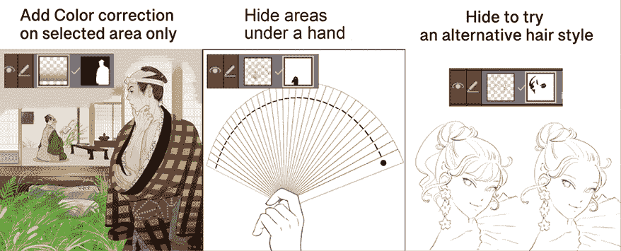

# 12

# 制作图层蒙版和屏幕网点

在传统绘画中，你可能使用遮蔽胶带来覆盖你不应该触摸的作品部分，这样你就可以随心所欲地用画笔作画。在数字绘画中也有类似的功能！图层蒙版是数字艺术中一个非常实用的功能，具有许多应用。多亏了这个功能，我们可以在不太多关心笔触是否越界的情况下专注于绘画。

我们还将探讨屏幕网点；在现代印刷中它们的使用越来越少，但在黑白漫画印刷中仍然相当受欢迎，因为它们有自己的美感。你可以将屏幕网点与图层蒙版结合使用，为你的漫画艺术创建漂亮的阴影效果。

我们还将学习如何使用带有剪切层的屏幕网点，它们与图层蒙版具有不同的遮罩效果。

在本章中，我们将学习以下主题：

+   什么是图层蒙版？

+   使用图层蒙版

+   添加屏幕网点

+   使用剪切层

到本章结束时，你将更多地了解数字绘画的好处。你将能够通过使用图层蒙版、屏幕网点和剪切层策略性地处理绘画的每一部分。

让我们直接进入正题！

# 技术要求

要开始，你需要在你的设备上安装 Clip Studio Paint，并打开一个带有白色纸张图层和任何艺术内容的空白画布。任何尺寸都可以，但我建议创建一个 300 dpi 的正方形画布，以便通过本章的内容。

# 什么是图层蒙版？

图层蒙版是数字艺术中的一个功能，允许在不永久删除的情况下隐藏图层的一部分。这使我们能够精细调整绘画或绘画的一部分，而不会丢失已经完成的部分。图层蒙版可以反复调整，隐藏绘画的一部分，然后再次移除以恢复这些部分。

良好的思考方式是将图层蒙版比作万圣节的面具。戴上面具可以隐藏你的真实面孔。取下面具，你的脸就再次可见。

与使用橡皮擦工具的情况不同，图层蒙版不是永久的，允许进行更改而不会丢失任何数据。我们可以看到角色不同的发型，或者暂时隐藏背景的一部分，例如。最好的是，图层蒙版易于使用和编辑！在下一节中，我们将看到如何使用图层蒙版。

# 使用图层蒙版

为了制作图层蒙版，你需要打开一个包含一个图层和一些内容的画布。这可能是一张草图、一幅墨水画、一张照片或任何你想要的内容，只要有一些内容可以遮罩，以便我们可以看到图层蒙版的工作原理。

按以下步骤创建图层蒙版并隐藏和恢复内容：

1.  通过在**图层**调板中点击它来选择要添加蒙版的图层。

1.  在**图层**调板中点击**创建图层蒙版**图标。该图标在*图 12.1*中由箭头所示。

图 12.1：图层调板

在**图层**调板中图层缩略图的右侧将出现一个新的缩略图。这是图层遮罩。当选择图层遮罩时，将在图层遮罩缩略图周围出现一个次要轮廓。*图 12.2*显示了一幅艺术作品和相应的裙子颜色图层，以及选中的图层遮罩：

图 12.2：图像和带有图层遮罩的图层调板

1.  要隐藏图层上的内容，请选择**橡皮擦**子工具。擦除需要隐藏的图层部分。遮罩区域将在图层缩略图中显示为黑色空间。我们可以使用此功能擦除更多裙子颜色，而不会永久丢失它们。因为遮罩区域仍然存在，所以可以随时取消遮罩。我们可以使用这个出色的功能更好地显示其他图层上的元素，但当我们更改艺术作品的布局时，我们可以再次揭示遮罩部分，因此我们不需要重新绘制艺术作品的那部分！*图 12.3*显示了裙子颜色图层已被遮罩的黑色区域。

图 12.3：部分遮罩的图像

1.  要再次使遮罩内容可见，请选择任何笔或画笔工具。使用该工具再次绘制遮罩区域以显示遮罩内容。

*图 12.4*显示，由于黑色遮罩内部的区域再次变为白色，遮罩区域的中间部分再次显示出来。

图 12.4：部分遮罩的图像（继续）

如果你编辑图层遮罩或遮罩附加到的图层时遇到困难，请双检查**图层**调板，确保在继续其他故障排除之前图层遮罩或图层已被选中。有时，可能会选择图层而不是图层遮罩，或者反之亦然，这可能会导致不希望的结果。

**提示**

想要让你的画作部分呈现出幽灵般的或褪色的效果吗？使用**软橡皮擦**或**喷枪**工具，在图层遮罩上使用半透明颜色来淡化画作的边缘。要选择半透明颜色，请点击位于 Clip Studio Paint 界面底部显示当前所选前景和背景颜色的两个正方形下方的棋盘图案方块。通过使用半透明颜色，你可以将任何绘图工具变成橡皮擦。

知道有一种方法可以在不删除的情况下隐藏艺术作品的一部分，以防你在创建艺术作品的过程中稍后需要隐藏的部分，这不是一种巨大的安慰吗？你根本不必担心，即使它目前不可见；遮罩部分始终存在，并且可以通过取消图层遮罩或删除它来恢复。某物只是暂时被遮罩！

*图 12.5*展示了使用图层蒙版的精彩方法，例如仅在角色绘画上添加颜色校正图层，如**乘法**或**叠加**，隐藏手扇/剑/枪/伞等物品下手持部分，以及改变发型。

图 12.5：部分被蒙版的三个图像

让我们看看隐藏艺术品部分的不同方法！

## 使用选择工具创建快速蒙版

可以通过使用**选择**工具选择我们想要隐藏的绘图区域，然后使用活动选择添加蒙版来快速创建图层蒙版。

我们在*第六章*，*橡皮擦、选择和子视图调板*中介绍了多种选择方法，所以如果您需要复习如何进行选择，现在是一个很好的时间回到那一章，在继续使用选择快速创建图层蒙版之前进行复习。

一旦您熟悉了**选择**工具，请按照以下步骤快速创建图层蒙版：

1.  首先，使用**选择**工具之一进行选择。在*图 12.6*中，套索工具已被用于在丝带颜色层上对角色的丝带进行选择。

图 12.6：带有选择区域的图像

1.  在**文件**菜单中，点击**图层**，然后导航到**图层蒙版**并点击**选择蒙版**。此路径在*图 12.7*中显示。

图 12.7：图层下拉菜单

使用此方法，选择区域内的区域将被蒙版，但选择区域之外的所有内容都将可见。在*图 12.8*中，丝带上的所选彩色部分现在被图层蒙版隐藏。

图 12.8：带有蒙版区域的图像

1.  要隐藏选择区域之外的所有内容，在**文件**菜单中，点击**图层**，然后导航到**图层蒙版**并点击**隐藏选择区域之外**。在*图 12.9*中，除了角色的丝带末端之外的所有衣物颜色都已消失，因为它在选择区域内，所以没有被隐藏。

图 12.9：带有蒙版区域的图像（继续）

对蒙版进行任何必要的编辑，例如使用橡皮擦工具添加更多蒙版部分，以及使用笔或画笔工具添加未蒙版的背景，如本章*使用图层蒙版*部分所述。

**隐藏选择区域之外**的选项在我们要隐藏大部分内容但留下一个微小、复杂的形状隐藏时效果很好，例如仅在一部分衣物上隐藏衣物图案——可能是裙子的末端，或者丝带。当然，我们可以以相同的方式在有限区域内添加阴影或光照。

如果您想暂时停用蒙版，请点击**图层**调色板中的**蒙版**下拉菜单，并取消选中**启用蒙版**选项图标旁边的复选框以取消选中，如图*图 12.10*所示。

图 12.10：蒙版下拉选项

要删除图层蒙版，请转到**文件**菜单，点击**图层** | **图层蒙版** | **删除蒙版**，如图 12.11 所示。

图 12.11：图层下拉菜单

**提示**

想要快速遮蔽选择区域之外的所有内容？先进行选择，然后点击“图层”调板中的**创建图层蒙版**图标。选择区域之外将自动生成一个蒙版。

使用选择工具可以让我们更快、更轻松地制作蒙版。我们不必用橡皮擦工具覆盖大面积，而是可以简单地做一个选择，然后点击按钮为该选择创建一个图层蒙版。多么节省时间啊！

我们一直在研究如何使用橡皮擦和选择工具使用图层蒙版。现在，让我们继续了解网屏色调，以及我们如何使用图层蒙版来使用它们！

# 添加网屏色调

我们正在研究如何使用图层蒙版与网屏色调一起控制漫画的黑白阴影。

在过去，印刷机只能在纸上打印黑色墨水的文字和图案。这意味着早期的印刷插图没有灰色调。艺术家必须使用黑色墨水绘制详细的点状和线条图案，以表达打印的灰色调。但这样做非常耗时！为了使这个过程更快，人们发明了网屏色调。

网屏色调，或半色调，由提供阴影的点状图案组成。在数字艺术出现之前的日子里，这些色调会被印刷在一张大型的粘性背塑料板上。艺术家会在他们的艺术作品上贴上这个大而透明的贴纸，然后小心地使用锋利的刀片切割掉不需要色调的区域，并撕掉多余的。这种方法的不利之处在于，你必须不断购买新的网屏色调板，有时，一个不小心就会切穿你的原始艺术品并毁掉它！

但现在，我们可以用数字模拟这些点状图案。而且，多亏了图层蒙版，我们可以简单地遮蔽不需要阴影的区域，而不会对网屏色调图案或我们的原始草图造成任何损害。这使得网屏色调过程比以前更容易、更不紧张！

*图 12.12*是使用数字网屏色调的一个例子。注意，阴影是通过提供图像深度的圆形图案来创建的。

图 12.12：使用网屏色调的图像

按照以下步骤为大面积添加色调：

1.  打开一个新的文件。对于这组说明，大小和分辨率并不重要。

1.  打开**材质**调板。

1.  通过点击文件夹名称旁边的箭头，打开**材质**调板中**单色图案**类别下的文件夹，查看其下内容。

1.  点击**基本**子文件夹旁边的箭头，查看该文件夹的内容。

1.  点击**点**子文件夹，查看该文件夹中定位的材料。

1.  选择要应用到图像上的所需网点材料。在这个例子中，我们使用的是**50.0 LPI / 50% 圆形单色**材料。

图 12.13：材质调色板

1.  一旦你选择了左侧截图中的网点材料，点击**材质**调色板底部的**粘贴所选材质到画布**图标，它看起来像*图 12.14*。

图 12.14：粘贴所选材质到画布图标

1.  色调材料将被应用到整个画布上，如*图 12.15*所示。

图 12.15：带有网点图像

1.  新的**材质层**将附带一个空图层蒙版。使用这个图层蒙版来编辑网点，使其仅在阴影区域显示。*图 12.16*显示了带有网点阴影的绘图。

图 12.16：带有网点阴影的图像

你成功使用了**30.0 LPI / 50% 圆形单色**网点来添加阴影！太棒了！当需要为一个小区域添加网点时，有一个快速选择和添加网点的方法，我们将在后面的章节中介绍。

但现在，你是否想知道每个网点名称的含义？让我们在下一节中了解更多关于这个内容。

## 网点名称中的线条和百分比

在我们继续介绍添加图像色调的下一个方法之前，让我们花点时间来理解用于网点名称的术语。

*图 12.17*显示了调色板中的两种色调材料。

图 12.17：网点类型

每个色调材料下方是色调的名称。我们可以将这些名称分为四个部分。每个名称的部分如下详细说明：

1.  **网点频率**：这是每个文件名开头的数字，出现在*LPI*（每英寸线条数）之前。例如，在左侧图中的第一个材料中，网点频率的数字是**65.0**。这个数字指的是在特定区域内重复的图案线条数。与 DPI 类似，这个数字越大，色调图案中的整体形状就会越小。比较**65.0**缩略图和**32.5**缩略图，并注意**32.5**示例中圆圈的大小。材料名称开头的数字越大，网点图案就会越小。

1.  **密度**：这个名字的这一部分指的是*图 12.17*中显示的带有百分号的数字。密度控制着创建的阴影看起来有多暗。例如，10%的密度会是一个非常浅的阴影，由屏幕网点图案中的非常小的点组成。然而，95%的密度会由非常大的黑色点组成，由于重叠，图案中可能只有非常小的白色间隙。100%的密度将是纯黑色。50%的密度将在完成的艺术作品中提供中等阴影。

1.  **类型**：这指的是图案创建的形状。最常见的是网点由实心圆组成。然而，我们可以从许多不同的形状和符号中制作色调图案，我们将在后面的章节中看到。前面图中的每个色调都使用了**圆形**类型。

1.  **渐变样式**：前面图中的色调是**单色**的，因为它们位于**点**网点文件夹中。这意味着色调在整个色调中只有一种密度和一种网点频率级别。然而，如果我们查看**渐变**文件夹而不是**点**文件夹，我们会找到具有**线性**和**圆形**渐变的色调，这些渐变从暗到亮再回到暗的模式。这些特殊色调可用于效果或获得柔和的阴影。在*图 12.18*中，使用了**60.0 LPI / 50% 圆形单色**渐变来添加阴影效果，我们可以看到控制手柄，这意味着我们可以移动并改变圆的大小。

图 12.18：使用渐变网点的插图

现在我们对网点术语有了更多了解，让我们看看在 Clip Studio Paint 中应用色调最快的方法：简单色调选项。

## 使用选区创建简单色调

我们可以创建一个选区，然后使用自定义色调填充该选区，而不是使用**材质**调板中已有的色调。

以下步骤展示了如何将网点添加到选区中。你需要准备好一个打开的文件以便按照这些步骤操作：

1.  使用您选择的选区工具来创建选区。

1.  在命令栏中，在活动选区下方点击**新色调**图标。这在*图 12.19*中以箭头指向它显示。

图 12.19：命令栏

1.  从出现的**简单色调设置**对话框中选择所需的设置。请注意，我们之前提到的**频率**、**密度**和**类型**属性也用于此对话框的选项中。我们还可以调整图案应用的倾斜角度。

图 12.20：简单色调设置对话框

1.  点击**确定**以使用新色调填充选区。

**提示**

如果你将在多个选区中使用相同的简单色调设置，勾选**如果有相同设置的色调，将它们合并为一个**选项框将创建所有这些新色调在一个图层上。这可以帮助节省系统资源并使图层更容易导航。

希望你已经开始更多地理解如何处理网点。让我们看看创建网点图案的形状的变体！

## 简单色调选项

让我们暂时谈谈**简单色调设置**对话框中**类型**下拉菜单下的不同选项。这允许我们选择除了简单圆形以外的形状。这些形状包括心形、星形、星号和花朵等。它们可以用于在特定场景中创建特殊效果，或者只是提供各种色调。在*图 12.21*中，星形是通过**星形网纹**制作的。

图 12.21：使用星形网纹制作的星形

**简单色调设置**对话框中的**大小**和**因子**选项仅在**类型**选项下使用**噪点**选项时可用。使用**噪点**选项会使星星随机扭曲；*图 12.22*是**噪点网纹**的示例。

图 12.22：带有噪点网纹的星形

现在，您可以使用选择工具、图层蒙版、**材质**面板和**简单色调设置**对话框来选择、粘贴和编辑网纹！

## 使用图层属性创建网纹

还有另一种非常简单的方法可以将网纹添加到您的艺术作品中！只需点击**图层属性**选项，您的画作就得到了网纹。

按照以下步骤学习如何操作：

1.  打开一个已经包含一些墨迹艺术的画布。在下面创建一个新的矢量图层，然后使用任何带有浅色墨水的绘图工具填充您想要添加网纹的区域。

1.  确保您刚刚绘制的图层被选中，然后转到**图层属性**面板，点击效果选项中的**网纹**图标，如图*图 12.23*中箭头所指。

图 12.23：填充区域和效果选项

1.  现在，彩色区域已经变成了网纹，正如您在*图 12.24*中可以看到的。

图 12.24：网纹设置和图层属性选项

1.  但是等等——现在网纹覆盖了角色的夹克部分，原本是深灰色，但现在看起来更亮了。这并不适合这个角色的色调。您可以通过点击**图层属性**面板上的**密度**选项，并从**密度**下拉菜单中选择**使用图像亮度**来修复这个问题，如图*图 12.25*所示。

图 12.25：密度下拉选项

由于已经调整了网纹的密度以适应画布上已有的颜色的亮度，夹克区域现在阴影效果更好。

或者，我们可以将网纹图层的混合模式从**正常**更改为**正片叠底**。您可以在*第十六章，使用 Clip Studio Paint 为你的漫画上色*中的*探索图层混合模式*部分了解更多关于图层混合模式的信息。

如果您按照相同的步骤，但用深色而不是浅色填充区域，生成的网纹也会密集且深色！

当你错误地使用网屏时，你的艺术作品可能会看起来很糟糕，角色的网屏阴影会越过角色的轮廓并侵入背景。我们如何轻松解决这个问题？使用橡皮擦和笔工具在这里和那里调整网屏是否需要花费太多时间，以确保当我们想要网屏保持在角色的轮廓内时，不要越过边界？

有一个很好的功能，可以知道如何将网屏添加到艺术作品中，直到边界为止，不再继续。它被称为剪切图层功能。它使你的阴影非常精确！我们将在下一节中探讨这一点。

# 使用剪切图层功能

当你在上色时知道有剪切图层功能用于数字绘画是非常好的。剪切图层是一种剪切到其下图层的图层，仅在底层有像素填充的地方显示顶层的内容。当你只想在彩色区域内添加阴影时，它非常有用。

我保证，一旦你按照这些步骤尝试，你会觉得这个功能非常有用：

1.  打开你的画布，创建一个新的带有任何墨迹艺术的栅格图层。从**颜色**调板中选择浅灰色，然后使用**填充**工具填充任何由轮廓包围的区域。

1.  在图层上方创建一个新的栅格图层，然后使用任何深色的**软喷枪**工具在你想添加网屏的区域进行绘画。不用担心，颜色不会留在灰色区域；只需添加薄厚不同的颜色变化，类似于*图 12.26*。

图 12.26：喷枪涂抹区域

1.  你也可以从**文件**菜单执行此步骤，但我会向你展示从**图层**调板（只需一键）创建网屏的最简单方法。确保选择带有喷枪颜色的图层，转到**图层属性**调板，并在**效果**选项中点击**网屏**图标，如图*图 12.27*中箭头所示。

图 12.27：图层属性选项

1.  如*图 12.27*所示，喷枪涂抹的区域现在已变成了网屏。点击**图层**调板中的**剪切到下一图层**图标，如图*图 12.28*中白色箭头所指。

图 12.28：剪切到下一图层图标

1.  一旦激活，图标将以蓝色突出显示，并在剪切图层缩略图旁边出现一条粉色线条，如图左边的图所示。现在图像只在角色的夹克灰色区域有网屏，如图*图 12.29*所示。

图 12.29：剪切后的网屏

使用剪切图层，你可以以一些巧妙的方式结合网屏和灰度！你不必花费大量时间使用画笔和橡皮擦工具来调整边界边缘，以确保网屏整齐地位于其中。

在*图 12.30*中，我们使用网屏材料覆盖了灰色填充，为漫画面板增添了更多维度。

图 12.30：带有灰度和网屏的图像

剪切图层功能是数字绘画的巨大优势之一；你可以用它与图案、颜色、阴影和网屏一起使用。当然，你还可以与图层蒙版结合使用。你可以随时激活它、停用它和修改内容！

# 摘要

在本章中，我们学习了什么是图层蒙版以及如何创建它。我们还学习了如何使用选择工具制作图层蒙版以节省时间。然后，我们了解了使用图层蒙版相比橡皮擦工具的优点。我们还使用了网屏材料，并通过使用选择和图层蒙版创建了简单的色调。

为了结束本章，我们学习了如何使用剪切图层将网屏与灰度结合。

在下一章中，我们将学习所有关于使 Clip Studio Paint 成为真正强大艺术软件的标尺工具。你再也不用担心创建准确的角和透视了。继续阅读以了解更多信息！

# 加入我们的 Discord！

与其他用户一起阅读这本书。提出问题，为其他读者提供解决方案，等等。

扫描二维码或访问链接加入社区。

[`packt.link/clipstudiopaint`](https://packt.link/clipstudiopaint)

