# 使用 3D 人物和物体

Clip Studio Paint 是创建顶级漫画和插画的首选软件之一。但您知道它还可以导入和显示 3D 资产吗？许多 3D 资产已经包含在材质面板中，可以将其应用于使用 3D 资产作为姿势或背景参考。在本章中，我们将进入第三维度，了解以下主题：

+   介绍 3D 材质面板

+   将 3D 物体加载到画布上

+   在 3D 空间中移动一个物体

+   在人物模型上使用预设姿势

+   自定义角色和人物模型

+   将 3D 信息保存到材质面板

+   将 3D 模型导入 Clip Studio Paint

我们将仔细查看 3D 材质，并学习如何将它们应用到您的画布上，然后根据您的需求进行自定义。最后，我们将学习如何保存和导入它们。通过使用 3D 材质来研究姿势或在使用墨水时作为参考，您可以更深入地了解如何在二维绘画中描绘 3D 物体！

# 技术要求

要开始，您需要在您的设备上已安装 Clip Studio Paint，并打开一个带有白色纸张层的空白画布。任何尺寸都可以，但我建议创建一个 300 dpi 的方形画布来浏览本章的内容。

# 介绍 3D 材质面板

首先，我们将查看材质面板中的 3D 资产。材质面板就是我们所说的通过 Clip Studio 提供的资产数字库。Clip Studio 附带了一个庞大的画笔、图像、网点、3D 姿势、物体等资产库。更多资产可以通过 Clip Studio Assets 轻松下载，我们将在第十八章“探索 Clip Studio Assets 和动画”中介绍。您还可以将您自己的艺术品保存到材质面板中，这将在第九章“材质面板和墨水特效”中介绍。然而，现在我们只专注于材质面板的 3D 类别。在 3D 类别中，我们有角色头部、3D 人物、姿势中的角色、姿势中的手、家具、画框、配饰等等！它们都是极好的参考资料，也可以用来制作我们的漫画的模板。

要访问材质面板，在您的界面中找到适当的面板位置。如果您找不到材质面板，可以点击**文件**菜单中的**窗口**，然后导航到**材质**。从**材质**选项下的菜单中，点击**材质：3D**以打开 3D 材质面板，如下截图所示：

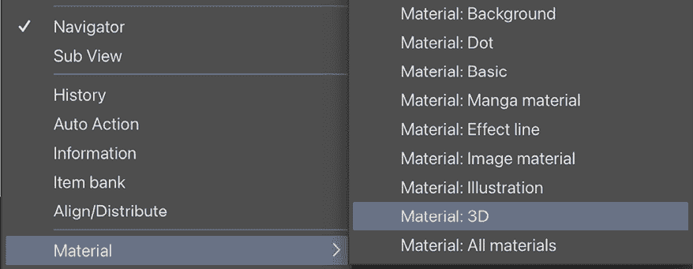

图 14.1：材质下拉菜单

现在，我们可以查看**材质**面板，看看 3D 类别的内容。以下截图显示了**材质**面板：

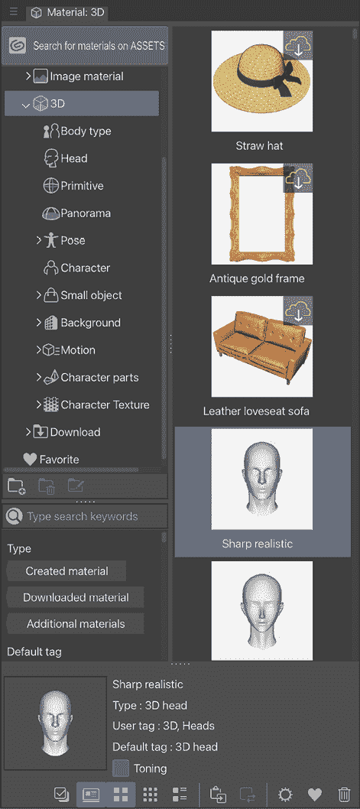

图 14.2：材质面板中的 3D 材质

在材料调板的左侧是一个材料的不同类别及其子类别的列表。这些类别组织我们的材料资产库，并允许我们快速找到特定的材料。当前选定的类别将以蓝色突出显示其名称。任何旁边带有箭头符号的类别名称都意味着该类别可以展开以显示其下的子类别。

有时，甚至子类别也有更深的子类别，如*图 14.2*中**姿势**子类别旁边所示。

材料调板的右侧显示了库中带有图像的材料的列表。当前选定的材料将围绕它有一个蓝色突出显示。当前选择的详细信息显示在材料调板的底部部分。

**提示**

如果列表中的材料在预览图像的右上角有一个带有向下箭头的云图标，这意味着在使用之前必须从 Clip Studio Assets 下载该材料。这些资产通常对您免费，但它们会增加 Clip Studio 在您的硬盘上所需的存储空间！

太好了，你在**材料**调板中找到了各种各样的 3D 资产！让我们继续学习如何将它们粘贴到你的画布上。

# 将 3D 对象加载到画布上

现在你已经知道 Clip Studio Paint 中有许多 3D 资产可用，但你需要将它们导入到画布上才能开始工作！在本节中，我们将学习如何从材料调板将那些 3D 资产导入到您的画布上，以便您可以开始移动或操作它们。

按照以下简单步骤将 3D 资产添加到画布：

1.  打开一个新的画布，如果还没有打开的话。材料资产只能添加到当前已打开的文档中。

1.  在 3D 材料调板中，点击要添加到画布的 3D 资产。在这个例子中，我们使用的是**3D 绘画人物-Ver.2（男性）**资产。

1.  一旦选择了材料，点击材料调板底部的**将选定的材料粘贴到画布**图标，它看起来像右边的截图：

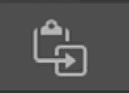

图 14.3：将选定的材料粘贴到画布图标

1.  该资产将被粘贴到画布上。请注意，根据您的计算机规格和 3D 资产，这可能需要几分钟才能完成。

在前面的步骤中选择的 3D 图形如下所示：

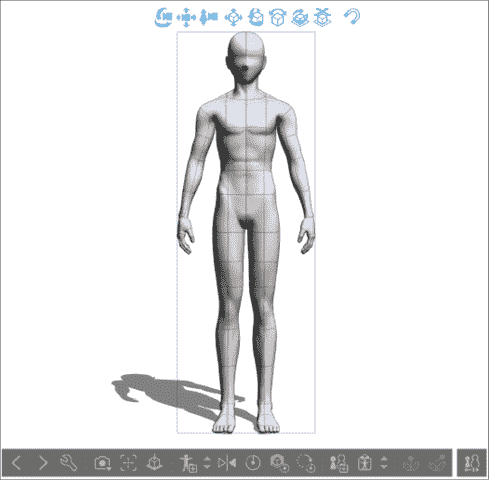

图 14.4：粘贴的 3D 材料

如您所见，这是一个相当不错的 3D 绘画娃娃，可以作为一个相当好的参考！但这个姿势有点太静态了，我们需要移动四肢来给这个参考姿势增添一些个性和活力。让我们移动这个 3D 图形和摄像机。

# 在 3D 空间中移动对象

现在我们已经学会了如何将 3D 对象添加到我们的画布上，我们可以在画布上移动和摆姿势。在 Clip Studio Paint 中学习如何摆姿势 3D 角色需要时间、练习和耐心，但一旦你掌握了 3D 空间的基础知识，你将很快成为专家！

在“沿 x、y 和 z 轴移动对象”、“移动模型的部分”、“移动 3D 相机”、“在图模型上使用预设姿势”和“自定义角色”部分中，从*图 14.5*到*图 14.25*的屏幕截图显示了**School girl B-Ver. 3** 3D 角色模型。此模型可通过 3D 角色材料和 Clip Studio Assets 免费下载。有关如何使用 Clip Studio Assets 下载资产的信息，请参阅*第十八章*，“探索 Clip Studio Assets 和动画”。

3D 对象现在就站在那里，以默认的角度。让我们在下一节学习如何移动它，以适应您在场景中希望的位置！

## 在 x、y、z 轴上移动对象

要将您的 3D 资产放置在画布上正确的场景位置，您可能需要在*x*、*y*或*z*轴上移动或旋转它。这适用于 3D 人物、对象或任何可以在 Clip Studio Paint 中使用的 3D 背景。按照以下说明学习如何通过 3D 空间移动对象：

1.  在继续之前，请确保已选择**操作** | **对象**工具。

1.  如果未选中，请点击您希望操作的 3D 对象。将出现一个围绕 3D 对象边缘的框，并且也会在对象上方和下方出现一个图标命令栏。我们将使用顶部的图标在空间中移动对象。

1.  要将整个对象向上、向下、向左或向右移动，将鼠标光标悬停在所选对象周围的框顶部左边的第四个图标上。点击画布，按住左鼠标按钮或笔刷，并将其拖动到所需的方向移动对象。右侧的屏幕截图显示了用于移动对象向上、向下、向左或向右的图标位置。它以深蓝色突出显示：

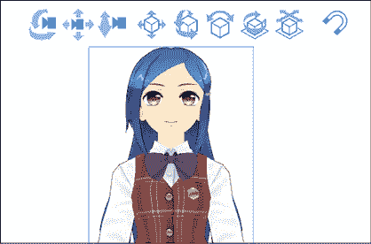

图 14.5：粘贴的 3D 材料和图标

1.  要沿*x*轴（水平轴）和*y*轴（垂直轴）旋转对象，将鼠标光标悬停在所选对象周围的框顶部从左数第五个图标上。

1.  点击并按住左鼠标按钮或笔刷，并拖动。对象将沿*x*或*y*轴直接旋转，或对角线旋转到两个轴，如图下所示：

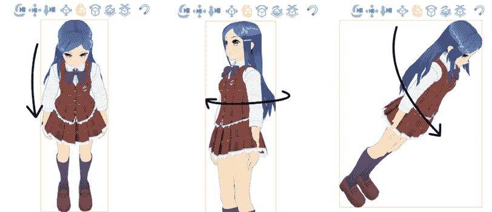

图 14.6：旋转的 3D 材料

要顺时针和逆时针倾斜对象，点击从左数第六个图标，点击对象，并将其拖动到右侧或左侧，如图下所示。注意在*图 14.7*中，她的头发随着运动和重力一起移动。

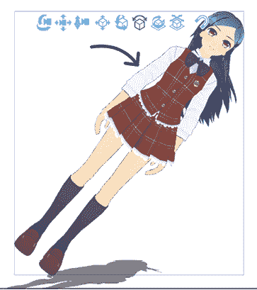

图 14.7：倾斜的 3D 材料

1.  要简单地旋转对象，点击从左数第七个图标，然后点击对象，然后将其拖动到右侧或左侧，如图所示：

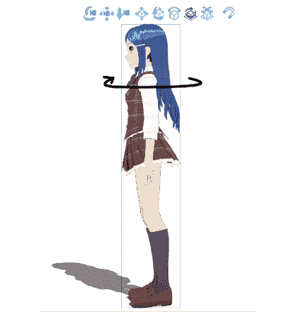

图 14.8：旋转的 3D 材质

1.  要在 3D 空间中前后移动对象，点击选中对象周围框顶部的从左数第三个图标。点击并按住鼠标左键或笔，然后上下拖动。图标在*图 14.9*中显示，以深蓝色突出显示，角色已经向后移动，远离相机。

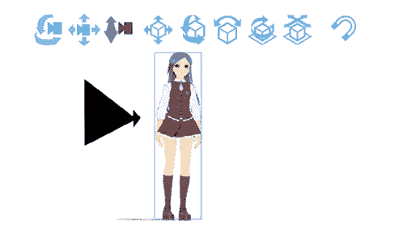

图 14.9：后退的 3D 材质

也有一种简单的方法可以移动对象，那就是使用操作球。当有其他移动对象的方法时总是最好的，因为你可以选择你觉得最适合你的方法。继续阅读以了解操作球是什么以及它是如何工作的！

## 使用操作球移动对象

操作球是一组具有三个轴（*x*、*y*和*z*）的圆圈，并且与相机缩放方向一起，你可以自由地在这些轴之间切换。你可以通过使用操作球应用我们之前章节中完成的所有编辑，你可能会发现它更容易。如果你点击对象，球体将如图所示：

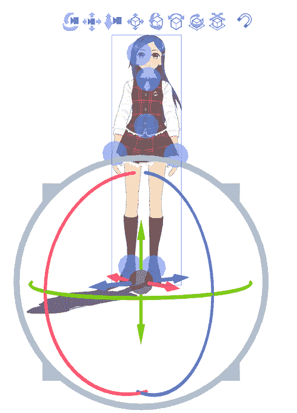

图 14.10：3D 编辑球

一旦操作球可见，你可以用它以下列方式调整对象：

1.  确保取消选中框顶部的任何图标。在画布上的任何位置点击并按住，然后自由地沿着你想要对象旋转的方向拖动鼠标或笔。

1.  如果你想让对象离相机更近或更远，点击并按住最外层的刺状圆圈，然后沿着内（更远）或外（更近）方向拖动。除了对应于运动方向的轴之外的所有轴都会自动关闭，如图所示 – 从左到右，垂直旋转、倾斜、水平旋转和相机距离：

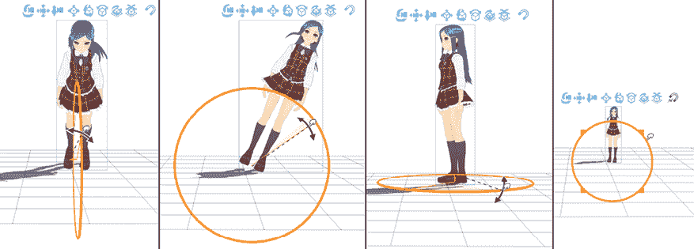

图 14.11：3D 编辑的四个方向

你可以在拖动 3D 角色时观看她的头发和裙子被动画化以显示运动。

但角色不是太静态和没有生气吗？你可以通过阅读下一节了解如何改变她的姿势。

## 移动模型的部分

一些模型，如人物和角色，以及某些对象模型，可以移动它们的个别部分。在本节中，我们将继续使用**School Girl B**模型，并移动她的手臂，作为如何摆姿势的例子：

1.  使用**对象**子工具，点击你想要摆姿势的模型。一旦模型被选中，运动控制将显示出来。在右侧的屏幕截图中，蓝色圆圈是身体主要关节的运动手柄。

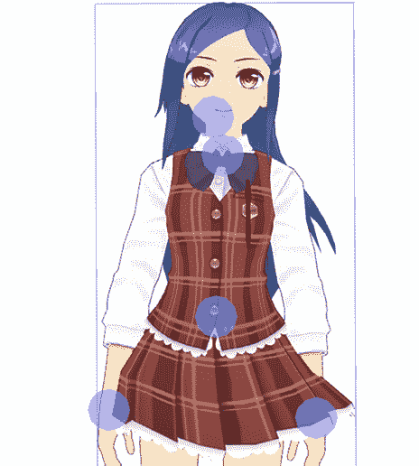

图 14.12：运动手柄

1.  点击您想要移动的身体部位的运动控制手柄。在按住鼠标按钮或触控笔的同时，拖动控制手柄以移动该部分的模型。

1.  当选择控制手柄时，一个由红、绿、蓝线条组成的球体也将可见。这个控制允许您更精细地访问模型某一部分在 *x*、*y* 和 *z* 轴上的运动。只需单击并按住鼠标按钮或触控笔在对应于您想要移动模型某一部分的轴的球体线条上，然后拖动以完成运动。

使用动作控制手柄，可以快速为角色摆姿势！右侧的截图仅通过点击和拖动手柄在几秒钟内就完成了。右脚轻微的旋转是通过使用轴控制线实现的。

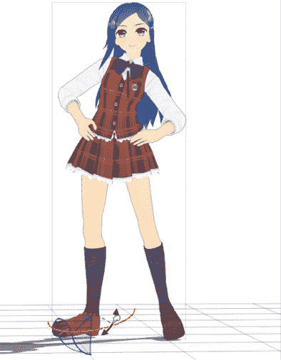

图 14.13：编辑后的 3D 对象

使用新的姿势，角色看起来生动活泼，显得更加自然！

**提示**

您可以将一个或多个 3D 对象附加到主角色上并一起移动它们。在相同的画布上粘贴另一个 3D 对象，然后在**工具属性**面板中，点击右下角的扳手形状图标以打开**子工具详细**面板。在对象列表中找到您刚刚下载的对象名称，然后单击并拖动它到另一个主对象上，以创建具有子对象的层级结构，如图右侧的截图所示。现在您可以一起移动它们了！

如果您以后需要将它们分开，只需单击并拖动子对象的名称使其从层级结构中分离出来。

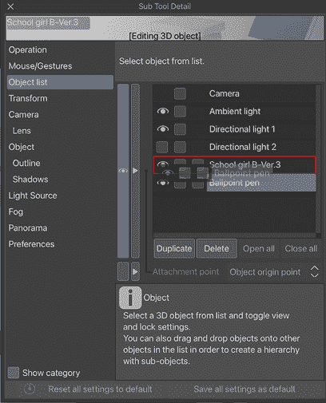

图 14.14：子工具详细面板上的对象列表类别

您还可以编辑手势。继续阅读以了解如何操作。

## 摆动手部姿势

您可以通过点击每个手指关节或使用**子工具详细**菜单来调整手指来为角色摆姿势。让我们快速看一下**子工具详细**菜单中的手控制，因为它比通过单个手指关节摆姿势要快得多！

按照以下步骤更改手部姿势：

1.  点击您想要摆姿势的角色的一只手。

1.  在**工具属性**面板中，点击右下角的扳手形状图标以打开**子工具详细**面板。

1.  在**子工具详细**面板左侧的菜单中选择**手部姿势**，在**角色**类别下。右侧将出现屏幕。

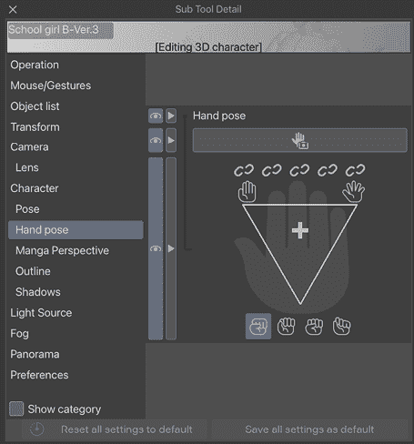

图 14.15：子工具详细面板上的手部姿势设置

1.  通过在手指图标上叠加的三角形形状内移动十字准星图标，可以使模型的手指张开得很远或靠得很近，也可以打开或合拢成拳头。

1.  在*图 14.15*中截图的大手图标上方，有五个看起来像链式链接的图标。点击其中一个将相应的手指锁定在当前位置，同时允许其他手指继续摆姿势。

真正理解这些手部控制的最佳方式是亲自尝试并感受它们！所以，试试看，看看你是否喜欢它们。

您还可以拍摄您自己的手部照片，并将手部姿势应用到 3D 对象上。按照以下步骤使用手部扫描仪：

1.  在**子工具详细**调色板中**手部姿势**类别下的相机图标上点击，以打开**手部扫描仪**窗口。

1.  一旦窗口打开，您将看到相机功能已激活，3D 手部在实时对应于相机中您的手部姿势。您可以在以下截图中看到一个示例：

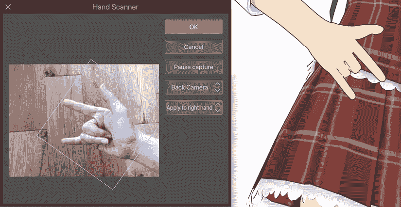

图 14.16：手部扫描仪窗口和 3D 人物

1.  您可以选择**后置相机**、**后置相机（镜像）**、**前置相机**和**前置相机（镜像）**来拍摄手部照片。此外，还有一个选项用于将手部姿势应用到 3D 人物的手的哪一侧。当您摆出理想的姿势时，点击**暂停捕获**以查看它如何应用到人物身上。

1.  您可以重复第 3 步，直到您决定理想的姿势。当您做出决定后，点击**确定**以完成手部姿势的设置。

哇，创建理想的手部姿势是多么容易和快捷！

您不仅可以在 Clip Studio Paint 中移动 3D 对象，还可以移动 3D 相机。让我们在下一节中探索如何做到这一点。

## 移动 3D 相机

3D 相机是另一种说法，即我们从什么角度观看 3D 对象或场景。我们不是移动 3D 角色或对象，而是可以移动我们观看模型的位置。

当您在对象周围移动相机时，对象模型将保持静止。按照以下说明移动 3D 相机：

1.  要移动相机向上、向下、向左或向右，请点击所选对象周围框顶部的从左数第二个图标。点击并按住鼠标左键或笔刷并拖动。所选图标在右侧截图中以深蓝色显示：

    ![图片 B22275_14_14.17.png]

    图 14.17：3D 相机图标

1.  要围绕对象旋转相机，请点击所选对象周围框顶部的从左数第一个图标。点击并按住鼠标左键或笔刷并拖动。图标和相机旋转在以下截图中显示：

![图片 B22275_14_14.18.png]

图 14.18：3D 相机图标 2

1.  要在 3D 空间中前后移动相机，请点击所选对象周围框顶部的从左数第三个图标。

按住鼠标左键或触控笔并向上或向下拖动。以下截图显示图标已被选中。请注意，如果您将相机非常靠近 3D 角色，角色将显示得非常大，最终会超出画布：

![img/B22275_14_14.19.png]

图 14.19：3D 相机图标 3

## 添加透视

我们可以为我们的 3D 人物添加极端透视！有时，我们需要强调透视来创建戏剧性的场景，例如角色向相机打拳。

我们可以通过改变相机的**透视**值来实现这一点。让我们尝试以下步骤来学习如何操作：

1.  使用**对象**子工具，单击模型，然后创建一个模型的手在脸部前面的姿态。

1.  前往**子工具详细**调板，并在**相机**类别中增加**透视**的值。你应该得到一个类似于以下截图的结果：

![img/B22275_14_14.20.png]

图 14.20：人体上的透视设置

1.  调整值以获得所需的透视量。现在您可以将它应用到您精彩的打拳场景中，如右边的截图所示：

![img/B22275_14_14.21.png]

图 14.21：参考透视人物的样本艺术

除了打拳姿态外，我们还可以使用这种方法从地板水平向上看一个物理上巨大的角色。享受控制您 3D 模型的透视吧。

**提示**

在摆姿势时旋转相机以检查肢体的位置是否准确。请参阅本章的**模型移动部分**部分以获取摆姿势的说明。

您可以使用图标、操纵器球和**子工具详细**调板来编辑姿态和相机角度。但使用预设姿态，跳过所有麻烦，不是更方便吗？让我们看看如何找到并使用它们！

# 在人体模型上使用预设姿态

在您的创作中，有许多预设姿态可供使用。我们将探讨如何找到并将它们应用到 3D 人物或角色上。

材料调板的**3D**部分包括许多子类别。其中之一是一个包含预先制作姿态的整个库，您可以将这些姿态拖放到角色模型或通用男或女人体模型上。使用这些姿态是快速将角色或人体参考姿态化的好方法。您可能需要调整一两个姿态以使其完美无缺。但许多这些姿态本身效果很好，或者可以作为创建自己姿态的绝佳起点。作为额外的好处，它们也非常容易使用！

按照以下步骤了解如何操作：

1.  在**材料**调板的**3D**类别中，找到**姿态**类别，通过单击类别左侧的箭头将其展开。然后，单击**全身**子类别。

1.  选择要添加到角色中的姿态。在这个例子中，我们使用了一个名为**手托下巴 01**的姿态。

1.  一旦点击了所需姿态，它将以蓝色突出显示。

1.  再次点击姿态并按住鼠标按钮或笔。在按住按钮的同时，将鼠标光标拖动到角色或模型模型顶部。当你处于正确位置时，光标旁边将显示一个**+**符号。

1.  在角色上释放鼠标按钮或笔。如果你画布上只有一个 3D 角色，只需点击**材料**调色板底部的剪刀形状的**在画布上粘贴所选材料**图标。姿态将自动更改为所选预设姿态，如图右边的截图所示：

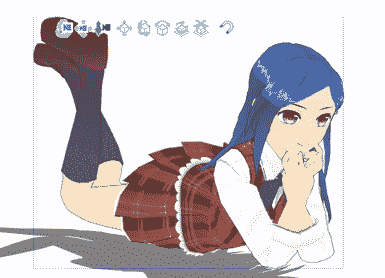

图 14.22：预设姿态的角色

我们还可以编辑我们刚刚应用的自定义姿态，使它们看起来更有趣。

你知道你可以从图像、照片和 Posemaniacs 网站上导入姿态吗？姿态扫描仪读取包含角色的图像并将姿态应用到 3D 角色或 3D 角色上。它可以读取包括 BMP、JPEG、PNG、TIFF 和 Targa 在内的各种图像格式。如果你使用的是平板电脑，你可以用相机拍照并将其应用到你的 3D 角色上。

首先，让我们看看如何从图片或照片中导入姿态：

1.  在**文件**菜单中，点击**文件** | **导入** | **姿态扫描仪** **(图像) (技术预览)…** 在 Windows/macOS 上，或者点击**文件** | **导入** | **姿态扫描仪 (图像) (照片库)** 在平板电脑上，如图下所示：

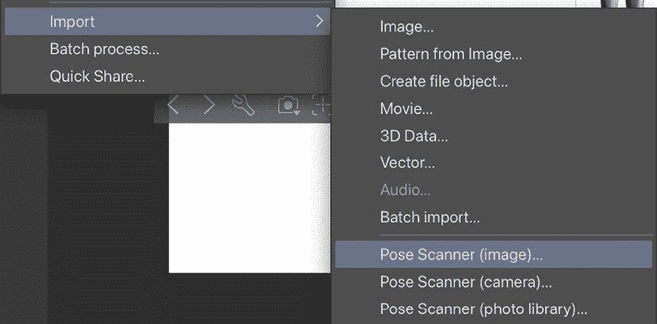

图 14.23：姿态扫描仪选项

1.  这将弹出一个对话框，你需要确认你是否愿意使用互联网连接来使用此功能。如果你不想再次看到此对话框，请勾选小方框。如果你没有问题，点击**确定**以打开**打开**窗口。

1.  在**打开**窗口中，导航到你的电脑上保存你想要图片或照片的位置。点击文件，然后点击**打开**。

1.  3D 数据的应用可能需要片刻时间。一旦应用成功，你就可以像平常一样调整和旋转相机围绕它。

如果你已经在电脑上有参考图像，应用你想要的姿态将非常简单！

即使你没有姿态参考图像，也不要担心。你总是可以拍下自己的姿态照片并将其导入电脑。如果你在平板电脑上使用 Clip Studio Paint，这会更容易：只需点击**文件** | **导入** | **姿态扫描仪** **(相机)…**，然后拍下自己或他人的姿态照片。点击**使用照片**将照片应用到你的 3D 角色上，或点击**重拍**重新拍照。

当你需要理解肌肉的姿态时，你还可以从 Posemaniacs 网站上的众多列表中导入有用的姿态。按照以下步骤了解如何操作：

1.  在**文件**菜单中，点击**文件** | **导入** | **3D 姿势** **(Posemaniacs**)。或者，你可以通过点击位于 3D 人物下方命令栏上带有人类图标剪贴板旁边的上下箭头三角形来访问 Posemaniacs 网站，显示下拉选项，然后点击**3D 姿势 (Posemaniacs**)，如右图所示：

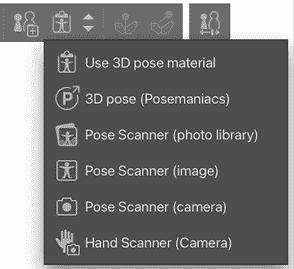

图 14.24：命令栏上的姿势扫描器选项

1.  在确认对话框中点击“**是**”，你将跳转到 Posemaniacs 网站。在那里，你会看到大量的姿势样本！当你决定了一个，点击姿势的缩略图，然后你将在图像下方看到 Clip Studio **打开**按钮，如以下截图所示：

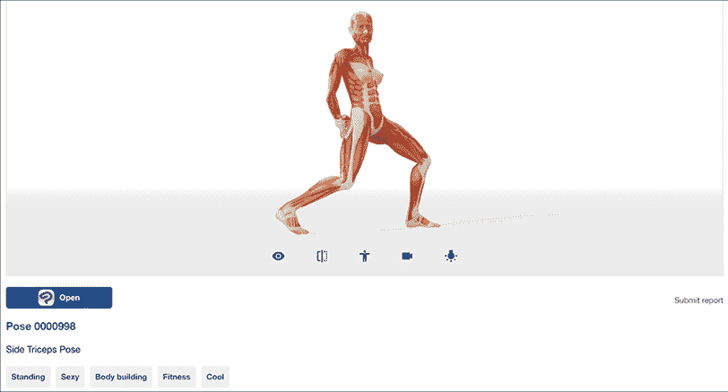

图 14.25：Posemaniacs 网站上的姿势视图页面

1.  点击**打开**按钮将弹出一个对话框以确认连接到 Clip Studio Paint。再次点击**打开**图标以启动 Clip Studio Paint。

1.  将 3D 数据应用到人物模型可能需要一点时间。一旦应用成功，你就可以像平常一样调整和旋转相机。

1.  通过参考它将姿势应用到你的绘画中。

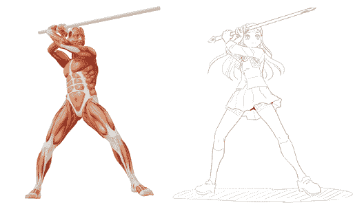

图 14.26：姿势模型和艺术

从图像、相机和 Posemaniacs 导入姿势是一个节省时间的好方法，尤其是在你需要有传统姿势，如射箭、骑马姿势和剑术套路时。

使用预设姿势并导入最合适的姿势既简单又方便吗？你还可以在将它们应用到画布后编辑它们。继续阅读以了解如何操作。

# 定制角色和人物模型

Clip Studio Paint 允许定制其 3D 库中附带的人物模型和通用人物模型。人物模型可以改变其表情、发型、服装和配饰，而通用人物模型可以改变其比例。让我们来看看如何改变 3D 模型的比例，以及如何更改和调整头部模型。

## 定制人物模型

通用男性和女性绘画模型没有可更改的配饰和服装。然而，它们的头部和身体类型可以被调整，以更准确地反映你正在绘制的角色。

在本节中，我们将了解如何调整身体和头部绘画人物模型的比例。按照以下步骤学习：

1.  按照上一节“**介绍 3D 材质面板**”中的说明，将男性绘画人物模型加载到画布上。

1.  在命令栏中，在选定的 3D 模型下方，点击最右侧的图标，标签为**详细调整 3D 绘图模型的身体形状和大小**。这将打开 3D 模型的**子工具详情**面板，如下面的屏幕截图所示：

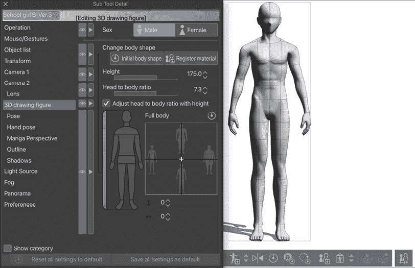

图 14.27：改变身体形状子工具详情面板

1.  在以下**子工具详情**面板的屏幕截图中，全身体型图像右侧有一个分为四个更小方块的方形菜单。通过将白色的**+**图标拖动到四个方块的中央，我们可以通过混合如瘦、肌肉发达和肥胖等属性来改变模型的尺寸比例。此菜单下方的**高度**和**头身比**滑块也可以用来调整模型：

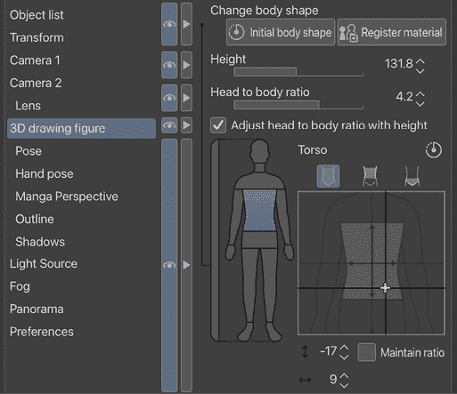

图 14.28：调整腰身形状

1.  要调整模型特定部分的身高和宽度，请在**子工具详情**面板中点击全身体型的相应部分。在先前的屏幕截图中，正在调整的是躯干部分。

1.  根据需要调整模型的任何部分，以实现绘图人物所需的视觉效果，并检查它在画布上的变化。然后，关闭**子工具详情**窗口。

右侧的屏幕显示了一个受**奇比**动漫角色启发的比例图模型！

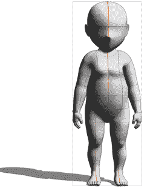

图 14.29：调整后的身体形状

通过使用此选项调整身体形状和大小，您可以拥有各种身体形状的参考！

现在，让我们看看如何自定义头部模型：

1.  按照上一节**介绍 3D 材质面板**中的说明，将 3D 头部模型加载到画布上。

1.  在命令栏中，在选定的 3D 模型下方，点击扳手图标。这将打开 3D 模型的**子工具详情**面板，如下面的屏幕截图所示：

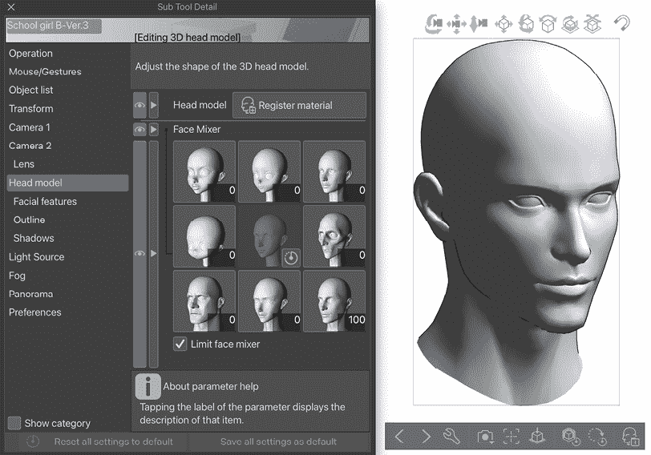

图 14.30：编辑 3D 头部模型子工具详情面板

1.  在**子工具详情**面板中**头部模型**设置右侧的屏幕截图中，显示了各种头部模型。您可以使用滑块将画布上的头部模型与列表中的任何模型混合。只需在列表中点击您想要混合的头部模型，然后移动出现在缩略图旁边的滑块。

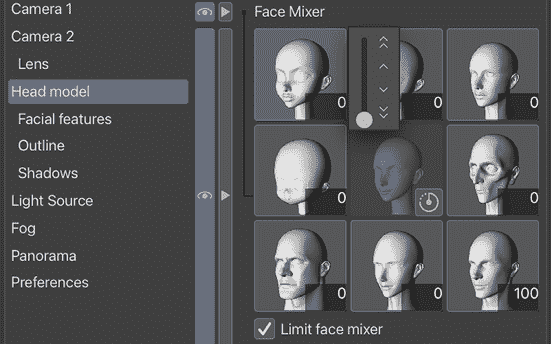

图 14.31：头部模型设置

1.  要手动自定义面部特征，请在**子工具详情**面板的**头部模型**子类别中选择**面部特征**设置。点击面部图型的相应部分。在右侧的屏幕截图中，**眼睛**是当前正在调整的面部部分：

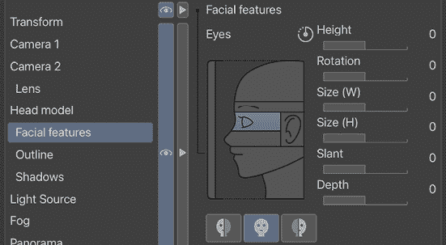

图 14.32：面部特征设置

1.  根据需要调整模型的任何部分以达到绘图角色的期望外观，检查它在画布上的变化。然后，关闭**子工具详情**窗口。

你现在已经掌握了如何自定义 3D 绘图角色的身体和头部！

在下一节中，我们将把我们的自定义模型保存到材质面板，以便我们以后可以再次使用它。

# 将 3D 信息保存到材质面板

你投入了大量精力去调整角色的身体形状、大小和头部，如果丢失这些数据，那就太可惜了，尤其是如果你希望将其用于在漫画中多次出现的角色。因此，了解如何保存它们总是好的。让我们在本节中找出如何做到这一点。

可以将两种 3D 信息保存到 3D 材质面板：姿态信息和 3D 绘图角色。姿态信息可以从通用男性和女性角色以及角色模型中保存。3D 绘图角色（比例和面部特征）信息只能从通用男性和女性绘图角色中保存。目前，无法将角色图标的更改保存为自定义材质。

## 保存姿态信息

当你自定义角色或物体的姿态时，总是保存它们是一个好主意，以防将来你想再次使用相同的姿态，这样你就不需要一遍又一遍地重复相同的自定义过程。

按照以下步骤将角色的姿态信息保存到材质面板：

1.  点击你想要保存姿态的角色或绘图角色。

1.  在图下的命令栏中，找到**将姿态注册到材质面板**图标，它看起来就像右边的截图所示。

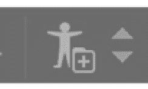

图 14.33：将姿态注册到材质面板图标

1.  点击图标以打开**材质属性**窗口。你还可以通过点击人形图标旁边的上下三角形来打开材质属性（参见*图 14.33*），然后从下拉菜单中选择你想要的选项：**将全身姿态注册为材质**、**将左手姿态注册为材质**或**将右手姿态注册为材质**。然后，相应的**材质属性**屏幕将打开，如下面的截图所示：

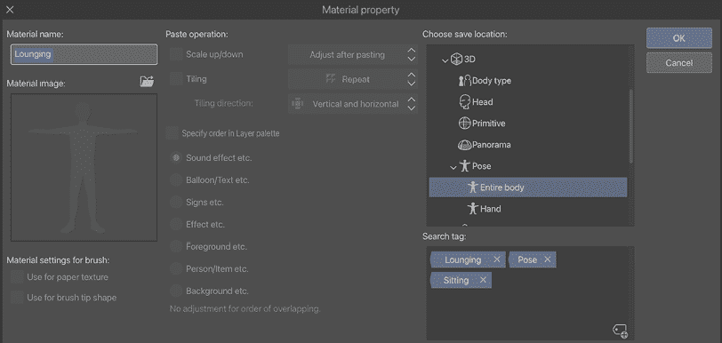

图 14.34：材质属性窗口

1.  在**材质名称**下，为你的姿态输入一个吸引人的名称。

1.  在**保存材质的位置**部分，浏览到**3D** | **姿态** | **全身**文件夹，并将其选为保存全身姿态材质的位置。

1.  点击**搜索标签**窗口右下角的图标以打开标签输入框。输入标签文本并按*Enter*键。然后，再次点击图标以添加另一个标签。

1.  一旦你完成了姿态的命名和标记，点击**确定**按钮以完成保存姿态信息。

**提示**

我总是建议将你保存到素材面板的每一份材料都进行标记。这是一个额外的步骤，但长远来看可能会节省你很多时间！除了用描述材料的术语标记它们之外，我总是为保存到素材面板的任何内容使用一个自定义标签，这样我就可以输入这个搜索词并找到我保存的所有内容。

现在，你可以在任何角色或角色上使用这些姿势信息！有关使用预设姿势的说明，请参阅本章“在角色模型上使用预设姿势”部分。

让我们继续看看如何保存 3D 绘图角色信息。

## 保存 3D 绘图角色信息

这些说明允许你保存你在本章“自定义模型”部分中可能做出的任何对通用男性和女性绘图比例的更改。按照以下步骤将自定义比例保存到素材面板：

1.  点击你想要保存的绘图角色。

1.  在角色下方的命令栏中，找到**将 3D 绘图角色注册到素材面板**图标，它看起来像左边的图标；如果你在头部模型上保存面部特征，你需要右边的图标，如右边的截图所示。

图 14.35：将 3D 绘图角色注册到素材面板图标

1.  点击**将 3D 绘图角色注册到素材面板**图标以弹出**材料属性**屏幕，如下截图所示：

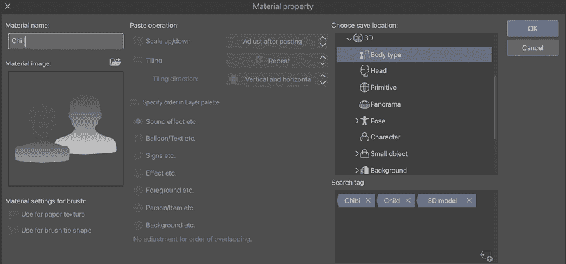

图 14.36：材料属性屏幕

1.  在**材料名称**下，为你的角色输入一个独特的名称。

1.  在**选择保存位置**部分，浏览到**3D** | **体型**文件夹，并将其作为保存体型材料的保存位置选择，以及**3D** | **头部**文件夹用于面部特征。

1.  点击**搜索标签**区域右下角的图标，以弹出用于输入标签的文本框。输入一个标签并按*Enter*键。然后，再次点击图标以添加另一个标签。

1.  在完成命名和标记你的角色后，点击**确定**按钮以完成保存信息。

通过收集喜欢的姿势或角色形象，你可以在制作漫画时节省大量宝贵的时间。

你知道你也可以从其他程序导入 3D 模型吗？继续阅读以了解如何操作！

# 将 3D 模型导入到 Clip Studio Paint

使用素材面板中的 3D 资产是很好，但如果你要从另一个程序导入一个独特的模型怎么办？在本节中，我们将探讨如何做到这一点，以及如何将其转换为线条图作为最终修饰。但是，过度使用此功能也有缺点，因为角色可能会看起来过于人工化和通用——记住不要过度使用这个工具，并把它作为一个创建你独特艺术风格的基本模板是很好的。

虽然 Clip Studio Paint 可以从其他程序导入 3D 信息，但有一些限制。例如，有时，来自外部来源的模型的颜色和纹理信息可能无法正确导入 Clip Studio Paint。

**重要提示**

可以导入到 Clip Studio Paint 的文件类型包括 Clip Studio 3D 角色格式（扩展名**cs3c**）、Clip Studio 3D 对象格式（扩展名**cs3o**）、Clip Studio 3D 背景格式（扩展名**cs3s**）以及**fbx**、**6kt**、**6kh**、**lwo**、**lws**、**obj**和**VRM**文件。

按照以下步骤将 3D 信息导入到 Clip Studio Paint：

1.  在**文件**菜单中，点击**文件** | **导入** | **3D 数据...**，如图下所示：

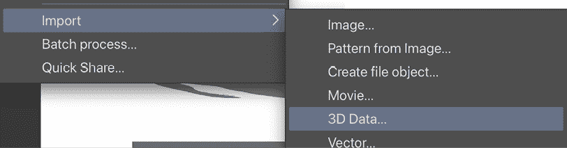

图 14.37：导入下拉菜单

1.  在**打开**窗口中，导航到您计算机上存储 3D 数据文件的文件夹位置。点击您要选择的文件，然后点击**打开**。

1.  3D 数据在文件中显示可能需要一点时间。一旦显示，您就可以像平常一样定位它并绕它旋转相机。

一旦导入 3D 模型，您就可以将其转换为线稿。如果您有 EX 版本，可以通过将图像转换为线条和色调来实现。在*第三章*，*铅笔：图层和图层属性面板*中了解更多关于转换的信息。要访问转换菜单，在**文件**菜单中点击**图层**，然后点击**转换为线条和色调**以打开**转换为线条和色调**的设置菜单。右边的截图显示了在应用了转换默认设置后，我们的好朋友**学校女孩 B**的样子：

图 14.38：图像转换为线条和色调

没有 EX 版本？您可以使用**转换层**选项将 3D 角色转换为线稿！

要这样做，在**文件**菜单中点击**图层**，然后点击**转换层…**以打开**转换层**窗口，并在**类型**下拉菜单中选择**矢量层**。然后点击**矢量设置…**以打开**矢量层转换**窗口，如图下所示：

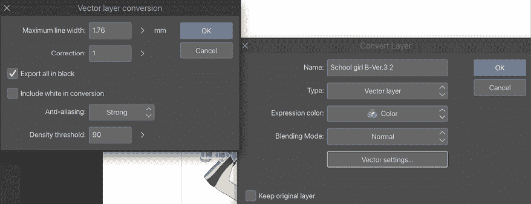

图 14.39：转换层窗口和矢量层转换窗口

对于这个功能，恐怕没有预览功能，但您可以通过更改设置并点击**确定**来尝试多次，以获得正确的外观。转换后的包含提取的线稿的矢量层，如图下所示：

图 14.40：3D 角色转换为矢量层

或者，你只需在**文件**菜单中点击**图层**，然后点击**转换图层…**来打开**转换图层**窗口，在**类型**下拉菜单中选择**光栅图层**，在**表达式颜色**中选择**单色**，然后点击**确定**。你将拥有一个包含黑白绘制的光栅图层，如下面的截图所示：

图 14.41：转换为光栅图层的 3D 角色

使用这张图片，添加你的纹理和细节，或者甚至自定义它以避免过于通用。在右边的示例中，我给我的最终图像添加了我的个人风格。

图 14.42：使用转换后的图像制作的样本艺术

我们可以看到这个角色的更多独特纹理、细节、动作、个性和态度。

当然，你可以将 3D 角色和人物仅作为你自己的角色的姿态参考。你可以找到自己使用该功能的方法！

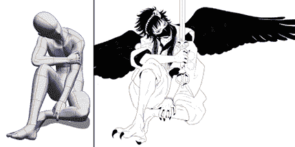

图 14.43：3D 角色及其基于它的绘画

哇，现在你可以控制 3D 对象来改变姿态、形状和摄像机角度了！而且你甚至已经掌握了如何加载、保存、导入，最后将 3D 对象转换为线稿的方法！

# 摘要

本章带我们深入第三维度，使我们熟悉了材质调色板中可用的 3D 资产。我们学习了如何将 3D 资产添加到我们的画布上，以及如何在 3D 空间中移动它们。我们还学习了如何旋转和移动我们的摄像机，以获得对 3D 模型的不同视角。我们还学习了如何使用材质调色板中保存的姿态、图片或照片参考、Posemaniacs 网站上的参考以及摄像机中的参考，以及如何自定义随附的角色模型。然后，我们学习了如何将我们自己的 3D 信息保存为以后可以使用的材质。最后，我们学习了如何从其他 3D 应用程序导入模型，以及如何使用**转换为线条和色调**和**转换为图层**选项将这些模型转换为线稿。

这些技巧将帮助你在每次出现在你的漫画页面上时，都能以一致的方式绘制角色和物体。它们还将扩展你的视觉表达范围、摄像机位置和角色姿态。

现在，我们将开始学习给你的漫画上色！在下一章中，我们将首先讨论在 Clip Studio Paint 中制作不同颜色调色板的不同方法，以及如何使用吸管和**子视图**调色板来选择颜色。

# 加入我们的 Discord 群组！

与其他用户一起阅读这本书。提出问题，为其他读者提供解决方案，等等。

扫描 QR 码或访问链接以加入社区。

[`packt.link/clipstudiopaint`](https://packt.link/clipstudiopaint)

